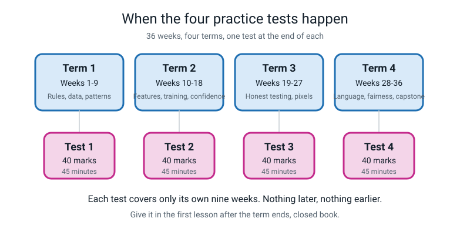

# ✅ Assessments — How To Use The Four Term Tests

[⬅ Course home](../README.md) · [Term 1](term-1-test.md) · [Term 2](term-2-test.md) · [Term 3](term-3-test.md) · [Term 4](term-4-test.md) · [Projects](../projects/project-ideas.md)

---

> ### In one sentence
>
> **These four papers are mirrors, not verdicts — their whole job is to show you which week did not
> stick, in time to do something about it.**

---

## 🧑‍🏫 For the teacher, in ninety seconds

You do not need to know any AI to run or mark these tests.

1. There are **four papers**, one per nine-week term. Each is **45 minutes** and **40 marks**.
2. Each paper only tests **its own nine weeks**. Term 3 never asks about Week 6.
3. Every paper has the same shape: 15 multiple choice, 6 short answer, 2 figure questions, 1 written
   question.
4. Every paper carries its own **marking scheme** and a **full answer key** at the bottom, inside
   collapsible `<details>` blocks. The key explains why each wrong option was tempting, so you can
   answer "but why isn't it (c)?" without preparation.
5. The written question is marked with a **4-level rubric**, and each paper includes a model
   level-4 answer so you can see the ceiling.

That is everything. If you read nothing else on this page, read the box below.

> **⚠️ Watch out:** these are **practice** tests. They are not entrance exams and nothing is gated on
> them. A student who scores 22 and then goes back and redoes Week 20 has had a better term than one who
> scores 36 and closes the folder. Say that out loud before the first paper, and mean it.

---

## 📅 When to give each one



*Figure A.1 — Each test covers only its own nine weeks. Give it in the first lesson after the term ends.*

| Test | Covers | Give it | Why then |
|---|---|---|---|
| [**Term 1**](term-1-test.md) | Weeks 1–9 | The lesson after Week 9 | Week 9 is already a checkpoint week, so the paper lands on top of a review rather than cold |
| [**Term 2**](term-2-test.md) | Weeks 10–18 | The lesson after Week 18 | Week 18 is the sabotage lab; the paper checks whether the *why* survived the fun |
| [**Term 3**](term-3-test.md) | Weeks 19–27 | The lesson after Week 27 | This is the arithmetic-heavy paper, and it must be sat before the capstone build starts |
| [**Term 4**](term-4-test.md) | Weeks 28–36 | Any time in Week 36, **before** the showcase | Week 36 already schedules a paper. Use this one, or use it as a dress rehearsal for the bigger 60-mark paper in [assessment.md](../../assessment.md) |

**Two scheduling notes that matter:**

- **The paper always comes before the applause.** In Week 36, sit the paper *before* the showcase. A
  student who has just been clapped at by two adults will not mark themselves honestly. That is not a
  character flaw, it is just how people work, so design around it.
- **Do not give a test in the same sitting as a lab.** These weeks already run 60–75 minutes. A
  45-minute paper needs its own slot, or the first 45 minutes of a lesson with nothing else in it.

---

## 🕐 Running the test — the whole procedure

```
   BEFORE (5 minutes)
   □  Print the question sections only: Section A, B, C, D.
      Do NOT print the Marking Scheme or the Answer Key.
   □  Check the two figures in Section C printed legibly. They carry marks.
   □  Put out: pencil, pen, eraser, ruler, one sheet of rough paper, a calculator.
   □  Take away: the student guide, the workbook, the glossary, notes, phone.

   DURING (45 minutes)
   □  Read the "WHAT IS ALLOWED" box out loud, once.
   □  Say the two sentences that earn students the most marks:
         "Write every division down."
         "If you guess, write 'not sure' beside it."
   □  Set a timer where the student can see it.
   □  Then say nothing. Do not hint. Do not translate a question.
      If asked what a word means, say: "answer the bit you do understand."
   □  Call 10 minutes remaining, once.

   AFTER (20 minutes, and it is the important part)
   □  Mark Section A together, out loud, question by question.
   □  For every wrong answer, open the <details> block and read WHY the
      chosen option was wrong. This is where the learning happens.
   □  Mark B, C and D against the marking scheme.
   □  Fill in the remediation table at the bottom of this page.
   □  Agree ONE week to revisit. One. Not five.
```

> **💡 Try this:** mark the paper **with** the student, not for them. Reading the answer key aloud
> together turns a 20-minute marking chore into the single best-value 20 minutes of the term. A student
> who has to say *"I picked (a) because I thought accuracy was total ÷ correct"* has just fixed it
> themselves.

---

## 🧮 How to mark it

### Section A — 15 marks

One mark per question, no half marks, two letters circled scores zero. Use the table at the top of each
paper's Marking Scheme; it lists the answer and the week for all fifteen.

Then do the thing that actually matters: **count the "not sure" notes.** A right answer marked "not
sure" is a lucky guess, and a lucky guess is a hole that walks into the next term with you. Treat those
questions as if they were wrong when you fill in the remediation table.

### Section B — 12 marks

Two marks per question, and each paper's marking scheme splits them explicitly — usually **1 mark for
the answer, 1 mark for the reason.** Three habits worth adopting:

| Habit | Why |
|---|---|
| **Mark the idea, not the wording.** | An 11-year-old writing "the machine only knows the words you gave it" has earned the mark that the glossary would have phrased as "a model can only answer with a class you gave it". |
| **Refuse to give the arithmetic mark without visible arithmetic.** | Half the marks in Sections B and C exist to make the working visible. `75%` is a claim. `27 ÷ 36 = 0.75 = 75%` is evidence. This is the one place to be strict. |
| **Require the units on a gap.** | `24 percentage points` earns the mark; `24%` does not. This is deliberately harsh, because adults misread this constantly and the habit is easiest to build now. |

### Section C — 8 marks

Four marks per figure question, one per part. The parts are independent — a student can get (a) wrong
and still earn (b), (c) and (d). Mark each part on its own.

### Section D — 5 marks

Do **not** count points. Read the whole answer, decide which of the four levels it best fits, then
convert:

| Level | Marks | What it means |
|---|:--:|---|
| **4 · Exceptional** | 5 | Could be handed to the adult in the scenario unchanged |
| **3 · Proficient** | 4 | A paragraph a stranger could follow, with the main idea correct |
| **2 · Developing** | 2–3 | The right instincts, no mechanism |
| **1 · Beginning** | 1 | A fragment, or a feeling with no reasoning |
| — | 0 | Nothing usable |

A level 3 does **not** require every rubric row at level 3. Take the best overall fit. A student who
nails one row brilliantly and misses another is a 3, not a 2.

---

## 📊 What the scores mean

Each paper is out of 40. Same bands on all four.

| Score | Band | What it actually means | What to do next |
|:--:|---|---|---|
| **0–15** | 🔴 Not yet | The core ideas of the term have not landed. Almost always the *projects* were skipped, not the reading | Redo the term's two or three **hands-on weeks** — the labs and the projects, not the chapters. Then retake Sections B and C only |
| **16–23** | 🟠 Vocabulary yes, reasoning not yet | Can name things; cannot yet use them on a new case. Section A is fine and Sections C and D are thin | Use the remediation table below. Pick the **two** weakest weeks and redo their workbook pages. Then retake Section C and D only |
| **24–31** | 🟢 Solid | The term worked. There will be one or two specific holes and they will be visible in the table below | Fix the one weakest week. Carry on |
| **32–40** | 🔵 Could teach it | Genuinely strong, including the written question | Carry on, and take a stretch direction from [project-ideas.md](../projects/project-ideas.md) |

> **The number is not the result. What happens next is the result.** A **19** that turns into *"I'm
> redoing the Week 20 accuracy project this weekend"* is a better term than a **34** that turns into
> nothing at all.

**One more reading of the same numbers, which is often more useful than the total:**

```
   Section A high, Sections C+D low   →  learned the words, not the thinking.
                                        Fix: more worked examples, fewer definitions.

   Section A low, Sections C+D high   →  thinks well, has not learned the names.
                                        Fix: the vocabulary boxes. This is the
                                        easier problem, and much rarer.

   Arithmetic marks lost everywhere   →  not a maths problem; a WORKING problem.
                                        Fix: one rule — never write an answer
                                        without the division above it.
```

---

## 🔧 The remediation table

Find the question they lost the mark on. Revisit that week. **One week at a time.**

### Term 1 — Weeks 1–9

| Lost the mark on | The idea | Revisit | Do this specifically |
|---|---|---|---|
| A1, A2, A3, B1 | Judgement; the two-people test | **Week 1** | Redo the three-bin sorting mat with 8 new machines |
| A4, A5, B2 | Nobody writes the rule; examples and labels | **Week 2** | Rewrite five "magic" sentences honestly, out loud |
| A6, A7 | Narrow AI; confidence is not correctness | **Week 3** | Play Quick, Draw! and log five confident wrong answers |
| A8, A9, B3(a) | Rows, columns, headers, row unit | **Week 4** | Take one messy pile and turn it into a table with a named row unit |
| A10, A11, B3(b), **C1** | The four kinds of mess | **Week 5** | Run all four checks on the student's own 30-row table again |
| A12, B4 | Sample vs population; what data cannot prove | **Week 6** | Rewrite the 7-line data card, then write 3 things it does not prove |
| A13, B5 | Conditions, thresholds, who chose the number | **Week 7** | Sharpen five vague rules into testable conditions |
| A14, B6, **D1** | Edge cases, stand-ins, false alarms and misses | **Week 8** | The 138 cm exercise, written out both ways |
| A15, **C2** | Training vs fresh examples; honest accuracy | **Week 9** | Re-score the spam rulebook on 5 genuinely fresh messages |

### Term 2 — Weeks 10–18

| Lost the mark on | The idea | Revisit | Do this specifically |
|---|---|---|---|
| A1, A2, B1 | Rule explosion; doubling | **Week 10** | Redo the paper-folding activity and write the 2ⁿ table to 10 |
| A3, A4, A5, B2 | Features, labels, classes, measuring instructions | **Week 11** | Hand one measuring instruction to another person and compare numbers |
| A6, A7, B3, **C1**, **D1** | Baselines and leaky features | **Week 12** | The six-scenario leak hunt, again, out loud |
| A8, A9, B4 | Classification vs regression; bucketing | **Week 13** | Flip all ten task cards both directions |
| B5 | Feature decks; the elimination hunt | **Week 14** | Test the 20-card deck on a second, different person |
| A10, A11 | What training is; variety | **Week 15** | Re-shoot one class with the full variety checklist and count the conditions |
| A12, A13, **C2** | Confidence, margin, confidence policies | **Week 16** | Compute the margin on eight readouts, then rewrite the policy |
| A14 | You fix a model by changing the data | **Week 17** | Retrain with the bad class re-shot, and compare |
| A15, B6 | Controlled experiments; sabotage tests | **Week 18** | The 5-row experiment table, changing exactly one thing per row |

### Term 3 — Weeks 19–27

| Lost the mark on | The idea | Revisit | Do this specifically |
|---|---|---|---|
| A1, A2, B1 | Hold out **before** training; split ratios | **Week 19** | The index-card and envelope exercise, physically |
| A3, A4, B2, B3(a), **C1(a)(b)** | Accuracy three ways; per-class accuracy | **Week 20** | Five accuracy problems with every division written out |
| A5, A6, B3(b), **C1(c)** | Memorizing vs generalizing; confusion matrices | **Week 21** | Draw a confusion matrix by hand from somebody else's score sheet |
| A7, **C1(d)**, **D1** | Scoring honestly and reporting honestly | **Week 22** | Re-score the hidden ten and write the 3-sentence verdict |
| A8, A9, **C2(a)(b)** | Pixels as numbers; resolution | **Week 23** | Convert a fresh 12×12 drawing to numbers and hand it to somebody |
| A10, A11, B4 | RGB; downsampling and what it destroys | **Week 24** | Shrink 12×12 → 6×6 → 3×3 and list what was lost at each step |
| A12, A13, B5, **C2(c)(d)** | Filters, absolute value, clipping, output = input − 2 | **Week 25** | Compute six filter cells by hand, three lines of working each |
| A14 | Why edges survive a lighting change | **Week 26** | The two-lamp comparison, with both number sets side by side |
| A15, B6 | Tokens and the six rules | **Week 27** | Tokenize a 60-word paragraph from a real book |

### Term 4 — Weeks 28–36

| Lost the mark on | The idea | Revisit | Do this specifically |
|---|---|---|---|
| A1, A2, A3, B1, **C1(a)(b)(d)** | Bigrams; next-word tables | **Week 28** | Build a fresh next-word table from a 60-word corpus |
| A4, A5, A6, B2, **C1(c)** | Greedy vs sampling; hallucination | **Week 29** | Generate three sentences with fixed dice rolls and find the falseness |
| A7, B3 | Loud failure vs silent failure | **Week 30** | Break the Scratch bot and the bigram generator, and compare how each failed |
| A8, A9, B4, **C2** | Bias; accuracy gaps; percentage points | **Week 31** | Compute all four divisions in the 48-photo audit, longhand |
| A10, A11, A12, B5, **D1** | Personal data; re-identification; metadata; over-trust | **Week 32** | Audit one real product's data map with the five questions |
| A13, **D1** | Misinformation vs disinformation; the warning sign | **Week 33** | Rewrite the "DO NOT USE THIS FOR…" sign with a measured number in it |
| A15 | Baselines; the honest paperwork | **Week 34** | Recompute the baseline for the student's own class counts |
| A14, B6, **C2(d)** | Confidence thresholds; `other` vs "not sure" | **Week 35** | Add a threshold to the Scratch app and demo the "not sure" case |
| Section D overall | Explaining it to a real adult | **Week 36** | Deliver the 5-minute demo to somebody who has never seen it |

---

## 🪞 A one-page record sheet

Photocopy this, one per test. Filling it in takes four minutes and is worth more than the score.

```
   ┌───────────────────────────────────────────────────────────────────────┐
   │  TERM ____ TEST  ·  date __________                                   │
   │                                                                       │
   │  Section A  ____ / 15      "not sure" notes:  ____                    │
   │  Section B  ____ / 12                                                 │
   │  Section C  ____ /  8                                                 │
   │  Section D  ____ /  5      level awarded:  1  2  3  4                 │
   │  ────────────────────                                                 │
   │  TOTAL      ____ / 40      band:  🔴  🟠  🟢  🔵                        │
   │                                                                       │
   │  THE THREE QUESTIONS I GOT WRONG THAT ANNOYED ME MOST                 │
   │     1. Q____   because ______________________________________         │
   │     2. Q____   because ______________________________________         │
   │     3. Q____   because ______________________________________         │
   │                                                                       │
   │  THE ONE WEEK I AM GOING BACK TO:  Week ____                          │
   │  WHAT I WILL ACTUALLY DO:  _________________________________          │
   │  BY WHEN:  __________                                                 │
   │                                                                       │
   │  One thing I could explain to an adult today that I could not          │
   │  explain nine weeks ago:                                              │
   │     ________________________________________________________          │
   └───────────────────────────────────────────────────────────────────────┘
```

---

## ⚠️ Six mistakes teachers make with these papers

| Mistake | Why it happens | Do this instead |
|---|---|---|
| Marking it alone and handing back a number | It is faster, and it feels like proper marking | Mark Section A out loud together. The `<details>` blocks are written to be read aloud |
| Hinting during the test | An 11-year-old looking stuck is genuinely hard to watch | Say once: *"answer the part you do understand"*, then go quiet. A stuck question is data |
| Treating a low score as a verdict | Scores look like verdicts. That is what scores are for, elsewhere | Every band in the table above ends in an **instruction**. Read the instruction, not the number |
| Reteaching all nine weeks | It feels thorough | Pick **one** week. Nine weeks of revision means nothing gets fixed |
| Reteaching by re-reading the chapter | It is the least effort | The remediation table names an **activity** for every row. Redo the activity. The reading was never the problem |
| Skipping Section D because it is slow to mark | It is 5 marks and takes ten minutes to read properly | Section D is the only part that looks like real life. If you must cut something, cut Section A and keep D |

---

## ❓ Questions a teacher actually asks

<details>
<summary><b>"I don't understand the AI in one of the questions myself. What do I do?"</b></summary>

Open the answer key for that question. Every single one is written for an adult who has never studied
this, and every distractor is explained. There is no question on any of the four papers whose key
assumes prior knowledge.

If you want a second explanation in different words, the week's teacher-guide file has the same idea
with a worked example and an analogy. `teacher-guide/week-20.md` for accuracy, `week-31.md` for bias, and
so on.
</details>

<details>
<summary><b>"Can they use the glossary?"</b></summary>

No, and here is the reason to give them: *a hole you can look up is still a hole.* The whole purpose of
these papers is to find out what is actually in their head before Level 2 assumes it is there.

Afterwards, absolutely — the glossary is exactly the right thing to read while marking.
</details>

<details>
<summary><b>"They got the right answer with completely different reasoning. Mark or no mark?"</b></summary>

Mark it, and write their reasoning in the margin. This happens most often on Section D, and a student
who reaches a defensible conclusion by a route the rubric did not anticipate has done something better
than matching a model answer.

The one exception is arithmetic: a correct final number reached by wrong working does not earn the
working mark, because the working mark exists specifically to make the reasoning visible.
</details>

<details>
<summary><b>"How do these relate to the big 60-mark paper in assessment.md?"</b></summary>

[`assessment.md`](../../assessment.md) is the **whole-level** paper: 20 multiple choice, 8 short answer,
4 applied/debug questions, 60 marks, about 90 minutes, drawn from all nine original modules. It is the
one used on Showcase Day in Week 36.

These four are smaller, term-sized, and 45 minutes each. Use them as you go. Use the big one at the end.
Doing both is not duplication — the term tests find holes early enough to fix, and the big one checks
whether the whole year holds together.
</details>

<details>
<summary><b>"What if they want to retake one?"</b></summary>

Let them, with one condition: they must do the remediation activity first, and they must say which week
they went back to. A retake after work is worth taking. A retake straight away just measures memory of
the paper.

Retake Sections **C and D only** if the first attempt showed Section A was fine. There is no point
re-answering fifteen multiple-choice questions they already know.
</details>

<details>
<summary><b>"Do I have to print the figures in colour?"</b></summary>

No. Every figure in this course was designed to survive a black-and-white school printer — the palette
was checked in greyscale, and no figure ever uses colour as the only way to tell two things apart.
There is always a shape, a number, or a label doing the same job.

Check one thing after printing: that the numbers inside the confusion matrix and the pixel grid are
legible. Those numbers carry marks.
</details>

---

## 🔑 The Six Things This Page Is Really Saying

- **Four papers, one per term, 45 minutes and 40 marks each.** Nothing to prepare.
- **The answer key explains every wrong option**, so you can teach from the marking, not just score it.
- **Mark it out loud, together.** That twenty minutes is the highest-value time in the term.
- **A gap is measured in percentage points, and every division gets written down.** Be strict about
  exactly these two things and generous about wording everywhere else.
- **Pick one week to revisit, and redo the activity, not the reading.**
- **The score is a mirror. What happens next is the result.**

---

[⬅ Course home](../README.md) · [Term 1](term-1-test.md) · [Term 2](term-2-test.md) · [Term 3](term-3-test.md) · [Term 4](term-4-test.md) · [Project ideas ➡](../projects/project-ideas.md)
