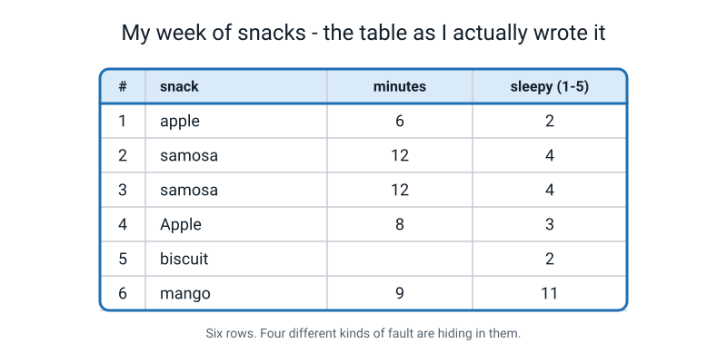
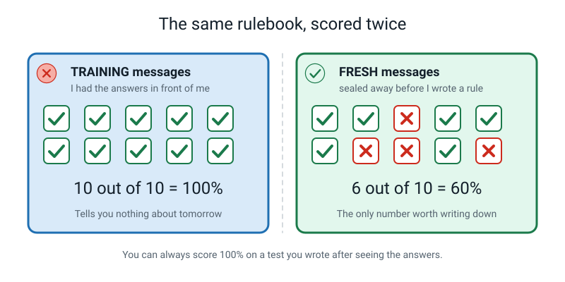

# 📝 Term 1 Practice Test — Weeks 1–9

[⬅ Assessments home](README.md) · [Course home](../README.md) · [Term 2 test ➡](term-2-test.md)

---

```
   ┌──────────────────────────────────────────────────────────────────────┐
   │                                                                      │
   │   AI ACADEMY · LEVEL 1 EXPLORER                                      │
   │   TERM 1 PRACTICE TEST — Rules, Data and Patterns                    │
   │   Covers Weeks 1–9. Nothing later appears anywhere on this paper.    │
   │                                                                      │
   │   TIME ALLOWED   45 minutes                                          │
   │   TOTAL MARKS    40                                                  │
   │                                                                      │
   │   Section A   15 multiple choice      1 mark each     15 marks       │
   │   Section B    6 short answer         2 marks each    12 marks       │
   │   Section C    2 figure questions     4 marks each     8 marks       │
   │   Section D    1 written question     5 marks          5 marks       │
   │                                                                      │
   │   INSTRUCTIONS                                                       │
   │   · Write in pencil or pen. Answer every question.                   │
   │   · Section A: circle ONE letter. A guess costs nothing.             │
   │   · If you guess, write "not sure" beside it. This matters even      │
   │     when the guess turns out right.                                  │
   │   · Sections B, C and D: full sentences. Marks are for reasons,      │
   │     not for the right word on its own.                               │
   │   · Any time you divide, WRITE THE DIVISION DOWN. "60%" on its own   │
   │     scores less than "6 out of 10 = 60%".                            │
   │                                                                      │
   │   WHAT IS ALLOWED                                                    │
   │   ✅  Pencil, pen, eraser, ruler                                     │
   │   ✅  One blank sheet of rough paper                                 │
   │   ✅  A calculator — but the division must still be written out      │
   │   ❌  The student guide, the workbook, the glossary, your notes      │
   │   ❌  A phone, a search engine, a chatbot, another person            │
   │                                                                      │
   └──────────────────────────────────────────────────────────────────────┘
```

> **🧑‍🏫 Teacher, read this once before you hand the paper out.** You do not need to know any AI to run
> this test. Set a timer for 45 minutes. Read the "what is allowed" box out loud. Then say nothing
> until the timer goes. The full answer key with reasons is at the bottom of this file — students
> must not see that page. Marking guidance is in [assessments/README.md](README.md).

---

# 🅰️ Section A — Multiple Choice

*15 questions · 1 mark each · circle ONE letter · the week each question comes from is in brackets*

---

**A1.** [W1] Which of these is the best definition of **artificial intelligence**?

- (a) A computer that thinks like a human brain
- (b) Getting a machine to do a job that used to need a person's judgement
- (c) Any robot that can move around on its own
- (d) A program that is very complicated

---

**A2.** [W1] Which job needs **judgement**?

- (a) Adding 47 and 88
- (b) Sorting 200 numbers from smallest to largest
- (c) Deciding whether a photo is too blurry to keep
- (d) Ringing a bell at 3:30 pm every day

---

**A3.** [W1] Which of these is **doing AI but has no body at all**?

- (a) A spam filter deciding which texts to hide
- (b) A microwave timer
- (c) A calculator app
- (d) A factory arm that repeats the same weld 1,000 times a day

---

**A4.** [W2] In machine learning, who writes the **labels** on the training examples, and when?

- (a) The machine writes them, after training
- (b) Nobody writes them — labels are worked out automatically
- (c) The machine writes them, during training
- (d) A person writes them, before training

---

**A5.** [W2] Training a machine learning system takes labelled examples in. What comes **out**?

- (a) A rulebook a human can read line by line
- (b) A model — a guessing machine you can put new things into
- (c) A copy of all the examples, stored for later
- (d) A percentage score and nothing else

---

**A6.** [W3] What does it mean to say almost all AI today is **narrow**?

- (a) It can do exactly one job and is blank outside it
- (b) It runs on small devices like phones
- (c) It is only used by a narrow group of companies
- (d) It only works on small amounts of data

---

**A7.** [W3] A photo app says **"cat, 96%"**. What does the 96% actually tell you?

- (a) There is a 96% chance the answer is right
- (b) The app has been right 96 times out of 100 in the past
- (c) How strongly the model prefers *cat* over the other answers it could give
- (d) 96% of the photo is filled by the cat

---

**A8.** [W4] In a data table, **one row** is…

- (a) one measurement
- (b) one example — one single thing you observed
- (c) one column name
- (d) one day of the week

---

**A9.** [W4] Which statement about the **header** of a table is true?

- (a) Every row needs its own header
- (b) The header stores the answers you want to predict
- (c) The header is the first piece of data
- (d) The header names the columns and is **not** data

---

**A10.** [W5] In a table of sleep hours, one cell is **blank** and another says **0**. What is the difference?

- (a) There is no difference — both mean zero hours
- (b) Blank means zero; 0 means the row is broken
- (c) Blank means "I don't know"; 0 means "I know, and it was zero"
- (d) Blank means the value is secret; 0 means it is public

---

**A11.** [W5] A `snack` column contains `apple`, `Apple`, `APPLE` and `aple`. Which kind of mess is this?

- (a) An inconsistent category, fixable with a controlled vocabulary
- (b) A missing value
- (c) A duplicate row
- (d) An impossible value

---

**A12.** [W6] You measured 30 of your own meals. What is the **population** here?

- (a) The 30 meals you wrote down
- (b) All the meals eaten by everybody you would like your answer to be true about
- (c) The number of people in your family
- (d) The 5 columns in your table

---

**A13.** [W7] In the rule *"IF minutes\_eating is under 8 THEN sleepy = no"*, what is the **threshold**?

- (a) `under`
- (b) `minutes_eating`
- (c) `sleepy = no`
- (d) `8`

---

**A14.** [W8] A metal detector at an airport beeps at a belt buckle. In the two-mistake language of Week 8, that is…

- (a) a false alarm
- (b) an impossible value
- (c) a default
- (d) a miss

---

**A15.** [W9] You wrote 5 spam rules by studying 10 messages, then scored the rules on those same 10 messages and got 10 out of 10. Why is that number close to worthless?

- (a) Because spam rules can never be tested
- (b) Because 10 messages is not enough to test anything
- (c) Because you fitted the rules to those exact messages, so of course they fit — the score says nothing about new messages
- (d) Because accuracy should always be written as a decimal

---

# 🅱️ Section B — Short Answer

*6 questions · 2 marks each · answer in full sentences*

---

**B1.** [W1] For each job below, say **yes** or **no** to *"could two sensible people disagree about the answer?"* — and therefore whether it needs judgement.

| Job | Could two sensible people disagree? | Needs judgement? |
|---|---|---|
| Working out change from ₹100 | | |
| Deciding which video to show you next | | |

*(1 mark per row, both columns must agree with each other.)*

---

**B2.** [W2] Rewrite this sentence so it is **honest** instead of magical. Use the words *examples* and *label* somewhere in your answer.

> *"The app magically knows which of your photos have dogs in them."*

---

**B3.** [W4, W5] Look at these three rows of somebody's homework table.

```
   #   subject     minutes   pages
   1   maths          25       2
   2   maths          25       2
   3   science        -4       1
```

- (a) What is **one row** in this table? Finish the sentence: *"One row is one ______."*  **(1 mark)**
- (b) Name the fault in row 3 and say why it is that kind of fault.  **(1 mark)**

---

**B4.** [W6] You collected 30 rows about your own week and found that eating fast goes with feeling sleepy. Write **two** different sentences your data does **not** prove.

---

**B5.** [W7] Sharpen this vague rule into an **if-then rule** with a threshold a computer could test. Then say who chose the number in your threshold.

> *"Text me if the bus is going to be really late."*

---

**B6.** [W8] A fairground ride has a sign: **"You must be 140 cm to ride."** A child measures **138 cm**.

- (a) Describe what happens if the rule is applied strictly, and name which of the two mistakes (false alarm or miss) that could be.  **(1 mark)**
- (b) Give one reason a strict 140 cm rule is still a sensible thing for the ride owner to have.  **(1 mark)**

---

# 🅲 Section C — Look and Explain

*2 questions · 4 marks each*

---

## C1 — The table somebody actually wrote



*Figure T1.1 — Six rows of snack data, exactly as they were written down. The `sleepy` column is a 1-to-5 scale.*

There are **four different kinds of fault** hiding in this table. For each one, write the row number,
what is wrong, and the **name** of that kind of fault. **(4 marks — 1 per fault correctly named and located)**

```
   1.  Row ____ :  ____________________________  kind: ______________
   2.  Row ____ :  ____________________________  kind: ______________
   3.  Row ____ :  ____________________________  kind: ______________
   4.  Row ____ :  ____________________________  kind: ______________
```

---

## C2 — The same rulebook, scored twice



*Figure T1.2 — One spam rulebook. On the left, the messages it was written from. On the right, ten messages sealed away before any rule existed.*

- (a) Explain in one or two sentences why the **100%** on the left is not a real measurement.  **(1 mark)**
- (b) Write the right-hand score as a fraction **and** a percentage, with the division shown.  **(1 mark)**
- (c) The student now adds a sixth rule to catch one of the four messages it got wrong. Say **one thing that could go wrong** as a result.  **(1 mark)**
- (d) After adding the rule, which pile must they score on to find out if it actually helped — and what is the problem with using the same right-hand pile again?  **(1 mark)**

---

# 🅳 Section D — The Written Question

*1 question · 5 marks · about 8–10 minutes · write a paragraph, not a list*

---

**D1.** A school wants to stop arguing about lateness. They install a card reader at the gate and write
one rule:

> **IF the card is swiped after 08:45 THEN the student is marked late.**

The head teacher says: *"It's completely fair now. It's just a number. There is no opinion in it."*

Write a paragraph answering all of this:

1. Name **one edge case** — a specific student whose situation the rule handles badly.
2. Say which of the **two mistakes** (a false alarm or a miss) hurts a student here, and describe who gets hurt and how.
3. Somebody suggests moving the threshold to **08:50**. Say what that fixes and what it makes worse.
4. Finish by answering the head teacher directly: is the rule free of opinion? Give a reason.

---

---
---

# 📊 Marking Scheme

**Total: 40 marks.** Mark Section A first — it is fast, and the pattern of wrong answers tells you
where to look in Sections B–D.

## Section A — 15 marks

| Q | Answer | Mark | Week |
|:--:|:--:|:--:|:--:|
| A1 | **(b)** | 1 | W1 |
| A2 | **(c)** | 1 | W1 |
| A3 | **(a)** | 1 | W1 |
| A4 | **(d)** | 1 | W2 |
| A5 | **(b)** | 1 | W2 |
| A6 | **(a)** | 1 | W3 |
| A7 | **(c)** | 1 | W3 |
| A8 | **(b)** | 1 | W4 |
| A9 | **(d)** | 1 | W4 |
| A10 | **(c)** | 1 | W5 |
| A11 | **(a)** | 1 | W5 |
| A12 | **(b)** | 1 | W6 |
| A13 | **(d)** | 1 | W7 |
| A14 | **(a)** | 1 | W8 |
| A15 | **(c)** | 1 | W9 |

No half marks. Two letters circled scores 0.

## Section B — 12 marks

| Q | What earns the marks | Marks |
|---|---|:--:|
| **B1** | Row 1: "no" + "does not need judgement" — both, or no mark. Row 2: "yes" + "needs judgement" — both, or no mark. | 1 + 1 |
| **B2** | 1 mark for removing the magic (no "knows", "magically", "understands"). 1 mark for a mechanism that uses **examples** and **label** correctly. | 1 + 1 |
| **B3** | (a) "one row is one **homework** / one **piece of homework** / one **task**" — any wording naming a single thing, not a subject or a minute. (b) Names row 3 as an **impossible value** (−4 minutes) *and* says why it is impossible: time cannot be negative. Naming without the reason = 0. | 1 + 1 |
| **B4** | 1 mark per sentence that is genuinely outside what 30 rows about one person can show. Must be about *reach* (other people, other weeks, causes), not just "it might be wrong". | 1 + 1 |
| **B5** | 1 mark for a testable IF–THEN with a number in it. 1 mark for saying **a person chose that number** (the data gave a gap; a human turned it into a threshold). | 1 + 1 |
| **B6** | (a) The child is refused; that is a **false alarm** on "too small to ride safely" — the system said *unsafe* and the truth was *safe*. (b) Any of: one line is checkable in a second; a stand-in must be measurable; the owner cannot measure real safety, only height. | 1 + 1 |

> **🧑‍🏫 If a student argues about B6(a):** accept "miss" **only** if they have clearly re-framed the
> flag as *"flag the children who are allowed to ride"* and stated that framing in writing. The
> two-mistake language always depends on which way round the flag points, and a student who says so
> has understood more than one who just picked the right word.

## Section C — 8 marks

**C1 — 1 mark per fault, correctly located and correctly named.** Any order.

| Fault | Row | Correct name |
|---|:--:|---|
| Row 3 repeats row 2 exactly (samosa, 12, 4) | 3 | **duplicate** |
| `Apple` in row 4 vs `apple` in row 1 | 4 | **inconsistent category** (also accept *typo* / *needs a controlled vocabulary*) |
| The `minutes` box is empty | 5 | **missing value** |
| `sleepy` = 11 on a 1–5 scale | 6 | **impossible value** |

Mark the *kind* strictly, the *wording* generously. "Same row twice" earns the duplicate mark;
"it's wrong" does not.

**C2 — 4 marks, one per part.**

| Part | Mark for |
|:--:|---|
| (a) | Says the rules were built *from* those messages with the answers visible, so fitting them was the job — the score is about the past, not the future. "10 is too few" alone = 0. |
| (b) | **6 ÷ 10 = 0.6 = 60%**, with the division visible. "60%" alone = 0. |
| (c) | Any of: the new rule fires on a message that was previously right; the rulebook gets longer and harder to keep; it fixes one message and breaks another; first-match-wins means it can hide a rule below it. |
| (d) | A **new** pile of fresh messages, because the right-hand pile has now been used to make a decision, so it is used up and can no longer give an honest score. |

## Section D — 5 marks, marked with the rubric below

Award a level for the whole answer, then convert:

| Level | Marks |
|---|:--:|
| 4 · Exceptional | 5 |
| 3 · Proficient | 4 |
| 2 · Developing | 2–3 |
| 1 · Beginning | 1 |
| Nothing usable | 0 |

### D1 rubric

| | **1 · Beginning** | **2 · Developing** | **3 · Proficient** | **4 · Exceptional** |
|---|---|---|---|---|
| **Edge case** | No specific case, or only "it might be unfair" | Names a vague group ("people with buses") | Names one concrete student and the exact reason the rule mishandles them | The edge case is *at the boundary* — swiped at 08:45:30, or arrived at 08:44 but queued at the reader |
| **The two mistakes** | Neither named | Names one mistake but not who is hurt | Names false alarm **or** miss correctly, with the framing stated, and says who is hurt | Handles **both** directions: a student wrongly marked late, and a student who was late but not caught, and says the two hurt different people |
| **Moving the threshold** | Not attempted | "It would be better" with no trade-off | Says what 08:50 fixes and what it costs, with a direction | Adds that moving a threshold only helps students *near* the line, and does nothing for one whose swipe time is a bad stand-in for arriving |
| **Answering the head teacher** | Agrees, or disagrees with no reason | Says "not fair" without naming where the opinion sits | Says the number itself contains a human choice — somebody chose 08:45 | Names the **stand-in**: the card reader measures a swipe, not an arrival, and both the stand-in and the threshold were chosen by a person |
| **Writing** | One fragment | A list of words | A paragraph a stranger could follow | A paragraph that could be handed to the head teacher unchanged |

> A level 3 does **not** require all four rows at level 3 — take the best overall fit. A student who
> nails the stand-in idea and misses the threshold trade-off is still a 3.

### A model level-4 answer (about 150 words)

> The rule handles a student right on the line badly. If Priya's card reads 08:45:31 she is late, and
> if it reads 08:44:59 she is not, and nothing real changed between those two seconds. That is an
> edge case, and it is a **false alarm** — the system raises the "late" flag when the truth was that
> she arrived on time and waited behind four people at the reader. The person hurt is Priya, who gets
> a mark on her record for standing in a queue. There is a miss in the other direction too: a student
> who wanders in at 08:40, swipes, then goes back outside is on time by the rule and late in reality,
> and nobody is flagged. Moving the line to 08:50 rescues students in the 08:45-to-08:50 window and
> lets a genuinely late group through, so the school swaps one mistake for the other. So no, it is
> not free of opinion. Somebody chose 08:45, and somebody chose to measure a card swipe instead of an
> arrival. The card swipe is only a **stand-in** for being in school, and a stand-in agrees with the
> real thing in the middle and disagrees at the edges — which is exactly where the arguments were.

---

# ✅ Full Answer Key

> **🧑‍🏫 Do not photocopy this page for students until after the test is marked.** Every distractor
> is explained, because "why the wrong answer was tempting" is where the learning lives.

<details>
<summary><b>A1 — (b) · W1</b></summary>

**(b) is right.** The Week 1 definition, word for word: *getting a machine to do a job that used to
need a person's judgement.* Notice what it does not say — smart, brain, thinks.

- **(a) is wrong** because it smuggles in *thinks like a human brain*. A submarine does not swim like
  a fish, and it still crosses the ocean. AI does the job; it does not have to do it your way.
- **(c) is wrong** because *robot* is a question about **bodies** and *AI* is a question about a kind
  of **decision**. Almost all the AI in the world has no body at all.
- **(d) is wrong** because complicated is not the test. A weather simulation is enormously
  complicated and involves no judgement whatsoever.
</details>

<details>
<summary><b>A2 — (c) · W1</b></summary>

**(c) is right.** Apply the two-people test: I would keep that photo, you would bin it, and neither
of us is wrong. No single right answer, so it needs judgement.

- **(a) is wrong** — 47 + 88 is 135, and anyone who says otherwise is simply mistaken. One right
  answer means no judgement.
- **(b) is wrong** — there is exactly one correct sorted order. Sorting is *work*, not judgement.
- **(d) is wrong** — a clock does it. There is nothing to weigh up.
</details>

<details>
<summary><b>A3 — (a) · W1</b></summary>

**(a) is right.** A spam filter is deciding something two sensible people could disagree about (a
marketing text splits people down the middle), and it is pure software with no body.

- **(b) and (c) are wrong** on the AI half. A timer counts. A calculator computes. One right answer
  each time, so no judgement — and therefore no AI.
- **(d) is wrong** on the AI half: the arm has a body but repeats the identical weld. No decision, no
  judgement.
</details>

<details>
<summary><b>A4 — (d) · W2</b></summary>

**(d) is right.** A person writes the labels, and they write them **before** training. That is the
whole deal of machine learning: you supply the answers, the machine finds the rule.

- **(b) is wrong** — labelling is real, slow human work. It is most of the cost of most real AI
  projects.
- **(c) and (a) are wrong** because if the machine already knew the answers it would not need to be
  taught them. The label is the thing being taught.
</details>

<details>
<summary><b>A5 — (b) · W2</b></summary>

**(b) is right.** Training produces a **model**: put a new thing in, get a guess out.

- **(a) is wrong** — that describes a rule-based system, where a *human* wrote the steps. In machine
  learning nobody wrote them, which is exactly why a model is harder to read than a rulebook.
- **(c) is wrong** — after training the examples are put away. Only the model remains. That is why
  "show me the photographs you learned it from" is such an awkward question to ask a company.
- **(d) is wrong** — a score describes a model; it is not the model.
</details>

<details>
<summary><b>A6 — (a) · W3</b></summary>

**(a) is right.** Narrow means one job, blank one step outside it. AlphaGo beat the best human Go
player and could not play checkers — not badly, *at all*.

- **(b) is wrong** — that is about hardware. A narrow model can run in a giant data centre.
- **(c) is wrong** — narrow AI is in almost every phone on Earth.
- **(d) is wrong** — narrowness is about the range of jobs, not the size of the data. Some narrow
  systems are trained on billions of examples.
</details>

<details>
<summary><b>A7 — (c) · W3</b></summary>

**(c) is right.** A confidence score is how strongly the model **prefers** one answer over the
others it was allowed to give. It is a guess strength, not a promise.

- **(a) is wrong** and this is the single most common adult mistake in the whole course. A model can
  say 96% and be flatly wrong. Confidence is not correctness.
- **(b) is wrong** — that would be *accuracy*, measured on a test set. Nothing about this one photo
  tells you about the past hundred.
- **(d) is wrong** — the number has nothing to do with how much of the frame the cat fills.
</details>

<details>
<summary><b>A8 — (b) · W4</b></summary>

**(b) is right.** One row is one example: one thing you observed. Once you have decided your row
unit, everything else follows.

- **(a) is wrong** — one *cell* is one measurement. A row holds several.
- **(c) is wrong** — column names live in the header, above all the rows.
- **(d) is wrong** — a day *can* be your row unit, but it is not the definition. In a table of meals,
  one row is one meal.
</details>

<details>
<summary><b>A9 — (d) · W4</b></summary>

**(d) is right.** The header names the columns and is not data. Count your rows without it.

- **(a) is wrong** — one header for the whole table, at the top.
- **(b) is wrong** — the answers you want to predict live in a column *of data*, not in the header.
  The header only tells you that column's name.
- **(c) is wrong** and it is a real bug people ship: treat the header as data and your table has a
  row whose "minutes" value is the word `minutes`.
</details>

<details>
<summary><b>A10 — (c) · W5</b></summary>

**(c) is right.** A blank says *"I don't know."* A zero says *"I know, and it was zero."* They are
completely different facts and mixing them wrecks every average you compute afterwards.

- **(a) is wrong** — this is the exact confusion the question is testing. Somebody who slept 0 hours
  and somebody you forgot to ask are not the same person.
- **(b) is wrong** — it has the two the wrong way round.
- **(d) is wrong** — neither has anything to do with secrecy.
</details>

<details>
<summary><b>A11 — (a) · W5</b></summary>

**(a) is right.** Four spellings of one thing is an inconsistent category. The fix is a
**controlled vocabulary**: write down the allowed values, then make every cell match one of them.

- **(b) is wrong** — nothing is empty here. Every cell has a value.
- **(c) is wrong** — a duplicate is the same *example* written down twice. Here the rows are
  different snacks; it is the spelling that repeats.
- **(d) is wrong** — `Apple` is not impossible. Reality permits apples. It is just written four ways.
</details>

<details>
<summary><b>A12 — (b) · W6</b></summary>

**(b) is right.** The population is everything you would like your answer to be true about. The 30
meals are the **sample** — the smaller set you actually managed to measure.

- **(a) is wrong** — that is the sample, by definition.
- **(c) is wrong** — the number of people in your family is not a set of things you measured.
- **(d) is wrong** — columns are measurements, not members of a population.
</details>

<details>
<summary><b>A13 — (d) · W7</b></summary>

**(d) is right.** The threshold is the cut-off number inside the condition: **8**.

- **(a) is wrong** — `under` is the comparison. It says which side of the threshold counts, but it is
  not the number.
- **(b) is wrong** — `minutes_eating` is the *feature* the condition tests.
- **(c) is wrong** — `sleepy = no` is the **action**, the answer the rule gives.
</details>

<details>
<summary><b>A14 — (a) · W8</b></summary>

**(a) is right.** The flag is *"this person may be carrying a weapon."* The detector raised it, and
the truth was a belt buckle. It said **yes** when the truth was **no**: a false alarm.

- **(b) is wrong** — an impossible value is a data fault, like −4 minutes. This is a decision fault.
- **(c) is wrong** — a default is the answer a rulebook gives when *no* rule fires. Here a rule
  fired.
- **(d) is wrong** — a miss is the opposite: the flag stays down when it should have gone up. That is
  a real weapon walking through unbeeped.
</details>

<details>
<summary><b>A15 — (c) · W9</b></summary>

**(c) is right.** You wrote the rules while looking at those ten messages with the answers next to
them. Fitting them was the job. Of course they fit. The score is a fact about the past and says
nothing about tomorrow's messages.

- **(a) is wrong** — spam rules can absolutely be tested. You just have to hold messages back first.
- **(b) is wrong** — sample size is a separate problem. Even 10,000 messages would give you a
  meaningless score if you had written the rules from those same 10,000.
- **(d) is wrong** — the format of the number is not the issue. `10/10`, `1.0` and `100%` are all
  equally uninformative here.
</details>

<details>
<summary><b>B1 — model answer · W1</b></summary>

| Job | Could two sensible people disagree? | Needs judgement? |
|---|---|---|
| Working out change from ₹100 | **No** — one right answer | **No** |
| Deciding which video to show you next | **Yes** — it depends on you, right now | **Yes** |

**Why the second one is a "yes":** two sensible people looking at the same viewer would honestly pick
different next videos, and neither would be wrong. That is the definition of judgement.

**A trap to watch for:** a student may write "yes" for the change question because *"you could make a
mistake."* Being able to get it wrong is not the same as there being no right answer. Hard is not the
same as judgement — finding one tiny bird in a photo of a forest is hard, and there is still exactly
one right answer.
</details>

<details>
<summary><b>B2 — model answer · W2</b></summary>

> *"Somebody showed the app thousands of photos with the **label** dog or not-dog written next to each
> one. From those **examples** the program found a pattern, and now it guesses the label for photos it
> has never seen."*

Both marks: the magic is gone, and there is a mechanism naming examples and labels.

**Half-credit answers to watch for:** *"It was trained on lots of photos"* is true but does not
mention the label, and the label is the whole point — without it there is nothing to learn from.
Award 1 mark.
</details>

<details>
<summary><b>B3 — model answer · W4, W5</b></summary>

**(a)** *"One row is one piece of homework."* Also fine: *one homework task*, *one assignment*.
Not fine: *one subject* (maths appears twice), *one minute*, *one student*.

**(b)** Row 3 has **minutes = −4**, which is an **impossible value**: time spent doing something
cannot be less than zero, so reality does not permit it. Most likely somebody typed a stray minus
sign, or wrote the wrong column.

**Also true and worth mentioning if a student spots it:** rows 1 and 2 are identical, which *looks*
like a duplicate. It might not be — a student could genuinely have two 25-minute, 2-page maths
homeworks. This is why Week 5 says a duplicate is the same **example** twice, not the same **values**
twice, and why you check against your notes rather than deleting on sight. A student who says this
has earned a note in the margin saying so.
</details>

<details>
<summary><b>B4 — model answer · W6</b></summary>

Two of any of these earn both marks:

- *"It does not prove that eating fast **makes** you sleepy — they could both be caused by something
  else, like a late night."*
- *"It does not prove anything about other people. Every row is me."*
- *"It does not prove anything about a different time of year. All 30 rows are from ten days in
  September."*
- *"It does not prove anything about foods I never ate during those ten days."*

**What does not earn a mark:** *"my data might be wrong"* or *"30 rows is not many"* on their own.
Those are about quality and size. The question is about **reach** — what the sample can and cannot
speak for.
</details>

<details>
<summary><b>B5 — model answer · W7</b></summary>

> **IF** the bus's predicted arrival time is more than **7 minutes** later than the timetable,
> **THEN** send a text.

Then, for the second mark:

> *"Nobody measured the number 7. I chose it. The data showed me that delays under about five minutes
> never bothered anyone and delays over ten always did, which left a gap — and I turned the gap into
> a number."*

**Marking note:** the number matters more than the wording. *"If the bus is really late"* with no
number scores 0 for the first mark, because a computer cannot test *really*. Accept any threshold
from 3 to 20 minutes with a reason.
</details>

<details>
<summary><b>B6 — model answer · W8</b></summary>

**(a)** At 138 cm the child is refused, even though two centimetres is not a real safety difference.
With the flag pointed at *"too small to ride safely"*, the system said **yes** and the truth was
**no** — a **false alarm**. The child is hurt: they miss the ride and it feels arbitrary, because it
is.

**(b)** Any one of:

- One line is checkable in a second by a busy person with a queue behind them.
- The owner cannot measure what they actually care about — whether the harness will hold this child —
  so they use height as a **stand-in**. A stand-in has to be something you can measure.
- Having a written line means every child is refused for the same reason, instead of at the whim of
  whoever is on the gate.

**The deeper point, if the class wants it:** the stand-in agrees with the real thing in the middle
and disagrees at the edges. 95 cm and 175 cm are easy. 138 cm is exactly where the stand-in stops
working, and no threshold anywhere fixes that — you would need a different measurement, which means
a slower, more expensive gate.
</details>

<details>
<summary><b>C1 — full answer · W5</b></summary>

| # | Row | What is wrong | Kind of fault |
|:--:|:--:|---|---|
| 1 | **3** | Identical to row 2 in every column — samosa, 12 minutes, sleepy 4 | **Duplicate** |
| 2 | **4** | `Apple` with a capital A, while row 1 says `apple`. A computer counting snacks will report two different snacks | **Inconsistent category** — fix with a controlled vocabulary |
| 3 | **5** | The `minutes` cell is empty | **Missing value** |
| 4 | **6** | `sleepy` = 11 on a 1-to-5 scale | **Impossible value** |

**Why each one costs you something real:**

- The **duplicate** makes samosas look twice as common as they are, so any pattern you find about
  samosas is inflated.
- The **inconsistent category** splits one snack into two, so `apple` looks rarer than it is —
  a fault that quietly hides a pattern rather than inventing one.
- The **missing value** must not be turned into a 0. Zero minutes of eating did not happen. If you
  average the column with a 0 in it, your average is wrong and looks fine.
- The **impossible value** is the friendliest fault on the list, because it shouts. An 11 on a 1–5
  scale cannot be mistaken for real data. A *reasonable-looking* wrong number — sleepy 3 when it was
  really 5 — is far more dangerous, because nothing will ever flag it.

> **🧑‍🏫 If a student asks** whether row 3 might be a real second samosa: excellent question, and the
> honest answer is that you cannot tell from the table alone — you have to go back to your notes.
> Week 5's rule is that a duplicate is the same *example* recorded twice, not the same *values*. On
> this paper we accept "duplicate" because rows 2 and 3 match in every single column of a table whose
> row unit is one snack event, and no realistic day contains two identical 12-minute samosas logged
> as separate events. But a student who challenges it has understood the idea better than one who did
> not.
</details>

<details>
<summary><b>C2 — full answer · W9</b></summary>

**(a)** The rules were written *while looking at* those ten messages with the correct answers
attached. Fitting them was the entire job, so a perfect score is guaranteed and tells you nothing
about a message the rulebook has never seen. It is a fact about the past, not a prediction.

**(b)** **6 ÷ 10 = 0.6 = 60%.**

Write it that way round — fraction, then decimal, then percentage — so a reader can see it was ten
messages and not ten thousand.

**(c)** Any one of these earns the mark:

- The new rule may fire on a message the rulebook already got **right**, turning a correct answer
  into a wrong one. Fixing one thing broke another.
- Because it is **first match wins**, putting the new rule near the top can silence a rule below it
  that used to work.
- The rulebook is now six rules long, and every rule you add makes the next exception harder to
  handle — the beginning of rule explosion.

**(d)** They need a **new pile of fresh messages**. The right-hand pile has now been used to *decide*
something — which rule to add — so it has been used up. Score on it again and you are back to marking
your own homework: the number will look better and mean less.

> **The rule for the rest of the course:** every time you use a set of examples to make a decision,
> you spend them. Honest numbers cost fresh examples, and fresh examples cost work. That is exactly
> why people skip this step.
</details>

<details>
<summary><b>D1 — see the rubric and the model answer above · W7, W8</b></summary>

The model level-4 answer is printed in the **Marking Scheme** section above, along with the four-row
rubric. Three things separate a 4 from a 3:

1. The edge case sits **at the boundary** (08:45:31), not somewhere vaguely nearby.
2. Both mistakes are handled — the student wrongly marked late **and** the student who was really
   late and not caught — with the observation that they hurt different people.
3. The word **stand-in** appears, or the idea does: the reader measures a card swipe, and a swipe is
   not the same thing as arriving at school.

**The most common level-2 answer** says *"it's unfair because some people have bad buses."* That is
true, and it is not yet an argument — it names a group without naming the mechanism. Push for: *what
exactly does the machine measure, and what did you actually want to know?*
</details>

---

## 🔑 What This Test Was Checking

| If they lost marks in… | The idea that has not landed | Go back to |
|---|---|---|
| A1–A3, B1, D1 | Judgement, and the two-people test | **Week 1** |
| A4–A5, B2 | Nobody writes the rule; examples and labels | **Week 2** |
| A6–A7 | Narrow AI; confidence is not correctness | **Week 3** |
| A8–A9, B3(a) | Rows, columns, headers, choosing a row unit | **Week 4** |
| A10–A11, B3(b), C1 | The four kinds of mess | **Week 5** |
| A12, B4 | Sample vs population; what data does not prove | **Week 6** |
| A13, B5 | Conditions, thresholds, who chose the number | **Week 7** |
| A14, B6, D1 | Edge cases, stand-ins, false alarms and misses | **Week 8** |
| A15, C2 | Training vs fresh examples; accuracy written honestly | **Week 9** |

---

[⬅ Assessments home](README.md) · [Term 2 test ➡](term-2-test.md)
