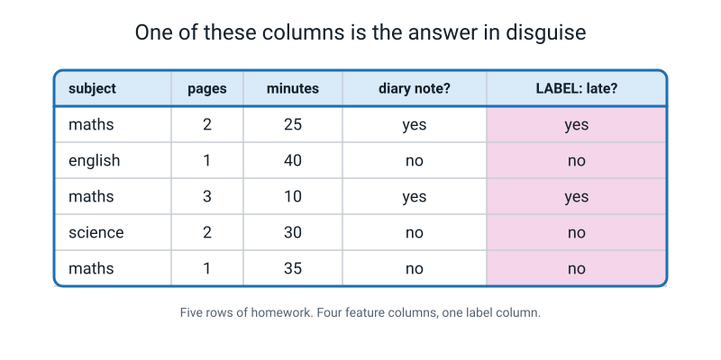
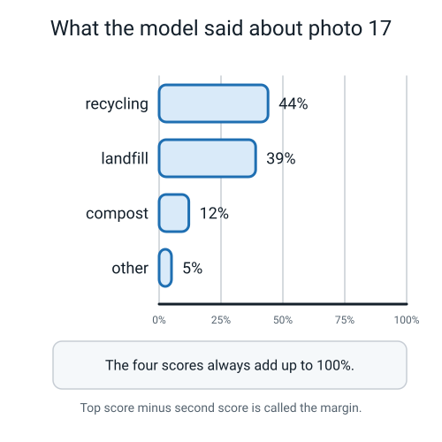

# 📝 Term 2 Practice Test — Weeks 10–18

[⬅ Assessments home](README.md) · [⬅ Term 1 test](term-1-test.md) · [Term 3 test ➡](term-3-test.md)

---

```
   ┌──────────────────────────────────────────────────────────────────────┐
   │                                                                      │
   │   AI ACADEMY · LEVEL 1 EXPLORER                                      │
   │   TERM 2 PRACTICE TEST — Features, Training and Confidence           │
   │   Covers Weeks 10–18. Nothing later appears anywhere on this paper.  │
   │                                                                      │
   │   TIME ALLOWED   45 minutes                                          │
   │   TOTAL MARKS    40                                                  │
   │                                                                      │
   │   Section A   15 multiple choice      1 mark each     15 marks       │
   │   Section B    6 short answer         2 marks each    12 marks       │
   │   Section C    2 figure questions     4 marks each     8 marks       │
   │   Section D    1 written question     5 marks          5 marks       │
   │                                                                      │
   │   INSTRUCTIONS                                                       │
   │   · Write in pencil or pen. Answer every question.                   │
   │   · Section A: circle ONE letter. A guess costs nothing.             │
   │   · If you guess, write "not sure" beside it.                        │
   │   · Any subtraction or division must be WRITTEN OUT. A margin        │
   │     answered as "5" with no working scores half of one answered      │
   │     as "44 − 39 = 5".                                                │
   │   · Sections B, C and D: full sentences. Marks are for reasons.      │
   │                                                                      │
   │   WHAT IS ALLOWED                                                    │
   │   ✅  Pencil, pen, eraser, ruler                                     │
   │   ✅  One blank sheet of rough paper                                 │
   │   ✅  A calculator — the arithmetic must still be written out        │
   │   ❌  The student guide, the workbook, the glossary, your notes      │
   │   ❌  A laptop, Teachable Machine, a phone, a chatbot, a friend      │
   │                                                                      │
   └──────────────────────────────────────────────────────────────────────┘
```

> **🧑‍🏫 Teacher, read this once before you hand the paper out.** You do not need to know any AI. Set a
> 45-minute timer, read the "what is allowed" box out loud, then say nothing. The complete answer key
> — including why every wrong option was tempting — is at the bottom of this file. Students must not
> see it until after marking.

---

# 🅰️ Section A — Multiple Choice

*15 questions · 1 mark each · circle ONE letter · the week each question comes from is in brackets*

---

**A1.** [W10] A rulebook has 10 yes/no checks in it. You add **one more** check. Roughly what happens to the number of different situations the rulebook has to cover?

- (a) It goes up by one
- (b) It goes up by ten
- (c) It doubles
- (d) It stays the same

---

**A2.** [W10] What is *the machine learning trade*, as Week 10 described it?

- (a) You stop writing the rules, and instead collect labelled examples so the machine can find the rule itself
- (b) You buy a model from a company instead of building one
- (c) You write fewer rules but make each one longer
- (d) You stop collecting data and let the machine invent its own

---

**A3.** [W11] Which of these is a **feature**?

- (a) The name of the model
- (b) The number of rows in your table
- (c) The answer you want the machine to give you
- (d) One measured description of one example — one column of your table

---

**A4.** [W11] Your model was trained on three classes: `spoon`, `fork`, `knife`. You show it a photo of a **ladle**. What can it possibly answer?

- (a) `unknown`
- (b) One of `spoon`, `fork` or `knife` — a machine can only answer with a class you gave it
- (c) Nothing at all; it will refuse
- (d) `ladle`, if the photo is clear enough

---

**A5.** [W11] How do you know whether a **measuring instruction** is good enough?

- (a) It sounds clear when you read it back
- (b) It is under 20 words long
- (c) A different person, following it, gets the same number you got
- (d) It uses a proper unit like centimetres

---

**A6.** [W12] What is a **baseline**?

- (a) The lowest score anyone in the class got
- (b) How well you would do by ignoring every feature and always guessing the most common label
- (c) The first row of your table
- (d) The accuracy you are hoping to reach

---

**A7.** [W12] You are predicting *"will this parcel be delivered late?"* Which of these is a **leaky feature**?

- (a) Whether the customer has already phoned to complain about it being late
- (b) The distance from the depot in kilometres
- (c) The weight of the parcel
- (d) The day of the week it was posted

---

**A8.** [W13] *"How many minutes will this homework take?"* is which kind of task?

- (a) Not a prediction task at all
- (b) Binary classification
- (c) Multi-class classification
- (d) Regression

---

**A9.** [W13] Turning the number **38 grams** into the category **`medium`** is called…

- (a) rounding
- (b) bucketing
- (c) labelling
- (d) leaking

---

**A10.** [W15] What happens to the training examples **after** training finishes?

- (a) They are sent to the company that made the software
- (b) They stay inside the model and can be read back out
- (c) They are put away — only the model remains
- (d) They are re-labelled by the model

---

**A11.** [W15] You take 30 photos of your water bottle without moving it, the camera, or the lamp. Roughly what have you taught the machine?

- (a) About the same as one photo would
- (b) Thirty times as much as one photo
- (c) Nothing at all — identical photos are ignored
- (d) It depends on the resolution

---

**A12.** [W16] A model outputs `dog 71%`, `cat 22%`, `fox 7%`. What is the **margin**?

- (a) 64
- (b) 93
- (c) 71
- (d) 49

---

**A13.** [W16] The confidence scores a model gives for one photo always…

- (a) go up as the model gets better
- (b) include at least one score above 50%
- (c) add up to 100%
- (d) tell you the chance that the top answer is right

---

**A14.** [W17] Your image classifier does badly on photos taken in your bedroom. What is the fix?

- (a) Change the training photos and train again
- (b) Lower the confidence threshold
- (c) Argue with the model until it changes its mind
- (d) Train for more epochs and hope

---

**A15.** [W18] What makes an experiment a **controlled experiment**?

- (a) You repeat it three times
- (b) You change exactly one thing and keep everything else the same
- (c) A teacher checks your working
- (d) You write the result down before you start

---

# 🅱️ Section B — Short Answer

*6 questions · 2 marks each · answer in full sentences*

---

**B1.** [W10] A spam rulebook has **8** yes/no checks in it.

- (a) How many different combinations of answers to those 8 checks are there? Show the working.  **(1 mark)**
- (b) In one sentence, say why this is the reason machine learning was invented.  **(1 mark)**

---

**B2.** [W11] A student writes this feature column: **`shininess`**.

Rewrite it as a proper **measuring instruction** — a sentence so exact that another person measuring
the same object would write down the same value.

---

**B3.** [W12] For each scenario, name the **leaky feature** and say why it will not exist at the moment you need a prediction.

- (a) Predicting *"will this student pass the swimming badge?"* — features are `weeks of lessons`, `age`, `can they float unaided`, `badge certificate number`.  **(1 mark)**
- (b) Predicting *"will it rain this afternoon?"* — features are `morning cloud cover`, `yesterday's rainfall`, `is my umbrella wet`, `month`.  **(1 mark)**

---

**B4.** [W13] The task is: *"Given a photo of a mango, is it unripe, ripe or over-ripe?"*

- (a) Which kind of task is this? Name it precisely.  **(1 mark)**
- (b) Rewrite the same task so that it becomes a **regression** task instead.  **(1 mark)**

---

**B5.** [W14] You made a 20-card feature deck. Your tester got **17 of 20** right. The three they got
wrong were all cards where the `weight_grams` value was between 30 and 40.

What does that pattern tell you about which feature your tester was actually using, and how do you
know?

---

**B6.** [W18] Your image classifier scores 88% on held-out photos. You suspect it is really using the
**background** rather than the object.

Describe a **sabotage test** you could run to find out. Say exactly what you would change and exactly
what you would keep the same.

---

# 🅲 Section C — Look and Explain

*2 questions · 4 marks each*

---

## C1 — The homework table



*Figure T2.1 — Five rows of homework. The tinted column on the right is the label. The teacher writes a note in the diary whenever a homework arrives late.*

- (a) One of the four feature columns is **leaky**. Name it.  **(1 mark)**
- (b) Prove it, using the Week 12 test: stand at the exact moment you need the answer, and say whether you have that value yet.  **(1 mark)**
- (c) What is the **baseline** for this table? Give the most common label and the score, with the fraction shown.  **(1 mark)**
- (d) Of the three honest features left, which one looks most likely to be **useful**, and how would you check rather than guess?  **(1 mark)**

---

## C2 — One prediction, read properly



*Figure T2.2 — The four confidence scores the bin-sorting model gave for a single photo.*

The student's written **confidence policy** is:

> *"If the top score is under 65%, **or** the margin is under 25, send the photo to a human instead of
> acting on it."*

- (a) Work out the **margin**. Show the subtraction.  **(1 mark)**
- (b) Apply the policy to photo 17. What happens to it, and which part of the policy fired?  **(1 mark)**
- (c) The student says *"there's a 44% chance it's recycling."* Correct them in one sentence.  **(1 mark)**
- (d) Give one reason why acting on `recycling` here would be a bad idea, using the margin in your answer.  **(1 mark)**

---

# 🅳 Section D — The Written Question

*1 question · 5 marks · about 8–10 minutes · write a paragraph, not a list*

---

**D1.** A school wants to build a model that predicts, at the **start** of next term, which students
will struggle with maths, so those students can be offered extra help early.

A teacher proposes five features:

| # | Feature |
|:--:|---|
| 1 | Last term's maths test score |
| 2 | Number of maths homeworks handed in late last term |
| 3 | Which primary school the student came from |
| 4 | Whether the student was put in the extra-help group after next term's test |
| 5 | Minutes of maths homework done per week last term |

The label is: **will this student score below 50% on next term's maths test — yes or no?**
Last year, **3 students out of every 10** scored below 50%.

Write a paragraph answering all of this:

1. Which feature is **leaky**? Prove it with the Week 12 test.
2. Which feature is perfectly measurable but a **bad idea** to use? Say who could be hurt and how.
3. What is the **baseline** for this task, and what does that mean the model must beat before anyone should be impressed?
4. Name **one thing** the school must do before this model is allowed to change a single student's timetable.

---

---
---

# 📊 Marking Scheme

**Total: 40 marks.**

## Section A — 15 marks

| Q | Answer | Mark | Week |
|:--:|:--:|:--:|:--:|
| A1 | **(c)** | 1 | W10 |
| A2 | **(a)** | 1 | W10 |
| A3 | **(d)** | 1 | W11 |
| A4 | **(b)** | 1 | W11 |
| A5 | **(c)** | 1 | W11 |
| A6 | **(b)** | 1 | W12 |
| A7 | **(a)** | 1 | W12 |
| A8 | **(d)** | 1 | W13 |
| A9 | **(b)** | 1 | W13 |
| A10 | **(c)** | 1 | W15 |
| A11 | **(a)** | 1 | W15 |
| A12 | **(d)** | 1 | W16 |
| A13 | **(c)** | 1 | W16 |
| A14 | **(a)** | 1 | W17 |
| A15 | **(b)** | 1 | W18 |

## Section B — 12 marks

| Q | What earns the marks | Marks |
|---|---|:--:|
| **B1** | (a) **2⁸ = 256**, with the doubling shown (2×2×2… eight times, or 2, 4, 8, 16, 32, 64, 128, 256). The number alone with no working = 0. (b) Any sentence saying the rulebook grows faster than a human can keep up, so you swap rule-writing for example-collecting. | 1 + 1 |
| **B2** | 1 mark for something genuinely measurable (a named scale, a named tool, a named comparison object). 1 mark for it being **repeatable by another person** — the instruction fixes the conditions, not just the units. | 1 + 1 |
| **B3** | (a) `badge certificate number` — it only exists once they have already passed. (b) `is my umbrella wet` — it only becomes wet after the rain. Both need the *why*, not just the name. | 1 + 1 |
| **B4** | (a) **Multi-class classification** — "classification" alone earns the mark, but "multi-class" is the precise answer and should be praised. (b) Any regression rewrite with a number as the answer: *"how many days until this mango is over-ripe?"*, *"what is its ripeness score out of 10?"* | 1 + 1 |
| **B5** | 1 mark for identifying **weight** as the feature the tester was leaning on. 1 mark for the reasoning: the errors are not scattered, they are all clustered in one narrow band of one feature, which is what it looks like when the decision is being made on that feature and the band is where the classes overlap. | 1 + 1 |
| **B6** | 1 mark for a change that isolates the background (retrain on photos of the same objects against a different or a plain background; or test the existing model on the same objects moved to a new background). 1 mark for naming what is held identical — same objects, same classes, same photo counts, same test set. | 1 + 1 |

> **🧑‍🏫 If a student's B6 answer changes two things at once** (new background *and* more photos), that
> is the single most common error in the whole term, and it deserves a specific note in the margin:
> *"if the score moves, you will not know which change did it."*

## Section C — 8 marks

**C1 — 1 mark per part.**

| Part | Mark for |
|:--:|---|
| (a) | **`diary note?`** |
| (b) | Stands at the moment of prediction — *before* the homework is handed in — and says the diary note does not exist yet, because the teacher only writes it once the homework is already late. |
| (c) | Most common label is **`no`** (3 of the 5 rows). Baseline = **3 ÷ 5 = 0.6 = 60%**, with the fraction visible. |
| (d) | Names `minutes` (or `pages`) **and** describes a check: cover the label, guess from that column alone across all five rows, count how many you get right, and compare against 60%. "It just looks useful" = 0. |

**C2 — 1 mark per part.**

| Part | Mark for |
|:--:|---|
| (a) | **44 − 39 = 5**. The subtraction must be visible. |
| (b) | Goes to a human. **Both** halves of the policy fired: 44% is under 65% **and** the margin of 5 is under 25. Full marks for spotting either one; a written note if they spot both. |
| (c) | Confidence is how strongly the model **prefers** recycling over the others — a guess strength, not a chance of being right. |
| (d) | The margin of 5 means landfill was almost exactly as preferred as recycling; a photo this close is a coin toss, and a coin toss should not decide which bin something goes in. |

## Section D — 5 marks, marked with the rubric below

| Level | Marks |
|---|:--:|
| 4 · Exceptional | 5 |
| 3 · Proficient | 4 |
| 2 · Developing | 2–3 |
| 1 · Beginning | 1 |
| Nothing usable | 0 |

### D1 rubric

| | **1 · Beginning** | **2 · Developing** | **3 · Proficient** | **4 · Exceptional** |
|---|---|---|---|---|
| **The leak** | Not found, or the wrong feature named | Names feature 4 with no reason | Names feature 4 **and** applies the moment-of-prediction test in words | Adds that a model trained with feature 4 would score near-perfectly and that the perfect score is the symptom, not the good news |
| **The bad idea** | Not attempted | "Feature 3 is unfair" with no mechanism | Names feature 3, and names a person who is hurt and how | Explains the mechanism: primary school stands in for where a family lives, so the model can push a whole neighbourhood into extra help before any child has done anything |
| **The baseline** | No number | 30% quoted with no meaning | States the baseline as **7 out of 10 = 70%** by always guessing "no", and says the model must beat 70% | Adds that a model reporting 70% has learned nothing at all, and that the interesting number is how it does on the 3 in 10 who actually struggle |
| **The safeguard** | Not attempted | "Test it properly" | Names one concrete safeguard: measure it on students it has never seen; check the accuracy separately for each group; require a teacher to sign off every placement | Names a safeguard **and** the failure it prevents, with the direction of the mistake stated (a student wrongly flagged loses a free period; a student missed gets no help at all) |

### A model level-4 answer (about 170 words)

> Feature 4 is leaky. Stand at the moment you need the answer — the first week of next term — and ask
> whether you have that value yet. You do not, because nobody has taken next term's test, so nobody
> has been put in the extra-help group. Worse, if you trained with it you would probably score close
> to 100%, and that near-perfect score would be the symptom, not the good news.
>
> Feature 3, the primary school, is perfectly measurable and a bad idea. A primary school is mostly a
> stand-in for where a family lives, so the model could learn to flag a whole neighbourhood before any
> individual child has done anything at all. The child hurt is one who is doing fine and gets pulled
> into extra help because of an address.
>
> The baseline is 7 out of 10 = 70%, by always guessing "no". So a model that reports 70% has learned
> nothing, and the number that actually matters is how it does on the 3 in 10 who really do struggle.
>
> Before it moves a single timetable, the school must measure it on students it has never seen, and
> report the accuracy for those 3 in 10 separately — because a wrongly flagged student loses a free
> period, but a missed student gets no help at all, and those are not the same size of harm.

---

# ✅ Full Answer Key

> **🧑‍🏫 Do not give this page to students until the papers are marked.**

<details>
<summary><b>A1 — (c) · W10</b></summary>

**(c) is right.** Every yes/no check you add doubles the number of situations, because every situation
that already existed now splits into two — one where the new answer is yes, one where it is no.
10 checks give 1,024 combinations; 11 checks give 2,048.

- **(a) is wrong** — this is the intuition that traps everybody. Adding a check *feels* like adding one
  more thing to think about. It is not; it splits everything.
- **(b) is wrong** — the number of existing checks does not set the growth rate. Doubling does.
- **(d) is wrong** — a check that changed nothing would not be worth adding.

> **The number that makes the point:** check 30, on its own, creates more new work than all
> twenty-nine checks before it combined — by exactly one.
</details>

<details>
<summary><b>A2 — (a) · W10</b></summary>

**(a) is right.** That is the trade in one line: stop writing the rules, start collecting labelled
examples, and let the machine find the rule. You give up being able to read the rule. You get to stop
writing 258 of them.

- **(b) is wrong** — buying a model is a shopping decision, not the idea behind the field.
- **(c) is wrong** — longer rules hit the same wall, and are harder to read.
- **(d) is wrong** — data is what you collect *more* of, not less. Nothing about machine learning
  removes the need for examples; it moves the work into them.
</details>

<details>
<summary><b>A3 — (d) · W11</b></summary>

**(d) is right.** A feature is one measured description of one example. One column.

- **(a) is wrong** — a name is not a measurement of anything.
- **(b) is wrong** — the number of rows describes your *table*, not any one example in it.
- **(c) is wrong** — that is the **label**, the one special column you cover up.
</details>

<details>
<summary><b>A4 — (b) · W11</b></summary>

**(b) is right.** The model has exactly three answers available. Show it a ladle and it will pick the
one it prefers — probably `spoon`, probably with an embarrassingly high confidence.

- **(a) is wrong** — `unknown` is only available if **you** made `unknown` (or `other`) one of your
  classes. It does not appear by itself. This is precisely why the capstone makes an `other` class
  mandatory.
- **(c) is wrong** — the model cannot refuse. It always produces a set of scores that add to 100%.
- **(d) is wrong** — no amount of image quality creates a class that was never in the training set.
</details>

<details>
<summary><b>A5 — (c) · W11</b></summary>

**(c) is right.** The test is not whether it sounds clear to you. It is whether a different person,
following it, gets your number. If they get a different number, you do not argue with them — you go
and rewrite the sentence.

- **(a) is wrong** — every vague instruction sounds clear to the person who wrote it. That is what
  makes it vague.
- **(b) is wrong** — length has nothing to do with it. Some good instructions are long precisely
  because they pin down the conditions.
- **(d) is wrong** — a unit is necessary but not sufficient. *"Length in centimetres"* is still vague
  for a banana: along the curve, or straight across?
</details>

<details>
<summary><b>A6 — (b) · W12</b></summary>

**(b) is right.** A baseline is what you would get by ignoring every feature and always guessing the
most common label. It is the number every accuracy must be compared against.

- **(a) is wrong** — that is about other students, not about the task.
- **(c) is wrong** — a row is data.
- **(d) is wrong** — that is a *target*, which is a hope. A baseline is a measurement you can compute
  before you build anything.
</details>

<details>
<summary><b>A7 — (a) · W12</b></summary>

**(a) is right.** A customer only phones to complain about lateness **after** the parcel is late. At
the moment you want the prediction, that value does not exist. Train with it and you will get a
gorgeous score and a useless model.

- **(b), (c) and (d) are all wrong** because distance, weight and posting day are all knowable the
  moment the parcel is accepted. They might be useful, useless, or somewhere in between — but none of
  them contains the answer.
</details>

<details>
<summary><b>A8 — (d) · W13</b></summary>

**(d) is right.** The answer is a number on a sliding scale, so it is regression. Say the true answer
out loud, then say one that is a little bit off: 25 minutes vs 27 minutes — the second is nearly as
good. That "nearly as good" is the signature of regression.

- **(a) is wrong** — it is a perfectly ordinary prediction task.
- **(b) and (c) are wrong** — nothing here is picked from a short fixed list.

> Note: you *could* turn it into classification by bucketing into `quick` / `medium` / `long`. But as
> written, the answer is a number.
</details>

<details>
<summary><b>A9 — (b) · W13</b></summary>

**(b) is right.** Bucketing turns a number into a category by grouping ranges and giving each range a
name.

- **(a) is wrong** — rounding 38 gives you 40, still a number.
- **(c) is wrong** — labelling is attaching the correct answer to an example. Bucketing is a
  transformation you apply to a value.
- **(d) is wrong** — leaking is when a feature secretly contains the answer. Nothing here does.
</details>

<details>
<summary><b>A10 — (c) · W15</b></summary>

**(c) is right.** Training is a one-off process. Examples go in, a model comes out, and the examples
are put away. Only the model remains.

- **(a) is wrong** — where photos go depends entirely on the tool. In Teachable Machine, training
  happens in your browser and your photos stay on your laptop. That is a privacy fact worth knowing,
  and it is not what this question is about.
- **(b) is wrong** as a rule of thumb at this level, and it is why *"show me the photographs you
  learned it from"* is such an awkward question — the company has to still have them.
- **(d) is wrong** — the labels were written by a person, before training. The model does not
  overwrite them.
</details>

<details>
<summary><b>A11 — (a) · W15</b></summary>

**(a) is right.** Thirty near-identical photos teach a machine roughly what one photo teaches it —
while making you feel like you did thirty times the work. Variety is how much your examples differ
**in the ways that shouldn't matter**, which is what forces the machine to learn the thing that does.

- **(b) is wrong** — this is the intuition the week is built to break. Count is not the same as
  information.
- **(c) is wrong** — they are not ignored. They are counted, they take time, and they make your class
  counts look healthy while teaching almost nothing. That is worse than being ignored.
- **(d) is wrong** — resolution is a different problem entirely.
</details>

<details>
<summary><b>A12 — (d) · W16</b></summary>

**(d) is right.** Margin = top score − second-highest score = **71 − 22 = 49**.

- **(a) is wrong** — 64 is 71 − 7, which uses third place instead of second.
- **(b) is wrong** — 93 is 71 + 22, and adding the top two answers is not a thing that means anything.
- **(c) is wrong** — 71 is the top score, not the margin. The margin is a gap between two numbers.
</details>

<details>
<summary><b>A13 — (c) · W16</b></summary>

**(c) is right.** The scores are shares of one whole, so they always add up to 100%. That is a useful
check: if your numbers do not sum to 100, you have copied one down wrong.

- **(a) is wrong** — confidence and correctness move independently. A badly trained model can be
  gloriously confident.
- **(b) is wrong** — with four classes you can easily get 34 / 33 / 22 / 11 and nothing above 50%.
- **(d) is wrong** — the biggest trap in the term. A 96% can be flatly wrong.
</details>

<details>
<summary><b>A14 — (a) · W17</b></summary>

**(a) is right.** You never fix a model by arguing with it. You fix it by changing the examples and
training again. No bedroom photos in, no bedroom performance out.

- **(b) is wrong** — a lower threshold makes it guess more often, not more correctly. It hides the
  problem.
- **(c) is wrong** and is a joke that is also the real answer to why people find models frustrating.
  There is nobody in there to persuade.
- **(d) is wrong** — more epochs on the same photos will make it fit those photos better, which is the
  opposite of what you want here.
</details>

<details>
<summary><b>A15 — (b) · W18</b></summary>

**(b) is right.** Change exactly one thing and keep everything else the same, so anything that changes
must have been caused by the one thing you changed.

- **(a) is wrong** — repeating is good practice and does not, on its own, make an experiment
  controlled. You can repeat a muddled experiment three times and learn nothing three times.
- **(c) is wrong** — a teacher checking is marking, not method.
- **(d) is wrong** — writing your prediction down first is genuinely important (human memory rewrites
  itself after you see a result), but it is not what the word *controlled* means.
</details>

<details>
<summary><b>B1 — model answer · W10</b></summary>

**(a)** Each check doubles the number of situations:

```
   1 check  → 2
   2 checks → 4
   3 checks → 8
   4 checks → 16
   5 checks → 32
   6 checks → 64
   7 checks → 128
   8 checks → 256          8 checks = 2 × 2 × 2 × 2 × 2 × 2 × 2 × 2 = 2⁸ = 256
```

**(b)** *"Nobody can write and keep 256 rules straight in their head, and the number keeps doubling —
so instead of writing rules you collect labelled examples and let the machine find the rule."*

**Marking note:** a student who writes `8 × 8 = 64` or `8 × 2 = 16` has not understood doubling.
Send them back to the folded-paper activity in Week 10 rather than to the reading.
</details>

<details>
<summary><b>B2 — model answer · W11</b></summary>

> *"Hold the object 20 cm under the desk lamp with the lamp switched on and the curtains closed.
> Score it 1 if you can see no reflection of the lamp at all, 2 if you can see a blurry bright patch,
> 3 if you can see the shape of the lamp reflected clearly."*

Both marks: it names a scale, it names the conditions (distance, lamp, curtains), and a second person
following it would write down the same number.

**One mark only:** *"Score shininess from 1 to 5 where 5 is very shiny."* That is a scale, but two
people will disagree about 3 versus 4 all afternoon, because nothing anchors the numbers to anything
you can see.

**Zero marks:** *"Write down how shiny it is."*
</details>

<details>
<summary><b>B3 — model answer · W12</b></summary>

**(a)** The leaky feature is **`badge certificate number`**. A certificate number is only issued once
the badge has been awarded, so at the moment you want to predict *"will they pass?"* it does not
exist. It is not a description of the swimmer; it is the answer, wearing a disguise.

**(b)** The leaky feature is **`is my umbrella wet`**. The umbrella becomes wet because it rained. At
the moment you want the prediction — this morning, before the afternoon happens — it is dry.

**The test that finds both:** stand at the exact moment you need the answer. Ask: *do I have this
value yet?* Not *could I look it up later* — do I have it **now**.

**A subtlety worth pointing out:** `is my umbrella wet` is a perfectly honest feature for a *different*
question — *"did it rain this morning?"* The same column can be fine in one place and fatal in
another. The test is never "is this column bad?", it is "will I have it at the moment I need it?"
</details>

<details>
<summary><b>B4 — model answer · W13</b></summary>

**(a)** **Multi-class classification.** The answer is picked from a short fixed list of three:
`unripe`, `ripe`, `over-ripe`. Not binary, because the list has more than two options.

**(b)** Any of these is a correct regression rewrite:

- *"How many days until this mango is over-ripe?"* → answer is a number of days.
- *"Give this mango a ripeness score from 0 to 100."* → answer is a number on a scale.
- *"How many grams of sugar does this mango contain?"* → a number, though much harder to label.

**The test:** say the true answer out loud, then say one a little bit off. For *"4 days"* vs
*"5 days"* the second is nearly as good — regression. For `ripe` vs `over-ripe` the second is just
wrong — classification. There is no "nearly" in a category.
</details>

<details>
<summary><b>B5 — model answer · W14</b></summary>

Your tester was using **`weight_grams`**, and almost nothing else.

Here is how you know. If they had been reading the whole card, their mistakes would be scattered — a
bit of everything, all over the deck. Instead all three errors sit inside one narrow band of one
single feature, 30 to 40 grams. That is the signature of a decision being made on that one column,
with the errors landing exactly where the classes overlap and the column stops separating them.

This is the **elimination hunt**: you work out which feature somebody used by looking at the cards
they got wrong, instead of asking them. It is more reliable than asking, because people are honestly
bad at reporting what they were doing.

**What to do about it:** the fix is not a better tester. It is a better feature — something that
separates the classes *inside* the 30–40 gram band, where weight has run out of usefulness.
</details>

<details>
<summary><b>B6 — model answer · W18</b></summary>

> **The change (exactly one thing):** I keep every single object and every single class the same, and
> I keep the number of photos per class the same. I re-photograph all of them against **one plain
> white sheet** instead of the backgrounds I originally used. Then I retrain.
>
> **What stays identical:** the same objects, the same four class names, the same 40 photos per class,
> the same 50 epochs, and — most importantly — I score the new model on the **same held-out test set**
> I used for the first one.
>
> **What the result tells me:** if the plain-background model scores about the same, the background was
> not doing the work. If it scores much worse on my original test photos, the first model had been
> leaning on the background and I had trained a background detector and given it my object's name.

Both marks: one change, everything else pinned down, and the same test set used twice.

**The trap to name in the margin:** the classic wrong answer changes the background *and* takes more
photos *and* trains for longer. If the score moves, you have learned nothing, because you cannot say
which change did it.

**Also worth knowing:** the famous version of this is a wolf-versus-husky model where every wolf photo
had snow in the background and no husky photo did. The model was a snow detector with a wolf's name
on it, and it scored beautifully until somebody photographed a husky in a garden.
</details>

<details>
<summary><b>C1 — full answer · W12</b></summary>

**(a)** The leaky column is **`diary note?`**.

**(b)** Stand at the moment you need the answer. That moment is **before the homework has been handed
in** — that is the whole point of predicting it. At that moment, has the teacher written a note in the
diary? No. The note only gets written *because* the homework arrived late. So the value does not
exist yet, and the column is the answer in disguise.

You can see it in the figure: `diary note?` matches the label in all five rows, `yes` for `yes` and
`no` for `no`. A feature that agrees with the label perfectly is almost never a brilliant discovery.
It is almost always a leak.

**(c)** Count the labels: `yes`, `no`, `yes`, `no`, `no` — that is **2 yes and 3 no**. The most common
label is `no`, so the baseline is:

```
   Always guess "no"  →  3 correct out of 5  =  3 ÷ 5  =  0.6  =  60%
```

Any model built from this table has to beat **60%** before anybody should be interested.

**(d)** **`minutes`** looks the most promising: the two late homeworks had 25 and 10 minutes of work,
and the three on-time ones had 40, 30 and 35. There seems to be a gap somewhere around 27 minutes.

But *"looks promising"* is worth nothing. Here is how you check instead of guessing:

1. Cover the label column with your hand.
2. Go down the `minutes` column and guess the label from that number alone, using one rule — say,
   *under 28 minutes → late*.
3. Uncover the labels and count how many you got right. Here: 5 out of 5.
4. Compare to the baseline of 60%. 100% beats 60%, so on this tiny table the feature is useful.

> **⚠️ Watch out:** five rows is far too few to trust. With five rows you can find a "pattern" in
> almost anything. The method is right; the sample is a toy.
</details>

<details>
<summary><b>C2 — full answer · W16</b></summary>

**(a)** The margin is the top score minus the second-highest score:

```
   44  −  39  =  5
```

**(b)** Photo 17 goes **to the human**, and **both** halves of the policy fired:

- top score 44% is under 65% ✔ fires
- margin 5 is under 25 ✔ fires

Either one on its own would have been enough, because the policy says *or*.

**(c)** *"44% is not a chance of being right. It is how strongly the model **prefers** recycling over
the other three answers — a guess strength, not a promise."*

A model can say 96% and be wrong. It can say 44% and be right. The number describes the model's
preference, not the world.

**(d)** With a margin of 5, `landfill` was almost exactly as preferred as `recycling`. The race was
essentially a tie, and a tie is a coin toss. Acting on a coin toss means a bottle in the landfill bin
roughly as often as not — and the confidence readout gave you fair warning **without anybody having
to tell you the true answer first**, which is the entire reason a confidence policy is worth having.
In real use nobody tells you the right answer. The margin is what you have instead.

> **💡 Try this:** ask the student what would happen if they set the threshold at 80% instead of 65%.
> Answer: almost every photo ends up on the human shelf, and then you have not built a machine, you
> have built a shelf.
</details>

<details>
<summary><b>D1 — see the rubric and model answer above · W12, W13, W16</b></summary>

The four-row rubric and a full level-4 answer are printed in the **Marking Scheme** section above.

Three things separate a 4 from a 3:

1. The leak answer adds that a near-perfect score would be the **symptom**, not the good news.
2. The primary-school answer names the **mechanism** — the school stands in for where a family lives
   — rather than just saying "unfair".
3. The safeguard names the **direction** of the two mistakes and says they are different sizes of
   harm: a wrongly flagged student loses a free period; a missed student gets no help at all.

**The most common level-1 answer** picks feature 3 as the leak, because "it feels wrong". Worth
untangling out loud: *leaky* and *unfair* are two completely separate faults. Feature 4 is leaky and
not unfair. Feature 3 is unfair and not leaky. A student who can say that sentence has understood the
term.
</details>

---

## 🔑 What This Test Was Checking

| If they lost marks in… | The idea that has not landed | Go back to |
|---|---|---|
| A1–A2, B1 | Rule explosion; doubling; the ML trade | **Week 10** |
| A3–A5, B2 | Features, labels, classes, measuring instructions | **Week 11** |
| A6–A7, B3, C1, D1 | Baselines and leaky features | **Week 12** |
| A8–A9, B4 | Classification vs regression; bucketing | **Week 13** |
| B5 | Reading a feature deck; the elimination hunt | **Week 14** |
| A10–A11 | What training is; variety | **Week 15** |
| A12–A13, C2 | Confidence, margin, confidence policies | **Week 16** |
| A14 | You fix a model by changing the data | **Week 17** |
| A15, B6 | Controlled experiments and sabotage tests | **Week 18** |

---

[⬅ Term 1 test](term-1-test.md) · [Assessments home](README.md) · [Term 3 test ➡](term-3-test.md)
