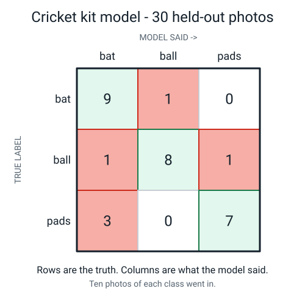
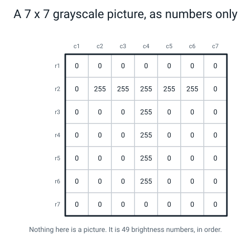

# 📝 Term 3 Practice Test — Weeks 19–27

[⬅ Assessments home](README.md) · [⬅ Term 2 test](term-2-test.md) · [Term 4 test ➡](term-4-test.md)

---

```
   ┌──────────────────────────────────────────────────────────────────────┐
   │                                                                      │
   │   AI ACADEMY · LEVEL 1 EXPLORER                                      │
   │   TERM 3 PRACTICE TEST — Honest Testing, Pixels and Tokens           │
   │   Covers Weeks 19–27. Nothing later appears anywhere on this paper.  │
   │                                                                      │
   │   TIME ALLOWED   45 minutes                                          │
   │   TOTAL MARKS    40                                                  │
   │                                                                      │
   │   Section A   15 multiple choice      1 mark each     15 marks       │
   │   Section B    6 short answer         2 marks each    12 marks       │
   │   Section C    2 figure questions     4 marks each     8 marks       │
   │   Section D    1 written question     5 marks          5 marks       │
   │                                                                      │
   │   INSTRUCTIONS                                                       │
   │   · Write in pencil or pen. Answer every question.                   │
   │   · Section A: circle ONE letter. A guess costs nothing.             │
   │   · If you guess, write "not sure" beside it.                        │
   │   · THIS IS THE ARITHMETIC PAPER. Every division and every           │
   │     filter sum must be written out in full. An answer of "75%"       │
   │     with no working scores 1 of the 2 marks; "27 ÷ 36 = 0.75 = 75%"  │
   │     scores both.                                                     │
   │   · For filter questions, show the left sum, the right sum, the      │
   │     subtraction, the absolute value and the clipped value.           │
   │                                                                      │
   │   WHAT IS ALLOWED                                                    │
   │   ✅  Pencil, pen, eraser, ruler                                     │
   │   ✅  One blank sheet of rough paper (you will want it)              │
   │   ✅  A calculator — the working must still be written out           │
   │   ❌  The student guide, the workbook, the glossary, your notes      │
   │   ❌  A laptop, a spreadsheet, a phone, a chatbot, a friend          │
   │                                                                      │
   └──────────────────────────────────────────────────────────────────────┘
```

> **🧑‍🏫 Teacher, read this once before you hand the paper out.** You do not need to know any AI. Two
> things are worth saying out loud before the timer starts: *"write every division down"* and *"for
> the filter question, one line per step."* Students lose more marks on this paper to missing working
> than to wrong ideas. The full answer key — with every filter sum computed — is at the bottom.

---

# 🅰️ Section A — Multiple Choice

*15 questions · 1 mark each · circle ONE letter · the week each question comes from is in brackets*

---

**A1.** [W19] What is a **test set**?

- (a) Examples you hide before training, and look at once, right at the end
- (b) The examples the model got wrong
- (c) A second copy of the training examples
- (d) The examples the model studied hardest

---

**A2.** [W19] You have 50 photos per class and you write **"split ratio 80 / 20"**. What have you done?

- (a) Scored 80% and hope to reach 20% more
- (b) Trained for 80 epochs and tested for 20
- (c) Used 80 photos and thrown 20 away
- (d) Put 40 photos per class into training and held 10 per class back before training

---

**A3.** [W20] Accuracy is…

- (a) the number of examples you tested
- (b) correct ÷ total
- (c) the model's confidence score, averaged
- (d) total ÷ correct

---

**A4.** [W20] A spam filter reports **90% accuracy**. It turns out it says "not spam" about every single
email without looking at any of them. How is 90% possible?

- (a) The filter is being tested on spam only
- (b) The filter is broken and the number is a lie
- (c) 90 out of every 100 emails really were not spam, so never flagging anything is right 90% of the time
- (d) Accuracy always starts at 90%

---

**A5.** [W21] **Overfitting** is when…

- (a) a model learns its training examples so closely that it stops working on anything new
- (b) a model is too large for the computer
- (c) you have too many classes
- (d) you train for too few epochs

---

**A6.** [W21] In a **confusion matrix**, what does one row mean?

- (a) One epoch of training
- (b) One example
- (c) One true class — all the test examples that really belonged to it
- (d) One thing the model said

---

**A7.** [W22] Which number is worth putting on a poster?

- (a) The number of photos you collected
- (b) The accuracy on the photos the model trained on
- (c) The highest confidence score the model ever produced
- (d) The accuracy on examples the model had never seen, with the fraction shown

---

**A8.** [W23] In a grayscale picture, a pixel with the value **0** is…

- (a) empty — nothing was stored there
- (b) black — no light comes out of that square
- (c) white — the brightest possible
- (d) an error

---

**A9.** [W23] A picture is **1,200 × 800** pixels. How many pixels is that in total, and what is that number called?

- (a) 12,000 pixels — the megapixel count
- (b) 2,000 pixels — the perimeter
- (c) 960,000 pixels — the resolution is 1,200 × 800
- (d) 400 pixels — the difference

---

**A10.** [W24] In RGB, a pixel stored as **(200, 200, 200)** is…

- (a) a light grey — when R, G and B are equal, the pixel is grey
- (b) impossible, because 200 is too high
- (c) transparent
- (d) a bright yellow

---

**A11.** [W24] You shrink a photo from 1,200 × 800 down to 300 × 200 and save it. Later you want the
detail back. What is true?

- (a) You can get it back exactly, by enlarging it again
- (b) You can generate a convincing replacement, but the original detail is gone forever
- (c) The detail is still stored, just hidden
- (d) Nothing was lost, because the picture still looks fine

---

**A12.** [W25] You slide a **3 × 3** filter over a **12 × 12** picture. How big is the answers grid?

- (a) 9 × 9
- (b) 12 × 12
- (c) 11 × 11
- (d) 10 × 10

---

**A13.** [W25] A filter output of **0** at some cell means…

- (a) nothing *changed* there — the picture is flat at that spot
- (b) the arithmetic went wrong
- (c) that pixel is black
- (d) nothing is there

---

**A14.** [W26] Why does it matter that a filter's nine numbers **add up to zero**?

- (a) It makes the arithmetic easier
- (b) It makes the filter blind to how bright the room is, so the edges it finds survive a change of lamp
- (c) It stops the output from ever being negative
- (d) It keeps the output grid the same size as the input

---

**A15.** [W27] You **tokenize** the text `Don't go!` using the course rules. How many tokens do you get?

- (a) 5
- (b) 2
- (c) 3
- (d) 4

---

# 🅱️ Section B — Short Answer

*6 questions · 2 marks each · answer in full sentences*

---

**B1.** [W19] A student trains a model on all 60 of their photos. Afterwards they say: *"That's fine — I
just won't look at ten of them, and I'll use those ten as my test set."*

Explain in two or three sentences why this does not work, and what they should have done instead.

---

**B2.** [W20] A model that sorts cricket kit gets **27 correct out of 36** held-out photos.

Express this as a **fraction**, a **decimal** and a **percentage**, with the division written out.

---

**B3.** [W20, W21] A model scores **100%** on its own training photos and **40%** on held-out photos.

- (a) What is this difference called, and how big is it here?  **(1 mark)**
- (b) In one sentence, say in plain words what the model actually learned.  **(1 mark)**

---

**B4.** [W24] You shrink a 12 × 12 number grid down to 6 × 6 by replacing every 2 × 2 block with the
**average** of its four numbers.

- (a) How many numbers does the grid have before and after?  **(1 mark)**
- (b) Name one specific thing that is now impossible to recover, and say why.  **(1 mark)**

---

**B5.** [W25] Here is one 3 × 3 patch of a picture. Apply the filter **"right column minus left
column"** (`−1 0 +1` in every row).

```
    12   200   255
    10   190   250
    14   210   248
```

Show the left column sum, the right column sum, the subtraction, the absolute value, and the final
clipped value.

---

**B6.** [W27] Tokenize this text using the six course rules:

> `I don't like AI-powered toasters. They cost 3.50 each!`

- (a) Write out every token in order, and give the total count.  **(1 mark)**
- (b) Name the rule that kept `3.50` whole and the rule that kept `don't` whole.  **(1 mark)**

---

# 🅲 Section C — Look and Explain

*2 questions · 4 marks each*

---

## C1 — Read the confusion matrix



*Figure T3.1 — A model sorting cricket kit, scored on 30 held-out photos: ten of each class. Rows are the truth. Columns are what the model said.*

- (a) What is the **overall accuracy**? Give it as a fraction, a decimal and a percentage, with the division shown.  **(1 mark)**
- (b) Give the **per-class accuracy** for all three classes, each as a fraction and a percentage.  **(1 mark)**
- (c) Which class is the model **worst** at, and what does it get confused with? Answer in one sentence naming both.  **(1 mark)**
- (d) The model is going to be used to sort a lost-property box. Say which single off-diagonal cell would worry you most in that job, and why.  **(1 mark)**

---

## C2 — A picture you are not allowed to see



*Figure T3.2 — 49 brightness numbers. Nobody has drawn the picture for you.*

- (a) What shape do the bright pixels make? Say how you worked it out **from the numbers**, without imagining a picture first.  **(1 mark)**
- (b) How many bright pixels are there, out of how many pixels in total?  **(1 mark)**
- (c) You are going to run the 3 × 3 filter `−1 0 +1` over this grid. How big will the answers grid be, and what is the rule that tells you?  **(1 mark)**
- (d) Work out the filter's answer for cell **(r4, c3)**. Show the left column sum, the right column sum, the subtraction, the absolute value, and the clipped value.  **(1 mark)**

---

# 🅳 Section D — The Written Question

*1 question · 5 marks · about 8–10 minutes · write a paragraph, not a list*

---

**D1.** A student hands in this report. Their school office wants to use the model to sort the
lost-property box.

```
   ┌─────────────────────────────────────────────────────────────────────┐
   │  CRICKET KIT SORTER — RESULTS                                       │
   │                                                                     │
   │  We trained the model on all 200 of our photos.                     │
   │     100 photos of  bat                                              │
   │      80 photos of  ball                                             │
   │      20 photos of  pads                                             │
   │                                                                     │
   │  We then tested it on 20 photos picked at random from those same     │
   │  200 photos. It got 19 of them right.                               │
   │     (the 20 test photos were 10 bat, 8 ball, 2 pads)                │
   │                                                                     │
   │  ★ ACCURACY: 95% ★                                                  │
   │                                                                     │
   │  Recommendation: ready for the school office to use.                │
   └─────────────────────────────────────────────────────────────────────┘
```

Write a paragraph answering all of this:

1. Name the **single biggest fault** in this report, and explain why the 95% is not a measurement of anything useful.
2. Say exactly what the student should have done instead, and **when** in the process they should have done it.
3. Work out the **baseline** for this task and say what it means. Show the division.
4. Give one reason the **2 pads photos** make the report worse than it looks, even ignoring everything else.
5. Answer the school office directly: should they use it? Give a reason with a number in it.

---

---
---

# 📊 Marking Scheme

**Total: 40 marks.**

## Section A — 15 marks

| Q | Answer | Mark | Week |
|:--:|:--:|:--:|:--:|
| A1 | **(a)** | 1 | W19 |
| A2 | **(d)** | 1 | W19 |
| A3 | **(b)** | 1 | W20 |
| A4 | **(c)** | 1 | W20 |
| A5 | **(a)** | 1 | W21 |
| A6 | **(c)** | 1 | W21 |
| A7 | **(d)** | 1 | W22 |
| A8 | **(b)** | 1 | W23 |
| A9 | **(c)** | 1 | W23 |
| A10 | **(a)** | 1 | W24 |
| A11 | **(b)** | 1 | W24 |
| A12 | **(d)** | 1 | W25 |
| A13 | **(a)** | 1 | W25 |
| A14 | **(b)** | 1 | W26 |
| A15 | **(c)** | 1 | W27 |

## Section B — 12 marks

| Q | What earns the marks | Marks |
|---|---|:--:|
| **B1** | 1 mark for the reason: the model has already seen all 60, and there is no way to make it un-see a photo, so those ten are not fresh. 1 mark for the fix: physically move 20% into a separate folder **before** training and do not open it until the end. | 1 + 1 |
| **B2** | 1 mark for **27/36** written as a fraction. 1 mark for **27 ÷ 36 = 0.75 = 75%** with the division visible. A bare "75%" scores 1 of 2. | 1 + 1 |
| **B3** | (a) **The gap** = training accuracy − test accuracy = 100 − 40 = **60 percentage points**. Both the name and the number are needed. (b) *"It learned the photos, not the object."* Any wording with that meaning. "It's overfitting" alone = 0, because the question asked for plain words. | 1 + 1 |
| **B4** | (a) **144 before, 36 after.** (b) 1 mark for a specific loss with a reason: anything smaller than 2 pixels wide has been averaged away; a thin line one pixel wide becomes a pale smear; you cannot tell 0,255,0,255 from 128,128,128,128 because both average to 128. | 1 + 1 |
| **B5** | 1 mark for the two column sums and the subtraction: left **36**, right **753**, answer **+717**. 1 mark for `\|717\| = 717` then **clipped to 255**. Answers that stop at 717 score 1 of 2. | 1 + 1 |
| **B6** | (a) 11 tokens, in order, all lowercased. (b) **R4** kept `3.50` whole (a dot between two digits stays in the number, and R4 beats R2). **R3** kept `don't` whole. | 1 + 1 |

## Section C — 8 marks

**C1 — 1 mark per part.**

| Part | Mark for |
|:--:|---|
| (a) | Diagonal is 9 + 8 + 7 = 24. **24 ÷ 30 = 0.8 = 80%**, division visible. |
| (b) | bat **9/10 = 90%**, ball **8/10 = 80%**, pads **7/10 = 70%**. All three needed. |
| (c) | **pads** is worst, and it gets confused with **bat** (3 photos of pads were called bat). Both halves needed. |
| (d) | Names the (pads → bat) cell, value 3, and gives a job-specific reason. Accept any coherent reason about the lost-property job; do not require a particular one. |

**C2 — 1 mark per part.**

| Part | Mark for |
|:--:|---|
| (a) | The letter **T**. The reasoning must come from the numbers: row 2 is bright from c2 to c6 (a horizontal bar) and column 4 is bright from r2 to r6 (a vertical stem), so it is a bar with a stem hanging from its middle. |
| (b) | **9 bright pixels out of 49.** (5 in row 2, plus 4 more in column 4 at rows 3–6. The pixel at r2c4 is counted once.) |
| (c) | **5 × 5**, because **output = input − 2** for a 3 × 3 filter — the filter can never sit on the border. |
| (d) | left sum **0**, right sum **765**, **765 − 0 = +765**, `\|+765\| = 765`, clipped to **255**. All five steps needed for the mark. |

## Section D — 5 marks, marked with the rubric below

| Level | Marks |
|---|:--:|
| 4 · Exceptional | 5 |
| 3 · Proficient | 4 |
| 2 · Developing | 2–3 |
| 1 · Beginning | 1 |
| Nothing usable | 0 |

### D1 rubric

| | **1 · Beginning** | **2 · Developing** | **3 · Proficient** | **4 · Exceptional** |
|---|---|---|---|---|
| **The fault** | "It's not enough photos" or nothing | Notices the test photos came from the training set but does not say why that matters | Says the 20 test photos were all trained on, so the model has seen the answers; the 95% measures memory, not skill | Adds that there is no way to make a model un-see a photo, so this cannot be fixed afterwards — the whole 200 is spent |
| **The fix** | Not attempted | "Test it on new photos" with no timing | Hold out ~20% **before** training, into a separate folder, opened once at the end | Names the split ratio, says the held-out photos should ideally come from a different day or surface, and says the pile gets scored **once** |
| **The baseline** | No number | 100 out of 200 mentioned with no meaning | **100 ÷ 200 = 0.5 = 50%** by always guessing `bat`, so a real model must clearly beat 50% | Also computes the baseline on the *test batch* — always guess `bat` = **10 ÷ 20 = 50%** — and notes that the two happen to agree here, which is luck, not a rule |
| **The 2 pads photos** | Not attempted | "There aren't many pads" | Per-class accuracy for pads is out of 2, so it can only be 0%, 50% or 100% — a number that jumps 50 points on one photo tells you nothing | Adds that pads is also the smallest **training** class (20 of 200), so it is the class most likely to be broken *and* the class the report is least able to measure |
| **The verdict** | "Yes" or "no" with no number | "No, it's not tested properly" | **No**, with a number: the only honest figure available is the 50% baseline, because the 95% is not a measurement | Says what would change their mind, with a quantity: hold out 40 photos before training, rescore, report per-class accuracy, and collect more pads photos first |

### A model level-4 answer (about 190 words)

> The biggest fault is that all 20 test photos came out of the same 200 the model trained on, so the
> model has already seen every one of them with the answer attached. The 95% is a measurement of
> memory, not of skill, and it cannot be repaired afterwards — there is no way to make a model un-see
> a photo, so the whole set of 200 is spent.
>
> What they should have done is move about 20% into a separate folder **before** training — say 40
> photos, ideally taken on a different day — and not open that folder until the very end, scoring it
> once.
>
> The baseline matters here. `bat` is the commonest class at 100 of 200, so always guessing `bat`
> scores 100 ÷ 200 = 0.5 = 50%. On the 20-photo test batch it is 10 ÷ 20 = 50% as well. So 50% is the
> number to beat, and nothing in this report beats it honestly.
>
> The 2 pads photos make it worse. Pads accuracy can only come out as 0%, 50% or 100%, because there
> are two photos — one photo moves the number 50 points. And pads is also the smallest training class
> at 20 photos, so it is simultaneously the class most likely to be broken and the class this report
> is least able to measure.
>
> So no, the office should not use it. The only trustworthy number on this page is the 50% baseline.
> Collect more pads photos, hold 40 back before training, and report per-class accuracy — then come
> back.

---

# ✅ Full Answer Key

> **🧑‍🏫 Do not give this page to students until the papers are marked.**

<details>
<summary><b>A1 — (a) · W19</b></summary>

**(a) is right.** A test set is hidden **before** training and looked at **once**, right at the end.
Both halves matter — hiding it late is cheating, and looking at it repeatedly spends it.

- **(b) is wrong** — the examples it got wrong are a *result*, found after you score the test set.
- **(c) is wrong** — a copy of the training examples is the one thing a test set must never be. Every
  test photo is a training photo you gave up.
- **(d) is wrong** — that is training, and studying hardest is not a category anyway.
</details>

<details>
<summary><b>A2 — (d) · W19</b></summary>

**(d) is right.** A split ratio is written train / test. 80 / 20 on 50 photos per class means 40 per
class to train on and 10 per class held out, moved into a different folder before the training tool is
even opened.

- **(a) is wrong** — a split ratio is about photos, not scores.
- **(b) is wrong** — epochs are passes through the training data, a completely different thing.
- **(c) is wrong** — held-out photos are not thrown away. They are the most valuable photos you have,
  because they are the only ones that can give you an honest number.
</details>

<details>
<summary><b>A3 — (b) · W20</b></summary>

**(b) is right.** Accuracy = correct ÷ total. Always write the fraction next to it: not "75%" but
"27 out of 36 = 75%", so a reader can see how many examples it was.

- **(a) is wrong** — that is the denominator on its own.
- **(c) is wrong** — averaging confidence gives you a number about how sure the model *feels*, which
  can be high while the accuracy is low. They are unrelated.
- **(d) is wrong** — that is the division upside down. It would give 1.33, which cannot be a fraction
  of correct answers.
</details>

<details>
<summary><b>A4 — (c) · W20</b></summary>

**(c) is right.** If 90 out of every 100 emails genuinely are not spam, then a filter that says "not
spam" about everything is right 90 times out of 100 without looking at anything at all. The 90% is
real arithmetic and completely useless, because the class it was built to catch has an accuracy of 0%.

- **(a) is wrong** — testing on spam only would give 0%, not 90%.
- **(b) is wrong** — the number is not a lie. That is what makes it dangerous. A lie can be caught;
  a true-but-empty number gets printed on a slide.
- **(d) is wrong** — accuracy starts wherever the class balance puts it.

> **This is the most important idea in Week 20.** One accuracy number is a summary, and every summary
> hides somebody. Always ask: *for whom?* The fix is **per-class accuracy**.
</details>

<details>
<summary><b>A5 — (a) · W21</b></summary>

**(a) is right.** Overfitting is learning the training examples so closely that the model stops working
on anything new. In plain words: it learned the photos, not the object.

- **(b) is wrong** — that is a hardware complaint.
- **(c) is wrong** — you can overfit with two classes just as easily as with twenty.
- **(d) is wrong** — too few epochs gives you a model that has not learned *anything* yet, which looks
  bad on both training and test data. Overfitting looks brilliant on training data.
</details>

<details>
<summary><b>A6 — (c) · W21</b></summary>

**(c) is right.** **Rows are the truth, columns are what the model said.** One row gathers all the
test examples that really belonged to that class, and spreads them across the columns according to
what the model guessed.

- **(a) is wrong** — a confusion matrix says nothing about training; it is built from test results.
- **(b) is wrong** — one example is one tally mark in one cell.
- **(d) is wrong** — that is a **column**. Getting rows and columns the wrong way round is the single
  most common confusion-matrix error, and it flips the meaning of every off-diagonal cell.
</details>

<details>
<summary><b>A7 — (d) · W22</b></summary>

**(d) is right.** The only number worth reporting is the one you got on examples the model had never
seen, with the fraction visible.

- **(a) is wrong** — how many photos you collected describes your effort, not your model.
- **(b) is wrong** — that is the number you get for marking your own homework.
- **(c) is wrong** — a single high confidence score is the least informative number in the whole
  project. A model can be 99% confident and wrong.
</details>

<details>
<summary><b>A8 — (b) · W23</b></summary>

**(b) is right.** The number is **how much light comes out of that square**. 0 means none: black.
255 means as much as the format allows: white.

- **(a) is wrong** — 0 is a stored value, and a very definite one. There is no such thing as an empty
  pixel in a grayscale image.
- **(c) is wrong** — that is 255. This is worth checking every time, because inverting the scale
  inverts every picture you draw.
- **(d) is wrong** — 0 is perfectly legal. It is one end of the range.
</details>

<details>
<summary><b>A9 — (c) · W23</b></summary>

**(c) is right.** 1,200 × 800 = **960,000 pixels**, and "1,200 × 800" is the **resolution**, written
width × height.

- **(a) is wrong** — a megapixel is one **million** pixels. 960,000 is just under 1 megapixel; it is
  not 12,000 of anything.
- **(b) is wrong** — 1,200 + 800 is the sort of arithmetic that gives you a perimeter, and pixels are
  an area.
- **(d) is wrong** — subtracting the two sides means nothing here.
</details>

<details>
<summary><b>A10 — (a) · W24</b></summary>

**(a) is right.** When R, G and B are all equal, the pixel is grey. (60, 60, 60) is a dark grey,
(128, 128, 128) is middle grey, (200, 200, 200) is a light grey. Grey is not really a colour — it is a
tie.

- **(b) is wrong** — every channel runs 0 to 255, so 200 is well inside range.
- **(c) is wrong** — RGB stores no transparency at all. That takes a fourth number.
- **(d) is wrong** — yellow is red plus green with the blue turned *down*, like (255, 255, 0).
</details>

<details>
<summary><b>A11 — (b) · W24</b></summary>

**(b) is right.** Downsampling replaces each block of pixels with a single number, usually their
average. The original numbers are gone. You can **generate** a convincing replacement for lost detail;
you can never **recover** it, and you must never treat the replacement as evidence.

- **(a) is wrong** — enlarging invents pixels. It does not find the old ones.
- **(c) is wrong** — the file is smaller precisely because the numbers were thrown away.
- **(d) is wrong** — "it still looks fine" is about your eyes, not about the data. A number-plate that
  looks fine to you can be unreadable to anything measuring it.
</details>

<details>
<summary><b>A12 — (d) · W25</b></summary>

**(d) is right.** **Output = input − 2** for a 3 × 3 filter, because the filter can never sit on the
border — it would hang off the edge of the picture. 12 − 2 = 10, so the answers grid is 10 × 10.

- **(a) is wrong** — subtracting 3 would be right for a 4 × 4 filter, which nobody in this course uses.
- **(b) is wrong** — that would require the filter to have pixels available outside the picture.
- **(c) is wrong** — subtracting 1 is what you would do if the filter were 2 × 2.
</details>

<details>
<summary><b>A13 — (a) · W25</b></summary>

**(a) is right.** Zero means nothing **changed** there. Flat ink and flat paper both score zero,
because in both cases the left column and the right column are identical.

- **(b) is wrong** — 0 is the commonest correct answer in the whole grid.
- **(c) is wrong** — that would be an *input* value of 0, not an output value.
- **(d) is wrong** and this is the single most seductive misreading of a filter output. A solid black
  region and a solid white region both give 0. There is a great deal "there" in both cases.
</details>

<details>
<summary><b>A14 — (b) · W26</b></summary>

**(b) is right.** A filter whose nine weights sum to zero is mathematically blind to how bright the
room is. Add 50 to every pixel and the left sum goes up by 150, the right sum goes up by 150, and the
subtraction gives exactly the same answer. That is why a vision model looks for edges first: brightness
changes with the lamp, and edges do not.

- **(a) is wrong** — the arithmetic is no easier either way.
- **(c) is wrong** — outputs are negative all the time. That is what absolute value is for.
- **(d) is wrong** — output size depends only on the filter's size, not on its numbers.

> **The measured version, from Week 26:** when the lamp changed, the brightness values moved about
> **34 times** more than the edge values did.
</details>

<details>
<summary><b>A15 — (c) · W27</b></summary>

**(c) is right.** Three tokens: `don't` and `go` and `!`

- R1 lowercases `Don't` to `don't`.
- R3 keeps the contraction whole, so `don't` is one token, not two.
- R2 makes the `!` its own token.

- **(a) is wrong** — 5 would require splitting the contraction *and* the apostrophe separately.
- **(b) is wrong** — that would mean throwing the `!` away. Punctuation is a token; it carries meaning.
- **(d) is wrong** — 4 is what you get if you split `don't` into `don` and `t`, which R3 forbids.

> There is no cosmic authority saying R3 is correct. A real tokenizer might well split `don't` into
> `do` and `n't` on purpose, to keep the *not*. What is genuinely wrong is being **inconsistent** —
> splitting it one way in sentence A and another way in sentence C.
</details>

<details>
<summary><b>B1 — model answer · W19</b></summary>

> *"It does not work because the model has already studied all 60 photos, and there is no way to make
> a model un-see a photo. Deciding afterwards to ignore ten of them changes what the student looks at;
> it does not change what the model learned. Those ten are training photos wearing a test-set
> costume, so the score they give will be flattering and false. What they should have done is
> physically move about 12 photos into a separate `heldout/` folder **before** opening the training
> tool, and not look inside that folder again until the very end."*

**Both marks:** the reason (the model has seen them; it cannot un-see them) and the fix (split first,
into a separate folder, opened once).

**One mark:** *"because it already trained on them"* with no fix, or a fix with no reason.

> **🧑‍🏫 Why students genuinely believe this works.** Uploading everything feels natural, and holding
> photos back feels wasteful — every test photo is a training photo you gave up. It is the one mistake
> in the whole course with no repair except re-collecting, which is why Week 19 uses a physical
> envelope rather than a folder name.
</details>

<details>
<summary><b>B2 — model answer · W20</b></summary>

```
   fraction    27 / 36

   division    27 ÷ 36 = 0.75

   decimal     0.75

   percentage  0.75 × 100 = 75%
```

**Say it as:** *"27 out of 36, which is 75%."* Never "75%" on its own — the fraction is what lets a
reader see it was 36 photos and not 3,600.

**Marking note:** a student who writes `0.75` and `75%` but never shows `27 ÷ 36` gets 1 of 2. The
division is not decoration; it is the evidence.
</details>

<details>
<summary><b>B3 — model answer · W20, W21</b></summary>

**(a)** It is called **the gap** — training accuracy minus test accuracy.

```
   100%  −  40%  =  60 percentage points
```

Note the units: **percentage points**, not "60%". A drop from 100% to 40% is a 60-point gap, and
saying "it fell by 60%" means something different and wrong.

**(b)** *"It learned the photos, not the object."*

The proper name for this is **overfitting**, but the question asked for plain words, and the plain
words are the ones that actually help you fix it — because they tell you where to look. If the model
learned the photos, then the answer is different photos, not more epochs.

> A gap of 60 points is enormous. Every professional machine learning engineer watches some version of
> this drop happen on every project they have ever worked on. It is not a student mistake. It is what
> the work is like.
</details>

<details>
<summary><b>B4 — model answer · W24</b></summary>

**(a)** Before: 12 × 12 = **144 numbers.** After: 6 × 6 = **36 numbers.** You threw away 108 of them
and replaced them with 36 averages.

**(b)** Any one of these, with the reason:

- **A line one pixel wide.** A block of `0, 255, 0, 255` averages to 128, and so does a block of
  `128, 128, 128, 128`. After averaging, a sharp thin line and a flat grey smudge are the same number,
  and nothing can tell them apart afterwards.
- **The exact position of an edge inside a 2 × 2 block.** The average says "this block is half bright";
  it does not say which half.
- **Anything smaller than 2 pixels.** A dot one pixel across becomes a quarter of its brightness spread
  over a bigger square. It has not moved; it has dissolved.

**Marking note:** *"detail"* on its own is 0. The mark is for a **specific** thing plus **why** the
average destroys it.
</details>

<details>
<summary><b>B5 — model answer · W25</b></summary>

The filter is `−1 0 +1` in every row, which says in words: **add up the three pixels on the right,
subtract the three pixels on the left.** The middle column is multiplied by 0 and contributes nothing
at all.

```
   patch:      12   200   255
               10   190   250
               14   210   248

   left column  (the −1s):   12 + 10 + 14  =    36
   right column (the +1s):  255 + 250 + 248 =  753
   middle column (the 0s):  ignored completely

   answer   =  753  −  36   =  +717
   |answer| =  |+717|       =   717
   clipped  =  717 is above 255, so it becomes  255      →  shade DARK
```

**Both marks:** the two column sums with the subtraction, then the absolute value and the clip.

**One mark:** stopping at 717 without clipping, or clipping without showing the sums.

> **What was thrown away by clipping:** 717 and 1,020 both become 255, and the difference between them
> is gone forever. Clipping costs you something real. It is worth saying so out loud.
</details>

<details>
<summary><b>B6 — model answer · W27</b></summary>

**(a)** Eleven tokens, in order:

```
   1.  i              R1 lowercased the capital I
   2.  don't          R3 kept the contraction whole
   3.  like
   4.  ai-powered     R5 kept the hyphenated word whole; R1 lowercased it
   5.  toasters
   6.  .              R2 made the full stop its own token
   7.  they           R1 lowercased They
   8.  cost
   9.  3.50           R4 kept the dot inside the number; R4 beats R2
  10.  each
  11.  !              R2 made the exclamation mark its own token

   TOTAL: 11 tokens
```

**(b)** **R4** kept `3.50` whole — a dot between two digits stays inside the number, and R4 explicitly
beats R2. **R3** kept `don't` whole.

**Marking note:** accept 11 tokens with one wrong capitalisation as full marks if the rules are
otherwise right; do not accept 10 or 12. The two most common errors are throwing the punctuation away
(giving 9) and splitting `3.50` into `3`, `.`, `50` (giving 13).

> **🧑‍🏫 If a student says "but `AI` losing its capitals is a real loss"** — they are right, and it is a
> genuinely good observation. `AI` is a name and the capitals carried information. That is exactly the
> price listed in the R1 row of the Week 27 cost table. We pay it on purpose, because lowercasing
> earns us far more than it costs on ordinary words.
</details>

<details>
<summary><b>C1 — full answer · W20, W21, W22</b></summary>

**(a) Overall accuracy.** Add the diagonal — the cells where the truth and the prediction agree:

```
   bat correct   9
   ball correct  8
   pads correct  7
                ──
                24        24 ÷ 30 = 0.8 = 80%
```

**(b) Per-class accuracy.** Each row started with ten photos, so each denominator is 10:

| True class | Correct | Fraction | Percentage |
|---|:--:|:--:|:--:|
| bat | 9 | 9/10 | **90%** |
| ball | 8 | 8/10 | **80%** |
| pads | 7 | 7/10 | **70%** |

Notice that the overall 80% sits neatly in the middle and tells you nothing about the 20-point spread
underneath it. That spread is the whole reason per-class accuracy exists.

**(c) The worst class.** **Pads is worst at 70%, and it gets confused with bat** — three photos that
were really pads came back as `bat`. Say it as a sentence, because a sentence is what you can act on:
*"three times out of ten, my model called a pair of pads a bat."*

**(d) The cell that matters for the job.** The honest answer is the **(pads → bat)** cell with its
value of 3, and any coherent reason earns the mark. Two good ones:

- *Pads and bats are both big and both get put in the box together, so a wrong sort here means somebody
  digs through the wrong pile — annoying but harmless.*
- *There are three mistakes in that one cell and only one anywhere else in the pads row, so if I only
  get to fix one thing, that cell is where the work is. Fixing the cell with a 1 in it changes almost
  nothing.*

> **The idea to reward:** every off-diagonal cell is a specific mistake you can say out loud in a
> sentence, and the size of the number tells you where to spend your next hour. A student who picks a
> cell **and** says what they would do about it is doing exactly what Week 22 asked for.
</details>

<details>
<summary><b>C2 — full answer · W23, W25</b></summary>

**(a) The shape is the letter T.**

The reasoning has to come out of the numbers, not out of squinting:

- Read along **row r2**: cells c2, c3, c4, c5 and c6 are all 255. That is a horizontal bar five pixels
  wide.
- Read down **column c4**: cells r2, r3, r4, r5 and r6 are all 255. That is a vertical stem five pixels
  tall.
- The stem starts at row 2, which is where the bar is, and it hangs from the **middle** of the bar
  (c4 is the centre of c2–c6).
- A horizontal bar with a stem hanging from its centre is a **T**.

**(b) Nine bright pixels out of forty-nine.**

```
   row r2, c2 to c6              5 bright pixels
   column c4, r3 to r6           4 more  (r2c4 already counted above)
                                ──
                                 9 bright out of 7 × 7 = 49
```

The commonest slip is counting 10, by counting the corner pixel r2c4 twice — once as part of the bar
and once as the top of the stem. It is one pixel.

**(c) The answers grid is 5 × 5.**

**Output = input − 2** for a 3 × 3 filter. 7 − 2 = 5. The reason is physical: to compute a cell, the
filter needs a pixel on every side of it, so it can never sit on the border row or the border column.

**(d) Cell (r4, c3).**

The filter sits centred on r4c3, so it covers rows r3–r5 and columns c2–c4:

```
                c2    c3    c4
        r3       0     0    255
        r4       0     0    255
        r5       0     0    255

   left column  (c2, the −1s):    0 +   0 +   0  =     0
   right column (c4, the +1s):  255 + 255 + 255  =   765
   middle column (c3, the 0s):  ignored

   answer   =   765  −  0    =  +765
   |answer| =   |+765|       =   765
   clipped  =   765 is above 255, so it becomes  255   →  shade DARK
```

> **💡 Try this with the class afterwards — it is the best question on the paper.** Now compute cell
> **(r4, c4)**, sitting right on top of the stem. The left column is c3, which is all 0. The right
> column is c5, which is also all 0. So the answer is **0 − 0 = 0** and the middle of the line comes
> out **blank**.
>
> That is not a mistake. The filter compares the two **sides** of the stem, so it lights up on the
> left edge and the right edge and finds nothing in between. The output of an edge filter on a solid
> line is two lines, not one. Once a student sees that, they understand what "an edge is a place where
> the brightness suddenly changes" actually means — and why zero means *nothing changed*, not
> *nothing there*.
</details>

<details>
<summary><b>D1 — see the rubric and model answer above · W19, W20, W22</b></summary>

The five-row rubric and a full level-4 answer are printed in the **Marking Scheme** section above.

Four things separate a 4 from a 3:

1. Says the fault **cannot be repaired afterwards** — the whole 200 photos are spent.
2. Computes the baseline **twice**: on the full 200 (100 ÷ 200 = 50%) and on the test batch
   (10 ÷ 20 = 50%), and notes that the two agreeing is luck rather than a rule.
3. Points out that pads is *both* the smallest training class (20 of 200) *and* the class the report
   is least able to measure (2 test photos). That double bind is the real story in the report.
4. Ends with a **quantified** change of mind: how many photos to hold out, what to rescore, what to
   collect first.

**The most common level-2 answer** says *"20 photos is too small a test set."* True, and it is the
second problem, not the first. Even 200 test photos drawn from the training set would prove nothing.
Push with one question: *"suppose they had tested on all 200. Would the number be honest then?"*
</details>

---

## 🔑 What This Test Was Checking

| If they lost marks in… | The idea that has not landed | Go back to |
|---|---|---|
| A1–A2, B1 | Hold out **before** training; split ratios | **Week 19** |
| A3–A4, B2, B3(a), C1(a)(b) | Accuracy three ways; per-class accuracy; the hidden class | **Week 20** |
| A5–A6, B3(b), C1(c) | Memorizing vs generalizing; overfitting; confusion matrices | **Week 21** |
| A7, C1(d), D1 | Scoring honestly and reporting it honestly | **Week 22** |
| A8–A9, C2(a)(b) | Pixels as numbers; resolution | **Week 23** |
| A10–A11, B4 | RGB channels; downsampling and what it destroys | **Week 24** |
| A12–A13, B5, C2(c)(d) | Filters, absolute value, clipping, output = input − 2 | **Week 25** |
| A14 | Why edges survive a lighting change and brightness does not | **Week 26** |
| A15, B6 | Tokens, tokenizing, the six rules | **Week 27** |

---

[⬅ Term 2 test](term-2-test.md) · [Assessments home](README.md) · [Term 4 test ➡](term-4-test.md)
