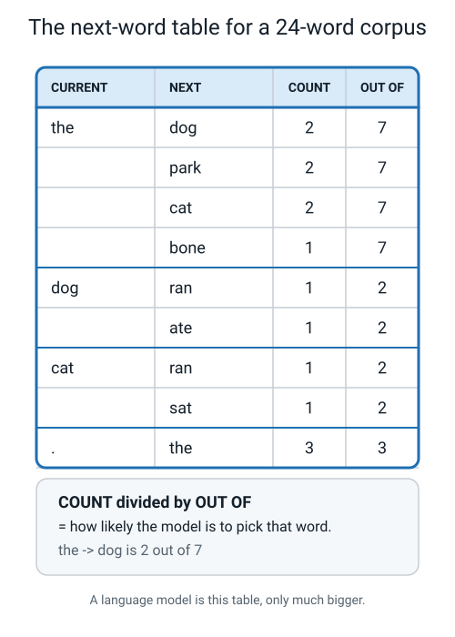
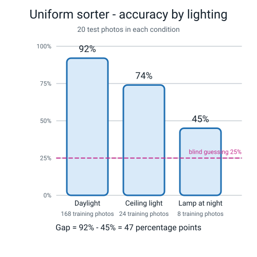

# 📝 Term 4 Practice Test — Weeks 28–36

[⬅ Assessments home](README.md) · [⬅ Term 3 test](term-3-test.md) · [Projects ➡](../projects/project-ideas.md)

---

```
   ┌──────────────────────────────────────────────────────────────────────┐
   │                                                                      │
   │   AI ACADEMY · LEVEL 1 EXPLORER                                      │
   │   TERM 4 PRACTICE TEST — Language, Fairness and Judgement            │
   │   Covers Weeks 28–36. Nothing earlier is tested on its own here,     │
   │   but Term 3's arithmetic turns up inside the fairness questions.    │
   │                                                                      │
   │   TIME ALLOWED   45 minutes                                          │
   │   TOTAL MARKS    40                                                  │
   │                                                                      │
   │   Section A   15 multiple choice      1 mark each     15 marks       │
   │   Section B    6 short answer         2 marks each    12 marks       │
   │   Section C    2 figure questions     4 marks each     8 marks       │
   │   Section D    1 written question     5 marks          5 marks       │
   │                                                                      │
   │   INSTRUCTIONS                                                       │
   │   · Write in pencil or pen. Answer every question.                   │
   │   · Section A: circle ONE letter. A guess costs nothing.             │
   │   · If you guess, write "not sure" beside it.                        │
   │   · Gaps are in PERCENTAGE POINTS. Write the subtraction.            │
   │   · Every "how many more photos" answer needs the arithmetic.        │
   │   · Section D is the longest question on any paper this year.        │
   │     Leave yourself 10 minutes for it.                                │
   │                                                                      │
   │   WHAT IS ALLOWED                                                    │
   │   ✅  Pencil, pen, eraser, ruler                                     │
   │   ✅  One blank sheet of rough paper                                 │
   │   ✅  A calculator — the working must still be written out           │
   │   ❌  The student guide, the workbook, the glossary, your notes      │
   │   ❌  A laptop, a phone, a chatbot, a friend                         │
   │                                                                      │
   └──────────────────────────────────────────────────────────────────────┘
```

> **🧑‍🏫 Teacher, read this once before you hand the paper out.** You do not need to know any AI. This
> paper leans on judgement more than the other three, so the answers will be longer and less tidy —
> that is expected and correct. Section D is marked with a rubric, not a checklist. The full answer key
> is at the bottom of this file and students must not see it until after marking.

---

# 🅰️ Section A — Multiple Choice

*15 questions · 1 mark each · circle ONE letter · the week each question comes from is in brackets*

---

**A1.** [W28] What is a **bigram**?

- (a) A word with two meanings
- (b) A sentence with two clauses
- (c) A word that appears twice in a text
- (d) Two tokens that appeared next to each other, in that order

---

**A2.** [W28] What is a **language model**?

- (a) A system that understands the meaning of a sentence
- (b) Any system that predicts likely next words
- (c) A set of grammar rules written by a linguist
- (d) A dictionary stored inside a computer

---

**A3.** [W28] You type `I am going to the` on a phone and three words appear above the keyboard. What are those three keys?

- (a) Three words the phone has understood you are about to need
- (b) The three words you use most often
- (c) The top three followers of `the` in a next-word table, sorted by count
- (d) Three words chosen at random from the dictionary

---

**A4.** [W29] What does it mean to generate **greedily**?

- (a) Always pick the follower with the highest count
- (b) Pick randomly, in proportion to the counts
- (c) Pick the word that appears first in the corpus
- (d) Pick the longest available word

---

**A5.** [W29] Why can the very same prompt give a chatbot two different answers?

- (a) Because it looks up a different website each time
- (b) Because your typing was slightly different
- (c) The model has changed its mind
- (d) Because it is picking words by **sampling** — randomly, in proportion to the counts

---

**A6.** [W29] A **hallucination** is…

- (a) something an AI produces that sounds right but is not true
- (b) an answer with a low confidence score
- (c) a spelling mistake
- (d) an answer the model refuses to give

---

**A7.** [W30] Your Scratch bot says *"I don't know that one — try asking about toppings."* Your bigram
generator says *"amma takes the bus to the market"* about somebody who has never been to a market.
What is the important difference?

- (a) The Scratch bot is more advanced
- (b) The Scratch bot failed **loudly** and the generator failed **silently**
- (c) The generator is more accurate
- (d) Only one of them is really AI

---

**A8.** [W31] **Bias**, as this course defines it, is…

- (a) a programmer's personal opinion written into the code
- (b) a machine deliberately being unkind
- (c) when a model works noticeably worse for some group of inputs than others, in a way that matters
- (d) any mistake a model makes

---

**A9.** [W31] A model is 90% accurate for one group and 60% for another. The gap is…

- (a) 30 percentage points
- (b) 1.5 times
- (c) 150%
- (d) 30%

---

**A10.** [W32] Which of these is **personal data**?

- (a) Only information you have marked private
- (b) Any information about an identifiable person, **or** that could be combined with other information to identify them
- (c) Only data stored on a phone
- (d) Only your name and your address

---

**A11.** [W32] **Metadata** on a photo file is…

- (a) the colour information for each pixel
- (b) a watermark
- (c) the caption you typed
- (d) the hidden information the file carries about itself — when it was made, on what device, often exactly where

---

**A12.** [W32] **Automation bias** is…

- (a) preferring older technology
- (b) a model being biased against automated systems
- (c) the human habit of trusting a machine's answer more than our own judgement, especially when tired or rushed
- (d) a machine automatically correcting its own bias

---

**A13.** [W33] What is the difference between **misinformation** and **disinformation**?

- (a) Misinformation is written; disinformation is spoken
- (b) Misinformation is false information spreading; disinformation is false information spread **deliberately**
- (c) Misinformation is about people; disinformation is about facts
- (d) There is no difference

---

**A14.** [W35] Your app has an `other` class **and** a confidence threshold that makes it say *"not
sure"*. What is the difference between them?

- (a) `other` is a class the model can predict; *"not sure"* is your app refusing to pass on a weak prediction
- (b) `other` is for objects; *"not sure"* is for people
- (c) `other` is chosen by you; *"not sure"* is chosen by the model
- (d) They are the same thing with two names

---

**A15.** [W34] Your booth model has four roughly equal classes. What is the **baseline**?

- (a) It depends on the model
- (b) 0%
- (c) 25%
- (d) 50%

---

# 🅱️ Section B — Short Answer

*6 questions · 2 marks each · answer in full sentences*

---

**B1.** [W28] Here is part of a next-word table built from somebody's chat messages.

| CURRENT | NEXT | COUNT | OUT OF |
|---|---|---:|---:|
| **going** | to | 9 | 12 |
| | home | 2 | 12 |
| | out | 1 | 12 |

- (a) The model has just produced the word `going`. Working greedily, what does it say next, and what is the chance written as a fraction?  **(1 mark)**
- (b) Explain in one sentence why the model can still produce `out`, even though `to` is nine times more common.  **(1 mark)**

---

**B2.** [W29] Using the same table as B1, describe what would be different about a long piece of text
generated **greedily** compared with one generated by **sampling**. Give one advantage of each.

---

**B3.** [W30] A friend says: *"An AI that says 'I don't know' is worse than one that just gives you an
answer."*

Reply in two or three sentences, using the words **loudly** and **silently**.

---

**B4.** [W31] A door-unlock model was tested on two groups.

```
   Group A:   47 correct out of 50
   Group B:   28 correct out of 40
```

- (a) Work out each group's accuracy as a percentage, showing both divisions.  **(1 mark)**
- (b) State the **accuracy gap** in the correct units.  **(1 mark)**

---

**B5.** [W32] A school publishes an "anonymous" survey. Each row says: `year group`, `favourite subject`,
`house colour`, `nut allergy — yes/no`.

There is exactly **one** Year 8 student in Green house with a nut allergy.

- (a) Explain how this row identifies a real person even though no name appears.  **(1 mark)**
- (b) What is the name for working out who an "anonymous" record belongs to?  **(1 mark)**

---

**B6.** [W35] Your app currently says the top class no matter what. You add a **confidence threshold**
at 70%: below that, it says *"not sure"*.

Name **one thing this gains** and **one thing it costs**, in terms of what a user experiences.

---

# 🅲 Section C — Look and Explain

*2 questions · 4 marks each*

---

## C1 — Read the next-word table

This is the whole corpus the table was built from — 24 tokens, already tokenized:

```
   the  dog  ran  to  the  park  .  the  dog  ate  the  bone  .
   the  cat  ran  to  the  park  .  the  cat  sat  .
```



*Figure T4.1 — Four of the groups from the finished table. Not every group is shown.*

- (a) The model has just produced `dog`. List every word that could come next, with the chance of each as a fraction.  **(1 mark)**
- (b) A student says: *"After `the` it will definitely say `dog`."* Correct them using the numbers in the table.  **(1 mark)**
- (c) Working **greedily**, the model has just produced `.` — what does it say next, and how certain is the table about it?  **(1 mark)**
- (d) The group for `park` is not shown. Write it out from the corpus, and say what it means when COUNT equals OUT OF.  **(1 mark)**

---

## C2 — Read the fairness audit



*Figure T4.2 — A school uniform-sorting model, tested on 20 fresh photos in each of three lighting conditions. The number under each bar is how many of the 200 training photos were taken in that condition.*

- (a) Work out the **accuracy gap** and give it in the correct units. Show the subtraction.  **(1 mark)**
- (b) Explain the gap using the training counts. Your answer must contain at least one of those numbers.  **(1 mark)**
- (c) **Price the fix.** You want lamplight photos to be at least a quarter of a 200-photo training set. How many more do you need? Show the arithmetic.  **(1 mark)**
- (d) Until that fix is done, name one thing that should be printed on the booth sign **and** one thing the app should do differently.  **(1 mark)**

---

# 🅳 Section D — The Written Question

*1 question · 5 marks · about 10 minutes · write a paragraph, not a list*

---

**D1.** A company is selling schools a face-recognition gate called **SmartGate**. The box says:

```
   ┌──────────────────────────────────────────────────────────────┐
   │                                                              │
   │            S M A R T G A T E                                 │
   │                                                              │
   │        ★  99.2% ACCURATE  ★                                  │
   │                                                              │
   │        AI-powered. No more lost passes.                      │
   │        Trusted by 40 schools.                                │
   │                                                              │
   └──────────────────────────────────────────────────────────────┘
```

A parents' group has asked you — the person in the room who did Level 1 — what questions they should
ask before the school signs anything.

Write a paragraph answering all of this:

1. What can a single accuracy number like **99.2%** hide? Say what you would ask for instead.
2. Name **one specific question** about the **training photos** and say exactly what a bad answer would sound like.
3. There are two ways this gate can be wrong. Name both, say who is hurt by each, and say which one you would rather the gate made — with a reason.
4. Write the **one sentence** you think should be printed on the box, in the biggest text.
5. Give your recommendation to the parents' group, and include a number in it.

---

---
---

# 📊 Marking Scheme

**Total: 40 marks.**

## Section A — 15 marks

| Q | Answer | Mark | Week |
|:--:|:--:|:--:|:--:|
| A1 | **(d)** | 1 | W28 |
| A2 | **(b)** | 1 | W28 |
| A3 | **(c)** | 1 | W28 |
| A4 | **(a)** | 1 | W29 |
| A5 | **(d)** | 1 | W29 |
| A6 | **(a)** | 1 | W29 |
| A7 | **(b)** | 1 | W30 |
| A8 | **(c)** | 1 | W31 |
| A9 | **(a)** | 1 | W31 |
| A10 | **(b)** | 1 | W32 |
| A11 | **(d)** | 1 | W32 |
| A12 | **(c)** | 1 | W32 |
| A13 | **(b)** | 1 | W33 |
| A14 | **(a)** | 1 | W35 |
| A15 | **(c)** | 1 | W34 |

## Section B — 12 marks

| Q | What earns the marks | Marks |
|---|---|:--:|
| **B1** | (a) **`to`**, chance **9 out of 12** (accept 9/12 or 3/4 or 75%). Both the word and the fraction. (b) Because sampling gives every recorded follower a chance in proportion to its count, and `out` has a count of 1, so it has a 1-in-12 chance rather than no chance. | 1 + 1 |
| **B2** | 1 mark for the difference: greedy always picks the top follower, so it repeats and often gets stuck in a loop; sampling varies, so the text is different every run. 1 mark for one genuine advantage of each — greedy is repeatable and predictable; sampling sounds more natural and does not get stuck. | 1 + 1 |
| **B3** | 1 mark for the mechanism: a bot that says "I don't know" has failed **loudly**, so you know instantly to go and ask somebody else. 1 mark for the contrast: a fluent wrong answer has failed **silently**, in the same voice it uses when it is right, so nothing warns you. | 1 + 1 |
| **B4** | (a) **47 ÷ 50 = 0.94 = 94%** and **28 ÷ 40 = 0.7 = 70%**, both divisions visible. (b) **94 − 70 = 24 percentage points.** The units are required; "24%" scores 0 for this half. | 1 + 1 |
| **B5** | (a) The three harmless-looking facts together match exactly one person, so the row points at that individual as clearly as a name would. (b) **Re-identification.** | 1 + 1 |
| **B6** | 1 mark for the gain: the app stops confidently telling users the wrong thing, and hands the close calls to a person. 1 mark for the cost: some predictions that would have been right now get refused, so the user has to do work that did not need doing. | 1 + 1 |

## Section C — 8 marks

**C1 — 1 mark per part.**

| Part | Mark for |
|:--:|---|
| (a) | **`ran` 1 out of 2** and **`ate` 1 out of 2**. Both, with the fractions. |
| (b) | Three words tie on a count of 2 out of 7 — `dog`, `park` and `cat` — so `dog` is one of three equally likely answers, not a certainty. (`bone` is 1 out of 7.) |
| (c) | **`the`**, at **3 out of 3**. Certain *within this corpus*. |
| (d) | `park` → `.` , **2 out of 2**. COUNT equalling OUT OF means the corpus recorded only ever one follower, so the model has no alternative — certain about the text it saw, which is not the same as being right about English. |

**C2 — 1 mark per part.**

| Part | Mark for |
|:--:|---|
| (a) | **92 − 45 = 47 percentage points.** Units required. |
| (b) | Uses a training count: only **8** of the 200 training photos were lamplight, versus 168 in daylight, so the model has barely met a lamp-lit uniform. |
| (c) | A quarter of 200 = **50**. Already have **8**. **50 − 8 = 42 more lamplight photos.** Arithmetic must be visible. |
| (d) | Sign: any wording that states the measured lamplight number, e.g. *"45% under a lamp — do not use this in a dark room."* App: refuse below a confidence threshold / say "not sure" / hand the decision to a person. Both halves needed. |

## Section D — 5 marks, marked with the rubric below

| Level | Marks |
|---|:--:|
| 4 · Exceptional | 5 |
| 3 · Proficient | 4 |
| 2 · Developing | 2–3 |
| 1 · Beginning | 1 |
| Nothing usable | 0 |

### D1 rubric

| | **1 · Beginning** | **2 · Developing** | **3 · Proficient** | **4 · Exceptional** |
|---|---|---|---|---|
| **What one number hides** | "It might not be true" | Says one number is not enough | Says a single number is a summary that hides groups, and asks for **per-group accuracy** | Also asks *how many faces was it tested on* — because 99.2% of 500 and 99.2% of 5 are different claims — and asks whether the test faces were ever trained on |
| **The training-photos question** | Not attempted | "Where did the photos come from?" with no bad answer named | Asks a specific question about **who** is in the photos, and names a bad answer | The bad answer is named precisely — *"we don't publish that"*, or *"our staff volunteered"*, which means one office, one country, one age range — and the consequence is stated |
| **The two mistakes** | Neither named | One named, nobody hurt named | Names a **false reject** (a real student refused) and a false accept (a stranger let in), names who is hurt by each, and picks one with a reason | Adds that the choice depends entirely on the setting, and says a school gate is not a bank vault, so an inconvenient refusal is preferable to letting a stranger into a building full of children — or argues the opposite with equal care |
| **The sentence for the box** | Nothing, or a slogan | A vague warning | A concrete limit that a stranger could act on | A limit containing a **measured number** and a named group, in the shape of the Week 33 warning sign |
| **The recommendation** | "Don't buy it" with no reason | A reason with no number | A clear recommendation containing a number and a condition | Names what evidence would change their mind, and adds a non-technical safeguard — a human override, a way to report being wrongly refused, a review date |

### A model level-4 answer (about 220 words)

> The first thing to say is that 99.2% is a summary, and every summary hides somebody. I would ask for
> the accuracy **for each group of faces separately**, and I would also ask how many faces it was
> tested on, because 99.2% of 500 faces and 99.2% of 5 faces are completely different claims. I would
> ask whether any test face had also been used in training, because if it had, the number is not a
> measurement at all.
>
> The question I most want answered is: *who is in the training photos, and how many of each kind?* A
> bad answer sounds like *"we don't publish that"* or *"our staff volunteered"* — which usually means
> one office, one country, one age range, and no children. If the model has barely met a face like
> yours, it will be worse at yours, and the 99.2% will not show it.
>
> There are two ways to be wrong. A **false reject** refuses a real student, and the person hurt is a
> child standing outside in the rain being told they do not go to their own school. A false accept
> lets a stranger in, and the people hurt are everybody inside. For a school gate I would rather it
> made the false rejects, because a refused student can be let in by an adult in ten seconds, and a
> stranger inside a building full of children cannot be undone. That is a judgement about this
> setting; a bank vault would want the opposite.
>
> On the box, in the biggest text: **"Measured on 500 adult faces. Not tested on children under 12.
> A member of staff must be able to open this gate by hand."**
>
> My recommendation to the parents: do not sign yet. Ask for per-group accuracy on at least 200
> children's faces, taken on days the model never trained on, plus a written promise of a human
> override and a way for a student to report being wrongly refused. If they will not give you a
> per-group number, that refusal *is* your answer.

---

# ✅ Full Answer Key

> **🧑‍🏫 Do not give this page to students until the papers are marked.** Every distractor is explained,
> because "why the wrong answer was tempting" is where the learning lives.

<details>
<summary><b>A1 — (d) · W28</b></summary>

**(d) is right.** A bigram is two tokens that appeared next to each other, **in that order**. Order is
part of the definition: `the bus` and `bus the` are two different bigrams.

- **(a) is wrong** — nothing in a bigram table knows about meanings. That is the whole point.
- **(b) is wrong** — bigrams are about pairs of tokens, not about grammar.
- **(c) is wrong** — a word appearing twice is a **word frequency** of 2, which is a different tally.

> The prefix tells you the number: a **bigram** is 2 tokens in a row, a **trigram** is 3. The general
> word is **n-gram**.
</details>

<details>
<summary><b>A2 — (b) · W28</b></summary>

**(b) is right.** A language model is any system that predicts likely next words. Your phone keyboard
is one. The bigram table you built by hand from 40 tokens is one. They differ in size, not in kind.

- **(a) is wrong** — understanding is not in the definition, and this is the most important thing to be
  careful about all term. A tally does not understand.
- **(c) is wrong** — that describes a rule-based grammar checker, where a human wrote the rules.
- **(d) is wrong** — a dictionary stores meanings and spellings, not which word tends to follow which.
</details>

<details>
<summary><b>A3 — (c) · W28</b></summary>

**(c) is right.** Five steps, no mystery: somebody counted word pairs in an enormous amount of English;
your phone holds the resulting next-word table; it looked up the group for `the`; it sorted that group
by count, biggest first; it printed the top three onto three keys.

- **(a) is wrong** — nothing understood what you needed. There is no plan for your sentence anywhere in
  the phone.
- **(b) is wrong** — the keys change depending on the word you just typed, so they cannot be a fixed
  list of your favourites.
- **(d) is wrong** — random words would be useless and obviously so within one sentence.
</details>

<details>
<summary><b>A4 — (a) · W29</b></summary>

**(a) is right.** Greedy means always pick the single follower with the highest count. No dice, no
randomness.

- **(b) is wrong** — that is **sampling**, the opposite approach.
- **(c) is wrong** — position in the corpus plays no part; only the counts do.
- **(d) is wrong** — length has nothing to do with it.

> Greedy generation gets stuck. `the` → `bus` → `to` → `the` → `bus` → `to`… forever. That loop is not
> a bug in your table; it is what greedy does, and it is one of the reasons real systems sample.
</details>

<details>
<summary><b>A5 — (d) · W29</b></summary>

**(d) is right.** Sampling picks randomly, giving each follower a chance in proportion to how often it
actually occurred. Different roll, different word, different sentence.

- **(a) is wrong** — a plain language model looks nothing up. It never visited a website.
- **(b) is wrong** — an identical prompt, typed identically, still gives different answers. That is the
  point of the question.
- **(c) is wrong** — there is nobody in there to change their mind. Nothing was decided the first time.
</details>

<details>
<summary><b>A6 — (a) · W29</b></summary>

**(a) is right.** A hallucination sounds right and is not true. It is fluent, confident, and invented.

- **(b) is wrong** — and this is the dangerous part. Hallucinations frequently come with high
  confidence, in exactly the same voice the model uses when it is right. That is what makes them hard
  to catch.
- **(c) is wrong** — a spelling mistake is visibly wrong, which makes it harmless by comparison.
- **(d) is wrong** — a refusal is the opposite: an honest signal that you should look elsewhere.
</details>

<details>
<summary><b>A7 — (b) · W30</b></summary>

**(b) is right.** The Scratch bot's fallback is useless, mildly irritating, and **completely honest** —
you know instantly that it cannot help you, so you go and ask someone else. It failed **loudly**. The
bigram generator produced a fluent, confident, false sentence in exactly the same voice it uses when it
is right. Nothing warned you. It failed **silently**.

- **(a) and (c) are wrong** because neither system is better; they are wrong in different shapes, and
  the shape is what matters for how much you should trust them.
- **(d) is wrong** — both are AI by the Week 1 definition. One is rule-based, one learned its table from
  examples.

> **The reason this matters more than any accuracy number:** a loud failure costs you thirty seconds.
> A silent one can travel.
</details>

<details>
<summary><b>A8 — (c) · W31</b></summary>

**(c) is right.** Bias is a gap in **who was in the training data**, showing up later as a gap in
**accuracy**, in a way that matters.

- **(a) is wrong** — this describes something else that can also happen, but a model can be badly
  biased with no opinion written anywhere. Just an uneven pile of photos.
- **(b) is wrong** — there is no intent anywhere in a model. Nobody has to be unkind for a model to be
  biased, which is exactly why it is so easy to ship one.
- **(d) is wrong** — a model that is equally wrong for everybody is inaccurate, not biased. Bias is
  about the *difference between groups*.
</details>

<details>
<summary><b>A9 — (a) · W31</b></summary>

**(a) is right.** **90 − 60 = 30 percentage points.** The units are not decoration; they are the
difference between a fact and a muddle.

- **(b) is wrong** — 1.5 times is a genuine relationship (90 is 1.5 × 60) and a different statement.
  You may say it, but it is not "the gap".
- **(c) is wrong** — 150% is 90 ÷ 60 as a percentage, which is not a gap either.
- **(d) is wrong** — "30%" means a fraction of something, and it invites the reader to think the second
  group is 30% worse, which it is not.

> This is why Week 20 spends a whole page on percent versus percentage point. Say **points** when you
> subtract two percentages.
</details>

<details>
<summary><b>A10 — (b) · W32</b></summary>

**(b) is right.** Personal data is any information about an identifiable person, **or** that could be
combined with other information to identify them. That second half is the half everybody forgets, and
it is the half that does the damage.

- **(a) is wrong** — nothing has to be marked private to be personal. **The facts that identify you are
  not the facts that feel private.**
- **(c) is wrong** — the storage location is irrelevant. Paper counts.
- **(d) is wrong** — far too narrow. A year group plus a house colour plus one rare allergy can identify
  somebody with no name in sight.
</details>

<details>
<summary><b>A11 — (d) · W32</b></summary>

**(d) is right.** Metadata is the hidden information a file carries about itself: when it was made, on
what device, and often exactly where.

- **(a) is wrong** — pixel colours are the picture itself, not data *about* the file.
- **(b) is wrong** — a watermark is a visible mark added on purpose.
- **(c) is wrong** — a caption is something you typed and can see. Metadata is the part you did not type
  and cannot see.

> The uncomfortable version: a photo of your homework, posted publicly, can carry the exact place your
> desk is. Nobody added that on purpose. The camera did.
</details>

<details>
<summary><b>A12 — (c) · W32</b></summary>

**(c) is right.** Automation bias is the human habit of trusting a machine's answer more than our own
judgement, especially when we are tired, rushed, or unsure.

- **(a) is wrong** — that is nostalgia, not a documented human failure mode.
- **(b) is wrong** — it is a bias *in people*, not in machines. The name is genuinely confusing and
  worth saying out loud once.
- **(d) is wrong** — no model corrects its own bias without somebody measuring it first.

> **The line worth remembering:** a usually-right machine is more dangerous than a useless one. A
> useless one gets ignored. A usually-right one gets trusted on the exact day it is wrong.
</details>

<details>
<summary><b>A13 — (b) · W33</b></summary>

**(b) is right.** Misinformation is false information spreading, whether or not anybody meant to
deceive. Disinformation is false information spread **deliberately**. The difference is intent.

- **(a) is wrong** — the medium is irrelevant.
- **(c) is wrong** — both can be about anything.
- **(d) is wrong** — the difference matters, because it changes what you do about it. You correct
  misinformation. You have to *stop* disinformation, which is a much harder job.

> Note that you, personally, can spread misinformation without lying — by forwarding something you
> honestly believed. That is why Week 32's rule is *do not share it, and wait*.
</details>

<details>
<summary><b>A14 — (a) · W35</b></summary>

**(a) is right.** `other` is a **class**: something you created, collected photos for, and trained the
model on, so the model can genuinely predict it. *"Not sure"* is your **app** refusing to pass on a
prediction whose confidence sits below the threshold you chose. Different layers, different jobs.

- **(b) is wrong** — nothing about either one is tied to objects or people.
- **(c) is wrong** — it is the wrong way round in the important half: **you** choose the threshold, in
  a Scratch `if` block, in a number you can point at.
- **(d) is wrong** — mixing them up is the commonest capstone error. A model with an `other` class and
  no threshold is still incapable of hesitating.

> Say it as: *`other` means "I think it is none of my classes." "Not sure" means "I am not confident
> enough to tell you what I think."*
</details>

<details>
<summary><b>A15 — (c) · W34</b></summary>

**(c) is right.** With four roughly equal classes, blind guessing is 1 in 4 = **25%**. That is the
number every accuracy on your booth must be printed next to.

- **(a) is wrong** — the baseline is computed from your **class balance**, before you train anything. It
  does not depend on the model at all, which is precisely what makes it a fair yardstick.
- **(b) is wrong** — you would have to be actively avoiding the right answer to score 0%.
- **(d) is wrong** — 50% is the baseline for **two** equal classes. It is why Week 34's lost-property
  booth had to say so out loud when it only had two.
</details>

<details>
<summary><b>B1 — model answer · W28</b></summary>

**(a)** Greedily, it says **`to`**, because `to` has the highest count. The chance is **9 out of 12**
(also fine: 9/12, 3/4, or 75%).

**(b)** *"Because sampling gives every recorded follower a chance in proportion to its count. `out`
has a count of 1 out of 12, so it has a 1-in-12 chance of being picked — small, but not zero."*

**Marking note:** the answer to (b) must contain the idea of a *proportional chance*. *"Because it's
random"* is half the idea and scores 0 on its own — random with equal chances would give `out` a 1-in-3
chance, which is not what the table says.

> Notice the two checks that keep a table honest: within any group, the counts must add up to the OUT OF
> value (9 + 2 + 1 = 12 ✓), and the OUT OF value must equal how many times that word appeared with
> something after it.
</details>

<details>
<summary><b>B2 — model answer · W29</b></summary>

> **Greedy text** would come out as `going to … going to … going to …` — the same followers every single
> time, and it will usually fall into a loop, because from any given word the top follower never
> changes. Run it twice and you get the identical sentence.
>
> **Sampled text** is different on every run. `going` will usually be followed by `to`, but sometimes
> `home` and occasionally `out`, so the text wanders and sounds much more like a person.
>
> **Greedy's advantage:** it is repeatable. If you need to be able to check somebody's working, or
> demonstrate the same sentence twice in a lesson, greedy gives you the identical output every time.
>
> **Sampling's advantage:** it does not get stuck, and it sounds natural. It is also the honest reason
> a chatbot gives you two different answers to the same question, which is a thing worth being able to
> explain.

**Marking note:** both marks require the *difference* and *one advantage each*. A student who only says
"sampling is better" has missed that greedy's repeatability is a real, useful property.
</details>

<details>
<summary><b>B3 — model answer · W30</b></summary>

> *"It is the other way round. A bot that says 'I don't know' has failed **loudly** — it is useless and
> slightly irritating, and it is completely honest, because you know within one second that it cannot
> help you, so you go and ask a person instead. A bot that always produces an answer can fail
> **silently**: it hands you a fluent, confident sentence in exactly the same voice it uses when it is
> right, and nothing warns you at all. The first one costs you thirty seconds. The second one can end up
> in your homework, or repeated to somebody else."*

**Both marks:** the loud/silent contrast **and** the consequence — that the silent failure is the one
you cannot catch.

**One mark:** using the two words correctly with no consequence attached.
</details>

<details>
<summary><b>B4 — model answer · W31</b></summary>

**(a)**

```
   Group A:   47 ÷ 50  =  0.94  =  94%
   Group B:   28 ÷ 40  =  0.70  =  70%
```

**(b)**

```
   accuracy gap  =  94  −  70  =  24 percentage points
```

**Marking note:** "24%" scores **0** for part (b). This is deliberately strict, because a gap written as
a percentage is genuinely ambiguous and gets misread by adults constantly. The units are the answer.

> Worth pointing out to the class: the two groups do not have the same number of test examples — 50 and
> 40. That is fine for computing each group's accuracy, and it is exactly why you must never compute a
> gap from a single combined number. You have to test the groups separately, and you have to have
> chosen the groups **first**.
</details>

<details>
<summary><b>B5 — model answer · W32</b></summary>

**(a)** *"None of the three facts identifies anybody on its own — plenty of students are in Year 8,
plenty are in Green house, and some have nut allergies. But combined, they match exactly one person in
the school, so anybody who knows the school can read that row and name the student. The row is a name,
written in three pieces."*

**(b)** **Re-identification.**

> **The uncomfortable lesson:** the facts that identify you are not the facts that feel private.
> Everybody in that survey would have protected the allergy. Nobody thought twice about the year group
> or the house colour — and it is the year group and the house colour that did the identifying. That
> mismatch is exactly why properly anonymising data is far harder than deleting the names.
</details>

<details>
<summary><b>B6 — model answer · W35</b></summary>

> **What it gains:** the app stops confidently telling the user the wrong thing. On the photos where the
> race was close, instead of committing to a coin toss it says *"not sure"* and hands the decision to a
> person — so the user is never misled by a confident wrong answer.
>
> **What it costs:** some predictions that would have been perfectly correct now get refused. A photo at
> 68% confidence that the model had right still goes to the "not sure" pile, so the user has to do work
> that did not actually need doing. Set the threshold too high and every single item ends up there, and
> then you have not built a machine, you have built a shelf.

**Both marks:** one genuine gain and one genuine cost, both described from the user's side.

**Zero marks for the cost half:** *"it makes the accuracy lower."* Accuracy is not what the user
experiences, and in any case the accuracy on the answers it *does* give goes **up**. The cost is the
extra work, not the number.
</details>

<details>
<summary><b>C1 — full answer · W28, W29</b></summary>

First, the whole table, built from the 24-token corpus, so you can check any part of it:

| CURRENT | NEXT | COUNT | OUT OF |
|---|---|---:|---:|
| **the** | dog | 2 | 7 |
| | park | 2 | 7 |
| | cat | 2 | 7 |
| | bone | 1 | 7 |
| **dog** | ran | 1 | 2 |
| | ate | 1 | 2 |
| **cat** | ran | 1 | 2 |
| | sat | 1 | 2 |
| **ran** | to | 2 | 2 |
| **to** | the | 2 | 2 |
| **park** | . | 2 | 2 |
| **bone** | . | 1 | 1 |
| **sat** | . | 1 | 1 |
| **ate** | the | 1 | 1 |
| **.** | the | 3 | 3 |

*(The final `.` at the end of the corpus has nothing after it, which is why `.` is 3 out of 3 and not
4 out of 4.)*

**(a)** After `dog`, there are exactly two possibilities:

```
   ran    1 out of 2
   ate    1 out of 2
```

A dead-level tie. Greedy generation has no winner here at all, which is a nice reminder that "always
pick the highest count" needs a tie-break rule, and that somebody has to choose it.

**(b)** The student is wrong. `the` appeared 7 times, and its followers are:

```
   dog     2 out of 7
   park    2 out of 7
   cat     2 out of 7
   bone    1 out of 7
```

`dog`, `park` and `cat` are **tied** at 2 out of 7 each. So `dog` is one of three equally likely
answers, not a certainty — and 5 times out of 7 the next word is *not* `dog`.

**(c)** After `.`, greedy says **`the`**, at **3 out of 3**.

The table is completely certain — every single time a full stop appeared with something after it, that
something was `the`. But be careful about what that certainty is *about*. It is certainty about this
24-word corpus, not about English. In real English, a full stop is followed by thousands of different
words. Our table only knows what it saw.

**(d)** The `park` group:

```
   park  →  .    2 out of 2
```

`park` appears twice in the corpus (`the park .` both times), and on both occasions the next token was
a full stop.

**When COUNT equals OUT OF**, the corpus recorded only ever one follower for that word, so the model
has **no alternative to offer** — greedy and sampling give the identical answer, every time. It looks
like confidence and it is really just a small corpus. Add one more sentence containing `park bench` and
the certainty vanishes.

> **💡 Try this:** ask which single extra sentence would change the most rows in this table. It is any
> sentence starting with a word other than `the`, because the `.` group is currently the only 3-out-of-3
> in the table and it is the reason every generated sentence begins the same way.
</details>

<details>
<summary><b>C2 — full answer · W31</b></summary>

**(a) The accuracy gap.** Best condition minus worst condition:

```
   92  −  45  =  47 percentage points
```

Not "47%". Points.

**(b) The cause, from the training counts.** Of the 200 training photos, **168 were daylight, 24 were
ceiling light and only 8 were lamplight.** The model has barely met a lamp-lit uniform — 8 photos, which
is 4% of everything it studied. The gap in *accuracy* is a picture of the gap in *who was in the
photos*, and the bars line up with the counts almost perfectly: most photos → best accuracy, fewest
photos → worst accuracy.

That is the whole of what bias means at this level. Nobody was unkind. The pile was uneven.

**(c) Pricing the fix.**

```
   I want lamplight to be at least a quarter of the training set.

   a quarter of 200        =  200 ÷ 4   =  50 photos
   lamplight I already have             =   8 photos
   lamplight I still need  =  50  −  8  =  42 more photos
```

**42 more lamplight photos.** Then retrain, and re-run the **identical** three test batches so the
before-and-after comparison means something.

> **Why this matters more than it looks:** "collect more data" is not a plan. "42 more lamplight photos,
> then re-run the same three batches" is a plan, and it takes about twenty minutes. A priced fix is what
> separates a booth from a complaint.

**(d) What to do in the meantime.**

**On the sign** — anything that puts the measured number in front of the user:

> **DO NOT USE THIS IN A DARK ROOM.**
> Measured: 92% in daylight, **45% under a lamp**. That is a 47-point gap.
> Only 8 of my 200 training photos were taken under a lamp.

**In the app** — add a **confidence threshold** so that below some cut-off it says *"not sure"* and hands
the decision to a person, instead of committing to a guess it is about to get wrong more than half the
time.

**Marking note:** both halves are needed for the mark. A sign with no app change leaves the machine
confidently wrong; an app change with no sign leaves the user with no idea why it keeps hesitating.
</details>

<details>
<summary><b>D1 — see the rubric and model answer above · W20, W31, W32, W33, W35</b></summary>

The five-row rubric and a full level-4 answer are printed in the **Marking Scheme** section above.

Four things separate a 4 from a 3:

1. Asking **how many faces** the 99.2% was measured on, not just asking for per-group numbers. 99.2% of
   500 and 99.2% of 5 are different claims wearing the same clothes.
2. Naming what a **bad answer sounds like** — *"we don't publish that"*, *"our staff volunteered"* — and
   saying what it implies about the pile of photos.
3. Choosing between false reject and false accept **with the setting stated**. A school gate is not a
   bank vault. A student who argues the opposite case carefully earns the same mark; what is being
   rewarded is naming that the answer depends on who gets hurt, not picking a side.
4. Adding a **non-technical safeguard**: a human override, a way to report being wrongly refused, a
   review date. This is the Week 33 idea that the most trustworthy thing you can publish is the failure.

**The most common level-2 answer** is *"AI can be biased so they shouldn't use it."* True in spirit and
worth nothing in a meeting, because it contains no question the school can actually ask. Push with:
*"what one sentence would you ask the salesperson, and what would you do if they refused to answer it?"*

**A level-4 flourish worth pointing out if a student finds it:** the refusal to give a per-group number
**is itself the finding.** A company that has measured it and will not show you is telling you
something; a company that has not measured it is telling you something worse.
</details>

---

## 🔑 What This Test Was Checking

| If they lost marks in… | The idea that has not landed | Go back to |
|---|---|---|
| A1–A3, B1, C1(a)(b)(d) | Bigrams, next-word tables, what a language model is | **Week 28** |
| A4–A6, B2, C1(c) | Greedy vs sampling, prompts, hallucination | **Week 29** |
| A7, B3 | Loud failure vs silent failure; which bot you are talking to | **Week 30** |
| A8–A9, B4, C2 | Bias, accuracy gaps, fairness audits, percentage points | **Week 31** |
| A10–A12, B5, D1 | Personal data, re-identification, metadata, over-trust | **Week 32** |
| A13, D1 | Misinformation vs disinformation; the warning sign | **Week 33** |
| A15 | Baselines; the paperwork that makes a model trustworthy | **Week 34** |
| A14, B6, C2(d) | Confidence thresholds; `other` vs "not sure" | **Week 35** |
| Section D as a whole | Putting all of it together in front of a real audience | **Week 36** |

---

## 🎓 After This Paper

This was the last of the four term tests. What comes next is not another paper �� it is the
[capstone](../projects/capstone.md), where the same ideas get measured on something the student built
themselves.

Two questions are worth asking out loud when this paper is marked:

1. **Which single week would you most like to redo?** Any honest answer here is a good outcome.
2. **Which question on this paper would you be able to answer about your own model?** That is the one
   to rehearse before Showcase Day.

---

[⬅ Term 3 test](term-3-test.md) · [Assessments home](README.md) · [Projects ➡](../projects/project-ideas.md)
