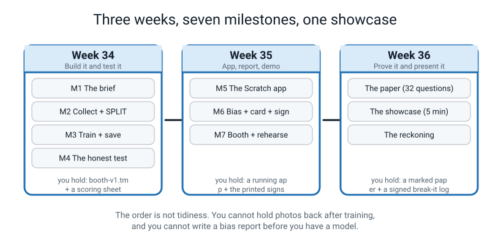
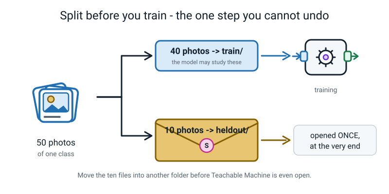
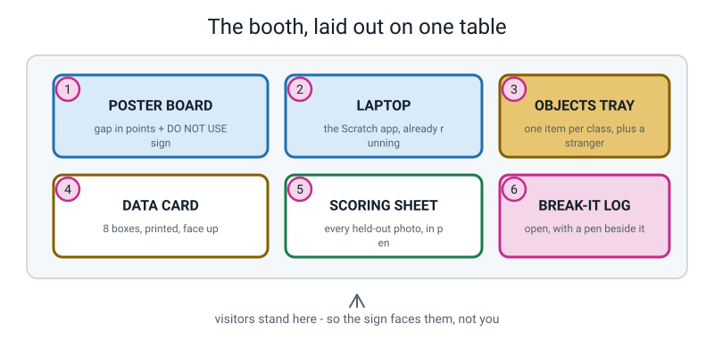
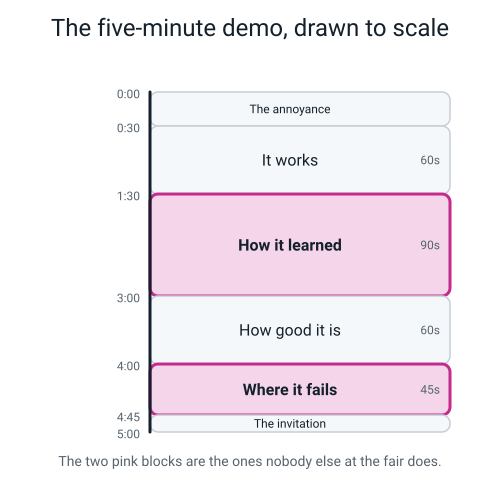
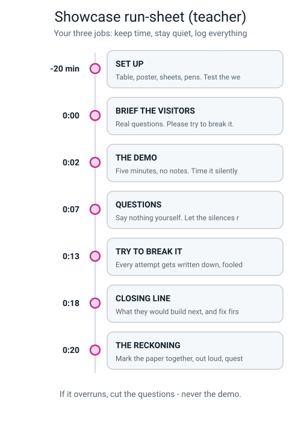

# 🎪 The Level 1 Capstone — The AI Fair Booth

### *Weeks 34, 35 and 36. Three weeks. One booth. One honest number.*

[⬅ Project ideas](project-ideas.md) · [⬅ The worked example](worked-example-project.md) · [Course home](../README.md) · [Week 34 teacher guide](../teacher-guide/week-34.md)

---

> ### In one sentence
>
> **A real AI project is not the model — it is the model plus the honest paperwork saying what it can and
> cannot do, and this is the three weeks where you build both.**

---

## 🧑‍🏫 Teacher: what you actually have to do

You do not need to know any AI. Read this box and you can run all three weeks.

| Week | Your job in class | Time |
|---|---|---|
| **34** | Run a **build sprint**. Keep time. Make sure the photos get split into a separate folder *before* anybody opens Teachable Machine. That one instruction is your single most important job all term | 60–75 min |
| **35** | Run a **booth sprint** with three stations: the app, the sign, the first rehearsal. Do not help with the app beyond the printed steps — struggling with it is the lesson | 60–75 min |
| **36** | Sit the paper, then run the **showcase**. Invite two adults who have never seen the project. Keep time, stay quiet, make sure every break-it attempt gets logged | 90 min + 20 min |

Everything else — the templates, the checklists, the question bank, the rubric, the run-sheet — is printed
in this file. There is nothing to prepare and nothing to research.

> **⚠️ The one thing that cannot be fixed later.** Photos must be moved into a separate `heldout/` folder
> **before** the training tool is opened. If a student trains on everything first, their test number is
> worthless and the only repair is re-collecting. Say it out loud three times in Week 34. Point at the
> folder. Watch them drag the files.

---

# 🪝 The Brief

Your school is running an **AI Fair** in three weeks. Every stall gets one table, one poster board and one
laptop. Adults will wander past, stop for four minutes, poke your thing, and ask questions.

Most stalls will have a demo that works once. Somebody will train a model to tell apples from bananas, hold
up an apple, get `APPLE 99%`, and everyone will clap. Then a parent will hold up their car keys, the model
will say `BANANA 91%`, and the student will say *"ah, it's not trained for that"* and move on.

**You are going to run the one stall that is honest.**

```
   ┌───────────────────────────────────────────────────────────────────┐
   │                                                                   │
   │   Your booth does four things no other stall does.                │
   │                                                                   │
   │   1.  It solves a problem that actually exists in your house.      │
   │       Not apples vs bananas. Something that annoyed somebody       │
   │       last week.                                                   │
   │                                                                   │
   │   2.  It shows an accuracy number measured on photos the model     │
   │       has NEVER seen — as a fraction, so people can see how        │
   │       many photos it was.                                          │
   │                                                                   │
   │   3.  It has a printed sign saying exactly what this model         │
   │       FAILS on, with the gap in percentage points.                 │
   │                                                                   │
   │   4.  You invite visitors to break it. On purpose. And you         │
   │       write down what worked.                                      │
   │                                                                   │
   └───────────────────────────────────────────────────────────────────┘
```

**Why this is the right ending to Level 1.** In a real company the model is maybe 20% of the work. The
other 80% is the data card, the honest test, the bias report, and being able to explain the thing to
somebody who controls the budget. You are building the 80% that nobody teaches.

Every week of this course gave you one piece of it:

| Weeks | The piece | Where it shows up on the booth |
|---|---|---|
| 1–3 | Rules vs learned; narrow AI | Your demo line: *"nobody wrote a rule for this"* |
| 4–6 | Rows, columns, provenance, data cards | The printed data card on the table |
| 7–10 | Thresholds, edge cases, rule explosion | Your 30-second answer to *"couldn't you just write an if-then?"* |
| 11–14 | Features, labels, leaky features, baselines | Choosing classes that are not giveaways |
| 15–18 | Training, variety, confidence, controlled experiments | The model itself, and the sabotage you can demo |
| 19–22 | Hold out, accuracy three ways, confusion matrix | The scoring sheet |
| 23–27 | Pixels, resolution, backgrounds | *Why* it fails on the dark shelf |
| 28–30 | Scratch, lookup tables, next-word | The app that reacts |
| 31–33 | Bias, privacy, over-trust, warning signs | The bias report and the DO NOT USE sign |

---

# 🏠 Choosing Your Problem

**Spend real thought here.** A bad problem choice cannot be rescued by good work later.

### The three tests

```
   TEST 1 — THE ANNOYANCE TEST
   Can you name a specific moment in the last month when this actually
   bothered somebody in your house?
        ✅ "Dad put the milk carton in the wrong bin again on Sunday."
        ❌ "It would be cool to detect cats."

   TEST 2 — THE 3-TO-4 CLASSES TEST
   Does it split into 3 or 4 named classes that a human can also tell
   apart, but has to LOOK to do it?
        ✅ recycling / compost / landfill
        ❌ happy / sad   — you cannot label these reliably yourself

   TEST 3 — THE 50-PHOTOS TEST
   Can you honestly collect 50 genuinely different photos of each class
   in one afternoon, where you actually are?
        ✅ turmeric / chilli / coriander jars — 50 angles each, easy
        ❌ every breed of dog on your street — you do not have access
```

### Problems that work well

| Problem | Classes | Why it's good | Watch out for |
|---|---|---|---|
| **Which bin?** | recycling · compost · landfill · `other` | Real, useful, genuinely hard, everyone at the fair has an opinion | Items get dirty and squashed. That is realistic — include them |
| **Which spice jar?** | turmeric · chilli · coriander · `other` | Identical jars, different contents — forces the model onto real features | Lids on may be impossible. Decide, and write the decision down |
| **Is it ripe?** | not_yet · ready · too_far · `other` | Fully worked through in [the exemplar](worked-example-project.md) | Where the fruit sits when it goes bad. That is a leak waiting to happen |
| **Did I pack it?** | keys · wallet · glasses · `other` | The reacting app writes itself | Objects are small — check what happens at a distance |
| **Whose bottle?** | 3 named bottles + `other` | Personal, funny, superb privacy discussion | Ask each person. Write the permission down |
| **Which charger?** | phone · laptop · headphones · `other` | Cables are hard, which makes the failure analysis rich | Collect both tangled and coiled |
| **Is the door bolted?** | locked · unlocked · `other` | Genuinely useful; great safety-stakes discussion | Only 2 real classes → baseline is 50%. Say so, large |

### Problems to avoid, and why

| Don't do | Why not |
|---|---|
| Anything classifying **people** — mood, age, gender, "does this person look honest" | You cannot collect a fair sample, the labels are not real things, and somebody gets hurt. This is a rule, not a preference |
| Anything **medical** ("is this rash bad?") | A wrong answer causes real harm and you cannot test it honestly |
| Classes you cannot reliably label yourself | If *you* cannot be sure of the right answer, the label column is noise and the test sheet means nothing |
| Fewer than 3 classes when you have a choice | Two classes gives a 50% baseline, and 50%-versus-baseline conversations are dull. Three is the sweet spot |
| Something in somebody else's house or school without asking | Provenance and permission. Ask first, write it in the card |

> 🔑 **The `other` class is compulsory.** Without it, a fork gets classified as a spoon at 74% confidence.
> At a fair, strangers will hold up their car keys. Your model must be able to say *"none of these"* — and
> that means 50 photos of a bare table, hands, and random objects. Twenty minutes well spent.

---

# 🗺️ The Three Weeks



*Figure C.1 — Seven milestones across three weeks. The order is not tidiness.*

```
   ┌──────────┬───────────────────────────────┬─────────┬──────────────────────────┐
   │  WEEK    │  MILESTONES                   │  TIME   │  YOU END UP HOLDING      │
   ├──────────┼───────────────────────────────┼─────────┼──────────────────────────┤
   │          │  M1  The brief                │  20 min │  4 class names + a       │
   │          │                               │         │  success bar in ink      │
   │   34     │  M2  Collect + SPLIT          │  60 min │  train/ and heldout/     │
   │  Build   │  M3  Train + save             │  45 min │  booth-v1.tm on disk     │
   │  and     │  M4  The honest test          │  40 min │  scoring sheet, accuracy │
   │  test    │                               │         │  3 ways, confusion mtx   │
   ├──────────┼───────────────────────────────┼─────────┼──────────────────────────┤
   │          │  M5  ⚠️ The Scratch app        │  75 min │  4 behaviours + a        │
   │   35     │      (hardest milestone)      │         │  working threshold       │
   │  App,    │  M6  Bias + card + sign       │  45 min │  gap in points, printed  │
   │  report, │                               │         │  card, DO NOT USE sign   │
   │  demo    │  M7  Booth + rehearse         │  45 min │  5-min demo said aloud   │
   │          │                               │         │  three times             │
   ├──────────┼───────────────────────────────┼─────────┼──────────────────────────┤
   │   36     │  The paper (32 questions)     │  90 min │  A marked paper          │
   │  Prove   │  The showcase (5 min + Q + A) │  20 min │  A signed break-it log   │
   │  it      │  The reckoning                │  20 min │  A gate self-check with  │
   │          │                               │         │  week numbers on it      │
   └──────────┴───────────────────────────────┴─────────┴──────────────────────────┘
                                                ─────────
                                                 6 h 20 of build + the showcase
```

**Why the order cannot change:**

- You cannot hold photos back **after** training. There is no way to make a model un-see a photo.
- You cannot write a bias report before you have a model to test.
- You cannot rehearse a demo before you have a number to say in it.

---

## 📅 WEEK 34 — Build it and test it honestly

### Milestone 1 — The brief (20 min, homework)

- [ ] Run all three tests on your idea, **in writing**
- [ ] Name your classes properly — `plastic_recycling`, not `Class 1`
- [ ] Add the `other` class
- [ ] Write your **baseline**: with 4 roughly equal classes, blind guessing = 1/4 = **25%**
- [ ] Write your **labelling rule** if the label involves any judgement at all
- [ ] Write one paragraph: what annoys somebody, who it helps, what the model must output

**Copy this into `00-brief.txt`:**

```
   PROBLEM
      In my house, ____________________ happens about ______ times a week.
      The person it annoys most is ____________________.

   WHAT THE MODEL DOES
      Input:   a photo from the laptop webcam of ____________________
      Output:  one of these labels:
                 1. ______________
                 2. ______________
                 3. ______________
                 4. other
      Baseline (blind guessing, 4 equal classes) = 1/4 = 25%
      I will call it useful if it beats ______%   ← pick a number NOW

   MY LABELLING RULE  (only if the label needs any judgement)
      __________ = _______________________________________
      __________ = _______________________________________
      __________ = _______________________________________
      other      = _______________________________________

   WHAT HAPPENS WHEN IT'S RIGHT
      ______________________________________________________

   WHAT HAPPENS WHEN IT'S WRONG
      Worst case: ___________________________________________
      Who gets hurt: ________________________________________
```

> That *"I will call it useful if it beats ___%"* line is not decoration. Writing your success bar
> **before** you see the result is how you stop yourself moving the goalposts. Engineers call it
> pre-registration and it costs one line.

### Milestone 2 — Collect and split (60 min)



*Figure C.2 — Fifty photos per class become forty for training and ten in a sealed envelope.*

- [ ] Photograph **50 per class** (you will hold out 20%, leaving 40 to train on)
- [ ] Work the variety checklist for **every** class, not just the first
- [ ] Tally your conditions **while you shoot** — you need these counts for the bias report and you cannot
      reconstruct them later
- [ ] **SPLIT BEFORE TRAINING.** Move 10 per class into `heldout/` and do not open it again
- [ ] Where you can, take the held-out photos on a **different day or a different surface** — a harder,
      more honest test
- [ ] Write your counts down

**The variety checklist, per class:**

```
   □ 3+ different backgrounds       □ held in a hand AND on a surface
   □ 3+ lighting conditions         □ close up AND far away
   □ 6+ angles / rotations          □ at least 5 slightly "wrong" ones
                                      (partly out of frame, blurry, half hidden)
```

**Copy this into `01-counts.txt`:**

```
   class              total   heldout(20%)   train    daylight  ceiling  lamp
   ─────────────────  ─────   ────────────   ─────    ────────  ───────  ────
   ________________     50          10         40         __       __     __
   ________________     50          10         40         __       __     __
   ________________     50          10         40         __       __     __
   other                50          10         40         __       __     __
   ─────────────────  ─────   ────────────   ─────
   TOTAL               200          40        160

   balance check:  (biggest − smallest) ÷ biggest = ______%     target: under 20%

   surface / background tally (do this one too — it catches leaks):
   class              surface A   surface B   surface C
   ________________       __          __          __
   ________________       __          __          __
   ________________       __          __          __
   other                  __          __          __
```

> **⚠️ The leak that catches everybody.** Look down each column of that second tally. If one class sits
> entirely on one surface — because that is where things go when they are dirty, or ripe, or broken —
> you are about to train a **surface detector** and call it by your object's name. Read [the worked
> example](worked-example-project.md#mistake-1--the-chopping-board-the-big-one) before you shoot. It is
> a whole project built around exactly this mistake.

### Milestone 3 — Train and save (45 min, in class)

- [ ] Teachable Machine → **Image Project** → **Standard image model**
- [ ] Create your 4 classes and **rename them** properly
- [ ] Upload **only** the `train/` folders. Never drag `heldout/` onto anything
- [ ] Check the sample count under each class name matches your table
- [ ] Train with the default settings (50 epochs). Watch the counter
- [ ] **☰ → Download project as file** → save as `booth-v1.tm` **before you do anything else**
- [ ] Live-check: hold up one object of each class. Note the top class and the **margin** (top − second)
- [ ] Hold up something with no class. Does `other` win? Write down what happened

```
   ┌─────────────────────────────────────────────────────────────────┐
   │  ⛔  STOP. Do not start Milestone 4 until booth-v1.tm exists     │
   │      on the actual computer. Milestones 5 and 6 both reload     │
   │      it, and Teachable Machine has no autosave. Every year      │
   │      somebody closes the tab. Do not be that person.            │
   └─────────────────────────────────────────────────────────────────┘
```

### Milestone 4 — The honest test (40 min, in class)

- [ ] Open `heldout/` for the **first time since Milestone 2**
- [ ] Feed each held-out photo to the model, one at a time
- [ ] Record **every** one on paper *as you go* — true label, prediction, top %, ✓/✗
- [ ] Do not skip, retake, or "give it another go". One photo, one attempt
- [ ] Accuracy as **fraction → decimal → percentage**, with the division written out
- [ ] **Per-class accuracy**, one line per class
- [ ] Build the **confusion matrix** by hand
- [ ] Write three sentences: which class is worst, what it is confused with, and which direction of
      mistake causes real harm

**Copy this into `02-testsheet.txt`:**

```
   #   photo               TRUE label    PREDICTED     top %   ✓/✗
   ──  ─────────────────   ──────────    ──────────    ─────   ───
    1  heldout/___/01
    2  heldout/___/02
   ...
   40

   OVERALL   correct = ____ / 40  =  ____  =  ____%
   BASELINE  25%
   GAIN      ____ percentage points above baseline
   MY BAR    I said ____% before training.  Beaten / not beaten.

   PER CLASS   ______ ___/10 = ___%    ______ ___/10 = ___%
               ______ ___/10 = ___%    other  ___/10 = ___%

   HIGHEST CONFIDENCE WHILE WRONG:  ____%   (photo #____)
```

> **⚠️ If you score above about 95% on your first attempt, stop and go looking for a leak.** That is not
> pessimism, it is the most reliable rule of thumb in the whole level. Hold one object of your best class
> somewhere it has never been photographed, and watch what happens.

### Week 34 evidence checklist

```
   □  00-brief.txt, with a success bar written before training
   □  01-counts.txt, with BOTH tallies filled in
   □  train/ and heldout/ as separate folders, counted
   □  booth-v1.tm saved on the computer
   □  02-testsheet.txt with all 40 rows scored in pen
   □  Accuracy as fraction → decimal → percentage, baseline beside it
   □  Per-class accuracy for all four classes
   □  A hand-drawn confusion matrix
   □  Three sentences naming your worst class
```

---

## 📅 WEEK 35 — The app, the report, the demo

### Milestone 5 — The Scratch app (75 min) — *hardest milestone*

- [ ] Decide your route: **A** (the real model inside Scratch) or **B** (the no-upload bridge). Both are
      legitimate; B keeps every photo on your laptop
- [ ] Build a project where **each of your 4 classes triggers a different behaviour**
- [ ] Add a **confidence threshold** so weak predictions say *"not sure"* instead of guessing
- [ ] Test all 4 classes, plus one object that belongs to no class
- [ ] Save two ways: **File → Save to your computer** (`.sb3`) *and* to your Scratch account

**Five states, not four.** This is the bit everybody gets wrong:

```
   1.  class A       →  behaviour A
   2.  class B       →  behaviour B
   3.  class C       →  behaviour C
   4.  other         →  "that's not one of my things"
   5.  BELOW THE THRESHOLD  →  "not sure — ask a human"
```

State 4 and state 5 are **different**. `other` is a class your model can predict, because you collected
photos for it. *"Not sure"* is your **app** refusing to pass on a prediction it does not trust. A model
with no threshold is incapable of hesitating.

> **💡 Try this before you debug anything.** Print the raw confidence value once, with a `say` block, and
> look at it. If it says `0.82` and your threshold says `70`, your comparison will never do what you
> meant. This single step saves about forty minutes per class, every year.

### Milestone 6 — Bias report, data card, warning sign (45 min)

**A bias report is four things, not four numbers:**

1. A **prediction**, written in ink before you test, with the training count that justifies it
2. **Measured accuracy per condition**, from fresh photos, scored on paper
3. A **gap in percentage points**
4. A **priced fix**, in photos and minutes, with the arithmetic shown

- [ ] Write your prediction first: which condition will be worst, and which count says so
- [ ] Collect **3–4 batches of 8–12 fresh photos**: control · new lighting · new hands · new background
- [ ] Score every photo on paper as you go
- [ ] Per-condition accuracy → fraction, decimal, percentage
- [ ] **Accuracy gap** = best % − worst %, in **percentage points**
- [ ] Note the **highest confidence the model gave while being wrong**. Put it on the poster, large
- [ ] Write the data card — all eight boxes
- [ ] Write the **DO NOT USE THIS FOR…** sign. Biggest text on the booth

**The eight data card boxes:**

```
   WHAT IT IS         one line, plus "one row = one ____"
   HOW MUCH           counts, dates
   WHO COLLECTED IT   you, on what, where
   HOW                the method, and your labelling rule
   WHO IT IS ABOUT    people appearing, even hands
   PERMISSION         who said yes, when, and what you said you'd do
   LIMITS             the measured numbers, including the gap
   WHAT IS NOT IN IT  ← the box that earns the marks. Make it uncomfortable
```

### Milestone 7 — Build the booth and rehearse (45 min)



*Figure C.3 — Six objects. The sign faces the visitors, not you.*

- [ ] Lay the table out: laptop, poster, data card, scoring sheet, break-it log, pens, objects tray
- [ ] Write your **5-minute script** using the six segments below
- [ ] Say it **out loud three times**. Time yourself. Reading it silently does not count
- [ ] Get somebody to ask you all six question-bank questions
- [ ] Count your "magic"s. Target: zero
- [ ] Prepare **one deliberate failure** you can demonstrate on request

---

## 📅 WEEK 36 — Prove it, present it, celebrate it

Three parts, in this order, and the order matters.

| Part | What | How long |
|---|---|---|
| **1. The paper** | 32 questions, closed book. The [Term 4 test](../assessments/term-4-test.md) or the full [60-mark paper](../../assessment.md) | 45 or 90 min |
| **2. The showcase** | Two adults who have never seen it. 5 minutes, no notes. Then questions. Then *"try to break it"* | 20 min |
| **3. The reckoning** | Mark the paper together, out loud. Then the gate self-check, with a week number beside every "not yet" | 20 min |

> **⚠️ The paper comes before the applause.** A person who has just been clapped at by two adults will not
> mark themselves honestly. That is not a character flaw, it is just how people work — so design around it.

---

# 📋 The Planning Worksheet

**Print this. Fill it in before Week 34's lesson.** One side of paper. If any box is blank on the day, that
box is the first thing to do.

```
   ┌───────────────────────────────────────────────────────────────────────────┐
   │  CAPSTONE PLANNING WORKSHEET                    name ________________     │
   │                                                                           │
   │  1. THE ANNOYANCE                                                         │
   │     The exact moment this last bothered somebody:                         │
   │     ___________________________________________________________          │
   │     Who it annoyed: ______________   How often: _____ per week            │
   │                                                                           │
   │  2. MY FOUR CLASSES        (three real ones plus other)                    │
   │     1 ______________  2 ______________  3 ______________  4 other         │
   │                                                                           │
   │     Could I look at any one example and be SURE of the label?   Y / N     │
   │     If N — stop. Change the classes now, not later.                        │
   │                                                                           │
   │  3. MY LABELLING RULE      (only if the label needs judgement)             │
   │     ___________________________________________________________          │
   │     Does it contain a NUMBER or a PHYSICAL OBJECT to compare against?     │
   │     Y / N     ("smaller than my thumbnail" = yes.  "looks a bit          │
   │                brown" = no. Go and rewrite it.)                           │
   │                                                                           │
   │  4. THE NUMBERS I ALREADY KNOW, BEFORE I START                            │
   │     Baseline (4 equal classes)  =  1/4  =  25%                            │
   │     My success bar             =  ______%     ← in ink, now               │
   │     Photos per class            =  50                                     │
   │     Held out per class          =  10        (that is 20%)                │
   │     Photos I will train on      =  160                                   │
   │                                                                           │
   │  5. WHERE THE PHOTOS COME FROM                                            │
   │     Three surfaces:   ____________ ____________ ____________              │
   │     Three lightings:  ____________ ____________ ____________              │
   │     Two holders:      ____________ ____________                           │
   │                                                                           │
   │     ⚠️ LEAK CHECK: will any ONE class only ever appear in ONE of those?   │
   │        Y / N      If Y — that is the leak. Fix the plan now.               │
   │                                                                           │
   │  6. MY BIAS PREDICTION, BEFORE ANY TESTING                                │
   │     The condition it will be worst at: ______________________             │
   │     The count that makes me think so:  ______________________             │
   │                                                                           │
   │  7. PERMISSION                                                            │
   │     Whose things am I photographing? ________________________             │
   │     Who said yes, and when?          ________________________             │
   │     Where will the photos end up?    ________________________             │
   │                                                                           │
   │  8. THE ROUTE FOR THE APP        A (model in Scratch)  /  B (bridge)      │
   │     Why: __________________________________________________              │
   │                                                                           │
   │  9. THE THREE THINGS MOST LIKELY TO GO WRONG FOR ME                       │
   │     1 ______________________  what I'll do: ________________              │
   │     2 ______________________  what I'll do: ________________              │
   │     3 ______________________  what I'll do: ________________              │
   └───────────────────────────────────────────────────────────────────────────┘
```

---

# ✅ The Build Checklist

Tick these in order. Nothing below a line starts until everything above it is ticked.

```
   ═══ WEEK 34 ═══════════════════════════════════════════════════════

   THE BRIEF
   □ Three tests run in writing
   □ 4 classes named properly, including other
   □ Labelling rule written, with a number or an object in it
   □ Baseline written: 1/4 = 25%
   □ Success bar written IN INK before any training

   COLLECT AND SPLIT
   □ 50 photos per class
   □ Variety checklist worked for EVERY class
   □ Condition tally filled in WHILE shooting (lighting + surface)
   □ Leak check done: no class sits on only one surface
   □ 10 per class MOVED into heldout/ BEFORE opening Teachable Machine
   □ Balance check computed, under 20%

   TRAIN
   □ Only train/ uploaded
   □ Sample counts under each class match the table
   □ Trained at 50 epochs
   □ booth-v1.tm DOWNLOADED to the computer
   □ Live-checked one object per class, margin noted
   □ Live-checked one object of NO class — did other win?

   THE HONEST TEST
   □ heldout/ opened for the first time
   □ All 40 scored on paper, in pen, one attempt each
   □ Accuracy: fraction → decimal → percentage, division shown
   □ Baseline printed right next to it
   □ Per-class accuracy, all four classes
   □ Confusion matrix drawn by hand
   □ Worst class named, with what it gets confused WITH
   □ Highest confidence while wrong, written down
   □ If accuracy > 95%: leak hunt done and written up

   ═══ WEEK 35 ═══════════════════════════════════════════════════════

   THE APP
   □ Route chosen and justified in one line
   □ 4 distinct behaviours, one per class
   □ Raw confidence value printed once and looked at
   □ Confidence threshold working → "not sure" below the cut-off
   □ All five states tested, including "not sure"
   □ Tested with an object belonging to no class
   □ Saved as .sb3 AND to the Scratch account
   □ Route B booths: honesty sign printed

   THE BIAS REPORT
   □ Prediction written IN INK before testing
   □ 3–4 conditions, 8+ fresh photos each
   □ Every photo scored on paper as it happened
   □ Per-condition accuracy, divisions shown
   □ Gap in PERCENTAGE POINTS
   □ Fix priced in photos AND minutes, arithmetic shown
   □ Prediction reported — whether or not it was right

   THE PAPERWORK
   □ Data card, all 8 boxes, printed
   □ "What is NOT in it" is specific and uncomfortable
   □ DO NOT USE sign — the boldest text on the booth
   □ Sign contains a MEASURED NUMBER and a NAMED condition
   □ Break-it log ruled up, with a pen beside it

   THE DEMO
   □ Script written, six segments in order
   □ Said out loud three times, at least twice to a real person
   □ Timed at 5 minutes or under
   □ All six question-bank answers rehearsed
   □ Zero uses of "magic"
   □ One deliberate failure ready to DEMONSTRATE, not describe

   ═══ WEEK 36 ═══════════════════════════════════════════════════════

   □ Paper sat, closed book, BEFORE the showcase
   □ Two adults invited who have never seen it
   □ Table laid out, sign facing the visitors
   □ Notes in a pocket or face down and out of reach
   □ Break-it log open, pen out
   □ Paper marked together, out loud
   □ Gate self-check done, with a WEEK NUMBER beside every "not yet"
```

---

# 🎤 Presenting It — How an 11-Year-Old Talks to a Room

## The five minutes, to scale



*Figure C.4 — The two tinted blocks are the ones nobody else at the fair does. Never cut those two.*

| At | Segment | Say something like |
|---|---|---|
| **0:00** | **The annoyance** (30 s) | *"My dad puts the milk carton in the wrong bin about twice a week. Here's a thing that tells you which bin."* **Start with the person, not the technology.** |
| **0:30** | **It works** (60 s) | Hold up one item per class. Let them watch it react. Say the confidence out loud each time. |
| **1:30** | **How it learned** (90 s) | *"I took 200 photos and typed the right answer next to each one. Nobody wrote a rule. The program looked at 160 of them and found its own pattern. That bit is called **training**. What comes out is the **model** — the guessing machine."* Point at the data card while you talk. |
| **3:00** | **How good it actually is** (60 s) | *"I hid 40 photos before training and it never saw them. It got 33 of 40 right — that's 82.5%. Guessing blind would be 25%. Here's the sheet."* Hand them the sheet. |
| **4:00** | **Where it fails** (45 s) | *"It's 91% in daylight and 42% under a lamp, because 183 of my 200 photos were taken in the afternoon. That's a 49-point gap. Watch —"* then **make it fail**. |
| **4:45** | **The invitation** (15 s) | *"Try to break it. If you manage, I'll write down what you did."* Hold out the pen. |

## Six rules for the person standing up

1. **Notes away.** In a pocket, or face down and out of reach. Not held.
2. **Stand up**, facing the visitors, not the screen.
3. **Six segments, in order.** Overrunning is normal. Skipping *how it learned* or *where it fails* is not.
4. **The failure gets demonstrated, not described.** Turn the lamp on. Hold up the squashed pot.
5. **Every break attempt gets logged** — what they showed it, what it said, the confidence, whether they
   fooled it, and one line of "my guess why".
6. **"I don't know" is allowed**, with a follow-up: *"my guess is ___, and the way I'd find out is ___."*

## The question bank — rehearse all six out loud

| They ask | What a good answer contains |
|---|---|
| *"But how does it actually know?"* | It doesn't *know* anything. It saw 160 labelled photos and found which patterns go with which answer, then matches new photos against them. Must contain **training** and **model** |
| *"Couldn't you just write an if-then rule?"* | Tried it. "Shiny" catches the can **and** the crisp packet. Then 258 more rules. That's **rule explosion**, and it's why people train models from examples instead |
| *"What happens when it's wrong?"* | A pot in the wrong bin. Annoying, nobody hurt — which is *why* I chose this problem. Then point at the sign |
| *"Is my photo going to Google?"* | Answer precisely for your route. B: nothing left the laptop, including the model. A: the photos stayed here, but the finished model is on a link, and an adult approved that. **Precision beats reassurance** |
| *"How much better than guessing?"* | 25% is blind guessing with four classes. Mine got 82.5%. That's 57.5 percentage points better — and here's the fraction, 33 out of 40, so you can see it was 40 photos and not 4,000 |
| *"Should a school/council use this?"* | No, with a number: 42% under a lamp. To make it usable I'd need about 42 more lamplight photos — here's the arithmetic |

## 🚫 The banned words

```
   magic  ·  it just knows  ·  the AI figured it out  ·  it's smart
   it thinks  ·  the computer brain  ·  it understands  ·  obviously
```

Rehearse with a listener holding up a finger for each slip. Three fingers means start that sentence again.
It feels silly and it works — these are habits, and habits only break under a little pressure.

## Nerves — five things that genuinely help

| The feeling | What to do |
|---|---|
| *"My voice is going to shake."* | Say the first sentence to the **table**, not the people. By sentence two you will have forgotten to be frightened. Everybody's first sentence is wobbly, including adults' |
| *"What if it doesn't work in front of them?"* | Then you have an unplanned segment 5. Say: *"that's a good one — let me tell you why that happened"* and reach for the training counts. A booth where the model fails and the presenter explains it beats a booth where it works |
| *"What if I forget the number?"* | The numbers are printed on the poster behind you, and looking at your own poster is allowed. Notes in your hand are not; a poster on a board is |
| *"What if they ask something I can't answer?"* | Say *"I don't know."* Then add the two-part follow-up: *"my guess is ___, and the way I'd find out is ___."* That answer scores higher than a confident wrong one |
| *"Five minutes is so long."* | It is 300 seconds and you have six segments, so it is really six short things. Nobody can talk for five minutes. Anybody can talk for 45 seconds, six times |

> **💡 The invitation has to come from you.** Hold the pen out and say *"please try to break it — I'll write
> down what you did."* If an adult offers first, it feels like criticism. If you offer, it's an experiment,
> and adults love being part of an experiment.

---

# 🧑‍🏫 The Showcase Run-Sheet



*Figure C.5 — Your three jobs: keep time, stay quiet, log everything.*

```
   ┌──────────┬─────────────────────────┬───────────────────────────────────────┐
   │  TIME    │  WHAT HAPPENS           │  WHAT YOU DO                          │
   ├──────────┼─────────────────────────┼───────────────────────────────────────┤
   │ −20 min  │  Set up                 │  Table, poster, sheets, pens.         │
   │          │                         │  Test the webcam TWICE. Check the     │
   │          │                         │  laptop is charged and not on         │
   │          │                         │  battery-saver (it dims the camera).  │
   ├──────────┼─────────────────────────┼───────────────────────────────────────┤
   │  0:00    │  Visitors arrive.       │  Brief them, out of the student's      │
   │          │  Student is standing.   │  earshot: "ask real questions, and     │
   │          │  Notes away.            │  please try to break it."              │
   ├──────────┼─────────────────────────┼───────────────────────────────────────┤
   │  0:02    │  THE DEMO — 5 minutes,  │  Time it silently. Count banned words  │
   │          │  no notes, six segments │  out of the student's sight. Do NOT    │
   │          │                         │  prompt, even if a segment is skipped. │
   ├──────────┼─────────────────────────┼───────────────────────────────────────┤
   │  0:07    │  THE QUESTIONS.         │  Say nothing. Let silences run — they  │
   │          │  Anything they like.    │  feel long to you and are fine for the │
   │          │                         │  student. Do not translate a question. │
   ├──────────┼─────────────────────────┼───────────────────────────────────────┤
   │  0:13    │  "TRY TO BREAK IT."     │  Make sure EVERY attempt gets written  │
   │          │  Log open, pen out.     │  in the log — fooled or not. This is   │
   │          │                         │  the bit most likely to be skipped.    │
   ├──────────┼─────────────────────────┼───────────────────────────────────────┤
   │  0:18    │  Closing line: what     │  Thank the visitors in front of the    │
   │          │  they'd build next and  │  student, out loud, naming one          │
   │          │  fix first              │  specific thing they did well.          │
   ├──────────┼─────────────────────────┼───────────────────────────────────────┤
   │  0:20    │  THE RECKONING          │  Mark the paper together, out loud,    │
   │          │                         │  question by question. Then the gate   │
   │          │                         │  self-check, week numbers and all.     │
   └──────────┴─────────────────────────┴───────────────────────────────────────┘

   If it overruns: cut the questions. NEVER cut the demo.
```

## What to say to the visiting adults, before they come in

Read them this, quietly:

> *"Thank you for coming. Three things. First: please ask real questions — 'how does it know?' and 'is my
> photo going to Google?' are the two we most want. Second: please try to break it. Hold up your car keys.
> That is not rude, it is the point of the stall, and it will get written down. Third: if it fails, please
> do not rescue them — ask them why it failed. That question is worth more than any answer I could give
> you."*

## Triage — what to do when something breaks on the day

| Problem | Do this |
|---|---|
| **The model will not load** | Reload `booth-v1.tm` from the file. This is why Milestone 3 has a STOP box. If there is no file, the student presents the scoring sheet, the matrix and the sign, and explains the model verbally. That is still a 3 on most rubric rows |
| **The webcam is dead** | Present from the printed photos. Hold a printed held-out photo up to a phone camera if you must. The paperwork is 80% of the marks and none of it needs a camera |
| **Scratch will not connect to the model** | Route B, immediately: the student reads the prediction off the Teachable Machine preview and types it into Scratch by hand. Print the honesty sign saying so. It is a legitimate route, not a failure |
| **The model is wrong on everything in the room's lighting** | This is a **gift**. It is segment 5 arriving early. Have the student say the daylight number, the room number, and the training count, and hand over the pen |
| **The student freezes** | Say one thing only: *"start with the annoyance."* Then go quiet again. Do not feed them lines |
| **A student is two milestones behind on Week 36 morning** | Cut Milestone 5 to two behaviours and no threshold, and protect Milestone 4 and Milestone 6 completely. The honest test and the bias report carry twice the marks of the app |

---

# 📊 The Rubric

**Score each row 1–4.** 9–14 Beginning · 15–20 Developing · 21–26 Proficient · **27–32 Exceptional**

| Criterion | 1 · Beginning | 2 · Developing | 3 · Proficient | 4 · Exceptional |
|---|---|---|---|---|
| **1. Problem and classes** | Generic demo task; classes vague or unnamed | A real-ish task; 3 classes named but no `other`; no baseline stated | A genuine household annoyance; 3 well-chosen classes + `other`; baseline stated as 25%; labelling rule written if needed | Classes chosen *because* they are hard to tell apart; the brief names who is helped **and** who is hurt; a success bar written before training |
| **2. Data and data card** | Under 20 photos per class; no card, or a card that only says what the data is | 30+ per class; card covers what and how many; provenance vague | 50 per class, balanced within 20%; all 8 boxes including permission and "what's NOT in it" | Conditions tallied across 3+ dimensions **during** collection; "what's NOT in it" is specific and uncomfortable; permission documented with names and dates |
| **3. Honest testing** | Tested on training photos, or "it worked when I tried it" | Some photos held out but **after** training, or fewer than 15; accuracy given only as a percentage | 20% held out **before** training; every held-out photo scored on paper; fraction → decimal → percentage with the division shown; baseline printed alongside | Held-out set deliberately from a different day or surface; per-class accuracy; hand-built confusion matrix; worst class named **with what it is confused with**; a high score investigated as a possible leak |
| **4. The app** | Doesn't run, or shows a prediction with no reaction | Runs; one or two behaviours; needs the author to nurse it | 4 distinct behaviours, one per class; runs unattended; saved two ways | A working **confidence threshold** saying "not sure"; the low-confidence case **demonstrated** on purpose; Route B booths carry the honesty sign |
| **5. Bias report** | Not attempted, or "it works for everyone" | Notices something is worse without measuring it | 3–4 conditions, 8+ fresh photos each, scored on paper; per-condition accuracy; **gap in percentage points**; a named failing condition | Prediction written **before** testing and reported either way; the highest confidence given while **wrong**, displayed large; a fix priced in photos **and** minutes with the arithmetic shown |
| **6. Honesty and limits** | No limits mentioned; over-claims | Limits mentioned vaguely, in conversation only | A printed **"DO NOT USE THIS FOR…"** sign; the card's limits match the measured numbers | The sign is the boldest thing on the booth and contains a measured number and a named condition; visitors actively invited to break it; the log filled in and one visitor finding shown off |
| **7. The demo** | Reads from a script; uses "magic"; can't answer questions | Delivers it but stumbles on "how does it know?"; one or two "magic"s slip out | 5 minutes, no notes, **zero** "magic"s; explains training → model → prediction in their own words | Answers an unprepared question by reasoning from data (*"that would fail, because I only had 6 photos in lamplight"*); volunteers a failure before being asked |
| **8. Craft and completeness** | Loose papers, missing artefacts | Most artefacts present, hard to read | All must-haves present, legible, laid out so a stranger can follow without help | A stranger could reproduce the whole project from the folder alone; everything in pen; the break-it log complete |

> **🧑‍🏫 How to use this rubric without crushing anybody.** Score it, then write **one sentence per 3** in
> the shape *"to reach 4 you would have ______."* Every 3 on this rubric is one specific action away from a
> 4, and almost all of them are five-second actions — *show* the failure instead of describing it, log the
> fourth visitor, say the guess out loud. See [the marked exemplar](worked-example-project.md#marked-rubric)
> for a full worked example of feedback written this way.

---

# ⚠️ Common Capstone Mistakes

| Mistake | Why it happens | The fix |
|---|---|---|
| Training first, splitting after | Uploading everything feels natural and holding photos back feels wasteful | Move files into `heldout/` **before** opening Teachable Machine. There is no way to un-see data |
| Skipping the `other` class | Your own testing only ever uses your three real objects | Strangers will hold up car keys. 50 photos of "none of the above" is 20 minutes well spent |
| One class living on one surface | Real houses are tidy in ways that match the label | Do the surface tally *while shooting* and read down the columns. See [the exemplar](worked-example-project.md#mistake-1--the-chopping-board-the-big-one) |
| Reporting one accuracy number | It is the easiest to compute and the nicest to say | Per-class accuracy plus a confusion matrix. One number hides your broken class |
| Believing a 97% | It looks like success | Above about 95% on attempt one, go looking for a leak. Hold one object somewhere it has never been photographed |
| Retaking a held-out photo because "the lighting was off" | It feels like fairness | It is cheating. One photo, one attempt. If lighting matters, that **is** the finding — put it in the bias report |
| Fishing for a bias result instead of predicting one | Testing 12 conditions and reporting the worst feels thorough | Predict **one** condition in writing before you test. Report it either way |
| Four hours on the sprites, twenty minutes on the test sheet | Animation gives instant feedback; arithmetic does not | The rubric weights honesty above polish, on purpose |
| Saying "it's 95% accurate" with no fraction | Percentages sound official | Say "19 out of 20." Then people know it was 20 photos and can judge for themselves |
| Closing the Teachable Machine tab | There is no autosave and no warning | Download `booth-v1.tm` the moment training finishes |
| Describing the failure instead of showing it | Showing it feels risky in front of adults | Turn the lamp on. This single habit is worth three rubric marks in three different rows |

---

# 🔑 The Six Things The Capstone Proves

- **The model is the easy 20%.** The data card, the honest test, the bias report and the explanation are
  the work — and they are what makes anyone trust the model.
- **Split before you train.** It is the only step in the whole project that cannot be fixed afterwards.
- **A number without a fraction and a baseline is a boast, not a measurement.** "33 out of 40, against a
  baseline of 25%" is a fact. "95% accurate" is marketing.
- **Every model fails on somebody.** Your job is to find out who **first**, print it in the biggest text
  on your booth, and price the fix in photos and minutes.
- **"I don't know" is a feature.** A confidence threshold that refuses to guess is worth more than one
  more percentage point of accuracy.
- **If you cannot explain it without the word "magic", you do not understand it yet** — and the fix is
  always to go back to the data.

---

## 🎓 And then the door

Level 2 hands you a keyboard. Almost nothing in it is a new idea.

| You already own this | Level 2 gives it a keyboard |
|---|---|
| A table of examples | `pandas.DataFrame` |
| Features and a label | `X` and `y` |
| "Hide 20% before training" | `train_test_split(X, y, test_size=0.2)` |
| correct ÷ total | `accuracy_score(y_test, y_pred)` |
| Your paper confusion matrix | `confusion_matrix(y_test, y_pred)` |
| Confidence scores | `model.predict_proba(X_new)` |
| "Which class is it worst at?" | `classification_report(...)` |

Look at that `test_size=0.2`. That is your envelope. Somebody wrote `0.2` in a library used by millions of
people, for exactly the reason you sealed ten photos out of every fifty.

**The ideas do not change. Only the typing does.** That is precisely why you did this level slowly.

---

[⬅ Project ideas](project-ideas.md) · [⬅ The worked example](worked-example-project.md) · [Assessments](../assessments/README.md) · [Course home](../README.md)
