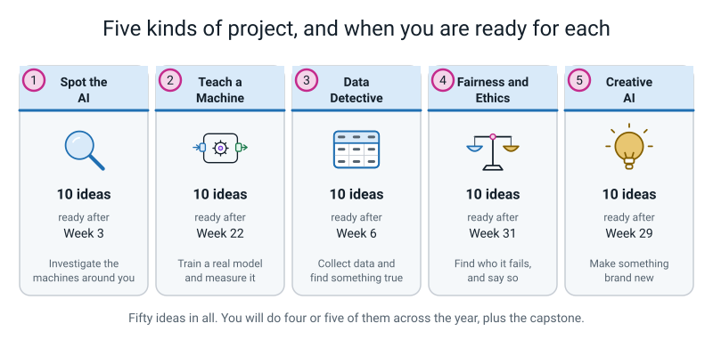

# 🛠️ Fifty Project Ideas — Level 1 Explorer

[⬅ Course home](../README.md) · [The worked example ➡](worked-example-project.md) · [The capstone ➡](capstone.md) · [Assessments](../assessments/README.md)

---

> ### In one sentence
>
> **Fifty things you could actually build this year — pick one, and pick it because you genuinely want
> to know the answer.**

---

## 🪝 How to use this page

This is a **menu**, not a list of homework. Nothing here is compulsory. You will do maybe four or five
of these across the whole year, plus the [capstone](capstone.md) at the end.

The projects are sorted into five kinds:

| | Category | What you do | Best weeks to start |
|---|---|---|---|
| 🕵️ | [**Spot the AI**](#-spot-the-ai) | Investigate the machines already in your life | After Weeks 1–3 |
| 🤖 | [**Teach a Machine**](#-teach-a-machine) | Train a real model and measure it honestly | After Weeks 15–22 |
| 🔍 | [**Data Detective**](#-data-detective) | Collect data by hand and find something real in it | After Weeks 4–9, 23–29 |
| ⚖️ | [**Fairness and Ethics**](#-fairness-and-ethics) | Find out who a system fails, and say so | After Weeks 8, 31–33 |
| 🎨 | [**Creative AI**](#-creative-ai) | Make something that did not exist before | After Weeks 23–30 |



*Figure P.1 — The five categories, with the earliest week each one makes sense.*

**The difficulty stars mean exactly this:**

| | Meaning |
|---|---|
| ⭐ | You could finish it this afternoon, on your own, with things already in the house |
| ⭐⭐ | Needs two or three sittings, and one thing in it will go wrong the first time |
| ⭐⭐⭐ | Needs planning, more than one day, and probably one adult to help with a step |

---

> **⚠️ Read this before you pick anything.** Three rules apply to every single project on this page,
> and they are rules, not preferences.
>
> 1. **Never build anything that classifies people** — their mood, age, gender, how trustworthy they
>    look, how clever they are. You cannot collect a fair sample, the labels are not real things, and
>    somebody gets hurt. Objects, sounds, plants, handwriting, bins: yes. People: no.
> 2. **Ask before you use somebody else's stuff.** Their bottle, their handwriting, their voice, their
>    photo. Write the permission down. That sentence goes in your data card.
> 3. **Nothing medical.** *"Is this rash bad?"* has a wrong answer that hurts somebody, and you cannot
>    test it honestly.

> **💡 Try this before you start any project: the three tests.**
>
> ```
>    TEST 1 — THE ANNOYANCE TEST
>    Can you name a real moment in the last month when this bothered
>    somebody in your house?
>       ✅ "Dad put the milk carton in the wrong bin again on Sunday."
>       ❌ "It would be cool to detect cats."
>
>    TEST 2 — THE COULD-I-LABEL-IT TEST
>    Could YOU look at any one example and be sure of the right answer?
>       ✅ recycling / compost / landfill
>       ❌ happy / sad — you cannot label these reliably yourself
>
>    TEST 3 — THE COULD-I-ACTUALLY-COLLECT-IT TEST
>    Can you honestly get the data in the time you have, from where you are?
>       ✅ 40 photos of three spice jars — one afternoon
>       ❌ every breed of dog on your street — you do not have access
> ```
>
> A project that fails one of these three cannot be rescued by working harder later. Swap it now.

---

# 🕵️ Spot the AI

*Ten investigations into the machines you already use. No coding, no training — just looking properly.*

---

### 1. The 24-Hour AI Hunt

> *Write down every single AI you touch in one day, and say who wrote its rules.*

| | |
|---|---|
| **Difficulty** | ⭐ |
| **Time** | 60 minutes of writing, spread over one day |
| **Tools** | A notebook and a pen. Nothing else |
| **Best after** | Week 3 |

**You will learn:** how to sort any system into *a human wrote the steps* / *a machine learned it from
examples* / *it generates new content* — and how to be honest about the ones you genuinely cannot tell.

**Steps:**

1. From the moment you wake up, write down every machine that makes a decision for you. Aim for 15.
2. For each one, write the decision in the shape *"it decides ______"*.
3. Ask the two-people test on that decision: could two sensible people disagree about the answer?
4. Sort each into `rules` / `learned` / `generating` / `not sure yet`.
5. Take your three hardest calls and write a paragraph defending each one.

**Done well looks like:** 15 rows, every one with a *decision* written out, and a `not sure` pile that
you are proud of rather than embarrassed by. The three defended hard calls are the whole project — a
list of 15 obvious ones with no argument in it is a shopping list, not an investigation.

---

### 2. Rule or Learned? The Family Quiz Show

> *Run a game show at the dinner table where you are the host and your family are the contestants.*

| | |
|---|---|
| **Difficulty** | ⭐⭐ |
| **Time** | 90 minutes to build, 20 minutes to run |
| **Tools** | Index cards, a marker pen, a scoreboard |
| **Best after** | Week 3 |

**You will learn:** that you understand something only when you can score somebody else's answer to it —
and that adults are worse at this than they expect.

**Steps:**

1. Write 20 cards. On each front: one machine or app. On the back: the answer and your one-line reason.
2. Include at least 5 deliberately hard ones. A thermostat, a factory arm, a calculator, autocorrect, a
   supermarket self-checkout.
3. Run the show. Contestants answer *rules* / *learned* / *generating*. You award the point and read the
   reason aloud.
4. Record every disagreement. Do not settle it by being the host — settle it with the two-people test.
5. Write up the three cards that caused the most argument and why.

**Done well looks like:** at least three real arguments, and a written note where you changed your own
answer because a contestant convinced you. If nobody argued, your cards were too easy.

---

### 3. The Autocomplete Autopsy

> *Prove, with a tally sheet, that your phone keyboard is doing arithmetic and not thinking.*

| | |
|---|---|
| **Difficulty** | ⭐ |
| **Time** | 45 minutes |
| **Tools** | Any phone or tablet keyboard, a tally sheet |
| **Best after** | Week 28 |

**You will learn:** that the three suggestion keys are literally the top three rows of a next-word
table, sorted by count.

**Steps:**

1. Pick five sentence starts: *"I am going to the…"*, *"Can you please…"*, *"See you at…"*, and two of
   your own.
2. Type each one twenty times, on a fresh line each time, and write down all three suggestions each time.
3. Tally how often each suggested word appears. Sort your tallies by count.
4. Now type one start on somebody else's phone and compare. Note every difference.
5. Write one paragraph: where did those counts come from, and why are two phones different?

**Done well looks like:** a sorted tally table, and an explanation that contains the words *count* and
*table* and does not contain the word *understands*. The comparison with a second phone is what turns
this from a stunt into evidence.

---

### 4. Confidently Wrong: A Collection

> *Hunt down ten times an AI was completely sure and completely wrong, and frame them.*

| | |
|---|---|
| **Difficulty** | ⭐⭐ |
| **Time** | 90 minutes, collected over a week |
| **Tools** | Whatever AI you already have permission to use; screenshots or a notebook |
| **Best after** | Week 16 |

**You will learn:** the single most useful fact in the whole level — a confidence score is a guess
strength, not a promise.

**Steps:**

1. Choose three systems you are allowed to use: a photo app's search, a keyboard, Quick Draw!, a voice
   assistant, a translation tool.
2. Hunt for confident wrong answers. Write down the input, the output, and the confidence if it shows one.
3. For each, write one sentence guessing **why** it went wrong — what pattern did it probably latch onto?
4. Sort your ten into groups by *kind* of wrongness.
5. Pick the one that would have caused the most trouble if somebody had believed it, and say why.

**Done well looks like:** ten real examples with your own guessed explanation for each, grouped by kind.
The guessed explanations are the project. Ten screenshots with no reasoning is a scrapbook.

---

### 5. The Narrow AI Sideways Step

> *Take eight AIs that are brilliant at one thing, and break every one of them by stepping one inch sideways.*

| | |
|---|---|
| **Difficulty** | ⭐⭐ |
| **Time** | 75 minutes |
| **Tools** | A browser, a notebook |
| **Best after** | Week 3 |

**You will learn:** what *narrow* actually means — not "small", but "blank one step outside its job".

**Steps:**

1. List eight systems and, for each, write down the one job it does, precisely.
2. For each, invent the **smallest possible** sideways step. Not a silly request — a nearly-reasonable one.
3. Try it. Write down exactly what happened, word for word.
4. Note whether it failed **loudly** (told you it could not help) or **silently** (gave you nonsense
   confidently).
5. Rank your eight from *most gracefully narrow* to *most dangerously narrow*, and defend the ranking.

**Done well looks like:** the steps are genuinely small — asking Quick Draw! to draw rather than guess,
asking a translator for a word that does not exist in the other language. Big silly requests prove
nothing. The loud/silent column is what makes the ranking defensible.

---

### 6. Who Wrote This Rule? A Museum of Machines

> *Turn one room of your house into a labelled museum where every machine has a card explaining itself.*

| | |
|---|---|
| **Difficulty** | ⭐⭐ |
| **Time** | 2 hours |
| **Tools** | Card, string, tape, a marker pen |
| **Best after** | Week 3 |

**You will learn:** to write a one-card explanation of a system that a stranger can read in ten seconds
— which is exactly the skill the capstone poster needs.

**Steps:**

1. Pick 12 machines in one room. Include boring ones: the kettle, the light switch, the microwave.
2. Write a museum card for each: **what decision it makes · who wrote the rules · does it need judgement
   · is it AI**.
3. Colour-code the cards by category, and add a shape or a word so it still works in black and white.
4. Physically label the room. Tape the cards on.
5. Walk one adult round the museum without notes, and write down every question they asked that you could
   not answer.

**Done well looks like:** the boring machines are the best cards, because they are where the argument
lives. A museum of only the exciting machines has skipped the hard thinking. The list of questions you
could not answer is the second half of the project.

---

### 7. The Recommendation Diary

> *Spend a week reverse-engineering what a video feed thinks you like — then test your theory.*

| | |
|---|---|
| **Difficulty** | ⭐⭐⭐ |
| **Time** | 10 minutes a day for a week, plus 90 minutes of write-up |
| **Tools** | A notebook, an adult's permission, whatever feed you are allowed to use |
| **Best after** | Week 12 |

**You will learn:** what a *feature* looks like from the outside, and how to test a theory about a system
you cannot see inside.

**Steps:**

1. Every day for five days, write down the first six things the feed offers you, and what you watched.
2. After three days, write your **theory** in ink: which three things do you think it is using?
3. Design one experiment. Watch two videos of something you have never watched before, then record what
   the feed offers you the next day.
4. Write down what you predicted **before** you looked. Then look.
5. Write up the result honestly, including if your theory was wrong.

**Done well looks like:** the theory was written down before the experiment, in ink, and reported either
way. Human memory rewrites itself after you see a result — everybody genuinely remembers having predicted
what happened. The only defence is ink.

---

### 8. The Judgement Slider Wall

> *Build a wall-sized sliding scale and argue about where twenty jobs belong on it.*

| | |
|---|---|
| **Difficulty** | ⭐ |
| **Time** | 60 minutes |
| **Tools** | A long strip of paper or string, 20 cards, sticky tack |
| **Best after** | Week 1 |

**You will learn:** that judgement is a slider and not a switch, and that the interesting jobs live in
the middle.

**Steps:**

1. Draw a line. Label the left end *"one right answer"* and the right end *"no single right answer"*.
2. Write 20 jobs on cards. Mix in easy ends and awkward middles: marking a spelling test, marking an essay,
   sorting recycling, choosing a thumbnail, deciding if a photo is blurry.
3. Place each card. You must be able to say the two-people test out loud for each one.
4. Get somebody else to move any three cards they disagree with. Do not stop them.
5. For each moved card, write a sentence on who was right and why.

**Done well looks like:** at least four cards clustered in the middle third, and three cards somebody
else moved. If everything sits at the two ends, the cards were chosen to avoid the argument.

---

### 9. Spot the Stack

> *Take one app apart and prove it is a stack of rule-based bits and learned bits glued together.*

| | |
|---|---|
| **Difficulty** | ⭐⭐⭐ |
| **Time** | 2 hours |
| **Tools** | A browser, paper, a pencil |
| **Best after** | Week 3 |

**You will learn:** that almost no real product is "an AI" — it is a pipeline, and only some stages
learned anything.

**Steps:**

1. Pick one app you use constantly. A camera app, a music app, a messaging app.
2. List every decision it makes, in the order it makes them. Aim for eight stages.
3. For each stage, mark `rules` / `learned` / `generating` / `not sure`, with one line of reasoning.
4. Draw the whole thing as a flowchart, left to right, with the learned stages shaded.
5. Circle the one stage you are least sure about and write the question you would ask an engineer.

**Done well looks like:** a flowchart with at least two rule-based stages and at least one learned stage,
and one honestly circled unknown. Marking everything "learned" is the mistake this project exists to
break.

---

### 10. The Magic Word Ban

> *Rewrite ten real headlines about AI so that they are honest, then explain what each one was hiding.*

| | |
|---|---|
| **Difficulty** | ⭐⭐ |
| **Time** | 75 minutes |
| **Tools** | Ten real headlines from newspapers or news sites, an adult to help find them |
| **Best after** | Week 2 |

**You will learn:** to spot the exact words that do the over-claiming — *knows*, *understands*, *thinks*,
*brain*, *magic* — and to replace them with a mechanism.

**Steps:**

1. Collect ten real headlines about AI. Keep them exactly as printed.
2. Underline every word that claims a machine thinks, knows, feels or understands.
3. Rewrite each headline honestly. Your version must contain either the word *examples* or the word
   *predicts*, and no banned words.
4. Under each pair, write one line: **what was the original hiding?**
5. Pick the headline that was closest to honest already and say why it worked.

**Done well looks like:** ten rewrites that are still readable as headlines. Turning a headline into a
paragraph is cheating — the challenge is being honest *and* short, which is exactly why so much
journalism about AI is not.

---

# 🤖 Teach a Machine

*Ten real models, trained without writing a line of code, and measured properly.*

> **All ten of these use [Google Teachable Machine](https://teachablemachine.withgoogle.com) in a browser
> — no installing, no account needed for image projects. Every one of them needs the same non-negotiable
> step: **split your examples before you train**, and never let the model see the held-out pile.*

---

### 11. Which Bin?

> *Point your webcam at any bit of rubbish and be told, out loud, which bin it belongs in.*

| | |
|---|---|
| **Difficulty** | ⭐⭐ |
| **Time** | About 3 hours across three sittings |
| **Tools** | Teachable Machine, a webcam, Scratch, a printer |
| **Best after** | Week 22 |

**You will learn:** the whole pipeline end to end — collect, split, train, score honestly, find the class
it is worst at, and say so on a sign.

**Steps:**

1. Name four classes: `recycling`, `compost`, `landfill`, `other`. The `other` class is compulsory.
2. Photograph 50 real items per class, working the variety checklist: 3+ backgrounds, 3+ lighting
   conditions, 6+ angles, close and far, plus 5 deliberately bad ones.
3. **Move 10 per class into a `heldout/` folder before opening Teachable Machine.**
4. Train. Save the project file immediately.
5. Score all 40 held-out photos on paper, in pen, one attempt each. Accuracy as fraction → decimal →
   percentage. Build the confusion matrix by hand.
6. Build a Scratch app with four different reactions, plus a *"not sure"* below 70%.

**Done well looks like:** the accuracy is printed next to the baseline of 25% and next to the fraction, so
a stranger can see it was 40 photos and not 4,000. Squashed, dirty, food-stained items are in the
training set, because that is what rubbish actually looks like.

---

### 12. The Spice Jar Challenge

> *Four identical jars, four different contents — can a machine tell them apart when you barely can?*

| | |
|---|---|
| **Difficulty** | ⭐⭐⭐ |
| **Time** | About 3 hours |
| **Tools** | Teachable Machine, a webcam, four jars, kitchen permission |
| **Best after** | Week 22 |

**You will learn:** what happens when the *container* is identical and only the contents differ — which
forces the model onto real features instead of shape.

**Steps:**

1. Pick four spices in matching jars: turmeric, chilli, coriander, cumin. Decide **now** whether the lids
   are on or off, and write that decision down — lids on may be impossible, and that is a finding.
2. 50 photos per class, varying angle, distance, light and background.
3. Split 10 per class into `heldout/` before training.
4. Train, save, then score the held-out 40 on paper.
5. Do one **controlled experiment**: retrain with every photo taken on the same surface and compare on the
   identical test set.

**Done well looks like:** a written decision about lids, made before collecting, and a confusion matrix
that shows which two spices get mixed up. If your model gets 98%, be suspicious and check whether one jar
had a scratch on it.

---

### 13. Did I Pack It?

> *A machine that looks at your desk and shouts "YOU FORGOT YOUR KEYS" before you leave.*

| | |
|---|---|
| **Difficulty** | ⭐⭐ |
| **Time** | About 3 hours |
| **Tools** | Teachable Machine, a webcam, Scratch |
| **Best after** | Week 22 |

**You will learn:** how small objects and low resolution interact — and how satisfying an app is when
each class triggers a genuinely different behaviour.

**Steps:**

1. Classes: `keys`, `wallet`, `glasses`, `other`. 50 photos each.
2. Because the objects are small, check what happens when they fill a quarter of the frame versus filling
   all of it. Collect both.
3. Split 10 per class into `heldout/` before training.
4. Train, save, score the held-out set on paper, build the matrix.
5. Scratch app: one distinct shouted message per class, and a *"not sure"* below your threshold.

**Done well looks like:** the app is genuinely useful to somebody in your house, and you can say which of
the three objects it is worst at and why — probably the smallest one, and you can prove it with the
confusion matrix rather than guessing.

---

### 14. Is It Ripe Yet? ⭐ *the worked example*

> *Three stages of banana, one webcam, and an honest number about how often it is right.*

| | |
|---|---|
| **Difficulty** | ⭐⭐ |
| **Time** | About 3 hours |
| **Tools** | Teachable Machine, a webcam, bananas, Scratch |
| **Best after** | Week 22 |

**You will learn:** everything the category teaches, plus the most valuable lesson in the level — that
fixing a real mistake can make your accuracy number go **down** while making your model **better**.

**Steps:**

1. Classes: `not_yet`, `ready`, `too_far`, `other`. Write your labelling rule down before you start, because
   ripeness is a judgement.
2. 50 photos per class. **Critically: photograph every class on every surface**, or you will accidentally
   train a chopping-board detector.
3. Split 10 per class into `heldout/` before training.
4. Train, save, score the 40 on paper, build the matrix.
5. Run a lighting audit: window, ceiling light, lamp at night. Compute the gap in percentage points.

**Done well looks like:** exactly what is shown, step by step, in
**[the worked example project](worked-example-project.md)** — including the mistake, the fix, the numbers
going the "wrong" way, and the marked rubric. Read that file before starting this one.

---

### 15. Whose Water Bottle?

> *Three bottles, three people, one machine — and the best privacy conversation of the year.*

| | |
|---|---|
| **Difficulty** | ⭐⭐ |
| **Time** | About 2.5 hours |
| **Tools** | Teachable Machine, a webcam, three bottles, three permissions |
| **Best after** | Week 22, ideally after Week 32 |

**You will learn:** that the moment a project touches other people's things, permission and a data card
stop being paperwork and start being the point.

**Steps:**

1. **Ask all three people first.** Write down who said yes, when, and what you said you would do with the
   photos. That paragraph is your data card's permission box.
2. Classes: three named bottles plus `other`. 50 photos each.
3. Split before training. Train. Save.
4. Score the held-out 40 on paper. Build the matrix.
5. Write the data card, including a *"what is NOT in this data"* section and a note on what you will do
   with the photos when you are finished.

**Done well looks like:** the permission is documented with names and dates, and you can answer *"where
did the photos go?"* precisely rather than reassuringly. Precision beats reassurance every time.

---

### 16. Rock Paper Scissors Referee

> *A machine that watches two hands and calls the winner — instantly, and sometimes wrongly.*

| | |
|---|---|
| **Difficulty** | ⭐⭐ |
| **Time** | About 2 hours |
| **Tools** | Teachable Machine (image or pose), a webcam, Scratch |
| **Best after** | Week 22 |

**You will learn:** why hands are hard, why *"not sure"* matters more in a fast game than accuracy does,
and how to test a model on hands other than your own.

**Steps:**

1. Classes: `rock`, `paper`, `scissors`, `other`. 50 photos per class.
2. Collect from **at least two different people's hands**, and count how many photos came from each.
3. Split 10 per class into `heldout/` before training, ideally with the second person's hands.
4. Train, save, score on paper, build the matrix.
5. Scratch app that announces the throw, with a *"show me again"* below your confidence threshold.

**Done well looks like:** the held-out set includes hands the model never trained on, and you report the
accuracy **separately** for each person's hands. That second number is where the interesting story is.

---

### 17. The Cricket Kit Sorter

> *Empty the kit bag in front of a webcam and let it sort bat from ball from pads.*

| | |
|---|---|
| **Difficulty** | ⭐⭐ |
| **Time** | About 2.5 hours |
| **Tools** | Teachable Machine, a webcam, a kit bag |
| **Best after** | Week 22 |

**You will learn:** how class imbalance sneaks in — you own one bat and six balls, so your piles will not
match unless you make them.

**Steps:**

1. Classes: `bat`, `ball`, `pads`, `other`. Aim for 50 each, and notice how much harder that is for the
   things you only own one of.
2. Write your class counts down and compute the balance check: (biggest − smallest) ÷ biggest. Target
   under 20%.
3. Split 10 per class into `heldout/` before training.
4. Train, save, score on paper, build the matrix, compute per-class accuracy.
5. Name the worst class and what it gets confused with, in one sentence.

**Done well looks like:** per-class accuracy for all four classes, not just an overall number — and an
honest sentence about the class you had fewest genuinely different photos of.

---

### 18. Sound Sorter: What Just Happened?

> *Train a machine to tell a door from a tap from a clap, using only sound.*

| | |
|---|---|
| **Difficulty** | ⭐⭐⭐ |
| **Time** | About 2.5 hours |
| **Tools** | Teachable Machine **Audio Project**, a microphone, Scratch |
| **Best after** | Week 22 |

**You will learn:** that everything you know about photos transfers to sound unchanged — including
background noise being the audio version of a snowy background.

**Steps:**

1. Classes: `door`, `tap`, `clap`, plus the compulsory `background noise` class Teachable Machine requires.
2. Record 50 samples per class. Vary distance, room, and time of day — the audio version of the variety
   checklist.
3. Split 10 per class out before training. In audio, "held out" means recorded and set aside, unloaded.
4. Train, save, score the held-out samples on paper.
5. Test it in a **different room** and report that number separately.

**Done well looks like:** two numbers reported, not one — the same-room accuracy and the different-room
accuracy — and an explanation of the gap that mentions how many rooms were in your training samples.

---

### 19. The Handwriting Judge: Mine or My Brother's?

> *Two people, one pen, and a machine that tries to tell who wrote it.*

| | |
|---|---|
| **Difficulty** | ⭐⭐ |
| **Time** | About 2 hours |
| **Tools** | Teachable Machine, a webcam, paper, two willing writers |
| **Best after** | Week 22 |

**You will learn:** what a **two-class** project means for your baseline — it is 50%, not 25%, and that
changes what "good" means completely.

**Steps:**

1. Ask permission from the other writer. Two classes: two names. Consider adding `other`.
2. Each person writes the **same 25 short phrases**, so the words are not doing the work — the handwriting
   is.
3. Photograph each sample. Split before training.
4. Train, save, score on paper. Write the baseline of **50%** next to your accuracy, large.
5. Now the interesting test: give it a phrase **neither** person wrote during collection.

**Done well looks like:** the 50% baseline printed right beside the accuracy, and a written note about
whether the model learned the handwriting or the pen. If both people used the same pen, say so.

---

### 20. Break My Model On Purpose

> *Build a model designed to be fragile, then prove exactly what it was secretly relying on.*

| | |
|---|---|
| **Difficulty** | ⭐⭐⭐ |
| **Time** | About 3 hours |
| **Tools** | Teachable Machine, a webcam, a notebook |
| **Best after** | Week 18 |

**You will learn:** the most professional skill in the whole level — designing a controlled experiment
where you change exactly one thing.

**Steps:**

1. Train **model A** on three objects, each photographed against its own distinct background.
2. Score it on a held-out set from the same backgrounds. It will look excellent. Write that number down.
3. Now score the same model on the same objects moved to a **new** background. Write that number down too.
4. Train **model B** with the objects mixed across all backgrounds, same object count, same epochs.
5. Score model B on both test sets. Fill in a 4-row table and write a sentence per row.

**Done well looks like:** a 4-row table where exactly one thing changes per row, and the sentence
*"if I had only tested where I trained, I would have concluded the broken model was better."* That
sentence is the entire project.

---

# 🔍 Data Detective

*Ten investigations where you make the dataset yourself, by hand, and find something genuinely true in it.*

---

### 21. Your Life In 30 Rows

> *Turn one week of your own life into a real table, with a data card honest enough to publish.*

| | |
|---|---|
| **Difficulty** | ⭐⭐ |
| **Time** | 2 hours of work, spread over 10 days of collecting |
| **Tools** | A notebook, then a spreadsheet |
| **Best after** | Week 6 |

**You will learn:** how much harder honest data collection is than it looks, and why a data card exists.

**Steps:**

1. Choose a **row unit** and write it down: one meal, one bus journey, one homework, one walk.
2. Choose four columns you can measure the same way every time. Write the measuring instruction for each.
3. Collect 30 rows over at least ten days. Never fill one in from memory the next morning.
4. Run all four mess checks: missing, duplicate, impossible, inconsistent. Log every fault and every fix.
5. Write the 7-line data card, plus three sentences your data does **not** prove.

**Done well looks like:** a fault log with fixes in it, because real collection always produces faults, and
a "does not prove" list that is uncomfortable rather than polite.

---

### 22. The Snack-and-Sleepy Investigation

> *Find one real pattern in your own week, write it as a rule with a number in it, then test it.*

| | |
|---|---|
| **Difficulty** | ⭐⭐ |
| **Time** | 2 hours plus collection |
| **Tools** | Your table from project 21, a pencil |
| **Best after** | Week 9 |

**You will learn:** that a pattern found by counting is worth something and a pattern found by eyeballing
usually is not — and that every threshold is a number a human made up in a gap.

**Steps:**

1. Pick two columns you suspect are related. Write your suspicion down **before** counting.
2. Count properly — a tally in a 2×2 or 3×3 grid, not an impression.
3. If a pattern survives the count, write it as an IF–THEN rule with a threshold.
4. Say out loud where your threshold number came from. There is a gap in the data; you chose a number in it.
5. Collect **five fresh rows** and score the rule on those. Report both numbers.

**Done well looks like:** the fresh-five score is lower than the score on the rows you built the rule from,
and you say so cheerfully. That drop is not a failure. It is the first honest measurement you have ever
taken.

---

### 23. Bus Late? A Two-Week Stakeout

> *Predict whether the bus will be late, using only things you can know before it arrives.*

| | |
|---|---|
| **Difficulty** | ⭐⭐⭐ |
| **Time** | 5 minutes a day for two weeks, plus 2 hours of analysis |
| **Tools** | A notebook, a watch, a spreadsheet |
| **Best after** | Week 12 |

**You will learn:** the leaky-feature trap in the wild, because half the things you want to record are
only knowable afterwards.

**Steps:**

1. Decide your label first: **late** means more than N minutes after the timetable. Pick N and write it down.
2. List candidate features. For each, stand at the bus stop *before* the bus arrives and ask: do I have this
   value yet? Cross out every one you do not.
3. Collect for two weeks. Never skip a day, including the boring ones.
4. Compute the baseline: always guess the commonest answer. Write it as a fraction.
5. Test your best single feature against that baseline, by hand.

**Done well looks like:** a crossed-out list of rejected leaky features, which is the most valuable page in
the notebook, and a baseline printed next to your result. A 70% that beats a 65% baseline by 5 points is an
honest finding. A 70% with no baseline is nothing.

---

### 24. The Homework Time Machine

> *Predict how many minutes a homework will take — a number, not a category — using nothing but a pencil.*

| | |
|---|---|
| **Difficulty** | ⭐⭐ |
| **Time** | 2 hours plus three weeks of collecting |
| **Tools** | A notebook, a timer |
| **Best after** | Week 13 |

**You will learn:** what makes a task **regression** rather than classification, and what an *error*
means when the answer is a number.

**Steps:**

1. Collect 25 rows: subject, pages, question count, whether you started before dinner, and actual minutes.
2. Write one prediction rule using a single feature, e.g. *minutes = pages × 12*.
3. For each row, compute the error as a distance: `| predicted − actual |`. Never negative.
4. Average the errors. That number is your score. Write down what a good score would be, before looking.
5. Now bucket the minutes into `quick` / `medium` / `long` and redo it as classification. Compare.

**Done well looks like:** an average error with units, plus a written comparison of the two versions
including one sentence on which one you would actually use and why.

---

### 25. Draw Me In Numbers

> *Draw something on graph paper, turn it into 144 numbers, and see if a friend can rebuild it.*

| | |
|---|---|
| **Difficulty** | ⭐ |
| **Time** | 90 minutes |
| **Tools** | Graph paper, a soft pencil, one other person |
| **Best after** | Week 23 |

**You will learn:** that a picture and a grid of numbers are genuinely the same object, and that order is
part of the data.

**Steps:**

1. Draw a simple shape on a 12 × 12 grid, shading each square with the five-step key: 0, 64, 128, 192, 255.
2. Write the 144 numbers out as a plain list, with **no grid** — just numbers in a row.
3. Hand the list to somebody, tell them it is 12 wide, and let them rebuild the picture.
4. Compare their version with yours and note every difference.
5. Now hand a second person the same list but tell them it is **16 wide**. Watch what happens.

**Done well looks like:** the second experiment done, because it is the whole point — the numbers alone are
not the picture. You need the numbers **and** their order **and** the width.

---

### 26. The Colour Channel Detective

> *Take a colour picture apart into three grey pictures, by hand, and put it back together.*

| | |
|---|---|
| **Difficulty** | ⭐⭐ |
| **Time** | 2 hours |
| **Tools** | Graph paper, three coloured pencils, or a spreadsheet |
| **Best after** | Week 24 |

**You will learn:** that a colour image is three number grids stacked, and that each channel on its own
looks exactly like a grayscale photo.

**Steps:**

1. Design a small 8 × 8 colour picture using only six named colours. Write down the RGB triple for each.
2. Fill in three separate 8 × 8 grids: one for R, one for G, one for B.
3. Shade each grid as a grayscale picture. Look at how different they are from each other.
4. Give somebody the three grids and let them work out the original colours.
5. Find one pixel where all three numbers are equal and explain, in one sentence, why grey is a tie.

**Done well looks like:** three shaded grids that a stranger can recombine, and a written note about which
channel carried the most information about your picture — that answer depends on your colours, which is the
interesting part.

---

### 27. Edge Hunter

> *Slide a 3 × 3 filter across a drawing in a spreadsheet and watch the outline appear from nowhere.*

| | |
|---|---|
| **Difficulty** | ⭐⭐⭐ |
| **Time** | 2.5 hours |
| **Tools** | Google Sheets or Excel, your 12 × 12 grid from project 25 |
| **Best after** | Week 26 |

**You will learn:** that a filter is nine numbers and a rule, that clipping costs you something real, and
that edges survive a change of lamp while brightness does not.

**Steps:**

1. Type your 12 × 12 numbers into a spreadsheet.
2. Build the 10 × 10 answers grid with the formula for *right column minus left column*, then absolute
   value, then clip at 255.
3. Do the same with the horizontal filter. Combine `|V| + |H|` **before** clipping.
4. Shade the combined grid with conditional formatting. The outline appears.
5. Now add 50 to every original pixel — simulating a brighter lamp — and prove the edge map barely changes.

**Done well looks like:** one cell's arithmetic written out longhand on paper, and the two edge maps
(normal lamp and bright lamp) side by side with a note on how little changed. The spreadsheet is the tool;
the longhand cell is the proof you understand it.

---

### 28. The Book Word Census

> *Count the words in 500 words of a real book, and find out what English is actually made of.*

| | |
|---|---|
| **Difficulty** | ⭐⭐ |
| **Time** | 2 hours |
| **Tools** | A real book, a tally sheet, optionally a spreadsheet |
| **Best after** | Week 27 |

**You will learn:** tokenizing by hand with the six rules, and the genuinely surprising shape of a word
frequency table.

**Steps:**

1. Choose 500 consecutive words from a book you like. Write the source down — that is provenance.
2. Tokenize by hand using the six rules. Write the rules at the top of your page and never break one.
3. Tally every token. Sort by count.
4. Write out the top 20 and the bottom 20. Note how many tokens appeared exactly once.
5. Repeat with 200 words from a **different** kind of book and compare the top 10.

**Done well looks like:** the rules written at the top and applied consistently, including the awkward
cases, plus the observation that almost all of the top ten are tiny words nobody notices. The comparison
between two books is what turns a tally into a finding.

---

### 29. Build a Human Autocomplete

> *Build a next-word table by hand, then use it to finish somebody's sentences out loud.*

| | |
|---|---|
| **Difficulty** | ⭐⭐ |
| **Time** | 2 hours |
| **Tools** | A 200-word corpus you choose, index cards, dice |
| **Best after** | Week 29 |

**You will learn:** that a language model is a tally, and that greedy and sampling produce visibly
different personalities from the same table.

**Steps:**

1. Choose a 200-word corpus with a strong voice: song lyrics you like, a favourite paragraph, a week of
   your own messages (with permission).
2. Tokenize it and build the full next-word table, with COUNT and OUT OF for every group.
3. Run both checks: counts inside a group must sum to OUT OF, and OUT OF must equal how often that word
   appeared with something after it.
4. Generate three sentences by **sampling** with dice, and one by going **greedy**. Record the greedy loop.
5. Find one generated sentence that is fluent and completely false, and explain exactly where the
   falseness came from.

**Done well looks like:** both checks passed and shown, the greedy loop written out, and a hallucination
you can trace back to a specific pair of counts. Tracing it is the project.

---

### 30. The Impossible Value Hunt

> *Take a real published dataset and find the mess in it. There is always mess.*

| | |
|---|---|
| **Difficulty** | ⭐⭐⭐ |
| **Time** | 2 hours |
| **Tools** | A spreadsheet, a real public dataset an adult helps you find |
| **Best after** | Week 6 |

**You will learn:** that published, official, professional data is full of exactly the four faults you
found in your own 30 rows — and that finding them is a job.

**Steps:**

1. With an adult, find a small real dataset: local weather, sports results, census summaries, bus timetables.
2. Write down what one row is, before you look at anything else. This is harder than it sounds.
3. Hunt for all four faults: missing, duplicate, impossible, inconsistent. Log every one with its row.
4. For each fault, write what you would do about it — and whether you would delete, fix, or flag.
5. Write the data card the publisher **should** have provided, and list what you cannot find out.

**Done well looks like:** at least three real faults found in real published data, and a list of things you
could not determine, because "I do not know where this came from" is the single most common honest finding
in data work.

---

# ⚖️ Fairness and Ethics

*Ten projects about who a system fails, and about saying so in public.*

---

### 31. Who Is Missing From My Photos?

> *Audit your own training data and find the group you accidentally left out.*

| | |
|---|---|
| **Difficulty** | ⭐⭐ |
| **Time** | 2 hours |
| **Tools** | Your own trained model and its photo folders |
| **Best after** | Week 31 |

**You will learn:** that bias is not a machine being mean — it is a gap in who was in the photos, showing
up later as a gap in accuracy.

**Steps:**

1. Draw a **data map**: for every class, tally your photos across three dimensions — lighting, background,
   and who was holding the object.
2. Find the emptiest cell in the map. Write it down.
3. **Predict, in ink, before testing:** which condition will your model be worst at, and what count justifies
   that prediction?
4. Collect 10 fresh test photos of that condition and score them.
5. Report whether you were right, either way.

**Done well looks like:** the prediction written before the test and reported honestly even when wrong.
Testing twelve conditions and reporting the worst one finds noise, not bias.

---

### 32. The Gap, In Points

> *Measure the exact size of your own model's unfairness and put the number on a poster.*

| | |
|---|---|
| **Difficulty** | ⭐⭐⭐ |
| **Time** | 2.5 hours |
| **Tools** | Your trained model, a scoring sheet, a pen, poster paper |
| **Best after** | Week 33 |

**You will learn:** how to run a real fairness audit — groups chosen first, tested separately, gap reported
in percentage points, fix priced in photos.

**Steps:**

1. Choose 3–4 conditions **before** testing: control, new lighting, new holder, new background.
2. Collect 8–12 fresh photos per condition. Score every one on paper as you go, one attempt each.
3. Compute per-condition accuracy as fraction → decimal → percentage.
4. Compute the **accuracy gap**: best minus worst, in percentage points.
5. **Price the fix.** How many more photos of the worst condition, to reach what share of your training set?
   Show the arithmetic.
6. Note the highest confidence the model gave while being **wrong**, and put it on the poster, large.

**Done well looks like:** a gap in percentage points, a fix priced in a specific number of photos with the
arithmetic visible, and the highest-confidence-while-wrong number displayed. That last number persuades
adults faster than anything else you can print.

---

### 33. The DO NOT USE Sign

> *Design the warning label five real AI products should have had, and did not.*

| | |
|---|---|
| **Difficulty** | ⭐ |
| **Time** | 75 minutes |
| **Tools** | Card, marker pens, five real products |
| **Best after** | Week 33 |

**You will learn:** that the most trustworthy thing you can publish is the failure — and how to write a
limit that a stranger can actually act on.

**Steps:**

1. Pick five real AI features you use: a photo search, a voice assistant, a translator, autocorrect, a
   recommendation feed.
2. For each, write the honest limit in the shape: **"DO NOT USE THIS FOR ______, because ______."**
3. Every sign must contain either a number or a named group. *"It's not perfect"* is banned.
4. Design them as real signs — biggest text at the top, readable from two metres.
5. Show them to an adult and record which one surprised them most.

**Done well looks like:** five signs where the *because* clause is specific enough that somebody could
disagree with it. If nobody could disagree, you have written a disclaimer, not a warning.

---

### 34. The Threshold Argument

> *Stage a proper argument about where to draw a line, with both sides having a real case.*

| | |
|---|---|
| **Difficulty** | ⭐⭐ |
| **Time** | 90 minutes |
| **Tools** | Paper, two willing arguers |
| **Best after** | Week 8 |

**You will learn:** that there is no answer to *"which mistake is worse"* that works everywhere — it depends
entirely on who gets hurt and how badly.

**Steps:**

1. Pick a real threshold: the 140 cm ride sign, an 08:45 late mark, a spam filter's cut-off, a
   ride-height rule.
2. Write the case for moving it **down** — what it fixes, who it helps, what it costs.
3. Write the case for moving it **up** — same three things.
4. Argue it out loud with somebody, taking a side you do not personally hold.
5. Write the paragraph you would give the person who has to actually choose, including who pays for the
   choice.

**Done well looks like:** both cases are genuinely strong, and the final paragraph does **not** pretend
there is a right answer. It names who pays.

---

### 35. Two Ways To Be Wrong: The Card Game

> *Invent a card game where the whole point is that false alarms and misses hurt different people.*

| | |
|---|---|
| **Difficulty** | ⭐⭐ |
| **Time** | 2 hours |
| **Tools** | Index cards, pens, two or three players |
| **Best after** | Week 8 |

**You will learn:** the two-mistake language, properly — by having to make it into rules somebody else can
follow.

**Steps:**

1. Write 20 scenario cards. Each describes a system raising or failing to raise a flag.
2. Write the flag on every card, explicitly. *"The flag is: this person may be carrying a weapon."*
3. Players say **false alarm** or **miss**, then name **who is hurt**. The second half is worth double.
4. Play it with two people. Log every disagreement.
5. Rewrite the three cards that caused disagreement so they are unambiguous.

**Done well looks like:** the rewritten cards, and an understanding that most disagreements happened
because the *flag* was not stated clearly. Flip the flag and false alarms become misses — that is the whole
subtlety.

---

### 36. The Re-identification Puzzle

> *Build an "anonymous" dataset about your class, then break it in ten minutes.*

| | |
|---|---|
| **Difficulty** | ⭐⭐ |
| **Time** | 90 minutes |
| **Tools** | Paper, a spreadsheet, imagination (use invented people, not real ones) |
| **Best after** | Week 32 |

**You will learn:** that the facts which identify you are not the facts that feel private.

**Steps:**

1. Invent 30 fictional students with five columns: year group, house, favourite subject, distance to
   school, one rare fact.
2. Remove all names. Declare it "anonymous".
3. Now hunt: find every row that is uniquely identifiable by combining two or three columns.
4. Count how many of your 30 rows are unique. It will be more than you expect.
5. Rewrite the dataset so that no row is unique, and list exactly what you had to destroy to get there.

**Done well looks like:** a count of uniquely identifiable rows, and a list of what anonymising actually
cost — usually the most interesting columns. That trade-off is the finding.

---

### 37. Metadata Detective

> *Find out what your own photos have been quietly telling everybody.*

| | |
|---|---|
| **Difficulty** | ⭐⭐ |
| **Time** | 60 minutes |
| **Tools** | A phone or computer, an adult present |
| **Best after** | Week 32 |

**You will learn:** that a file carries information about itself that nobody typed, and that you cannot
see without looking on purpose.

**Steps:**

1. With an adult, open the file information for five of your own photos.
2. Write down every field you find: date, time, device, settings, and whether a location is stored.
3. For each photo, write one sentence: **if a stranger had this file, what would they now know?**
4. Find out how to remove location data, and do it to one photo.
5. Write the one rule you would give a friend who posts photos.

**Done well looks like:** the *what would a stranger know* sentences, written specifically. "They'd know
stuff" is not a finding. "They'd know the exact street my desk is on, and the day I did my homework" is.

---

### 38. The Independent Audit Swap

> *Audit a friend's model without seeing their training photos — the actual job of a real AI auditor.*

| | |
|---|---|
| **Difficulty** | ⭐⭐⭐ |
| **Time** | 2 hours, needs a friend with a trained model |
| **Best after** | Week 33 |

**You will learn:** how hard it is to find a model's weakness from the outside — and how much a data card
would have helped.

**Steps:**

1. Swap models with somebody. Neither of you may see the other's training photos or data card.
2. Write your **prediction** of their model's weakest condition, and your reasoning, before testing.
3. Test with four batches of 8–12 fresh inputs. Score on paper.
4. Report a gap in percentage points.
5. **Then** reveal the data cards. See who guessed correctly, and why.

**Done well looks like:** both predictions written before the reveal, and both gaps published side by side —
yours and theirs. Discovering how hard this is *without* access to the training data is the entire lesson.

---

### 39. Fact-Check Three Confident Answers

> *Take three answers an AI gave you and check every single claim against a real source.*

| | |
|---|---|
| **Difficulty** | ⭐⭐ |
| **Time** | 90 minutes |
| **Tools** | Whatever AI you have permission to use, a real book or reference site, an adult |
| **Best after** | Week 32 |

**You will learn:** what **over-trust** and **automation bias** feel like from the inside, which is the
only way to learn them.

**Steps:**

1. Ask an AI three factual questions where you can independently check the answer.
2. Copy each answer out exactly. Do not tidy it.
3. Break each answer into separate claims and number them.
4. Check every numbered claim against a real source. Mark it ✓, ✗, or *cannot tell*.
5. Write down which wrong claim you would have believed, and why it was convincing.

**Done well looks like:** the claims are numbered separately, because a wrong answer is usually 80% right —
and the *"which one would I have believed"* note is the honest, uncomfortable part that makes it worth doing.

---

### 40. The Data Card Museum

> *Write the honest data card for five things around you that nobody ever documented.*

| | |
|---|---|
| **Difficulty** | ⭐⭐ |
| **Time** | 2 hours |
| **Tools** | Card, pens, five datasets you can reach |
| **Best after** | Week 6 |

**You will learn:** to write the eight boxes that make a dataset trustworthy, and to notice how rarely
anybody does.

**Steps:**

1. Pick five collections of data you can actually reach: your own 30 rows, a class register, a sports
   league table, a shop's price list, a family photo album.
2. For each, write the eight boxes: what it is · how much · who collected it · how · who it is about ·
   permission · limits · **what is NOT in it**.
3. Mark every box you had to write *"I do not know"* in.
4. Rank the five from most to least trustworthy, using your own cards as evidence.
5. Pick the least trustworthy and write the one question you would ask to fix it.

**Done well looks like:** several honest *"I do not know"* boxes, and a *"what is NOT in it"* section that
is specific and slightly uncomfortable in every single card.

---

# 🎨 Creative AI

*Ten projects where you make something that did not exist before — and can explain exactly how it works.*

---

### 41. The Pizza Oracle

> *A Scratch chatbot that answers questions about one narrow topic, and admits it when it cannot.*

| | |
|---|---|
| **Difficulty** | ⭐⭐ |
| **Time** | 2 hours |
| **Tools** | Scratch, in a browser |
| **Best after** | Week 30 |

**You will learn:** how a rule-based bot is built, and why its useless-but-honest fallback is more
trustworthy than a fluent guess.

**Steps:**

1. Pick one narrow topic you genuinely know: pizza toppings, one video game, your pet.
2. Build a lookup table of 15 question keywords and their replies.
3. Write the **fallback** — the reply when nothing matches — and make it honest and specific: *"I only know
   about toppings. Try asking about those."*
4. Test with 10 questions you did not design for. Log every fallback.
5. Write three sentences comparing how your bot fails to how a bigram generator fails.

**Done well looks like:** the fallback is genuinely helpful about its own limits, and the three comparison
sentences use the words **loudly** and **silently**.

---

### 42. Dice Poetry

> *Write poems by rolling dice against a next-word table you built by hand.*

| | |
|---|---|
| **Difficulty** | ⭐⭐ |
| **Time** | 90 minutes |
| **Tools** | Dice, index cards, a 200-word corpus you love |
| **Best after** | Week 29 |

**You will learn:** that sampling is what makes generated text feel alive, and that "alive" and "true" are
completely separate things.

**Steps:**

1. Build a next-word table from a corpus with a strong voice — song lyrics, a poem, a recipe book.
2. Assign dice ranges to followers in proportion to their counts.
3. Generate ten lines by rolling. Keep every line, including the bad ones.
4. Choose your five favourites and lay them out as a poem. Keep the rejects on the back page.
5. Write one paragraph on where the poem's voice came from, naming your corpus.

**Done well looks like:** the rejects are kept and shown, because the rejects prove the method was honest
rather than curated, and the write-up names the corpus properly — which is **attribution**, and it matters.

---

### 43. Greedy vs Dice: The Nonsense Machine

> *One table, two engines, two completely different personalities.*

| | |
|---|---|
| **Difficulty** | ⭐⭐ |
| **Time** | 2 hours |
| **Tools** | Your next-word table, dice, a notebook |
| **Best after** | Week 29 |

**You will learn:** exactly what the difference between greedy and sampling does to a piece of text — by
producing both from identical input.

**Steps:**

1. Take one next-word table and one starting prompt.
2. Generate 30 words **greedily**, always taking the top follower. Record where it starts looping.
3. Generate 30 words by **sampling** with dice, three separate times.
4. Lay all four outputs side by side.
5. Write which you would use for what, and why — including one job where greedy is genuinely better.

**Done well looks like:** the greedy loop is identified and explained, and there is a named job where
greedy wins (anything you need to be repeatable). Saying "sampling is just better" misses half the lesson.

---

### 44. Pixel Portrait Gallery

> *Hand-draw portraits as number grids and hang them as a gallery with the numbers beside them.*

| | |
|---|---|
| **Difficulty** | ⭐ |
| **Time** | 90 minutes |
| **Tools** | Graph paper, a soft pencil, wall space |
| **Best after** | Week 23 |

**You will learn:** the five-step shading key, and how few pixels a recognisable picture actually needs.

**Steps:**

1. Draw the same subject three times: at 8 × 8, 12 × 12 and 20 × 20.
2. Shade every square using the five-step key: 0, 64, 128, 192, 255.
3. Write the numbers out neatly beside each picture.
4. Hang all three in a row and label them with their **resolution** and total pixel count.
5. Ask three people at which resolution they first recognised the subject, and write down the answers.

**Done well looks like:** three resolutions with pixel counts written out, and real data from three viewers
about where recognition happened. That is a tiny experiment inside an art project.

---

### 45. The Edge Map Poster

> *Turn a drawing into its own outline using nothing but arithmetic, and frame both.*

| | |
|---|---|
| **Difficulty** | ⭐⭐ |
| **Time** | 2 hours |
| **Tools** | Graph paper or a spreadsheet, your 12 × 12 grid |
| **Best after** | Week 26 |

**You will learn:** that an outline is not something you draw — it is something that falls out of
subtraction.

**Steps:**

1. Start from a 12 × 12 grid with a bold, simple shape in it.
2. Compute the vertical filter and the horizontal filter over the whole grid.
3. Combine `|V| + |H|` **before** clipping. Then clip at 255.
4. Shade the combined 10 × 10 map. Mount it next to the original.
5. Write a caption explaining the one thing that surprised you — usually the corners, or the blank line
   down the middle of a thick stroke.

**Done well looks like:** the caption explains a real surprise with the arithmetic behind it. The blank
middle of a solid line is the best one, and the reason is that a filter compares the two *sides* of a
stroke and finds nothing in between.

---

### 46. Teach a Machine to Judge Your Dance

> *A pose model that watches four moves and reacts differently to each.*

| | |
|---|---|
| **Difficulty** | ⭐⭐⭐ |
| **Time** | 3 hours |
| **Tools** | Teachable Machine **Pose Project**, a webcam, Scratch, space to move |
| **Best after** | Week 22 |

**You will learn:** that a pose model is the same pipeline as an image model, and that bodies vary far more
than objects do.

**Steps:**

1. Choose four poses that are genuinely different from each other, plus a `nothing` class.
2. Record 50 samples per class. Vary distance from the camera and where you stand.
3. Hold out 10 per class before training — ideally recorded on a different day.
4. Train, save, score the held-out samples on paper.
5. Test on **somebody a different height** and report that number separately. Then build the Scratch
   reactions.

**Done well looks like:** two numbers, yours and the other person's, with an honest explanation of the gap
that mentions how many bodies were in your training samples. One body means one body.

---

### 47. The Talking Bin

> *The bin classifier, plus a voice, plus a personality, plus the honesty to say "not sure".*

| | |
|---|---|
| **Difficulty** | ⭐⭐ |
| **Time** | 2.5 hours, after project 11 exists |
| **Tools** | Your trained bin model, Scratch, speakers |
| **Best after** | Week 35 |

**You will learn:** that the difference between a demo and a product is what it does when it is unsure.

**Steps:**

1. Start from a working bin classifier and a Scratch project that reads its prediction.
2. Give each of the four classes a distinct spoken line and a distinct animation.
3. Add the fifth state: below your confidence threshold, it says *"I'm not sure — ask a human."*
4. Print the raw confidence value once with a `say` block, look at it, and set your threshold to match.
   Do this **before** debugging anything else.
5. Demo all five states to somebody, on purpose, including the "not sure" one.

**Done well looks like:** five states demoed deliberately, with the *"not sure"* case shown off rather than
hidden. A model with no threshold is incapable of hesitating, and hesitation is the grown-up part.

---

### 48. Quick, Draw! Speedrun Lab

> *Fifty drawings, fifty logged results, and a real finding about what the model is actually looking at.*

| | |
|---|---|
| **Difficulty** | ⭐ |
| **Time** | 90 minutes |
| **Tools** | Quick, Draw! in a browser, a tally sheet |
| **Best after** | Week 3 |

**You will learn:** how to turn playing a game into an experiment, by writing things down.

**Steps:**

1. Pick five prompts and draw each one ten times, varying **one thing** each time: stroke order, size,
   position, detail, speed.
2. Log every attempt: prompt, what you varied, whether it guessed right, and what it guessed instead.
3. Find your most reliable prompt and your least. Compute a hit rate for each as a fraction.
4. Form a theory about what it is using. Write it down.
5. Design one test of your theory, predict the outcome in ink, then run it.

**Done well looks like:** hit rates as fractions, a written theory, and one designed test with the
prediction recorded before the result. Fifty drawings with no log is just playing a game.

---

### 49. The Honest Deepfake

> *Make something convincingly fake in ten minutes, then label it so nobody could ever be fooled.*

| | |
|---|---|
| **Difficulty** | ⭐⭐ |
| **Time** | 90 minutes |
| **Tools** | Whatever image tool you have permission to use, an adult present throughout |
| **Best after** | Week 32 |

**You will learn:** how fast something real-looking can be made, and what honest **attribution** looks
like in practice.

**Steps:**

1. With an adult, make one obviously harmless fake: an invented animal, an impossible building, a fictional
   sports result. **Never a real person.**
2. Time how long it took. Write the number down; it will be embarrassingly small.
3. Write the attribution label: what tool, what prompt or method, what date, and the words *"this is not
   real"*, prominently.
4. Show it to three people **without** the label and record what they said.
5. Then show the label. Write one paragraph on what you would want a stranger to do before sharing an image.

**Done well looks like:** the time is recorded, the label is unmissable, and the three reactions are written
down verbatim. The reactions are the evidence.

---

### 50. The Museum of My Model's Mistakes

> *A gallery of the ten best ways your own model has ever been wrong, framed and explained.*

| | |
|---|---|
| **Difficulty** | ⭐⭐ |
| **Time** | 2 hours, after you have a trained model |
| **Tools** | Your model, printed photos or screenshots, card, pens |
| **Best after** | Week 33 |

**You will learn:** the single thing that separates a good project from a great one — that showing your
model failing, and explaining why, proves you understand it. Anyone can show it working.

**Steps:**

1. Hunt for ten genuinely different mistakes. Not ten of the same one.
2. For each, mount the input and write a card: what it said, the confidence, and **your best explanation
   of why**.
3. Sort the ten into groups by cause: lighting, background, an object it never met, a class you under-collected.
4. Rank them by how much they would matter to a real user.
5. Pick the one that taught you most and write a paragraph on what you would change about your data.

**Done well looks like:** the explanations are specific and reference your own training counts — *"it said
`ready` because only 8 of my 200 photos were taken under a lamp"* — rather than *"it got confused"*.
Grouping by cause is what turns ten anecdotes into an argument.

---

## 🔑 Choosing Well — Six Things Worth Knowing

- **Pick the project you actually want the answer to.** Curiosity carries you through the boring middle;
  nothing else does.
- **A ⭐ project done properly beats a ⭐⭐⭐ project abandoned.** Every single time.
- **Every "Teach a Machine" project lives or dies on one step:** splitting your examples **before** you
  train. It is the only step in this whole page that cannot be fixed afterwards.
- **The write-up is not the bit after the project.** It is half the project. A model with no honest number
  next to it is a magic trick.
- **The best projects here all end with a failure on display.** Projects 20, 32, 38 and 50 are the ones
  adults find most impressive, and they are all about being wrong on purpose.
- **When you finish one, look at the [rubric in the worked example](worked-example-project.md#marked-rubric).**
  Mark your own work against it before showing anybody. You will spot two things to fix in ten minutes.

---

[⬅ Course home](../README.md) · [See one taken all the way through ➡](worked-example-project.md) · [The capstone ➡](capstone.md)
