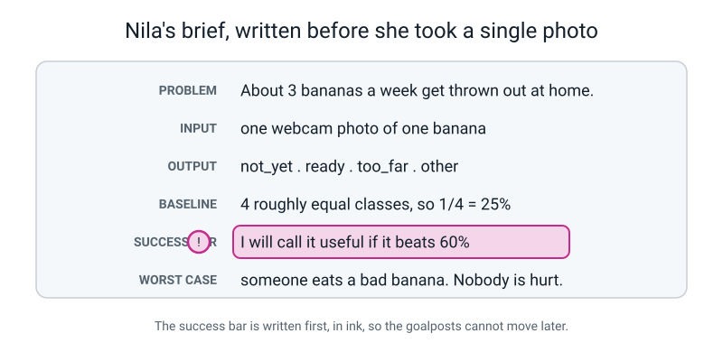
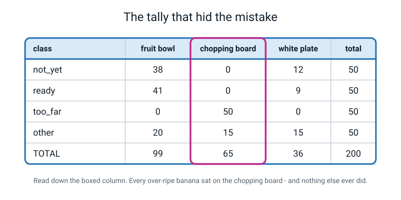
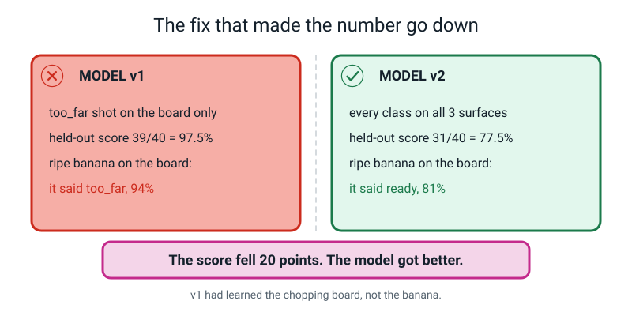
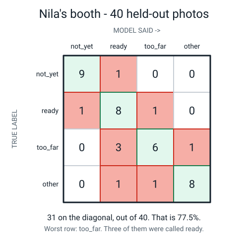
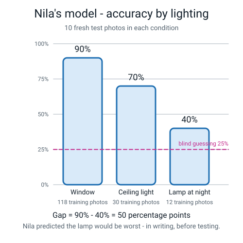
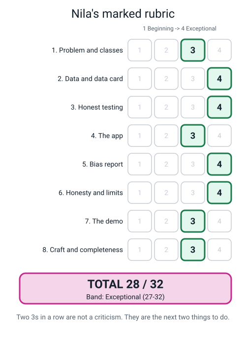

# 🍌 A Worked Example Project — *Is It Ripe Yet?*

[⬅ Project ideas](project-ideas.md) · [Course home](../README.md) · [The capstone ➡](capstone.md)

---

> ### What this file is
>
> **One project — idea number 14 from the [bank of fifty](project-ideas.md#14-is-it-ripe-yet--the-worked-example) — taken all the way through by a real Grade 6
> student, mistakes included, with the teacher's marked feedback at the end.**
>
> Read it before you start your own project. Not to copy it — to see what "finished" actually looks
> like, and to see that the interesting part was the bit that went wrong.

---

## 🪝 Why this one is the exemplar

Nila's project is not the flashiest in the class. Somebody else built a dancing robot referee. Somebody
else trained a sound model with five classes.

Nila trained a model that looks at a banana and says whether it is ready to eat.

Hers is the exemplar for one reason: **her accuracy went DOWN by twenty points and her project got
better.** She found a mistake that would have won her the fair if she had never noticed it, and she fixed
it, and she published the worse number. That is the whole of Level 1 in one decision.

```
   ┌───────────────────────────────────────────────────────────────────────┐
   │                                                                       │
   │   MODEL v1     held-out accuracy   39 / 40  =  97.5%                  │
   │   MODEL v2     held-out accuracy   31 / 40  =  77.5%                  │
   │                                                                       │
   │   v2 is the better model. This file explains why.                     │
   │                                                                       │
   └───────────────────────────────────────────────────────────────────────┘
```

---

# 1️⃣ The Brief

Nila wrote this **before she took a single photo**, and she did not change a word of it afterwards.



*Figure W.1 — The brief. Six lines, all filled in, and the success bar written first.*

```
   PROBLEM
      In my house, bananas go bad and get thrown away about 3 times a week.
      The person it annoys most is Amma, because she buys them.

   WHAT THE MODEL DOES
      Input:   a photo from the laptop webcam of one banana
      Output:  one of these labels:
                 1. not_yet      (still green at the ends)
                 2. ready        (yellow, no big brown patches)
                 3. too_far      (more brown than yellow, or soft)
                 4. other        (not a banana at all)
      Baseline (blind guessing, 4 equal classes) = 1/4 = 25%
      I will call it useful if it beats 60%.

   MY LABELLING RULE  (because ripeness is a judgement)
      not_yet   = any green visible at either end
      ready     = all yellow, brown patches smaller than my thumbnail
      too_far   = any brown patch bigger than my thumbnail, OR it feels squashy
      other     = anything that is not a banana

   WHAT HAPPENS WHEN IT'S RIGHT
      The Scratch app says "eat me today" and Amma stops buying more.

   WHAT HAPPENS WHEN IT'S WRONG
      Worst case: somebody eats a bad banana, or throws away a good one.
      Who gets hurt: nobody badly. That is why I picked this one.
```

> **🧑‍🏫 Why the teacher accepted this brief immediately.** Three things:
>
> 1. **It passes the annoyance test with a real moment** — Amma, three times a week. Not "it would be
>    cool to detect fruit."
> 2. **The labelling rule is written down and it uses a physical object as its threshold** — a
>    thumbnail. That is a genuine *measuring instruction*: another person could follow it and get the
>    same label. "Looks a bit brown" could not.
> 3. **The success bar is 60%, written before training.** She cannot move the goalposts later. Real
>    engineers call this pre-registration and it is the single cheapest honesty device in existence.

---

# 2️⃣ The Plan

Nila wrote her plan as a list of milestones with times, then crossed off what she actually did. The
crossings-out are shown, because that is what a real plan looks like.

| # | Milestone | Planned | Actually took | What happened |
|:--:|---|:--:|:--:|---|
| 1 | Brief + labelling rule | 20 min | 35 min | The labelling rule took three attempts before it was testable |
| 2 | Collect 200 photos + **split** | 60 min | 55 min | Went fast. Too fast, as it turned out |
| 3 | Train and save `booth-v1.tm` | 45 min | 30 min | Training itself is about twenty seconds |
| 4 | Score the held-out 40 | 40 min | 40 min | 97.5%. She was suspicious, which saved the project |
| 5 | The Scratch app | 75 min | 110 min | The threshold bug ate 40 minutes |
| 6 | Bias audit + data card + sign | 45 min | 60 min | The lamp batch was the most interesting hour |
| 7 | Build the booth + rehearse | 45 min | 45 min | Three rehearsals, two to real people |
| — | **Re-shoot after finding the leak** | not planned | **75 min** | The whole reason this file exists |
| | | **5 h 30** | **7 h 30** | |

> **💡 Try this:** copy that table for your own project, including the "actually took" column, and fill it
> in as you go. The gap between the two columns is the most useful thing you will learn about yourself
> all year. Nila's plan was out by two hours, and two of the three biggest overruns were the two
> milestones where she was doing something honest.

---

# 3️⃣ The Data She Collected

## The first tally — and the mistake hiding inside it

Nila took 200 photos in 55 minutes: 50 per class. She tallied them by **surface**, because her teacher
had said to tally across at least three dimensions. Here is exactly what she wrote down.



*Figure W.2 — The real tally, before anything went wrong. Read down the boxed column.*

| class | fruit bowl | chopping board | white plate | total |
|---|---:|---:|---:|---:|
| `not_yet` | 38 | 0 | 12 | 50 |
| `ready` | 41 | 0 | 9 | 50 |
| `too_far` | **0** | **50** | **0** | 50 |
| `other` | 20 | 15 | 15 | 50 |
| **TOTAL** | **99** | **65** | **36** | **200** |

Look at the `too_far` row. Every single over-ripe banana was photographed on the chopping board, and no
other class was photographed there at all except `other`.

This was not laziness. It was how her kitchen actually works: when a banana goes brown, somebody moves it
to the chopping board to be dealt with. Nila's data faithfully recorded a real habit in her house — and
that is exactly how leaks get in. Nobody was careless. The world was tidy in a way that happened to
line up with the label.

> **⚠️ Watch out — this is the trap that catches everybody.** Your training photos record *where things
> are*, not just *what things are*. If your classes live in different places, the model will learn the
> place. It is cheaper than learning the object, so it will do that first, every time.

## The split, done correctly

Before opening Teachable Machine, Nila moved 20% of each class into a separate folder.

```
   class        total    heldout/ (20%)    train/
   ─────────    ─────    ────────────      ──────
   not_yet        50           10            40
   ready          50           10            40
   too_far        50           10            40
   other          50           10            40
   ─────────    ─────    ────────────      ──────
   TOTAL         200           40           160

   balance check:  (50 − 50) ÷ 50  =  0%          target: under 20%  ✅
   baseline:       4 equal classes  →  1/4 = 25%
```

She did this by dragging files in the file browser, before the browser tab was even open. That
sequencing is the one thing in the whole project that could not have been fixed afterwards.

---

# 4️⃣ The Three Mistakes, and How She Fixed Them

## Mistake 1 — the chopping board (the big one)

**What happened.** Model v1 scored **39 out of 40 = 97.5%** on the held-out set. Nila's teacher had
said that anything above about 95% on a first attempt is a symptom, not a triumph, so she went looking.

She held a perfectly yellow, perfectly edible banana over the chopping board.

```
   PREDICTION:   too_far     94%
```

Then she moved the same banana, in the same light, to the fruit bowl.

```
   PREDICTION:   ready       88%
```

The banana had not changed. Only the surface had. **She had not trained a ripeness detector. She had
trained a chopping-board detector and written "too_far" on it.**

**Why the held-out set had not caught it.** Her held-out photos were split randomly out of the same 200,
so 10 of them were `too_far` photos — and all 10 were on the chopping board too. The test set had the
identical blind spot as the training set. It was a fair test of the wrong thing.

**The fix.** 75 unplanned minutes: re-photograph every class on all three surfaces, roughly evenly.

| class | fruit bowl | chopping board | white plate | total |
|---|---:|---:|---:|---:|
| `not_yet` | 17 | 17 | 16 | 50 |
| `ready` | 17 | 17 | 16 | 50 |
| `too_far` | 17 | 17 | 16 | 50 |
| `other` | 17 | 17 | 16 | 50 |
| **TOTAL** | **68** | **68** | **64** | **200** |

Then re-split 20% out, retrain, and re-score.



*Figure W.3 — Before and after. The score fell twenty points and the model got better.*

```
   MODEL v1     39 / 40  =  0.975  =  97.5%     ripe banana on the board → too_far 94%
   MODEL v2     31 / 40  =  0.775  =  77.5%     ripe banana on the board → ready   81%
```

> **🧑‍🏫 If a student asks "so was v1 lying?"** — no, and this is worth ten minutes of class time. The
> 97.5% was arithmetically correct. Thirty-nine of forty held-out photos really were classified
> correctly. The number was **true and about the wrong thing**. It measured how well the model could
> recognise a chopping board, which it could do brilliantly. A true number about the wrong thing is far
> more dangerous than a false one, because nothing about it looks wrong.

## Mistake 2 — the labelling rule drifted

**What happened.** Nila collected her first 60 photos on a Saturday, labelling by eye. On Sunday she
wrote the thumbnail rule down properly. When she went back and checked Saturday's photos against the
written rule, **14 of them were labelled wrong** — mostly `ready` bananas that she had called `too_far`
because they *looked* past it in the evening light.

**Why it matters.** If the label column is noise, the test sheet means nothing. A model trained on
inconsistent labels is being taught to guess your mood.

**The fix.** She relabelled all 14 against the written rule, and — importantly — she wrote the count
down. "I relabelled 14 of my first 60 photos after writing the rule properly" appears in her data card.
That sentence made the teacher trust every other number on the page.

> **The general rule:** write the labelling instruction **before** you collect, not after. If you write
> it after, go back and re-check everything you collected before it existed, and say how many you
> changed.

## Mistake 3 — the threshold that never fired

**What happened.** Nila's Scratch app was supposed to say *"not sure"* below 70% confidence. It never
did — not once, on any photo, including obviously ambiguous ones.

She spent forty minutes rebuilding the sprite logic before doing the thing that actually found it: she
put a single `say` block in to print the raw confidence value.

```
   what she expected the value to look like:   82
   what it actually looked like:               0.82
```

Her `if confidence < 70` was comparing 0.82 against 70. It was **always** true — meaning it should have
fired constantly — except she had written `>` in one branch and the two conditions cancelled out into
nothing ever happening. Either way, the fix was the same.

**The fix.** One line, after knowing the number: `if confidence < 0.7`.

> **💡 Try this first, always:** before debugging anything in a Scratch AI project, print the raw value
> once with a `say` block and look at it. Half of all "the model is broken" reports are a 0-to-1 number
> being compared against a 0-to-100 threshold.

---

# 5️⃣ The Result

## The scoring sheet — all 40 rows, in pen, one attempt each

Nila opened the `heldout/` folder for the first time since the split, and scored every photo as she went.
Nothing was retaken. Nothing was given "another go".

```
   #   photo                TRUE       PREDICTED   top %   ✓/✗
   ──  ──────────────────   ────────   ─────────   ─────   ───
    1  heldout/not_yet/01   not_yet    not_yet      96      ✓
    2  heldout/not_yet/02   not_yet    not_yet      93      ✓
    3  heldout/not_yet/03   not_yet    not_yet      88      ✓
    4  heldout/not_yet/04   not_yet    not_yet      97      ✓
    5  heldout/not_yet/05   not_yet    not_yet      74      ✓
    6  heldout/not_yet/06   not_yet    not_yet      91      ✓
    7  heldout/not_yet/07   not_yet    ready        67      ✗
    8  heldout/not_yet/08   not_yet    not_yet      85      ✓
    9  heldout/not_yet/09   not_yet    not_yet      90      ✓
   10  heldout/not_yet/10   not_yet    not_yet      82      ✓
   11  heldout/ready/01     ready      ready        89      ✓
   12  heldout/ready/02     ready      ready        76      ✓
   13  heldout/ready/03     ready      not_yet      58      ✗
   14  heldout/ready/04     ready      ready        84      ✓
   15  heldout/ready/05     ready      ready        92      ✓
   16  heldout/ready/06     ready      ready        71      ✓
   17  heldout/ready/07     ready      ready        87      ✓
   18  heldout/ready/08     ready      ready        66      ✓
   19  heldout/ready/09     ready      too_far      63      ✗
   20  heldout/ready/10     ready      ready        80      ✓
   21  heldout/too_far/01   too_far    too_far      78      ✓
   22  heldout/too_far/02   too_far    ready        72      ✗
   23  heldout/too_far/03   too_far    too_far      86      ✓
   24  heldout/too_far/04   too_far    too_far      69      ✓
   25  heldout/too_far/05   too_far    ready        91      ✗   ← highest % while WRONG
   26  heldout/too_far/06   too_far    too_far      94      ✓
   27  heldout/too_far/07   too_far    too_far      81      ✓
   28  heldout/too_far/08   too_far    ready        64      ✗
   29  heldout/too_far/09   too_far    too_far      75      ✓
   30  heldout/too_far/10   too_far    other        55      ✗
   31  heldout/other/01     other      other        97      ✓
   32  heldout/other/02     other      other        95      ✓
   33  heldout/other/03     other      other        88      ✓
   34  heldout/other/04     other      ready        61      ✗
   35  heldout/other/05     other      other        93      ✓
   36  heldout/other/06     other      other        90      ✓
   37  heldout/other/07     other      too_far      59      ✗
   38  heldout/other/08     other      other        86      ✓
   39  heldout/other/09     other      other        92      ✓
   40  heldout/other/10     other      other        84      ✓
```

## Accuracy, three ways

```
   correct = 31          total = 40

   fraction     31 / 40
   division     31 ÷ 40  =  0.775
   decimal      0.775
   percentage   0.775 × 100  =  77.5%

   BASELINE     4 roughly equal classes  →  1/4 = 25%
   GAIN         77.5  −  25  =  52.5 percentage points above baseline
   SUCCESS BAR  60%  (written before training)  →  beaten by 17.5 points
```

## Per-class accuracy — where the story actually is

| True class | Correct | Fraction | Percentage |
|---|:--:|:--:|:--:|
| `not_yet` | 9 | 9/10 | **90%** |
| `ready` | 8 | 8/10 | **80%** |
| `too_far` | 6 | 6/10 | **60%** |
| `other` | 8 | 8/10 | **80%** |

The overall 77.5% sits comfortably in the middle and hides a 30-point spread. `too_far` is broken and
the single number says nothing about it.

## The confusion matrix, built by hand



*Figure W.4 — Rows are the truth, columns are what the model said. 31 on the diagonal.*

| ↓ TRUE / SAID → | `not_yet` | `ready` | `too_far` | `other` |
|---|:--:|:--:|:--:|:--:|
| **`not_yet`** | **9** | 1 | 0 | 0 |
| **`ready`** | 1 | **8** | 1 | 0 |
| **`too_far`** | 0 | 3 | **6** | 1 |
| **`other`** | 0 | 1 | 1 | **8** |

**Nila's three-sentence verdict**, written straight onto the sheet:

> *"My worst class is `too_far` at 6 out of 10 = 60%. Three times out of ten it called an over-ripe
> banana `ready`, and that is the mistake that matters most, because it means somebody eats a bad
> banana rather than just chucking a good one. The highest confidence it ever gave while being wrong was
> 91%, on photo 25, which was a brown banana it called `ready`."*

> **🧑‍🏫 Why this verdict earned full marks.** It names the worst class **with a fraction**, it names what
> that class gets confused **with**, and it says which direction of mistake causes real harm. Most
> students stop after the first of those three.

---

# 6️⃣ The Fairness Audit

Nila wrote her prediction first, in pen, before collecting a single test photo:

> *"I think it will be worst under the kitchen lamp at night, because 118 of my 160 training photos were
> taken by the window between 4pm and 6pm, and only 12 were under the lamp."*

Her training photos, tallied by lighting:

| class | window | ceiling light | lamp at night | total |
|---|---:|---:|---:|---:|
| `not_yet` | 30 | 7 | 3 | 40 |
| `ready` | 29 | 8 | 3 | 40 |
| `too_far` | 30 | 7 | 3 | 40 |
| `other` | 29 | 8 | 3 | 40 |
| **TOTAL** | **118** | **30** | **12** | **160** |

Then she collected **10 fresh photos in each condition** — none of them from the held-out set, none of
them ever trained on — and scored every one on paper as she went.



*Figure W.5 — Accuracy by lighting, with the training count under each bar. The gap is 50 points.*

```
   CONDITION            SCORE       DIVISION           PERCENTAGE
   ─────────────────    ────────    ──────────────     ──────────
   window (control)      9 / 10     9 ÷ 10 = 0.9          90%
   ceiling light         7 / 10     7 ÷ 10 = 0.7          70%
   lamp at night         4 / 10     4 ÷ 10 = 0.4          40%

   ACCURACY GAP    =    90%  −  40%   =   50 percentage points

   Highest confidence while WRONG, anywhere in the project:  91%
```

**She was right.** She predicted the lamp, in writing, before testing, and reported it.

## The fix, priced

"Collect more data" is not a plan. Here is a plan:

```
   I want lamplight to be at least a quarter of my training set.

   a quarter of 160         =  160 ÷ 4   =   40 photos
   lamplight I already have                =   12 photos
   lamplight I still need   =   40 − 12    =   28 photos
                            =   28 ÷ 4     =    7 more per class

   Time:  7 photos × 4 classes × about 30 seconds  =  about 14 minutes of shooting
          + 5 minutes to re-split, 1 minute to retrain
          + 15 minutes to re-run the IDENTICAL three test batches
          ────────────────────────────────────────────────────────
          about 35 minutes, total
```

> **⚠️ Watch out:** when Nila's class did the fix, several people found that their **control** condition
> got slightly *worse* after retraining. That is real, it is called a trade-off, and being able to
> explain it is a Level 3 conversation happening in Grade 6. It is not a sign you did it wrong.

## The sign she printed

```
   ┌────────────────────────────────────────────────────────────────┐
   │                                                                │
   │        ⚠️  DO NOT USE THIS IN A DARK KITCHEN  ⚠️                │
   │                                                                │
   │        Measured:  90% by the window                            │
   │                   40% under a lamp at night                    │
   │                   That is a 50 POINT GAP.                      │
   │                                                                │
   │        Why:  only 12 of my 160 training photos                 │
   │              were taken under a lamp.                          │
   │                                                                │
   │        Worst class: too_far, 6 out of 10.                      │
   │        It once said "ready" about a brown banana at 91%.        │
   │                                                                │
   │        DO NOT USE THIS TO DECIDE WHETHER FOOD IS SAFE.          │
   │        Ask a person. I am 11.                                  │
   │                                                                │
   └────────────────────────────────────────────────────────────────┘
```

---

# 7️⃣ The Data Card

All eight boxes, printed and laid on the table.

```
   DATA CARD — "Is It Ripe Yet?" banana photos, November 2026

   WHAT IT IS
      200 webcam photos of bananas and non-bananas from one kitchen,
      each labelled not_yet / ready / too_far / other.
      One row = one photo.

   HOW MUCH
      200 photos, 50 per class. 160 training, 40 held out.
      Collected across 6 days, 14–19 November 2026.

   WHO COLLECTED IT
      Me, Nila, on the family laptop webcam, in our kitchen.
      Photos taken on three surfaces (fruit bowl, chopping board, white
      plate) and in three lighting conditions (window, ceiling light,
      lamp at night). Counts for both are on the poster.

   HOW
      Laptop webcam, about 30 cm from the banana.
      Labelled by me, using this written rule:
         not_yet = any green at either end
         ready   = all yellow, brown patches smaller than my thumbnail
         too_far = any brown patch bigger than my thumbnail, or squashy
         other   = not a banana
      I relabelled 14 of my first 60 photos after writing this rule
      down properly, because I had been labelling by eye before that.

   WHO IT IS ABOUT
      Bananas. No people appear in any photo. My hand appears in 34 of
      them, holding the banana.

   PERMISSION
      The bananas were ours. Amma said yes to me using the kitchen and
      the laptop on 13 November. No photo leaves this laptop; the
      Teachable Machine training happened in the browser.

   LIMITS
      One kitchen. One variety of banana. One camera. Six days in
      November. 90% by the window, 40% under a lamp — a 50 point gap.
      Worst class is too_far at 60%.

   WHAT IS NOT IN IT
      No plantains. No red bananas. No bananas still on a bunch in a
      shop. No banana in a fridge. No photos taken outdoors, at all.
      No photos taken by anybody except me, so every single one is
      framed the way I frame things.
```

> **🧑‍🏫 The box that earned the marks is the last one.** "What is NOT in it" is specific and slightly
> uncomfortable — plantains, red bananas, a bunch in a shop, and the admission that one person framed
> every photo. Most students write "nothing much" in that box. A card whose last box is uncomfortable is
> a card you can trust.

---

# 8️⃣ The Write-Up She Submitted

*Reproduced exactly, including the bits her teacher would have phrased differently.*

> ## Is It Ripe Yet? — by Nila, Grade 6
>
> **The problem.** At my house we throw away about three bananas a week because nobody notices they have
> gone brown until it is too late. Amma buys them so it annoys her most. I wanted something that looks at
> a banana and says whether to eat it today.
>
> **What I built.** I trained a model in Teachable Machine on 160 photos to sort bananas into four
> classes: `not_yet`, `ready`, `too_far`, and `other` for when it is not a banana at all. Then I made a
> Scratch app that says a different thing for each one, and says "not sure, ask a person" if it is under
> 70% confident. Nobody wrote a rule anywhere. I took 200 photos and typed the right answer next to each
> one, and the program found its own pattern from 160 of them. That bit is called training and what comes
> out is called the model.
>
> **The mistake I am most pleased about.** My first model got 39 out of 40 = 97.5% on photos it had never
> seen. My teacher said anything that good on a first go is usually a symptom, so I went looking. I held
> a completely yellow banana over the chopping board and it said `too_far` at 94%. Then I moved the same
> banana to the fruit bowl and it said `ready` at 88%. The banana had not changed. So my model was not
> looking at the banana at all. It had learned the chopping board, because every single over-ripe banana
> in my photos was on the chopping board — that is where we put them when they go bad. My held-out photos
> had the same problem so they did not catch it.
>
> I re-took all 200 photos with every class on all three surfaces, which took 75 minutes I had not planned
> for, and re-trained. The new model got **31 out of 40 = 77.5%**. That is twenty points worse and it is a
> much better model, and this is the thing I would most like people to understand about my project.
>
> **How good it actually is.** 31 out of 40 = 0.775 = 77.5%. Blind guessing with four classes would be
> 25%, so I am 52.5 percentage points better than guessing. I said before I trained it that I would call
> it useful if it beat 60%, and it did, by 17.5 points.
>
> But one number hides things. Per class it is `not_yet` 9/10 = 90%, `ready` 8/10 = 80%, `too_far` 6/10 =
> 60%, `other` 8/10 = 80%. So `too_far` is my broken class. Three times out of ten it called a brown
> banana `ready`, and that is the mistake that matters, because that is the one where somebody eats
> something bad. The most confident it ever was while being wrong was 91%.
>
> **Who it fails.** I predicted before I tested that it would be worst under the lamp at night, because
> only 12 of my 160 training photos were taken under a lamp and 118 were by the window. I was right. It
> got 9/10 = 90% by the window, 7/10 = 70% under the ceiling light, and 4/10 = 40% under the lamp. That is
> a **50 percentage point gap**.
>
> To fix it I need lamplight to be at least a quarter of my training set. A quarter of 160 is 40, I have
> 12, so I need 28 more lamp photos, which is 7 per class, which is about 14 minutes of taking photos and
> 35 minutes in total including re-running the same three test batches.
>
> **What I would tell somebody who wanted to use it.** Don't, in a dark kitchen. And never to decide
> whether food is safe. Ask a person. My sign says so in the biggest writing on my poster.
>
> **What I would do next.** Take the 28 lamp photos and publish both columns side by side. And I would
> like to know whether it works on a plantain, because I have never shown it one and I think it would say
> `not_yet` very confidently.

---

<a id="marked-rubric"></a>

# 9️⃣ The Marked Rubric



*Figure W.6 — 28 out of 32. Two 3s in a row are not a criticism; they are the next two things to do.*

**Bands:** 9–14 Beginning · 15–20 Developing · 21–26 Proficient · **27–32 Exceptional**

| Criterion | Level | Teacher's comment |
|---|:--:|---|
| **1. Problem and classes** | **3** | A genuine household annoyance, four well-named classes with `other`, and a baseline stated as 25%. The labelling rule using a thumbnail is better than most Level 2 work. **To reach 4:** the brief needed to say who is *hurt* as well as who is helped, and the classes could have been chosen because they are genuinely hard to tell apart — `ready` versus `too_far` is hard; `other` is not. |
| **2. Data and data card** | **4** | Counts tallied across two dimensions during collection and a third afterwards. All eight boxes filled. The "what is NOT in it" box names plantains, red bananas and the fact that one person framed every photo. Permission documented with a name and a date. The admission about relabelling 14 photos is what makes the rest of the card believable. |
| **3. Honest testing** | **4** | 20% held out **before** training, by dragging files before the tab was open. Every one of the 40 scored on paper, in pen, one attempt each. Accuracy as fraction → decimal → percentage with the division shown, baseline printed beside it. Per-class accuracy for all four. Hand-built confusion matrix. Worst class named *with what it is confused with*. This is the strongest section of the project. |
| **4. The app** | **3** | Four distinct behaviours, one per class, runs unattended, saved two ways, and a working confidence threshold that says "not sure". **To reach 4:** the low-confidence case was never demoed on purpose during rehearsal — it was described. Turn the lamp on and *show* it hesitating. |
| **5. Bias report** | **4** | Prediction written in ink before testing and reported. Three conditions, 10 fresh photos each, scored on paper. Per-condition accuracy with divisions. Gap in percentage points. Highest confidence while wrong displayed large. Fix priced at 28 photos with the arithmetic and the minutes shown. Exemplary. |
| **6. Honesty and limits** | **4** | The "DO NOT USE" sign is the boldest thing on the booth and contains two measured numbers and a named condition. "Ask a person. I am 11." is the best line on any poster in the room. Visitors were actively invited to break it and the log was filled in. |
| **7. The demo** | **3** | Five minutes, no notes, zero uses of "magic", and the training → model → prediction explanation is in her own words. **To reach 4:** when a visitor asked about plantains she said "I don't know" and stopped. The stronger answer was already in her head — *"my guess is `not_yet` at high confidence, because I have zero plantain photos, and the way I'd find out is to show it one"* — and she wrote exactly that in her report an hour later. Say the guess out loud. |
| **8. Craft and completeness** | **3** | All 11 must-haves present and legible; a stranger could follow the table without help. **To reach 4:** the break-it log had three entries when four visitors had tried, and the scoring sheet was in pencil in two places where the rest was in pen. Small things, and they are the difference between "trustworthy" and "reproducible". |
| | **28 / 32** | **Exceptional.** |

## The teacher's summary comment, as written on the front

> *Nila, the twenty points you gave up are the best twenty points anyone lost this year.*
>
> *You found a leak that your own held-out set could not catch, you proved it with a controlled test —
> same banana, same light, one surface changed — and then you did the expensive thing and re-shot 200
> photos. Almost nobody does that, including adults, because the 97.5% was already on the poster and
> nobody would ever have known.*
>
> *Your three 3s are all the same shape of thing: you know the answer and you did not say it out loud.
> The plantain answer was in your written report. The "not sure" demo existed in your app and you talked
> about it instead of showing it. The break-it log was on the table and three of four attempts got
> written down. Every one of those is a five-second fix, not a re-learn.*
>
> *One question to take into Level 2: your `too_far` class is at 60%, and your fix is priced in
> lamplight photos. Are you sure lighting is what is hurting `too_far`, or is it the thumbnail rule? Go
> and look at the eight `too_far` photos you got wrong and see whether they were dark, or whether they
> were borderline. That is a different fix, and it is cheaper.*

---

# 🔟 What To Copy, and What Not To

## ✅ Copy these

| Thing | Why |
|---|---|
| **Writing the success bar before training** | It is one line and it makes moving the goalposts impossible |
| **A labelling rule with a physical object in it** | "Smaller than my thumbnail" is a measuring instruction. "Looks a bit brown" is not |
| **Tallying conditions while you collect** | You cannot reconstruct it afterwards, and without it you have no bias report |
| **Splitting by dragging files before the tab is open** | The only step in the project with no repair |
| **One suspicious look at a very high score** | 97.5% on a first attempt is a symptom. Nila's whole project turns on this |
| **The controlled test: same banana, same light, one surface changed** | This is how you prove a leak instead of suspecting one |
| **A three-sentence verdict naming the worst class and its partner** | It fits on the sheet and it is the most useful sentence on the poster |
| **Pricing the fix in photos and minutes** | "Collect more data" is a wish. "28 photos, 35 minutes" is a plan |
| **The uncomfortable "what is NOT in it" box** | It is the box that makes every other number believable |

## ❌ Do not copy these

| Thing | Why not |
|---|---|
| **Her exact numbers** | 77.5%, a 50-point gap, 28 photos — these are facts about her kitchen. Yours will be different, and if yours match hers exactly your teacher will notice |
| **Bananas** | Pick your own annoyance. Nila's project works because Amma is real |
| **40 minutes debugging Scratch before printing the raw value** | Print the value first. Always |
| **Labelling by eye for the first 60 photos** | Write the rule first and save yourself the relabelling |
| **Describing the failure instead of demonstrating it** | This cost her three separate rubric marks in three different rows |

---

## 🔑 The Six Things This Project Proves

- **A very high first score is a symptom, not a triumph.** 97.5% on attempt one means go and look for the
  leak.
- **A held-out set can share the training set's blind spot.** Random splitting protects you from
  memorising individual photos. It does nothing about a habit that runs through all of them.
- **The fix that lowers your number can raise your model.** Say the lower number out loud. It is the true
  one.
- **A number without a fraction and a baseline is a boast.** "31 out of 40, against a baseline of 25%" is
  a fact.
- **One accuracy number hides your broken class.** 77.5% overall, 60% on `too_far`, and `too_far` is the
  one that matters.
- **The paperwork is not the bit after the project.** The data card, the sign, the priced fix and the
  verdict are what turn a trained model into something a stranger can trust.

---

[⬅ Project ideas](project-ideas.md) · [Course home](../README.md) · [Now build the capstone ➡](capstone.md)
