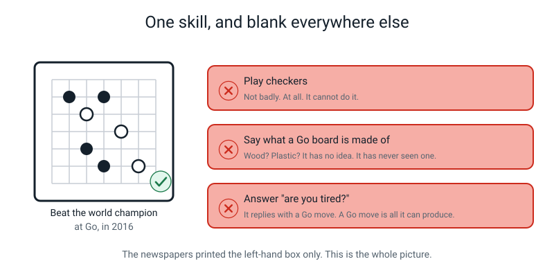
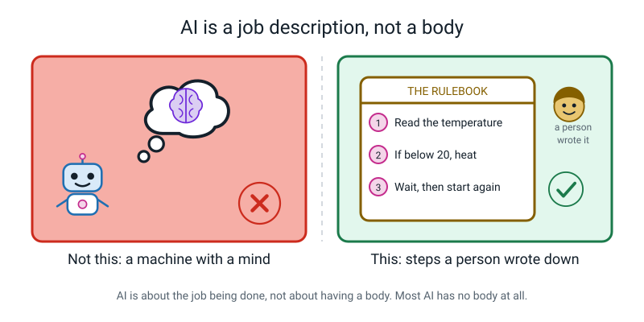
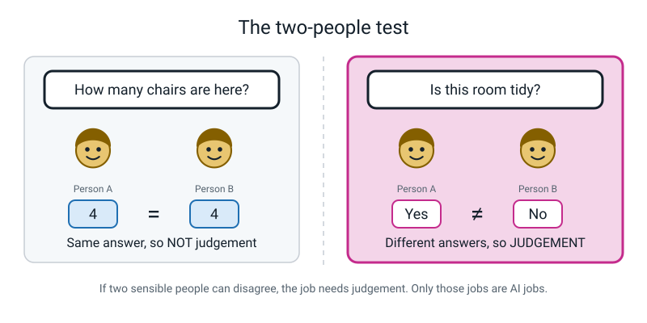
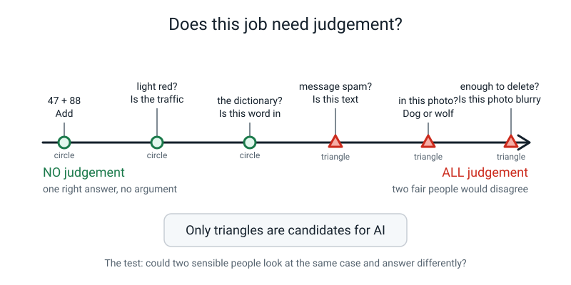
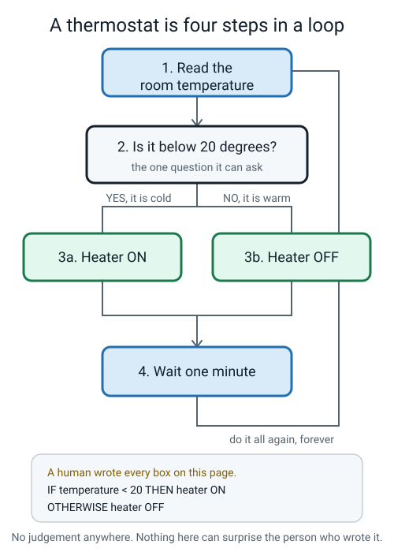
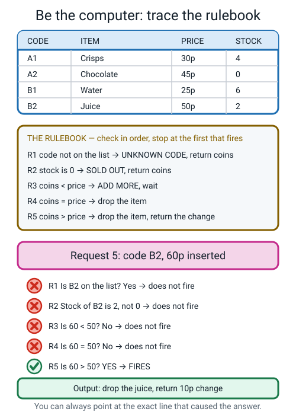
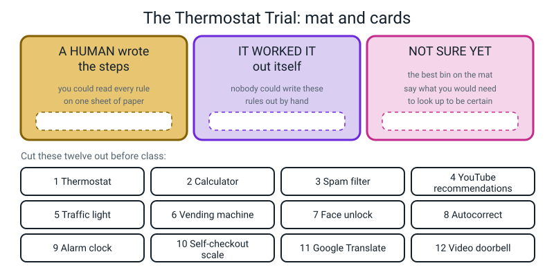
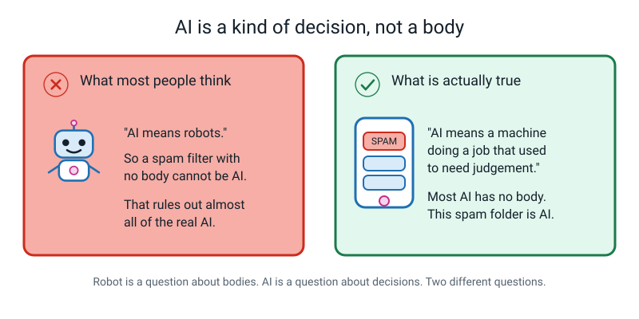
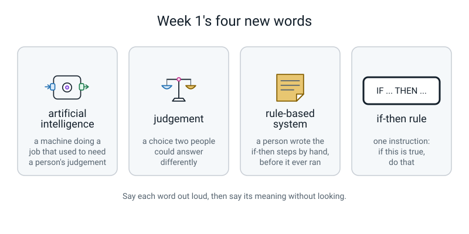

# Week 1 — Is It Smart, or Is It Just Following Orders?

[⬅ Start of course](../README.md) · [Course Home](../README.md) · [Week 2 ➡](week-02.md) · [Workbook](../workbook/week-01.md)

---

> ### This week in one sentence
>
> **AI is a machine doing a job that used to need a person's judgement — it is not a brain, and it is not magic.**
>
> **By the end of this chapter you will be able to:**
> - Say what artificial intelligence is in one sentence, without using the words *robot*, *brain* or *magic*.
> - Decide whether a job needs **judgement** by asking one question: *could two sensible people disagree?*
> - Take a written rulebook, run one case through it by hand, and say exactly which rule produced the answer.
> - Sort everyday machines into *a human wrote the steps* and *not sure yet* — and be proud of the *not sure* pile.
>
> **Reading time:** about 20 minutes. **Homework:** about 45 minutes, spread across the week.

---

## 🪝 Start Here

In 2016, a computer program called **AlphaGo** played the best human Go player in the world.

Go is an ancient board game. It looks simple — black stones, white stones, a grid. It is not simple.
There are more possible games of Go than there are atoms in the universe. Not more than the atoms
on Earth. More than the atoms in *everything*.

AlphaGo won.

Newspapers all over the world printed the same headline the next morning: **machines are thinking now.**

Here is the part they did not print.

That same program could not play checkers. Not badly — *at all*. It could not tell you what a Go
board is made of. If you had asked it "are you tired?", it would have answered with a Go move,
because a Go move is the only thing it can produce. It had one skill, and one step outside that
skill it was completely blank.



*Figure 1.12 — The newspapers printed the left-hand box. The right-hand boxes are just as true.*

So which is it? A thinking machine, or a very fancy calculator?

Now hold that question and look at something much more boring. A **thermostat** — the little box on
the wall that decides whether your heating comes on. Nobody tells it what to do. It just decides,
by itself, all day, for years.

Is *that* smart?

One of those two things is doing something genuinely interesting, and one of them is just following
orders. By the end of this chapter you will be able to say which — and prove it. You are going to
build a test. It takes about thirty seconds to run and it works on anything.

> **✏️ Commit before you read on.** Write these two words down, right now, before you turn the page —
> whichever you think is doing the more interesting thing: **ALPHAGO** or **THERMOSTAT**. Don't
> hedge. Don't write both.
>
> You will check your answer at the end of this chapter, and being wrong now is genuinely more useful
> than being right. A guess you committed to is much harder to forget than an answer you were handed.

---

## 🧠 The Big Idea

### 1. AI is a job description, not a body

Picture your school's front desk. A visitor walks in. Somebody has to decide: *is this person
allowed inside?*

That is a real decision. You have to look at them, weigh it up, and choose. For a hundred years,
only a human could do that job.

Now picture a camera at a car park gate. It reads number plates and lifts the barrier for cars on
the approved list. A job that used to need a person's decision is now being done by a machine.

That is all AI is.

> **Artificial intelligence** — getting a machine to do a job that used to need a person's
> **judgement**.

Read that again and notice what is *missing* from it. It does not say *smart*. It does not say
*brain*. It does not say *thinks*, *understands*, *wants* or *feels*. And here is the strangest
part: **it does not say the machine has to do the job the same way a person would.**

**🍕 The analogy:** a submarine does not swim like a fish. It has no fins, no tail, no gills. It
moves through water by a completely different method — and it still gets from one port to another.
AI is like that. It does the job. It does not do it your way.



*Figure 1.1 — On the left, what most people picture. On the right, what is actually happening in
almost every real case.*

**The real numbers:** on a normal Tuesday that car park barrier sees maybe 400 cars. The approved
list has 60 number plates on it. The camera reads each plate, checks the list, and lifts or doesn't.
Nothing in that machine is thinking about anything. And it is doing a job that used to be a person
in a small hut with a clipboard.

Here is the thing that trips up nearly every adult. *Robot* and *AI* are two completely different
questions. **Robot** is a question about bodies. **AI** is a question about a kind of decision. They
cross in all four ways:

| | Has a body | No body at all |
|---|---|---|
| **Doing AI** | A robot vacuum working out the shape of your room | Spam filter · face unlock · your video feed |
| **Not doing AI** | A factory arm repeating the same weld 1,000 times a day | Calculator app · microwave timer |

Say this sentence out loud once: **almost all the AI in the world has no body at all.**

---

### 2. Judgement is the one word doing all the work

Everything now depends on that one word in the definition. So what is judgement?

> **Judgement** — a choice where two sensible people could look at the same thing and give
> different answers, and the right answer depends on the specific case.

And that gives you the test. It is the only test you need this week:

> **💡 Try this:** ask yourself — **"could two sensible people disagree about the answer?"**
> If yes, it needs judgement. If no, it doesn't.

Let's run it.

- **Add 47 + 88.** Could two sensible people disagree? No. The answer is 135, and anyone who says
  otherwise is simply wrong. **Not judgement.**
- **Decide whether this photo is blurry enough to delete.** Could two sensible people disagree?
  Absolutely. I'd keep it, you'd bin it, and neither of us is wrong. **Judgement.**



*Figure 1.6 — Left: one right answer, so no judgement. Right: no single right answer, so judgement.*

**🍕 The analogy — the pizza-cutter test.** A pizza cutter does a job that people used to do with a
knife: slicing. Is a pizza cutter AI? No — slicing is not a decision, it is just an action. But
*"look at this pizza and decide whether it's burnt enough to throw away"* — **that** is judgement.
A machine doing that job would be AI.

Judgement is not an on/off switch. It is a slider. Some jobs sit right in the middle.



*Figure 1.2 — Put things on the line. Don't force them into two boxes.*

> **⚠️ Watch out:** *hard* and *judgement* are not the same thing. Finding one tiny bird hidden in a
> photo of a forest is **hard** — but there is still exactly one right answer, and once someone
> points at it everybody agrees. That's hard, not judgement. Deciding whether the photo is *good* is
> judgement, and it isn't hard at all.

**The real numbers:** here are six jobs, run through the test.

| Job | Two people could disagree? | Judgement? |
|---|---|---|
| Add 47 + 88 | No — one answer, 135 | ❌ |
| Ring a bell at 3:30 pm | No — a clock does it | ❌ |
| Sort 200 numbers smallest to largest | No — one right order | ❌ |
| Decide if a photo shows a dog or a wolf | Yes — depends on the photo | ✅ |
| Decide which video to show you next | Yes — depends on you, right now | ✅ |
| Decide if this text message is spam | Yes — a marketing text splits people | ✅ |

Two of those six could be AI jobs. The other four never will be, no matter how modern the box looks.

> **✅ Stop. Cover this page with your hand.**
>
> Say out loud, from memory: **the one question that tests for judgement.** Then say why *"find the
> tiny bird in this forest photo"* fails that test even though it is difficult.
>
> If either one wouldn't come, read section 2 again before you go on. This is the most useful thirty
> seconds in the chapter — not because the test is hard, but because saying it out loud now is worth
> more than reading it three more times.

---

### 3. Way one: a human writes every single step

So how do you actually get a machine to make a decision? For everything you will meet this year there
are **two** ways. This week we do the first one. Next week we do the second one, and the second one is
genuinely strange.

> **⚠️ Watch out — this is a simplification, and you should know that it is one.** Real engineers have
> a few more tricks than two, and some systems mix them together. But almost everything you will meet
> in the wild is one of these two, or a blend of them, so two is the right number of boxes to think in
> for now. When you meet the third thing, you will be ready for it. *This course will always tell you
> when it is simplifying.*

**Way one:** a person sits down, thinks hard, and writes every step down in advance, in the form
**if this, then that.** The machine just follows the list. Forever. Exactly.

> **Rule-based system** — a system where a human wrote the decision steps by hand, as if-then
> instructions, before the machine ever ran.
>
> **If-then rule** — one instruction shaped like *"if this is true, do that"*.

**🍕 The analogy — the note on the fridge.** *"If the milk smells bad, throw it out. If the bread has
green spots, throw it out. Otherwise breakfast is fine."*

That note is a decision system for food safety, written in advance by a human. It does not learn
anything. If a new food goes bad in a new way, the note just sits there, silent, until somebody
edits it.

Your home is full of these:

| Machine | Its rule, written out |
|---|---|
| Thermostat | `IF room temperature < 20°C THEN turn on the heater` |
| Old spell-checker | `IF the word is not in my list of 100,000 words THEN underline it in red` |
| Traffic light on a timer | `IF 30 seconds have passed THEN switch to amber` |
| Vending machine | `IF coins inserted ≥ price THEN drop the item AND return the change` |
| Alarm clock | `IF the time = 07:00 THEN ring` |



*Figure 1.3 — Everything a thermostat will ever do, in its whole life, on one page. A person wrote
every one of those boxes.*

**The real numbers:** that flowchart is four boxes. A person probably wrote it in about ten minutes,
and the thermostat will do exactly those four boxes, in that order, roughly once a minute, until it
is thrown away. If it runs for ten years that is about **5.2 million** trips round the loop and
**zero** new ideas.

And rule-based systems have one genuinely brilliant property, which this course never sneers at:

> **They are predictable and explainable.** If the machine does something odd, an engineer can read
> the rules and point at the exact line that caused it. Most of the software in the world works this
> way, and that is the right choice.

---

### 4. The crack: a rulebook only knows what somebody put in it

Now the problem. And it is not a small one.

Imagine a spell-checker whose whole dictionary is five words: `cat, cot, cut, dog, dot`.

You type `dat`. The checker looks: is `dat` in the list? Cat — no. Cot — no. Cut — no. Dog — no.
Dot — no. No match, so it underlines `dat` in red. 

Now you type: **"I have a pet dot."**

You meant *dog*. What does the spell-checker do?

**Nothing.** `dot` is the fifth word on its list. It found it. It stays completely silent.

Is it broken? No — and this is the important bit. **It did exactly what it was told.** Nobody ever
wrote a rule about pets and dots. The rulebook worked perfectly and gave a technically-correct,
completely useless answer.

That is how rule-based systems fail. Not with a bang. **Quietly.**

There is a second crack, and it is sneakier: **the order of the rules changes the answer.** Look at
this rulebook — you ran it by hand in class.



*Figure 1.5 — The rulebook, the price list, and one request traced all the way down. The tick shows
the line that fired.*

```
VENDING MACHINE RULEBOOK — check in order, STOP at the first rule that fires

  RULE 1:  IF the code is not on the list   THEN say "UNKNOWN CODE" and return all coins
  RULE 2:  IF the stock is 0                THEN say "SOLD OUT" and return all coins
  RULE 3:  IF coins inserted < price        THEN say "ADD MORE" and wait
  RULE 4:  IF coins inserted = price        THEN drop the item
  RULE 5:  IF coins inserted > price        THEN drop the item AND return (coins − price)

PRICE LIST
  ┌──────┬────────────┬───────┬───────┐
  │ CODE │ ITEM       │ PRICE │ STOCK │
  ├──────┼────────────┼───────┼───────┤
  │  A1  │ Crisps     │  30p  │   4   │
  │  A2  │ Chocolate  │  45p  │   0   │
  │  B1  │ Water      │  25p  │   6   │
  │  B2  │ Juice      │  50p  │   2   │
  └──────┴────────────┴───────┴───────┘
```

A person chose that order. If they had put Rule 2 lower down, the machine would give a different
answer to the same customer — forever — and it would never notice.

---

### 5. Back to the beginning: AlphaGo or the thermostat?

Go and find the word you wrote down at the start of this chapter. Read it. Now let's settle it
properly, using nothing but the test you just learned.

**Step one — does the job need judgement?**

| The job | Could two sensible people disagree? | Judgement? |
|---|---|---|
| Thermostat: *is 19 lower than 20?* | No. Never. Not once in ten years. | ❌ |
| AlphaGo: *what is the best move here?* | Yes — the best players in the world argued about its moves for weeks | ✅ |

So the thermostat's job is not even the *kind* of job AI is for. That settles half of it.

**Step two — who wrote the steps?**

The thermostat is four if-then boxes. A person wrote all four, in about ten minutes, and you have
seen the whole flowchart. Nothing is hidden.

Now try to do that for AlphaGo. Sit down and write the if-then rules for *"what is the best move on
this Go board?"* — for a game with more possible positions than there are atoms in everything.

You can't. Nobody can. **And that is the actual answer to the question in the hook.**

> **🔑 So here it is:** the thermostat is **just following orders** — a person's orders, written in
> advance, and you can read every one of them. AlphaGo is doing the genuinely interesting thing,
> **because nobody wrote its rules.** It worked them out from examples. That is the second way, and it
> is next week.

**Now check your word.** If you wrote ALPHAGO — good instinct, and now you can say *why*, which is
the part that counts. If you wrote THERMOSTAT — you were in excellent company, because "it decides
without anyone there" is the single most reasonable wrong answer in this whole subject. You have just
learned the difference between *nobody is there now* and *nobody ever wrote it down*. That
distinction is worth more than getting it right first time.

And notice what the newspapers got wrong. They said *machines are thinking now*. What actually
happened was narrower and stranger: one machine got extraordinarily good at exactly one job, by
studying examples, and stayed completely blank one step outside it. **Narrow, not thinking.** Hold on
to that phrase — it is the honest version of almost every AI headline you will ever read.

---

## 🔍 Worked Examples

Three of them. Read each one with a pencil in your hand and try to be one step ahead of me.

### 🍫 Worked Example 1 (food) — trace the vending machine, twice

**Request 5: someone presses B2 and puts in 60p.**

The rule is *check in order, stop at the first rule that fires.* No skipping. No being sensible.

| Step | Rule | The check | Fires? |
|:--:|---|---|:--:|
| 1 | R1: code not on the list? | B2 is on the list (Juice) | ❌ no |
| 2 | R2: stock is 0? | Stock of B2 is **2** | ❌ no |
| 3 | R3: coins < price? | Is 60 < 50? | ❌ no |
| 4 | R4: coins = price? | Is 60 = 50? | ❌ no |
| 5 | R5: coins > price? | Is 60 > 50? | ✅ **FIRES** |

**Answer: Rule 5 fires.** The machine drops the juice and returns 60 − 50 = **10p** change.

And notice what you can do now that you couldn't before: you can point at the exact line. *Line
five.* That is the whole answer, and that ability is the best thing about rule-based systems.

**Now Request 7: someone presses A2 and puts in 20p.**

Stop and answer it in your head before you read on. Most people get this wrong, including adults.

| Step | Rule | The check | Fires? |
|:--:|---|---|:--:|
| 1 | R1: code not on the list? | A2 is on the list (Chocolate) | ❌ no |
| 2 | R2: stock is 0? | Stock of A2 is **0** | ✅ **FIRES** |

**Answer: Rule 2 fires.** The machine says **SOLD OUT** and returns the 20p.

Did you say "ADD MORE"? About two out of three people do — because 20p is obviously not enough for
45p chocolate, so Rule 3 feels right. Your answer was the *sensible* answer. The machine gives the
*Rule 2* answer, because Rule 2 comes first and fires first.

**The machine is not broken.** A person chose that order, and the machine will make that choice
every single time, for the rest of its life.

---

### 🏏 Worked Example 2 (sport) — which of these needs judgement?

You are at a cricket match. Six different jobs need doing. Which of them could ever be an AI job?

Run the two-people test on each one. Write the reason, not just the answer — the reason is the
skill.

| # | The job | Could two sensible people disagree? | Judgement? |
|:--:|---|---|:--:|
| 1 | How many runs did she score in that over? | No. Count them: 4 + 1 + 0 + 6 + 0 + 2 = 13. Everyone gets 13. | ❌ |
| 2 | Did the ball cross the boundary line? | No — there is one right answer, even if it's hard to see | ❌ |
| 3 | Was that a no-ball? | **Yes.** Two umpires genuinely give different calls on a tight one | ✅ |
| 4 | What is the score right now? | No. Look at the scoreboard. | ❌ |
| 5 | Who should be captain next season? | **Yes.** Two coaches would pick differently, and neither is wrong | ✅ |
| 6 | Was that catch worth putting on the highlights reel? | **Yes.** Completely a matter of taste | ✅ |

**Score: three of the six need judgement — 3, 5 and 6.** Those three are the only ones that could
ever be AI jobs.

Look carefully at rows 2 and 3, because they are the interesting pair. Both are hard to see in real
time. But "did the ball cross the line" has **one true answer** that a slow-motion camera settles.
"Was that a no-ball" depends on where you think the line was and how you read the bowler's foot,
and two trained umpires disagree about tight ones all the time.

**Hard is not the same as judgement.** Row 2 is hard. Row 3 needs judgement.

---

### 🏫 Worked Example 3 (school) — a rulebook that quietly ruins a morning

Here is a real kind of rulebook: the one that decides your attendance mark.

```
LATE-MARK RULEBOOK — check in order, STOP at the first rule that fires

  RULE 1: IF the name is not on the register    THEN "UNKNOWN NAME", send to the office
  RULE 2: IF arrival is before 08:50            THEN mark PRESENT
  RULE 3: IF arrival is before 09:00            THEN mark LATE
  RULE 4: IF arrival is 09:00 or later          THEN mark VERY LATE and text home
```

**Case A — Priya, on the register, arrives 08:47.**

- R1: is Priya on the register? Yes → does not fire.
- R2: is 08:47 before 08:50? **Yes → FIRES.** Mark **PRESENT**. Done. Stop.

**Case B — Sam, on the register, arrives 08:56.**

- R1: on the register → no fire.
- R2: is 08:56 before 08:50? No → no fire.
- R3: is 08:56 before 09:00? **Yes → FIRES.** Mark **LATE**.

**Case C — Ayaan, on the register, arrives 09:04.**

- R1 no. R2 no (09:04 is not before 08:50). R3 no (09:04 is not before 09:00).
- R4: is 09:04 at or after 09:00? **Yes → FIRES.** Mark **VERY LATE** and text home.

So far so good. Now watch it fall over.

**Case D — the school bus breaks down. Forty students walk in together at 09:20.**

Trace it. R1 no, R2 no, R3 no, **R4 fires — forty times.** Forty VERY LATE marks and forty texts
home saying your child is very late, on a morning when not one of those forty did anything wrong.

There is no rule for *"the bus broke down"*. And look at what deciding this would actually need:
somebody has to hear the reason and decide whether it counts. Would two sensible people always
agree about which excuses count?

No. **That is judgement, and a rulebook cannot do judgement.**

> **💡 Try this:** swap Rule 2 and Rule 3 in your head and re-run Case A. Priya arrives at 08:47.
> Is 08:47 before 09:00? Yes — so the *new* Rule 2 fires and Priya is marked **LATE**. Same student,
> same time, same rules, different order, wrong answer. Order matters more than almost anyone
> expects.

---

## 🎲 What We Did In Class — The Thermostat Trial

If you missed the lesson, or you want to run it again at home, everything you need is here. It takes
about twenty minutes and it works with torn-up scraps of paper.

### Part A — the twelve-card sort



*Figure 1.4 — The mat and the twelve cards. Cut along the outlines, or just write the twelve names
on twelve scraps.*

**Set-up:** draw three big boxes on a sheet of paper and label them:

1. **A HUMAN WROTE THE STEPS**
2. **IT WORKED IT OUT ITSELF**
3. **NOT SURE YET**

**The twelve cards:** thermostat · calculator · spam filter · YouTube recommendations · traffic
light · vending machine · face unlock · autocorrect · alarm clock · self-checkout scale · Google
Translate · video doorbell.

**How to play:** take one card at a time. Before you put it down, **say the reason out loud.** Not
the answer — the reason. Then place it.

**The rule about bin 3.** *Not sure yet* is not the losing bin. It is not where things go when you
give up. If you put a card in *not sure* and you can say **the one thing you would need to look up
to be certain**, that beats a confident guess. In this course, *"I don't know, and here's how I'd
find out"* scores full marks.

Three of the twelve cards genuinely have no clean answer, on purpose:

- **Autocorrect** is two systems bolted together. The red underline is a word list — pure rules. The
  bar that suggests your next word is not.
- **The self-checkout scale** shouting "unexpected item in bagging area" is a weight threshold — a
  rule. But some shops add a camera doing something else entirely.
- **A video doorbell** has motion detection (`IF pixels change THEN record` — a rule) and a "that's a
  person, not a cat" part, which is something else.

If you got three cards into *not sure* with a reason for each, you did excellent work.

### Part B — you are the computer

Print or copy the vending machine rulebook and price list from §4 above. Then:

1. Read all five rules out loud. Yes, out loud. It takes 40 seconds and it helps.
2. Announce the rule of the game: **you are a completely obedient computer.** You may not be
   sensible. You may not be helpful. You may not think *"well, obviously they meant…"*. You follow
   the rules in order, you stop at the first rule that fires, and if the answer is stupid, you write
   down the stupid answer.
3. Run all eight requests. Write each answer as **"Rule ___ fires → the machine does ___"**.

```
THE EIGHT REQUESTS
  1.  Code A1, 30p inserted        5.  Code B2, 60p inserted
  2.  Code A2, 45p inserted        6.  Code B1, 25p inserted
  3.  Code C7, 30p inserted        7.  Code A2, 20p inserted
  4.  Code B1, 20p inserted        8.  Code A1, 100p inserted
```

4. Then get someone to read you **Request 9**, deadpan, as if it were just the next one on the list:

> *"A woman comes back to the machine. She says: 'I put 30p in, I pressed A1, I got my crisps — but
> the bag was already burst and they're stale. Can I have another packet?' You're the computer.
> Which rule fires?"*

Look for it. Take your time. **There isn't one.**

Not because the person who wrote the rulebook was lazy — because you cannot list every possible
thing a human might say to a vending machine. And deciding this one would mean *looking at the bag*
and judging whether it counts as burst. Two sensible people would disagree about that.

That is judgement, and a rulebook cannot do judgement. That is the whole lesson, and you found it
yourself.

---

## 💬 Talk About It

Take these to a parent, a friend, or an older sibling. Their answers are interesting even when
they're wrong — *especially* when they're wrong.

**1. "Is a thermostat AI?"**

*Hint:* it is definitely a rule-based system — a person wrote all four boxes. But run the judgement
test on the actual job: *is 19 less than 20?* Could two sensible people disagree about that? Most
experts would say the thermostat is **not** AI, because its job needs no judgement. Notice that
"rule-based" and "AI" are not the same word.

**2. "Name a job you would NOT want a machine to decide, even if it could."**

*Hint:* push for the reason, not the example. Good reasons sound like *"because if it gets it wrong
the person can't argue back"* or *"because nobody could explain why it said no."* Both of those are
real arguments that grown adults are paid to have.

**3. "Was AI invented recently?"**

*Hint:* the words "artificial intelligence" were first used in **1956** — before your grandparents
were your age. Banks were using machines to catch card fraud in the 1990s. What changed recently is
the *scale*, and how loud everyone got about it. Not whether it existed.

---

## ⚠️ Don't Get Tricked

### Trick 1 — "AI means robots"



*Figure 1.7 — Wrong on the left, right on the right.*

| ❌ Wrong | ✅ Right |
|---|---|
| "AI means robots, so a spam filter isn't AI." | "Robot is about having a body. AI is about a kind of decision. The spam filter has no body and is definitely AI." |

Most of the AI in the world is invisible: no arms, no eyes, no face. It is software in a building
you will never see.

### Trick 2 — "It's on a computer and it's modern, so it's AI"

| ❌ Wrong | ✅ Right |
|---|---|
| "The calculator app is AI — it's on my phone, it's fast, and I couldn't do that in my head." | "Run the judgement test first. Could two sensible people disagree about 47 + 88? No. Not judgement, so not AI — however fast it is." |

The reverse mistake happens too: deciding something is *not* AI because it's old or boring. A 1990s
bank fraud detector that learned from millions of card transactions **is** AI. It is beige and it
lives in a basement.

### Trick 3 — "The thermostat must be thinking, because nobody tells it what to do"

| ❌ Wrong | ✅ Right |
|---|---|
| "It works with nobody there, so it's deciding for itself." | "A person is very much there. They just arrived earlier, wrote four if-then boxes, and left. You are watching their instructions run." |

This is a genuinely thoughtful mistake. The person didn't disappear — their decisions did.

### Trick 4 — "It gave a stupid answer, so it's broken"

| ❌ Wrong | ✅ Right |
|---|---|
| "The machine said SOLD OUT when I obviously hadn't put enough money in. It's faulty." | "It followed Rule 2, exactly as written, because Rule 2 comes before Rule 3. It is working perfectly and the answer is still useless." |

Get used to this one. A rule-based system that has never met your situation does not shout for help.
It gives you a confident, technically-correct, useless answer, and moves on.

---

## 🌍 Where You've Seen This

Six places this week's idea is already sitting in your life:

1. **The microwave's 30-second button.** `IF pressed THEN add 30 seconds`. A person wrote that. It
   is not even close to a judgement.
2. **The school bell.** `IF the time = 15:30 THEN ring`. A clock with a speaker. It has never once
   considered whether the lesson was finished.
3. **Automatic shop doors.** `IF something moves THEN open`. You know they aren't judging anything,
   because they open for a stray cat and for a crisp packet blowing past.
4. **The red squiggle under a typo.** That's a word list — rules. Which is exactly why it stays
   silent when you write "I have a pet dot".
5. **Your spam folder.** Nobody typed a rule saying *"FREE plus three exclamation marks is
   suspicious"* — and yet it catches wording that didn't exist last year. **Hold that thought. It's
   next week's entire lesson.**
6. **Face unlock.** Nobody could write if-then rules for what your face looks like in every light
   from every angle. Also next week.

That last pair should be bugging you. Good. That is the sound of Week 2 arriving.

---

## 🔑 Remember This

> **✅ Before you read the list — close the book and try to say it.**
>
> Four things, out loud, from memory: (1) what AI is, in one sentence with no banned words; (2) the
> one test question; (3) what a rule-based system is; (4) the way rulebooks fail. Then open up and
> check.
>
> You will get two or three of the four. That is normal and it is not a problem — the gap you just
> found is exactly what your workbook is for, and now you know which bit to look at first.

- **Artificial intelligence** is a machine doing a job that used to need a person's **judgement**.
  No *smart*, no *brain*, no *magic*.
- **The test is one question:** could two sensible people disagree about the answer? Yes → judgement.
  No → not judgement, and therefore not AI.
- **Hard is not the same as judgement.** Hard jobs can still have exactly one right answer.
- **A robot is a body. AI is a decision.** Almost all real AI has no body at all.
- **A rule-based system** is one where a human wrote the if-then steps in advance. It is
  predictable, explainable, and only knows what somebody put in it.
- **Rulebooks fail quietly.** When a case arrives that nobody imagined, no rule fires — or the wrong
  rule fires first — and the machine reports a confident, useless answer.
- **Narrow, not thinking.** AlphaGo beat the best Go player alive and could not play checkers. When a
  headline says a machine "thinks", ask what the *one* job is, and what happens one step outside it.
- **"Not sure, and here's what I'd need to look up"** is a real answer and a good one. Use it.

---

## 📓 New Words



*Figure 1.8 — This week's four words. Cover the bottom halves and see if you can say each meaning.*

| Word | What it means | Example |
|---|---|---|
| **artificial intelligence** | A machine doing a job that used to need a person's judgement | A camera at a gate deciding which cars to let in |
| **judgement** | A choice where two sensible people could give different answers | "Is this photo blurry enough to delete?" |
| **rule-based system** | A system where a human wrote the if-then steps by hand, in advance | A thermostat: `IF colder than 20°C THEN heat` |
| **if-then rule** | One instruction shaped like "if this is true, do that" | `IF the word is not in the list THEN underline it` |

> **🧑‍🏫 If someone asks you "so is a robot AI?"** — the honest answer is *"sometimes, and they're
> actually two separate questions."* A welding arm in a factory has a huge impressive body and does
> the same weld a thousand times a day following rules a person wrote. No judgement, so no AI. A
> spam filter has no body at all and is doing AI.

---

## 📤 Your Homework

Open **[the Week 1 workbook](../workbook/week-01.md)**. It should take about **45 minutes**, and it
works much better spread across the week than crammed into one sitting.

**The three things you're doing:**

1. **Warm-up and Practice Sets A and B** — about 20 minutes. Fill-in-the-blanks, a diagram to label,
   and five new situations to think through.
2. **The Puzzle of the Week** — the ice-cream machine rulebook, where one customer is treated
   unfairly by the *order* of the rules rather than by any single rule. About 10 minutes, and it's
   the fun bit.
3. **Build It: AI Spotter's Log, part 1** — this one you cannot do at a desk. Over the next day,
   write down **eight** systems you actually *touched*. Not eight you can think of — eight you
   touched. There's a difference, and the difference is the whole exercise. Then one sentence each:
   did a human write the steps, or did the machine work it out — **and why**. The *and why* is the
   part that gets marked.

Then one short thing: the workbook has the sentence *"my phone magically knows my face."* Rewrite it
honestly. One sentence, no magic.

> **⚠️ Watch out:** the words **magic**, **it just knows**, **it's smart** and **it figured it out**
> are banned for the whole year, starting now. Every time you're tempted to use one, you're skipping
> the interesting part.

---

[⬅ Start of course](../README.md) · [Course Home](../README.md) · [Week 2 ➡](week-02.md) · [📓 Workbook — Week 1](../workbook/week-01.md) · [Glossary](../../glossary.md)
