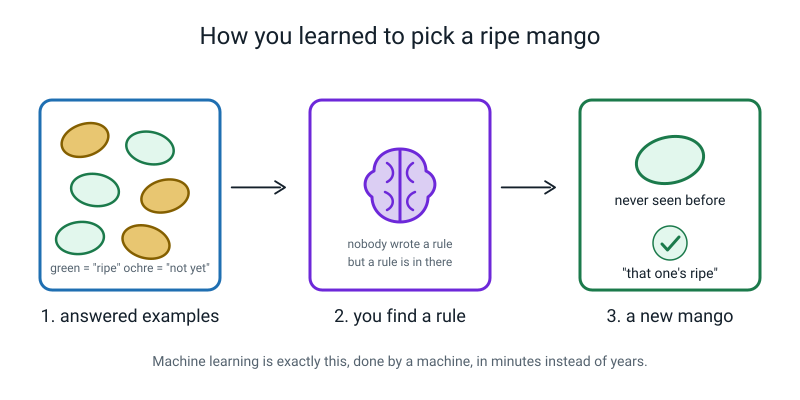
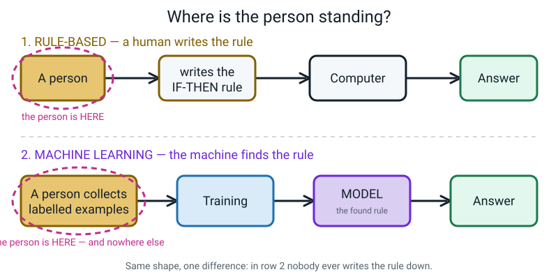
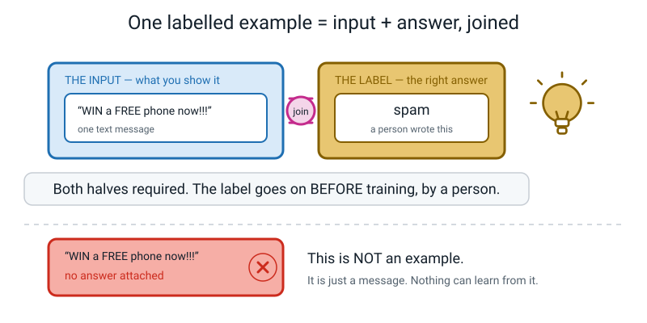
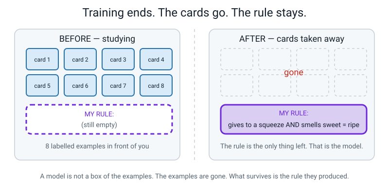
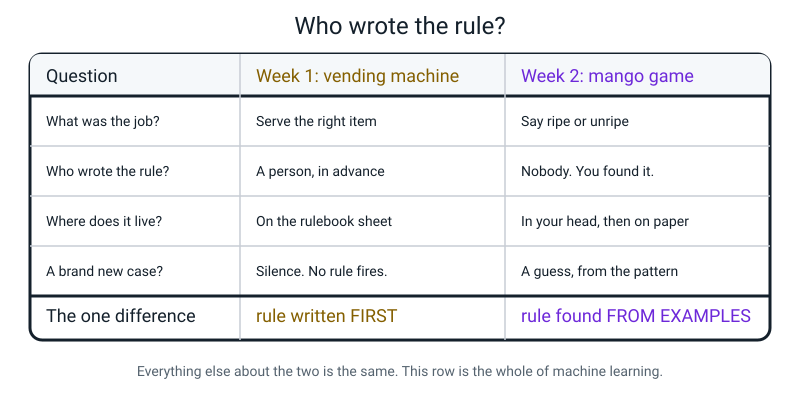
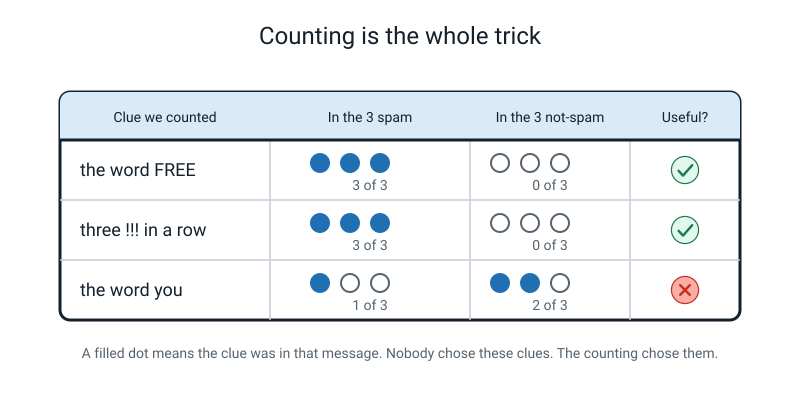
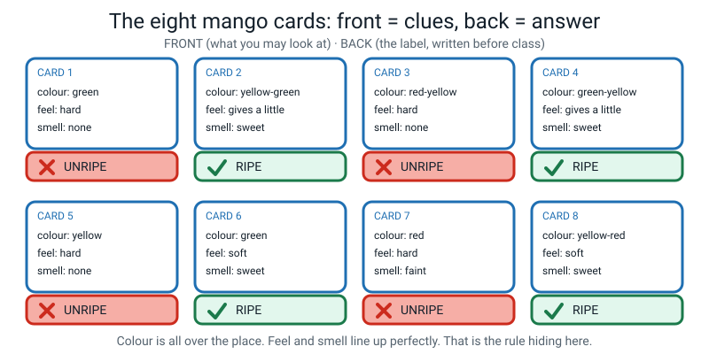
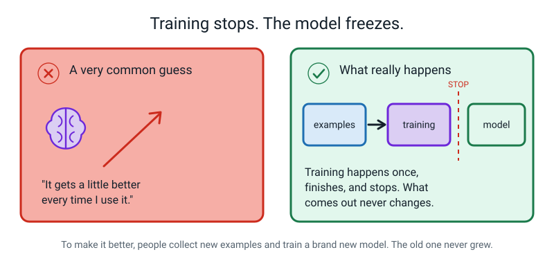
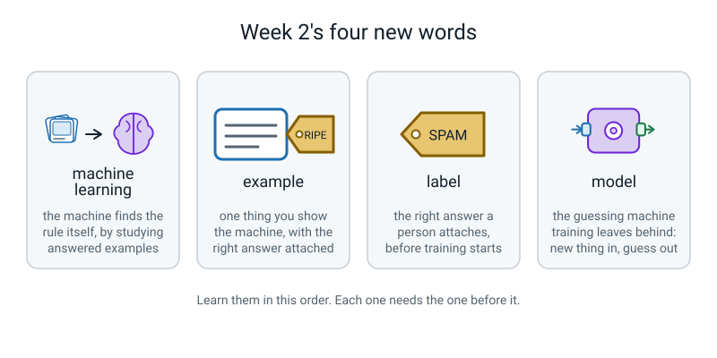

# Week 2 — The Machine That Learns the Rule By Itself

[⬅ Week 1](week-01.md) · [Course Home](../README.md) · [Week 3 ➡](week-03.md) · [Workbook](../workbook/week-02.md)

---

> ### This week in one sentence
>
> **In machine learning nobody writes the rule — the machine finds it by studying examples that
> already have the right answers attached.**
>
> **By the end of this chapter you will be able to:**
> - Draw the two pipelines side by side — *a person writes the rule* and *examples produce a model* —
>   and point at where the human is standing in each one.
> - Say what a **labelled example** is, and why the label has to go on **before** training.
> - Say what a **model** is, and what is left over when training finishes. (Not what you'd expect.)
> - Name one job that is easy to write rules for and one that isn't, and defend both with a reason.
>
> **Reading time:** about 20 minutes. **Homework:** about 45 minutes, spread across the week.

---

## 🪝 Start Here

Last week you left with a question stuck in your teeth. Here it is again:

> **Who wrote the rules for the spam filter?**

Here is the answer. **Nobody did.**

Not "somebody wrote them and it's a company secret". Not "a huge team wrote a million rules". Nobody
wrote them. There is no list. If you went to the company that makes it and asked to see the rules,
they could not show you — because they don't have them either.

That should sound impossible. Hold onto that feeling for about two minutes, because now I'm going
somewhere completely different.

**Have you ever picked a ripe mango?** Or a ripe banana, or worked out that bread has gone stale?

Right. So: did anybody ever sit you down and give you a *list of rules* for it? Did someone once say
to you, *"listen carefully: if the colour value is between orange-42 and orange-58, and the softness
index is exactly 3, then the mango is ripe"*?

No. Obviously not. Nobody has ever said that to anybody.

And yet you could walk into a shop right now and pick a ripe mango you have never seen before in
your life.

**So where did the rule come from?**

*Figure 2.12 — You were never given a rule. You were given hundreds of examples with the answers
attached, and a rule came out of you.*

You saw hundreds of mangoes over years, and every so often someone said *"that one's ripe"* or
*"not yet"*. You never got a rule. **You got examples with the answers attached.**

That's it. That's the whole lesson. Machine learning is that, done by a machine, in minutes instead
of years.

---

## 🧠 The Big Idea

### 1. Two pipelines. The only difference is where the person stands.

Last week's way had four steps: a person thinks hard → the person writes if-then rules → the computer
follows them → an answer comes out. You have done this. You *were* the computer.

This week's way also has four steps. Watch where the person goes.

A person collects **examples** — lots of things, each with the correct answer written on it. Those
examples go into **training**. Training chews through them and produces a **model**. When a new
question turns up, the model gives an answer.

*Figure 2.1 — Same shape, four boxes each. One difference, and it is the whole lesson.*

Count the boxes. Four and four. Nearly identical. Now look at the circled bit.

In row 1, the person stands next to **the rule**. In row 2, the person stands next to **the
examples** — and there is *nobody at all* standing next to the rule.

> **Machine learning** — the machine finds the decision rule itself, by studying many examples where
> someone already wrote down the correct answer.

**🍕 The analogy:** row 1 is being handed a recipe. Row 2 is being handed two hundred cakes, each with
*"good"* or *"burnt"* written on the plate, and being told to work out for yourself what the good ones
have in common. Nobody ever tells you the recipe. You end up with one anyway.

**Why would anyone bother?** Because rules are wonderful when the thing you're describing is tidy,
and they fall apart when it's messy. Try writing if-then rules for *"is this photo a cat"*:

| Your rule attempt | What breaks it |
|---|---|
| `IF it has pointy ears THEN cat` | Foxes. Also a paper aeroplane. |
| `IF it has whiskers THEN cat` | You can't see whiskers at that size. |
| `IF it has fur THEN cat` | A rug has fur. |
| `IF it has four legs THEN cat` | Dogs, horses, goats, tables. |

Every rule you add breaks two others. Nobody has ever managed it. But you *can* collect a hundred
thousand photos with `cat` or `not cat` written next to each one — and that turns out to be enough.

---

### 2. An example has two halves, and both are required

This is the smallest idea this week and the one people skip.

> **Example** — one thing you show the machine, **with the correct answer attached**.
>
> **Label** — that attached correct answer. A person writes it, and they write it **before** training.

*Figure 2.2 — Both halves, joined. Without the label it isn't an example — it's just a message.*

A text message on its own is not an example. It's a message. A text message **plus the note "this
one's spam"** is an example.

**Why does the label have to go on first?** Think about it properly. If you show a machine a thousand
emails and never tell it which ones are spam, what could it possibly learn? It has nothing to be
right or wrong about. It cannot score itself, so it cannot improve. It's like marking a test with no
answer sheet.

**The label is the answer sheet, and a human has to write it.**

**The real numbers:** in class we used six messages, three labelled *spam* and three labelled *not
spam*. A real spam filter is trained on something closer to a **billion** messages. Every single one
of those labels started as somebody clicking a button that said "this is junk". Millions of people,
one click at a time.

And that has a consequence you should write down now, because it comes back in about thirty weeks:

> **⚠️ Watch out:** everything the model knows, and every mistake it makes, was inherited from the
> people who wrote the labels. If half the labels are wrong, you get a machine that is confidently
> wrong in exactly that pattern.

---

### 3. Training happens, finishes, and stops. What's left is a model.

When training is over, what actually exists?

> **Model** — the guessing machine that comes out of training. Put a new thing in, get a guess out.

Here is the question that adults get wrong. When training's finished, **are the examples inside the
model?**

Most people say yes. It's the natural guess. It's also wrong.

*Figure 2.3 — Eight cards go in. The cards are taken away. One rule stays. That rule is the model.*

You proved this yourself in class. Your teacher put the eight mango cards **in their pocket** and
then asked you about a mango you had never seen — and you answered. Where did that answer come from?
Not from the cards. They were in a pocket. It came from a *rule* that had ended up in your head.

Three things are true of every model, and 11-year-olds accept all three faster than adults do:

1. **The examples are not inside it.** After training, the photos are gone. A model is not a filing
   cabinet you can search. It is a rule that happens to work.
2. **It usually cannot explain itself.** You can't point at line 47 and say "that's why". Last week
   you *could* — and we have just given that up.
3. **It only knows what was in the examples.** All its skill and all its blind spots come from there.
   Every single time.

**And one more, which surprises everyone:** most models do **not** keep learning while you use them.
Training happens once, stops, and the finished model gets copied out and runs unchanged — sometimes
for years. Your phone's face unlock is not learning about faces every time you glance at it. When a
company wants it better, they collect new examples and train a **new** model, then send it to you as
an update. That's a replacement, not growth.

Say it once out loud: **training is a thing that happens, finishes, and stops. What comes out is
frozen.**

---

### 4. It's a trade, and you give something up

Machine learning is not the good one and rules are not the bad one. Here is the honest deal:

| | Rule-based (Week 1) | Machine learning (Week 2) |
|---|---|---|
| Who writes the rule | A person, in advance | Nobody — it gets found |
| Can you read the rule? | Yes, line by line | Usually not |
| Can you fix a mistake? | Edit one line | Change the examples and train all over again |
| Handles messy jobs? | Badly | That's the entire point of it |
| Where do its mistakes come from? | The person who wrote it | The examples it was given |
| Does it surprise the people who built it? | Never | Regularly |

Look at row 2 and row 3 and feel what you've lost. Last week, when the vending machine did something
odd, you could point at Rule 2. That was brilliant, and it's gone. Last week, if a rule was wrong,
you edited one line. Now you have to change the examples and start again.

*Figure 2.4 — The board from the end of the lesson. The bottom line is the one that matters.*

What you get in return is the only thing that matters: **it can do jobs that nobody could ever write
rules for.**

| Easy to write rules for | Why | Impossible to write rules for | Why |
|---|---|---|---|
| Ring a bell at 3:30 | One number, one comparison | Recognise your friend's face | Nobody can write if-then rules over two million coloured dots |
| Warn when the battery is under 20% | One number, one threshold | Decide if a message is sarcastic | The same words are sarcastic from one person and sincere from another |
| Charge 50p per day for a late library book | Arithmetic | Spot a kind of spam nobody has seen yet | You can't write a rule for wording that doesn't exist yet |

> **💡 Try this:** if you can write the rules, **write the rules**. Rules are cheap, predictable and
> fixable. Reaching for machine learning when a rule would do is a mistake real companies make all
> the time.

---

## 🔍 Worked Examples

### 📱 Worked Example 1 (messages) — a rule falls out of counting

Six text messages. A person — not a machine — has already written the right answer next to each one.

| # | Message | Label (a person wrote this) |
|:--:|---|---|
| 1 | "WIN a FREE phone now!!!" | **spam** |
| 2 | "Are you coming to practice?" | **not spam** |
| 3 | "FREE money click here!!!" | **spam** |
| 4 | "Mum said dinner at 7" | **not spam** |
| 5 | "Claim your FREE prize!!!" | **spam** |
| 6 | "Did you finish the maths?" | **not spam** |

Nobody tells the machine what to look for. Nobody says "check for the word FREE". **All it does is
count.** Watch.

**Clue 1 — the word FREE.**

- Message 1: yes. Message 3: yes. Message 5: yes. → **3 out of 3 spam.**
- Message 2: no. Message 4: no. Message 6: no. → **0 out of 3 not-spam.**

Three out of three, and zero out of three. Every single spam has it, and not one of the others does.
That is a **perfect split**, and it is a very good clue.

**Clue 2 — three exclamation marks in a row (`!!!`).**

- Spam: 1 ✅, 3 ✅, 5 ✅ → **3 of 3.**
- Not spam: 2 ❌, 4 ❌, 6 ❌ → **0 of 3.**

Another perfect split. Just as good.

**Clue 3 — the word "you" (counting "your" too, since "you" is inside it).**

- Spam: message 5 has "your" → **1 of 3.**
- Not spam: message 2 has "you", message 6 has "you" → **2 of 3.**

*Figure 2.6 — Three clues, counted. Two of them split the messages perfectly. One is useless.*

**Is "you" a useful clue?** No — and here's the exact reason. It shows up on **both** sides at almost
the same rate. Knowing a message contains "you" barely moves your guess at all. FREE moves it all
the way.

So without anybody writing a single rule, we have one:

> *Messages containing FREE and lots of exclamation marks are probably spam.*

That rule came out of **counting six examples**. That's the model. That's the whole engine. Real spam
filters do exactly this on about a billion messages instead of six, and they count thousands of
things instead of three — but it is counting, and it has always been counting.

> **🧑‍🏫 If someone asks "what if a real message says FREE?"** — then the model gets it wrong, and
> that's normal. Every model is wrong sometimes. The interesting question is never *is it wrong* but
> *how often, and on what.* You measure that properly in Week 20.

---

### 🥭 Worked Example 2 (food) — three rules, and only two of them work

Here are the eight mango cards from class, all laid out. Front of each card: three clues. Back of
each card: the answer.

| Card | colour | feel | smell | label |
|:--:|---|---|---|---|
| 1 | green | hard | none | **UNRIPE** |
| 2 | yellow-green | gives a little | sweet | **RIPE** |
| 3 | red-yellow | hard | none | **UNRIPE** |
| 4 | green-yellow | gives a little | sweet | **RIPE** |
| 5 | yellow | hard | none | **UNRIPE** |
| 6 | green | soft | sweet | **RIPE** |
| 7 | red | hard | faint | **UNRIPE** |
| 8 | yellow-red | soft | sweet | **RIPE** |

Now do what a machine would do: count each clue and score it out of 8.

**Rule A — "if it is not hard, it's ripe" (the feel rule).**

| Card | feel | Rule A says | Truth | Correct? |
|:--:|---|---|---|:--:|
| 1 | hard | unripe | UNRIPE | ✅ |
| 2 | gives a little | ripe | RIPE | ✅ |
| 3 | hard | unripe | UNRIPE | ✅ |
| 4 | gives a little | ripe | RIPE | ✅ |
| 5 | hard | unripe | UNRIPE | ✅ |
| 6 | soft | ripe | RIPE | ✅ |
| 7 | hard | unripe | UNRIPE | ✅ |
| 8 | soft | ripe | RIPE | ✅ |

**Score: 8 out of 8.** Perfect.

**Rule B — "if it smells sweet, it's ripe" (the smell rule).** Run the same check and you get
**8 out of 8** as well. Cards 1, 3 and 5 smell of nothing, card 7 is only *faint* — and all four are
unripe. Every sweet one is ripe.

**Rule C — "if it is yellow or red, it's ripe" (the colour rule).**

| Card | colour | Rule C says | Truth | Correct? |
|:--:|---|---|---|:--:|
| 1 | green | unripe | UNRIPE | ✅ lucky |
| 2 | yellow-green | ripe | RIPE | ✅ |
| 3 | red-yellow | ripe | UNRIPE | ❌ |
| 4 | green-yellow | ripe | RIPE | ✅ |
| 5 | yellow | ripe | UNRIPE | ❌ |
| 6 | green | unripe | RIPE | ❌ |
| 7 | red | ripe | UNRIPE | ❌ |
| 8 | yellow-red | ripe | RIPE | ✅ |

**Score: 4 out of 8.** That is exactly the same as flipping a coin. And colour is the *loudest,
most eye-catching* thing on the card.

**So this deck contains two correct rules and one very tempting wrong one.** Most people find the
feel rule first, because touch feels more real than smell. Either is right. If you found the colour
rule, your rule was reasonable and the evidence killed it — which is exactly how this actually works.

---

### 🏫 Worked Example 3 (school) — what happens when the label is missing

A teacher wants a machine to flag which pupils might need extra reading help. She collects six
examples. Two pupils joined the school late, so nobody has written an answer for them yet.

| Pupil | minutes read per night | books finished last term | label |
|---|:--:|:--:|---|
| Ana | 5 | 1 | **needed help** |
| Ben | 25 | 6 | **no help needed** |
| Cara | 8 | 2 | **needed help** |
| Dev | 30 | 5 | **no help needed** |
| Elif | 6 | 1 | *(none — joined late)* |
| Femi | 22 | 4 | *(none — joined late)* |

**Step 1 — how many examples are here?** Not six. **Four.** Elif's and Femi's rows have no label, so
they are not examples. They are just information. You cannot be right or wrong about them.

**Step 2 — count a clue on the four real examples.** Try *"reads fewer than 10 minutes a night"*:

- Needed help: Ana (5) ✅, Cara (8) ✅ → **2 of 2.**
- No help needed: Ben (25) ❌, Dev (30) ❌ → **0 of 2.**

A perfect split on the examples we have. So the model that comes out is roughly: *under 10 minutes a
night → flag for help.*

**Step 3 — now use it.** Feed in Elif (6 minutes): the model guesses **needed help**. Feed in Femi
(22 minutes): the model guesses **no help needed**.

Notice exactly what just happened. Those two rows went in as **questions**, and answers came out.
That is what a model is *for*. But those answers are guesses — nobody has checked them.

**Step 4 — the scary bit.** Suppose the teacher had made one small mistake and typed *no help
needed* next to Cara. Recount:

- Needed help: Ana ✅ → **1 of 2.** (Cara is now in the other group.)
- No help needed: Cara (8 minutes) ✅, Ben ❌, Dev ❌ → **1 of 3.**

Our beautiful perfect split has become 1-of-2 against 1-of-3 — which is almost no split at all. **One
wrong label wrecked the clue.** And the machine has no way of knowing. It doesn't check labels; it
counts them.

> **💡 Try this:** any time someone tells you a model is wrong, ask the Week 2 question:
> *what was in its examples?* That question does more work than any other question in this course.

---

## 🎲 What We Did In Class — The Mango Game

> **⚠️ Watch out:** if you have **not** played the mango game yet, stop here and go and play it. The
> table below gives away the answers, and the whole point of the game is finding them yourself. If
> you missed the lesson, hand this section to an adult and get them to run it — it takes 20 minutes
> and needs eight scraps of paper.

### How to run it

**You need:** eight cards (or eight folded strips of paper), three test cards hidden in a pocket, one
blank card marked **MY RULE**, and last week's vending rulebook.

**Making the cards.** On the **front** of each card write the three clues. On the **back** write RIPE
or UNRIPE. The label must be genuinely hidden — hold the card up to a lamp and check.

*Figure 2.5 — All eight cards, both sides.*

### The four phases

**1. Study (5 minutes).** Eight cards, fronts up. Look at as many as you like, turn over as many as
you like — but **do not write anything down.** You are studying, not taking notes.

**2. The cards go away (this is the important bit).** All eight cards get collected and put in a
pocket. You do not get them back. Now write, on the MY RULE card, the rule you think you found. One
or two sentences. It does not have to be right.

**3. Three cards you have never seen.** Read out one at a time, no feedback until all three are done.

| Test | colour | feel | smell | The honest answer |
|:--:|---|---|---|---|
| **A** | green | gives a little | sweet | **RIPE.** Not hard, smells sweet. Kills the colour rule — a *green* one that's ripe. |
| **B** | yellow | hard | none | **UNRIPE.** Kills the colour rule again — a *yellow* one that isn't ripe. |
| **C** | yellow | **soft** | **sour** | **The eight examples do not tell you.** Feel says ripe. Smell says something's wrong. No card was ever soft-and-not-sweet. |

Card C is the best card in the deck. If you answered it confidently, ask yourself the question that
matters: **which card taught me that?** Then go looking for it. It isn't there.

A real model would answer card C anyway, confidently, and it would be guessing. Write that down — it
comes back in Week 16.

**4. The comparison.** Put last week's vending rulebook on the left. Put your MY RULE card on the
right. Two pieces of paper. Both are rules. Both could tell a machine what to do. Now the only
question that matters:

> **Who wrote each of these rules?**

The vending rules: a person, in advance, before the machine ever ran. The mango rule: **nobody told
you.** You found it, from eight examples, and then wrote it down afterwards.

So — in the mango game, what were **you**?

**You were the model.** The eight cards were the training examples. The writing on your MY RULE card
is what training produced.

---

## 💬 Talk About It

**1. "Does face unlock get better at recognising you every time you use it?"**

*Hint:* almost everyone says yes. The honest answer is that training happened once, at the company,
before the phone was sold — and what's on your phone is frozen. Some phones *do* add a little extra
about your specific face when you set it up, which is why this is a genuinely good argument to have.
Push for the difference between *changing a setting* and *changing the rule*.

**2. "If a model makes an unfair decision, whose fault is it?"**

*Hint:* nobody wrote the rule, so it feels like nobody's fault — and that is exactly the trap. People
chose which examples to collect. People wrote every label by hand. People decided what counted as the
right answer. People decided when training was good enough to stop. Try naming those four jobs out
loud; it changes the conversation completely.

**3. "Name a job where you'd rather have rules than machine learning, and say why."**

*Hint:* the strongest answers involve *needing to explain the decision*, or *needing to fix it in one
minute*. School detentions, tax, penalty fees, whether the fire alarm goes off. If you can write the
rule and you need to be able to point at the line, write the rule.

---

## ⚠️ Don't Get Tricked

### Trick 1 — "The model has all the examples stored inside it"

| ❌ Wrong | ✅ Right |
|---|---|
| "When I show it a new mango, it looks through all the mangoes it has seen and finds the closest one." | "The examples are gone. Training left behind a rule, and the rule is all there is. That's why the cards were in a pocket when I answered." |

Very natural, very common, and the pocket settles it. A model is not a filing cabinet. It is a rule
that came out of a filing cabinet that has since been thrown away.

### Trick 2 — "It keeps learning while you use it"

*Figure 2.7 — Wrong on the left, right on the right.*

| ❌ Wrong | ✅ Right |
|---|---|
| "It gets a bit better every time I use it." | "Training happens once, finishes, and stops. The model that comes out never changes. To improve it, people train a brand new one and send it as an update." |

### Trick 3 — "So it taught itself. No humans involved."

| ❌ Wrong | ✅ Right |
|---|---|
| "Nobody helped it. It worked everything out on its own." | "Humans helped enormously — just somewhere else. They chose the examples, wrote every label by hand, decided what 'correct' meant, and decided when to stop. The one thing no human did was write the rule." |

It isn't "nobody helped". It's **"the humans stood somewhere different."**

### Trick 4 — "Machine learning is the good one and rules are the old rubbish way"

| ❌ Wrong | ✅ Right |
|---|---|
| "Rules are out of date. Everything should learn from examples now." | "It's a trade. Rules are predictable, readable, cheap and fixable in one line. Only reach for machine learning when the job is too messy for rules." |

A bell that rings at 3:30 does not need a model. It needs one if-then rule, written once, by a person,
in about four seconds.

---

## 🌍 Where You've Seen This

1. **Your spam folder.** Trained on messages that millions of people marked as junk. It catches
   wording nobody could have listed in advance — which is how you know nobody listed it.
2. **The suggestion bar above your keyboard.** Nobody made a list of every three words you might type
   next. It learned from enormous amounts of real writing — and then from you.
3. **Searching your photos for "dog".** Trained on millions of photos that people had already tagged.
   Somebody, somewhere, typed the word "dog" next to each one.
4. **Music autoplay.** It learned which song people *don't skip* after which song. Notice that's a
   measurable thing — not "which song you'll like".
5. **Maps' arrival time.** It learned how long cars actually took on that road, at this time, in this
   weather. Nobody hand-wrote a rule for "Tuesday, 8:40am, raining, roadworks".
6. **Voice dictation.** Trained on huge numbers of recordings with the matching written words
   attached. Nobody can write if-then rules over sound waves.

Every single one of those had a person attaching answers to examples, somewhere at the start.

---

## 🔑 Remember This

- **Machine learning:** nobody writes the rule. The machine finds it by studying examples that
  already have the right answers attached.
- **An example is two halves** — the thing, and the label. Missing the label, it isn't an example.
- **A person writes the label, before training.** The label is the answer sheet, and learning is
  impossible without it.
- **Finding a rule from examples is mostly counting.** Count the clue in each group and look at the
  split. A perfect split is a great clue; the same on both sides is a useless one.
- **A model is what's left after training** — a rule, not a pile of examples. The examples are gone,
  and usually nobody can read the rule back.
- **Training stops.** What comes out is frozen and gets copied. It doesn't grow while you use it.
- **It's a trade.** You gain jobs nobody could write rules for. You lose the ability to point at the
  line that caused the answer.

---

## 📓 New Words

*Figure 2.8 — Learn them in this order. Each one needs the one before it.*

| Word | What it means | Example |
|---|---|---|
| **machine learning** | The machine finds the rule itself by studying examples that already have the right answers | A spam filter that found "FREE + !!!" by counting six messages |
| **example** | One thing you show the machine, with the correct answer attached | One text message plus the note "this one is spam" |
| **label** | The correct answer attached to an example. A person writes it, before training | `spam` · `RIPE` · `needed help` |
| **model** | The guessing machine that comes out of training. New thing in, guess out | The finished spam filter — and you, in the mango game |

> **🧑‍🏫 If someone asks "how many examples do you need?"** — honestly, it depends, and that's a real
> answer rather than a dodge. Eight was enough for mangoes because there were only three clues and
> two of them lined up perfectly. A photo classifier usually needs a few hundred at the very least. A
> chatbot was trained on something like a trillion words. You'll measure this with your own hands in
> Week 15.

---

## 📤 Your Homework

Open **[the Week 2 workbook](../workbook/week-02.md)**. About **45 minutes**, and one part has a
strange instruction attached to it.

1. **Warm-up** — five quick questions from Week 1. Do them from memory first, then check.
2. **Practice Sets A and B** — about 20 minutes, including a two-pipeline diagram you label yourself.
3. **The Puzzle of the Week** — eight cricket-practice cards with a hidden rule and two decoy clues.
   Find the clue that gets all eight right.
4. **Build It: rewrite five "magic" sentences.** One is worked through for you. Read that one first,
   then do the other five in the same shape. The test for a good rewrite is simple: **does your
   version say what actually happens?** If your sentence would still be true about a wizard, it isn't
   finished.
5. **The weird one.** Write the one-sentence definition of AI **from memory** — no looking, no
   checking your notebook. Then **close the book, go and do something else for an hour**, come back,
   and write it again on the second line.

Nobody is marking whether your two definitions match. The point is to see what your brain kept.

---

[⬅ Week 1](week-01.md) · [Course Home](../README.md) · [Week 3 ➡](week-03.md) · [📓 Workbook — Week 2](../workbook/week-02.md) · [Glossary](../../glossary.md)
