# Week 3 — AI Detective: Find 15 in Your Own Day

[⬅ Week 2](week-02.md) · [Course Home](../README.md) · [Week 4 ➡](week-04.md) · [Workbook](../workbook/week-03.md)

---

> ### This week in one sentence
>
> **Almost every AI you will ever meet is *narrow* — brilliant at one job and completely blank one
> step sideways — and some of it *generates* new content instead of picking an answer off a list.**
>
> **By the end of this chapter you will be able to:**
> - Tell a system that **picks a label** from one that **generates** new content, by counting its
>   possible outputs.
> - **Prove** a system is narrow: design a task one small step sideways from its job, run it, and
>   write down the failure as evidence.
> - Read a **confidence score** as *how strongly it prefers an answer* — never as a promise it's right.
> - Sort fifteen real systems from your own day into rules / learned / generating, and defend the
>   three hardest calls in writing.
>
> **Reading time:** about 20 minutes. **Homework:** about 55 minutes — the biggest one yet.

---

> **🔒 Two safety rules, and they matter more than anything else on this page.**
>
> **1. An adult is at the keyboard for every chatbot session.** Not sitting beside it — *at* it. Never
> as homework, never on your own. That's a rule for the whole course.
>
> **2. Quick, Draw! sends every drawing you make to Google** and adds it to a big public pile that
> anyone can download. That's fine — you're drawing clocks and ladders, not your name and not your
> face — but you should *know* it. Ask that question about every tool anyone ever hands you.

---

## 🪝 Start Here

Imagine a chef. Not a good chef — **the best** chef. She makes the finest samosa on Earth. Crisper
than yours, better than mine, perfect every single time, a thousand a day, never a bad one.

Now ask her to fix a bicycle.

She can't. Not badly — *at all*. She has no idea what a spanner is.

Fine. Ask her to teach algebra. Can't. Ask her to make a **pizza** — which is also dough, also
flattened, also baked, also has stuff on top. **She cannot make a pizza.** She only ever learned
samosas.

Now remember AlphaGo from two weeks ago. Beat the best human in the world at Go. Couldn't play
checkers. Couldn't tell you what a Go board is made of. Ask it "are you tired?" and it replies with a
Go move, because a Go move is the only thing it can produce.

**Almost every AI system you will meet this year is that chef.** Superb at one thing. Blank a small
step outside it. No system anywhere does everything a person can. (Chatbots are the hard case, and we
come back to them in Week 28.)

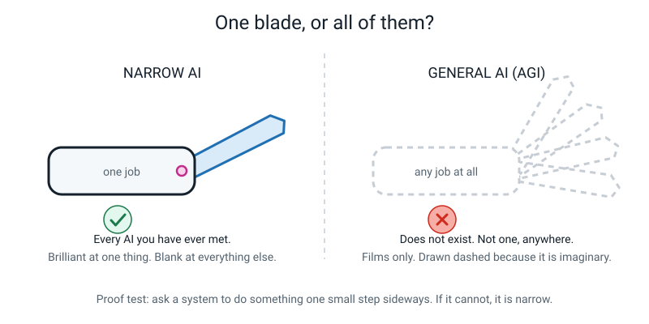

*Figure 3.2 — The right-hand one is drawn with dashed lines on purpose. You can't draw a solid
picture of a thing that isn't there.*

And this week you don't take my word for it. You **prove** it, on a real system, with your own hands,
in about twenty minutes.

Here's a question to start on. You use YouTube. **Name one thing YouTube's recommendation system
cannot do.** Not "recommend good videos" — that's it doing its job badly. Something it cannot do
**at all**.

Can it tell you what 7 × 8 is? Can it tell you what's *in* the video? Can it make a video? Can it
tell you whether your homework is finished?

One job. Blank everywhere else.

---

## 🧠 The Big Idea

This section gives you four ideas for the week: labels versus generating, narrow AI, confidence scores, and hallucinations.

### 1. Picking a label, or writing on a blank page?

Last week's spam filter: how many different things could ever come out of it?

**Two.** `spam` or `not spam`. That is the entire menu. It could run for a hundred years and never
produce a third thing.

When a system picks from a fixed menu like that, the thing it produces is a **label**.

Now: a chatbot writing a poem. How many different things could come out of *that*? Could it write a
poem nobody has ever written before? Yes. So there is **no list**.

> **Generative AI** — a system that produces new content (text, images, sound, video) instead of
> choosing a label from a fixed list.

**🍕 The analogy — the school test.** A multiple-choice question gives you four boxes and you tick one.
That's labelling. An essay question gives you a blank page and you write three hundred words that have
never been written in that order before. That's generating. **Same you, same brain, two completely
different kinds of answer.**

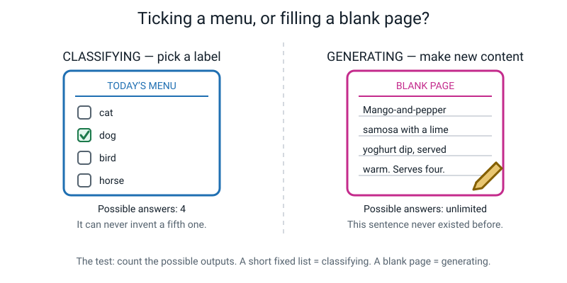

*Figure 3.1 — Ordering from a menu, versus inventing a dish that isn't on it.*

**The test is exact, and you can do it in your head: count the possible outputs.**

| System | Its possible outputs | How many? | Kind |
|---|---|:--:|---|
| Spam filter | `spam`, `not spam` | 2 | picking a label |
| Photo animal tagger | `cat`, `dog`, `bird`, `horse`, `fish` | 5 | picking a label |
| Handwriting digit reader | `0`–`9` | 10 | picking a label |
| Chatbot writing a paragraph | any sequence of words | can't be counted | **generating** |
| Image maker | any picture | can't be counted | **generating** |

Here is the test as a picture you can copy.

```text
   COUNT THE POSSIBLE OUTPUTS
     short fixed list  →  picking a label
     blank page        →  generating
```

**And here is the bit almost everyone gets wrong.** Generative AI is **not** a separate thing from
machine learning. It is **inside** it. A chatbot learned from examples in exactly the same way the
spam filter did — it just produces a blank page instead of a menu.

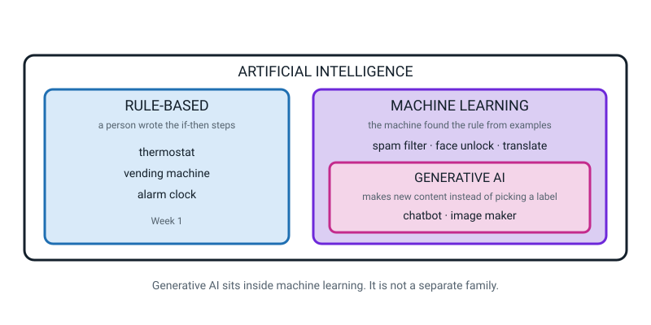

*Figure 3.6 — Boxes inside boxes. Generative AI lives inside machine learning, which lives inside AI.*

So when you sort a system, ask two questions **in this order**:

1. Did a human write the rules, or did the machine find them from examples?
2. If it found them — does it output a label from a menu, or new content from a blank page?

---

### 2. Narrow means: blank one step sideways

> **Narrow AI** — a system that can do exactly one job and is completely blank outside it.
>
> **General AI (AGI)** — a hypothetical system that could learn and do *any* job a person can,
> switching between them the way you do. **It does not exist.**

| System | Number of jobs it can do |
|---|:--:|
| AlphaGo | 1 (play Go) |
| Face unlock | 1 (is this the owner's face?) |
| Spam filter | 1 (spam or not) |
| Google Translate | 1 (turn text in language A into language B) |
| A modern chatbot | **looks like many — but arguably it is 1:** guess the next chunk of text (the hard case; see Talk About It 1) |
| **You** | effectively unlimited |

That last row is the whole reason the word *narrow* exists. You are reading this, and you could stop
and make toast, comfort a friend, learn to juggle, and argue about a cricket match. **No machine can
do that set.** Not one.

Now — **how do you prove a system is narrow?** This is the actual skill of the week, and it has a
trick to it.

A bad test is *"ask Google Translate to make me a sandwich."* Of course it can't. Nobody claimed it
could, and the failure teaches you nothing.

**A good test is one small step sideways.** Something a person would find easy, and obviously related
to the machine's job. When *that* fails, you've learned exactly where the edge is.

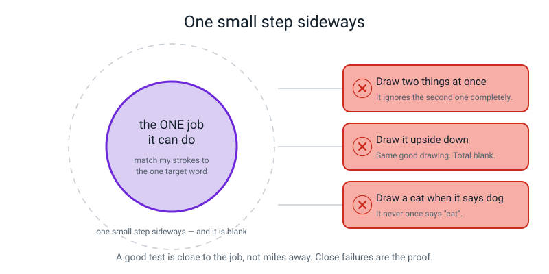

*Figure 3.7 — The circle is the one job. Every chip outside it is one small step sideways, and it
fails at all of them.*

**The real numbers, from a real Quick, Draw! session:** it got 5 out of 6 drawings right, in about 2
to 6 seconds each. That's good. Then we asked it to draw the same prompt **upside down** — a drawing a
human would recognise instantly — and it got **0 out of 1**. Same drawing. Rotated. Blank.

That's a step sideways, and it is a strong clue about where the edge is. One try is only a hint,
though: to be sure, you would repeat it with several drawings.

---

### 3. Confidence is a preference, not a promise

When a model gives an answer, it doesn't just say "dog". It gives a number to **every** option on its
menu, and in a model like this the numbers add up to 100.

> **Confidence score** — how strongly the model prefers one answer over the others. A number, not a
> promise.

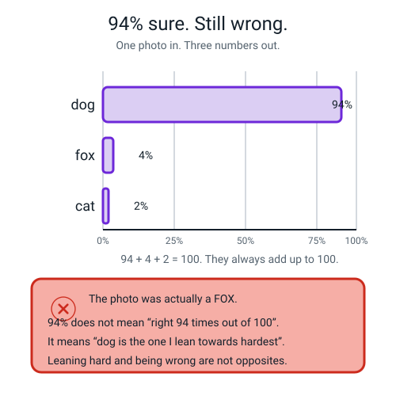

*Figure 3.3 — Dog 94, fox 4, cat 2. Ninety-four plus four plus two is a hundred. The photo was a fox.*

Read that figure again slowly, because here is the trap:

> **⚠️ Watch out:** "94%" does **not** mean *"right 94 times out of 100"*. It means *"dog is the one
> I'm leaning towards hardest"*. Leaning hard and being right are two completely separate things.

A model can be 99% confident and completely wrong. And it happens **often**, especially on things unlike
anything it trained on — which is exactly when you would most want it to hesitate, and exactly when
it doesn't.

**Quick, Draw! shows you this for free**, and better than any number could. It doesn't print
percentages — it calls its guesses out loud, **in order**: *"Is it a circle? … is it a wheel? … it's a
clock!"*

That order **is** the confidence ranking, spoken aloud. The first thing it says is the thing it
prefers most. So when it said "circle", circle was its **top** answer — it wasn't hedging, it was
confident about circle. Then more lines appeared and its top answer changed.

**Confidence moves around, and at every single moment it sounds certain.**

---

### 4. The thing today's AI genuinely cannot do

Here it is, and it surprises adults more than anything else in this course:

> **Today's AI cannot reliably know when it doesn't know.**

A person who has never seen a Pomeranian says *"I'm not sure what that is."* A model trained on cats
and dogs, shown a Pomeranian, says *"dog — 94%"*. Shown a **chair**, it still says *"dog — 71%"* —
because *chair* is not on its menu. **There is no option for "that's outside my world."**

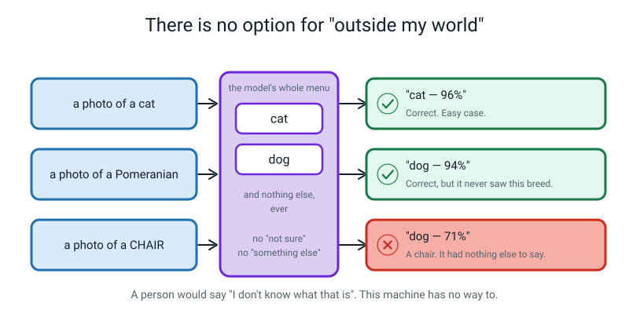

*Figure 3.13 — Two menu items. Three inputs. The third one had nowhere to go.*

The generative version of this problem has a name.

> **A hallucination** — a confident, fluent, completely invented answer.

You produced one in class: a chatbot wrote a paragraph about a 1987 Australian film called *The Glass
Kangaroo of Wollongong*, with a director, a festival award and a newspaper quote. **The film does not
exist.** Not one detail was real. It didn't hedge, it didn't warn you, and it sounded exactly as
confident as when it's right.

**The most important sentence in this chapter:**

> *It isn't lying. Lying means you know the truth and you choose to say something else. It doesn't
> know the truth. It's guessing what a good answer would look like — and sometimes a good-looking
> answer isn't a true one.*

Why did it invent a director's name instead of saying "I don't know"? Because *"I don't know"* isn't
the kind of thing it was built to produce. Its whole job is to make text that looks like the right
kind of text. A paragraph about a film has a director's name in it. So it produced one.

That's not it being sneaky. That is the machine working **exactly as designed**, on a question where
the plausible answer and the true answer are different things.

---

## 🔍 Worked Examples

Three examples show the ideas at work, one step at a time. Follow each one before you try your own.

### ✏️ Worked Example 1 (a drawing game) — reading a score card, then finding the edge

Here is a real six-round session, written down properly. Notice that the important column is not
*"did it get it"* — it's **the guesses in order**.

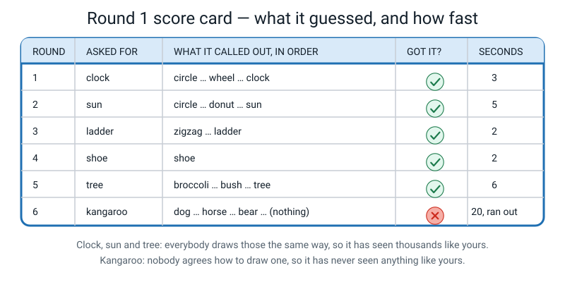

*Figure 3.4 — A filled-in score card. Yours will look different; the shape is what matters.*

| Round | Asked for | Guesses it called out, in order | Got it? | Seconds |
|:--:|---|---|:--:|:--:|
| 1 | clock | circle … wheel … **clock** | ✅ | ~3 |
| 2 | sun | circle … donut … **sun** | ✅ | ~5 |
| 3 | ladder | zigzag … **ladder** | ✅ | ~2 |
| 4 | shoe | **shoe** | ✅ | ~2 |
| 5 | tree | broccoli … bush … **tree** | ✅ | ~6 |
| 6 | kangaroo | dog … horse … bear … *(silence)* | ❌ | ran out |

**Step 1 — read round 1 as confidence.** It said "circle" first. At that exact moment, circle was its
**top** answer. It was not being cautious. Then more strokes appeared and the ranking changed. It was
confidently wrong twice before it was confidently right.

**Step 2 — why round 6 might have failed.** Here is a hypothesis: not because kangaroos are hard to
draw, but because **nobody agrees how to draw a kangaroo**, so the examples it learned from would be
all over the place. (Another possibility is that it is simply weaker on kangaroos. You could test it
with several more kangaroos.) Round 1 probably worked because almost every person on Earth draws a
clock as a circle with two hands.

**Step 3 — now find the edge.** Six successes tell you what it's good at. That is not what we want. We
want the *edge*. So design a task one small step sideways and run it:

| The sideways task | What actually happens | What it proves |
|---|---|---|
| Draw **two things at once** (a cat *and* a hat) | Write down every guess it calls out. It was built for one doodle at a time, so two objects usually muddle it. | It was not built to describe a picture with two things in it |
| Draw the prompt **upside down** | Often fails on an otherwise good drawing (try several) | A hypothesis: it learned what people's *strokes* usually look like, not what the object is |
| It asks for "dog" — draw a **cat** | Write down every guess. It may well call out "cat" at some point, because it guesses across a whole menu of words. | Whatever happens, it can only pick from a fixed menu (about 345 words) |
| It asks for "house" — **write the word** H-O-U-S-E | "zigzag", "squiggle" (what we saw in one session) | Letters and meaning are outside its world |

**Step 4 — write the conclusion from your evidence, not from the website.** The site describes itself
as *a neural network learning to recognise doodles*. That is fair as far as it goes, but your tests
show how narrow the job is: it chooses from a fixed menu of about 345 words. It cannot say **"I don't
know"**, and it cannot name anything that is not on the menu. A cat when it wanted a dog may get
called "cat" (it is on the menu), but a drawing of something off the menu can only ever be called
the nearest thing that is.

> **The honest description:** *"Quick, Draw! does one job: given a set of pen strokes, it ranks the
> words on a fixed menu of about 345 by how closely the strokes match what other people drew for each
> word, and the round is won when its guess matches the prompt. It can't name anything off the
> menu."*

You just got a fuller description than the marketing, by pushing three inches past the edge of the
demo. That is the method of this entire course.

---

### 🏫 Worked Example 2 (school project) — catching a chatbot inventing

Say you're researching Australian films for a school project. An adult types this prompt, with you watching.

```text
Tell me about the 1987 Australian film "The Glass Kangaroo of Wollongong",
including its director and how it was received.
```

Back comes something like this:

> *"The Glass Kangaroo of Wollongong (1987) is a quietly regarded Australian drama directed by Marion
> Hollis, her second feature after the well-received Coast Road. Shot over eleven weeks in New South
> Wales, it follows a glassblower's daughter returning to her home town. It won the Silver Boomerang
> at the Adelaide Film Festival and holds a warm reputation among Australian critics, with The Age
> calling it 'small, salt-worn and completely honest'."*

**Step 1 — count the claims you could actually check.** Point at each one:

| # | The claim | Checkable? |
|:--:|---|---|
| 1 | Directed by **Marion Hollis** | Yes — search the name |
| 2 | Her earlier film **Coast Road** | Yes |
| 3 | Won the **Silver Boomerang** at the Adelaide Film Festival | Yes — festivals publish winners |
| 4 | **The Age** called it "small, salt-worn and completely honest" | Yes — newspapers keep archives |
| 5 | Shot over **eleven weeks** in New South Wales | Yes, with effort |

**Five checkable claims. Every single one invented**, because the film does not exist. The prompt made
it up.

**Step 2 — count the warnings it gave you.** Zero. No hedge, no "I'm not sure", no "I can't find a
record of this".

**Step 3 — challenge it.** The adult types this second prompt.

```text
Was that film real? Answer with just yes or no.
```

Often it now says **no** (this varies by chatbot and by day).

**Step 4 — work out what that tells you.** It just changed its story. So its first answer was **not
reliable evidence that it knew**. It produced text that looked like the right kind of text; when
challenged, it produced different text that also looked right. (It may have had a little partial
knowledge, and chatbots are also easily pushed around by a challenge, so a flip does not prove it knew
nothing. What it proves is that you cannot trust the first answer.)

*(And if it sticks to "yes, it was real" — that's even better. Now it's confidently wrong twice. Which
of the two answers should you believe? **Neither.**)*

**Step 5 — the four rows to write down every time:**

| Question | The answer for this run |
|---|---|
| Did it invent details? | Yes — a director, an earlier film, an award and a newspaper quote |
| How confident did it sound, 1–5? | **5.** It didn't hedge once |
| Did it warn you at all? | No. Not a word |
| Would you have believed it if you didn't already know? | **Yes** — and that's the frightening part |

> **💡 Try this:** if the chatbot refuses and says it can't find the film, **say so out loud and be
> pleased** — that's the honest behaviour we want. Then run the backup: ask the same question in two
> separate fresh chats and compare. *"Explain in 100 words why the sky is blue."* The two answers will
> differ, often a lot. If it were looking an answer up, would it come back different every time? No.
> **Different every time is the signature of generating.**

---

### 🍬 Worked Example 3 (a Saturday) — sorting five systems properly

Five systems from one trip to the shops. For each one, name the input and the output **first**, then
answer the two questions in order.

**1. The automatic doors at the sweet shop.**

- Input: a motion sensor reading. Output: `open` or `stay shut`. That's 2 possible outputs.
- Q1: rules or learned? **Rules** — `IF something moves THEN open`. A person wrote that.
- Q2: doesn't apply — it isn't learned.
- **Family: rule-based.** And arguably **not AI at all**, because "did something move?" needs no
  judgement. How do you know? *It opens for a stray cat.* It isn't judging anything.

**2. The self-checkout barcode scanner.**

- Input: black-and-white bars. Output: one price from a price table.
- Q1: **rules.** A barcode is a printed number; the scanner reads it and looks it up. Same barcode,
  same price, every time, for ever.
- **Family: rule-based.** Not AI — no judgement anywhere in it.

**3. A chatbot writing a birthday poem for your gran.**

- Input: your typed request. Output: a poem.
- Q1: **learned** — from enormous amounts of text.
- Q2: count the outputs. Could it write a poem nobody has ever written? Yes. **Can't be counted.**
- **Family: generative AI** — and therefore also machine learning, since generative AI lives inside it.

**4. Music autoplay picking the next song.**

- Input: the song that just finished, plus your history. Output: one song out of the ~100 million on
  the service.
- Q1: **learned** — from what millions of people played next, and didn't skip.
- Q2: 100 million is enormous, but it is a **fixed list of songs that already exist**. It did not
  compose anything. So: picking.
- **Family: machine learning, not generative.** This is the row people get wrong.

**5. Face unlock on the way home.**

- Input: a camera image. Output: `unlock` or `stay locked`. **2 outputs.**
- Q1: **learned** — nobody can write if-then rules over two million coloured dots.
- Q2: two is a very short menu. Picking.
- **Family: machine learning, not generative.**

**Score: 2 rule-based, 2 machine learning, 1 generative.** And notice how much of the work was done by
just writing down the input and the output before deciding anything.

---

## 🎲 What We Did In Class — AI Detective, in three rounds

This section is the plan for the lesson. Use it to repeat the three rounds at home with an adult.

### Round 1 — Quick, Draw! and the narrowness proof (14 min)

1. **Say the privacy line out loud first.** Every drawing goes to Google and into a public pile.
2. Open `quickdraw.withgoogle.com`. **You draw; someone else writes** — you'll draw better with your
   hands free.
3. Six drawings, twenty seconds each. Record **every guess it calls out, in order** — not just whether
   it won.
4. Then **you** design the sideways task. Not your teacher. You. Run it and write down what happened.
5. Finish with one written sentence: *what is this system's real job, based on my evidence?*

### Round 2 — catch it inventing (8 min)

**An adult is at the keyboard.** You watch and write. Use the prompt and the four rows from Worked
Example 2 above.

**No internet?** It still works. Have someone read the *Glass Kangaroo* paragraph aloud, deadpan, and
circle every claim you could check. Then say the line: *"that's what a machine that has never heard of
a thing sounds like."*

### Round 3 — build the fifteen-note board (12 min)

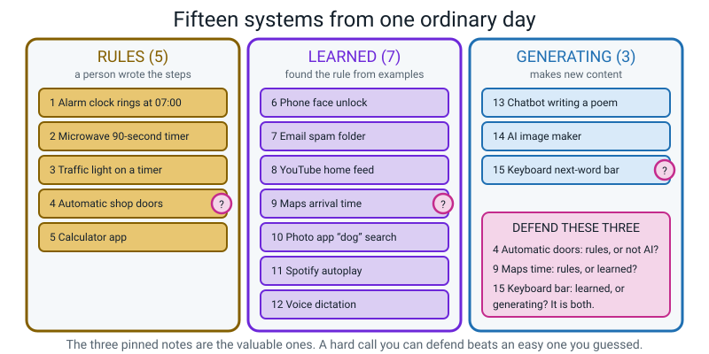

*Figure 3.5 — What a finished board looks like: fifteen notes, three columns, three pinned for
defending.*

**Set-up:** three columns marked **RULES · LEARNED · GENERATING**, and a narrow fourth column headed
**DEFEND THESE**.

**Rules of the board:**

- One system per sticky note. Your eight rows from Week 1 count — get them out.
- **Specific, or it doesn't count.** "My phone" is rejected. "My phone's keyboard suggestion bar" is
  accepted.
- **Say the reason out loud before the note goes down.** Every single one.
- Hunt in four zones so you don't end up with fifteen phone apps:

| Zone | Where to look |
|---|---|
| 🏠 Home | TV recommendations, smart speaker, washing machine cycles, thermostat, microwave, doorbell |
| 📱 Phone | keyboard, photo search, face unlock, maps, spam folder, video feed, music shuffle, translate |
| 🏫 School | attendance system, library scanner, plagiarism checker, timetable, school bell |
| 🛣️ Street | traffic lights, self-checkout, ATM, automatic doors, number-plate cameras, bus arrival board |

**Then the most valuable two minutes:** pick the **three notes you were least sure about** — least
sure, not most interesting — and move them into DEFEND THESE. Those three are your homework.

> **💡 Try this:** if you can't find a single *generating* system in your whole day, that is a real
> finding, not a failure. Write it down as a sentence: *"I met no generative AI today."* It's true for
> a lot of people. Generative AI is the **loudest** kind, not the most common kind.

---

## 💬 Talk About It

These three questions have no single right answer. Argue them with a friend or an adult.

**1. "A chatbot writes poems, explains science and translates Spanish. Is it still narrow?"**

*Hint:* this is a genuinely hard question and there's no clean answer — which is why it's worth asking.
The strongest case for *narrow*: it is doing one job over and over — guess what chunk of text comes
next — and a poem, an explanation and a translation are all text. It also cannot learn to ride a
bicycle, cannot check whether it's right, and cannot do anything that isn't producing text. Try
arguing both sides before you pick one. (In Week 28 you build the whole engine by hand with tally
marks, and then you can decide properly.)

**2. "A weather app says 70% chance of rain. Is that a confidence score?"**

*Hint:* no, not quite — and this catches most adults. Weather forecasts are *checked*: over many
days, it really does rain on about 70% of the days that were called 70%. Model confidence scores are
often not checked like that. Same-looking number, completely different promise.

**3. "When will AGI exist?"**

*Hint:* **nobody knows**, and that's an honest answer rather than a dodge. Well-informed people give
answers from five years to never, all looking at the same evidence. What we *can* say about today:
no system anywhere does everything a person can, and chatbots, which do many text jobs, are the
hard case (Week 28). Anyone who tells you the date is guessing — especially the confident ones.

---

## ⚠️ Don't Get Tricked

Four wrong ideas are very common. Each one is shown below next to the better version.

### Trick 1 — "AI means chatbots"

| ❌ Wrong | ✅ Right |
|---|---|
| "AI is ChatGPT and things like it." | "That's one kind. Count the outputs: face unlock has 2, spam has 2, your video feed picks from videos that already exist. None of those generate anything, and all of them are AI." |

Chatbots got all the news coverage, so "AI" now means "AI that talks" to most people. Most of the AI
you touched today didn't say a word to you.

### Trick 2 — "It said 96%, so it's right 96 times out of 100"

| ❌ Wrong | ✅ Right |
|---|---|
| "96% means it's nearly certainly correct." | "96% means *wolf is the answer I'm leaning towards hardest*. It's the biggest number in a list that adds up to 100. It says nothing at all about whether it's correct." |

The place this bites hardest: models are often **confidently wrong**, especially on things unlike anything they
trained on.

### Trick 3 — "It lied to me"

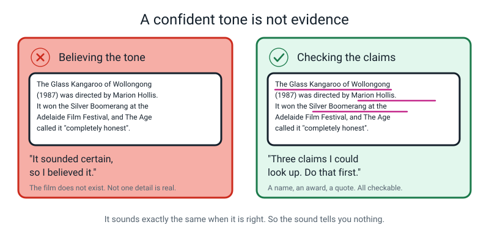

*Figure 3.8 — Believing the tone, versus checking the claims.*

| ❌ Wrong | ✅ Right |
|---|---|
| "It lied about the film. It made it up deliberately." | "Lying needs you to know the truth and choose to say something else. It doesn't know the truth. It's guessing what a good answer would look like. We call that a **hallucination**." |

It sounds *exactly the same* when it's right. So the sound tells you nothing, and "it sounded
confident" is worth **zero** as evidence.

### Trick 4 — "AGI is nearly here — I saw it in a film"

| ❌ Wrong | ✅ Right |
|---|---|
| "There's probably a secret one already, or one next year." | "No system anywhere does everything a person can do. Whether there ever will be is genuinely argued about by people who know far more than I do." |

Could someone build one in secret? Extremely unlikely, and here's the reasoning rather than just the
answer: these systems need enormous electricity, thousands of specialised chips and hundreds of
people. That leaves tracks — power bills, chip orders, job adverts. And the companies building the
biggest systems have every reason to *announce* progress, not hide it.

---

## 🌍 Where You've Seen This

These are everyday places where this week's ideas show up.

1. **Autocorrect's red squiggle vs the suggestion bar.** The squiggle is a word list (rules). The bar
   above your keyboard produces words — a very small blank page. Same feature, two families. This is
   the single best hard call on the whole board.
2. **Your video feed.** It picks from videos that already exist. Enormous list, but a list. Learned,
   not generating.
3. **A video doorbell.** Motion detection is a rule. "That's a person, not a cat" is learned. One
   product, two families — tear the sticky note in half.
4. **Voice assistants.** Waking up on its name is a small learned yes/no picker. Turning your speech into
   words is learned. Answering in whole sentences it composed is generating, and a plain "set a timer"
   may be simple rules. **Several** families in one device.
5. **Photo apps suggesting "is this the same person?"** with a percentage next to it. That percentage
   is a confidence score. Now you know what it does and doesn't promise.
6. **Homework help of any kind.** Every fluent, confident paragraph is a paragraph you can check. Get
   into the habit now: *which bits of this could I look up?*

---

## 🧭 Where This Fits

This section shows where this week sits on the course map.

The right-hand branch of the fork was one big empty room last week. This week it became a heading
with **nine tiles** underneath it, and you filled in the first one. From here the branch fills up
like a page — left to right, top to bottom — and the dashed tiles tell you exactly which weeks the
rest are coming in.

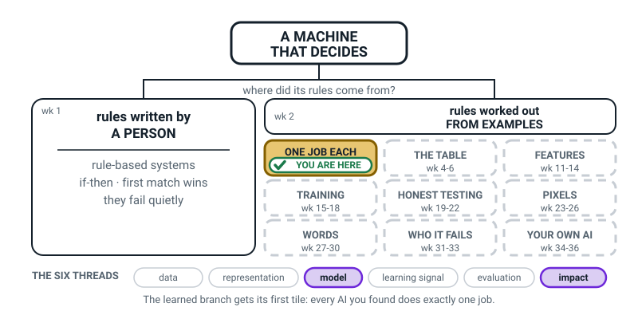

*Figure 3.0 — The map after Week 3. The learned branch is now a heading over nine tiles. The tinted
tile with the tick is yours. Every dashed tile is a "not yet", and it says which weeks it belongs to.*

| | |
|---|---|
| **The mental model you now own** | Under the learned branch sit three families — machines that **decide**, machines that **generate**, and machines that were **told the rules**. And every real one is **narrow**: brilliant at one job, blank one small step sideways from it. |
| **The one question it answers** | *"What is this machine's one job, and what happens one small step outside it?"* |
| **What it plugs into** | Weeks 1 and 2. You can now sort any machine into told-the-rules or learned-from-examples — and this week you did it fifteen times, on your own ordinary day. |
| **What carries forward** | Narrowness is why your own model in Week 17 will know only three objects — and why it will still answer a confident 94% about a fourth one in Week 16. |
| **Spiral thread** | 📦 **Model** and 🌍 **Impact** — what the decision-maker *is*, and what it does to the people who use it. Data, representation, learning signal and evaluation come later. |

> **💡 Try this:** copy the nine tiles onto your own map, dashed ones and all, but do not read ahead
> about them. Guessing what "WHO IT FAILS" might mean in Week 31 is far more useful to you than being
> told, and you get to find out in March whether you were right.

---

## 🔑 Remember This

Keep these eight points from the week.

- **Count the possible outputs.** Short fixed list → picking a label. Blank page → **generating**.
- **Generative AI lives inside machine learning.** It is not a separate family; it learned from
  examples just like everything else.
- **Every real AI is narrow:** one job, and blank one small step sideways from it.
- **A good narrowness test is close to the job**, not miles away. Close failures are the proof; silly
  failures prove nothing.
- **General AI (AGI) does not exist.** Not a prototype, not a secret one: no system today can do everything a person can.
- **A confidence score is a preference, not a promise.** 94% means "this is what I'm leaning towards
  hardest", never "right 94 times out of 100".
- **Today's AI cannot reliably know when it doesn't know.** Shown something outside its menu, it
  answers anyway.
- **A hallucination is not a lie.** It's a good-looking answer produced by something that has no idea
  what's true — and it sounds identical to a correct one.

---

## 📓 New Words

These are the four words for this week.

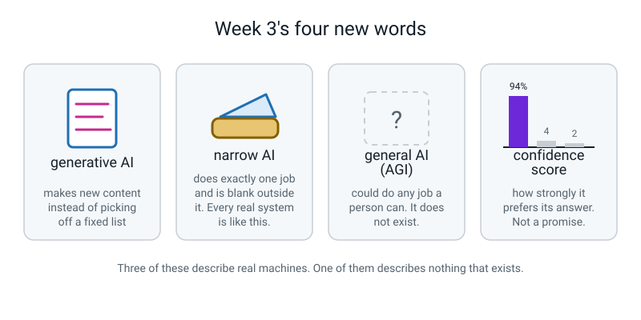

*Figure 3.9 — Three of these describe real machines. One describes nothing that exists.*

| Word | What it means | Example |
|---|---|---|
| **generative AI** | A system that makes new content instead of picking an answer off a fixed list | A chatbot writing a poem nobody has written before |
| **narrow AI** | A system that does exactly one job and is blank outside it — this is all of them | AlphaGo, which plays Go and cannot play checkers |
| **general AI (AGI)** | An imaginary system that could do any job a person can. **It does not exist.** | Only in films |
| **confidence score** | How strongly the model prefers its answer. A number, not a promise | "Dog: 94%" on a photo that is actually a fox |

> **🧑‍🏫 If someone asks "so is it actually intelligent?"** — it depends entirely on what you mean, and
> that isn't a dodge, it's the real answer. Can it do a job that used to need a person's judgement?
> Yes, often brilliantly. Does it understand what it's doing? As far as anyone can tell, there's nothing in there having a time.
>
> Does it know when it's out of its depth? **No — and that's the dangerous bit.** Pick your definition
> and the answer follows.

---

## 📤 Your Homework

Open **[the Week 3 workbook](../workbook/week-03.md)**. About **55 minutes** — this is the biggest
homework of the term so far, so start it early rather than the night before.

1. **Warm-up** — five quick questions from Week 2.
2. **Practice Sets A and B** — about 20 minutes, including a families diagram you label yourself and
   two "what would go wrong here" scenarios.
3. **The Puzzle of the Week** — six systems, count the outputs, and work out which two cannot be
   counted at all.
4. **Build It: finish the AI Spotter's Log.** Fifteen rows, each sorted into rules / learned /
   generating. Most of it is copying off your sticky notes — except every row also needs a **one-line
   reason**, and every reason must mention either *a person wrote the steps* or *it must have learned
   it from examples*.
5. **Defend your three hard calls.** One paragraph each, five sentences minimum, and every paragraph
   must contain all four of these:
   1. What made it hard to classify.
   2. The evidence **for** your answer.
   3. The evidence **against** your answer — the honest case for the other side.
   4. What **one fact** you'd need to look up to be certain.

   **Number four is the one everyone skips and it's the most valuable.** *"I'd need to know whether the
   doorbell can tell a person from a cat"* is a real, answerable question. Write real ones.

6. **Go and interview an adult.** Ask any adult: *what is AI?* Write down **exactly** what they said,
   word for word, even if it's short, even if it's wrong. Then rewrite it honestly underneath.

> **⚠️ Watch out:** be generous about the adult interview. Most adults say something with *robots*,
> *thinking* or *ChatGPT* in it — the three ideas you have personally worked past in three weeks. The
> honest way to write that up is *"this is what nearly everyone thinks, including me three weeks
> ago"* — never *"the adult was wrong"*.

---

[⬅ Week 2](week-02.md) · [Course Home](../README.md) · [Week 4 ➡](week-04.md) · [📓 Workbook — Week 3](../workbook/week-03.md) · [Glossary](../../glossary.md)
