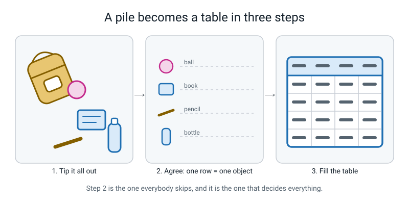
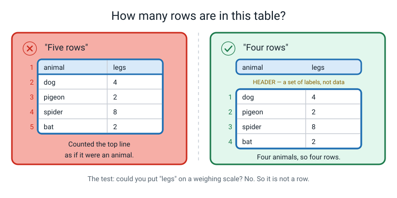
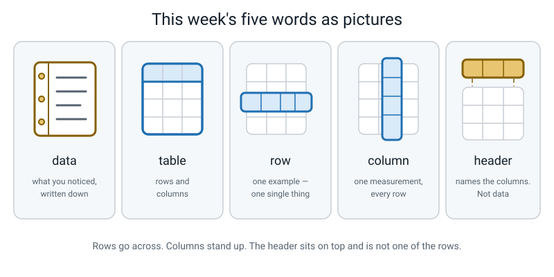

# Week 4 — Everything a Machine Knows Arrived as a Table

[⬅ Week 3](week-03.md) · [Course Home](../README.md) · [Week 5 ➡](week-05.md) · [Workbook](../workbook/week-04.md)

---

> ### This week in one sentence
> **Whatever an AI knows, it arrived as rows and columns — one row is one thing, one column is one measurement.**
>
> **By the end of this chapter you will be able to:**
> - Say out loud "one row = one ______" for any dataset, and explain why a different choice would give you a different table
> - Point at the **header**, a **row** and a **column** on any table put in front of you
> - Turn a pile of real objects into a table of at least eight rows and four columns
> - Explain why "one row is one example" is the rule that makes the rest of AI work
>
> **Reading time:** about 20 minutes. **Homework:** about 45–60 minutes, spread across the week.

---

## 🪝 Start Here

Twelve scraps of paper are scattered across the table in front of you. Somebody has scribbled one fact on each one, in no order at all:

```
pencil 6 g      book 26 cm      bottle blue     ball 45 g
book 340 g      ball 22 cm      pencil 18 cm    book blue
bottle 500 g    pencil yellow   bottle 22 cm    ball pink
```

Here is your question. **Which of those four things is the heaviest, and how much longer is it than the shortest thing?**

Go on. Actually try it. Time yourself.

If you are like almost everybody, that took you somewhere between forty and ninety seconds, and you had to check at least one thing twice. Your eyes went hunting all over the table. You found `bottle 500 g` and then had to go looking for the other weights to make sure nothing beat it. Then you had to start again for the lengths.

Now look at the same twelve facts written like this:

| object | grams | cm | colour |
|---|---|---|---|
| pencil | 6 | 18 | yellow |
| book | 340 | 26 | blue |
| bottle | 500 | 22 | blue |
| ball | 45 | 22 | pink |

Same question. **Four seconds.** The bottle at 500 g is heaviest — your eye just runs down the `grams` column. The pencil at 18 cm is shortest — run down the `cm` column. The bottle is 22 cm. So it is **4 cm longer** than the shortest thing.


*Figure 4.1 — Nothing new was measured between the left side and the right side. Not one fact was added.*

Read that caption again, because it is the whole point. **Nobody added any information.** The twelve facts on the left are the twelve facts on the right. All that changed is where they sit.

And here is the part that matters for this whole course.

You are a human being. You can read messy handwriting, you can guess what a scribble means, you can hold four things in your head at once. You still needed a minute.

**A computer cannot do the pile at all.** Not slowly — *at all*. It cannot look at a heap of notes and work out which fact belongs to which object. The only shape a computer can read is the one on the right.

So every single AI system that exists — the one choosing your next video, the one flagging spam texts, the one helping a doctor read a scan — starts with a person turning a pile into that shape.

That shape is called a **table**. This week you are going to make one out of the contents of a bag.

---

## 🧠 The Big Idea

### 1. Nothing is data until somebody writes it down

Look out of a window right now. Suppose it is raining.

You know it is raining. That knowledge is sitting in your head, and it is **completely useless to a machine**.

Now write in a notebook: `3 September 2026, rain, 24 °C`. You have just made data.

> **Data** — observations of the world that have been written down in a form a machine can read.

The load-bearing word is *written down*. Nothing is data until it leaves somebody's head and lands somewhere countable.

**The analogy: the shopping list.** You "know" what you need from the shop. Then you get there and buy crisps and forget the milk. The list is not a lesser version of what was in your head — the list is the only version anything outside your head can use.

**The concrete version.** Say you slept badly last night. Which of these is data?

| What you have | Data? | Why |
|---|---|---|
| "I feel tired today" | ❌ No | It is in your head. Nothing can count it. |
| "I slept badly, I think about six hours" | ❌ Not yet | Still a feeling. "About" is not a measurement. |
| `sleep_hours = 6.5`, written in a box on a sheet | ✅ **Yes** | It is written, it has a number, it has a unit. |

This matters more than it sounds. People talk about AI as if the machine goes out and looks at the world. **It does not.** Somebody wrote things down, and the machine read what they wrote. If they wrote nothing down about half the world, the machine simply never learns about that half.


*Figure 4.2 — Real objects on the left. A ruled table on the right. Somebody had to do the middle step by hand.*

Nobody invented the table, by the way. It is just what you get, every time, when you write down facts about a group of things. Every school on Earth keeps a register: one line per student, one column per thing the school needs to know. Nobody sat in a committee and decided that. **It is the shape that falls out of the job.**

A receipt is a table. A cricket scorecard is a table. A train timetable is a table. When engineers at an enormous AI company prepare data to train a system, they are working with a table — a mind-bendingly big one, but exactly the same shape as your class register.

### 2. A table has exactly four parts, and they have exact names


*Figure 4.3 — Header, row, column, cell. Trace each one with your finger before you read on.*

> **Table** — data arranged in rows and columns.
>
> **Row** — one example. One single thing you observed.
>
> **Column** — one attribute. One thing you measured about *every* example.
>
> **Header** — the top line. It names the columns. It is **not** data.
>
> **Cell** — where one row meets one column. One measurement of one thing.

**The analogy: a block of flats.** A **row** is one flat — everything about one family lives along it. A **column** is one pipe running up the building — the same thing, on every floor. A **cell** is where they cross: one family's water. And the **header** is the sign on the front of the building that says what each pipe carries. The sign is not a flat and nobody lives in it.

**Rows go across. Columns stand up**, like the stone columns holding up a building. There is no clever trick for remembering it — you just have to say it a lot and trace the picture with your finger. Three goes and it sticks.

**The header is not data.** In the table from the hook, the top line says `object`, `grams`, `cm`, `colour`. That line is not an object. It does not weigh anything. Here is the test:

> **💡 Try this:** point at any word in the top line and ask *"could I put this on a weighing scale?"* You cannot put `grams` on a scale. So the top line is not a row.

That table has **four rows**, not five. Count the objects, not the lines of writing.

**And the cell test.** Point at any single box and try to say a whole sentence out loud. Point at where `book` meets `grams`: *"The book weighs three hundred and forty grams."* That works, so the table is fine. If you cannot make a sentence, something has gone wrong — usually you have your rows and columns crossed.

### 3. The one big decision: one row = one *what*?

This is the heart of the week, and it is the bit almost everyone skips.

Before you write a single number, you have to decide: **one row = one what?** And there is usually more than one legal answer.


*Figure 4.4 — Same drawer. Three different row units. Three different tables — all correct, all answering different questions.*

Take a drawer with four things in it: a pencil, a book, a bottle and a ball. They are split across three zip pockets, and they belong to two people.

**Table A — one row = one object.** Four rows.

| object | grams | pocket | owner |
|---|---|---|---|
| pencil | 6 | front | Asha |
| book | 340 | main | Asha |
| bottle | 500 | side | Ravi |
| ball | 45 | front | Ravi |

Lets you ask: *what is the heaviest single thing in there?* → the bottle.

**Table B — one row = one pocket.** Three rows.

| pocket | how_many_objects | total_grams |
|---|---|---|
| main | 1 | 340 |
| front | 2 | 51 |
| side | 1 | 500 |

Lets you ask: *which pocket is fullest?* → front, with two objects.

**Table C — one row = one owner.** Two rows.

| owner | how_many_objects | total_grams |
|---|---|---|
| Asha | 2 | 346 |
| Ravi | 2 | 545 |

Lets you ask: *who is carrying more?* → Ravi, by 199 grams.

**All three are correct tables.** Not one of them is "the real one". But — and this is the bit that hurts — **you cannot get from one to the others afterwards without going back to the drawer.**

Try it. Look at Table B and tell me the weight of the pencil. You can't. It got swallowed into the `51` on the front-pocket row and it is gone forever.

> **⚠️ Watch out:** the information was thrown away *at the moment you chose the row unit*, not later. By the time somebody asks the question, it is far too late.

**So which do you pick?** The rule is simple: **the row is whatever the question is about.** Asking about objects? One row = one object. Asking about days? One row = one day. Asking about pockets? One row = one pocket.

And if you don't know the question yet, there is a professional's trick:

> **Record the smallest thing you care about. You can always add rows up. You can never split them apart.**

Build Table A with a `pocket` column and an `owner` column, and you can *build* Tables B and C from it any time you like, just by adding rows together. Build Table B first, and Table A is lost.

### 4. Two golden rules keep a table honest


*Figure 4.5 — The two rules, plus the one sentence you fill in before you measure anything.*

Once the row unit is fixed, two rules keep the table usable. They sound boring. They are not.

**Rule 1 — every row is the same kind of thing.**

All objects, or all pockets, or all days. Never a mix.

The classic way people break this is by adding a tidy `TOTAL` line at the bottom:

| object | grams |
|---|---|
| pencil | 6 |
| book | 340 |
| bottle | 500 |
| ball | 45 |
| **TOTAL** | **891** |

That looks like good schoolwork and it wrecks the table. A total is not an object. It has no colour. It did not come out of a pocket. The moment a machine reads that table, it believes there is a fifth thing in the bag called *Total* that weighs 891 grams.

**The test:** ask a silly question about the row. *"What colour is the total?"* If the question is absurd, the row does not belong.

**Rule 2 — every column is measured the same way, in every single row.**

If column three is "length in centimetres", it is centimetres all the way down. Not inches for the ruler and centimetres for the pencil. Not "long-ish" for the one you couldn't be bothered to measure.

Here is a column that looks fine and is worthless:

| object | length |
|---|---|
| pencil | 18 cm |
| book | 10 in |
| bottle | tall |
| ball | 22 |

Four rows, four different meanings, no way to compare any two of them.

> **⚠️ Watch out:** break either rule and the table **does not shout at you.** It does not turn red. It looks completely fine. It just quietly stops being true. That is exactly what makes it dangerous, and it is why we do the boring thing of writing the rules down before we measure anything.

### 5. Why this is the foundation of everything else

Here is the payoff, and it is worth reading slowly.

A machine learning system is a thing that **reads a table and finds a pattern in it.** That is genuinely, literally what it does — in Week 15 you will train one yourself.

- Photo recognition? A table where one row is one photo.
- Spam filtering? A table where one row is one message.
- A model guessing house prices? A table where one row is one house sale.

Which means:

| The part of the table | What it decides |
|---|---|
| The **rows** | Everything the machine has ever seen. Ten rows and it has seen ten examples of the entire world. |
| The **columns** | Everything the machine is allowed to notice. Never measured colour? Then colour does not exist. |
| The **row unit** | What kind of question it can ever answer at all. |

That middle one deserves a moment. If you did not measure colour, the machine is not *ignoring* colour or *being careless about* colour. As far as it is concerned, **colour is not a thing.** The information does not exist in its universe.

Every limitation you will meet for the rest of this year starts right here, in the choices somebody made before a single number got typed.

---

## 🔍 Worked Examples

### Worked Example 1 — Fixing a broken pizza table (food)

A pizza shop hands you this. They are proud of it.

| thing | info |
|---|---|
| Pizza A | margherita, 12 inch, ₹250 |
| Pizza B | 14 inch |
| Tuesday | we sold 40 pizzas |

**Step 1 — ask "one row = one what?"** and watch it fall apart.

Row 1 is a pizza. Row 2 is a pizza. Row 3 is **a day**. That breaks Rule 1 immediately — the rows are not all the same kind of thing.

**Step 2 — look at the `info` column.**

- Pizza A's box holds *three* different measurements crammed together: topping, size, price.
- Pizza B's box holds *one*: size.
- Tuesday's box holds a whole sentence.

So `info` is not one column. It is three columns wearing a disguise, and it changes what it means from row to row. That breaks Rule 2.

**Step 3 — count the faults properly.** Four:

1. Row 3 is a day, not a pizza. *(Rule 1)*
2. `info` crams three measurements into one cell. *(needs three columns)*
3. `info` means something different in every row. *(Rule 2)*
4. Pizza B is missing its topping and its price.

**Step 4 — rebuild it.** One row = one pizza.

| pizza_id | topping | size_inches | price_rupees |
|---|---|---|---|
| A | margherita | 12 | 250 |
| B | *(unknown)* | 14 | *(unknown)* |

Notice we did **not** invent a topping for Pizza B. We wrote *unknown*. A gap you can see beats a number you made up.

**Step 5 — where does Tuesday go?** Into a *different table*, where one row = one day:

| date | pizzas_sold |
|---|---|
| Tuesday | 40 |

Two questions, two row units, two tables. That is not a failure — that is the correct answer.

### Worked Example 2 — Batting averages, and the row unit that traps everybody (sport)

**The job:** work out each player's batting average across a cricket tournament. (To keep the numbers small, imagine a team of just two batters, Priya and Sam.)

**Attempt 1 — one row = one match.**

| match_id | date | opponent | total_runs |
|---|---|---|---|
| 1 | 12 Aug | Eagles | 73 |
| 2 | 19 Aug | Tigers | 77 |

Now try to answer *"what is Priya's batting average?"* You cannot. Priya is nowhere in this table. Her runs got melted into a team total.

**Attempt 2 — one row = one player.**

| player | total_runs |
|---|---|
| Priya | 96 |
| Sam | 54 |

Better — but now try *"how many runs did Priya score in match 2?"* Gone. And you cannot check the average, because you cannot see how many innings that 96 came from.

**Attempt 3 — one row = one player in one match.** This is the one that works.

| match_id | player | runs | out |
|---|---|---|---|
| 1 | Priya | 42 | yes |
| 1 | Sam | 31 | yes |
| 2 | Priya | 54 | no |
| 2 | Sam | 23 | yes |

**Now do the arithmetic.** A batting average is runs ÷ times out.

- Priya: runs 42 + 54 = **96**. Times out: 1 (she was not out in match 2). Average = 96 ÷ 1 = **96.0**
- Sam: runs 31 + 23 = **54**. Times out: 2. Average = 54 ÷ 2 = **27.0**

And notice: from this table you can *also* rebuild both earlier tables.

- Match totals: match 1 = 42 + 31 = **73**; match 2 = 54 + 23 = **77**.
- Player totals: Priya **96**, Sam **54**.

**One row = one player in one match** is the finest grain here, and every coarser view is available from it. That is the principle from §3, in real numbers.

> **🧑‍🏫 If a student asks:** *why isn't "one row = one ball bowled" even finer?* It is, and professional cricket data really does look like that. Finer is always more powerful and always more work. You go as fine as the questions you actually care about, and no finer.

### Worked Example 3 — Which subject eats your evening? (school)

**The question:** which school subject gives you the most homework?

**Step 1 — the row unit.** The question is about *homework*, so one row = **one homework task**. Not one subject — a subject can set nine tasks and you would have nowhere to put them.

**Step 2 — invent the columns.** And here is the strict rule for letting a column in:

> **Can I measure this the same way, every single time?** If no, the column does not get in.

Let's test six candidates.

| Proposed column | Same way every time? | Verdict |
|---|---|---|
| `task_id` | Yes — just count 1, 2, 3 | ✅ **In** |
| `subject` | Yes — from a fixed list: maths, science, english, hindi, social | ✅ **In** |
| `minutes_taken` | Yes — clock from start to stop | ✅ **In** |
| `date_set` | Yes — copy the date off the board | ✅ **In** |
| `how_hard_was_it` | **No.** A 4 today is not a 4 next month; my scale drifts | ❌ **Out** |
| `was_it_worth_it` | **No.** I would be guessing, differently each time | ❌ **Out** |

We threw away two columns. That feels like failure. **It is a skill.** A column you cannot measure consistently is *worse* than no column, because it sits in the table looking exactly as trustworthy as `minutes_taken` — and it isn't.

**Step 3 — collect six rows.**

| task_id | subject | minutes_taken | date_set |
|---|---|---|---|
| 1 | maths | 35 | 2026-09-01 |
| 2 | science | 20 | 2026-09-01 |
| 3 | maths | 45 | 2026-09-02 |
| 4 | english | 25 | 2026-09-02 |
| 5 | maths | 30 | 2026-09-03 |
| 6 | science | 15 | 2026-09-03 |

**Step 4 — squash it, on purpose, to answer the question.**

Now build the coarse table by adding rows together — the thing you can only do in this direction:

| subject | tasks | total_minutes |
|---|---|---|
| maths | 3 | 35 + 45 + 30 = **110** |
| science | 2 | 20 + 15 = **35** |
| english | 1 | **25** |

Check the total: 110 + 35 + 25 = **170**, and the six original rows add to 35 + 20 + 45 + 25 + 30 + 15 = **170**. They match, so nothing got lost or double-counted.

**Answer: maths, at 110 minutes across three tasks.**

**Step 5 — notice what the fine table can still do that the coarse one cannot.** *"What was the longest single homework?"* → 45 minutes, maths, 2 September. The coarse table has no idea.

---

## 🎲 What We Did In Class

### Turn the Backpack Into a Table

You can redo all of this at home in about twenty minutes. You need: a bag or a kitchen drawer with **at least eight objects** in it, a kitchen scale that reads grams, a 30 cm ruler, and a sheet of paper.


*Figure 4.6 — What is on the desk before you start, and what "finished" looks like.*

### Step 1 — Argue about the row unit (4 minutes)

Tip the bag out in one go. Do not lay things out neatly — the mess is the point.

Then, **before touching the scale**, answer: one row = one what?

In class your teacher deliberately proposed a bad answer with total confidence: *"one row = one zip pocket. Three pockets, three rows, much less writing. Let's do that."* Your job was to argue them out of it.

You win that argument the moment you name a question the pocket table cannot answer. The winning sentence is something like:

> *"But then I can't tell you what the heaviest single thing is, and I can't tell you how long the pencil is — because **a pocket doesn't have a length.**"*

Write it at the top of your sheet, in capitals, before anything else:

```
ONE ROW = ONE OBJECT
```

### Step 2 — Agree four columns *and the exact measuring instruction for each* (5 minutes)

Not just the column name. **The instruction.**

| Column | The instruction — written down before you measure anything |
|---|---|
| `object` | The everyday name, lowercase, underscores instead of spaces: `water_bottle`, not `Water Bottle` |
| `grams` | Whole grams from the scale, object alone on the scale, scale zeroed first |
| `length_cm` | The **longest** straight side, whole centimetres, everything closed and lids on |
| `pocket` | Where it came from. Allowed answers, decided now: `main`, `front`, `side` |

The `length_cm` line is where the real learning hides. Pick up a water bottle and ask yourself: *how long is this?* With the lid on, or off?

There is no right answer. There is only a **written down** answer and a **not written down** answer. If it is not written down, in three weeks the answer will be "sometimes".

### Step 3 — Fill eight rows (8 minutes)

Rules:

- **Measure, do not guess.** If the scale says 6, write 6.
- **Zero the scale between objects.**
- If something genuinely cannot be measured — a crumb, a weightless bus ticket — **swap it for another object** rather than inventing a number. Choosing measurable examples is itself a real data decision.
- Fill the table going **across**, one whole object at a time. Not down one column and then down the next.

Here is what a finished sheet looks like:

| object | grams | length_cm | pocket |
|---|---|---|---|
| lunch_box | 380 | 22 | main |
| textbook | 640 | 26 | main |
| notebook | 210 | 24 | main |
| pencil | 6 | 18 | front |
| eraser | 12 | 4 | front |
| ball | 45 | 22 | front |
| water_bottle | 500 | 24 | side |
| umbrella | 260 | 28 | side |

Eight rows, four columns, thirty-two cells, no blanks.

> **💡 Try this:** why fill it across instead of down? Go down one column and you have to handle every object twice, and every time you look away and back you might land on the wrong line. Going across, you pick up one object, measure everything about it, put it down, done.

### Step 4 — Rewrite it with a different row unit (2 minutes)

Turn the sheet over. Same objects, brand new table.

```
ONE ROW = ONE POCKET
```

| pocket | how_many_objects | total_grams |
|---|---|---|
| main | 3 | 1230 |
| front | 3 | 63 |
| side | 2 | 760 |

Check the arithmetic yourself:

- main: 380 + 640 + 210 = **1230**
- front: 6 + 12 + 45 = **63**
- side: 500 + 260 = **760**
- objects: 3 + 3 + 2 = **8** ✅ all eight accounted for
- grand total: 1230 + 63 + 760 = **2053 g**, which matches adding the eight object rows

**And now the question that is the whole lesson:** could you have built the *object* table starting from the *pocket* table?

**No.** Ask the pocket table what the pencil weighs. Silence. It only ever knew `63`.

### What "finished" looks like

- `ONE ROW = ONE OBJECT` written at the top **before** any measuring
- 8 rows, 4 columns, no blanks
- A written measuring instruction for every column
- On the back, a 3-row pocket table whose totals actually add up
- You can say, without being asked, that **both tables are correct**

---

## 💬 Talk About It

**1. "I've got a drawer of stuff. What should one row be?"**
*Hint for you:* it is a trick question, and the honest answer is *"what do you want to know?"* Ask them what question they have in mind, then work out the row unit from it. If they have no question yet, say the professional line: record the smallest unit, because you can always add rows up and you can never split them apart.

**2. "Does the computer know what the word `grams` means?"**
*Hint for you:* no. Truly no. To the machine, `grams` is a meaningless label sitting on top of a column of numbers. It would behave identically if you renamed the column `banana`. The header exists so *you* remember what the numbers are. Which means the person choosing the columns has an enormous amount of power — and nothing checks them.

**3. "Show me a table in this house that somebody made without thinking of it as a table."**
*Hint for you:* go hunting. A receipt. A medicine box's dosage panel. The nutrition panel on cereal. A bus timetable. A cricket scorecard. For each one, make them say out loud what one row is. The bus timetable is the interesting one — is a row a bus, or a stop? Both versions exist and they look completely different.

---

## ⚠️ Don't Get Tricked

### Trick 1 — "The header is a row"


*Figure 4.7 — The same four-animal table, counted twice. Only one count is right.*

| ❌ Wrong | ✅ Right |
|---|---|
| "There are five rows — I can see five lines of writing." | "There are four rows, because there are four animals. The top line is the **header**." |

Anybody can fall for this, because the header genuinely *is* a line on the page. The cure is the scale test: **could you put `legs` on a weighing scale?** No. So it is not one of the things being weighed.

### Trick 2 — "There is one right table for a pile of stuff"

| ❌ Wrong | ✅ Right |
|---|---|
| "Just tell me the correct row unit and I'll use it." | "There is no correct one. There is a **choice**, and then a consequence I have to live with." |

This one is uncomfortable because school usually has an answer key. Here there isn't one. Your table and mine can both be right and look completely different, because we chose different row units. That is not a flaw in the subject — it is the most important thing about it.

### Trick 3 — "A row is just a line of writing"

| ❌ Wrong | ✅ Right |
|---|---|
| "This paragraph has four lines, so it has four rows." | "A row is **one example of one kind of thing**, measured in fixed columns. A paragraph has none." |

Test yourself: is a shopping list a table? Almost. `milk, bread, eggs` is one column (the item) and three rows. Add quantities and prices and it becomes a proper table. Write "get milk and also bread if they have the brown one" and it stops being a table at all, because that line is not one measured example of anything.

### Trick 4 — "A TOTAL row makes the table tidier"

| ❌ Wrong | ✅ Right |
|---|---|
| "I added a TOTAL line at the bottom so you can see the whole bag." | "A total is not an object. I wrote it **beside** the table, off the grid, so nothing mistakes it for a ninth thing in the bag." |

The test again: *what colour is the total? Which pocket did it come out of?* If the question is absurd, the row is not allowed. Totals are useful — they just belong in a note, not in a row.

---

## 🌍 Where You've Seen This

1. **Your school register.** One row = one student. Columns: name, roll number, class, present today. Nobody designed this; it is the shape the job demands.
2. **A supermarket receipt.** One row = one item bought. Columns: name, quantity, price. And notice the TOTAL is printed *below a line*, deliberately separated from the rows — the receipt designers knew Rule 1.
3. **A cricket scorecard.** One row = one batter's innings. Columns: runs, balls, fours, sixes, how out. Nobody puts "played beautifully" in a column, because two people would disagree and there would be no way to settle it.
4. **The nutrition panel on a cereal box.** One row = one nutrient. Columns: per 100 g, per serving. Flip the row unit and you'd get a completely different panel — one row per serving size — and the box does not do that, because the question is "what's in it?"
5. **A bus timetable.** This one is genuinely interesting: some timetables use one row per bus and one column per stop, and some use the opposite. Same information, two row units, and one of them is much easier to read depending on whether you are waiting at a stop or driving the bus.
6. **A video app's history page.** One row = one video you watched. Columns: title, channel, when, how far you got. That table is what gets read to decide what to show you next.

---

## 🧭 Where This Fits

Same map, next tile along. You have stepped into the learned branch and opened the second box — and
it turns out those mysterious "examples" from Week 2 are something completely ordinary: **rows in a
table**. This tile stays lit for three weeks, so you will be looking at this picture again.


*Figure 4.0 — The map after Week 4. ONE JOB EACH has gone white with "wk 3" on it — done. THE TABLE
is tinted with the tick, and it is yours for the next three weeks.*

| | |
|---|---|
| **The mental model you now own** | A machine's whole world is a **table**. One row is one example, one column is one measurement — and anything nobody wrote down **does not exist** for it. |
| **The one question it answers** | *"What is one row of this machine's table?"* |
| **What it plugs into** | Week 2's labelled examples. A labelled example is exactly **one row** — and now you know what a row is made of. |
| **What carries forward** | The row unit you chose this week is the thing you measure in Week 11 and photograph in Week 15. And in Week 23 you find out that a photo is a table too. |
| **Spiral thread** | 📊 **Data** and 🏷️ **Representation** — what the machine is given, and the shape somebody had to squeeze it into first. Two threads lighting up at once for the first time. |

> **💡 Try this:** on your own map, write your backpack table's row unit in tiny letters inside THE
> TABLE tile — "one row = one object in my bag". When that tile finally goes white in three weeks, you
> will have your own example sitting inside it.

---

## 🔑 Remember This

- **A machine's entire world is a table.** It cannot see your bag. It can only read what somebody wrote down.
- **Nothing is data until it is written down.** A feeling is not data. A number in a box is.
- **Rows go across, columns stand up, and the header is not a row.** Point at a cell and you should be able to say a whole sentence.
- **One row = one example.** Decide it out loud, in writing, *before* you measure anything.
- **Changing the row unit changes what you can ever ask** — and you cannot change your mind afterwards without going back to the real thing.
- **Record the smallest unit you care about.** You can always add rows up. You can never split them apart.
- **Two golden rules:** every row is the same kind of thing; every column is measured the same way in every row. Break either and the table lies quietly.

---

## 📓 New Words


*Figure 4.8 — This week's five words, drawn.*

| Word | What it means | Example |
|---|---|---|
| **data** | Things you noticed, written down so a machine can read them | `sleep_hours = 6.5` in a box on a sheet |
| **table** | Data set out in rows and columns | The four-object bag table in Figure 4.1 |
| **row** | One example — one single thing you observed | The line reading `bottle · 500 · 22 · blue` |
| **column** | One measurement, taken for every row | The whole `grams` column: 6, 340, 500, 45 |
| **header** | The top line that names the columns. It is **not** data | The line reading `object · grams · cm · colour` |

A sixth word you will hear a lot, though it is not on this week's list: a **cell** is where one row meets one column — one measurement of one thing.

---

## 📤 Your Homework

Go to **[the Week 4 workbook](../workbook/week-04.md)**. About **45–60 minutes** in total, and it is much better spread across the week — roughly 8 minutes a day — than crammed into Sunday night.

This is part 1 of a three-week project called **Your Life In 30 Rows**. You finish it in Week 6, and in Week 7 you will use the same table to hunt for patterns. It is going somewhere, so it is worth doing properly.

| Page | What to do | Time |
|---|---|---|
| **4.1** | Warm-up and Practice Set A — naming the parts, counting rows, and naming the row unit for five different projects | 15 min |
| **4.2** | Practice Set B, the puzzle and Think Deeper — including two "what would go wrong here" scenarios | 15 min |
| **4.3** | **Build It: Your Life In 30 Rows, part 1.** Choose your row unit. Write four column headers **plus the measuring instruction for each**. Collect the first **7 rows** of real data about your own week | 20 min |
| **4.4** | Draw It, plus one sentence explaining why you chose that row unit and naming the one you rejected | 10 min |

Four things to get right on page 4.3:

1. **Pick a row unit that happens three or four times a day** — meals, journeys, times you picked up your phone. "One row = one day" gives you seven rows in a week and the project dies.
2. **Write the measuring instruction next to every header.** If a stranger could not follow it, it is not finished.
3. **Write rows down *at the time*, not on Sunday from memory.** Memory invents data, and invented data is exactly what we go hunting next week.
4. **If you miss a row, leave it blank and write why.** A blank with a reason is worth more than a made-up number — and next week you will see, with real arithmetic, exactly how much damage one made-up number does to an average.

> **⚠️ Watch out:** the single most common way this homework goes wrong is choosing a row unit that only happens once a day. Read your row unit out loud and count how many times it happened yesterday. If the answer is 1, change it now, not on Friday.

---

[⬅ Week 3](week-03.md) · [Course Home](../README.md) · [Week 5 ➡](week-05.md) · [📓 Workbook — Week 4](../workbook/week-04.md) · [Glossary](../../glossary.md)
