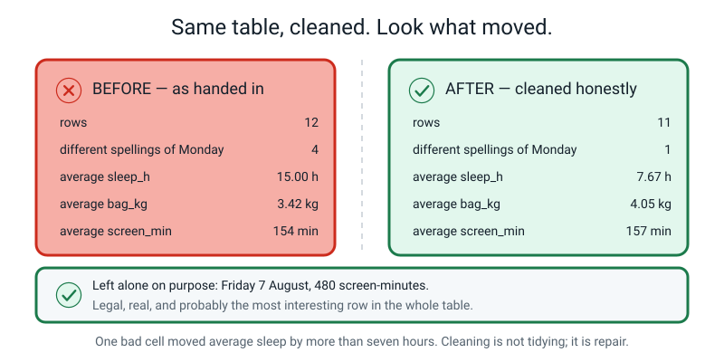
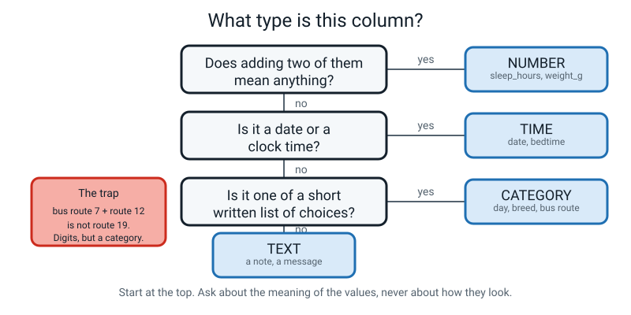
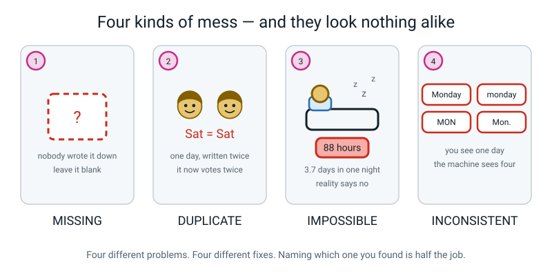
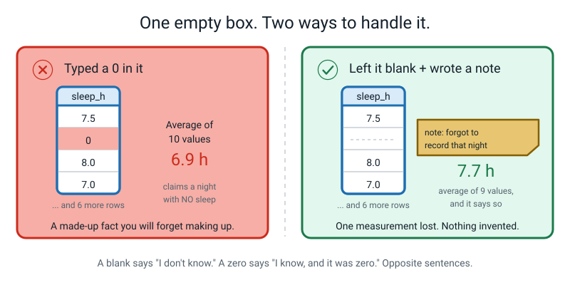
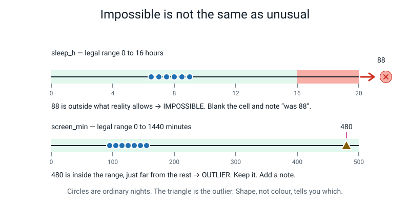
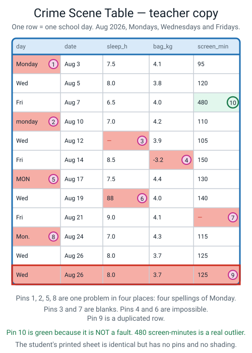
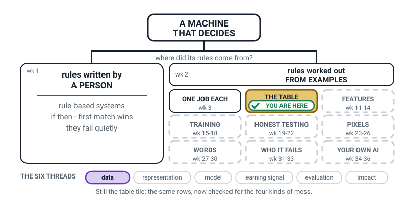
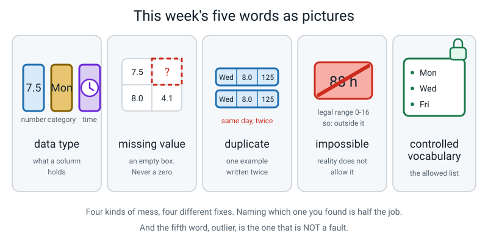

# Week 5 — Numbers, Names, and Broken Boxes

[⬅ Week 4](week-04.md) · [Course Home](../README.md) · [Week 6 ➡](week-06.md) · [Workbook](../workbook/week-05.md)

---

> ### This week in one sentence
> **Every column has a type, and the four kinds of mess — missing, duplicate, impossible and inconsistent — are all findable if you actually look.**
>
> **By the end of this chapter you will be able to:**
> - Decide a column's **data type** by asking whether averaging its values would mean anything
> - Find and name all four kinds of mess in a wrecked table
> - Explain the difference between an **impossible value** and an **outlier**, and say what you do with each
> - Write a **controlled vocabulary** that would have stopped a mess before it happened
>
> **Reading time:** about 22 minutes. **Homework:** about 45–60 minutes, including more data collection.

---

## 🪝 Start Here

Somebody hands you a table. Twelve school days, one row per day. Three things measured each day: hours of sleep, the weight of their school bag, and minutes of screen time.

You do the arithmetic. You add up the sleep column and divide by how many numbers there were. Here is the answer:

```
average sleep = 15.0 hours per night
```

**Fifteen hours. Every night. For twelve days.**

Before you decide whether you believe it, answer a smaller question first: **is fifteen hours even possible?**

Yes — for one night. A very ill person, or a teenager after an exhausting week, could sleep fifteen hours once. But as an *average across twelve school days*, fifteen hours means going to bed at 8 pm and getting up at 11 am, every single day, and still getting to school. Not credible.

So one of two things is true. Either this person has a very unusual life, or **there is something wrong with the table.**

And here is the genuinely alarming part.

**The arithmetic is correct.** Nobody made a mistake. Add up the sleep column, divide by the count, and the answer really is 15.0. The table produced a lie using perfect maths, and it did not warn anybody.

Now here is the second number from the same table:

```
average bag weight = 3.42 kg
```

Believable? Most people say yes — a school bag of three and a half kilograms sounds completely normal.

**That number is wrong too.** The real answer is 4.05 kg. And it is wrong in a way you cannot see at all, which makes it the scarier of the two.


*Figure 5.1 — The same twelve rows, before and after somebody looked properly. Sleep drops from 15.00 to 7.67. Bag weight rises from 3.42 to 4.05.*

There are **nine faults** planted in that table. There is also **one thing that looks exactly like a fault and absolutely is not** — and telling those two apart is the real skill this week.

By the end of this chapter you will be able to find all of it in about ninety seconds, and you will know the name of each problem.

---

## 🧠 The Big Idea

### 1. Columns have types, and the test is arithmetic

Last week every column was just a column. That was a useful lie. Actually columns behave differently, and the difference has a name.

> **Data type** — what kind of value lives in a column, which decides what you are allowed to do with it.

Four types matter this week:

| Type | Looks like | Average it? | Sort it? | Example |
|---|---|---|---|---|
| **Number** | `7.5`, `340`, `-2` | ✅ yes | ✅ yes | `sleep_hours` |
| **Category** | `beagle`, `main`, `6A` | ❌ no | ⚠️ only if there is a natural order | `pocket` |
| **Text** | `"was ill, stayed home"` | ❌ no | ⚠️ alphabetically, which rarely helps | `note` |
| **Time** | `2026-08-24`, `21:30` | ⚠️ carefully | ✅ yes | `bedtime` |

**And the test for which one you have is a single question:**

> **If I add two of these values together, does the answer mean anything?**


*Figure 5.2 — Start at the top. Ask about the **meaning** of the values, never about how they look.*

Try it out loud:

| The addition | Does the answer mean anything? | Verdict |
|---|---|---|
| 3 hours of sleep + 8 hours of sleep = 11 hours | Yes. Eleven hours is a real amount of sleep. | **Number** |
| bus route 7 + bus route 12 = route 19 | No. Route 19 is a different bus, or no bus at all. | **Category** |
| 200 g + 340 g = 540 g | Yes. | **Number** |
| class 6A + class 6B = ? | It does not even compute. | **Category** |
| student ID 1001 + ID 1002 = student 2003 | A different person, or nobody. | **Category** |

**The analogy: shirt numbers.** Your football team's shirt numbers are 4, 7 and 10. The average is 7. Is there a player who *is* 7? Yes, but only by coincidence — nothing about "7" makes it the middle of the team. Now make the shirts 4, 7 and 99. The average is 36.67 and there is no such player and there never could be. **The digits are a name, not an amount.**

**The concrete version, and this one is worth doing properly.** Three friends live at postcodes 560001, 110001 and 400001. Average them:

```
560001 + 110001 + 400001 = 1,070,003
1,070,003 ÷ 3 = 356,667.67
```

Postcode 356667 may not even exist, and if it does it is a place none of the three has ever visited. **The maths is perfect. The answer is garbage.** The column was a category wearing number clothes.

Student IDs, shirt numbers, phone numbers, house numbers, bus routes, postcodes, room numbers, table numbers in a canteen: **all categories.** A spreadsheet will happily average every single one of them and will never once warn you.

> **⚠️ Watch out:** there is an honest grey area, and you should know it. A mood rating of 1–5 is a category — but 5 really *is* happier than 4, so it has an order. You can sort it and find the middle value. Whether you can *average* it is genuinely argued about by scientists, because the gap from 1 to 2 might not feel the same size as the gap from 4 to 5. In practice everybody averages it and adds a footnote. **We do it, it is slightly fake, and knowing it is slightly fake is the professional part.**

### 2. There are four common kinds of mess


*Figure 5.3 — Four different problems. Four different fixes. Naming which one you found is half the job.*

This is the list you will use again and again. Each one gets its **name** and its **fix**, and they are not interchangeable.

| # | Kind of mess | What it looks like | The fix |
|---|---|---|---|
| 1 | **Missing value** | An empty box | Leave it blank, write a note saying why. **Never a 0.** |
| 2 | **Duplicate** | The same example twice | Check it really is the same, then delete one |
| 3 | **Impossible value** | 88 hours of sleep; a bag weighing −3.2 kg | Blank it, write `was 88, impossible, original lost`. **Never guess.** |
| 4 | **Inconsistent category** | `Monday`, `monday`, `MON`, `Mon.` | Standardise, then write a **controlled vocabulary** |

**Mess 1 — Missing value.**

> **Missing value** — an empty box where a measurement should be.

You forgot. You were asleep. The scale's battery was flat. It happens, and it is not a crime.

**Mess 2 — Duplicate.**

> **Duplicate** — the same example written down twice.

Why it matters: the duplicated row gets **double voting power**. Everything you compute from the table now leans towards that one example — and in a twelve-row table, "leans" is generous.

But **check before you delete.** Two rows can be identical and still be two genuinely different examples. Two different pencils that both weigh 6 grams and are both 18 cm long are not a duplicate — they are a coincidence. The way professionals tell them apart is to give every row a **unique ID number when it is collected.** Then real duplicates are obvious and coincidences are safe.

**Mess 3 — Impossible value.**

> **Impossible value** — a value outside what reality permits.

88 hours of sleep. A bag weighing −3.2 kg. A dog aged 45. A mood of 9 on a 1-to-5 scale.

How do you catch them? **You write down the legal range for every number column before you collect anything.**

```
sleep_h      0 to 16
bag_kg       0.1 to 12
screen_min   0 to 1440     (there are 1440 minutes in a day)
```

Then anything outside the range puts its own hand up.

**Mess 4 — Inconsistent category.**

`Monday`, `monday`, `MON`, `Mon.` To you, obviously one day. **To a machine, four unrelated categories** — as different from each other as `dog` and `Tuesday`.

This is, genuinely, one of the most common data errors there is.

> **Controlled vocabulary** — the written-down list of allowed values for a category column.

And notice what the fix is **not**. The fix is not "be more careful". Being more careful does not work; nobody is careful in week three at nine o'clock at night. The fix is to decide the allowed values *in advance*, write them where you can see them, and never type anything else:

```
ALLOWED VALUES for day:  Mon · Wed · Fri
Nothing else goes in this column. Ever.
```

### 3. A blank is not a zero, and this is the one that does the most damage

This gets its own section because it is the mistake with the biggest consequences per second of effort.


*Figure 5.4 — Same empty box. Two ways to handle it. Only one of them is honest.*

> **A blank says "I don't know."**
> **A zero says "I know, and it was zero."**

Those are **opposite sentences**, and no machine on Earth can tell them apart afterwards.

**The concrete version, with real numbers.** Here are nine nights of sleep and one night you forgot to record:

```
7.5   8.0   6.5   7.0   ????   8.5   7.5   9.0   7.0   8.0
```

The nine real numbers add up to 69.0, so the honest average is 69.0 ÷ 9 = **7.67 hours**, and you write beside it *"average of 9 values, 1 blank"*.

Now fill the gap with a 0. The ten values add up to 69.0 still, but now you divide by 10: 69.0 ÷ 10 = **6.90 hours**.

The average dropped by three quarters of an hour, and — this is the part that matters — **nothing on the page records that it happened.** Three weeks later that 0 looks exactly as measured, exactly as real, exactly as trustworthy as the 7.5 next to it. You will not remember.

**The analogy: the register.** A teacher marks the register. A child who is absent gets a mark that says *absent*. A child whose name the teacher forgot to check gets... what? If the teacher writes "absent" for both, one child has been wrongly recorded as away from school, and there is no way to ever find out which.

There is a second trap hiding in here, and adults fall for it constantly: **no data is not the same as no event.**

| Situation | What goes in the box |
|---|---|
| The shop was closed on Sunday, so it genuinely sold nothing | **0** — that is a real measurement of zero |
| You forgot to check what the shop sold on Sunday | **blank**, plus a note |

Both look like an absent number. Only a note written at the time tells them apart.

> **💡 Try this:** the reason we insist on a blank is not neatness. It is that a visible hole keeps you honest and an invented number does not. If you ever *do* fill a gap, the rule is: log it, and mark it as filled.

### 4. The trap: an outlier is not a fault

This is the most important part of the week, and it separates people who tidy tables from people who understand them.

Look at this screen-time column:

```
95   120   110   105   150   480
```

Is the 480 a fault?

Most people say yes, immediately and confidently, and cross it out within about ten seconds. **Don't.**

480 minutes is **eight hours.** Is eight hours of screen time *impossible*? There are 24 hours in a day. So — no. It is unusual. It is not impossible.

> **Outlier** — a value that is legal but sits far away from all the others.


*Figure 5.5 — Impossible sits **outside** the legal range. An outlier sits **inside** it, just far from the crowd. Completely different diagnoses.*

| | Impossible value | Outlier |
|---|---|---|
| Where it sits | **Outside** the legal range | **Inside** the legal range |
| Example | 88 hours of sleep (range is 0–16) | 480 screen-minutes (range is 0–1440) |
| Could it be real? | No. Reality forbids it. | **Yes.** Easily. |
| What you do | **Blank it** and note `was 88, impossible` | **Keep it** and note *why that day was different* |

**Name a reason a real day could hit 480.** Home sick in bed. A school holiday. Travelling all day. The day you watched a long film. A power cut at school and everyone sent home.

Once you can name one real cause, the urge to delete it dies — and it should, because **an outlier is very often the most informative row in the whole table.**

In the Crime Scene Table you worked on in class, look at what else is on the 480 row: it is also the night with the **lowest sleep in the entire table**, 6.5 hours. The one weird value and the one low value sit on the same line. That pair of facts is a lead worth checking (one row out of twelve is a coincidence to look into, not a finding) — and a student who crosses out the 480 has deleted the lead, made the table look *tidier*, and will never know.

**The professional move: investigate and annotate.** Add a note — `home sick, watched films all day` — and keep the value.

> **⚠️ Watch out — the honest hard part.** Sometimes you genuinely **cannot** tell an outlier from a mistake. If nobody wrote a note at the time, 480 might be a real sick day or a mis-typed 48, and there is no clever procedure that recovers the truth. That is exactly why notes get written *at the moment of collection*. It is the only defence against a question you cannot answer later.

### 5. One bad cell can destroy an average — and it does not have to look silly

Here is the whole week in numbers, from the twelve-row table in the hook.

**The sleep column.** Eleven non-blank values: 7.5, 8.0, 6.5, 7.0, 8.5, 7.5, **88**, 9.0, 7.0, 8.0, 8.0. They sum to 165.0, so 165.0 ÷ 11 = **15.00 hours**. Now delete the duplicated row (removing one 8.0) and blank the 88. Nine values left, summing to 69.0, so 69.0 ÷ 9 = **7.67 hours**. **A drop of 7.33 hours, caused overwhelmingly by one cell.**

**The bag column — and this is the one that should worry you.** Twelve values: 4.1, 3.8, 4.0, 4.2, 3.9, **−3.2**, 4.4, 4.0, 4.1, 4.3, 3.7, 3.7. They sum to 41.0, so 41.0 ÷ 12 = **3.42 kg**. Clean it — duplicate deleted, −3.2 blanked — and ten values sum to 40.5, so 40.5 ÷ 10 = **4.05 kg**.

The dirty answer, 3.42 kg, looked completely believable. Nothing about it raised a flag. It was still wrong by 0.63 kg — about **16%**.

> **A wrong number that looks reasonable is far more dangerous than one that looks silly.** The 15-hour sleep average shouted at us. The 3.42 kg bag average sat there quietly, and would have gone straight into a report.

**One last thing, and it surprises people.** Clean the screen-time column — delete the duplicate, but **keep the 480 outlier** — and the average goes from 154.09 minutes *up* to **157.0 minutes**. Cleaning is not the same as making numbers smaller, tidier or nicer. Cleaning means making the table say only what actually happened.

---

## 🔍 Worked Examples

### Worked Example 1 — Six dogs at an animal shelter (the one we did in class)

| id | name | age_years | weight_kg | breed |
|---|---|---|---|---|
| 1 | Bruno | 3 | 22 | labrador |
| 2 | Coco | 2 | 8 | Beagle |
| 3 | Bruno | 3 | 22 | labrador |
| 4 | Rex | 45 | 30 | german shepherd |
| 5 | Milo | 1 | | beagle |
| 6 | Zara | 4 | −5 | Labrador |

Six dogs. Six faults. Find them before you read on.

**The full diagnosis:**

| Found | Kind | Fix |
|---|---|---|
| Row 5's `weight_kg` is empty | **Missing** | Leave blank, note `never weighed`. Absolutely not 0 — a 0 kg dog would wreck the average. |
| Row 4: Rex is 45 | **Impossible** | The oldest dog ever recorded lived to 29. Blank it, note `was 45, impossible`. Do **not** guess 4 or 5. |
| Row 6: Zara weighs −5 kg | **Impossible** | Negative mass does not exist. Blank it, note `was -5, impossible`. |
| Row 3 is identical to row 1 | **Duplicate** | Delete row 3. Bruno was counted twice. |
| `Beagle` (row 2) vs `beagle` (row 5) | **Inconsistent** | Standardise to `beagle`. |
| `labrador` (rows 1, 3) vs `Labrador` (row 6) | **Inconsistent** | Standardise to `labrador`. |

**Now the arithmetic — average weight, before and after.**

**Before** (every number as written, skipping the blank):

```
22 + 8 + 22 + 30 + (−5) = 77
77 ÷ 5 numbers = 15.4 kg
```

**After** (duplicate deleted, both impossibles blanked):

```
22 + 8 + 30 = 60
60 ÷ 3 numbers = 20.0 kg
```

**The average moved 4.6 kg — about 30%.**

Which single fault did the most damage? Take out only the −5 and leave everything else dirty: (22 + 8 + 22 + 30) ÷ 4 = 20.5 kg. So yes — **the negative number did nearly all of it.**

**And now the part almost nobody notices.** How many different breeds does a computer see in the dirty table?

`labrador`, `Beagle`, `beagle`, `german shepherd`, `Labrador` = **five.**

After cleaning: `labrador`, `beagle`, `german_shepherd` = **three.**

With five groups of one or two dogs each, there is nothing to learn from the breed column — every group is too small to say anything about. With three groups there is more to work with (still small, but a start).

> **💡 Try this:** read that last bit again. Cleaning did not tidy the breed column. **Cleaning created the information.** That is a genuinely different claim and it is the best thing in this example.

> **🧑‍🏫 If a student says the duplicate might be two different dogs both called Bruno:** that is an excellent objection. Two Bruno labradors, both aged 3, both 22 kg, is *possible*. We call it a duplicate because **everything** matches exactly, which is far more likely to be a copy-paste than a coincidence. And the reason we cannot be certain is that the `id` here is only a row number, not a real identifier (like a microchip number) that was recorded for each dog at collection time. That uncertainty is real and permanent.

### Worked Example 2 — A school canteen order log (food)

One row = one order. Eight orders across three days.

| day | time | item | price_rupees | table_no |
|---|---|---|---|---|
| Mon | 12:30 | samosa | 20 | 4 |
| mon | 12:35 | Samosa | 20 | 7 |
| Tue | 12:40 | dosa | 60 | 4 |
| Tue | 12:45 | dosa | −60 | 2 |
| Wed | 12:20 | samosa | | 9 |
| Wed | 12:25 | SAMOSA | 20 | 4 |
| Wed | 12:50 | dosa | 60 | 4 |
| Wed | 12:50 | dosa | 60 | 4 |

**Step 1 — type every column first.** This is the step people skip.

| Column | Type | Why |
|---|---|---|
| `day` | Category | Mon + Tue is not a day |
| `time` | Time | Sortable; you can find "the earliest order" |
| `item` | Category | samosa + dosa is not a food |
| `price_rupees` | **Number** | 20 + 60 = 80 rupees, which is a real amount of money |
| `table_no` | **Category** | Table 4 + table 7 is not table 11 |

**Do the trap on purpose.** Average the `table_no` column:

```
4 + 7 + 4 + 2 + 9 + 4 + 4 + 4 = 38
38 ÷ 8 = 4.75
```

"The average table is 4.75." There is no table 4.75. There never will be. The spreadsheet gave you a confident, precise, meaningless answer and did not blink.

**Step 2 — legal ranges, written before you judge anything.**

```
price_rupees   1 to 500
time           11:00 to 15:00
```

**Step 3 — find all four kinds of mess.**

| Where | Kind | What is wrong | Fix |
|---|---|---|---|
| Row 5, `price_rupees` | **Missing** | Empty box | Leave blank, note `till receipt lost`. Not 0. |
| Row 4, `price_rupees` | **Impossible** | −60 rupees | Blank it, note `was -60, impossible` |
| Rows 7 and 8 | **Duplicate** | Identical in every column, same minute (probably one order entered twice; check first) | Delete one |
| `day` column | **Inconsistent** | `Mon` and `mon` | Standardise to `Mon` |
| `item` column | **Inconsistent** | `samosa`, `Samosa`, `SAMOSA` | Standardise to `samosa` |

**Step 4 — the arithmetic.**

**Average price before** (seven non-blank values): 20 + 20 + 60 + (−60) + 20 + 60 + 60 = **180**.

```
180 ÷ 7 = 25.71 rupees
```

**Average price after** — duplicate row deleted (removes one 60), the −60 blanked, the missing one still blank. Five values: 20, 20, 60, 20, 60 = **180**.

```
180 ÷ 5 = 36.00 rupees
```

Same sum, different count, and the answer moves by more than ten rupees. That is the whole lesson: **the count matters as much as the total, and blanks change the count.**

**Step 5 — the distinct-value count, which is the silent damage.**

| Column | Different values a computer sees, before | After |
|---|---|---|
| `day` | 4 (`Mon`, `mon`, `Tue`, `Wed`) | 3 |
| `item` | 4 (`samosa`, `Samosa`, `dosa`, `SAMOSA`) | 2 |

Before cleaning, the canteen manager asks "which is more popular, samosas or dosas?" A program that treats every spelling as different counts `dosa` four times and `samosa` only twice, so it says dosas win. After cleaning, samosas have 4 orders and dosas have 3. **The spelling mess did not just blur the answer; it flipped it.**

**Step 6 — write the controlled vocabulary that would have prevented it.**

```
ALLOWED VALUES for day:   Mon · Tue · Wed · Thu · Fri
ALLOWED VALUES for item:  samosa · dosa · idli · rice_plate · juice
Nothing else may be typed in these columns.
```

### Worked Example 3 — Sports day long jump (sport)

One row = one jump. Legal ranges written first, before anything is judged:

```
jump_cm     50 to 900       (the world record is about 895 cm)
age_years    5 to 19
```

| athlete | jump_cm | age_years |
|---|---|---|
| A1 | 285 | 11 |
| A2 | 310 | 11 |
| A3 | 298 | 11 |
| A4 | 0 | 11 |
| A5 | 421 | 11 |
| A6 | −12 | 11 |
| A7 | 302 | 210 |
| A8 | 291 | 11 |

**Step 1 — the easy ones.**

- **A6, jump −12.** Impossible. You cannot jump backwards through the ground. Blank it, note `was -12, impossible`.
- **A7, age 210.** Impossible — outside the 5-to-19 range. Blank the **age only**; the jump of 302 is fine and stays.

**Step 2 — A5's 421 cm. Fault or not?**

Check the range: 50 to 900. Is 421 inside it? **Yes.** So it is legal. Everyone else is between 285 and 310, so 421 is far from the crowd.

**It is an outlier. Keep it and annotate it.** Note: `A5 is the county champion — check, then keep`.

**Step 3 — A4's 0. This is the interesting one.**

Is 0 inside the legal range 50 to 900? **No.** So by our own rule it is impossible, and we blank it.

But wait — *is* it impossible? In long jump, if you step over the take-off line you get a **foul**, and a foul really does score zero. That 0 might be a completely correct record of a real event.

So which is it: an impossible value, or a real zero?

**You cannot tell from the table.** And the honest answer is that **the legal range was wrong**, not the value. `50 to 900` describes *jumps*, and a foul is not a jump. The professional fix is to add a column:

| athlete | result | jump_cm | note |
|---|---|---|---|
| A4 | foul | | stepped over the line — no distance to record |

Now the table can say what actually happened. `result = foul` is the real information; `jump_cm` is honestly blank, because no distance was ever measured.

> **⚠️ Watch out:** this is the "no data is not the same as no event" trap from §3, wearing a tracksuit. A shop that sold nothing scores 0. A shop you forgot to check is blank. A foul jump is a `foul`, not a 0 cm jump — and certainly not a blank with no explanation.

**Step 4 — the arithmetic.**

**Average jump before**, taking every number exactly as written (all eight):

```
285 + 310 + 298 + 0 + 421 + (−12) + 302 + 291 = 1895
1895 ÷ 8 = 236.88 cm
```

**Average jump after** cleaning — the −12 blanked, A4's 0 moved out into the `result` column, the 421 **kept**:

```
285 + 310 + 298 + 421 + 302 + 291 = 1907
1907 ÷ 6 = 317.83 cm
```

**The average jumped up by 80.95 cm.** Two faults — one negative and one wrongly-recorded zero — were dragging the whole day's result down by more than 80 cm.

**Step 5 — prove the outlier was worth keeping.** What if we had crossed out the 421 too?

```
285 + 310 + 298 + 302 + 291 = 1486
1486 ÷ 5 = 297.20 cm
```

So keeping the outlier lifts the average from 297.20 to 317.83 — about 20.6 cm. **That is not the outlier "spoiling" the number. That is the outlier being a real jump that really happened**, made by a real athlete who really is much better than everybody else. Delete her and you have not cleaned the table; you have quietly removed the best result of the day.

---

## 🎲 What We Did In Class

### Crime Scene Table

You were handed a printed twelve-row table with nine planted faults and one trap, plus **four coloured pens**, one per fault type.


*Figure 5.6 — The marked-up version. Your sheet had no pins and no shading; the pins are what you were hunting.*

### The colour legend

| Colour | Fault type |
|---|---|
| Colour 1 (e.g. blue) | MISSING — an empty box |
| Colour 2 (e.g. red) | IMPOSSIBLE — reality says no |
| Colour 3 (e.g. green) | DUPLICATE — same example twice |
| Colour 4 (e.g. orange) | INCONSISTENT — same thing, different spellings |

> **💡 Try this at home with one pen:** circle every fault and write the fault's initial letter beside it — M, D, I, C. Works perfectly.

### The table

One row = one school day. Twelve rows: Mondays, Wednesdays and Fridays through August 2026.

| day | date | sleep_h | bag_kg | screen_min |
|---|---|---|---|---|
| Monday | Aug 3 | 7.5 | 4.1 | 95 |
| Wed | Aug 5 | 8.0 | 3.8 | 120 |
| Fri | Aug 7 | 6.5 | 4.0 | 480 |
| monday | Aug 10 | 7.0 | 4.2 | 110 |
| Wed | Aug 12 | | 3.9 | 105 |
| Fri | Aug 14 | 8.5 | −3.2 | 150 |
| MON | Aug 17 | 7.5 | 4.4 | 130 |
| Wed | Aug 19 | 88 | 4.0 | 140 |
| Fri | Aug 21 | 9.0 | 4.1 | |
| Mon. | Aug 24 | 7.0 | 4.3 | 115 |
| Wed | Aug 26 | 8.0 | 3.7 | 125 |
| Wed | Aug 26 | 8.0 | 3.7 | 125 |

### The legal ranges, written on the board before we started

```
sleep_h     0 to 16
bag_kg      0.1 to 12
screen_min  0 to 1440
```

You cannot spot an impossible value if you never said what was possible. That is why this step comes first.

### The rules

1. **One colour per fault type.** No mixing.
2. **Circle the fault, then write two things in the margin: what kind it is, and what you would do.** A circle with no words scores nothing.
3. **You may not change any number on the sheet.** You *propose* fixes; you do not apply them. Real data cleaning logs the change — it never silently overwrites, because then nobody can check you.
4. **Say out loud before you cross anything out.** Especially anything that surprises you.

### All nine faults

| Pin | Row | Column | Kind | What is wrong | Fix |
|---|---|---|---|---|---|
| **1** | Aug 3 | `day` | Inconsistent | `Monday` | Standardise to `Mon` |
| **2** | Aug 10 | `day` | Inconsistent | `monday` | Standardise to `Mon` |
| **3** | Aug 12 | `sleep_h` | Missing | Empty box | Leave blank, note `forgot to record`. **Not 0.** |
| **4** | Aug 14 | `bag_kg` | Impossible | −3.2 kg | Blank it, note `was -3.2, impossible` |
| **5** | Aug 17 | `day` | Inconsistent | `MON` | Standardise to `Mon` |
| **6** | Aug 19 | `sleep_h` | Impossible | 88 h = 3.7 days | Blank it, note `was 88, impossible, original lost` |
| **7** | Aug 21 | `screen_min` | Missing | Empty box | Leave blank, note. **Not 0.** |
| **8** | Aug 24 | `day` | Inconsistent | `Mon.` | Standardise to `Mon` |
| **9** | Aug 26 (second) | whole row | Duplicate | Identical to the row above, same date | Delete one — there was only one 26 August |

### And the trap

**Aug 7, `screen_min` = 480. Not a fault.** It is inside the legal range 0–1440, so it is legal. It is an **outlier**: eight hours, far from the 95–150 cluster. Keep it and write a note asking why that day was different.

And look across that row: **6.5 hours of sleep, the lowest in the whole table.** The one weird value and the one low value are on the same line.

### The arithmetic we worked out together

| | Before cleaning | After cleaning |
|---|---|---|
| Rows | 12 | 11 |
| Average `sleep_h` | 165.0 ÷ 11 = **15.00** | 69.0 ÷ 9 = **7.67** |
| Average `bag_kg` | 41.0 ÷ 12 = **3.42** | 40.5 ÷ 10 = **4.05** |
| Average `screen_min` | 1695 ÷ 11 = **154.09** | 1570 ÷ 10 = **157.0** |
| Different `day` values | **6** | **3** |

### The last job — the controlled vocabulary

```
ALLOWED VALUES for day:  Mon · Wed · Fri
Nothing else may be typed in this column.
```

That is a controlled vocabulary. Notice what it is **not**: "be consistent" is not a list. "Use short forms" is not a list. It has to be an explicit, short, closed list, with a plain statement that nothing else is allowed.

> **🧑‍🏫 If you cannot decide between `Mon` and `Monday`:** it genuinely does not matter. What matters is that one is chosen and written down. Pick one and commit. Realising that the *choice* is arbitrary but *making* the choice is not — that is worth a lot.

### How many faults are there really — nine or six?

Both answers are defensible. **Nine broken cells** to fix (more precisely: eight broken cells plus one duplicated row). **Four kinds** of problem. **Six distinct incidents**, if you count the four Monday spellings as one inconsistency in four places.

The best answer says all of that, and notices that **the count depends on whether you are counting corrections to make or rules to write.** Nine corrections. Four rules.

---

## 💬 Talk About It

**1. "Was the 88 a typo for 8.8 or for 8?"**
*Hint for you:* **nobody knows, and nobody ever will.** That is not being coy — the information is genuinely gone. `8.8` is a slipped decimal point; `8` is a doubled keypress. Both plausible, no method recovers it. Ask them what that means for the fix (blank it, note `original lost`), and then the good question: *what could the person who typed it have done, in the four seconds when they still knew?*

**2. "Isn't deleting the duplicate row also losing data?"**
*Hint for you:* yes, if it was a real coincidence rather than a copy-paste. That is exactly why the rule is *check before you delete*. Here the whole row matches, including the date, and there was only one 26th of August. Then push to the permanent fix: give every row a unique ID at collection time, so a duplicate is obvious and a coincidence is safe.

**3. "How does a huge company clean billions of rows? They can't use coloured pens."**
*Hint for you:* they write programs that do these exact four checks automatically — count the blanks, count the distinct values per category column, flag anything outside a legal range, look for identical rows. Millions of times a second. Then the interesting part: **the judgements do not automate.** A program can flag 480 as unusual. Only a person can decide whether it is a sick day or a typo. That is still true at every company on Earth.

---

## ⚠️ Don't Get Tricked

### Trick 1 — "Anything weird is an error"


*Figure 5.7 — Look at where each value sits relative to the fence. That is the whole test.*

| ❌ Wrong | ✅ Right |
|---|---|
| "480 is miles off the others, so cross it out." | "480 is **inside** the legal range 0–1440, so it is legal. It is an outlier. Keep it and write a note." |

The question that unpicks it: *is this value outside what is **physically possible**, or just outside what is **usual**?* Those are two different questions with two different answers.

### Trick 2 — "A blank should be filled with a 0"


*Figure 5.8 — Same missing box, two outcomes: one loses a measurement, the other invents a fact.*

| ❌ Wrong | ✅ Right |
|---|---|
| "An empty box looks unfinished, so I put 0 in it." | "A blank plus a note. A blank says *I don't know*. A 0 says *I know, and it was zero*." |

Say the sentence out loud each time: *"Did this person sleep zero hours, or did I not write it down?"* The absurdity does the work.

### Trick 3 — "The computer will realise Monday and monday are the same"

| ❌ Wrong | ✅ Right |
|---|---|
| "Computers are clever now; it'll figure that out." | "It will not. A program counting distinct values reports **6** where I see 3. (Some spreadsheet tools ignore capital letters, but none will match `Mon.` or `Monday` with `Mon`.)" |

Not by being clever, not by being modern. To a machine, `Monday` and `monday` are as related as `dog` and `Thursday`. The only fix is a controlled vocabulary written before you collect anything.

### Trick 4 — "The biggest wrong number is the most dangerous one"

| ❌ Wrong | ✅ Right |
|---|---|
| "The 88 is the worst fault, because it's the biggest." | "The 88 shouted at us and got caught. The **four Mondays** were silent, and quietly split one day into four categories that each happened once." |

**Size is not danger. Danger lives in silence.** The 15-hour average was so absurd that somebody had to look. The 3.42 kg bag average looked completely fine and would have gone straight into a report. Ask yourself, always: *which fault is hardest to notice?*

---

## 🌍 Where You've Seen This

1. **Your contacts list.** Three entries for the same person: "Mum", "Mum mobile", "Amma". You know they are one person. Your phone does not, which is why it shows you three birthdays and three chat threads. That is an inconsistent category, in your pocket.
2. **A dropdown menu on a website.** Country, month, size, quantity. Nobody made those dropdowns to look nice — they are **controlled vocabularies**, enforced so you *physically cannot* type `Inida`.
3. **Weather apps disagreeing.** Two apps, same city, two different temperatures. Often one is reading a sensor at an airport and one is reading a city-centre sensor. Both correct, both measured differently — Week 4's Rule 2, out in the wild.
4. **A form that refuses your date of birth.** You typed a year that would make you 130. That is a legal range check, written by somebody who thought about impossible values before you arrived.
5. **A shop's "average review 4.7 stars".** From how many reviews? A 4.7 from 3 people and a 4.7 from 3,000 people look identical on the screen and mean completely different things — because the count matters as much as the total.
6. **A sports record that stood for decades.** Almost every one of those is an outlier: legal, real, and miles from the crowd. Anybody "cleaning" that dataset by deleting far-out values would erase the entire history of the sport.

---

## 🧭 Where This Fits

Nothing moved on the map this week, and that is on purpose. THE TABLE tile is lit for **three weeks
running**, because there is that much worth knowing about it. Week 4 read a table across, left to
right. This week you went down it, column by column, looking for trouble.



*Figure 5.0 — The map after Week 5. Every box is exactly where it was last week. Same tile, second
week — what changed is the thread strip at the bottom and the line underneath it.*

| | |
|---|---|
| **The mental model you now own** | Every column has a **type**, and the test is arithmetic: if adding two values means nothing, it is a **category**. And mess comes in four common **kinds** — missing, duplicate, impossible, inconsistent — each with its own fix. |
| **The one question it answers** | *"Is this column a number or a name, and which of the four kinds of mess is hiding in it?"* |
| **What it plugs into** | Week 4's table. The same table — now inspected column by column instead of read left to right. |
| **What carries forward** | **Blank-plus-a-note** is the habit that keeps your Week 6 data card honest, and **category-in-disguise** is the very same trap waiting for you again in Week 13. |
| **Spiral thread** | 📊 **Data**, on its own this week — one thread, because the whole lesson was about the stuff going in and nothing else. |

> **💡 Try this:** do not redraw your map this week. Instead, look at the one you already have and say
> out loud what changed. "Same tile, week two of three, and this time it was about the four kinds of
> mess." Being able to say that is exactly what the map is for.

---

## 🔑 Remember This

- **Every column has a type, and the test is arithmetic.** If adding two values does not mean anything, it is a **category**, no matter how many digits it is made of.
- **Bus routes, postcodes, IDs, shirt numbers and table numbers are categories.** A spreadsheet will average them anyway and will never warn you.
- **Four kinds of mess, four different fixes.** Missing: blank plus a note. Duplicate: check, then delete one. Impossible: blank plus a note, never guess. Inconsistent: write the allowed list.
- **Never fill a blank with 0.** A blank says *I don't know*; a zero says *I know, and it was zero*.
- **Weird is not the same as wrong.** Impossible sits outside the legal range and gets removed. An **outlier** sits inside it and gets **kept and annotated**.
- **Write the legal ranges down before you collect anything.** You cannot spot the impossible if you never said what was possible.
- **A wrong number that looks reasonable is more dangerous than one that looks silly.** Danger lives in silence, not size.

---

## 📓 New Words


*Figure 5.9 — This week's five words, drawn.*

| Word | What it means | Example |
|---|---|---|
| **data type** | What kind of value a column holds, which decides what you may do with it | `sleep_h` is a **number**; `table_no` is a **category** |
| **missing value** | An empty box where a measurement should be | The blank `sleep_h` on Aug 12 |
| **duplicate** | The same example written down twice | The second `Wed, Aug 26` row |
| **impossible value** | A value reality does not allow | `88` hours of sleep; a bag of `−3.2` kg |
| **controlled vocabulary** | The written list of allowed answers for a category column | `ALLOWED VALUES for day: Mon · Wed · Fri` |

And the one that is **not** a fault: an **outlier** is a value that is legal but sits far away from all the others — like 480 screen-minutes in a week of 95s and 150s. It gets its own glossary card next week.

---

## 📤 Your Homework

Go to **[the Week 5 workbook](../workbook/week-05.md)**. About **45–60 minutes** across the week, including more data collection.

| Page | What to do | Time |
|---|---|---|
| **5.1** | Warm-up on Week 4, plus Practice Set A — typing ten columns, and naming the fault at five pins on a table you have not seen before | 15 min |
| **5.2** | Practice Set B, the pizza-order puzzle, and Think Deeper | 15 min |
| **5.3** | **Build It: run all four checks on your own table**, and log every fault you find | 20 min |
| **5.4** | Draw It, plus the question I will read first — which fault would have been the most **dangerous** if a machine had trained on it | 10 min |

Three jobs, spelled out:

1. **Keep collecting.** You should be at 14 rows by now. Get to **21** by next week. In Week 6 we finish at 30 and turn it into a real dataset.
2. **Run all four checks** — the same four you did in class. Blanks. Duplicates. Impossible values. Inconsistent spellings. Do them as **four separate passes**, one check at a time, one column at a time. It is faster and it finds more.
   **Before you start, write your legal ranges at the top** — the smallest and biggest each number column is allowed to be.
   Every fault goes in the fault log with four things: which row, which column, what kind of fault, and what you did about it. **Every single change gets logged.** If you change a value and do not log it, you have destroyed your own record of what happened — and you will not remember in three weeks. I promise you that.
3. **Answer the "most dangerous" question** in two or three sentences. There is more than one good answer. I want the reasoning, not the answer.

> **⚠️ Watch out:** **you might find zero faults.** If so, do not invent one. Write "no faults found" and then write down which four checks you ran, so it is clear you actually looked. Finding nothing after four real checks is a completely respectable result — and a much better one than a fake fault.

---

[⬅ Week 4](week-04.md) · [Course Home](../README.md) · [Week 6 ➡](week-06.md) · [📓 Workbook — Week 5](../workbook/week-05.md) · [Glossary](../../glossary.md)
