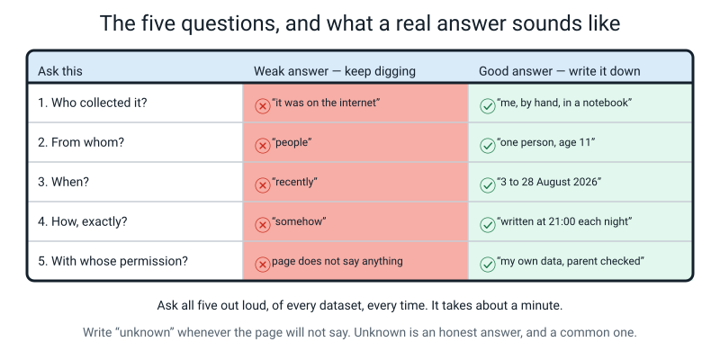
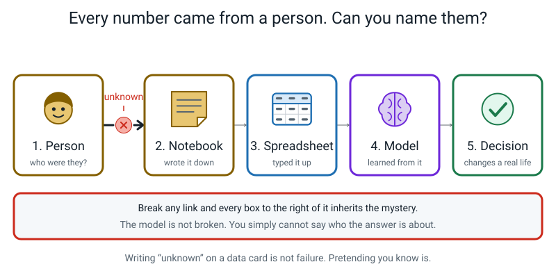
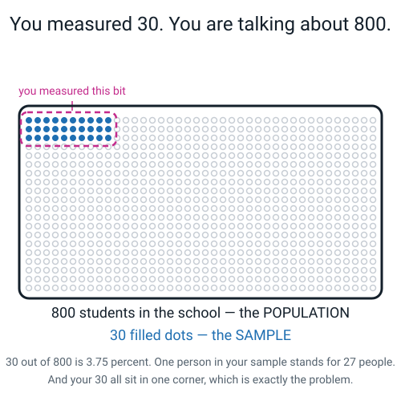
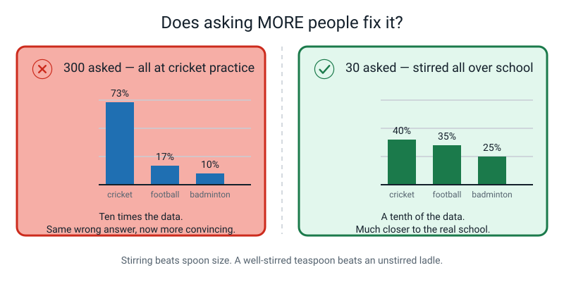
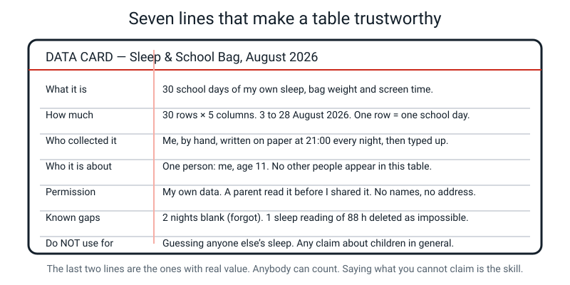
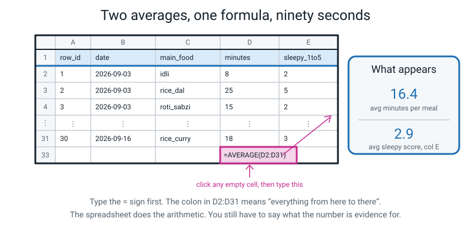
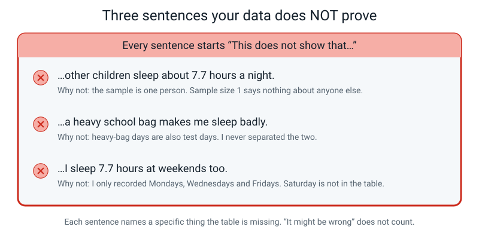
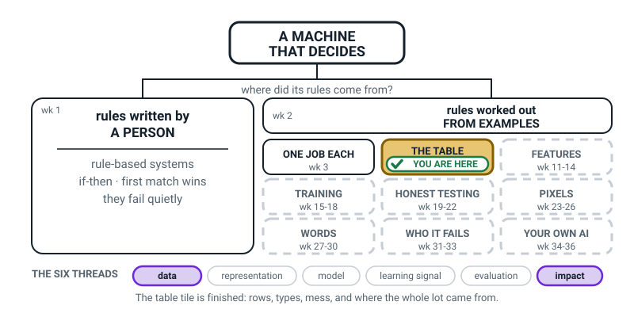
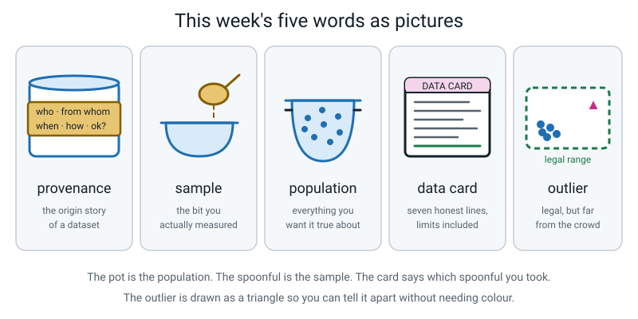

# Week 6 — Where Did This Data Come From?

[⬅ Week 5](week-05.md) · [Course Home](../README.md) · [Week 7 ➡](week-07.md) · [Workbook](../workbook/week-06.md)

---

> ### This week in one sentence
> **Thirty rows about you are a sample, not the world — and a data card is how you stay honest about that.**
>
> **By the end of this chapter you will be able to:**
> - Tell the **population** you care about from the **sample** you actually measured
> - Ask the five **provenance** questions of any dataset put in front of you, and write "unknown" without embarrassment
> - Write a seven-line **data card** covering what the data is, who collected it, when, with what permission, and what is missing
> - State three specific things your own dataset does **not** prove
>
> **Reading time:** about 22 minutes. **Homework:** about 45–60 minutes.

---

## 🪝 Start Here

Two research teams both wanted to know the same thing: **how many hours do teenagers sleep?**

Both did it properly. A thousand rows each. One row per teenager. Nobody made anything up, nobody typed 88 by mistake. Both tables have been through all four of last week's checks — no blanks, no duplicates, no impossible values, no four spellings of Monday. **Both tables are clean.**

Here are their answers:

```
Dataset A:  average sleep = 5.9 hours
Dataset B:  average sleep = 7.8 hours
```

That is a gap of nearly **two hours a night**. If you were writing a newspaper headline, one of these says *"teenagers are exhausted, this is a crisis"* and the other says *"teenagers are basically fine"*.

**Which team made the mistake?**

Think about it before you read on. Really — decide.

...

**Neither.** You cannot tell from the numbers, and that is the point. Here is what was missing:

```
Dataset A:  5.9 hours  ←  1,000 visitors to a SLEEP-PROBLEMS CLINIC
Dataset B:  7.8 hours  ←  every student in 4 RANDOMLY CHOSEN SCHOOLS
```

Nobody made a mistake. Every single row in both tables is correct.

But look at who is *in* Dataset A. To get into that table you had to **walk into a sleep clinic** — and you only walk into a sleep clinic if you already have a sleep problem. That is the ticket to get in.

So Dataset A honestly answers a completely different question: *how much do teenagers **with sleep problems** sleep?* Five point nine hours. Probably true. Completely useless for the question that was asked.

And here is the part you should feel slightly annoyed about.

**Nothing in the numbers told us that.** You could stare at those thousand rows all week. You could check every cell, average every column, draw every graph. Last week's four checks find nothing, because there is nothing to find. **The problem is not in the table. The problem is in one sentence *about* the table** — a sentence somebody nearly forgot to write down.

That sentence has a name: **provenance**. This week you learn to ask for it, and to write it for your own data.

---

## 🧠 The Big Idea

### 1. Provenance: every dataset has an origin story

> **Provenance** — the origin story of a dataset: who collected it, from whom, when, how, and with whose permission.

The word comes from the art world. When a museum buys a painting it demands the provenance: who painted it, who has owned it, where it has been. Not because knowing that changes the paint — but because **a painting with no history is probably stolen or fake.**

**The analogy: the unlabelled tin.** You would not eat from a tin with no label. You want to know what is in it, who made it, when, and whether it has expired. A dataset with no provenance is exactly that tin — and people feed them to models every single day.


*Figure 6.1 — The five questions, and what a real answer sounds like. If you memorise one thing this week, memorise this.*

**The five questions.** They take about a minute to ask and they are the most useful minute in data work.

| # | Question | Weak answer | Good answer |
|---|---|---|---|
| 1 | **Who collected it?** | "It was on the internet" | "Me, by hand, in a notebook" |
| 2 | **From whom?** | "People" | "One person, age 11" |
| 3 | **When?** | "Recently" | "3 to 28 August 2026" |
| 4 | **How, exactly?** | "Somehow" | "Written down at 21:00 each night" |
| 5 | **With whose permission?** | *(silence)* | "My own data, a parent checked it" |

**Which question would have caught the sleep-clinic problem?** Question 2, *from whom* — because the answer "visitors to a sleep-problems clinic" gives the whole game away instantly. Question 4 is a defensible second answer, since a proper description of the method would have mentioned recruiting at a clinic. Questions 1, 3 and 5 would not have caught it at all: an honest, recent, fully consented study can still measure the wrong people.

**And the sixth rule that goes with the five questions:** if you cannot find the answer, **you write the word "unknown".** Not a guess. Not "probably scientists". The word *unknown*.

> **💡 Try this:** writing "unknown" is not failing. It is a **finding**, and it is a finding about the *source*, not about you. When a web page will not tell you who collected its numbers, **the page failed the test, not you.**

**On question 5 — permission — three rules, because it involves other people.**

1. **Ask first, every time.** *"Can I write down your bedtime for a school project?"*
2. **Use initials or codes, never full names.** `S3`, not `Sanjay Rao`.
3. **Never record home addresses, phone numbers, or photographs of faces** without a parent's explicit yes.


*Figure 6.2 — Break any link and every box to the right of it inherits the mystery.*

That chain is worth staring at. Data starts as a **person** who did something. Somebody **wrote it down**. Somebody **typed it up**. A **model learned** from it. Then a **decision** got made about somebody's real life — a loan, a school place, a medical scan.

If the first link is unknown, the model is not broken. It works perfectly. **You simply cannot say who its answers are about.** That is a different and much worse problem, because it looks like nothing is wrong.

### 2. Sample and population: your thirty rows are not the world

> **Population** — every single thing you would like your answer to be true about.
>
> **Sample** — the smaller set you actually managed to measure.

**The analogy: tasting the soup.** You are cooking a big pot and you want to know if the whole pot needs salt. You do not drink the pot. You **stir** it, take one spoonful, taste, and decide.

That works — and it works for one specific reason: *you stirred*. Skim your spoonful off the top without stirring and you get the oily layer floating on it, and you tell everyone the soup is greasy. You are **wrong about the pot even though you were completely right about your spoonful.**

So here is the sentence to remember all year:

> **Stirring matters more than spoon size. A well-stirred teaspoon beats an unstirred ladle. Every time.**


*Figure 6.3 — You measured 30. You are talking about 800. Every claim you make has to survive that gap.*

**The concrete version, with real numbers.** You want to know the favourite sport at your school. The population is all **800** students. You ask **30** of them:

| Sport | Votes | Percent |
|---|---|---|
| Cricket | 22 | 73% |
| Football | 5 | 17% |
| Badminton | 3 | 10% |

Confident conclusion: **cricket wins by a mile, 73%.**

Now the provenance. **You asked those 30 people at cricket practice.**

The true school-wide answer might be cricket 40%, football 35%, badminton 25%. Your survey is not just wrong — it is **confidently** wrong.

And here is the cruel bit. **Run last week's four checks on your thirty rows.** Any blanks? No. Any duplicates? No. Anything impossible? No — every answer is a real sport. Any inconsistent spellings? No, you used a controlled vocabulary like a good student.

**Your table passes every single check from last week and it is still lying.**

That is why this week exists. **Clean is not the same as trustworthy.**

**Three ways a sample goes wrong:**

| Problem | What happens | Example |
|---|---|---|
| **Wrong place** | You only reach one kind of person | Surveying at cricket practice |
| **Self-selection** | Only people who care bother to answer | An online poll about school food — only the furious vote |
| **Too small** | Luck dominates | Asking 3 people and reporting a percentage |

**The one-line fix you can always apply.** You usually cannot make your sample perfect. You are eleven; you are not going to survey 800 students, and you should not pretend otherwise.

But you can **always** write down who is in your sample and who is missing:

> *"This is 30 students from cricket practice; it under-represents students who do not play sport."*

The moment you write that, you have not fixed your data — you have turned a lie into an **honest limited finding**. Those two words are the goal of the entire week. Not a perfect finding. An **honest limited** one.

**And why this matters for AI specifically:** a model learns whatever its sample contains, and then gets used on the whole population. A face-unlock model trained mostly on adult faces is worse at children's faces — not because anyone was cruel, but because children were a thin layer of the sample. In Week 31 you will measure exactly that gap, on your own model, with your own numbers.

### 3. More data does not fix a badly chosen sample

This is the misconception adults hold as firmly as children, so it gets its own section.


*Figure 6.4 — Ten times the data on the left. A tenth of the data on the right. The right one is closer to the truth.*

**If you ask 300 people at cricket practice instead of 30, does cricket stop winning?**

**No.** All 300 are still cricket people.

Increasing the size of a badly chosen sample does not move the answer towards the truth. It narrows the **luck** while leaving the **lean** exactly where it was. Which is worse than a small wrong answer, because now the wrong answer looks scientific.

> **⚠️ Watch out:** the test question, whenever somebody says "we just need more data": *is an unstirred ladle better than an unstirred teaspoon?*

### 4. The data card: seven lines, and the last two are the ones that count

> **Data card** — a short honest note describing a dataset and its limits.

Seven lines. That is all.

| Line | What goes on it |
|---|---|
| 1. What it is | One sentence a stranger could understand — including **what one row is** |
| 2. How much | Rows × columns, and the real dates covered |
| 3. Who collected it | A person, **and how they did it** |
| 4. Who it is about | Which people or things. If people, how many and who |
| 5. Permission | Whose data, who agreed, what was left out on purpose |
| 6. **Known gaps** | Blanks, deletions, faults found — **straight from last week's fault log** |
| 7. **Do NOT use for** | The claims this data cannot support |


*Figure 6.5 — Anybody can count rows. Saying what you cannot claim is the skill.*

The first five lines are bookkeeping. Anybody can do them. **Lines 6 and 7 are the professional part**, and together they are worth more than the first five put together.

**Notice something about line 6.** It is just last week's fault log, written in plain English: two nights blank, one 88-hour sleep reading deleted as impossible, one 480-minute day kept because it was a sick day. **The clean-up work from Week 5 becomes line 6 of the card.** That is why last week's homework mattered.

**And notice something about line 7.** "Do not use for anything" is not an acceptable answer. It is a cop-out that requires no thinking, and it is not even true — your data proves something small and real. Line 7 has to name **at least two specific claims** the data cannot support.

Here is a full-credit card for a meals dataset:

> **DATA CARD — My Meals & Sleepiness, September 2026**
> **What it is:** 30 meals I ate, with what I ate, how long I took, and how sleepy I felt one hour later. One row = one meal.
> **How much:** 30 rows × 5 columns, 3 to 12 September 2026.
> **Who collected it:** Me, by hand, in a notebook — writing the time at the first bite and the last bite, and the sleepiness exactly one hour later with a phone timer.
> **Who it is about:** One person: me, age 11. Nobody else appears.
> **Permission:** My own data. A parent read it before I shared it. No names, no address, no photos.
> **Known gaps:** 2 meals blank (forgot to record). 1 sleepiness value of 9 deleted as impossible on a 1–5 scale. 1 meal of 47 minutes kept — it was a birthday lunch, not an error. **No weekend meals at all.**
> **Do NOT use for:** Guessing anyone else's eating or sleepiness. Any claim about children in general. Deciding what anybody should eat.

### 5. What the spreadsheet is for — four facts, and one of them is dangerous

You met a spreadsheet for the first time in class. You need exactly four facts about it. Genuinely, that is all.

**Fact 1 — a spreadsheet is graph paper with names.** Columns are lettered A, B, C. Rows are numbered 1, 2, 3. So every box has a name: `A1` is top-left, `D5` is the fourth column, fifth row. Say the name out loud when you point at it — the naming *is* the skill.

**Fact 2 — the header row is row 1.** Your column names go in row 1, so your data starts in **row 2**. Thirty rows of data occupy rows 2 to 31. This trips up every single beginner.

**Fact 3 — typing `=` means "compute something".** Click an empty cell, type `=AVERAGE(D2:D31)`, press Enter. The colon means "everything from here to there" — so `D2:D31` is thirty boxes.

**Fact 4 — blanks are skipped, and it never tells you.**


*Figure 6.6 — The whole spreadsheet skill for this course, in one picture. Note that the formula goes in an empty cell **below** the data, never inside it.*

`AVERAGE` ignores empty cells. If two of your thirty boxes are blank, it quietly divides by **28**, not 30, and says nothing about having done so.

That is **correct** behaviour. It is also exactly why last week's rule — never fill a blank with 0 — matters so much:

| What is in the box | What `AVERAGE` does | The result |
|---|---|---|
| A **blank** | Honestly skips it, divides by 28 | An honest average of 28 real measurements |
| A fake **0** | Honestly includes it, divides by 30 | An average dragged down for a reason that never happened |

**A blank gets honestly skipped. A fake zero gets honestly believed.** Same-looking table, opposite outcomes.

> **💡 Try this:** in your own sheet, type `=COUNT(D2:D31)` in the cell below your average. It reports how many boxes actually held a number. If it says 28, the machine has just quietly told you something it would never have volunteered.

**And then the sentence habit that the whole lesson is really about.** Every time you compute an average, write two lines:

```
This average IS evidence that ...........
This average is NOT evidence that .......
```

| | |
|---|---|
| **IS** evidence that | "My own 30 meals, over these ten days in September, took about 16 minutes on average." |
| is **NOT** evidence that | "Meals in general take 16 minutes. My sample is one person, ten days, one routine, no weekends." |

The **IS** line must contain *whose* and *when*. The **is NOT** line must name **what is missing**, not merely express doubt.

---

## 🔍 Worked Examples

### Worked Example 1 — Two averages, and what they are not (food)

Somebody's meals table. Thirty rows, one row = one meal, 3 to 12 September.

**Step 1 — compute the first average.** The `minutes` column: the thirty values sum to **492**.

```
492 ÷ 30 = 16.4 minutes
```

**Step 2 — compute the second.** The `sleepy_1to5` column: the thirty values sum to **87**.

```
87 ÷ 30 = 2.9
```

**Step 3 — check the count, because two boxes were blank.** Suppose the two blanks were in `minutes`, and the remaining 28 values sum to **461**.

```
461 ÷ 28 = 16.46 minutes,  average of 28 rows, 2 blank
```

Notice the honest version writes the count down. Writing "16.5, average of 30" would record something that did not happen.

**Step 4 — now the important bit. Say what 16.4 IS evidence of.**

❌ *"Meals take 16.4 minutes."* Not allowed. Whose meals? Which meals? When?

✅ *"My thirty meals, recorded over ten days in September, took 16.4 minutes on average."*

Full marks needs three things in the sentence: **whose**, **which subset**, and **when**.

**Step 5 — and one thing 16.4 is NOT evidence of.** Here is a good one and it is worth reading carefully:

> *"This does not show that big meals make me sleepy. Every big meal in my table was also a rice meal, so I cannot tell whether it is the size or the rice. I would need a big meal that was not rice, and I do not have one."*

Two things happened together. The table cannot separate them. Naming the exact thing missing — *a big meal that was not rice* — is what makes the sentence worth something.

**Step 6 — how fragile is 16.4?** Delete the single longest meal, a 47-minute birthday lunch: the sum drops to 445 over 29 values, giving 445 ÷ 29 = **15.34 minutes**. **One row moved the answer by more than a minute.** That felt fragility is the honest reason your card says "30 rows" and not "this is how long meals take".

### Worked Example 2 — Interrogating a news article (sport)

You find this headline on a real sports website:

> **"68% of young cricketers say they have been coached to bowl through pain."**

Ask the five questions. Out loud, in order.

| # | Question | What the page actually said | Verdict |
|---|---|---|---|
| 1 | Who collected it? | "A survey by a players' association" — named, but no link to any report | **Half answered.** A name with no document cannot be checked |
| 2 | From whom? | "Young cricketers." No age range, no country, no number | **Unknown** — and this is the dangerous one. 68% of *whom*? |
| 3 | When? | The article is dated this month. The survey's date is never given | **Unknown.** An article's date is not its data's date |
| 4 | How, exactly? | "Survey." Online? At a match? Asked by a coach standing there? | **Unknown** |
| 5 | With whose permission? | Not mentioned at all | **Unknown** |

**Four unknowns out of five.** That is a completely normal result for a news page.

**Now write the verdict, and get the wording right:**

✅ *"This number is **unchecked**, because I cannot answer questions 2, 3, 4 and 5."*

❌ *"This number is a lie."*

Those are not the same claim, and the difference matters enormously. **Being unable to check a number is not the same as knowing it is false.** The 68% may well be right. We just cannot say so.

**Step — now find the thing question 4 was hiding.** Think about how differently these two surveys would come out:

| The question asked | Likely effect |
|---|---|
| "Have you ever been told to bowl through pain?" | High percentage — "ever" catches one bad afternoon |
| "In the last month, did a coach tell you to keep bowling after you said you were hurt?" | Much lower percentage — specific, recent, harder to say yes to |

**Same topic. Two completely different 68%s.** That is why "how, exactly?" is a real question and not politeness.

### Worked Example 3 — The same thirty rows, two different verdicts (school)

Here is the sharpest idea in the week, and it is worth working through slowly.

You ask **every single one of the 30 students in your class** what their favourite school lunch is. Nobody is missing. You get:

| Lunch | Votes |
|---|---|
| rice_plate | 14 |
| samosa | 9 |
| dosa | 7 |

**Question A: "What is my class's favourite lunch?"**

Population = 30 students in my class. Sample = 30 students in my class.

**They are the same.** You measured the entire population, which is a wonderful position to be in. The answer is `rice_plate`, and it is not an estimate — it is a **fact about your class**. You can say it flatly.

**Question B: "What is my school's favourite lunch?"**

Population = 800 students. Sample = 30 students, all in one class.

Now the exact same thirty rows are a **sample of 30 out of 800** — 3.75% of the school. And it is probably an unstirred one, because friends tend to like the same things and a class is a group of friends.

**The rows did not change. Not one number moved. The question changed.**

**Step — put a number on the gap.**

```
30 measured  ÷  800 in the population  =  0.0375  =  3.75%
770 students never asked
```

So the honest limited finding for Question B is:

> *"In one class of 30, rice_plate won with 14 votes. This does not show that rice_plate is the school's favourite, because 770 students were never asked and my 30 all sit in the same room."*

**Step — and the beautiful twist.** A dataset that is *biased* for one question can be *perfect* for another.

Remember Dataset A from the hook — the one collected at a sleep clinic? It is a rubbish dataset for "how much do teenagers sleep?" But it is the **best available dataset** for:

- *"How little sleep do teenagers with sleep problems actually get?"*
- *"Are the treatments at this clinic helping?"*

**The dataset was never bad. It was matched to the wrong question.**

---

## 🎲 What We Did In Class

### Data Card Workshop — two halves


*Figure 6.7 — Keep this beside you for the second half. The questions go in order, out loud.*

### Half 1 — the spreadsheet (14 minutes)

1. Open a blank spreadsheet — [sheets.google.com](https://sheets.google.com), or Excel, or LibreOffice Calc. All three behave identically for everything we do.
2. **Type your column headers into row 1.** Your data then starts in row 2.
3. Type your rows. However many you have. **The typing is not the objective**, so stop when time is up.
4. Click an **empty cell three rows below the data** and type `=AVERAGE(D2:D31)`, then Enter.
5. Do the same for your second number column.
6. Type `=COUNT(D2:D31)` in the next cell down and read the number. **That is how many boxes actually held a value.**
7. **Turn away from the screen** and write, on paper:

```
This average IS evidence that ...........
This average is NOT evidence that .......
```

> **⚠️ Watch out:** if the formula shows up as the text `=AVERAGE(D2:D31)` instead of a number, you missed the `=`. That is the only thing that goes wrong at this stage, and it goes wrong to everybody once.

### Half 2 — the provenance interrogation (8 minutes)

Your teacher opened a real web page with a real statistic on it. Then:

1. **You** read question 1 off the board and asked it out loud. Not the teacher — you.
2. You hunted the page together: scroll to the bottom, look for a "methods" or "about" or "sources" link, check the small print, check the date at the top.
3. The answer went on the board **in your words**.
4. **Ninety seconds per question, maximum.** Then write what you have and move on.
5. **"Unknown" written in full and said out loud.** Not a dash. Not a shrug. The word.
6. **No guessing.** "Probably a university" becomes *unknown*, because a guess written down looks exactly like a fact three weeks later.

Three or four unknowns out of five is the normal result. When you get there, the line that matters is:

> *"This number is on a real news site, in a real article, and we cannot answer four of the five questions about it. That does not make it false. It makes it **unchecked**. And now I know the difference, which most adults do not."*

> **⚠️ Watch out:** do not let this curdle into "everything on the internet is lies." That is a different and much lazier lesson. The point is not that sources are bad. It is that **a number with provenance can be checked, and a number without it can only be believed or not believed.** The goal is checking, not disbelieving.

### Half 2b — writing your own card (10 minutes)

Seven lines, in order, on paper. Do **not** polish line 1 for four minutes.

| Line | Time | The thing to watch for |
|---|---|---|
| 1. What it is | 60 s | Must include what one row is |
| 2. How much | 60 s | Rows × columns, and real dates |
| 3. Who collected it | 60 s | "Me" is not enough — *how* did you do it? |
| 4. Who it is about | 60 s | If any other person appears, this must say so |
| 5. Permission | 60 s | For a solo dataset: "my own data, a parent checked it" |
| 6. **Known gaps** | 3 min | **Copy it from your Week 5 fault log.** Blanks, deletions, the outlier you kept |
| 7. **Do NOT use for** | 3 min | At least two claims. This is the graded line |

### Half 2c — reading it aloud (2 minutes)

Standing up, facing your teacher, all seven lines, no apologising. Then one question, and only one:

> *"Would you be happy for someone to make a decision using this data, after hearing that card?"*

Any answer is fine, as long as it is **scoped**.

- A strong **no**: *"No — it is one person and ten days, and line 7 says not to use it for anyone else."*
- A strong **yes**: *"Yes, for one kind of decision — a decision about my own routine. Nothing bigger."*
- A weak answer: *"Yeah, it's my data, it's fine."* No scope, no limits.

---

## 💬 Talk About It

**1. "If my data is only about me, is it useless?"**
*Hint for you:* the opposite. It is the only dataset in the world where you know the answer to **all five** provenance questions, which makes it more trustworthy than almost anything online. It is just **narrow** — evidence about you, in September, doing your usual routine. Narrow and honest beats broad and unchecked. Every professional dataset started as somebody's narrow one.

**2. "How many rows do I need before it counts?"**
*Hint for you:* **nobody knows for sure**, and here is why. It depends on how varied the thing you are measuring is. If every meal takes exactly 15 minutes, three rows tell the whole story. If your meals swing from 4 to 40 minutes, a hundred rows will still wobble. Statisticians have real maths for estimating how much luck is left in a number, and they still argue about the answer, because it depends on how wrong you can afford to be. The working rule: **more rows shrink the luck, but no number of rows fixes a badly chosen sample.**

**3. "Where does ChatGPT's data come from?"**
*Hint for you:* mostly enormous amounts of text collected from the internet — web pages, books, forums, code — plus a lot of human writing and rating done afterwards to shape the answers. But the honest part: for most of the big systems the **full list is not published**. So if you ask the five questions about it, several honest answers are "unknown" — and that is not you failing to research it, it is genuinely not public. Some researchers think that is a serious problem, for exactly the reason in this chapter: you cannot say who a model's answers are about if you cannot say who its data came from.

---

## ⚠️ Don't Get Tricked

### Trick 1 — "A bigger sample fixes a biased sample"


*Figure 6.8 — 300 people asked in the wrong place, versus 30 asked in the right places.*

| ❌ Wrong | ✅ Right |
|---|---|
| "300 people is more accurate than 30." | "All 300 are still cricket people. More data makes a wrong answer look **more convincing**, which is worse." |

Say the soup line to yourself: *an unstirred ladle is not better than an unstirred teaspoon.*

### Trick 2 — "The average is the answer"


*Figure 6.9 — Three worked sentences. Copy the **shape** of the sentence, not the numbers.*

| ❌ Wrong | ✅ Right |
|---|---|
| "Meals take 16.4 minutes." | "My thirty meals, over ten days in September, took 16.4 minutes on average." |

Three questions to ask yourself every single time you write a number down: **Whose? Which? When?** If your sentence does not contain all three, it is claiming more than you measured.

### Trick 3 — "Writing 'unknown' means I failed"

| ❌ Wrong | ✅ Right |
|---|---|
| "I'd better put 'probably scientists' so the box isn't empty." | "**Unknown.** That tells me about the website, not about me." |

This is exactly the same instinct that fills a missing cell with 0 — a blank feels like failure, so you invent something. It was wrong last week and it is wrong this week, for the identical reason: **a guess written down looks exactly like a fact three weeks later.**

### Trick 4 — "So all statistics are lies"

| ❌ Wrong | ✅ Right |
|---|---|
| "Four unknowns out of five. You can't trust any numbers." | "A number **with** provenance can be checked. A number **without** it can only be believed or not. My goal is checking." |

There genuinely are well-documented sources: a national census, your school's own attendance figures, a scientific paper with its methods section attached. Go and look at one, so you have seen a good one. Cynicism is the lazy version of this week's lesson and it is not the one you were taught.

---

## 🌍 Where You've Seen This

1. **"9 out of 10 dentists recommend it."** Ask the five questions of a toothpaste box. How many dentists? Chosen how? Asked what, exactly? Paid by whom? Packaging statistics are magnificently unprovenanced, and they are the easiest place in your house to practise.
2. **A shop's "4.7 stars from 12 reviews".** That is a sample of people who chose to write a review — self-selection. The furious and the delighted write reviews. The 4,000 people who thought it was fine did not.
3. **An online poll about school food.** Anyone who felt like it answered, which is why the result never matches what a paper slip handed to every student gets.
4. **A photo of one busy street used to say "the whole city is crowded".** One spoonful, taken from the least stirred part of the pot, at the busiest hour.
5. **A museum label.** *"Bowl, Gujarat, about 1750, gift of the Mehta family, 1962."* That is provenance, written on a card next to the thing, exactly like your data card. Museums have been doing this for two hundred years.
6. **Your own report card.** It is evidence about you, in these subjects, this term, marked by these teachers. It is not evidence about how good you are at everything, forever — and knowing which of those two it is happens to be extremely useful.

---

## 🧭 Where This Fits

Third and last week on the same tile. You built a table in Week 4, cleaned it in Week 5, and this
week you wrote down **where it came from** — which is what finishes the job. THE TABLE tile has now
had everything it needs, and next week the map changes over on the *other* side of the fork.



*Figure 6.0 — The map after Week 6. Same tile, third and final week — the full run is "wk 4-6". After
this the tile goes white like ONE JOB EACH, and the left-hand room is where the action moves.*

| | |
|---|---|
| **The mental model you now own** | Thirty rows are a **sample**, not the world. **Provenance** — who collected it, from whom, when, how, and with whose permission — is part of the data, and it is completely **invisible in the numbers**. |
| **The one question it answers** | *"Who is missing from this table?"* |
| **What it plugs into** | Weeks 4 and 5. You built the table and you cleaned it; this week you wrote down what it does and does not cover. |
| **What carries forward** | This is the seed of Week 31's **fairness gap** and Week 33's **audit**, where "who is missing" stops being a worry and becomes a measured number in percentage points. |
| **Spiral thread** | 📊 **Data** and 🌍 **Impact** — where the numbers came from, and who gets left out when nobody asks. |

> **💡 Try this:** colour THE TABLE tile in on your own map and write "wk 4-6" under it, then read the
> three things you now know about a table: what a row is, what is wrong with it, and where it came
> from. Three weeks, three questions, one tile. That is how the rest of the year works too.

---

## 🔑 Remember This

- **Provenance is part of the data.** Who collected it, from whom, when, how, and with what permission changes what the numbers mean — and **nothing in the numbers reveals it.**
- **The five questions:** who collected it · from whom · when · how exactly · with whose permission.
- **"Unknown" is an honest answer**, and a common one. Guessing is not.
- **Your sample is not the population.** You usually cannot fix that. You can **always** write down who is missing.
- **Stirring beats spoon size.** More data does not fix a badly chosen sample; it just makes a wrong answer look more scientific.
- **Clean is not the same as trustworthy.** A table can pass all four of Week 5's checks and still be lying.
- **A data card turns a spreadsheet into something trustworthy** — especially line 7, the line saying what it must not be used for.
- **The same rows can be a whole population for one question and a biased sample for another.** The rows do not change. The question does.

---

## 📓 New Words


*Figure 6.10 — This week's five words, drawn.*

| Word | What it means | Example |
|---|---|---|
| **provenance** | The origin story of a dataset: who, from whom, when, how, with whose permission | "Me, by hand, in a notebook, at 21:00 each night, 3–12 September" |
| **sample** | The smaller set you actually managed to measure | The 30 students you asked |
| **population** | Every single thing you would like your answer to be true about | All 800 students in the school |
| **data card** | A short honest note describing a dataset and its limits | The seven-line card in Figure 6.5 |
| **outlier** | A value that is legal but sits far away from all the others | One 480-minute screen day in a week of 95s and 150s |

> **💡 Try this:** `outlier` is the one you already met, in Week 5, as the trap. New this week is only *where it goes*: **line 6 of the data card.** "One day of 480 screen-minutes; I was home sick" is provenance, and it belongs in writing, next to the data, forever.

---

## 📤 Your Homework

Go to **[the Week 6 workbook](../workbook/week-06.md)**. About **45–60 minutes** across the week.

This is the **last instalment** of Your Life In 30 Rows. After this the table is finished and it is yours — and in Week 7 you use it to hunt for patterns, so it is about to earn its keep.

| Page | What to do | Time |
|---|---|---|
| **6.1** | Warm-up on Week 5, plus Practice Set A — labelling sample and population, and the five questions | 15 min |
| **6.2** | Practice Set B, the four-surveys puzzle, and Think Deeper | 15 min |
| **6.3** | **Build It: finish the 30 rows, both averages, and the seven-line data card** | 20 min |
| **6.4** | Draw It, plus the three "This does not show that…" sentences — and get one checked by an adult | 10 min |

Five jobs, spelled out:

1. **Finish the rows.** Get to 30. If you cannot get to 30, get as close as you honestly can and then **write the real number on your card**. Do not invent rows to reach a round number. An invented row is worse than a missing one, because a missing one is visible.
2. **Both averages, written on paper** — not just on the screen. Write the number, and next to it write **how many rows went into it**. If two boxes were blank, the average came from 28, and your paper should say 28.
3. **The seven-line card, finished properly.** Line 6 comes straight from your Week 5 fault log. Line 7 needs **at least two** things your data must not be used for.
4. **Three sentences, each starting "This does not show that…"** Each one must name the **exact thing that is missing**.
   ✅ *"This does not show that other people eat like me, because my sample is one person."*
   ❌ *"This might be wrong."* — anything might be wrong. That sentence tells me nothing and costs you nothing to write, which is how I know it is empty.
5. **Get one of those three sentences checked by an adult.** Read it to them and ask one question: *"Does this make sense to you?"* If they look confused, your sentence is not finished. **Write down what they said, even if what they said was "I don't get it."** Especially then.

> **⚠️ Watch out:** the fastest way to lose marks on this page is a card that contradicts your own table. If line 2 says 30 rows and the table has 22, that is exactly the fault the whole card exists to prevent. Check it first; it takes five seconds.

---

[⬅ Week 5](week-05.md) · [Course Home](../README.md) · [Week 7 ➡](week-07.md) · [📓 Workbook — Week 6](../workbook/week-06.md) · [Glossary](../../glossary.md)
