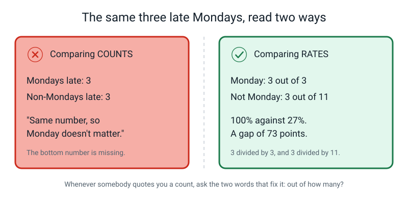
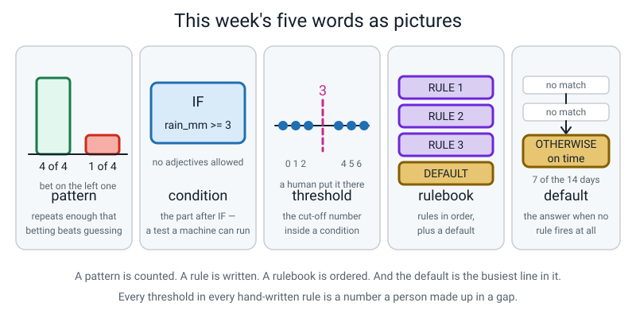

# Week 7 — Patterns: Things That Repeat Enough to Bet On

[⬅ Week 6](week-06.md) · [Course Home](../README.md) · [Week 8 ➡](week-08.md) · [Workbook](../workbook/week-07.md)

---

> ### This week in one sentence
> **A pattern is something that repeats often enough that betting on it beats guessing — and a rule is a pattern written down so tightly that a computer can follow it.**
>
> **By the end of this chapter you will be able to:**
> - Find a pattern in a two-column table **by counting**, not by eyeballing
> - Turn a pattern into an **if-then rule** with a real **condition** and a real **threshold**
> - Say what a **default** is, and why every rulebook needs one
> - Run a **rulebook** by hand on rows it has never seen, and record what it answered
>
> **Reading time:** about 22 minutes. **Homework:** about 45–60 minutes across the week.

---

## 🪝 Start Here

Somebody says this to you, absolutely certain:

> "The bus near my house is **always** late on Mondays. Always. I've been catching it for months and Monday is a disaster every single time."

Should you believe them?

You have been doing data for six weeks now, so you already know the answer is **no** — and it is worth being precise about *why* not. It is not because they are lying. They believe it completely. It is because of what their brain did with the last few months.

Their brain kept the **three horrible Mondays**. The bus was twenty minutes late, they were late for work, somebody was annoyed with them. Those mornings came with a story and a consequence, so they stuck.

Their brain threw away **every ordinary Monday** where the bus turned up, they got on it, nothing happened, and they forgot about it forever by lunchtime.

Then their brain handed them the three sticky Mondays and told them it had done a survey.

> **A memory is not a sample.** Your brain keeps the interesting rows and quietly deletes the boring ones — and it never tells you that it did.

So here is the honest starting position, written as two lines:

```
A FEELING:  "The bus is always late on Mondays."
A PATTERN:  ?
```


*Figure 7.1 — Four Mondays late out of four, against one Friday late out of four. The word "pattern" is doing two completely different jobs on these two sides.*

Look at the two sides of that figure and say what you would actually **do** about each.

On the left: four Mondays, four late. If you bet "late" every Monday, you would have been right **four times out of four.** Worth doing.

On the right: four Fridays, one late. If you bet "late" every Friday, you would have been right once and **wrong three times.** That is not a pattern. That is a thing that happened.

This week you turn the top line into the bottom line — and then you do something harder. You turn the bottom line into an instruction so exact that a computer could follow it without ever having met a bus.

And there is one rule for the whole chapter, and it is an unusual one.

> **⚠️ You are banned from guessing.** Not discouraged. Banned. You may not look at a table and tell anybody what you reckon. Every single thing you claim this week, you have to **count** first.

---

## 🧠 The Big Idea

### 1. A pattern is a bet, and it has to beat not bothering

Everybody thinks they already know the word "pattern", which is exactly why it needs pinning down properly.

> **Pattern** — something that repeats often enough that **betting on it beats guessing**.

The important words are the last three: *beats guessing*. That is a **test**, not a feeling, and it has a number attached to it.

**The analogy: your grandmother's biscuit tin.** Is the good biscuit tin *always* the blue one? No. Sometimes it is the tin with the flowers on. Would you check the blue one first anyway? Yes, obviously. **That is a pattern.** It is not a law, it is not always, and it still beats opening tins at random.

Here is the part that adults skip constantly, and it is the mathematical heart of the whole week. "Beats guessing" only means something if you first work out **how well guessing does.**

Take the fourteen bus days from the class activity. Six of them were late. Eight were on time. So how well can you do without any pattern at all?

| Strategy | How often it's right | Score |
|---|---|---|
| Say "on time" every single day | 8 of 14 | **57%** |
| Say "late" every single day | 6 of 14 | 43% |
| Flip a coin every morning | about 7 of 14 | 50% |
| The two-rule rulebook you wrote in class | 13 of 14 | **93%** |

Do the divisions yourself, on paper:

```
8 ÷ 14 = 0.571...  = 57%     <- the bar to beat
6 ÷ 14 = 0.428...  = 43%
13 ÷ 14 = 0.928... = 93%     <- what your rulebook got
```


*Figure 7.2 — Always saying "on time" is the bar. Anything below the dashed line is worse than being lazy.*

**The laziest possible strategy — say "on time" every morning and never think again — gets 57%.** That is the bar. Any pattern that scores below 57% is worse than being lazy, and you should throw it away without regret.

Your rulebook got 93%. That **36-point gap** is the entire evidence that a real pattern exists. Without computing the 57% first, the 93% is just a number that sounds nice.

> **💡 Try this:** next time anybody quotes you a score — a game, a test, an app, a claim on a poster — ask yourself one question before anything else: *what would the laziest possible answer have scored?* Sometimes it is higher.

### 2. You find patterns by counting — and you compare rates, not counts

Your instinct will be to scan a table and announce a pattern in four seconds. Sometimes you will even be right. **Do not do it anyway**, and here is the reason, which is worth memorising:

> **Eyeballing finds the pattern you already suspected, and misses the one you didn't.**

The tool is a **counting grid**. Four columns, filled in one group at a time. Here it is, done for the bus table:

| group | days | late | rate |
|---|---|---|---|
| Monday | 3 | 3 | 3 ÷ 3 = **100%** |
| Not Monday | 11 | 3 | 3 ÷ 11 = **27%** |
| rain 3 mm or more | 4 | 3 | 3 ÷ 4 = **75%** |
| rain under 3 mm | 10 | 3 | 3 ÷ 10 = **30%** |

Three things to notice, because each one is a mistake waiting to happen.

**One: always count both halves.** "Three Mondays were late" is worthless on its own. Three out of *three* is everything. A group with no comparison group tells you nothing at all.

**Two: the rate is a division.** late ÷ days. Write it as a division and then as a percentage, every time. `3 ÷ 3 = 100%`. `3 ÷ 11 = 27%`.

**Three, and this is the big one: a big count is not a strong pattern.**

Look hard at that grid. Monday had **3** late days. Not-Monday also had **3** late days. *Exactly the same count.* If you compare counts, you conclude that Monday makes no difference whatsoever — which sounds like careful reasoning and is completely wrong.


*Figure 7.3 — The same three late Mondays, read two ways. Only one of the two readings is any use.*

Three out of three is not three out of eleven. **Counts mislead. Rates don't.**

**The concrete version, from real life.** Suppose a shop tells you "forty of our customers complained last month." Is that a lot? You cannot possibly know, because you have not been told the bottom number. Forty out of fifty customers is a disaster. Forty out of two hundred thousand is an extremely good month. **Same count. Opposite stories.**

The two words that fix this, every time, for the rest of your life:

> **"Out of how many?"**

**Which pattern is strongest?** The one with the biggest **gap** between its rate and its partner's rate.

```
Monday      100%  vs  Not Monday   27%   ->  a gap of 73 points   <- strongest
rain >= 3    75%  vs  rain < 3     30%   ->  a gap of 45 points   <- second
```

So Monday is the strongest pattern here and rain is the second. Notice you could not have known that by looking. You had to divide.

### 3. A rule has exactly three parts, and no adjectives are allowed

A pattern lives in your head. A rule lives in a machine. Turning one into the other means removing every last trace of vagueness.

> **If-then rule** — an instruction of the form: IF this condition is true, THEN give that answer.


*Figure 7.4 — Three parts, and all three have names. The threshold is the part a human invented.*

> **Condition** — the part after IF. It must be something a machine can test and always get the same answer for.
>
> **Threshold** — the cut-off number inside a condition.
>
> **Action** — the answer the rule gives when the condition is true.

```
IF   rain_mm >= 3      THEN   predict "late"
     └─── condition ───┘      └─── action ───┘
              ▲
          threshold
```

**And here is the rule about conditions: no adjectives.** Ever.

"If it's a rainy day" is not a condition. *Rainy* is an opinion. Two spots on the window — is that rainy? Drizzle? You and I would disagree, and a machine cannot disagree. It just needs an answer, and it needs the **same** answer every time.

Watch the same rule get sharper:

| Version | The rule | Can a machine run it? |
|---|---|---|
| v1 | IF it's a rainy day THEN late | ❌ "Rainy" is a judgement |
| v2 | IF there's a lot of rain THEN late | ❌ "A lot" is not a number |
| v3 | IF `rain_mm >= 3` THEN late | ✅ Yes. A rain gauge settles it. |

**Now the uncomfortable truth about that 3, and it is one of the most durable ideas in this whole course.**

Nobody discovered the number 3. Look at the actual rain measurements in the bus table. The rainy days measured **4, 5, 6 and 9** millimetres. The dry days measured **0, 1 and 2**. There is a **hole between 2 and 4** — nothing in the table measured 3 at all.

So *any* threshold in that hole fits the data exactly as well as 3 does. 3, or 3.5, or 4 — all identical. We wrote 3 because it is tidy.

> **Every threshold in every hand-written rule is a number some human made up in a gap.** The data gives you a gap. A person turns the gap into a number.

That matters because it means somebody else could reasonably have chosen differently — and their rule would be exactly as justified as yours. Hold on to that; in Week 15 a machine starts choosing thresholds instead of a person, and that is a genuinely big deal.

> **⚠️ Watch out:** not every condition has a threshold. `IF day = "Monday"` has no threshold at all, because Monday is not a number — it is a **category**, so the condition is an *exact match* rather than a cut-off. Every condition has a **test**. Only some have a **number**.

### 4. A rulebook is a ladder, and the default is its busiest line

One rule is rarely enough, so you stack them.

> **Rulebook** — an ordered list of rules, plus a default at the bottom.
>
> **Default** — the answer the rulebook gives when no rule fires at all.

A rulebook needs one thing announced before anybody uses it: **which rule wins when two of them fire?** The standard answer, and the one we use all year, is **first match wins**. You read top to bottom, and the first rule that matches decides. Everything below it is skipped.


*Figure 7.5 — An input falls in at the top and stops at the first rung that matches.*

Watch one input fall down the ladder. **Thursday, 4 mm of rain.**

```
RULE 1:  is the day Monday?      Thursday. No. Fall through.
RULE 2:  is rain_mm >= 3 ?       4 is more than 3.  MATCH. Stop.
                                 -> the answer is "late"
DEFAULT:                         never reached
```

Here is the bit almost everybody forgets. **The default is not the leftovers.** Count how many of the fourteen bus days match neither rule:

```
RULE 1 fires on 3 rows   (1, 6, 11)     — the Mondays
RULE 2 fires on 4 rows   (2, 8, 10, 14) — the rainy non-Mondays
DEFAULT handles 7 rows   (3, 4, 5, 7, 9, 12, 13)

check:  3 + 4 + 7 = 14  ✅
```

**Seven of fourteen. Half the table is answered by the line at the bottom.** The default is the single busiest line in almost every rulebook ever written.

**And what happens if you leave it blank?** Not "no". Not "on time". **Nothing.** The rulebook has no answer at all. And a machine with no answer does not shrug politely and move on — it stops, or it hands the next program an empty answer, and something breaks three steps later in a place nobody can trace.

**So how do you pick a default?** Ask yourself one question: *what should I say when I know nothing?*

Around this bus stop, the bus is usually on time. So the default is "on time".

> **The default should be the commonest answer.** That way, being clueless is still your best available guess.

### 5. A pattern is a bet about the future, built out of the past

Three Mondays. That is it. **Three.**

That is not many, and pretending otherwise is the fastest way to look silly. Here is the honest version of what your rulebook actually knows:

- It does **not** know the bus will be late next Monday.
- It knows that, on the three Mondays somebody watched, "late" would have been the better bet.
- That is a real thing to know. It is just much smaller than "always".

And now the thing that should genuinely worry you. Suppose the roadworks that block the Monday market route finish next week. The pattern **evaporates overnight** — and your rulebook will carry on confidently announcing "late" every single Monday forever, wrong every time, with total confidence, until a human notices.

> **A pattern is a statement about the past. Using it on the future is a bet, and the world is under no obligation to keep behaving the way it did while somebody was watching.**

There is no cleverness that fixes this. The only defence is to keep collecting data and keep checking. Every real AI system in the world has this problem, and companies pay people full-time salaries just to watch for it.

Which is exactly why the last five minutes of the class mattered so much. Four days nobody had seen, kept in a pocket:


*Figure 7.6 — Three out of four on days the rulebook had never met. Notice what F4 is.*

93% on the days the rules were built from. **75% on days they had never seen.**

Which of those two numbers is the honest one? Hold that question. It is the whole of Week 9, and answering it early spoils it.

---

## 🔍 Worked Examples

### Worked Example 1 — The Wi-Fi drops out (the one we did in class)

Somebody wrote down eight days of video calls at home: what time of day the call was, how many people were on it, and whether the Wi-Fi fell over.

| # | time | people_on_call | wifi_dropped? |
|---|---|---|---|
| 1 | morning | 2 | no |
| 2 | evening | 6 | **yes** |
| 3 | morning | 3 | no |
| 4 | evening | 5 | **yes** |
| 5 | morning | 5 | **yes** |
| 6 | evening | 2 | no |
| 7 | morning | 4 | no |
| 8 | evening | 7 | **yes** |

**Step 1 — count. Do not reckon.**

| group | days | dropped | rate |
|---|---|---|---|
| time = evening | 4 (rows 2, 4, 6, 8) | 3 (rows 2, 4, 8) | 3 ÷ 4 = **75%** |
| time = morning | 4 (rows 1, 3, 5, 7) | 1 (row 5) | 1 ÷ 4 = **25%** |
| people ≥ 5 | 4 (rows 2, 4, 5, 8) | 4 (all of them) | 4 ÷ 4 = **100%** |
| people < 5 | 4 (rows 1, 3, 6, 7) | 0 | 0 ÷ 4 = **0%** |

**Step 2 — which pattern is stronger?** Compare the gaps.

```
evening 75%  vs  morning 25%     ->  a gap of 50 points
people>=5 100% vs people<5 0%    ->  a gap of 100 points   <- much stronger
```

Every single call with five or more people dropped. Every single call with fewer than five survived. **Four out of four and nought out of four.** That is as clean as data ever gets.

**Step 3 — write the rule.**

```
RULE 1:  IF people_on_call >= 5   THEN predict "drops"
DEFAULT: OTHERWISE                THEN predict "no drop"
```

**Where did the 5 come from?** The no-drop calls had 2, 3 and 4 people. The drop calls had 5, 5, 6 and 7. There is a gap between 4 and 5, so any cut-off above 4 and up to 5 fits the data identically. We wrote 5 because people come in whole numbers. **Invented, in a gap.**

**Step 4 — score it on all eight.**

| # | people | Rule fires? | Says | Truth | ✓/✗ |
|---|---|---|---|---|---|
| 1 | 2 | no → DEFAULT | no drop | no | ✅ |
| 2 | 6 | RULE 1 | drops | yes | ✅ |
| 3 | 3 | no → DEFAULT | no drop | no | ✅ |
| 4 | 5 | RULE 1 | drops | yes | ✅ |
| 5 | 5 | RULE 1 | drops | yes | ✅ |
| 6 | 2 | no → DEFAULT | no drop | no | ✅ |
| 7 | 4 | no → DEFAULT | no drop | no | ✅ |
| 8 | 7 | RULE 1 | drops | yes | ✅ |

**8 out of 8 = 100%.**

**Step 5 — beat the bar.** Four dropped, four didn't, so always saying the same word scores 4 ÷ 8 = **50%**. The rule beats guessing by **50 percentage points**, which is enormous.

**Step 6 — the best question in the whole example. Why does row 5 matter more than the others?**

Row 5 is a **morning** call — so the evening pattern says it should be fine — with **five people** — so the people pattern says it should drop. It dropped. Row 6 is the mirror image: an **evening** call with only **two people**, where the evening pattern says drop and the people pattern says fine. It did not drop.

Those are the only two rows where the two candidate patterns **disagree**, and both go to the people count. With only eight rows that is a strong hint rather than proof, but it suggests the people count is doing the real work and time of day may just be going along for the ride, because evening calls happen to have more people on them.

> **Rows where your two ideas agree cannot tell you which idea matters.** When you have two candidate patterns, hunt for the row where they contradict each other. That single row is worth more than all the others put together.

### Worked Example 2 — The canteen runs out of chips (food)

One row = one lunchtime. Ten lunchtimes. Somebody wrote down the main dish, how many people were in the queue at half past twelve, and whether the kitchen ran out before the last person was served.

| # | day | dish | queue_at_1230 | ran out? |
|---|---|---|---|---|
| 1 | Mon | pasta | 12 | no |
| 2 | Tue | chips | 31 | **YES** |
| 3 | Wed | rice | 15 | no |
| 4 | Thu | chips | 28 | **YES** |
| 5 | Fri | pasta | 18 | no |
| 6 | Mon | rice | 14 | no |
| 7 | Tue | chips | 22 | **YES** |
| 8 | Wed | pasta | 20 | no |
| 9 | Thu | chips | 19 | no |
| 10 | Fri | rice | 24 | **YES** |

Everyone's first guess is "it's the chips". Everybody says it. **Count anyway.**

**Step 1 — the counting grid, both halves of both pairs.**

| group | days | ran out | rate |
|---|---|---|---|
| dish = chips | 4 (rows 2, 4, 7, 9) | 3 (rows 2, 4, 7) | 3 ÷ 4 = **75%** |
| dish is not chips | 6 (rows 1, 3, 5, 6, 8, 10) | 1 (row 10) | 1 ÷ 6 = **17%** |
| queue 21 or more | 4 (rows 2, 4, 7, 10) | 4 (all of them) | 4 ÷ 4 = **100%** |
| queue under 21 | 6 (rows 1, 3, 5, 6, 8, 9) | 0 | 0 ÷ 6 = **0%** |

**Step 2 — compare the gaps.**

```
chips 75%      vs  not chips 17%    ->  a gap of 58 points
queue >= 21 100% vs queue < 21 0%   ->  a gap of 100 points   <- the winner
```

So the chips *were* a real pattern — 58 points is not nothing — but **the queue length is a perfect split**, and it beats the chips by a mile. Your four-second guess was true and second best.

**Step 3 — the rule, and where the threshold came from.**

Sort the queue numbers with their answers and the gap jumps out:

```
12   14   15   18   19   20   │   22   24   28   31
no   no   no   no   no   no   │  YES  YES  YES  YES
                              ▲
                the hole sits between 20 and 22
```

Any threshold of 21 **or** 22 gives identical answers on all ten rows. We wrote **21** because it sits exactly halfway across the hole. A different person would have written 22 and would not be wrong.

```
RULE 1:  IF queue_at_1230 >= 21   THEN predict "runs out"
DEFAULT: OTHERWISE                THEN predict "doesn't run out"
```

**Step 4 — score it.** Rows 2, 4, 7, 10 all have queues of 21 or more and all ran out ✅✅✅✅. The other six all have queues under 21 and none ran out ✅✅✅✅✅✅. **10 out of 10 = 100%.**

**Beat the bar:** 4 ran out, 6 didn't, so always saying "doesn't run out" scores 6 ÷ 10 = **60%**. The rule beats it by **40 percentage points**.

**Step 5 — find the rows where the two ideas disagree.** There are two, and they both point the same way.

| Row | dish says | queue says | Truth | Who was right? |
|---|---|---|---|---|
| 9 — Thu, chips, queue 19 | runs out | doesn't | **didn't** | the queue |
| 10 — Fri, rice, queue 24 | doesn't | runs out | **ran out** | the queue |

Two disagreements, two wins for the queue. **The chips look like they were never causing anything.** Chips days simply *tend* to have long queues in this table, so "chips" was probably standing next to the real cause and getting the credit. Ten rows is a strong hint, not proof.

> **💡 Try this:** the chips rule would still work, most of the time, for a completely wrong reason. Then one day the school puts chips on a Wednesday when half the year group is out on a trip, the queue is 11 people long, and the chips rule confidently predicts a disaster that never happens. **A rule that is right for the wrong reason will betray you the moment the coincidence stops holding.**

### Worked Example 3 — Does our cricket team win? (sport)

One row = one match. Twelve matches. Two things written down before each game: whether we were playing at home, and whether we won the toss.

| # | ground | won_toss | result |
|---|---|---|---|
| 1 | home | yes | **WON** |
| 2 | away | no | lost |
| 3 | home | no | **WON** |
| 4 | away | yes | lost |
| 5 | home | yes | **WON** |
| 6 | away | yes | **WON** |
| 7 | home | no | **WON** |
| 8 | away | no | lost |
| 9 | home | yes | **WON** |
| 10 | away | no | lost |
| 11 | home | no | lost |
| 12 | away | yes | lost |

**Step 1 — the counting grid.**

| group | matches | won | rate |
|---|---|---|---|
| ground = home | 6 (rows 1, 3, 5, 7, 9, 11) | 5 (rows 1, 3, 5, 7, 9) | 5 ÷ 6 = **83%** |
| ground = away | 6 (rows 2, 4, 6, 8, 10, 12) | 1 (row 6) | 1 ÷ 6 = **17%** |
| won the toss | 6 (rows 1, 4, 5, 6, 9, 12) | 4 (rows 1, 5, 6, 9) | 4 ÷ 6 = **67%** |
| lost the toss | 6 (rows 2, 3, 7, 8, 10, 11) | 2 (rows 3, 7) | 2 ÷ 6 = **33%** |

**Step 2 — compare the gaps.**

```
home 83%     vs  away 17%        ->  a gap of 66 points   <- strongest
won toss 67% vs  lost toss 33%   ->  a gap of 34 points   <- real, but weaker
```

**Both of these are genuine patterns.** Both beat guessing. Home ground is roughly twice as strong.

**Step 3 — the rule. And notice something.**

```
RULE 1:  IF ground = "home"   THEN predict "win"
DEFAULT: OTHERWISE            THEN predict "lose"
```

**That rule has no threshold at all.** `ground = "home"` is an exact match on a category, not a cut-off on a number. It is still a perfectly good condition — a machine can test it and always get the same answer. **Every condition needs a test. Not every condition needs a number.**

**Step 4 — score it on all twelve.**

| # | ground | First to fire | Says | Truth | ✓/✗ |
|---|---|---|---|---|---|
| 1 | home | RULE 1 | win | WON | ✅ |
| 2 | away | DEFAULT | lose | lost | ✅ |
| 3 | home | RULE 1 | win | WON | ✅ |
| 4 | away | DEFAULT | lose | lost | ✅ |
| 5 | home | RULE 1 | win | WON | ✅ |
| 6 | away | DEFAULT | lose | **WON** | ❌ |
| 7 | home | RULE 1 | win | WON | ✅ |
| 8 | away | DEFAULT | lose | lost | ✅ |
| 9 | home | RULE 1 | win | WON | ✅ |
| 10 | away | DEFAULT | lose | lost | ✅ |
| 11 | home | RULE 1 | win | **lost** | ❌ |
| 12 | away | DEFAULT | lose | lost | ✅ |

**10 out of 12 = 0.833... = 83%.**

**Beat the bar:** 6 wins, 6 losses, so always saying the same word gets 6 ÷ 12 = **50%**. The rule beats guessing by **33 percentage points**.

**Step 5 — now the interesting part. Add the second pattern and watch what happens.**

The toss pattern is real: 67% against 33%. So surely adding it makes things better?

```
RULE 1:  IF ground = "home"      THEN predict "win"
RULE 2:  IF won_toss = "yes"     THEN predict "win"
DEFAULT: OTHERWISE               THEN predict "lose"
```

Rule 1 still takes all six home matches and is still right on five of them. Nothing there changes. Rule 2 only gets a turn on **away** matches where we won the toss — rows 4, 6 and 12.

| # | With one rule | With two rules | Truth |
|---|---|---|---|
| 4 | DEFAULT → lose ✅ | RULE 2 → win ❌ | lost |
| 6 | DEFAULT → lose ❌ | RULE 2 → win ✅ | **WON** |
| 12 | DEFAULT → lose ✅ | RULE 2 → win ❌ | lost |

Two right became one right. **The score drops from 10 out of 12 to 9 out of 12 — from 83% to 75%.**

> **A real pattern can still make your rulebook worse.** The toss pattern genuinely exists, and it is genuinely too weak to override the home-ground pattern. Adding it fixed one wrong answer (row 6) and broke two right ones (rows 4 and 12). **Adding a rule is not automatically an improvement, and the only way to find out is to score it both ways.**

That is the honest, slightly annoying state of rule-writing, and it is the reason the very next thing we do is count how many rules it takes before the whole thing falls over.

---

## 🎲 What We Did In Class

### The Bus Is Always Late

You were handed fourteen mornings at somebody's bus stop, and banned from guessing.


*Figure 7.7 — The finished article. Your sheet had the same fourteen rows and an empty grid.*

### The table

| # | day | weather | rain_mm | bus late? |
|---|---|---|---|---|
| 1 | Mon | sunny | 0 | **LATE** |
| 2 | Tue | rainy | 6 | **LATE** |
| 3 | Wed | sunny | 0 | on time |
| 4 | Thu | cloudy | 1 | on time |
| 5 | Fri | sunny | 0 | on time |
| 6 | Mon | cloudy | 2 | **LATE** |
| 7 | Tue | sunny | 0 | on time |
| 8 | Wed | rainy | 9 | **LATE** |
| 9 | Thu | sunny | 0 | on time |
| 10 | Fri | rainy | 5 | **LATE** |
| 11 | Mon | sunny | 0 | **LATE** |
| 12 | Tue | cloudy | 1 | on time |
| 13 | Wed | sunny | 0 | on time |
| 14 | Thu | rainy | 4 | on time |

### Step 1 — the counting grid

The rules for this step, which are worth reusing on any table for the rest of your life:

1. **No guessing.** Not a word about what you reckon until the grid is full.
2. **Count with a finger on the page,** row by row, with a small tally mark in the margin. Counting from memory is how you get 3 when the answer is 4.
3. **Do both halves of every pair.**
4. **Do it in two passes.** First pass: how many days are in the group? Second pass: how many of *those* were late? Two small questions in sequence beats one compound question, every single time — and it is what professionals do too.

| group | days | late | rate |
|---|---|---|---|
| **Monday** | 3 (rows 1, 6, 11) | 3 (all of them) | 3 ÷ 3 = **100%** |
| **Not Monday** | 11 | 3 (rows 2, 8, 10) | 3 ÷ 11 = **27%** |
| **rain 3 mm or more** | 4 (rows 2, 8, 10, 14) | 3 (rows 2, 8, 10) | 3 ÷ 4 = **75%** |
| **rain under 3 mm** | 10 | 3 (rows 1, 6, 11) | 3 ÷ 10 = **30%** |

### Step 2 — name the strongest pattern

Monday, 100% against 27%, a **73-point gap**. Rain is second, 75% against 30%, a **45-point gap**.

### Step 3 — the rulebook

```
CONVENTION: first match wins, checked top to bottom.

RULE 1:  IF day = "Monday"    THEN predict "late"
RULE 2:  IF rain_mm >= 3      THEN predict "late"
DEFAULT: OTHERWISE            THEN predict "on time"
```

### Step 4 — score it on the fourteen

| # | day | rain_mm | First rule to fire | Says | Truth | ✓/✗ |
|---|---|---|---|---|---|---|
| 1 | Mon | 0 | RULE 1 | late | LATE | ✅ |
| 2 | Tue | 6 | RULE 2 | late | LATE | ✅ |
| 3 | Wed | 0 | DEFAULT | on time | on time | ✅ |
| 4 | Thu | 1 | DEFAULT | on time | on time | ✅ |
| 5 | Fri | 0 | DEFAULT | on time | on time | ✅ |
| 6 | Mon | 2 | RULE 1 | late | LATE | ✅ |
| 7 | Tue | 0 | DEFAULT | on time | on time | ✅ |
| 8 | Wed | 9 | RULE 2 | late | LATE | ✅ |
| 9 | Thu | 0 | DEFAULT | on time | on time | ✅ |
| 10 | Fri | 5 | RULE 2 | late | LATE | ✅ |
| 11 | Mon | 0 | RULE 1 | late | LATE | ✅ |
| 12 | Tue | 1 | DEFAULT | on time | on time | ✅ |
| 13 | Wed | 0 | DEFAULT | on time | on time | ✅ |
| 14 | Thu | 4 | RULE 2 | late | **on time** | ❌ |

**13 out of 14 = 0.928... = 93%.** Against the best guess of 57%, the rulebook earned **36 percentage points**.

**The one it got wrong is row 14** — Thursday, 4 mm of rain, and the bus turned up on time anyway. That single row is the seed of next week.

### Step 5 — the Fresh Four

Then four days came out of a pocket. Nobody had seen them. Your rulebook had certainly never seen them, and nothing you wrote was allowed to peek.

| # | day | rain_mm | First rule to fire | Says | Truth | ✓/✗ |
|---|---|---|---|---|---|---|
| F1 | Wed | 1 | DEFAULT | on time | **LATE** | ❌ |
| F2 | Tue | 7 | RULE 2 | late | LATE | ✅ |
| F3 | Fri | 0 | DEFAULT | on time | on time | ✅ |
| F4 | Mon | 8 | **RULE 1** (before rule 2) | late | LATE | ✅ |


*Figure 7.8 — Three out of four = 0.75 = 75%.*

**F1 is the interesting failure.** A Wednesday with one millimetre of rain that was late anyway, for some reason that is not in the table at all. No rule you could write from these columns would ever catch it.

**F4 is the cliffhanger.** Monday **and** 8 mm of rain. **Both rules fire.** First-match-wins means Rule 1 decides, and Rule 1 says "late", which happens to be right — so nothing goes wrong and we got away with it.

But look at what that depended on. The two rules **agreed**. What if they hadn't? And who decided Rule 1 goes first? A person, on a whim, because they found the Monday pattern first.

```
WHAT HAPPENS ON A RAINY MONDAY?
Rule 1 says late.  Rule 2 says late.  They agree... this time.
What if they didn't?
```

Leave that question written down. It is next week's front door.

### Want to redo this at home?

You need nothing but a pencil. Copy the fourteen rows onto ruled paper, cover the "bus late?" column with your hand, and do it all again from scratch. Then invent a **fifteenth day** designed to make the rulebook wrong. (A sunny Monday that arrives on time does it, and it also drops the Monday rate from 100% to 75% — one row, and the whole conclusion moves.)

---

## 💬 Talk About It

**1. "Three Mondays. Would you bet a week's pocket money on Monday number four?"**
*Hint:* the honest answer is a wobbly yes — "late" is the better bet than "on time", and it is not much better than that. Three rows is very little evidence about anything. See if you can get the other person to separate two different sentences: *"late is the better bet"* and *"the bus will be late"*. The first is defensible. The second is not, and almost everybody says the second when they mean the first.

**2. "What if the bus is late on Mondays because of the market, not because it's Monday?"**
*Hint:* then you have understood something most adults haven't. Monday is not *causing* anything — Monday is a **stand-in** for whatever actually happens on Mondays: market traffic, the bin lorry, the school run. Your rule still works, because the stand-in turns up at the same time as the real cause. But it will break silently the day the market moves to Tuesday, and nobody will know why. Ask the other person: *how would you ever find out?*

**3. "Does a computer find patterns the same way I just did with a pencil?"**
*Hint:* roughly yes, and this genuinely surprises people. One kind of machine learning program, a decision tree, looking at the bus table would do essentially what you did — split the rows by a column, count how the answers land on each side, work out the rates, and keep the split that separates the answers best. It just does it for thousands of columns and thousands of possible thresholds in under a second, and it never gets bored on row 400. **Your hand-drawn counting grid is not a toy version of how that kind of program works. It is the same idea, done slowly.** (Other kinds of machine learning find patterns differently, and you will meet some of them later.)

---

## ⚠️ Don't Get Tricked

### Trick 1 — "A pattern means always"

| ❌ Wrong | ✅ Right |
|---|---|
| "One Monday the bus was on time, so the Monday pattern is dead." | "A pattern is a **bet**, not a law. Three out of four is still a much better bet than three out of eleven." |

This one comes straight from school maths, where patterns are exact: 2, 4, 6, 8. Real-world patterns are not like that. Say the biscuit tin sentence to yourself: *is it always the blue tin? No. Would you check the blue tin first? Yes.*

### Trick 2 — "Same count, so it makes no difference"


*Figure 7.9 — The trap and the fix, side by side.*

| ❌ Wrong | ✅ Right |
|---|---|
| "Mondays were late 3 times and non-Mondays were late 3 times, so Monday doesn't matter." | "3 out of **3** against 3 out of **11**. That's 100% against 27% — a 73-point gap." |

This is the sneakiest mistake in the week, because it *looks* like careful reasoning. The whole fix is two words: **out of how many?**

### Trick 3 — "If it looks rainy, then late" is a rule

| ❌ Wrong | ✅ Right |
|---|---|
| "IF it looks like rain THEN late. That's a rule." | "IF `rain_mm >= 3` THEN late. **That's** a rule — because a rain gauge gives one answer, the same answer, for everybody." |

Test any condition like this: **two people stand at the same window. One says it looks like rain, one says it doesn't. Who is right?** Nobody. That is the entire problem with adjectives, and no amount of cleverness on the machine's side fixes it.

### Trick 4 — "I found the pattern, so my rule is correct"

| ❌ Wrong | ✅ Right |
|---|---|
| "The data told me the threshold is 3." | "The data gave me a **hole between 2 and 4**. I chose 3 out of that hole because it's tidy. Somebody else could pick 4 and be exactly as justified." |

Finding a pattern and writing a rule are **two separate steps**, and the second one contains a decision that was yours. Keep them separate out loud, because the day somebody asks "why 3?" you want to be able to answer honestly.

---

## 🌍 Where You've Seen This

1. **Your own morning routine.** "I always forget my water bottle on PE days." Have you counted? Two passes: how many PE days, and how many of *those* did you forget? You may be right. You may also discover the real pattern is Friday, whatever the timetable says.
2. **A speed camera.** `IF speed > 35 mph THEN flash.` A condition, a threshold, and an action — and somebody chose that 35 out of a gap, in a meeting, years ago.
3. **A shop's "buy 2, get 1 free" sign.** That is a rulebook with a first-match-wins order. If the shop also has "20% off everything today", *which one applies to your basket?* The order was decided by a person, and it decides what you pay.
4. **The "you might also like" row on a video app.** Underneath it is a counting grid the size of a warehouse: of everybody who watched *this*, how many then watched *that*? Divided, compared, ranked by the gap.
5. **A smoke alarm.** `IF smoke_particles >= (a threshold) THEN scream.` Push the threshold down and it goes off when you make toast. Push it up and it stays quiet when it shouldn't. Somebody picked a number.
6. **Weather forecasts.** "70% chance of rain" is reported as a bet rather than a promise. Forecasters build it with much more than a tally, but the idea is close to a counting grid: on past days that looked like today, how often did it rain?
7. **A parent saying "you're always on your phone".** Ask them, warmly, for the counting grid. Both halves.

---

## 🧭 Where This Fits

Every week this year adds one more piece to the same picture, and this week the picture grew a new
room. The left-hand branch — the one where a **person** writes the rules — has just split in two, and
the top half is yours. Notice that the bottom half is still dashed. That is a wall, and you walk
straight into it in two weeks' time.


*Figure 7.0 — The map after Week 7. The tinted tile with the tick is where you are. White tiles are
finished, with their weeks written underneath. Dashed tiles have not happened yet — including the one
directly below you.*

| | |
|---|---|
| **The mental model you now own** | A **pattern** is something that repeats often enough that betting on it beats guessing — and you find it by **counting**, not by looking. A **rule** is that pattern written down with the vagueness taken out: a condition, a threshold inside it, and an action. |
| **The one question it answers** | *"Does betting on this pattern beat guessing — and out of how many?"* |
| **What it plugs into** | The left branch you met in Week 1, now fed by the table you built in Week 6. Your own counted data is where a hand-written rule actually comes from. |
| **What carries forward** | The threshold you invented this week is exactly what Week 8 attacks on purpose, and it is what your Week 9 rulebook gets scored on. |
| **Spiral thread** | 📊 **Data** — the counting grid — and 📦 **Model**, because a rulebook *is* the decision-maker. Two threads lit, four still waiting. |

> **💡 Try this:** on your own copy of the map, write your strongest rule inside the tinted tile, in
> pencil, threshold and all. Next week you are going to try to break it — and breaking a rule you
> wrote yourself teaches you about ten times more than reading that rules break.

---

## 🔑 Remember This

- **A pattern is something that repeats often enough that betting on it beats guessing.** Work out what guessing scores *first*, or the good-looking number means nothing.
- **You find patterns by counting, not by looking** — because eyeballing finds the pattern you already suspected and misses the one you didn't.
- **Compare rates, not counts.** Three out of three is not three out of eleven. The two words that save you: *out of how many?*
- **A rule has three parts: a condition, a threshold inside it, and an action.** No adjectives allowed — a condition must be a test a machine can run and always get the same answer for.
- **Every threshold in a hand-written rule is a number a human made up in a gap.** The data gives you a hole; a person turns the hole into a number.
- **A rulebook is rules in order plus a default,** and the default is usually its busiest line. Leave it blank and the rulebook has *no answer*, which is not the same as "no".
- **A pattern is a bet about the future built out of the past,** and the world can stop cooperating on any given morning.

---

## 📓 New Words


*Figure 7.10 — This week's five words, drawn.*

| Word | What it means | Example |
|---|---|---|
| **pattern** | Something that repeats often enough that betting on it beats guessing | Monday goes with late: 3 out of 3, against 3 out of 11 for other days |
| **condition** | The testable part of a rule — the bit after IF | `rain_mm >= 3` · `day = "Monday"` · `queue_at_1230 >= 21` |
| **threshold** | The cut-off number inside a condition | The `3` in `rain_mm >= 3`; the `21` in the canteen rule |
| **rulebook** | An ordered list of rules, plus a default at the bottom | RULE 1 Monday → late · RULE 2 rain ≥ 3 → late · DEFAULT → on time |
| **default** | The answer the rulebook gives when no rule fires at all | "on time" — which answered 7 of the 14 bus days on its own |

And one phrase you will use every week from now on: **first match wins** — read the rules top to bottom, and the first one that matches decides. Everything below it is skipped, even if it disagrees.

---

## 📤 Your Homework

Go to **[the Week 7 workbook](../workbook/week-07.md)**. About **45–60 minutes** across the week.

| Page | What to do | Time |
|---|---|---|
| **7.1** | Warm-up on Week 6, plus Practice Set A — the parts of a rule, and a diagram to label | 12 min |
| **7.2** | Practice Set B — three little tables to count, including one with no pattern in it at all | 15 min |
| **7.3** | The Mystery Threshold puzzle, and Think Deeper | 10 min |
| **7.4** | **Build It: find one real pattern in your own table by counting**, write it as a rule, and run it on your last five rows | 20 min |

Three jobs, spelled out:

1. **Three practice tables.** Fill the counting grid, work out **both** rates, and say whether there is a pattern worth betting on. **One of the three has no pattern in it at all, and saying so is the right answer.** Do not invent a pattern to be polite.
2. **Your own data.** Get out the table you have been building since Week 4. Pick one column that could be an **answer** (tired or not tired, late or on time, finished or not finished) and one column that might **predict** it. Then **count** — a grid, with both halves, and a rate written as a division. Then write it as an if-then rule with a real threshold, plus one sentence saying where that threshold came from. *"I made it up because it looked like the gap"* is a completely honest and acceptable sentence.
3. **Run your rule on the last five rows** of your table and record how many it got right, out of five.

> **⚠️ Watch out — and this is the one question I will read first.** Those last five rows were **part of the data you found the pattern in**. You have already seen them. So is five out of five actually good news, or is it just you marking your own homework? Write me one sentence on that. There is no wrong answer this week — I want to know what you honestly think, because in two weeks we do this properly.

---

[⬅ Week 6](week-06.md) · [Course Home](../README.md) · [Week 8 ➡](week-08.md) · [📓 Workbook — Week 7](../workbook/week-07.md) · [Glossary](../../glossary.md)
