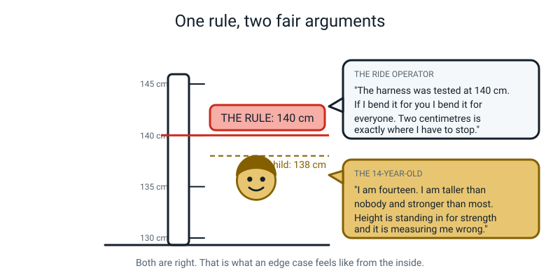
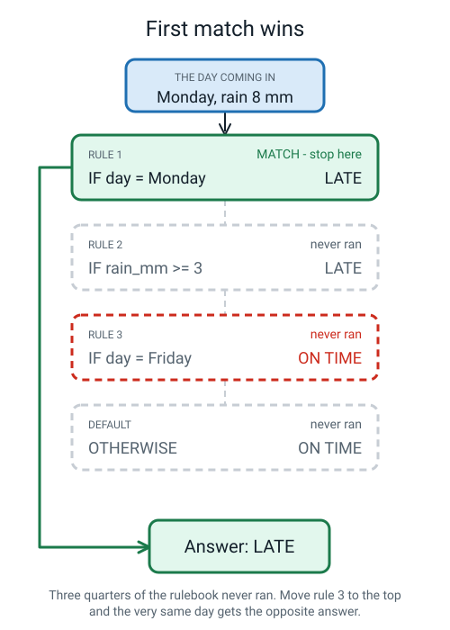
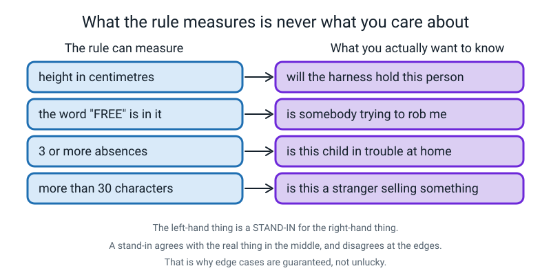
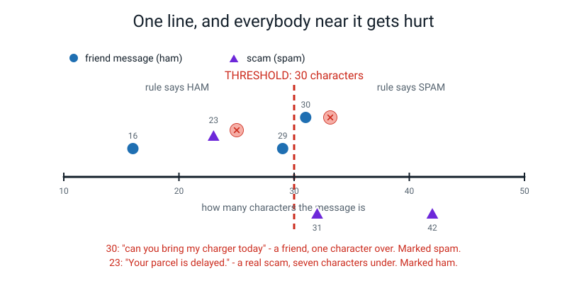
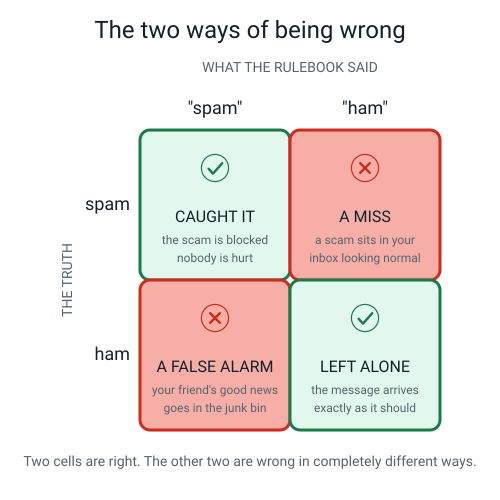
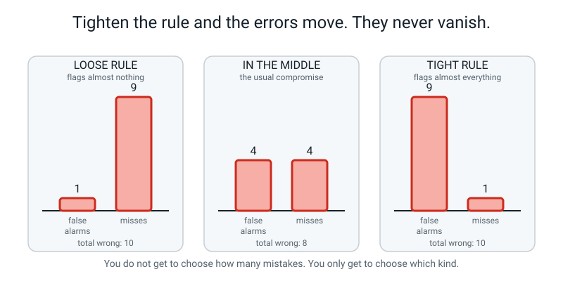
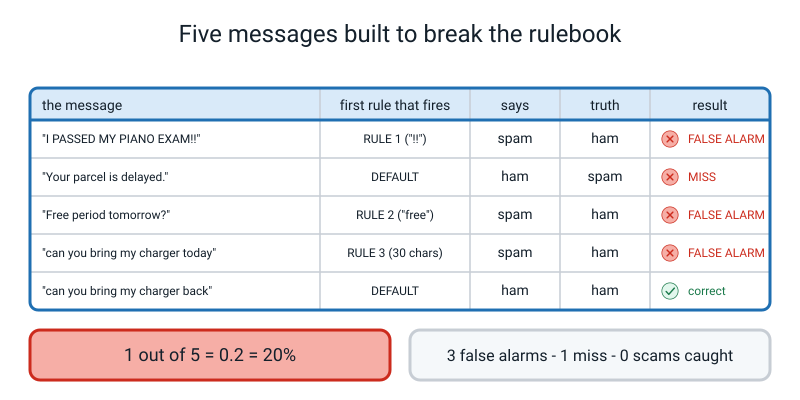
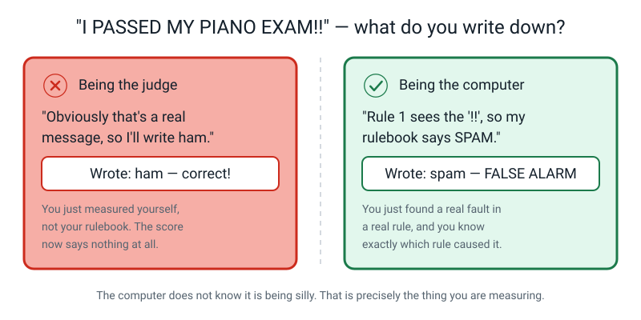
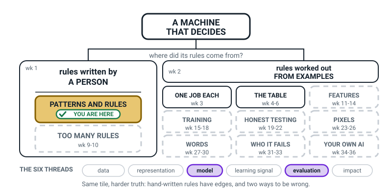
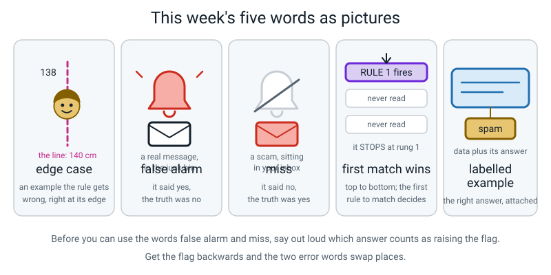

# Week 8 — Where Rules Break: Edge Cases and False Alarms

[⬅ Week 7](week-07.md) · [Course Home](../README.md) · [Week 9 ➡](week-09.md) · [Workbook](../workbook/week-08.md)

---

> ### This week in one sentence
> **Every rule has edge cases, and the two ways of being wrong — false alarms and misses — hurt completely different people.**
>
> **By the end of this chapter you will be able to:**
> - Find an **edge case** for any rule by pushing a value right up against its threshold
> - Tell a **false alarm** apart from a **miss**, and name a specific person harmed by each
> - Fill a two-by-two grid of *what the rulebook said* against *what was true*, and read the two error cells off it
> - Sharpen a vague rule — "if it looks dodgy" — into a condition a computer could actually test
>
> **Reading time:** about 24 minutes. **Homework:** about 45–60 minutes across the week.

---

## 🪝 Start Here

You have been queuing for forty minutes. It is the big ride, the one with the drop. You get to the front.

There is a sign next to the person who checks. It says:

The sign reads:

```text
YOU MUST BE 140 CENTIMETRES TALL TO RIDE
```

They measure you. **You are 138.**

You are not getting on. Next, please.


*Figure 8.1 — Both speech bubbles in that picture are correct. That is exactly what makes this hard.*

Now argue with them, properly. What do you say?

- *"It's only two centimetres!"* → "Then where should I stop? 137? 130? Every centimetre is only one centimetre."
- *"I'm fourteen — I'm older than most of the queue!"* → "The sign doesn't say fourteen. It says 140."
- *"I'll stand on my toes."* → "Then the sign measures nothing at all, and I might as well not have one."

**Here is the thing. You are right, and so are they.** That is not a dodge — it is the actual situation.

You are right that you are plenty strong enough, and two centimetres is nothing. They are right that the harness was tested at 140, and that if they bend the line for you they have to bend it for the next person, and the person after that, and then the line is not anywhere at all.

> **Edge case** — an example a rule gets wrong, usually because it is sitting right on the boundary of what somebody was imagining when they wrote the rule.

Here is the rule and your case, side by side.

```text
THE RULE:      height >= 140  ->  allowed
THE EDGE CASE: 138 cm         ->  refused, and she was fine
```

You are not a mistake. You are not a bug. **You are a person standing exactly on the boundary of a rule, at the point where the rule stops working and starts just hurting somebody.**

And now find a second edge case for the *same* rule — this time somebody it lets **on** who shouldn't be. A **141 cm eight-year-old** who is tall for her age and weighs very little. The harness will not hold her. The rule waves her through.

**Two edge cases, opposite directions, one rule, thirty seconds of thinking.** That is this week. And by the end of it you will have broken your own rulebook on purpose.

---

## 🧠 The Big Idea

This section gives you five ideas: rule order, stand-ins, finding edge cases, the two kinds of wrong, and the threshold slider.

### 1. First match wins — so the order of the rules is part of the rulebook

Last week ended with a question left deliberately hanging: *what happens on a rainy Monday, when Rule 1 and Rule 2 both fire?*

Here is the answer. It is a **convention** — a thing we agree in advance and announce out loud — and it has a name.

> **First match wins** — you check the rules from the top down, and the first rule that matches decides the answer. Every rule below it is skipped, even if it would have disagreed.


*Figure 8.2 — Monday, 8 mm of rain, left home early. Rule 1 fires, and three quarters of this rulebook never runs at all.*

Look hard at Rule 3 in that picture. (This rainy Monday is also a day the student left home early, so Rule 3 would match it.) **It says "on time". It disagrees with the answer we gave. And it never got a turn.** Not outvoted. Not overruled after careful consideration. Simply **never read.** The machine stopped two rungs above it.

Three consequences fall out of that, and they are all slightly unsettling.

**One: the order is part of the rulebook.** Two rulebooks with identical rules in a different order are **different rulebooks** and give different answers. Move Rule 3 to the top and that same rainy Monday comes out "on time" instead.

**Two: the rules at the top do the most damage,** because nothing below can moderate them. If your top rule is slightly wrong, it is wrong loudly and often.

**Three, and this is the strange one: some rules are dead.** In a big rulebook there are always rules that can never fire, because something above them always catches those cases first. Fifty rules, and maybe six of them have never run in their lives — and nobody knows which six.

> **💡 Try this:** how would you find a dead rule? Put a **counter** next to each rule, run all your data through, and look for the zeroes. That is exactly what real engineers do, and it is a good answer to a real question.

**And who decided the order?** A person. Last week, that person put the Monday rule first **because they found it first.** That is the entire reason. Not a calculation, not a principle — the order they happened to notice things in.

### 2. Edge cases are guaranteed, because every rule measures a stand-in

This is the single most valuable idea in the week, so read it twice.

The ride sign measures **height**. The ride cares about **whether the harness will hold this person safely**. Those are not the same thing. The operator cannot test a harness on every rider in a queue — it would take forty minutes each — so they measure something they *can* measure, which mostly goes along with it.

> **Stand-in** — something you can measure, used in place of the thing you actually care about but cannot measure.


*Figure 8.3 — Four rules. On the left, what each one can measure. On the right, what somebody actually wanted to know.*

**The analogy: a school report.** A test score is a stand-in for "does this person understand the subject". Mostly it agrees. It disagrees for the student who understood everything and had a migraine on the day, and for the student who understood nothing and got lucky with the questions. The report is not lying. It is measuring a stand-in, and stand-ins have edges.

And now the rule about stand-ins, which is the mechanism behind the whole week:

> **A stand-in agrees with the real thing in the middle, and disagrees at the edges.**

A 175 cm adult and a 95 cm toddler — height gets both of those completely right, effortlessly. It is the people between about 130 and 150 where height starts lying.

**So edge cases are not bad luck.** They are not evidence somebody wrote a sloppy rule. **They are built into the arrangement**, because every rule ever written uses a stand-in for something it cannot see. This is why "just fix the rule" never ends — and Week 10 is about what happens when you try.

### 3. How to find an edge case on purpose, in about fifteen seconds

This is a skill, not a knack, and there is a procedure.

> **Take the threshold. Step one unit either side of it. Then ask whether the answer really ought to flip between those two.**

That is it.

| The rule says | Look at | And ask |
|---|---|---|
| `height >= 140` | 139 and 141 | Should one get on and one not? |
| `characters >= 30` | 29 and 30 | Should one be spam and one not? |
| `rain_mm >= 3` | 2.9 and 3.1 | Should the bus be late for one and on time for the other? |
| `weight_kg >= 5` | 4.9 and 5.0 | Should one cost extra postage and one be free? |

The answer is almost always **no** — which means you have just built **two edge cases** in fifteen seconds.


*Figure 8.4 — The rule's boundary drawn as a line, with real examples as dots either side. Everybody far from the line is fine. Everybody near it is a coin toss with consequences.*

**The concrete version, with real messages.** Take the spam rule `IF the message has 30 or more characters THEN spam`, and count characters carefully. Here are two messages on either side of the line:

```text
"can you bring my charger today"   30 characters  ->  SPAM     (junk bin)
"can you bring my charger back"    29 characters  ->  ham      (inbox)
```

Same person. Same charger. **One word different. One character different.** One of them vanishes into a folder you never open and one arrives normally, and there is no reason for it in the entire world except that somebody chose the number thirty.

> **⚠️ Watch out:** there is one honourable exception, and a sharp reader will find it. Some numbers do not *stand in* for anything — they **are** the thing. "You may vote at 18" has no edge case about voting age, because the law simply *is* the number; there is nothing underneath it that the 18 is guessing at. Every rule that **predicts** something has edge cases. Rules that **define** something do not.

### 4. There are two ways of being wrong, and they are nothing like each other

Before you can score anything at all, you need one more word.

> **Labelled example** — one piece of data with the correct answer written next to it.

`"WIN a FREE phone!!" → spam` is a labelled example. The message is the data; `spam` is the label. Without labels there is nothing to compare your rulebook's answer *to*, so there is nothing to count and nothing to score.

> **💡 Worth knowing:** the label is not free. Somebody had to read that message and decide. That person could be tired, or wrong, or could disagree with the next person — and every score you compute afterwards quietly inherits their judgement. **A labelled example is a fact and a human opinion wearing the same coat.**

Now. "Wrong" is two completely different things wearing one word.

> **False alarm** — the rule raises the flag when it shouldn't have. It says **yes** and the truth was **no**.
>
> **Miss** — the rule fails to raise the flag when it should have. It says **no** and the truth was **yes**.


*Figure 8.5 — Two cells right, two cells wrong, and the two wrong cells are not the same kind of thing at all.*

|  | Rulebook said "spam" | Rulebook said "ham" |
|---|---|---|
| **Truly spam** | ✅ Caught it — the scam is blocked | ❌ **MISS** — a scam sits in your inbox looking normal |
| **Truly ham** | ❌ **FALSE ALARM** — your friend's good news goes in the junk bin | ✅ Left alone — the message arrives properly |

**Before you can use those two words at all, you must say which answer counts as raising the flag.** This trips up nearly everybody.

| The job | The flag is... |
|---|---|
| Spam filter | "this is spam" |
| Smoke detector | "there is a fire" |
| The ride sign | "refuse this person — they are unsafe" |
| Your phone's face unlock | "this is the owner" |

Get the flag backwards and false alarms and misses **swap places**, and everything you write down afterwards is wrong. Say the flag out loud first. It takes four seconds.

**Now the part that matters more than the definitions: the two errors hurt different people.**

| The job | A false alarm costs | A miss costs | Which is worse? |
|---|---|---|---|
| Spam filter | You lose a real message from a friend — and you never even know it existed | You see one scam and delete it | **The false alarm.** You can delete a scam. You cannot read a message you never knew arrived. |
| Smoke detector | It shrieks while you make toast | The house burns down | **The miss**, obviously and enormously. |
| Exam cheating detector | An honest student is accused of cheating | One cheat gets away with it | **The false alarm**, by a mile. |
| Airport bag scanner | Somebody's bag gets searched for nothing | A weapon gets on a plane | **The miss.** |
| Face unlock on your phone | It unlocks for your brother | It refuses you and you type your code | **The false alarm** — the opposite of the spam answer! |

Look down the last column. **It changes every single row.**

> **There is no answer to "which mistake is worse" that works everywhere.** It depends entirely on who gets hurt and how badly — and that is a question about people, not about maths. Anybody who gives you one universal answer has not asked who is paying.

### 5. You don't get to choose how many mistakes. Only which kind.

The obvious response to all of this is: *fine, so make the rule better.* Let us actually try.

Take `IF the message has 30 or more characters THEN spam` and start moving the number.

**Loosen it to 60 characters.** Almost nothing gets flagged. False alarms nearly vanish — your friends' messages all arrive. And misses pile up: every short scam sails straight through.

**Tighten it to 15 characters.** Almost everything gets flagged. Misses nearly vanish — hardly any scam gets past. And false alarms pile up: half your friends are in the junk bin.


*Figure 8.6 — One rule, three settings. Ten mistakes, eight mistakes, ten mistakes. Only the mix moved.*

**The total barely changes. The mix flips completely.**

> **Every threshold in the world is a position on that slider, and somebody chose it** — by deciding which error they could live with. Usually without writing down anywhere that they had decided anything at all.

And for any one stand-in, this trade-off does not go away: moving the threshold only swaps one kind of mistake for the other. What *can* shrink both kinds is a **better measurement** (as with the apple and the parcel earlier), and better models and more data sometimes help too. But the trade-off itself is a property of using a **stand-in** to guess at something you cannot see, and it will still be true in Week 35 when you are standing at your own AI fair booth explaining your own threshold to a stranger.

---

## 🔍 Worked Examples

These three examples walk through the same steps: name the flag, fill the grid, count, then move the threshold.

### Worked Example 1 — The Ride Queue (the one we did in class)

Eight riders came through the gate. The rule was `IF height >= 140 THEN allow`, default refuse.

Then, after the day ended, a safety engineer measured everybody properly — shoulder width, weight, the lot — and worked out who the harness **would actually have held**. That last column is the truth. These are eight **labelled examples**.

| # | rider | height_cm | rule says | truly safe? |
|---|---|---|---|---|
| 1 | A | 152 | allow | yes |
| 2 | B | 138 | refuse | **yes** |
| 3 | C | 141 | allow | **no** |
| 4 | D | 129 | refuse | no |
| 5 | E | 145 | allow | yes |
| 6 | F | 139 | refuse | no |
| 7 | G | 158 | allow | yes |
| 8 | H | 136 | refuse | **yes** |

**Step 1 — say the flag out loud.** The sign's job is to catch people the harness will not hold. So **the flag is "refuse".** Refusing somebody is the alarm going off.

**Step 2 — fill the grid, one rider at a time.**

|  | Rule refused (flag raised) | Rule allowed (no flag) |
|---|---|---|
| **Truly unsafe** | ✅ Caught: **D, F** (2) | ❌ **MISS: C** (1) |
| **Truly safe** | ❌ **FALSE ALARM: B, H** (2) | ✅ Fine: **A, E, G** (3) |

**Step 3 — count it up.** Right: 2 + 3 = **5**. Wrong: **3**. So 5 out of 8.

And now split those three properly, because "three wrong" tells you nothing about what happened to anybody:

- **Two false alarms — B and H.** Two people who were perfectly safe, sent away after forty minutes of queuing. B is the 138. H is 136.
- **One miss — C.** 141 centimetres, allowed on, harness would not have held her. C is the eight-year-old who is tall for her age.

B and H had a horrible afternoon. **C could have been hurt.** Those are not the same size of thing.

**Step 4 — now move the threshold twice and rebuild the counts.**

**Threshold 130 — a loose rule.** Everybody except D (129) gets on.

|  | Refused | Allowed |
|---|---|---|
| **Truly unsafe** | ✅ D (1) | ❌ **MISS: C, F** (2) |
| **Truly safe** | ❌ **FALSE ALARM: none** (0) | ✅ A, B, E, G, H (5) |

**6 of 8. Zero false alarms, two misses.**

**Threshold 150 — a tight rule.** Only A (152) and G (158) get on.

|  | Refused | Allowed |
|---|---|---|
| **Truly unsafe** | ✅ C, D, F (3) | ❌ **MISS: none** (0) |
| **Truly safe** | ❌ **FALSE ALARM: B, E, H** (3) | ✅ A, G (2) |

**5 of 8. Three false alarms, zero misses.**

**Step 5 — line all three up, and look at what actually moved.**

| Threshold | False alarms | Misses | Total wrong | Score |
|---|---|---|---|---|
| 130 (loose) | 0 | 2 | 2 | 6 of 8 |
| 140 (middle) | 2 | 1 | 3 | 5 of 8 |
| 150 (tight) | 3 | 0 | 3 | 5 of 8 |

**The total wrong barely moves — two, three, three. The mix flips completely,** from all-misses to all-false-alarms.

**Step 6 — the trap in that table, and it matters.** The *loose* rule scores best, 6 out of 8. So should the park use 130?

**No.** Look at what its two errors are: two children allowed onto a ride whose harness will not hold them. On eight riders — two of whom sit near the boundary — the score is nowhere near stable enough to choose a **safety** threshold with.

> A park that picked 130 because it scored best on eight riders would be deciding a policy about injured children on the basis of two rows of data.

The defensible answer is 150 or higher, and the reason is not the score: **three disappointed riders is recoverable, and an injured eight-year-old is not.** Any answer that argues about *who is harmed* is a good answer. A bare number with no reason is not an answer at all.

### Worked Example 2 — Is this apple too bruised to sell? (food)

A shop has a rule for the fruit crate. Somebody measures the bruise on each apple with a small ruler and works out its area in square centimetres.

The shop's rule is:

```text
RULE:    IF bruise_cm2 >= 4   THEN bin it
DEFAULT: OTHERWISE            THEN sell it
```

Later, all eight apples were cut open, so we know the truth: was each one **actually still fine to eat**?

| # | bruise_cm2 | rule says | truly fine to eat? |
|---|---|---|---|
| A1 | 0.5 | sell | yes |
| A2 | 1.5 | sell | yes |
| A3 | 3.5 | sell | **no** — small bruise, mouldy inside |
| A4 | 4.1 | bin | **yes** — big surface bruise, perfectly good |
| A5 | 6.0 | bin | no |
| A6 | 2.0 | sell | yes |
| A7 | 9.0 | bin | no |
| A8 | 3.9 | sell | yes |

**Step 1 — the flag.** The rule's job is to catch bad apples. **The flag is "bin it".**

**Step 2 — the grid.**

|  | Rule binned it (flag raised) | Rule sold it (no flag) |
|---|---|---|
| **Truly not fine** | ✅ Caught: **A5, A7** (2) | ❌ **MISS: A3** (1) |
| **Truly fine** | ❌ **FALSE ALARM: A4** (1) | ✅ Fine: **A1, A2, A6, A8** (4) |

**Score: 6 out of 8. One false alarm, one miss.**

**Step 3 — who pays for each?**

- **The false alarm, A4:** a perfectly good apple in the bin. Somebody, somewhere, threw away food. Small cost, and it happens every single day in every shop in the world.
- **The miss, A3:** a mouldy apple sold to a customer, who bites into it. Bigger cost, much rarer, and far more likely to end up as a complaint.

**Step 4 — build the edge case, using the procedure.** Take the threshold, 4, and step either side. These are the two apples closest to it.

```text
A8  bruise 3.9 cm2  ->  SOLD
A4  bruise 4.1 cm2  ->  BINNED
```

**Two tenths of a square centimetre apart. Both apples perfectly fine. Opposite fates.** Nobody on Earth could tell those two apples apart by looking, and the rule sends one to a customer and one to the bin.

**Step 5 — move the threshold and count again.**

**Tighten to 3** — bin anything with a bruise of 3 cm² or more:

|  | Binned | Sold |
|---|---|---|
| **Truly not fine** | ✅ A3, A5, A7 (3) | ❌ **MISS: none** (0) |
| **Truly fine** | ❌ **FALSE ALARM: A4, A8** (2) | ✅ A1, A2, A6 (3) |

**6 of 8. Two false alarms, zero misses.**

**Loosen to 5** — only bin a bruise of 5 cm² or more:

|  | Binned | Sold |
|---|---|---|
| **Truly not fine** | ✅ A5, A7 (2) | ❌ **MISS: A3** (1) |
| **Truly fine** | ❌ **FALSE ALARM: none** (0) | ✅ A1, A2, A4, A6, A8 (5) |

**7 of 8. Zero false alarms, one miss.**

| Threshold | False alarms | Misses | Score |
|---|---|---|---|
| 3 (tight) | 2 | 0 | 6 of 8 |
| 4 (middle) | 1 | 1 | 6 of 8 |
| 5 (loose) | 0 | 1 | **7 of 8** |

**Step 6 — the same trap as the ride queue, in a different costume.** The loose rule scores best again, **and its one error is the one that ends up in somebody's mouth.** If the shop cared only about the score, it would pick 5. If it cared about the customer, it would pick 3.

**Step 7 — and the deepest point in the example. Why can no threshold fix A3?**

A3 had a bruise of only 3.5 cm² and was rotten *inside*. Bruise area is a **stand-in** for "is this apple rotten", and for A3 the stand-in is simply **wrong** — not near the edge, just wrong. To catch A3 you would need information the rule does not have: cut it open, or smell it, or weigh it.

> **Moving a threshold only helps with the examples near the boundary.** For an example where the stand-in has failed completely, no threshold on Earth will save you. You need a different measurement, and that means a bigger, slower, more expensive system.

### Worked Example 3 — Should the school phone home? (school)

A school has this rule. Notice it has a **threshold** *and* a **time window** — most real rules about counting need both, and forgetting the window is a classic mistake.

The school's rule is:

```text
RULE:    IF late 3 or more times in the last 20 school days   THEN phone home
DEFAULT: OTHERWISE                                            THEN do nothing
```

The school's actual worry is not lateness. It is *is something going wrong for this child at home?* Lateness is the **stand-in.** Here are eight students, and — because a pastoral teacher later sat down with every family — the truth.

| # | lates in 20 days | rule says | was something really wrong at home? |
|---|---|---|---|
| S1 | 0 | do nothing | no |
| S2 | 1 | do nothing | no |
| S3 | 2 | do nothing | **YES** — walks her little brother to a different school first |
| S4 | 3 | phone home | **no** — one week of a family wedding |
| S5 | 5 | phone home | YES |
| S6 | 1 | do nothing | no |
| S7 | 4 | phone home | YES |
| S8 | 3 | phone home | **no** — the bus route changed |

**Step 1 — the flag.** The rule's job is to catch children who need help. **The flag is "phone home".**

**Step 2 — the grid.**

|  | Phoned home (flag raised) | Did nothing (no flag) |
|---|---|---|
| **Something really wrong** | ✅ Caught: **S5, S7** (2) | ❌ **MISS: S3** (1) |
| **Nothing wrong** | ❌ **FALSE ALARM: S4, S8** (2) | ✅ Fine: **S1, S2, S6** (3) |

**Score: 5 out of 8 = 0.625 = 63%. Two false alarms, one miss.**

**Step 3 — name who pays, specifically.**

| The error | Who pays | How much |
|---|---|---|
| **False alarm** (S4, S8) | Two families who did nothing wrong get an awkward phone call implying they did. S8's family did not even cause the problem — the *bus timetable* did. | Embarrassing, mildly unfair, happens twice |
| **Miss** (S3) | S3 — the one child in the whole list who was carrying something too big for an eleven-year-old, and nobody rang, and nobody found out. | Serious, invisible, happens once |

**S3 is the row that should bother you most,** and notice she is *below* the threshold. She was late **twice**. She looks, on the sheet, like the most ordinary student in the school.

**Step 4 — try to fix it by lowering the threshold to 2.**

|  | Phoned home | Did nothing |
|---|---|---|
| **Something really wrong** | ✅ S3, S5, S7 (3) | ❌ **MISS: none** (0) |
| **Nothing wrong** | ❌ **FALSE ALARM: S4, S8** (2) | ✅ S1, S2, S6 (3) |

**6 out of 8 = 75%. Two false alarms, zero misses.**

The score went **up**, and the misses went to **zero**. So is lowering it to 2 simply better?

**That is a values question, not an arithmetic one,** and the honest answer is: it depends what the phone call is *like*. If the call is warm — "hello, we noticed a few late marks, is everything all right?" — then two unnecessary calls is a very small price for finding S3, and the school should absolutely lower it. If the call is a telling-off with a threat of a fine attached, then two families are being punished for a wedding and a bus timetable, and lowering it makes the school worse.

> **The same threshold move can be right or wrong depending on what the alarm actually does to the person it goes off about.** That is why "which error is worse" can never be answered by looking at the numbers alone.

**Step 5 — one last thing to notice about the window.** The rule says *in the last 20 school days*. Delete those five words and the rule becomes "3 or more lates, ever", which by March would flag most children in the school and be close to useless. **A counting rule almost always needs a time window, and leaving it out is the most common way to write a rule that quietly stops working.**

---

## 🎲 What We Did In Class

This section is a record of the lesson, so you can follow it again at home.

### Break My Rule

You built a spam rulebook from ten labelled messages, scored it perfectly, and then watched it fall over in four minutes.

### Part 1 — the ten labelled examples

"Ham" just means a normal message. It is an old joke that stuck.

| # | message | truth |
|---|---|---|
| 1 | `WIN a FREE phone!!` | spam |
| 2 | `CLAIM YOUR PRIZE NOW!!` | spam |
| 3 | `Free entry to win cash` | spam |
| 4 | `You have been selected for a reward, click the link` | spam |
| 5 | `URGENT: verify your bank account today` | spam |
| 6 | `see you at the bus stop` | ham |
| 7 | `Mum says dinner at 7:30` | ham |
| 8 | `did you finish maths?` | ham |
| 9 | `bring my charger back` | ham |
| 10 | `practice moved to 4pm` | ham |

### The tally table — count first, same as the bus

| clue | in spam (of 5) | in ham (of 5) | gap |
|---|---|---|---|
| contains `!!` | 2 (#1, #2) | 0 | **2** |
| contains `free` (any capitals) | 2 (#1, #3) | 0 | **2** |
| 30 or more characters | 2 (#4 = 51, #5 = 38) | 0 | **2** |
| contains `?` | 0 | 1 (#8) | 1 — and backwards |
| has an ALL-CAPS word | 3 (#1, #2, #5) | 0 | **3** |

> **🧑‍🏫 If you noticed something odd:** the ALL-CAPS clue has the **biggest** gap (3) and is not one of the three rules we used. That is deliberate. ALL-CAPS overlaps almost entirely with `!!`, so adding it catches nothing new. **The biggest gap is not automatically the best rule** — what matters is whether it catches anything the other rules miss.

### The rulebook

This is the rulebook you built in class.

```text
CONVENTION: first match wins, checked top to bottom.

RULE 1:  IF the message contains "!!"                   THEN spam
RULE 2:  IF the message contains "free" (any capitals)  THEN spam
RULE 3:  IF the message has 30 or more characters       THEN spam
DEFAULT: OTHERWISE                                      THEN ham
```

### Scored on the ten it was built from: **10 out of 10**

| # | chars | First rule to fire | Says | Truth | ✓/✗ |
|---|---|---|---|---|---|
| 1 | 18 | RULE 1 (`!!`) | spam | spam | ✅ |
| 2 | 22 | RULE 1 (`!!`) | spam | spam | ✅ |
| 3 | 22 | RULE 2 (`Free`) | spam | spam | ✅ |
| 4 | 51 | RULE 3 (51 ≥ 30) | spam | spam | ✅ |
| 5 | 38 | RULE 3 (38 ≥ 30) | spam | spam | ✅ |
| 6 | 23 | DEFAULT | ham | ham | ✅ |
| 7 | 23 | DEFAULT | ham | ham | ✅ |
| 8 | 21 | DEFAULT | ham | ham | ✅ |
| 9 | 21 | DEFAULT | ham | ham | ✅ |
| 10 | 21 | DEFAULT | ham | ham | ✅ |

A perfect score. Enjoy it for about fifteen seconds.

### Part 2 — the breaker round

Five new messages, read out one at a time. **One rule for this round, and it was enforced without mercy:**

> **You are the computer, not the judge.** If the rules give an answer you know is stupid, you write down the stupid answer.


*Figure 8.7 — The finished scorecard. One right out of five.*

| # | message | chars | First rule | Says | Truth | Result |
|---|---|---|---|---|---|---|
| B1 | `I PASSED MY PIANO EXAM!!` | 24 | RULE 1 (`!!`) | spam | ham | ❌ **FALSE ALARM** |
| B2 | `Your parcel is delayed.` | 23 | DEFAULT | ham | spam | ❌ **MISS** |
| B3 | `Free period tomorrow?` | 21 | RULE 2 (`Free`) | spam | ham | ❌ **FALSE ALARM** |
| B4 | `can you bring my charger today` | **30** | RULE 3 (30 ≥ 30) | spam | ham | ❌ **FALSE ALARM** |
| B5 | `can you bring my charger back` | **29** | DEFAULT | ham | ham | ✅ correct |

**Score: 1 out of 5 = 0.2 = 20%. Three false alarms. One miss. And zero scams caught.**

### Why each breaker worked — this is the design

- **B1 is a real message that shouts.** The `!!` rule quietly assumed only spam gets excited. Eleven-year-olds get excited constantly.
- **B2 is a scam that whispers.** No capitals, no exclamation marks, no trigger words, 23 characters. **This is what real scams often look like, partly because rulebooks like ours exist.** There is no word in it that isn't also in ordinary messages.
- **B3 is `free` in the school-timetable sense.** One word, two completely different meanings, and the rule only knows one of them.
- **B4 and B5 are the pair.** 30 characters and 29. Same person, same charger, one word different, opposite verdicts — **built in ten seconds by stepping either side of the threshold.**

### Part 3 — the grid, with the flag named first

**The flag is "spam".**

|  | Rulebook said spam | Rulebook said ham |
|---|---|---|
| **Truly spam** | ✅ caught: **none (0)** | ❌ **MISS: B2** (1) |
| **Truly ham** | ❌ **FALSE ALARM: B1, B3, B4** (3) | ✅ fine: **B5** (1) |

Three real messages from real people, binned. One scam, in the inbox, looking perfectly normal. And the rulebook's actual job — catching scams — performed **zero times.**

### The closing question, and the answer nobody expects

> "Your email app has to choose. **Strict:** it catches nearly every scam, and a few messages from your friends vanish forever into a folder you never open. **Relaxed:** you never lose a real message, and a few scams land in your inbox looking normal. Which do you want? And **who pays for your choice?**"

Whatever you picked, here is the half most people miss. **You are not the only person affected.** If you choose relaxed, and one of those scams gets your grandmother's bank details because she is using the same app — she paid for your choice, and nobody asked her.

> **Somebody always chooses this, for an awful lot of people, and the people mostly do not know it happened.** In Week 34 you will be that somebody, and you will be asked to write down what you chose.

### The envelope

At the end of the lesson, ten more messages went into an envelope. It was sealed. You both signed across the flap. It is not being opened until next week.

Do not open it. Do not fix your rulebook using it. **Everything about Week 9 depends on those ten messages never having been seen by your rules.**

### Want to redo this at home?

Give a three-rule spam book to an adult, and ask them to write five messages designed to defeat it. They will succeed in about two minutes and enjoy it far too much. Then ask them the real question: *"That took you two minutes. Real scammers do this all day, professionally. What is a hand-written rulebook actually worth?"*

---

## 💬 Talk About It

Use these three questions to talk with an adult or a friend. Each has a hint below it.

**1. "Which mistake would you rather your email app made — and who pays?"**
*Hint:* there is no right answer, and the point is to notice that. Push the other person past "I'd rather it was accurate" (which is not a choice) to an actual preference. Then the harder half: name a **specific person** other than yourself who is affected. A grandparent using the same app. A younger sibling. A small business whose invoice went to somebody's junk folder.

**2. "Why don't they just make the ride sign say '140 cm OR over 12 years old'?"**
*Hint:* some rules add a route like that (an age, or "with an adult"), and it can help. But look at what you just built: you now need to know everybody's age, which means asking, which means being told the truth, which means somebody checking. The rule got better *and* the system got bigger and slower — and it still has edge cases; they have just moved. Now it is the eleven-year-old who is 139 cm. **Every fix trades one edge case for a different edge case, plus more complexity.** Sometimes worth it. Never free.

**3. "Can't we just write a rule for every edge case we find?"**
*Hint:* try it. Four minutes, out loud. Fix the piano-exam false alarm without losing messages 1 and 2. The natural patch is `IF contains "!!" AND has an ALL-CAPS word THEN spam` — which fails, because `I PASSED MY PIANO EXAM!!` is *full* of capitals. The next patch after that starts needing information the message does not contain at all (who sent it; whether they are in your contacts). See if the other person can spot the moment the patching stops working. **That moment is next week's entire lesson.**

---

## ⚠️ Don't Get Tricked

These are four wrong ideas that are easy to believe. Each is shown next to a better one.

### Trick 1 — "Wrong is wrong. That's four mistakes."


*Figure 8.8 — And the related trap: quietly correcting the rulebook instead of recording what it said.*

| ❌ Wrong | ✅ Right |
|---|---|
| "It got four wrong. Four mistakes." | "**Three false alarms and one miss.** Three real messages binned, and one scam in the inbox." |

Try it as two stories instead of two numbers. *Your best friend messages you that she got into the team. It goes in the junk folder and you never see it — you don't find out three weeks later, you never find out at all.* Now, separately: *a scam text arrives, you read it, you delete it in two seconds.* **Same number of mistakes. Same day for you?**

### Trick 2 — "So we just need a better rule"

| ❌ Wrong | ✅ Right |
|---|---|
| "I'll tighten it so no scams get through." | "Tightening it stops misses **by causing false alarms.** I'm not removing mistakes — I'm choosing which ones I get." |

This is not a stupid instinct. It is the *correct* instinct applied to a problem that does not yield, and every engineer in the world has it. The fix is not to be told; it is to try, and then re-check the thing your patch was supposed to protect.

### Trick 3 — "An edge case means somebody wrote a bad rule"

| ❌ Wrong | ✅ Right |
|---|---|
| "The 138 cm case proves the sign is badly designed." | "The sign measures a **stand-in**. Stand-ins agree in the middle and disagree at the edges. Edge cases are **guaranteed**, not evidence of sloppiness." |

Ask yourself the diagnostic question: *what does this rule actually want to know, and can it measure that?* Height wants to know about the harness. Bruise area wants to know about mould. Late marks want to know about a family. None of them can measure the thing they care about.

### Trick 4 — "It got the right answer, so the rule works"

| ❌ Wrong | ✅ Right |
|---|---|
| "`WINTER SALE! 70% off everything` was marked spam. Correct! Good rule." | "It was marked spam because it happens to be **31 characters long**. One word shorter and it's a miss. That answer was luck." |

So whenever you score a rulebook, always write down **which rule fired**, not just whether the answer was right. **A rule that is right for the wrong reason will betray you the moment the coincidence stops holding** — and you will have no idea why, because the score looked fine.

---

## 🌍 Where You've Seen This

False alarms and misses show up in many places outside this course. Here are seven.

1. **Your own junk folder.** Go and look. Most people find a real message that should not be there within ninety seconds, and it is often something that mattered. That is a **false alarm**, in your own life, with a real cost — and notice how long it sat there unread.
2. **A smoke alarm going off while somebody makes toast.** A false alarm. And here is the dangerous bit: after enough of them, somebody takes the battery out — which converts every future false alarm into a potential **miss**. Annoying errors cause dangerous ones.
3. **A shop's security tag beeping as you walk out with nothing.** False alarm. You get looked at by everybody in the queue. Who paid? You did, and you had done nothing.
4. **Your phone's face unlock refusing you in the dark.** A miss, on the flag "this is the owner". Mildly annoying. Now imagine it unlocking for your sibling: a false alarm, and much worse. **Same maths as the spam filter, opposite preference.**
5. **A parent's "you're on your phone too much" rule.** `IF screen_min > 120 THEN confiscate.` Find the edge case: 119 minutes of homework research versus 121 minutes of the same. Then find the other one: 90 minutes of something genuinely awful, waved through.
6. **Automatic essay-plagiarism checkers.** A false alarm accuses an honest student of cheating, and they may not be believed. A miss lets one cheat through. Many schools have quietly decided which of those two it prefers, usually without telling the students.
7. **Airport security.** Your bag gets searched for a bottle of water: false alarm, costs four minutes. The alternative error costs something you cannot recover. **This is a job where everybody, without being asked, agrees which error is worse.**

---

## 🧭 Where This Fits

Nothing moved on the map this week, and that is the point. You are standing on the same tile as last
week: Week 7 wrote the rules, Week 8 went hunting for the places they break. One tile, two weeks —
some tiles are worth it.



*Figure 8.0 — The map after Week 8. Every box is exactly where it was last week. What changed is the
strip along the bottom, where **evaluation** is lit beside **model** — because this week you did not
just write rules, you counted how they were wrong.*

| | |
|---|---|
| **The mental model you now own** | Every rule has an **edge**, and edges are guaranteed, because a rule always measures a stand-in for something it cannot see. There are exactly two ways to be wrong: a **false alarm** (yes when the truth was no) and a **miss** (no when the truth was yes). They hurt different people by different amounts, so somebody has to choose which one they would rather have. |
| **The one question it answers** | *"Which kind of wrong is this — a false alarm or a miss — and who pays for it?"* |
| **What it plugs into** | Week 7's rule, and the threshold sitting inside it. The 140 cm ride rule is a number **you** made up, and this week it met somebody who is 138 cm. |
| **What carries forward** | False alarm and miss are the two off-diagonal boxes of the confusion matrix you meet in Week 21, and they are the reason Week 16 makes you pick a confidence threshold. |
| **Spiral thread** | 📦 **Model** — the rulebook itself — and ⚖️ **Evaluation**, because asking *how* a thing is wrong is the whole of evaluation. |

> **💡 Try this:** do not redraw the map this week. Instead, find a rule in your own house or school,
> find its 138 cm, and say out loud who pays when it fires wrongly. If you can do that, this tile is
> finished.

---

## 🔑 Remember This

These are the points to keep from this week.

- **Every rule has edge cases, and they are guaranteed** — not because the rule is sloppy, but because every rule measures a **stand-in** for something it cannot see.
- **To find an edge case on purpose: take the threshold and step one unit either side.** Then ask whether the answer really ought to flip there. It almost never should.
- **There are two ways of being wrong.** A **false alarm** says yes when the truth was no. A **miss** says no when the truth was yes.
- **Say the flag out loud before you use those two words.** Get the flag backwards and false alarms and misses swap places.
- **The two errors hurt different people, by different amounts** — so which one is "worse" changes from job to job, and there is no universal answer.
- **You don't get to choose how many mistakes. Only which kind.** Every threshold in the world is a position on that slider, and a person chose it.
- **First match wins, so the order of the rules is part of the rulebook** — and rules near the bottom can be dead, never reached at all.
- **Always record which rule fired.** A right answer from the wrong rule is a trap with a delay on it.

---

## 📓 New Words

These are the words this week introduced.


*Figure 8.9 — This week's five words, drawn.*

| Word | What it means | Example |
|---|---|---|
| **edge case** | An example a rule gets wrong, usually right at its boundary | A 138 cm rider at a 140 cm ride; a 29-character message next to a 30-character one |
| **false alarm** | The rule raises the flag when it shouldn't — says **yes**, truth was **no** | `I PASSED MY PIANO EXAM!!` marked as spam |
| **miss** | The rule stays quiet when it shouldn't — says **no**, truth was **yes** | `Your parcel is delayed.` sailing into the inbox |
| **first match wins** | Check the rules top to bottom; the first one that matches decides, and the rest are never read | A rainy Monday fires Rule 1, so Rule 3 never gets a turn |
| **labelled example** | A piece of data with the correct answer written next to it | `"WIN a FREE phone!!" → spam` |

And one more you will use all year, even though it is not on the list: a **stand-in** is something you *can* measure, used in place of the thing you actually care about. Height stands in for harness safety. Bruise area stands in for mould. Late marks stand in for trouble at home.

---

## 📤 Your Homework

Go to **[the Week 8 workbook](../workbook/week-08.md)**. About **45–60 minutes** across the week.

| Page | What to do | Time |
|---|---|---|
| **8.1** | Warm-up on Week 7, plus Practice Set A — the two errors, and a grid to label | 12 min |
| **8.2** | Practice Set B — four scenarios, including two "what goes wrong and why" | 15 min |
| **8.3** | The Three Thresholds puzzle, and Think Deeper | 10 min |
| **8.4** | **Build It: the 138 cm argument from both sides**, then sharpen five vague rules | 20 min |

Two jobs, and they are both writing jobs this week rather than counting jobs.

1. **The 138 centimetre argument, both sides.** You were the one turned away, so you have the easy half. Write the **ride operator's** side *properly* — not a straw man, not a cartoon villain. Their best possible argument, in their own words. Then yours. Then one honest sentence: **is there any rule that would have been fair to both of you?** Then: **who pays if the sign says 140? Who pays if it says 130?** Name a *person* each time, not "people".
2. **Sharpen five vague rules.** Five rules that are useless as written — "if it looks dodgy", "if the student is often late". Rewrite each so a computer could run it. **Three requirements per rule, and all three get checked:**
   - **One:** it must contain a **number** or an **exact match**. No adjectives. Ever.
   - **Two:** one sentence on **where your number came from.** *"I made it up, it seemed about right"* is completely honest and completely acceptable — and much better than pretending.
   - **Three:** give **one edge case your new rule creates.** You know how to find them now: take your threshold and step one either side.

> **⚠️ That third requirement is the whole homework.** Anyone can put a number in a rule. Knowing what your number just did to somebody standing right next to it is the part that took an hour of class time.

> **💡 And leave the envelope alone.** It is sealed for a reason, and next week only works if nobody has looked.

---

[⬅ Week 7](week-07.md) · [Course Home](../README.md) · [Week 9 ➡](week-09.md) · [📓 Workbook — Week 8](../workbook/week-08.md) · [Glossary](../../glossary.md)
