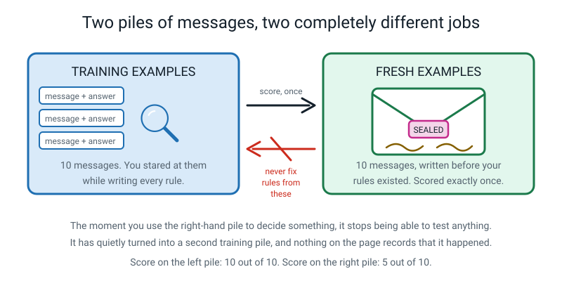
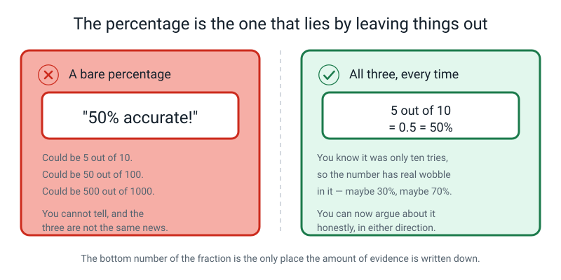
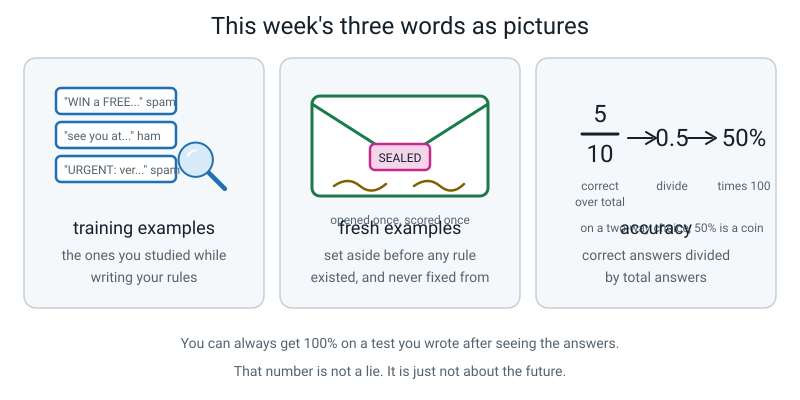

# Week 9 — Term 1 Checkpoint: Rules on Trial

[⬅ Week 8](week-08.md) · [Course Home](../README.md) · [Week 10 ➡](week-10.md) · [Workbook](../workbook/week-09.md)

---

> ### This week in one sentence
> **A rulebook scored on the very messages you wrote it from tells you nothing; the honest score is the one you get on messages it has never seen.**
>
> **By the end of this chapter you will be able to:**
> - Explain why scoring a rulebook on its own **training examples** is cheating
> - Compute **accuracy** as a fraction, a decimal and a percentage, showing the division
> - Compare a training score with a **fresh** score and describe the gap in words, without explaining it away
> - Recall and use the whole Term 1 vocabulary without notes
>
> **Reading time:** about 24 minutes. **Homework:** about 45–60 minutes across the week.

---

## 🪝 Start Here

There is an envelope on the table. It is sealed. There are two signatures across the flap, and one of them is yours.

Inside are ten text messages, written the night before last week's lesson — which means they were written **before your rules existed.** There is no way on Earth your rulebook was built to fit them. That is the entire reason for the ceremony.

Your rulebook got **10 out of 10** last week. A perfect score. You watched it happen.

So, before anything is opened: **out of ten, what do you think you will get?**

Write a number down. Most people write 8 or 9.

---

Now here is one sentence that is going to sound strange, and it is worth saying **before** the envelope is opened rather than afterwards, so that it does not sound like a consolation prize.

> **The number you are about to get will be lower than ten, and that is good news.**

It will be the first honest number you have produced all term.

Every score you have written down since Week 4 was measured on the same examples you built the thing from. Which makes all of them worthless **as evidence** — not wrong, not lies, just pointed at the wrong question. In about twenty minutes you will have one number you can actually trust, and it will be a low one, and it will be worth more than all the high ones put together.


*Figure 9.1 — Sealed in Week 8. Opened once. Scored once. The sheet beside it is the only place the answers get written.*

---

## 🧠 The Big Idea

This section explains the two piles of examples, how accuracy is written, and how to read the gap between two scores.

### 1. Two piles of examples, with jobs that must never be swapped

> **Training examples** — the labelled examples you looked at while building your rules. You were *allowed* to study these. Studying them was the point.
>
> **Fresh examples** — labelled examples the rulebook has never seen, set aside **before any rule was written**, used to score it exactly once.


*Figure 9.2 — The left pile is for building. The right pile is for judging. The arrow only goes one way.*

Last week you wrote a rulebook from ten labelled messages. **Those ten are the training examples.** The ten in the envelope are the **fresh examples.**

And there is one rule that makes the whole arrangement work:

> **You look at the fresh pile once, at the end, and you never use it to make decisions.**

**Why does that rule matter so much?** Because the moment you use the fresh pile to *fix* something, it stops being able to *test* anything. Your rules have now been shaped by it, so it has quietly turned into a second training pile — and nothing on the page records that it happened.

**The analogy: a driving test.** The examiner does not tell you the route the day before. Not because they are being unkind, but because a route you have practised measures whether you can drive **that route**, and the entire point is to find out whether you can drive **a road you have never seen.**

> **💡 Try this:** two questions that make the idea click, asked in this order.
>
> *Why did the ten sealed messages have to be written before your rules existed?* — So that they could not have been chosen to attack your rules on purpose. (Which is exactly what the five **breakers** were last week. Breakers are an *attack*. Fresh examples are a *test*. Telling those two apart is real understanding.)
>
> *Why can you only score them once?* — Because after that you know what is in them. Score, change a rule, score again, change a rule, score again — and you are slowly turning the fresh pile into a training pile, one look at a time.

### 2. Why a training score is always high, and always meaningless

Your rulebook scored 10 out of 10 on the training messages. And it means nothing whatsoever, for a reason that is easy to say and genuinely hard to feel:

> **You built those rules by looking at those exact ten messages, with the answers written next to them. Of course the rules fit. Fitting was the job.**

Here is the comparison that makes it land.


*Figure 9.3 — Two students, two marks. Only one of those marks is news.*

Two students sit the same test.

- **Student A** is given the answer sheet the night before, revises from it, and scores **10 out of 10.**
- **Student B** is handed a sealed paper nobody has seen, and scores **5 out of 10.**

**Which mark tells you more about what that person can actually do?**

Student B's — obviously — **and it is the lower one.** Student A's 100% measures exactly one thing: that A can copy from an answer sheet. It says nothing at all about the next question they will ever be asked.

**And last week, you were Student A.** You had the ten messages in front of you with the answers next to them while you wrote the rules. The rules fitted, because fitting was what you were doing. The 10 out of 10 measures your ability to write three rules that fit ten rows you are staring at. It does not say anything about text messages, or about spam, or about tomorrow.

Here is the sentence worth memorising:

> **You can always get 100% on a test you wrote after seeing the answers. That number isn't a lie — it's just not about the future.**

> **⚠️ Watch out:** a training score is not *completely* useless, and it is worth being precise. It tells you one real thing: that your rules are at least **consistent** with the examples you had. If a rulebook cannot even fit its own training examples, something is badly broken. It just cannot tell you how the rulebook will do on tomorrow's messages — and tomorrow's messages are the entire reason you built it.

### 3. Accuracy, written three ways, every single time

One word first.

> **Accuracy** — the number of correct answers divided by the number of answers you gave. Correct ÷ total.

That is all it is. And from now on you write it **three ways**, in this order, because each way hides something different.


*Figure 9.4 — One score, three costumes. The fraction is the honest one.*

**1. The fraction.** Correct on top, how many you tried underneath. Here is the fraction written out.

```text
 5
──
10
```

**2. The decimal.** Do the division, on paper, properly. No calculator. Here is the long division.

```text
      0.5
    ______
10 )  5.0
      5 0
      ───
        0
```

Ten does not go into 5, so you write a 0 and a decimal point. Ten goes into 50 exactly 5 times. **Answer: 0.5.**

**3. The percentage.** Multiply the decimal by 100. Here it is written out.

```text
0.5 x 100 = 50   ->  50%
```

Read it out loud as what it actually means: *"out of every hundred messages, it would get about fifty right."*

**One that does not come out neatly**, because most of them don't. Suppose you got 7 right out of 8. Here is the long division, with notes beside it:

```text
      0.875          8 into 7 won't go, so 0 and a point.
    _______          8 into 70 goes 8 times (64), remainder 6.
 8 ) 7.000           8 into 60 goes 7 times (56), remainder 4.
                     8 into 40 goes 5 times exactly.

7 / 8  =  0.875  =  87.5%    (or "about 88%", if you say you are rounding)
```

### 4. Never write a percentage on its own

Here is why all three forms are compulsory, and it is not to be annoying. Three scores, side by side:

```text
    5 / 10  =  50%
  50 / 100  =  50%
500 / 1000  =  50%
```

**Same percentage. Wildly different amounts of evidence.**


*Figure 9.5 — The bare percentage on the left has thrown away the only number that told you how much to trust it.*

**The fraction tells you there were only ten tries. The percentage hides it completely.**

This is why good scientific papers write down the bottom number, and why a headline saying *"50% of people prefer this"* without saying how many people were asked is doing something a bit dishonest.

> **The rule, for the rest of this course: never write 50% on its own. Write "5 out of 10 = 50%".**

**One more thing you need, and it is arithmetic.**

Spam or ham is a **two-way** choice. So what does a coin score on a two-way choice? **Half. Fifty percent.**

Which means a rulebook that scores 50% on spam is **no better than a coin.** You could throw it in the bin, flip a coin ten times, and do about as well. (A coin is only the right comparison when the two answers are about equally common. In our sealed ten, 6 are ham and 4 are spam, so a lazy "always ham" would score 6 out of 10 = 60%. The 50% is even a little worse than that.)

> **⚠️ Watch out:** "50% is bad" is only true because there were two choices. If there were **ten** possible answers, a coin-equivalent would get about 10%, and 50% would be genuinely impressive. **What counts as a good score depends entirely on how many choices there were** — which is why a number quoted without its comparison is not information. We come back to this properly in Week 20.

### 5. Reading the gap — and refusing to explain it away

Here are last week's two scores for the same rulebook, lined up:

```text
Training accuracy   10 out of 10  =  10/10  =  1.0  =  100%
Fresh accuracy       5 out of 10  =   5/10  =  0.5  =   50%
The gap                                              50 percentage points
```


*Figure 9.6 — Same rulebook. Same week. Same three rules, unchanged. One number is a hundred, one is fifty.*

**The gap is not a failure. The gap is the measurement.** It is the first genuinely honest piece of information you have produced about something you built, and the right reaction to it is *interest*, not comfort.

Which means: **do not soften it.** There are four ready-made excuses, and every single one of them will occur to you. Here is why each one fails.

| The excuse | Why it doesn't work |
|---|---|
| "Those messages were unfair / trick questions." | Every one of them is a message a real phone actually receives. If your rulebook can't handle real messages, **that is the finding.** |
| "I could easily fix it now I've seen them." | Yes — and then you would be back to writing rules from messages you have seen, which is exactly where the 100% came from. Fixing *using the test* is the thing the envelope existed to prevent. |
| "Ten messages isn't many." | **Completely correct, and the best objection anybody makes.** Ten is few, so the 50% has real wobble in it — the true value could easily be 30% or 70%, and might be wider still. But notice what the objection cannot do: **it cannot get you back to 100%.** The gap is much bigger than the wobble. The finding survives. |
| "It's only spam, it doesn't matter." | Swap in a machine that decides who gets seen by a doctor first, and ask again. The mechanism is identical. Only the stakes change. |

And the last thing to know, because it will make you feel better and it is also simply true:

> **Almost every professional machine learning engineer has watched this exact drop happen, on project after project.** There is a whole job title for the people who measure it. This is not a student thing. It is what the work is like.

---

## 🔍 Worked Examples

Three full examples, with every step shown. Follow each one with a pencil and do the divisions yourself.

### Worked Example 1 — The mango smoothie stall (food)

A stall outside the school gate wants to know when to make extra mango smoothies. Somebody wrote down eight days: the temperature, whether it was a school day, and whether they sold out.

**These eight are the training examples.**

| # | temp_c | day_type | sold out? |
|---|---|---|---|
| 1 | 22 | school | no |
| 2 | 31 | school | **YES** |
| 3 | 25 | weekend | no |
| 4 | 34 | weekend | **YES** |
| 5 | 29 | school | **YES** |
| 6 | 21 | weekend | no |
| 7 | 33 | school | **YES** |
| 8 | 24 | school | no |

**Step 1 — count, as in Week 7.**

| group | days | sold out | rate |
|---|---|---|---|
| temp 28 or more | 4 (rows 2, 4, 5, 7) | 4 (all) | 4 ÷ 4 = **100%** |
| temp under 28 | 4 (rows 1, 3, 6, 8) | 0 | 0 ÷ 4 = **0%** |

A perfect split. The threshold sits in the gap between **25 and 29**, so 26, 27, 28 and 29 all fit identically. We wrote 28 because it is even.

The rule we wrote:

```text
RULE 1:  IF temp_c >= 28   THEN predict "sells out"
DEFAULT: OTHERWISE         THEN predict "doesn't sell out"
```

**Step 2 — the training score, all three ways.**

Here is the working:

```text
THE FRACTION     8 / 8        THE DIVISION   8 into 8 goes once  ->  1.0
THE PERCENTAGE   1.0 x 100 = 100%
```

**8 out of 8 = 1.0 = 100%.** And you already know what to think of that.

**Step 3 — the six fresh days, sealed before the rule existed.**

| # | temp_c | Rule says | Truth | ✓/✗ | Error type |
|---|---|---|---|---|---|
| F1 | 27 | doesn't sell out | **SOLD OUT** | ❌ | miss |
| F2 | 30 | sells out | SOLD OUT | ✅ | — |
| F3 | 26 | doesn't sell out | didn't | ✅ | — |
| F4 | 29 | sells out | **didn't** | ❌ | false alarm |
| F5 | 35 | sells out | SOLD OUT | ✅ | — |
| F6 | 23 | doesn't sell out | didn't | ✅ | — |

**Step 4 — the fresh score, all three ways. Do the division.**

Here is the working:

```text
THE FRACTION     4 / 6

THE DIVISION     6 into 4 won't go  ->  0 and a point
                 6 into 40 goes 6 times (36), remainder 4
                 6 into 40 goes 6 times (36), remainder 4  ... forever
                 so 4 / 6 = 0.666...

THE PERCENTAGE   0.67 x 100 = 67%    (rounded, and you must say so)
```

**4 out of 6 = 0.67 = 67%.**

**Step 5 — read the gap.**

The two scores, lined up:

```text
Training:  8 out of 8  = 100%
Fresh:     4 out of 6  =  67%
The gap                   33 percentage points
```

**Step 6 — the two questions that make this worth doing.**

**(a) Does 67% actually beat guessing?** On the six fresh days, three sold out and three didn't. So always saying the same thing scores 3 ÷ 6 = **50%**. The rulebook got 67%, so it beats guessing by **17 percentage points**. Not nothing (though on six days it could be luck). Not impressive. And crucially: **you only know that because you worked out the 50% too.**

**(b) Look at where both errors sit.** F1 was 27 degrees. F4 was 29 degrees. The threshold is 28.

> **Both mistakes are edge cases sitting one degree either side of the line.** That is not bad luck — it is Week 8 arriving on schedule. Days far from the threshold (23, 35) are easy. Days near it are a coin toss with consequences, and no threshold you pick will change that.

### Worked Example 2 — The netball team (sport), and the score that is worth nothing

A team wants to know whether scoring the first goal predicts winning. Twelve matches. **These twelve are the training examples.**

| # | scored_first | result |
|---|---|---|
| 1 | yes | **WON** |
| 2 | no | lost |
| 3 | yes | **WON** |
| 4 | no | lost |
| 5 | yes | **WON** |
| 6 | no | **WON** |
| 7 | yes | **WON** |
| 8 | no | lost |
| 9 | yes | **WON** |
| 10 | no | lost |
| 11 | yes | lost |
| 12 | no | lost |

**Step 1 — the counting grid.**

| group | matches | won | rate |
|---|---|---|---|
| scored first | 6 (rows 1, 3, 5, 7, 9, 11) | 5 | 5 ÷ 6 = **83%** |
| did not score first | 6 (rows 2, 4, 6, 8, 10, 12) | 1 (row 6) | 1 ÷ 6 = **17%** |

A 66-point gap. That is a pattern in these twelve matches.

The rule:

```text
RULE 1:  IF scored_first = "yes"   THEN predict "win"
DEFAULT: OTHERWISE                 THEN predict "lose"
```

**Step 2 — the training score.** Right on all six "scored first" matches except row 11; right on all six others except row 6. **10 out of 12.**

The division:

```text
12 into 10 won't go  ->  0 and a point
12 into 100 goes 8 times (96), remainder 4
12 into 40 goes 3 times (36), remainder 4  ... forever

10 / 12  =  0.8333...  =  83%    (rounded)
```

**Step 3 — the eight fresh matches, sealed at the start of the season.**

| # | scored_first | Rule says | Truth | ✓/✗ |
|---|---|---|---|---|
| N1 | yes | win | **lost** | ❌ |
| N2 | yes | win | WON | ✅ |
| N3 | no | lose | lost | ✅ |
| N4 | no | lose | **WON** | ❌ |
| N5 | yes | win | **lost** | ❌ |
| N6 | no | lose | lost | ✅ |
| N7 | yes | win | WON | ✅ |
| N8 | no | lose | **WON** | ❌ |

The fresh score, all three ways:

```text
THE FRACTION     4 / 8        THE DIVISION   8 into 40 goes 5 times  ->  0.5
THE PERCENTAGE   0.5 x 100 = 50%
```

**4 out of 8 = 0.5 = 50%.**

**Step 4 — and now say what 50% means here, out loud.**

Win or lose is a **two-way** choice. On the eight fresh matches, four were wins and four were losses. So a coin gets 4 out of 8. **So does the rulebook.**

> All that counting. A pattern with a 66-point gap. A training score of 83%. And on matches it had never seen, **the rulebook performed exactly as well as flipping a coin.**

That is the most useful thing the team found out all season, and there was no other way to find it out.

**Step 5 — the argument worth having. Which is better: 4 out of 8, or 45 out of 100?**

Almost everybody says 4 out of 8, because 50 is bigger than 45. Think again.

| | 4 / 8 | 45 / 100 |
|---|---|---|
| Percentage | 50% | 45% |
| Number of tries | 8 | 100 |
| How much could it wobble? | A lot. One extra win and it's 62%. | Barely. One extra win and it's 46%. |

**The 45% is a much more trustworthy measurement of something slightly worse.**

> Which one you would rather have depends on what you are doing. If you must pick a rulebook to use, the 50% one looks better and you genuinely cannot be sure. If you want to **know** something, the 45% one has told you something and the 50% one has not. **Anybody who hesitates over this question has understood the denominator.**

### Worked Example 3 — The forgetful-morning predictor (school), and the trap that catches you twice

This one is the most important of the three, because it shows the same mistake happening again **after** you have learned about it.

Somebody records ten school mornings: how many minutes they spent getting ready, and whether they forgot something (PE kit, homework, water bottle). **Ten training examples.**

| # | ready_min | forgot something? |
|---|---|---|
| 1 | 25 | no |
| 2 | 8 | **YES** |
| 3 | 20 | no |
| 4 | 11 | **YES** |
| 5 | 18 | no |
| 6 | 9 | **YES** |
| 7 | 22 | no |
| 8 | 15 | no |
| 9 | 7 | **YES** |
| 10 | 12 | **YES** |

**Step 1 — sort it and the gap jumps out.**

The ten mornings, sorted by minutes:

```text
 7    8    9   11   12   │   15   18   20   22   25
YES  YES  YES  YES  YES  │   no   no   no   no   no
                         ▲
              the hole sits between 12 and 15
```

The first version of the rule:

```text
RULE 1 (v1):  IF ready_min <= 13   THEN predict "forgot something"
DEFAULT:      OTHERWISE            THEN predict "didn't forget"
```

**Training score: 10 out of 10 = 1.0 = 100%.** Perfect, and worthless, and by now you know why.

**Step 2 — eight fresh mornings, recorded before the rule was written.**

| # | ready_min | v1 says | Truth | ✓/✗ | Error |
|---|---|---|---|---|---|
| G1 | 14 | didn't forget | **FORGOT** | ❌ | miss |
| G2 | 6 | forgot | FORGOT | ✅ | — |
| G3 | 21 | didn't forget | didn't | ✅ | — |
| G4 | 10 | forgot | **didn't** | ❌ | false alarm |
| G5 | 13 | forgot | FORGOT | ✅ | — |
| G6 | 24 | didn't forget | didn't | ✅ | — |
| G7 | 12 | forgot | **didn't** | ❌ | false alarm |
| G8 | 9 | forgot | FORGOT | ✅ | — |

The division for the fresh score:

```text
8 into 5 won't go  ->  0 and a point.  8 into 50 goes 6 (48), remainder 2.
8 into 20 goes 2 (16), remainder 4.    8 into 40 goes 5 exactly.

5 / 8  =  0.625  =  62.5%    (or about 63%)
```

The two scores, lined up:

```text
Training:  10 out of 10  = 100%
Fresh:      5 out of  8  =  63%
The gap                     37 percentage points
```

**Step 3 — now try to fix it, and hit a wall.**

Look at the three errors and what each one demands of the threshold:

| Error | What it wants |
|---|---|
| G1 — 14 minutes, forgot, was missed | the threshold must be **14 or higher** |
| G4 — 10 minutes, didn't forget, false alarm | the threshold must be **under 10** |
| G7 — 12 minutes, didn't forget, false alarm | the threshold must be **under 12** |

**Those demands contradict each other.** No single number satisfies all three. G1 took 14 minutes and still forgot something; G4 took just 10 and forgot nothing. **With these three errors, the feature looks like the problem, not the threshold** — and no amount of moving the line will fix a contradiction. You would need a different measurement entirely (what day it is; whether the bag was packed the night before).

**Step 4 — so fix what you can. Raise the threshold to 14.**

The second version of the rule:

```text
RULE 1 (v2):  IF ready_min <= 14   THEN predict "forgot something"
DEFAULT:      OTHERWISE            THEN predict "didn't forget"
```

Re-score v2 on the same eight: G1 now correct ✅. G4 and G7 still false alarms ❌❌. Everything else unchanged.

**6 out of 8 = 0.75 = 75%.** Up from 63%. Excellent!

**Step 5 — and now the sting, which is the whole point of the example.**

**That 75% cannot be trusted.** You chose the number 14 *by looking at those eight mornings.* They are no longer fresh. They have been used to make a decision, so they have turned into training examples, and 75% is contaminated in **exactly** the same way the original 100% was.

Same trap. One page later. With your own hands on it.

**Step 6 — the only way to find out: five further mornings, never used for anything.**

| # | ready_min | v2 says | Truth | ✓/✗ | Error |
|---|---|---|---|---|---|
| H1 | 14 | forgot | **didn't** | ❌ | false alarm |
| H2 | 19 | didn't forget | didn't | ✅ | — |
| H3 | 11 | forgot | FORGOT | ✅ | — |
| H4 | 16 | didn't forget | **FORGOT** | ❌ | miss |
| H5 | 8 | forgot | FORGOT | ✅ | — |

The division for this score:

```text
5 into 3 won't go  ->  0 and a point.  5 into 30 goes 6 times exactly.

3 / 5  =  0.6  =  60%
```

**Step 7 — line up the whole story.**

| Score | On what | Trustworthy? |
|---|---|---|
| **100%** | the 10 it was written from | ❌ no — it saw the answers |
| **63%** | 8 genuinely fresh mornings | ✅ **yes** |
| **75%** | the same 8, after being fixed against them | ❌ no — same trap, one layer down |
| **60%** | 5 further genuinely fresh mornings | ✅ **yes** |

And one last honest number: on those five, three mornings involved forgetting something and two didn't, so always saying "forgot" scores 3 ÷ 5 = **60%.** The fixed rulebook **exactly ties the lazy answer.**

> **Every time you use a set of examples to decide something, you use them up.** The only way to keep getting honest numbers is to keep some examples you have never touched — and that means writing more of them, which is work, which is why people skip it.

---

## 🎲 What We Did In Class

This section records the sealed envelope trial and the checkpoint quiz, so you can check your notes or redo them at home.

### Part 1 — The Sealed Envelope Trial

The signatures were checked, out loud. The envelope was opened. The message sheet was laid face down.

**The four rules, said before anything started:**

1. **One row at a time, in order, no skipping.** No looking ahead and picking the easy ones.
2. **Write the prediction *before* the truth is revealed.**
3. **You are the computer, not the judge.** If your rules say something daft, you write the daft thing down.
4. **No changing the rules for ten minutes.** If you spot a fix halfway through, it goes in the **margin**.

The rulebook under test, unchanged from Week 8:

```text
RULE 1:  IF contains "!!"                   THEN spam
RULE 2:  IF contains "free" (any capitals)  THEN spam
RULE 3:  IF 30 or more characters           THEN spam
DEFAULT: OTHERWISE                          THEN ham
```

### The ten sealed messages, and what happened

| # | message | chars | First rule | Says | Truth | ✓/✗ | Error type |
|---|---|---|---|---|---|---|---|
| 11 | `Reminder: dentist at 4pm` | 24 | DEFAULT | ham | ham | ✅ | — |
| 12 | `WINTER SALE! 70% off everything` | 31 | RULE 3 | spam | spam | ✅ | right, but only on length |
| 13 | `I won the match!! So happy` | 26 | RULE 1 | spam | **ham** | ❌ | **false alarm** |
| 14 | `Are you free after school?` | 26 | RULE 2 | spam | **ham** | ❌ | **false alarm** |
| 15 | `Verify your account now` | 23 | DEFAULT | ham | **spam** | ❌ | **miss** |
| 16 | `Click the link I sent for the project` | 37 | RULE 3 | spam | **ham** | ❌ | **false alarm** |
| 17 | `U have won 5000!! Reply CLAIM` | 29 | RULE 1 | spam | spam | ✅ | — |
| 18 | `whats the answer to q7` | 22 | DEFAULT | ham | ham | ✅ | — |
| 19 | `Congratulations on your exam results!` | 37 | RULE 3 | spam | **ham** | ❌ | **false alarm** |
| 20 | `Your parcel could not be delivered, click here` | 46 | RULE 3 | spam | spam | ✅ | right, but only on length |

**Score: 5 out of 10.**

The two scores for the same rulebook:

```text
Fresh accuracy      =  5 out of 10  =  5/10  =  0.5  =  50%
Training accuracy   = 10 out of 10  = 10/10  =  1.0  = 100%
The gap                                                50 percentage points
```


*Figure 9.7 — The left bar is the exam the rulebook wrote for itself after reading the answers. The right bar is the only news in the room.*

**Split the errors — because "five wrong" tells you nothing about who got hurt:**

- **False alarms: 4** — #13, #14, #16, #19. **Four real messages from real people, binned.** Read them out loud: the match, the free period, the project link, the exam congratulations.
- **Misses: 1** — #15.
- **Scams correctly caught: 2** — #17 and #20.

### The four rows worth staring at

**#19 is the cruellest.** `Congratulations on your exam results!` — a real message, from a real person, about something that mattered. Binned by a rule that only counted characters. One exclamation mark, not two, so Rule 1 never touched it. It died on **length alone.**

**#15 is the dangerous one.** `Verify your account now` — 23 characters, no capitals, no punctuation, no trigger words. **This is what a real scam looks like precisely because rulebooks like ours exist.** There is no word in it that isn't also in ordinary messages.

**#12 and #20 were right for the wrong reason.** Both fired on **length**. Nothing about their content was detected at all. One word shorter and #12 becomes a miss.

> So of the five correct answers: two were length coincidences, two (#11 and #18) were correct by **doing nothing**, and only **#17** caught spam for a defensible reason. **One out of ten answers was right for a good reason.** That is a devastating and completely fair way to describe the rulebook.

**And notice which rule did the most damage.** Rule 3, the character count, caused **two** of the five errors (#16 and #19) and got **two** right by accident (#12 and #20). **The rule with the most action was the rule with the least understanding.**

### Part 2 — the Term 1 checkpoint quiz

Twelve questions, closed book, then marked out loud together. **Beside every wrong answer, a week number went in the margin — not a cross.** So the output of the quiz was not a grade. It was a sentence like *"go back and reread Weeks 5 and 7."*

Here are all twelve with model answers, so you can redo it at home.

**1. What makes something count as AI, rather than just a machine following orders? [W1]**
It does a job that used to need a person's **judgement** — a job where the right answer isn't written down anywhere in advance. Following a fixed instruction, however complicated, isn't AI.

**2. Is a pocket calculator AI? Yes or no, and why. [W1]**
**No.** It follows exact instructions and there is no judgement anywhere — 7 × 8 has one correct answer, known in advance. Very fast arithmetic, not decision-making. *("Too simple" is not the test. Judgement is.)*

**3. A person writes the rule in one of the two ways. In the other, what does the machine get instead? [W2]**
**Labelled examples** — data with the correct answers attached. *("Data" alone isn't enough.)*

**4. What is a labelled example? Give one. [W2, W8]**
A piece of data with the correct answer written next to it. For example `"WIN a FREE phone!!" → spam`.

**5. In a table of data, what does one row represent? [W4]**
**One thing** — one of whatever you are measuring. One day, one dog, one message, one student. Every row is the same *kind* of thing as every other row.

**6. `bus_route_number` is a column full of numbers. Should you ever average it? Why? [W5]**
**No.** It is a **category** written with digits. Route 7 plus route 12 isn't route 19 — it's a different bus, or no bus at all. The average of a set of route numbers is not a route.

**7. A sleep column has an empty box. Why must you not write 0 in it? [W5]**
Because a blank means *"I don't know"* and a 0 means *"I know, and it was zero."* Those are opposite statements. Once you have written the 0, nothing on the page records that you made it up — and it will look exactly as real as every measured number next to it.

**8. Name two of the questions you should ask about where a dataset came from. [W6]**
Any two of: **who** collected it · **who or what** it was collected from · **when** · **how** (what method or instrument) · **with whose permission.** "Unknown" is an acceptable answer to any of them when the source won't say.

**9. Finish: a pattern is something that repeats often enough that… [W7]**
**…betting on it beats guessing.** *("It happens a lot" isn't enough — the bar is a comparison.)*

**10. Mondays: 3 days, 3 late. Not-Mondays: 11 days, 3 late. Which pattern is stronger, and how do you know? [W7]**
**Monday.** Same counts — three each — but the **rates** are 3 ÷ 3 = 100% against 3 ÷ 11 = 27%. **Compare rates, not counts.** A full answer shows the division.

**11. What is the difference between a false alarm and a miss? Give a person harmed by each. [W8]**
A **false alarm** raises the flag when it shouldn't: says yes, truth was no. Harmed: your friend, whose message about making the team goes to the junk folder and is never read. A **miss** stays quiet when it shouldn't: says no, truth was yes. Harmed: your grandmother, who reads a scam that looked like a real bank message.

**12. Your rulebook scores 100% on the ten messages you wrote it from. Why does that prove nothing? [W9]**
Because the rules were written while looking at those exact ten messages **with the answers next to them.** They fit because fitting was the job. It is a test set after seeing the answer sheet: the mark is real and it tells you nothing about the next message.

### The whole term on one page


*Figure 9.8 — Nine weeks, seven ideas, one page.*

Read each one and finish the sentence yourself before looking:

- **Week 1.** AI is a machine doing a job that used to need a person's… **judgement**.
- **Week 2.** Two ways to get an answer: a person writes the rule, or the machine finds the rule from… **examples**.
- **Week 4.** Everything a machine knows arrived as a… **table**. One row is one thing; one column is one measurement.
- **Weeks 5 and 6.** Tables are messy, and they came from somewhere. You count the mess and you write the… **data card**.
- **Week 7.** A pattern is something that repeats often enough that betting on it beats… **guessing**. And you find it by… **counting**.
- **Weeks 7 and 8.** A rulebook is rules in order plus a default — and every rule has… **edge cases**.
- **Week 9. Today.** The only honest score comes from examples the rulebook has never… **seen**.

### Want to redo the trial at home?

Write ten new messages of your own — five spam, five ham, truths written next to them — **before** you look at anybody's rules. Fold the sheet, seal it, get somebody to sign across the flap with you, leave it a week, then score. The theatre is not decoration: **sealing it, witnessed, is what makes the number mean anything.**

---

## 💬 Talk About It

Three questions to talk through with someone at home. The hints are for the person asking.

**1. "So were all my scores this term fake?"**
*Hint:* not fake — honest measurements of the wrong thing. Push towards precision, because it matters: a training score genuinely tells you your rules are *consistent* with the examples you had, which is worth knowing. It just cannot tell you anything about tomorrow. Try to get the other person to say the difference between *"that number is a lie"* and *"that number is a true answer to a useless question."*

**2. "Ten messages isn't very many. Isn't the 50% unreliable too?"**
*Hint:* yes, and this is the best objection anybody makes. Ten is few, so the true value sits somewhere in a fuzzy band — roughly 25% to 75%. Then the key move: **the objection cannot get you back to 100%.** The gap between the two bars is far bigger than the wobble in either bar, which is why the finding survives. Then the practical question: how would you narrow the band? (More fresh examples. A hundred. Which is an hour of writing.)

**3. "Do professional researchers actually get this wrong?"**
*Hint:* yes, regularly, and it ruins real work. It has a name — contaminating your test set — and it usually happens by accident: somebody peeks at the locked-away examples "just to check something", or tunes their system twenty times against the same test until it fits *that test* specifically. Some published results have been doubted for it. Medical AI systems have been announced with brilliant scores and then done much worse in real hospitals, partly for reasons like this and partly because real patients, scanners and hospitals differ from the test set. **The envelope on the table was a small version of the most important procedural rule in the whole field.**

---

## ⚠️ Don't Get Tricked

Four wrong ideas about scores, each next to the right idea.

### Trick 1 — "The high score is the real one"

| ❌ Wrong | ✅ Right |
|---|---|
| "It got 100%. The 50% was just a bad batch." | "The 100% was measured on the examples the rules were **built from**. The 50% is the only number that was measured on anything new." |

Say the two-students story back to yourself. **The lower mark is the one that is news.** If you would rather have Student B doing your maths homework, you have already understood it.

### Trick 2 — "50% is fine, that's half"

| ❌ Wrong | ✅ Right |
|---|---|
| "Half right isn't bad." | "Spam or ham is a **two-way** choice, so a coin gets half. 50% means the rulebook is no better than a coin (and here, a little worse than always saying ham)." |

And the honest other half: **50% would be impressive if there were ten possible answers**, because a coin-equivalent would score 10%. There is no absolute scale of good scores anywhere in this subject. Every score is a comparison.

### Trick 3 — "I can fix it using the ten I just saw"

| ❌ Wrong | ✅ Right |
|---|---|
| "I've fixed the rules and now I get 8 out of 10. Much better!" | "Those ten have been **used up.** I chose the fix by looking at them, so scoring on them can't test anything. I need five *further* messages I've never touched." |

This is the deep one, and Worked Example 3 walks through it with real numbers: 100% → 63% → a "fixed" 75% → **60%** on genuinely fresh data. **Same trap, one layer down.**

### Trick 4 — "50% accurate" on a poster


*Figure 9.9 — Two ways of reporting the same result. One of them threw away the evidence.*

| ❌ Wrong | ✅ Right |
|---|---|
| "My rulebook is 50% accurate." | "**5 out of 10 = 0.5 = 50%**, measured once on ten messages it had never seen." |

Whenever anybody quotes you a percentage, ask the two words: **out of how many?** If they cannot tell you, they have not measured anything — they have decorated something.

---

## 🌍 Where You've Seen This

These are places outside class where the same ideas show up.

1. **Revising from a past paper you have already done twice.** You get 19 out of 20 and feel great. That score is Student A's score. The honest version is a paper you have never opened.
2. **A shop's "4.7 stars".** From how many reviews? A 4.7 from 3 people and a 4.7 from 30,000 people look identical on the screen and mean utterly different things. **The star rating is the percentage; the review count is the fraction's bottom number.**
3. **"9 out of 10 dentists recommend."** Ten dentists. Which ten? Chosen how? Asked before or after somebody looked at the answers? Every single one of this week's questions applies.
4. **A friend's lucky socks.** They insist the socks work. Ask them whether they have ever checked on a day they *weren't* wearing them. Almost nobody has — which means the whole claim was scored on training examples.
5. **A game's difficulty on the level you have replayed forty times.** You can do it with your eyes shut. That tells you nothing about level 41, which is the only level that matters now.
6. **Any headline containing a percentage and no total.** From now on you will notice these constantly. It is slightly annoying, and it is also a genuine superpower.

---

## 🧭 Where This Fits

This section shows where this week sits on the course map.

This week the map moves **down**, not across. The room where a person writes the rules holds two
tiles, and you have just moved into the second one — the tile that ends with your own rulebook
standing in front of a judge. Look up while you are there: the tile above has turned white, because
Weeks 7 and 8 are finished.


*Figure 9.0 — The map after Week 9. One tile finished and gone white, one tile tinted and yours, and
only **one** thread lit along the bottom — because this week had one job.*

| | |
|---|---|
| **The mental model you now own** | A score on the very examples you built your rules from is not a score at all. **Accuracy = correct ÷ total**, written three ways every time — the fraction, the division, the percentage — and the honest one is measured on examples the rulebook has **never seen**. |
| **The one question it answers** | *"Out of how many — and had it seen them before?"* |
| **What it plugs into** | Weeks 7 and 8: your own rulebook, put on trial on fresh messages nobody let it look at first. |
| **What carries forward** | This week is the whole of Term 3 in miniature. Week 19 hides photos *before* training; Week 20 writes accuracy three ways; Week 22 does all of it to a model you built yourself. |
| **Spiral thread** | ⚖️ **Evaluation**, on its own this week — one thread, because a checkpoint has exactly one job: find out what is true. |

> **💡 Try this:** write two numbers on your notebook map, right beside the tinted tile — your score
> on the ten you practised with, and your score on the fresh ones you had never seen. The gap between them
> is the most useful number you have written down all year.

---

## 🔑 Remember This

The main points of the week, in one place.

- **Training examples** are the ones you studied while building your rules. **Fresh examples** are ones the rulebook has never seen, set aside first and scored once.
- **You can always get 100% on a test you wrote after seeing the answers.** That number is not a lie; it is just not about the future.
- **Accuracy = correct ÷ total.** Write it three ways every time: the fraction, the decimal with the division shown, and the percentage.
- **Never write a percentage on its own.** 5/10, 50/100 and 500/1000 are all 50% and are wildly different amounts of evidence. Ask: *out of how many?*
- **On a two-way choice, 50% is what a coin gets.** What counts as a good score depends entirely on how many choices there were.
- **The gap between the training score and the fresh score is the measurement, not the failure** — and the four excuses for explaining it away all fail, including the good one about ten not being many.
- **Once you use a set of examples to decide something, you have used them up.** They can never test you again.
- **The output of a checkpoint is a list of weeks, not a grade.**

---

## 📓 New Words

Three words from this week, plus one phrase.


*Figure 9.10 — This week's three words, drawn.*

| Word | What it means | Example |
|---|---|---|
| **training examples** | The labelled examples you looked at while building your rules | The ten messages from Week 8 that the three rules were written from |
| **fresh examples** | Labelled examples the rulebook has never seen, set aside before any rule existed, scored exactly once | The ten in the sealed envelope |
| **accuracy** | Correct answers divided by total answers | 5 out of 10 = 0.5 = 50% |

And one phrase for something you now know how to avoid: **contaminating your test** — using your fresh examples to decide what to fix, which quietly turns them into training examples and makes every later score on them meaningless.

---

## 📤 Your Homework

Go to **[the Week 9 workbook](../workbook/week-09.md)**. About **45–60 minutes** across the week.

| Page | What to do | Time |
|---|---|---|
| **9.1** | Warm-up on Week 8, plus Practice Set A — accuracy three ways, and a diagram to label | 12 min |
| **9.2** | Practice Set B — four scenarios about scores that cannot be trusted | 15 min |
| **9.3** | The Four Score Cards puzzle, and Think Deeper | 10 min |
| **9.4** | **Build It: fix your rulebook, date it, and score it on five further fresh messages.** Plus the Term 1 reflection sheet | 20 min |

There are two jobs. One of them needs you to be honest when nobody is watching.

1. **The Term 1 reflection sheet.** Six short questions about the last nine weeks. They ask what stuck, what didn't, which week you would redo, and what you want to build at the AI fair in Week 34. It is not a test and there are no wrong answers. **The two weeks from your quiz list go at the top.**
2. **Fix your rulebook.** Use the notes you wrote in the margin during the trial. Tighten a rule, add a condition, move a threshold, add a rule that says *ham*. Write the new rulebook out **in full**, and **write the date next to it in pen.**

   Then — and only then — turn over to the five messages at the bottom of the page. **Five more fresh messages you have never seen and never used for anything.** Score your fixed rulebook on those five: fraction, decimal, percentage, with the division written out.

   Then write two sentences: **which fix helped?** and **which fix broke something that used to work?** Because at least one of them will have. Go back and check your fixed rulebook against the original ten training messages too — if it now gets one of *those* wrong, that is the answer, and it is the most interesting thing on the page.

> **⚠️ The honesty bit, and it is the whole exercise.** The five messages are printed right there and nobody is going to be in the room. If you read them before you write your fix, you will get a lovely score, learn absolutely nothing, and nobody will be able to tell.
>
> That is called **contaminating your test set**. Real researchers do it by accident and it wrecks real studies. So: **fix first. Date it. Then turn over.** You are being trusted, and the whole thing only works if the trust is deserved.

> **💡 And one thing to hold on to for next week.** Your honest score is 50%, and the obvious next move is *write more rules.* Next week we do exactly that, and count — how many rules each fix costs, and how much the honest score actually moves. Do not fix it beyond what the homework asks. The answer surprises people.

---

[⬅ Week 8](week-08.md) · [Course Home](../README.md) · [Week 10 ➡](week-10.md) · [📓 Workbook — Week 9](../workbook/week-09.md) · [Glossary](../../glossary.md)
