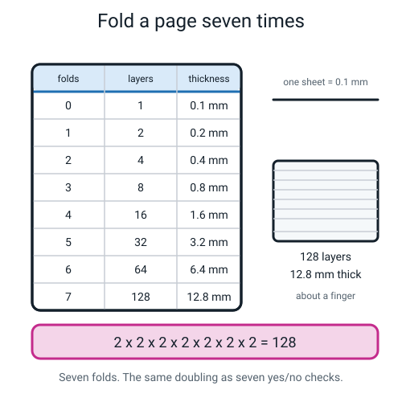
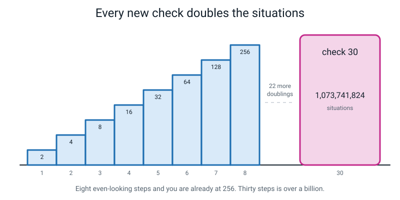
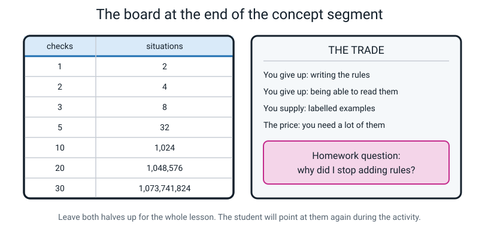
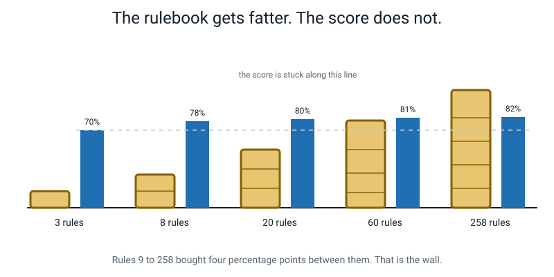
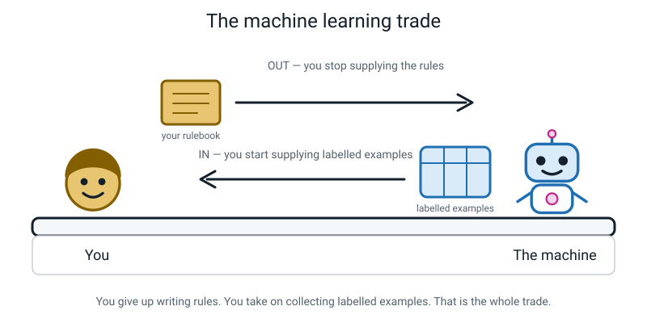
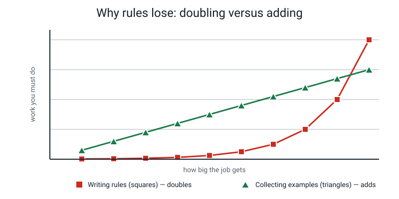
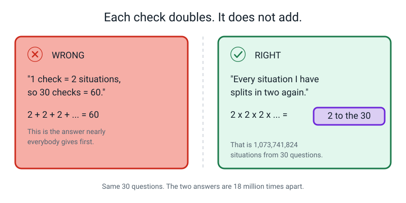
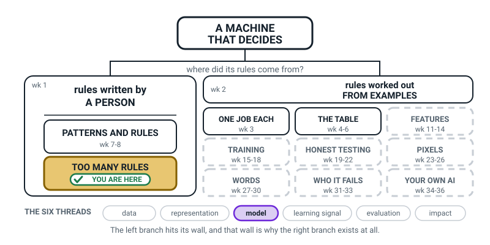
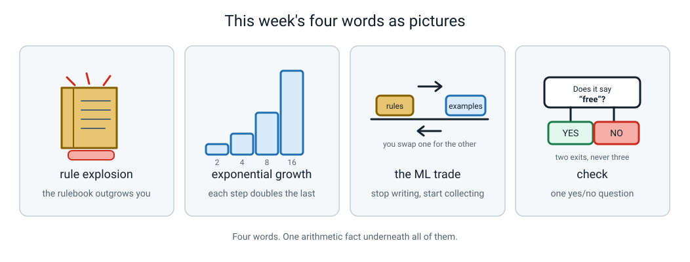

# Week 10 — The Rule Explosion: Why Nobody Writes 258 Rules

[⬅ Week 9](week-09.md) · [Course Home](../README.md) · [Week 11 ➡](week-11.md) · [Workbook](../workbook/week-10.md)

---

> ### This week in one sentence
> **Every yes/no question you add to a rulebook doubles the number of situations it has to cover — and doubling beats any human, every time.**
>
> **By the end of this chapter you will be able to:**
> - Fill in the doubling table from 1 check to 30 checks without being told a single number
> - Explain **rule explosion** in your own words, using a number you worked out yourself
> - State **the machine learning trade** — what you give up, and what you have to supply instead
> - Name one job you personally cannot write rules for, and say exactly where your rules broke
>
> **Reading time:** about 20 minutes. **Homework:** about 55 minutes.

---

## 🪝 Start Here

Take one sheet of paper. Any paper. A page from a notebook, a bill, a leaflet that came with the newspaper.

Fold it in half. Fold it in half again. Keep going. I want **eight** folds.

Go on. Actually do it. This chapter is much better if your hands have already found out the answer.

...

You got six, didn't you? Maybe seven, if you used the edge of a table and got a bit annoyed about it. Almost nobody gets eight.

Now here is the question that matters, and it is a genuinely strange one:

> **You didn't add anything to the paper.** No glue. No extra sheets. It is the same single sheet you started with. So where did the difficulty come from?


*Figure 10.1 — Seven folds. Nothing was added, and yet by the end you are trying to bend 128 sheets at once.*

Here is where. Every fold **doubled the number of layers**.

| Folds | Layers | Thickness (one sheet ≈ 0.1 mm) |
|---|---|---|
| 0 | 1 | 0.1 mm |
| 1 | 2 | 0.2 mm |
| 2 | 4 | 0.4 mm |
| 3 | 8 | 0.8 mm |
| 4 | 16 | 1.6 mm |
| 5 | 32 | 3.2 mm |
| 6 | 64 | 6.4 mm |
| 7 | 128 | 12.8 mm |

By fold 7 you were trying to bend a stack **128 sheets thick** — about the width of your finger — around a sharp corner. Of course your hands lost.

> **💡 Try this:** work out fold 8 before you read on. It is 256 layers, about 25.6 mm. That is thicker than your thumb. Now you know precisely why you failed.

The reason this matters is that the exact same arithmetic is about to defeat something much more serious than your fingers: **the whole idea of telling a computer what to do by writing rules.**

Hold that feeling in your fingers. It is the whole lesson.

---

## 🧠 The Big Idea

### 1. A check is a yes/no question — and each new one doubles your work

A computer program that just follows instructions is built out of **checks**.

> **Check** — one question with a yes/no answer.

Real checks from the spam rulebook you built in Weeks 7 to 9:

- Does this message contain the word "free"? — yes or no
- Does it have a link in it? — yes or no
- Is the sender in my contacts? — yes or no

**The analogy.** A check is a fork in a road. One fork gives you 2 places you might end up. Put a second fork on *each* of those roads and now there are 4 places. A third fork on each of those four, and there are 8. The forks don't add up. They multiply.

**The concrete version, with real numbers.** Write out every possible combination of just three checks:

| # | free? | link? | known sender? |
|---|---|---|---|
| 1 | no | no | no |
| 2 | no | no | yes |
| 3 | no | yes | no |
| 4 | no | yes | yes |
| 5 | yes | no | no |
| 6 | yes | no | yes |
| 7 | yes | yes | no |
| 8 | yes | yes | yes |

Eight rows. Three questions, eight different kinds of message you might be handed. And every one of those eight needs an answer from you — spam, or not spam.

Add a fourth check. Every one of those eight rows splits in two, because the new question can be answered either way. **8 becomes 16.** Add a fifth: 32.

There is a real name for this shape, and you should use it:

> **Exponential growth** — when a quantity doubles at every step. It starts slow, looks harmless, then defeats you.

Written short: **n checks give you 2ⁿ situations.** Say it out loud as "two to the power n". It is exactly the paper fold, wearing different clothes.


*Figure 10.2 — The steps look evenly spaced, and that is the trap. Eight steps in you are at 256. Thirty steps in you are past a billion.*

Look carefully at Figure 10.2. The steps are drawn **evenly**, on purpose, because that is how doubling feels from the inside: like steady, manageable progress. It isn't. From 3 checks to 30 checks you multiplied the number of *questions* by ten, and the number of *situations* went from 8 to 1,073,741,824.

### 2. The most surprising number in this chapter

This is the fact I want you to still know when you are thirty.

> Going from **29 checks to 30 checks** adds **536,870,912** brand-new situations.
>
> Every single one of checks 1 to 29, added up together, only ever created **536,870,911** situations.
>
> **Check 30, on its own, creates more new work than all twenty-nine checks before it, combined. By exactly one.**

Here is the working, so you can believe it rather than just be told it:

```
Before you ask any question at all, there is 1 situation ("nothing asked yet").

After 29 checks:   2^29 = 536,870,912 situations
So checks 1 to 29 created:  536,870,912 - 1 = 536,870,911

After 30 checks:   2^30 = 1,073,741,824 situations
So check 30 created:  1,073,741,824 - 536,870,912 = 536,870,912

536,870,912  is one more than  536,870,911.
```

And here is the part that makes it useful rather than just weird: **this is true at every single step.** Check 10 makes more work than checks 1 to 9 put together. Check 5 makes more work than checks 1 to 4 put together. Whatever step you are standing on, you are always only halfway.

**The analogy.** Imagine climbing a staircase where every step is as tall as the whole staircase you have already climbed. You will never be nearly at the top. You will always be exactly halfway, forever.

### 3. Where the number 258 comes from

The title of this week is not made up. Here it is:

```
8 yes/no checks                       ->  2^8 = 256 situations
a rulebook that covers all of them    ->  256 rules
plus one DEFAULT line ("otherwise...")       + 1
plus one line saying which rule wins first   + 1
                                          -----
                                           258 lines
```

**256 is the maths. 258 is the maths plus the two boring lines every rulebook needs.**

Now sit with how small eight is. You can hold eight questions in your head while walking to school. Eight is nothing. And eight has already produced a document longer than this chapter.


*Figure 10.3 — The two-column table that runs this whole week: checks on the left, situations on the right, doubling all the way down.*

**Real numbers for the boring part.** Suppose you are fast, and you can write one carefully-thought-out rule every 2 minutes. You work 8 hours a day, 250 days a year. How long to write the rulebook for **20** checks?

```
20 checks         = 1,048,576 situations
x 2 minutes each  = 2,097,152 minutes
/ 60              =    34,952.5 hours
/ 8 hours a day   =     4,369 working days
/ 250 days a year =      17.5 working YEARS
```

**Seventeen and a half years, no holidays, no sick days — for a system that checks twenty things.** And a real spam filter does not check twenty things. It looks at every word in the language, which is tens of thousands of checks.

That wall has a name, and it is this week's headline word:

> **Rule explosion** — the number of rules you need grows far faster than the number of cases you were trying to handle, until the rulebook becomes impossible for a human to keep.

### 4. Three ways a rulebook dies — and counting is only the first

If counting were the only problem, a rich company with a big enough team could just grind through it. Three other things make it hopeless.

| # | The problem | What it actually looks like |
|---|---|---|
| 1 | **You cannot write them all** | 20 checks is 17.5 working years, and 21 checks is 35 |
| 2 | **The rules start fighting each other** | Rule 12 says spam, rule 40 says not spam, same message — now you need a *second* rulebook about which rule wins |
| 3 | **The world changes underneath you** | You block "FREE", they write "FR33". You block "FR33", they write "F R E E" with spaces |

> **⚠️ Watch out:** number 3 is the one that finishes you. You can hire more people to fix number 1. You cannot hire anybody to stop the world changing. **A rulebook is frozen the moment you finish writing it, and the world is not.**

And there is a fourth thing, which you probably felt yourself while building your spam rulebook: **the rules stop paying.**


*Figure 10.4 — Rules 1 to 3 took you from guessing to 70%. Rules 9 to 258 — two hundred and fifty more rules — bought four points between them.*

Your first three rules are brilliant. They take you from guessing to about 70%. Rules 4 to 8 get you to 78. And then rules 9 through 258 — **two hundred and fifty more rules** — buy you four percentage points. Four.

That flat line next to that fat book is the wall. Everybody who has ever written rules has hit it.

### 5. The machine learning trade

So the rule-writer is stuck. Here is the deal that is on the table instead, and it is a genuine **trade** — both sides give something up.

> **The machine learning trade** — you stop writing the rules. Instead you collect **labelled examples** — the thing, with the correct answer written next to it — and the machine finds the rule for itself.

**The analogy: teaching someone to pick a ripe watermelon.**

- **Option A — write instructions.** "Knock it; if it sounds hollow it's ripe. Check the yellow patch. Check the stem is dry." You will write ten instructions and they will *still* pick badly, because the real skill lives in combinations nobody can put into words.
- **Option B — walk them through a market.** Point at sixty watermelons, one at a time, and say: "ripe… not ripe… ripe… not ripe." Say nothing else. No explaining. They will get good at it — and they will *still* not be able to tell you how they know.

**Option B is machine learning.** Notice both halves. You gained something that works on watermelons nobody ever described. You lost the ability to point at the reason.


*Figure 10.5 — A stack of rules goes across the counter one way. A crate of labelled examples comes back the other. That swap is the whole of machine learning.*

Both sides cost something. Here is the honest comparison:

| | Writing rules yourself | The machine learning trade |
|---|---|---|
| You provide | The rules | **Labelled examples** |
| Effort grows… | **by doubling** (with the checks) | **by adding** (one example at a time) |
| Can you explain a decision? | Yes — point at the rule | Usually not |
| The world changes? | Rewrite by hand | Add new examples, train again |
| Things it can look at | About 10 before you drown | Thousands, easily |
| Needs lots of data? | No | **Yes. This is the price.** |
| Will it be perfect? | No | No |

The row that decides the whole argument is **"effort grows by adding"**. Collecting example number 5,000 costs you exactly the same as collecting example number 5. Writing rule number 5,000 does not.


*Figure 10.6 — Both lines go up. Only one of them explodes.*

> **🧑‍🏫 If someone asks you:** "So machine learning means nobody has to work?" — no. **You swapped thinking for collecting.** Labelling 5,000 messages correctly is hours of dull, careful human work, and every mistake you make in it gets learned by the machine with perfect loyalty. Rule systems fail because humans can't think of everything. Learned systems fail because humans can't collect everything. Neither one is magic.

---

## 🔍 Worked Examples

### Worked Example 1 — Pizza night (food)

Your family is ordering pizza. There are **6 toppings** available and each one is a yes/no choice: cheese, onion, capsicum, corn, paneer, olives.

**Question A: how many different pizzas can you build?**

Each topping is a check with two answers — on, or off.

```
1 topping  : 2
2 toppings : 2 x 2 = 4
3 toppings : 4 x 2 = 8
4 toppings : 8 x 2 = 16
5 toppings : 16 x 2 = 32
6 toppings : 32 x 2 = 64
```

**64 different pizzas** from 6 toppings.

**Question B: the shop adds a seventh topping — mushroom. How many now?**

Not 65. Not 66. **Double it: 128.**

Why? Because every one of the 64 pizzas you could already make now comes in two versions — with mushroom and without. One new topping created 64 brand-new pizzas all by itself, which is more than toppings 1 to 6 created between them (they made 63: everything from the plain-base start of 1).

**Question C: the shop wants a printed price card with a line for every possible pizza. At 2 minutes a line, with 10 toppings, how long?**

```
10 toppings       = 2^10 = 1,024 pizzas
x 2 minutes       = 2,048 minutes
/ 60              = 34.1 hours
```

**Over 34 hours of typing** — for a menu with ten toppings on it. Now you know why real pizza shops print the toppings and a price *per topping* instead of listing every pizza. They found a shortcut. Notice what the shortcut costs, though: they can no longer give paneer-and-olive a special combo price, because there is no line for it.

### Worked Example 2 — Should we bat first? (sport)

Aarav is captain. He decides to write a rulebook for the toss, so he never has to think under pressure again.

**Round 1 — five checks.**

1. Is the pitch dry?
2. Is it cloudy?
3. Is dew expected in the evening?
4. Is the opposition's best bowler playing?
5. Are we chasing well this season?

```
5 checks = 2^5 = 32 situations
```

Thirty-two. That is a page. Aarav writes all 32 lines in an hour and he is delighted.

**Round 2 — the season goes on and he keeps finding things his rulebook got wrong.** So he adds five more checks: wind direction, whether the outfield is wet, whether the match is 20 overs or 50, whether their keeper is fit, and what time the match starts.

```
10 checks = 2^10 = 1,024 situations
```

**Question: how many extra situations did those five extra checks make?**

```
1,024 - 32 = 992 extra situations
```

Five more questions created **992** new situations — thirty-one times more than his original five made. His one-page rulebook needs to become a **thirty-two page** rulebook.

**Question: what does check 11 alone add?**

```
2^11 = 2,048
2,048 - 1,024 = 1,024
```

Check 11 by itself adds **1,024** — more than checks 1 to 10 created between them (1,023). Every single time.

**What Aarav should actually do.** Not write check 12. He should keep a notebook: for every match he has ever played, write down the conditions *and whether batting first turned out well*. That is a **labelled example**. Forty matches is forty examples. It took him no extra work at all — he was at the matches anyway.

### Worked Example 3 — Is this our school uniform? (school)

Priya's school wants an app that looks at a photo and says whether the person is wearing the correct uniform.

**Attempt 1 — write the rules.** She tries hard and writes five:

| # | Rule | The first thing that breaks it |
|---|---|---|
| 1 | `IF the shirt is white THEN uniform` | A plain white t-shirt at the weekend |
| 2 | `IF there is a navy skirt or navy trousers THEN uniform` | Navy jeans |
| 3 | `IF the school badge is visible THEN uniform` | A photo taken from behind |
| 4 | `IF black shoes THEN uniform` | Black shoes with a tracksuit |
| 5 | `IF a tie is present THEN uniform` | Sports day, when nobody wears a tie |

Each rule is sensible and each one breaks immediately. So she considers going bigger.

**How big?** Suppose she could get it right with 12 careful checks.

```
12 checks         = 2^12 = 4,096 situations
x 2 minutes each  = 8,192 minutes
/ 60              = 136.5 hours
/ 8 hours a day   = 17.1 working days
```

**Over three weeks of full-time work** — for a school app. And it would still break on the first thing she didn't think of, which this term is a sari-style uniform variant she has never photographed.

**Attempt 2 — the trade.** She stops writing rules. Instead:

```
300 photos, each with a yes/no answer written next to it
x 10 seconds to label each one
= 3,000 seconds
= 50 minutes
```

**Fifty minutes of labelling, against three weeks of rule-writing.** And the labelling is easier work — she is not *thinking*, she is just *answering*, which is a thing an 11-year-old can do accurately at speed.

**Now name the cost, because there always is one.** After the trade:

1. She cannot explain any single decision. When it says "not uniform" about a photo of her own brother, nobody on Earth can point at the reason.
2. She needed 300 photos. That is 300 real people, or 300 permissions, or both.
3. Every labelling mistake she made is now baked in permanently. If she was tired and mislabelled 20 photos, the machine learned those 20 as gospel.

**The final answer to "which is better?"** Neither, always. For this job, the trade is clearly worth it. For working out how much tax someone owes, it would be ridiculous — somebody already wrote those rules down in a law, so just implement the law.

---

## 🎲 What We Did In Class

Three things, in this order. If you missed the lesson, you can do all of it at a kitchen table.

### Part 1 — Fold It Seven Times (8 minutes)

Take one A4 sheet. Fold it in half as many times as you physically can. Count the folds, then fill in this table:

| folds | layers | how you got it |
|---|---|---|
| 1 | 2 | 1 × 2 |
| 2 | 4 | 2 × 2 |
| 3 | 8 | 4 × 2 |
| 4 | 16 | 8 × 2 |
| 5 | 32 | 16 × 2 |
| 6 | 64 | 32 × 2 |
| 7 | 128 | 64 × 2 |

Then answer the big one out loud: **how thick would the paper be after 30 folds?**

```
2^30 = 1,073,741,824 layers
x 0.1 mm  = 107,374,182.4 mm
          = 107,374.18 metres
          = about 107 kilometres
```

**One hundred and seven kilometres.** Higher than the edge of space, which is usually put at 100 km. From one sheet of paper, folded thirty times. Nothing was added.

### Part 2 — Count the Explosion (14 minutes)

Fill in a two-column table: `checks` down the left from 1 to 30, `situations` on the right. **Never multiply anything.** Just double the row above. If it gets hard, use a calculator: press `2`, `×`, `2`, then keep pressing `=`.

| checks | situations | | checks | situations | | checks | situations |
|---|---|---|---|---|---|---|---|
| 1 | 2 | | 11 | 2,048 | | 21 | 2,097,152 |
| 2 | 4 | | 12 | 4,096 | | 22 | 4,194,304 |
| 3 | 8 | | 13 | 8,192 | | 23 | 8,388,608 |
| 4 | 16 | | 14 | 16,384 | | 24 | 16,777,216 |
| 5 | 32 | | 15 | 32,768 | | 25 | 33,554,432 |
| 6 | 64 | | 16 | 65,536 | | 26 | 67,108,864 |
| 7 | 128 | | 17 | 131,072 | | 27 | 134,217,728 |
| 8 | **256** | | 18 | 262,144 | | 28 | 268,435,456 |
| 9 | 512 | | 19 | 524,288 | | 29 | 536,870,912 |
| 10 | 1,024 | | 20 | 1,048,576 | | 30 | **1,073,741,824** |

Four places worth stopping at:

- **Row 8 — 256.** So a rulebook is 256 rules, plus a default line, plus a line about which rule wins. **258.** That's the title.
- **Row 10 — 1,024.** Could you hold ten questions in your head? Easily. Could you write a thousand rules? No.
- **Row 20 — 1,048,576.** Over a million. This is the 17.5-years-of-work row.
- **Row 30 — 1,073,741,824.** Say it out loud: one billion, seventy-three million, seven hundred and forty-one thousand, eight hundred and twenty-four.

Then write in the margin: `check 30 alone = 536,870,912. Checks 1–29 together = 536,870,911.`

### Part 3 — Rulebook vs Reality: the reckoning (20 minutes)

This is the project you started in Week 7 and it finishes here.

**What you need:** your 20 labelled training messages, your 5 rules plus a default, and **the sealed envelope of 10 fresh messages** you have not looked at.

**Three rules, and they are the whole point:**

1. **You are the computer, not the judge.** You run the rules exactly as written. If a rule gives an answer you *know* is wrong, you write the wrong answer down anyway.
2. **You may not change a rule** — not one word — until all ten are scored. Spotted a fix? Write it in the margin and carry on.
3. **You write down which rule fired.** Not just the verdict — the rule *number*. A rule that gets the right answer for a stupid reason is not a good rule, and this column is the only way to catch it.

Then open the envelope and score all ten, first match wins, top to bottom:

| # | Message | First rule to fire | Verdict | Truth | ✓/✗ | Error type |
|---|---|---|---|---|---|---|
| 21 | Congratulations! You have WON a FREE holiday. Claim at [LINK] | 1 | spam | spam | ✓ | — |
| 22 | Your parcel could not be delivered. Update your address here [LINK] | 3 | spam | spam | ✓ | — |
| 23 | Are you free after school? | 1 | spam | ham | ✗ | false alarm |
| 24 | URGENT: your bank account is LOCKED. Verify now. | 5 | spam | spam | ✓ | — |
| 25 | Can you bring my maths book tomorrow? | 4 | ham | ham | ✓ | — |
| 26 | Dinner at 7 | DEFAULT | ham | ham | ✓ | — |
| 27 | You have been selected for a cash reward. Reply YES to claim. | DEFAULT | ham | spam | ✗ | miss |
| 28 | Match is cancelled, pitch flooded | DEFAULT | ham | ham | ✓ | — |
| 29 | WIN an iPhone! Just tap [LINK] before midnight | 2 | spam | spam | ✓ | — |
| 30 | Did you finish the science poster? I'm stuck on question 3 | 4 | ham | ham | ✓ | — |

*(Those are the model messages. Yours will be different — the shape of the result usually won't be.)*

Then the arithmetic:

```
Training accuracy = 19 correct out of 20 = 0.95 = 95%
Fresh accuracy    =  8 correct out of 10 = 0.80 = 80%
The gap           = 95 - 80 = 15 percentage points
False alarms      = 1   (message 23 — a real message marked spam)
Misses            = 1   (message 27 — spam that got through)
```

> **💡 Try this:** before you score, write down what you *think* your fresh score will be. Most people guess much too high. Being wrong here is the most useful thing that can happen to you all term.

**What almost always happens, and it is not bad luck:** the fresh score comes in 10 to 30 points below the training score, and **the rule that breaks first is your strongest rule.** It was strongest because it fitted your twenty training messages hardest — so it was the most tightly tuned to messages that no longer matter.

---

## 💬 Talk About It

Take these to a parent, a sibling or a friend. Their first answer is usually wrong in an interesting way.

**1. "If I fold a sheet of paper thirty times, how thick is it?"**
Let them guess before you tell them. Almost everyone says something between "a book" and "as tall as me".
*Hint for you:* the answer is 107 km, and the reason people get it so wrong is that the human brain naturally reaches for adding when the world is doubling. That bug is what makes rule explosion invisible until it's too late.

**2. "Name something you can do instantly but cannot explain how you do it."**
Recognising your mum's footsteps. Knowing a song is sad. Telling your own handwriting from a friend's.
*Hint for you:* every answer they give is a job where writing rules will fail and collecting examples will work. That is the sharpest test there is — **if you can do it instantly but can't explain it, stop writing and start collecting.**

**3. "Name three jobs where I would be an idiot to use machine learning."**
This one is harder than it sounds and it is the question that stops you turning this week into "rules are bad".
*Hint for you:* good answers are income tax, whether a chess move is legal, and a maximum safe drug dose. What they have in common is that **the correct answer was already written down by someone** — a parliament, a rulebook, a medical trial. Learning can only make a fuzzy copy of something already exact.

---

## ⚠️ Don't Get Tricked

### Trick 1 — "One more check adds one more situation"


*Figure 10.7 — The wrong answer and the right answer to the same question, 18 million apart.*

| ❌ Wrong | ✅ Right |
|---|---|
| "1 check gives 2 situations, so 30 checks give 60." | "Every situation I already have splits in two, so 30 checks give 2 × 2 × … thirty times = 1,073,741,824." |

This is not a silly mistake. It is the most natural mistake a human brain makes, and it is exactly why nobody saw the wall coming. If you catch yourself doing it, go back to the paper.

### Trick 2 — "A clever programmer would just write fewer, smarter rules"

| ❌ Wrong | ✅ Right |
|---|---|
| "You don't need 2ⁿ rules, so the problem goes away." | "You don't need 2ⁿ rules, so the wall moves from about 5 checks to about 10. It does not go away." |

This objection is **partly right**, and that's why it's dangerous. One rule really can cover a whole block of situations at once: `IF contains "free" THEN spam` settles four of the eight three-check situations in a single line, no matter what the other checks say. So a real rulebook *is* much smaller than 2ⁿ.

But the shortcut buys you a **bigger n**, not a different shape. It helps enormously at 10 checks and not at all at 20,000 — and a real spam filter needs to look at every word in the language.

### Trick 3 — "Rules are bad, machine learning is good"

| ❌ Wrong | ✅ Right |
|---|---|
| "Rules lost. Machine learning won." | "Rules win whenever a human already wrote the correct answer down. Learning wins when the answer only lives in people's ability to recognise something." |

Tax bands, chess legality, speed limits, safe drug doses — all rules, all correctly rules, all would be *worse* with machine learning. A 99.9% accurate dosage model kills one patient in a thousand. A comparison against a published safety limit is right by construction.

### Trick 4 — "So machine learning is less work"

| ❌ Wrong | ✅ Right |
|---|---|
| "You don't write rules, so it's easy." | "You swapped thinking for collecting. Thinking doesn't scale. Collecting does — but somebody still has to do it." |

Labelling five thousand messages is hours of dull work, and every mistake in it gets learned perfectly. You also give up the ability to explain any decision. That is not a small thing to lose.

---

## 🌍 Where You've Seen This

1. **Pizza and burger menus.** Nobody lists every possible combination. They list toppings and charge per topping — a shortcut that dodges the explosion and gives up combo pricing to do it.
2. **Spam folders on a phone.** In the 1990s these really were hand-written rulebooks, and they really did get beaten by people writing "FR33". Every one you use today learned from labelled examples instead.
3. **A school timetable.** Try writing rules that satisfy every teacher, room, class and lunch break. Every extra requirement doubles what has to be checked, which is exactly why timetabling is famously the worst job in the school.
4. **Password rules.** "At least 8 characters" sounds weak until you notice each extra character multiplies the possibilities. Doubling works *for* you here — it's the same maths, pointed the other way.
5. **Wordle or Guess Who.** Every question halves the possibilities. That's the doubling staircase running backwards, and it's why you can find one face out of 24 in five questions.
6. **Autocorrect and predictive text.** No human wrote a rule for "when I type 'gonig', mean 'going'". It learned from millions of labelled examples of what people typed and then fixed.

---

## 🧭 Where This Fits

Same tile as last week, and this is the week the left-hand branch runs out of road. You have spent ten
weeks in the room where a person writes the rules; today you counted how big that room would have to
get, and the answer is *too big*. Now look at all those dashed tiles on the right-hand side. By the
end of today you know exactly why every one of them has to exist.



*Figure 10.0 — The map after Week 10. The tinted tile is the wall: **too many rules**. It is the only
reason the nine tiles on the right-hand branch exist, and next week the year crosses over to them.*

| | |
|---|---|
| **The mental model you now own** | A check is a yes/no question, and **n** checks make **2ⁿ** situations — so a rulebook grows faster than the exceptions it is chasing. Eight checks, which is nothing at all, is 256 situations and **258** rulebook lines. That wall is the *only* reason the right-hand branch of this map exists. |
| **The one question it answers** | *"How many different situations would I have to write a line for?"* |
| **What it plugs into** | Week 9's repaired rulebook. You stopped adding rules that week; this week proves that was arithmetic, not laziness. |
| **What carries forward** | It hands the year straight back to the branch on the right. Week 11 begins the trade: stop writing rules, start collecting labelled examples. |
| **Spiral thread** | 📦 **Model**, on its own — one thread, because this week is one single idea about what a rulebook can and cannot ever be. |

> **💡 Try this:** on your copy of the map, draw a short arrow from the tinted tile across to the
> dashed FEATURES tile on the right, and write **the trade** along it. That arrow is the shape of the
> rest of your year.

---

## 🔑 Remember This

- **A check is a yes/no question. n checks give 2ⁿ situations.** That is the whole arithmetic of the week.
- **Check number n always adds more work than checks 1 to n−1 combined** — by exactly one. You are always only halfway.
- **8 checks = 256 situations = 258 rulebook lines**, and eight checks is nothing at all.
- **Rules die three ways:** you can't write them all, they contradict each other, and the world changes underneath them.
- **The machine learning trade:** stop writing rules, start collecting labelled examples. You gain reach; you lose the explanation and you owe a lot of data.
- **Rules still win** whenever the correct answer was already written down by a person.

---

## 📓 New Words


*Figure 10.8 — This week's four words, drawn.*

| Word | What it means | Example |
|---|---|---|
| **check** | One question with a yes/no answer | "Does this message contain the word 'free'?" |
| **exponential growth** | When a quantity doubles at every step | Paper layers: 1, 2, 4, 8, 16, 32, 64, 128 |
| **rule explosion** | The rules you need grow far faster than the cases you were handling, until no human can keep the rulebook | 8 checks needs 258 lines; 20 checks is 17.5 years of writing |
| **the machine learning trade** | You give up writing rules, and supply labelled examples instead | 50 minutes labelling 300 uniform photos, instead of 3 weeks writing 4,096 rules |

One word from an earlier week that did a lot of work today, in case you want to check it:

| Word | Quick reminder |
|---|---|
| **labelled example** *(Week 8)* | One thing with the correct answer written next to it — a message with `spam` written beside it |

---

## 📤 Your Homework

Go to **[the Week 10 workbook](../workbook/week-10.md)**. About **55 minutes** in total.

| Page | What to do | Time |
|---|---|---|
| **10.3** | Write down the trade in your own handwriting: what you give up, what you supply, how many you'd need, what it costs | 10 min |
| **10.4** | Finish scoring the ten fresh messages. Write the fresh score **as a fraction and as a percentage**. Count false alarms and misses **separately** | 15 min |
| **10.5** | One page: **"Why I stopped adding rules."** It must name which rule broke first and on which exact message, say whether that rule was one of your strongest, and say what you'd do next — and "add more rules" is not allowed | 20 min |
| **10.6** | **The unwritable rule.** Try to write if-then rules for "is this a photo of a cat". Five real rules, not silly ones. Then, for each one, find a real thing it gets wrong, and record **which rule broke first** | 20 min |

> **⚠️ Watch out:** on page 10.6 you are *supposed* to fail. Failing carefully is the homework. A page that says "rule 1 broke on a photo of a German Shepherd, because plenty of dogs have pointed triangular ears" is worth far more than a page that claims five rules worked.

---

[⬅ Week 9](week-09.md) · [Course Home](../README.md) · [Week 11 ➡](week-11.md) · [📓 Workbook — Week 10](../workbook/week-10.md) · [Glossary](../../glossary.md)
