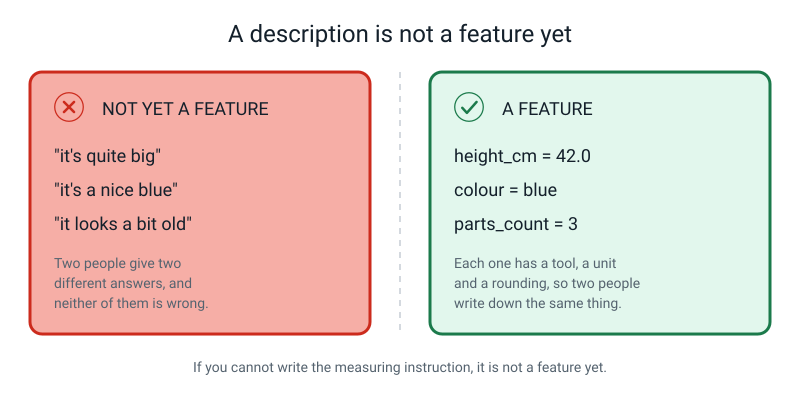
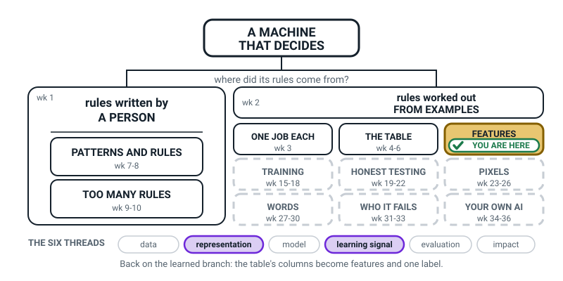
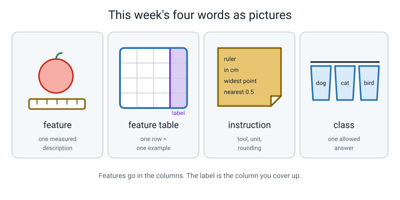

# Week 11 — How a Machine Describes Your Dog

[⬅ Week 10](week-10.md) · [Course Home](../README.md) · [Week 12 ➡](week-12.md) · [Workbook](../workbook/week-11.md)

---

> ### This week in one sentence
> **A machine never meets your dog — it only ever meets a row of measurements, and everything you didn't measure does not exist.**
>
> **By the end of this chapter you will be able to:**
> - Turn a real physical object into a row of measured **features**
> - Write a **measuring instruction** precise enough that a different person gets your exact number
> - Point at any table and say which columns are features and which one is the **label**
> - Explain why a machine cannot use a description that has not been measured
>
> **Reading time:** about 20 minutes. **Homework:** about 50 minutes.

---

## 🪝 Start Here

In this section you try describing a lost bag with words only.

Your school bag has gone missing.

Someone is going to make a poster and stick it up around the school. But there is a problem: there's no photo of your bag. The poster can only have **words** on it. So — tell them what to write.

Most people say something like this:

> *It's blue. It's quite big. It's got a bottle on the side. It looks a bit old.*

Now be the stranger. You are standing in the lost property room. There are **forty bags** in front of you and that poster in your hand. Let's see how you get on.

| What the poster says | What you can actually do with it |
|---|---|
| "It's blue" | Eleven of the forty bags are blue. Narrows it a bit. |
| "It's quite big" | Bigger than **what**? Compared to the tiny ones, most of them are big. Useless. |
| "It's got a bottle on the side" | **This one works.** Three bags have a bottle. You can use this. |
| "It looks a bit old" | Every bag in a lost property room looks a bit old to somebody. Useless. |

**Out of four things you were told, exactly one was usable.**

And here's the thing: you were not being vague on purpose. That is genuinely how people describe things to each other, and it works fine — because a human can ask "big *how*?" and you'd show them with your hands.

**A machine cannot ask.** It gets the poster and that is it.


*Figure 11.1 — On the left, the real object with everything about it. On the right, the four numbers somebody chose. That right-hand side is the machine's entire universe.*

So this week is about writing the version of that poster that actually works. And the technical name for one usable line on the poster is a **feature**.

---

## 🧠 The Big Idea

This section explains five ideas: feature, label, class, measuring instruction and feature table.

### 1. A feature is one *measured* description

> **Feature** — one measured description of one example. One column in your table.

The whole weight of that definition sits on the word **measured**.

- "Weighs 340 grams" — that's a feature.
- "Quite heavy" — that is **not a feature at all.** Not a weak one. Not a vague one. Not one.

It becomes a feature the second you turn it into either **a number with a unit** or **one word chosen from a short fixed list**.

**The analogy: the missing-person poster.** A police poster can't show you the person. It shows *chosen* features: height 165 cm, hair black, blue jacket, aged about 30. Everyone in the city now knows exactly four things about that person.

Now suppose the poster leaves off "walks with a limp". Then **nobody in the entire city can use the limp** — no matter how obvious it would be in real life, no matter how much it would have helped. The limp isn't hidden. It is not *there*.

**The concrete version.** Here is an apple on the table. Right now you can take in about a million things about it: the exact shade, whether it's cold, that little mark near the stem, whether it smells good, whether you want to eat it.

Now measure four things:

| feature | value |
|---|---|
| `mass_g` | 152 |
| `longest_cm` | 8.0 |
| `colour` | red |
| `skin` | smooth |

That row is now **the apple**, as far as a machine is concerned. Not "most of the apple". Not "the important bits". *The apple.* The smell isn't less important to the machine — it doesn't exist, because nobody wrote it down.


*Figure 11.2 — The same bag, described twice. Only one of these descriptions can be used by anything.*

### 2. The label is the answer you want back — and it is a *choice*

> **Label** — the answer you want the machine to give you. In your table it is one special column: the one you cover up.

**The analogy: a flashcard.** A flashcard has a front (a picture of a plant) and a back (`fern`). You study by looking at the front and trying to produce the back. That is exactly, and genuinely, what a machine learning system does — a few million times, without ever getting bored.


*Figure 11.3 — One row is one animal. The paper flap covers the answer. Which column the flap goes over is a decision you make.*

Here is the part that catches adults out. **The label is not a special *kind* of column.** It is just whichever column you decided to cover.

Look at this table of school days:

| sleep_hours | screen_minutes | homework_minutes | mood_1to5 | felt_tired |
|---|---|---|---|---|
| 8.5 | 40 | 45 | 4 | no |
| 5.0 | 180 | 20 | 2 | yes |
| 7.0 | 90 | 60 | 4 | no |
| 5.5 | 150 | 30 | 2 | yes |

- Ask **"will I feel tired tomorrow?"** → `felt_tired` is the label. The other four are features.
- Ask **"what will my mood be?"** → `mood_1to5` becomes the label, and `felt_tired` demotes itself to being just another feature.

**Same table. Different question. Different label.** Nothing about the numbers changed. Only your question changed.

> **🧑‍🏫 If someone tells you the label is always the last column:** it usually is, but only because it's a tidy habit. Move it to the front and the table works identically. We put it last so that future-you, reading this table in three weeks, remembers which column was the answer.

### 3. A class is one of the answers the label is allowed to be

> **Class** — one of the possible answers the label is allowed to be.

If the label is `animal` and the only allowed answers are `dog` and `cat`, there are **two classes**. If the label is `fruit` and the allowed answers are apple, orange and banana, there are **three classes**.

That's all it means. But it matters for one genuinely startling reason:

> **A machine can only ever answer with a class you gave it.**

Build a dog-or-cat machine and show it a rabbit. It will say "dog" or "cat" — it has no other answer to give, and nothing in the machine can say "that's a rabbit". Show a three-class fruit model a lime and it will name an apple, an orange or a banana.

It is not being stupid. **There is no rabbit box, and you are the one who didn't make one.**

### 4. A measuring instruction is the sentence everybody skips

This is the heart of the week, and it is the bit that feels like boring admin and absolutely is not.

**The concrete version, with real numbers.** You and I both measure the same apple. We both write down `length_cm`.

- You write **7**.
- I write **9**.

**Which of us measured it wrong?**

Neither of us. You measured top to bottom. I measured across the widest point. We both did it perfectly carefully.


*Figure 11.4 — Two people, one apple, two numbers. Then the same two people, one written sentence, one number.*

The problem is not us. **The problem is that nobody wrote down what `length_cm` means.**

So the fix isn't "be more careful". The fix is to write the sentence. It looks like this:

```text
longest_cm    ruler across the widest point, nearest 0.5 cm
```

Now we both get **8.5**, and the column means something.

> **Measuring instruction** — the exact wording that says how a feature is measured, so that two different people get the same number.

A good instruction names three things:

| Part | Bad | Good |
|---|---|---|
| **The tool** (or a fixed list) | "measure the mass" | "kitchen scale" |
| **The unit** | "measure the mass" | "in grams" |
| **The rounding** | "measure the mass" | "nearest gram" |

Put them together: `mass_g — kitchen scale, dry and empty, nearest gram`.

And here is the test, which you should hold your teacher to for the rest of the year:

> **An instruction is only good if a different person, following it, gets your number.** Not if it sounds good. Not if you think it's clear. If they get a different number, you don't argue with them — **you go and rewrite the sentence.**

> **⚠️ Watch out:** if `length_cm` means "longest side" in row 3 and "widest side" in row 7, that column is **nonsense**, even though it looks perfectly fine. A table full of tidy numbers measured inconsistently is *worse* than no table at all, because it looks trustworthy.

### 5. Put the rows together and you get a feature table

> **Feature table** — a table where every row is one example, most columns are features, and exactly one column is the label.


*Figure 11.5 — Objects on the left, rows on the right. Three objects, three measurements each: nine values, and that is the machine's whole world.*

Three rules make a feature table honest. You will break all three at least once, and so does everybody:

1. **One row = one example.** If the same apple appears twice, you have secretly told the machine that this apple matters twice as much as the others.
2. **Every row is filled in the same way.** This is the measuring-instruction rule again, and it is the one that gets broken silently.
3. **The label column goes last, and you say out loud which one it is.** Write it down. Two weeks later, a column called `score` could mean absolutely anything.

---

## 🔍 Worked Examples

This section works through three examples: an apple, a dog and a homework table.

### Worked Example 1 — Turning an apple into a row (food)

**The job:** build a machine that says whether a piece of fruit is an apple, an orange or a banana.

**Step 1 — write the label question first.** Before touching anything, write this:

```text
label question: apple / orange / banana?
classes: 3  (apple, orange, banana)
```

**Step 2 — write the measuring instructions.** Not the measurements. The *instructions*. Write these four lines:

```text
f1  mass_g       kitchen scale, dry, nothing else on the scale, nearest gram
f2  longest_cm   ruler along the longest straight line between any two
                 points on the fruit, nearest 0.5 cm
f3  colour       ONE of: red / orange / yellow / green / brown
f4  skin         ONE of: smooth / bumpy / ridged
```

**Step 3 — measure three pieces of fruit.**

| id | mass_g | longest_cm | colour | skin | **fruit** |
|---|---|---|---|---|---|
| 1 | 152 | 8.0 | red | smooth | **apple** |
| 2 | 198 | 8.0 | orange | bumpy | **orange** |
| 3 | 121 | 19.0 | yellow | smooth | **banana** |

**Step 4 — check your work by covering the answer.** Put your hand over the last column and read row 3: *121 grams, 19 centimetres long, yellow, smooth.* Could you guess banana? Instantly.

Now read row 1 and row 2 with your hand still over the answers: *152 g, 8.0 cm, red, smooth* versus *198 g, 8.0 cm, orange, bumpy*. Harder, but doable — colour and skin are carrying it, because `longest_cm` is identical for both.

**Step 5 — name what you threw away.** Taste. Smell. Who bought it. Whether it's bruised on the back. Whether it's cold. All gone. Not "less important" — *gone*.

> **💡 Try this:** count the values in row 1. Four numbers and words. That is the machine's entire knowledge of that apple. Four.

### Worked Example 2 — Six features of one dog (pets)


*Figure 11.6 — Six measurements, called out with leader lines. Everything else about this dog is not in the table.*

Somebody measured a real dog. Here is the row:

| mass_g | shoulder_cm | ear_cm | coat | white_paws | tail_cm | **animal** |
|---|---|---|---|---|---|---|
| 12,400 | 46 | 14 | brown | 2 | 31 | **dog** |

Six numbers and one word. Now notice three things about it.

**Thing 1 — every single one has a hidden instruction you'd have to write.**

| feature | the question nobody answered |
|---|---|
| `mass_g` 12,400 | Standing on the scale, or held by a person standing on the scale? Before or after dinner? Wet or dry? |
| `shoulder_cm` 46 | Floor to *where*? Top of the shoulder blade is the standard — measure to the top of the head and you get a completely different number for the same dog |
| `ear_cm` 14 | From where the ear joins the head, or from the top of the head? Ear flat, or standing up? |
| `coat` brown | Brown out of *which list*? If the list is {black, brown, white} this dog is brown. If it's {black, chocolate, tan, cream, white} it might be tan |
| `white_paws` 2 | Does a paw that is half white count? |
| `tail_cm` 31 | With or without the fur on the end? |

Six features, **six sentences** you'd have to write before anyone else on Earth could reproduce your numbers.

**Thing 2 — name what's missing.** Breed. Name. Age. Whether it's friendly. Its bark. Its smell. Whether it likes you.

None of those exist for the machine. And notice — they were not lost by accident and they are not unimportant. **Somebody chose six things, and everything else fell off the poster.**

**Thing 3 — add a second row and a table appears.** Invent a cat:

| id | mass_g | shoulder_cm | ear_cm | coat | white_paws | tail_cm | **animal** |
|---|---|---|---|---|---|---|---|
| 1 | 12,400 | 46 | 14 | brown | 2 | 31 | **dog** |
| 2 | 4,200 | 24 | 6 | grey | 0 | 26 | **cat** |

Six feature columns, one label column, two rows because two animals. That is a **feature table**.

**Now break it on purpose.** Add a Chihuahua:

| id | mass_g | shoulder_cm | ear_cm | coat | white_paws | tail_cm | **animal** |
|---|---|---|---|---|---|---|---|
| 1 | 12,400 | 46 | 14 | brown | 2 | 31 | **dog** |
| 2 | 4,200 | 24 | 6 | grey | 0 | 26 | **cat** |
| 3 | 2,000 | 20 | 8 | tan | 0 | 15 | **dog** |

Look at rows 2 and 3. **The cat is bigger and heavier than the dog.**

Nothing here is wrong. Every number was measured properly. The world is just genuinely like this, and the table is being honest about it. This does not get solved today — it comes back in Weeks 12, 16 and 21.

### Worked Example 3 — What is the label? (school)

Same table, three different questions. The table is a record of homework hand-ins:

| id | minutes_spent | pages_written | handed_in_on_time | mark_out_of_20 |
|---|---|---|---|---|
| 1 | 45 | 2 | yes | 16 |
| 2 | 15 | 1 | yes | 9 |
| 3 | 90 | 4 | no | 18 |
| 4 | 30 | 2 | yes | 13 |

**Question A: "will this homework be handed in on time?"**

| Features | Label | Classes |
|---|---|---|
| `minutes_spent`, `pages_written`, `mark_out_of_20` | `handed_in_on_time` | 2 — yes, no |

**Question B: "what mark will this homework get?"**

| Features | Label | Classes |
|---|---|---|
| `minutes_spent`, `pages_written`, `handed_in_on_time` | `mark_out_of_20` | Not a short list — any number from 0 to 20 |

Notice what just happened: `handed_in_on_time` **stopped being the label** and became just another feature. It didn't change. Your question did.

**Question C: "how long will this homework take me?"**

| Features | Label | Classes |
|---|---|---|
| `pages_written`, `handed_in_on_time`, `mark_out_of_20` | `minutes_spent` | Not a short list — a number of minutes |

**Same twelve numbers, three completely different machines.** The only thing that changed each time was which column you put the flap over.

> **⚠️ Watch out:** Question C has a hidden problem, and it's a good one to notice now — at the moment you actually want to know "how long will this take me?", you have not written the pages yet and you don't have a mark. Those two features won't exist when you need them. That exact problem is next week's entire lesson.

---

## 🎲 What We Did In Class

This section has two activities. You can repeat both at home.

### Part 1 — Describe It Down the Phone (8 minutes)

You can play this at home with anybody.

**Setup:** one person hides a small, ordinary object behind a book or in a box. Good objects: a stapler, a mug, a TV remote, an orange, scissors, a roll of tape.

**The rules:** the guesser can only ask about things that can be **measured**. Exactly four kinds of question are allowed:

1. What is its **mass in grams**?
2. What is its **longest dimension in centimetres**?
3. How many **separate parts** does it have?
4. What **colour** is it, from this list? — red · orange · yellow · green · blue · black · white · grey · brown · silver

Ask anything else — *is it nice? is it useful? what's it for? is it heavy?* — and the answer is **"not measurable"**, and it costs you a question.

**You get five questions, then one guess.** Then swap roles.

**Example round:**

| # | Question | Answer |
|---|---|---|
| 1 | Mass in grams? | 118 g |
| 2 | Is it useful? | **not measurable** — that cost you a question |
| 3 | Longest dimension? | 17.0 cm |
| 4 | Separate parts? | 2 |
| 5 | Colour from the list? | black |

Guess: *a pair of scissors.* (It was a TV remote — 2 parts because the battery cover comes off.)

**The debrief — don't skip it.** Two questions:

- **Which question was most useful?** Usually `parts_count` or `longest_cm`, because they cut the possibilities furthest. `mass_g` is often the *least* useful early on, because almost every household object is somewhere between 50 g and 500 g.
- **Which question did you want to ask and weren't allowed?** Write it down. Then: **could we turn it into a measurable one?** "Is it sharp?" → yes: `does it have an edge that cuts paper, yes or no`. "Is it useful?" → no. That's an opinion about you, not a fact about the object.

### Part 2 — Three Objects Into Three Rows (12 minutes)

**Pick three objects that are annoyingly similar.** Three spoons — a teaspoon, a dessert spoon, a serving spoon — is the best set there is. Three wildly different things (a spoon, a book, a shoe) make the exercise trivial and teach you nothing.


*Figure 11.7 — The finished sheet. The grey instruction lines are the part everyone skips and they are the actual lesson.*

**Step 1 — the label question, before anything else.**

```text
label question: teaspoon / dessert spoon / serving spoon?
```

**Step 2 — the four measuring instructions. Written before you touch the ruler.**

```text
FEATURE SHEET
label question: teaspoon / dessert spoon / serving spoon?

f1  mass_g        kitchen scale, dry and empty, nearest gram
f2  longest_cm    ruler, tip of handle to tip of bowl, nearest 0.5 cm
f3  parts_count   count the pieces that come apart without breaking it
f4  colour        ONE of: red / orange / yellow / green / blue / black /
                  white / grey / brown / silver
```

**Step 3 — measure. Twelve values, no blanks.**

| id | mass_g | longest_cm | parts_count | colour | **label** |
|---|---|---|---|---|---|
| 1 | 24 | 13.0 | 1 | silver | **teaspoon** |
| 2 | 41 | 18.0 | 1 | silver | **dessert spoon** |
| 3 | 96 | 27.5 | 1 | silver | **serving spoon** |

**Step 4 — the re-measure test. This is the part that's actually assessed.**

Hand your **feature sheet** and **one object** to another person. Turn your table face down so they can't see your numbers. They measure all four features using only what you wrote — and they should be a **literalist**, not a helper. If your sentence says "measure the length", they should measure the shortest thing they can defend calling a length.

Then compare. For every disagreement, the question is never "who was wrong" — it's **"which sentence do we need to change?"**

A real mismatch, and the fix:

| feature | mine | theirs | why | rewritten instruction |
|---|---|---|---|---|
| `longest_cm` | 18.0 | 17.0 | They measured to where the bowl starts curving; I measured to the very tip | "ruler, tip of handle to **the furthest point of the bowl**, nearest 0.5 cm" |

**What "finished" looks like:** the label question written first · four instructions in your own handwriting, each with a tool-or-list, a unit and a rounding · twelve measurements, no blanks · at least **three of four** re-measurements matching · every failed instruction rewritten and re-tested.

> **💡 Try this:** all three of your spoon rows say `1` for parts and `silver` for colour. Every row identical. Is that column doing anything for you at all? Hold that thought — next week you'll settle it with numbers instead of opinions.

---

## 💬 Talk About It

Use these questions to talk through the week's ideas with someone.

**1. "Two people measured the same apple. One got 7 cm, one got 9 cm. Which one measured it wrong?"**
*Hint for you:* neither. One measured top to bottom, one measured across the widest point. The right answer is that the *instruction* was missing, not that a person was careless. Ask them what you should fix — the person or the sentence.

**2. "Name something important about you that nobody could write a measuring instruction for."**
*Hint for you:* good answers are how kind you are, how much your friends trust you, how funny you are. Then push one level deeper: **is it impossible because no instrument exists yet, because it's private, or because it's a feeling nobody can score?** Those are three genuinely different reasons and mixing them up causes real trouble later.

**3. "I've built a machine that says dog or cat. I show it a rabbit. What does it say?"**
*Hint for you:* it says dog or cat, confidently, every time. If they say "it'll say it doesn't know" — lovely instinct, and wrong. It would need a box called "I don't know", and nobody made one. **A machine can only answer with a class you gave it.**

---

## ⚠️ Don't Get Tricked

These are four wrong ideas that sound right, each with the right idea beside it.

### Trick 1 — "The machine sees the photo of my dog"

| ❌ Wrong | ✅ Right |
|---|---|
| "I show it a picture of my dog, so it sees my dog." | "It sees the row I built: six values. That row is its whole universe." |

This one is very sticky, because *you* see the dog, so the dog feels like the input. The cure is physical: write the row out and **count the values in it.** Six. That count is the machine's entire knowledge.

And if you object "but real AI really does look at photos" — you're right, and the honest answer is good: **a photo also becomes a table.** It just has thousands of columns instead of six, one per tiny dot of colour. That's Week 23.

### Trick 2 — "A description is a feature"


*Figure 11.8 — The two-panel test. Left panel: nothing here can be used. Right panel: everything can.*

| ❌ Wrong | ✅ Right |
|---|---|
| "It's quite big" is a feature — just a weak one. | "It's quite big" is **not a feature at all** until it becomes `height_cm = 42.0`. |

Use this rule mechanically, on yourself: **if you cannot write the measuring instruction, it is not a feature yet.** Every adjective must become either a number with a unit or one word from a short fixed list.

### Trick 3 — "The label is always the last column"

| ❌ Wrong | ✅ Right |
|---|---|
| "`animal` is the label because it's on the end." | "`animal` is the label because it's the column I chose to cover up. Ask a different question and a different column becomes the label." |

Test yourself: take the dog table and cover `mass_g` instead. Now you're asking "how heavy is a brown animal with 14 cm ears and 2 white paws likely to be?" — and `animal` has quietly become just another feature.

### Trick 4 — "This isn't AI, it's just measuring stuff"

| ❌ Wrong | ✅ Right |
|---|---|
| "Measuring spoons is not artificial intelligence." | "Correct, and in Week 17 you'll train a real model — and the thing that decides whether it works won't be the model. It'll be this table." |

Every professional who builds these systems will tell you the same thing: **the table decides everything.** A brilliant model on a badly measured table usually loses to a simple model on an honest one.

---

## 🌍 Where You've Seen This

Features and labels turn up in places you already know.

1. **A doctor's appointment.** Height, mass, temperature, blood pressure — four features, each with a strict measuring instruction, which is exactly why they use the *same* instrument and the *same* method every visit.
2. **A missing pet poster on a lamp post.** Breed, colour, size, collar, name. Whatever the owner left off, the whole neighbourhood is now unable to use.
3. **Your report card.** Every subject is a column, every term is a row, and there's a label column at the end called *grade*. It is a feature table and you've been living in one for years.
4. **A cricket scorecard.** Runs, balls faced, fours, sixes, strike rate. Nobody puts "played beautifully" in a column, because two commentators would disagree and there'd be no way to settle it.
5. **Online shopping filters.** Size, colour, price, brand, rating. You can only filter by things somebody measured. If nobody recorded "comfortable", you cannot search for it — no matter how much you'd like to.
6. **A recipe.** "200 g flour, oven 180 °C, 25 minutes" versus "some flour, a hot oven, until it looks done." One of those is a set of measuring instructions and the other is why your first cake failed.

---

## 🧭 Where This Fits

The year crosses over. For ten weeks you have been in the left-hand room writing rules by hand, and
the wall you hit last week is the reason you are now standing on the right-hand branch, where the
rules get worked out from examples instead. Everything on the left is white now — finished. This is
the third of nine tiles over here, and those nine tiles are what the rest of your year is made of.



*Figure 11.0 — The map after Week 11. The whole left-hand room is white and done. The tinted tile is
on the learned branch — week one of four on FEATURES — and the six dashed tiles below it are the rest
of the year.*

| | |
|---|---|
| **The mental model you now own** | A machine never meets the thing; it only ever meets the **row**. A **feature** is one *measured* description with a repeatable instruction behind it, and the **label** is the column you cover up and ask the machine to hand back. |
| **The one question it answers** | *"What did I actually measure, and which column am I asking the machine for?"* |
| **What it plugs into** | Week 4's rows and columns, plus the trade you agreed to in Week 10. This is what "collect labelled examples" looks like when somebody actually has to do it. |
| **What carries forward** | These are the features a total stranger has to work from in Week 14, and the ones you hold up against a baseline in Week 12. |
| **Spiral thread** | 🏷️ **Representation** — the shape somebody squeezes the world into — and 🎯 **Learning signal**, because the label column is the only thing telling a machine what "right" means. |

> **💡 Try this:** on your own copy of the map, find the tile you are standing on and then say out loud
> where you came from: *"I'm on the right-hand branch now, and I came here because eight checks is 258
> rules."* That one sentence is the first ten weeks of this course.

---

## 🔑 Remember This

These are the points to keep from this week.

- **A machine never meets the real thing. It only ever meets the row.** Everything you didn't measure does not exist for it.
- **A feature is one *measured* description.** No measurement, no feature — not a weak one, none.
- **The label is the answer you want back**, and it's whichever column you decided to cover up. Change the question, change the label.
- **A class is one allowed answer.** A machine can only ever reply with a class you gave it, so a dog-or-cat machine will call a rabbit a dog or a cat — never a rabbit.
- **A measuring instruction names a tool (or a fixed list), a unit, and a rounding** — and the only test that counts is whether a different person gets your number.
- **One row = one example. Every row measured the same way. Say which column is the label.**

---

## 📓 New Words

These are this week's words and what they mean.


*Figure 11.9 — This week's four words, drawn.*

| Word | What it means | Example |
|---|---|---|
| **feature** | One measured description of one example — one column | `mass_g = 24` for a teaspoon |
| **feature table** | A table where every row is one example, most columns are features, and exactly one is the label | Three spoons × four features + a label column |
| **measuring instruction** | The exact wording saying how a feature is measured, so two people get the same number | "ruler, tip of handle to tip of bowl, nearest 0.5 cm" |
| **class** | One of the answers the label is allowed to be | The classes of `fruit` are apple, orange, banana |

And one word from Week 2 that this week sharpens into something you can point at:

| Word | Quick reminder |
|---|---|
| **label** *(Week 2, sharpened here)* | The answer you want the machine to give back — and in a feature table, it is exactly the column you cover up: `teaspoon` / `dessert spoon` / `serving spoon` |

---

## 📤 Your Homework

This is your practice for the week.

Go to **[the Week 11 workbook](../workbook/week-11.md)**. About **50 minutes** in total.

| Page | What to do | Time |
|---|---|---|
| **11.4** | **The kitchen table.** Five kitchen objects that are similar enough to be confusable — five spoons, five bottles or five mugs. Five feature columns plus a label column. **Write the measuring instruction for every column before you measure anything.** Five instructions, five objects, twenty-five values, no blanks | 25 min |
| **11.5** | **The test.** Take your feature sheet and **one** object to an adult. Do not show them your numbers. Have them measure all five features using only what you wrote. Record their five numbers next to yours, and for every mismatch write the new wording that would fix it | 15 min |
| **11.6** | Six vague descriptions to turn into real measuring instructions — and one of the six cannot be converted honestly. Find it and say why | 10 min |

> **⚠️ Watch out:** on page 11.5 you are **not** trying to score five out of five. You're trying to find out which of your sentences was sloppy. A mismatch is a **result**, not a failure. If you get five out of five on the first try, ask yourself honestly: did they measure it, or did they see your number first?

---

[⬅ Week 10](week-10.md) · [Course Home](../README.md) · [Week 12 ➡](week-12.md) · [📓 Workbook — Week 11](../workbook/week-11.md) · [Glossary](../../glossary.md)
