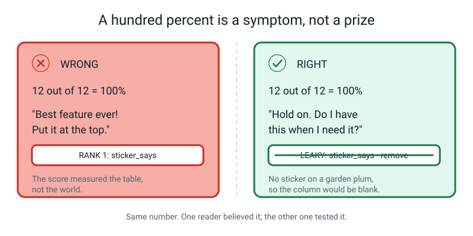
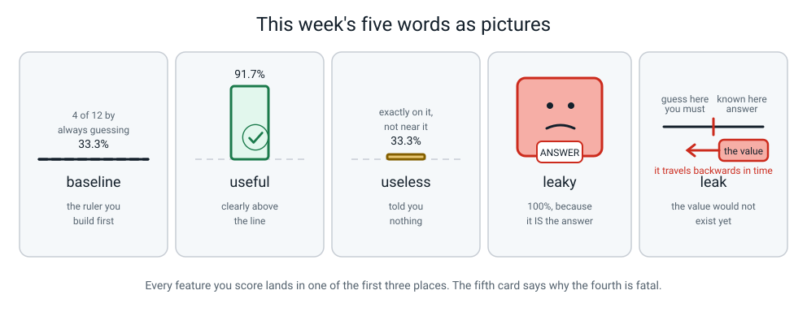

# Week 12 — Useful, Useless, and Sneaky Features

[⬅ Week 11](week-11.md) · [Course Home](../README.md) · [Week 13 ➡](week-13.md) · [Workbook](../workbook/week-12.md)

---

> ### This week in one sentence
> **A feature is only worth having if it beats guessing — and a feature that scores 100% is usually the answer wearing a disguise.**
>
> **By the end of this chapter you will be able to:**
> - Compute the **baseline** for any table by counting the labels and taking the most common one
> - Score a single feature by counting, and write the score as a fraction *and* a percentage
> - Rank features as **useful**, **useless** or **leaky** using numbers instead of feelings
> - Spot a **leak** in three seconds by asking whether you'd actually have that value when you need it
>
> **Reading time:** about 20 minutes. **Homework:** about 50 minutes.

---

## 🪝 Start Here

I have built something and I want to show off.

I have invented a machine that tells you whether it is raining outside, and it is right **one hundred percent of the time**. Not ninety. Not ninety-nine. A hundred. I have tested it on the last thirty days and it has never once been wrong.

How much do you reckon that's worth?

Want to know how it works? It's very simple. It checks one thing:

> **Is my umbrella wet?**

If the umbrella's wet, it's raining. If it's dry, it isn't. Thirty days, thirty correct answers.

Now tell me what's wrong with my invention.

...

You've got it, haven't you.

**The umbrella only gets wet *after* I've already been out in the rain.**

So picture the actual moment I need this machine. I'm standing at the front door. Coat, or no coat? And at that exact moment my umbrella is hanging on its hook, **completely dry** — because I haven't been out yet. My hundred-percent machine has nothing at all to tell me. It is worth exactly nothing.


*Figure 12.1 — Stand at the moment you need the answer and ask one question: do I have this value yet?*

Now here is the bit I want you to carry for the rest of the year, and it feels upside-down the first time:

> **The 100% was not a warning that something *might* be wrong. It was the actual symptom.**

Something that scores a hundred percent has often got the answer hidden inside it. Because if it were really doing the hard job, it would get things wrong *sometimes* — that's what "hard" means.

A feature like my wet umbrella has a name:

> **Leaky feature** — a feature that already contains the answer, usually because it only exists *after* the answer is known.

---

## 🧠 The Big Idea

### 1. The baseline — the number you must work out before anything else

**The plain explanation.** Before you get impressed by any score, you need to know one thing: **how well would you do knowing absolutely nothing?**

**The analogy.** Imagine a test where every question is multiple choice with the same four options. Before you celebrate scoring 30%, notice that closing your eyes and picking C every time gets you 25%. Your 30% is worth five points, not thirty.

**The concrete version.** Here is a bowl of fruit written down as a table. Twelve rows, because twelve pieces of fruit.

| id | mass_g | length_cm | colour | quadrant | sticker_says | **fruit** |
|---|---|---|---|---|---|---|
| 1 | 150 | 8 | red | top-left | APPLE | **apple** |
| 2 | 165 | 8 | green | top-right | APPLE | **apple** |
| 3 | 140 | 7 | red | bottom-left | APPLE | **apple** |
| 4 | 190 | 9 | red | bottom-right | APPLE | **apple** |
| 5 | 200 | 8 | orange | top-left | ORANGE | **orange** |
| 6 | 185 | 7 | orange | top-right | ORANGE | **orange** |
| 7 | 210 | 8 | orange | bottom-left | ORANGE | **orange** |
| 8 | 195 | 8 | orange | bottom-right | ORANGE | **orange** |
| 9 | 120 | 19 | yellow | top-left | BANANA | **banana** |
| 10 | 135 | 21 | yellow | top-right | BANANA | **banana** |
| 11 | 110 | 18 | green | bottom-left | BANANA | **banana** |
| 12 | 128 | 20 | yellow | bottom-right | BANANA | **banana** |

Count the labels: **4 apples, 4 oranges, 4 bananas.**

Now imagine you cannot see the table at all. Someone hands you the twelve fruits one at a time and you must name each one. What's your best strategy?

Say the same thing every time. Say "apple" twelve times. **You get 4 right out of 12 = 33.3%.**

> **Baseline** — how well you would do by ignoring every feature and always guessing the most common label.

**That number is your ruler.** A feature that cannot beat the baseline is worth **nothing at all** — however sensible it sounded, and however long it took to measure.

**Why it goes first, in a box, before any other work happens.** In a minute you're going to score a feature and it will come out at 58%. And 58 out of 100 *feels* alright, doesn't it? It's a pass. It's over half. But 58 only means something sitting next to 33.3.

> **⚠️ Watch out:** **build the ruler before you measure anything with it.** If you score first and compute the baseline afterwards, you'll already have decided how you feel about the number.

**One baseline that will shock you.** Suppose 95 of your 100 emails are ham and 5 are spam. The baseline is **95%** — say "ham" to everything and you're right 95 times out of 100. Which means a spam detector scoring **94%** is *worse than a machine that has never looked at an email in its life.* Hold on to that; it comes back in a big way in Week 20.

### 2. How to score one feature: count, don't guess

**The plain explanation.** There is a method, it has four steps, and there is no cleverness in it anywhere.

1. **Group the rows** by what that feature says.
2. **In each group, look at the labels and pick whichever one shows up most.** That's the best guess you can make for that whole group.
3. **Count how many rows that guess gets right.**
4. **Add them up and divide by the total number of rows.**

**The concrete version — scoring `colour`.**

| colour | apples | oranges | bananas | best guess | gets right |
|---|---|---|---|---|---|
| red | 3 | 0 | 0 | apple | 3 of 3 |
| orange | 0 | 4 | 0 | orange | 4 of 4 |
| yellow | 0 | 0 | 3 | banana | 3 of 3 |
| green | 1 | 0 | 1 | apple *(tie — pick one, say so)* | 1 of 2 |

```
3 + 4 + 3 + 1 = 11
11 out of 12 = 11 / 12 = 0.9166... = 91.7%
```


*Figure 12.2 — Row by row, tick by tick. 91.7% against a baseline of 33.3% is a genuinely strong feature.*

**91.7%, which is 58.4 percentage points above the baseline.** Colour is a good feature.

**Where it went wrong — and why that's a point in its favour.** Look at the green row: one green apple and one green (unripe) banana. Colour cannot separate them. **Colour is not perfect, and that is good news.** A feature that gets one or two wrong on a hard problem is doing an honest job.

### 3. Scoring a feature that's a number

**The plain explanation.** Same four steps, but you group by **bands** instead of by exact values, because no two masses are identical.

**The concrete version — scoring `length_cm`.** Sort the twelve lengths and look for a gap:

```
7, 7, 8, 8, 8, 8, 8, 9,        18, 19, 20, 21
                        ^
              an enormous empty gap between 9 and 18
```

That gap is doing all the work. Rule: `IF length_cm >= 15 THEN banana, ELSE apple`.

| rows | prediction | correct |
|---|---|---|
| 9, 10, 11, 12 (18–21 cm) | banana | 4 of 4 |
| 1, 2, 3, 4 (7–9 cm) | apple | 4 of 4 |
| 5, 6, 7, 8 (7–8 cm) | apple | 0 of 4 |

**8 out of 12 = 66.7%.** Above the line, so it's useful — but look at the *shape* of what it does. It is a **perfect banana detector**: on the question "banana or not banana?" it scores 12 out of 12. And it is completely hopeless at telling an apple from an orange. That is a very common and very real shape for a feature to have.

**Now `mass_g`, which is messier.** Sort by class first:

- bananas: 110, 120, 128, 135 → **110–135**
- apples: 140, 150, 165, 190 → **140–190**
- oranges: 185, 195, 200, 210 → **185–210**

Bananas separate cleanly. **Apples and oranges overlap between 185 and 190.** Best three-band rule:

```
IF mass < 138        THEN banana
ELSE IF mass <= 187  THEN apple
ELSE                      orange
```

| id | mass | predicted | true | ✓/✗ |
|---|---|---|---|---|
| 1 | 150 | apple | apple | ✓ |
| 2 | 165 | apple | apple | ✓ |
| 3 | 140 | apple | apple | ✓ |
| 4 | 190 | orange | apple | ✗ |
| 5 | 200 | orange | orange | ✓ |
| 6 | 185 | apple | orange | ✗ |
| 7 | 210 | orange | orange | ✓ |
| 8 | 195 | orange | orange | ✓ |
| 9 | 120 | banana | banana | ✓ |
| 10 | 135 | banana | banana | ✓ |
| 11 | 110 | banana | banana | ✓ |
| 12 | 128 | banana | banana | ✓ |

**10 out of 12 = 83.3%.**

Look at rows 4 and 6: one heavy apple and one light orange, each sitting in the other's territory. **No threshold can fix both.** Move the boundary up and you fix row 4 but break another one. Moving it can shuffle which row you get wrong, but it can never fix both. That is not a mistake in your maths — real measurements overlap constantly.

> **💡 Try this:** try to get `mass_g` to 12 out of 12 by nudging the threshold. Genuinely try. You'll find it isn't stubbornness on your part — it is impossible, and finding that out with your own pencil is worth more than being told.

### 4. Three kinds of feature: useful, useless, and leaky


*Figure 12.3 — Every feature you score lands in one of three places. Sitting exactly on the line means it told you nothing.*

> **Useful feature** — knowing it makes your guess better than the baseline. Keep it.
> **Useless feature** — knowing it makes no difference at all; it lands on the baseline. Cut it.
> **Leaky feature** — knowing it makes your guess perfect, because it secretly contains the answer. Cut it too, and be worried about how it got in there.


*Figure 12.4 — The helpful one, the shrugging one, and the shifty one hiding the answer behind its back.*

**Useless features are annoying but honest.** In our fruit bowl, `quadrant` — which quarter of the bowl the fruit was sitting in — is useless:

| quadrant | apples | oranges | bananas | best guess | gets right |
|---|---|---|---|---|---|
| top-left | 1 | 1 | 1 | any *(three-way tie)* | 1 of 3 |
| top-right | 1 | 1 | 1 | any | 1 of 3 |
| bottom-left | 1 | 1 | 1 | any | 1 of 3 |
| bottom-right | 1 | 1 | 1 | any | 1 of 3 |

```
1 + 1 + 1 + 1 = 4
4 out of 12 = 33.3%
```

**Exactly on the line.** Not near it. *On* it. Knowing the quadrant is worth precisely as much as not asking the question. Somebody went round that bowl writing down which quarter every single fruit was in, and they could have stayed in bed.

Here's the important part: **before you counted, did `quadrant` sound stupid?** It didn't to me. Maybe the heavy fruit sank to one side. It sounded like it might be *something*.

> **That is exactly why we count. Your feelings about a feature are worth nothing. The scoreboard is worth everything.**

**Leaky features are the dangerous ones**, and they're dangerous precisely because they look like a triumph.

### 5. The three-second leak test

**The plain explanation.** In our fruit bowl the leak is `sticker_says` — the supermarket sticker reading APPLE.

| sticker | apples | oranges | bananas | gets right |
|---|---|---|---|---|
| APPLE | 4 | 0 | 0 | 4 of 4 |
| ORANGE | 0 | 4 | 0 | 4 of 4 |
| BANANA | 0 | 0 | 4 | 4 of 4 |

**12 out of 12 = 100%.** Best feature in the table by miles. Put it top of the scoreboard.

...and now run the test:

> **Stand at the exact moment you need the answer. Ask: do I have this value yet?**

You are holding an unknown piece of fruit and you need the machine to tell you what it is. **Is there a sticker on it?**

No. And if there *were* — what did you need the machine for?


*Figure 12.5 — The same apple twice: in your table with a sticker, and in the real world without one. A feature that only exists in your table is not a feature.*

**Cross it out. Twelve out of twelve, and it goes in the bin.**

That is the whole lesson in one sentence: **the score didn't tell us this feature was good. It told us this feature was the answer wearing a disguise.**

> **⚠️ Watch out:** a leaky feature never announces itself. Nobody labels a column `THE_ANSWER`. It will be called `case_status`, or `refund_issued`, or `days_in_hospital`, or `cancellation_reason_text`. **You have to go looking, deliberately, every single time.**

**And the honest complication.** Is the sticker *always* a leak? No. At a supermarket's own self-checkout, every item genuinely *does* carry a sticker at the moment of scanning. There, `sticker_says` is a perfectly good feature.

> **The same column can be honest in one place and fatal in another.** It depends entirely on where you are going to use it. So the test is never "is this column bad?" — it's "will I have it at the moment I need it?"

---

## 🔍 Worked Examples

### Worked Example 1 — The school canteen (food)

The canteen wants to predict, at 9 a.m., whether they'll run out of the hot lunch.

**Twenty days of records:**

| ran out? | how many days |
|---|---|
| yes | 6 |
| no | 14 |

**Step 1 — the baseline, first, always.**

```
Most common label = "no", 14 days out of 20
Baseline = 14/20 = 0.70 = 70%
```

Write it in a box. **BASELINE = 14/20 = 70%.**

**Step 2 — score a feature: `is_it_pizza_day`.**

| is_it_pizza_day | ran out: yes | ran out: no | best guess | gets right |
|---|---|---|---|---|
| yes | 5 | 1 | ran out = yes | 5 of 6 |
| no | 1 | 13 | ran out = no | 13 of 14 |

```
5 + 13 = 18
18 out of 20 = 90.0%
90.0 - 70.0 = +20.0 percentage points above the baseline
```

✅ **Useful.**

**Step 3 — score another: `is_the_bin_by_the_door_full_at_2pm`.** This one scores 20 out of 20 = **100%**.

Run the three-second test. **It is 9 a.m. Is the 2 p.m. bin full yet?** No — it's empty, because nobody has eaten. 🚨 **Leaky. Cut it, despite the 100%.**

**Step 4 — score a third: `day_of_week_is_a_weekday`.** All 20 days are weekdays, because school. Every row says `yes`.

| day_is_weekday | ran out: yes | ran out: no | best guess | gets right |
|---|---|---|---|---|
| yes | 6 | 14 | no | 14 of 20 |

```
14 out of 20 = 70.0%
70.0 - 70.0 = 0.0
```

❌ **Useless — exactly the baseline.** A column where **every row says the same thing can never separate anything**, so it lands on the line every time. That is the easiest kind of useless feature to spot, and it's worth learning by sight.

**The final scoreboard:**

| feature | score | vs baseline 70% | verdict |
|---|---|---|---|
| `bin_full_at_2pm` | 20/20 = 100% | +30.0 | 🚨 LEAKY — remove |
| `is_it_pizza_day` | 18/20 = 90.0% | +20.0 | ✅ useful |
| `day_is_weekday` | 14/20 = 70.0% | 0.0 | ❌ useless — remove |

### Worked Example 2 — Who wins the cricket match? (sport)

**Ten matches. The label is `we_won`.**

| we_won | matches |
|---|---|
| yes | 4 |
| no | 6 |

**Step 1 — baseline.** Most common label is "no", 6 of 10.

```
Baseline = 6/10 = 60%
```

**Step 2 — four candidate features, all scored by counting.**

| feature | score | vs baseline | verdict |
|---|---|---|---|
| `we_batted_first` | 6/10 = 60% | 0.0 | ❌ useless — dead on the line |
| `our_top_scorer_played` | 8/10 = 80% | +20.0 | ✅ useful |
| `match_was_at_home` | 7/10 = 70% | +10.0 | ✅ useful, mildly |
| `trophy_in_our_cabinet_that_evening` | 10/10 = 100% | +40.0 | 🚨 LEAKY |

**The leak, explained properly.** You want the prediction *before the match starts*. At that moment, the trophy cabinet holds whatever it held yesterday. The trophy only arrives after the match is already over and decided — so `trophy_in_our_cabinet_that_evening` is not a clue about the result, **it is a copy of the result.**

**Now the interesting one.** A student looks at `we_batted_first` scoring 60% and says: *"60% is a pass, that's fine, keep it."*

No. It landed **exactly** on the baseline. Keeping it is the same as keeping a column that says "yes" in every row. It buys you nothing and it gives you one more thing that can go wrong.

**And a trap worth knowing.** Suppose somebody writes this rule for `we_batted_first`:

```
IF we_batted_first = yes THEN we_won, ELSE we_won
```

(it says "we won" every time) and it scores **4 out of 10 = 40%** — way *below* the baseline. Have they broken the maths?

No. **A score below the baseline is a message about your rule, not about your feature.** They predicted the *less* common label, "we won" (only 4 of the 10 matches), instead of the commonest label in each group. Go back and, in each group, predict the label that is actually commonest in that group. Do that and `we_batted_first` climbs back to exactly 60% — where it belongs.

### Worked Example 3 — Will this student pass Friday's test? (school)

It is **Monday**. You want a prediction about **Friday**. That date difference is the whole exercise.

**Twenty students, and the label is `passed`.**

| passed | students |
|---|---|
| yes | 13 |
| no | 7 |

```
Baseline = 13/20 = 65%
```

**Five candidate features. Run the three-second test on every one: it is Monday — do I have this?**

| # | feature | Do I have it on Monday? | score | verdict |
|---|---|---|---|---|
| 1 | `attendance_percent_so_far` | ✅ Yes, the register exists | 15/20 = 75% | ✅ useful, +10.0 |
| 2 | `homework_average_so_far` | ✅ Yes, marks already given | 17/20 = 85% | ✅ useful, +20.0 |
| 3 | `hours_of_sleep_last_night` | ✅ Yes, if you asked them | 13/20 = 65% | ❌ useless, 0.0 |
| 4 | `past_papers_attempted` | ✅ Yes | 16/20 = 80% | ✅ useful, +15.0 |
| 5 | `test_score_out_of_50` | ❌ **No — that's Friday** | 20/20 = 100% | 🚨 LEAKY |

**Feature 5 is the exam result itself.** It is the answer, copied into another column and given a different name. It scores 100% and it is worth nothing, because on Monday morning that cell is empty for every single student.

**Feature 3 is the interesting one.** `hours_of_sleep_last_night` is a perfectly honest feature — you have it, you can measure it, there's nothing sneaky about it. And it lands **exactly on the baseline**, which means for *this* label, on *this* group of students, it carries no information at all. Cut it. Not because it's dishonest, but because it's empty.

**The final feature list: `homework_average`, `past_papers_attempted`, `attendance_percent`.** Three columns instead of five — and the shorter list is the more trustworthy one.

> **🧑‍🏫 If someone asks:** "why not keep all five and let the machine sort it out?" Two real reasons. First, **extra columns hide the good ones** — with only a few rows, a model can latch onto chance patterns in weak columns, and it gets harder for you to see which column really matters. Second, every extra column is another thing that can go missing, be measured inconsistently, or turn out to be a leak nobody spotted. **The table got more trustworthy by containing less.**

---

## 🎲 What We Did In Class

### The Fruit Bowl Scoreboard


*Figure 12.6 — The setup. The baseline box goes at the top of the board, in a box, before anything else happens.*

**What you need:** the twelve-row fruit table (it's printed in section 1 above, and on workbook page 12.2), a blank landscape sheet for the scoreboard, a pencil and a calculator.

**The four rules of the activity:**

1. **The baseline box goes up first and stays visible.** No score gets written before it.
2. **One feature at a time, finished completely, before the next one starts.**
3. **Every score is written twice: as a fraction and as a percentage.** `10/12 = 83.3%`.
4. **No verdict may be given before the number.** If you catch yourself saying "that one's useless" before counting — count it anyway.

**The baseline box:**

```
┌────────────────────────────┐
│  BASELINE = 4/12 = 33.3%   │
└────────────────────────────┘
```

**Then all five features, one at a time:**

| feature | how it was scored | score |
|---|---|---|
| `colour` | grouped by red / orange / yellow / green | 11/12 = 91.7% |
| `quadrant` | grouped by the four corners of the bowl | 4/12 = 33.3% |
| `length_cm` | banded at 15 cm | 8/12 = 66.7% |
| `mass_g` | three bands at 138 g and 187 g | 10/12 = 83.3% |
| `sticker_says` | grouped by what the sticker read | 12/12 = 100% |

**The finished scoreboard, ranked:**

| rank | feature | score | vs baseline 33.3% | verdict |
|---|---|---|---|---|
| — | `sticker_says` | 12/12 = **100%** | +66.7 | 🚨 **LEAKY — remove** |
| 1 | `colour` | 11/12 = **91.7%** | +58.4 | ✅ very useful |
| 2 | `mass_g` | 10/12 = **83.3%** | +50.0 | ✅ useful |
| 3 | `length_cm` | 8/12 = **66.7%** | +33.4 | ✅ useful (banana specialist) |
| — | `quadrant` | 4/12 = **33.3%** | 0.0 | ❌ **useless — remove** |

**Final feature list: `colour`, `mass_g`, `length_cm`.** Two columns deleted, and the table got *more* trustworthy by containing less.

**The best moment of the lesson** is when `sticker_says` scores 100% and you write it at the top of the board feeling brilliant — and then someone asks you the three-second question and you have to go and cross out your own best result.

### The extension, if you have another ten minutes

**Two honest features beat all five.** Chain them, first match wins:

```
RULE 1: IF length_cm >= 15      THEN banana
RULE 2: ELSE IF colour = orange THEN orange
RULE 3: OTHERWISE                    apple
```

Score it on all twelve rows:

| rows | rule that fires | prediction | correct |
|---|---|---|---|
| 9, 10, 11, 12 | 1 | banana | 4 of 4 ✓ |
| 5, 6, 7, 8 | 2 | orange | 4 of 4 ✓ |
| 1, 2, 3, 4 | 3 | apple | 4 of 4 ✓ |

**12 out of 12 = 100%** — with two honest features and no leak anywhere. (One caution: we designed this rule by looking at the same twelve fruit it is scored on, so the 100% shows the rule fits *this table*, not that it will be right on new fruit. Testing on fruit the rule has never seen comes later.)

**So why is this 100% fine and the sticker's 100% a disaster?** Because when you're holding an unknown fruit you **have** its length and you **have** its colour. You do not have a sticker. The number is the same; what it's made of is completely different.

---

## 💬 Talk About It

**1. "I've built a machine that predicts whether it's raining, and it's right 100% of the time. Should you be impressed?"**
*Hint for you:* let them be impressed first, then reveal the wet umbrella. The point isn't that they got tricked — it's that **100% should make you suspicious rather than pleased**, and almost nobody's first instinct works that way.

**2. "A spam filter is tested on 100 emails: 95 are ordinary and 5 are spam. It scores 94%. Is it good?"**
*Hint for you:* the baseline is **95%**. So a machine that says "ordinary" to every single email — and has never read one — beats it. Most adults say "94% is excellent" before they compute the baseline. That's the whole reason the baseline goes first.

**3. "Give me another wet umbrella from your own life."**
*Hint for you:* good answers are muddy shoes → *did I go outside?* · a dirty plate → *did I eat?* · an empty petrol tank → *did we drive?* · a birthday card on the shelf → *was it my birthday?* The pattern to look for: **the feature is a record of the outcome, not a clue before it.**

---

## ⚠️ Don't Get Tricked

### Trick 1 — "100% is the best possible result"


*Figure 12.7 — Two people, one number, two completely different next moves.*

| ❌ Wrong | ✅ Right |
|---|---|
| "12 out of 12! Best feature. Rank it first." | "12 out of 12. Hold on — would I actually have this value at the moment I need the prediction?" |

The reframe that fixes this for good: **a score measures your table, not the world.** 100% means your table contains the answer twice. It tells you nothing whatsoever about whether the system will work tomorrow.

The line to keep saying to yourself all year: **a perfect score is not a triumph, it's the first symptom of a leak.**

### Trick 2 — "58% is a pass, so it's a good feature"

| ❌ Wrong | ✅ Right |
|---|---|
| "58% is over half, so it's fine." | "The baseline is 60%, so 58% is *worse than guessing*. Bin it." |

You are not comparing scores to 50%. You are comparing them to **the baseline**, and the baseline can be anything from 1 divided by the number of classes (33% for three classes) up to 95% or more, depending on how lopsided your labels are. This is the single most common mistake in the whole week.

### Trick 3 — "A feature that scores 90% is nine times better than one scoring 10%"

| ❌ Wrong | ✅ Right |
|---|---|
| "90% is nine times as good as 10%." | "What matters is **how far above the baseline** it sits. At a 33.3% baseline, a feature scoring 33.3% is worth exactly zero, not 'a third as good'." |

The baseline is the **floor**, not zero. A properly-scored feature can never land below it. So the useful number isn't the score, it's **the gap**.

### Trick 4 — "More features must be better, so keep them all"

| ❌ Wrong | ✅ Right |
|---|---|
| "Measure everything and let the machine sort it out." | "Deleting the useless column and the leaky column made this table *better*." |

Two real costs to keeping junk columns. They **hide** the good features, because with few rows a model can latch onto chance patterns in weak columns and it gets harder to see which column matters. And every extra column is another thing that can go missing, be measured inconsistently, or turn out to be a leak. In our fruit bowl, **two features do a better and far more trustworthy job than all five together.** The table got better by knowing less.

---

## 🌍 Where You've Seen This

1. **A "100% accurate" claim in an advert.** Now you know the first question to ask, and it isn't "how?" — it's "what was the baseline, and would you have that value in advance?"
2. **Weather apps.** In a place where it rains 5 days a year, an app that says "dry" every single day is right 98.6% of the time. Impressive number. Useless app.
3. **Your report card comments.** "Attendance 96%" is a feature you have all term. "Final exam grade" is a leak if you're trying to predict the final exam grade.
4. **Recommendation feeds.** They can be barely above baseline and still be useful, because the cost of a bad suggestion is that you press skip. That is *not* true of a system deciding who gets a bank loan.
5. **Medical tests on the news.** A test for a rare disease that says "healthy" to everyone can be 99.9% accurate. The baseline is doing all the work and the test is doing none.
6. **Sports statistics.** "Teams that score first win 78% of matches." Useful before kick-off? Yes. But "teams holding the trophy have won" is 100% and tells you nothing at all.

---

## 🧭 Where This Fits

Every week this year fills in one more piece of the same picture. You are still standing in the same
box as last week — **FEATURES** — and that is deliberate: four whole weeks live in that one box,
because choosing your columns is the biggest decision you make all year. What Week 12 adds is the
ruler you hold every column up against.


*Figure 12.0 — The map in Week 12. The tinted box with the tick is where you are: still FEATURES,
week two of four. White boxes are finished, with the weeks written under the name. Dashed boxes
have not happened yet. Only two of the six threads at the bottom are lit this week.*

| | |
|---|---|
| **The mental model you now own** | A feature has to **earn** its place. Work out the baseline first — the commonest label divided by the number of rows — and any column that cannot beat that number is not helping you. And a column that scores 100% is almost never brilliant: it is nearly always a **leak**, which means it already contains the answer, or you will not have it yet at the moment you actually need to guess. |
| **The one question it answers** | *"Does this feature beat the baseline, and do I have its value before I need the answer?"* |
| **What it plugs into** | Week 11's feature table — the columns you invented — and Week 9's habit of refusing to believe a score until there is a baseline written next to it. |
| **What carries forward** | The baseline box you draw first, before you score anything, is the same box you will write beside every accuracy number in Weeks 20, 22, 33 and 34. |
| **Spiral thread** | 🏷️ **Representation** — which columns you choose to write down — and ⚖️ **Evaluation** — how you judge whether a column is worth keeping. Two threads, one box. |

> **💡 Try this:** on your own copy of the map, write the word *baseline* next to the FEATURES box in
> pencil. It is the one word from this week you will still be using in March.

---

## 🔑 Remember This

- **Compute the baseline first, in a box, before you score anything.** Most common label ÷ total rows. That is your ruler.
- **Score a feature by counting:** group the rows, take the commonest label in each group, count the hits, divide.
- **Above the line = useful. On the line = useless, cut it. 100% = go looking for a leak.**
- **The three-second test:** stand at the moment you need the answer and ask *do I have this value yet?* If it turns up later, it's a leak — whatever it scored.
- **A score below the baseline is a message about your rule, not your feature.** You predicted the wrong label inside a group.
- **A feature is useful *for a particular label*, never in general.** Change the question and the whole scoreboard changes.
- **The same column can be honest in one place and fatal in another.** It depends where you'll use it.

---

## 📓 New Words


*Figure 12.8 — This week's five words, drawn.*

| Word | What it means | Example |
|---|---|---|
| **baseline** | How well you'd do by ignoring every feature and always guessing the most common label | 4 apples, 4 oranges, 4 bananas → 4/12 = 33.3% |
| **useful feature** | Knowing it makes your guess better than the baseline | `colour` at 91.7% against a 33.3% baseline |
| **useless feature** | Knowing it makes no difference — it lands exactly on the baseline | `quadrant` at 4/12 = 33.3% |
| **leaky feature** | A feature that already contains the answer, usually because it only exists *after* the answer is known | `sticker_says` reading APPLE · a wet umbrella · Friday's test score on Monday |
| **leak** | The problem itself: the value would not exist at the moment you need the prediction | Predicting the match result from the trophy in the cabinet |

---

## 📤 Your Homework

Go to **[the Week 12 workbook](../workbook/week-12.md)**. About **50 minutes** in total.

| Page | What to do | Time |
|---|---|---|
| **12.4** | **The leak hunt.** Six real situations, each with four candidate features, and exactly one leak in every single one. Mark the leak — and, for the marks, write **one sentence saying when that value actually becomes known** | 15 min |
| **12.5** | **Score your own table.** Get out your Week 11 kitchen table. Compute the baseline **first** and put it in a box. Then score all five of your own features by counting, and rank them into a scoreboard | 25 min |
| **12.6** | Write five or more sentences on **why 100% is bad news** | 10 min |

> **💡 Try this before you start page 12.5:** write down, right now, which of your five features you think will win. Then find out whether you were right. **Being wrong is the most interesting outcome available** — it's proof that counting beats guessing, and it's proof you learned something you couldn't have felt your way to.

> **⚠️ Watch out on page 12.4:** "it's cheating" does not earn the mark. You need the *timing*: something like *"it only exists after a doctor has already made the diagnosis"* or *"nobody is issued a shirt number until after they've joined the team."*

---

[⬅ Week 11](week-11.md) · [Course Home](../README.md) · [Week 13 ➡](week-13.md) · [📓 Workbook — Week 12](../workbook/week-12.md) · [Glossary](../../glossary.md)
