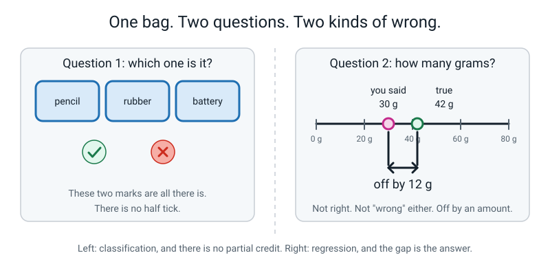
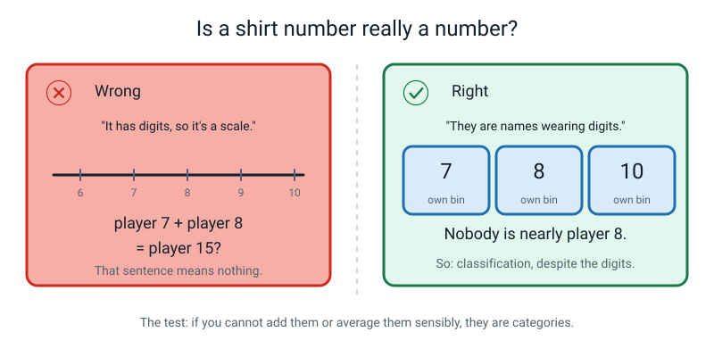
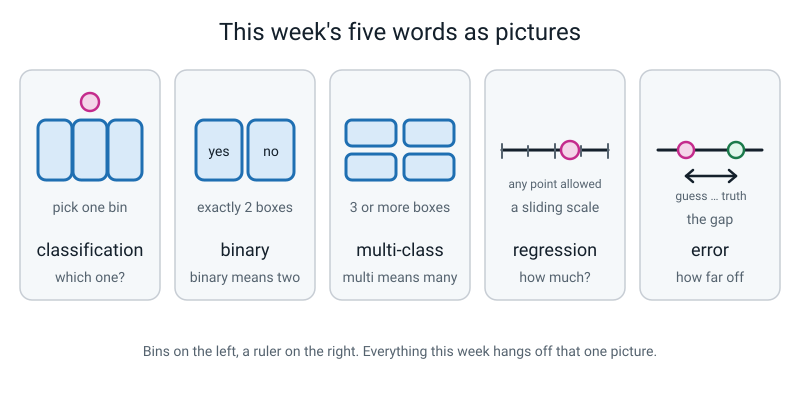

# Week 13 — Which One? or How Much?

[⬅ Week 12](week-12.md) · [Course Home](../README.md) · [Week 14 ➡](week-14.md) · [Workbook](../workbook/week-13.md)

---

> ### This week in one sentence
> **Every prediction has an answer, and answers come in only two shapes — a word from a short list, or a number on a sliding scale — and the same table gives you either one, depending on which column you cover up.**
>
> **By the end of this chapter you will be able to:**
> - Sort any task into **classification** or **regression** just by looking at the shape of its answer
> - Turn a classification task into a regression task and back again, by rewriting the label
> - Work out the **error** of a number prediction, and the **mean error** across several predictions
> - Cut a number into three named buckets and say exactly what information you threw away
>
> **Reading time:** about 20 minutes. **Homework:** about 50 minutes.

---

## 🪝 Start Here

There is a paper bag on the table. Something is inside it. You cannot see it, you cannot touch it, and nobody is going to tell you what it is.

Two questions. Answer both, and you have to commit — "I don't know" is not allowed.

> **Question 1.** Is the thing in this bag a **pencil**, a **rubber**, or a **battery**?
>
> **Question 2.** How many **grams** does it weigh?

You wrote *rubber* for question 1. You wrote *30 grams* for question 2.

Now the bag opens. It is a rubber. It weighs **42 grams**.

Time to mark you. Question 1: you said rubber, it is a rubber — **tick**. And notice what would have happened if you'd said "pencil". Cross. Not "nearly". Not "half marks because a pencil is also stationery". If you'd said "pen" instead of "pencil" that would not have been *closer* to being a rubber. Wrong is wrong.

Question 2 is a completely different experience. You said 30 and it's 42. Do you get a cross? That feels harsh, and it feels harsh for a real reason. You weren't *right*, but you weren't *wrong* in the way "pencil" was wrong. You were **off by twelve grams**.


*Figure 13.1 — One bag, two questions, two completely different ways of being wrong.*

That is the whole lesson, and you have already done it. You just answered the two kinds of question that every prediction machine on Earth answers.

One kind you are **right or wrong** about.
The other kind you are **off by an amount**.

They need different names, they need different scoring, and today you get both.

---

## 🧠 The Big Idea

### 1. Shape one: the answer is a word from a short list

Sometimes the answer has to be one of a small number of named options that somebody wrote down in advance.

> **Classification** — predicting *which one*. The answer is a category chosen from a short, fixed list.

**The analogy: bins on the floor.** Picture three bins, labelled `pencil`, `rubber`, `battery`. Your answer is a ball. You have to drop it into exactly one bin. There is no floor space between the bins. There is no half-bin.

**The concrete version.** Here are three real classification tasks, with their lists:

| Task | The list of possible answers | How many boxes |
|---|---|---|
| Is this text message spam? | spam · not spam | 2 |
| Which fruit is this? | apple · orange · banana | 3 |
| Which country is this flag from? | Nepal · Peru · Chad · … | about 195 |

Two of those get their own names, and the names are as boring as they look:

> **Binary classification** — classification where the list has exactly **two** options. Spam or not spam. Rain or no rain. Pass or fail.
>
> **Multi-class classification** — classification where the list has **three or more** options. Apple, orange or banana.

"Binary" just means two. That is the entire meaning of the word. There is no clever hidden idea inside it, and you should not go looking for one.

Here is the property of classification that matters most, and it is easy to miss because it sounds obvious:

> **⚠️ Watch out:** In classification there is **no such thing as nearly right.** If the truth is `orange` and the machine says `apple`, that is exactly as wrong as saying `banana`. You cannot be 10% wrong about which fruit something is.

### 2. Shape two: the answer is a number on a scale

Other times the answer is a number, and *any* number in the range is allowed.

> **Regression** — predicting *how much* or *how many*. The answer is a number on a sliding scale.

**The analogy: a ruler.** Not bins — a line. Every point on the line is available to you. You could say 30 grams. Or 30.5. Or 30.4999. Nobody wrote a list in advance, because a list would have to be infinitely long.


*Figure 13.2 — Bins on the left, a ruler on the right. Look at the shape of the answer and you already know which kind of task you have.*

**The concrete version.** Three real regression tasks:

| Task | Answers it could give |
|---|---|
| How many millimetres of rain tomorrow? | 0 · 0.4 · 3.2 · 17 · 61.5 … |
| How many grams does this fruit weigh? | 110 · 161.25 · 205 … |
| How many minutes will this homework take? | 12 · 37 · 47 · 63 … |

And here, "nearly right" **does** mean something, which changes everything about how you score it. If the truth is 205 grams and the machine said 197.5 grams, it was not wrong the way "apple instead of orange" is wrong. It was off by 7.5 grams. That distance is the whole story.

### 3. The test that never fails

You do not need to memorise a list of which tasks are which. You need one test, and it works every time.

> **Say the true answer out loud. Then say an answer that is a little bit off. Ask: was the second one nearly as good?**

Try it:

| True answer | A bit off | Nearly as good? | So it is… |
|---|---|---|---|
| `orange` | `apple` | No. That's just wrong. | **classification** |
| 205 g | 203 g | Yes, obviously. | **regression** |
| bus route `B` | bus route `C` | No — you get on the wrong bus. | **classification** |
| 47 minutes | 48 minutes | Yes. | **regression** |

**Why this test beats every other rule.** The rule everybody reaches for first is *"if the label is a number, it's regression"* — and that rule is **wrong**, which is why we need a better one. There is a whole section on it further down, in Don't Get Tricked. For now, hold on to the test.

### 4. Error: the gap, not the telling-off

Classification is scored with ticks and crosses. You count the ticks. Done.

Regression cannot be scored that way, because nothing is ever exactly right. So instead of a tick, you measure a **gap**.

> **Error** — in regression, how far the guess was from the truth. Always measured as a distance, so it is never below zero.


*Figure 13.3 — Predicted 197.5 g, true 205 g. The error is the 7.5 g gap between the two pins.*

**How to work it out.** Bigger number minus smaller number:

```
error = bigger − smaller

predicted 197.5, true 205    ->  205 − 197.5 = 7.5
predicted 210,   true 205    ->  210 − 205   = 5
predicted 200,   true 205    ->  205 − 200   = 5
```

Look at the last two rows. One guess was above and one was below, and they have **the same error**. That is deliberate: for now we only care how far off you were, not which side you were on.

> **⚠️ Watch out:** "Error" does **not** mean you did something wrong. It just means *how far off*. A brilliant prediction still has an error — a tiny one. An error of half a gram is an excellent result. You are not being told off; you are being measured.

**One number for the whole model.** If you make several predictions, nobody wants a list of errors. Add them up and divide by how many:

```
mean error = (all the errors added up) ÷ (how many predictions)
```

Grown-ups sometimes call this the *mean absolute error*. **Mean error** is fine and it is honest.

### 5. The label is a choice — and this is the surprising bit

Here is the part of this week that is genuinely startling, and it is worth slowing down for.

Take a table of twelve fruits, with columns `weight_g`, `length_cm`, `colour`, `skin`, `has_stem`, `fruit`. You built this table in Week 12.

- Cover the **`fruit`** column and ask a machine to fill it back in → the answer is a word from a list of three → **classification**.
- Cover the **`weight_g`** column instead and ask a machine to fill *that* back in → the answer is a number → **regression**.


*Figure 13.4 — Two paper flaps, two completely different problems, one single table.*

Same twelve fruits. Same measurements. Same ink on the same page. **One decision — which column you decided to hide — turned one problem into a completely different one.**

This matters because most people arrive believing that "classification problems" and "regression problems" are two different kinds of thing out in the world, like mammals and birds. They are not. They are two different **questions you can ask of the same data**.

> **💡 Try this:** go and find any table — a cricket scorecard, a nutrition label, your own Week 12 table — and name two different prediction tasks you could build from it, one of each kind. It takes thirty seconds and it makes the idea stick permanently.

### 6. Flipping a task on purpose, and what each direction costs

Because the label is a choice, you can deliberately rewrite any task as the other kind. Neither direction is more advanced. Each one gains something and loses something.

**Classification → regression.** Replace the category with a number that measures the same thing.

> "Is this spam?" (yes/no) becomes "How spammy is this, from 0 to 100?"

*You gain:* the machine can express doubt. A 51 is honestly different from a 99, and the person building the filter can choose their own cut-off.
*You lose:* effort, and sometimes possibility. Somebody has to produce those 0-to-100 numbers for every training example, and often there is no honest way to do it.

**Regression → classification.** Cut the number line into named ranges.

> "How many minutes will homework take?" becomes "quick / normal / long".

> **Bucketing** — turning a number into a category by grouping ranges and giving each range a name. 38 grams becomes `medium`.

*You gain:* simplicity, and often a better match to the decision you're actually making. If all you need to know is "can I finish before dinner?", three buckets answer it perfectly.
*You lose:* precision — and you lose it in a specific, nasty way.


*Figure 13.5 — What bucketing costs. Every dot keeps its bucket and loses its position.*

Look hard at that figure, because it shows **two** separate losses and most people only spot the first:

1. **Differences inside a bucket vanish.** 31 minutes and 59 minutes both become `normal`. They are now literally the same answer, even though they are 28 minutes apart.
2. **Differences that were never really there get invented.** 29 minutes and 31 minutes are two minutes apart — closer to each other than 31 and 59 are — but they land in **different** buckets and now look unrelated.

Bucketing does not simply blur small differences. It also makes one small difference look enormous, purely because of where you happened to draw a line.

---

## 🔍 Worked Examples

### Worked Example 1 — Twelve fruits, weighed (food)

This is the table from Week 12, with the label moved. Every number here is worked out in full.

| id | weight_g | length_cm | colour | skin | has_stem | fruit |
|---|---|---|---|---|---|---|
| 1 | 150 | 8 | red | smooth | yes | apple |
| 2 | 165 | 8 | green | smooth | yes | apple |
| 3 | 140 | 7 | red | smooth | yes | apple |
| 4 | 190 | 9 | red | smooth | no | apple |
| 5 | 200 | 8 | orange | bumpy | no | orange |
| 6 | 185 | 7 | orange | bumpy | no | orange |
| 7 | 210 | 8 | orange | bumpy | no | orange |
| 8 | 195 | 8 | orange | bumpy | no | orange |
| 9 | 120 | 19 | yellow | smooth | no | banana |
| 10 | 135 | 21 | yellow | smooth | no | banana |
| 11 | 110 | 18 | green | smooth | no | banana |
| 12 | 128 | 20 | yellow | smooth | no | banana |

**Step 1 — move the label.** Last time, `fruit` was the label: three boxes, multi-class classification. This time we **uncover `fruit`** and **cover `weight_g`**. The machine is told the fruit is an orange and has to guess how many grams it weighs.

Apply the test: true answer 205, a bit off 203. Nearly as good? Yes. **Regression.**

**Step 2 — build the simplest honest model there is.** For each type of fruit, work out the average weight and use that as the guess every single time.

```
apples:   150 + 165 + 140 + 190  =  645       645 ÷ 4 = 161.25 g
oranges:  200 + 185 + 210 + 195  =  790       790 ÷ 4 = 197.5  g
bananas:  120 + 135 + 110 + 128  =  493       493 ÷ 4 = 123.25 g
```

Stop and look at that. **Those three numbers are the entire model.** 161.25, 197.5, 123.25. The colours, the skin, the stems, all twelve rows — gone. Three numbers is everything we kept.

**Step 3 — predict three new fruits that were never in the bowl.**

| new fruit | what it is | predicted | true | error |
|---|---|---|---|---|
| P | orange | 197.5 | 205 | 205 − 197.5 = **7.5 g** |
| Q | banana | 123.25 | 119 | 123.25 − 119 = **4.25 g** |
| R | apple | 161.25 | 172 | 172 − 161.25 = **10.75 g** |

Best prediction: the banana, error 4.25 g. Worst: the apple, error 10.75 g.

**Step 4 — one number for the whole model.**

```
7.5 + 4.25 + 10.75  =  22.5
22.5 ÷ 3            =  7.5

MEAN ERROR = 7.5 grams
```


*Figure 13.6 — The whole worked example on one board. Nothing here was given to you; every number came out of the table.*

**Step 5 — say the honest sentence.** *"Our model is off by about seven and a half grams on average."*

And notice what you **cannot** say. You cannot say "our model is 83% accurate", because there is no such thing here. Nothing was right and nothing was wrong. Everything was off by an amount.

**Is 7.5 g good?** It depends entirely on what you're doing with it. For sorting fruit into crates: excellent. For selling by weight to the exact gram: unacceptable. If somebody asks "is this good?" and you answer without asking "good for what?", you have not finished the question.

**How could we make it smaller?** Use `length_cm` as well as the fruit type. Right now the 21 cm banana and the 18 cm banana get exactly the same guess of 123.25 g, and the long one is almost certainly heavier.

### Worked Example 2 — How many runs will she score? (sport)

A team keeps a book of past innings. Two columns matter: where the batter came in, and how many runs she made.

| innings | position | runs |
|---|---|---|
| 1 | opener | 42 |
| 2 | middle | 24 |
| 3 | opener | 58 |
| 4 | middle | 18 |
| 5 | opener | 31 |
| 6 | middle | 33 |
| 7 | opener | 71 |
| 8 | middle | 29 |

**Step 1 — which kind of task?** The label is `runs`. True 42, a bit off 43. Nearly as good? Yes. **Regression.**

**Step 2 — the model: an average per position.**

```
openers:  42 + 58 + 31 + 71  =  202      202 ÷ 4 = 50.5 runs
middle:   24 + 18 + 33 + 29  =  104      104 ÷ 4 = 26   runs
```

**Step 3 — three new innings.**

| innings | position | predicted | true | error |
|---|---|---|---|---|
| 9 | opener | 50.5 | 66 | 66 − 50.5 = **15.5** |
| 10 | middle | 26 | 21 | 26 − 21 = **5.0** |
| 11 | opener | 50.5 | 44 | 50.5 − 44 = **6.5** |

Notice innings 11: the guess was **above** the truth this time, so we did smaller-from-bigger the other way round. The error is still a positive 6.5.

**Step 4 — the mean error.**

```
15.5 + 5.0 + 6.5  =  27
27 ÷ 3            =  9

MEAN ERROR = 9 runs
```

*"Our model is off by about nine runs an innings."* That is a real, honest, sayable sentence about a machine.

**Step 5 — now flip it.** Rewrite the task as classification by bucketing `runs`:

| bucket name | range |
|---|---|
| `quiet` | under 30 |
| `solid` | 30 to 69 |
| `big` | 70 or more |

Now the eight past innings become: 42 `solid`, 24 `quiet`, 58 `solid`, 18 `quiet`, 31 `solid`, 33 `solid`, 29 `quiet`, 71 `big`.

**Who wants which version?** A **selector** picking a batting order wants the number — 50 runs and 20 runs lead to different decisions. A **TV producer** deciding whether to prepare a milestone graphic wants the bucket, because all they need to know is whether `big` is likely.

**And what did the bucketing cost?** 29 runs and 31 runs are two runs apart and now sit in different buckets, looking unrelated. Meanwhile 31 and 69 sit in the *same* bucket and become the identical answer, 38 runs apart.

### Worked Example 3 — How long will this homework take? (school)

Priya times her homework for ten nights and writes the minutes down.

```
12 · 18 · 25 · 28 · 31 · 35 · 44 · 52 · 58 · 67
```

**Step 1 — the regression version.** Label = `minutes`. The simplest model: predict the average, every time.

```
12 + 18 + 25 + 28 + 31 + 35 + 44 + 52 + 58 + 67  =  370
370 ÷ 10  =  37 minutes
```

The model is one number: **37**.

**Step 2 — three new nights.**

| night | predicted | true | error |
|---|---|---|---|
| 11 | 37 | 40 | 40 − 37 = **3** |
| 12 | 37 | 25 | 37 − 25 = **12** |
| 13 | 37 | 52 | 52 − 37 = **15** |

```
3 + 12 + 15  =  30
30 ÷ 3       =  10

MEAN ERROR = 10 minutes
```

*"Priya's homework model is off by about ten minutes."* For deciding whether to start before or after dinner, that is genuinely useful. For catching a bus in fifteen minutes, it is useless.

**Step 3 — the classification version.** Bucket the minutes:

| bucket | range | which of the ten nights land here |
|---|---|---|
| `quick` | under 30 | 12, 18, 25, 28 → **4 nights** |
| `normal` | 30 to 60 | 31, 35, 44, 52, 58 → **5 nights** |
| `long` | over 60 | 67 → **1 night** |

**Step 4 — the baseline, because a score means nothing without one.** If Priya just said `normal` every single night without looking at anything, she'd be right 5 times out of 10 — **50%**. That is the number any cleverer model has to beat. (You met baselines in Week 12, and you'll use one again next week.)

**Step 5 — what did the bucketing throw away?**

- 28 minutes and 31 minutes are **three minutes apart** and land in different buckets. They now look like different kinds of evening.
- 31 minutes and 58 minutes are **27 minutes apart** and land in the same bucket. They are now the identical answer.
- The `long` bucket has exactly **one** night in it. A bucket with one example in it teaches you almost nothing.

**Which version is more useful?** For Priya, deciding tonight whether she can finish before her programme starts: the **buckets**, easily. For her teacher, working out whether the whole class is being set too much: the **numbers**, because "normal" hides the difference between 31 and 58.

---

## 🎲 What We Did In Class

The activity was called **Flip Every Task**, and it has three phases. You can do all of it at a kitchen table with ten scraps of paper.

### Setup

Write these ten tasks on ten cards, one each. Then make two header cards: `WHICH ONE?` and `HOW MUCH?`, and put them at the top of the table about 40 cm apart.

```
 1  Is this text message spam?
 2  How many millimetres of rain will fall tomorrow?
 3  Which fruit is this: apple, orange or banana?
 4  How many minutes will this homework take?
 5  Is this photo a cat or a dog?
 6  How many runs will this batter score?
 7  Which bus route is fastest: A, B or C?
 8  What price should this second-hand bike be?
 9  Will the kitchen run out of lunches tomorrow?
10  How many times will this song be played in its first week?
```

### Phase 1 — Sort (6 minutes)

Turn over one card at a time, read it aloud, and say which pile it goes in **and why**, using the "nearly right" test out loud. The *why* is compulsory. A card placed in silence goes back face down.

Here is the answer, with the reason for each:

| card | pile | why |
|---|---|---|
| 1 | WHICH ONE? | Two boxes: spam, not spam. **Binary.** |
| 2 | HOW MUCH? | 4 mm is nearly 4.5 mm. Regression. |
| 3 | WHICH ONE? | Three boxes. **Multi-class.** |
| 4 | HOW MUCH? | 47 is nearly 48. Regression. |
| 5 | WHICH ONE? | Two boxes. Binary. |
| 6 | HOW MUCH? | 48 is nearly 50. Regression. |
| 7 | WHICH ONE? | Three named boxes. The letters A/B/C are labels, not a scale. |
| 8 | HOW MUCH? | £4,400 is nearly £4,500. Regression. |
| 9 | WHICH ONE? | Yes or no — **even though lunches are counted.** The *answer* is not a count. |
| 10 | HOW MUCH? | A count on a scale. Regression. |

Five and five. The two that catch people are **card 7** (A, B and C look like a scale but they're just names) and **card 9** (it sounds like a counting question, but the answer is yes or no).

### Phase 2 — Flip (10 minutes)

Now the hard half. Take each card and rewrite it as the other kind. Two rules:

1. **Name the new label column** and say what values it can take. Not "make it a number" — say `rain_mm`, any number from 0 upwards.
2. **The flipped version must be a real, sayable question.** "How much cat is this photo?" is not a question. If nobody could measure it, the flip isn't real.

Here is card 1 modelled for you, and then card 4 going the other way:

> **Card 1.** "Is this text message spam?" — binary classification.
> Flipped: **"How spammy is this message, from 0 to 100?"** New label column `spam_score`, any number 0–100.

> **Card 4.** "How many minutes will this homework take?" — regression.
> Flipped: **"Will this homework be quick (under 30), normal (30–60), or long (over 60)?"** New label column `duration_bucket`, three values.

All ten flips are worked out in the workbook answer key. Do them yourself before you look.

### Phase 3 — Argue (4 minutes)

Pick three cards. For each one, ask: **"which version would actually be more useful for the person who has to use it?"**

Then find someone to argue the opposite side. The point is not to win. The point is to be forced to find a *second* reason. Two good pressure lines you will hear:

- "You'd rather have the 0-to-100 score? Fine — who is going to sit and grade five thousand old messages from 0 to 100 to teach it?"
- "You'd rather have yes/no? So a message that's obviously spam and one that's borderline get the identical answer, and you never see the difference?"

### Phase 4 — The fruit table, reused

Then we went back to the Week 12 fruit table, covered `weight_g` instead of `fruit`, built the three averages, predicted three new fruits and computed the mean error of 7.5 g. That is Worked Example 1 above, step by step.

---

## 💬 Talk About It

Take these to a parent, a sibling or a friend. Their first answer is usually interesting.

**1. "Is a shirt number a number?"**
Ask them to defend their answer, then try the addition trick on them.
*Hint for you:* player 7 + player 8 = player 15, which means nothing at all. The average of players 7 and 8 is player 7.5, who does not exist. Numbers you cannot add or average sensibly are **categories wearing digits**. It's a category, so predicting it is classification.

**2. "Would you rather your weather app said 'rain: yes' or '4 millimetres'?"**
Most people answer instantly and are surprised when you ask *who else* uses that forecast.
*Hint for you:* for someone deciding on a coat, "yes" is better — nobody wants millimetres before school. For a farmer deciding whether to irrigate, or a council deciding whether the drains will cope, the millimetres are the entire point. **Same forecast, different users, different right answer.** That is the whole of this week in one exchange.

**3. "Is a 1-to-5 star rating a number or a category?"**
Warn them first that this one is a trap, and enjoy it.
*Hint for you:* honestly, **nobody has a settled answer, and people who do this for a living still argue about it.** The stars are in order — 4 really is better than 3 — so they aren't pure categories like apple and orange. But the gaps aren't equal either: the jump from 1 star to 2 usually means something much bigger than the jump from 4 to 5. So they're not proper numbers. What people actually do is try both and see which works better, which is unsatisfying and completely honest.

---

## ⚠️ Don't Get Tricked

### Trick 1 — "If the label is a number, it's regression"

This is the single most common mistake, for adults as much as for 11-year-olds.


*Figure 13.7 — The same shirt number, treated two ways. Only one of them makes sense.*

| ❌ Wrong | ✅ Right |
|---|---|
| "Bus route 12 is a number, so predicting it is regression." | "Route 12 is not *nearly* route 13. It's a name that happens to be written with digits. Classification." |

The fix is a two-second test: **try adding two of them together.** Weight 150 g plus weight 200 g is 350 g, and that means something. Bus route 12 plus bus route 13 is bus route 25, which means nothing at all. If you cannot add them or average them sensibly, they are categories.

Number-shaped categories you will meet: bus routes, shirt numbers, house numbers, postcodes, school house numbers, phone numbers, seat numbers.

### Trick 2 — "Error means the model got it wrong"

| ❌ Wrong | ✅ Right |
|---|---|
| "My prediction was good, so error = 0." | "My prediction was good, so error = 0.4 g. Small, but not nothing." |

In regression, **every prediction has an error, including the excellent ones.** After six years of being marked right or wrong, this feels strange. Say the definition to yourself: error means *how far off*, not *how wrong you were*.

And be slightly suspicious of an error of exactly zero, over and over. One perfect guess is luck. Twenty perfect guesses is a reason to investigate: the answer may be leaking into the features, or the test may be too easy.

### Trick 3 — "My error is minus five"

| ❌ Wrong | ✅ Right |
|---|---|
| "I predicted 210 and it was 205, so my error is −5." | "Bigger minus smaller: 210 − 205 = 5. Error is a distance, so it's never negative." |

Predicting 5 g over and predicting 5 g under are the same size of miss, and this week we treat them identically. Write `BIGGER − SMALLER` in the margin of your workbook and use it every time.

(Does the direction ever matter? Sometimes enormously — guessing a journey 10 minutes short means you miss your train, and 10 minutes long means you wait on a platform. Real systems handle that. We are not doing it this year, on purpose.)

### Trick 4 — "Regression is better because it tells you more"

| ❌ Wrong | ✅ Right |
|---|---|
| "Always use regression — a number beats a word." | "Use whichever matches the decision. And regression is often not even available, because somebody has to produce the numbers to learn from." |

For the fruit, producing numbers was easy: we had a scale. Now try "how much of a cat is this photo, from 0 to 100?" There is no cat-o-meter. To get those labels you'd have to ask a hundred people about every single photo, and even then you would only be measuring *what people think*.

When there is no honest way to produce the number, regression is not on the menu, however much you'd like it.

---

## 🌍 Where You've Seen This

1. **Your weather app, twice on one screen.** "Rain tomorrow: yes" is classification. "12 mm" right beside it is regression. Two separate predictions from the same data, sitting next to each other.
2. **A music app.** It classifies (which genre is this?) and regresses (how many seconds before you skip?) constantly, at the same time, about the same song.
3. **The spam folder.** Underneath, a filter usually produces a *score* (how sure it is that the message is spam) and then a threshold turns it into `spam` or `not spam` for you. Somebody chose that threshold, and whoever chooses it quietly controls what you see.
4. **Second-hand selling sites.** The price box is regression. The search filters (`under £2,000` / `£2,000–£6,000` / `over £6,000`) are the same thing bucketed, because a buyer narrowing a page wants bands, not a single number.
5. **Your school report.** A percentage is regression. The grade letter is that percentage bucketed. Notice both losses: 79% and 80% might be different grades, and 80% and 89% might be the same one.
6. **A fitness watch.** Step count is regression. "Are you asleep?" is binary classification. "Running / walking / cycling" is multi-class. All three, all night, from the same wrist.

---

## 🧭 Where This Fits

Same box again — **FEATURES**, week three of four. Week 11 gave you the columns, Week 12 taught you
to test them, and this week you turn round and look at the very last column: the label. Its *shape*
turns out to decide what kind of machine you are building.


*Figure 13.0 — The map in Week 13. The tinted box with the tick is still FEATURES. Notice that the
two lit threads at the bottom have changed even though the box has not: that is how you tell this
week apart from last week.*

| | |
|---|---|
| **The mental model you now own** | Look at the **shape of the answer**. One word out of a short list — cat, dog, rabbit — and you are building a **classifier**. A number on a scale — 24 degrees, 6 minutes, 310 grams — and you are building a **regressor**. The genuinely strange part is that the *same table* does either one. It depends entirely on which column you covered up. |
| **The one question it answers** | *"Is the answer one of a short list, or a number on a scale?"* |
| **What it plugs into** | Week 11's label column. Cover a different column and you have changed which kind of machine you are building, without collecting a single new row. |
| **What carries forward** | The model you train in Week 17 is a three-class classifier, and the confidence scores you read in Week 16 only exist *because* the answer comes from a short list. A number on a scale has no percentages to show you. |
| **Spiral thread** | 📦 **Model** — which kind of guessing machine you end up with — and 🎯 **Learning signal** — because "nearly right" means something for a number and nothing at all for a word. |

> **💡 Try this:** on your own map, draw two tiny sketches beside the FEATURES box — a short list of
> words, and a ruler. That is this whole week in two pictures.

---

## 🔑 Remember This

- **Look at the shape of the answer.** A short list of words means **classification**. A number on a scale means **regression**. That is the only test you need.
- **Binary means two boxes. Multi-class means three or more.** There is nothing more to those words than counting.
- **Beware numbers that aren't numbers.** Bus route 12 isn't nearly route 13. If you can't add them sensibly, they're categories in disguise.
- **In regression there is no tick or cross — there is a gap.** That gap is the **error**: bigger minus smaller, always positive. Average the errors and you have one honest number for the whole model.
- **Bucketing loses information twice:** differences inside a bucket vanish, and differences across a boundary get exaggerated.
- **The task type is not a property of the data. It is a property of your question.** The same twelve fruits gave us a classification problem and a regression problem, and the only thing that changed was which column we covered up.

---

## 📓 New Words


*Figure 13.8 — This week's five words, drawn.*

| Word | What it means | Example |
|---|---|---|
| **classification** | Predicting *which one* — a category from a short, fixed list | "Is this fruit an apple, an orange or a banana?" |
| **binary classification** | Classification with exactly two options | "Is this message spam — yes or no?" |
| **multi-class classification** | Classification with three or more options | "Which of the four school houses is this?" |
| **regression** | Predicting *how much* — a number on a sliding scale | "How many grams does this orange weigh?" |
| **error** | In regression, how far the guess was from the truth. Always a distance, never negative | Predicted 197.5 g, true 205 g → error **7.5 g** |

One more word, which arrives properly next week but you have already used:

| Word | What it means | Example |
|---|---|---|
| **bucketing** | Turning a number into a category by grouping ranges and naming each range | 44 minutes becomes `normal`, because `normal` means 30–60 |

---

## 📤 Your Homework

Go to **[the Week 13 workbook](../workbook/week-13.md)**. About **50 minutes** in total.

| Page | What to do | Time |
|---|---|---|
| **13.1** | Warm-up and Practice Set A — sorting, the "nearly right" test, labelling the blank bins-and-ruler diagram | 15 min |
| **13.2** | Practice Set B — five new scenarios, including two where something goes wrong | 12 min |
| **13.3** | **All ten task cards, both ways.** For each one write the classification version and the regression version — both — and one line underneath: **which version is more useful in real life, and who for?** | 15 min |
| **13.4** | **Bucket your own table.** Go back to your Week 12 table, find a column that holds a number, cut it into **three named buckets** with boundaries you choose, and write two sentences on **what information the bucketing threw away** — with the actual numbers | 10 min |

> **⚠️ Watch out:** on page 13.3, the "**who for?**" line is the whole point. Not which version is easier. Which is more *useful*, and to **which person**. One line per flip means one line — if this task is taking you over twenty minutes, you are over-writing.

> **💡 Try this:** for page 13.4, put your bucket boundaries in the **empty gaps** between your numbers, not in the middle of a cluster. If your weights are 4, 4, 5, 5, 6, 6, 7, 16, 18, 20, there is an obvious gap between 7 and 16 — use it. Then look for two values that ended up in different buckets despite being close together, and name them. That is the sentence that earns full marks.

Bring your table and your ten cards to the next lesson. You'll need your own objects again — and this time, a second person who has never seen them.

---

[⬅ Week 12](week-12.md) · [Course Home](../README.md) · [Week 14 ➡](week-14.md) · [📓 Workbook — Week 13](../workbook/week-13.md) · [Glossary](../../glossary.md)
