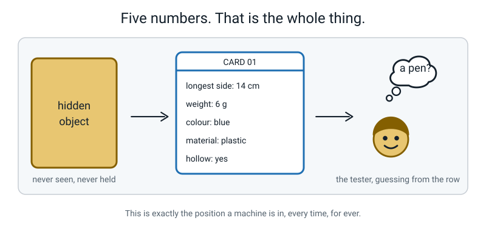
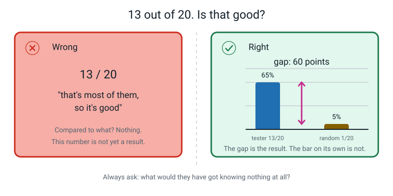
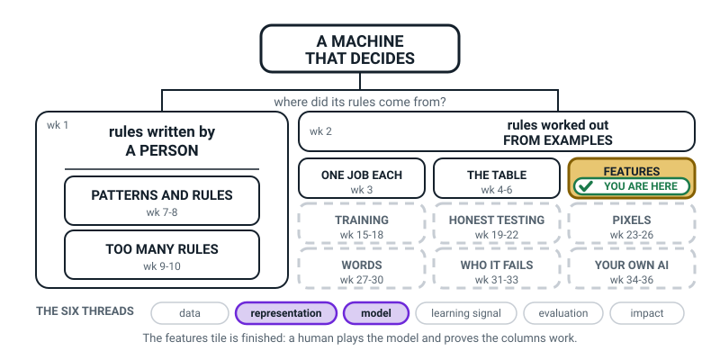
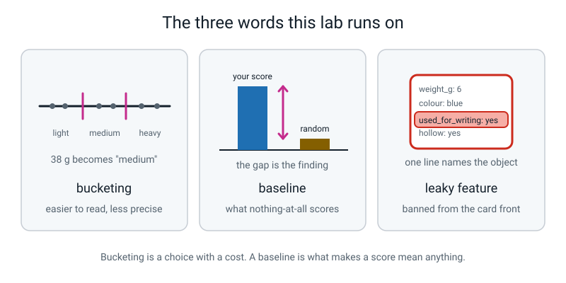

# Week 14 — Feature Card Deck: Make a Human Be the Model

[⬅ Week 13](week-13.md) · [Course Home](../README.md) · [Week 15 ➡](week-15.md) · [Workbook](../workbook/week-14.md)

---

> ### This week in one sentence
> **If your features are good enough, a stranger who has never seen the thing can name it from the numbers alone — and if they can't, you have learned something even more useful.**
>
> **By the end of this chapter you will be able to:**
> - Build a deck of cards with exactly **five features** on the front and the label hidden on the back
> - Run a fair test on a real human without leaking the answer through hints, faces or noises
> - Work out the tester's score, the deck's **baseline**, and the gap between them
> - Work out which feature the tester actually relied on — using **evidence**, not by asking them
>
> **Reading time:** about 20 minutes. **Homework:** about 60 minutes.

---

## 🪝 Start Here

This section is a short game to play before the lesson starts.

Somebody is thinking of an object in the room. They will not describe it. They will not point at it. They read you five numbers, and that is everything you get.

> longest side: **14 centimetres**
> weight: **6 grams**
> main colour: **blue**
> material: **plastic**
> hollow: **yes**

That is the whole clue. What is it?


*Figure 14.1 — Five values on a slip of paper. No smell, no weight in the hand, no memory of which drawer it came from.*

You probably said "a pen", and you were right, or very close. **You never saw it. You never held it.** You couldn't shake it, smell it, or check whether it had a lid.

That is the position a machine is in every time, for the kind of machine in this course. It has never met the object. It has a row of numbers somebody chose, and the numbers are all it will ever have.

All year you have been told that. It is easy to say and hard to feel. This week **you** choose the numbers. Then you hand them to a real person who has never seen your objects, and you find out whether you chose well.

> **💡 Try this before you read on:** which of the five numbers helped you most? Most people say `weight: 6 g` or `hollow: yes`. Six grams rules out almost everything solid. Hollow rules out pencils and rulers. Then ask yourself the sharper question: **what did you want to know that nobody told you?** ("Does it have a lid?" "Is it pointy?") Write it down. Those are the features you'd have chosen — and you're about to get the chance.

---

## 🧠 The Big Idea

This section explains the five ideas behind the Deck Trial: the card, the leak rule, bucketing, the baseline and the elimination hunt.

### 1. A card is a row of numbers with the answer hidden on the back

Every card in your deck looks the same. There is a number at the top and five features underneath. On the back is one word, the name of the object.


*Figure 14.2 — Front and back. Nothing on the front hints at the answer.*

**The rule that looks like fussiness and isn't:** the same five features, in the same order, on **every single card**. `weight_g` must be on the same line on card 3 and card 17.

**Why.** If the tester has to hunt for the line each time, they get slow, then sloppy, then bored. Your experiment stops measuring your features and starts measuring their patience.

Every real dataset in the world has fixed columns for exactly this reason. A table with columns that wander is not a table.

**The analogy: a menu.** Imagine a café where the price is in a different place on every page. You'd still find it, but you'd hate it, and by page eleven you'd be guessing.

### 2. No leaky features — and this is the rule that gets broken

You met leaks in Week 12. This week you have to *enforce* the rule. Halfway through building twenty cards, a leak will occur to you and it will sound reasonable.

> **A leaky feature is one that hands over the answer.** For a deck, that means anything that names the object, names what it's used for, or names what category it's in.


*Figure 14.3 — The three-second test, applied to three real proposals.*

**The test, and learn it as a phrase:**

> **Could a stranger name the object from this one line alone? Then it's banned.**

The table applies the test to seven proposed features.

| Proposed feature | Verdict | Why |
|---|---|---|
| `is_used_for_writing: yes` | ❌ banned | Says "pen or pencil" in five words |
| `found_in_the_kitchen: yes` | ❌ banned | Hands over the whole category for free |
| `can_you_eat_it: yes` | ❌ banned | Same — one line, one category |
| `shape: spoon-shaped` | ❌ banned | Says the answer inside the value |
| `weight_g: 6` | ✅ allowed | Nobody can name a 6-gram object from that |
| `is_shiny: yes` | ✅ allowed | Loads of things are shiny. It narrows; it doesn't hand over |
| `number_of_holes: 2` | ✅ allowed | A real count, and a genuinely good feature |

**Why it matters so much.** A deck with a leak on it will score brilliantly, and the score will mean **nothing at all**. You'll have proved only that if you tell somebody the answer, they can tell you the answer.

> **⚠️ Watch out:** `can_you_eat_it` is the sneaky one, because it *is* a real property you could check. That is true, and it is not the point. If half your objects are food, that one line does the whole job and the other four features become decoration for those cards. Rule it out anyway.

### 3. Bucketing: a choice you make on the card front

Take weight. On the card, do you write **`weight_g: 38`**, or do you write **`weight: medium`**?

> **Bucketing** — turning a number into a category by grouping ranges and giving each range a name. 38 grams becomes `medium`. 7.0 cm becomes `short`.

You met this idea last week, when you cut a number label into three named ranges. This week it is a **design decision**. The table shows the trade.

| Writing the raw number | Writing the bucket |
|---|---|
| The tester can make fine distinctions — 38 g and 44 g are visibly different | The tester reads it faster and doesn't have to hold six numbers in their head |
| More work for you to measure precisely | Hides real differences: 38 g and 62 g might both be `medium` |
| The tester may **ignore** it, because a number with a unit is effort | The tester will definitely **use** it, because it's an easy word |

There is no right answer. It is a **choice with a cost**, like last week. Make the choice on purpose and write down why, because in ten minutes you get to find out whether you were right.

> **💡 Try this:** if you have no kitchen scale, bucket weight by hand. Define it in writing *before* you measure anything: `feather` = lighter than a pencil, `normal` = between a pencil and a full mug, `heavy` = heavier than a full mug. That's bucketing doing real work, and it costs nothing.

### 4. A score means nothing without a baseline

Suppose your tester gets **13 out of 20**. Is that good?

You cannot know until you answer one question: **what would they have got knowing nothing at all?**

That number has a name you already know from Week 12: the **baseline**. For a card deck there are two worth computing. They answer different questions.

**Baseline one — the name baseline.** The tester has a shuffled list of your 20 object names and has to put one name on each card. If they closed their eyes and matched at random, how many would come out right?

**About one.** The block below shows why.

```text
each card has a 1-in-20 chance of getting the right name
there are 20 cards
so on average:  20 × (1/20) = 1 card comes out right

name baseline = 1 out of 20 = 5%
```

That answer stays at about **one** whether the deck has 12 cards or 200. More cards means more chances and a smaller chance each, and the two cancel out exactly.

**Baseline two — the category baseline.** Say your 20 objects fall into 4 categories of 5. Somebody who only had to name the *category*, and always said the same one, would get 5 out of 20 = **25%**.

Use the name baseline as your headline, because that is the game the tester actually played. Keep the category baseline for later, because "right category, wrong object" is by far the most common way a deck fails.


*Figure 14.4 — The gap is the result. The bar on its own is not.*

**The sentence you are aiming to be able to write:**

> *"My deck beat the baseline by 59 percentage points."*

Not "my tester got 8". The **gap**.

### 5. The elimination hunt: finding out what they used without asking

At the end, everybody wants to ask the tester "which feature did you use?"

Ask them. Then **do not believe the answer.**

That is not rude. People are unreliable narrators of their own reasoning, and it is one of the most solid findings in psychology. Your tester will say "weight, mostly", completely sincerely, while their guesses line up perfectly with length.

So instead, **look at the cards they got wrong.** Follow these steps for each feature.

> For each feature, check the wrong cards. Would that feature have led to the right answer?
>
> - If **yes** → the tester wasn't using it. Because if they had been, they'd have got it right.
> - The feature that would have led them to **the same wrong answer they actually gave** is the one they were reading.


*Figure 14.5 — Four wrong cards, all pointing the same way. Nobody had to say a word.*

**The analogy: a footprint in a flowerbed.** You don't need a confession. You need the one explanation that fits all the evidence, and no others.

This is the best part of the week, and the habit is worth keeping: **check the evidence, don't trust the story.**

Grown-ups doing this professionally call it an *ablation study*. They remove one feature, retrain the model, and see how much worse it gets. It is a close cousin of what you just did, with a bigger budget: you look at the mistakes, they take a feature away and re-test.

---

## 🔍 Worked Examples

This section marks three finished experiments, so you can copy the method for your own deck.

### Worked Example 1 — The demo deck: twelve objects, four categories

Somebody else built this deck. Your job is to mark their experiment.

**The feature sheet, written before anything was measured.** It lists the five features and how each one was measured.

```text
FEATURE SHEET - the demo deck
f1  longest_side_cm  ruler, longest straight dimension, nearest 0.5 cm
f2  weight_g         kitchen scale, nearest gram
f3  main_colour      ONE of {red, blue, yellow, white, silver, clear}
f4  material         ONE of {metal, plastic, wood, rubber, glass, food}
f5  is_hollow        yes / no  (could it hold water?)
```

**The deck.** Each row is one card, and the last two columns are the back.

| card | longest_side_cm | weight_g | main_colour | material | is_hollow | label (back) | category |
|---|---|---|---|---|---|---|---|
| 01 | 15.0 | 24 | silver | metal | yes | teaspoon | kitchen |
| 02 | 18.5 | 41 | silver | metal | no | fork | kitchen |
| 03 | 28.0 | 96 | silver | metal | yes | ladle | kitchen |
| 04 | 14.0 | 6 | blue | plastic | yes | pen | stationery |
| 05 | 17.5 | 5 | yellow | wood | no | pencil | stationery |
| 06 | 4.5 | 9 | white | rubber | no | eraser | stationery |
| 07 | 1.5 | 5 | clear | glass | no | marble | toy |
| 08 | 7.0 | 38 | red | plastic | yes | toy car | toy |
| 09 | 6.0 | 62 | blue | plastic | yes | rubber ball | toy |
| 10 | 8.0 | 152 | red | food | no | apple | fruit |
| 11 | 19.0 | 118 | yellow | food | no | banana | fruit |
| 12 | 7.5 | 96 | yellow | food | no | lemon | fruit |

**Step 1 — check for leaks.** All five features are things you could measure without knowing what the object is. No leaks. The weakest one is `material: food`, which does hand over the fruit category cheaply — worth noting, but not a leak, because you can tell food from metal by looking without knowing *which* food.

**Step 2 — the tester's results.**

| card | truth | tester said | ✓/✗ |
|---|---|---|---|
| 01 | teaspoon | teaspoon | ✓ |
| 02 | fork | fork | ✓ |
| 03 | ladle | ladle | ✓ |
| 04 | pen | pen | ✓ |
| 05 | pencil | pencil | ✓ |
| 06 | eraser | eraser | ✓ |
| 07 | marble | marble | ✓ |
| 08 | toy car | **rubber ball** | ✗ |
| 09 | rubber ball | **toy car** | ✗ |
| 10 | apple | **lemon** | ✗ |
| 11 | banana | banana | ✓ |
| 12 | lemon | **apple** | ✗ |

**Step 3 — the arithmetic. All three numbers, always.** The block shows score, baseline and gap.

```text
correct   = 8 out of 12        8 ÷ 12 = 0.667  = 67%
baseline  = 1 out of 12        1 ÷ 12 = 0.083  =  8%
gap       = 67 − 8                            =  59 percentage points
```

*"The deck beat blind guessing by 59 percentage points."* That is the result, not the 8.

**Step 4 — the elimination hunt.** Put the four wrong cards side by side and ignore everything else.

| card | length | weight | colour | truth | said |
|---|---|---|---|---|---|
| 08 | 7.0 | 38 | red | toy car | rubber ball |
| 09 | 6.0 | 62 | blue | rubber ball | toy car |
| 10 | 8.0 | 152 | red | apple | lemon |
| 12 | 7.5 | 96 | yellow | lemon | apple |

First thing to notice: **every mistake is inside a category.** Toy for toy, fruit for fruit. They never said "pencil" for a fruit.

So the category was right 12 times out of 12. Something on the card gives it away, almost certainly `material`.

Now eliminate, one feature at a time. The list checks colour, weight and length against the four wrong cards.

- **Colour?** On card 10, colour says `red`, and card 10 *is* the red apple. Colour would have been **right**. They got it wrong. → **they were not reading colour.**
- **Weight?** Apple 152 g against lemon 96 g — 56 grams apart. Car 38 g against ball 62 g — 24 grams apart. Weight would have got **all four** right. → **they were not reading weight.**
- **Length?** Apple 8.0 against lemon 7.5 — half a centimetre apart. Car 7.0 against ball 6.0 — one centimetre apart. And every pair they got **right** has a length gap of at least 3.5 cm.

| category | lengths | smallest gap | result |
|---|---|---|---|
| kitchen | 15.0 · 18.5 · 28.0 | 3.5 cm | all correct |
| stationery | 4.5 · 14.0 · 17.5 | 3.5 cm | all correct |
| toy | 1.5 · 6.0 · 7.0 | 1.0 cm | two swapped |
| fruit | 7.5 · 8.0 · 19.0 | 0.5 cm | two swapped |

**Step 5 — write the conclusion with card numbers in it.**

> *"The tester used `material` to pick the category and `longest_side_cm` to pick the object inside it. Cards 08, 09, 10 and 12 are strong evidence for it (on this small deck): those are the only four cards where two objects in the same category are within 1 cm of each other, and they are the only four cards the tester got wrong."*

**And the annoying punchline.** The **weight was written on every single card.** It would have got both of those pairs right.

The tester ignored it, probably because a number with a unit is work. A word like "red" or a length you can picture is not.

People reach for the easy feature. So do machines, for the same reason. You'll see exactly this again next week.

### Worked Example 2 — Six balls (sport)

A six-card deck. Same five features, same fixed order. The table is the deck.

| card | diameter_cm | weight_g | main_colour | material | is_hollow | label (back) |
|---|---|---|---|---|---|---|
| 01 | 6.7 | 58 | yellow | rubber | yes | tennis ball |
| 02 | 7.2 | 160 | red | leather | no | cricket ball |
| 03 | 4.0 | 2.7 | white | plastic | yes | table tennis ball |
| 04 | 4.3 | 46 | white | plastic | no | golf ball |
| 05 | 7.3 | 156 | white | plastic | no | hockey ball |
| 06 | 22.0 | 430 | white | leather | yes | football |

**Step 1 — predict before you test.** Which pair looks hardest? Cards 02 and 05.

Their diameters are 7.2 and 7.3, **one millimetre apart**. Their weights are 160 and 156, four grams apart. That is the pair to watch.

**Step 2 — the tester's results.**

| card | truth | said | ✓/✗ |
|---|---|---|---|
| 01 | tennis ball | tennis ball | ✓ |
| 02 | cricket ball | **hockey ball** | ✗ |
| 03 | table tennis ball | table tennis ball | ✓ |
| 04 | golf ball | golf ball | ✓ |
| 05 | hockey ball | **cricket ball** | ✗ |
| 06 | football | football | ✓ |

**Step 3 — the three numbers.**

```text
correct   = 4 out of 6         4 ÷ 6 = 0.667  = 67%
baseline  = 1 out of 6         1 ÷ 6 = 0.167  = 17%
gap       = 67 − 17                          = 50 percentage points
```

**Step 4 — eliminate on the two wrong cards.**

| feature | card 02 (cricket) | card 05 (hockey) | would it have separated them? |
|---|---|---|---|
| diameter_cm | 7.2 | 7.3 | No — 0.1 cm apart |
| weight_g | 160 | 156 | Barely — 4 g apart |
| main_colour | **red** | **white** | **Yes, completely** |
| material | **leather** | **plastic** | **Yes, completely** |
| is_hollow | no | no | No — identical |

Colour and material would each have settled it on their own. The tester got it wrong. **Therefore they were reading neither.**

They were going on size and weight, the two number lines. They ignored the two word lines.

**Step 5 — what to do about it.** This is the *opposite* finding to the demo deck, where the tester ignored the weight and used the length. There is no universal law about which feature people use. **You have to check, every time, for your deck and your tester.**

The fix here is not a new feature. It is a **presentation** change. Try bucketing the diameter into `small / medium / large` so the two numbers stop looking like the interesting lines, and see whether the tester's eye moves to the colour. Then run it again with a second tester and compare.

### Worked Example 3 — Eight things from a school bag (school)

Eight objects, four categories of two. The table is the deck.

| card | longest_side_cm | weight_g | main_colour | material | is_hollow | label | category |
|---|---|---|---|---|---|---|---|
| 01 | 14.0 | 6 | blue | plastic | yes | pen | writing |
| 02 | 17.5 | 5 | yellow | wood | no | pencil | writing |
| 03 | 30.0 | 22 | clear | plastic | no | ruler | measuring |
| 04 | 12.0 | 14 | clear | plastic | no | protractor | measuring |
| 05 | 21.0 | 180 | black | paper | no | notebook | paper |
| 06 | 7.5 | 30 | yellow | paper | no | sticky pad | paper |
| 07 | 24.0 | 310 | silver | metal | yes | water bottle | carrying |
| 08 | 19.0 | 240 | red | plastic | yes | lunch box | carrying |

**Step 1 — the results.**

| card | truth | said | ✓/✗ |
|---|---|---|---|
| 01 | pen | pen | ✓ |
| 02 | pencil | **sticky pad** | ✗ |
| 03 | ruler | ruler | ✓ |
| 04 | protractor | **ruler** | ✗ |
| 05 | notebook | notebook | ✓ |
| 06 | sticky pad | **pencil** | ✗ |
| 07 | water bottle | water bottle | ✓ |
| 08 | lunch box | lunch box | ✓ |

**Step 2 — all the numbers, including both baselines.** The block shows both.

```text
correct            = 5 out of 8       5 ÷ 8 = 0.625 = 63%
name baseline      = 1 out of 8       1 ÷ 8 = 0.125 = 13%
gap                = 63 − 13                       = 50 percentage points

category baseline  = 2 out of 8       (biggest group is 2)  = 25%
category correct   = 6 out of 8                             = 75%
```

**Step 3 — eliminate.** Look at the three wrong cards and, for each, at the object the tester *named*. The table compares the two objects on each card.

| wrong card | truth | they said | what the two share | what would have separated them |
|---|---|---|---|---|
| 02 | pencil (17.5 cm, 5 g, yellow, wood) | sticky pad (7.5 cm, 30 g, yellow, paper) | **colour: yellow** | length by 10 cm, weight by 25 g, material |
| 06 | sticky pad (7.5 cm, 30 g, yellow, paper) | pencil (17.5 cm, 5 g, yellow, wood) | **colour: yellow** | the same three |
| 04 | protractor (12.0 cm, 14 g, clear) | ruler (30.0 cm, 22 g, clear) | **colour: clear** | length by 18 cm |

On all three, colour is the line the two objects **share** that is not just a common value (the pencil and sticky pad also both say `is_hollow: no`, and the protractor and ruler are both plastic and not hollow, but most cards say that too), and on all three at least one number line would have handed over the right answer.

> *"The tester used `main_colour`. Cards 02, 06 and 04 prove it: on every one of them the object they named has the same colour as the object on the card, and on every one of them the length alone would have got it right — card 04 by 18 centimetres."*

**Step 4 — the interesting difference from the demo deck.** In the demo deck, every error stayed *inside* a category. Here, two of the three errors cross category lines: a pencil called a sticky pad is `writing` called `paper`. That tells you something extra — this tester wasn't using `material` for the category either. Colour was doing everything.

**Step 5 — what would you change to make it harder?** Remove `main_colour` and predict what happens. Given that all three errors were colour-driven, the honest prediction is that the score goes **up**, not down, because the tester will be forced onto the length, which would have been right on all three of those cards. (It is only a prediction: length may also confuse pairs the tester currently gets right, such as the pen and the protractor, 2 cm apart.) That is a genuinely surprising prediction, and worth writing down before you test it.

---

## 🎲 What We Did In Class

This section is the whole lab, called **The Deck Trial**. Use it to redo the lab at home, or to run it for the first time if you missed the lesson.

**You need:**

- 20 index cards (or A4 cut into eight rectangles each — three sheets does it)
- a ruler, a scale and a pen
- a box of 20 objects (you will use 10 of them for the card trial)
- a scoring sheet
- **one human tester who has never seen the objects**

> **⚠️ Watch out:** the cards must be **opaque**. Hold one up to the light. If you can read the back through the front, double it up.

### Step 1 — The feature sheet comes first (3 minutes)

**Nothing gets measured until the sheet is written.** If you start measuring first, you will change what `length` means halfway through the deck, and the whole column becomes nonsense.

Fill in this blank sheet.

```text
FEATURE SHEET  -  name: ______________   date: __________

f1  ________________  how:  _______________________________
f2  ________________  how:  _______________________________
f3  ________________  how:  _______________________________
f4  ________________  how:  _______________________________
f5  ________________  how:  _______________________________

BANNED CHECK: read each one aloud. Could a stranger name the
object from that one line?   f1 □  f2 □  f3 □  f4 □  f5 □
```

If you are stuck, use this working set rather than lose four minutes.

```text
f1  longest_side_cm  ruler, longest straight dimension, nearest 0.5 cm
f2  weight_g         scale, nearest gram
f3  main_colour      ONE of {red, blue, green, yellow, black, white, brown, clear}
f4  material         ONE of {metal, plastic, wood, fabric, glass, paper, food}
f5  is_hollow        yes / no  (could it hold water?)
```

### Step 2 — Build the cards (12 minutes for ten)

1. One object at a time. Measure all five, write them on the front **in sheet order**, write the name on the back. Next object.
2. **Number every card.** You need the numbers for the elimination hunt and they are impossible to add afterwards.
3. Same order every card. No exceptions, not even to save space.
4. Nothing on the front except the five values.

Aim for about **70 seconds per card**. If you are at four cards after eight minutes, drop the target to eight cards and say so. A finished eight beats a rushed ten.

### Step 3 — The trial (5 minutes)

Move the box of objects **out of sight**. Seat the tester where they cannot see it.


*Figure 14.6 — The setup. Your only job in this five minutes is the scoring sheet.*

Hand the tester two things.

- the deck, **fronts up, backs hidden**
- the list of object names, **shuffled into random order**

**Read these to the tester:**

1. "Match each card to one name from the list. You can use a name more than once, or not at all."
2. "Say your guess out loud. Don't explain it — just the name."
3. "Look at the card as long as you like, but once you've said a name we move on."

**These are your rules. Read them aloud in front of the tester so they can hold you to them.**

| Rule | Why |
|---|---|
| **No talking.** At all. | Any word from you is information the machine wouldn't have had |
| **No faces.** No wincing, no smiling, no eyebrows. | A raised eyebrow is a hint |
| **No sounds.** No hmm, no oh, no sharp breath. | So is a sharp breath |
| **Write the guess down before turning the card over.** | Gives your hands and eyes a job, which is the only way anyone manages the first three |

Use this scoring sheet, with one row per card.

| card | tester's guess | truth | ✓/✗ |
|---|---|---|---|
| 01 | | | |
| … | | | |
| 10 | | | |

If you break the silence rule, stop, restart from the current card, and say why out loud. Once is enough.

### Step 4 — Score it immediately (3 minutes)

Fill in the three numbers.

```text
correct  = ____ out of 10          =  ____%
baseline = 1 out of 10             =  10%
gap      = ____ minus 10           =  ____ percentage points
```

### Step 5 — The elimination hunt (5 minutes)

For every card the tester got **wrong**, fill in one row of this table.

| card | truth | tester said | would COLOUR have got it right? | WEIGHT? | LENGTH? | MATERIAL? |
|---|---|---|---|---|---|---|
| | | | | | | |

The feature with the most **"no"**s is the one the tester was reading. Then write the conclusion as a sentence with card numbers in it.

Use this shape:

> *"The tester was using ____________, and cards ____, ____ and ____ prove it."*

### What "finished" looks like

You are done when you have all five of these.

- A written feature sheet, five measuring instructions, banned-check ticked.
- Ten numbered cards, five values each, one name on each back, no blanks.
- A completed ten-row scoring sheet — including the ones they got right.
- Three numbers: score, baseline, gap.
- One sentence naming the feature the tester used, with card numbers as evidence.

---

## 💬 Talk About It

This section gives three questions to talk through with a grown-up or a friend.

**1. "My tester got 8 out of 12. Is that good?"**
Ask this cold, with no other information, and see how long it takes them to ask the right question back.
*Hint for you:* the only correct first move is **"compared to what?"** Random matching on 12 cards gets about 1 right, which is 8%. So 8 out of 12 is 67% against 8% — a 59-point gap, which is excellent. Somebody who answers "yes, that's most of them" has just shown you the exact habit this lab exists to break.

**2. "Why shouldn't I just ask the tester which feature they used?"**
Ask them whether *they* always know why they did something.
*Hint for you:* ask them, absolutely — and then check it. People are genuinely bad at knowing why they did things, and this is one of the most solid findings in all of psychology, not an insult to your mum. In the demo deck the tester said "weight, mostly" and the evidence showed length. **Both can be true at once:** she believed it was weight. Her belief was wrong.

**3. "Is it cheating if my tester is somebody who lives with me?"**
This one usually produces a good argument.
*Hint for you:* yes, a bit — and the right move is to **say so in your write-up rather than hide it.** Somebody who has seen your blue water bottle a hundred times isn't guessing from the card; they're recognising your bottle. The score will be too high and it won't mean anything. If they're your only option, use them, then find a second tester who has never been in your house and **report both numbers.** Two honest numbers beat one flattering one.

---

## ⚠️ Don't Get Tricked

This section shows four mistakes people make with decks and scores. Each one has a wrong version and a right version.

### Trick 1 — Reporting a score with no baseline


*Figure 14.7 — The same 13 out of 20, reported two ways. Only one of them is a result.*

| ❌ Wrong | ✅ Right |
|---|---|
| "13 out of 20 — that's most of them, so my deck is good." | "13/20 = 65%. Random matching gets 1/20 = 5%. The gap is **60 percentage points**." |

If you remember only one thing from this week, make it this. A number with nothing to compare it against is not a measurement; it's a feeling with a digit stuck to it.

### Trick 2 — "A high score means my features are good"

| ❌ Wrong | ✅ Right |
|---|---|
| "19 out of 20! My five features are brilliant." | "19 out of 20 means **either** my features are brilliant **or** my objects were too easy to confuse. Which is it?" |

A box containing five shoes, five apples, five books and five spoons will score almost perfectly and prove nothing, because those categories don't overlap at all. Three toothbrushes is a better exercise than a spoon, a sofa and a cat.

So if the score comes out at 19/20, don't celebrate. **Investigate.** Ask: *which two of my objects were hardest to tell apart, and did the tester get both of them right?* If there wasn't a hard pair, the deck was too easy and the score can't be trusted.

### Trick 3 — "The tester failed, so the experiment failed"

| ❌ Wrong | ✅ Right |
|---|---|
| "They only got 6 out of 20. My deck is rubbish, this was a waste of an afternoon." | "6 out of 20 is 30% against a 5% baseline — six times the baseline. My features carry real information; they just don't pin down the exact object." |

That second sentence is a genuine finding. If you then find that the wrong guesses mostly stayed inside the right category, you can add a second one: *"my five features identify the category reliably and the individual object unreliably."* (The 6 out of 20 alone does not tell you that. The wrong cards do.) Then you get to ask the useful question — **which pairs got confused, and what one feature would separate them?**

Both outcomes are wins. Decide that **before** you run the test, not after, or it sounds like a consolation prize.

### Trick 4 — "It's a real property, so it's not a leak"

| ❌ Wrong | ✅ Right |
|---|---|
| "`can_you_eat_it` is fine — I can genuinely check it." | "I can genuinely check it, and it still hands over a whole category in one line. Banned." |

The leak test is not *"is this measurable?"* — it is *"could a stranger name the object from this one line alone?"* Those are different questions, and only the second one protects your experiment.

---

## 🌍 Where You've Seen This

This section shows where feature rows turn up outside the classroom.

1. **Twenty Questions, and Guess Who.** Every question is a feature. A good question splits the field in half; a bad one barely narrows it. Asking "is it my dad's brown hat?" is a leak — it names the answer.
2. **Online shopping filters.** Size, colour, material, price band. That's a feature row, and the site is asking you to identify one product from five values. When the filters can't separate two things, you have to open both pages — the same failure as two identical cards.
3. **Lost property desks.** "Black, medium, fabric, has a zip, no name inside." Five features, hundreds of candidate bags, and exactly the problem of two items with identical rows.
4. **Bird and plant identification apps.** They ask you for beak shape, size band, colour, habitat, month. Notice they ask for **bands** rather than exact numbers — a deliberate bucketing choice, because people can't measure a bird.
5. **A doctor's first three questions.** Temperature, how long, where it hurts. Not a diagnosis — a feature row, deliberately collected in a fixed order, every single time.
6. **A wine or coffee tasting card.** Fixed columns, same order, scored by a person who is not allowed to see the label. That last rule is the silence rule, invented independently by an entirely different profession.

---

## 🧭 Where This Fits

This section shows where this week sits on the course map.

This is the last week inside the **FEATURES** box. You close it yourself, by handing your numbers to a person who has never seen your objects.



*Figure 14.0 — The map in Week 14. Fourth and final week in the tinted FEATURES box. Next week the
box turns white with "wk 11-14" written under it, and the shading moves down to TRAINING.*

| | |
|---|---|
| **The mental model you now own** | If your features carry enough, a stranger who has never seen the objects can name them **from the numbers alone**. If the stranger cannot, that is a warning that the numbers may not carry enough — and a machine can use nothing beyond what is written on the card either, so look at the columns before you blame the machine. A model is never cleverer than its columns. |
| **The one question it answers** | *"Could somebody who has never seen this thing name it from my numbers alone?"* |
| **What it plugs into** | All three weeks behind you at once: five features in a fixed order on the front of the card (Week 11), no leaks allowed (Week 12), one label on the back whose shape you chose on purpose (Week 13), and a score that only counts next to the random baseline. |
| **What carries forward** | Asking your tester *which feature did you actually use?* is precisely the move you make in Week 18 when you sabotage photos one thing at a time — and the question Week 25 finally answers with edges. |
| **Spiral thread** | 🏷️ **Representation** — the columns are the whole message — and 📦 **Model**, because this week the model is a human being sitting opposite you. |

> **💡 Try this:** before you turn the page, write on your map the score your tester got and the
> baseline they had to beat, as two numbers side by side. Everything after this week is that same pair
> of numbers, over and over.

---

## 🔑 Remember This

These are the six things to keep from this week.

- **Five features on the front, in the same order on every card. The label on the back, one word.** Fixed order isn't tidiness; it's what stops your test measuring the tester's patience.
- **The leak test:** could a stranger name the object from this one line alone? Then it's banned — even if it's a real property you could measure.
- **A score means nothing without a baseline.** Random matching on 20 cards gets about **1** card right, whatever the deck size. Report the **gap**, in percentage points.
- **Bucketing a number is a choice with a cost.** The word gets read; the number gets ignored — but the word can't tell 38 g from 62 g.
- **Ask the tester what they used, then check it against the wrong cards.** If a feature would have got a card right, they weren't using it.
- **Both outcomes are a win.** A high score means good features *or* easy objects, so investigate it. A low score tells you exactly which pairs your features cannot separate.

---

## 📓 New Words

This section lists the words from this week.


*Figure 14.8 — The three words this lab runs on. Only the first one is new this week.*

| Word | What it means | Example |
|---|---|---|
| **bucketing** | Turning a number into a category by grouping ranges and giving each range a name | `weight_g: 38` becomes `weight: medium`, where medium means 20–60 g |
| **baseline** *(Week 12, used hard here)* | The score you'd get knowing nothing at all — what any real score must beat | Matching 20 names to 20 cards at random gets about **1** right: 5% |
| **leaky feature** *(Week 12, enforced here)* | A feature that hands over the answer, so the score means nothing | `is_used_for_writing: yes` on a card whose back says "pen" |

And one phrase worth keeping, even though it isn't on the vocabulary list:

> **The elimination hunt** — working out which feature somebody used by checking the cards they got wrong, instead of asking them.

---

## 📤 Your Homework

This section says what to do after the lesson.

Go to **[the Week 14 workbook](../workbook/week-14.md)**. About **60 minutes** in total.

| Page | What to do | Time |
|---|---|---|
| **14.1** | Warm-up and Practice Set A — leak checks, baseline arithmetic, filling in a blank card front and back | 12 min |
| **14.2** | Practice Set B — five new scenarios, including two where the experiment goes wrong | 12 min |
| **14.3** | **Finish the deck to a full twenty cards.** Same five features, same order, same measuring instructions. Number every card | 25 min |
| **14.4** | **Test it on a second human** who has not seen your objects and was not in the room. Fill in all twenty rows, then compute score, baseline and gap | 10 min |
| **14.5** | **Which feature did they actually use?** Name **one** feature and give **at least three card numbers** that prove it. Then one last line: what would you change to make the tester's job harder? | 10 min |

> **⚠️ Watch out:** on page 14.5, the **card numbers** are the whole task. Without them it's an opinion, and the difference between an opinion and evidence is what this entire week is about. The shape to aim for is: *"I think they used colour, and cards 3, 11 and 17 prove it — on all three the length would have been right and the colour was shared with the thing they named."*

> **💡 Try this:** before your second tester arrives, write down — sealed, folded over — **which two cards they will get wrong, and why.** Then run the trial. Being right is impressive. Being wrong and able to explain why you were wrong is better, and it's the same skill as predicting where a model will fail before you test it. You'll need exactly that skill next week.

---

[⬅ Week 13](week-13.md) · [Course Home](../README.md) · [Week 15 ➡](week-15.md) · [📓 Workbook — Week 14](../workbook/week-14.md) · [Glossary](../../glossary.md)
