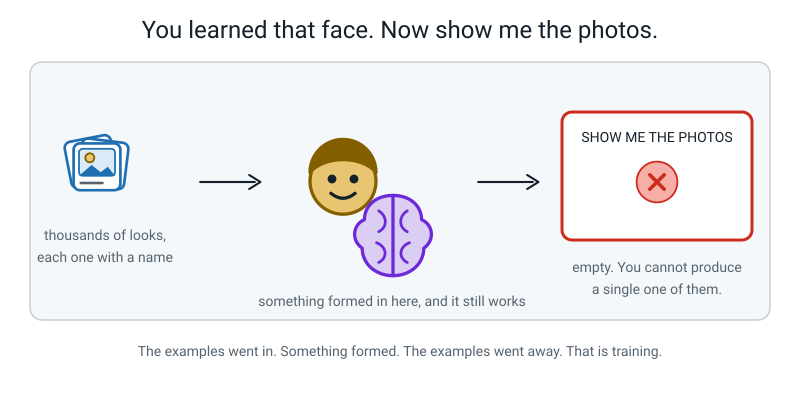
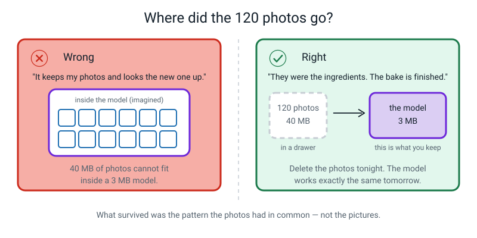
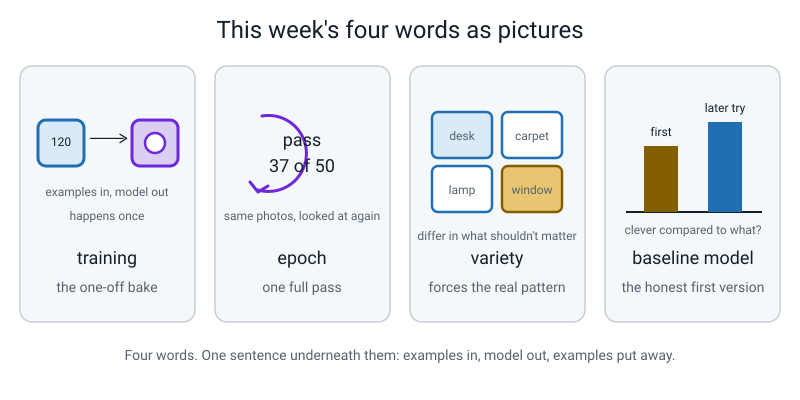

# Week 15 — Training: Turning 120 Photos Into a Guessing Machine

[⬅ Week 14](week-14.md) · [Course Home](../README.md) · [Week 16 ➡](week-16.md) · [Workbook](../workbook/week-15.md)

---

> ### This week in one sentence
> **Training is a one-time process: labelled examples go in, a model comes out — and after that the examples are put away and only the model remains.**
>
> **By the end of this chapter you will be able to:**
> - Describe **training** as a pipeline, and say what happens to the examples afterwards
> - Explain what an **epoch** is, and why a program looks at the same photo fifty times
> - Plan a photo collection **in writing** before touching a camera, using a **variety** checklist
> - Explain why forty varied photos beat four hundred near-identical ones — with a number, not an opinion
>
> **Reading time:** about 22 minutes. **Homework:** about 55 minutes, and it needs a camera.

---

## 🪝 Start Here

Think about somebody you know really well. Your best friend. Someone in your family. Don't say who.

Now: if that person walked past the window right now — from behind, in a coat, in the rain, thirty metres away — would you know it was them?

Yes. Of course yes.

**So how do you do that?**

Not "because I know them". I mean: what exactly is in your head that lets you recognise a person from behind, in a coat, in the rain, at thirty metres? Nobody sat you down and gave you a rule. Nobody said *"their shoulders are 42 centimetres wide and they lean slightly to the left."* So what have you got?

Sit with that for a moment, because it's a genuinely hard question and being stuck on it is the point.

You've got **something**. You definitely have. You just can't describe it and you can't read it.

Now the second question, and this is the one that starts the week.

> **Show me the photographs you learned it from.**

You saw that person thousands of times. Every one of those times was an example, and every one had a name attached — you knew who you were looking at. That is exactly what a training example is.

So where are they? Bring me the pictures.


*Figure 15.1 — The examples went in. Something formed. The examples went away.*

You can't. You cannot produce a single one of the thousands of looks that taught you that face. And yet **the thing you learned is still in there, working perfectly, right now.**

That is what happens inside a machine when it is trained. The examples go in. Something forms. The examples go away. What's left is called a **model** — and today you are going to be one, for real, with cards, in about twenty minutes.

---

## 🧠 The Big Idea

### 1. Four boxes: examples in, model out

> **Training** — the one-off process where a machine looks at labelled examples over and over, and adjusts itself until its guesses on those examples are as good as it can get them.


*Figure 15.2 — Examples go in once. A model comes out. Box 1 is drawn grey because those photos are put away afterwards.*

| Box | What it is | How long it lasts |
|---|---|---|
| **1. Labelled examples** | 120 photos, each with a name attached: `spoon`, `toothbrush`, `comb` | You make them once. They are used once. |
| **2. Training** | The *process*. The machine looks at the examples over and over and adjusts itself | About **20 seconds**, one time |
| **3. The model** | The finished guessing machine — a file of a few megabytes | You keep this for ever |
| **4. Guesses** | Feed it a brand-new photo, get an answer out | Again and again, as often as you like |

The word to hold on to is **one-off**. Compare it with something you already believe:

- A **calculator** does its job every time you press the button. Nothing was ever trained.
- A **model** does its job every time you show it a photo — but the *training* happened once, before you ever met it, and it is not happening again while you use it.

**🍕 The analogy that does the most work: the recipe and the cake.**
The examples are the ingredients. Training is the baking. The model is the cake.

Once the cake is baked you cannot get the eggs back out. You cannot read the recipe off the cake. And if the cake tastes wrong, the only fix is to bake a new one with better ingredients.

> **You never fix a model by arguing with it. You fix it by changing the examples and training again.**

That is the single most useful practical sentence in this week, and it is worth saying out loud.

### 2. The arithmetic that proves the photos are gone

You don't have to take anyone's word for it. Do the sums:

```
   120 photos from a phone      ≈  40 megabytes
   the model those photos made  ≈   3 megabytes
```

The model is **smaller than the data that made it** — about a thirteenth of the size. It cannot possibly be storing your pictures. **There is nowhere to put them.**

What it stored instead was a *pattern*: which arrangements of brightness and edge and curve tended to come with which of your three names.

> **🧑‍🏫 If someone asks you:** "maybe it just squashed them?" — that's a good guess, and the honest answer is: it squashed them so hard that the individual pictures are gone for ever and cannot be got back. What survived is the thing they had in **common**, not the pictures.

And the practical consequence: **delete all 120 photos tonight and the model works exactly the same tomorrow.**

### 3. An epoch: why look at the same photo fifty times?

> **Epoch** — one complete pass through every single training example. Fifty epochs means the machine went through all your photos, start to finish, fifty times.


*Figure 15.3 — One trip round the loop is one epoch. Nothing new arrives on pass 37 — it is the same photos, looked at again.*

**The analogy: tuning an old radio.** You turn the dial a little, listen, hear more static, turn it back the other way, listen again. Nudge, check, nudge, check. Nobody calculated the right dial position. You found it by nudging and listening.

The machine has **thousands** of tiny dials. One epoch is: look at all 120 photos, count how many it got wrong, then nudge every dial a tiny bit in whichever direction reduced the mistakes. Then do it again. After 50 rounds of nudging, the dials sit roughly where the mistakes are fewest.

**So why look again on pass 37?** Not because pass 37 shows it anything new. It's the same photos. It looks again because **the dials have moved since pass 36**, so the same photo now produces a different amount of wrongness — which tells you which way to nudge next.

> The photos are the **measuring stick**. You need the measuring stick every single time you adjust something.

**The arithmetic, which is fun:**

```
   120 photos × 50 epochs = 6,000 photo-looks

   a human at one photo per second, no breaks
      = 6,000 seconds
      = 100 minutes          (nearly two hours)

   the browser does it in about 20 seconds
```

Not magic. Very fast arithmetic, repeated a lot.

> **⚠️ Watch out:** an epoch is a **re-read**, not new material. Fifty epochs over five photos is still only five photos. Reading the same page fifty times does not put a second page in the book.

### 4. Variety: why 40 good photos beat 400 lazy ones

> **Variety** — how much your examples differ from each other **in the ways that shouldn't matter**, so the machine is forced to learn the thing that does.

A photo of a spoon is never just a spoon. It also contains a background, a light source, an angle, a distance, maybe a hand, maybe a shadow. **Training does not know which of those things you meant.** It finds whichever pattern separates your three piles most easily.

So if all forty spoon photos sit on a wooden table with a window on the left, then *"warm brown texture, light from the left"* is a far easier pattern to spot than *"spoon"*. Training takes the easy one. Every time.

**The true story.** In 2016, researchers built a classifier to tell huskies from wolves. It worked. They showed it to a room full of machine learning professionals and asked "do you trust this?" Most said yes.

Then they revealed the trick: **every wolf photo had snow in the background** and no husky photo did. The model had learned nothing about wolves. It had learned *white stuff at the bottom of the picture → say wolf.* Photograph a husky standing in snow and it says wolf, confidently, every time.

Nobody wrote that rule. Nobody wanted it. **It came out of the photographs.**


*Figure 15.4 — Same effort, same forty photos, not the same model.*

**The counting trick that turns this from an opinion into evidence.** Count *distinct situations*, not shutter clicks:

| | Set A — "quantity" | Set B — "quality" |
|---|---|---|
| photos | 40 | 40 |
| backgrounds | 1 (wooden table) | 5 (desk, carpet, tiles, wood, bed) |
| lighting | 1 (afternoon window) | 3 (window, ceiling, low lamp) |
| angles | 2 | 8 |
| distances | 1 | 2 |
| **distinct situations** | 1 × 1 × 2 × 1 = **2** | 5 × 3 × 8 × 2 = **240** |

Same effort. Same count. Set A teaches the machine about **two** situations, copied twenty times each. Set B samples forty points out of two hundred and forty, and every photo is a different one.

> **Thirty near-identical photos teach a machine roughly what one photo teaches it** — while making you feel like you did thirty times the work.

**And the hard rule that makes everything else work:**

> **⚠️ Watch out:** Whatever you vary for one object, vary it for **all** of them. If the spoons are all on the kitchen table and the combs are all on the bathroom floor, you have not built an object classifier. You have built a **floor-covering classifier** that happens to be right.

### 5. Four things to vary, every time


*Figure 15.5 — Four things to vary, every time, for every object.*

| Vary this | How many | How to actually do it |
|---|---|---|
| **background** | 5 | Five *named places*: "the blue rug in the hall", not "carpet" |
| **lighting** | 3 | Window light, ceiling light, one low lamp |
| **angle** | 8 | Turn the object one notch of eight **between every single shot** |
| **distance** | 2 | Close, and far |

The angles are the free ones and nobody ever does them. You don't need a separate row in your plan — you just turn the object a bit between every shot. Forty shots, eight turns, five times round.

The hardest one to actually do is **lighting**, because it needs you to come back at a different time of day or move rooms, and dim photos look bad so people quietly skip them. Predict now that this is the row you'll come up short on, and check yourself later.

### 6. Baseline model — the easiest word this week

> **Baseline model** — the first decent version you build, which every later experiment gets compared against.

That's the whole idea. Before you start changing things, you make one good honest version and **write its numbers down.** Then when you try something clever, you can answer the question "clever compared to *what*?"

You already have this habit from last week, where 13 out of 20 meant nothing until you had the baseline of 1 out of 20 to set it against. Same word, same job: **a number you compare against.**

This week you only need to know it's coming. In Week 17 the model you train first *is* your baseline model, and everything you try afterwards gets measured against it.

---

## 🔍 Worked Examples

### Worked Example 1 — Spoon, toothbrush, comb: planning the shoot (household)

Three objects, chosen on purpose to be hard: **a spoon, a toothbrush and a comb.** All small, all thin, all held in a hand. A machine that tells a spoon from a sofa proves nothing.

Target: **40 photos each. 120 in total.** And not one photo gets taken until the plan adds up.

**Step 1 — count the situations for two students.**

Student A shoots all forty on the kitchen table, in the afternoon, from two angles, at one distance.

```
   1 background × 1 lighting × 2 angles × 1 distance  =  2 situations
```

Two situations, twenty photos of each.

Student B uses five backgrounds, three kinds of light, eight turns and two distances.

```
   5 backgrounds × 3 lightings × 8 angles × 2 distances  =  240 situations
```

They shoot only forty of those 240 — but every single photo is a different one.

**And here is the question everybody gets wrong:** if Student A takes **400** photos instead of 40, how many situations do they have?

Still **two**. They photographed the same two scenes two hundred times each. No third scene appeared. That is the whole argument, in one number.

**What will Student A's model actually be detecting?** The kitchen table and the afternoon light. Those two things are in **100%** of the photos and they are far easier to spot than a thin metal shape. Move to the bathroom and a chunk of its evidence disappears.

**Step 2 — turn "be varied" into instructions you can follow at eight o'clock tonight when you're tired.**


*Figure 15.6 — The left half proves the plan is varied. The right half is a list you can follow without thinking.*

| # | background | light | how far | shots |
|---|---|---|---|---|
| 1 | desk | window | close | 6 |
| 2 | desk | low lamp | far | 6 |
| 3 | carpet | ceiling | close | 7 |
| 4 | tiles | ceiling | far | 7 |
| 5 | wood table | window | close | 7 |
| 6 | bed sheet | low lamp | far | 7 |
| | | | **total** | **40** |

**Step 3 — check the plan three ways, not one.** Adding the shots column is the easy check. Do the other two as well:

```
   by shots:       6 + 6 + 7 + 7 + 7 + 7                        = 40 ✓
   by background:  desk 12 · carpet 7 · tiles 7 · wood 7 · bed 7 = 40 ✓  (5 backgrounds)
   by lighting:    window 13 · low lamp 13 · ceiling 14          = 40 ✓  (3 kinds)
   by distance:    close 20 · far 20                             = 40 ✓  (2)
   by angle:       turn the object one notch of eight between every shot  (8)
```

Notice the desk appears twice, in rows 1 and 2, so it carries 12 photos against 7 for the others. That's acceptable — 30% of the set, not 100% — but if you spot that and even it out to 8/8/8/8/8, you are right and you should say so.

**Step 4 — the totals.**

```
   40 photos × 3 objects   = 120 labelled examples
   120 photos × 50 epochs  = 6,000 looks
   training time: about 20 seconds
```

**One afternoon of your work. Twenty seconds of the machine's.** That ratio is what this whole subject actually feels like, and nobody tells you.

**Step 5 — the rule that makes or breaks it.** The **same shot list** applies to all three objects. Not a bathroom list for the toothbrush and a kitchen list for the spoon. Write it at the bottom of your sheet in your own handwriting: *"Identical list for all three objects."*

### Worked Example 2 — Lemon, lime, green apple: diagnosing a shoot that already went wrong (food)

Somebody else has already taken their photos. Your job is to read their tally sheet and predict where their model will fail — before they train it.

**Their tallies:**

| class | photos | backgrounds used | lighting used | anything else |
|---|---|---|---|---|
| `lemon` | 40 | kitchen counter (40) | window (40) | — |
| `lime` | 40 | kitchen counter (40) | window (40) | — |
| `green_apple` | 40 | garden grass (40) | outdoor daylight (40) | — |

**Step 1 — count the distinct situations per class.**

```
   lemon:        1 background × 1 lighting × maybe 2 angles = about 2
   lime:         1 background × 1 lighting × maybe 2 angles = about 2
   green_apple:  1 background × 1 lighting × maybe 2 angles = about 2
```

Six situations in total, for 120 photos. Set A three times over.

**Step 2 — find the pattern that separates the piles most easily.** Ask: what is in 100% of one class's photos and 0% of the others?

**Grass.** Every single apple photo has grass in it. Not one lemon or lime photo does.

So the easiest pattern available is *"green messy texture underneath → say apple"*. Nothing to do with apples. It is available, it is cheap, and training will take it.

**Step 3 — predict two specific failures, with the reason.**

| Test photo | Prediction | Why |
|---|---|---|
| A green apple on the **kitchen counter** | `lemon` or `lime` | The grass is gone, and grass was the whole reason it ever said apple |
| A **lemon** lying on the **grass** | `green_apple`, confidently | Grass present → apple, and colour was never needed |

**Step 4 — and a second, quieter problem.** Lemons and limes were shot in *identical* conditions — same counter, same window. So for that pair, background can't help at all, and the model has to fall back on shape and colour. That's actually **good** for lemon-versus-lime. So this model will probably be reasonable at lemon versus lime and catastrophic at apple versus everything.

That's a subtle finding and it's the kind of sentence that separates guessing from measuring:

> *"Same 120 photos, and the model is honest about one pair and cheating on the other."*

**Step 5 — the fix, in numbers.** Do not take 400 more photos. Take the **missing** ones:

```
   green apples on the kitchen counter, window light   -> 8 photos
   lemons on the garden grass, outdoor light           -> 8 photos
   limes on the garden grass, outdoor light            -> 8 photos
                                                          --------
                                                          24 photos
```

Twenty-four well-chosen photos beat four hundred more of the same, because those 24 are the only ones that break the grass pattern. **Ask what kind of photo is missing, then go and take that one.**

### Worked Example 3 — Glue stick, marker, eraser: the pile that got forgotten (school)

A student photographs three things from the classroom cupboard. They get bored.

| class | photos taken |
|---|---|
| `glue_stick` | 40 |
| `marker` | 40 |
| `whiteboard_eraser` | 8 |
| **total** | **88** |

They ask: "is 8 enough? I'll just run 500 epochs to make up for it."

**Step 1 — the epoch question first, because it's quick.**

```
   88 photos × 50 epochs  = 4,400 looks
   88 photos × 500 epochs = 44,000 looks
```

Ten times the looks. **Zero extra photos.** No new information entered the building. The dials get nudged ten times as often over the same 88 pictures, and past a certain point the machine starts memorising *those exact pictures* instead of the general idea — which is a real problem with a real name, and it's what Week 21 is about.

So: no. 500 epochs does not fix 8 photos.

**Step 2 — now the harder question: what does the machine actually do with 8 against 40 and 40?**

Here is the key fact. **Training reduces the *total* number of mistakes across all examples, and it does not care which pile they come from.**

So think like the machine. What if it simply **never said `whiteboard_eraser` at all**?

```
   it gets all 40 glue sticks right     = 40
   it gets all 40 markers right         = 40
   it gets all 8 erasers wrong          =  0
                                          ---
   correct                              = 80 out of 88

   80 ÷ 88 = 0.909 = 90.9% accuracy
```

**Ninety-one percent** — which looks like a good model — from a machine that has quietly decided the eraser does not exist. Its accuracy on erasers is **0%**.

Abandoning the small pile costs 8 mistakes out of 88. That is a cheap deal, and the machine will take it, because nobody told it that erasers matter as much as markers.

**Step 3 — the fix and the rule.** Take 32 more eraser photos, so the counts are 40 / 40 / 40. The working rule for this course:

> Keep your class counts within about **20%** of each other.

**Step 4 — what this teaches you about numbers.** A single accuracy number of 90.9% hid a class that was completely broken. That is the first time this year you've seen an average conceal a disaster, and it will not be the last — Week 20 is built on exactly this.

---

## 🎲 What We Did In Class

Two halves. The first half is the fun one. The second half is the one that matters, and it is the one everybody wants to skip.

### Half one — Be the Model, Unplugged

**You need:** 12 hand-drawn training cards, 6 hand-drawn test cards, an envelope or a drawer, a timer, and a six-row scoring sheet.

**The three creatures.** Made up, and each one has exactly one rule:

| Creature | The rule |
|---|---|
| **Blorb** | exactly 3 legs, no spikes, no tail |
| **Zunk** | exactly 3 spikes, no legs, no tail |
| **Fip** | one tail, no legs, no spikes |


*Figure 15.7 — Three creatures, three rules, and one trap built on purpose.*

**Phase 1 — be trained (6 minutes).** Twelve cards, shown to you one at a time, **twenty seconds each**, with the name said out loud. Four Blorbs, four Zunks, four Fips.

The rules, and they are strict:

1. Twenty seconds per card and no longer.
2. You may **not** take notes, write anything, or photograph anything.
3. You may not ask questions.

> **⚠️ Watch out:** notes are not a model. Notes are *keeping the examples* — which is the exact belief this activity exists to break. If you catch yourself reaching for a pencil, that reflex is the misconception, showing itself.

**Phase 2 — the envelope (1 minute).** All twelve training cards go into an envelope. The envelope is sealed and put in a drawer, in full view, slowly.

> *"Those are gone. Everything you learned from them is now in exactly one place, and it isn't on this table."*

**Phase 3 — be tested (5 minutes).** Six brand-new cards, one at a time. You say one name: Blorb, Zunk or Fip. Nobody reacts. Nobody tells you the answers until all six are done. And if you say "I don't know", the answer is: **you still have to pick one.** A machine cannot decline either.

**Phase 4 — the reveal.** Here is what the six cards were, and what almost everyone says:

| card | what it is | what most people say | truth | what happened |
|---|---|---|---|---|
| 1 | large Blorb | Blorb ✓ | Blorb | Legs and size agree, so this tells you nothing |
| 2 | small Zunk | Zunk ✓ | Zunk | Both cues agree again |
| 3 | medium Fip | Fip ✓ | Fip | The tail is unmistakable — and Fips were drawn at mixed sizes |
| 4 | **small** Blorb | **Zunk** ✗ | Blorb | Three legs, no spikes — but every Blorb you saw was **large** |
| 5 | **large** Zunk | **Blorb** ✗ | Zunk | Three spikes, no legs — but every Zunk you saw was **small** |
| 6 | three legs **and** a tail | anything, slowly | **none of the three** | A mixture that was never in training |

**Typical score: 4 out of 6.**

Now the five questions, in this order, because the order is the lesson:

**"What did you get cards 4 and 5 wrong because of?"**
**Size.** Every Blorb in training was big and every Zunk was small — so "big means Blorb" was a *perfect* separator on the training cards, and much easier to notice than counting three legs against three spikes.

**"Did anyone tell you size mattered?"**
No. The three rules were legs, spikes, tail. Size was never mentioned once.

**"So who put 'big means Blorb' in your head?"**
**The examples did** — because of how they were drawn.

**"What's the fix — you, or the cards?"**
**The cards.** Blorbs at mixed sizes and Zunks at mixed sizes, and size stops being a separator, so the only thing left to learn is legs versus spikes. "I'd try harder" is arguing with the cake. You change the ingredients.

**"Where are the twelve cards right now?"**
In the envelope, in the drawer. And you still got about four out of six. **So what did the work?**

Card 3 is the proof that the trap really was about size: Fip was drawn at mixed sizes, and Fip was fine.

And card 6 has **no right answer**. You had three boxes and something that fitted none of them, and you were forced to put your belief in one. A model is in exactly that position constantly. That's next week.

### Half two — Plan your own shoot

Now the paper half. Three objects, chosen to be **similar** — three toothbrushes, three spoons, three socks, three pens. Not an elephant and a spoon.

**Step 1 — objects and class names.**

```
   object 1: ________________   class name: ________________
   object 2: ________________   class name: ________________
   object 3: ________________   class name: ________________
```

Class names must be words you'll still understand in three days. Not `A`, `B`, `C`.

**Step 2 — the variety checklist, with real places in your real house.**

```
   BACKGROUNDS (5):  1.________  2.________  3.________  4.________  5.________
   LIGHTING (3):     1.________  2.________  3.________
   ANGLES (8):       turn the object one notch between every shot
   DISTANCES (2):    close  ·  far
```

Named places, not categories. *"The blue rug in the hall"* beats *"carpet"*.

**Step 3 — a numbered shot list adding to exactly 40.** Same shape as the worked example above.

**Step 4 — write at the bottom, in your own hand:** *"Identical list for all three objects."*

**Step 5 — predict your own laziness.** One line:

> *"The row I'm most likely to skip is ________ because ________."*

You check that against reality in the homework. Being right about your own future laziness is a genuinely valuable skill, and it is the same skill as predicting where a model will fail before you test it.

---

## 💬 Talk About It

**1. "If I delete all the photos, does the model stop working?"**
Ask an adult before you tell them. Most say yes.
*Hint for you:* no. Training already happened, and the photos were the ingredients, not parts of the cake. The knock-down argument is the arithmetic: **40 megabytes of photos, a 3 megabyte model.** There is nowhere to keep them. And you have physical proof from class — the twelve cards were in a drawer while you classified six new ones.

**2. "Does a machine learn the way I do? Does anyone actually know?"**
This is a good one to take to a grown-up, because the honest answer surprises people.
*Hint for you:* nobody knows for sure, and that's a real answer rather than a dodge. The similarities are genuine: nobody gave you a rule for recognising your friend either, and you learned from thousands of labelled examples. But the differences are genuine too — you learned "dog" from about five dogs, where a from-scratch model needs tens of thousands, and you can learn from one bad experience in one second, which no model can. **And the deepest reason nobody can settle it is that we can't read either one.** We can't read the thousands of dials inside a trained model, and we can't read the connections inside your head. Two things we can't inspect, being compared.

**3. "Which takes longer — collecting the photos, or the training?"**
Almost everybody guesses wrong, including adults who work with computers.
*Hint for you:* collecting. It's an **afternoon** of your work against about **twenty seconds** of the machine's. The slow part of AI is a person with a camera and a folder, and that fact is quietly missing from almost every film about robots.

---

## ⚠️ Don't Get Tricked

### Trick 1 — "The computer keeps my photos and compares new ones against them"


*Figure 15.8 — Two beliefs about the same 120 photos. Only one survives the arithmetic.*

| ❌ Wrong | ✅ Right |
|---|---|
| "It looks up my 120 photos and finds the closest match." | "The photos are put away. A 40 MB pile cannot fit inside a 3 MB model. What's left is the pattern they had in common." |

This is the big one, and almost everybody believes it — it's a completely reasonable guess, because it's how *we* would do the job.

**And it matters, practically.** If you believe a model keeps its examples, then you believe you can fix a bad model by *explaining* things to it, and you believe a model that fails has "forgotten" something. Both are false, and both waste your afternoon. A model that fails was made from the wrong ingredients, and the only repair is new ingredients and a new bake.

### Trick 2 — "More epochs means more learning"

| ❌ Wrong | ✅ Right |
|---|---|
| "My model's weak, I'll run 500 epochs instead of 50." | "500 passes over the same 10 photos is still 10 photos. I need more **different** photos, not more passes." |

The one-question test to run on yourself: **"how many photos did that add?"** None. That's the whole correction.

(And past a certain point, extra epochs make things actively worse, because the machine starts memorising *those exact photos* instead of the general idea. That has a name. Week 21.)

### Trick 3 — "More photos is always better"

| ❌ Wrong | ✅ Right |
|---|---|
| "I took 400 photos, so my set is ten times better than 40." | "400 photos of two situations is **two situations**, photographed 200 times each. Count situations, not clicks." |

Do the multiplication before you take a single photo:

```
   backgrounds × lighting × angles × distances = distinct situations
```

If that number comes out at 2, taking more photos does not change it.

### Trick 4 — "I got those cards wrong because I wasn't concentrating"

| ❌ Wrong | ✅ Right |
|---|---|
| "I should have counted the legs. My fault." | "Every Blorb I was shown was large. Size was a perfect separator in training. The **cards** were the problem." |

This is the kindest and most important correction in the week. You weren't careless. You did exactly what training *does*: you found the easiest pattern that separated the piles.

> **The machine learns the easiest pattern that separates your piles — not the pattern you meant.**

The wolves were snow. Your Blorbs were size. And when your own model fails next month, your first question should not be "what did I do wrong?" but **"what is in 100% of one class's photos and 0% of the others?"**

---

## 🌍 Where You've Seen This

1. **Your phone's photo app, grouping faces.** It was trained once, on labelled examples. When it gets your cousin wrong you cannot explain your cousin to it — you can only re-label some photos and let it rebuild. That's the cake.
2. **Voice assistants mishearing one particular word.** The training examples didn't contain enough voices like yours. Nothing you say now teaches it; somebody has to retrain it with different examples.
3. **Learning a friend's face.** Thousands of labelled looks, examples unavailable afterwards, a skill you can use but not read. Genuinely the same shape as training, which is why the hook works.
4. **Learning to catch a ball.** Nobody gave you the equations. You threw, missed, adjusted, threw again — nudge, check, nudge, check. That's fifty epochs of a dial you can't see.
5. **A dog that only sits in the kitchen.** Every time you practised "sit", you were in the kitchen with a treat in your hand. The dog learned "kitchen plus treat plus that word", not "that word". Same trap as the wolves and the snow, on four legs.
6. **Learning your times tables in one order.** If you only ever practised 7×8 and never 8×7, one of them feels harder. Same information, wrong variety.

---

## 🧭 Where This Fits

A new box lights up this week. The FEATURES box is finished and white now, with all four of its
weeks written under it, and the shading has moved down to the middle row of the map for the first
time. You have stopped describing things and started building one.


*Figure 15.0 — The map after Week 15. FEATURES has turned white and kept its weeks. The tinted box
with the tick is TRAINING, and it is the first box on the middle row of nine.*

| | |
|---|---|
| **The mental model you now own** | Training is a **one-off process**, not a conversation: labelled examples go in, a model comes out, and then the examples are put away. You cannot explain anything to a model afterwards, and you cannot tell it off. If it is wrong you change the examples and bake it again. |
| **The one question it answers** | *"How many different situations are in my examples — not how many photos?"* |
| **What it plugs into** | Week 11's features and labels, exactly the same idea, except the examples now arrive as photographs instead of numbers you measured by hand. The machine finds its own columns; you choose what you point the camera at. |
| **What carries forward** | These are the photos you train on in Week 17, sabotage one thing at a time in Week 18, and discover were lopsided all along in Week 31. Take them properly and three future weeks get easier. |
| **Spiral thread** | 📦 **Model** — the thing that comes out of the oven — and 🎯 **Learning signal** — the labels that told it what "right" looked like. |

> **💡 Try this:** on your own map, shade the TRAINING box and write *in: examples · out: model* under
> it. Then look at how much of the middle and bottom rows is still dashed. Everything down there
> exists because a trained model is not automatically a good one.

---

## 🔑 Remember This

- **Training is a one-off process, and the model is what it leaves behind.** Examples in, model out, examples put away.
- **You cannot talk to a model, read it, or fix it by explaining.** You change the examples and bake again.
- **The arithmetic proves it:** 40 MB of photos make a 3 MB model. The pictures are not in there.
- **An epoch is a re-read, not new material.** 120 photos × 50 epochs = 6,000 looks and zero new information after pass one.
- **Count distinct situations, not photos.** backgrounds × lighting × angles × distances. Forty photos across five backgrounds beat four hundred on one table.
- **Whatever you vary for one object, vary for all of them** — or you've built a background detector with a perfect score and no value.
- **The machine learns the easiest pattern that separates your piles.** Snow for wolves. Size for Blorbs. Grass for apples. Never what you meant.
- **Keep your class counts within about 20% of each other**, or the machine will quietly abandon the small pile and still report 91%.

---

## 📓 New Words


*Figure 15.9 — This week's four words, drawn.*

| Word | What it means | Example |
|---|---|---|
| **training** | The one-off process where a machine reads labelled examples over and over and adjusts itself, producing a model | 120 labelled photos in, one 3 MB model out, about 20 seconds |
| **epoch** | One complete pass through every training example | 50 epochs over 120 photos = 6,000 photo-looks |
| **variety** | How much your examples differ in the ways that **shouldn't** matter, so the machine has to learn the thing that does | 5 backgrounds × 3 lights × 8 angles × 2 distances = 240 distinct situations |
| **baseline model** | The first decent, honest version you build, that every later experiment gets compared against | "My baseline scored 8/10. The new version scored 9/10, so the change gained one." |

---

## 📤 Your Homework

Go to **[the Week 15 workbook](../workbook/week-15.md)**. About **55 minutes**, and you need a camera.

| Page | What to do | Time |
|---|---|---|
| **15.1** | Warm-up and Practice Set A — the pipeline, epochs, labelling the blank four-box diagram | 12 min |
| **15.2** | Practice Set B — five new scenarios, including two shoots that go wrong | 12 min |
| **15.3** | **Take the photos.** 40 of each object, 120 in total, following your shot list **exactly**. Row 1 says six on the desk by the window, close — take six, and turn the object between every one | 30 min |
| **15.4** | **Sort them into three folders**, named with your real class names. Not `A`, `B`, `C` | 5 min |
| **15.5** | **Fill in the tally sheet** — planned against actual, for every background and every lighting kind. Then one line: **which condition did you come up short on, and why?** | 10 min |

> **⚠️ Watch out:** don't improvise the shoot. The list **is** the point. If you improvise you will end up with forty photos of one table, feel like you worked hard, and have two situations to show for it.

> **💡 Try this:** the last line on page 15.5 is the one that gets read first. Everybody comes up short somewhere. The people who **know** where they're short can fix it in twenty minutes; the people who don't get a mystery failure next month and never find out why. So write the consequence too: *"most of my photos are bright, so my model will be bad at guessing anything photographed in a dim room in the evening."*

> **🧑‍🏫 If you have no camera:** the plan is still the homework. Write the full 40-shot list, shoot whatever you can — even ten photos — and mark the rest as not taken. Fill in the tally for what exists. A written plan with ten photos beats forty unplanned ones, and Week 17 has a version that works with a small set.

**Next week** is about the number that sits next to every guess — the percentage. You'll find out that `spoon, 74%` does **not** mean "74% chance of being right", and that a model shown something it has never met will report a big confident-looking number while being completely wrong. Card 6 was your first taste of it.

---

[⬅ Week 14](week-14.md) · [Course Home](../README.md) · [Week 16 ➡](week-16.md) · [📓 Workbook — Week 15](../workbook/week-15.md) · [Glossary](../../glossary.md)
