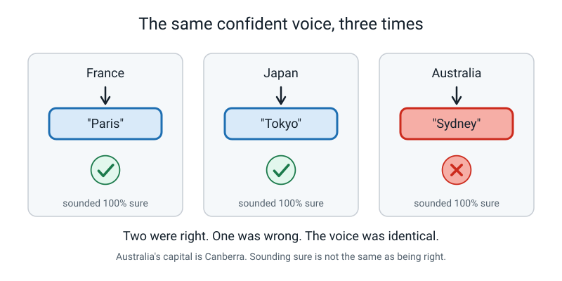
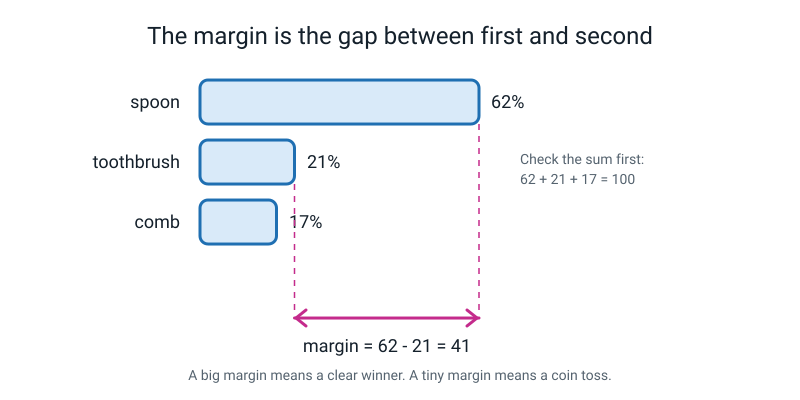
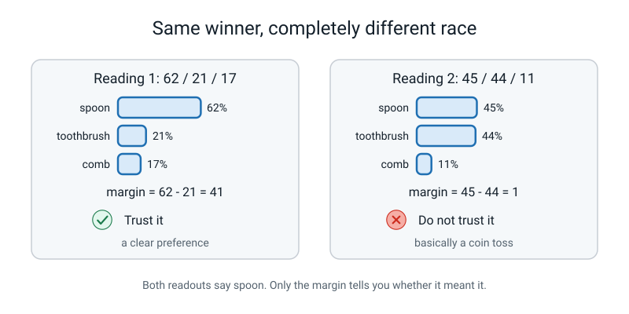
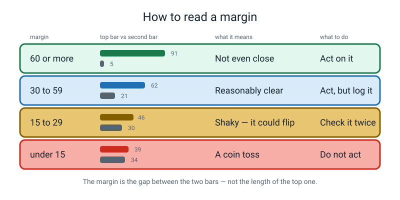
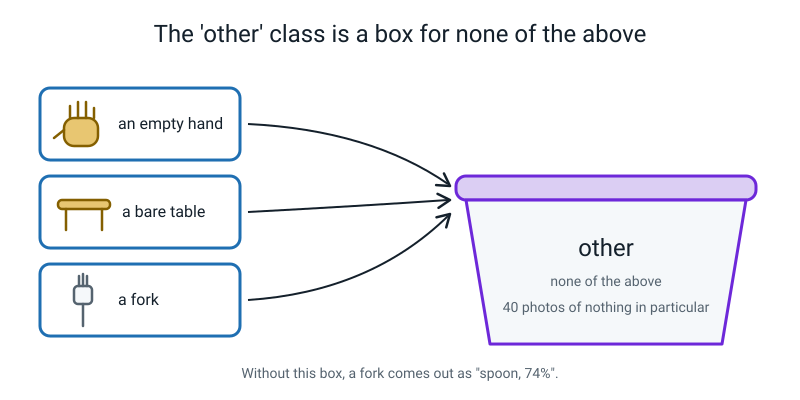
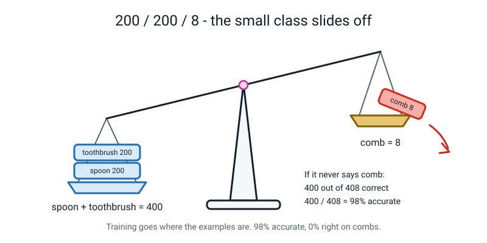
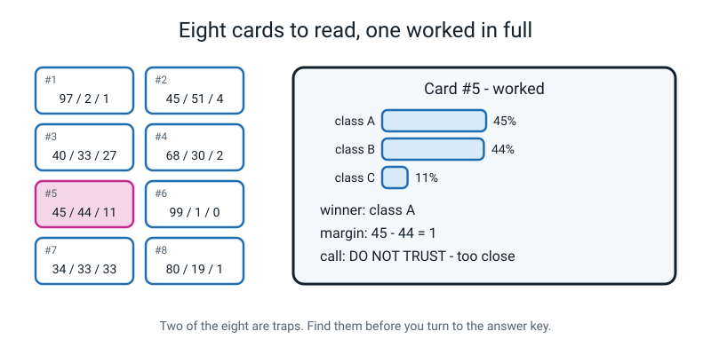
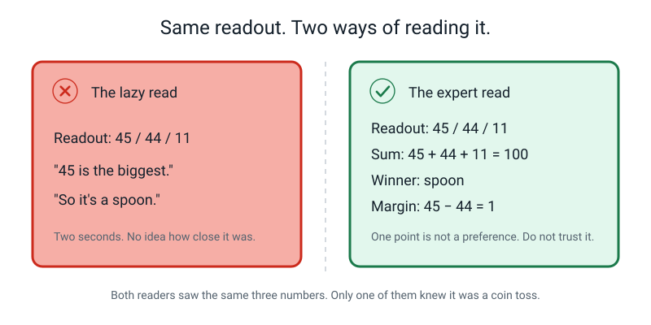
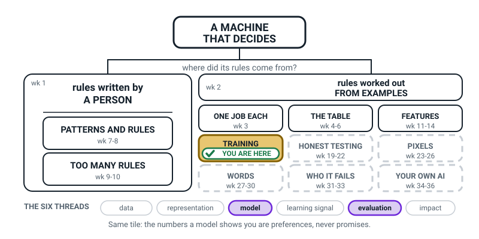
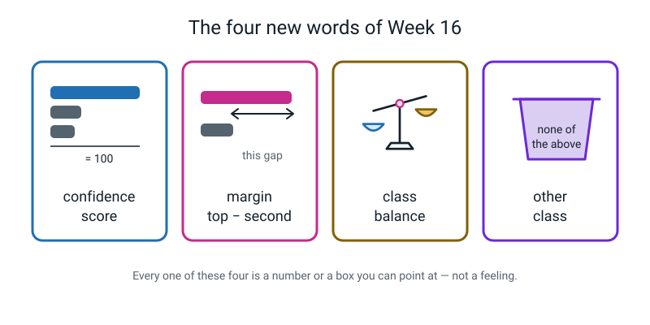

# Week 16 — Confidence Is Not Correctness

[⬅ Week 15](week-15.md) · [Course Home](../README.md) · [Week 17 ➡](week-17.md) · [Workbook](../workbook/week-16.md)

---

> ### This week in one sentence
>
> **A confidence score tells you how strongly a model *prefers* one answer — it is a guess strength, not a promise — and the *margin* between first and second place tells you how close the race really was.**
>
> **By the end of this chapter you will be able to:**
> - Read a set of confidence scores and check they add up to 100%
> - Work out the **margin** between the top two scores, and say what a small margin means
> - Predict what an unfair set of classes (200 / 200 / 8) will do to a model, and prove it with arithmetic
> - Write your own **confidence policy** with a real number in it, and defend that number
>
> **Reading time:** about 25 minutes. **No computer needed this week.** Just this chapter, a pencil, and your notebook.

---

## 🪝 Start Here

Imagine I stand at the front of the room and say three things, one after another, in exactly the same voice.

> "The capital of France is **Paris**." *(Completely certain.)*
>
> "The capital of Japan is **Tokyo**." *(Completely certain.)*
>
> "The capital of Australia is **Sydney**." *(Completely certain.)*

Two of those are right. One is wrong — Australia's capital is **Canberra**, not Sydney.

Here is the uncomfortable part. I said all three in the same confident voice. If you didn't already know the answer, **there was nothing in my voice to warn you.** Confidence sounded exactly the same whether I was right or wrong.


*Figure 16.9 — Two right, one wrong, one voice. Sounding sure and being right are different things.*

Next week you are going to build a real model with a camera, and every single time it guesses it will show you a number: 62%, 91%, 45%. That number is the machine's version of a confident voice.

This week — before the camera starts moving and distracting you — you are going to learn to read that number properly. Because most adults read it wrong, and getting it wrong is how people end up trusting machines they shouldn't.

> **💡 Try this before you read on:** think of one time you were *completely sure* about something and turned out to be wrong. A test answer. A person's name. Which cupboard the cereal was in. Write it down in one line. We come back to it at the end.

---

## 🧠 The Big Idea

### 1. A model has exactly 100 points of belief, and it must give every point away

When you hold a spoon up to a trained model, it does **not** say "spoon."

What actually comes out underneath is never just "spoon." It is **one number for every box you gave it**, like this:

```
   spoon       ████████████████████░░░░░░░░░░   62%
   toothbrush  ███████░░░░░░░░░░░░░░░░░░░░░░░   21%
   comb        █████░░░░░░░░░░░░░░░░░░░░░░░░░   17%
                                              ─────
                                               100%
```

> **Confidence score** — how strongly the model prefers each class, given as percentages that always add up to 100%.

Add those three up: 62 + 21 + 17 = 100. That is not luck. **It happens every single time.**

🍕 **The analogy — one pizza, three people.**
There is exactly one pizza and it has to be shared out between three people. If Ravi gets most of it, there is less left for the other two. You cannot give away more than one pizza, and you cannot keep a slice in your pocket — every slice goes to somebody. A confidence readout is a pizza being shared out between your classes.

That means the model is **not** answering the question you think it is. You think you asked *"is this a spoon?"* You didn't. You asked:

> *"Of the three boxes I gave you, which one fits best?"*

And it is **forced** to answer. Even if you hold up a shoe.

**A real example with real numbers.** Say the readout is 62 / 21 / 17. Read it out loud like this, in the model's voice:

> *"Spoon fits best of the three. But 38 of my 100 points went somewhere else. I am not comfortable."*

That is a much more honest reading than "it says spoon."


*Figure 16.1 — Read it left to right: the winner first, then the gap. The gap is the part almost everyone skips.*

---

### 2. The margin is the number that actually tells you something

Most people read the biggest number and stop. That is a mistake, and here is the proof. Look at these two readouts:

| Readout | Top score | Second score | Margin |
|---|---|---|---|
| 62 / 21 / 17 | 62% | 21% | **41** |
| 45 / 44 / 11 | 45% | 44% | **1** |

Both of them pick the **same winner** — the first class. If a phone app just showed you the winning word, both of these would say "spoon" and look identical.

But they are not remotely the same. In the first one, the winner beat the runner-up by **41 points**. In the second, it won by **one point**. One point is not a preference. One point is a shrug that happened to land on the left.

> **Margin** — the top score minus the second-highest score. It tells you how close the race was.

🍕 **The analogy — the sprint final.**
Two races. In the first, the winner finishes twenty metres ahead of second place; you'd bet money she's the faster runner. In the second, the winner finishes by the width of a shoelace; run it again tomorrow and anyone could win. **Both races have a winner. Only one of them tells you who is better.**


*Figure 16.2 — Identical winner. Completely different situation. Only the margin shows it.*

Here is the reading guide this course uses all year. It is not an official law of the universe — it's a sensible habit — but use it consistently and you will stop being fooled.


*Figure 16.10 — Four bands. Learn these; you will use them every week from here to Week 36.*

| Margin | What it means | What you should do |
|---|---|---|
| **60 or more** | Not even close | Act on it |
| **30 – 59** | Reasonably clear | Act on it, but write it down |
| **15 – 29** | Shaky — a small change could flip this | Check it another way |
| **Under 15** | A coin toss dressed up as an answer | Do not act on it |

**Watch how the arithmetic works, every time, in the same order:**

```
   readout:   68  /  30  /  2
   sum:       68 + 30 + 2  =  100     ✓ so I read the bars correctly
   winner:    the 68  (biggest number, not the first one)
   margin:    68 − 30  =  38          → band "30–59" → act, but log it
```

> **⚠️ Watch out:** the margin is **top minus second**, never top minus bottom. In 68 / 30 / 2 the margin is 38, not 66. It's a race for first place, so only second place can threaten the winner. The last-place bar is irrelevant.

**Why professionals care about the margin more than the top score:** the margin moves *before* the right-or-wrong column does. A model that is quietly falling apart will keep getting answers right for a while, but its margins shrink first. **The margin is an early warning. Right-or-wrong is a late one.**

---

### 3. A confident answer can be completely, hopelessly wrong

This is the sentence to tattoo on your brain:

> **A confidence score is not the chance of being right.**

99% confident does **not** mean "right 99 times out of 100." It means "of the boxes I was given, this one fits far better than the others." Those two things fall apart completely the moment you show the model something that isn't in **any** of its boxes.

**The demonstration, with real numbers.** Take a model that knows exactly three things: spoon, toothbrush, comb. Now hold up a **fork**. There is no fork class. There never was. It reports:

```
   spoon 74%   ·   toothbrush 15%   ·   comb 11%
```

Check it: 74 + 15 + 11 = 100 ✓. Winner: spoon. Margin: 74 − 15 = **59** — that's in the "reasonably clear" band, and it is a **bigger margin than this model usually gets on a real comb.**

And it is 100% wrong.

**The model is not broken.** Read that again. It is doing precisely what it was built to do. It has 100 points of belief and three boxes, and a fork is more spoon-shaped than it is comb-shaped, so that is where the belief went. **It had nowhere else to put it.**

🍕 **The analogy — the multiple-choice question you had no idea about.**
A, B or C. You genuinely don't know, so you tick B because it feels least wrong. Your answer sheet now says **B**, with total certainty, in ink. It does not record your shrug. A confidence score is the shrug the model is honest enough to show you — and most apps throw it away and show you only the letter.

#### So give it somewhere honest to put the belief

If a model must always pick one of your boxes, then the fix is obvious the moment you hear it: **give it a box for "none of the above."**

> **`other` class** — an extra class you fill with photos of things that are *not* any of your real classes: an empty hand, a bare table, a fork, a pen, a wall.


*Figure 16.3 — Give it somewhere honest to put the belief, or it will put it somewhere wrong.*

It is not a magic fix, and you should know the cost. Adding one big messy class usually steals a few points of belief from your real classes, so **many margins get a bit smaller**. That's a real trade: you lose a little sharpness and you gain the ability to say "I don't know."

Here is the part worth being slightly annoyed about: **many real products don't do this.** That is one reason they can be confidently wrong at you.

---

### 4. Class balance: the arithmetic that makes an impressive number worthless

> **Class balance** — how evenly your examples are spread across the classes. Roughly equal counts is **balanced**; wildly unequal counts is **imbalanced**.

Why does this matter? Because of how training works. Training nudges the model to reduce **total mistakes across all the examples**. It does not care *which* class the mistakes come from. So if one class is huge and one is tiny, the cheapest way to cut total mistakes is to lean towards the big classes and quietly give up on the small one.

🍕 **The analogy — the class vote.**
Thirty children vote on the school trip. Twenty-eight want the zoo, two want the museum. The zoo wins. And it will win every time, forever. Those two children are not outvoted because they're wrong — they're outvoted **on the count**. Now imagine the vote decides what your model believes.


*Figure 16.4 — The count decides. Training goes where the examples are.*

**Now do the arithmetic yourself.** Somebody trains a three-class model with:

| class | training photos |
|---|---|
| spoon | 200 |
| toothbrush | 200 |
| comb | 8 |
| **total** | **408** |

Suppose the model gives up on combs completely and never once outputs "comb." How does it score on its own training photos?

```
   total photos   =  200 + 200 + 8     =  408

   got right      =  200 (spoons)
                  +  200 (toothbrushes)
                  +    0 (combs)       =  400

   accuracy       =  400 ÷ 408
                  =  0.98039…
                  ≈  98.0%
```

**98.0% accurate.** That number would look magnificent on a poster. And the model is **0% right on every single comb** — the class somebody presumably added *because they cared about combs.*

```
   accuracy on combs  =  0 ÷ 8  =  0.0  =  0%
```

Nobody lied. Both numbers are true. The 98% just answers a question nobody should have asked.

**The fix is boring:** make the counts roughly equal. The working rule this course uses is that the **biggest class should be within about 20% of the smallest**.

```
   check:  (biggest − smallest) ÷ biggest

   41 / 40 / 39   →  (41 − 39) ÷ 41  =  2 ÷ 41  ≈  4.9%   ✓ balanced
   200 / 200 / 8  →  (200 − 8) ÷ 200 =  192 ÷ 200 =  96%   ✗ nowhere near
```

> **⚠️ Watch out:** the fix is **not** to cut the big classes down to 8 each. 8 / 8 / 8 is perfectly balanced and completely useless — 8 photos is far too few for *any* class. The sensible answer is about 40 each, which is exactly what you collected in Week 15.

---

### 5. Your confidence policy: the rule your model must obey

You now know enough to write a real engineering rule. A **confidence policy** is a written rule, with actual numbers in it, that says when your model is allowed to answer and when it must shut up and say "not sure."

It looks like this:

```
   MY CONFIDENCE POLICY
   ─────────────────────────────────────────────────────
   If the top score is below ______ %,
   OR the margin is below ______ points,
   my model must say  "not sure"  instead of guessing.
```

Two numbers, not one. Here is why you need both: 45 / 44 / 11 has a *middling* top score of 45 and a *terrible* margin of 1. A policy about the top score alone would let it through. A policy about the margin catches it.

And notice the word **OR**, not AND. With OR, failing *either* test blocks the answer — that's stricter, and stricter is right here.

There is no single correct policy. What matters is that you can **defend your numbers with an example**. "65% and 25 points" is a good answer if you can say why. "Whatever" is not an answer at all.

---

## 🔍 Worked Examples

### Example 1 — Food: the canteen photo sorter

A school canteen has a camera that photographs each tray and sorts what's on it into three classes: **apple**, **banana**, **sandwich**. Here are three readouts from one lunchtime.

**Reading A — a banana was on the tray.**

```
   apple 54   ·   banana 39   ·   sandwich 7
```

Step 1 — **sum:** 54 + 39 + 7 = **100** ✓ (so I read the bars right)
Step 2 — **winner:** 54, so **apple**
Step 3 — **margin:** 54 − 39 = **15**
Step 4 — **band:** 15 is the very bottom of "15–29 shaky"
Step 5 — **call:** **do not trust it.** And in fact it was **wrong** — there was a banana on the tray. Notice that the margin warned us *before* we knew the true answer. That's the whole point of computing it.

**Reading B — a sandwich was on the tray.**

```
   apple 4   ·   banana 8   ·   sandwich 88
```

Sum: 4 + 8 + 88 = **100** ✓. Winner: **sandwich**. Margin: 88 − 8 = **80**.
Band: 60+, "not even close." **Call: trust it.** Right answer, huge margin, nothing else in the race. This is what a good reading looks like — and you need to see one, or you'll start believing all models are useless.

**Reading C — a pear was on the tray.**

```
   apple 71   ·   banana 22   ·   sandwich 7
```

Sum: 71 + 22 + 7 = **100** ✓. Winner: **apple**. Margin: 71 − 22 = **49**.
Band: 30–59, "reasonably clear." **Call: it looks fine and it is completely wrong.**

There is no pear class. There never was. A pear is round, fruit-sized and has a stalk, so of the three boxes it lands nearest **apple** — and 100 points of belief had to go somewhere. Compare it with Reading A: A was wrong *and* warned you. C was wrong and **did not warn you at all.**

> **🔑 What Example 1 teaches:** a good margin is necessary but not sufficient. You also have to know **what was actually put in front of the camera.**

---

### Example 2 — Sport: the cricket shot classifier, and the 96.8% that means nothing

A coach wants to sort video clips of a batter into three shots: **cover drive**, **pull shot**, **defensive block**. She collects clips:

| class | clips |
|---|---|
| cover drive | 150 |
| pull shot | 150 |
| defensive block | 10 |
| **total** | **310** |

**Question 1 — is this balanced?**

```
   (biggest − smallest) ÷ biggest
   = (150 − 10) ÷ 150
   = 140 ÷ 150
   = 0.9333…
   ≈ 93%
```

We want under 20%. We got 93%. **Badly imbalanced.**

**Question 2 — what will the model do?** Before reading on, predict it. Write one sentence.

The prediction: it will get very good at cover drives and pull shots and will **almost never say "defensive block."** Blocks are only 10 clips out of 310 — abandoning them costs the model almost nothing.

**Question 3 — if it never says "defensive block", what accuracy does it get on its own clips?**

```
   got right  =  150 (cover drives) + 150 (pull shots) + 0 (blocks)
              =  300

   accuracy   =  300 ÷ 310
              =  0.96774…
              ≈  96.8%
```

**96.8%.** The coach could put that in an email to the head teacher and every word would be true.

**Question 4 — and how good is it at the thing she actually wanted?** She built this to study *defence*.

```
   accuracy on defensive blocks  =  0 ÷ 10  =  0%
```

Zero. The headline number hides it perfectly.

**Question 5 — two ways to fix it, and which is better.**

| Fix | What you do | Result |
|---|---|---|
| **Level up** | Film about 140 more defensive blocks | 150 / 150 / 150 — balanced *and* plenty of examples |
| **Level down** | Delete cover drives and pull shots down to 10 each | 10 / 10 / 10 — balanced and useless |

**Choose level up.** Levelling down throws away 280 perfectly good clips and leaves you with 10 examples per class, which is far too few. If filming 140 more blocks is impossible, the realistic middle path is about 40 of each — trim the big classes a bit *and* film some more blocks.

> **🔑 What Example 2 teaches:** an impressive accuracy number can be completely real and completely worthless at the same time. Always ask what it scores on **the class you cared about**.

---

### Example 3 — School: writing a confidence policy and testing it

The lost-property cupboard at school has a camera that sorts items into **water bottle**, **jumper**, **lunchbox**. Anything the machine isn't sure about goes on a shelf for a human to look at later.

Here are four real readouts from Monday. (Order: bottle / jumper / lunchbox.)

| # | What it really was | bottle | jumper | lunchbox | sum | winner | margin |
|:--:|---|:--:|:--:|:--:|:--:|---|:--:|
| 1 | a water bottle | 93 | 5 | 2 | 100 | bottle ✓ | 93 − 5 = **88** |
| 2 | a jumper | 47 | 46 | 7 | 100 | bottle ✗ | 47 − 46 = **1** |
| 3 | a lunchbox | 12 | 20 | 68 | 100 | lunchbox ✓ | 68 − 20 = **48** |
| 4 | **a pencil case** | 61 | 30 | 9 | 100 | bottle ✗ | 61 − 30 = **31** |

Now write a policy. Here's one:

```
   If the top score is below 65%,
   OR the margin is below 25 points,
   the machine must put the item on the human shelf.
```

**Now test it. Go through all four rows and see what the policy actually does.**

| # | top score | passes "65% or more"? | margin | passes "25 or more"? | policy decides | was that right? |
|:--:|:--:|---|:--:|---|---|---|
| 1 | 93 | yes | 88 | yes | **answer: bottle** | ✓ correct, and correctly allowed through |
| 2 | 47 | **no** | 1 | **no** | **human shelf** | ✓ good — it would have been wrong |
| 3 | 68 | yes | 48 | yes | **answer: lunchbox** | ✓ correct, correctly allowed |
| 4 | 61 | **no** | 31 | yes | **human shelf** | ✓ good — a pencil case has no box at all |

**Score: the policy got all four calls right.** It let both correct answers through and stopped both wrong ones. Notice row 4 especially: the *margin* was fine at 31, and it was only the **top-score half** of the policy that caught it. That is exactly why you need two numbers.

**Now defend the numbers — two reasons, and they must be different kinds of reason.**

> **Reason 1 — about false alarms.** A false alarm here means the machine confidently labels something wrongly, so a lost jumper ends up in the bottle bin and nobody ever finds it. On my four rows, both wrong answers had either a margin under 25 or a top score under 65. So these two numbers catch my false alarms **without me needing to know the true answer first** — which is the whole trick, because in real use nobody tells you the true answer.

> **Reason 2 — about misses.** A miss here means the machine says "not sure" about something it actually had right, and a human has to do work that didn't need doing. Row 3 was a real lunchbox at 68% with a margin of 48, and my policy lets it through — good. If I had set the threshold at 80% instead, I'd have sent row 3 to the human shelf for no reason. Set it too high and every single item ends up on the shelf, and then you have not built a machine, you have built a shelf.

> **🔑 What Example 3 teaches:** a policy is only worth anything once you have run it against real readouts and counted what it would have done. **Numbers you have tested beat numbers you have felt.**

---

## 🎲 What We Did In Class

**"Read the Bars Like an Expert."** If you missed the lesson, or you want to run it again at home, everything you need is here. All you need is this page and your notebook.

**The setup:** eight printed cards, each showing what was held up and three confidence scores. Classes are always **spoon / toothbrush / comb**, in that order. The cards are worked **one at a time**, face down until you get to them — no peeking ahead, because two of them are traps and the surprise is the lesson.


*Figure 16.6 — Eight cards, worked one at a time. Card 5 is the first trap.*

**The rule:** for every card you write **four** things, in this order and no other.

```
   ┌──────────────────────────────────────────────────────┐
   │  1.  SUM       add the three numbers. Is it 100?     │
   │  2.  WINNER    which class has the top score?        │
   │  3.  MARGIN    top  −  second  =  ?                  │
   │  4.  CALL      trust / don't trust  +  ONE reason    │
   └──────────────────────────────────────────────────────┘
```

**The reason is compulsory.** "Don't trust it" with no reason is not an answer.

### The eight cards

| Card | Held up | spoon | toothbrush | comb |
|:--:|---|:--:|:--:|:--:|
| 1 | a spoon | 97 | 2 | 1 |
| 2 | a toothbrush | 45 | 51 | 4 |
| 3 | a comb, in dim light | 40 | 33 | 27 |
| 4 | a spoon, at arm's length | 68 | 30 | 2 |
| 5 | a toothbrush | 45 | 44 | 11 |
| 6 | **a stapler** | 99 | 1 | 0 |
| 7 | a comb, in the dark | 34 | 33 | 33 |
| 8 | **a comb** | 80 | 19 | 1 |

### How it went

**Cards 1–4** are practice. Card 1 (97 / 2 / 1, margin 95) is what a genuinely good reading looks like — keep it, because it stops you concluding that every model is rubbish. Card 2 is the sneaky one: the **winner is the biggest number, not the first one listed**, so toothbrush wins — but only by 6, so don't trust it.

**Card 5 — the first trap.** 45 / 44 / 11. Almost everybody writes "spoon wins" and moves on. Then comes the question: **"by how much?"** By one point. A toothbrush was held up and it lost by a single point. It *won*, and it means nothing. **A winner is not the same as a preference.**

**Card 6 — the trap that matters.** 99 / 1 / 0. Margin 98 — the biggest margin on any card. Everyone writes "trust it." Then: **"what was held up?"** A **stapler**. There is no stapler class. There never was. The model has never seen a stapler in its life. It isn't lying to you — it had 100 points of belief and three boxes and did the only thing it could do.

**Cards 7–8 are the aftershocks.** Card 7 is 34 / 33 / 33 — the purest shrug there is. With three classes, guessing blind gets you 1 in 3, which is 33.3%, so **this readout is literally the blind-guessing rate**. Card 8 is the nastiest of all: a real comb, one of the three genuine classes, called a spoon at 80% with a margin of 61. Nothing odd about the object at all — the model just missed, confidently.

**Then the class-balance arithmetic** (200 / 200 / 8 → 408 → 400 → 98.0%), written down *before* being told the answer.

**Then the policy**, which you wrote — and then had to defend against someone deliberately attacking your numbers. Full worked answers to all eight cards are in [the workbook answer key](../workbook/week-16.md).

**The summary you should be able to give:** cards 1 and 4 are usable. Cards 2, 3, 5 and 7 are shaky, and the margin told you so. Cards 6 and 8 look great and are wrong — and only knowing **what was held up** revealed it.

---

## 💬 Talk About It

Take these to a parent, a brother or sister, or a friend. Argue about them; don't just answer them.

**1. "If a weather app says 90% chance of rain, is that the same kind of number as a model being 90% confident?"**
> *Hint:* ask what each number was made from. The weather number comes from looking at thousands of past days that looked like today and **counting** how many of them rained. The model's confidence was never counted against anything — it's a preference among the boxes it was given. One is a tally. The other is a shrug with a number on it.

**2. "A doctor and a model both say they're 95% sure. Should you treat those the same way?"**
> *Hint:* what can the doctor do that the model cannot? Three things: say "I don't know", ask you a follow-up question, and go and run a test. The model can do none of those. It cannot even notice that the thing in front of it is something it has never seen.

**3. "Should apps show you the confidence number, or hide it?"**
> *Hint:* think about who benefits either way. An app that says "not sure" a lot *feels* broken, gets bad reviews, and loses to a competitor that always answers — even if the competitor is wrong more often. Now find a situation where hiding the shrug is clearly unacceptable: a medical scan, or a car deciding whether that shape is a child. What's actually different — how bad it is to be wrong, or how fast anyone notices?

---

## ⚠️ Don't Get Tricked

### Trick 1 — "62% means it's right 62% of the time"

| ❌ Wrong | ✅ Right |
|---|---|
| "It's 62% confident, so it'll be right about 62 times out of 100." | "62% means spoon fits best of the three boxes I gave it. Whether it's *right* depends entirely on what I held up — and if I held up a stapler, the 62 means nothing at all." |

This is the big one, and the word "confidence" is entirely to blame. In everyday English a confident person is usually right. In machine learning, confidence measures **preference among the options offered**, not likelihood of truth.

### Trick 2 — reading only the biggest bar


*Figure 16.8 — Same three numbers. One reader knew it was a coin toss; the other had no idea.*

| ❌ Wrong | ✅ Right |
|---|---|
| "45 is the biggest, so it's a spoon. Done." | "Sum is 100 ✓. Winner is spoon. Margin is 45 − 44 = 1. One point is not a preference — don't trust it." |

Your eye goes to the big bar. That is a design problem, not a laziness problem — which is why the fix is a **fixed four-step drill** you do every time, not "remembering to be careful."

### Trick 3 — "if it's only 45% sure, it must be broken"

| ❌ Wrong | ✅ Right |
|---|---|
| "45%? This model is rubbish, something's gone wrong." | "45 / 44 / 11 is the model being unusually **honest**. It's telling me it genuinely cannot separate those two things. That's useful information — most products throw it away." |

The broken model is the one that says 99% about everything. **The shrug is the useful part.**

### Trick 4 — margin means top minus bottom

| ❌ Wrong | ✅ Right |
|---|---|
| "68 / 30 / 2, so the margin is 68 − 2 = 66." | "68 / 30 / 2, so the margin is 68 − 30 = **38**. Second place, not last place." |

It's a race for first. Only second place can threaten the winner. The bar in last place is irrelevant, however tempting it looks.

---

## 🌍 Where You've Seen This

1. **Your phone's photo app "People" album.** It has already grouped faces into people, and every so often it puts your cousin in your own album. That's a small margin you never got shown — two faces the model genuinely couldn't separate, and the app hid the shrug and picked one.
2. **Voice assistants mishearing you.** "Play *Cheap Thrills*" becomes "play cheap drills." There was a close race between two guesses, the assistant only ever shows you the winner, and it committed.
3. **Autocorrect and predictive text.** Those three suggested words above your keyboard *are* a confidence readout — the top three classes, ranked. When the three suggestions are all wildly different, that's a small margin, and that's when autocorrect ruins your message.
4. **Spam folders.** A real email from your teacher lands in spam. Somewhere a model was 51 / 49 between "spam" and "not spam" and nobody showed you the 51 / 49.
5. **Supermarket self-checkout produce scanners.** You put an unusual vegetable on the scale and it offers you courgette, cucumber, marrow. It has no box for what you're actually holding, and it is confidently offering you the nearest thing it knows.
6. **Quiz shows and your own head.** The moment where you're *sure* it's Sydney. Your brain gave you a confident feeling and no margin, exactly like a model with no `other` class.

---

## 🔁 Back to Your Line

Find the line you wrote at the start of this chapter — the time you were **completely sure** about
something and turned out to be wrong. The test answer, the person's name, the cupboard the cereal was
in.

Read it again, and now answer one question about it:

> **When you were wrong — did it feel any different from the times you were right?**

It didn't. That is the entire lesson, and you already had the evidence in your own handwriting before
I explained anything.

Your brain gave that wrong belief a **high confidence score**. It did not put a wobble in your voice,
or a question mark in your head, or a little warning that this one was different. It felt exactly as
solid as the things you were right about. **Confidence and correctness are separate.** You have known
that about yourself for years; this week you learned that machines have the same problem, and that on
a machine you can at least *read the number*.

| | You, about the cereal cupboard | A model, about a photo |
|---|---|---|
| How sure did it feel/score? | Completely | 94% |
| Was it right? | No | Maybe not |
| Was there a warning? | None | **None — the number is not a warning** |

> **🔑 So the number on the screen is not a promise.** It is the machine telling you *which box it
> prefers*, in the same voice it uses when it is right and when it is wrong. That is why you learned
> the **margin** today, and why a confidence policy needs **two** numbers — because one confident
> number, on its own, tells you almost nothing.

---

## 🧭 Where This Fits

Same box as last week — **TRAINING** — because a model is not finished the moment it exists. You
still have to learn to read what it tells you, and what it tells you is not what most people think
it is telling them.



*Figure 16.0 — The map in Week 16. Still the tinted TRAINING box, but the lit threads at the bottom
have changed: evaluation has joined model. Judging what comes out is a different job from making it.*

| | |
|---|---|
| **The mental model you now own** | A model shares **100 points of belief** out across the classes you gave it, so something always wins — even when you show it something ridiculous. Confidence is a **preference, not a promise**. The number actually worth looking at is the **margin**: the gap between first place and second. |
| **The one question it answers** | *"What was the margin, and does it clear the threshold I chose?"* |
| **What it plugs into** | Week 15's trained model, plus Week 3's narrowness. Show it something that is not on its menu and it answers anyway, with a big friendly percentage — because it has no way to say "that isn't one of my three things". |
| **What carries forward** | You read live margins straight off the screen in Week 17, and the threshold you argue for this week becomes the **"not sure"** answer your Week 35 app gives when it should not commit. |
| **Spiral thread** | 📦 **Model** — what it actually outputs — and ⚖️ **Evaluation** — deciding whether that output is good enough to act on. |

> **💡 Try this:** write two numbers on your map next to TRAINING: a high confidence with a tiny
> margin, and a lower confidence with a huge margin. Then write which one you would trust. That is
> the whole week in one line of your own handwriting.

---

## 🔑 Remember This

- A model has **100 points of belief** and must give every point to one of the boxes you gave it. The scores always add up to 100.
- A **confidence score** is how strongly it *prefers* a class. **It is not the chance of being right.**
- The **margin** (top − second) is the most useful number on the screen. Under 15 is a coin toss; 60 or more is a clear win.
- A model shown something that is in **none** of its classes will still answer, often with a big margin. That is not a fault — it has no way to say "none of these" unless you give it an **`other` class**.
- **Class balance** decides what the model bothers to learn. 200 / 200 / 8 scores 98.0% and is 0% right on combs.
- A **confidence policy** needs **two** numbers (a top-score threshold and a margin threshold) and you must be able to defend both with a real example.
- **You already knew this about yourself.** The time you were certain and wrong felt exactly like the times you were certain and right. A model's number works the same way — it is a preference, not a promise.

---

## 📓 New Words


*Figure 16.7 — All four of this week's words are things you can point at and measure.*

| Word | What it means | Example |
|---|---|---|
| **confidence score** | How strongly the model prefers each class, as percentages that always add to 100. | spoon 62, toothbrush 21, comb 17 |
| **margin** | The top score minus the second-highest score. How close the race was. | 62 − 21 = **41** |
| **class balance** | Whether every class has roughly the same number of examples. Aim for the biggest within 20% of the smallest. | 41 / 40 / 39 is balanced. 200 / 200 / 8 is not. |
| **`other` class** | An extra box for "none of the above", filled with photos of things that aren't any of your real classes. | an empty hand, a bare table, a fork, a wall |

> **⚠️ Watch out — definitions that will lose you marks:** "confidence = how right it is" (that's the misconception, not the definition). "Margin = the difference between the numbers" (*which* numbers?). "Class balance = when it's fair" — balance is something you **measure with a subtraction and a division**, not something you feel.

---

## 📤 Your Homework

Go to **[Workbook — Week 16](../workbook/week-16.md)**. It should take about **50 minutes** and there is no computer involved.

| What | Roughly how long |
|---|---|
| Warm-up: five quick questions about last week | 5 min |
| Practice Set A — understand it (6 questions, including labelling a readout) | 12 min |
| Practice Set B — use it (5 new situations) | 12 min |
| Puzzle of the Week: the missing scores | 6 min |
| Think Deeper (2 paragraphs) | 8 min |
| Build It: eight more readouts, every margin computed, and your confidence policy with **two** reasons | 20 min |
| Draw It + Self-Check | 5 min |

**The two things that actually get marked:**

1. **Every margin computed, on all eight readouts.** One of the eight has a sum that isn't 100 — deal with it and write down what you did about it. Don't come and tell anyone which one it is.
2. **Your confidence policy, with two thresholds and TWO reasons.** One reason must be about **false alarms** (the model saying "spoon" when it isn't one). The other must be about **misses** (the model saying "not sure" about a perfectly good spoon). Those are two different problems and your numbers have to handle both.

> **💡 Try this if you finish early:** run your own policy against the eight class cards in the table above. How many of the eight would it have blocked? Was that the right call on each one? Ten minutes, and it turns your guess into a measurement.

---

[⬅ Week 15](week-15.md) · [Course Home](../README.md) · [Week 17 ➡](week-17.md) · [📓 Workbook — Week 16](../workbook/week-16.md) · [Glossary](../../glossary.md)
