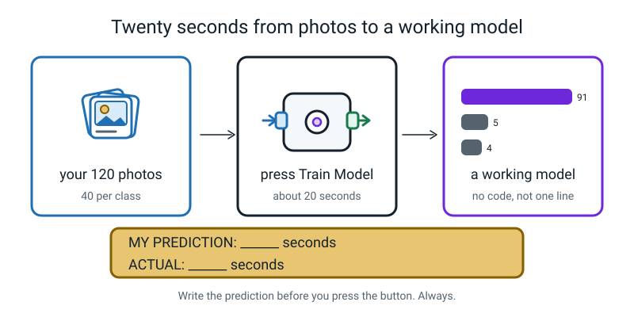
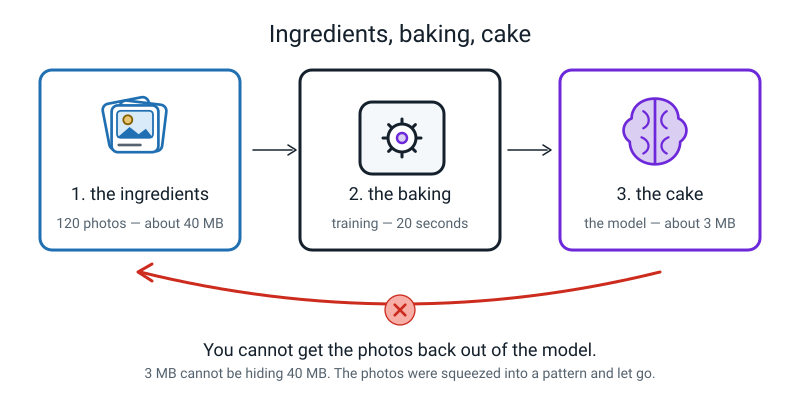
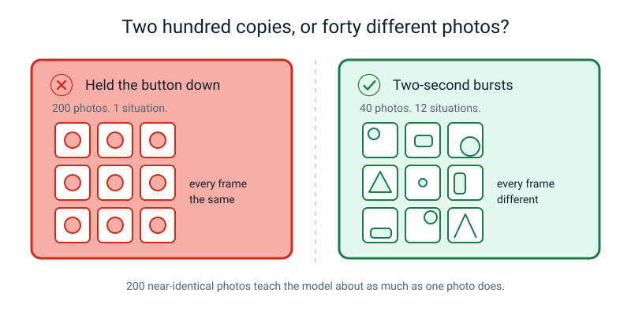
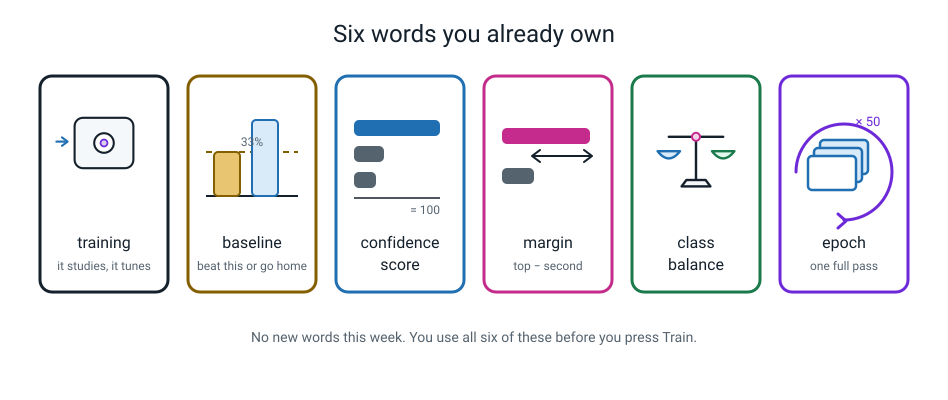

# Week 17 — Train Your First Real Model

[⬅ Week 16](week-16.md) · [Course Home](../README.md) · [Week 18 ➡](week-18.md) · [Workbook](../workbook/week-17.md)

---

> ### This week in one sentence
>
> **You can build a working image classifier in twenty minutes without writing a single line of code — and it will be exactly as good as the photos you gave it.**
>
> **By the end of this chapter you will be able to:**
> - Create three properly **named** classes in Teachable Machine and load your photos into each one
> - Train a model and read the live confidence bars while you hold objects up to the camera
> - Record a **baseline** — nine readings in a table, each with its sum checked and its margin worked out
> - Save the project as a file so your model survives closing the tab
>
> **Reading time:** about 25 minutes. **The build itself takes about 30 minutes** at a laptop. If you missed the lesson, this chapter contains every step — you can do the whole thing at home.

---

## 🪝 Start Here

Cast your mind back to **Week 10**. You sat down to write rules for spotting spam messages, and somewhere around rule five you gave up, because every rule you added broke two of the ones before it. Do you remember how that felt?

Today you build a machine that tells three objects apart, and **you will not write a single rule.** Not one. You hand it your photos and it works the rule out by itself.

And here is the claim I want you to time:

> **From a blank page to a working model takes about twenty seconds of actual training.**

Not twenty minutes. Twenty seconds. Before you press anything, write down your prediction.


*Figure 17.6 — Write the prediction before you press the button. Always. We do this all year.*

> **💡 Try this now, on paper:** two lines in your notebook.
> `MY PREDICTION: training will take ______ seconds`
> `ACTUAL: ______ seconds`
> A prediction written *after* you've seen the answer is worth nothing. This is a cheap, fun place to build the habit.

---

## 🧠 The Big Idea

### 1. Teachable Machine is a web page, and it is only five clicks

**Teachable Machine** is a free web page made by Google that trains a small image classifier by being shown photos. No code. No account. Nothing to install. You open it, you make some named boxes, you put photos in each box, you press one button, and about twenty seconds later you have a working model.

That is genuinely all it is. There is no catch.

Go to **teachablemachine.withgoogle.com** → **Get Started** → **Image Project** → **Standard image model**.


*Figure 17.1 — The whole screen. Five clicks, in order, and you have a model.*

The screen looks busier than it is. There are only **three areas**: your class boxes down the left, one **Train Model** button in the middle, and the live **Preview** on the right.

| # | Click | What it does |
|:--:|---|---|
| 1 | the **pencil** beside a class name | renames it from `Class 1` to `spoon` |
| 2 | **+ Add a class** | gives you the third box |
| 3 | **Webcam** or **Upload** | opens the camera, or lets you drag your photo files in |
| 4 | **Train Model** | the twenty seconds |
| 5 | **☰ menu → Download project as file** | saves it to your disk |

🍕 **The analogy — three labelled shoeboxes.**
Making a class is putting a label on a shoebox. Loading photos is dropping photos into the box. Training is a very fast person looking through all three boxes over and over until they can tell which box a new photo belongs in. Nothing more mysterious than that is happening.

> **🧑‍🏫 If someone asks "are my photos going to Google?"** — **No.** The training happens inside this browser tab, on this laptop, using this laptop's processor. Your photos are not uploaded anywhere. You can turn the wifi **off** once the page has loaded and it still trains. Try it — it's a good check, and it proves the point better than being told.

---

### 2. Name the boxes properly, then check the balance — before you press anything

The step everybody skips is naming. `Class 1`, `Class 2`, `Class 3` means nothing to you in three days' time. I promise. Everybody thinks they'll remember and nobody does. Click the little pencil and type `spoon`, `toothbrush`, `comb`.

Then load your photos: **Upload** and drag the whole folder in, or **Webcam** if you're shooting live.

> **⚠️ Watch out — the record button trap.** If you use the webcam, do **not** hold *Hold to Record* down for twenty seconds. You'll get two hundred nearly identical pictures, which teaches the model about as much as one picture does — while making you feel like you did two hundred times the work. **Two seconds, stop, move the object, two seconds, stop, move it again.**

Now the bit that separates a careful person from a hopeful one. Look at the little **sample count** printed under each class, write the three numbers down, and do the arithmetic:


*Figure 17.3 — Names, counts, and the check you do before you press anything.*

```
   THE BALANCE CHECK

   (biggest − smallest)  ÷  biggest   must be under 20%

   my counts:  spoon 41,  toothbrush 40,  comb 39

   (41 − 39) ÷ 41  =  2 ÷ 41  =  0.0487…  ≈  4.9%     ✓ under 20%, so I can train
```

If your counts are badly out of balance, fix it **now**, not later: either add photos to the small class, or use the class's **⋮ three-dot menu → Remove All Samples** on the big one and reload fewer. Five minutes here saves the whole model — that's the Week 16 lesson (200 / 200 / 8 scores 98% and never says "comb") arriving in real life.

---

### 3. Twenty seconds is enough, and here is honestly why

Press **Train Model** and don't touch anything — don't switch tabs, don't minimise the window. Browsers deliberately slow down tabs you aren't looking at, and training can stall if you look away.

**What's happening in those seconds:**

The model looks at all 120 of your photos, checks how many it got wrong, nudges thousands of internal numbers a tiny bit, and then looks at **all 120 again**. One complete pass through every photo is an **epoch**.


*Figure 15.2 — One epoch is one full pass through every single example. (You met this in Week 15.)*

Teachable Machine does **50 epochs** by default. So:

```
   120 photos  ×  50 epochs  =  6,000 photo-examinations
```

If a human looked at one photo per second without stopping, 6,000 seconds is **100 minutes**. Your browser does it in about twenty. That is not magic — it is very fast arithmetic, repeated.

**And there's an honest bit that most explanations leave out.** Teachable Machine does not start from nothing. It begins with a model Google already trained on **millions** of everyday photographs — a model that already recognises edges, curves, shine, fur, wood grain, fabric texture. Your forty photos only have to teach the last small step: **which of those already-known patterns go with which of your three names.**

That's why forty photos is enough, and why it takes twenty seconds instead of a week. **You are not building a brain from scratch. You are giving names to a vocabulary that already exists.**

#### And when it's finished, your photos are gone


*Figure 17.7 — The examples are the ingredients. Training is the baking. The model is the cake.*

After training, the photos are **not inside the model.** What's left is a pile of adjusted numbers that happen to work.

Here is the clinching evidence, and it's arithmetic you can check yourself: a Teachable Machine model file is a **few megabytes**. Your 120 photos might be **forty megabytes**. The model is much *smaller* than the data that made it, so it cannot possibly be storing them. It genuinely squeezed them into a pattern and let them go. (One honest wrinkle: the `.tm` **project file** you save in Part 4 is a different thing. It keeps a copy of your photos so you can reopen and edit the project, so it is much bigger than the model. The argument above is about the trained model itself.)

🍕 **The analogy — you cannot get the eggs back out of a cake.**
Once it's baked, you can't retrieve the eggs, you can't read the recipe off the sponge, and if the cake tastes bad, arguing with it changes nothing. **The only fix is to bake a new one with better ingredients.** You never fix a model by telling it off. You fix it by changing the photos.

> **⚠️ Watch out:** pressing **Train** again on the same photos gives you essentially the same model. Training has a little randomness in it, so the numbers wobble slightly — and that wobble is *very* tempting to read as improvement. It isn't. Same photos, same model.

---

### 4. Reading the live preview

The **Preview** panel on the right is now live. Point the camera at something and it produces three confidence scores, several times a second, for ever.


*Figure 17.4 — Read all three numbers, not just the winner. Then check the sum. Then the margin.*

Everything you learned last week applies here, unchanged. Same four steps:

```
   1.  READ    all three numbers, biggest first
   2.  SUM     add them. Must be 100. If it isn't, you misread — read again.
   3.  MARGIN  top − second
   4.  JUDGE   60+ clear · 30–59 fine · 15–29 shaky · under 15 a coin toss
```

**Five rules for taking a reading that means something:**

1. **Hold still before you read.** The numbers jitter while the object moves. Freeze, count to two, then read.
2. **Read all three, not just the winner.**
3. **Check the sum before you write the margin.**
4. **Round to whole numbers.** 91.4% is 91. Nobody needs the decimal.
5. **Same distance, same light, same order, every time.** This is a *measurement*, not a play.

> **🧑‍🏫 If someone asks "why does the number keep changing when I'm holding still?"** — because you aren't actually holding still, and neither is the light. The camera takes a fresh picture several times a second and every one is slightly different: a hand tremor, a flicker in a lamp, a shadow moving. The model re-reads every single frame from scratch. **It has no memory of the last one.**

---

### 5. There is no autosave. None. At all.

Close the tab and your model is gone. Refresh the page and it's gone. Let the laptop sleep long enough and, on some machines, it's gone.


*Figure 17.2 — There is no autosave. This is the only save there is.*

The one and only save is:

```
   ☰ menu (top-left)  →  Download project as file
```

That gives you a `.tm` file on your disk. **Name it `baseline-v1.tm`.** Not `Untitled`. Not `my model`.

Then do the step people skip: **open your Downloads folder and actually look at the file.** Point at it. Say "there it is." Write in your notebook: *"baseline-v1.tm is in Downloads."*

> **⚠️ Watch out:** Week 18 opens this file **four separate times**. If the file does not exist, next week does not happen. And do not overwrite it later — it is the one clean copy of your model you will ever have.

---

## 🔍 Worked Examples

### Example 1 — Food: three live readings from a fruit-bowl model

A model is trained on three classes: **apple**, **banana**, **orange**, forty photos each. Here are three live readings, taken with the objects held still 30 cm from the camera.

**Reading 1 — an apple, flat on.**

```
   apple 89   ·   banana 6   ·   orange 5
```

| Step | Working | Result |
|---|---|---|
| Sum | 89 + 6 + 5 | **100** ✓ |
| Winner | biggest number is 89 | **apple** |
| Margin | 89 − 6 | **83** |
| Band | 83 is in "60 or more" | not even close |
| Verdict | right answer, huge margin | **✓ trust it** |

**Reading 2 — a banana, tilted 45°.**

```
   apple 11   ·   banana 82   ·   orange 7
```

Sum: 11 + 82 + 7 = **100** ✓. Winner: **banana**. Margin: 82 − 11 = **71**. **✓ trust it.**

**Reading 3 — an orange, at arm's length.**

```
   apple 31   ·   banana 12   ·   orange 57
```

Sum: 31 + 12 + 57 = **100** ✓. Winner: **orange** — correct. Margin: 57 − 31 = **26**.

Band: 15–29, **shaky**. So: right answer, weak margin. **This is the interesting row.** The answer is correct, so a table that recorded only right-or-wrong would show nothing at all. But the margin has dropped from the 70s and 80s to 26, and that tells you something real: **an apple and an orange are the two most similar classes in this set, and distance makes it worse.**

That is the model's weak spot, and you found it *before* anything actually went wrong. That is the entire reason the margin column exists.

> **🔑 What Example 1 teaches:** write down the margin on every row, including the rows you got right. The margin moves before the verdict does.

---

### Example 2 — Sport: a sports-kit model that is not balanced yet

You want a model that sorts your kit bag: **cricket ball**, **shin pad**, **swimming goggles**. You count what you photographed:

| class | photos |
|---|---|
| cricket ball | 52 |
| shin pad | 40 |
| swimming goggles | 33 |

**Step 1 — do the balance check before touching Train.**

```
   biggest  = 52   (cricket ball)
   smallest = 33   (goggles)

   (52 − 33) ÷ 52  =  19 ÷ 52  =  0.3653…  ≈  36.5%
```

36.5% is **over 20%**, so this is **not balanced enough**. Do not train yet.

**Step 2 — how bad is it really?** Worth knowing, because it changes what you do. This isn't 200 / 200 / 8 — nobody is going to abandon the goggles class entirely with 33 examples. What you'd expect instead is a mild, sneaky lean: cricket ball wins slightly more often than it deserves, and the goggles margins run a bit lower than the others.

**Step 3 — fix it, and choose the cheaper fix.**

| Option | What you do | New counts | Check |
|---|---|---|---|
| **Level up** | photograph 19 more pairs of goggles | 52 / 40 / 52 | `(52 − 40) ÷ 52 = 23%` — still over! You'd need to top up shin pads too |
| **Level down** | delete 12 cricket ball photos, 1 shin pad photo | 40 / 39 / 33 | `(40 − 33) ÷ 40 = 7 ÷ 40 = 17.5%` ✓ under 20% |
| **Both, sensibly** | trim cricket balls to 40, shoot 7 more goggles | 40 / 40 / 40 | `(40 − 40) ÷ 40 = 0%` ✓ perfect |

The quickest legal fix is **level down** — 17.5% passes. The *best* fix is the third one, because 40 / 40 / 40 is balanced **and** every class still has plenty of examples.

> **⚠️ Watch out:** never "fix" balance by levelling everything down to the smallest class if the smallest class is tiny. 8 / 8 / 8 passes the balance check with a perfect 0% and produces a model that is balanced and useless. **Balance is necessary, not sufficient. You need balance *and* enough examples.**

> **🔑 What Example 2 teaches:** the balance check is two subtractions and a division, and it takes thirty seconds. Do it before you press the button, not after you're disappointed.

---

### Example 3 — School: the wobble, and why 74% on a pencil case is not a fault

You've trained a model on your school desk: **pencil**, **rubber**, **ruler**. Forty photos each, balance 0%, everything healthy. Your first nine readings look brilliant:

| object | position | pencil | rubber | ruler | sum | margin | ✓/✗ |
|---|---|:--:|:--:|:--:|:--:|:--:|:--:|
| pencil | flat on | **92** | 5 | 3 | 100 | 87 | ✓ |
| pencil | tilted | **86** | 9 | 5 | 100 | 77 | ✓ |
| pencil | far away | **74** | 15 | 11 | 100 | 59 | ✓ |
| rubber | flat on | 4 | **90** | 6 | 100 | 84 | ✓ |
| rubber | tilted | 8 | **83** | 9 | 100 | 74 | ✓ |
| rubber | far away | 17 | **66** | 17 | 100 | 49 | ✓ |
| ruler | flat on | 12 | 7 | **81** | 100 | 69 | ✓ |
| ruler | tilted | 19 | 10 | **71** | 100 | 52 | ✓ |
| ruler | far away | 28 | 14 | **58** | 100 | 30 | ✓ |

Nine out of nine, every margin over 29. You are, quite correctly, delighted.

**Now hold up a pencil case.** There is no pencil case class.

```
   pencil 74   ·   rubber 9   ·   ruler 17
```

Sum: 74 + 9 + 17 = **100** ✓. Winner: **pencil**. Margin: 74 − 17 = **57** (second place is the ruler, not the rubber).

**Compare that margin with your table.** 57 is bigger than three of your nine correct readings (49, 52 and 30). A completely wrong answer is looking more confident than some of your right ones.

**Now answer the three questions properly:**

**Q1 — What did it say?** Pencil, at 74%, with a margin of 57.

**Q2 — Is it right?** No. A pencil case is not a pencil.

**Q3 — Is it broken?** **No.** And this is the answer that matters. It has three boxes and 100 points of belief, and no way at all to say "none of these." A pencil case is long and thin, so (my best guess) of the three boxes it lands nearest **pencil**. It is stuck, not stupid.

**What would have helped?** An **`other` class** — a fourth box filled with photos of the empty desk, your hand, a pencil case, a book, a phone. Then the belief would have somewhere honest to go. And remember the cost from Week 16: adding that big messy class usually **shrinks every other margin**. It's a trade, not a free win.

> **🔑 What Example 3 teaches:** your model is exactly as good as the photos you gave it — and a confident number tells you nothing until you know what was in front of the camera.

---

## 🎲 What We Did In Class

**The Build, start to finish.** Everything below can be done at home on your own. Give it about 30 minutes.

### Part 0 — before you start

- [ ] Laptop **plugged in**, not on battery (training on low battery gets throttled)
- [ ] **Quit every app that could grab the camera:** Zoom, Teams, FaceTime, Photo Booth
- [ ] **Close every other browser tab.** Training runs on this machine and it wants the memory.
- [ ] Your three objects on the table
- [ ] One object that is **not** any of the three, hidden where you can't see it yet
- [ ] Your 120 photos findable in one folder — or the webcam ready
- [ ] The blank baseline table and a pencil **beside** the laptop, not under it

### Part 1 — set up and train (about 15 minutes)

1. `teachablemachine.withgoogle.com` → **Get Started** → **Image Project** → **Standard image model**
2. Click the pencil on `Class 1` → type **spoon**. Pencil on `Class 2` → **toothbrush**.
3. **+ Add a class** → name it **comb**.
4. **Upload** into each class and drag its photos in. (Or **Webcam** → **Allow** → 2-second bursts, moving the object between every burst.)
5. **Write the three sample counts down.** Do the balance check. Under 20%? Then and only then:
6. **Train Model.** Time it. Don't touch anything. About twenty seconds.

### Part 2 — the nine-row baseline (about 12 minutes)

Each of the three objects is held up in **three positions**:

```
   ┌──────────────────────────────────────────────────────────┐
   │  POSITION 1 — flat on      face the camera, ~30 cm away  │
   │  POSITION 2 — tilted       turn it about 45°, same distance│
   │  POSITION 3 — far away     arm's length, same angle      │
   └──────────────────────────────────────────────────────────┘
```

3 objects × 3 positions = **nine rows**. For every row you write seven things: object, position, the three percentages, the sum, and the margin.


*Figure 17.5 — Nine rows. The highlighted row is the weakest reading — that is where it will break first.*

Here is what a healthy 40-photo, good-variety model looks like. **Yours will be different. The shape is what matters, not the numbers.**

| object | position | spoon % | tbrush % | comb % | sum | margin | ✓/✗ |
|---|---|:--:|:--:|:--:|:--:|:--:|:--:|
| spoon | flat on | **91** | 5 | 4 | 100 | 86 | ✓ |
| spoon | tilted | **88** | 7 | 5 | 100 | 81 | ✓ |
| spoon | far away | **79** | 12 | 9 | 100 | 67 | ✓ |
| toothbrush | flat on | 6 | **88** | 6 | 100 | 82 | ✓ |
| toothbrush | tilted | 9 | **84** | 7 | 100 | 75 | ✓ |
| toothbrush | far away | 14 | **71** | 15 | 100 | 56 | ✓ |
| comb | flat on | 8 | 13 | **79** | 100 | 66 | ✓ |
| comb | tilted | 11 | 18 | **71** | 100 | 53 | ✓ |
| comb | far away | 16 | 29 | **55** | 100 | 26 | ✓ |

**Three things to notice in that table:**

1. **Every margin drops as the object gets further away.** 86 → 81 → 67 for the spoon. That's normal, and it's worth naming out loud: **distance is a real, measurable weakness of this model.**
2. **The comb has the smallest margins all the way down** (66 / 53 / 26). A comb and a toothbrush are the most similar pair here, and the model already feels it — before anything has actually gone wrong.
3. **Ask yourself the one question: which row has the smallest margin?** Whatever it is, that's your model's weak spot, and you found it with a pencil.

> **💡 Try this:** if your table looks *much* worse than the one above — every margin under 30, or one object flat-out wrong — **change nothing and log it honestly.** A weak baseline is a perfectly good baseline. Do not retake photos to make the table look nicer; you'd be sabotaging next week's experiment before it starts.

### Part 3 — the deliberate wobble (about 4 minutes)

Now bring out the hidden fourth object — the fork, the stapler, the TV remote. Hold it up. Read the screen.

You'll get something like `spoon 74% · toothbrush 15% · comb 11%`. Write it into the table as row 10, marked clearly:

```
   row 10  |  a FORK  |  no class exists  |  74 / 15 / 11  |  sum 100  |  margin 59  |  ✗ WRONG
```

Then sit with it for a moment, because **the margin on the fork (59) is bigger than the margin on several of the real objects.** Confidence and correctness are genuinely unrelated, and here is the proof — in your own handwriting, on your own model, ten minutes after you were proudest of it.

### Part 4 — the save (about 4 minutes)

This part is not admin. Week 18 is built entirely on this file.

1. **☰ menu** (top-left) → **Download project as file**
2. Name it **`baseline-v1.tm`**
3. **Open your Downloads folder and point at the file.** Out loud: "there it is."
4. Write in your notebook: *"baseline-v1.tm is in Downloads."*

### ✅ Finished looks like this

- [ ] Three classes with **real names**, counts logged, balance percentage worked out and under 20%
- [ ] A trained model that gets all three real objects right in position 1
- [ ] Nine baseline rows, each with the sum checked and the margin computed
- [ ] Row 10: the wobble object, its reading, and the word **WRONG**
- [ ] `baseline-v1.tm` on the disk, and you can point at it
- [ ] One sentence in your notebook: **"My model is exactly as good as the photos I gave it."**

---

## 💬 Talk About It

**1. "Where does the model keep my photos?"**
> *Hint:* it doesn't. Try the file-size argument on someone: the model file is a few megabytes, the photos were about forty. Ask them how three megabytes could be hiding forty megabytes. Then try the cake: can you get the eggs back out?

**2. "Is this a real AI, or a toy version?"**
> *Hint:* it's a real one. It's small, and it takes a shortcut by starting from Google's pre-trained model, but the machinery is genuinely the machinery. The image classifier in a phone's photo app is the same idea with millions of photos instead of 120 and a much bigger network. Ask the other person what they think the *difference* would be — scale, or kind?

**3. "Should you be allowed to train a model on photos of people without asking them?"**
> *Hint:* start with the easy case — your own face, model stays on your own laptop, nobody else involved. Then change one thing at a time: your friend's face? Your class's faces? Photos off the internet? Somewhere along that line it stops being fine. Where, and what exactly changed?

---

## ⚠️ Don't Get Tricked

### Trick 1 — holding the record button down feels productive


*Figure 17.8 — The sample counter goes up either way. Only one of these teaches the model anything.*

| ❌ Wrong | ✅ Right |
|---|---|
| Hold *Hold to Record* for 20 seconds. 200 samples! Brilliant. | Two-second bursts. Move the object between every single burst. 40 samples that are actually different. |

The counter goes up either way, which is exactly why this is a trap. **Two hundred near-identical photos teach the model roughly what one photo teaches it.**

### Trick 2 — "it works, so it's good"

| ❌ Wrong | ✅ Right |
|---|---|
| "It says 91% on my spoon. This model is excellent." | "It says 91% on my spoon **in this room, on this table, in this light, held by me**. I've written the numbers down so I can find out later how much of that was the spoon." |

It might be reading your spoon. It might be reading the wooden table, or the window light, or your hand. Today you don't know — and that's fine. **Next week you find out.**

### Trick 3 — pressing Train again to make it better

| ❌ Wrong | ✅ Right |
|---|---|
| "The margins are low, I'll just train it again." | "Same photos, same model. If I want it better I have to change the **photos** — more variety, more backgrounds, more angles." |

Training has a little randomness in it, so the numbers will wobble by a point or two. That wobble is not improvement. **You cannot fix a model by retraining it.**

### Trick 4 — treating the live preview as a test

| ❌ Wrong | ✅ Right |
|---|---|
| "I held all three objects up and got them all right, so I've tested it." | "I held them up in the same room, in the same light, at the same distance I trained in. That's a **demonstration**, not a test." |

Holding an object up to the camera where you trained is the loosest possible check. Real testing starts in Week 19, and it involves a sealed envelope.

---

## 🌍 Where You've Seen This

1. **Your phone unlocking with your face.** It checks what the camera sees against a saved scan of exactly one face — yours — and it can wobble in the dark, at odd angles, and behind sunglasses. Same weaknesses as your table's "far away" rows.
2. **The photo app sorting your pictures into "dogs", "beaches", "food".** Same idea as your three boxes, with millions of photos and a much bigger network.
3. **Supermarket self-checkout produce cameras.** They classify a small set of items, and they get confidently confused by anything not in the set — your fork, in a shop.
4. **Automatic number-plate cameras in car parks.** They read plates brilliantly in the conditions they were trained for, and badly in heavy rain or low sun. "Same distance, same light" is why your baseline rules exist.
5. **Snapchat and Instagram filters finding your face.** They lose you when you tilt too far or when your hand covers half your chin — a live confidence readout falling below whatever threshold the app chose.
6. **Recycling plants sorting rubbish on a conveyor belt.** A camera plus a classifier plus a robot arm — and a confidence policy deciding when to divert something to a human instead. Exactly the policy you wrote last week.

---

## 🧭 Where This Fits

Same box as the last two weeks — **TRAINING** — but this is the week it stops being a story and turns
into a file on a laptop. Everything sitting to the left of that tile on the map was preparation for
the twenty seconds you just timed.


*Figure 17.0 — The map in Week 17. TRAINING is still the tinted, badged box, and the lit threads have
moved back to **data** and **model**: you handed over photos, and a model came out.*

| | |
|---|---|
| **The mental model you now own** | Twenty minutes and **no code at all** gets you a working image classifier — and it is exactly as good as the photos you gave it, never better. The strangest part: your photos are **not inside it**. The saved model is smaller than the photos were, because what it kept was the pattern, not the pictures. |
| **The one question it answers** | *"What did I actually give it — and what will it therefore get wrong?"* |
| **What it plugs into** | Week 15's photo set is the raw material. Week 16's **margin** is how you read the bars that appear. And Week 13's three-class shape is why you made exactly three boxes and named them so carefully. |
| **What carries forward** | This model is the **one object you keep all year**. Week 18 breaks it on purpose, Week 22 measures it honestly, Week 33 audits who it fails, and Week 34 ships it to a real visitor. Save the file, and save it somewhere you will find it in March. |
| **Spiral thread** | 📊 **Data** — the photos are the entire ingredient list — and 📦 **Model**, because this is the week you made one, for real, with your own hands. |

> **💡 Try this:** on your own copy of the map, shade **TRAINING** and write the name of your saved
> file next to it — `baseline-v1.tm`, or whatever you called it. That filename is going to reappear
> in your notebook four more times before the year is out.

---

## 🔑 Remember This

- Teachable Machine trains an image classifier **in your browser tab, on your own laptop.** Your photos are never uploaded anywhere.
- **Name your classes properly** and **check the balance** — `(biggest − smallest) ÷ biggest` under 20% — *before* you press Train.
- **50 epochs × 120 photos = 6,000 photo-examinations** in about twenty seconds. It's fast because it starts from a model Google already trained on millions of pictures.
- After training, **your photos are not inside the model.** The model file is smaller than the photos that made it, so it cannot be storing them. Ingredients, baking, cake.
- Every live reading gets the **same four steps**: read all three, check the sum, compute the margin, judge it.
- **A confident wrong answer on an object with no class is not a fault.** It has 100 points of belief and only the boxes you gave it.
- **There is no autosave.** `☰ → Download project as file → baseline-v1.tm`, and then go and look at the file.
- **My model is exactly as good as the photos I gave it.**

---

## 📓 New Words

**None this week.** Week 17 is a consolidation week — every word you needed today, you already owned. Here they are, doing real work for the first time.


*Figure 17.9 — No new words. Six old ones, all used before you were allowed to press the button.*

| Word | What it means | Where you used it today |
|---|---|---|
| **training** *(Week 15)* | The one-off process where the machine studies labelled examples and tunes itself. | The twenty seconds after you pressed **Train Model**. |
| **epoch** *(Week 15)* | One complete pass through every single training example. | 50 of them, × 120 photos = 6,000 examinations. |
| **baseline** *(Week 12)* | The score you compare everything else against. | Your nine-row table. Next week's four experiments are all measured against it. |
| **confidence score** *(Week 16)* | How strongly the model prefers each class; always adds to 100. | Every reading in the live preview panel. |
| **margin** *(Week 16)* | Top score minus second score. | The last column of your baseline table. |
| **class balance** *(Week 16)* | Whether each class has roughly the same number of examples. | `(41 − 39) ÷ 41 = 4.9%`, checked before training. |

---

## 📤 Your Homework

Go to **[Workbook — Week 17](../workbook/week-17.md)**. About **45 minutes**, and you need the laptop for part of it.

**Re-open your model first:** Teachable Machine → **☰ menu** → **Open project from file** → pick `baseline-v1.tm`.

| What | Roughly how long |
|---|---|
| Warm-up: five quick questions about Week 16 | 5 min |
| Practice Set A — understand it (6 questions, including labelling the screen) | 12 min |
| Practice Set B — use it (5 new situations) | 12 min |
| Puzzle of the Week: whose bar is whose? | 6 min |
| Think Deeper (2 paragraphs) | 8 min |
| **Build It: five objects your model has never seen** | 25 min |
| **The surprise paragraph** | 20 min |
| Draw It + Self-Check | 5 min |

**The two things that actually get marked:**

1. **Five objects the model has never seen.** Not your spoon, toothbrush or comb — five completely new things. A pencil. A key. A sock. Your empty hand. For each one: what you *predicted* first, then all three scores, the sum, the winner, and the margin. Five full rows.
2. **The surprise paragraph.** Pick the **one** prediction that surprised you most. What did you expect? What actually happened, with numbers? And what is your **best guess at why** — something about shape, shine, edges, colour or your training photos. You will not know for certain and that is completely fine. A guess with a mechanism beats a certainty with none.

> **⚠️ Watch out:** do **not** delete or overwrite `baseline-v1.tm`. Week 18 opens it four times.

---

[⬅ Week 16](week-16.md) · [Course Home](../README.md) · [Week 18 ➡](week-18.md) · [📓 Workbook — Week 17](../workbook/week-17.md) · [Glossary](../../glossary.md)
