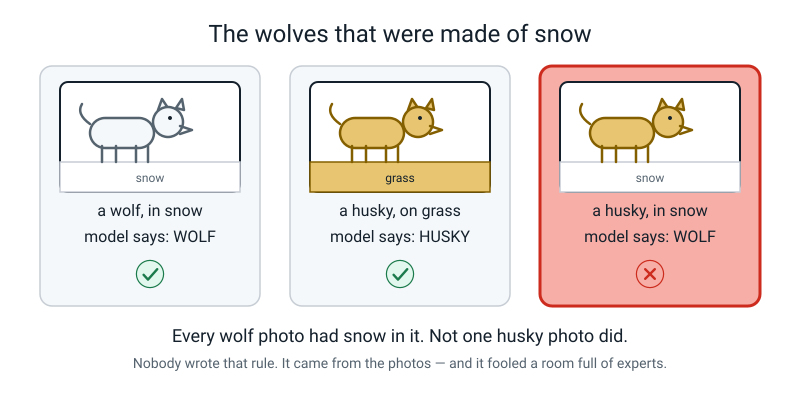
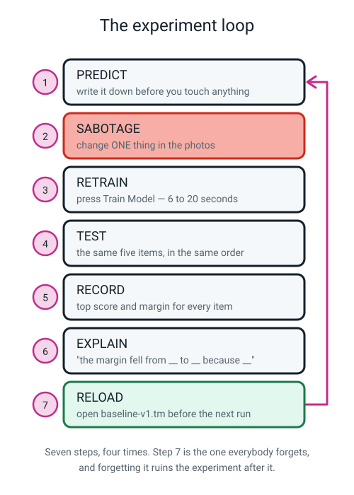
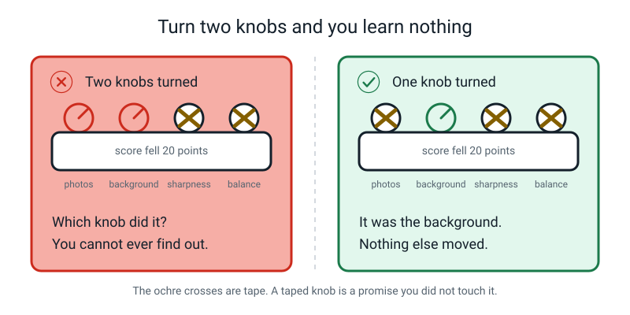
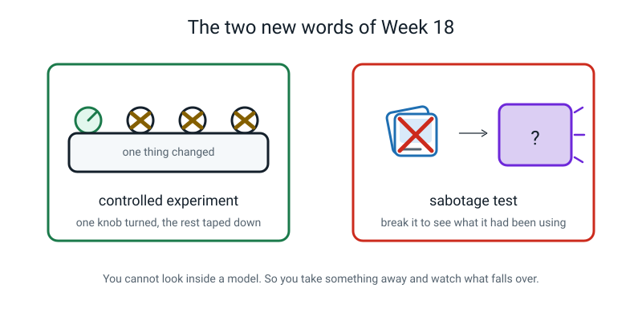

# Week 18 — Term 2 Checkpoint: Break Your Own Model on Purpose

[⬅ Week 17](week-17.md) · [Course Home](../README.md) · [Week 19 ➡](week-19.md) · [Workbook](../workbook/week-18.md)

---

> ### This week in one sentence
>
> **Change exactly one thing at a time, and the model will tell you precisely what it had been relying on.**
>
> **By the end of this chapter you will be able to:**
> - Design a **controlled experiment** — change one variable, hold everything else fixed — and say what you're holding fixed and why
> - Write a prediction down **before** you run something, and report the result either way, including when you were wrong
> - Explain a drop in performance by pointing at the **specific change in the data** that caused it
> - Use the Term 2 words — features, labels, baseline, training, confidence — without looking them up
>
> **Reading time:** about 25 minutes. **The lab takes about 30 minutes** with a laptop and `baseline-v1.tm`.

---

## 🪝 Start Here

This story shows why today's lab exists. Read it, then make one written guess.

In 2016, three researchers built a picture classifier on purpose to be bad — and then they didn't tell anybody.

Their model told **huskies** apart from **wolves**. And it mostly worked: it got most of its test photos right. They showed it to some people who study machine learning and asked: *do you trust this model?* Some of them said **yes**. (This is from a 2016 research paper; I am telling it from memory, so the exact numbers are not something to quote.)

Then an explanation tool, which shows what a model is looking at, revealed the trick.

> **The wolf photos in their training set had snow in the background. The husky photos did not.**

The model had learned very little about wolves. It had mostly learned: *white fuzzy stuff at the bottom of the picture → say wolf.* Photograph a husky standing in snow and it is likely to say **wolf**, and sound sure about it.


*Figure 18.6 — Nobody wrote that rule. Nobody wanted it. It came out of the photos.*

Now sit with the part that should genuinely worry you: **it worked.** It passed. A good score hid the problem. And a good score did not show the snow.

Researchers did find it with a special explanation tool, but **you cannot just read the answer off the numbers inside a model.** Not you, not me, not Google, not the people who built it.

So today you are going to find out what *your* model is really looking at. And one reliable way to do that is to break it.

This is the question for the whole lesson:

```text
   THE QUESTION FOR THE WHOLE LESSON

        WHAT IS MY MODEL REALLY LOOKING AT?
```

> **💡 Try this before you read on:** write down a guess. **Does your model have a snow?** Yes or no, and why. Initial it and date it. We come back to it at the end, and you are not allowed to change it.

---

## 🧠 The Big Idea

This section explains the method you will use today and the four sabotages you will run.

### 1. A controlled experiment: one knob turned, everything else taped down

> **Controlled experiment** — you change exactly one thing and keep everything else the same, so that anything that changes was most likely caused by the one thing you changed (training wobbles a point or two by chance, so be careful with tiny tests).

That last clause is the whole idea. It is worth being fussy about. It is the most useful thing in this entire course, and not just for AI.

**Here's what goes wrong without it.** Suppose you retrain your model with fewer photos, **and** you test it in a different room, **and** you hold the objects a bit closer. The score drops by 20 points. Which of the three caused it?

You cannot say. Not "you're not quite sure" — you **literally cannot say**.

No amount of staring at the numbers will help, because the information is not in the experiment. It was never collected. The whole run is worthless.


*Figure 18.1 — One knob turned. Everything else taped down. That is the whole method.*

🍕 **The analogy — the recipe you changed four ways at once.**

Your biscuits came out flat. That time you used less butter, a hotter oven, a different tray, **and** you took them out early. So which one flattened them? You will never know. Next Saturday you change one thing, and by the end of the month you actually understand your own oven.

**Here is what must be taped down in today's lab, every single run.** Tick each box before you start:

```text
   TAPED DOWN, EVERY RUN
   ────────────────────────────────────────────────
   □  the same three objects
   □  the same five test items, in the same order
   □  the same room, the same spot, the same light
   □  the same distance from the camera
   □  the same person holding them
   □  read the numbers the same way (freeze, count 2, read)
```

That "same order" one looks fussy. It isn't. If you always test the spoon first while your hand is steady, and the comb last when you're bored and wobbling, **you have added a variable** without noticing.

---

### 2. A sabotage test is not vandalism — it's the only tool you've got

> **Sabotage test** — deliberately damaging your training data to find out what the model had been depending on.

This feels backwards, and you're allowed to resent it. You spent last week building something you were proud of, and today you break it four times.

So here's the honest reason:

> You cannot just read the answer off the numbers inside a model. So one reliable way to find out what it was using is to **take something away and see what falls over.** If you remove the variety and it collapses, it *was* using the variety.

That's not vandalism. It's a diagnosis. It's what a mechanic does when they unplug one sensor at a time to find the fault.

🍕 **The analogy — the wobbly table.**

A table wobbles and you can't see which leg is short. So you take the book out from under leg 3. Still wobbly? Put it back, take the book from under leg 1. **You find out what was holding it up by removing things one at a time**, not by staring at it harder.

And this is a real professional technique. Grown-ups call it an **ablation study**, and researchers run them constantly for exactly this reason.

**The loop is identical for every experiment**, and you run it four times today:


*Figure 18.7 — Seven steps, four times. Step 7 is the one everybody forgets.*

Step 7 — **reload `baseline-v1.tm`** — has no button of its own and nothing reminds you.

Forget it and your *next* experiment starts from a damaged model. That means you've turned two knobs, so that run is void. Say it out loud every time.

---

### 3. The four sabotages, and what each one suggests

| # | Sabotage | What to expect | What it suggests |
|:--:|---|---|---|
| **1** | **5 photos per class** instead of 40 | Still mostly right — but every margin collapses | Too few examples produces **unstable** answers *before* it produces wrong ones |
| **2** | **One background only** | Brilliant on that background, broken two metres away | The model never saw the background change, so a new background throws it off |
| **3** | **Blurry photos** | Still right, margins way down | Blur may be hiding **edges**, a useful signal in a photo of a small object (a likely but untested explanation) |
| **4** | **40 / 40 / 5 imbalance** | The small class almost never gets predicted at all | Training reduces *total* mistakes, so it abandons the cheap class |


*Figure 18.2 — Five runs, side by side. Read down the margin column, not the score column.*

**The habit to build from this table: the margin moves before the verdict does.**

In experiments 1 and 3 the model is still getting answers **right** while its margins quietly fall apart.

Right-or-wrong is a blunt instrument. With five test items it only has six possible values (0, 1, 2, 3, 4, 5), so it can't register anything finer than "one more wrong." The margin is continuous and keeps reporting all the way down.

---

### 4. Experiment 2 is the one that matters

Everything else today is a supporting act. Here is why.

You retrain using photos taken **only** on the wooden kitchen table. Then you test on the wooden kitchen table, and the model scores **95%** — *higher than your baseline's 91%.* It looks like the best model you have ever built. You would be entitled to feel great about it.

Then you carry the same spoon two metres to the sink and hold it up.


*Figure 18.3 — 95% on its own table. Wrong at the sink. Same object, same model, different background.*

| test | spoon | toothbrush | comb | it says | truth | margin |
|---|:--:|:--:|:--:|---|---|:--:|
| spoon, on the wooden table | **95** | 3 | 2 | spoon | spoon ✓ | 92 |
| spoon, over the white sink | 34 | **39** | 27 | toothbrush | spoon ✗ | **5** |

**Same spoon. Same model. Two metres.** The margin went from 92 to 5 — a coin toss that landed wrong.

**The mechanism, said properly:** the wooden table appeared in **every single training photo**, so the model was never shown that backgrounds can change. It probably leaned on "warm brown texture in the background" as well as on the spoon. (This one test does not isolate the cause; that is the likely explanation.)

Move to the sink and a big chunk of the evidence may vanish with the table.

It is a cousin of the husky in the snow. There the snow went with one label. Here the table goes with every label. Either way the model was never shown that backgrounds vary. **You can see the damage in your own kitchen, in about ten minutes.**

And now the trap — the reason this entire course exists:

> **If you had only ever tested where you trained, you would have concluded that the single-background model was BETTER.**

A higher number. Honestly measured. Nobody lying. Pointing entirely the wrong way.

Sit with that. There is a name for this trap and it is coming — Term 3 is about almost nothing else. For now, just feel it.

---

### 5. The prediction has to be in ink, and being wrong is worth more

Before **every** retrain, you write down what you think will happen and **why**. This is not a warm-up ritual. It exists for one reason.

> **Human memory rewrites itself.** After you see a result, you genuinely, sincerely remember having expected it. Everybody does this. It is not dishonesty — it's how memory works. **The only defence is ink.**


*Figure 18.5 — Written before. Reported after. Including the ones that were wrong.*

🍕 **The analogy — calling the match result.**

Everyone who watches the game says afterwards that they knew that team would win. Almost nobody wrote it down beforehand. The ones who *did* write it down are the only ones who can prove anything — and they're also the only ones who ever learn, because they can see how often they were wrong.

**And a wrong prediction is worth more than a right one.** If you write "I predict 4 out of 5" and get 2 out of 5, the model has just taught you something real. If you predict nothing, you have watched a number appear on a screen and learned exactly nothing.

> **⚠️ Watch out:** you are not allowed to change what you wrote after you've seen the result. Not because anyone is being strict — because the whole value of the slip is that it was written first. Cross it out and admit it instead; that costs you nothing and gains you the experiment.

---

## 🔍 Worked Examples

Three examples show the method from start to finish: food, sport and school. Follow each step with a pencil.

### Example 1 — Food: the five-photo sabotage on a fruit-bowl model

A model is trained on **apple / banana / orange**, forty photos each. Baseline margins on the three fruits held flat on: **87, 84, 71.** All three correct.

Now sabotage it: **delete photos until each class has exactly 5.** Change nothing else. Same room, same light, same distance, same order.

**Step 1 — the prediction, written first.**

> *"I predict 3 out of 3 still correct, because I've seen those five photos and they're perfectly good photos. Five seems like a lot when you look at them."*

**Step 2 — retrain.** With 5 photos per class the training takes about six seconds instead of twenty. `5 × 3 × 50 epochs = 750 photo-examinations` instead of 6,000.

**Step 3 — test the same three fruits, same order, and record everything.**

| object | apple | banana | orange | sum | winner | margin | ✓/✗ |
|---|:--:|:--:|:--:|:--:|---|:--:|:--:|
| apple | **48** | 32 | 20 | 100 | apple | 48 − 32 = **16** | ✓ |
| banana | 26 | **39** | 35 | 100 | banana | 39 − 35 = **4** | ✓ |
| orange | 30 | **44** | 26 | 100 | banana | 44 − 30 = **14** | ✗ |

**Step 4 — score it.** 2 out of 3 correct. Baseline was 3 out of 3.

**Step 5 — the explanation, in the required shape.**

> *"The margins fell from 87, 84 and 71 to 16, 4 and 14 — every single one collapsed. The score only went from 3/3 to 2/3, so if I had looked at the score alone I'd have said it was 'a bit worse'. But look at the margins: even the two it got right are barely holding on. Four points is nothing. With five photos the model saw almost no variety — one or two angles, one background — so the pattern it found is thin and fragile. **Too few examples doesn't make answers wrong so much as unstable**, and unstable answers become wrong answers the moment anything shifts."*

**Step 6 — was my prediction right?**

> *"No. I predicted 3/3 and got 2/3, and much more importantly I predicted nothing about the margins, which is where nearly all the damage was. Next time I'd predict that the **score holds up roughly and the margins fall off a cliff**, because that's what actually happened."*

**Step 7 — reload `baseline-v1.tm`** before touching anything else.

> **🔑 What Example 1 teaches:** a score out of three can only move in whole steps. The margin can move by 70 points and tell you far more. Record both, every time.

---

### Example 2 — Sport: which is better, 96% or 88%?

You train a model to spot a **cricket ball / tennis ball / hockey ball**. You take two versions.

| version | training photos | where they were taken |
|---|---|---|
| **A** | 40 each | on the grass, on the carpet, on the drive, indoors, outdoors |
| **B** | 40 each | **all of them on the grass** |

Then you test each version **twice** — once on grass, once on the carpet indoors. Five test items each time.

| version | tested on grass | tested on carpet |
|---|:--:|:--:|
| **A** (mixed backgrounds) | 88% average top score, margins 71 / 66 / 58 | **85%** average, margins 66 / 61 / 54 |
| **B** (grass only) | **96%** average top score, margins 93 / 90 / 87 | **41%** average, margins 8 / 5 / 11 |

*The margins listed are for three of the five test items, picked to keep the table short; the average top score covers all five.*

**Question 1 — which version has the highest single number anywhere in that table?** Version B, at **96%**.

**Question 2 — which version would you actually put in a phone app?** **Version A.** Easily. Obviously.

**Question 3 — say why, precisely.** Version B is better in exactly one place — the grass it was trained on — and it falls to a coin toss anywhere else. Its margins on carpet are 8, 5 and 11, all in the "do not act on it" band. Version A gives up 8 points of top score on grass (88 instead of 96) and in exchange **only loses 3 points when you move it** (88 → 85). Its margins stay in the usable range everywhere.

**Question 4 — the killer question.** *If you had only ever tested on grass, what would you have concluded?*

> **That version B was better.** 96% versus 88%, honestly measured, no cheating anywhere. And you would have shipped the broken one.

**Question 5 — how much variety does it take to fix version B?** You don't have to double the photo set.

Swap just 10 of B's 40 grass photos per class for 10 taken on carpet, then retrain. You could try it and see whether the carpet score climbs while the grass score barely moves (we have not measured it, so write your prediction down first).

**A small amount of variety may fix a surprising amount of damage** — if it does, the fix is affordable.

> **🔑 What Example 2 teaches:** **a score means nothing until you know where it was measured.** Always report where, and always test somewhere the model has never been.

---

### Example 3 — School: the 94% model that is blind to a third of its job

Back to the lost-property camera: **water bottle / jumper / lunchbox**. You sabotage the balance on purpose — leave bottles and jumpers at 40, and delete lunchbox photos until only **5** remain.

**Step 1 — check the counts read 40 / 40 / 5 before you train.** (If you skip this you don't know what experiment you ran.) Here is the arithmetic:

```text
   balance check:  (40 − 5) ÷ 40  =  35 ÷ 40  =  0.875  =  87.5%
   we want under 20%.  This is deliberately, hopelessly imbalanced.  ✓ correct sabotage
```

**Step 2 — predict it, using Week 16's arithmetic and nothing else.** Here is the working:

```text
   total photos                        =  40 + 40 + 5  =  85
   a model that never says "lunchbox"  =  40 + 40 + 0  =  80 correct
   its accuracy on its own photos      =  80 ÷ 85
                                       =  0.94117…
                                       ≈  94.1%
```

> *"I predict it will almost never say lunchbox, and that it will still score about 94% on its own training photos, because 80 out of 85 of them aren't lunchboxes anyway."*

**Step 3 — retrain and test all three.**

| test | bottle | jumper | lunchbox | sum | it says | truth |
|---|:--:|:--:|:--:|:--:|---|---|
| hold a bottle | **93** | 5 | 2 | 100 | bottle | bottle ✓ |
| hold a jumper | 7 | **90** | 3 | 100 | jumper | jumper ✓ |
| hold a lunchbox | 12 | **77** | **11** | 100 | jumper | lunchbox ✗ |

**Step 4 — look at the third row properly.** The model gives the lunchbox class **11 points out of 100 while staring directly at a lunchbox.** It has essentially stopped believing lunchboxes exist.

Margins for bottle and jumper are 88 and 83 — completely healthy. Nothing in *those* numbers warns you that a third of the machine is dead.

**Step 5 — the explanation.**

> *"Bottle and jumper margins stayed at 88 and 83, so two thirds of the model is fine. Lunchbox was never predicted once. Training reduces **total** mistakes and doesn't care which class they come from, so with only 5 lunchboxes out of 85 photos, the cheapest possible thing to do is give up on lunchboxes entirely. That model still gets 80 out of 85 right, which is 80 ÷ 85 = **94.1%**. **94% accurate and completely blind to one third of its job.** My prediction was right, and I'm only confident about it because I did the division before I ran it."*

> **🔑 What Example 3 teaches:** the two healthy margins are a distraction. **Always check the score on the class you actually cared about**, separately, by itself.

---

## 🎲 What We Did In Class

This section lists what we did in class, so you can redo the lab at home.

### Sabotage Lab

Everything below can be redone at home. You need the laptop, `baseline-v1.tm`, your three objects, and the fork.

**Setup, before anything.** Tick each item:

- [ ] `baseline-v1.tm` loaded: **☰ menu → Open project from file**
- [ ] **Five test items lined up in a fixed order** on the table. Suggested: spoon, toothbrush, comb, fork, empty hand.
- [ ] Last week's baseline table on the table beside you
- [ ] The spot marked — tape on the floor, or a book on the table — so you stand in the same place every run
- [ ] Two folders of photos ready if you're doing experiments 2 and 3: `sabotage-one-background` and `sabotage-blurry` (about 15 per class each)

> **⚠️ Watch out:** the fork and the empty hand are in **no class**, so a "perfect" score is **3 out of 5**, not 5 out of 5. That isn't a bug in the lab — it's the point. If you only used your three real objects, score out of 3 and the pattern is identical.

**Row 0 — copy the baseline across.** Do **not** re-measure it. Re-measuring would change a variable. Write this line at the top of your table:

```text
   row 0  |  baseline: 40 each, full variety  |  3/3 real  |  margins 86, 82, 66
```

### The five rows we filled in

*These are illustrative numbers from one example run, not results anyone should expect to match. Your run will differ. If a sabotage does not break your model, that is a finding too, and worth writing down.*

| # | what I changed | score | spoon margin | tbrush margin | comb margin | verdict |
|:--:|---|:--:|:--:|:--:|:--:|---|
| 0 | baseline: 40 each, full variety | 3/3 real | 86 | 82 | 66 | works |
| 1 | 5 photos per class | 2/3 real | 41 | 14 | 7 | fragile |
| 2 | one background — **on the table** | 3/3 real | 92 | 88 | 71 | looks great |
| 2 | one background — **at the sink** | 1/3 real | 5 | 11 | 9 | broken elsewhere |
| 3 | blurry training photos | 3/3 real | 34 | 29 | 12 | weakened |
| 4 | imbalance 40 / 40 / 5 | 2/3 real | 88 | 83 | *comb never predicted* | blind spot |

**Experiment 1 — five photos per class.** Done by deleting samples; no new photos needed. The score barely moves; every margin collapses.

**Experiment 2 — one background only. ⭐ The moment of the term.** This one gets tested **twice**: once on the surface the photos were taken on, and once somewhere completely different. Test A scores *higher than the baseline* and Test B falls apart. If you only do one experiment ever again, do this one.

**Experiment 3 — blurry photos.** Trained on photos shot while waving the object; tested with everything held perfectly still and sharp. Still correct, margins down hard.

And notice the odd bit: **it was trained blurry and tested sharp and it still struggled**, which hints that a mismatch between training and testing photos can hurt. We did not test the reverse direction, but a model trained only on perfect studio photos may well struggle with the wobbly ones real people take.

**Your training photos should look like the photos your model will actually meet.**

**Experiment 4 — imbalance 40 / 40 / 5.** Done by deleting comb photos; no new photos needed. Check the counts read 40 / 40 / 5 *before* training.

**And after every single one: reload `baseline-v1.tm`.**

### Then the Term 2 checkpoint quiz

There were fourteen questions, notebook closed. They were marked **together, out loud, straight away** — not later, alone, in red pen.

For every wrong answer, the question asked was: **"which week does this belong to?"** The week number went in the margin.

**There was no grade, and there should not be one.** The output of a checkpoint is a **list of weeks to go back to**, not a number. The Practice Sets in this week's workbook cover the same ground if you want another go at it.

### Term 2, end to end


*Figure 18.4 — Every arrow on this map is a week you have already done.*

The same map as one line:

```text
   rules hit a wall  →  features and labels  →  training  →  a model
                                 →  confidence  →  what it was actually relying on
```

That last box — *what it was actually relying on* — is the one that makes all the others worth anything. Plenty of people can build a model. **You can now tell someone what yours is looking at.**

### ✅ Finished looks like this

- [ ] Five rows in the results table, each with a score and the three margins
- [ ] Experiment 2 has **two** entries — on the surface and off it
- [ ] Four completed prediction slips, including at least one honest "I was wrong"
- [ ] One written explanation per row, in the shape *"the margin fell from ___ to ___ because ___"*
- [ ] You can say out loud which experiment hurt most, and why

---

## 💬 Talk About It

Use these three questions to talk the ideas over with another person.

**1. "Why can't we just change two things at once and save time?"**
> *Hint:* draw four knobs on paper for the other person. Say "I turned two of them and the score fell twenty points — point at the knob that did it." Watch them try. The point isn't that it's hard; it's that the information genuinely isn't there.

**2. "The one-background model scored higher. Doesn't that make it better?"**
> *Hint:* answer their question with one word — **"where?"** That single word does all the work. Then ask the follow-up that actually matters: *"if I'd only tested it on the table, what would I have written in my report?"*

**3. "If a model can't explain itself, how can anyone ever trust it?"**
> *Hint:* you don't trust it because it explained itself. You trust it because it was tested in enough different situations that you know where it works and where it doesn't. That's a completely different kind of trust — and honestly the more useful one. It's the difference between somebody *telling* you they're reliable and you having *watched* them be reliable.

---

## ⚠️ Don't Get Tricked

These are four traps people fall into. Each one shows the wrong way and the right way.

### Trick 1 — turning two knobs to save time


*Figure 18.8 — Same 20-point drop. One of these experiments told you something.*

| ❌ Wrong | ✅ Right |
|---|---|
| "I'll use fewer photos **and** move to the sink, that saves a whole run." | "Fewer photos, everything else identical. Then reload. Then move to the sink, everything else identical." |

Two runs take twice as long and produce information. One combined run is fast and produces nothing.

### Trick 2 — "it got worse" as an explanation

| ❌ Wrong | ✅ Right |
|---|---|
| "Row 2 was worse." | "The margin fell from 92 to 5 **because** every training photo had the wooden table in it, so the table itself was part of the evidence — and at the sink the table is gone." |

"It got worse" is an **observation**. You were asked for a **reason**. Use the frame every single time: *"the margin fell from ___ to ___ because ___."*

### Trick 3 — a higher score means a better model

| ❌ Wrong | ✅ Right |
|---|---|
| "95% beats 91%, so the one-background model is my best one." | "95% **on the table it was trained on**; 34% at the sink. 91% **everywhere I tried**. The 91% model is better and the 95% is the more dangerous number." |

Both numbers were measured honestly. **A number without a "where" attached is not yet a fact.**

### Trick 4 — retraining to fix it

| ❌ Wrong | ✅ Right |
|---|---|
| "The margins are terrible, I'll press Train again." | "Same photos, same model. I can only fix this by changing the photos — and I can say exactly which photos, because I ran a controlled experiment." |

Training has a bit of randomness, so the numbers wobble a point or two. It is *very* tempting to read that wobble as improvement. It isn't.

**You can't repair a model. You can only bake a new one with better ingredients — and you can always reload the saved one.**

---

## 🌍 Where You've Seen This

The same idea turns up in many places outside AI.

1. **Medicine trials.** Two groups, one gets the real pill, one gets a fake one, and **everything else is held identical** — same instructions, same schedule, same doctors. It's the same method as your taped-down knobs, with much higher stakes.
2. **A phone camera that works beautifully outdoors and badly in a restaurant.** Somebody's training photos had a background, or a light, that yours don't. Same shape as experiment 2.
3. **Voice assistants and accents.** They often work best on the accents that were well covered in the training recordings and can struggle with the ones that weren't. Nobody wrote a rule against your accent. It just wasn't in the photos, so to speak.
4. **Your own revision.** Practising forty questions that are all `? × 7` makes you brilliant at sevens and much shakier at `6 × 8`. That's experiment 2, in your maths book: **you practised the background, not the skill.**
5. **Testing whether the wifi is the problem.** You unplug the router. Then you try a different device. Then a different room. **One thing at a time** — and you already do this without being taught.
6. **Sports coaching.** Change one thing in your bowling action, bowl six balls, see what happened. Change four things and you've learned nothing except that today was different.

---

## 🔁 Go and Look at Your Slip

This section takes you back to your guess from the start of the chapter.

Find the slip you initialled and dated at the start. It answers **"does your model have a snow?"**

Read your own answer. Then say which of these three happened:

| What you wrote | What you found | What that means |
|---|---|---|
| **No** | …and there was no snow | You were right — and now you can *prove* it, which you couldn't this morning |
| **No** | …and there was a snow | **The most valuable outcome of the week.** Your model was quietly relying on something you had not noticed. You found it before it embarrassed you |
| **Yes** | …and you found it | Good instincts. Now name the exact thing, in one sentence: *"my model is using ___ instead of ___"* |

Cross out nothing. If you were wrong, write **"wrong — it was \_\_\_"** underneath and leave both
visible. That slip is now the most honest page in your notebook.

> **🔑 And remember why the researchers' husky model was so dangerous.** It was not dangerous because
> it was bad. It was dangerous because it was **good** — right most of the time, on new photos, in
> front of people checking its score. The snow only showed up when somebody deliberately went looking for it. Nobody
> finds their model's snow by accident, and nobody finds it by trusting the accuracy number.

---

## 🧭 Where This Fits

This section shows where this week sits on the course map.

Still **TRAINING** — and this is the week that finishes it off. You did not build anything new today. You took last week's model apart one ingredient at a time to find out what had been holding it up.


*Figure 18.0 — The map in Week 18. TRAINING is the tinted box for the last time, and the lit threads
are **data** and **evaluation**: you changed the ingredients, and you judged what happened.*

| | |
|---|---|
| **The mental model you now own** | You cannot just read the answer off the numbers inside a model. So one reliable way to find out what it was leaning on is **taking one thing away at a time**, with your prediction written down *first*, and watching what moves. And you cannot fix a model at all — you can only fix its **ingredients** and bake a new one. |
| **The one question it answers** | *"If I change exactly one thing, what moves?"* |
| **What it plugs into** | Week 17's model, which is the thing you are breaking, and Week 12's trick of scoring something by taking it away and seeing what you lose. |
| **What carries forward** | Change-one-thing is now your method for the rest of the course. It is how Week 26 proves that edges beat brightness, and how Week 31 lets you *predict*, before you test, which group your model is about to let down. |
| **Spiral thread** | 📊 **Data** — every sabotage is a change to the data and nothing else — and ⚖️ **Evaluation**, because a sabotage means nothing unless you measured carefully before and after. |

> **💡 Try this:** write one sentence on your map next to **TRAINING**: *"my model was using \_\_\_
> instead of \_\_\_."* If you genuinely found nothing, write *"nothing found — and here is how I
> looked"* and list the four experiments. Both of those are real results, and only one of them is a
> guess.

---

## 🔑 Remember This

These are the ideas to keep from this week.

- A **controlled experiment** changes exactly one thing and tapes everything else down, so anything that changes *must* have been caused by that one thing.
- A **sabotage test** damages the data on purpose, because you cannot just read the answer off the numbers inside a model — **you can find out what was holding it up by taking things away.**
- **Predict in writing first.** Memory rewrites itself, and a wrong prediction you've thought about is worth more than a right one you got lucky on.
- **The margin moves before the verdict does.** Score is blunt; margin keeps reporting.
- **A higher score can mean a worse model.** 95% on the table it trained on lost to 91% measured everywhere.
- **Reload the baseline after every experiment.** Skip it and you've turned two knobs.
- **You cannot fix a model, only its ingredients** — and you can name which ingredient, because you tested one at a time.

---

## 📓 New Words

There are two new words this week.


*Figure 18.9 — Two words. One is a method; the other is a diagnosis.*

| Word | What it means | Example |
|---|---|---|
| **controlled experiment** | You change exactly one thing and keep everything else the same, so any difference was most likely caused by the thing you changed. | Cut the photos from 40 to 5 per class. Same room, same light, same five test items, same order, same person. |
| **sabotage test** | Deliberately damaging your training data to find out what the model had been depending on. | Retrain using only photos taken on the wooden table, then test at the sink. If it collapses, it was using the table. |

> **⚠️ Watch out:** "controlled experiment" does **not** mean "an experiment I was in control of." It means the **variables** are controlled — held still — so the one you moved is the only possible explanation.

---

## 📤 Your Homework

This section says what to do next and how long it takes.

Go to **[Workbook — Week 18](../workbook/week-18.md)**. About **55 minutes**.

| What | Roughly how long |
|---|---|
| Warm-up: five quick questions about Week 17 | 5 min |
| Practice Set A — understand it (6 questions, including labelling the four knobs) | 12 min |
| Practice Set B — use it (5 new situations) | 12 min |
| Puzzle of the Week: which sabotage was it? | 6 min |
| Think Deeper (2 paragraphs) | 8 min |
| **Build It: the five-row table, with one written explanation per row** | 25 min |
| **The Term 2 reflection: three things you can now do** | 15 min |
| Draw It + Self-Check | 5 min |

**The two things that actually get marked:**

1. **Every row of the five-row table gets a written explanation**, in the shape *"the margin fell from ___ to ___ because ___"* — and every explanation must say **whether your prediction was right**. If you were wrong, say so, and say what you'd predict next time. A wrong prediction you have thought about is worth more than a right one you got lucky on.
2. **Three things you can do now that you could not do in Week 10.** Not "I learned about AI." Three **specific** things, each with an example. Something like *"I can work out a margin from three confidence scores — spoon 62, toothbrush 21, comb 17, so the winner is spoon and the margin is 41"* is exactly what's wanted.

> **💡 And go back to your minute-one guess.** You wrote down whether your model had a snow. Look at your five-row table. **Did it?**

---

[⬅ Week 17](week-17.md) · [Course Home](../README.md) · [Week 19 ➡](week-19.md) · [📓 Workbook — Week 18](../workbook/week-18.md) · [Glossary](../../glossary.md)
