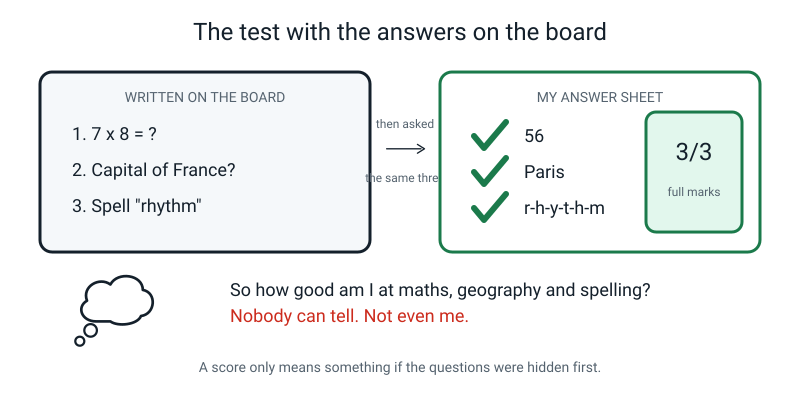
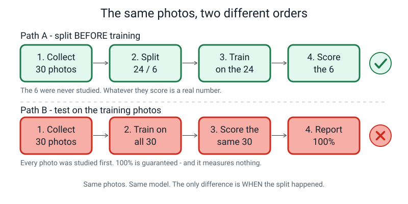
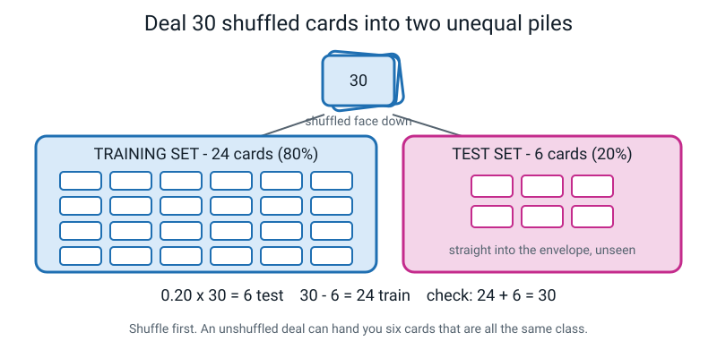
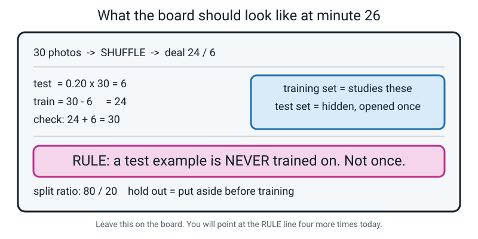
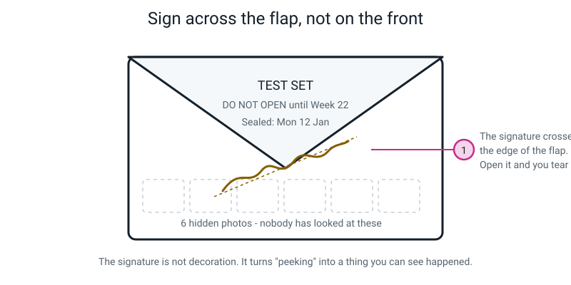
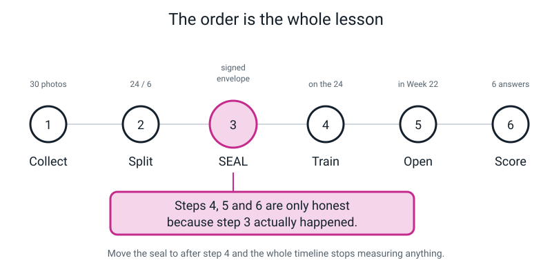
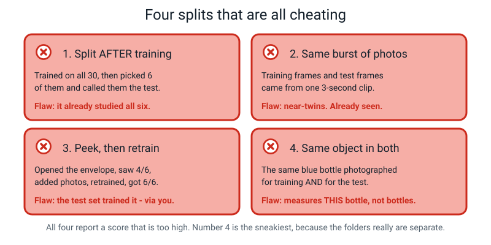
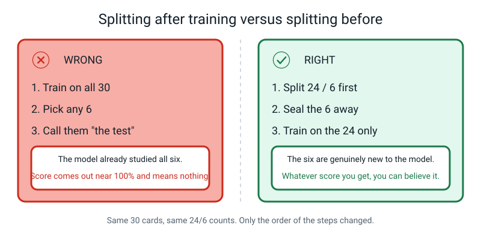
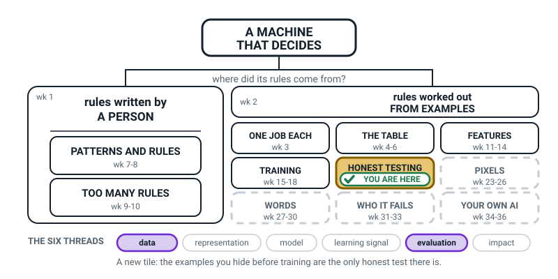
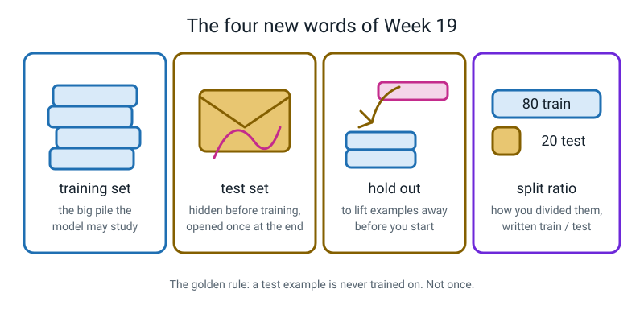

# Week 19 — The Test You Can't Study For

[⬅ Week 18](week-18.md) · [Course Home](../README.md) · [Week 20 ➡](week-20.md) · [Workbook](../workbook/week-19.md)

---

> ### This week in one sentence
>
> **Testing a model on the examples it trained on is cheating — so you hide some examples *before* training, and never let the model see them.**
>
> **By the end of this chapter you will be able to:**
> - Split a pile of examples into a **training set** and a **test set** at a ratio you choose, and prove the two parts add back up to the whole
> - Say *why* the split has to happen **before** training, not after — in your own words, without just saying "because it's cheating"
> - Spot **four different ways** of cheating on a split, and say exactly what leaked in each one
> - Physically **seal and sign** a held-out test set so that nobody — including you — can quietly use it
>
> **Reading time:** about 25 minutes. **No computer needed this week at all.** You need 30 index cards, one envelope, and a pen.

---

## 🪝 Start Here

I want to test you. Here are three questions. I am writing them on the board right now, where you can see them.

```
   1.  7 x 8 = ?
   2.  What is the capital of France?
   3.  Spell "rhythm".
```

Go on. Answer them.

You said 56, Paris, and r-h-y-t-h-m. **Three out of three.** Full marks. Well done, genuinely.

Now here is my problem, and it is a real one.

**How good are you at maths, geography and spelling?**

You cannot tell me. And neither can I. I wrote three questions where you could see them, I watched you read them, and then I asked you those exact three questions. My test did not measure whether you know things. It measured whether you can read a board.


*Figure 19.7 — Three out of three, honestly earned, and it tells nobody anything.*

Maybe you *would* have got three new questions right. Probably, even — those were easy. But "probably" is not measuring. **I have no evidence at all**, and no amount of staring at your 3/3 will produce any.

Now think about your model, the one you trained in Week 17.

It studied about a hundred and twenty photos. Suppose I want to know how good it is. The easy thing to do — the thing almost everybody does the first time — is to grab some of those photos and show them to it and count how many it gets right.

**I would have written the questions on the board and then asked those questions.**

So this week's job is to build a test that a machine *cannot* study for.

```
   THE QUESTION FOR THE WHOLE WEEK

        HOW DO I MEASURE SOMETHING
        THAT HAS ALREADY SEEN THE ANSWERS?

   (You don't. You hide some answers first.)
```

> **💡 Try this before you read on:** ask somebody at home to test you on your times tables — but tell them to pick the questions themselves, and not to tell you which ones. Notice how different that feels from testing yourself out of a book you have just been staring at.

---

## 🧠 The Big Idea

### 1. A score only counts if the questions were hidden first

> **Training set** — the examples the model is allowed to study.
>
> **Test set** — examples you hide *before* training, and look at once, right at the end, to find out how good the model really is.

Here is the whole idea told twice, because it is worth hearing twice.

**Version one, the honest exam.** Your teacher gives you 60 practice questions with the answers on the back. You work through them until you can do every single one. Then exam day comes, and the paper has **15 questions you have never seen.** Whatever mark you get on that paper tells everybody — including you — something true.

**Version two, the useless exam.** A different teacher sets an exam made of the exact same 60 practice questions. Everyone in the room gets full marks. Everyone is delighted.

And **nobody in that room knows whether a single person learned any maths.**

That second exam measured nothing. And here is the part that should make you slightly uneasy: **it felt exactly like a successful exam.** Good marks. Happy faces. Zero information.


*Figure 19.1 — The same 30 photos, two different orders of doing things. Only the top row gives you a number you can believe.*

Testing a model on its own training photos is exam number two. It **always** produces a nice number, and it tells you nothing about new photos.

> **⚠️ Watch out:** the trap is not that a training-set score is *wrong*. 30 out of 30 really is 30 out of 30. The trap is that it is **not an answer to the question you asked.** You asked "will this work on something new?" and you measured something else entirely.

---

### 2. Two piles: the big one to study from, the small one to hide

So before you train anything — before you even open the laptop — you take your pile of examples and deal it into **two piles.**

| Pile | Name | Size | What happens to it |
|---|---|---|---|
| The big one | **training set** | usually about 80% | the model studies it |
| The small one | **test set** | usually about 20% | hidden away, opened once, at the very end |

The word for putting examples aside is **hold out**.

> **Hold out** — to deliberately put examples aside before training. You say: *"I held out five photos per class."*

🍕 **The pizza analogy.** You are making pizza for the first time from a new recipe, and you make eight slices. If you eat all eight, you will never know whether anybody else likes your pizza — you only know that *you* liked it, and you already knew that. Save two slices for somebody who has never tasted it. **Those two slices are your test set**, and their reaction is the only honest information in the whole afternoon.

And one rule, which is the entire subject:

> **🔑 The golden rule — a test example is NEVER trained on. Not once. Not "just to top it up because I was short of photos."**

The moment a test photo gets trained on, it stops being a test photo. It becomes a question you already showed the machine.


*Figure 19.2 — Shuffle first. An unshuffled deal can hand you six cards that are all from the same minute.*

**Why shuffle?** Because photos come out of a camera in the order you took them. If you take 30 photos and then hold out "the last 6", you have held out six photos from the same minute, in the same light, from the same angle. Shuffling first is not a ritual. It is what stops your test set from being one narrow slice of your afternoon.

---

### 3. The split ratio, and the arithmetic that takes ten seconds

> **Split ratio** — how you divided your examples, written as train / test. "80 / 20."

Here is the sum, on the 30 index cards you had on the table in class.

```
   total = 30
   ratio = 80 / 20

   test  = 0.20 x 30 = 6
   train = 30 - 6     = 24

   check: 24 + 6 = 30   ✓
```

**That check line is not decoration.** It is the habit that catches every mistake you are going to make in Week 22, and it costs four seconds. Write it every single time.

**One thing that matters more than the ratio does: split each class separately.**

Imagine you have 75 photos — 25 spoons, 25 toothbrushes, 25 combs. You shuffle the whole lot together and grab 15 for your test set. What could go wrong?

You could easily grab **12 combs and 1 spoon.** Then your "test set" is basically a comb test, and it barely mentions spoons at all. So instead:

```
   per class:   test  = 0.20 x 25 = 5
                train = 25 - 5     = 20

   x 3 classes: test  = 5 x 3  = 15
                train = 20 x 3 = 60

   check: 15 + 60 = 75   ✓
```

Same total, much better spread. Five spoons, five toothbrushes, five combs hidden.

**Choosing a ratio, honestly.** There is no correct answer, and anybody who tells you there is has stopped thinking. Here is the trade-off with 75 photos:

| Ratio | Train | Test | Good because | Bad because |
|---|:--:|:--:|---|---|
| 90 / 10 | 67 | 8 | the model gets nearly all the photos | 8 test photos is shaky — one photo is worth 12.5 points |
| **80 / 20** | **60** | **15** | **a sensible middle. The usual default** | **nothing much — a good starting choice** |
| 70 / 30 | 52 | 23 | a much more trustworthy score | the model has fewer photos to learn from, so it is genuinely worse |
| 50 / 50 | 37 | 38 | a very reliable score... | ...of a badly trained model. You measured the wrong thing very precisely |

*(These are whole-pile totals. Splitting each class separately, as above, moves them by a photo or so per class — for example 66 / 9 rather than 67 / 8 at 90 / 10.)*

The rule of thumb: **80 / 20 unless you have a reason.** And the honest heart of it, which nobody can get round:

> **Every test photo is a training photo you gave up.**

That is a real cost. You are paying it to buy something you cannot get any other way — knowing how good your model actually is. A slightly worse model you understand beats a slightly better model you are guessing about.


*Figure 19.6 — This is what the board looked like by the middle of the lesson. If you missed class, copy it into your notebook now.*

---

### 4. Sealing beats intending

Here is the objection everybody makes, and it is completely reasonable:

> *"I'll just remember not to train on those six."*

**No, you won't.** And this is not about being trustworthy. It is about being a human being.

Three weeks from now, those six photos will be sitting in the same folder as all the others, looking exactly like them. You will not remember which six. Nobody would.

So we do something physical instead. The six cards go **in an envelope**, the envelope gets **sealed**, and you **sign your name across the flap** — so the signature runs from the flap onto the body of the envelope and breaks if it is opened.


*Figure 19.3 — The signature has to cross the flap. That is the only part of the whole envelope that does any work.*

**Why the signature specifically?** Because of what a drawer cannot do.

If those six cards were in a drawer, I could have a quick look and put them back and nobody would ever know — including me, ten minutes later. With your name written across the flap, I **cannot** open it without it being obvious.

> **🔑 A signature turns "a decision I could make quietly" into "an event".**

That is not a school game. Ballot boxes get sealed like this. So do evidence bags. So does the data in some medical trials. It is a real technique and it exists for exactly this reason: people who are trying hard and being careful still fool themselves, and a seal is cheaper than willpower.

**And here is the order it all has to happen in:**


*Figure 19.5 — Six steps. Move the seal to after step 4 and the whole timeline stops measuring anything.*

```
   1. collect   →   2. split   →   3. SEAL   →   4. train   →   5. open   →   6. score
```

Steps 4, 5 and 6 are only honest **because step 3 actually happened.**

---

### 5. Four ways to cheat without meaning to

Here is the uncomfortable bit. You can do all of the above — split, seal, sign — and *still* end up with a score that means nothing. There are four common ways, and they get sneakier as you go down.


*Figure 19.4 — All four report a score that is too high. Number 4 is the nastiest, because the folders really are separate.*

| # | The cheat | What leaked | Why it fools people |
|:--:|---|---|---|
| 1 | **Split after training** — train on all 30, then pick 6 and call them the test set | The model already studied all six | The *picking* was random, so it feels fair |
| 2 | **Same burst** — 30 frames pulled out of one 3-second video, 6 held out | Near-identical twins. Frame 14 and frame 17 differ by nothing | The folders really are separate, and the shuffle really was fair |
| 3 | **Peek, then retrain** — open the envelope, see 4/6, add photos, retrain, get 6/6 | The *decision* about what to change came from the test set — it leaked through your brain | Every single step looks harmless and helpful |
| 4 | **Same object in both** — the same blue bottle photographed for training *and* for testing | You measured "can it recognise **this** bottle", not "can it recognise bottles" | Different day, different room, sealed folder. Everything looks right |

**Notice they are all wrong in the same direction: too high.** Every one of these makes your model look better than it is. That is not a coincidence — cheating on a test never accidentally lowers your mark.

**Cheat 4 is the one to think hardest about.** Cheats 1, 2 and 3 can all be fixed by being more careful with the same objects. Cheat 4 **cannot be fixed by care at all.** You need *a different bottle*.

Ask what the test set was supposed to answer. It was: *"will this work on a bottle it has never met?"* A test set built from the same physical bottle can never answer that, no matter how good your photography is. It answers a smaller question — "does it recognise this particular bottle" — which is a real question, just not the one you were claiming to have answered.

> **🧑‍🏫 If you think this is a made-up school worry:** in 2020 and 2021, dozens of research teams built systems to spot COVID from chest X-rays, and reported superb accuracy. When other researchers checked, several of the models turned out to be keying on things like how the patient was positioned, or **text markers printed on the image by one particular hospital's machine** — because the sick scans came from one hospital and the healthy ones from another. Those models had learned *which hospital*, not *which disease*. Every one of them had been tested. Just not on anything new. Nobody was cheating. They were careful people making exactly this mistake.

---

## 🔍 Worked Examples

Three splits, worked all the way through, with the check line every time.

### Example 1 — Food: three snacks, 45 photos

You are building a snack classifier: **samosa, banana, biscuit.** You took 15 photos of each, so 45 in total. You want an 80/20 split, split per class.

**Step 1 — how many hidden, per class?**

```
   0.20 x 15 = 3
```

**Step 2 — how many left to study from, per class?**

```
   15 - 3 = 12
```

**Step 3 — multiply up by the three classes.**

```
   test  = 3 x 3  = 9
   train = 12 x 3 = 36
```

**Step 4 — the check.**

```
   9 + 36 = 45   ✓
```

**Step 5 — write it down properly, with the class names, not just the numbers:**

```
   TEST SET (sealed):   samosa 3 · banana 3 · biscuit 3      = 9
   TRAINING SET:        samosa 12 · banana 12 · biscuit 12    = 36
   split ratio:  9 ÷ 45 = 0.2 = 20%   →   80 / 20    ✓
```

**One honest note.** With 3 test photos per class, one photo is worth a third of that class's score. If the model gets one banana wrong, banana drops from 100% to 67%. That is coarse. It does not make the test useless — it means you must say "3 photos per class" out loud whenever you quote the number, so nobody is more impressed than they should be.

---

### Example 2 — Sport: cricket shots, and a class that doesn't divide neatly

You are classifying four cricket shots from photos: **cover drive, pull, sweep, reverse sweep.** You have:

```
   cover drive    60 photos
   pull           60 photos
   sweep          60 photos
   reverse sweep  22 photos      ← you found this one hard to photograph
```

That is 202 photos in total. 80/20, per class.

**The three easy classes:**

```
   0.20 x 60 = 12 test,   60 - 12 = 48 train      (x3 classes)
```

**The awkward one:**

```
   0.20 x 22 = 4.4  →  ???
```

You cannot hide 4.4 photos. **Round up to 5, not down to 4.** Here is the reason, and it is worth knowing rather than just remembering:

```
   with 4 test photos:  one photo is worth  1 ÷ 4 = 25 points of that class's score
   with 5 test photos:  one photo is worth  1 ÷ 5 = 20 points
```

Fewer test photos means each one swings the score more, which makes the score wobblier. The one extra training photo you give up matters less than being able to measure the class at all. **When in doubt, round the test set up.**

```
   reverse sweep:  5 test,  22 - 5 = 17 train
```

**Now the totals:**

```
   test  = 12 + 12 + 12 + 5   = 41
   train = 48 + 48 + 48 + 17  = 161

   check: 41 + 161 = 202   ✓
```

**And the honest label.** Is this really 80/20?

```
   41 ÷ 202 = 0.2029...  =  20.3%
```

Close enough to call it 80/20, and you should say "roughly" when you do.

**⚠️ There is a second problem here that has nothing to do with the split.** Reverse sweep has 22 photos while the others have 60. That is a **class imbalance** (Week 16), and it will hurt this model however you split it. The split arithmetic above is correct. It is the *collection* that needs fixing — go and take 38 more reverse sweep photos. Two separate problems, and it is worth keeping them separate in your head.

---

### Example 3 — School: 14 per class, and telling the truth about your ratio

You are building a school-bag classifier: **pencil case, water bottle, lunch box.** You only managed **14 photos of each** — 42 in total. 80/20, per class.

```
   0.20 x 14 = 2.8   →  round UP  →  3 test
   14 - 3 = 11 train

   totals:  test = 3 x 3 = 9,   train = 11 x 3 = 33
   check:   9 + 33 = 42   ✓
```

**Now the interesting part — do not label this 80/20.**

```
   9 ÷ 42 = 0.2142...  =  21.4%
```

So your real split ratio is about **79 / 21**, not 80/20. Write *that*. It sounds fussy and it isn't: the whole point of writing your ratio down is so a reader knows what you did, and "80/20" would be describing what you *intended*, not what you *did*.

**And the thing to notice.** With 3 test photos per class, one photo is worth 33 points of a class's score. So if lunch box scores 2 out of 3, is your lunch-box accuracy 67%? Arithmetically yes. Meaningfully? It is "somewhere in the middle, measured with a very blunt ruler". Say so.

**What would you actually do here?** Two sensible answers, and both are better than pretending:

1. Go and take more photos. 14 per class is thin, and everything downstream will be thin because of it.
2. If you genuinely cannot, use the split you have — and write "3 test photos per class, so one photo moves that class by 33 points" right next to your result, so nobody over-reads it.

---

## 🎲 What We Did In Class

### Part 1 — The Split, Unplugged

**You need:** 30 index cards (or an A4 sheet torn into 30 rough rectangles), one envelope, a pen. Not a pencil.

1. **Number the cards 1 to 30** in pen, one number per card.
2. **Shuffle properly.** Not two flicks — spread them face down on the table, swirl them around with both hands for a good ten seconds, then gather them up.
3. **Deal 24 cards into a left-hand pile**, face down, counting out loud. That is the **training set**.
4. **Deal the remaining 6 into a right-hand pile**, face down, counting out loud. That is the **test set**. **Do not turn them over.** Nobody looks at the numbers.
5. **Do the arithmetic on the table**, not just in your head: `24 + 6 = 30` ✓ and `6 ÷ 30 = 0.2 = 20%`.
6. **Put the 6 straight into the envelope** and seal it.
7. **Sign across the flap**, so the line of your signature runs from the flap onto the envelope body.
8. **Write on the front:** the date, and `TEST SET — DO NOT OPEN`.

> **💡 Try this at home — the deliberate mistake.** Put the 24 cards back in order, 1 to 30, and deal "the first six" without shuffling. You get cards 1, 2, 3, 4, 5, 6. Now ask: if those thirty cards were photos taken in order, what would those six have in common? *Same minute. Same place. Same light.* That is why you shuffle.

### Part 2 — The Four Cheats

Four cards were turned over one at a time. For each one, three questions:

```
   1.  WHAT LEAKED?        what did the model effectively already see?
   2.  WHICH DIRECTION?    will the reported score be too high or too low?
   3.  WHAT'S THE FIX?     one sentence, something you could actually do
```

Here are the four cards, and the answers.

**Card 1.** *"I trained my model on all 30 photos. Then I picked 6 of them at random and used them as my test set. I got 6 out of 6."*

- **Leaked:** everything. All six were already studied. There is no hidden set here at all.
- **Direction:** far too high. Expect something near 100%.
- **Fix:** split first, then train on the 24 only. If you have already trained, you must start again from scratch — **you cannot un-train a photo.**

**Card 2.** *"I took a 3-second video of each object and pulled 30 frames out of it. I shuffled the frames properly and held out 6. I got 6 out of 6."*

- **Leaked:** near-duplicates. Frame 14 and frame 17 are about a third of a second apart — same angle, same shadow, same smudge on the spoon. Each hidden frame has an almost-identical twin in the training pile.
- **Direction:** far too high. Often 95–100% for a model that fails on any genuinely new photo.
- **Fix:** split by **session**, not by frame. Shoot two clips, in two places, on two days, and use one clip entirely for testing.
- **The thing worth understanding:** random splitting only works when your examples are genuinely independent of each other. Video frames are not.

**Card 3.** *"I opened my envelope, scored 4 out of 6, saw it was bad at combs, took 20 more comb photos, retrained, tested again and got 6 out of 6. I'm reporting 6 out of 6."*

- **Leaked:** the *decision*. Nothing was uploaded that shouldn't have been. But the choice of what to change was made **by looking at the test set** — so the test set helped train the model, through a human brain.
- **Direction:** too high, and it gets worse with every extra round of tweaking.
- **Fix:** a fresh set of photos, sealed *before* the changes. At the very least, report honestly: *"4 out of 6 on the first attempt; 6 out of 6 on the second, after adding photos because of the first result."*

**Card 4.** *"For training I took 24 photos of my blue water bottle. For testing I took 6 more photos of my blue water bottle — different day, different room, different light, and I kept them in a separate sealed folder. I got 6 out of 6."*

- **Leaked:** the object itself.
- **Direction:** too high — and **not fixable by being more careful**, which is what makes it the sneaky one. Every visible rule was obeyed.
- **Fix:** get a **different bottle.** Borrow one. Use a sibling's. Test on three bottles you have never photographed. And if you genuinely own only one bottle, then write that in your report: *"tested on new photos of the same object, so this number does not tell you how it behaves on a bottle it has never seen."*

### ✅ Finished looks like this

- [ ] Six cards sealed in an envelope, signature crossing the flap, date on the front
- [ ] The split arithmetic written down, with the check line
- [ ] Four cheats, each with a leak, a direction and a fix
- [ ] You noticed that all four are wrong in the **same** direction
- [ ] Two photo-session dates written into a real calendar

---

## 💬 Talk About It

**1. "How would you test whether somebody can actually cook, rather than whether they can follow one recipe?"**

> *Hint:* what is the "training set" of a cook? What would the sealed envelope be? (Somebody's kitchen you have never stood in, with ingredients you did not choose.)

**2. Ask a grown-up: "Have you ever passed a test without really understanding the thing?"**

> *Hint:* almost everybody has, and the interesting bit is *how* — the night-before cram, the past paper that turned out to be the paper, the driving test on roads you had practised on. Ask what the test would have needed to be, to catch them out.

**3. "Should a school be allowed to use last year's exact exam paper as this year's exam?"**

> *Hint:* it would be easier for everybody and the marks would go up. So who exactly is harmed, and how would you even notice? Try to get to the answer *"the marks stop carrying information, so nobody can tell who needs help."*

---

## ⚠️ Don't Get Tricked

### Trick 1 — thinking you can just remember which photos not to train on


*Figure 19.8 — Same 30 cards, same 24/6 counts. Only the order of the steps changed, and that is everything.*

| ❌ Wrong | ✅ Right |
|---|---|
| "I know which six are the test photos. I'll be careful." | The six are in an envelope with your name across the flap. |
| Relies on your memory surviving three weeks. | Relies on paper, which does not forget. |

**Why it matters:** three weeks from now, six photo files in a folder of a hundred look exactly like the other ninety-four. **Sealing beats intending — always.**

### Trick 2 — treating 20% as a magic number

| ❌ Wrong | ✅ Right |
|---|---|
| "80/20, because that's the rule." | "70/30, because I only had 12 photos per class and I wanted my score to mean something." |

**Why it matters:** there is no correct ratio. 80/20 is a *convention*, and a good one, but it is a choice. Somebody who can give a reason has understood this better than somebody who can quote the number. **The reason is the answer; the number is just the number.**

### Trick 3 — thinking a separate folder is the same as a separate test

| ❌ Wrong | ✅ Right |
|---|---|
| "My test photos are in their own folder, so they're separate." | "My test photos are of an object the model has never met, taken on a different day." |

**Why it matters:** this is cheat 4, and it is the one people actually make. A folder is a name. What makes a test set a test set is not where the files live — it is **how the photos differ from the training photos.** They need to differ *in the same ways the real world will differ.*

### Trick 4 — "just one" hidden photo, to top up training

| ❌ Wrong | ✅ Right |
|---|---|
| "I was two photos short, so I used two out of the envelope." | "I was two photos short, so I went and took two more." |

**Why it matters:** the moment one test photo gets trained on, your final score stops measuring anything new about that photo. And the tempting version — "it's only one out of fifteen" — is worse than it looks: one photo out of fifteen is **6.7 percentage points** of your final score, which you have just quietly handed yourself.

---

## 🌍 Where You've Seen This

- **Driving tests.** You practise on roads near the test centre. Then the examiner picks the route. If *you* picked the route, the licence would mean nothing.
- **Past papers.** Your teacher gives you last year's paper to practise on, and sets a *different* one for the real exam. Same idea, exact same reason.
- **Taste tests in supermarkets.** The person handing out samples is not the person who invented the recipe. If the inventor scored their own recipe, the score would be 10 out of 10, every time.
- **Video game difficulty.** A level designer plays their own level a hundred times and finds it easy. They then hand it to somebody who has never seen it, because that is the only test that means anything. This is literally called *playtesting*.
- **Sports trials.** Football clubs watch a player in a match against a team they have never played, not in training against their own teammates.
- **Learning a language.** You can recite twenty phrases from an app perfectly and then freeze at a shop counter in the actual country. The app was your training set. The shop counter is your test set — and it was sealed.

---

## 🧭 Where This Fits

A **brand-new box** opens on the map this week: **HONEST TESTING**. TRAINING is finished behind you and
turns plain white. Everything from here to Week 22 rests on one idea — a score only counts if the model
had never seen the questions.



*Figure 19.0 — The map in Week 19. TRAINING goes white and finished (weeks 15–18), and HONEST TESTING
is the new tinted, badged box, with **data** and **evaluation** lit along the bottom.*

| | |
|---|---|
| **The mental model you now own** | A score only means something if the model **never saw the questions**. So you split your examples **before** you train, one class at a time, and then you *seal* the test pile. **Sealing beats intending** — "I'll remember not to train on those ones" is not a plan, it is a hope. |
| **The one question it answers** | *"Was this pile hidden before training — or am I marking my own homework?"* |
| **What it plugs into** | Week 9's fresh-message trial, which was exactly this instinct done roughly, with a handful of messages. This week you do it properly, on the actual photographs sitting behind your Week 17 model. |
| **What carries forward** | That envelope gets opened **exactly once**, in Week 22. Then you seal a brand-new one for the capstone in Week 34 and leave it completely alone until the booth is built. |
| **Spiral thread** | 📊 **Data** — the split is a decision about data, made before anything else happens — and ⚖️ **Evaluation**, because the seal is the only thing that makes any later number mean anything. |

> **💡 Try this:** draw a tiny envelope on your own map next to **HONEST TESTING**, and write on it the
> date you sealed it and how many photos are inside. You will want both of those numbers in Week 22,
> and you will not remember them.

---

## 🔑 Remember This

- A score only means something if the thing being scored **had never seen the questions.**
- Split **before** you train. After training there is nothing left to hide, and picking six photos afterwards only changes what you *call* them.
- **Training set** = the pile the model studies. **Test set** = the pile you hide, and open once, at the end.
- Do the arithmetic and **write the check line**: `0.20 x 30 = 6`, `30 − 6 = 24`, `24 + 6 = 30 ✓`. Every time. It takes four seconds.
- **Split each class separately**, or you may end up holding out 12 combs and 1 spoon.
- **Sealing beats intending.** A signature across the flap turns a quiet decision into an event.
- All four ways of cheating on a split make your score come out **too high**. Cheating never accidentally lowers your mark.
- **Every test photo is a training photo you gave up.** That cost is real, and it is worth paying.

---

## 📓 New Words


*Figure 19.9 — Four words, and one rule that ties them together.*

| Word | What it means | Example |
|---|---|---|
| **training set** | The examples the model is allowed to study. | "My training set is 60 photos — 20 of each class." |
| **test set** | Examples hidden *before* training, looked at once at the very end, to find out how good the model really is. | "My test set is 15 photos in a sealed envelope." |
| **hold out** | To deliberately put examples aside before training. | "I held out five photos per class." |
| **split ratio** | How you divided the examples, written as train / test. | "I used a 70 / 30 split ratio because I only had 12 photos per class." |

> **📓 One more phrase to keep:** *"the golden rule"* — a test example is never trained on. Not once.

---

## 📤 Your Homework

Go to **[Workbook — Week 19](../workbook/week-19.md)**.

| Page | What you're doing | About how long |
|---|---|---|
| Warm-up + Practice A | Five recall questions, then six questions on splitting and sealing | 20 min |
| Practice B + Puzzle | Five new situations, then the envelope line-up puzzle | 20 min |
| Think Deeper + Build It | Two paragraphs, then **the photo sessions** | 15 min in the book, plus two photo sessions of about 15 min each |
| Draw It + Self-Check | Draw your own split, then tick how you're doing | 10 min |

**About 55 minutes of writing** — plus the photos, which happen **on two different days.**

> **⚠️ The photo part is the real homework, and it is the part Week 22 depends on.**
>
> - **Session 1**, on one day: **20 photos of each of your three objects.** These go in a folder called `TRAIN`.
> - **Session 2**, on a *different* day: **5 photos of each.** Different room if you can, different light, different surface underneath.
> - The 15 photos from session 2 go **in the envelope**. You **sign across the flap**, you **write the date** on it, and **it does not get opened until Week 22.**
>
> **Session 2 does not touch the laptop.** Not to look at, not to check, not "just to see if they came out okay". If you want to check a photo came out okay, do it during session 2 while you are still holding the camera.

**One honest limit.** The session 2 photos are new *photos*, but they are of the *same three objects* as session 1 — and Cheat 4 says the same object on both sides flatters the score. You cannot fix that with these objects, so when you report the Week 22 score, write "same three objects" next to it. Labelling the weakness is the skill.

**Two different days matters.** Not two hours apart — two days. If the only option is morning and evening of the same day, that is an acceptable fallback, but **write "same day, 8 hours apart" in your log.** Labelling the weakness is the skill; hiding it is the mistake.

**And if the envelope does get opened early?** Write it down. Honestly, in those words: *"the envelope was opened early."* Nobody will be cross. What matters is that whoever reads your result knows how much to trust it. Hiding it would be the actual problem, and it would only ever fool one person: you.

---

[⬅ Week 18](week-18.md) · [Course Home](../README.md) · [Week 20 ➡](week-20.md) · [📓 Workbook — Week 19](../workbook/week-19.md) · [Glossary](../../glossary.md)
