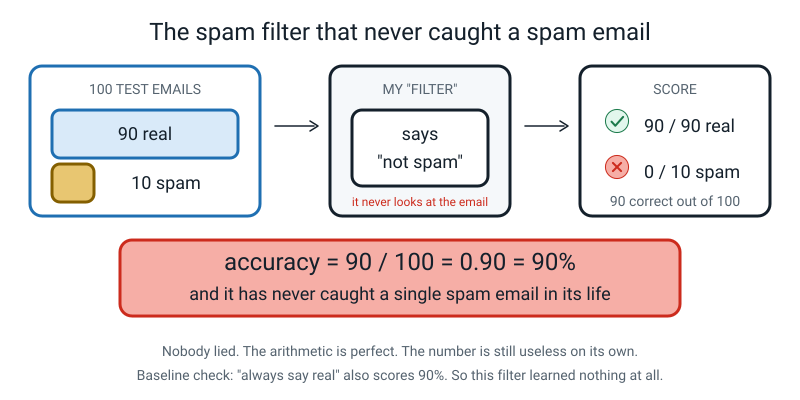
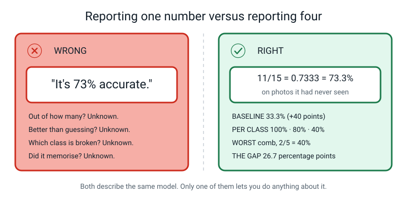
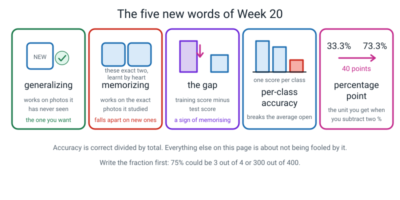

# Week 20 — Accuracy, Three Ways — and the Number That Lies

[⬅ Week 19](week-19.md) · [Course Home](../README.md) · [Week 21 ➡](week-21.md) · [Workbook](../workbook/week-20.md)

---

> ### This week in one sentence
>
> **Accuracy is correct divided by total — and one accuracy number can hide a class that is completely broken.**
>
> **By the end of this chapter you will be able to:**
> - Compute accuracy as a **fraction**, a **decimal** and a **percentage**, showing the division every single time, with no calculator
> - Explain why the fraction carries information that the percentage throws away
> - Compute **per-class accuracy** and find the class the overall average was hiding
> - Use the words **percentage point** correctly when you subtract two percentages — which most adults get wrong
>
> **Reading time:** about 25 minutes. **No computer needed, and no calculator** until you have written the division down. This is the most important chapter in the book.

---

## 🪝 Start Here

I have built a spam filter. It is **90% accurate.** Do you want it?

Before you answer, let me show you how I tested it, because I tested it properly. I took **100 emails.** Ninety of them were real emails — messages from friends, from school, that sort of thing. Ten of them were spam.

And here is my filter's entire method. Ready?

> **It says "not spam" about every email. Every single one. It does not even look at them.**

Let's score it.

Out of the **90 real** emails, how many did it get right? All ninety. It said "not spam", and they were not spam. Tick, ninety times.

Out of the **10 spam** emails? None. Zero. Not one.

```
   accuracy = 90 ÷ 100 = 0.90 = 90%

   real emails:  90 / 90  = 100%
   spam emails:   0 / 10  =   0%
```


*Figure 20.7 — Ninety percent accurate, and it has never caught a spam email in its life.*

**Ninety percent accurate. And it has never caught a single spam email in its life.** It literally cannot — it does not look.

Now here is the part that matters. **Nobody lied to you.** The arithmetic is perfect. 90 ÷ 100 really is 90%. And yet *"this filter is 90% accurate"* is one of the most misleading true sentences you could possibly say.

So this week does two things:

1. How to work out accuracy properly, and write it three different ways.
2. **How to catch a number that is lying to you while telling the truth.**

```
   THE QUESTION FOR THE WHOLE WEEK

        THIS NUMBER IS TRUE.
        WHAT IS IT NOT TELLING ME?
```

> **💡 Try this before you read on:** what score would a filter get if it said "spam" to every email instead? *(10 out of 100 = 10%.)* Now the uncomfortable question: which of the two filters is better? **Neither.** Both are broken in opposite directions and neither has read an email.

---

## 🧠 The Big Idea

### 1. Correct divided by total — and doing the division by hand

This is the simplest formula in the whole course. There is nothing else in it.

```
                number of correct guesses
   accuracy =  ---------------------------
                 total number of guesses
```

The formula is not the hard part. **Writing the division down is the hard part**, because it is boring and a calculator is right there.

Do it anyway. Here is the method, using the number you worked with in class: **11 out of 15.**

```
   11 ÷ 15

   15 x 0.7  = 10.5              →  so the answer is at least 0.7
   11 - 10.5 = 0.5 left over
   0.5 ÷ 15  = 0.0333
   0.7 + 0.0333 = 0.7333

   0.7333 x 100 = 73.33...  ≈  73.3%
```


*Figure 20.1 — Every step visible. Keep this page open while you work.*

🍕 **Why this method and not long division?** Because it keeps the *size* of the answer visible the whole way through. After one line you already know it is "a bit more than 0.7". So when 0.7333 arrives, it arrives **expected** rather than revealed — and that is how you catch your own mistakes for the rest of your life.

If you were taught the bus-stop long-division method and you like it, use it. Either route is fine. **What is not fine is a number appearing on your page with no working above it.**

> **💡 Try this:** before you divide anything, guess. Is 11 out of 15 more or less than three quarters? *Three quarters of 15 would be 11.25, so 11 is slightly less.* Ten seconds, and now you have a prediction to check your arithmetic against.

---

### 2. Three costumes — and the one that hides the evidence

You got 11 out of 15 on a spelling test. That one fact can be dressed three ways.

| Form | Value | What it tells the reader |
|---|---|---|
| **Fraction** | 11/15 | The score **and how many questions there were.** |
| **Decimal** | 0.7333 | Easy to compare and to multiply with. |
| **Percentage** | 73.3% | Familiar and quotable. **Hides that there were only fifteen.** |

Same fact. Three costumes. And here is the sentence to build everything on:

> **🔑 The fraction is the only one of the three that tells you how much evidence there was.**

Try it. Somebody tells you **"75%".** Is that **3 out of 4**, or **300 out of 400**?

You cannot tell. And those are wildly different claims. Three out of four is one good afternoon. Three hundred out of four hundred is proof.


*Figure 20.2 — Write the fraction first, every time. It is the only form that says how many tries there were.*

**So: write the fraction first.** It costs four extra characters and it stops your reader from being more impressed than they should be.

🍕 **The analogy.** "Nine out of ten dentists recommend it" sounds like science. Now imagine the poster said "90% of dentists recommend it" and you later found out they asked ten dentists. Same number. One of them told you the sample size and one of them hid it. **The fraction is the honest costume.**

**And here is the number that comes out of it.** On a 15-photo test:

```
   one photo  =  1 ÷ 15  =  0.0667  =  6.7 percentage points
```

**One photo is worth 6.7 points of your final score.** So if one comb had gone the other way, your headline would read 80% instead of 73.3%. Which means: *if my model gets 73% and yours gets 78% on fifteen photos, is yours better?* **You cannot tell.** A five-point difference measured on fifteen photos means nothing at all.

---

### 3. One number hides bodies — so break it open

Accuracy is an **average.** And an average's whole job is to hide the spread. That is not a flaw; that is what averages are *for*. It just means **you must never stop at one.**

🍕 **The class-average analogy.** A class averages 70% on a test. Sounds fine. Then you look at the actual marks: **half the room got 85% and the other half got 40%.** The average of 70% is completely true and completely useless. It described **nobody in the room.**

So you break the average open, one class at a time.

> **Per-class accuracy** — of the test examples that truly belong to class X, what fraction did the model get right? Worked out separately, once per class.

Here is what happened when you did that in class, on the same fifteen-row sheet:

```
   OVERALL      11 / 15  =  0.7333  =  73.3%

   spoon         5 / 5   =  1.000   =  100.0%
   toothbrush    4 / 5   =  0.800   =   80.0%
   comb          2 / 5   =  0.400   =   40.0%

   check: 5 + 4 + 2 = 11  ✓        5 + 5 + 5 = 15  ✓
```


*Figure 20.3 — 73.3% describes no class in this model. The red circle is what one number was covering up.*

**Now look at the three class scores and ask: which class scored 73.3%?**

**None of them.** A hundred, eighty, forty. The overall number describes **no class in this model at all.**

And the thing to keep for life: **the 73.3% was honest.** Nobody cheated to get it. It is just an average, and averages hide bodies.

**Accuracy also means nothing without a baseline.** You met **baseline** back in Week 12: how well you would do by ignoring everything and just guessing.

```
   3 roughly equal classes  →  baseline = 1 in 3 = 33.3%

   73.3 - 33.3 = 40 percentage points better than blind guessing
```

That makes 73.3% a real result. But now flip it round, the way the spam filter did:

```
   a test set that is 90% spoons  →  "always say spoon" scores 90%
```

A model reported as "90% accurate" on *that* test set has achieved precisely nothing. **So always write the baseline next to the accuracy.** A number with no baseline beside it is not a result, it is a boast.

> **⚠️ Watch out:** 40% for the comb class sounds terrible, and it is bad — but it is still *above* the 33.3% baseline. So the model has learned **something** about combs, just not enough. Being able to say that sentence is the difference between "it's broken" and knowing exactly where to spend your next ten photos.

---

### 4. Percentage, and percentage point — the bit adults get wrong

This one is a word idea, not a maths idea, and it is worth more than it looks.

- A **percentage** is a share **of** something. "40% of the photos."
- A **percentage point** is the gap **between** two percentages. "It went from 33.3% to 73.3% — up 40 percentage points."

Why does it matter? Because "40 percent more" and "40 percentage points more" are genuinely different claims:

```
   33.3% + 40 percentage points   =  73.3%                    ← what actually happened
   33.3% + 40 percent OF ITSELF   =  33.3 x 1.4  =  46.6%     ← a much smaller claim
```


*Figure 20.4 — Percent is a share of something. A percentage point is a gap between two percentages.*

**The habit to build:** when you subtract two percentages, the answer's unit is **points**, and you say the word out loud.

```
   73.3% - 33.3%  =  40 percentage points
   80%   - 40%    =  40 percentage points
   100%  - 73.3%  =  26.7 percentage points
```

🍕 **The shop analogy, which makes it click.** A shop's sale goes from **20% off** to **30% off**.

- That is **10 percentage points** more off.
- It is also **50% more discount** (because 10 ÷ 20 = 0.5).

**Both sentences are true. They use different numbers. They are about the same change.** Without the word "points", nobody knows which one you meant — and that is exactly why the word exists.

> **💡 Try this at dinner:** listen out for it on the news. "Unemployment rose by 2 percent" and "unemployment rose by 2 percentage points" get mixed up constantly, and they can be ten times apart. You will start hearing it everywhere, and you will be right and they will be wrong, which is a pleasant feeling.

---

### 5. The gap — a first look

Three of this week's new words belong to a bigger idea that **next week** unpacks properly. Here they are, and here is one subtraction.

> **Generalizing** — the model works on examples it has never seen. This is the only thing you actually want.
>
> **Memorizing** — the model works on the exact examples it studied, and falls apart on anything else.
>
> **The gap** — training accuracy minus test accuracy. How much memorizing happened.

The person who built the sheet you scored also wrote down how their model did on the 60 photos it trained on: **sixty out of sixty.**

```
   training accuracy:  60/60 = 100.0%
   test accuracy:      11/15 =  73.3%
   -------------------------------------
   the gap:                    26.7 percentage points
```

**Is 100% impressive?**

It is the most ordinary result in the world. Of course it got 100% — those were the photos it studied. **You** would get 100% too, if somebody gave you the exam paper to revise from.

> **🔑 A model scoring 100% on its own study material means nothing on its own. Only the gap carries information.**

Twenty-six point seven percentage points. Some of what this model learned was real: 73.3% against a 33.3% baseline is not luck. And some of it was **memorizing** those exact sixty photos. Working out how much of each is next week's entire lesson.


*Figure 20.6 — The four numbers that travel together, from now on. Copy this into your notebook if you missed class.*

**These four numbers now travel together, always:**

```
   ACCURACY   11/15 = 0.7333 = 73.3%
   BASELINE   33.3%   →  40 percentage points better
   PER CLASS  spoon 100%  ·  toothbrush 80%  ·  comb 40%
   THE GAP    100% - 73.3% = 26.7 percentage points
```

And here is what "it's 73% accurate" would have told you about any of that. **Nothing.** It is true, and it is nearly useless, and it is what almost every advert about AI says.

---

## 🔍 Worked Examples

Three complete examples. Every division written out, no calculator.

### Example 1 — Food: a fruit-ripeness sorter, 19 out of 24

You built a model that sorts fruit into **unripe · ripe · overripe.** You tested it on **24 held-out photos**, 8 of each. It got **19 right.**

**Step 1 — the fraction, first, always.**

```
   19 / 24
```

**Step 2 — the decimal, with the division shown.**

```
   24 x 0.7  = 16.8              →  at least 0.7
   19 - 16.8 = 2.2 left over
   2.2 ÷ 24  = 0.0917
   0.7 + 0.0917 = 0.7917
```

**Step 3 — the percentage.**

```
   0.7917 x 100 = 79.17...  ≈  79.2%
```

**Step 4 — the baseline, in the same breath.**

```
   3 roughly equal classes  →  baseline = 1 in 3 = 33.3%
   79.2 - 33.3 = 45.9 percentage points better than guessing
```

**Step 5 — break the average open.** Here is what the 19 correct were made of:

| class | correct | total | fraction | decimal | percentage |
|---|:--:|:--:|---|---|---|
| unripe | 8 | 8 | 8/8 | 1.000 | **100.0%** |
| ripe | 7 | 8 | 7/8 | 0.875 | **87.5%** |
| overripe | 4 | 8 | 4/8 | 0.500 | **50.0%** |
| **overall** | **19** | **24** | **19/24** | **0.792** | **79.2%** |

**Step 6 — both checks.**

```
   8 + 7 + 4 = 19   ✓   matches the correct count
   8 + 8 + 8 = 24   ✓   matches the number of photos
```

**Step 7 — read it out loud, in one sentence.**

> *"On 24 photos it had never seen, this model scored 19/24 = 79.2% against a 33.3% baseline, and it was worst at overripe, at 4 out of 8, which is 50%."*

**And the gap.** The person who built it trained on 72 photos and scored 72/72.

```
   100.0% - 79.2%  =  20.8 percentage points of gap
```

**What would you investigate first?** Not "more photos". Something specific: *"I'd look at whether the overripe photos were all of bananas, because overripe bananas go brown but overripe apples mostly just go soft — and if so, the model has nothing to look at."*

---

### Example 2 — Sport: the wicket detector that never sees a wicket

A cricket app claims to spot **whether a ball took a wicket.** Two classes: `wicket` and `no wicket`. It was tested on **50 balls**: 46 with no wicket, 4 with a wicket.

The app says **"no wicket"** about every single ball.

**Step 1 — overall accuracy.**

```
   46 / 50

   50 x 0.9  = 45
   46 - 45   = 1
   1 ÷ 50    = 0.02
   0.9 + 0.02 = 0.92

   0.92 x 100 = 92.0%
```

**Ninety-two percent accurate.** That would look excellent on a poster.

**Step 2 — per class.**

| class | correct | total | fraction | percentage |
|---|:--:|:--:|---|---|
| no wicket | 46 | 46 | 46/46 | **100.0%** |
| wicket | 0 | 4 | 0/4 | **0.0%** |
| **overall** | **46** | **50** | **46/50** | **92.0%** |

Checks: `46 + 0 = 46` ✓ and `46 + 4 = 50` ✓.

**Step 3 — and now the baseline, which is the killer.** The classes are *not* equal here. 46 out of 50 balls took no wicket. So the best you can do by ignoring the ball entirely is:

```
   "always say no wicket"  =  46 ÷ 50  =  92.0%

   92.0 - 92.0 = 0 percentage points better than guessing
```

**Zero.** This model is exactly as good as a rule you could write on a stamp. Its 92% is not a small achievement — it is **no achievement at all.**

**Step 4 — the sentence that matters.**

> *"92% sounds great and means nothing, because the baseline is also 92%. On the one class anybody cares about — wicket — it scores 0 out of 4."*

> **🔑 The lesson:** when your classes are lopsided, the *baseline* goes up with them. A high accuracy on a lopsided test set is the easiest number in the world to get and the least informative one to report.

---

### Example 3 — School: four classes, 34 out of 40, and a drill

A school-uniform sorter with **four** classes: `tie · blazer · jumper · PE kit`. Tested on **40 held-out photos**, 10 of each. It got **34** right.

**Step 1 — fraction, decimal, percentage.**

```
   34 / 40

   40 x 0.8 = 32
   34 - 32  = 2
   2 ÷ 40   = 0.05
   0.8 + 0.05 = 0.85

   0.85 x 100 = 85.0%
```

**Step 2 — the baseline, and watch this, because it is different.** Four classes, not three:

```
   4 roughly equal classes  →  baseline = 1 in 4 = 0.25 = 25.0%

   85.0 - 25.0 = 60 percentage points better than guessing
```

Notice the baseline **dropped** when a class was added. More classes means guessing is worse, which means the same accuracy is a bigger achievement. **The baseline depends on the number of classes, so you have to work it out fresh every time.**

**Step 3 — per class.**

| class | correct | total | fraction | decimal | percentage |
|---|:--:|:--:|---|---|---|
| tie | 10 | 10 | 10/10 | 1.000 | **100.0%** |
| blazer | 9 | 10 | 9/10 | 0.900 | **90.0%** |
| jumper | 10 | 10 | 10/10 | 1.000 | **100.0%** |
| PE kit | 5 | 10 | 5/10 | 0.500 | **50.0%** |
| **overall** | **34** | **40** | **34/40** | **0.850** | **85.0%** |

Checks: `10 + 9 + 10 + 5 = 34` ✓ and `10 + 10 + 10 + 10 = 40` ✓.

**The 85% was hiding a class at 50%.** Three of the four classes are basically solved, and one is a coin toss. If you reported "85% accurate", nobody would ever have known.

**Step 4 — the percentage-point drill, on these numbers.** Say each answer out loud, with the unit.

| Question | Subtraction | Say this |
|---|---|---|
| How much better than guessing overall? | 85.0 − 25.0 | "60 percentage points." |
| How far behind is PE kit compared to tie? | 100 − 50 | "50 percentage points." |
| How far behind is blazer compared to tie? | 100 − 90 | "10 percentage points." |
| Training was 100%. What's the gap? | 100 − 85.0 | "15 percentage points." |
| Is PE kit above the baseline? | 50.0 − 25.0 | "Yes — 25 percentage points above it." |

**Step 5 — what would you investigate first?** *"I'd check whether the PE kit photos were all of the same PE bag stuffed in a corner, because a crumpled PE kit has no shape and the other three items all do."*

---

## 🎲 What We Did In Class

### The scoring sheet, row by row

You were handed a **completed** fifteen-row test result sheet from somebody else's spoon / toothbrush / comb model. The true class and the prediction were already filled in. The `correct?` column was blank. That column was your job.

**The rules were:** one row at a time, top to bottom, **no skipping**, no scanning ahead to see how it ends, and **no calculator** until the division was written down.


*Figure 20.5 — What the finished sheet looks like. Eleven Y and four N — and the four N are not spread evenly, which is the thing to notice later, not now.*

Here is the full sheet, in case you missed the lesson or want to redo it:

| # | true class | predicted | top conf. | correct? |
|:--:|---|---|:--:|:--:|
| 1 | spoon | spoon | 94% | ✅ Y |
| 2 | spoon | spoon | 88% | ✅ Y |
| 3 | spoon | spoon | 91% | ✅ Y |
| 4 | spoon | spoon | 76% | ✅ Y |
| 5 | spoon | spoon | 82% | ✅ Y |
| 6 | toothbrush | toothbrush | 90% | ✅ Y |
| 7 | toothbrush | toothbrush | 85% | ✅ Y |
| 8 | toothbrush | toothbrush | 71% | ✅ Y |
| 9 | toothbrush | toothbrush | 68% | ✅ Y |
| 10 | toothbrush | **comb** | 54% | ❌ N |
| 11 | comb | comb | 79% | ✅ Y |
| 12 | comb | comb | 63% | ✅ Y |
| 13 | comb | **toothbrush** | 58% | ❌ N |
| 14 | comb | **toothbrush** | 66% | ❌ N |
| 15 | comb | **spoon** | 49% | ❌ N |

**Correct rows:** 1, 2, 3, 4, 5, 6, 7, 8, 9, 11, 12 → **11 out of 15.**

> **💡 Try this if you are redoing it:** cover the last column with a strip of paper and mark it yourself before you look. And **do not total as you go** — mark all fifteen, *then* count. Counting while marking is how you end up with twelve, then eleven, then no idea.

### Then the discovery

You highlighted the sheet by class — rows 1–5 are spoon, 6–10 toothbrush, 11–15 comb — and scored each block on its own.

```
   spoon:       5 / 5 = 1.000 = 100.0%
   toothbrush:  4 / 5 = 0.800 =  80.0%
   comb:        2 / 5 = 0.400 =  40.0%

   check: 5 + 4 + 2 = 11  ✓        5 + 5 + 5 = 15  ✓
```

Then you drew four bars — the overall one at 73.3%, three class bars underneath — circled the 40% in red, and drew the 33.3% baseline as a dotted line across all four.

**The 40% class was invisible in the average.** That was the point of the whole lesson.

### And the drill

Five subtractions, each read out loud with the unit attached:

| # | The question | Say out loud |
|:--:|---|---|
| 1 | Blind guessing 33.3%, model 73.3%. Difference? | "40 percentage points." |
| 2 | Toothbrush 80%, comb 40%. Difference? | "40 percentage points." |
| 3 | Training 100%, test 73.3%. Difference? | "26.7 percentage points." |
| 4 | Last term 50%, this term 75%. Difference? | "25 percentage points." *(and also "half as much again", which is 50% more — two true sentences)* |
| 5 | Model A 12%, model B 9%. Difference? | "3 percentage points." *(and also "a third more", since 3 ÷ 9 = 0.333)* |

### ✅ Finished looks like this

- [ ] Fifteen rows marked Y or N, in pen, no skipping
- [ ] Overall accuracy in all three forms, with the division written out
- [ ] The baseline written next to it, and the difference in **percentage points**
- [ ] Three per-class accuracies, each in all three forms
- [ ] **Both** checks written down: `5 + 4 + 2 = 11` and `5 + 5 + 5 = 15`
- [ ] Four bars drawn, 40% circled, 33.3% baseline line across
- [ ] The gap: `100 − 73.3 = 26.7` points
- [ ] Five drill answers, each said aloud with the word "points" in it

---

## 💬 Talk About It

**1. "Nine out of ten dentists recommend this toothpaste." Ask a grown-up what is missing.**

> *Hint:* three questions get you there — *out of how many dentists? chosen how? recommend it compared to what?* If they asked ten dentists, "nine out of ten" and "90%" are the same number wearing different clothes, and only one of them is honest about the evidence.

**2. "Would you rather have a model that is 85% accurate overall, or one that is 70% accurate overall but never below 65% on any class?"**

> *Hint:* it depends what the classes are *for*. If the 85% one is at 20% on one class, and that class is "is there a car coming", then 70% everywhere is obviously better. Try to get to: **the answer depends on what the mistakes cost, and that is a question about the world, not about the numbers.**

**3. Find a real percentage in the house — on a packet, an app, a school report — and interrogate it.**

> *Hint:* out of how many? compared to what? which group does it fail on? Most real percentages dodge at least one of those three, and noticing which one is a genuinely useful life skill.

---

## ⚠️ Don't Get Tricked

### Trick 1 — reporting one number instead of four


*Figure 20.8 — Both describe the same model. Only one of them lets you do anything about it.*

| ❌ Wrong | ✅ Right |
|---|---|
| "It's 73% accurate." | "11/15 = 73.3% on photos it had never seen, against a 33.3% baseline; worst class comb at 2/5 = 40%; gap 26.7 points." |

**Why it matters:** the short version answers no useful question. Out of how many? Better than guessing? Which class is broken? Did it memorise? All four unknown — and all four were available.

### Trick 2 — reading 73.3% as "73 out of every 100"

| ❌ Wrong | ✅ Right |
|---|---|
| "It gets about 73 out of every 100 right." | "It got **11 out of 15** right. 73.3% is what that *would* be if it kept the same rate up over a hundred." |

**Why it matters:** there were fifteen photos, not a hundred. **One photo is 6.7 percentage points.** If one comb had gone the other way, the headline reads 80%. A five-point gap between two models on fifteen photos is noise, not evidence.

### Trick 3 — saying "percent" when you mean "percentage points"

| ❌ Wrong | ✅ Right |
|---|---|
| "My model is 40 percent better than guessing." | "My model is **40 percentage points** better than guessing." |

**Why it matters:** "40 percent better than 33.3%" would be 46.6%, which is a much smaller claim than 73.3%. The two sentences sound almost identical and describe different things. Getting this right takes about five repetitions and then makes you very hard to fool.

### Trick 4 — being impressed by a high number on a lopsided test

| ❌ Wrong | ✅ Right |
|---|---|
| "95% accurate! That's brilliant." | "95% on a test set that was 95% spoons. So the baseline is also 95%. It achieved nothing." |

**Why it matters:** this is the spam filter, and it is the single most common way a number lies while telling the truth. **Work out the baseline before you react to the accuracy.** If the two are close, the model has not earned its number.

---

## 🌍 Where You've Seen This

- **School reports.** "78%" on a report card. Out of how many marks? Compared to what? Which topics dragged it down? Your report is an overall accuracy with the per-class breakdown removed.
- **Cricket batting averages.** A batter averaging 45 might have scored 450 in ten innings or 4,500 in a hundred. Same average, wildly different amounts of evidence. **The fraction matters.**
- **App store ratings.** "4.8 stars" from 12 ratings versus 4.6 stars from 40,000. The second one is far more trustworthy, and the bigger number is the less believable one.
- **"97% positive reviews" on a game.** Out of how many? And positive from *whom* — people who bought it because they already liked that kind of game?
- **Weather forecasts.** "70% chance of rain" is fine. But if it said "90% accurate", you should immediately ask: in a place where it rains 90% of days, "always say rain" is 90% accurate.
- **Medical test results.** A test for a rare disease can be "99% accurate" by simply saying *no* to everybody, if only 1 person in 100 has it. Doctors know this. It is exactly the spam filter, with much higher stakes.
- **The news.** "Support rose by 5 percent." Five percentage points, or five percent of what it was? Those can be ten times apart, and newsreaders mix them up constantly.

---

## 🧭 Where This Fits

Same box as last week — **HONEST TESTING** — because a hidden pile of examples is only half of the job.
This week is the other half: turning *"how many did it get right"* into a number that cannot mislead
anybody, including you.


*Figure 20.0 — The map in Week 20. HONEST TESTING stays the tinted box, and only **one** thread is lit:
evaluation. One idea, done thoroughly, is what this week is.*

| | |
|---|---|
| **The mental model you now own** | Accuracy is **correct ÷ total**, and you write it three ways — as a fraction, as a decimal with the division shown, and as a percentage — **always with the baseline beside it**. And one overall number can hide a class that is completely broken, so you open the average up class by class. |
| **The one question it answers** | *"Out of how many, what is the baseline, and what does it look like per class?"* |
| **What it plugs into** | Week 19's sealed pile gives you something honest to score, and Week 12's baseline box is the thing that stops a big percentage from impressing you before you have thought about it. |
| **What carries forward** | Every number you report for the rest of the year is written this way: Week 22 on your own model, Weeks 31 and 33 on who it fails, Week 34 on the capstone, and Week 36 in front of an audience at the showcase. |
| **Spiral thread** | ⚖️ **Evaluation**, on its own this week — one thread, because the whole week is one skill: reporting a score that does not lie, even a little, even by accident. |

> **💡 Try this:** write one accuracy on your map in all three costumes, with the baseline next to it.
> If the baseline is close to the accuracy, draw a small arrow to it and the words **"earned nothing"**.
> That arrow is worth more than the percentage.

---

## 🔑 Remember This

- **Accuracy = correct ÷ total.** That is the whole formula. Write the division down; a number with no working is not an answer.
- **Write the fraction first.** It is the only form that says how much evidence there was. 75% could be 3/4 or 300/400.
- **Always write the baseline next to the accuracy.** A number with no baseline beside it is a boast, not a result.
- **Never report one accuracy number on its own.** Break it open per class. The average describes nobody.
- On 15 photos, **one photo is 6.7 percentage points.** So a 5-point difference between two models means nothing.
- Subtract two percentages and the unit is **percentage points**. Say the word out loud, every time.
- **100% on training photos is the most ordinary result in the world.** Only the gap carries information.
- A high accuracy can be **completely honest and completely misleading** at the same time. That is the whole week.

---

## 📓 New Words


*Figure 20.9 — Five words. Three of them get their proper lesson next week.*

| Word | What it means | Example |
|---|---|---|
| **generalizing** | The model works on examples it has never seen. The only thing you actually want. | "It got 95% on brand-new photos, so it's generalizing well." |
| **memorizing** | The model works on the exact examples it studied, and falls apart on anything else. | "100% on its own photos and 40% on new ones — that's memorizing." |
| **the gap** | Training accuracy minus test accuracy. How much memorizing happened. | "The gap is 26.7 percentage points." |
| **per-class accuracy** | Of the test examples that truly belong to one class, what fraction the model got right. Worked out one class at a time. | "Per-class accuracy: spoon 100%, toothbrush 80%, comb 40%." |
| **percentage point** | The unit you get when you subtract one percentage from another. | "It went from 33.3% to 73.3% — up 40 **percentage points**, not 40 percent." |

> **📓 Two older words you now need every single time:** **baseline** (Week 12) and **test set** (Week 19). An accuracy without those two beside it is not finished.

---

## 📤 Your Homework

Go to **[Workbook — Week 20](../workbook/week-20.md)**.

| Page | What you're doing | About how long |
|---|---|---|
| Warm-up + Practice A | Five recall questions from Week 19, then six questions on accuracy | 20 min |
| Practice B + Puzzle | Five applied problems, then the three adverts puzzle | 20 min |
| Think Deeper + Build It | Two paragraphs, then **five accuracy problems and the number that lies** | 25 min |
| Draw It + Self-Check | Draw the hidden class, then tick how you're doing | 10 min |

**About 50 minutes.** And there is **one rule that covers all of it:**

> **⚠️ If a number appears with no division written above it, it does not count.**
>
> Messy working and a wrong answer is worth more than a right answer that arrived by magic. Show `40 × 0.8 = 32`, then `34 − 32 = 2`, then `2 ÷ 40 = 0.05`. Every time.

**Say "points". Write "points".** Every time you subtract two percentages. That habit is the single most transferable thing in this chapter.

**And the envelope stays shut.** Two more weeks. Check the signature is still intact, then leave it alone.

---

[⬅ Week 19](week-19.md) · [Course Home](../README.md) · [Week 21 ➡](week-21.md) · [📓 Workbook — Week 20](../workbook/week-20.md) · [Glossary](../../glossary.md)
