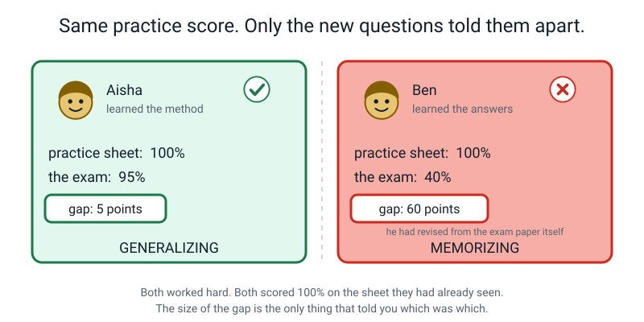
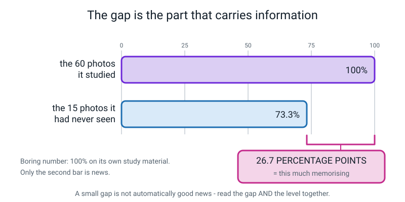
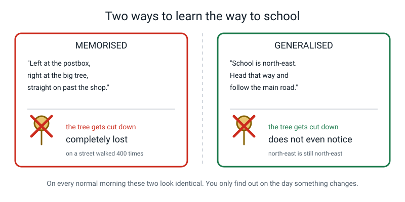
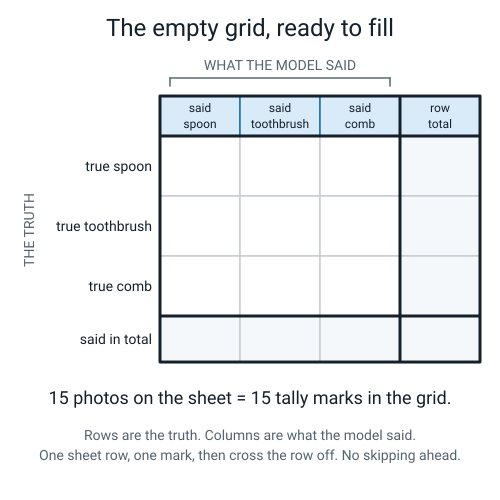
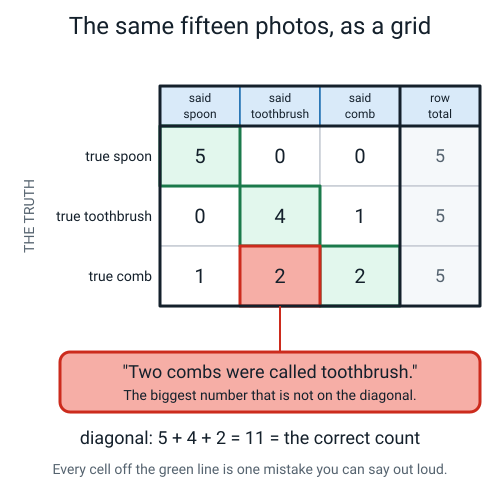
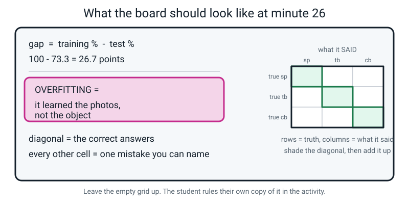
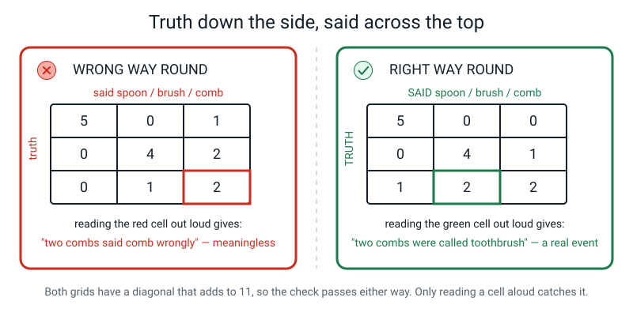
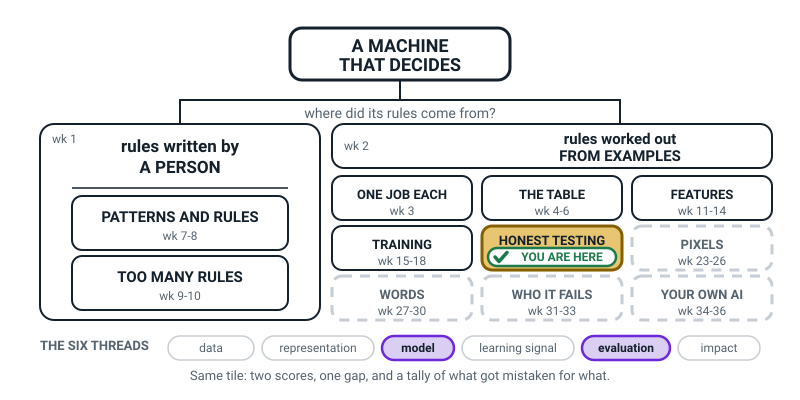
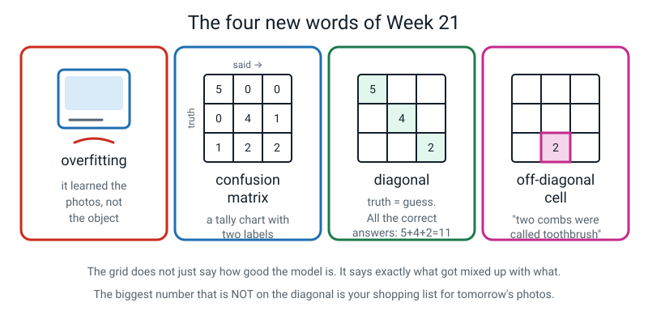

# Week 21 — Memorizing vs Generalizing

[⬅ Week 20](week-20.md) · [Course Home](../README.md) · [Week 22 ➡](week-22.md) · [Workbook](../workbook/week-21.md)

---

> ### This week in one sentence
>
> **A model that scores 100% on its own photos and 40% on new ones did not learn the object — it learned the photos.**
>
> **By the end of this chapter you will be able to:**
> - Tell **memorizing** apart from **generalizing** using the gap between training accuracy and test accuracy
> - Define **overfitting** in plain words, without using the word "fit"
> - Build a **three-by-three confusion matrix** by hand from a scoring sheet, and run both checks on it
> - Read any **off-diagonal cell** as a specific, nameable mistake — *"two combs were called toothbrush"* — and trace it back to the photos
>
> **Reading time:** about 25 minutes. **No computer needed.** You need a ruler, a pen, a green pen and a red pen.

---

## 🪝 Start Here

This section tells a short story about two students. It sets up the question for the whole week.

Two students: **Aisha** and **Ben.**

Both are given the same practice sheet: sixty questions, answers on the back. Both work through it until they can do every single one. Both score **100% on the practice sheet.**

```text
   Aisha:  practice 100%
   Ben:    practice 100%
```

**So which one is better at maths?**

Stop and think for a second. You cannot tell. They are identical on the page in front of you.

Now it is **exam day.** The paper has twenty questions on it that neither of them has ever seen.

```text
   Aisha:  practice 100%   exam 95%    gap   5 points
   Ben:    practice 100%   exam 40%    gap  60 points
```

Ben is upset and confused. Here is the important part: **Ben did know all the answers.**

He knew that question 3 was 42 and question 7 was blue. He worked incredibly hard. He learned sixty answers perfectly.

He just learned the wrong thing. Extremely well.


*Figure 21.1 — Both worked hard. Both got 100% on the sheet they had already seen. Only the new questions told them apart.*

> **⚠️ Ben is not stupid and Ben is not lazy.** Memorising is a real strategy that works brilliantly right up until the moment it doesn't. Nobody in this story did anything wrong except pick the wrong thing to learn.

Now the question that is this week's lesson:

**On the practice sheet, could you have told them apart?**

No. They looked identical. **You needed the exam.**

Your model has the same problem. It will happily report 100% on the photos it studied. That tells you nothing about which of these two students it is.

The question for the whole week:

```text
   THE QUESTION FOR THE WHOLE WEEK

        DID IT LEARN THE OBJECT,
        OR DID IT LEARN MY PHOTOS?
```

> **💡 Try this before you read on:** write down a guess about your own model, the one you trained in Week 17. Aisha or Ben? Initial it and date it. Next week you find out for real, and you are not allowed to change your guess.

---

## 🧠 The Big Idea

This section gives you the new words and the tool for this week: two scores, one subtraction and one grid.

### 1. Two words, and one subtraction that tells them apart

> **Generalizing** — the model works on examples it has never seen. This is almost always what you actually want.
>
> **Memorizing** — the model works on the exact examples it studied, and falls apart on anything else.

You **cannot** tell these apart by looking at the model. Nobody can, not you, not me, not even the people who built it. It takes a fresh test.

But you can tell in ten seconds by comparing two numbers: **the score on the photos it trained on, and the score on the photos it had never seen.**

Here is an example, with the gap worked out underneath.

```text
   training accuracy:  60/60 = 100.0%
   test accuracy:      11/15 =  73.3%
   -------------------------------------
   the gap:                    26.7 percentage points
```


*Figure 21.2 — 100% on its own study material is the boring number. Only the second bar is news.*

Here is the whole diagnosis table. Read the rows out loud.

| Training accuracy | Test accuracy | Gap | What it means |
|:--:|:--:|:--:|---|
| 100% | 95% | 5 pts | Generalizing well. It learned the object. ✅ |
| 100% | 73% | 27 pts | Learned something real, and memorised some of the photos too. 🟡 |
| 100% | 40% | 60 pts | Memorised hard. It learned your table, not your comb. ❌ |
| 55% | 52% | 3 pts | Barely learned anything at all. 🟠 |

**Read that last row carefully, because it is the trap inside the trap.**

A *small* gap is not automatically good news. A model at 55% and 52% has a tiny gap and is useless. So:

> **🔑 You read the gap AND the level, together, always. The gap tells you about memorising. The level tells you whether anything was learned at all.**

Our sheet's 26.7-point gap says: this model is somewhere between Aisha and Ben, and closer to the middle than you would like. It has learned something real — 73.3% against a 33.3% baseline is not luck. **And** it has also memorised something about those specific sixty photos.

---

### 2. Overfitting, in plain words

There is a proper name for what Ben's version does, and you will meet this word for the rest of your life if you go anywhere near this subject.

> **Overfitting** — when a model learns its training examples so closely that it stops working on anything new.
>
> **In plain words: it learned the photos, not the object.**

That is it. Not the object — *the photos.* The wooden table in the corner of every picture. Your left hand. The shadow. The smudge on the spoon.

**Why we are not going to use the word "fit".** The grown-up definitions of overfitting all lean on "fitting a curve to some data", which is a Level 2 picture and means nothing useful yet. The plain version above says almost everything the fancy version says, and it is memorable. If you can say *"it learned the photos, not the object"*, you will recognise the formal definition instantly when you meet it next year.

🍕 **The second analogy, for when the school one gets stale — learning your way to school.**

- **Version A:** *"Turn left at the postbox, right at the big tree, straight on past the shop."*
- **Version B:** *"School is north-east of home. Head that way and follow the main road."*

Both get you to school every single morning. Then one day **the big tree is cut down.**


*Figure 21.6 — On every normal morning these two look identical. You only find out on the day something changes.*

Version A is now completely lost, on a street they have walked four hundred times. Version B does not even notice, because north-east is still north-east.

**Version A memorised the route. Version B generalised.** And on every normal day, both looked exactly the same.

**Three things make overfitting more likely — and you control all three:**

| Cause | Why it does it | The fix |
|---|---|---|
| **Too few examples** | there isn't enough variety for a general pattern to be the *easiest* thing to find | collect more, in more situations |
| **Too little variety** | the background *is* the easiest pattern, so that is what gets learned | change room, light, surface, hand, distance |
| **Near-duplicate examples** | 200 frames of one burst is one example wearing 200 hats | short bursts, and move between them |

> **🧑‍🏫 You have already built one of these.** Three weeks ago, in Week 18, your one-background model scored **95%** on the wooden table and fell over completely at the sink. It scored *higher* than your good model where it was trained, and collapsed two metres away. **That was a textbook overfitted model and you built it in about ten minutes.** The word is new. The experience is three weeks old. Go and look at that row in your Week 18 table now.

---

### 3. The confusion matrix — honestly just a tally chart with two labels

Last week, per-class accuracy told you **which class** was broken: comb, at 40%. Useful. But it did **not** tell you what the combs were getting *confused with* — and that is the thing you would actually need in order to fix it.

So here is the tool.

> **Confusion matrix** — a grid where each **row** is the true class, each **column** is what the model said, and each **cell** counts how many examples fell into that combination.

That is all it is. A tally chart with two labels.


*Figure 21.4 — Rows are the truth. Columns are what the model said. Label both before you write a single number.*

**Say this out loud, because it is the phrase that stops the commonest mistake in the week:**

> **🔑 Truth down the side. Said across the top.**

Then you go down your scoring sheet, one row at a time, and put one mark in the box where *the truth* meets *what it said*. Fifteen rows on the sheet → fifteen marks in the grid. You know that before you start, which is handy.

It is called a *confusion* matrix because it shows you exactly what got **confused** with what. "Matrix" is just a maths word for a grid of numbers. So: a grid of confusions. It is one of the very few pieces of jargon in this whole field that means precisely what it says.

**Two special names:**

> **Diagonal** — the cells where truth equals prediction, running from top-left to bottom-right. These are all your correct answers.
>
> **Off-diagonal cell** — any other cell. Every single one is a specific mistake you can say out loud in a sentence.

**What would a perfect grid look like?** 5, 5, 5 down the diagonal and **zero everywhere else.** And a model that got everything wrong? **Nothing on the diagonal at all** — which is a genuinely strange-looking grid, and worth picturing for a moment.

---

### 4. The two checks, which are not optional

Here is the finished grid from the fifteen-row sheet you scored last week.

| | **said spoon** | **said toothbrush** | **said comb** | row total |
|---|:--:|:--:|:--:|:--:|
| **true spoon** | **5** | 0 | 0 | 5 |
| **true toothbrush** | 0 | **4** | 1 | 5 |
| **true comb** | 1 | 2 | **2** | 5 |
| **total said** | 6 | 6 | 3 | **15** |


*Figure 21.5 — The diagonal is what went right. Every cell off it is a sentence you can say out loud.*

**Check 1 — the diagonal must equal the number of correct answers you already counted.**

```text
   diagonal:  5 + 4 + 2  =  11
   correct count on the sheet:  11        ✓ they match
```

**Check 2 — all nine cells must add to the number of test photos.**

```text
   5+0+0  +  0+4+1  +  1+2+2  =  15      ✓ same as the number of photos
```

Both checks take **four seconds** and between them they catch nearly every filling error anybody makes.

> **⚠️ Write the checks down as lines on the page, not as a thought in your head.** Written checks get done. Remembered checks don't. And next week you will fill a grid from your own sheet with **no answer key to compare against** — these two checks will be the only safety net you have.

**If check 1 fails:** a mark went into the wrong box. **If check 2 fails:** you missed a sheet row, or you counted one twice. The habit that prevents check 2 failing: **put a small tick next to each row of the sheet as its mark goes into the grid.**

---

### 5. How to read it — the part that makes the grid worth drawing

A grid you don't read is just tidy arithmetic. There are three ways to read it, and they give three different answers.

**A) Along a row — what happened to a class.**

> *"Of the five real combs: two were called comb, two were called toothbrush, and one was called spoon."*

That is the model's weakness **on combs.** And notice the spoon row: five marks in one box, nothing anywhere else. **That is what a class the model has completely solved looks like.**

**B) Down a column — what the model was *willing to say*.**

```text
   said spoon:      6 times, but only 5 spoons existed   →  one extra; too small a difference to read anything into
   said toothbrush: 6 times, but only 5 toothbrushes     →  one extra; too small a difference to read anything into
   said comb:       3 times, though 5 combs existed      →  RELUCTANT about comb
```

This is a **different question** from "it's bad at combs", and it is worth understanding why. The row tells you how often a real comb was recognised; the column tells you how often the model *chose* the word "comb" at all. This model only chose it three times in fifteen tries. One **hypothesis** to check: the comb training photos were **too few, or all too similar to each other.** Others are possible too (the other classes had more variety, or comb photos were taken differently). With only fifteen photos, three versus five could also be luck.

**C) The single most useful number in the grid: the biggest one that is NOT on the diagonal.**

Here that is the **2** in *true comb / said toothbrush*.

> **🔑 That cell is a shopping list. It tells you exactly which photos to go and take tomorrow.**

And once you say it out loud it stops being surprising: *a comb and a toothbrush are both thin plastic handles with bristly bits, at roughly the same size.* The grid did not just say "the model is 73.3% accurate". It said **"combs and toothbrushes look alike to this model, and here are the two photos where it happened"** — which is a sentence you can act on.

**One more thing to notice: the confusion is not symmetric.**

```text
   true comb → said toothbrush:      2
   true toothbrush → said comb:      1
```

Two one way, one the other. On fifteen photos that is a difference of a single photo, so it could easily be noise. But treat it as **a hint to investigate**: lopsided confusion *can* mean a problem with the class itself (too few comb photos, or comb photos that were all too similar), and it can also have other causes. The grid cannot tell you which; you would have to go and check.


*Figure 21.3 — What the board looked like by the middle of the lesson. Copy it if you missed class.*

**And zeros are information too.** *"No spoon was ever mistaken for anything."* That is a real finding, and you would never have got it from the number 73.3%.

---

## 🔍 Worked Examples

Three complete examples: one about food, one about sport, one about school.

### Example 1 — Food: a snack sorter, 12 photos

A **samosa / pakora / vada** classifier, tested on 12 held-out photos, 4 of each. Here is the scoring sheet.

| # | true | predicted | correct? |
|:--:|---|---|:--:|
| 1 | samosa | samosa | Y |
| 2 | samosa | samosa | Y |
| 3 | samosa | samosa | Y |
| 4 | samosa | samosa | Y |
| 5 | pakora | pakora | Y |
| 6 | pakora | pakora | Y |
| 7 | pakora | **vada** | N |
| 8 | pakora | **vada** | N |
| 9 | vada | vada | Y |
| 10 | vada | vada | Y |
| 11 | vada | **samosa** | N |
| 12 | vada | **pakora** | N |

**Step 1 — overall accuracy, all three forms.** Correct rows: 1, 2, 3, 4, 5, 6, 9, 10 → **8 correct.**

```text
   8 / 12

   12 x 0.6 = 7.2              →  at least 0.6
   8 - 7.2  = 0.8 left over
   0.8 ÷ 12 = 0.0667
   0.6 + 0.0667 = 0.6667

   0.6667 x 100 = 66.67...  ≈  66.7%

   baseline (3 equal classes) = 33.3%
   66.7 - 33.3 = 33.3 percentage points better than guessing
```

**Step 2 — build the grid. Labels first: truth down the side, said across the top.**

| | **said samosa** | **said pakora** | **said vada** | row total |
|---|:--:|:--:|:--:|:--:|
| **true samosa** | **4** | 0 | 0 | 4 |
| **true pakora** | 0 | **2** | 2 | 4 |
| **true vada** | 1 | 1 | **2** | 4 |
| **total said** | 5 | 3 | 4 | **12** |

**Step 3 — both checks.**

```text
   diagonal:  4 + 2 + 2  =  8   ✓  matches the correct count
   all cells: 4+0+0 + 0+2+2 + 1+1+2  =  12   ✓  matches the number of photos
```

**Step 4 — every off-diagonal cell, as a sentence.**

```text
   true pakora → said vada,     2   →  "TWO PAKORAS WERE CALLED VADA."   ← biggest, circle it
   true vada → said samosa,     1   →  "one vada was called a samosa."
   true vada → said pakora,     1   →  "one vada was called a pakora."

   and the zeros:  "no samosa was ever mistaken for anything."
```

**Step 5 — read down the columns.**

```text
   said samosa: 5 times, but only 4 samosas existed   →  over-eager about samosa
   said pakora: 3 times, though 4 pakoras existed     →  slightly reluctant
   said vada:   4 times, and 4 vadas existed          →  about right
```

**Step 6 — the diagnosis, in one sentence you could act on.**

> *"Pakora and vada are the confusion — two pakoras were called vada. Both are round and brown and about the same size, and I suspect I photographed my pakoras on the same plate as my vadas."*

**Step 7 — name ten photos, not "more pakoras".**

> *"Five photos of a pakora on its own on a plain white plate, and five of a pakora next to a vada at the same distance, so that shape is the only difference the model can use."*

---

### Example 2 — Sport: three kinds of ball, and a lopsided confusion

A **cricket ball / tennis ball / hockey ball** classifier, tested on 18 held-out photos, 6 of each. It got 14 right.

**Step 1 — overall accuracy.**

```text
   14 / 18

   18 x 0.7  = 12.6            →  at least 0.7
   14 - 12.6 = 1.4 left over
   1.4 ÷ 18  = 0.0778
   0.7 + 0.0778 = 0.7778

   0.7778 x 100 = 77.78...  ≈  77.8%

   baseline = 33.3%    →   44.4 percentage points better than guessing
```

**Step 2 — per-class accuracy.**

| class | correct | total | fraction | percentage |
|---|:--:|:--:|---|---|
| cricket ball | 5 | 6 | 5/6 | **83.3%** |
| tennis ball | 4 | 6 | 4/6 | **66.7%** |
| hockey ball | 5 | 6 | 5/6 | **83.3%** |
| **overall** | **14** | **18** | **14/18** | **77.8%** |

Checks: `5 + 4 + 5 = 14` ✓ and `6 + 6 + 6 = 18` ✓.

**Step 3 — the grid.**

| | **said cricket** | **said tennis** | **said hockey** | row total |
|---|:--:|:--:|:--:|:--:|
| **true cricket** | **5** | 1 | 0 | 6 |
| **true tennis** | 2 | **4** | 0 | 6 |
| **true hockey** | 1 | 0 | **5** | 6 |
| **total said** | 8 | 5 | 5 | **18** |

```text
   diagonal:  5 + 4 + 5 = 14   ✓
   all cells: 5+1+0 + 2+4+0 + 1+0+5 = 18   ✓
```

**Step 4 — the sentences.**

```text
   true tennis → said cricket,   2   →  "TWO TENNIS BALLS WERE CALLED CRICKET BALL."
   true cricket → said tennis,   1   →  "one cricket ball was called a tennis ball."
   true hockey → said cricket,   1   →  "one hockey ball was called a cricket ball."

   zeros:  nothing was ever called a hockey ball wrongly, and no tennis ball
           was ever called a hockey ball.
```

**Step 5 — the interesting bit. Read the columns and notice the lopsidedness.**

```text
   said cricket:  8 times, but only 6 cricket balls existed   →  OVER-EAGER
   said tennis:   5 times, though 6 existed
   said hockey:   5 times, though 6 existed
```

**All the traffic runs towards "cricket ball".** Two tennis balls and one hockey ball went that way, and only one cricket ball leaked out. Compare:

```text
   tennis → cricket:  2        cricket → tennis:  1
   hockey → cricket:  1        cricket → hockey:  0
```

**Why would that happen?** Three possible reasons, and all three are testable:

1. There were **more cricket-ball photos** in training, so "cricket ball" is the model's comfortable default.
2. The cricket-ball photos were **more varied**, so cricket ball matches more situations.
3. A cricket ball genuinely looks like the other two **from more angles** than the reverse — it is the middle-sized, plain, round one.

**Step 6 — the shot list.**

> *"Five photos of a tennis ball with its fuzzy surface clearly lit and close up, because fuzz is the one thing a cricket ball does not have, and five photos of a tennis ball beside a cricket ball at the same distance so size and texture are both visible in the same frame."*

---

### Example 3 — School: four science-fair models, and which one to trust

Four students at the school science fair each trained a **pencil case / water bottle / lunch box** classifier. All four report two numbers. Nobody is lying.

| Student | Training accuracy | Test accuracy | Gap | Baseline |
|---|:--:|:--:|:--:|:--:|
| Priya | 100% | 96% | ? | 33.3% |
| Ravi | 100% | 45% | ? | 33.3% |
| Meera | 58% | 54% | ? | 33.3% |
| Sam | 82% | 74% | ? | 33.3% |

**Step 1 — compute all four gaps. Subtraction, and say the unit.**

```text
   Priya:  100 - 96 =  4 percentage points
   Ravi:   100 - 45 = 55 percentage points
   Meera:   58 - 54 =  4 percentage points
   Sam:     82 - 74 =  8 percentage points
```

**Step 2 — now read the gap AND the level, for each one.**

| Student | Gap | Level (test) | Above baseline by | Verdict |
|---|:--:|:--:|:--:|---|
| **Priya** | 4 pts | 96% | 62.7 pts | **Generalizing beautifully.** This is what you want. |
| **Ravi** | 55 pts | 45% | 11.7 pts | **Overfitting hard.** Learned the photos, not the objects. He is Ben. |
| **Meera** | 4 pts | 54% | 20.7 pts | **Tiny gap, and still nearly useless.** She barely learned anything — too few photos, or the task set up badly. |
| **Sam** | 8 pts | 74% | 40.7 pts | **Solid.** Small gap, decent level. Honest, ordinary, good work. |

**Step 3 — the trap, spelled out.** Priya and Meera have the *same gap*: 4 points. If you looked only at the gap, you would call them equally good models. They are nowhere near equal.

> **🔑 A small gap is not a prize. It just means "not much memorising happened." It says nothing about whether anything was learned.**

**Step 4 — the question that sorts it out.** Rank them by *usefulness*: Priya, Sam, Meera, Ravi? Or Priya, Sam, Ravi, Meera?

Look at test accuracy, which is the only number about the real world: 96, 74, 54, 45. **So it's Priya, Sam, Meera, Ravi.** Ravi's model is worse in the real world than Meera's, even though Ravi's model learned much more — it just learned the wrong things.

**Step 5 — one piece of advice for each.**

- **Priya:** nothing. Write down exactly how you collected your photos, because that is the valuable part.
- **Ravi:** your model works and your *photos* are the problem. Different rooms, different light, different surfaces. Same objects, new situations.
- **Meera:** more photos, and check your classes aren't nearly identical to each other. Your model isn't memorising, it just hasn't got anything to learn from.
- **Sam:** find your biggest off-diagonal cell and spend ten photos on it.

---

## 🎲 What We Did In Class

This is the class activity, step by step. You build the confusion matrix by hand from last week's sheet.

### Build the Matrix

**You need:** last week's marked fifteen-row sheet · a ruler · plain paper · a pen · a **green** pen · a **red** pen.

**Step 1 — rule the grid, labels before numbers (3 min).**

On plain paper, rule a grid with three rows and three columns of cells, plus a totals column on the right and a totals row at the bottom. Then, **before any number goes anywhere**, write:

- `true spoon`, `true toothbrush`, `true comb` **down the left**
- `said spoon`, `said toothbrush`, `said comb` **across the top**

Say it out loud while you write it: *"truth down the side, said across the top."*

**Step 2 — fill it, one sheet row at a time, out loud (8 min).**

For each row of the sheet, say the sentence, *then* make the mark. Do not let it turn into silent tallying — the sentence is the skill you are practising.

| Sheet row | Say this out loud | Mark goes in |
|:--:|---|---|
| 1–5 | "true spoon, said spoon" (five times) | true spoon / said spoon |
| 6 | "true toothbrush, said toothbrush" | true toothbrush / said toothbrush |
| 7 | "true toothbrush, said toothbrush" | true toothbrush / said toothbrush |
| 8 | "true toothbrush, said toothbrush" | true toothbrush / said toothbrush |
| 9 | "true toothbrush, said toothbrush" | true toothbrush / said toothbrush |
| 10 | "true toothbrush, said **comb**" | true toothbrush / said comb |
| 11 | "true comb, said comb" | true comb / said comb |
| 12 | "true comb, said comb" | true comb / said comb |
| 13 | "true comb, said **toothbrush**" | true comb / said toothbrush |
| 14 | "true comb, said **toothbrush**" | true comb / said toothbrush |
| 15 | "true comb, said **spoon**" | true comb / said spoon |

> **💡 Try this — the habit that saves the whole exercise:** put a small tick beside each row of the *sheet* as its mark goes into the grid. This is how you avoid the classic disaster of tallying row 9 twice and row 10 never.

> **⚠️ Row 10 is where nearly everybody slips.** It is *true toothbrush, said comb* — so it goes in the **toothbrush row**. **The row is always fixed by the truth.** If you put it in the comb row, you have swapped the mistake round and it now describes something that never happened.

**Step 3 — shade the diagonal green and check it (3 min).**

Green pen. Shade the three cells where truth and guess match: top-left, middle, bottom-right. Then add them up and write the sum **outside** the grid.

```text
   diagonal:  5 + 4 + 2  =  11
   correct count on the sheet:  11         ✓
   all nine cells:  5+0+0 + 0+4+1 + 1+2+2  =  15   ✓
```

**Step 4 — say every mistake out loud (6 min).**

There are **three** off-diagonal cells with numbers in them (they hold four mistakes between them: 1 + 1 + 2). Each becomes a full sentence, in the shape *"N of the Xs were called Y."*

```text
   true toothbrush → said comb,   1   →  "one toothbrush was called a comb."
   true comb → said spoon,        1   →  "one comb was called a spoon."
   true comb → said toothbrush,   2   →  "TWO COMBS WERE CALLED TOOTHBRUSH."
```

Then read the zeros, because zeros are information:

```text
   true spoon → said toothbrush,  0
   true spoon → said comb,        0   →  "no spoon was ever mistaken for anything."
   true toothbrush → said spoon,  0
```

**Circle the 2 in red.** It is the biggest number that is not on the diagonal, which makes it the most useful single number in the grid.

**Step 5 — read down the columns (2 min).**

```text
   said spoon:      6 times, but only 5 spoons existed   →  one extra; too small a difference to read anything into
   said toothbrush: 6 times, but only 5 toothbrushes     →  one extra; too small a difference to read anything into
   said comb:       3 times, though 5 combs existed      →  RELUCTANT about comb
```

**Step 6 — trace the red cell back to the photos (4 min).**

Two questions:

1. **Why would a comb and a toothbrush look alike to a machine?** Try describing each one in five words *without using its name.* The two descriptions come out nearly identical — thin, plastic, handle, bristly bits, hand-sized. That is the answer.
2. **Name the ten photos you'd take tomorrow.** Not "more combs". A full answer looks like: *"five photos of the comb standing upright in a mug so it isn't lying flat like a toothbrush, and five of the comb next to a toothbrush at the same distance so that size and tooth-spacing are the only differences available."*

**Step 7 — the prediction (2 min).**

Written down, dated, initialled: **which cell of *your* grid will be worst next week, and why?** A full answer names a pair and gives a reason grounded in your own photos.

> **⚠️ Do not "fix" anything yet.** The shot list is a plan for later. And do not open the Week 19 envelope — that is next week, and it only happens once, so it happens properly.

### ✅ Finished looks like this

- [ ] A hand-drawn 3×3 grid, **labelled before any numbers went in**
- [ ] Fifteen marks in it, and a tick beside all fifteen sheet rows
- [ ] The diagonal shaded green and summed to 11, **written down**
- [ ] Both checks written as lines on the page
- [ ] All three non-zero off-diagonal cells said out loud as sentences
- [ ] The biggest one circled in red
- [ ] The column reading done: comb was said only 3 times
- [ ] A written, dated prediction about your own model

---

## 💬 Talk About It

These three questions are for talking, with a friend or a grown-up. There is a hint under each one.

**1. "Have you ever revised for a test and then found the test asked something different?"**

> *Hint:* ask what you had actually learned — the answers, or the method? This is Aisha and Ben with your own name on it, and almost everybody has been Ben at least once.

**2. Ask a grown-up: "Is memorising ever the right thing to do?"**

> *Hint:* yes, absolutely — your own phone number, your address, a fire drill. Generalising would be ridiculous for those. Try to get to: **memorising is bad here because of what we're asking the model to do**, not because memorising is bad.

**3. "How would you find out whether somebody knows a city, or has just memorised one route through it?"**

> *Hint:* what question would you ask? Something like "get me from *here* to *there*" where you pick both ends. That is exactly what a test set is. And notice: on the route they know, the two people are indistinguishable.

---

## ⚠️ Don't Get Tricked

These are four easy mistakes with the grid and the two scores. Each one shows the wrong way and the right way.

### Trick 1 — building the grid the wrong way round


*Figure 21.7 — Both grids have a diagonal that adds to 11, so the check passes either way. Only reading a cell aloud catches it.*

| ❌ Wrong | ✅ Right |
|---|---|
| What the model said down the side, truth across the top. | **Truth down the side, said across the top.** |
| A grid that is a mirror image of the truth, describing mistakes that never happened. | A grid where every cell reads as a real event. |

**Why it matters — and this is the sneaky part:** the diagonal is **the same either way round**, so the diagonal check *still passes.* Both checks pass on a completely wrong grid. **The only way to catch it is to read a cell out loud as a sentence** and notice that it describes something that did not happen. Prevent it instead: write the labels before any number goes in.

### Trick 2 — treating the gap as a grade

| ❌ Wrong | ✅ Right |
|---|---|
| "The gap is 26.7 points, so the model is 26.7% bad." | "The gap is 26.7 points, so a fair amount of what it learned was specific to those photos. Separately: 73.3% against a 33.3% baseline means it did learn something real." |

**Why it matters:** the gap is not a quality score. It measures *how much of what it learned was about those exact photos.* A model can have a small gap and be useless (55% / 52%), or a biggish gap and still be useful (73.3% is a long way above 33.3%). **Gap and level are two separate questions, and you ask both.**

### Trick 3 — "it got confused" as the whole reading

| ❌ Wrong | ✅ Right |
|---|---|
| "It got confused between combs and toothbrushes." | "**Two** combs were called toothbrush, and **one** toothbrush was called comb." |

**Why it matters:** the first version has no number and no direction, so you cannot act on it. The second version tells you which class is suffering *and* that the confusion is lopsided — which gives you a hint about where to look (the comb photos) rather than a verdict. Use the frame: **"___ of the ___s were called ___."**

### Trick 4 — thinking 100% on training is good news

| ❌ Wrong | ✅ Right |
|---|---|
| "It scored 100% on its training photos — it's excellent!" | "It scored 100% on its training photos, which is what a good model *and* a memorising model both do. Now show me the test score." |

**Why it matters:** Ben also knew all sixty practice answers perfectly. 100% on training is the **expected** result, not a good one — and it is exactly the number that cannot tell Aisha and Ben apart. It is the *gap*, and the *level*, that carry information.

---

## 🌍 Where You've Seen This

Memorising and generalising happen outside AI too. Here are seven places you may have met them.

- **Cramming the night before.** You can hold twenty facts for eleven hours and lose all of them by Friday. That is memorising, and it works right up until the exam asks the same idea a different way.
- **A route you know by landmarks.** Roadworks appear, one turning is closed, and suddenly you have no idea where you are — on a street you have walked hundreds of times.
- **Learning a song's words without knowing the language.** You can sing it perfectly. Ask what one line means and there is nothing there.
- **Video game bosses.** You memorise the boss's attack pattern and beat it every time. Then the sequel changes the pattern slightly and you die instantly. You learned *that* boss, not *fighting*.
- **Recipes.** Somebody who follows one recipe exactly makes one good dish. Somebody who understands why you fry the onions first can cook anything. On the day you have the recipe, they look identical.
- **Spellcheck and autocorrect.** They generalise well on ordinary words and often fall over on words they have never met, like your friends' names. That is a cousin of this problem rather than the same one, but the lesson is the same: what counts is how it copes with the new.
- **Sports coaching.** A batter who has grooved one shot against one bowling machine looks superb in practice. The test is a bowler they have never faced.

---

## 🧭 Where This Fits

This section shows where this week sits on the course map.

Still **HONEST TESTING** — the last week inside that box before you turn all of it on your own model.
You now have the two numbers and the one grid that, together, tell you whether a model *understood* or
merely *remembered*.



*Figure 21.0 — The map in Week 21. HONEST TESTING is the tinted box for a third week, with **model**
and **evaluation** lit: what the model turned into, and how you judge it.*

| | |
|---|---|
| **The mental model you now own** | You cannot tell **memorizing** from **generalizing** by looking at the model. You need two numbers — the training score and the test score — and you read both the **gap** and the **level**. And a confusion matrix is nothing fancy: it is a tally chart, with the truth down the side and what the model *said* across the top. |
| **The one question it answers** | *"What is the gap between the training score and the test score?"* |
| **What it plugs into** | Weeks 19 and 20 — the sealed pile and the arithmetic — plus Week 8's two ways of being wrong, which turn out to be exactly the off-diagonal boxes of the grid you drew today. |
| **What carries forward** | You draw this matrix for your **own** model in Week 22, and again for the capstone booth in Week 34, where a visitor will be able to stand there and read it. |
| **Spiral thread** | 📦 **Model** — whether it learned the objects or just the photographs — and ⚖️ **Evaluation**, because the gap is a measurement, not an opinion you can argue with. |

> **💡 Try this:** next to **HONEST TESTING** on your map, write your two scores with a minus sign
> between them and circle the answer. That circled number is what the word **overfitting** means, and
> as of today you can measure it instead of just saying it.

---

## 🔑 Remember This

These are the key points of the week, to keep.

- You **cannot** tell memorizing from generalizing by looking at the model. You need two numbers: the training score and the test score.
- **Overfitting = it learned the photos, not the object.** That plain sentence is worth more than any formal definition right now.
- **Read the gap AND the level.** A small gap on a low score means "learned nothing", not "did well".
- **100% on training photos is the most ordinary result in the world.** It is the number that cannot tell Aisha from Ben.
- A **confusion matrix** is a tally chart with two labels: **truth down the side, said across the top.**
- **The diagonal is what went right.** Both checks — diagonal = correct count, all cells = number of photos — get *written down*, every time.
- Every **off-diagonal cell** is a sentence: *"N of the Xs were called Y."* If you can't say it as a sentence, you haven't read the grid.
- The **biggest off-diagonal cell is a shopping list.** It tells you exactly which photos to take tomorrow.
- **Lopsided confusion** is a hint to investigate — maybe the class has too few photos, or photos that were all too similar — not a diagnosis. On a small test, one photo can make it lopsided.

---

## 📓 New Words

These are the words from this week, with what each one means.


*Figure 21.8 — Four words. Three of them describe parts of one grid.*

| Word | What it means | Example |
|---|---|---|
| **overfitting** | When a model learns its training examples so closely that it stops working on anything new. In plain words: it learned the photos, not the object. | "100% on its own photos and 40% on new ones — that's overfitting." |
| **confusion matrix** | A grid where each row is the true class, each column is what the model said, and each cell counts how many examples fell there. | "I drew a 3×3 confusion matrix from my fifteen-row sheet." |
| **diagonal** | The cells where truth equals prediction, top-left to bottom-right. All the correct answers. | "The diagonal is 5 + 4 + 2 = 11, which matches my correct count." |
| **off-diagonal cell** | Any cell not on the diagonal. Each one is a specific, nameable mistake. | "The biggest off-diagonal cell says two combs were called toothbrush." |

> **📓 Two words from last week you now use constantly:** **generalizing** and **memorizing** — and **the gap**, which is the subtraction that tells them apart.

---

## 📤 Your Homework

This section says what to do in the workbook and how long it takes.

Go to **[Workbook — Week 21](../workbook/week-21.md)**.

| Page | What you're doing | About how long |
|---|---|---|
| Warm-up + Practice A | Five recall questions from Week 20, then six questions on gaps and grids | 20 min |
| Practice B + Puzzle | Five applied questions, then the mystery matrix puzzle | 20 min |
| Think Deeper + Build It | Two paragraphs, then **score somebody else's sheet and draw its matrix** | 25 min |
| Draw It + Self-Check | Draw your own grid, then tick how you're doing | 10 min |

**About 50 minutes.** Three rules for the Build It page:

> 1. **Ruler out. Labels first.** Truth down the side, said across the top — written before a single number goes in.
> 2. **Both checks written down**, as lines on the page, not done in your head.
> 3. **Three sentences** naming what got confused with what, in the shape *"two markers were called pen."* A number, a true class, a predicted class. "It mixed up pens and markers" is not a sentence — it has no number and no direction.

**And the prediction.** Write down which cell of *your* grid will be worst next week, and why. Date it, initial it, and **you cannot change it afterwards.** Next week starts by reading it out loud — before anything gets unsealed.

**The envelope stays shut. One more week.**

---

[⬅ Week 20](week-20.md) · [Course Home](../README.md) · [Week 22 ➡](week-22.md) · [📓 Workbook — Week 21](../workbook/week-21.md) · [Glossary](../../glossary.md)
