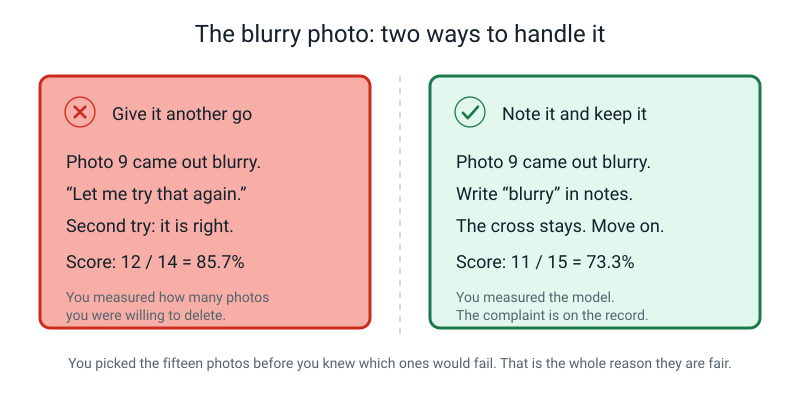
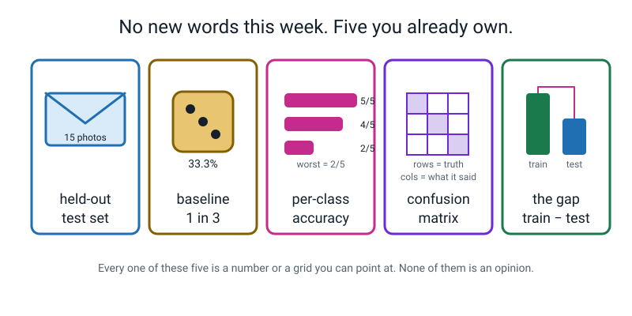

# Week 22 — The Hidden Ten: Test Your Own Model Honestly

[⬅ Week 21](week-21.md) · [Course Home](../README.md) · [Week 23 ➡](week-23.md) · [📓 Workbook — Week 22](../workbook/week-22.md)

---

> ### 📌 This week in one sentence
>
> **The only number worth reporting is the one you got on examples your model had never seen — and you only get to collect it once.**
>
> **By the end of this chapter you will be able to:**
> - Open a sealed test set and score every held-out photo on paper, without skipping any and without re-testing any
> - Report your own model's accuracy **three ways** — fraction, decimal, percentage — with the baseline written next to it
> - Build a **confusion matrix** by hand, run both checks on it, and name your worst class
> - Write a one-sentence honest verdict on your own work that does not over-claim
>
> **Reading time:** about 25 minutes. **The scoring itself takes about 20 minutes** with the photos in front of you. If you missed the lesson, everything you need is in here — but you must still score every photo in one sitting, in pen.

---

## 🪝 Start Here

Three weeks ago you did something slightly strange. You took fifteen photos, put them in an envelope, licked it shut, and **signed your name across the flap**. Then you handed it to an adult and walked away.

Since then your model has been trained, poked, admired, and broken on purpose. It has never once seen what is inside that envelope.

Today it finds out.


*Figure 22.3 — Sealed in Week 19. Torn open once, in Week 22. Fifteen photos, every single one of them scored.*

Before anything else, here are the three rules. They are strict, they are strict on purpose, and at some point in the next half hour — probably around photo nine — they are going to feel unfair.

> **⚠️ The three rules of the envelope**
>
> **1. Every photo gets scored.** All fifteen. Not the good ones. Not the ones where the light was nice.
>
> **2. One go each.** Show the photo, write what the model said, move on. No "let me try that again holding it straighter."
>
> **3. Nothing gets crossed out afterwards.** That is why you are using a **pen**. When row 4 is written, row 4 is finished — even after you have seen row 12.

That signature across the flap is doing a real job. It is not decoration. It is proof that nobody — not you, not your teacher — has quietly slipped a photo in or out since Week 19. Real laboratories do exactly this: they seal and date their results *before* anybody is allowed to look at them, because human beings, including completely honest ones, are extremely good at talking themselves into small adjustments.

> **💡 Try this now, before you read on:** write down the score you think you are about to get, out of 15, and circle it. Fifteen seconds. Comparing that circled number to what actually happens is the cheapest and most memorable thing in this whole chapter, and it works whether you guessed high or low.

---

## 🧠 The Big Idea

### 1. Four numbers, and they always travel together

You are not walking away today with a score. You are walking away with **four numbers**, and the habit you are building is that they are never separated.

| Number | What it is | Example |
|---|---|---|
| **Overall accuracy** | how many it got right ÷ how many you showed it | 11/15 = 0.7333 = 73.3% |
| **Baseline** | what you would score by not thinking at all | three equal classes → 33.3% |
| **Per-class accuracy** | the same sum, done separately for each class | football 3/5 = 60% |
| **The gap** | training accuracy − test accuracy | 100% − 73.3% = 26.7 points |

Why four and not one? Because one number can lie to you without saying anything false. Here is the example to keep in your head for the rest of your life.

A spam filter is tested on 100 emails: 90 ordinary ones and 10 spam ones. The filter says **"not spam"** to everything. It has never caught a spam email in its life. It is a brick with a label on it.

```
   accuracy  =  90 correct  ÷  100 tries  =  90%
```

Ninety percent accurate. You could put it on a poster. It is completely honest arithmetic about a completely useless machine.

Break it open by class and the truth falls out:

```
   real emails:  90 / 90  =  100%
   spam emails:   0 / 10  =    0%
```

And here is the killer: with 90 real emails and 10 spam ones, the strategy **"always say real, never look"** also scores 90%. The baseline *is* 90%. So a "90% accurate" filter achieved exactly nothing.

🍕 **The analogy — the class average.** If your class average in a test is 72%, you know nothing about any actual person. Somebody got 98 and somebody got 31. An average's whole job is to hide the spread. Accuracy is an average.

---

### 2. Accuracy three ways, and why each one hides something different

The formula is the easy bit:

```
   accuracy  =    number it got right
                 ─────────────────────
                   number of tries
```

There is no harder formula hiding behind it. The **skill** is writing the answer three ways, because each of the three tells you something the other two cover up.

Say you got **11 out of 15**.

```
   FRACTION:    11 / 15
                the honest one — it tells you there were only fifteen tries

   DECIMAL:     15 x 0.7 = 10.5           remainder  11 − 10.5 = 0.5
                0.5 / 15 = 0.0333
                0.7 + 0.0333 = 0.7333
                the one you do the arithmetic in

   PERCENTAGE:  0.7333 x 100 = 73.3%
                the one everybody quotes — and the one that hides the most
```

"73.3%" does not tell you whether there were fifteen photos or fifteen thousand. That is exactly why you always write the fraction first.

Now put the **baseline** next to it. Three classes, roughly the same number of photos of each, so shouting a random name every time gets you right about one time in three:

```
   baseline   = 1/3 = 33.3%
   73.3 − 33.3 = 40.0 percentage POINTS above not-thinking
```

> **⚠️ Watch out:** it is **40 percentage points**, not "40 percent better". Going from 33.3 to 73.3 is 40 points — but it is more than *double*. Those are different sentences and only one of them is true.

**And one photo is worth a lot when you only have fifteen.**

```
   100% ÷ 15 photos  =  6.7 percentage points per photo
```

So if your friend got 80% and you got 73%, that is a **one-photo** difference. It is noise. It is not a result. Knowing that stops you from believing a great many things you will be told this year.

---

### 3. The confusion matrix: a mistake with two names attached

A confusion matrix has a grand name and it is something you could explain to a six-year-old.

> **Rows are the truth. Columns are what the model said.** Every photo you score puts one tally mark in one box.

```
                        ┌─────── WHAT THE MODEL SAID ───────┐
                        │  cricket    tennis    football    │  total
   ┌────────────────────┼───────────────────────────────────┼───────
   │ TRUTH: cricket     │    4          1          0        │   5
   │ TRUTH: tennis      │    1          4          0        │   5
   │ TRUTH: football    │    0          2          3        │   5
   └────────────────────┴───────────────────────────────────┴───────
     total said              5          7          3        │  15
```

If everything went perfectly, every mark lands on the **diagonal** — the boxes where "what it was" and "what it said" are the same. Every mark **off** the diagonal is a mistake with a name attached: *"a football that got called a tennis ball."* Not "it's a bit rubbish". A specific, nameable, fixable thing.

**Read it two ways, always both.**

- **Along a row:** "of my 5 real footballs, 3 were called football and 2 were called tennis ball." That is the model's weakness *on footballs*.
- **Down a column:** "the model said the word *football* only 3 times in 15 tries, even though 5 footballs existed." That is the model being **reluctant** to say football — a different problem from simply being bad at them.

**The single most useful number in the whole grid** is the biggest number that is *not* on the diagonal. Here it is the **2** in "true football, said tennis". That cell is a shopping list. It tells you precisely which photos to go and take tomorrow.

**Two checks, four seconds, do them every single time:**

```
   DIAGONAL CHECK:   4 + 4 + 3 = 11    must equal your correct count  ✓
   TOTAL CHECK:      all nine cells add to 15   must equal your photo count  ✓
```

If either fails, a tally mark went in the wrong box. Do not recount everything — recount **one row at a time** against your sheet and you will find it in under a minute.


*Figure 22.5 — The finished artefact: the grid, both checks, and a verdict that names a cause the student went back and checked in their own photo folder.*

---

### 4. The gap, and why 100% on your training photos is the most boring number in the room

Teachable Machine will happily tell you your model got **100%** on the photos it trained on. Every model does. It means nothing at all.

🍕 **The analogy — revising from the exam paper.** If somebody hands you the actual exam paper the night before, with the answers on it, and you get 100% the next morning, nobody learns anything about you. That is what a training score is. Your model was allowed to study those exact photos, fifty times over.

The interesting number is the **difference**.


*Figure 22.1 — 100% on the photos it studied, 73.3% on the photos it had never seen. The 26.7-point gap is the only part of that pair that carries information.*

| Training | Test | What it means |
|---|---|---|
| 100% | 95% | Generalising well. It learned the object. |
| 100% | 73% | It learned something real, **and** memorised some of your photos. |
| 100% | 40% | It memorised hard. It learned your kitchen table, not your comb. |
| 55% | 52% | It barely learned anything. Too few photos, or the task is too hard. |

Look at that last row carefully. A **small** gap is not automatically good news. 55% and 52% is a tiny gap and a useless model. You read the gap **and** the level, together, or you read neither.

---

### 5. The verdict — the part that separates this from a demo

Here is what an enormous amount of public talk about AI sounds like: *"97% accurate."* *"Better than a human."* *"State of the art."* None of those tell you out of how many, against what baseline, or which group it fails on.


*Figure 22.2 — Both statements are about the same fifteen photos. Only one of them lets a reader check anything.*

Your verdict sentence has **five parts**, and you say all five:

```
   "On [how many] held-out photos, my model scored [fraction] = [percentage]
    against a [baseline] baseline; it was worst at [class] ([fraction] = [%]),
    and its commonest mistake was calling a [X] a [Y]."
```

Then — and this is the step almost nobody does — you write a **guess at the cause**, in terms of your own photos, and then you **go and check it**.

> *"I think that happened because nearly all my football photos were taken from close up, so the model never learned that a football is bigger than a tennis ball. I checked, and 18 of my 20 football photos were within arm's length. My guess was right."*

Or, just as valuable:

> *"...I checked, and actually my football photos were at all sorts of distances. So my guess was wrong, and I don't yet know the cause."*

That second one is worth exactly as much as the first. A checked wrong guess beats an unchecked right one every day of the week.

---

## 🔍 Worked Examples

### Example 1 — Food: a lunchbox classifier, twelve held-out photos

Somebody built a model to sort a lunchbox photo into **samosa**, **sandwich** or **muffin**. Four test photos of each, taken on a different day in a different room, sealed in an envelope before training.

| # | true | predicted | top conf. | ✓/✗ |
|---|---|---|---|:--:|
| 1 | samosa | samosa | 91% | ✓ |
| 2 | samosa | samosa | 78% | ✓ |
| 3 | samosa | samosa | 86% | ✓ |
| 4 | samosa | samosa | 84% | ✓ |
| 5 | sandwich | sandwich | 88% | ✓ |
| 6 | sandwich | sandwich | 71% | ✓ |
| 7 | sandwich | muffin | 58% | ✗ |
| 8 | sandwich | sandwich | 80% | ✓ |
| 9 | muffin | muffin | 93% | ✓ |
| 10 | muffin | samosa | 62% | ✗ |
| 11 | muffin | samosa | 55% | ✗ |
| 12 | muffin | muffin | 69% | ✓ |

**Step 1 — count the ticks.** Rows 1, 2, 3, 4, 5, 6, 8, 9, 12 → **9 correct out of 12**.

**Step 2 — accuracy three ways.**

```
   FRACTION:    9 / 12

   DECIMAL:     12 x 0.7 = 8.4         remainder  9 − 8.4 = 0.6
                0.6 / 12 = 0.05
                0.7 + 0.05 = 0.75

   PERCENTAGE:  0.75 x 100 = 75.0%

   BASELINE:    3 equal classes  ->  1/3  =  33.3%
   BEATS IT BY: 75.0 − 33.3  =  41.7 percentage points
```

**Step 3 — per class.**

| class | correct rows | fraction | decimal | percentage |
|---|---|---|---|---|
| samosa | 1, 2, 3, 4 | 4/4 | 1.00 | **100.0%** |
| sandwich | 5, 6, 8 | 3/4 | 0.75 | **75.0%** |
| muffin | 9, 12 | 2/4 | 0.50 | **50.0%** |
| **overall** | | **9/12** | 0.75 | **75.0%** |

Check: 4 + 3 + 2 = 9 ✓ and 4 + 4 + 4 = 12 ✓.

**Step 4 — the matrix.**

| | said samosa | said sandwich | said muffin | row total |
|---|---|---|---|---|
| **true samosa** | **4** | 0 | 0 | 4 |
| **true sandwich** | 0 | **3** | 1 | 4 |
| **true muffin** | 2 | 0 | **2** | 4 |
| **column total** | 6 | 3 | 3 | **12** |

Diagonal 4 + 3 + 2 = **9** ✓. All cells add to **12** ✓.

**Step 5 — read it.** The biggest off-diagonal cell is the **2** in *true muffin → said samosa*. And notice the asymmetry: *true samosa → said muffin* is **0**. Not one samosa was ever mistaken for a muffin. If the two genuinely looked alike to this model, the confusion would run **both ways**. It runs one way only, which points at the **muffin class itself** — too few muffin photos, or all of them too similar.

**Step 6 — the confidence split**, because there is a spare column and it is free information.

```
   correct (9):  91, 78, 86, 84, 88, 71, 80, 93, 69   sum 740   mean 740 ÷ 9 = 82.2%
   wrong   (3):  58, 62, 55                            sum 175   mean 175 ÷ 3 = 58.3%
```

Wrong answers ran **23.9 points** lower in confidence. So on this model, low confidence really does carry a warning — which is exactly how real products decide when to hand a decision to a human.

**Verdict.**

> *"On 12 held-out photos this model scored 9/12 = 75.0% against a 33.3% baseline; it was worst at **muffin** (2/4 = 50.0%), and its commonest mistake was calling a muffin a samosa."*

> **🔑 What Example 1 teaches:** the headline said 75%, which sounds respectable. One of its three classes was a coin toss.

---

### Example 2 — Sport: three balls, fifteen photos, and a model that stopped saying "football"

A **cricket ball / tennis ball / football** classifier. Fifteen held-out photos, five of each.

| # | true | predicted | ✓/✗ | | # | true | predicted | ✓/✗ |
|---|---|---|:--:|---|---|---|---|:--:|
| 1 | cricket | cricket | ✓ | | 9 | tennis | cricket | ✗ |
| 2 | cricket | cricket | ✓ | | 10 | tennis | tennis | ✓ |
| 3 | cricket | cricket | ✓ | | 11 | football | football | ✓ |
| 4 | cricket | tennis | ✗ | | 12 | football | football | ✓ |
| 5 | cricket | cricket | ✓ | | 13 | football | tennis | ✗ |
| 6 | tennis | tennis | ✓ | | 14 | football | tennis | ✗ |
| 7 | tennis | tennis | ✓ | | 15 | football | football | ✓ |
| 8 | tennis | tennis | ✓ | | | | | |

**Accuracy three ways.** Correct rows: 1, 2, 3, 5, 6, 7, 8, 10, 11, 12, 15 → **11 correct**.

```
   FRACTION:    11 / 15

   DECIMAL:     15 x 0.7 = 10.5        remainder  11 − 10.5 = 0.5
                0.5 / 15 = 0.0333
                0.7 + 0.0333 = 0.7333

   PERCENTAGE:  73.3%

   BASELINE:    33.3%          BEATS IT BY: 40.0 percentage points
   ONE PHOTO:   100 ÷ 15 = 6.7 percentage points
```

**Per class.**

| class | correct | total | fraction | percentage |
|---|---|---|---|---|
| cricket ball | 4 | 5 | 4/5 | 80.0% |
| tennis ball | 4 | 5 | 4/5 | 80.0% |
| football | 3 | 5 | 3/5 | **60.0%** |
| **overall** | **11** | **15** | **11/15** | **73.3%** |

Check: 4 + 4 + 3 = 11 ✓.

**The matrix** — this is the one from Section 3, now with the working behind it.

| | said cricket | said tennis | said football | row total |
|---|---|---|---|---|
| **true cricket** | **4** | 1 | 0 | 5 |
| **true tennis** | 1 | **4** | 0 | 5 |
| **true football** | 0 | 2 | **3** | 5 |
| **column total** | 5 | 7 | 3 | **15** |

Diagonal 4 + 4 + 3 = **11** ✓ · all cells = **15** ✓

**Now read the columns, which is the bit most people skip.**

- The model said **tennis** 7 times, and only 5 tennis balls existed. It is **over-eager** about tennis.
- The model said **football** just 3 times, and 5 footballs existed. It is **reluctant** about football.
- *true cricket → said football* is **0**, and *true football → said cricket* is **0**. Cricket balls and footballs are never confused in either direction. All the trouble sits between football and tennis.

**The gap.** Training accuracy was 100%.

```
   100.0 − 73.3  =  26.7 percentage points
```

Real learning happened — 40 points above baseline is not luck — and a chunk of what the model "knows" is memory of its own training photos.

**The shot list.** Not "more footballs". Attack the *football → tennis* cell:

1. Five photos of the football and a tennis ball **side by side at the same distance**, so size is the only thing that differs.
2. Five photos of the football **far away**, filling only a small part of the frame — because rows 13 and 14 were both distance shots.

> **🔑 What Example 2 teaches:** rows tell you which class is weak; columns tell you which word the model has stopped using. They are different diagnoses and they lead to different photos.

---

### Example 3 — School: the test set that quietly broke the baseline

A **pen / pencil / rubber** classifier. But look carefully at the envelope: it contained **8 pens, 4 pencils and 3 rubbers**. Fifteen photos, badly unbalanced — and the student did not notice until scoring day.

Results: all 8 pens correct · 2 of 4 pencils correct · 0 of 3 rubbers correct.

**Accuracy three ways.** Correct = 8 + 2 + 0 = **10 out of 15**.

```
   FRACTION:    10 / 15        (simplifies to 2/3)

   DECIMAL:     15 x 0.6 = 9           remainder  10 − 9 = 1
                1 / 15 = 0.0667
                0.6 + 0.0667 = 0.6667

   PERCENTAGE:  66.7%
```

**Now the baseline, and this is the whole example.** The baseline is *the score of the best strategy that ignores the photo completely.* Here that strategy is **"always say pen"**, because pen is the commonest class in the test set:

```
   BASELINE:    8 pens out of 15  ->  8/15 = 53.3%   (NOT 33.3%)
   BEATS IT BY: 66.7 − 53.3  =  13.4 percentage points
```

66.7% sounded fine. Against the real baseline it is worth **13 points**, not 33.

**Per class.**

| class | correct | total | fraction | percentage |
|---|---|---|---|---|
| pen | 8 | 8 | 8/8 | 100.0% |
| pencil | 2 | 4 | 2/4 | 50.0% |
| rubber | 0 | 3 | 0/3 | **0.0%** |
| **overall** | **10** | **15** | **10/15** | **66.7%** |

**The matrix.**

| | said pen | said pencil | said rubber | row total |
|---|---|---|---|---|
| **true pen** | **8** | 0 | 0 | 8 |
| **true pencil** | 2 | **2** | 0 | 4 |
| **true rubber** | 2 | 1 | **0** | 3 |
| **column total** | 12 | 3 | **0** | **15** |

Diagonal 8 + 2 + 0 = **10** ✓ · all cells = **15** ✓

Look at the **said rubber** column. It totals **zero**. In fifteen attempts, this model never once used the word "rubber". It has effectively stopped believing rubbers exist — and the headline 66.7% said nothing whatsoever about that.

**Verdict.**

> *"On 15 held-out photos my model scored 10/15 = 66.7%, but my baseline was 53.3% because 8 of my 15 test photos were pens, so it only beat not-thinking by 13.4 points; it was worst at **rubber** (0/3 = 0.0%) and it never said the word rubber at all. My test set was badly built and next time I will hide five of each."*

> **🔑 What Example 3 teaches:** the baseline is not always 33.3%. Count your test photos per class **first**. An unbalanced test set can make a bad model look decent, and it is your fault, not the model's.

---

## 🎲 What We Did In Class

### Part 1 — somebody else's fifteen minutes of shame

Before touching your own envelope you scored a stranger's results. That is deliberate: you practise every move with nothing at stake, so when your own numbers land you already know what to do with them.

This was a **cat / dog / rabbit** classifier, twelve test photos, four of each.

| # | true | predicted | top conf. |
|---|---|---|---|
| 1 | cat | cat | 88% |
| 2 | cat | cat | 79% |
| 3 | cat | dog | 61% |
| 4 | cat | cat | 92% |
| 5 | dog | dog | 84% |
| 6 | dog | dog | 90% |
| 7 | dog | dog | 73% |
| 8 | dog | cat | 55% |
| 9 | rabbit | cat | 64% |
| 10 | rabbit | rabbit | 70% |
| 11 | rabbit | cat | 58% |
| 12 | rabbit | dog | 51% |

**7 correct out of 12.**

```
   DECIMAL:     12 x 0.5 = 6      remainder 1      1/12 = 0.0833
                0.5 + 0.0833 = 0.5833      ->  58.3%
   BASELINE:    33.3%             BEATS IT BY: 25.0 percentage points
```

| class | fraction | percentage |
|---|---|---|
| cat | 3/4 | 75.0% |
| dog | 3/4 | 75.0% |
| rabbit | 1/4 | **25.0%** |

**Rabbit scored 25%, which is below the 33.3% baseline.** On rabbits, this model is worse than a dice. You could replace the rabbit part of it with a coin spinner and improve it — and the headline 58.3% mentioned none of that.

| | said cat | said dog | said rabbit | row total |
|---|---|---|---|---|
| **true cat** | **3** | 1 | 0 | 4 |
| **true dog** | 1 | **3** | 0 | 4 |
| **true rabbit** | 2 | 1 | **1** | 4 |
| **column total** | 6 | 5 | 1 | **12** |

Read down **said rabbit**: the model used the word "rabbit" exactly **once** in twelve tries, with four rabbits in front of it. And *true cat → said rabbit* is **0** — the confusion runs one way only. So the diagnosis is not "cats and rabbits look alike"; it is "the rabbit class is broken", probably too few or too samey.

### Part 2 — opening your own envelope

Here is the whole procedure, so you can redo it at home if you missed it. **You still only get one attempt.**

**Setup — 2 minutes.**

1. Model open in the browser, prediction bars visible.
2. Scoring sheet flat on the table, **pen** on top of it.
3. **You** open the envelope, not your teacher. Tip the photos out **face down**.
4. Count them out loud. Write the count in the header. *(If it is not 15, write the real number and use it. Do not go hunting for missing ones.)*
5. **Before scoring anything, fill in the whole TRUE column.** You know what each photo is — you took them.

> **⚠️ Watch out:** if you fill in "true" *after* seeing the prediction, your brain will help you, and it will help you dishonestly. This is not a character flaw. It happens to professional researchers, which is exactly why real experiments write the answer key before they run the test.

**Scoring — about 45 seconds per photo.** For each photo, in this order:

1. Show it to the model. Same method for all fifteen — held up to the webcam, or uploaded. Do not mix.
2. Read the **top class** off the screen → PREDICTED column.
3. Read the **top confidence** → CONF column.
4. Tick or cross.
5. Photo face down onto the finished pile. Next.


*Figure 22.4 — What a finished sheet looks like. Eleven ticks, four crosses — and the four crosses clustered in one class. That clustering is the thing to notice.*

**The arithmetic — 4 minutes.** At the bottom of the sheet:

```
   correct: ____ / ____

   fraction   ____/____
   decimal    ____ ÷ ____ = __________     (show the division)
   percentage ________ %

   baseline = ________ %          beats baseline by ______ points
   training accuracy (Week 17) = ______%
   the gap = ______ − ______ = ______ percentage points
```

**The matrix — 2 minutes.** Ruler out. Three rows, three columns, plus a totals row and column. Rows `true ___`, columns `said ___`. One tally per sheet row. Then both checks.

**The verdict — three sentences.**

1. *"My worst class was ______, at ___ out of ___, which is ___%."*
2. *"It got called ______ ___ times, which is the biggest number in my grid that isn't on the diagonal."*
3. *"I think that happened because ______________ in my training photos."*

Then go and look at your training photos and add one more line: *"I checked, and ______."*

### ✅ Finished looks like this

- [ ] Fifteen rows in **pen**, none missing, none rewritten
- [ ] TRUE column filled in **before** any scoring happened
- [ ] Accuracy as a fraction, a decimal and a percentage, with the division shown
- [ ] Baseline written next to it, and the improvement in **points**
- [ ] Per-class table, with the check that the parts add to the whole
- [ ] A ruled confusion matrix, both checks passed
- [ ] The gap, worked out and interpreted in one sentence about **your** photos
- [ ] A three-sentence verdict, plus the "I checked, and ____" line
- [ ] A shot list: the exact ten photos you would take tomorrow

> **⚠️ And one thing you must NOT do:** do not retrain your model tonight. The moment you change something *because of what the envelope told you*, the envelope stops being a fair test — you would be choosing your changes using the answers. Your fifteen photos are spent. A new score needs a new envelope, sealed before the changes.

---

## 💬 Talk About It

**1. "Why couldn't I re-test the blurry one? That photo was genuinely unfair."**
> *Hint:* you might be completely right that it was a hard photo — write "blurry" in the notes, because that is real information. But ask the other person this: *who decided which photos went in the envelope, and when?* You did, three weeks ago, before you knew which ones would fail. If photos get removed **now**, they are being removed *because* the model failed on them. What is the score measuring at that point?

**2. "My friend's model scored 80% and mine got 73%. Is theirs better?"**
> *Hint:* two questions to ask before you believe it. First, out of how many? With 15 photos, one photo is 6.7 points, so 73 and 80 is a one-photo difference. Second, where did their test photos come from? If they shot both batches in the same room on the same afternoon, their number is inflated and yours is not. A lower honest number is worth more than a higher dishonest one, because yours will actually predict what happens next.

**3. "Does anybody in the real world actually do this properly?"**
> *Hint:* they try, and they often fail. In 2020 and 2021 many teams built systems to spot COVID from chest X-rays and reported superb accuracy. When others checked, several turned out to be keying on the patient's position, or on text markers that one particular hospital's machine printed on the image — because the sick patients' scans came from one hospital and the healthy ones from another. They had built hospital detectors and called them disease detectors. Ask: *every one of those systems had been tested. What exactly was missing?*

---

## ⚠️ Don't Get Tricked

### Trick 1 — "that photo was unfair, so it shouldn't count"


*Figure 22.6 — Both readers looked at the same blurry photo. Only one of them still has a score that means anything.*

| ❌ Wrong | ✅ Right |
|---|---|
| "The webcam was blurry — let me hold it straighter." Score: 12/15 = 80.0% | Write **"blurry"** in the notes column. The cross stays. Score: 11/15 = 73.3% |

The complaint is real and it belongs on the record. The photo still counts. Otherwise your score stops measuring the model and starts measuring how many photos you were willing to delete.

### Trick 2 — "it was 94% confident, so it's 94% likely to be right"

| ❌ Wrong | ✅ Right |
|---|---|
| "94% confident means right 94 times out of 100." | "94% means it **prefers** that class strongly over the other two. It has no idea whether it is right." |

A model can be 94% confident and flat wrong — your own sheet probably has an example on it. Confidence is a preference, not a probability of being correct. (That was Week 16, and it will keep coming back all year.)

### Trick 3 — "the training score is the score"

| ❌ Wrong | ✅ Right |
|---|---|
| "Teachable Machine says 100%, so my model is 100% accurate." | "100% on photos it studied fifty times. My real number is the held-out one, and the **gap** between them is the interesting part." |

### Trick 4 — "one accuracy number is enough"

| ❌ Wrong | ✅ Right |
|---|---|
| "73%. Done." | "11/15 = 73.3%, baseline 33.3%, worst class football at 3/5 = 60%, gap 26.7 points." |

Four numbers, always together. A single accuracy figure is an average, and an average's job is to hide the spread.

---

## 🌍 Where You've Seen This

1. **Exam results at school.** A mock paper you have already seen the answers to is a training score. The real exam is the held-out test set — and everybody knows which one counts.
2. **"9 out of 10 dentists recommend..."** Nine out of ten *of how many asked?* Ten dentists, or ten thousand? The fraction carries the sample size and that is exactly why adverts prefer the percentage.
3. **A weather app that says "70% chance of rain".** Confidence again. When it says 70% and stays dry, the app is not broken — but you cannot check it on one day. You would need a hundred 70%-days and a tally sheet.
4. **Driving tests and swimming badges.** You are assessed on a route or a stroke you have not been coached through five minutes earlier. The whole design of a real test is that it is held out.
5. **A phone's face unlock in a dark room.** It worked perfectly every time you set it up — in the room, in the light, at the angle you set it up in. That was the demonstration. The dark corridor at 6 a.m. is the test.
6. **League tables and "best school" lists.** One average number per school, hiding every individual class and subject. Every argument you will ever read about them is really an argument about per-class accuracy.

---

## 🧭 Where This Fits

Three weeks ago you sealed an envelope and promised not to peek. Today you opened it, and the number
that came out is the first score in your life that you can actually defend to somebody who doubts you.
That finishes a whole box on the map — and it is the last thing you do before you go and find out what
a photograph really is.


*Figure 22.0 — The map in Week 22. HONEST TESTING is the tinted box, and this is the last week it
stays tinted. The two lit threads at the bottom are evaluation and impact: working out what is true,
and caring who the answer is true for.*

| | |
|---|---|
| **The mental model you now own** | Four numbers always travel together, and any one of them on its own is not a report: **overall accuracy**, the **baseline** you have to beat, **per-class accuracy**, and **the gap** between your training score and your test score, in percentage points. And the envelope is single-use — the moment you use it to decide something, it has leaked, and the next score needs a brand-new envelope of photos nobody has looked at. |
| **The one question it answers** | *"Which class is my worst, and by how many percentage points?"* |
| **What it plugs into** | Week 19's sealed envelope, opened exactly once, on the model you trained in Week 17 — counted the Week 20 way and drawn the Week 21 way. Four weeks of work land in one verdict. |
| **What carries forward** | This was the rehearsal. In Weeks 33 and 34 these same four numbers go on a poster, in front of a real audience who are allowed to ask you awkward questions about every one of them. |
| **Spiral thread** | ⚖️ **Evaluation** — how you find out what is actually true — and 🌍 **Impact**, because a per-class number is really a question about *who* the model lets down. |

> **💡 Try this:** on your own copy of the map, write your four numbers in the margin beside HONEST
> TESTING and circle your worst class. In eleven weeks you will put that circle on a poster, and you
> will be glad you already know what it says.

---

## 🔑 Remember This

- **The only score worth reporting is the one from examples the model had never seen.** Everything else is a rehearsal.
- **Four numbers, always together:** overall accuracy, baseline, per-class accuracy, and the gap.
- Write accuracy **three ways**. The fraction tells you the sample size; the percentage hides it.
- The **baseline** is the score of the best strategy that ignores the input. Three even classes → 33.3%. An unbalanced test set → the size of its commonest class.
- **Points, not percent.** 33.3 to 73.3 is **40 percentage points**.
- **Rows are the truth, columns are what the model said.** The biggest off-diagonal cell is your shot list.
- **Diagonal = correct count. All cells = photo count.** Both checks, every time.
- With fifteen photos, **one photo is worth 6.7 percentage points.** A five-point difference between two models means nothing.
- A **confident wrong answer** is completely normal. Confidence is a preference, not a probability of being right.
- Once you use the envelope to *decide* something, it has leaked — through your brain, not the upload button. **A new score needs a new envelope.**

---

## 📓 New Words

**None this week.** Week 22 is a consolidation week. Every word you used today, you already owned — today is the first time they all did real work at once, on your own model.


*Figure 22.7 — No new words. Five old ones, all cashed in at the same time.*

| Word | What it means | Where you used it today |
|---|---|---|
| **held-out test set** *(Week 19)* | Examples hidden away before training and never shown to the model until the day you score it. | The fifteen photos in the envelope. |
| **baseline** *(Week 12)* | The score you would get by ignoring the input entirely — usually by always naming the commonest class. | 33.3% for three even classes; 53.3% in Example 3. |
| **per-class accuracy** *(Week 20)* | The same accuracy sum, done separately for each class. | Three fractions under your headline number. |
| **confusion matrix** *(Week 21)* | A grid where rows are the truth and columns are what the model said. | The grid you ruled by hand, with both checks. |
| **the gap** *(Week 21)* | Training accuracy minus test accuracy, in percentage points. | 100% − your score. It tells you how much was memory. |

---

## 📤 Your Homework

Go to **[Workbook — Week 22](../workbook/week-22.md)**. About **45 minutes**. No laptop needed — tonight is writing, not measuring.

| Page | What | Roughly how long |
|---|---|---|
| Warm-up | Five quick questions about Week 21 | 5 min |
| Practice Set A | Understand it — six questions, including labelling a confusion matrix | 12 min |
| Practice Set B | Use it — five new situations, two of them "what goes wrong here?" | 12 min |
| Puzzle | The missing cells | 6 min |
| Think Deeper | Two paragraphs | 8 min |
| **W22.1–W22.6** | **Your own Hidden Ten write-up** | 45 min |
| **W22.7** | Score somebody else's test — sock / glove / hat | 15 min |
| Draw It + Self-Check | | 5 min |

**The two things that actually get marked:**

1. **The write-up.** Scoring sheet, accuracy three ways **with the division written out longhand**, the per-class table with its check, the hand-drawn confusion matrix with both checks, the gap, and the three-sentence verdict plus the "I checked, and ____" line.
2. **The verdict.** Five parts in one sentence: the number, the sample size, the baseline, the worst class, the commonest mistake. Then a cause rooted in your own photos, which you went and checked.

> **⚠️ Watch out:** the temptation tonight is to open Teachable Machine "just to look". Don't. The measuring is finished. Tonight is only writing.

---

[⬅ Week 21](week-21.md) · [Course Home](../README.md) · [Week 23 ➡](week-23.md) · [📓 Workbook — Week 22](../workbook/week-22.md) · [Glossary](../../glossary.md)
