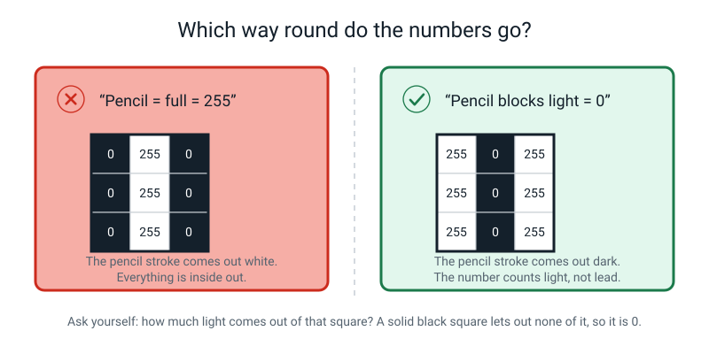
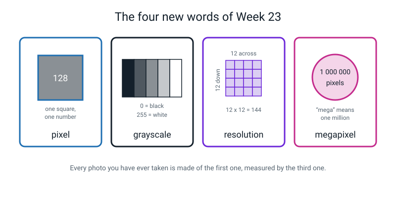

# Week 23 — A Photo Is Just a Grid of Numbers

[⬅ Week 22](week-22.md) · [Course Home](../README.md) · [Week 24 ➡](week-24.md) · [📓 Workbook — Week 23](../workbook/week-23.md)

---

> ### 📌 This week in one sentence
>
> **To a computer, a picture is nothing but a grid of brightness numbers running from 0 to 255 — and if you have the numbers and you know their order, you have the picture, exactly.**
>
> **By the end of this chapter you will be able to:**
> - Say what a **pixel** is, and what 0, 128 and 255 mean in a black-and-white picture
> - Turn a shaded drawing into a grid of numbers using a five-step shading key
> - Rebuild a picture from numbers alone, having never seen the original
> - Work out how many pixels a picture has from its **resolution**, and how many numbers that is
>
> **Reading time:** about 25 minutes. **The graph-paper activity takes about 20 minutes.** If you missed the lesson you can do the whole thing at home — you need graph paper, a soft pencil, and one other person.

---

## 🪝 Start Here

Last week you opened the envelope, scored fifteen photos, and found the class your model was worst at. You wrote the number down and you were honest about it, which is more than most people manage.

And then you got stuck, because the next question has no obvious answer: **why?**

So go on. Ask your model why it thought the glove was a sock.

*(Wait. Sit in that silence for a second — it is doing work.)*

You can't, can you. It has no mouth and no words. And here is the thing that sounds like a riddle and is simply true: **it has never seen a glove-shaped thing in its life.** It has never seen a shape at all.

What it received was a rectangle of numbers. That is the entire delivery. No picture, no shapes, no little labels saying *the glove is over here and the table is over there*. Just numbers, in rows.


*Figure 23.1 — Zoom in far enough and the photo stops being a picture. It was always a grid of numbers. You just could not see the grid.*

> **💡 Try this now, with a phone:** open any photo. Pinch-zoom in as far as it will go, on somebody's eye or on a letter of text. Keep going past the point where it looks bad. The smooth photo breaks into blocks of flat colour. **Those blocks were always there.** Zooming did not create them — a mosaic wall does not grow tiles when you walk closer to it.

By the end of this chapter you will hand somebody a page with 144 numbers on it and nothing else — no drawing, no clue — and they will shade your picture back into existence.

---

## 🧠 The Big Idea

### 1. A pixel is one square, holding one number

> **Pixel** — one tiny square of a picture, and the smallest piece a computer can store. The word is just "**pic**ture **el**ement" squashed together, which is a very boring origin for such a good word.

Hold a bright phone screen right up against your eye, closer than you can focus, and look at a plain white area. If the screen is bright enough, the smooth white breaks apart into a grid of tiny dots or stripes of light. Those are not an illusion. They are the screen's own tiny lights, one small cluster per pixel, and the picture is nothing but how bright each one is. **There is nothing else there.**

> **Grayscale** — a black-and-white picture where each pixel is a single number for brightness, and nothing else.

In a grayscale picture, every pixel holds **one whole number from 0 to 255**. And the number means one specific thing:

> **The number is how much LIGHT comes out of that square.**

Not how much ink. Not how much pencil. How much **light**.

🍕 **The analogy — a mosaic wall.** A mosaic is a picture made of hundreds of small coloured tiles. Stand close and you see tiles. Stand back and you see a face. Nobody carved a nose — the nose is what happens when enough tiles agree. A digital picture is a mosaic where every tile is a number, and your eye does the standing-back.

---

### 2. 0 is black, 255 is white, and it stops at 255 for a very dull reason


*Figure 23.2 — The whole range, with an everyday anchor for each step. Low number = little light. High number = lots of light.*

| Number | Looks like | Everyday anchor |
|---:|---|---|
| 0 | pure black | a cinema before the film starts |
| 32 | very dark grey | the shadow under a bed |
| 64 | dark grey | dark denim jeans |
| 128 | middle grey | pencil shading; an elephant |
| 192 | light grey | a cloudy sky |
| 255 | pure white | fresh paper in sunlight |

**The direction catches adults out too, so check yourself now.** 0 is *dark*, not *empty*. If you find yourself thinking *"0 must be white, because paper is white and that's where you start"* — stop, and re-anchor on light. A switched-off screen in a dark room is 0. There is no light coming out of it at all.

**Why does it stop at 255?** Because computers store things in **bytes**, and one byte holds exactly 256 different values: 0, 1, 2, … , 255. Nobody chose 255 because it was tidy. It is simply what fits in one byte, and one byte per pixel is cheap. That is the whole reason, and you now know something most adults do not.

> **🧑‍🏫 If someone asks "can a pixel be 300, or −5, or 12.7?"** — no, no, and no. Whole numbers only, 0 to 255. If a calculation comes out at 300, careful software squashes it back down to 255; if it comes out at −5, it becomes 0. (Careless software can wrap around instead, which is much worse.) You will meet that squashing properly in Week 25, where it has a name and it costs you something real.

---

### 3. Numbers **plus their arrangement** — both halves matter

Here is the part that turns a fact into an idea.

The number 255 sitting in row 2, column 5 does **not** carry a little label saying "I live in row 2, column 5". Nothing stores that. The computer knows where each number belongs only because the numbers arrive **in a fixed order**: row 1 left to right, then row 2 left to right, then row 3, all the way down.

Shuffle the order and the picture is destroyed — even though every single number is still there, the total is unchanged, and the average brightness is unchanged.


*Figure 23.6 — Sixteen numbers on the left. The same sixteen numbers on the right. One is a line. The other is nothing at all.*

So "a photo is just a list of numbers" is not quite right, and you should say so if anybody tells you it. A photo is a list of numbers **in a known arrangement**. To send a picture down a phone line using only spoken numbers you need **two** things:

```
   1.  the numbers, in a fixed order
   2.  how wide the grid is
```

Leave out the width and your listener has 144 numbers and no idea whether that is 12 across, 9 across or 16 across. It is a genuinely necessary fact and it is very easy to forget.

---

### 4. The five-step shading key

Nobody can shade 256 different darknesses with a pencil, and nobody needs to. Today you use five steps.


*Figure 23.3 — The key. Write it at the top of your page **before** you start, so that your numbers mean the same thing to everybody else.*

| How the square is shaded | Number |
|---|---:|
| Filled in solid, no white left | **0** |
| Nearly filled, a bit of white showing | **64** |
| Half-and-half | **128** |
| A light touch of pencil | **192** |
| Not touched at all — clean paper | **255** |

Two things to know about this key.

**It is not a simplification for children.** Squeezing many brightness levels down to a few is exactly what happens when a photo is saved in a small format. This is the real idea, at a size a person can do by hand.

**The interesting squares are the half-and-half ones.** When you outline a letter and start numbering, most squares are easy — solidly inside (0) or solidly outside (255). The squares that sit on the **boundary** of your letter are the ones you will hesitate over, argue about, and get wrong.

That is not a flaw in the activity. **Real cameras have exactly this problem, at every boundary, in every photo they ever take.** Those grey edge squares get a proper name next week. For now, just notice where they cluster: along the outline, and essentially nowhere else.

> **🧑‍🏫 If someone asks "two people shade the same letter and one writes 128 where the other writes 64 — who's right?"** — both, possibly. It depends how much of that square the pencil actually covered. Which is exactly why you agree on a shared key before you start, and write it at the top of the page.

---

### 5. Resolution, megapixels, and the number 243

> **Resolution** — how many pixels a picture has, written as width × height. More pixels = more detail = more numbers to store.
>
> **Megapixel** — one million pixels. A "12-megapixel camera" makes pictures of about 12 million pixels.

A phone camera might shoot **4032 × 3024**. Multiply it out:

```
   4032 x 3024  =  12,192,768 pixels
```

Twelve million. That is where "12 megapixel" comes from — "mega" just means million.

Now the number that lands hardest. **Teachable Machine — the tool you used in Week 17 — does not look at 12 million pixels.** Before training, it squashes every photo down to **224 × 224**.

```
   224 x 224            =      50,176 pixels
   12,192,768 ÷ 50,176  =         243
```


*Figure 23.7 — The three multiplications and the punchline. Copy this into your notebook.*

Your model saw **one pixel out of every 243** that your camera recorded. Two hundred and forty-two out of every 243 were thrown in the bin before training even started.

Sit with that, because it quietly explains an enormous amount. If the thing that tells two of your classes apart is **thin** — the teeth of a comb, a hairline crack, small printed text, the stitching on a ball — the model may literally never have seen it. That is not the model being stupid. **The information was deleted before the model was born.**


*Figure 23.5 — The same drawing at 48 × 48, 12 × 12 and 4 × 4. At 48 it is a face. At 12 each eye is one square. At 4 there is no face left at all. Circled: what died at each step.*

Ask yourself one question about that figure: **at which of the three could you still tell whose face it is?** That is the whole argument about resolution, and it takes twenty seconds.

**So why would anyone throw away 99.6% of a photo on purpose?** Four honest reasons:

1. Twelve million numbers per photo × 60 photos is far too much for a web browser to hold.
2. Small pictures train in seconds instead of hours.
3. Most fine detail genuinely does not help tell a sock from a glove.
4. The main one: Teachable Machine does not start from nothing. It builds on a ready-made network (called MobileNet) that was built to take pictures of exactly 224 × 224, so every photo has to be made that size to fit it. (Reasons 1 and 2 are why such a small size is a sensible choice.)

And one bit of arithmetic for scale. Deciding and writing 144 numbers took you about ten minutes, but let us be generous and say the writing alone could be done at one number per second.

```
        144 numbers  ->  2 minutes 24 seconds
     50,176 numbers  ->  about 14 hours
 12,192,768 numbers  ->  141 days, non-stop, no sleeping
```

That is what **one photograph** is. This week you will write out about 0.001% of one — roughly one 85,000th.

---

## 🔍 Worked Examples

### Example 1 — Food: reading a grid you have never seen a picture of

Here is a 6 × 6 grid of numbers. Nobody is going to show you the picture. This is exactly the job a computer has, every time, for every photo.

```
        c1   c2   c3   c4   c5   c6
   r1   255  255  255  255  255  255
   r2   255  255  128  128  255  255
   r3   255  128   0    0   128  255
   r4   255  128   0    0   128  255
   r5   255  255  128  128  255  255
   r6   255  255  255  255  255  255
```

**Q1 — how many pixels, and how many numbers to store it?**

```
   6 x 6 = 36 pixels
   grayscale = one number per pixel  ->  36 numbers
```

**Q2 — where is the darkest region?** Every **0** sits in rows 3–4, columns 3–4. That is a 2 × 2 block of pure black right in the middle. Four squares hold 0; they are tied for darkest.

**Q3 — is there a perfectly straight edge anywhere?** No. A straight horizontal edge would show up as a whole row of identical dark numbers with different rows above and below — like row 10 of a grid with a shelf in it. Nothing here does that.

**Q4 — what shape is it?** Count the run of non-255 squares in each row:

| Row | dark-ish columns | width |
|---|---|---:|
| r2 | c3–c4 | 2 |
| r3 | c2–c5 | 4 |
| r4 | c2–c5 | 4 |
| r5 | c3–c4 | 2 |

**2, 4, 4, 2** — narrow, wide, wide, narrow, and symmetrical left-to-right about the gap between columns 3 and 4. A square would give 4, 4, 4, 4. A triangle would give 2, 3, 4, 5. A **round** shape gives 2, 4, 4, 2 (a small diamond could too, but the grey squares sit where a curve would put them). The best guess is a dark circle on a white background — a chocolate biscuit on a plate.

**Q5 — where are the 128s, and why?** All eight of them trace the **outline** of the circle. A circle's edge is curved and the squares are square, so along the boundary the curve cuts some squares roughly in half — and halfway is the honest answer for a half-covered square. Squares fully inside are 0; squares fully outside are 255. **Doubt only exists on the boundary.**

**Q6 — the average brightness.**

```
   4 squares  x    0  =      0
   8 squares  x  128  =  1,024
  24 squares  x  255  =  6,120
                        ───────
                          7,144

   average  =  7,144 ÷ 36  =  198.4
```

198.4 is a light grey, which fits — most of this picture is empty plate. **But notice what that single number does not tell you.** Shuffle all 36 numbers and the average is *exactly the same*. The average throws the arrangement away, and the arrangement is where the biscuit lives.

> **🔑 What Example 1 teaches:** you can work out the shape of a thing from numbers alone, using nothing but widths. And one summary number — an average — destroys the very thing you were looking for.

---

### Example 2 — Sport: the cricket ball that shrank to three pixels

You take a photo of a cricket match on a phone that shoots **4032 × 3024**. In that photo the ball is about **40 pixels wide** and the stitched seam across it is about **4 pixels wide**.

You upload it to Teachable Machine, which crops it to a square and squashes it to **224 × 224**.

**Step 1 — the pixel counts.**

```
   original:   4032 x 3024  =  12,192,768 pixels     ("12 megapixels")
   the square crop:  3024 x 3024  =   9,144,576 pixels
   what the model sees:  224 x 224  =      50,176 pixels
```

**Step 2 — how much does each side shrink by?**

```
   3024 ÷ 224  =  13.5
```

Every 13.5 pixels along a side become **one** pixel. That is the shrink factor.

**Step 3 — so how wide is the ball now?**

```
   40 ÷ 13.5  =  2.96  ->  about 3 pixels wide
```

The whole ball is **three squares across**. Not three centimetres. Three numbers.

**Step 4 — and the seam?**

```
   4 ÷ 13.5  =  0.30 pixels
```

Less than one pixel. **The seam does not survive at all.** It cannot: there is no such thing as three tenths of a pixel. Whatever was there gets blended into the squares around it and stops existing as a separate thing.

**Step 5 — what does that mean for the model?** If you were hoping your model would tell a cricket ball from a tennis ball **by the seam**, it never had a chance. Not because it is stupid, and not because you needed more photos. The seam was deleted, by arithmetic, before training began.

```
   total numbers thrown away  =  12,192,768 − 50,176  =  12,142,592
   fraction the model kept    =  50,176 ÷ 12,192,768  =  1 in 243
```

> **🔑 What Example 2 teaches:** shrinking a photo is not a vague loss of "quality". It is a specific number of pixels, and you can work out in advance whether the detail you care about is going to survive it.

---

### Example 3 — School: turning a shaded letter into numbers, and catching the classic mistake

Somebody shades a capital **T** into a 6 × 6 box on graph paper. (Its bar is only one square thick, thinner than the two-square rule for your own drawing, to keep the arithmetic short.) They deliberately let the line fall wherever it falls, so a couple of squares end up awkward. Then they number every square using the five-step key.

Here is what they hand over:

```
        c1   c2   c3   c4   c5   c6
   r1   255  255  255  255  255  255
   r2   192   0    0    0    0   128
   r3   255  255   0    0   255  255
   r4   255  255   0    0   255  255
   r5   255  255   0    0   255  255
   r6   255  255  255  255  255  255
```

**Step 1 — count the squares.** 6 × 6 = 36. Count the numbers written. If you have 35 or 37, you skipped or doubled one, and **everything after that point is shifted**. Find it now, before you do anything else.

**Step 2 — the sanity check that catches the commonest mistake of the whole week.** Glance at **row 1**. It is all 255s, and the top of the drawing is blank paper. ✓ Good.

If row 1 had come out as all **0s** while the top of the page was untouched paper, the whole grid would be **inside out** — someone wrote 255 where the pencil was, because 255 feels like "full" and "lots of lead". It is a meaning mistake, not a careless one, and the fix is not to change the number. The fix is to re-read the boxed rule: *the number is how much light comes out of that square.* Pencil blocks light. More pencil, smaller number.

**Step 3 — the two awkward squares.**

| Square | What happened | Number |
|---|---|---:|
| r2, c1 | the bar only just brushes this square — a light touch | **192** |
| r2, c6 | the bar stops halfway across this square | **128** |

Those two are the interesting ones, and they are both on the **boundary** of the T. Every square in the middle of the bar or the stem is unarguably 0.

**Step 4 — count each value.**

```
   0s   :  4 in the bar (c2..c5 of row 2)  +  2 each in rows 3, 4, 5  =  4 + 6  =  10
   192s :  1
   128s :  1
   255s :  36 − 10 − 1 − 1  =  24
```

**Step 5 — average brightness.**

```
   10 x   0  =      0
    1 x 192  =    192
    1 x 128  =    128
   24 x 255  =  6,120
                ──────
                 6,440

   average  =  6,440 ÷ 36  =  178.9
```

178.9 — a light-ish grey, because most of the box is still blank paper. And again: that number tells you the picture is mostly bright, and absolutely nothing about it being a T.

**Step 6 — could you send this down a phone line?** Yes. You read the 36 numbers in order, and you say *"six across"*. Both facts, or your listener is stuck.

> **🔑 What Example 3 teaches:** three checks before you hand anything over — count the squares, glance at row 1 for the inside-out mistake, and check the greys are sitting on the boundary and nowhere else.

---

## 🎲 What We Did In Class

### Become a Pixel Grid

**The point:** to prove, physically, that a picture can be sent as nothing but numbers — and to discover by accident that the boundary squares are where all the arguing lives.

**You need:** 5 mm graph paper (2 sheets), a **soft pencil** (B or 2B), an eraser, a ruler, and **one other person who has not seen your drawing.**

> **💡 Why a soft pencil?** Because the whole activity depends on shading at five clearly different darknesses. With a hard pencil, "half-and-half" and "a light touch" look identical, and the activity turns to mush.

**Setup — 2 minutes**

1. Rule a **12 × 12 box** on the graph paper. On 5 mm paper that is a 6 cm square.
2. **Number the rows 1–12 down the left and the columns 1–12 across the top.** This is not optional. It is the thing that stops you losing your place.
3. Write the five-step key in the top corner of the page.
4. Rule a **second, empty 12 × 12 box** for the other person, rows and columns numbered the same way.

**The rules**

1. Pick a **capital letter** — something with a straight bit and ideally a diagonal or a curve: T, L, H, A, K, S, E.
2. Draw it so it **fills most of the box** and is **at least two squares thick** everywhere. A one-square-thick letter is a bad picture and it makes the rebuild ambiguous.
3. Shade it with the pencil, and **let the outline fall wherever it falls.** Do not carefully line it up with the grid. You actively *want* some awkward half-covered squares.
4. **Do not tell the other person your letter.**
5. Number every square using the key. **Row 1 left to right, then row 2.** Never skip a square, not even a blank one. Say the numbers out loud if it helps.
6. Copy the numbers onto the clean sheet. **Numbers only.** No arrows, no outline, no hints.
7. Fold the drawing away so it cannot be seen. Hand over the numbers.

**What the other person does**

Takes the numbers and shades the blank grid: 0 solid, 64 nearly solid, 128 half, 192 a light touch, 255 leave it. Reading the numbers out loud while shading makes it feel like a transmission rather than a puzzle. Then they **name your letter out loud before anything gets unfolded.**


*Figure 23.4 — What finished work looks like: the shaded 12 × 12 letter, its completed number grid, and three squares traced from one to the other.*

**Then the two questions that actually matter**

**"Where did we disagree?"** Nine times out of ten, every single disagreement is a **boundary square** — you wrote 128 and they shaded it darker than you drew it, or you wrote 192 and they left it near-white. The solid interior and the blank background always match perfectly.

**"So whose fault is a disagreement?"** Neither. You drew a smooth line across a square grid. **There is no correct answer for a square the line goes through.** Cameras have exactly this problem in every photo they take, and next week that grey edge gets a proper name.

### If it comes out as garbage

This happens, and it is the best five minutes of the lesson if you treat it as a bug hunt instead of a failure. Almost always it is one of two things:

| Symptom | Cause | Fix |
|---|---|---|
| The picture is fine at the top and jagged, jogged sideways or smeared from partway down | A **skipped square**. One row has 11 numbers instead of 12, so everything after it slides one square out of place (and every extra skip slides it further) | Count each row. Find the row with 11 or 13. That is where the picture broke. |
| The letter comes out white on a black background | The grid is **inside out** — 255 where the pencil was | Re-read the ramp. Pencil blocks light, so pencil means a *small* number. |

One missing number wrecked everything after it. That lesson is worth more than a clean success.

### ✅ Finished looks like this

- [ ] 144 numbers written on the drawing, in the grid, **none missing**
- [ ] 144 numbers copied onto a clean sheet, matching
- [ ] The other person named your letter correctly, **before** unfolding
- [ ] Both grids side by side with every disagreement circled — usually 2 to 8 squares, all on the boundary
- [ ] One sentence in your own words about **why those particular squares** were the ones that disagreed
- [ ] The resolution sums: 144 · 50,176 · 12,192,768 · 243

---

## 💬 Talk About It

**1. "How big is a pixel?"**
> *Hint:* this is a much better question than it looks. A pixel has **no size** — it is a *number*. It only gets a size when it is shown on something: on a phone screen a pixel is about a tenth of a millimetre, on a stadium screen a pixel is the size of your fist, and printed in a book it is whatever size the printer chose. Same numbers, wildly different sizes. Ask the other person how a photo can be "small" and "huge" at the same time.

**2. "Do our eyes have pixels?"**
> *Hint:* sort of, and the differences are the interesting part. Your eye has about 100 million light detectors, so in a rough sense yes. But they are **not in a tidy grid** — they are spread unevenly, with the ones that see sharp detail crowded into the middle of your vision — they do not all report at the same instant, and a lot of processing happens in your eye before anything reaches your brain. A camera records everywhere evenly. Your eye records the middle extremely well and mostly guesses the rest.

**3. "How many different greys can a person actually see?"**
> *Hint:* **nobody knows for sure**, and it is worth saying that out loud. Estimates run from about 30 shades if you see the greys one at a time, up to several hundred if they are side by side where you can compare them. It depends on how bright the room is, whether the patches touch, how big they are, how long you look, and which person is looking. That uncertainty is partly *why* 256 levels got chosen — it is enough that in most photos you cannot see the steps (though in a very smooth sky or shadow you sometimes can).

---

## ⚠️ Don't Get Tricked

### Trick 1 — putting the big numbers where the pencil is


*Figure 23.9 — The same drawing, numbered two ways. One of them produces a photographic negative.*

| ❌ Wrong | ✅ Right |
|---|---|
| "I pressed hard here, so it's full, so it's 255." | "How much **light** comes out of a solid black square? None. So it's 0." |

This is the most common slip of the entire week, and it is a *meaning* mistake, not a careless one. The number counts light, not lead.

### Trick 2 — "the numbers describe the picture; the real picture is stored somewhere else"

| ❌ Wrong | ✅ Right |
|---|---|
| "The computer keeps the actual picture in a drawer, and the numbers are like an index card attached to it." | "The numbers **are** the picture. Somebody rebuilt my drawing having never seen it — so if the picture were somewhere else, where?" |

Your own activity is the proof. Nothing crossed the table except numbers. There is nowhere for a hidden picture to be.

### Trick 3 — "grayscale means low quality"

| ❌ Wrong | ✅ Right |
|---|---|
| "Black-and-white pictures are blurry old rubbish." | "Grayscale means **one number per pixel instead of three**. It is missing colour, not detail." |

Hospital scans and most of the history of photography are grayscale and can be enormously detailed.

### Trick 4 — "the average brightness tells you what the picture is"

| ❌ Wrong | ✅ Right |
|---|---|
| "The average is 178.9, so it's a light picture, so it's probably a letter." | "The average is 178.9, so it's mostly bright. Shuffle all 36 numbers and the average is **identical** — so it says nothing at all about shape." |

Averages destroy arrangement. That comes back in two weeks when you start hunting for edges.

---

## 🌍 Where You've Seen This

1. **The moment a video call goes bad.** The picture breaks into visible blocks of flat colour. You are watching a picture with far less detail (fewer numbers, or numbers squashed together) being stretched over the same screen.
2. **"Zoom and enhance" in every police drama ever.** They zoom into a car park camera and read a number plate. Next week you will know exactly why that is fiction.
3. **Minecraft, and pixel art generally.** A deliberate choice to make the grid visible instead of hiding it. Every block face is a tiny grid of numbers you are *meant* to see.
4. **The megapixel number on a phone box.** 12 MP means about 12 million pixels, which means about 12 million numbers per grayscale photo — or three times that in colour.
5. **Fingerprint and face unlock.** Both start by turning what a sensor measures into a grid of numbers. Everything after that is arithmetic on that grid.
6. **A dot-matrix bus destination board, or a scoreboard at a match.** A very low-resolution grid where each pixel is a whole lamp. Stand close and you can count them.
7. **Cross-stitch, knitting charts and Lego mosaic kits.** A picture given to you as a grid of instructions, one square at a time — which is exactly what you did with graph paper.

---

## 🧭 Where This Fits

A brand-new box opens on the map today, and it is the one that finally looks *inside* a photograph.
Until now a picture was just a thing you handed to a machine. From today it is a grid of numbers you
can read, write and argue about with a pencil.


*Figure 23.0 — The map after Week 23. PIXELS is the new tinted box; HONEST TESTING has turned white
with its full range, finished. Only one thread is lit at the bottom, because this week is one single
idea.*

| | |
|---|---|
| **The mental model you now own** | A **pixel** is one square holding **one number from 0 to 255** — how much light comes out of that square. A picture is those numbers **plus their arrangement**: shuffle the order and every single number survives while the picture dies. |
| **The one question it answers** | *"What is this picture as numbers, and how wide is the grid?"* |
| **What it plugs into** | Week 4's table, pointed at a photograph. The pictures you took for Week 15 were rows of numbers the whole time — you just could not see the row. |
| **What carries forward** | These grids are the thing the Week 25 filter slides across. And the very same move — turn it into a strip of numbers first — is how a *sentence* gets handled in Week 27. |
| **Spiral thread** | 🏷️ **Representation**, on its own this week — one thread, because the whole lesson is about the shape a picture has to be squeezed into before any machine can touch it. |

> **💡 Try this:** shade a small letter on squared paper and write the number in every square. Then
> hand somebody **only the numbers**, in a jumbled order, and ask them which letter it was. They
> cannot do it, and that failure is the second half of the idea.

---

## 🔑 Remember This

- A **pixel** is one square holding one number. In grayscale, that number is **how much light comes out of that square**.
- **0 is pure black. 255 is pure white.** 128 is middle grey. Pencil blocks light, so more pencil means a *smaller* number.
- It stops at 255 because **one byte holds exactly 256 values** — 0 to 255. That is the entire reason.
- A picture is numbers **and their arrangement**. Shuffle the order and every number survives while the picture dies.
- To send a picture as numbers you need the numbers in order **and** the width of the grid.
- **Resolution** is width × height. **Pixels = width × height.** In grayscale, numbers needed = pixels.
- A **megapixel** is one million pixels. A 12 MP photo is 12,192,768 pixels; Teachable Machine sees 50,176 of them — **1 in 243**.
- The **grey squares live on the boundary** of a shape, because a smooth edge does not line up with a square grid. Nobody's fault.
- An **average** throws the arrangement away, and the arrangement is where the picture is.

---

## 📓 New Words


*Figure 23.8 — Four words. Every photo you have ever taken is made of the first one and measured by the third one.*

| Word | What it means | Example |
|---|---|---|
| **pixel** | One tiny square of a picture — the smallest piece a computer can store. Short for "picture element". | Your 12 × 12 grid had **144 pixels**. |
| **grayscale** | A black-and-white picture where every pixel is a single brightness number, 0 to 255. | Your graph-paper letter. One number per square, nothing else. |
| **resolution** | How many pixels a picture has, written width × height. | A phone photo at **4032 × 3024**; Teachable Machine's **224 × 224**. |
| **megapixel** | One million pixels. | 4032 × 3024 = 12,192,768 pixels, so **"12 megapixels"**. |

---

## 📤 Your Homework

Go to **[Workbook — Week 23](../workbook/week-23.md)**. About **50 minutes**, and no screen is needed at all.

| Page | What | Roughly how long |
|---|---|---|
| Warm-up | Five quick questions about Week 22 | 5 min |
| Practice Set A | Understand it — six questions, including labelling the brightness ramp | 12 min |
| Practice Set B | Use it — five new situations | 12 min |
| Puzzle | Three grids, one average | 8 min |
| Think Deeper | Two paragraphs | 8 min |
| **Part 1 — do it again, better** | A second 12 × 12 drawing, converted to numbers | 15 min |
| **Part 2 — read the grid** | Six questions about a printed number grid, with no picture | 20 min |
| **Part 3 — three sums** | Resolution arithmetic, multiplication shown | 10 min |
| Draw It + Self-Check | | 5 min |

**The three things that actually get marked:**

1. **Part 1 — a second 12 × 12.** A different letter from the one you did in class, and this time pick one with a **diagonal or a curve**, because those produce the interesting grey squares. Key written at the top of the page, rows and columns numbered, all 144 squares filled, none skipped.
2. **Part 2 — read the grid.** This is the harder and more valuable half. Do not guess and move on — **point at the numbers that made you say it.**
3. **Part 3 — show the multiplication**, not just the answer.

> **💡 If Part 1 is taking more than 25 minutes,** stop Part 1 and do Parts 2 and 3 instead. Reading a grid is the skill Week 24 is built on.

> **⚠️ Keep this week's 12 × 12 number grid safe and flat, in a folder, not folded into a bag.** Next week starts by shrinking that exact grid. If it goes missing you will have to make a new one.

---

[⬅ Week 22](week-22.md) · [Course Home](../README.md) · [Week 24 ➡](week-24.md) · [📓 Workbook — Week 23](../workbook/week-23.md) · [Glossary](../../glossary.md)
