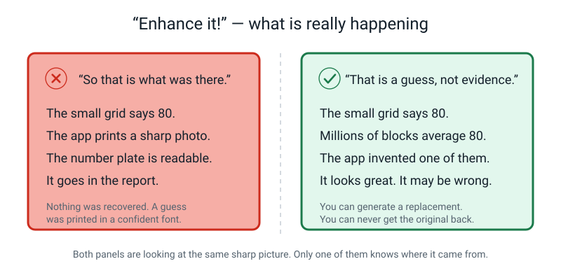
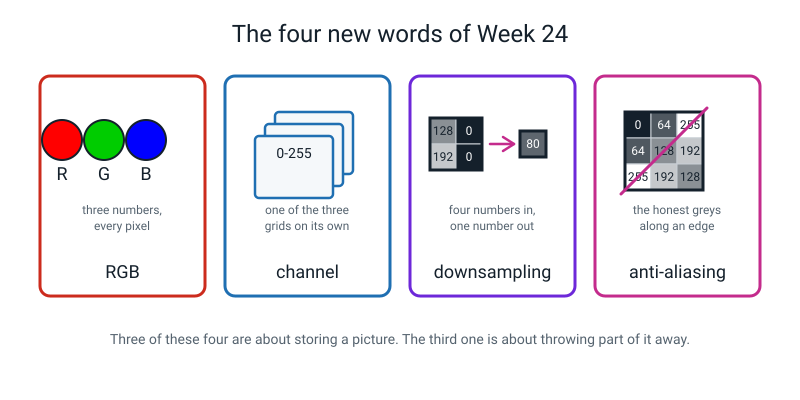

# Week 24 — Colour Is Three Grids Stacked

[⬅ Week 23](week-23.md) · [Course Home](../README.md) · [Week 25 ➡](week-25.md) · [📓 Workbook — Week 24](../workbook/week-24.md)

---

> ### 📌 This week in one sentence
>
> **A colour picture is three number grids — red, green and blue — sitting on top of each other, and shrinking a picture throws information away forever.**
>
> **By the end of this chapter you will be able to:**
> - Explain **RGB** as three stacked **channels**, with one number per pixel in each
> - Name the colour a given RGB triple makes, and invent a sensible triple for a named colour
> - **Downsample** a grid by averaging 2 × 2 blocks, showing the addition and the division
> - Say exactly what downsampling destroys, and prove with arithmetic why it cannot be recovered
>
> **Reading time:** about 25 minutes. **The two activities take about 20 minutes** and you need last week's 12 × 12 number grid. If you missed the lesson, everything is in here.

---

## 🪝 Start Here

Look at any screen showing plain white. Here is a question that sounds stupid:

> **How many different colours of lamp are inside that screen, making the white?**

Most people say one. Some say none, because white isn't a colour. Some say millions.

**Three.** Red, green and blue. There is **no white lamp in there at all** — there never has been, in any screen you have ever looked at in your life. Every single pixel on a phone screen is actually *three tiny lamps* sitting side by side, too small to tell apart. White is what you see when all three are on at once.


*Figure 24.2 — Six triples and the colour each one makes. Notice the last one: white is not a lamp, it is all three lamps at full.*

> **💡 Try this now, if you can find a magnifying glass.** Set a screen to full brightness, show a plain white page, and hold the magnifier — or even a single drop of water — right against the glass. You will see **red, green and blue stripes** glowing side by side. Nothing in this chapter will persuade you as thoroughly as seeing that for yourself. *(Some screens are too fine to show it. A big TV up close, or a cracked screen, usually works.)*

And now the second question, the one you are going to want to argue with me about:

> **What do you get when you mix red and green?**

Brown. Mud. That is what every art lesson you have ever had says, and it is **completely correct** — with paint.

On a screen, red and green make **yellow**.

I am not going to just tell you that and expect you to swallow it, because it sounds like nonsense. By the end of section 3 you will know exactly why **both** answers are right.

---

## 🧠 The Big Idea

### 1. Three grids, stacked — and nothing new to learn

> **RGB** — a way of storing colour as three numbers per pixel: how much **R**ed, how much **G**reen, how much **B**lue. Each one runs 0 to 255, exactly like last week.
>
> **Channel** — one of the three grids. The "red channel" is the whole grid made of just the R numbers, and on its own it looks exactly like a grayscale picture.


*Figure 24.1 — One small colour picture, pulled apart into its three channels. Each channel is a plain grid of numbers, 0 to 255. Stack all three and the colour appears.*

That is the whole idea, and notice how little of it is new. Last week you learned everything about a grid of numbers from 0 to 255. Colour is **that, three times.**

🍕 **The analogy — three sheets of tracing paper.** Imagine three sheets of tracing paper, each with a grey drawing on it. One sheet is lit by a red bulb, one by a green bulb, one by a blue bulb. Lay them exactly on top of each other and look through the stack: you see a colour picture. Pull them apart and each one is just a grey drawing again.

**The counting is where it gets silly.** Your model's photos were 224 × 224:

```
   224 x 224            =      50,176 pixels
   50,176 x 3 channels  =     150,528 numbers
```

A hundred and fifty thousand numbers, for one small photo. And you uploaded sixty of them.

Now: **how many different colours can a single pixel be?** Three numbers, each with 256 possible values:

```
   256 x 256 x 256  =  16,777,216
```

Sixteen point seven million. When a television is advertised as "16.7 million colours", that is not a boast. It is just 256 cubed, and it has been true of essentially every screen for thirty years. You can never be impressed by that sticker again.

---

### 2. Reading a triple, and the freebie rule about grey

Learn these eight and you can read almost any RGB triple on sight.

| R | G | B | Colour | Why |
|---:|---:|---:|---|---|
| 255 | 0 | 0 | red | only the red lamp is on |
| 0 | 255 | 0 | green | only green |
| 0 | 0 | 255 | blue | only blue |
| 255 | 255 | 0 | **yellow** | red light **+** green light |
| 0 | 255 | 255 | cyan (sky blue) | green + blue |
| 255 | 0 | 255 | magenta (hot pink) | red + blue |
| 255 | 255 | 255 | white | all three at full |
| 0 | 0 | 0 | black | all three off |

And here is a rule that does an enormous amount of work for free:

> **When R, G and B are all equal, the pixel is grey.** (60, 60, 60) is a dark grey. (200, 200, 200) is a light grey. (128, 128, 128) is middle grey.
>
> **Grey is not really a colour. It is a tie.**

That rule is also the bridge back to last week: **a grayscale picture is just a colour picture where all three channels hold identical numbers.** Which is exactly why nobody bothers storing three copies of the same grid — you store one, and you call it grayscale.

**Going the other way is harder and more interesting.** There is often **no single right answer**, and you should say so:

| Colour | A plausible triple | The shape of the answer |
|---|---|---|
| orange | (255, 140, 0) | R high, G in the middle, B off — orange sits between red and yellow |
| brown | (150, 75, 0) | the *same shape* as orange, with every lamp turned down. **Brown is a dark orange.** There is no brown lamp. |
| pink | (255, 180, 180) | red at full, and G and B turned **up** to wash it towards white. **Pink is a pale red.** |
| dark green | (0, 100, 0) | G clearly biggest, everything low |
| purple | (128, 0, 128) | R and B equal and middling, G off |
| teal | (0, 128, 128) | G and B equal and middling, R off |

Two ideas hide in that table and they are worth saying out loud:

- **Turning a colour *down* makes it browner.** (255, 140, 0) → (150, 75, 0): orange becomes brown.
- **Turning the other two lamps *up* makes it paler.** (255, 0, 0) → (255, 180, 180): red becomes pink.

> **🧑‍🏫 If someone asks "is there a black lamp?"** — no, and there cannot be. Black is not a kind of light; it is the *absence* of light. A screen makes black by switching all three lamps off, which is also why proper deep black on a screen is surprisingly hard to achieve.

---

### 3. The yellow argument: paint takes light away, lamps add light

Here is the argument. Then you can decide whether to believe me.

**Paint takes light away.**

White paper bounces back all the light that lands on it. Put red paint on it: the paint soaks up most of the light and lets only the red part bounce back to your eye. Put green paint on it: it soaks up everything except green. Now put **both** on the same spot. Between them they soak up nearly everything, so almost no light gets back to your eye at all — and you see dark, muddy brown.

> **With paint, adding a second colour always means LESS light.**

**A screen adds light.**

A screen starts completely black — no light whatsoever — and then it *makes* light. Turn the red lamp on: red light arrives at your eye. Now turn the green lamp on **as well**: now red light *and* green light are arriving at the same place, and your eye adds them together. What your eye calls red-plus-green is **yellow**.

> **With lamps, adding a second colour always means MORE light.**


*Figure 24.6 — The same two colours, two completely different machines. Paint subtracts and gets darker. Lamps add and get brighter.*

Same two colours. Opposite results. **You were never wrong about paint.** It is just a different machine.

> **🧑‍🏫 If someone asks "so how does a printer make colours?"** — ink is paint. It sits on paper and takes light away. So printers start from a *different* set: cyan, magenta, yellow and black. That is why printer cartridges come in those odd colours instead of red, green and blue — and it is why a photo never looks quite the same printed as it did on screen. One is made of lamps adding light; the other of ink removing it, and they cannot reach exactly the same set of colours.

**One more thing, and it is a warm-up for the second half of this chapter.** To turn a colour pixel grey, you average its three numbers:

```
   grey  =  (R + G + B) ÷ 3
         =  (200 + 80 + 40) ÷ 3
         =  320 ÷ 3
         =  106.67   ->  107
```

Three numbers became one number. And now notice: (200, 80, 40) gives 107 — and so does (107, 107, 107), and so does (0, 200, 121). **You cannot get the colour back.** Hold that thought for about four minutes.

---

### 4. Downsampling: four numbers in, one number out

> **Downsampling** — making a picture smaller by replacing each block of pixels with a single number, usually their average.

Here is the entire mechanism. It is addition and division and there is nothing else in it.


*Figure 24.3 — Four pixels become one. Add the four numbers, divide by four, write the answer in the new grid. That is downsampling, complete.*

```
     128    0            (128 + 0 + 192 + 0)  =  320
                  ->            320 ÷ 4       =   80
     192    0
```

Sometimes it does not divide neatly, and that is fine. **The rule: work out the exact answer, then round to the nearest whole number, and .5 rounds up.**

```
     255  255            (255 + 255 + 255 + 128)  =  893
                  ->              893 ÷ 4         =  223.25  ->  223
     255  128
```

Why round at all? Because a pixel must hold a **whole** number. Real software rounds too, in exactly this way.

**How many blocks are in a 12 × 12 grid?** Each block is 2 across and 2 down, so 6 blocks across and 6 rows of blocks:

```
   6 x 6  =  36 blocks       ->  144 numbers become 36
   do it again               ->   36 numbers become  9
```

Each step throws away **three quarters** of the numbers.

> **💡 A trick worth having:** dividing by 4 is halving, then halving again. 1020 → 510 → 255. There are 36 of these coming and you do not want a calculator for most of them.

And this is not hypothetical. It is precisely what Teachable Machine did to every photo you uploaded in Week 17, on the way down from 12 megapixels to 224 × 224.


*Figure 24.4 — The same face at 24 × 24, 12 × 12 and 6 × 6, each step made by averaging 2 × 2 blocks. Circled at each stage: the specific feature that has just stopped existing.*

The word to avoid when you describe that figure is **"blurrier"**. It earns nothing. Say instead: *"the mouth used to be a dark line and now it is one grey square"*, or *"the two eyes have merged into one dark blob"*. **Specific beats vague, always.**

---

### 5. Why you cannot go back — and the grey squares finally get their name

Your shrunk pixel holds **80**. What were the four numbers that made it?

You cannot know. Look:

```
   (128 +  0 + 192 +   0) ÷ 4  =  320 ÷ 4  =  80
   ( 80 + 80 +  80 +  80) ÷ 4  =  320 ÷ 4  =  80
   (  0 +  0 +  65 + 255) ÷ 4  =  320 ÷ 4  =  80
```

Three completely different blocks — a hard edge, a flat grey, and a black-and-white pair — and all three average to exactly 80.


*Figure 24.5 — One number, three possible pasts. This is why the "just enhance it!" scene in every crime drama is fiction.*

The shrunk picture holds one number, and that number is compatible with an enormous number of different originals. The information is not hidden. It is **gone** — the way a burnt letter is gone, not the way a letter in a locked drawer is gone.

**And no, a better computer would not help.** A computer looking at that 80 has exactly the same three options you do, and exactly no way of choosing between them.

**The honest complication, because you have definitely seen an app that seems to do it.** There are apps and websites that take a blurry photo and make it sharp, and they are not lying about what they show you. What they are doing is **inventing** plausible detail: a model that has seen millions of faces guesses what a face-ish blur was probably made of, and paints that in. It often looks superb. And it can be confidently wrong — it can invent a number plate that reads perfectly clearly and is not the real number plate.

> **You can generate a convincing replacement for lost detail. You can never recover it. And you must never treat the replacement as evidence.**

That is a grown-up distinction and you can hold it.

**Last thing, and it is a name for something you already found.** Last week you and somebody else argued about a handful of squares on the edge of your letter. Every one of them was on the boundary, where the drawn line cut a square in half and neither 0 nor 255 was right.

> **Anti-aliasing** — the grey in-between pixels that appear along a boundary, because the real edge does not line up with the square grid.

Anti-aliasing is **not** a mistake and not a compromise. It is the *correct* answer for a square that is genuinely half covered: the honest value is halfway. Cameras do it, screens do it, and every letter of text you are reading right now has grey pixels along its curves. Turn anti-aliasing off and text looks like a 1980s video game.

Two things worth knowing about it:

- **Downsampling manufactures more of it.** Every time you average a block that straddles an edge, you create a new in-between value. Sharp edges become soft edges. **That is why a shrunk photo always looks slightly soft even when nothing has gone wrong.**
- **It is why last week's disagreements were nobody's fault.** There was no right answer for those squares. There still isn't.

---

## 🔍 Worked Examples

### Example 1 — Food: a four-pixel fruit bowl, read three ways

Here is a 2 × 2 colour picture. Each pixel is one piece of fruit, wildly zoomed out.

| | column 1 | column 2 |
|---|---|---|
| **row 1** | (255, 0, 0) | (255, 255, 0) |
| **row 2** | (255, 140, 0) | (0, 100, 0) |

**Step 1 — how many numbers is that?**

```
   2 x 2 = 4 pixels
   4 x 3 channels = 12 numbers
```

**Step 2 — name each colour, with a reason.**

| Pixel | Triple | Colour | Reason |
|---|---|---|---|
| r1c1 | (255, 0, 0) | **red** — an apple | only the red lamp is on |
| r1c2 | (255, 255, 0) | **yellow** — a banana | red lamp **+** green lamp, both at full |
| r2c1 | (255, 140, 0) | **orange** — an orange | red full, green about halfway, blue off |
| r2c2 | (0, 100, 0) | **dark green** — a leaf | green is clearly biggest, and everything is low |

**Step 3 — pull it apart into channels.** Each channel is a 2 × 2 grid of single numbers:

```
   RED channel        GREEN channel       BLUE channel
     255   255           0   255            0    0
     255     0         140   100            0    0
```

Look at the blue channel: it is **all zeros**. Not one of these four colours uses any blue at all. If you saved only the blue channel you would have a completely black picture — and that would still be a perfectly valid grayscale picture. It just would not be *this* one.

**Step 4 — turn each pixel grey with (R + G + B) ÷ 3.**

```
   red apple:     (255 +   0 +   0) ÷ 3  =  255 ÷ 3  =  85
   yellow banana: (255 + 255 +   0) ÷ 3  =  510 ÷ 3  =  170
   orange:        (255 + 140 +   0) ÷ 3  =  395 ÷ 3  =  131.67  ->  132
   green leaf:    (  0 + 100 +   0) ÷ 3  =  100 ÷ 3  =   33.33  ->   33
```

**Step 5 — the one-way door, in miniature.** The red apple became **85**. So would a plain grey pixel of (85, 85, 85). So would (0, 0, 255) — pure blue — because that also sums to 255.

```
   (255,   0,   0)  ->  85       a bright red
   ( 85,  85,  85)  ->  85       a middling grey
   (  0,   0, 255)  ->  85       a bright blue
```

Three completely different colours, one identical grey. **Three numbers went in, one came out, and there is no way back.** That is the same door as downsampling, shrunk to a single pixel.

> **🔑 What Example 1 teaches:** a channel on its own is just a grayscale picture. And the moment you squash three numbers into one, you have thrown away which of many colours it was.

---

### Example 2 — Sport: the pitch that lost its stripes

You photograph a cricket pitch. Here is a 4 × 4 patch of it, in grayscale, containing the white crease line — **one pixel wide** — on darker grass:

```
        c1   c2   c3   c4
   r1   64  255   64   64
   r2   64  255   64   64
   r3   64  255   64   64
   r4   64  255   64   64
```

**Step 1 — draw the block borders first.** Heavy lines every two columns and every two rows. Four blocks: top-left, top-right, bottom-left, bottom-right. **Do this before any arithmetic** — it is the step people skip and the step that prevents every misalignment error.

**Step 2 — average each block.**

```
   top-left:      64 + 255 +  64 + 255  =  638  ;  638 ÷ 4 = 159.5  ->  160
   top-right:     64 +  64 +  64 +  64  =  256  ;  256 ÷ 4 =  64
   bottom-left:   64 + 255 +  64 + 255  =  638  ;  638 ÷ 4 = 159.5  ->  160
   bottom-right:  64 +  64 +  64 +  64  =  256  ;  256 ÷ 4 =  64
```

**Step 3 — the 2 × 2 result.**

```
   160   64
   160   64
```

**What was lost, specifically?** Two things, and neither of them is "it got blurrier":

1. **The line stopped being white.** It was 255. It is now 160 — a light grey. You can no longer tell from the numbers whether the original line was brilliant white or a medium grey.
2. **The line's width is now unknowable.** 160 could have come from one 255 and one 64 in each row, or from two 112s, or from lots of other pairs. A one-pixel white line and a two-pixel grey line would produce the same 160.

**Step 4 — shrink once more, to 1 × 1.**

```
   160 + 64 + 160 + 64  =  448  ;  448 ÷ 4  =  112
```

One number. **112.** There is no line. There is no pitch. There is a single mid-grey square.

**Step 5 — now the mown stripes, which die even faster.** A striped pitch, alternating dark and light every single pixel:

```
        c1   c2   c3   c4
   r1    0  255    0  255
   r2    0  255    0  255
   r3    0  255    0  255
   r4    0  255    0  255
```

Every one of the four blocks contains two 0s and two 255s:

```
   0 + 255 + 0 + 255  =  510  ;  510 ÷ 4  =  127.5  ->  128
```

The result is:

```
   128   128
   128   128
```

**A flat grey rectangle.** Every stripe, gone, in a single step, with nothing left behind at all. And no amount of extra training photos can help a model that was handed a flat grey rectangle.

> **🔑 What Example 2 teaches:** big bold high-contrast shapes survive shrinking. **Thin lines, fine stripes, checkerboards and small text die.** You can work out in advance which one you are dealing with, using nothing but a pencil.

---

### Example 3 — School: proving the door only opens one way

A shrunk pixel on a school-photo grid says **100**. Your teacher claims you cannot know what was underneath it. Prove it — or disprove it — with arithmetic.

**Step 1 — what do the four numbers have to add up to?**

```
   sum ÷ 4 = 100      ->      sum = 400
```

So the question becomes: *how many sets of four whole numbers from 0 to 255 add up to 400?*

**Step 2 — find three, by hand.**

```
   (100, 100, 100, 100)   sum = 400  ,  ÷ 4 = 100      a flat grey patch
   (  0,   0, 145, 255)   sum = 400  ,  ÷ 4 = 100      a hard black-to-white edge
   ( 20,  60, 120, 200)   sum = 400  ,  ÷ 4 = 100      a smooth gradient
```

Three genuinely different pictures. Same single number.

**Step 3 — and arrangement matters too, which doubles the trouble.** These two blocks contain the *same four numbers* in different places:

```
     0    0            0  255
                 and
   145  255          145    0
```

Both average to 100. One is a shadow in the bottom-right corner; the other is a diagonal. The average cannot tell them apart either — which is exactly the Week 23 lesson (*numbers plus their arrangement*) coming back to bite.

**Step 4 — how many possibilities are there really?** You do not have to work this out, and you are not expected to. But if you grind through it properly, the number of ways to pick four whole numbers from 0 to 255 that add to 400 is:

```
   8,752,741
```

Eight and three quarter million different 2 × 2 blocks, every single one of which shrinks to exactly 100.

**Step 5 — so what does that prove?** That the information was not hidden, compressed or encoded. It was **deleted**. A number that could have come from 8,752,741 different places tells you almost nothing about where it came from.

**Step 6 — the same argument, in colour.** Which colours turn into the grey **100**? Any triple where (R + G + B) ÷ 3 = 100, so R + G + B = 300:

```
   (100, 100, 100)  ->  100      a middling grey
   (255,  45,   0)  ->  100      a bright orange-red
   (  0, 150, 150)  ->  100      a teal
```

A grey, a bright red and a blue-green. All become the identical grey pixel. Same door, one pixel wide.

> **🔑 What Example 3 teaches:** you do not argue about whether detail can be recovered. You write down three different pasts for the same present, and the argument is over.

---

## 🎲 What We Did In Class

### Part A — Colour By Numbers, both directions

**Time:** 8 minutes. **You need:** a pencil, and coloured pencils if you have them.

**Direction 1 — triples to names.** For each triple, write the colour name **and** one short reason. The reason is compulsory: "yellow" on its own earns nothing; *"yellow — red and green lamps both on"* is the answer.

| # | Triple | Your answer |
|---|---|---|
| 1 | (255, 0, 0) | |
| 2 | (0, 0, 255) | |
| 3 | (255, 255, 0) | |
| 4 | (0, 255, 255) | |
| 5 | (255, 0, 255) | |
| 6 | (60, 60, 60) | |
| 7 | (255, 255, 255) | |
| 8 | (200, 80, 40) | |

*(Answers: red · blue · yellow · cyan · magenta · dark grey · white · warm brown-orange. Number 3 is the checkpoint. If you wrote yellow without being prompted, the argument in section 3 has landed.)*

**Direction 2 — names to triples.** black · white · middle grey · yellow · orange · dark green.

**Remember: there is often no single right answer.** What is being judged is the *shape* of your answer — which lamps are high, which are low — not an exact match. (255, 140, 0) and (255, 150, 10) are both orange and both fine.

### Part B — Zoom Until the Picture Dies

**Time:** 12 minutes. **You need:** last week's completed 12 × 12 number grid, an empty ruled 6 × 6 grid, an empty ruled 3 × 3 grid, and a calculator.

**Setup — before you start the clock**

1. Lay the 12 × 12 flat. Draw a **heavy line every two columns and every two rows**, dividing it into 36 blocks of four. **Do this before any arithmetic.**
2. Number the block rows 1–6 and the block columns 1–6 in the margins.

**The rules**

1. Work **block by block, left to right, top row of blocks first.** Same discipline as last week: never skip, not even the obvious ones.
2. For each block write the **sum**, then the **division**, then the answer: `255+255+255+128 = 893, ÷4 = 223.25 → 223`.
3. **Shortcut, allowed and encouraged:** if all four numbers are identical, the answer is that number. Write it straight down. Averaging four identical numbers cannot possibly change anything, and noticing that is good reasoning, not laziness.
4. Round to the nearest whole number. **.5 rounds up.**
5. **After each row of six blocks, stop and write down one specific thing about your letter that has just got harder to see.**
6. Then do the whole thing again on your 6 × 6 to get a 3 × 3. Only nine blocks.


*Figure 24.7 — What the finished work looks like: the 6 × 6, the 3 × 3, and the arithmetic written out for the interesting blocks.*

**Then the closing question, which is the whole point of the week:**

> **Can you get your 12 × 12 back from your 3 × 3?**

Do not answer from opinion. Take one of your shrunk numbers and produce **three different** 2 × 2 blocks that would all have given it. Once you have written all three with your own hand, you own the argument, and no amount of "but a computer could…" survives it.

### ✅ Finished looks like this

- [ ] Eight triples named, each with a reason
- [ ] Six colour names turned into plausible triples — with **yellow written as (255, 255, 0)**
- [ ] Block borders drawn on the 12 × 12 **before** any arithmetic
- [ ] A completed 6 × 6, with the sum and division shown for at least the non-obvious blocks
- [ ] A completed 3 × 3
- [ ] **Three written observations:** one thing lost going 12 → 6, one thing lost going 6 → 3, and your answer to "can you get it back?"
- [ ] Three different blocks that all average to the same number, in your own handwriting

---

## 💬 Talk About It

**1. "Why red, green and blue? Why not red, yellow and blue like in art?"**
> *Hint:* because screens are built to match your **eye**, not your paint set. The back of your eye has three kinds of colour detector, most sensitive to reddish, greenish and bluish light. Put lamps at those three and you can trigger your eye's three detectors in any combination — which is enough to make you see essentially any colour. Red, yellow and blue is the right set for *paint*, which works by taking light away. Ask the other person: different job, or different world?

**2. "My phone can un-blur a photo. So you *can* get it back, can't you?"**
> *Hint:* it can make a blurry photo look sharp, and it is not lying about what it shows you. Ask them this instead: *if millions of different blocks all average to 80, how does the app know which one yours was?* It doesn't. It **invents** something plausible, because it has seen millions of similar pictures. Sometimes the guess is excellent. Sometimes it invents a number plate that reads perfectly and is not the real one. Then ask the question that matters: would you send someone a court summons based on it?

**3. "Do other people see the same colours as I do?"**
> *Hint:* **nobody knows for sure**, and it is worth saying so plainly. We know some things: about one boy in twelve has some form of colour blindness and genuinely makes fewer distinctions; a small number of people appear to have a **fourth** kind of detector; and different languages carve the spectrum up differently, which measurably changes how fast people spot a difference. But whether your experience of red is *the same experience* as mine — there is no way to get inside somebody else's seeing. We can compare what people *say* and what their eyes *do*. We cannot compare what they see.

---

## ⚠️ Don't Get Tricked

### Trick 1 — "zoom in and enhance"


*Figure 24.9 — Both panels are looking at the same sharp picture. Only one of them knows where it came from.*

| ❌ Wrong | ✅ Right |
|---|---|
| "The app sharpened it, so **that** is what was really there." | "Millions of blocks average to 80. The app **invented** one of them. It looks great and it might be wrong." |

You can generate a replacement for lost detail. You can never recover it. And you must never call it evidence.

### Trick 2 — "each pixel is red *or* green *or* blue"

| ❌ Wrong | ✅ Right |
|---|---|
| "Three colours, so each pixel picks one of the three." | "This **one** pixel has a red number **AND** a green number **AND** a blue number. All three. Always. Every pixel." |

Point at any single pixel in Figure 24.1 and read its three numbers out loud. That fixes it faster than any explanation.

### Trick 3 — "red and green make brown, so you're wrong"

| ❌ Wrong | ✅ Right |
|---|---|
| "My art teacher says brown, so screens must be brown too." | "Brown is right — **for paint**, which takes light away. Screens **add** light, and red light plus green light is yellow. Two different machines." |

Nobody is wrong here. Two correct facts about two different situations.

### Trick 4 — "shrinking loses quality, but the detail is still in there somewhere"

| ❌ Wrong | ✅ Right |
|---|---|
| "It's a bit soft, but the information must still be in the file." | "144 numbers became 9. The other 135 were not hidden — they were **thrown away**. Here are three different blocks that all give 80." |

This is the deep one and it survives most explanations, because the shrunk photo *looks* like it nearly still has the detail. Beat it with arithmetic, not with words.

---

## 🌍 Where You've Seen This

1. **Uploading a photo and it comes back looking soft.** Every site shrinks your photos to save space. The softness is anti-aliasing being manufactured at every edge as blocks get averaged.
2. **A thumbnail you cannot read.** Small text is the very first thing to die when a picture is downsampled — thin strokes average away into the background in a single step.
3. **A striped shirt on television that shimmers and crawls.** The stripes are finer than the pixels, so every frame averages them slightly differently. Weather presenters are told not to wear them.
4. **The colour picker in any drawing or paint app.** Those three sliders, each running 0 to 255, are R, G and B. Slide all three to the same place and watch it go grey.
5. **`#FF0000` in a web page or a game mod.** That is just (255, 0, 0) written in a shorthand programmers use. FF means 255.
6. **A printer that never matches the screen.** Lamps adding light versus ink removing it. They cannot reach the same set of colours, and no amount of fiddling changes that.
7. **Your model, from Week 17.** It saw 224 × 224 × 3 = 150,528 numbers. Your camera captured 12,192,768 × 3 = 36,578,304. It kept **1 number in 243** — and notice the fraction is the same as last week, because the three cancels out.

---

## 🔑 Remember This

- A colour picture is **three grids stacked**: red, green and blue, one number each per pixel, 0 to 255.
- A **channel** on its own is just a grayscale picture. There is nothing new to learn about it.
- **224 × 224 × 3 = 150,528 numbers** for one small photo. **256 × 256 × 256 = 16,777,216** possible colours for one pixel.
- **All three numbers equal = grey.** Grey is a tie, not a colour. Grayscale is just colour with three identical channels.
- **Paint takes light away; lamps add light.** That is why red + green is brown in a paint box and **yellow** on a screen.
- Brown is a **dark orange**. Pink is a **pale red**. There is no brown lamp and no pink lamp.
- **Downsampling** = add the block, divide by how many were in it, round to a whole number.
- A 12 × 12 becomes a 6 × 6 becomes a 3 × 3. Each step throws away **three quarters** of the numbers.
- **You cannot undo it**, because millions of different blocks average to the same number. Not hidden — deleted.
- **Anti-aliasing** is the honest grey for a half-covered square. Shrinking makes more of it, which is why shrunk photos look soft.
- Say what was lost **specifically**. "Blurrier" earns nothing; "the crossbar went from solid black to grey" earns everything.

---

## 📓 New Words


*Figure 24.8 — Three of these four are about storing a picture. The third one is about throwing part of it away.*

| Word | What it means | Example |
|---|---|---|
| **RGB** | Storing colour as three numbers per pixel: how much Red, Green and Blue. Each runs 0 to 255. | Yellow is **(255, 255, 0)** — red and green lamps on, blue off. |
| **channel** | One of the three grids on its own. It looks exactly like a grayscale picture. | In Example 1 the **blue channel** was all zeros. |
| **downsampling** | Making a picture smaller by replacing each block of pixels with their average. | (128 + 0 + 192 + 0) ÷ 4 = **80**. 144 numbers → 36. |
| **anti-aliasing** | The grey in-between pixels along a boundary, because a real edge does not line up with the square grid. | Those 128s you argued about last week, on the edge of your letter. |

---

## 📤 Your Homework

Go to **[Workbook — Week 24](../workbook/week-24.md)**. About **50 minutes**, and no screen is needed.

| Page | What | Roughly how long |
|---|---|---|
| Warm-up | Five quick questions about Week 23 | 5 min |
| Practice Set A | Understand it — six questions, including labelling the three channels | 12 min |
| Practice Set B | Use it — five new situations | 12 min |
| Puzzle | The secret colours | 8 min |
| Think Deeper | Two paragraphs | 8 min |
| **Part 1 — colour by numbers** | Eight triples to name, eight colours to invent | 15 min |
| **Part 2 — shrink a grid** | 12 × 12 → 6 × 6 → 3 × 3, arithmetic shown for at least four blocks | 25 min |
| **Part 3 — what was lost** | Two specific lists and one sentence | 10 min |
| Draw It + Self-Check | | 5 min |

**The three things that actually get marked:**

1. **Part 1.** For each triple you name, one short reason — *which lamps are on*. For each colour you invent, the three numbers have to make sense together. The two that reveal real understanding are **brown** (nothing near 255) and **pale blue** (you turn the *other two* channels up, you do not turn blue down).
2. **Part 2.** Draw the block borders **before** you start. Show the sum and the division for at least four blocks, and pick interesting ones — the ones on the edge of the letter, not four identical 255s.
3. **Part 3.** Be specific. *"It got blurrier"* earns nothing. *"The crossbar went from solid black to a row of 128s, so I can no longer tell whether the bar was black or grey"* earns everything.

> **💡 Legitimate shortcut:** any block whose four numbers are identical can be written straight down with no working. Say so on the page — noticing it is worth credit.

> **⚠️ Keep your 6 × 6 and 3 × 3 grids.** They are not needed next week, but they go in your folder for the Week 27 checkpoint.

---

[⬅ Week 23](week-23.md) · [Course Home](../README.md) · [Week 25 ➡](week-25.md) · [📓 Workbook — Week 24](../workbook/week-24.md) · [Glossary](../../glossary.md)
