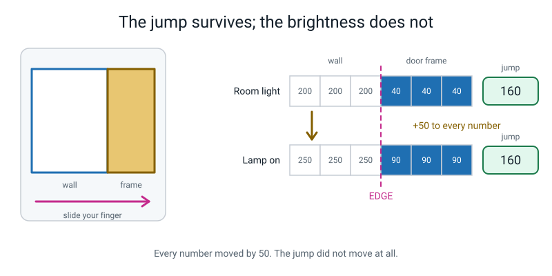
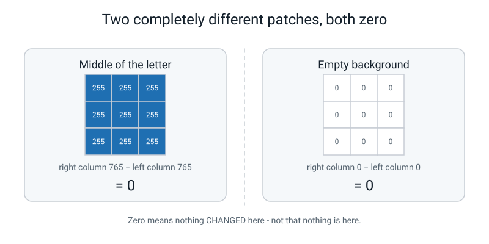
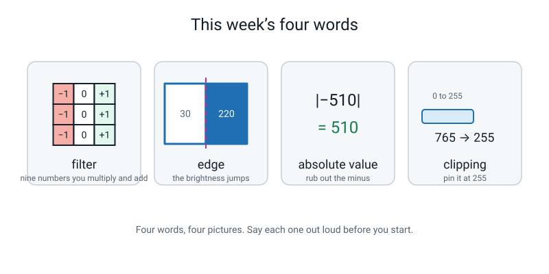
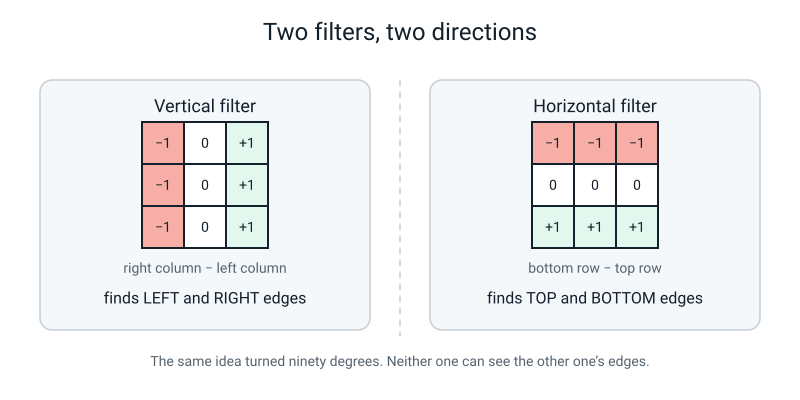

# Week 25 — Filters: The Little Grid That Finds Edges

[⬅ Week 24](week-24.md) · [Course Home](../README.md) · [Week 26 ➡](week-26.md) · [Workbook](../workbook/week-25.md)

---

> ### This week in one sentence
> **Slide a tiny grid of nine numbers over a picture and it will highlight exactly one thing — and an edge is nothing more mysterious than a place where the brightness suddenly changes.**
>
> **By the end of this chapter you will be able to:**
> - Work out one output cell of a **3×3 filter** by multiplying nine pairs of numbers and adding them up
> - Explain why a filter made of minus-ones and plus-ones finds a **vertical edge**
> - Take the **absolute value** of a filter's answer, and say why you throw the minus sign away
> - **Clip** a result back into the 0–255 range so you can shade it in
>
> **Reading time:** about 20 minutes. **Homework:** about 50 minutes.

---

## 🪝 Start Here

Go and put your finger on a wall. Anywhere in the middle of it.

Now slide your finger along. Does the wall get brighter? Darker? … No. It is the same all the way across. Boring.

Keep sliding until you hit the edge of a door frame. **Stop there.**

That spot is different. On one side of your finger it is wall. On the other side it is frame. The brightness just **jumped**.

That jump has a name in this course, and the name is not what you think it is.

> **Edge** — a place in a picture where the brightness suddenly changes.

Not the edge of a table. Not a line somebody drew. Just: the number was 200, and one step later the number is 40. *Something happened here.*

Now here is the strange bit, and it is the reason this whole week exists.

Switch the big light off and use a torch instead. The wall gets darker. The door frame gets darker. **Everything** gets darker. So — is there still a jump at the door frame?

Yes. Every time. The brightness moved. The jump did not.


*Figure 25.1 — Room light: wall 200, frame 40, jump 160. Lamp on: wall 250, frame 90, jump still 160. Every single number moved. The jump did not budge.*

Hold on to that picture, because this week you are going to build a tiny machine whose only job in life is to find those jumps. It is nine numbers on a scrap of paper. That is all it is.

---

## 🧠 The Big Idea

### 1. A filter is an instruction, not a picture

Here is the whole invention. Nine numbers:

```
   -1    0   +1
   -1    0   +1
   -1    0   +1
```

Do **not** try to read that as a picture. It is not a picture of anything. It is an **instruction**, and the instruction is this — say it out loud, because the words are the thing you will actually remember:

> ### **"Add up the three pixels on the right. Subtract the three pixels on the left."**

That is all those nine numbers say.

- The `+1`s mean **add me**.
- The `−1`s mean **take me away**.
- The `0`s in the middle column mean **ignore me completely**. The middle column genuinely does not get used. Whatever is sitting under it — 0, 255, 137 — it gets multiplied by zero, so it contributes exactly nothing.

> **Filter (kernel)** — a small grid of numbers, usually 3×3, that you lay on top of a patch of the picture. You multiply each filter number by the pixel underneath it, add up the nine answers, and write down that one number.

Some people say **kernel** instead of filter. Same thing. Don't worry about it.

**🍕 The analogy: a very fussy referee.** Imagine a referee whose only job, forever, is to answer one question: *"is the right side louder than the left side?"* You can show them a beautiful match. You can show them a fight. You can show them an empty stadium. They will only ever answer that one question. They are not stupid and they are not clever — they are **narrow**. A filter is exactly that narrow, and its narrowness is what makes it useful.

**Now think about what the instruction actually produces:**

| What the little patch looks like | Right side | Left side | Answer |
|---|---|---|---|
| Plain wall, all the same | 765 | 765 | **0** |
| Dark on the left, bright on the right | 765 | 0 | **+765** |
| Bright on the left, dark on the right | 0 | 765 | **−765** |

So a **big** number — positive or negative — means *"the brightness jumped sideways right here."* A **zero** means *"nothing changed here."*


*Figure 25.2 — The same filter at three positions on one small grid. To the left of the bright line: +765. Sitting on the line: 0. To the right: −765.*

### 2. Multiply, add, write down, slide

Here is the whole method. Four moves, and then you do them again about a hundred times.

1. **Lay** the filter on top of a 3×3 patch of the picture.
2. **Multiply** each filter number by the pixel underneath it. Nine multiplications.
3. **Add** the nine answers together. That is one number.
4. **Write it down** in the answers grid, then **slide** the filter one square right and start again.

Nothing is hidden. There is no extra step you are not being shown. It really is nine multiplications and an addition.

**The concrete version, with real numbers.** Suppose the nine pixels under the filter are these:

```
        c1    c2    c3
   r1    0     0     0
   r2    0   255   255
   r3    0   255   255
```

Every single multiplication, written out:

```
   (-1 ×   0) =    0        ( 0 ×   0) = 0        (+1 ×   0) =    0
   (-1 ×   0) =    0        ( 0 × 255) = 0        (+1 × 255) = +255
   (-1 ×   0) =    0        ( 0 × 255) = 0        (+1 × 255) = +255
                                                  --------------------
                                                  total     = +510
```

**+510.** The machine is saying: *something is going on right here.* And it is right — that patch is a corner of a letter.


*Figure 25.3 — Nine pixels, nine filter numbers, nine multiplications, one answer. Once you have seen it once you never need to write all nine again.*

**The shortcut you will actually use.** Because the middle column is always zero, the nine multiplications collapse into three lines:

```
   right column (c3) = 0 + 255 + 255 = 510
   left  column (c1) = 0 +   0 +   0 =   0
                       ------------------
   answer            = 510 - 0 = +510
```

Same sum. Written faster. Use the long version once so you believe it, then use the short version forever.

> **💡 Try this:** cover the answer above and do it yourself with a calculator. Then change the top-right pixel from 0 to 255 and redo it. You should get +765. Do you see why? All three right-hand pixels are ink now instead of two.

### 3. Two repairs: rub out the minus, then pin at 255

The filter's answer can be enormous, and it can be negative. Neither of those is a shade of grey, so before you can shade anything in you have two repairs to do, **in this order**.

**Repair 1 — absolute value.**

> **Absolute value** — a number with its minus sign removed. We write it with two straight lines: `|−765| = 765`.

Why throw the sign away? Because the sign is a **direction**, not a size.

- `+765` means *dark on the left, bright on the right.*
- `−765` means *bright on the left, dark on the right.*

Both are exactly as strong an edge as each other. And for the question we are asking right now — *"is there an edge here?"* — we do not care which way round it went. So: minus sign in the bin.

**Repair 2 — clipping.**

> **Clipping** — forcing a number back into the 0–255 range so it can be shaded. Anything 255 or above becomes exactly 255.

The biggest our filter can ever produce is 3 × 255 = **765**. You cannot shade 765. There is no colour darker than black. So we pin it: `765 → 255`. And `1020 → 255` too.


*Figure 25.4 — Absolute value first, clipping second. Once the minus is gone nothing can be negative, so there is nothing to pin at the bottom.*

**Order matters, and here is why.** Say your answer is −765.

| If you clip first | If you take the absolute value first |
|---|---|
| Clipping only pins the **top**. −765 is not above 255, so nothing happens. It is still −765, and you have to clip *again* after the absolute value. | `|−765| = 765`. Then clip: 765 → 255. Done in two clean steps. |

> **⚠️ Watch out:** **clipping costs you something, and you should say so out loud.** A cell that was 1020 and a cell that was 765 both come out as 255. The fact that one was stronger than the other is **destroyed forever**. We accept that because we want to shade a grid, and a shade cannot be darker than black. But it is a real loss, not a free tidy-up.

### 4. Zero is an answer, not a mistake

This one catches everybody, including adults, so read it twice.

You will be shading your answers in and you will hit a **0** right in the middle of the letter — a place absolutely full of ink. And you will think: *I have made a mistake.*

You have not.

> **Zero does not mean "nothing is there". Zero means "nothing *changed* here."**

The filter is not asking *"is anything here?"* It is asking *"did anything just happen here?"* The middle of a letter is boring — it is the same all the way across — so the honest answer is *nothing happened.* Zero.

And here is the proof that zero is really about flatness and not about emptiness: **there are two completely different ways to score zero**, and the filter cannot tell them apart.


*Figure 25.5 — Left: nine pixels of solid ink, 765 − 765 = 0. Right: nine pixels of empty paper, 0 − 0 = 0. Same answer, opposite pictures.*

A white wall gives zero. A black wall gives zero. The filter cannot see the difference, because there is no *change* in either one.

### 5. Why bother? Because an edge holds still and brightness does not

Two more things you need, and the second one is the payoff.

**Thing one — the answers grid is smaller than the picture.**

A 3×3 filter needs a full ring of neighbours around whatever pixel it is centred on. On the very outside row and column, that ring does not exist — there is nothing out there. So the filter can never sit on the border.

> **Output size = input size − 2** (for a 3×3 filter).

A 12×12 picture gives a **10×10** answers grid. That is 100 cells, not 144. Work this out *before* you start counting cells — getting it wrong is the single most common mistake in this whole lesson.

**Thing two — the reason edges are the right thing to look for first.**

Go back to Figure 25.1. Two pixels: a dark door frame at **40** and a bright wall at **200**. The difference is 160.

Now somebody switches a lamp on and every pixel gets 50 brighter:

```
   before:   frame  40    wall 200   →   difference = 160
   after:    frame  90    wall 250   →   difference = 160     ← IDENTICAL
```

Both raw numbers moved. **The difference did not move at all.**

And a difference is exactly what a filter computes. This is not luck. Add up the filter's nine weights: −1, 0, +1, −1, 0, +1, −1, 0, +1. **They add up to zero.** Add the same amount to every pixel in the patch and the filter's answer changes by (that amount) × 0 = nothing at all.

> **A filter whose nine numbers add up to zero is completely blind to how bright the room is.**

That is the sentence this whole week is built on:

| | Moves when the light moves? | Good feature? |
|---|---|---|
| Raw brightness | **Yes, a lot** | Bad — it is a fact about the *room* |
| An edge | Barely | Good — it is a fact about the *object* |


*Figure 25.6 — Where all this is heading. A solid letter goes in; a hollow outline comes out. The middle vanishes because the middle never changes. You will make this happen for real next week.*

---

## 🔍 Worked Examples

Three of them, all the way through, every number shown.

### Worked Example 1 — A biscuit on a white plate (food)

Somebody photographed a dark chocolate biscuit sitting on a white plate, and wrote down the brightness of a 5×5 patch. The plate is bright (240) and the biscuit is dark (60). The biscuit takes up the right-hand side.

```
        c1    c2    c3    c4    c5
   r1  240   240    60    60    60
   r2  240   240    60    60    60
   r3  240   240    60    60    60
   r4  240   240    60    60    60
   r5  240   240    60    60    60
```

**First: how big is the answers grid?** 5 − 2 = **3**, so 3×3 = nine cells. The filter can only be centred on rows 2–4 and columns 2–4.

**Cell (3,2)** — the filter is centred on row 3, column 2, so it covers rows 2–4 and columns 1–3.

The nine pixels:

```
        c1    c2    c3
   r2  240   240    60
   r3  240   240    60
   r4  240   240    60
```

All nine multiplications, because this one is worth seeing in full:

```
   (-1 × 240) = -240      ( 0 × 240) = 0      (+1 ×  60) =  +60
   (-1 × 240) = -240      ( 0 × 240) = 0      (+1 ×  60) =  +60
   (-1 × 240) = -240      ( 0 × 240) = 0      (+1 ×  60) =  +60
                                              ---------------------
                          total  =  -720 + 180  =  -540
```

Now the two repairs:

| Step | Working | Result |
|---|---|---|
| Absolute value | `|−540|` | **540** |
| Clip at 255 | 540 is bigger than 255 | **255** → shade it dark |

**What does the minus sign mean?** It means *bright on the left, dark on the right* — which is exactly true: plate on the left, biscuit on the right. The sign told us which way round the world was. Then we threw it away, because we only wanted to know *whether* there was an edge.

**Cell (3,4)** — centred on row 3, column 4, covering columns 3–5. Use the shortcut:

```
   right column (c5) = 60 + 60 + 60 = 180
   left  column (c3) = 60 + 60 + 60 = 180
   answer = 180 - 180 = 0
```

**Zero.** And the biscuit is definitely there — it is solid chocolate. But it is *flat* chocolate. Nothing changed. Zero.

### Worked Example 2 — The white crease line on a cricket pitch (sport)

A camera looks down at the crease — a thin white line painted on green grass. The grass reads 90 and the paint reads 250. The line is exactly **one pixel wide**, in column 3.

```
        c1    c2    c3    c4    c5
   r1   90    90   250    90    90
   r2   90    90   250    90    90
   r3   90    90   250    90    90
   r4   90    90   250    90    90
   r5   90    90   250    90    90
```

Three cells, and the third one is a genuine surprise.

**Cell (3,2)** — columns 1–3:

```
   right column (c3) = 250 + 250 + 250 = 750
   left  column (c1) =  90 +  90 +  90 = 270
   answer = 750 - 270 = +480        |480| = 480        clipped = 255
```

**Cell (3,4)** — columns 3–5:

```
   right column (c5) =  90 +  90 +  90 = 270
   left  column (c3) = 250 + 250 + 250 = 750
   answer = 270 - 750 = -480        |-480| = 480       clipped = 255
```

Same size, opposite sign — the two sides of the same painted line. **That mirror pair is a free correctness check:** if the two sides of a stroke do not come out the same size with opposite signs, one of them is wrong.

**Cell (3,3)** — right on top of the line, columns 2–4:

```
   right column (c4) = 90 + 90 + 90 = 270
   left  column (c2) = 90 + 90 + 90 = 270
   answer = 270 - 270 = 0
```

**Zero — sitting exactly on the white line.**

That looks absurd until you look at what the filter is comparing. It compares column 2 with column 4. Both of those are grass. The paint is in the middle column, and the middle column is multiplied by zero and ignored.

So a one-pixel line does not come out as one line. **It comes out as two lines with a gap down the middle.** The filter never finds "the line" — it finds *the two places where the line starts and stops.* That is worth knowing, because it explains a real problem you will hit next week: if the strokes of your letter are too thin, the edge map goes strange.

### Worked Example 3 — Two cells of the class letter (school)

This is the 12×12 grid from class — a fat capital **T**, where **255 is ink and 0 is paper**.

**Cell (8,4)** — the filter is centred on row 8, column 4, covering rows 7–9 and columns 3–5. Row 8 is down in the stem of the T, and the stem's left edge runs straight down through the whole window.

```
   right column (c5) = 255 + 255 + 255 = 765
   left  column (c3) =   0 +   0 +   0 =   0
   answer = 765 - 0 = +765         |765| = 765        clipped = 255
```

**+765 is the largest number a single 3×3 filter can ever produce.** Three pixels of pure ink on one side, three pixels of pure paper on the other, and the edge running dead straight through all three rows. You cannot beat that with this filter. Any time you get 765, stop and admire it — you have found a perfectly straight, perfectly strong edge.

**Cell (2,11)** — centred on row 2, column 11, covering rows 1–3 and columns 10–12. That is the **top-right corner** of the letter.

```
   right column (c12) =   0 +   0 +   0 =   0
   left  column (c10) =   0 + 255 + 255 = 510
   answer = 0 - 510 = -510         |-510| = 510       clipped = 255
```

**Why 510 and not 765?** Because row 1 is all paper. Only **two** of the three pixels in the left column are ink, not three. Corners are half in and half out of the shape, so they score less than the middle of a straight edge — at least with this one filter. (Hold that thought. Your homework is about to turn corners into the *strongest* cells on the whole grid.)

---

## 🎲 What We Did In Class

**Run the Filter by Hand.** If you missed the lesson, or you want to do it again, everything you need is right here. You need graph paper, a pencil, a rubber and a calculator. **Use the calculator** — today is not an arithmetic test, and one slip adding 255 + 255 + 255 wrecks the ending.

### The picture

12 × 12. **255 = ink, 0 = paper.** It is a fat capital T.

```
        c1   c2   c3   c4   c5   c6   c7   c8   c9  c10  c11  c12
  r1     0    0    0    0    0    0    0    0    0    0    0    0
  r2     0  255  255  255  255  255  255  255  255  255  255    0
  r3     0  255  255  255  255  255  255  255  255  255  255    0
  r4     0  255  255  255  255  255  255  255  255  255  255    0
  r5     0  255  255  255  255  255  255  255  255  255  255    0
  r6     0    0    0    0  255  255  255  255    0    0    0    0
  r7     0    0    0    0  255  255  255  255    0    0    0    0
  r8     0    0    0    0  255  255  255  255    0    0    0    0
  r9     0    0    0    0  255  255  255  255    0    0    0    0
  r10    0    0    0    0  255  255  255  255    0    0    0    0
  r11    0    0    0    0  255  255  255  255    0    0    0    0
  r12    0    0    0    0    0    0    0    0    0    0    0    0
```

Check it: the bar is 4 rows × 10 columns = 40 pixels, the stem is 6 rows × 4 columns = 24. So **64 bright pixels out of 144.**

### The filter

```
   -1    0   +1
   -1    0   +1        "right column  minus  left column"
   -1    0   +1
```

### The rules we followed

1. Draw a **blank 10×10 answers grid** first, with rows labelled r2–r11 down the side and columns c2–c11 along the top. (10, not 12 — output = input − 2.)
2. For every cell write **three lines**: the left column sum, the right column sum, and the subtraction. If your answer is wrong you want to be able to see *where*.
3. After every cell do the two repairs: **absolute value**, then **clip at 255**.
4. Shade the clipped answer onto the answers grid: 255 → dark, 0 → leave white.

### The six cells

| Order | Cell | Left sum | Right sum | Answer | \|answer\| | Clipped | Shade |
|---|---|---:|---:|---:|---:|---:|---|
| 1 | **(2,2)** | 0 | 510 | **+510** | 510 | 255 | dark |
| 2 | **(2,11)** | 510 | 0 | **−510** | 510 | 255 | dark |
| 3 | **(3,5)** | 765 | 765 | **0** | 0 | 0 | white |
| 4 | **(8,4)** | 0 | 765 | **+765** | 765 | 255 | dark |
| 5 | **(8,8)** | 765 | 0 | **−765** | 765 | 255 | dark |
| 6 | **(10,2)** | 0 | 0 | **0** | 0 | 0 | white |

Those six were not picked at random. Every one is on the list for a reason:

- **(2,2)** — a corner. The one we did together with all nine multiplications.
- **(2,11)** — the mirror corner, and the first **minus** sign.
- **(3,5)** — inside the bar. **Zero, and it is not a mistake.** Flat *ink*.
- **(8,4)** — the stem's left edge. **The biggest answer possible.**
- **(8,8)** — the stem's right edge. Same size, opposite sign.
- **(10,2)** — empty background. **Zero again, for the opposite reason.** Flat *paper*.

### Then shade it, and stand back


*Figure 25.7 — Six cells out of a hundred, shaded onto the blank answers grid. Four dark, two white. That is already the two top corners of the letter and both sides of the stem.*

**Six numbers.** Nobody told the filter there was a letter in there. Nobody wrote a rule saying "look for a horizontal bar with a stick under it". All it did was subtract the left side from the right side, and the shape started falling out on its own.

### The honest bit at the end

Our filter only found the **left and right** edges. Look at the *top* of the letter — the flat top edge where paper meets ink going downwards. Our filter is completely **blind** to it. It scores zero along the whole thing.

Why? Because we only ever compared *left to right*. We never once compared *up to down*.

Want the proof? Compute cell **(2,6)**, which sits right on the top edge of the bar:

```
   right column (c7) = 0 + 255 + 255 = 510
   left  column (c5) = 0 + 255 + 255 = 510
   answer = 510 - 510 = 0
```

Sitting directly on an obvious edge, and reporting nothing at all. That is not a bug. That is a filter doing exactly the one job it was given.

---

## 💬 Talk About It

**1. "I run a filter somewhere in a photo and it gives me zero. Give me two completely different things that could be going on in that photo."**

*Hint for you:* it could be all bright there — like the middle of the letter, or a blank sky. Or it could be all dark there — like an empty black background. Either way it is **flat**. If the person you ask says "there's nothing there", show them Figure 25.5 and ask which panel they mean.

**2. "My filter gives me minus 900. Walk me through what I do before I can shade it in — and tell me what I lose at each step."**

*Hint for you:* rub out the minus first → 900, and you have just lost **which direction** the brightness jumped. Then clip → 255, and you have just lost **how strong** it was: a 900 and a 300 now look identical. The second loss is the more serious one, and it is why a finished edge map looks flat black everywhere instead of showing degrees of strength.

**3. "Couldn't you just count how much ink is in the photo instead? That's way easier."**

*Hint for you:* you could, and it would work beautifully — right up until somebody switches a lamp on, or takes the photo at dusk, or uses grey paper instead of white. Then your ink-counter gives a completely different answer for the same letter. Push whoever you are talking to on this one: *which number would you rather bet on — one that moves when the light moves, or one that does not?*

---

## ⚠️ Don't Get Tricked

### Trick 1 — "Zero means there's nothing there"


*Figure 25.8 — The two-panel test. Solid ink on the left, empty paper on the right. Both score zero.*

| ❌ Wrong | ✅ Right |
|---|---|
| "I got a 0 in the middle of the letter, so I must have made a mistake." | "Zero means nothing **changed** here. The middle of the letter is flat, so zero is the correct answer." |

The cure is Figure 25.8. A white wall gives zero and a black wall gives zero. If zero meant "nothing there", how could solid ink possibly score it?

### Trick 2 — "A minus answer means the pixel is dark"

| ❌ Wrong | ✅ Right |
|---|---|
| "It came out −765, so I'll shade it very dark. And −765 is less than 0, so it's the weakest cell." | "The sign is a **direction**, not a size. −765 is exactly as strong an edge as +765. Rub the minus out **first**, then shade." |

Ask yourself: how far is 765 from zero? How far is −765 from zero? **The same distance.** That is precisely why we take the absolute value — the sign was never telling us about strength.

Habit to build: **step one, minus sign in the bin. Step two, shade.** In that order, every single time.

### Trick 3 — "The answers grid is the same size as the picture"

| ❌ Wrong | ✅ Right |
|---|---|
| "It's a 12×12 picture, so I'll draw a 12×12 answers grid." | "Output = input − 2. A 12×12 picture gives a **10×10** answers grid — 100 cells, not 144." |

Test it yourself. Put the filter on the very top-left square of the grid. What is above that square? Nothing. What is to the left of it? Nothing. So the filter has nothing to multiply up there — it cannot sit there at all. It can only be centred on c2, c3, … c11. Count those: **ten**.

### Trick 4 — "Clipping is just tidying up, it doesn't cost anything"

| ❌ Wrong | ✅ Right |
|---|---|
| "Clipping just squashes the numbers so they fit. Nothing is lost." | "Clipping **destroys** the difference between a 1020 and a 765. Both become 255 and you can never tell them apart again." |

This matters more than it sounds. Next week your finished edge map will look flat black along every edge, and it will look like the corners are no stronger than the straight bits. They *are* stronger — by a mile. Clipping hid it. Knowing what your own tidy-up threw away is one of the most useful habits in this whole course.

---

## 🌍 Where You've Seen This

1. **The "sharpen" slider in any photo app.** That slider is literally a filter like today's, run over every pixel of your photo. Slide it up and you are asking a small grid of numbers to shout louder wherever it finds a change.
2. **Your own eyes in a dark room.** You cannot tell me the exact brightness of a wall. But you can find the door frame instantly, even by torchlight. Your visual system is a change-detector, not a light-meter — which is exactly the trade-off in this chapter.
3. **A supermarket barcode scanner.** A barcode is nothing *but* edges — black-to-white jumps. The scanner does not care whether the shop is bright or dim, because it is reading the jumps, not the brightness.
4. **A car with lane-keeping assist.** It finds the painted white line on the road. In sun, in rain, at dusk, under a bridge. Brightness is different in every one of those. The edge at the paint's boundary barely moves.
5. **A cartoon or a manga drawing.** An artist draws the outlines and leaves the middles flat. That is an edge map made by a human hand — and it is enough for you to recognise a character instantly, which tells you how much information lives in the outline.
6. **Scanning a page with your phone.** The document scanner finds the four edges of the paper and straightens it. It is hunting for long straight brightness jumps, then joining them into a rectangle.

---

## 🔑 Remember This

- **A filter is nine numbers you multiply and add.** Where the picture is boring, it gives you zero. Where something changes, it gives you a big number.
- **Say the instruction in words, not numbers:** *"right column minus left column."* Words don't rotate; a grid of `−1 0 +1` looks the same whether you read it across or down.
- **Zero means nothing *changed*, not nothing is there.** Flat ink and flat paper both score zero.
- **The sign is a direction, not a size.** `+765` and `−765` are equally strong edges. Absolute value first, then clip.
- **Clipping costs you something real.** 1020 and 765 both become 255, and the difference is gone forever.
- **Output = input − 2.** A 12×12 picture gives a 10×10 answers grid, because the filter can never sit on the border.
- **The nine weights add up to zero, which makes the filter blind to the lamp.** That is why edges are worth finding and raw brightness is not.

---

## 📓 New Words


*Figure 25.9 — This week's four words, drawn.*

| Word | What it means | Example |
|---|---|---|
| **filter** (also called a **kernel**) | A small grid of numbers, usually 3×3, that you slide over a picture. At each stop you multiply the filter's numbers by the pixels underneath and add up the answers | `−1 0 +1` in all three rows = "right column minus left column" |
| **edge** | A place in the picture where the brightness suddenly changes | Wall at 200 sitting next to a door frame at 40 |
| **absolute value** | A number with its minus sign removed — how far it is from zero, ignoring which side | `|−765| = 765` |
| **clipping** | Forcing numbers back into the 0–255 range so they can be shaded. Anything 255 or above becomes 255 | `1020 → 255` and `765 → 255` |

---

## 📤 Your Homework

Go to **[the Week 25 workbook](../workbook/week-25.md)**. About **50 minutes** in total.

Your homework uses a **second filter** — one you have not met yet. It is the same idea turned ninety degrees:


*Figure 25.10 — The vertical filter you used in class, and the horizontal filter you will use tonight. One compares sideways, the other compares up and down.*

```
   -1   -1   -1
    0    0    0        "bottom row  minus  top row"
   +1   +1   +1
```

| Page | What to do | Time |
|---|---|---|
| **25.1** | Warm-up, then Practice Sets A and B — understand it, then use it on new pictures | 15 min |
| **25.2** | Run the **horizontal** filter on the same six cells. Write the top-row sum and the bottom-row sum every time. Then absolute values, then clip | 20 min |
| **25.3** | **Combine** them into an edge map: for each cell, add your horizontal answer to your vertical answer — **the absolute values, before clipping** — then clip the total. Shade the grid | 10 min |
| **25.4** | The written question, the puzzle, and the four vocabulary boxes | 10 min |

> **⚠️ Watch out:** do the combining **before** you clip, not after. If you clip each one first you will throw away the exact thing the written question is asking you about. `|V| + |H|` first. Clip last.

**The written question is the one that counts:** *which parts of the letter came out strongest, and why does that make sense?* One paragraph. Your teacher wants a **reason**, not just a number — and there is a genuinely satisfying reason waiting for you in the corners.

---

[⬅ Week 24](week-24.md) · [Course Home](../README.md) · [Week 26 ➡](week-26.md) · [📓 Workbook — Week 25](../workbook/week-25.md) · [Glossary](../../glossary.md)
