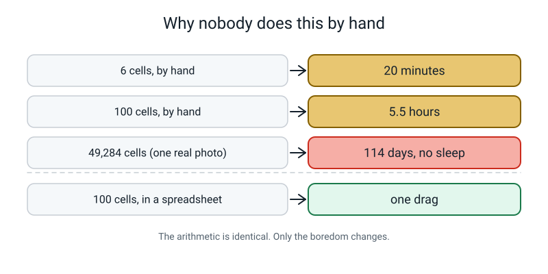
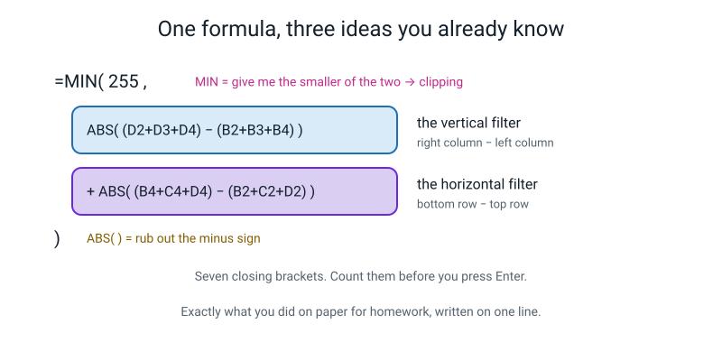
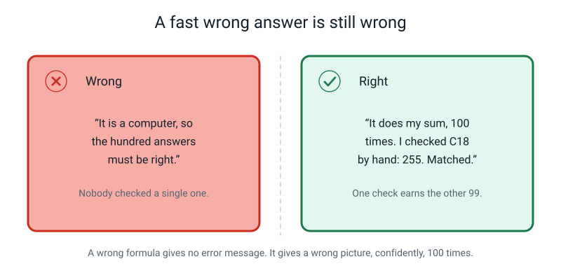
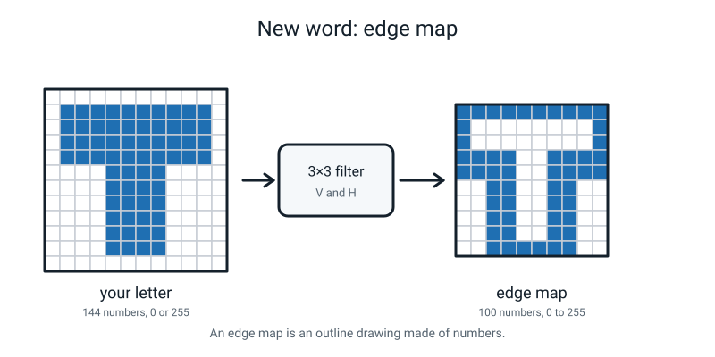

# Week 26 — Pixel Lab: Make the Outline Appear

[⬅ Week 25](week-25.md) · [Course Home](../README.md) · [Week 27 ➡](week-27.md) · [Workbook](../workbook/week-26.md)

---

> ### This week in one sentence
> **Edges survive a change of lighting and raw brightness does not — which is the whole reason a real vision system goes looking for edges first.**
>
> **By the end of this chapter you will be able to:**
> - Build a working **edge filter** in a spreadsheet using one formula dragged across a grid
> - Use **conditional formatting** to turn a grid of numbers back into a visible picture
> - Prove, with your own numbers, that edge values change far less than brightness values when the light changes
> - Explain the background trap in your own Week 17 model in terms of edges
>
> **Reading time:** about 20 minutes. **Homework:** about 55 minutes.

---

## 🪝 Start Here

Last week you computed six cells by hand. How long did it take? About twenty minutes, with a calculator, concentrating the whole time.

Our little grid has **one hundred** output cells.

Let's do the arithmetic. A hundred divided by six, times twenty minutes:

```
   100 ÷ 6 × 20 minutes  ≈  333 minutes  ≈  5.5 hours
```

Five and a half hours. No break. No mistakes.

Now the real thing. A photo going into Teachable Machine is **224 × 224** pixels. The output grid is 222 × 222, which is **49,284 cells**:

```
   49,284 ÷ 6 × 20 minutes  ≈  164,000 minutes  ≈  2,738 hours  ≈  114 days
```

A hundred and fourteen days. Working non-stop, day and night, no sleep.

And that is for **one filter** on **one photo**. A real system runs hundreds of filters. And it finishes while you are still standing there holding your phone up.


*Figure 26.1 — The same arithmetic at four different scales. Nothing about the sum changes. Only who is doing it.*

So today is **not** about learning new arithmetic. The arithmetic is exactly what you did last week — right column minus left column, bottom row minus top row, absolute value, clip. Not one thing more.

Today is about the moment where you stop doing it one cell at a time.

---

## 🧠 The Big Idea

### 1. A spreadsheet remembers *directions*, not addresses

This is the trick that makes the whole lesson work, and it has nothing to do with AI at all.

In a spreadsheet every cell has an address — a column letter and a row number. `C18`. `D2`. When you type a formula that mentions other cells, here is the thing nobody tells you:

> **The spreadsheet does not really store the addresses. It stores *directions* from where the formula is sitting.**

So if you put this in cell `C18`:

```
   = D2 + D3 + D4
```

the spreadsheet does not remember "D2, D3, D4". It remembers something more like *"one column to my right, sixteen rows up — and the two cells below that."*

Now copy that formula one cell to the right, into `D18`. The spreadsheet re-reads the same directions **from the new position** and gives you `= E2 + E3 + E4`. Copy it one cell down instead and you get `= D3 + D4 + D5`.

**That is the whole reason spreadsheets exist.** You write the sum once, in words that mean "my neighbours", and then you drag it over a hundred cells and each one does the same sum in its own place.

**🍕 The analogy: a recipe that says "the next one".** Imagine a rule for a queue of people: *"take the number from the person two places behind you and add ten."* You do not need a different rule for each person. Every person in the queue follows the identical sentence and gets a different answer, because "two places behind you" points somewhere different depending on where you are standing.


*Figure 26.2 — Type the formula once into C18. Then grab the little solid square at its bottom-right corner — the drag handle — and pull it out to L27.*

> **💡 Try this before you do anything else.** Open a blank spreadsheet. Type `1, 2, 3, 4, 5` down column B. Then type `=B1+1` into cell `C1` and drag `C1` down five rows. Now click on `C5` and look at the formula bar. It says `=B5+1`, not `=B1+1`. Ninety seconds, and the drag will never confuse you again.

### 2. The formula is three things you already know, glued together

Here is the formula you type. It looks frightening. Look at how long it is, then stop worrying about it, because there is nothing new in it.

```
=MIN(255, ABS((D2+D3+D4)-(B2+B3+B4)) + ABS((B4+C4+D4)-(B2+C2+D2)))
```

Take it apart:

| Piece | Read it out loud | What you called it last week |
|---|---|---|
| `(D2+D3+D4)-(B2+B3+B4)` | three cells added up, minus three other cells added up — right column minus left column | the **vertical filter**, V |
| `(B4+C4+D4)-(B2+C2+D2)` | same shape, but going across — bottom row minus top row | the **horizontal filter**, H |
| `ABS(...)` | rub out the minus sign | **absolute value** |
| `MIN(255, ...)` | give me the smaller of 255 and this number | **clipping** |

`MIN(255, x)` is the only genuinely unfamiliar bit, so give it one extra thought. It means: *compare 255 with x, and hand me back whichever is smaller.* If x is 900, it hands back 255. If x is 0, it hands back 0. That is exactly clipping — anything over 255 gets pinned to 255 — written as a comparison instead of as a rule.


*Figure 26.3 — The same formula, split up. Two filters, two absolute values, one clip. Letter for letter what you did on paper.*

**Where does it sit, and which pixel is it about?** If your picture lives in `B2:M13`, then the formula in `C18` is the edge value for image pixel `C3` — the first pixel that has a full ring of neighbours all the way round it. The output block sits sixteen rows below the input block for one boring reason: so the two grids do not touch each other on the screen.

**How big is the output block?** Same rule as last week. 12 − 2 = 10, so it runs from `C18` to `L27`. Ten columns (C to L), ten rows (18 to 27). **One hundred cells.** Count them.

> **⚠️ Watch out:** there are **five** closing brackets in that formula. Count them before you press Enter. A missing bracket is the single most common reason it refuses to work.

### 3. Conditional formatting turns numbers back into a picture

A spreadsheet full of 0s and 255s looks like absolutely nothing. **Conditional formatting** paints each cell according to the number inside it. Set a **colour scale** with the minimum at 0 and the maximum at 255, and the grid suddenly *is* the picture.

You do this twice, with the colours the opposite way round each time:

| Grid | Minimum (0) | Maximum (255) | Why this way round |
|---|---|---|---|
| **Input** — your letter | black | white | Because 0 *is* black and 255 *is* white. That is the Week 23 rule and we are just obeying it |
| **Edge map** — the outline | white | black | So the edges come out looking like pencil on paper, which is far easier to read |


*Figure 26.4 — Nothing in the sheet changed between these two pictures. Not one number. Only how the cells are painted changed.*

Flipping the second one round is a **presentation choice, not a maths one**, and it is worth being honest with yourself about that. The numbers did not change. Only the paint did. You are allowed to make things easier to look at — you are not allowed to forget that you did it.

### 4. The proof: edges survive a lighting change, brightness does not

This is what the whole week exists for. And it is provable with two numbers.

Take a dark object at brightness **40** sitting on a bright wall at **200**. The difference between them is **160**.

Now switch a lamp on so that every pixel gets 50 brighter:

```
   before:   object  40    wall 200    →   difference = 200 - 40  = 160
   after:    object  90    wall 250    →   difference = 250 - 90  = 160   ← IDENTICAL
```

Both raw brightness numbers moved by 50. **The difference did not move at all.**

And a difference is precisely what an edge filter computes. Look at the vertical filter's nine weights: −1, 0, +1, −1, 0, +1, −1, 0, +1. Add them up: **they come to zero.** So add the same amount to every pixel in the patch and the filter's answer changes by (that amount) × 0 = nothing.

> **A filter whose nine numbers add up to zero is mathematically blind to how bright the room is.**


*Figure 26.5 — The measurement you will reproduce with your own lamp. Six brightness numbers all shift by about 44. The three edge numbers move by 1, 0 and 3.*

**Now the honest part, which matters just as much.** Edges are **more** stable than brightness. They are not **perfectly** stable. Your own numbers will wobble by one or two, and that is not you being careless. Here are the three real reasons:

1. **Real lamps are not even.** A desk lamp on the left brightens the left more than the right. That is not "add 50 to everything" — it actually *creates brand-new edges* that were never on the object, like the hard boundary of a shadow.
2. **Pixels cannot go below 0 or above 255.** In a very dark or a blown-out photo, thousands of pixels get squashed onto the same value, and a real difference genuinely does disappear.
3. **Dark photos are grainy**, and grain is random pixel-to-pixel change — which is exactly the thing an edge detector is built to notice.

So do **not** expect your numbers to be identical. Expect them to move **far less** than the brightness numbers, and then check whether they did. The comparison is the finding. Neither number on its own tells you anything.

### 5. The background trap, and now you can explain it

Cast your mind back to Week 17. You trained a Teachable Machine model, and in Week 18 you broke it. The classic break: you photographed everything on the same wooden table, the model scored beautifully on that table, and it collapsed the moment you tried it at the sink.

Now you can say **why**, in pixel language.

Wood grain produces long, straight, strong, repeated edges in every single photo. The object produces a smaller, shorter, wobblier set of edges — and the object *moves and rotates* between shots, while the table never does.

So the most reliable edge pattern sitting next to that label was **the table**.


*Figure 26.6 — Eight long grain lines beat one small object outline. The filter reports every edge it finds, including all the ones you did not want.*

> **The background rule:** a vision model learns whatever is most reliably associated with the label. If your background is more reliable than your object, **you have trained a background detector and given it your object's name.**

And notice what the filter did and did not do wrong here. The filter was perfect. It reported every edge in the picture, exactly as instructed. It has no idea which edges you care about — that was never its job, and nobody told it.

---

## 🔍 Worked Examples

### Worked Example 1 — Checking the machine by hand (school)

This is the most important thing you do all week, and it takes three minutes.

You have built the sheet and dragged the formula. You now have a hundred answers you did not compute. **Before you believe any of them, check one.**

The letter is the 12×12 T from Week 25, typed into `B2:M13`. So image pixel `C3` is grid cell **(3,2)**, and its answer lives in output cell **`C18`**.

**Step 1 — read the nine pixels off the paper grid.** Cell (3,2) means rows 2–4, columns 1–3:

```
        c1    c2    c3
   r2    0   255   255
   r3    0   255   255
   r4    0   255   255
```

**Step 2 — the vertical filter.**

```
   V  =  right column (c3) - left column (c1)
      =  (255 + 255 + 255) - (0 + 0 + 0)
      =  765 - 0  =  +765               |V| = 765
```

**Step 3 — the horizontal filter.**

```
   H  =  bottom row (r4) - top row (r2)
      =  (0 + 255 + 255) - (0 + 255 + 255)
      =  510 - 510  =  0                |H| = 0
```

**Step 4 — combine, then clip.**

```
   |V| + |H|  =  765 + 0  =  765
   MIN(255, 765)  =  255
```

**So `C18` must show 255.** Look at your screen. If it does, **now** you may believe the other ninety-nine. If it does not, your formula is pointing at the wrong cells, and no amount of staring at the pretty picture will fix that.

**Now a second one, because a corner is more interesting.** Output cell `C21` is image pixel `C5`, grid cell (5,2) — the **bottom-left corner of the bar** of the T. Patch is rows 4–6, columns 1–3:

```
        c1    c2    c3
   r4    0   255   255
   r5    0   255   255
   r6    0     0     0

   V = (255 + 255 + 0) - (0 + 0 + 0) = +510        |V| = 510
   H = (0 + 0 + 0) - (0 + 255 + 255) = -510        |H| = 510
   |V| + |H| = 510 + 510 = 1020
   MIN(255, 1020) = 255
```

**1020.** That is the strongest kind of cell there is, because a corner is **two edges in the same place**: the brightness changes as you move sideways *and* as you move downwards, so both filters fire at once.

And notice what clipping did to it. 1020 and 765 both come out as 255. On the screen the corner looks no stronger than a straight edge. It is four hundred and ninety-five points stronger, and you cannot see it. That is the cost of clipping, in one concrete number.

### Worked Example 2 — One formula, four pizzas (food)

Forget filters for two minutes. Here is the drag on its own, with nothing in the way.

You are working out the cost of a pizza order:

| | A | B | C | D |
|---|---|---|---|---|
| **1** | item | price | number | total |
| **2** | margherita | 6.50 | 2 | |
| **3** | pepperoni | 7.25 | 1 | |
| **4** | garlic bread | 3.00 | 3 | |
| **5** | cola | 1.20 | 4 | |

Type **one** formula, into `D2`:

```
   =B2*C2
```

`D2` shows **13.00**. Now grab the drag handle at `D2`'s bottom-right corner and pull down to `D5`. Click on each cell and read the formula bar:

| Cell | What the formula bar says | Answer |
|---|---|---|
| `D2` | `=B2*C2` | 13.00 |
| `D3` | `=B3*C3` | 7.25 |
| `D4` | `=B4*C4` | 9.00 |
| `D5` | `=B5*C5` | 4.80 |

You typed one formula and the spreadsheet wrote three more, by following the same directions from three new starting points: *"two cells to my left, times one cell to my left."*

Add them up with `=SUM(D2:D5)` and the order comes to **34.05**.

**Now scale it up in your head.** That was four rows. The edge filter is the identical trick — a formula that says "my neighbours" — dragged over **a hundred** cells instead of four. The only difference is that the sum inside it is longer.

### Worked Example 3 — A cricket ball, cloud and sun (sport)

A camera looks down at a dark red cricket ball resting on the white painted crease. We read the brightness just **inside the ball** and just **outside on the paint**, at three spots along the boundary. Then the clouds clear and we do it again.

| Spot | Cloud: ball | Cloud: paint | Sun: ball | Sun: paint |
|---|---:|---:|---:|---:|
| 1 | 55 | 200 | 105 | 250 |
| 2 | 60 | 196 | 111 | 245 |
| 3 | 52 | 205 | 103 | 253 |

**Step 1 — the edge value at each spot is `paint − ball`.**

| Spot | Cloud edge | Sun edge | Change |
|---|---:|---:|---:|
| 1 | 200 − 55 = **145** | 250 − 105 = **145** | 0 |
| 2 | 196 − 60 = **136** | 245 − 111 = **134** | −2 |
| 3 | 205 − 52 = **153** | 253 − 103 = **150** | −3 |

**Step 2 — how much did each of the six brightness numbers move?**

```
   ball 1:  105 -  55 = +50        paint 1:  250 - 200 = +50
   ball 2:  111 -  60 = +51        paint 2:  245 - 196 = +49
   ball 3:  103 -  52 = +51        paint 3:  253 - 205 = +48

   average change in brightness = (50+50+51+49+51+48) ÷ 6 = 299 ÷ 6 = 49.8
```

**Step 3 — how much did the three edge values move?**

```
   average change in edge = (0 + 2 + 3) ÷ 3 = 5 ÷ 3 = 1.7
```

**Step 4 — the finding, in one line.**

> Brightness moved by **49.8** on average. Edges moved by **1.7** on average. The brightness numbers moved about **30 times more** than the edge values.

*(49.8 ÷ 1.7 = 29.3)*

**Step 5 — and now the honest wobble.** Look at spot 3. In cloud the paint reads 205. Suppose the sun had been even brighter and added 60 to everything instead of 50:

```
   ball:   52 + 60 = 112
   paint: 205 + 60 = 265   →   but a pixel cannot go above 255, so the camera records 255
   measured edge = 255 - 112 = 143      (it was 153 in cloud)
```

The edge just **shrank by 10**, and nobody did anything wrong. The bright side hit the ceiling. That is honest limitation number 2 from earlier, in real numbers. Edges survive a lighting change *until one side runs out of room.*

---

## 🎲 What We Did In Class

**Pixel Lab.** All seven steps are here. You need a browser and a spreadsheet — Google Sheets, Excel or LibreOffice Calc all work identically. Nothing to install.


*Figure 26.7 — The seven steps with times on them. Steps 1–5 are the build. Steps 6–7 are the proof, and the proof is the point.*

### Before you start

Select the whole sheet and set the **column width to about 26 pixels** and the **row height to about 26**, so the cells come out square. If you skip this, your letter appears stretched sideways and you will not be able to read it.

### Step 1 — Type the grid (10 min)

Put your 12 × 12 letter into **B2:M13**. Twelve columns (B to M), twelve rows (2 to 13). `0` for paper, `255` for ink. All 144 cells.

Yes, it is tedious. Do it anyway. After this you will never again wonder what "a picture is a grid of numbers" actually means.

> **💡 Try this:** type one complete row, select it, copy it, and paste it onto the rows that repeat. The letter T has four identical bar rows and six identical stem rows, so there are really only **three different rows** to type.

### Step 2 — Shade the input (4 min)

Select **B2:M13** → **Format → Conditional formatting → Colour scale**.

- Minpoint: **Number, 0, black**
- Maxpoint: **Number, 255, white**
- Set the text colour to mid grey so the digits fade into the background.

**Checkpoint:** your letter is now readable on screen. **If it is not, stop and fix the numbers now.** A wrong picture gives a wrong edge map, and you will spend twenty minutes hunting a bug in the wrong place.

### Step 3 — One formula (5 min)

Click **C18**. Type this exactly, by hand — do not paste it:

```
=MIN(255, ABS((D2+D3+D4)-(B2+B3+B4)) + ABS((B4+C4+D4)-(B2+C2+D2)))
```

Press Enter and read the number. For the letter T it should be **255**.

### Step 4 — Drag (2 min)

Grab the small solid square at `C18`'s bottom-right corner. Drag right to **L18**. Then select **C18:L18** and drag *down* to row **27**.

You now have **C18:L27** — a 10 × 10 block. **One hundred cells, one formula.**

### Step 5 — Shade the edge map, flipped (4 min)

Select **C18:L27** → Conditional formatting → Colour scale.

- Minpoint: **Number, 0, white**
- Maxpoint: **Number, 255, black**

**Checkpoint:** you are looking at the hollow outline of your letter.

Here is the answer for the class letter T, so you can check yours cell by cell. Rows are the output rows 18–27, columns are C to L:

```
        C    D    E    F    G    H    I    J    K    L
  18   255  255  255  255  255  255  255  255  255  255
  19   255    0    0    0    0    0    0    0    0  255
  20   255    0    0    0    0    0    0    0    0  255
  21   255  255  255  255    0    0  255  255  255  255
  22   255  255  255  255    0    0  255  255  255  255
  23     0    0  255  255    0    0  255  255    0    0
  24     0    0  255  255    0    0  255  255    0    0
  25     0    0  255  255    0    0  255  255    0    0
  26     0    0  255  255    0    0  255  255    0    0
  27     0    0  255  255  255  255  255  255    0    0
```

Read it as a picture: a hollow rectangle at the top (that is the bar), two vertical lines coming down (the sides of the stem), and a line across the bottom (the foot of the stem). **A hollow letter T.**

### Step 6 — The two-lamp proof (10 min)

1. Put a small solid object — an eraser, a comb, a key — on a sheet of white paper, under **room light only**. Take a photo.
2. Switch on a desk lamp about 30 cm away, pointing at the object. Take a second photo from the same angle.
3. Pick **three spots** where the object meets the paper. At each spot read **two** brightness values: one just inside the object, one just outside on the paper. That is six numbers per lighting condition.
4. The **edge value** at each spot is `outside − inside`. Three edge values per condition.
5. Compare. How much did the brightness numbers move? How much did the edge values move?

**How to read a brightness number with nothing to install:** go to **scratch.mit.edu**, start a new project, and upload your photo as a **costume**. In the paint editor, click the **Fill** colour swatch, then the **eyedropper** icon, then click the spot in your photo. The **Brightness** slider now shows a number from 0 to 100. Multiply by 2.55 to get a 0–255 value, or just leave everything on the 0–100 scale — the comparison works either way, as long as you are consistent.

**And if you cannot read pixel values at all, use these.** They are real measurements of a dark blue eraser on white paper, and analysing somebody else's honest data is real science, not a consolation prize:

| Spot | Room light: object | Room light: paper | Desk lamp: object | Desk lamp: paper |
|---|---:|---:|---:|---:|
| Spot 1 | 52 | 188 | 96 | 231 |
| Spot 2 | 47 | 191 | 92 | 236 |
| Spot 3 | 55 | 185 | 101 | 228 |

Edge value at each spot (`paper − object`):

| Spot | Room light edge | Desk lamp edge | Change |
|---|---:|---:|---:|
| Spot 1 | 188 − 52 = **136** | 231 − 96 = **135** | −1 |
| Spot 2 | 191 − 47 = **144** | 236 − 92 = **144** | 0 |
| Spot 3 | 185 − 55 = **130** | 228 − 101 = **127** | −3 |

```
   average change in brightness = (44+43+45+45+46+43) ÷ 6 = 266 ÷ 6 = 44.3
   average change in edge       = (1 + 0 + 3) ÷ 3        =   4 ÷ 3 =  1.3

   44.3 ÷ 1.3 = 34
```

> **The brightness values moved about 34 times more than the edge values.**

### Step 7 — Break the model on purpose (10 min)

1. Open your Week 17 Teachable Machine model.
2. Test **5** photos on the **same background you trained on**. Write down how many were right.
3. Now hold a sheet of coloured paper or a tea towel behind the object and test **5 more**. Write down how many were right.

The second number is usually much worse. Then write one sentence explaining it **in edge language**. Here is the sentence-starter:

> *"Accuracy dropped because the edges belonging to ______ disappeared and were replaced by edges belonging to ______."*

### What "finished" looks like

- [ ] 144 numbers typed into B2:M13, shaded, letter clearly readable
- [ ] A 10 × 10 edge map at C18:L27, computed by **formula** — not typed in by hand
- [ ] Edge map shaded with **flipped** colours, showing a recognisable hollow outline
- [ ] **One cell checked by hand** against a paper calculation, and it matched
- [ ] Six brightness values and three edge values recorded under two lighting conditions
- [ ] Two accuracy numbers from the model test, and one sentence explaining the drop

---

## 💬 Talk About It

**1. "Is the spreadsheet doing different maths from me, or the same maths? And how do you know?"**

*Hint for you:* the same maths — right column minus left column, plus bottom row minus top row. The second half of the question is the real one. The only honest answer is *"I checked one cell by hand and it matched."* If somebody tells you it must be right because it is a computer, ask them how they would find out if it wasn't.

**2. "Convince me that edges are a better thing to look at than brightness. Use numbers."**

*Hint for you:* quote both changes — brightness moved about 44, edges moved about 1 — and then say *why*: both sides of the edge got the same bonus from the lamp, so the difference between them survived. An answer with no numbers in it ("edges show the shape") is a nice opinion and not evidence.

**3. "My model got worse when the background changed. The object was identical. What actually happened?"**

*Hint for you:* the strong, reliable edges it had learned belonged to the background; when the background changed, those edges vanished and unfamiliar new ones appeared. The harder follow-up, worth pushing on: *why* did it learn the background rather than the object? Because the background sat in the same place in every photo, while the object moved and rotated. It was the **more reliable** pattern.

---

## ⚠️ Don't Get Tricked

### Trick 1 — "It's a computer, so the answers must be right"


*Figure 26.8 — The two-panel test. Left: a hundred answers nobody checked. Right: ninety-nine answers earned by checking one.*

| ❌ Wrong | ✅ Right |
|---|---|
| "It did a hundred sums in half a second, so it can't be wrong." | "If I type the formula wrong, it does the **wrong sum** a hundred times, very confidently, very fast. Speed is not correctness." |

And here is the part that makes it genuinely dangerous: a formula pointing at `B1` instead of `B2` is **perfectly valid arithmetic**. There is no error message. You do not get a red warning. You get a wrong picture that looks completely convincing.

That is why you check one cell by hand. Every time. It is the cheapest insurance in this whole course.

### Trick 2 — "Edges don't change at all when the light changes"

| ❌ Wrong | ✅ Right |
|---|---|
| "My edge was 136 and then 135, so I measured it wrong." | "Edges change **much less** than brightness. 1 against 44 is a fantastic result, not a failed one." |

The claim was never "edges never change". Real lamps are uneven, pixels run out of room at 255, and dark photos are grainy. **Compute both changes and put them side by side** — the comparison is the finding. A single number on its own proves nothing either way.

### Trick 3 — "The spreadsheet is doing something clever"

| ❌ Wrong | ✅ Right |
|---|---|
| "There must be some special image-processing thing built in." | "It is doing last week's pencil-and-paper arithmetic. It just doesn't get bored, and it doesn't complain." |

The moment you decide a machine is being clever is the moment you stop checking it. Nothing in that formula is beyond you — you did every single piece of it on graph paper seven days ago.

### Trick 4 — "The filter should ignore the background"

| ❌ Wrong | ✅ Right |
|---|---|
| "The edge filter is meant to find the object, so the wood grain is a bug." | "The filter reports **every** edge, faithfully. It has no idea which ones you care about, and nobody ever told it." |

This is the most useful trick in the chapter, because it is really about you and not about the filter. The filter did its job perfectly. The mistake was made by whoever photographed everything on the same table. Fix the photos, not the filter.

---

## 🌍 Where You've Seen This

1. **A spreadsheet at home or at work.** Any adult who keeps a budget has typed one formula and dragged it down a column. It is the same mechanism you used today, and now you know why it works.
2. **A phone camera in the dark.** Grainy photos look terrible partly because the camera's own edge-finding starts firing on random grain. Your phone is fighting exactly the problem in this chapter.
3. **A car reading lane markings at dusk.** The brightness of the road changes enormously between noon and dusk. The edge at the white paint barely moves — which is why the system keeps working.
4. **A self-checkout scanner under any lighting.** It reads the black-to-white jumps of the barcode, not how bright the shop is.
5. **A face-unlock that fails on a new background.** If a system was tuned mostly on one kind of scene, changing the scene changes the strongest edges in the frame. Same trap as your Week 17 model, in a much more expensive product.
6. **Conditional formatting in a school report or a sports table.** Green for high, red for low. The numbers did not change; only the paint did. Exactly what you did to your edge map — and exactly why you should always ask what the colours were set to.

---

## 🔑 Remember This

- **A spreadsheet remembers directions, not addresses.** That is why one formula dragged over a hundred cells does a hundred different sums.
- **The formula is nothing new:** vertical filter, horizontal filter, rub out both minus signs, add them, pin at 255.
- **Output = input − 2**, still. A 12 × 12 picture gives a 10 × 10 edge map — `C18:L27`, one hundred cells.
- **Always check one cell by hand.** A wrong formula gives no error message, just a confident wrong picture. One check earns you the other ninety-nine.
- **An edge map is an outline drawing made of numbers.** The middles vanish because the middles never change.
- **Brightness is a fact about the room. An edge is a fact about the object.** Only one of those is worth learning — and your own two-lamp numbers are the proof.
- **The filter reports every edge, including the wood grain.** If your background is more reliable than your object, the background is what your model learns.

---

## 📓 New Words


*Figure 26.9 — Your letter goes in as 144 numbers. The edge map comes out as 100 numbers, and it is a hollow outline.*

| Word | What it means | Example |
|---|---|---|
| **edge map** | The grid of numbers you get after running an edge filter over a picture. An outline drawing made of numbers | The 10 × 10 block at `C18:L27` — a hollow letter T where the solid one went in |

Three words from earlier weeks that you needed today, in case you want to check them:

| Word | Quick reminder |
|---|---|
| **filter** | Nine numbers you multiply and add: "right column minus left column" |
| **absolute value** | The minus sign rubbed out. `|−765| = 765` |
| **clipping** | Anything 255 or above becomes exactly 255, so it can be shaded |

---

## 📤 Your Homework

Go to **[the Week 26 workbook](../workbook/week-26.md)**. About **55 minutes** in total.

| Page | What to do | Time |
|---|---|---|
| **26.1** | Warm-up, then Practice Sets A and B — the drag, the formula, and four "what would go wrong" situations | 18 min |
| **26.2** | **Two shaded 12 × 12 grids** side by side: the original letter and the edge map. A screenshot is fine, or a photo of the screen, or copy them onto graph paper by hand | 12 min |
| **26.3** | **One cell's arithmetic in full.** Which cell, which pixel, the nine pixel values as a little grid, the V working, the H working, `|V| + |H|`, and the clipped result. Then one sentence on what that number tells you about that spot | 12 min |
| **26.4** | **The lamp proof:** six brightness values and three edge values under two different lamps. Then say which moved more — **with numbers, not adjectives** | 13 min |

> **⚠️ Watch out:** the page your teacher will look hardest at is **26.3**. Anybody can screenshot a picture. Writing out one cell's arithmetic proves you know where that picture came from.

Pick a cell for page 26.3 that came out at **255 and sits on the edge of a stroke** — not a zero. A zero matches by accident far too easily, and it proves nothing.

---

[⬅ Week 25](week-25.md) · [Course Home](../README.md) · [Week 27 ➡](week-27.md) · [📓 Workbook — Week 26](../workbook/week-26.md) · [Glossary](../../glossary.md)
