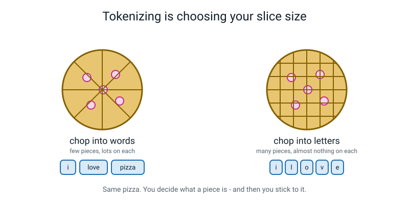
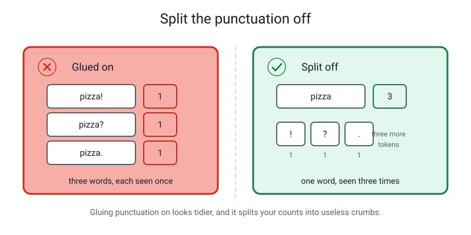
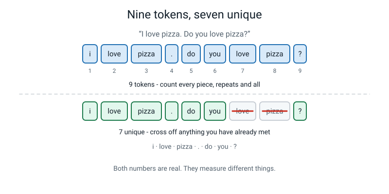
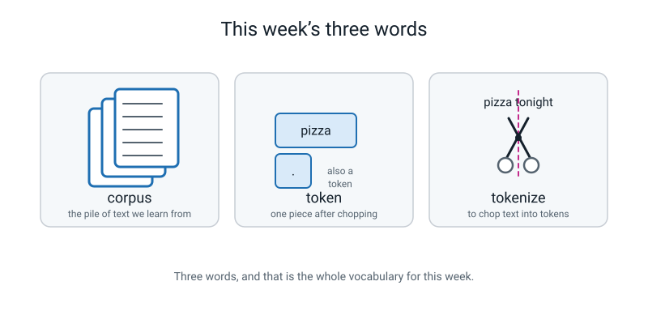

# Week 27 — Term 3 Checkpoint: From Pixels to Words

[⬅ Week 26](week-26.md) · [Course Home](../README.md) · [Week 28 ➡](week-28.md) · [Workbook](../workbook/week-27.md)

---

> ### This week in one sentence
> **Everything a machine handles — a photo, a message, a week of your life — first becomes numbers in a table, and text is no different.**
>
> **By the end of this chapter you will be able to:**
> - Recall and use the Term 3 words without notes — **test set, accuracy, confusion matrix, pixel, filter**
> - **Tokenize** a sentence by hand and justify every decision about punctuation, capitals and contractions
> - Count **tokens** and **unique tokens** separately, and explain why the two numbers differ
> - Explain in one sentence why text and images are the same kind of problem to a machine
>
> **Reading time:** about 20 minutes. **Homework:** about 50 minutes.

---

## 🪝 Start Here

Notes away. Pencil down. Five words, and you say what each one means — not out of a book, just however you say it.

**Test set.** … **Accuracy.** … **Confusion matrix.** … **Pixel.** … **Filter.**

That is Term 3. Eight weeks, five words. And you just did all five without looking anything up — which is worth stopping on, because in Week 19 you had never heard three of them.


*Figure 27.1 — The eight weeks of Term 3 in the order they were taught. Every single box is something you can now do with a pencil.*

Today has two halves, and they are not related in the way you'd expect.

**First half: a checkpoint.** Sixteen questions. It is **not for marks.** It does not go anywhere and nobody sees it. Its one job is to produce a short list of **week numbers to go back to** — so that next week ten minutes gets spent on the thing you missed instead of an hour on things you already know.

**Second half: the term turns a corner.** You have spent six weeks turning pictures into numbers. Today you do the same thing to a **sentence** — and find out that a machine cannot tell the difference between the two.

---

## 🧠 The Big Idea

### 1. Text is data, so it has to be chopped before it can be counted

Way back in Week 4 you learned the rule that everything since has obeyed: a machine cannot handle "a school day" or "a dog". It can only handle **rows and columns of numbers**.

In Weeks 23 to 26 you watched that move applied to a photograph. Chop it into pixels. Each pixel is a number.

Today, same move, different thing. And the pieces need names.

> **Corpus** — the pile of text you are learning from. It just means "a body of text": a book, a chat history, one paragraph. (The plural is *corpora*, if you ever need it.)

> **Token** — one piece of text after chopping. Usually a word, but a punctuation mark counts as a token too.

> **Tokenize** — to chop text into tokens.

Three words. That is the entire vocabulary for today.

**🍕 The analogy, and it is a genuinely good one: cutting a pizza.** The pizza is exactly the same pizza either way. But *how you slice it* decides what a "piece" is. Eight big wedges: few pieces, lots on each. Forty little squares: plenty of pieces, almost nothing on each.


*Figure 27.2 — Same pizza, two slicings. Chop into words and each piece tells you a lot. Chop into single letters and each piece tells you almost nothing.*

There is **no correct slice size.** Only a choice you make on purpose and then stick to.

**The concrete version.** Take this sentence:

```
   I don't want pizza tonight.
```

Chop it into pieces. And immediately you have a problem, because nobody told you what a piece **is**:

- Is `don't` one piece, or two?
- Is the full stop a piece at all?
- Is `I` the same word as `i`?

These are real questions. Real computer scientists disagree about them, today, for money.

### 2. Write the rules down first — that is the entire skill

Here is the thing that looks like boring admin and absolutely is not.

> ### **A tokenizer is not clever. It is *consistent*.**

It follows the same written rule every single time, even when the rule gives a slightly silly answer. Writing the rules down **before** you start chopping is not bureaucracy — it is the whole job.

These are the six rules we use in this course:

```
   R1  lowercase everything
   R2  . , ! ?  are each their own token
   R3  contractions stay whole                        don't    isn't
   R4  a dot between two DIGITS stays in the number   3.14      (R4 beats R2)
   R5  hyphenated words stay whole                    AI-powered
   R6  an emoji is its own token
```

**Notice that R2 and R4 disagree on purpose.** R2 says dots are their own token. R4 says *not this dot*. Real tokenizers are full of exceptions exactly like this, and the rules are numbered so that when two of them collide you can say which one wins.


*Figure 27.3 — The four hard cases, with the decision we make and the reason for it. Every one of these could honestly have gone the other way.*

**And here is what each rule costs you.** No rule is free:

| Rule | What you gain | What you pay |
|---|---|---|
| **R1 — lowercase** | `Pizza` and `pizza` count as one word instead of two words with a count of 1 each | `Apple` the company and `apple` the fruit become identical. So do `Polish` and `polish`, and `May` and `may` |
| **R2 — split punctuation** | `pizza` stays one word instead of splitting into `pizza.`, `pizza!` and `pizza?` | Your token count goes up, and you now have `.` cluttering the top of your frequency table |
| **R3 — contractions whole** | `don't` stays one recognisable word | You lose the fact that `n't` means *not*, which some real systems keep on purpose |
| **R4 — dots inside numbers** | `3.14` stays a number | You need a much fussier rule, and someone has to write it precisely |
| **R5 — hyphens whole** | `pizza-oven` stays one thing | `pizza-oven` and `pizza oven` become two totally different tokens |
| **R6 — emoji are tokens** | 🍕 gets counted, because it means something | Nothing much. This one is nearly free |

> **🧑‍🏫 If someone asks you "but which way is correct?"** — the honest answer is *"whichever I wrote at the top of my page, applied to every sentence."* There is no authority to appeal to. The thing that is genuinely **wrong** is being inconsistent: chopping `don't` as one token in sentence A and two in sentence C.

### 3. Punctuation gets its own token, and here is why

This one deserves its own section because the reason is not obvious.

If you glue the punctuation on, then `pizza!` and `pizza?` and `pizza.` are three completely different words as far as the machine is concerned — each with its own separate count of 1.


*Figure 27.4 — Glue it on and you get three words seen once each. Split it off and you get one word seen three times, plus three punctuation tokens.*

Splitting punctuation off buys you two things:

1. **`pizza` stays one word with a count of 3.** Counts are the whole point. A word split three ways has a count of 1 three times over, and a count of 1 tells you nothing.
2. **`.` becomes a token that means "a sentence ended here."** That sounds like a footnote. It is not — next week you will need to know where sentences stop, and the `.` tokens are exactly how you will know.

> **⚠️ Watch out:** gluing punctuation on gives you **fewer** tokens *and* fewer unique tokens, which feels tidier. It is worse. `tonight.` and `great!` are pieces that will almost never appear in that exact form again, so their counts are stuck at 1 forever. Fewer pieces, and less useful ones.

### 4. Tokens and unique tokens are two different counts

Students merge these constantly, so read the two definitions side by side:

- **Token count** = how many pieces you produced. Count every piece, **including repeats**.
- **Unique token count** = how many *different* pieces there are. Count each distinct piece **once**.

```
   "I love pizza. Do you love pizza?"

   tokens:   i / love / pizza / . / do / you / love / pizza / ?    =  9 tokens
   unique:   i, love, pizza, ., do, you, ?                         =  7 unique
```

Nine tokens, seven unique, because `love` and `pizza` each turned up twice.


*Figure 27.5 — The same nine pieces twice. Underneath, the two we had already met are crossed off, leaving seven.*

**Why does the difference matter?** Because the two numbers measure genuinely different things:

| The number | What it tells you |
|---|---|
| **Token count** | How much **evidence** you have |
| **Unique token count** | How many **rows** your table needs |

Next week you build a table with one row per *unique* token, and fill it in using *all* the tokens. So both numbers are real, and neither one replaces the other.

**One rule of thumb worth carrying around:** in normal English, the more text you collect, the **bigger the gap between these two numbers gets.** A sentence might be 9 tokens and 7 unique. A whole book might be 80,000 tokens and 6,000 unique — because after a while you stop meeting new words and just keep meeting `the` again.

### 5. A photo and a sentence are the same problem, in different shapes

This is the line the whole term has been building towards, and it deserves to be read slowly:

> ### **A photo becomes a grid of numbers. A sentence becomes a strip of numbers. To a machine they are the same kind of problem, in a different shape.**


*Figure 27.6 — Left: 25 pixels, each a number. Right: 4 tokens, each a number. The machine does not know which one of these is a picture.*

And once a thing is numbers in a table, **everything** you learned in Terms 1 and 2 applies again with no modification at all:

| What you already know how to do | Does it work on text? |
|---|---|
| Count it and tally it | Yes |
| Hide a test set from it | Yes |
| Measure accuracy on it, three ways | Yes |
| Build a confusion matrix for it | Yes |
| Get fooled by a background in it | Yes — and next term you will see exactly how |

Nothing new is needed. That is why this course is arranged the way it is.

---

## 🔍 Worked Examples

### Worked Example 1 — Two sentences about pizza (food)

```
   I love pizza. Do you love pizza?
```

**Step 1 — apply the rules, one at a time, and name the rule each time.**

| Piece | Rule that produced it |
|---|---|
| `i` | R1 lowercased the capital `I` |
| `love` | nothing needed |
| `pizza` | nothing needed |
| `.` | R2 split it off |
| `do` | R1 lowercased `Do` |
| `you` | nothing needed |
| `love` | second time |
| `pizza` | second time |
| `?` | R2 split it off |

**Step 2 — count the tokens.** Count every single piece:

```
   i / love / pizza / . / do / you / love / pizza / ?        =  9 tokens
```

**Step 3 — count the unique tokens.** Go through the list and cross off anything you have already met:

```
   i            keep
   love         keep
   pizza        keep
   .            keep
   do           keep
   you          keep
   love         CROSS OFF - already met
   pizza        CROSS OFF - already met
   ?            keep
                                        9 - 2  =  7 unique
```

**Step 4 — build the frequency table.** Most common first:

| Token | Count |
|---|---:|
| love | 2 |
| pizza | 2 |
| i | 1 |
| . | 1 |
| do | 1 |
| you | 1 |
| ? | 1 |

Check the arithmetic: 2 + 2 + 1 + 1 + 1 + 1 + 1 = **9**. ✓ And the table has **7** rows. ✓

Those two checks are worth doing every single time. If the counts do not add up to your token total, you have lost a piece somewhere.

### Worked Example 2 — Cricket commentary (sport)

```
   His strike rate was 141.5, wasn't it? His best!
```

Four traps in one line: a decimal point, a comma, a contraction, and a repeated word.

**Step 1 — chop it, naming the rule for every decision.**

| Piece | Rule | Why not something else |
|---|---|---|
| `his` | R1 | `His` → `his` |
| `strike` | — | |
| `rate` | — | |
| `was` | — | |
| `141.5` | **R4** | R2 wants to split that dot off. R4 beats R2 because there is a digit on **both** sides of it. Split it and you get `141` / `.` / `5`, which is not a number any more |
| `,` | R2 | |
| `wasn't` | R3 | Some real systems would split this into `was` + `n't`. Ours does not, because we wrote R3 down |
| `it` | — | |
| `?` | R2 | |
| `his` | R1 | Second time — and note that because of R1 this is the **same token** as the first `his`, even though one was capitalised |
| `best` | — | |
| `!` | R2 | |

**Step 2 — the two counts.**

```
   TOKENS   his / strike / rate / was / 141.5 / , / wasn't / it / ? / his / best / !     =  12

   UNIQUE   his appears twice  ->  one repeat
                                                            12 - 1  =  11 unique
```

**Step 3 — the frequency table.**

| Token | Count |
|---|---:|
| his | 2 |
| strike, rate, was, 141.5, `,` , wasn't, it, ?, best, ! | 1 each (10 tokens) |

Check: 2 + 10 = **12** tokens ✓ and 1 + 10 = **11** rows ✓

**Step 4 — the interesting bit.** Notice that R1 is what *earned* you the repeat. Without R1, `His` and `his` would be two separate tokens with a count of 1 each, and you would have 12 unique tokens instead of 11. **Rule 1 is doing real work** — and in a longer text it does an enormous amount, because a very common word appears capitalised at the start of every sentence.

### Worked Example 3 — When the rules run out (school)

```
   Don't forget: bring a pen, a ruler and your book!
```

**Step 1 — start chopping and hit the wall.**

`don't` — fine, R3. `forget` — fine. Then:

**`:`** … and our rules do not cover a colon. R2 lists exactly four marks: `.` `,` `!` `?` A colon is not one of them.

**What do you do?** You do **not** guess, and you do not quietly do whatever feels right. You **write a new rule down** and then you obey it everywhere:

```
   R7  :  and  ;  are each their own token   (same as R2)
```

That is not cheating. That is exactly what a real tokenizer team does — every one of them has a long list of grubby special cases that got added the first time somebody found a character the rules did not cover.

**Step 2 — now chop it properly.**

```
   don't / forget / : / bring / a / pen / , / a / ruler / and / your / book / !     =  13 tokens
```

**Step 3 — the unique count.**

```
   don't, forget, :, bring, a, pen, ",", ruler, and, your, book, !

   `a` appears twice (a pen, a ruler)  ->  one repeat

                                            13 - 1  =  12 unique
```

**Step 4 — now do it again with the punctuation glued on**, so you can see what the choice costs:

```
   don't / forget: / bring / a / pen, / a / ruler / and / your / book!      =  10 tokens

   unique:  don't, forget:, bring, a, pen,, ruler, and, your, book!   ->   9 unique
```

| Rule set | Tokens | Unique |
|---|---:|---:|
| Split punctuation off (R2 + R7) | **13** | **12** |
| Glue punctuation on | **10** | **9** |

Fewer pieces. And look what happened to them: `forget:`, `pen,` and `book!` are now three words that will very likely **never appear in that exact form again** in anything you ever read. Their counts are frozen at 1 for life. Meanwhile you have destroyed the `.`-and-`,` tokens that would have told you where the clauses stopped.

**Neither answer is wrong. One of them is far more useful.** And the only thing that would be genuinely wrong is doing it one way on this sentence and the other way on the next one.

---

## 🎲 What We Did In Class

### Part 1 — The Term 3 checkpoint (18 minutes)

Sixteen short questions, about ten minutes, then marked together out loud. Every question had its **week number** printed beside it, and every wrong answer put that week number onto a sheet in the middle of the table headed **"Weeks to go back to."**

That sheet is the entire output of the exercise. A checkpoint that produces a score and nothing else has wasted an hour. A checkpoint that produces a short list of week numbers has done its job.

Here is what the sixteen questions covered, so you can revise from it:

| Week | Title | The one thing it was for |
|---|---|---|
| **19** | The Test You Can't Study For | Hide some examples *before* training; look at them once, at the end |
| **20** | Accuracy, Three Ways | Fraction, decimal, percentage — and the **baseline** that stops the number lying |
| **21** | Memorizing vs Generalizing | 100% in training and 55% in the test means it learned the photos, not the object |
| **22** | The Hidden Ten | Test your own model honestly and build the **confusion matrix** by hand |
| **23** | A Photo Is Just a Grid of Numbers | A **pixel** is one number: 0 is black, 255 is white |
| **24** | Colour Is Three Grids Stacked | Red, green and blue grids — three numbers per pixel, so 12 × 12 × 3 = 432 |
| **25** | Filters | Slide a 3×3 grid, multiply nine pairs, add, take the absolute value, clip at 255 |
| **26** | Pixel Lab | Edges survive a lighting change; raw brightness does not |


*Figure 27.7 — What to do with the score. A low score is a list of week numbers, not a verdict on you.*

| Score | What it means | What happens next |
|---|---|---|
| **14–16** | Flying | Do the harder homework option. Straight on to Week 28 |
| **11–13** | Solid — this is the normal, healthy result | Reread the one or two weeks on the sheet. Ten minutes each |
| **8–10** | Two ideas did not land | Reteach **two** specific ideas, not the whole term |
| **0–7** | Something structural is missing | Redo the Week 20 and Week 25 worked examples properly before Week 28 |

> **💡 Try this:** if you scored below 11, the single most useful thing you can do is *not* reread everything. Take the two week numbers off the sheet and redo the worked examples from just those two chapters. Two hours of the right thing beats eight hours of the wrong thing.

### Part 2 — Chop the Sentence (34 minutes)

Four sentences, chosen so that each one breaks a rule you had just written. **The rules box gets filled in first, before a single sentence is touched.** If you chop first and make up rules afterwards, you have done a different and much less useful exercise.

Draw the cut marks first, as dashed vertical lines. Then draw the numbered token boxes underneath.


*Figure 27.8 — The finished board for sentence 1. Cut marks on top, numbered token boxes underneath. Six tokens.*

**Sentence 1 — `I don't want pizza tonight.`**

```
   i / don't / want / pizza / tonight / .                        6 tokens
```
R1 lowercased the `I`. R3 kept `don't` whole. R2 made the full stop its own token.

**Sentence 2 — `Pi is about 3.14, isn't it?`**

```
   pi / is / about / 3.14 / , / isn't / it / ?                    8 tokens
```
This is the one everybody gets wrong first time. **R4 keeps `3.14` whole.** R2 splits off the comma *and* the question mark. R3 keeps `isn't` whole.

Common wrong answers: **7** (comma forgotten), **10** (`3.14` split into three), **9** (`isn't` split).

**Sentence 3 — `My AI-powered pizza-oven is great!`**

```
   my / ai-powered / pizza-oven / is / great / !                  6 tokens
```
R1 lowercases `My` and `AI`. R5 keeps both hyphenated words whole. R2 splits the `!`.

> **🧑‍🏫 If you noticed that `AI` losing its capitals is a real loss** — you are right, and well spotted. `AI` is a name, and the capitals carried information. That is precisely the trade in the R1 row of the table above. We pay it on purpose.

**Sentence 4 — `Pizza 🍕 again? Yes!`**

```
   pizza / 🍕 / again / ? / yes / !                                6 tokens
```
R1 on `Pizza` and `Yes`. R6 makes the emoji its own token. R2 splits `?` and `!`.

### The two counts, across all four

```
   TOKENS PER SENTENCE
   1.  i don't want pizza tonight .                       6
   2.  pi is about 3.14 , isn't it ?                       8
   3.  my ai-powered pizza-oven is great !                 6
   4.  pizza 🍕 again ? yes !                              6
                                                        ────
                                              TOTAL      26

   UNIQUE:  go through the whole list and cross off repeats
            is     (sentences 2 and 3)
            pizza  (sentences 1 and 4)
            ?      (sentences 2 and 4)
            !      (sentences 3 and 4)

            4 repeats   ->   26 - 4  =  22 UNIQUE
```

The full list of 22, in order of first appearance:

```
   i, don't, want, pizza, tonight, .,
   pi, is, about, 3.14, ",", isn't, it, ?,
   my, ai-powered, pizza-oven, great, !,
   🍕, again, yes
```

Count them: 6 + 8 + 5 + 3 = **22.** ✓

**Do the crossing-off yourself, by hand.** Do not just accept the number 22. That crossing-off is the moment "unique" stops being a word and turns into something you did.

---

## 💬 Talk About It

**1. "Corpus, token, tokenize. Give me each one in under ten words."**

*Hint for you:* corpus = the text we're learning from. Token = one piece after chopping. Tokenize = to chop text into tokens. If somebody says "a token is a word", ask the follow-up: *is a full stop a token?* If they say yes, they are fine and the definition was just loose.

**2. "`pizza pizza pizza`. How many tokens? How many unique tokens?"**

*Hint for you:* three tokens, one unique. Instantly, with no hesitation. If it takes anybody more than a second, write the three words on paper and physically cross two of them out: *three pieces, one different piece.* Then try `dog dog cat` — three tokens, two unique.

**3. "Why are a photo and a sentence the same kind of problem to a machine?"**

*Hint for you:* a good answer names **both** halves and where they end up: a photo turns into a grid of numbers, a sentence turns into a strip of numbers, and a machine only ever works on numbers in a table. Half an answer — only pixels, or only tokens — gets one follow-up: *"and the other half?"* Do not let this one go with half, because next week is built directly on top of it.

---

## ⚠️ Don't Get Tricked

### Trick 1 — "There's a right answer for how to chop"

| ❌ Wrong | ✅ Right |
|---|---|
| "`don't` must be one token — that's just how it is." | "It is one token **because I wrote R3 down**. Some real systems split it into `do` + `n't`, and they are not wrong either." |

The thing that is genuinely wrong is being **inconsistent**: `don't` as one token in sentence 1 and two in sentence 4. If you ever change your mind mid-way, you have to go back and redo everything, because your counts are now meaningless.

### Trick 2 — "A token is a word"

| ❌ Wrong | ✅ Right |
|---|---|
| "Tokens are the words. Punctuation isn't a token because it isn't a word." | "A full stop is a token. An emoji is a token. **Being a word was never the requirement — carrying meaning is.**" |

And here is the part that surprises people: real chatbots do not slice into words at all. They slice into **sub-word pieces**, so `unbelievable` might become `un` + `believ` + `able`. Why bother? Because a fixed list of about 50,000 pieces can then spell **any** word ever written — including names, made-up words and typos — without needing an entry for each one. If you tokenized by whole words, the first name it had never met would break it.

### Trick 3 — "Glue the punctuation on, it's tidier"


*Figure 27.9 — The two-panel test. Left: three different words each seen once. Right: one word seen three times.*

| ❌ Wrong | ✅ Right |
|---|---|
| "Gluing it on gives me fewer tokens, so it's simpler and better." | "It gives me fewer tokens **and worse ones**. `pizza.` and `pizza!` will never turn up again in that exact form, so their counts are stuck at 1 forever." |

Fewer is not the goal. **Useful** is the goal.

### Trick 4 — "26 tokens means 26 unique tokens"

| ❌ Wrong | ✅ Right |
|---|---|
| "There were 26 tokens, so there are 26 different words." | "26 tokens, **22 unique**. Four pieces turned up twice, so they get counted twice in one number and once in the other." |

The instant cure, and it takes three seconds: `pizza pizza pizza`. **Three tokens, one unique.** If you can say that without pausing, you have this.

---

## 🌍 Where You've Seen This

1. **The word count at the bottom of a document.** That is a tokenizer, and somebody had to decide whether `pizza-oven` is one word or two. Different programs give you different numbers for the same document, and now you know exactly why.
2. **Searching for a word on a web page.** Search for `pizza` and it finds `Pizza` too. Somebody applied R1 before comparing.
3. **A word cloud.** The biggest word in the middle is almost always something like `the`, unless whoever made it deliberately threw the common words away first. That is a frequency table with the boring rows deleted.
4. **Your phone's predictive keyboard.** It is working on tokens right now, this second — which is exactly next week's lesson.
5. **A spam filter.** It chops your message into tokens and counts them. `FREE!!!` and `free` being the same token, or not, is a real decision somebody made.
6. **Autocorrect getting a name wrong.** Names are the classic tokenizing headache: they are not in any word list, so a whole-word system has never met them. Sub-word pieces are one fix that some modern systems use for exactly this.

---

## 🧭 Where This Fits

A brand-new box lights up on the map this week, and look where it is: on the **right-hand** branch,
one row underneath PIXELS. The course has not changed subject. It has taken the move you already know
— chop it up, count it — and pointed it at words instead of photographs.


*Figure 27.0 — The map in Week 27. WORDS is the newly shaded box, sitting directly below PIXELS, and
the two lit threads along the bottom are **data** and **representation** — the same pair that lit up
the first time you turned a picture into numbers.*

| | |
|---|---|
| **The mental model you now own** | A machine cannot handle "a sentence" any more than it can handle "a dog". Both have to become **numbers in a table** first. A **tokenizer** is the thing that chops text into pieces and counts them: a photo becomes a **grid** of numbers, a sentence becomes a **strip** of them. |
| **The one question it answers** | *"How many tokens, and how many different tokens?"* — two numbers, never one. |
| **What it plugs into** | Week 23's pixel grid and Week 4's table. Chopping a photo into squares and chopping a sentence into tokens are **the same move on new material**, which is exactly why everything you built in Terms 1 and 2 still applies to words. |
| **What carries forward** | Those counts are the raw material of next week's next-word table, and they turn up again as the tally sheet you score in Week 30. |
| **Spiral thread** | 📊 **Data** — the tokens are the stuff going in — and 🏷️ **Representation** — because *how* you chop is a decision you made, and a different decision gives different numbers. |

> **💡 Try this:** on your own copy of the map, draw one arrow from PIXELS down to WORDS and write four
> words on it: **same door, new material**. That arrow is the whole reason this term holds together.

---

## 🔑 Remember This

- **A machine cannot handle "a sentence" any more than it can handle "a dog".** It needs numbers in a table. So the very first thing anybody does with text — before any of the impressive stuff — is chop it into pieces and count them.
- **A tokenizer is not clever, it is consistent.** Write the rules down first, and then obey them even when you don't like the answer.
- **Punctuation is a token.** So is an emoji. Being a word was never the requirement — carrying meaning is.
- **Tokens and unique tokens are two different numbers.** Tokens tell you how much evidence you have. Unique tokens tell you how many rows your table needs.
- **The gap between them grows with the size of the corpus**, because new words run out and `the` never does.
- **A photo becomes a grid of numbers; a sentence becomes a strip of numbers.** Same problem, different shape — which is why everything from Terms 1 and 2 still applies.

---

## 📓 New Words


*Figure 27.10 — This week's three words, drawn.*

| Word | What it means | Example |
|---|---|---|
| **corpus** | The pile of text you are learning from — a body of text | The 60-word paragraph you chose out of your own book |
| **token** | One piece of text after chopping. Usually a word, but punctuation and emoji count too | `pizza` is a token. So is `.` and so is 🍕 |
| **tokenize** | To chop text into tokens, following written rules | `I don't want pizza tonight.` → 6 tokens |

---

## 📤 Your Homework

Go to **[the Week 27 workbook](../workbook/week-27.md)**. About **50 minutes** in total, and none of it needs a screen.

| Page | What to do | Time |
|---|---|---|
| **27.1** | Warm-up, then Practice Sets A and B — the Term 3 words, then tokenizing new sentences | 15 min |
| **27.2** | **Term 3 reflection sheet.** Three boxes. In each one, write **one thing you can do now that you could not do in Week 19.** Copy the "weeks to go back to" list over as well | 8 min |
| **27.3** | **Tokenize your paragraph.** Take the ~60-word paragraph you flagged in your book. Write your rules at the **top** of the page first. Then chop the whole thing and number every token | 20 min |
| **27.4** | The **frequency table**, the total tokens, the unique tokens, the puzzle, and two written questions | 17 min |

> **⚠️ Watch out:** on page 27.2, "I learned about pixels" is **not** an answer. Start every one with the words **"I can"**, and get a number into at least one of them. *"I can work out that a 12×12 image with a 3×3 filter gives a 10×10 output, and say why"* — that is the standard.

**Keep your paragraph.** Next week uses the **same** one, and re-tokenizing from scratch would cost you twenty minutes you would rather spend on the interesting part. Next week you count something new in it: not how often each word turns up, but **which word tends to follow which** — which is the basic idea behind the thing on a phone that finishes your sentences (real phones use bigger, cleverer versions of it).

---

[⬅ Week 26](week-26.md) · [Course Home](../README.md) · [Week 28 ➡](week-28.md) · [📓 Workbook — Week 27](../workbook/week-27.md) · [Glossary](../../glossary.md)
