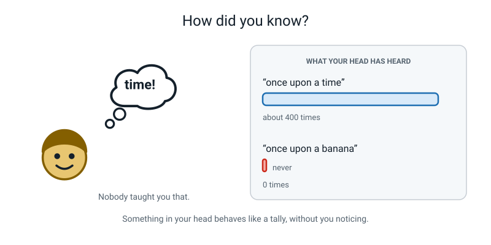
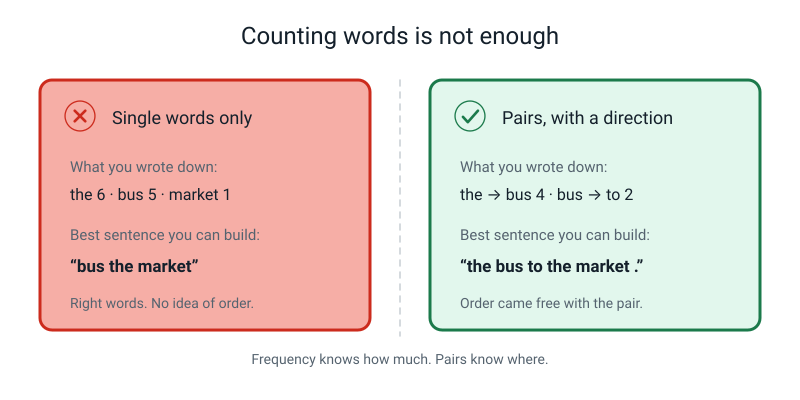
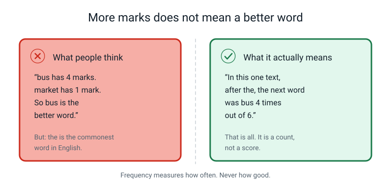
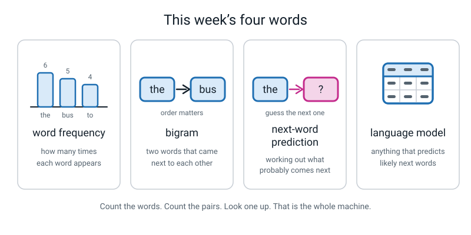

# Week 28 — Counting Word Pairs: The Whole Engine

[⬅ Week 27](week-27.md) · [Course Home](../README.md) · [Week 29 ➡](week-29.md) · [Workbook](../workbook/week-28.md)

---

> ### This week in one sentence
> **A language model is a giant tally of which word tends to follow which — and that is the whole engine, not a simplified version of it.**
>
> **By the end of this chapter you will be able to:**
> - Tally every **bigram** in a short text without missing one or counting one twice
> - Build a **next-word table** showing, for each word, what followed it and how often
> - Read that table to answer questions about what the machine will probably say
> - Explain exactly what your phone is doing when it offers you three words above the keyboard
>
> **Reading time:** about 20 minutes. **Homework:** about 50–60 minutes.

---

## 🪝 Start Here

I am going to start a sentence and stop in the middle. Don't think. Just say the next word out loud.

> *Once upon a…*

You said **time**.

Everybody says time. I have never once had a person say "banana".

Now the awkward question, and I want you to be honest about it: **how did you know?**

You did not understand my sentence, because I had not finished it. You did not know what I meant, because I had not said it yet. There was nothing to understand. And yet the word arrived in your head instantly, without effort, before you had decided to look for it.


*Figure 28.1 — You have heard "once upon a time" maybe four hundred times in your life. You have heard "once upon a banana" exactly never.*

Here is my best guess at what happened.

You have heard **once upon a time** hundreds of times. You have heard **once upon a banana** zero times. So when I stopped, your head did not reason about fairy tales. It reached for the thing that has always come next.

You were not thinking. You were **counting** — using a tally you have been building since you were about two years old, without ever deciding to.

This week we build that tally on paper. Pencil, a ruled sheet, forty words. And by the end of it you will know exactly what your phone is doing when it puts three words above the keyboard. Not roughly. Exactly.

---

## 🧠 The Big Idea

### 1. Counting single words is useful — and it can never write a sentence

Last week you learned to chop text into **tokens** — countable pieces, usually words, with the full stop counting as its own token. Here is our text for this week. In this course a text you learn from has a name:

> **Corpus** — the body of text a machine learns from. (You met this word last week.)

Our corpus, six short sentences:

```
   I take the bus to the market. Amma takes the bus to the shop.
   The bus goes to town. My bus is very late.
   Amma and I run to the bus. I like it.
```

Tokenized — everything lowercased, the full stop its own token — that is exactly **40 tokens**.

Now, the first thing anyone does with a list is count it. Count how many times each word turns up. That has a name:

> **Word frequency** — how many times each word appears in the text.

Here is ours:

| Word | Times it appears |
|---|---:|
| the | 6 |
| . | 6 |
| bus | 5 |
| to | 4 |
| i | 3 |
| amma | 2 |
| *and fourteen more words* | 1 each |

Quick check: 6 + 6 + 5 + 4 + 3 + 2 = 26, and 26 + 14 = **40**. Our frequencies add up to the number of tokens, so nothing got lost. Good.

Now here is the challenge that makes this whole week necessary. **Using only that table — only how often each word appears — write me a sentence.**

Go on. Try it before you read on.

You will get something like `the bus the to bus`. It is rubbish, and it is not your fault.

**🍕 The analogy: the shopping list with no recipe.** Somebody hands you a list: 200g flour, 3 eggs, 100g sugar, 50g butter. Every ingredient for a cake, in exactly the right amounts. Now bake it. You can't — not reliably — because the list tells you **how much of each thing** and says nothing about **what order to do things in**. Frequency is a shopping list. There is no recipe in it.


*Figure 28.2 — Frequency knows how much. Pairs know where.*

### 2. So count pairs — and a pair carries a direction

The fix is beautifully simple. Stop counting single words. Count **pairs**.

> **Bigram** — two tokens that appeared next to each other, in that order.
> ("Bi" means two. "Gram" means a written thing. A bigram is a written two-some.)

`the bus` is a bigram. `bus to` is a bigram. `to the` is a bigram.

And here is the bit that makes pairs work where single words failed. **A pair has a direction.**

| This is a thing | This is not |
|---|---|
| hot dog | dog hot |
| ice cream | cream ice |
| the bus | bus the |
| good morning | morning good |

The order is half the information — and frequency threw it straight in the bin. That is the entire reason we are counting pairs.

**How do you find all the bigrams?** You do not hunt for them. You **walk**.

Put your finger on token 1. Token 1 plus token 2 is a bigram. Slide your finger to token 2. Tokens 2 and 3 are the next bigram. Slide again. You never skip, you never jump, you never go backwards. Left to right, one step at a time, all the way to the end.

**And now the most useful piece of arithmetic in the whole chapter.** How many pairs will you get from 40 tokens? Don't guess — think.

Every token starts exactly one pair: itself, plus whatever comes after it. Every token except one. Which one?

The **last** one. Token 40 has nothing after it, so it starts nothing.

> ### **Number of bigrams = number of tokens − 1**


*Figure 28.3 — Every token except the very last one starts exactly one pair. That gives you something you can check with arithmetic.*

So 2 tokens give 1 pair. 8 tokens give 7 pairs. 40 tokens give **39** pairs. 200 tokens give 199.

Write that number down **before** you start tallying. A prediction you wrote afterwards is not a prediction — it is an excuse.

> **💡 Try this:** hold up two fingers. Two tokens, one pair. Three fingers — pencil, eraser, ruler on the desk — pencil-eraser, eraser-ruler. Two pairs. Five objects, four pairs. The rule builds itself out of nothing.

### 3. Tallying: one pair, one mark, and full stops are not walls

Now the actual work. Three columns on a sheet:

```
   CURRENT          NEXT             TALLY
   ───────          ────             ─────
```

**CURRENT** is where you are. **NEXT** is where you went. Never write a pair without both headings in front of you, or you will get the direction backwards and never notice.

Then six rules, and they matter more than they look:

1. **Start at token 1.** Not wherever looks easiest.
2. **One pair, one mark.** Never two marks at once. Never a mark "for later".
3. **Never skip a full stop.** The `.` is a token like any other.
4. **Never jump backwards.** If you lose your place, go back to the last token number you are certain of.
5. **Same pair, same row.** If `the → bus` already has a row, add a mark to it.
6. **Different next word, different row** — even when the current word is the same.


*Figure 28.4 — Mid-tally. The pointer shows the pair being counted right now, and the arrow shows which row gets the mark.*

**The mistake almost everybody makes, including adults.** Look at the middle of our corpus:

```
   ... token 15  shop     token 16  .     token 17  the     token 18  bus ...
```

There are three pairs hiding in there: `shop → .`, then **`. → the`**, then `the → bus`.

Most people count the first and the third and jump clean over the second. Your eyes have been trained since you were five to *stop* at a full stop. It looks like a wall.

It is not a wall. It is a token.

> **⚠️ Watch out:** in our corpus there are **five** pairs that cross a full stop — at tokens 8→9, 16→17, 22→23, 28→29 and 36→37. If your total comes to 34 instead of 39, you skipped exactly those five. Go and find them.

**Why are we allowed to let pairs cross a full stop?** Because we decided to, and we wrote the decision down, and we followed it every time. Some textbooks stop pairs at the end of a sentence instead. Both are honest. Ours has two advantages: the arithmetic check stays simple (tokens − 1, no exceptions), and the `.` row of the table becomes genuinely interesting — its followers are exactly the words that **start sentences**. That is real information the other method throws away.

### 4. The next-word table, and two checks that keep you honest

A raw pile of tally marks is not usable yet. Sort it. Group it by the **first** word of each pair. Then you get the object this whole chapter is about.


*Figure 28.5 — The finished next-word table for our 40-token corpus, with both checks written beside it.*

Read one group slowly, because if you can read one group you can read any language model ever built:

```
   CURRENT   NEXT      COUNT   OUT OF
   the       bus         4       6
             market      1       6
             shop        1       6
```

In plain English: *"In this text, the word `the` was followed by something six times. Four of those times the next word was `bus`. Once it was `market`. Once it was `shop`."*

That is it. That is the whole data structure. Here is the complete table for our corpus:

| CURRENT | NEXT | COUNT | OUT OF |
|---|---|---:|---:|
| **the** | bus | 4 | 6 |
| | market | 1 | 6 |
| | shop | 1 | 6 |
| **.** | amma | 2 | 5 |
| | the | 1 | 5 |
| | my | 1 | 5 |
| | i | 1 | 5 |
| **bus** | to | 2 | 5 |
| | goes | 1 | 5 |
| | is | 1 | 5 |
| | . | 1 | 5 |
| **to** | the | 3 | 4 |
| | town | 1 | 4 |
| **i** | take | 1 | 3 |
| | run | 1 | 3 |
| | like | 1 | 3 |
| **amma** | takes | 1 | 2 |
| | and | 1 | 2 |
| *and 14 more words* | *one follower each* | 1 | 1 |

**Check 1 — the totals.** Add every count: 6 + 5 + 5 + 4 + 3 + 2 = 25, plus 14 singleton groups = **39**. And 40 − 1 = 39. ✓

**Check 2 — group by group.** This one catches errors that check 1 cannot. For any word, its **OUT OF** number must equal **how many times that word appears in the corpus**.

- `bus` appears 5 times → the `bus` group must have 5 marks. It has 2 + 1 + 1 + 1 = 5. ✓
- `the` appears 6 times → 4 + 1 + 1 = 6. ✓
- `to` appears 4 times → 3 + 1 = 4. ✓

> **🧑‍🏫 If you spot this, you have understood something real:** `.` appears **6** times, but its group has only **5** marks. Is that an error? No. One of those six full stops is token 40 — the very last thing in the corpus — and nothing followed it. So it contributes no pair. That is the same reason the answer is tokens *minus one*.

**Why two checks and not one?** Because a check that passes does not prove you are right. It proves you did not fail *that particular check*.

Suppose you wrote a pair **backwards** — you meant `to → the` and you wrote `the → to`. How many marks are on the sheet? Still 39. One mark went down either way. Check 1 is completely blind to direction.

Check 2 catches it, because one group ends up one mark too big and another one mark too small. Run both, and your table is almost certainly right. Run neither and it is almost certainly wrong.

### 5. Now read the table forwards — and that is a model

> **Next-word prediction** — given the words so far, working out which word probably comes next.
> **Language model** — any system that predicts likely next words.

Look at the table again and notice that you can **use** it.

You are at the word `the`. Look up the `the` group. Four times out of six, `bus` came next. So the best single guess is `bus`. Say `bus`. Now you are at `bus` — look up the `bus` group. Guess again.

Guess a word, add it to the text, guess again. That loop is the engine. Not a picture of the engine. **The engine.**

**And here is the sentence I want you to say out loud, because it sounds ridiculous and it is completely true: the sheet of paper in front of you is a language model.**

Back in Week 2 we agreed on what a model is: something that was built by looking at examples, and then makes guesses about new cases. Your tally sheet qualifies on both counts.

| The Week 2 test | Your tally sheet |
|---|---|
| Was it built by looking at examples? | Yes. You counted 39 real pairs. Nobody wrote its rules. |
| Does it make guesses about things it has not seen? | Yes. Give it any word and it will tell you what probably comes next. |

It is tiny, it is made of pencil marks, and it works. A chatbot is the same idea with more counting.

### 6. Your phone keyboard, explained for good

This is the bit that lands.


*Figure 28.6 — The three keys above the keyboard are the top three rows of a next-word table, sorted by count.*

Type `I am going to the` on any phone and three suggestions appear. Here is the whole of what happened, in five steps:

1. Somebody counted word pairs in an **enormous** amount of English text.
2. Your phone holds the resulting next-word table.
3. It looked up the group for the current word, `the`.
4. It sorted that group by count, biggest first.
5. It printed the **top three** onto three keys.

**No understanding. No meaning. No plan for the sentence.** A tally, sorted, top three shown.

The reason `shop` and `bus` and `park` come up after `the` is not that your phone knows anything about shops. It is that in the text somebody counted, `the shop` happened 812 times and `the aardvark` happened never.

Two extra details, because you will notice both within about ten seconds of trying it:

- **Your keyboard also counts *your* messages.** That is why your best friend's name, your street and your family's private nicknames start appearing. Your own typing is a second, smaller tally mixed into the big one. (That is also a privacy question, and Week 32 handles it properly.)
- **Tapping the middle suggestion over and over nearly always ends up going round in a circle.** Something like *"…and I will be there in a bit and I will be there in a bit and…"*. That is not a bug. Next week you will prove exactly why it happens. For now, just notice it and write it down.

---

## 🔍 Worked Examples

Three complete tallies, start to finish, with every number shown. Cover the answers and do each one yourself first — they are short on purpose.

### Worked Example 1 — Two pizzas (food)

**The corpus:**

```
   I like hot pizza. I like cold pizza.
```

**Step 1 — tokenize and number.** Lowercase everything, full stop is its own token.

```
   1  i        6  i
   2  like     7  like
   3  hot      8  cold
   4  pizza    9  pizza
   5  .       10  .
```

**10 tokens.**

**Step 2 — predict, before doing any work.** 10 − 1 = **9 pairs**.

**Step 3 — walk and mark.** Every step, in order:

| # | Pair | # | Pair |
|---:|---|---:|---|
| 1 | i → like | 6 | i → like |
| 2 | like → hot | 7 | like → cold |
| 3 | hot → pizza | 8 | cold → pizza |
| 4 | pizza → . | 9 | pizza → . |
| 5 | . → i | | |

Notice pair 5. Token 5 is a full stop and token 6 is `i`. That is a pair. Do not jump it.

**Step 4 — group it into a next-word table.**

| CURRENT | NEXT | COUNT | OUT OF |
|---|---|---:|---:|
| **i** | like | 2 | 2 |
| **like** | hot | 1 | 2 |
| | cold | 1 | 2 |
| **hot** | pizza | 1 | 1 |
| **cold** | pizza | 1 | 1 |
| **pizza** | . | 2 | 2 |
| **.** | i | 1 | 1 |

**Step 5 — both checks.**

- **Check 1:** 2 + 2 + 1 + 1 + 2 + 1 = **9**. And 10 − 1 = 9. ✓
- **Check 2:** `i` appears 2 times, 2 marks ✓ · `like` 2 and 2 ✓ · `pizza` 2 and 2 ✓ · `hot` 1 and 1 ✓ · `cold` 1 and 1 ✓ · `.` appears **2** times but token 10 is the last token, so 1 mark is correct ✓

**Now read it.** What comes after `i`? Always `like` — 2 out of 2. A phone would suggest it with total confidence. What comes after `like`? A dead tie: `hot` 1, `cold` 1. **The honest answer is that this table does not know.** That is a real and useful result — sometimes "I don't know" *is* what the counts say.

### Worked Example 2 — A cricket over (sport)

**The corpus:**

```
   The bowler runs in. The bowler bowls. The batter hits the ball.
```

**Step 1 — tokenize.**

```
   1  the       6  the       11  batter
   2  bowler    7  bowler    12  hits
   3  runs      8  bowls     13  the
   4  in        9  .         14  ball
   5  .        10  the       15  .
```

**15 tokens.**

**Step 2 — predict.** 15 − 1 = **14 pairs**.

**Step 3 — walk and mark.**

| # | Pair | # | Pair |
|---:|---|---:|---|
| 1 | the → bowler | 8 | bowls → . |
| 2 | bowler → runs | 9 | . → the |
| 3 | runs → in | 10 | the → batter |
| 4 | in → . | 11 | batter → hits |
| 5 | . → the | 12 | hits → the |
| 6 | the → bowler | 13 | the → ball |
| 7 | bowler → bowls | 14 | ball → . |

Pairs 5 and 9 are the two that cross a full stop. They are the two people miss.

**Step 4 — the table.**

| CURRENT | NEXT | COUNT | OUT OF |
|---|---|---:|---:|
| **the** | bowler | 2 | 4 |
| | batter | 1 | 4 |
| | ball | 1 | 4 |
| **.** | the | 2 | 2 |
| **bowler** | runs | 1 | 2 |
| | bowls | 1 | 2 |
| **runs** | in | 1 | 1 |
| **in** | . | 1 | 1 |
| **bowls** | . | 1 | 1 |
| **batter** | hits | 1 | 1 |
| **hits** | the | 1 | 1 |
| **ball** | . | 1 | 1 |

**Step 5 — both checks.**

- **Check 1:** 4 + 2 + 2 + 1 + 1 + 1 + 1 + 1 + 1 = **14**. And 15 − 1 = 14. ✓
- **Check 2:** `the` appears 4 times, 4 marks ✓ · `bowler` 2 and 2 ✓ · `.` appears **3** times but token 15 is last, so 2 marks ✓ · every other word 1 and 1 ✓

**Now read it.** Which three words would a phone keyboard offer after `the`?

`bowler` (2), then `batter` and `ball` — tied on 1 each. A real keyboard would break that tie using extra information. Ours cannot, and **saying so is the correct answer**, not a failure.

And look at the `.` group: every single sentence in this corpus starts with `the`, so `.` is followed by `the` twice out of twice. The table has quietly learned which word starts a sentence, without anybody ever telling it what a sentence is.

### Worked Example 3 — Taking the register (school)

**The corpus:**

```
   Maya is here. Rohan is here. Dev is absent.
```

**Step 1 — tokenize.**

```
   1  maya      5  rohan      9  dev
   2  is        6  is        10  is
   3  here      7  here      11  absent
   4  .         8  .         12  .
```

**12 tokens.**

**Step 2 — predict.** 12 − 1 = **11 pairs**.

**Step 3 — walk and mark.**

| # | Pair | # | Pair |
|---:|---|---:|---|
| 1 | maya → is | 7 | here → . |
| 2 | is → here | 8 | . → dev |
| 3 | here → . | 9 | dev → is |
| 4 | . → rohan | 10 | is → absent |
| 5 | rohan → is | 11 | absent → . |
| 6 | is → here | | |

**Step 4 — the table.**

| CURRENT | NEXT | COUNT | OUT OF |
|---|---|---:|---:|
| **is** | here | 2 | 3 |
| | absent | 1 | 3 |
| **.** | rohan | 1 | 2 |
| | dev | 1 | 2 |
| **here** | . | 2 | 2 |
| **maya** | is | 1 | 1 |
| **rohan** | is | 1 | 1 |
| **dev** | is | 1 | 1 |
| **absent** | . | 1 | 1 |

**Step 5 — both checks.**

- **Check 1:** 3 + 2 + 2 + 1 + 1 + 1 + 1 = **11**. And 12 − 1 = 11. ✓
- **Check 2:** `is` appears 3 times, 3 marks ✓ · `here` 2 and 2 ✓ · `.` appears **3** times, token 12 is last, so 2 marks ✓ · `maya`, `rohan`, `dev`, `absent` all 1 and 1 ✓

**Now read it, and look hard at the `is` row.** After `is`, the table says `here` 2 out of 3 and `absent` 1 out of 3. So the most likely next word after `is` is `here`.

Ask yourself: does the table know that **Dev** is the absent one? Look for the information. It is not there. The `is` group has no idea *who* is standing in front of it — it only knows what usually followed the word `is`.

> **💡 Try this before next week — and then stop:** using only that last table, can you build a sentence that never appeared in the corpus? Write it on a scrap of paper and put it somewhere safe. **Do not** decide yet whether it is true or false. That is exactly what next week is about, and it is much better if you walk into it yourself.

---

## 🎲 What We Did In Class

**Tally a Paragraph by Hand.** If you missed the lesson, or you want to do it again properly, everything you need is here.

**You need:** a pencil with a working eraser (not a pen — you will erase), two sheets of paper, a ruler, and a phone or tablet with a keyboard. That is all.

### The corpus, and the tokenizing rules

Write these four rules at the top of your page before you start:

```
   1. Lowercase everything.
   2. The full stop is its own token.
   3. There is no other punctuation in this text.
   4. Pairs may cross a full stop. This is one stream of 40 tokens.
```

```
   I take the bus to the market. Amma takes the bus to the shop.
   The bus goes to town. My bus is very late.
   Amma and I run to the bus. I like it.
```

### The 40 tokens, numbered

```
    1  i          11  the        21  town       31  i
    2  take       12  bus        22  .          32  run
    3  the        13  to         23  my         33  to
    4  bus        14  the        24  bus        34  the
    5  to         15  shop       25  is         35  bus
    6  the        16  .          26  very       36  .
    7  market     17  the        27  late       37  i
    8  .          18  bus        28  .          38  like
    9  amma       19  goes       29  amma       39  it
   10  takes      20  to         30  and        40  .
```

### The steps, exactly as we did them

1. **Write the prediction.** At the top of your tally sheet: `40 tokens − 1 = 39 pairs`. Before you make a single mark.
2. **Rule three columns:** CURRENT · NEXT · TALLY. Leave four blank lines under each new CURRENT word so its followers cluster together. Ten seconds of layout saves five errors.
3. **Walk and mark.** Finger on token 1. Read tokens 1 and 2 aloud. Find or create the row. One mark. Slide to token 2. Repeat 38 more times. About 12 minutes.
4. **Total the marks.** Write the total next to your prediction. If it is 39, say so out loud.
5. **If it isn't 39, hunt.** Walk the five sentence joins first — 8→9, 16→17, 22→23, 28→29, 36→37. That is where the missing marks live nine times out of ten.
6. **Add the OUT OF column.** For each group, write the group total beside every row in it: `the → bus  4 out of 6`.
7. **Run check 2.** `the` must have 6, `.` must have 5, `bus` 5, `to` 4, `i` 3, `amma` 2.


*Figure 28.7 — The board at the end of the lesson. Three zones: the corpus, the table, the two checks.*

### The deliberate mistake

Your teacher got a pair wrong **on purpose**, and it was almost certainly `. → the` (tokens 16 → 17) — the jump from the end of sentence two into sentence three.

The board total came to 38. We had predicted 39. And the way we found the missing pair was not by squinting at the board — it was by walking the five joins with a finger, out loud, one at a time.

That is the whole reason the arithmetic check exists. **A hand tally with no check on it is not evidence of anything.**

### Then the phone

1. Open a notes or messaging app.
2. Type exactly `I am going to the`, then **stop typing**.
3. Look above the keyboard. Three words. Write all three down.
4. Tap the **middle** one. Don't choose, don't think — just tap the middle. Do it **fifteen times**.
5. Write down the sentence it produced, exactly, including anything stupid.
6. Then answer, out loud: *what tally must be sitting behind those three keys?*

Two things almost certainly happened, and both are worth writing down. The sentence was grammatical — a proper English sentence, made by a machine with no idea what it was saying. And somewhere near the end it started **going round in a circle**. Hold that thought. Next week explains it in about four minutes.

---

## 💬 Talk About It

Take these to a parent, a sibling or a friend. Each one is a real question, not a quiz.

**1. Ask an adult: "How do you think your phone knows what word you're going to type next?"** Let them answer fully before you say anything. Then explain the tally.

> *Hint:* most adults say something like "it learns you" or "it's AI". Both are half-right and neither is the mechanism. The thing that usually surprises people is how **little** is in there: two words and a number per row, and no meaning anywhere. Try showing them one row of your own table.

**2. Ask: "Can you predict the next word in a language you don't speak?"** Try it. Get them to say half a sentence in a language you have never learned and see if you can finish it.

> *Hint:* you cannot, and neither can they. That tells you something precise about what prediction actually needs: not intelligence, but **exposure**. Lots and lots of one particular language. That is exactly what a corpus is.

**3. Argue about this one: "`the` is the most common word in English. Does that make it the most important word?"**

> *Hint:* there is a genuinely good argument both ways, and that is why it is worth arguing. It is essential to grammar and it carries almost no meaning on its own — delete every `the` from a paragraph and you can still read it. The point to land on is that **frequency measures how often, never how good.** A big count is not a high score.

---

## ⚠️ Don't Get Tricked

### Trick 1 — "More marks means it's a better word"


*Figure 28.8 — A count is a count. It is not a score.*

| ❌ Wrong | ✅ Right |
|---|---|
| "`bus` has 4 marks and `market` has 1, so `bus` is the better word." | "In this one text, `bus` followed `the` more often than `market` did. That is all a count means." |

The killer example is right in front of you: `the` is the most common word in English and it is the least informative word in English. **Frequency measures how often, never how good.**

### Trick 2 — "The table understands the sentence"

| ❌ Wrong | ✅ Right |
|---|---|
| "It knows what a bus is, and the table is just a shortcut it uses." | "There is a word, another word, and a number of marks. Nothing else is on the page." |

Go and look at your own sheet. Find the part that is about wheels, or being late, or buses. It is not there. Here is the test that settles it: if we swapped every word in the corpus for a nonsense syllable — `gorp`, `flim`, `tazz` — the table would be **exactly as good at its job**. Meaning was never in the table, so nothing was lost from it.

### Trick 3 — "Pairs stop at the end of a sentence"

| ❌ Wrong | ✅ Right |
|---|---|
| "The full stop ends the sentence, so `market → .` is the last pair and then I start fresh at `amma`." | "The `.` is a token. `market → .` is a pair and `. → amma` is the next pair. The join is a pair too." |

This one costs you exactly five marks in our corpus, and it is the single most common error in the whole week. Your eyes have been trained to stop at full stops since you were five. The tally has not been.

### Trick 4 — "My total was 39, so my table is right"

| ❌ Wrong | ✅ Right |
|---|---|
| "39 marks, prediction was 39, done." | "39 means I didn't *lose* a pair. It says nothing about whether I put every pair in the right place." |

Write a pair backwards and the total is still 39 — one mark went down either way. That is why check 2 exists: every group's OUT OF must equal that word's frequency. **Passing a check means you did not fail that check. It does not mean you are right.**

---

## 🌍 Where You've Seen This

1. **The three suggestions above your phone keyboard.** Now you know: a next-word table, looked up on the word you just typed, top three by count. That is the entire feature.
2. **Google's search box finishing your question.** Same idea, bigger tally — except the pairs were counted in what *millions of people typed into the search box*, not in books. That is why it sometimes suggests something odd: lots of people really did type that.
3. **The autocomplete in a chat app that guesses your friend's name.** That one comes from the small personal tally of *your* typing, sitting on top of the big general one. It is why your phone eventually learns a nickname no dictionary contains.
4. **Song lyrics you can finish without trying.** Hum the first half of a chorus and the rest arrives by itself. You have heard the pairs hundreds of times. Your head is running a lookup, not a memory search.
5. **Finishing your family's sentences.** Everyone knows what their mum is about to say when she starts a particular sentence. You have the densest possible corpus on one speaker.
6. **A spell-checker suggesting "their" instead of "there".** It is partly comparing which word usually appears next to the words around it. Pairs, counted, looked up.

---

## 🧭 Where This Fits

Same box as last week — **WORDS** — because chopping a sentence up was only the setting-out. This week
you do something with the counts, and the something is small enough to fit on one sheet of paper and
big enough to be an actual language model.


*Figure 28.0 — The map in Week 28. WORDS is still the shaded box, but the lit threads have shifted:
**model** has joined **data**. That shift is the week. Last week you collected; this week you build.*

| | |
|---|---|
| **The mental model you now own** | A language model is a **tally of which word tends to follow which**. A **bigram** is two tokens standing next to each other *in that order* — and the order is the half of the information that makes the whole thing work. |
| **The one question it answers** | *"After this word, what came next, and how often?"* |
| **What it plugs into** | Week 27's tokens and counts, unchanged. Same tokens, same tally marks, same discipline — you simply count them **in pairs instead of one at a time**. |
| **What carries forward** | Week 29 walks this table with a die to make sentences, and Week 30 stands it next to a rule-based bot from the left-hand branch so you can watch two machines fail in two different ways. |
| **Spiral thread** | 📊 **Data** — a tally is data and nothing but — and 📦 **Model**, because a table you can read forwards to predict something *is* a model, with no magic left over. |

> **💡 Try this:** write the word **model** next to WORDS on your own map, then underneath it write
> *"= a tally"*. When someone next tells you AI is unknowable, that is the two-word answer you own.

---

## 🔑 Remember This

- **Word frequency knows how much. It never knows where.** All the right words in the right amounts is still nonsense without an order.
- **A bigram is two tokens next to each other, in that order.** Direction is half the information, and it is the half that makes it work.
- **Bigrams = tokens − 1.** Every token starts one pair except the last. Write the prediction down *before* you tally.
- **Pairs cross full stops.** The `.` is a token, and the join between two sentences is a pair like any other.
- **Two checks, not one.** Check 1: the total. Check 2: every group's OUT OF equals that word's frequency. Check 1 alone cannot see a backwards pair.
- **Your tally sheet is a language model.** Built from examples, makes guesses about new cases. Tiny, honest, and the only one in this course whose insides you can read with your eyes.
- **A phone keyboard is a lookup and a sort.** Find the group for the word just typed, sort by count, print the top three. No understanding anywhere in the process.

---

## 📓 New Words


*Figure 28.9 — This week's four words, drawn.*

| Word | What it means | Example |
|---|---|---|
| **word frequency** | How many times each word appears in the text | In our corpus, `the` appears 6 times and `market` appears once |
| **bigram** | Two tokens that appeared next to each other, in that order | `the bus` is a bigram. `bus the` is a *different* bigram, and it never occurs in our text |
| **next-word prediction** | Given the words so far, working out which word probably comes next | You are at `the`; the table says `bus` 4 out of 6, so the best guess is `bus` |
| **language model** | Any system that predicts likely next words | Your tally sheet. Also your phone keyboard. Also a chatbot — same idea, vastly more counting |

---

## 📤 Your Homework

Go to **[the Week 28 workbook](../workbook/week-28.md)**. About **50–60 minutes** in total.

The main job is to do exactly what you did in class, but on a text **you** choose, and about half again as long. **Sixty words.** Not two hundred — sixty.

Pick something with a voice you like: song lyrics you know by heart, a recipe, a match report, a paragraph from a book you love, the rules of a game.

> **⚠️ Watch out:** avoid anything stuffed with names and numbers. A team sheet with eleven different names in it is miserable to tally and tells you nothing, because every single name appears exactly once and every group has one member. **Repetitive text makes a better table.** Noticing that is itself a real finding worth writing down.


*Figure 28.10 — A small preview of next week: a row that says 3 is the same thing as three paper slips. Keep this week's table safe — you will need it.*

| Page | What to do | Time |
|---|---|---|
| **28.1** | Warm-up on last week, then Practice Sets A and B | 15 min |
| **28.2** | Your tokenizing rules, your chosen text, tokens numbered, the prediction box | 10 min |
| **28.3** | The tally: CURRENT · NEXT · TALLY, then COUNT and OUT OF, then both checks ticked | 20 min |
| **28.4** | The four questions off your own table, the puzzle, and the drawing | 10 min |
| **28.5** | The phone write-up: three suggestions, your fifteen-tap sentence unedited, and what tally must be behind it | 5 min |

**The four questions you will answer off your own table:**

1. Which word appears **most often** in your text, and how many times?
2. Which word has the most **different** followers? How many?
3. What is the most likely word to come after your text's **first** word?
4. Find one pair that appears **exactly once**. Write it out.

**And one instruction that matters more than any of them:** keep your finished table somewhere safe. Next week you put it back on the desk, add a six-sided die, and make it talk.

---

[⬅ Week 27](week-27.md) · [Course Home](../README.md) · [Week 29 ➡](week-29.md) · [📓 Workbook — Week 28](../workbook/week-28.md) · [Glossary](../../glossary.md)
