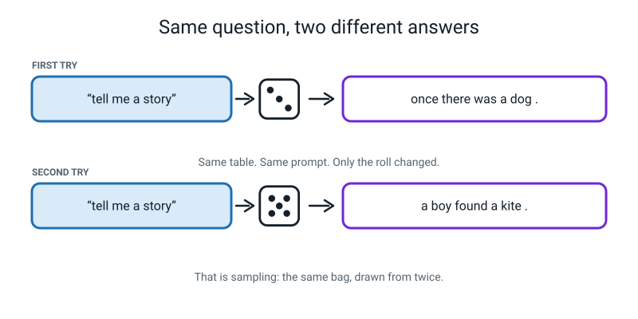
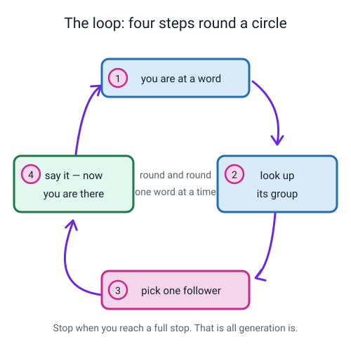
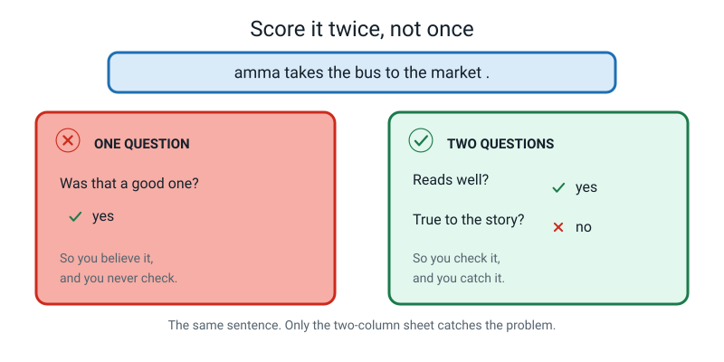
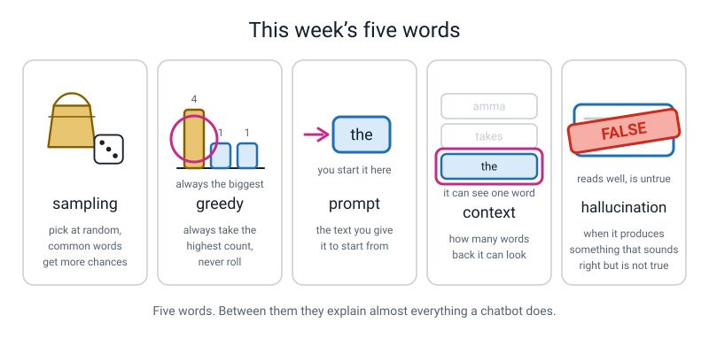

# Week 29 — Dice, Fluency, and Making Things Up

[⬅ Week 28](week-28.md) · [Course Home](../README.md) · [Week 30 ➡](week-30.md) · [Workbook](../workbook/week-29.md)

---

> ### This week in one sentence
> **Randomness is why the same question gives two different answers — and a sentence can be perfectly written and completely false at the same time.**
>
> **By the end of this chapter you will be able to:**
> - Generate a sentence from a next-word table using **dice rolls**, writing down every bag and every roll
> - Generate the same sentence **greedily** and explain exactly why greedy goes round in a circle
> - Score a sentence on **two separate questions** — does it read well, and is it true
> - Trace a **hallucination** back to the two real pairs that caused it
>
> **Reading time:** about 20 minutes. **Homework:** about 50–60 minutes.
>
> **You need last week's next-word table on the desk.** Nothing this week works without it.

---

## 🪝 Start Here

Two puzzles have been sitting unsolved since last week. Today both of them fall over.

**Puzzle one.** Your phone made a sentence by itself and it went round in a circle. Something like *"…and I will be there in a bit and I will be there in a bit and…"*. Nobody explained why.

**Puzzle two** is new, and you have almost certainly noticed it yourself. Ask a chatbot the same question twice and you usually get two different answers. Same words typed in. Different words coming out.

Have a guess at why, before you read on. Most people guess one of these three:

| The guess | Is it right? |
|---|---|
| "It's learning as it goes." | No. The part of it that produces words does not change while you are talking to it. Its table is fixed for months at a time. |
| "It's in a different mood." | No. There is nothing in there that could hold a mood. |
| "It remembers what I asked before." | Sometimes true — but you get different answers in a brand-new conversation too. |

Every one of those is a reasonable guess and every one is wrong. The real answer is much more boring and far more useful, and by the end of this chapter you will have done it yourself with a **die**.

One more promise. Before you finish, you are going to build a sentence that reads beautifully — proper grammar, sounds exactly like the original story — and is **completely untrue**. And you will be able to point at the two rows on your own tally sheet that did it. Not guess at them. Point at them.


*Figure 29.1 — Nothing changed between the two tries. Not the table, not the mood. Only the roll.*

---

## 🧠 The Big Idea

### 1. The table can be run forwards

Last week's next-word table has been a **record** — a description of a text that already existed. This week we run it the other way.

Pick a starting word. Look up its group. Choose one of the followers. Say it. Now *that* word is where you are — look it up, choose again. Keep going until you hit a full stop.


*Figure 29.2 — Four steps, round and round. That is generation.*

That loop is called **generation**, and it is the entire engine behind every piece of text an AI has ever produced. Not a simplified version. The thing itself.

**🍕 The analogy: a board game with no board.** In Snakes and Ladders, where you go next depends only on where you are now and what you roll. Nobody plans the route. You have no memory of how you got to square 41 and it makes no difference to where you go from there. Generation works exactly like that, with words instead of squares.

And there is only one genuinely interesting question in the whole loop: the word **choose**. There are exactly two honest ways to do it, and they behave so differently that they are worth treating as two separate machines.

### 2. Greedy: always take the biggest count

> **Greedy** — always pick the single follower with the highest count.

It sounds obviously correct. Take the best option every time. How could that be wrong?

Run it on last week's table. Start at `the`.

| Where you are | The group says | Biggest | Greedy says |
|---|---|---:|---|
| `the` | bus 4 · market 1 · shop 1 | 4 | **bus** |
| `bus` | to 2 · goes 1 · is 1 · . 1 | 2 | **to** |
| `to` | the 3 · town 1 | 3 | **the** |
| `the` | *(the same row, unchanged)* | 4 | **bus** |

You are back at `the`. And the table has not changed. So it picks `bus`. Then `to`. Then `the`. Then `bus`.

```
   the -> bus -> to -> the -> bus -> to -> the -> bus -> to -> ...
```

For ever. **And nothing is broken.** Greedy makes the same decision on the same row every single time — the posh word is *deterministic*. A machine that always makes the same decision, walking round a table with only so many rows in it, must eventually come back to a word it has already visited. And from that moment it is trapped in a circle it cannot leave.


*Figure 29.3 — Same table, same start word. The only difference is how you pick.*

Two consequences worth having in your head:

**The loop is short.** In our 20-word table it is three words long. Your phone's loop is usually five to twelve words long. Same thing, bigger table.

**Greedy throws most of the table away.** Starting from `the`, greedy can only ever reach `the`, `bus` and `to`. That is **3 words out of 20**. Seventeen words — `amma`, `market`, `late`, `like`, all of them — can never appear at all, no matter how long you run it. Not "unlikely". **Impossible.**

> **⚠️ Watch out:** greedy can never even *end*. Look at the `bus` group: `to` has 2 marks and the full stop has 1. Greedy always takes `to`, so it never chooses a full stop, so it never stops. That is worth noticing on its own.

**And puzzle one is now solved.** Tapping the middle suggestion on your phone fifteen times **is** greedy generation, done with your thumb. Same decision, same row, every time. That is why it went round in a circle.

### 3. Sampling: draw a slip out of a bag

> **Sampling** — pick randomly, but give each follower a chance in proportion to how often it actually occurred.

The cleanest way to do this by hand is a bag of paper slips. For each word, make **one slip for every tally mark** in its group.

`the` had 6 marks, so the bag for `the` holds six slips: four saying `bus`, one saying `market`, one saying `shop`.

Shake the bag. Take one slip without looking. Read it. **Put it back.**

Because there are four `bus` slips out of six, you get `bus` about four times out of six over the long run — automatically, with **no arithmetic at all**. That is the beautiful bit:

> ### **The counts *are* the chances. Turning a count into slips turns it into a probability for free.**


*Figure 29.4 — Number the slips, roll a die, take that slip. The chances come out right without a single calculation.*

Paper slips are a nuisance to make, so we use a die instead. Number the slips 1, 2, 3 … and roll.

> ### **The rolling rule**
> 1. Number the slips in the bag: 1, 2, 3, and so on.
> 2. Roll the die. If that number is on a slip, **take it**.
> 3. If you roll a number **bigger than the number of slips**, that roll **does not count**. Cross it out and roll again.
> 4. If a word has **only one follower**, there is nothing to choose. We call that **forced** — no roll happens at all.

Here are the six bags from last week's table. Every other word is forced.

| BAG FOR | Slips | Numbered |
|---|---:|---|
| **the** | 6 | 1 bus · 2 bus · 3 bus · 4 bus · 5 market · 6 shop |
| **.** | 5 | 1 amma · 2 amma · 3 the · 4 my · 5 i |
| **bus** | 5 | 1 to · 2 to · 3 goes · 4 is · 5 . |
| **to** | 4 | 1 the · 2 the · 3 the · 4 town |
| **i** | 3 | 1 take · 2 run · 3 like |
| **amma** | 2 | 1 takes · 2 and |

So for `the`, every roll counts — six slips, six faces. For `bus`, a 6 means roll again. For `i`, anything from 4 to 6 means roll again.

> **💡 Try this:** somebody will ask why you can't just "use slip 5" when you roll a 6 on a five-slip bag. Work out why that would be unfair. (Slip 5 would then get picked on a 5 *and* on a 6 — twice as often as slips 1 to 4. The word on it would quietly become twice as likely as the data says.)

**And puzzle two is now solved.** *"Why did it give me a different answer when I asked the same thing twice?"* Because it is drawing slips. Same bag, different draw. It is not in a mood, it did not think harder on Tuesday, it has not changed its mind. It made a weighted random choice — several hundred times — and got a different sequence.

Real systems have a dial that slides between greedy and sampling. Turn it towards greedy and answers get repetitive and safe. Turn it the other way and they get adventurous and start talking nonsense. **Neither end is "better".** Greedy is what you want when the same input must give the same output. Sampling is what you want when variety is the whole point.

### 4. Prompt and context: two words that sound technical and are not

> **Prompt** — the text you give the model to start from.

In today's activity the prompt is **one word**: the word you begin at. That is genuinely all a prompt is.

When you type "write me a poem about rain" into a chatbot, you have not given it an *instruction* the way you would instruct a person. You have given it the **beginning of a text** and asked it to carry on. Everything a chatbot does, it does by continuing.

> **Context** — how many previous words the model is allowed to look at when it makes its guess.

Our table has a context of **one word**. When it is standing at `the` and choosing what comes next, the word `the` is *literally the entire world it can see*. Everything before that is gone.


*Figure 29.5 — A bigram sees one word. A big chatbot sees around a hundred thousand. More memory fixes forgetting. It does not fix truth.*

**Look at that figure hard, because it contains the honest version of the scale gap.** A large modern chatbot can look back over something like a hundred thousand words at once — a whole novel — and the biggest can manage several times that.

That gigantic window does real work. It is why a chatbot remembers your name from twenty minutes ago, keeps track of who is doing what in a story, and does not produce the crude circles your table produces.

**And it changes nothing at all about truth, because the world is not in the window.** A big context can keep an answer consistent with the *text so far*. It cannot check *reality*. There is no step anywhere in the procedure where reality gets consulted. That is not a small missing feature. It is a missing category.

### 5. Hallucination — and where the falseness actually lives

Here is the most important idea in this chapter, and it is not technical at all.

Take last week's table and generate this sentence:

> ### **`amma takes the bus to the market .`**

Now check every single step against the table.

| Pair | Legal? | Where it came from |
|---|---|---|
| amma → takes | ✓ | sentence 2 |
| takes → the | ✓ | sentence 2 |
| the → bus | ✓ | four separate places |
| bus → to | ✓ | sentences 1 and 2 |
| to → the | ✓ | three separate places |
| **the → market** | ✓ | **sentence 1 only** |
| market → . | ✓ | sentence 1 |

**Every step is legal.** Every pair genuinely happened in the corpus. Nothing was invented, nothing was broken, no rule was bent.

Now read the sentence as a claim about the world. Go back to the original six sentences and find out who goes to the market.

```
   I take the bus to the market.        <- me
   Amma takes the bus to the shop.      <- Amma
```

So the sentence says Amma goes to the market. The story says Amma goes to the **shop**, and it is **I** who go to the market. **The sentence is beautifully written and it is false.**


*Figure 29.6 — Two learned pairs glued together produce a claim the corpus never made. Nothing here is broken.*

> **Hallucination** — when an AI produces something that sounds right but isn't true.

Three things to be precise about, because this word gets thrown around loosely.

**It is not lying.** Lying means you know the truth and choose to say something else. It needs an intention. There is nothing in a tally sheet that could hold an intention.

**It is not a bug.** Nothing malfunctioned. Every step obeyed the rules perfectly. The output is wrong *and* the machine is working correctly, both at once. Sit with that, because it is genuinely uncomfortable.

**It comes from gluing.** The falseness does not live in any one step. It lives at a **join**.

```
   to -> the        learned 3 times, mostly from sentences about buses in general
   the -> market    learned exactly ONCE, from the sentence about ME

   glue them together  ->  a claim about AMMA that nobody ever made
```

And the generator had no way to notice, because at the moment it chose `market`, its entire visible world was the single word `the`. The word `amma` was six tokens back — completely outside the window.

**Why fluency and truth come apart.** The machine is optimising for exactly one thing: *does this word plausibly follow that word?* Truth is a different question — *does this match the world?* — and no step anywhere checks it. **A well-formed false sentence and a well-formed true sentence look identical to a next-word predictor, because they are both well formed.**

**🍕 The analogy to keep: the confident tour guide.** Imagine a guide who has read thousands of tour scripts and never visited the city. Ask about any building and out comes a fluent, well-paced, confident answer in perfect tour-guide rhythm. Most of it is right, because most tour scripts are right. But when they don't know, they don't stop — they produce more tour-guide-shaped sentences, at exactly the same confidence, in exactly the same voice.

**There is no wobble in their voice when they cross from true to false.** That missing wobble is the whole danger.

---

## 🔍 Worked Examples

Three complete runs on three small tables. Every bag, every roll. Cover the answers and try each one yourself.

### Worked Example 1 — Hot pizza and cold soup (food)

**The corpus:**

```
   I eat hot pizza. Dad eats hot soup. I eat cold soup.
```

15 tokens, so 14 pairs. Here is the finished next-word table:

| CURRENT | NEXT | COUNT | OUT OF |
|---|---|---:|---:|
| **i** | eat | 2 | 2 |
| **eat** | hot | 1 | 2 |
| | cold | 1 | 2 |
| **hot** | pizza | 1 | 2 |
| | soup | 1 | 2 |
| **.** | dad | 1 | 2 |
| | i | 1 | 2 |
| **soup** | . | 2 | 2 |
| **pizza** | . | 1 | 1 |
| **dad** | eats | 1 | 1 |
| **eats** | hot | 1 | 1 |
| **cold** | soup | 1 | 1 |

**The bags:**

```
   BAG FOR "eat"  - 2 slips     1 hot     2 cold
   BAG FOR "hot"  - 2 slips     1 pizza   2 soup
   BAG FOR "."    - 2 slips     1 dad     2 i
   BAG FOR "i"    - 2 slips     1 eat     2 eat      (both the same - the answer cannot change)
   BAG FOR "soup" - 2 slips     1 .       2 .        (same again)
   Everything else is FORCED.
```

**Run A — prompt `i`, rolls 2, 1.**

| STEP | AT WORD | SLIPS IN BAG | ROLL | GOT |
|---:|---|---|---|---|
| 1 | i | 1 eat · 2 eat | **2** | eat |
| 2 | eat | 1 hot · 2 cold | **2** | cold |
| 3 | cold | 1 soup | forced | soup |
| 4 | soup | 1 . · 2 . | **1** | . |

**Output: `i eat cold soup .`**

Reads well? **✓** — perfectly fine English. True to the corpus? **✓** — that is sentence 3, word for word.

> Note something slightly disappointing and very important: **sampling does not avoid the original text.** It can copy it exactly. It can also make something brand new. And it has no idea which of those two it just did.

**Run B — prompt `dad`, rolls 1.**

| STEP | AT WORD | SLIPS IN BAG | ROLL | GOT |
|---:|---|---|---|---|
| 1 | dad | 1 eats | forced | eats |
| 2 | eats | 1 hot | forced | hot |
| 3 | hot | 1 pizza · 2 soup | **1** | pizza |
| 4 | pizza | 1 . | forced | . |

**Output: `dad eats hot pizza .`**

Reads well? **✓** Now check it against the corpus. Dad eats hot **soup**. The pizza belongs to **me**. So: **true? ✗**

**The trace.** Which two pairs did it?

```
   eats -> hot      learned once, from DAD's sentence
   hot  -> pizza    learned once, from MY sentence
```

Both real. Both counted. Glue them and Dad is eating my pizza. At the moment it chose `pizza`, all it could see was the word `hot` — and `dad` was **three** words back, already thrown away.

### Worked Example 2 — Rohit and Virat (sport)

**The corpus:**

```
   Rohit hits a four. Virat hits a six. Rohit takes a catch.
```

15 tokens, 14 pairs. The table:

| CURRENT | NEXT | COUNT | OUT OF |
|---|---|---:|---:|
| **rohit** | hits | 1 | 2 |
| | takes | 1 | 2 |
| **hits** | a | 2 | 2 |
| **a** | four | 1 | 3 |
| | six | 1 | 3 |
| | catch | 1 | 3 |
| **.** | virat | 1 | 2 |
| | rohit | 1 | 2 |
| **four** | . | 1 | 1 |
| **six** | . | 1 | 1 |
| **takes** | a | 1 | 1 |
| **catch** | . | 1 | 1 |
| **virat** | hits | 1 | 1 |

Check: 2 + 2 + 3 + 2 + 1 + 1 + 1 + 1 + 1 = **14** = 15 − 1 ✓

**Run A — prompt `rohit`, rolls 1, 1.**

| STEP | AT WORD | SLIPS IN BAG | ROLL | GOT |
|---:|---|---|---|---|
| 1 | rohit | 1 hits · 2 takes | **1** | hits |
| 2 | hits | 1 a · 2 a | — | a |
| 3 | a | 1 four · 2 six · 3 catch | **1** | four |
| 4 | four | 1 . | forced | . |

**Output: `rohit hits a four .`** Reads ✓ · True ✓ (sentence 1, verbatim).

**Run B — prompt `virat`, rolls 1.**

| STEP | AT WORD | SLIPS IN BAG | ROLL | GOT |
|---:|---|---|---|---|
| 1 | virat | 1 hits | forced | hits |
| 2 | hits | 1 a · 2 a | — | a |
| 3 | a | 1 four · 2 six · 3 catch | **1** | four |
| 4 | four | 1 . | forced | . |

**Output: `virat hits a four .`** Reads ✓ · True **✗** — Virat hit a **six**. Rohit hit the four.

**Now look at Runs A and B side by side and notice how thin the difference is.**

```
   rohit hits a four .     <-  TRUE
   virat hits a four .     <-  FALSE
```

**One word different.** Three of the four steps were *identical*, and the table treated both runs exactly the same way, with exactly the same enthusiasm. The join is between `hits → a` and `a → four`: `hits → a` was learned from both batsmen, and `a → four` was learned only from Rohit's. When the generator chose `four`, all it could see was the word `a`. It had no idea whose innings it was in.

> **💡 The tie rule, since you will hit it:** in this table `rohit` has `hits` 1 and `takes` 1. What does *greedy* do with a tie? There is no answer inside the data, so you have to make a rule and write it down. Ours: **whichever appeared first in the corpus wins.** Admitting that this was a choice and not a discovery is the correct behaviour.

### Worked Example 3 — Taking the register (school)

**The corpus:**

```
   Maya is here. Rohan is here. Dev is absent.
```

12 tokens, 11 pairs. The table:

| CURRENT | NEXT | COUNT | OUT OF |
|---|---|---:|---:|
| **is** | here | 2 | 3 |
| | absent | 1 | 3 |
| **.** | rohan | 1 | 2 |
| | dev | 1 | 2 |
| **here** | . | 2 | 2 |
| **maya** | is | 1 | 1 |
| **rohan** | is | 1 | 1 |
| **dev** | is | 1 | 1 |
| **absent** | . | 1 | 1 |

**Part 1 — greedy, prompt `maya`, twelve words, no die at all.**

| At word | Group | Biggest | Picks |
|---|---|---|---|
| maya | is 1 | forced | is |
| is | here **2** · absent 1 | 2 | here |
| here | . 2 | forced | . |
| . | rohan 1 · dev 1 | tie → first in corpus | rohan |
| rohan | is 1 | forced | is |
| is | *(same row, unchanged)* | 2 | here |

```
   OUTPUT:  maya is here . rohan is here . rohan is here .
```

Round and round. And now the part that should stop you:

**Greedy can never say the word `absent`.** Not "rarely". Never. The `is` group always hands back `here`, so `absent` is unreachable from every starting point that goes through `is`. And every starting point goes through `is`.

Reachable set from `maya`: `{maya, is, here, ., rohan}` — five words out of seven. `dev` and `absent` are **impossible**.

> **⚠️ Watch out:** think about what that means if anybody trusted this thing. Greedy's register says everybody is present, for ever, because "present" was the more common answer in the training data. Nothing is broken. It is working exactly as designed.

**Part 2 — sampling, prompt `dev`, rolls 1.**

| STEP | AT WORD | SLIPS IN BAG | ROLL | GOT |
|---:|---|---|---|---|
| 1 | dev | 1 is | forced | is |
| 2 | is | 1 here · 2 here · 3 absent | **1** | here |
| 3 | here | 1 . · 2 . | **1** | . |

**Output: `dev is here .`**

Reads well? **✓** It is a complete, ordinary, unremarkable sentence.

True? **✗** Dev is the one person in this corpus who is **absent**.

**The trace.** The join is between `dev → is` and `is → here`. Both pairs are real: `dev is` came from Dev's own line, `is here` came from Maya's and Rohan's lines. Glue them, and a missing child is marked present. When it chose `here`, its entire world was the word `is`. The name `dev` was two words back and gone.

**That is the same failure as Worked Examples 1 and 2**, with the stakes turned up. Which tells you something: the problem is not the topic. It is **structural**.

---

## 🎲 What We Did In Class

**Three Sentences and a Lie.** If you missed the lesson, everything you need is here. You need last week's next-word table, a pencil, a **red** pencil, and paper. You do not need a die — the rolls are supplied so the answers can be checked.

### The six rules, read them before you start

1. **Write the bag before you roll.** Every step, write out what is in the bag. It is slow, and it is the only reason anybody can check your work afterwards.
2. **One roll, one step.** Take the rolls off the list in order, left to right.
3. **Too big, roll again.** If the number is bigger than the number of slips, cross it out and take the next one.
4. **One slip means forced.** No roll. Write "forced" in the ROLL column.
5. **Stop at a full stop.** Or after 20 words, whichever comes first.
6. **Do not edit the output.** Not one word. Especially not when it is embarrassing, and *definitely* not when it is wrong.

### The fixed rolls

```
   SENTENCE 1   prompt: the      rolls:  2  3  4
   SENTENCE 2   prompt: amma     rolls:  1  4  2  3  5
   SENTENCE 3   prompt: the      rolls:  1  2  6  1  3  5      (the 6 is a re-roll - watch for it)
   GREEDY       prompt: the      no rolls. Always the biggest count. Stop after 12 words.
```

**Why fixed rolls and not real ones?** Two honest reasons. It means the answer key can check your work. And it means we definitely reach the interesting sentence instead of maybe reaching it. Your own rolls are for homework.

### Sentence 1 — the clean one

| STEP | AT WORD | SLIPS IN BAG | ROLL | GOT |
|---:|---|---|---|---|
| 1 | the | 1 bus · 2 bus · 3 bus · 4 bus · 5 market · 6 shop | **2** | bus |
| 2 | bus | 1 to · 2 to · 3 goes · 4 is · 5 . | **3** | goes |
| 3 | goes | 1 to | forced | to |
| 4 | to | 1 the · 2 the · 3 the · 4 town | **4** | town |
| 5 | town | 1 . | forced | . |

**Output: `the bus goes to town .`** Reads ✓ · True ✓ — that is sentence 3 of the corpus, word for word.

### Sentence 2 — the important one

| STEP | AT WORD | SLIPS IN BAG | ROLL | GOT |
|---:|---|---|---|---|
| 1 | amma | 1 takes · 2 and | **1** | takes |
| 2 | takes | 1 the | forced | the |
| 3 | the | 1 bus · 2 bus · 3 bus · 4 bus · 5 market · 6 shop | **4** | bus |
| 4 | bus | 1 to · 2 to · 3 goes · 4 is · 5 . | **2** | to |
| 5 | to | 1 the · 2 the · 3 the · 4 town | **3** | the |
| 6 | the | 1 bus · 2 bus · 3 bus · 4 bus · 5 market · 6 shop | **5** | market |
| 7 | market | 1 . | forced | . |

**Output: `amma takes the bus to the market .`** Reads ✓ · True **✗**

Read it out loud like a newsreader first. It is *better written* than sentence 1. Then check the corpus. Then take a **red** pencil and write **FALSE** across it. Big. Do not skip that bit — it is theatre, and theatre is what makes it stick.

### Sentence 3 — and the re-roll

| STEP | AT WORD | Bag size | ROLL | GOT |
|---:|---|---:|---|---|
| 1 | the | 6 | **1** | bus |
| 2 | bus | 5 | **2** | to |
| 3 | to | 4 | ~~6~~ too big, roll again → **1** | the |
| 4 | the | 6 | **3** | bus |
| 5 | bus | 5 | **5** | . |

**Output: `the bus to the bus .`** Reads **✗** — it is not a sentence, there is no verb. True: **n/a** — it does not claim anything, so there is nothing to be true or false about.

### Greedy — no die, twelve words

```
   the bus to the bus to the bus to the bus to
```

Reads ✗ · True n/a. Reachable set from `the` is `{the, bus, to}` — **3 of the 20 words**, so **17 words are impossible.** Write that number down.

### The score sheet, which is the actual lesson


*Figure 29.7 — The finished score sheet. Row 2 is the one that matters.*

| # | The sentence | READS WELL? | TRUE TO CORPUS? |
|---|---|---|---|
| 1 | the bus goes to town . | ✓ | ✓ |
| 2 | **amma takes the bus to the market .** | **✓** | **✗** |
| 3 | the bus to the bus . | ✗ | n/a |
| G | the bus to the bus to the bus to the bus to | ✗ | n/a |

> **⚠️ Watch out:** fill the **whole** READS WELL column first, put your pencil down, then go back to the top and fill the whole TRUE column. Do not do them together. The gap between the two columns only becomes visible if you make the two judgements separately.

**Which row is the dangerous one?** Not row 3 or the greedy row — those are obviously broken, and you would never believe them for a second. **Row 2.** The dangerous failure is the one you would believe.

And the machine cannot tell you which is which. All four sentences came out of the same bags, by the same procedure, in the same handwriting, with the same confidence. **So a person has to check.** That stays true when the table has a trillion counts in it instead of thirty-nine.


*Figure 29.8 — The board at the end of the lesson. The two score columns stay visually separate on purpose.*

---

## 💬 Talk About It

**1. Ask someone who uses a chatbot: "Have you ever caught it being confidently wrong? How did you find out?"**

> *Hint:* the interesting part of their answer is almost never the mistake. It is *how they noticed*. Nearly always it is because they already knew the right answer, or because they went and checked. Almost nobody says "it sounded unsure" — because it didn't.

**2. Ask: "Would you rather have a machine that sometimes says 'I don't know', or one that always gives you an answer?"** Then push: does your answer change if the question is about medicine?

> *Hint:* most people say "always gives an answer" until the stakes go up. That is the real insight — the right answer depends on **how expensive being wrong is**. Hold on to that; it comes back in Week 32.

**3. Argue about this: "Is a hallucination the same as a lie?"**

> *Hint:* lying needs an *intention* — you know the truth and choose to say something else. Show them one row of your tally sheet and ask where an intention could possibly be stored. That is also why "it lied to me" is the wrong complaint, and "I trusted it without checking" is the right one.

---

## ⚠️ Don't Get Tricked

### Trick 1 — "That's one question, so one verdict"


*Figure 29.9 — The same sentence. Only the two-column sheet catches the problem.*

| ❌ Wrong | ✅ Right |
|---|---|
| "Was that a good sentence? Yes. ✓" | "Does it read well? Yes. Is it true? No. Two answers, kept apart." |

In ordinary life a fluent sentence usually *is* true, so your brain has learned to treat them as one question. That habit is exactly what this week is attacking.

### Trick 2 — "The AI made a mistake"

| ❌ Wrong | ✅ Right |
|---|---|
| "It got it wrong, so something is broken. Let's fix it." | "Every step obeyed every rule. Nothing is broken. What's missing is a step that never existed." |

Go through all seven steps of sentence 2 and find the one that broke a rule. There isn't one. So what would you repair? There is no broken line. What is missing is a step that asks *"is this true?"* — and adding that step is a genuinely unsolved problem, not an oversight somebody forgot about.

### Trick 3 — "A bigger table would fix it"

| ❌ Wrong | ✅ Right |
|---|---|
| "It only did that because our table is tiny. A real one with billions of counts wouldn't." | "A bigger table makes text more *likely-sounding*. Nothing in counting checks reality, so more counting multiplies the fluency and leaves the missing step exactly as missing." |

More context does help with a **different** problem — forgetting. A big model would not lose track of the fact that we were talking about Amma, and would not make silly loops. Concede that clearly. Then restate the limit: **the world is not in the window.**

### Trick 4 — "Greedy is the broken one and sampling is the good one"

| ❌ Wrong | ✅ Right |
|---|---|
| "Greedy produced rubbish, so sampling is better." | "Greedy is *repeatable*, and repeatable is exactly what you want in plenty of situations. What today shows is that best-at-each-step is not best-overall." |

That is a real and general idea, and it is not only about words. Always taking the biggest step right now can walk you straight into a dead end, in chess, in a maze, and in a next-word table.

---

## 🌍 Where You've Seen This

1. **A chatbot giving you a different answer when you press "regenerate".** Same bag, different draw. You have just watched sampling happen.
2. **Your phone keyboard looping when you tap the middle word over and over.** That is greedy, run by your thumb, hitting the same rows and making the same choices.
3. **A confidently wrong answer about a real person, a date or a page number.** That is a join between two real-looking patterns. The specific, checkable claims are exactly where hallucination bites.
4. **An AI image with six fingers on one hand.** Same failure, different medium: every local patch looked plausible, and nothing anywhere counted the fingers.
5. **A "creativity" or "randomness" slider in an AI writing tool.** That slider is the dial between greedy and sampling. Now you know what it is physically doing.
6. **A friend who tells stories in a very confident voice.** You cannot hear the difference between the parts they remember and the parts they are smoothing over — because their voice does not change either. It is the same problem, and it is why we check things.

---

## 🧭 Where This Fits

Still **WORDS**, still the same tally table — and this week you run it. Notice which thread lights up
next to model on the strip below: not evaluation, not data. **Impact.** That is a clue about what this
week is really for.


*Figure 29.0 — The map in Week 29. WORDS stays shaded, with **model** and **impact** lit. The model
half is the die and the loop; the impact half is what happens when a machine says something fluent and
wrong to a real person.*

| | |
|---|---|
| **The mental model you now own** | Generation is a four-step loop: **where am I → look up the group → pick one → say it.** Because the pick is a roll of a die — **sampling** — the same prompt can give you different answers every time. And a sentence can be perfectly **fluent** and completely **false**. |
| **The one question it answers** | *"Where did this sentence's confidence come from — evidence, or fluency?"* |
| **What it plugs into** | Week 28's next-word table, which is the thing the die walks across, and Week 16's hard-won point that confidence is a **preference, not a promise**. |
| **What carries forward** | Fluent-and-false is exactly what you have to warn a real user about in Weeks 32 and 33, and it is the reason the booth you build in Week 35 needs a warning sign at all. |
| **Spiral thread** | 📦 **Model** — how a sentence actually gets produced — and 🌍 **Impact** — because smooth, confident, wrong is the single most expensive failure this subject has. |

> **💡 Try this:** on your map, write one sentence next to WORDS that sounds completely convincing and
> is completely made up. Underline it. That underlined sentence is the best revision note you will make
> all term.

---

## 🔑 Remember This

- **Generation is a four-step loop:** where am I, look up the group, pick one, say it. Repeat. That is the entire engine.
- **Greedy always takes the biggest count**, so it makes the same choice every time, so it walks into a circle and cannot climb out. It also makes most of the table permanently unreachable — 17 of our 20 words.
- **Sampling makes one slip per tally mark and draws one.** The counts *become* the chances, with no arithmetic. That is why the same question gives two different answers.
- **A prompt is just the beginning of the text.** Not an instruction. Everything a chatbot does, it does by continuing.
- **Our context is one word.** A big chatbot's is about a hundred thousand. More memory fixes forgetting; it does not fix truth, because the world is not in the window.
- **Score every output twice: reads well, and is it true.** Separately, in that order, one whole column at a time.
- **A hallucination is not a lie and not a bug.** It happens at a **join** between two real pairs learned in two different situations.
- **The machine's voice does not change when it stops being right.** So "it sounded confident" tells you precisely nothing.

---

## 📓 New Words


*Figure 29.10 — This week's five words, drawn.*

| Word | What it means | Example |
|---|---|---|
| **sampling** | Picking randomly, but giving each follower a chance in proportion to its count | The `the` bag has 4 `bus` slips out of 6, so you get `bus` about four times in six |
| **greedy** | Always picking the follower with the highest count, with no randomness at all | From `the`, greedy always says `bus`, then `to`, then `the`, for ever |
| **prompt** | The text you give the model to start from | Today's prompts were single words: `the`, `amma` |
| **context** | How many previous words the model can look at when it guesses | Our table's context is **one word**. A large chatbot's is around 100,000 |
| **hallucination** | When an AI produces something that sounds right but isn't true | `amma takes the bus to the market .` — every pair real, the claim false |

---

## 📤 Your Homework

Go to **[the Week 29 workbook](../workbook/week-29.md)**. About **50–60 minutes** in total.

You do what we did in class, but on **your own** table — the one you built last week from your own sixty-word text. Not mine. Yours.

Three sentences by sampling, one greedily. **Write down the bag and the roll at every single step.** If somebody else cannot check your trace, it does not count.

You can roll a real die, or take these numbers left to right:

> ### **4 · 1 · 3 · 6 · 2 · 5 · 1 · 4 · 2 · 6 · 3 · 1 · 5 · 2 · 4 · 1 · 6 · 3 · 2 · 5**

If a number is bigger than the bag, cross it out and take the next one. If you run out, start the strip again. If you have numbers left over at the end, that is completely normal — say so.

| Page | What to do | Time |
|---|---|---|
| **29.1** | Warm-up on last week, then Practice Sets A and B | 15 min |
| **29.2** | Your bags, written out — only for words that have more than one follower | 10 min |
| **29.3** | Trace tables for sentences 1, 2 and 3, plus the greedy run and its unreachable count | 20 min |
| **29.4** | The two-column score sheet, all four rows, one column at a time | 5 min |
| **29.5** | The hallucination write-up, the puzzle, and the drawing | 10 min |

> **💡 Time-saver:** if this is taking you well over an hour, you are probably writing out bags for **every** word. You don't need to. A word with one follower is **forced** — no choice, no bag, no roll.

**One warning, and it matters.** If none of your three sentences happens to come out false, **do not fake it.** Say so, then build a false one by hand from your own table and show that every step is legal. That counts for full marks — arguably more, because constructing one deliberately is harder than stumbling into one.

**And the one sentence that carries the most marks in the whole week:** *exactly where did the falseness come from?* Name the two pairs. Say that both are real. Say why the table could not have known better. "Because it doesn't understand" is true and useless — it names no mechanism. Push for the window.

---

[⬅ Week 28](week-28.md) · [Course Home](../README.md) · [Week 30 ➡](week-30.md) · [📓 Workbook — Week 29](../workbook/week-29.md) · [Glossary](../../glossary.md)
