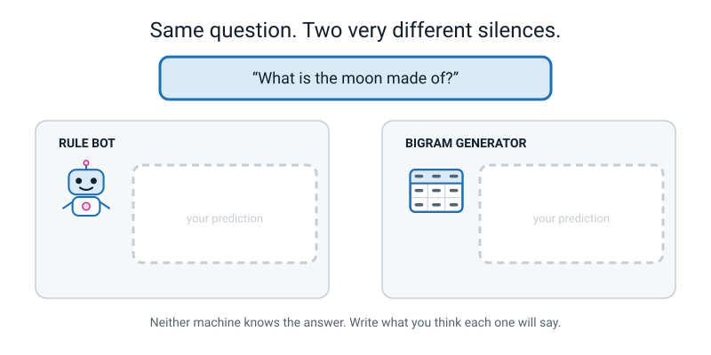
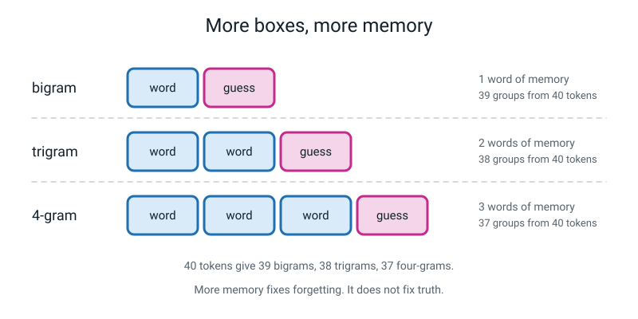
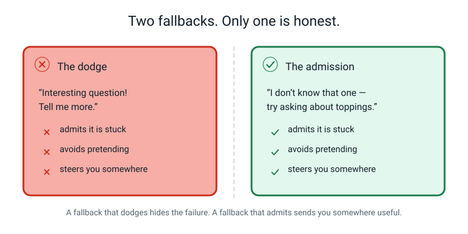
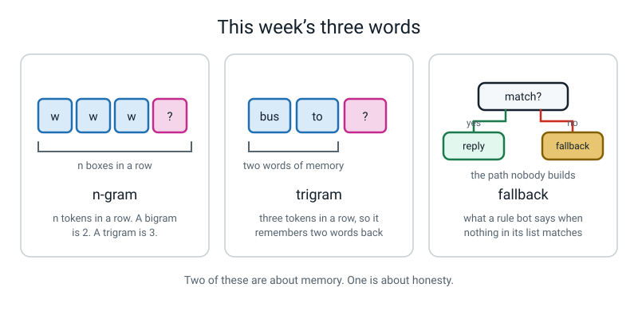

# Week 30 — Build a Chatbot in Scratch

[⬅ Week 29](week-29.md) · [Course Home](../README.md) · [Week 31 ➡](week-31.md) · [Workbook](../workbook/week-30.md)

---

> ### This week in one sentence
> **A rule-based bot and a learned language model fail in completely different ways — and knowing which one you are talking to changes how much you should trust it.**
>
> **By the end of this chapter you will be able to:**
> - Build a working **Scratch chatbot** from two lists, an ask-and-wait loop and a contains-check
> - Add a **fallback** reply, in the bot's own honest voice, for input that matches nothing
> - Diagnose and fix the **repeat bug** — there are exactly three causes, and you will know all three
> - Compare how a rule-based bot fails with how a next-word model fails, with a real example of each
>
> **Reading time:** about 20 minutes. **Lab + homework:** about 60 minutes.
>
> **You need Week 29's score sheet and next-word table.** The last ten minutes of this lesson is the whole point, and it does not work without them.

---

## 🪝 Start Here

Last week your tally sheet and a die produced this:

> ### `amma takes the bus to the market .`

Perfect English. Completely untrue. You stamped **FALSE** across it in red pencil.

Today you build a **second** chatbot — a completely different kind, one where every single word it can say gets typed in by you. And then we ask both machines the same question, one they genuinely cannot answer:

> ### **"What is the moon made of?"**

Your tally sheet has never heard of the moon. Your Scratch bot will only know about five things and the moon will not be one of them. **Same ignorance, both machines.**


*Figure 30.1 — Neither machine knows. Write your prediction in each box before you read on.*

Now guess: will they behave the same way?

They will not behave the same way at all. They will fail so differently that one of them is merely **annoying** and the other one is genuinely **dangerous**. And by the end of today you will not have to take my word for it, because you will have built both of them with your own hands.

---

## 🧠 The Big Idea

### 1. Two machines, two completely different insides

From the outside, these two things look identical. You type. They type back.

Inside, they could not be more different — and the difference decides how much you should trust each one.


*Figure 30.2 — The comparison this whole chapter is building towards. Read it row by row.*

| | **Rule-based bot** (today) | **Learned generator** (last week) |
|---|---|---|
| Where its knowledge came from | A person typed it | Counting examples |
| Can it say something nobody wrote? | No. Never. | Yes — that is how `amma takes the bus to the market` happened |
| What happens when it doesn't know | It says so | It invents |
| Can you tell when it has failed? | **Instantly** | **Often not at all** |
| Which Week 1 family is it? | Rule-based | Machine learning |
| How much can it cover? | Only what you typed | Almost anything |

**The fourth row is the one that matters.** When a rule-based bot doesn't know, it says so. When a learned generator doesn't know, it invents. That single asymmetry is worth an hour of anybody's time.

**🍕 The analogy: the vending machine and the improviser.** A vending machine has five buttons. Press a button it has, you get exactly what the label says, every time. Press a button it does not have — nothing happens, and you know immediately to go somewhere else. An improviser on stage will produce something for *any* prompt you shout, fluently, in character, at full confidence. Sometimes it is brilliant. It is never checked. **Both are useful. You need to know which one you are standing in front of.**

### 2. What a rule-based chatbot actually is: two lists and a number

Here is the entire architecture. It is genuinely this small.

1. Two lists, side by side. One holds **triggers** — words to look for. The other holds **replies**.
2. Ask the person a question. Wait for their answer.
3. Walk down the trigger list **from the top**. For each one ask: does their answer *contain* this word?
4. The moment one matches, say the reply sitting at **the same position** in the other list. **Stop walking.**
5. If you reach the bottom with no match, say the **fallback**.


*Figure 30.3 — The two lists are joined by nothing but a position number. That is the whole lookup.*

Here is our class bot, PizzaBot:

| Row | TRIGGER | REPLY |
|---:|---|---|
| 1 | pineapple | Pineapple on pizza? Delicious. |
| 2 | topping | Cheese, mushroom, paneer, corn. |
| 3 | price | Medium 250. Large 400. |
| 4 | deliver | We deliver within 5 km. |
| 5 | open | Open 11am to 11pm, every day. |

Three consequences follow, and all three will bite you in the lab.

**Consequence 1 — the order of the list is a rule.** Because the loop stops at the *first* match, `pineapple` beats `topping` **only because it sits higher up**. Move it to the bottom and the pineapple reply becomes permanently unreachable, because almost any question with the word "pineapple" in it also mentions toppings. It was not deleted. It was **demoted**.

> **💡 You have met this before.** In Week 8 you built rule ladders where the first rule that fitted decided the answer, so a general rule at the top made every specific rule below it unreachable. This is the same idea wearing different clothes.

**Consequence 2 — `contains` is generous, sometimes far too generous.** The trigger `open` matches "what time do you open" — good. It also matches "how do I **open** the box" and "are you **open**ing a new branch" — bad. That has a name: a **false match**.

> ### **The rule of thumb: no trigger shorter than four letters, and prefer the longest trigger that still catches real questions.**

**Consequence 3 — this is not machine learning.** Look at the first row of Figure 30.2. This bot's knowledge came from a person typing. Nothing was learned from anything. It belongs to the **rule-based** family from Week 1, and being able to tell the two families apart on sight is one of this whole level's headline skills.

### 3. The loop, block by block

Here is the whole program. Do not be alarmed by the length — most of it is just typing in the lists.


*Figure 30.4 — The finished block stack. The grey and red outlines are Control blocks, which wrap whatever sits inside them.*

```
   when green flag clicked

     delete all of [triggers]
     delete all of [replies]

     add [pineapple] to [triggers]
     add [Pineapple on pizza? Delicious.]  to [replies]
     add [topping]   to [triggers]
     add [Cheese, mushroom, paneer, corn.] to [replies]
     add [price]     to [triggers]
     add [Medium 250. Large 400.]          to [replies]
     add [deliver]   to [triggers]
     add [We deliver within 5 km.]         to [replies]
     add [open]      to [triggers]
     add [Open 11am to 11pm, every day.]   to [replies]

     say [Hi, I am PizzaBot. Ask me something.] for (2) seconds

     forever
       ask [What do you want to know?] and wait

       set [i] to (1)                     <-- INSIDE the forever
       set [matched] to (0)               <-- INSIDE the forever

       repeat until <<(i) is bigger than (length of [triggers])> or <(matched) = (1)>>
         if <(answer) contains (item (i) of [triggers]) ?> then
           say (item (i) of [replies]) for (3) seconds
           set [matched] to (1)           <-- inside the if
         end
         change [i] by (1)                <-- inside the repeat, OUTSIDE the if
       end

       if <(matched) = (0)> then          <-- inside the forever, AFTER the repeat
         say [I don't know that one - try asking about toppings, price, delivery or opening time.] for (3) seconds
       end
     end
```

**Read the loop in English, because this is the genuinely new bit:**

- `set i to 1` — start at the top of the list. `i` is just "which row am I checking".
- `set matched to 0` — we have not found anything yet.
- `repeat until i is bigger than the length of triggers, OR matched equals 1` — keep going until either we run off the end of the list, or we found something.
- Inside: `if what they typed contains item i of triggers` — then say item `i` of replies, and set `matched` to 1 so the loop knows to stop.
- Then, **outside the if but inside the repeat**: `change i by 1`. Move to the next row.

> **⚠️ Watch out:** `change i by 1` has to be **outside** the `if`. Put it inside, and whenever a row does *not* match, `i` never moves — so it checks the same row for ever and Scratch looks frozen. That is the single easiest bug to make and the fastest to fix.

**Where the blocks live in Scratch:**

| Block | Category and colour |
|---|---|
| `when green flag clicked` | Events (yellow) |
| `forever`, `repeat until`, `if … then` | Control (gold) |
| `ask … and wait`, `answer` | Sensing (light blue) |
| `say … for … seconds` | Looks (purple) |
| `set`, `change`, `add … to`, `item … of`, `length of`, `delete all of` | Variables (orange) |
| `contains`, `is bigger than`, `=`, `or` | Operators (green) |

Two Scratch facts you need, and nobody tells you:

- **`contains` ignores capitals.** `HOW MUCH IS THE PRICE` matches a trigger of `price`. (Contrast that with Week 27, when you had to lowercase everything yourself by hand. Scratch does it for you here. Plenty of other systems do not.)
- **`say … for 2 seconds` blocks everything.** Nothing else happens during those two seconds. So if your bot seems to be ignoring you, it is often just mid-`say`. Keep durations at 2 or 3 seconds, never longer.

### 4. The fallback — the path everybody forgets to build

> **Fallback** — the reply a rule-based bot gives when nothing in its list matches.


*Figure 30.5 — The path everyone forgets to build.*

Without a fallback, a bot that finds no match does one of two things, and both are bad:

- It says **nothing at all**, which looks broken and makes the person assume the program crashed.
- Or — if the code is careless — it says whatever reply was left over from last time, which looks like a **confident wrong answer**.

A good fallback does three jobs at once. It **admits** the bot is stuck. It **does not pretend**. And it **steers** — it tells you what the bot *can* do.

| The fallback | Verdict |
|---|---|
| ❌ *"Error."* | True, useless, slightly frightening. |
| ❌ *"Interesting question! Tell me more."* | **The worst of the three.** It hides the failure behind friendliness, so you keep talking to something that cannot help you. |
| ✅ *"I don't know that one — try asking about toppings, price, delivery or opening time."* | Admits · doesn't pretend · steers. |

**Now the question that flips most people's thinking.** When the fallback fires, has the bot **failed** or **succeeded**?

Most people say failed. Think about it again. Last week, when your table hit something it didn't know, it produced `amma takes the bus to the market` in a confident voice and you had to go and check the corpus to catch it. This bot says *"I don't know that one."*

> ### **The fallback firing is the bot succeeding at being honest.**

Writing an honest error message takes thirty seconds and it is a small piece of ethics disguised as a piece of programming.

### 5. n-grams — how much memory a model has

One loose end from last week, and then we build.

> **N-gram** — n tokens in a row. A **bigram** is 2. A **trigram** is 3.

Your Week 28 table was a **bigram** table: it counted pairs, which means it could see exactly **one** word before the guess. A trigram table is keyed on the previous **two** words.


*Figure 30.6 — More memory fixes forgetting. It does not fix truth.*

| Name | Tokens in the group | Words of memory before the guess | Groups from 40 tokens |
|---|---:|---:|---:|
| bigram | 2 | 1 | 39 |
| trigram | 3 | 2 | 38 |
| 4-gram | 4 | 3 | 37 |
| n-gram | n | n − 1 | 40 − (n − 1) |

**Does more memory actually help?** On our bus corpus, genuinely yes — and it is checkable, so here it is in full.

The four trigram groups we need:

| Context | Occurs | Followed by | Counts |
|---|---:|---|---|
| **(the, bus)** | 4 | to, to, goes, . | to 2 · goes 1 · . 1 |
| **(bus, to)** | 2 | the, the | the 2 — **forced** |
| **(to, the)** | 3 | market, shop, bus | 1 · 1 · 1 — **three-way tie** |
| **(the, market)** | 1 | . | **forced** |

Greedy under trigrams, starting from `the bus`:

```
   (the, bus)     -> to      (2, the biggest)
   (bus, to)      -> the     (forced)
   (to, the)      -> market  (a 1-1-1 tie, broken by first appearance in the corpus)
   (the, market)  -> .       (forced)

   OUTPUT:  the bus to the market .        -- and it ENDS.
```

Compare that with bigram greedy: `the bus to the bus to the bus to …` for ever. **One extra word of memory broke the loop.** That is a real, checkable win.

**And now the sting.** Is `amma takes the bus to the market .` still legal under trigrams? Check it:

```
   (amma, takes)  -> the      forced
   (takes, the)   -> bus      forced
   (the, bus)     -> to       2 of 4
   (bus, to)      -> the      forced
   (to, the)      -> market   1 of 3
   (the, market)  -> .        forced
```

**Every step legal. The hallucination survives.** Because at the critical moment the two visible words are `to the` — and `amma` is *four words further back*, still completely invisible.

**How much memory would fix it?** You would need the group `(amma, takes, the, bus, to, the)` to exist as its own row — a **7-gram**. In our corpus that six-word phrase occurs exactly once and is followed by `shop`, so a 7-gram model would forbid `market` outright.

**So why doesn't everyone just use 7-grams?** Because in real text, almost **no** six-word phrase ever repeats. So every group would have exactly one member, there would be no choice to make, and the generator would simply quote its source text back at you word for word. More precision buys you exponentially more rows and exponentially less evidence in each one. That is the **rule explosion** from Week 10 wearing a different hat.

> ### **The one-line version: more memory fixes forgetting. It does not fix truth, and past a point it stops being affordable.**

---

## 🔍 Worked Examples

### Worked Example 1 — Be the bot, on paper (food)

Before touching Scratch, run the algorithm with your own finger. You are the computer. Be strict and be stupid: read the triggers from the top, take the **first** match, say that reply **word for word**.

PizzaBot's list again: 1 `pineapple` · 2 `topping` · 3 `price` · 4 `deliver` · 5 `open`.

**Question A: `what toppings do you have`**

| i | Trigger at row i | Does the question contain it? | What happens |
|---:|---|---|---|
| 1 | pineapple | no | `change i by 1` |
| 2 | topping | **yes** | say reply 2, `matched` = 1, loop stops |

**Bot says:** *Cheese, mushroom, paneer, corn.* ✓ Correct.

**Question B: `do you have pineapple as a topping`**

| i | Trigger | Contains? | What happens |
|---:|---|---|---|
| 1 | pineapple | **yes** | say reply 1, `matched` = 1, **stop** |

**Bot says:** *Pineapple on pizza? Delicious.* ✓ Correct — and notice that row 2 also would have matched. It never got looked at, because the loop stopped. **The order decided the answer.**

**Question C: `how do i open it`**

| i | Trigger | Contains? | What happens |
|---:|---|---|---|
| 1 | pineapple | no | i → 2 |
| 2 | topping | no | i → 3 |
| 3 | price | no | i → 4 |
| 4 | deliver | no | i → 5 |
| 5 | open | **yes** | say reply 5, stop |

**Bot says:** *Open 11am to 11pm, every day.* ✗ **Wrong** — you asked about a box, it told you the shop's hours. That is a **false match**. Nothing is broken; `open` really does appear inside "how do i open it", and `contains` knows nothing about meaning.

**Question D: `what is the moon made of`**

| i | Trigger | Contains? |
|---:|---|---|
| 1 | pineapple | no |
| 2 | topping | no |
| 3 | price | no |
| 4 | deliver | no |
| 5 | open | no |
| 6 | *(past the end of the list)* | loop exits, `matched` is still 0 |

**Bot says:** *I don't know that one — try asking about toppings, price, delivery or opening time.* ✓ **This is a pass, not a failure.** It genuinely did not know, and it said so, and it told you where to go instead.

### Worked Example 2 — CricketBot, and the reply that can never speak (sport)

Here is a bot for a cricket club, written in the order the ideas arrived:

| Row | TRIGGER | REPLY |
|---:|---|---|
| 1 | practice | Practice is Tuesday and Thursday, 5pm. |
| 2 | practice ground | We practise at the Maidan ground, gate 3. |
| 3 | match | Next match is Sunday at 9am. |
| 4 | kit | Bring white kit and your own pads. |

**Test 1: `when is practice`** → row 1 matches → *Practice is Tuesday and Thursday, 5pm.* ✓

**Test 2: `where is the practice ground`** → walk it carefully:

| i | Trigger | Does "where is the practice ground" contain it? |
|---:|---|---|
| 1 | practice | **yes** → say reply 1, stop |

**Bot says:** *Practice is Tuesday and Thursday, 5pm.* ✗ You asked *where*. It told you *when*.

**And here is the important part.** Try to find **any** question that reaches row 2. It would have to contain the phrase "practice ground" but **not** the word "practice" — and that is impossible, because "practice ground" has "practice" inside it.

> ### **Reply 2 is dead. Not unlikely. Impossible. And nobody deleted it — it just sits below a shorter version of itself.**

**The fix:** swap rows 1 and 2, so the **specific** trigger sits above the **general** one.

| Row | TRIGGER |
|---:|---|
| 1 | practice ground |
| 2 | practice |

Re-test both: `where is the practice ground` → row 1 matches → the ground reply ✓. `when is practice` → row 1 does *not* match (the phrase "practice ground" is not in it), row 2 does ✓. **Both work now.** One swap, zero new blocks.

**Test 3: `is there a kitchen at the ground`** → row 4's trigger is `kit`, and "kitchen" contains "kit". False match. It offers you white kit and pads.

**Now feel the cost of fixing it.** Lengthen `kit` to `white kit`:

| Question | Before the fix | After the fix |
|---|---|---|
| is there a kitchen at the ground | ✗ false match | ✓ falls back honestly |
| what kit do i bring | ✓ correct | ✗ no longer matches — falls back |

**Every tightening loses something.** That is the same tighten-versus-loosen trade-off from Week 8, and it never fully goes away. (The honest answer here is to have *two* triggers pointing at one reply: `white kit` and `what kit`. Two triggers, one reply, is perfectly normal and good practice.)

### Worked Example 3 — SchoolBot and the repeat bug (school)

A bot for a school office, four pairs: 1 `uniform` · 2 `term dates` · 3 `school bus` · 4 `lunch`.

It works once and then goes strange. There are **exactly three** causes. Here is how you tell them apart.

**Cause 1 — the two `set` blocks are ABOVE the `forever` loop.**

They only ever run once, so `i` and `matched` are never reset. Trace it:

| Turn | You type | `i` at the start | `matched` at the start | What the bot does | `i` at the end |
|---:|---|---:|---:|---|---:|
| 1 | `where is the school bus` | 1 | 0 | walks rows 1–3, matches row 3, replies ✓ | 4 |
| 2 | `what is the uniform` | **4** | **1** | `matched` is already 1, so the repeat-until exits *instantly*. Then `if matched = 0` is false too. **Silence.** | 4 |

If turn 1 had found no match instead, `i` would have been parked at **5** (past the end of a 4-item list), so from then on every turn exits before checking anything and you get the **fallback on everything**.

Either way, same cause, same fix: **drag both `set` blocks inside the `forever`, directly under `ask and wait`.**

- **Symptom:** turn 1 works, then either silence for ever or the fallback for ever.

**Cause 2 — `set matched to 1` is MISSING from inside the `if`.**

| i | Trigger | `what is the school lunch` contains it? | What happens |
|---:|---|---|---|
| 1 | uniform | no | i → 2 |
| 2 | term dates | no | i → 3 |
| 3 | school bus | no | i → 4 |
| 4 | lunch | **yes** | says the lunch reply — but `matched` stays 0 |
| 5 | *(past end)* | — | loop exits, `matched` = 0, so **the fallback fires too** |

- **Symptom:** you get the right answer **and then** "I don't know that one". Or, if two triggers both match, two replies stacked on top of each other.
- **Fix:** add `set matched to 1` immediately after the `say`, still **inside** the `if`.

**Cause 3 — a trigger is too short or too general and sits too high.**

Somebody adds `is` at the top of the list, thinking it will catch questions.

| Question | Contains `is`? |
|---|---|
| where **is** the bus | yes |
| what **is** the uniform | yes |
| **is** there lunch | yes |
| what time do you close th**is** week | yes |

- **Symptom:** almost every question gets the **same** reply, from a row near the top.
- **Fix:** lengthen it, or demote it below the specific triggers, or both. **No trigger shorter than four letters.**

**And a fourth one, related and worth knowing:** if `change i by 1` sits **inside** the `if`, then a non-matching row leaves `i` unchanged, so row 1 gets checked for ever. Symptom: Scratch appears to **freeze** the instant a question does not match row 1. Fix: drag it out of the `if`, still inside the `repeat`.

---

## 🎲 What We Did In Class

**The Scratch Bot.** Four stages, with a test after **every** stage. If you missed the lesson you can do all of this at home in about 25 minutes.

Go to **scratch.mit.edu** and click **Create**. No account is needed. A keyboard is essential; a mouse or trackpad is much easier than a touchscreen for dragging blocks.

> **⚠️ Watch out — read this before you start:** your project lives in the browser tab. **A closed tab is lost work, and nothing warns you loudly enough.** Save at least twice, and not into Downloads.

### The rule for the whole lab

> ### **Test after every stage. Not at the end. After every stage.**

A bot that worked five minutes ago and does not now has a bug in the **last five minutes of work** — and that is a findable amount. This habit is worth more than anything else you will learn from Scratch.

### Stage 1 — ask and say (4 min)

Three blocks:

```
   when green flag clicked
     ask [What do you want to know?] and wait
     say (answer) for (2) seconds
```

`ask … and wait` is in **Sensing**. So is `answer` — you do not make it, it already exists. Drag `answer` right into the `say` slot.

**Test:** green flag, type "hello". It should say "hello" back.

That is a chatbot. A very stupid one, but the plumbing is done — it can hear you and it can talk. **Everything from here is deciding what to say.**

### Stage 2 — the two lists and the loop (10 min)

1. **Variables** category → scroll to the bottom → **Make a List**. Call it `triggers`. Make another called `replies`.
2. **Make a Variable** twice: `i` and `matched`.
3. **Untick all four checkboxes** so they stop covering the stage.
4. Add the ten `add` blocks, alternating trigger then reply. **Specific things go above general things**, so `pineapple` goes above `topping`.
5. Build the `forever` / `repeat until` / `if contains` stack exactly as in the listing in section 3.

**Test all three of these straight away:**

| Type this | Expect |
|---|---|
| `what toppings do you have` | Cheese, mushroom, paneer, corn. |
| `HOW MUCH IS THE PRICE` | Medium 250. Large 400. — proving `contains` ignores capitals |
| `do you have pineapple as a topping` | the **pineapple** reply, because row 1 wins |

**Then type `what is the moon made of`.** Nothing happens. The bot goes completely silent.

Let that silence sit for a few seconds. It is genuinely uncomfortable. It walked the whole list, found nothing, and had nothing to say. **That hole is what stage 3 fills.**

### Stage 3 — the fallback (5 min)

One block, and a sentence you write yourself:

```
     if <(matched) = (0)> then
       say [I don't know that one - try asking about toppings, price, delivery or opening time.] for (3) seconds
     end
```

It goes **inside the forever loop, AFTER the repeat-until block** — not inside it.

**Test with `what is the moon made of`.** The bot should now answer honestly.

Then mark your own sentence against the three jobs. Does it **admit**? Does it avoid **pretending**? Does it **steer**? If it fails any of the three, rewrite it. Thirty seconds well spent.

### Stage 4 — the repeat bug (5 min)

Now ask it **five different questions in a row** without stopping the program.

If it gives you the same answer to all five, or falls back on everything after the first one, you have the repeat bug. Work out which of the three causes yours is (see Worked Example 3), fix it, then re-test five turns.

**Do not move on until five different questions get five appropriate responses.**

### The ten-question log — which is the real assessment

Ten questions, **written down before you type them**. Deciding what to test after you have seen the answer is not testing.

**At least two must be questions you know it cannot answer.** A test set made only of questions you know it passes tells you nothing.

Then two separate columns: did a trigger **match**, and was the reply **sensible**? Those are two different questions and they must stay apart — exactly like "reads well" and "is it true" last week.

Here is the reference log for the five-trigger PizzaBot:

| # | I typed | The bot said | Match? | Sensible? | Label |
|---:|---|---|---|---|---|
| 1 | `hello` | I don't know that one… | no | **✗** | **gap** — no greeting trigger, so a normal opening gets a brush-off |
| 2 | `what toppings do you have` | Cheese, mushroom, paneer, corn. | yes | ✓ | correct |
| 3 | `HOW MUCH IS A LARGE` | I don't know that one… | no | **✗** | **gap** — it *does* know the price; the trigger is `price` and this question never says the word |
| 4 | `what is the price` | Medium 250. Large 400. | yes | ✓ | correct |
| 5 | `do you have pineapple as a topping` | Pineapple on pizza? Delicious. | yes | ✓ | correct — proves order works |
| 6 | `do you deliver to my house` | We deliver within 5 km. | yes | ✓ | correct |
| 7 | `what time do you open` | Open 11am to 11pm, every day. | yes | ✓ | correct |
| 8 | `how do i open it` | Open 11am to 11pm, every day. | yes | **✗** | **false match** — `open` is in the question but means something else |
| 9 | `what is the moon made of` | I don't know that one… | no | ✓ | **honest fallback** — a pass, not a failure |
| 10 | `are you a robot` | I don't know that one… | no | ✓ | **honest fallback** |

**Score: 7 sensible out of 10.** Three failures: two **gaps** and one **false match**.

**And here is the observation that the whole week has been building towards.** Look at all three failures. In **every single one**, you could tell instantly that something had gone wrong. Rows 1 and 3 announce the failure in words. Row 8 gives opening hours to a question about a box, which is visibly off-topic.

**Every failure was visible.**

Now put that next to last week's score sheet, row 2:

```
   amma takes the bus to the market .        reads well ✓        true ✗
```

Could you tell *that* had failed? No. It read perfectly. The only way you found it was by going back to the corpus and checking.


*Figure 30.7 — The board at the end of the lesson. Zone 3 is the sentence you take away.*

### And finally, the two boxes on the board

> ***What is the moon made of?***
>
> **Your Scratch bot says:** *"I don't know that one — try asking about toppings."* Useless. Slightly irritating. And **completely honest**. You know instantly that it cannot help you, so you go and ask someone else. **It failed loudly.**
>
> **Your bigram generator says:** *"amma takes the bus to the market."* Fluent. Confident. In exactly the same voice it uses when it is right. Nothing warned you. **It failed silently.**


*Figure 30.8 — A bot that admits it is stuck is annoying. A bot that invents is dangerous.*

> ### **A bot that admits it is stuck is annoying. A bot that invents is dangerous.**

And notice something odd about that. The **annoying** one is the *worse* machine. It is simpler, it knows less, and it can only say five things. And in one specific and important way it is **safer**, because it cannot pretend.

That is not an argument for building stupid bots. It is an argument for **knowing which kind you are talking to.**

---

## 💬 Talk About It

**1. Ask an adult: "When you use a company's chat window, do you think you're talking to a rule-based bot, a learned one, or a person?"** Then ask how they would find out.

> *Hint:* the test is easier than it sounds — ask it something slightly off-topic and watch what it does. A rule bot brushes you off with the same sentence every time. A learned one produces something fluent about your off-topic thing. A person mistypes something eventually. Most real chat windows are actually **all three, layered**, with a button that gets you a human.

**2. Ask: "Would you rather have a bot that answers ten things perfectly and says 'I don't know' to everything else, or one that answers anything with an 80% chance of being right?"**

> *Hint:* push them on *which* ten things and *what happens when the 20% lands*. Answers change completely depending on whether the topic is film recommendations or medicine. That is the real lesson: **it depends on the cost of being wrong**, and that is Week 32's central tool.

**3. Argue about this: "If the learned generator is more dangerous, why is everybody using it?"**

> *Hint:* because it is **enormously** more useful, and pretending otherwise would be dishonest. Your Scratch bot can say five things. A learned generator can answer questions nobody has ever typed, in any language, about almost anything. That is not a small advantage — it is the whole reason this technology matters. The answer isn't to go back to keyword lists. It is to know which one you have, and check the claims that are specific, checkable and expensive.

---

## ⚠️ Don't Get Tricked

### Trick 1 — "The fallback means the bot failed, so the fallback is bad"


*Figure 30.9 — A fallback that dodges hides the failure. A fallback that admits sends you somewhere useful.*

| ❌ Wrong | ✅ Right |
|---|---|
| "It said 'I don't know'. That's the bot failing." | "That's the bot **succeeding at being honest**. Compare it with a machine that invents instead." |

And be careful with the friendly-sounding one. *"Interesting question! Tell me more."* is the **worst** of the three options, not the nicest — because it disguises the failure behind politeness and stops you going to find a real answer. **Annoying beats dangerous.**

### Trick 2 — "My Scratch bot is AI, so it must be learning from me"

| ❌ Wrong | ✅ Right |
|---|---|
| "The more I use it, the better it will get." | "There is no block anywhere in the project that changes the lists. Go and look for it." |

Go and search. The only `add` blocks run **once**, at the green flag. Then the sharper question: *what would you have to add for it to learn?* You will invent something like "add a new trigger when nothing matches" — and you will have just designed a learning system. But the hard part is not adding the trigger. It is deciding what the **reply** should be. Where would that come from?

### Trick 3 — "I could just add enough triggers to answer anything"

| ❌ Wrong | ✅ Right |
|---|---|
| "Give me an afternoon and I'll cover every question." | "People phrase one question forty ways. You will be typing triggers for ever and still missing things." |

Actually try it. Write out every phrasing of "how much does it cost" you can think of: *how much · what's the price · is it expensive · cost · how much does it cost · what do you charge · price?* You will get eight or ten and run out — and you still have not covered "is it dear", "what's the damage", or a typo. That gap is the **rule explosion** from Week 10, and it is exactly why people started building systems that learn from examples instead.

### Trick 4 — "So rule-based bots are better than learned ones"

| ❌ Wrong | ✅ Right |
|---|---|
| "The rule bot was honest and the generator was shifty. Rule bots win." | "They **fail differently**, and you must know which one you have." |

The rule bot can say five things. The generator can answer questions nobody ever typed. The finding this week is narrower and much more useful than "one is better": **their failures look completely different, and only one kind of failure announces itself.**

---

## 🌍 Where You've Seen This

1. **A bank or shop chat window that answers "what are your opening hours?" perfectly and then falls apart.** That is a rule-based layer, with hand-written and often lawyer-approved answers, sitting in front of something else.
2. **A menu of buttons instead of a text box.** That is a rule bot being honest about being a rule bot — it shows you its trigger list up front so you cannot ask anything it does not have.
3. **The "did you mean…?" suggestions under a help search.** Trigger matching, with the top few candidates shown rather than the single first match.
4. **A game's help chat that answers one question and ignores the next.** Almost certainly a keyword list, and almost certainly your phrasing missed the trigger. Try using the exact words on the buttons.
5. **A voice assistant saying "I'm not sure I understand".** That is a fallback, and it is the assistant doing its job properly.
6. **A chatbot inventing a plausible-sounding phone number.** Same failure as last week, out in the wild. The number is specific, checkable and expensive to get wrong — which is exactly the kind of claim you must check.

---

## 🔑 Remember This

- **A rule-based bot is two lists joined by a position number.** Ask, walk the trigger list from the top, take the **first** match, say the reply at that position, stop.
- **The order of your list is a rule.** A general trigger above a specific one makes the specific one permanently unreachable. It is not deleted. It is demoted.
- **`contains` knows nothing about meaning.** `open` matches "how do I open the box". No trigger shorter than four letters.
- **A good fallback admits, doesn't pretend, and steers.** "Interesting question!" is the worst option, not the nicest.
- **The repeat bug has exactly three causes:** the two `set` blocks above the `forever`; a missing `set matched to 1`; a too-short trigger sitting too high.
- **N-gram means n tokens in a row.** A bigram remembers one word, a trigram two, an n-gram n − 1. More memory fixes forgetting and loops. **It does not fix truth.**
- **You have built one machine from each family.** Your tally sheet **learned** — nobody wrote its rules. Your Scratch bot was **told** — you typed every word it can say.
- **A bot that admits it is stuck is annoying. A bot that invents is dangerous.** Knowing which one you are talking to is a real skill, and most adults do not have it.

---

## 📓 New Words


*Figure 30.10 — This week's three words, drawn.*

| Word | What it means | Example |
|---|---|---|
| **n-gram** | n tokens in a row. It has n − 1 words of memory before the guess | 40 tokens give 39 bigrams, 38 trigrams and 37 four-grams |
| **trigram** | Three tokens in a row, so the model remembers **two** words back | The trigram group `(to, the)` occurs 3 times, followed by `market`, `shop` and `bus` — one each |
| **fallback** | The reply a rule-based bot gives when nothing in its list matches | *"I don't know that one — try asking about toppings, price, delivery or opening time."* |

---

## 📤 Your Homework

Go to **[the Week 30 workbook](../workbook/week-30.md)**. About **45–60 minutes**, *assuming your Week 28 tally sheet and Week 29 traces are already done* — they were the last two weeks' homework.

This week finishes the whole thing. It is called **The Human Language Model**, it has been three weeks in the making, and it has three parts plus a write-up.

**Part 1 — the tally sheet.** Your bigram table from your own sixty-word text. Tidy it up so somebody else could read it. Both checks ticked.

**Part 2 — three generated sentences.** From last week. Every bag, every roll, unedited output. Plus the greedy run and the hallucination with FALSE stamped across it.

**Part 3 — the Scratch bot.** Take today's five pairs up to **ten**, on your own topic. Specific triggers above general ones. No trigger shorter than four letters. A fallback in the bot's own voice. And one reply that uses a sentence your bigram generator actually produced.

> ### **Then save it two ways, and do this now, not at the end.**
> 1. **File → Save to your computer.** That gives you a file ending `.sb3`. Put it in a folder you will find again. **Not Downloads** — that is where student work goes to die.
> 2. Then either **File → Save now** if you are signed in, **or** take a photo of your block stack and both lists.
>
> Two copies, because **a browser tab is not a saved file.** Every year somebody loses three weeks of work to a closed tab.

| Page | What to do | Time |
|---|---|---|
| **30.1** | Warm-up on last week, then Practice Sets A and B | 15 min |
| **30.2** | The Trigger Planning Sheet: ten triggers, ten replies, in list order, with a note wherever order matters | 15 min |
| **30.3** | Your fallback, plus one line on how it does each of the three jobs. Then the Ten-Question Log, every failure labelled | 10 min |
| **30.4** | The repeat bug: which cause was yours, the symptom, the fix. Then the puzzle and the drawing | 10 min |
| **30.5** | The three-sentence comparison, with one real example of each failure from **your own** logs | 10 min |

**The three-sentence comparison is the piece that carries the most marks in the whole mini-project.** Compare how the rule-based bot fails with how the bigram generator fails, and give a real example of each **from your own work**, not from mine.

And there is one thing a good answer has that a merely correct answer does not: it says which of the two mistakes **you would have missed**.

---

[⬅ Week 29](week-29.md) · [Course Home](../README.md) · [Week 31 ➡](week-31.md) · [📓 Workbook — Week 30](../workbook/week-30.md) · [Glossary](../../glossary.md)
