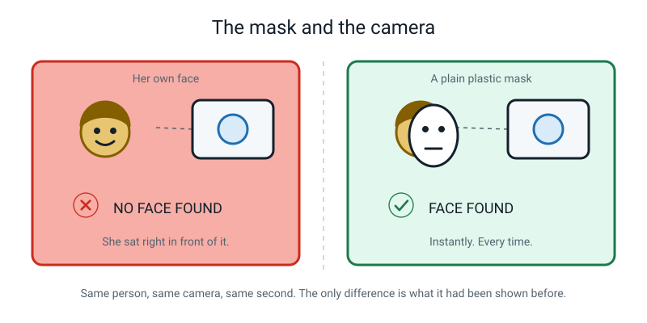
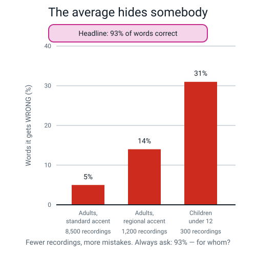
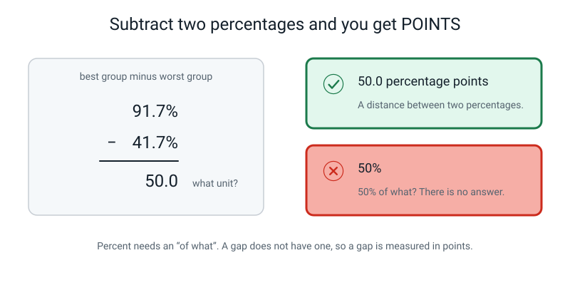
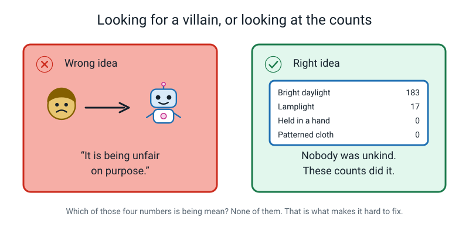
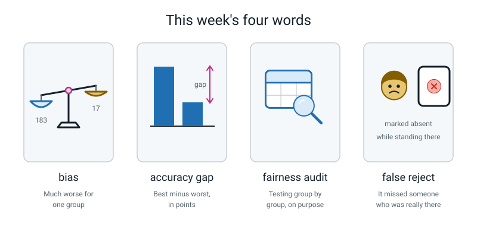

# Week 31 — Who Is Missing From the Photos?

[⬅ Week 30](week-30.md) · [Course Home](../README.md) · [Week 32 ➡](week-32.md) · [Workbook](../workbook/week-31.md)

---

> ### This week in one sentence
> **Bias is not a machine being mean — it is a gap in *who was in the training photos*, showing up later as a gap in *accuracy*.**
>
> **By the end of this chapter you will be able to:**
> - Work out the accuracy of each group separately, showing the division every time
> - Write the **accuracy gap** between the best and worst group, with the right unit — **percentage points**
> - Trace a gap you measured back to one specific **count** in the training data
> - Say why the groups have to be chosen *before* anyone looks at the results
> - Write a sealed, dated prediction about the group your own model will fail on
>
> **Reading time:** about 20 minutes. **Homework:** about 50 minutes.

---

## 🪝 Start Here

A few years ago a researcher named Joy Buolamwini was building an art project. It needed one simple thing: a computer that could notice there was a human face in front of the camera. Face-detection software has been around for years. This was meant to be the boring part.

It would not see her.

She sat right in front of the camera. Nothing. Moved closer. Nothing. Moved the lamp. Nothing. Meanwhile the same software, on the same laptop, in the same room, found everybody else in her lab immediately.

So she picked up a white plastic Halloween mask that was lying on the desk, and held it in front of her own face.

**Face found. Instantly.**

Mask down: nothing. Mask up: face. Down: nothing. Up: face.


*Figure 31.1 — Same person, same camera, same second. A blank plastic mask was easier for it to see than a human being.*

Now here is the part that actually matters, and it is not the mask.

**She did not shrug, and she did not just complain about it. She built a test set.** She collected 1,270 photographs of members of parliament — three African countries, three European countries — and she sorted them into groups by skin tone and by whether the person was a man or a woman. Then she ran three face-analysis products that real companies were already selling to real customers. This test asked a slightly different question from the mask story: for each face, was it a man's or a woman's? (The mask problem was about *finding* a face at all. The test measured *guessing a person's gender from a face*.)

On **lighter-skinned men**, none of the three got more than **0.8%** wrong. One mistake in every hundred and twenty-five, at worst.

On **darker-skinned women**, on the same test, the error rates were 20.8%, 34.5% and **34.7%**. The worst product got more than one in every three wrong.

```text
        0.8%                        34.7%
    lighter-skinned men        darker-skinned women
```

So: what was broken inside that computer?

Here is the strange answer. **Nothing was broken.** No bug. No crash. Nobody sabotaged anything. Every one of those products had been tested before it was sold, and every one of them had a headline accuracy number that looked great.

Most likely, somebody years earlier gathered a big pile of training faces. (The companies did not publish theirs, so this is the researchers' best explanation, supported by the public face collections of the time, which had far more lighter-skinned faces.) The pile probably had far more of some kinds of people in it than others — not out of malice, but because that is what was easy to collect. The model learned exactly what it was shown. And then the testing was done as **one big average**, so the hole never showed up on anybody's report.

That is all it takes. That is the whole disaster, start to finish.

> **💡 Try this:** Your Week 17 model very probably has this problem right now. You just have not measured it yet. In two weeks you will. Today we practise on somebody else's model, so that when it is your turn you already know the moves.

---

## 🧠 The Big Idea

### 1. Bias is a count, not an attitude

Start with the word, because the everyday meaning will send you in completely the wrong direction.

In normal English, calling a person **biased** is an accusation about their character. It means they hold an unfair opinion about somebody.

That is *not* what the word means here.

> **Bias** — when a model works noticeably worse for some group of inputs than for others, in a way that matters.

A model does not hold opinions. A model does not think anything about anybody. What a model has is **counts**.

```text
   WHAT IT SAW A LOT OF   →   it gets good at
   WHAT IT SAW A LITTLE   →   it stays shaky
   WHAT IT NEVER SAW      →   it is guessing, nothing to go on
```

**The analogy: revising for a test.** Imagine you revise fractions for eleven hours and decimals for twenty minutes. Then you sit a test with half fractions and half decimals. You will do brilliantly on one half and badly on the other. Nobody has to have been unkind to you. Nobody sabotaged your revision. **You are simply good at the thing you practised and shaky at the thing you barely touched.** A model is exactly that, with no feelings attached at all.

And here is the bit that surprises adults: **bias is the normal outcome, not the unlucky one.** You have to do extra work to *avoid* it. If you photograph 200 things in your kitchen on sunny afternoons, you have just built a biased model — not because you are a bad person, but because it was sunny, and afternoons are when you are free.

Most of the cases of bias you will meet in this course have the same four-link shape. (Bias can also come from how things are labelled, what is chosen to measure, or how a result is used.)


*Figure 31.2 — The chain runs left to right. The repair happens back at link 1.*

1. **Who got photographed.** Somebody decided what to collect — usually by convenience.
2. **The training data is lopsided.** 183 photos in daylight, 17 by lamplight, 0 of anything else. And nobody notices, because nobody counted.
3. **The model learns what it saw.** It becomes excellent in daylight and lost by lamplight. That is not a malfunction. Learning from examples means *copying whatever the examples were like*.
4. **Somebody gets bad answers.** A real person. Specifically the person using it after dark.

Now look at the dashed arrow, because it is the whole lesson: **the main fix is at link 1, not link 3.**

Making the model cleverer is not the answer to missing data. The first repair is going back and taking the photographs you did not take.

> **⚠️ Watch out:** "Just train it for longer" and "get a faster computer" both sound sensible and both fail. If a model has seen **zero** photos of something, thinking harder about zero still gives you zero. It is like revising for a decimals test by re-reading your fractions notes very slowly.

---

### 2. One accuracy number hides people

Here are some real-shaped numbers. A voice assistant was trained on 10,000 recordings.

| Speaker group | Training recordings | Share | Words it gets wrong |
|---|---:|---:|---:|
| Adults, standard accent | 8,500 | 85% | 5% |
| Adults, regional accent | 1,200 | 12% | 14% |
| Children under 12 | 300 | 3% | 31% |

Test it on a crowd mixed the same way and the headline comes out at about **93% of words correct**.

Ninety-three percent! That would look wonderful printed on a box. And it is not a lie. It is an average.


*Figure 31.3 — Fewer recordings, more mistakes. The headline number belongs to the big group.*

Now read the last column again. A child using that product gets **nearly one word in three wrong, all day**, in something advertised as working for everyone.

> **The rule to carry for the rest of your life: a single accuracy number is a summary, and every summary hides somebody. Always ask "for whom?"**

Write it on the inside of your pencil case:

```text
   ALWAYS ASK:  93% ... for WHOM?
```

**Sometimes the person who gets hidden is standing right in front of the machine.** There is a name for the shape this usually takes in real life, and it is not the machine saying something rude. It is the machine **failing to notice somebody**.

> **False reject** — the system fails to recognise someone who really *is* there.


*Figure 31.4 — She is standing right there. The register says otherwise.*

Look for the *second* harm in that picture — the one that is not the wrong tick.

**The burden of proof has flipped.** Normally the school has to show that a child was absent. Now the child has to prove they were present, arguing against a machine that has been right many times before, to a busy adult who has forty other things to do.

A child who has to win that argument once is annoyed. A child who has to win it every single week eventually stops arguing at all.

---

### 3. A gap is measured in percentage points

This one is small and it takes ten seconds to learn, and it is the difference between sounding like you know what you are doing and sounding like you don't.

If one group scores **91.7%** and another scores **41.7%**, what is the difference between them?

Not 50%. **50.0 percentage points.**


*Figure 31.5 — Percent needs an "of what". A gap does not have one, so a gap is measured in points.*

**Here is the test that settles it.** If you say "the gap is 50%", somebody is allowed to ask: *fifty percent of what?* And there is no answer. There is nothing it is half of. So it cannot be a percent. It is a **distance between two percentages**, and distances between percentages are called points.

> **Accuracy gap** — the best group's accuracy minus the worst group's, written in percentage points.

**The analogy: temperature.** If it was 9 °C yesterday and 14 °C today, the temperature went up by **5 degrees**. Nobody says "the temperature went up by 5 temperatures". You subtracted two measurements and got a *difference*, and a difference has its own name. Same thing here.

> **💡 Try this:** Say it out loud twice right now. "Ninety-one point seven minus forty-one point seven is fifty point zero **percentage points**." Adults get this wrong constantly. You will not.

---

### 4. Every gap has a count behind it

You have found a gap. Now find out where it came from — and the answer is almost always a number in the training data.

The audit you will meet below belongs to an app called **WhatIsIt?**, built by some Year 9 students. You point a phone camera at a mug, a spoon or a fork and it says out loud what it is. The idea was to help somebody who cannot see well find things in their own kitchen. Genuinely lovely idea.

Here is the pile of photos they trained it on. Two hundred photographs.

| Condition | Training photos |
|---|---:|
| Bright daylight, plain table | 183 |
| Lamplight | 17 |
| Held in a hand | **0** |
| Patterned background | **0** |


*Figure 31.6 — Two of the four conditions have no slice at all, because nobody took a single photo of them.*

Nobody was lazy. It was daytime, they were at school in the evenings, and you put a thing down on the table to photograph it because that is what people do.

Now put the training counts next to the test results and read across.

| Condition | Training photos | Test accuracy |
|---|---:|---:|
| Bright daylight | 183 | 91.7% |
| Lamplight | 17 | 58.3% |
| Held in a hand | **0** | 41.7% |
| Patterned background | **0** | 50.0% |

**The gap in the results is the same shape as the gap in the data.** That sentence is the single most useful thing in this chapter. Learn it in that exact shape and you can use it on anything.


*Figure 31.7 — Every gap has a count behind it. This one is 17.*

So the finished sentence of an audit is never *"the model is bad at lamplight"*. It is:

> *"Lamplight scored 58.3% **because** there were only 17 lamplight photos out of 200."*

Condition, percentage, "because", count. That is the shape. Four parts, one sentence, and a reader can check every bit of it.

> **🧑‍🏫 If a student asks:** *"Held-in-a-hand and patterned both had zero photos. Why is held-in-a-hand worse?"* Good question, and it is a judgement call, not a fact. Best answer: a hand does **two** things at once — it adds a big new region of skin-coloured pixels *and* it hides part of the object. A patterned cloth only adds distraction; it does not cover the object up. Also fair: with only twelve test photos, one photo either way is 8.3 points, so 41.7 versus 50.0 might just be luck.

---

### 5. Write the prediction *before* you look

Here is the half of this week that is real science, and it is the half most people skip.

Suppose you test four groups, look at the results, and *then* decide which groups were interesting. You have not run a test. You have told a story with numbers in it.

Two specific things go wrong, and neither of them requires you to be dishonest:

- One batch comes out embarrassingly badly, and you quietly drop it — *"oh, those photos were blurry anyway."*
- You go hunting through the numbers for a group that makes you look good, and report that one.

Both of these happen to careful, well-meaning people constantly, in real laboratories, with real scientists. The defence is almost stupidly simple.

**Write down which groups you will test, and which one you think will be worst, BEFORE you collect a single result. Then seal it.**


*Figure 31.8 — A guess written afterwards is a story. A guess written beforehand is a test.*

That sealed slip is what turns Week 33 from a demonstration into an experiment.

- If you were **right**, you get to say so *with evidence*, because there is a dated piece of paper that proves you called it in advance.
- If you were **wrong**, you write that down too, in the same size letters. And this is the more valuable result, because it means the world surprised you and you told the truth about it.

> **⚠️ Watch out:** Do not sneak a look at your training photos before you write the prediction, even though it would make you more likely to be right. The prediction is supposed to come from your *memory* of how you took the photos. Whether your memory turns out to be wrong is one of the most interesting things you will find out in Week 33.

And here is the definition that ties the whole week together:

> **Fairness audit** — deliberately testing a model group by group, with the groups chosen *first*, to find out who it fails.

Chosen first. Otherwise it is not an audit; it is a highlights reel.

---

## 🔍 Worked Examples

Three complete audits, all the way through, with every intermediate number shown. Cover the answers with your hand and try each one first.

### Example 1 — The pizza tray counter 🍕

A takeaway shop wants an app that looks at the hot tray and counts how many slices are left, so the shop's screen can say "3 left". They trained it and then tested it on **100 photos it had never seen**, in four groups of 25.

| Group | What is in the photo | Correct | Total |
|---|---|---:|---:|
| A | Plain cheese slices | 22 | 25 |
| B | Pepperoni slices | 20 | 25 |
| C | Veggie slices, loaded with toppings | 12 | 25 |
| D | Half-eaten slices | 9 | 25 |

**Step 1 — one division per group. Show every one.**

```text
   A:  22 ÷ 25 = 0.88   →  ×100 = 88.0   →  88.0%
   B:  20 ÷ 25 = 0.80   →  ×100 = 80.0   →  80.0%
   C:  12 ÷ 25 = 0.48   →  ×100 = 48.0   →  48.0%
   D:   9 ÷ 25 = 0.36   →  ×100 = 36.0   →  36.0%
```

**Step 2 — the overall number. Add the corrects, divide once.**

```text
   correct = 22 + 20 + 12 + 9 = 63
   total   = 25 × 4 = 100

   63 ÷ 100 = 0.63  →  63.0%
```

**Step 3 — the gap.**

```text
   best  = A, plain cheese   = 88.0%
   worst = D, half-eaten     = 36.0%

   accuracy gap = 88.0 − 36.0 = 52.0 percentage points
```

**Step 4 — the trace.** The shop dug out its training pile: **400 photos**.

| Condition | Training photos | Test accuracy |
|---|---:|---:|
| Plain cheese | 180 | 88.0% |
| Pepperoni | 160 | 80.0% |
| Loaded veggie | 60 | 48.0% |
| Half-eaten | **0** | 36.0% |

*"Half-eaten slices scored 36.0% because 0 of the 400 training photos showed a half-eaten slice."*

**Why zero?** Because the photos were all taken at 11 a.m., before the shop opened, when every slice in the tray was perfect. Nobody was careless. Nobody was unkind. It was just a convenient time to take 400 photographs.

**And the punchline.** The shop's headline is 63.0%. But think about *when a customer actually looks at the screen* — evening, tray half wrecked, four kinds of slices jumbled together. **The number the customer experiences could be much closer to 36.0% than to 63.0%, if most evenings look like the hard slices.**

---

### Example 2 — The boundary camera 🏏

A cricket ground installs a camera system that decides whether the ball crossed the rope. They test it on **120 saved clips** the system has never seen, 30 in each of four conditions.

| Group | Condition | Correct | Total |
|---|---|---:|---:|
| A | Day match, bright sun | 29 | 30 |
| B | Evening, under floodlights | 21 | 30 |
| C | Overcast and drizzly | 18 | 30 |
| D | Ball in the air *above* the rope | 12 | 30 |

**Step 1 — the four divisions.**

```text
   A:  29 ÷ 30 = 0.96666...  →  96.666...  →  96.7%
   B:  21 ÷ 30 = 0.70        →  70.0       →  70.0%
   C:  18 ÷ 30 = 0.60        →  60.0       →  60.0%
   D:  12 ÷ 30 = 0.40        →  40.0       →  40.0%
```

**Step 2 — overall.**

```text
   correct = 29 + 21 + 18 + 12 = 80
   total   = 30 × 4 = 120

   80 ÷ 120 = 0.66666...  →  66.7%
```

**Step 3 — the gap.**

```text
   best  = A, day match                 = 96.7%
   worst = D, ball above the rope       = 40.0%

   accuracy gap = 96.7 − 40.0 = 56.7 percentage points
```

**Step 4 — the trace.** The training set was **900 clips**, gathered from the ground's own archive.

| Condition | Training clips | Test accuracy |
|---|---:|---:|
| Day match | 780 | 96.7% |
| Floodlights | 96 | 70.0% |
| Overcast | 24 | 60.0% |
| Ball above the rope | **0** | 40.0% |

*"Balls in the air above the rope scored 40.0% because 0 of the 900 training clips showed one."*

**Now the uncomfortable question.** Which of those four situations do you think actually decides matches? Not the easy sunny ones. It is the floodlit evening game where the ball is in the air over the rope and forty thousand people are shouting.

**The system is worst exactly where it matters most.** That is not a coincidence, and it is not bad luck either: hard, rare, decisive moments are *typically* the ones there are fewest recordings of.

---

### Example 3 — The reading app 🏫

A school buys an app that listens to a child read a page aloud and marks each word right or wrong. It is used to decide which children need extra reading help.

The school runs its own test on **100 recordings**. This time the groups are **not** the same size, which matters — watch what happens.

| Group | Speaker | Correct | Total |
|---|---|---:|---:|
| A | Children who sound like the training recordings | 37 | 40 |
| B | Children with a strong regional accent | 17 | 25 |
| C | Children learning English as a second language | 9 | 20 |
| D | Children with a lisp or a missing front tooth | 5 | 15 |

**Step 1 — four divisions, four different denominators.**

```text
   A:  37 ÷ 40 = 0.925      →  92.5%
   B:  17 ÷ 25 = 0.68       →  68.0%
   C:   9 ÷ 20 = 0.45       →  45.0%
   D:   5 ÷ 15 = 0.33333... →  33.3%
```

**Step 2 — overall. Add the corrects, divide once.**

```text
   correct = 37 + 17 + 9 + 5 = 68
   total   = 40 + 25 + 20 + 15 = 100

   68 ÷ 100 = 0.68  →  68.0%
```

> **⚠️ Watch out — the trap in this example.** It is tempting to get the overall number by averaging the four percentages instead. Try it:
>
> ```
>    (92.5 + 68.0 + 45.0 + 33.3) ÷ 4 = 238.8 ÷ 4 = 59.7%
> ```
>
> **68.0% and 59.7% are both wrong-looking answers to the same question, and only one of them is right.** Averaging the percentages treats a group of 15 as if it mattered as much as a group of 40. **Always add the corrects and divide once.** That method works no matter what sizes your groups are.

**Step 3 — the gap.**

```text
   best  = A  = 92.5%
   worst = D  = 33.3%

   accuracy gap = 92.5 − 33.3 = 59.2 percentage points
```

**Step 4 — the trace.** The company's training set was **2,000 recordings**.

| Speaker group | Training recordings | Test accuracy |
|---|---:|---:|
| Sounds like the training set | 1,700 | 92.5% |
| Regional accent | 240 | 68.0% |
| English as a second language | 60 | 45.0% |
| Lisp or missing front tooth | **0** | 33.3% |

*"Children with a lisp scored 33.3% because 0 of the 2,000 training recordings were of a child with a lisp."*

**And now the harm, which is not a number.** This app is used to *decide who needs extra reading help*. So a child who reads perfectly well, but has a missing front tooth, gets marked down two times in three — and is then sent to catch-up lessons they do not need, told they are behind, and starts to believe it.

That is a **false reject** with a person inside it. The child is standing there reading the page correctly. The machine says otherwise. And the child now has to argue against a computer, to a busy adult, about their own reading.

---

## 🎲 What We Did In Class

### The Missing Group

This section is a record of the class activity, so you can redo it at home.

If you missed this, or you want to do it again from scratch, everything you need is right here.

**The setup.** You are handed somebody else's finished test. Four Year 9 students built **WhatIsIt?**, an app that names a mug, a spoon or a fork through a phone camera, to help somebody who cannot see well. They tested it on **48 photos the model had never seen** — twelve photos in each of four situations. Same three objects every time; only the surroundings change. Every photo has already been ticked right or wrong.

**Your job is the arithmetic and the thinking, not the ticking.**

| Batch | Condition | Correct | Total |
|---|---|---:|---:|
| **A** | Bright daylight, plain table | 11 | 12 |
| **B** | Lamplight, indoors, evening | 7 | 12 |
| **C** | Object held in a hand | 5 | 12 |
| **D** | Busy patterned cloth | 6 | 12 |

### Part 1 — the arithmetic

We did Batch A together, on the board, in three lines. Not one line. Three.

Here are the three lines for Batch A.

```text
   Batch A:   11 ÷ 12 = 0.91666...
              0.91666... × 100 = 91.666...
              rounded to one decimal place:  91.7%
```

**Why three lines instead of just writing 91.7?** Because one day you will put a number on a poster and an adult will ask *"where did that come from?"* — and "eleven divided by twelve" takes two seconds and ends the conversation. "The app said so" does not.

Then you did B, C and D yourself, and we filled in the row.

| Batch | Condition | Fraction | Decimal | Percentage |
|---|---|---|---|---:|
| A | Bright daylight | 11/12 | 0.9167 | **91.7%** |
| B | Lamplight | 7/12 | 0.5833 | **58.3%** |
| C | Held in a hand | 5/12 | 0.4167 | **41.7%** |
| D | Patterned cloth | 6/12 | 0.5000 | **50.0%** |

```text
   best group  = A, bright daylight   at  91.7%
   worst group = C, held in a hand    at  41.7%

   accuracy gap = 91.7 − 41.7 = 50.0 percentage points
```


*Figure 31.9 — Fifty points of daylight between the best group and the worst one.*

> **The homework asks you to write out all four divisions properly.** Not because the answers are secret — they are right here — but because the *working* is the thing you are practising. In two weeks you will be doing exactly this for your own model, and your hand should already know the shape of it.

### The sneaky bit — the overall number moves

Add up all the corrects: 11 + 7 + 5 + 6 = **29**, out of 48 photos.

```text
   29 ÷ 48 = 0.604166...  →  60.4% overall
```

Now watch this. Suppose the testers had taken **thirty** daylight photos and only six of each of the other three. Same app. Same weaknesses. Same objects. Nothing about the model changes at all.

```text
   30 daylight   × 0.917  = 27.5 correct
    6 lamplight  × 0.583  =  3.5
    6 in a hand  × 0.417  =  2.5
    6 patterned  × 0.500  =  3.0
   ──────────────────────────────────
                   36.5 correct out of 48   →   76.0%
```

**60.4%, or 76.0%. Same model, same objects.** The only thing that changed was how many photos of each kind somebody chose to take.

If a number can be shoved 15.6 points by a decision a person makes with their own hands, **that number is not telling you about the model. It is telling you about the tester.**

Which one would a company put on its website? The 76.0%, obviously. And they would not even be lying. That is exactly what makes this hard.

**So: report the per-group table, or report nothing.**

### Part 2 — the trace

Then the training counts were turned face up: 183 daylight, 17 lamplight, 0 held-in-a-hand, 0 patterned. You drew an arrow on the page, in pen, from the 58.3% result back to the 17 — and wrote the sentence:

> *"Lamplight scored 58.3% because there were only 17 lamplight photos out of 200."*

### Part 3 — the pre-registration

This was the last twenty minutes, and Week 33 cannot happen without it. You filled in a slip about **your own** Week 17 model. Here is the slip.

```text
   MY SEALED PREDICTION

   Four groups I will test in Week 33:
     1. ______________________________  (my control — matches training)
     2. ______________________________
     3. ______________________________
     4. ______________________________

   I predict the WORST group will be: ______________________________

   Because: ______________________________________________________

   Signed ____________________     Date ____________________
```

Group 1 is always the **control** — whatever matches how you actually took your training photos. The other three are things you *suspect* were rare or missing. Then it went in an envelope, the envelope got sealed and dated, and somebody wrote **OPEN IN WEEK 33** on the front in large letters.

**If you were away, do this bit tonight and do it honestly** — from memory, without looking at your training photos. Then seal it and write today's date on the outside.

---

## 💬 Talk About It

Take these to a parent, a grandparent, a friend, anybody. You are not trying to win; you are trying to find out what they think.

**1. "A face scanner marks you absent while you are standing at the gate. Who has to prove what?"**

> *Hint:* work out who has to do the arguing, and how many times they would have to do it in a school year. Then ask what happens to a person who loses that argument four times in a row.

**2. "A company's app is 93% accurate overall and 69% accurate for children. What should be printed on the box?"**

> *Hint:* both numbers are true. Ask which one a buyer needs, and then ask a sneakier question — who would be *harmed* by putting the honest number on the box, and who would be *helped*?

**3. "Is it fair to blame the people who took the photos, if they never meant any harm?"**

> *Hint:* try separating two different questions — *did anyone intend this?* and *who is being hurt by it?* You can answer "no" to the first and still have a lot of work to do about the second. See whether the person you are talking to keeps the two questions apart.

---

## ⚠️ Don't Get Tricked

This section lists four sentences that sound sensible but are wrong. Each one comes with a better version.

### 1. "Biased means somebody was being mean"

| ❌ Wrong | ✅ Right |
|---|---|
| "This model is biased, so the people who made it must have been unfair on purpose." | "This model is biased, so let me go and look at the counts in the training data." |


*Figure 31.10 — Which of those four numbers is being mean? None of them. That is exactly what makes it hard to fix.*

Point at 183, 17, 0 and 0 and ask which one is being unkind. There is no answer. And notice the awkward half of that: **because there is no villain, there is nobody to tell off — you have to go and take 30 photographs instead.** Blame is quick. Photographs take an evening.

### 2. "So we need a better model"

| ❌ Wrong | ✅ Right |
|---|---|
| "It's bad at lamplight, so we should train it for longer / get a faster computer / use a cleverer model." | "It's bad at lamplight because it has seen zero lamplight photos. I need to go and take lamplight photos." |

A model that has never seen a photo taken by lamplight cannot become good at lamplight by thinking harder about the photos it *does* have. Zero examples, processed brilliantly, is still zero examples.

### 3. "The gap is 50%"

| ❌ Wrong | ✅ Right |
|---|---|
| "The gap between the best and worst group is 50%." | "The gap between the best and worst group is 50.0 percentage points." |

Fifty percent **of what?** There is no answer, so it cannot be a percent. Ten seconds to fix, and it makes everything else you say sound more careful.

### 4. "The overall accuracy is the real number"

| ❌ Wrong | ✅ Right |
|---|---|
| "It's 60.4% accurate. The group numbers are extra detail for people who care." | "The per-group table is the real result. 60.4% is a fact about *my test*, not about the model." |

This one is exactly backwards, and you have already seen the proof: the overall number moved from 60.4% to 76.0% without the model changing at all. **The per-group table shows how the model behaves on each group (with only 12 photos per group it is a rough picture, not an exact one). The overall number depends on your test.**

---

## 🌍 Where You've Seen This

Here are six places where you may meet the same chain in daily life.

1. **Voice assistants and children.** Ask one to play a song and watch how often it mishears a younger sibling compared to an adult. There were far fewer children's voices in the training recordings, and that may be why.
2. **Face unlock in a dark room.** It works instantly at your desk in daylight and gives up at 11 p.m. under a lamp. That could be a training-data gap, or it could be the camera hardware (some phones use infrared and work in the dark). Worth wondering about.
3. **Automatic subtitles.** Watch the captions on a video where somebody has an accent the platform has heard less often, or where two people talk at once. The errors are not spread evenly — they land on particular voices.
4. **Handwriting apps and left-handed writers.** Left-handed people often slant letters differently, and there may be fewer left-handed writing samples. Same chain, four links, all over again.
5. **Photo apps that "recognise your pet".** It knows your dog perfectly and confidently insists that next door's cat is your dog. Guess whose photos are in the album 400 times.
6. **Spellcheck and names.** Common names sail through; less common ones get a red squiggle and a suggestion to change them. That squiggle is a count, showing up as a judgement.

---

## 🔁 Back to the Mask

This section returns to the story that opened the chapter and compares her steps with yours.

Remember how this chapter opened. A researcher called **Joy Buolamwini** sat in front of a camera
that would not see her, picked up a white plastic Halloween mask, and held it over her own face.
Face found, instantly.

Now look at what you did this week and notice that **you did the same thing she did.**

| Joy Buolamwini, a few years ago | You, this week |
|---|---|
| Noticed the software failed on *her* and not on her lab-mates | Noticed your model was worse on one group than another |
| Did not shrug, and did not just complain | Did not shrug either |
| **Built a test set** — 1,270 photos, sorted into groups | **Built a test set** — your photos, sorted into groups |
| Reported the result split by group, not as one number | Split your accuracy by group, not as one number |
| Found 0.8% wrong for lighter-skinned men, **34.7%** for darker-skinned women | Found your own gap, in percentage points |

That is the whole method, and it is not complicated. **Count who is in your data. Split your results
by group. Report the gap.** You now know how to do the kind of thing that pushed companies to improve their
products.

> **🔑 And here is the sentence to keep.** When she found that gap, nothing inside those products was
> broken. There was no bug. Every one of them had a headline accuracy number that looked great — and
> that single number was **hiding** the 34.7%. A model does not need a fault to fail somebody. It only
> needs a lopsided pile of examples and one number that nobody split up.

One more thing worth knowing. Those results were published, the companies were told, and within
months the worst gaps in some of those products had shrunk by a lot. **The measurement is what forced
the fix.** Nobody argued their way to it and nobody was shamed into it — somebody counted.

---

## 🧭 Where This Fits

This section shows where this week sits on the course map.

WORDS is done, so it goes plain like every other finished box, and a new one shades in beside it:
**WHO IT FAILS**. Everything you have built this year has been a machine. This is the first week the
map asks about the *people on the other side of it*.


*Figure 31.0 — The map in Week 31. WORDS has turned plain with its full range, weeks 27 to 30, and WHO
IT FAILS is the newly shaded box. Only one dashed box is left on the whole map. The lit threads are
**data** and **impact** — a count on one end, a person on the other.*

| | |
|---|---|
| **The mental model you now own** | **Bias is a count, not an attitude.** There are four links in the chain: who got photographed → the data comes out lopsided → the model copies the lopsidedness → **a real person gets bad answers**. The main fix is at link one, not at a cleverer model. |
| **The one question it answers** | *"Accurate for whom — and how many training examples did that group actually get?"* |
| **What it plugs into** | Week 6's *"who is missing from this table?"*, and Week 20's rule that one number on its own describes nobody. Neither of those was really about tables or averages. They were both about this. |
| **What carries forward** | Next week's trust questions, and Week 33's audit of **your own** model — where this stops being somebody else's story and becomes your own gap, written in percentage points, about a machine you made. |
| **Spiral thread** | 📊 **Data** — a gap always starts as a missing pile of examples — and 🌍 **Impact** — because the last link in the chain is a person, not a percentage. |

> **💡 Try this:** count the dashed boxes left on the map. There is one. Write the number **1** next to
> it, and then notice that the last thing this year does, after teaching you to find a gap, is hand you
> the tools to build something anyway.

---

## 🔑 Remember This

Keep these eight points from the week.

- **Bias is a count, not an attitude.** A model has no opinions. It gets good at what it saw a lot of and stays bad at what it barely saw.
- **The chain has four links**: who got photographed → the data is lopsided → the model copies it → a real person gets bad answers. **The main fix is at link 1.**
- **A single accuracy number hides somebody.** Always split it up, and always ask *for whom?*
- **Subtract two percentages and you get percentage points**, never percent. If someone can ask "of what?" and there is no answer, it is points.
- **Every gap has a count behind it.** The finished sentence is always *"[group] scored [x]% because only [n] of the [total] training examples were [that group]."*
- **Choose the groups before you look at the results, and write your guess down first.** A guess made afterwards is worth almost nothing. A wrong guess made beforehand is worth a lot.
- **Twelve photos per group can spot a big gap, not a small one.** Fifty points is unlikely to be luck alone (and it matches the training counts), but say "only twelve photos". Three points is probably luck — go and take more photos before you claim it.
- **The measurement is what forces the fix.** Joy Buolamwini did not win that argument by arguing. She counted 1,270 photos, split the result by group, and published the gap — 0.8% against 34.7%. That is the move, and you now know how to make it.

---

## 📓 New Words

These are the four words you learned this week.


*Figure 31.11 — This week's four words, drawn.*

| Word | What it means | Example |
|---|---|---|
| **bias** | When a model works noticeably worse for one group than another, in a way that matters — because it saw far fewer examples of that group. Not the model being mean. | 91.7% in daylight, 41.7% for an object held in a hand |
| **accuracy gap** | The best group's accuracy minus the worst group's, written in percentage points | 91.7 − 41.7 = **50.0 percentage points** |
| **fairness audit** | Deliberately testing a model group by group — with the groups chosen *first* — to find out who it fails | Four batches of twelve photos, scored on paper, one division per batch |
| **false reject** | When a system fails to recognise someone who really is there | A student marked absent while standing at the gate |

---

## 📤 Your Homework

Go to **[the Week 31 workbook](../workbook/week-31.md)**. About **50 minutes** in total.

| Page | What to do | Time |
|---|---|---|
| **31.1** | **The 48-photo audit, properly.** All four per-group accuracies with the division written out in full, the overall accuracy, and the gap in percentage points with the unit spelled out in words | 15 min |
| **31.2** | **The trace.** Match every accuracy to its training count and write one *"because"* sentence per row | 10 min |
| **31.3** | **The school gate.** False-reject arithmetic: 180 days, two groups, four years — and three harms that are not the number itself | 15 min |
| **31.4** | **Your own groups and your dated prediction.** Four groups you will test in Week 33, and a signed, dated guess at which will be worst, and why | 5 min |
| **31.5** | Vocabulary: four words, one sentence each, in your own words | 5 min |

> **⚠️ Watch out:** On page 31.4 you will be **held to your prediction in Week 33**, out loud. That is the deal, and it runs both ways: if you were right, you get to say so with a dated piece of paper in your hand. If you were wrong, we write that down too — in the same size letters — and it counts just as much. Being wrong on paper is science. Being vague on purpose is not.

---

[⬅ Week 30](week-30.md) · [Course Home](../README.md) · [Week 32 ➡](week-32.md) · [📓 Workbook — Week 31](../workbook/week-31.md) · [Glossary](../../glossary.md)
