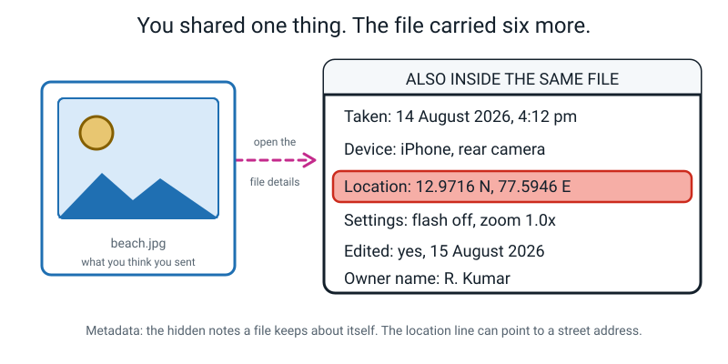
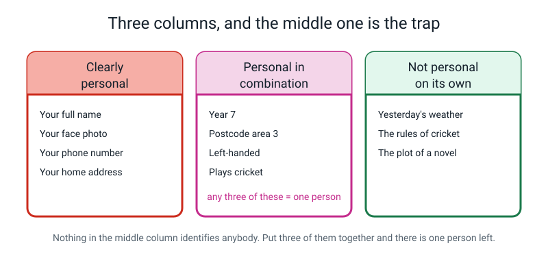
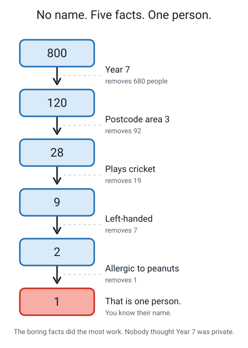
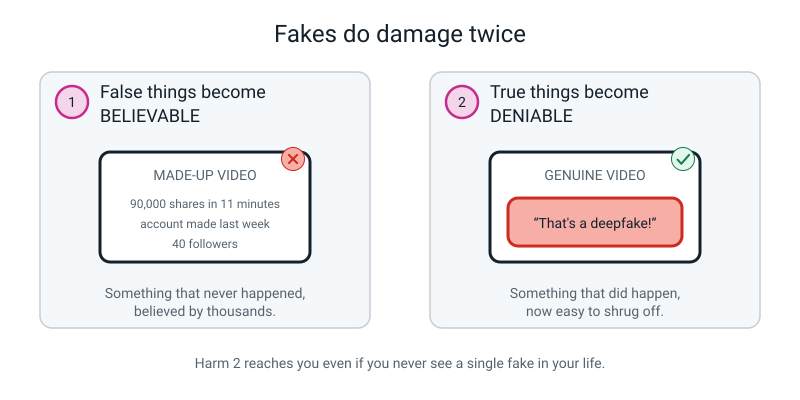
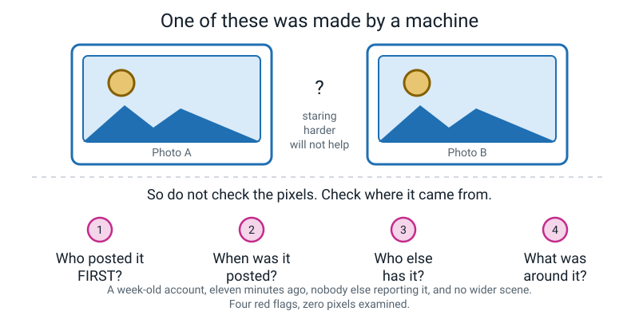
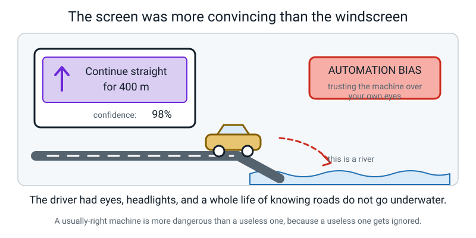
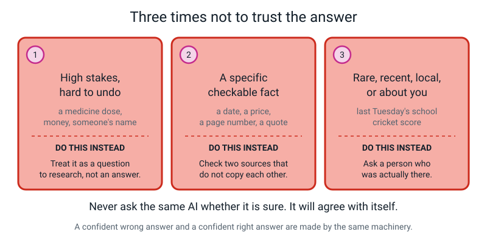
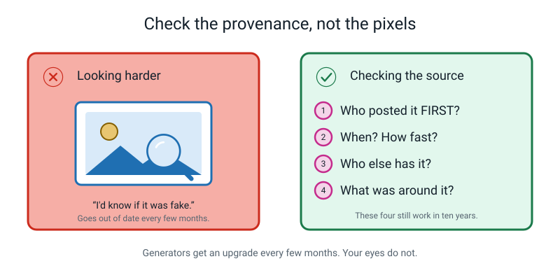
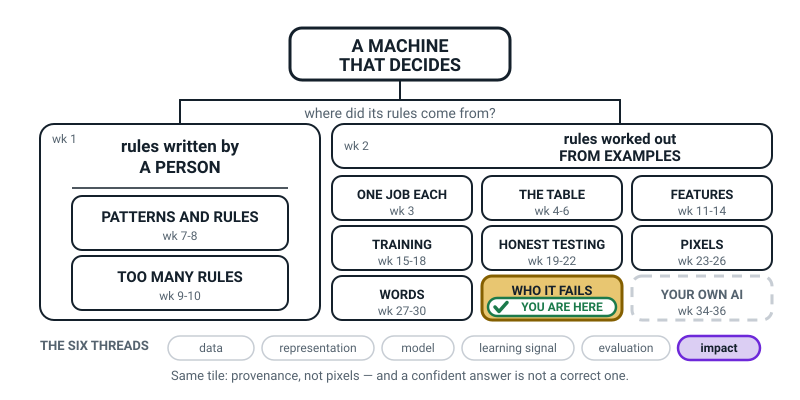
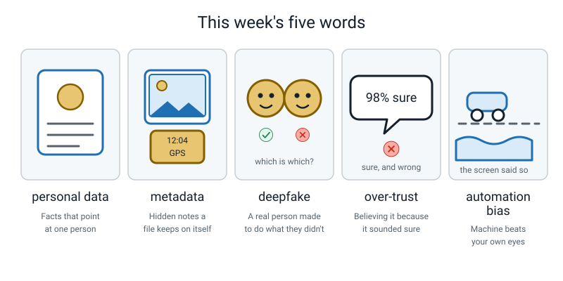

# Week 32 — Your Data, Fakes, and Trusting Too Much

[⬅ Week 31](week-31.md) · [Course Home](../README.md) · [Week 33 ➡](week-33.md) · [Workbook](../workbook/week-32.md)

---

> ### This week in one sentence
> **A photo carries more than a picture, a confident answer is not a correct one, and something that looks completely real can be made in ten minutes.**
>
> **By the end of this chapter you will be able to:**
> - Take five "anonymous" facts and narrow eight hundred people down to one
> - Name three things a photo file carries besides the image, and find them on a real file
> - List the **four provenance checks**, and say why staring at the pixels does not work
> - Define **automation bias**, give a real example, and name one habit that defends against it
> - Fact-check three confident statements against a real source without guessing from tone
>
> **Reading time:** about 20 minutes. **Homework:** about 50 minutes.

---

## 🪝 Start Here

You take a photo of yourself in your garden and you post it.

What did you just share?

You are thinking: *my face*. Fair enough. Here is what actually went out of the door.

Your face. The house number on the gate behind you. Your school uniform, so now somebody knows which school. Your neighbour's car number plate. A reflection in the window, which sometimes shows the inside of the room. The plants, which tell somebody roughly what country and what season. The shadow, which gives away the time of day.

And then, attached to the file — not visible in the picture, *attached to the file* — the exact latitude and longitude to about five metres, the exact date and time to the minute, the make and model of your phone, and sometimes the owner's name.

**You shared one thing. You gave away eleven.**


*Figure 32.1 — You shared one thing. The file also carried hidden notes of its own: six of them are listed here, all attached before anybody even looked at the picture.*

Which of those eleven did you actually agree to share? One. The face.

Now — and this matters more than the list — **we are not going to be frightened of this.** Being scared of your own camera is a useless outcome. Being able to open the file, look at what is in there, and then *decide for yourself* what to send is a genuinely useful skill that most adults do not have.

This week is three ideas, and they all have the same root:

1. **It knows more about you than you gave it.**
2. **It can manufacture things that never happened.**
3. **You believe it, because it sounds sure.**

They belong together because in all three cases, **the confident surface hides the machinery underneath**. A photo looks like just a picture. A generated video looks like a recording. A fluent sentence looks like a fact. The surface is the thing that fools you every time.

---

## 🧠 The Big Idea

### 1. "Personal data" is much wider than your name

> **Personal data** — any information that is about an identifiable person, **or that could be combined with other information to identify them.**

That second half is the whole lesson, and almost nobody thinks about it.

Sort information into three columns. The danger does not live in the first column, where everyone expects it. It lives in the middle.


*Figure 32.2 — Nothing in the middle column identifies anybody. Put enough of them together and there is one person left.*

| Clearly personal | Personal **in combination** | Usually not personal |
|---|---|---|
| Full name, face photo | Postcode area + birthday + school year | Yesterday's temperature |
| Home address, phone number | "the only left-handed goalkeeper in Year 7" | The rules of cricket |
| Voice recording, fingerprint | Your exact route to school | A photo of an empty street |
| School ID number | The times of day you are online | The plot of a novel |

Not one single item in that middle column identifies anybody. Put enough of them together (in the town of 800 below, it takes five) and there is exactly **one** person they can refer to.

That trick has a name.

> **Re-identification** — working out who an "anonymous" record belongs to, by combining facts that seem harmless on their own.

It is why *"we removed the names, so it's anonymous"* is one of the most commonly repeated false statements in the whole of technology.

**The analogy: the missing-bag poster.** "It's a bag" narrows nothing. "It's blue" narrows it a bit. "It's blue, it's got a bottle on the side, and there's a cricket sticker on the zip" and suddenly there is exactly one bag in the lost property room. **Each clue was useless. Three clues together were a name.**

**The concrete version — eight hundred people, five facts, ninety seconds.**


*Figure 32.3 — No name. Five ordinary facts. One person.*

| Fact revealed | People still possible | People removed by that fact |
|---|---:|---:|
| *(start)* | 800 | — |
| Year 7 | 120 | **680** |
| Lives in postcode area 3 | 28 | 92 |
| Plays cricket | 9 | 19 |
| Left-handed | 2 | 7 |
| Allergic to peanuts | **1** | 1 |

Now look at that right-hand column, because it is the actual lesson.

**Which fact did the most work?** "Year 7". It deleted **680 people out of 800** all by itself.

**Which fact feels the most private?** The peanut allergy, obviously. And the peanut allergy removed **one** person.

> **The facts that identify you are not the facts that feel private.** Everybody protects the allergy. Nobody thinks twice about their school year. That mismatch is exactly why properly anonymising data is so much harder than it looks.

And here is the trade-off with no clean answer. Suppose you now try to make that record genuinely anonymous. Delete the year group — but the dataset was collected *to plan school lunches by year group*, so it can no longer do its job. Blur the postcode, drop the handedness, bucket the ages, and eventually you have a perfectly private dataset that answers no questions at all. **That trade is real, it is permanent, and noticing that it exists is the achievement.**

---

### 2. Metadata: the notes a file keeps about itself

> **Metadata** — the hidden information a file carries about itself: when it was made, on what device, and often exactly where.

You have already met the idea in the hook. Here is the part worth pinning down: **this information is not held by the app. It is inside the file.** Which means if you send the file, you send all of it.

**A photo taken on a phone usually carries:**

| What | How exact |
|---|---|
| Date and time | To the minute, sometimes the second |
| Device | The make and model of the phone |
| Camera settings | Exposure, whether the flash fired, which lens |
| Location | Latitude and longitude, often to about five metres |
| Edit history | Often just that it was edited, and with which app |

> **💡 Try this:** Do it for real, tonight, on one of your own photos. **On a Mac:** open it in Preview → Tools → Show Inspector → click the **i** tab, then the **GPS** tab. **On Windows:** right-click the file → Properties → Details. If there is a latitude and longitude, paste it into a map and look at where you were standing.
>
> If nothing shows up, that is a finding too — it means either the location setting was off, or something stripped it. **Most chat apps remove metadata when you send a photo through them**, which is genuinely good for your privacy and completely ruins this demonstration.

**And metadata is not the enemy.** It is how your photos sort themselves by date, how a map of your holiday gets built automatically, how a photographer proves a picture is theirs, and how the time on a photo can prove where somebody was when it mattered. **The skill is choosing, not avoiding.**

**What about models — do they remember your data?** Two honest answers, because this is not a simple yes or no.

- **Your Teachable Machine classifier does not store your photos.** It stores numbers it learned from them. You cannot open it up and get a photograph back out. That is genuinely reassuring — but it is not *total* reassurance, because a model trained on 30 photos of your bedroom has still learned quite a lot about your bedroom.
- **A text-generating model is more alarming.** Because it was trained to reproduce likely text, text that appeared many times in its training data can come back out **word for word** — including things like phone numbers that happened to sit on a webpage. Nobody programmed that in. It is a side effect of "learn to continue text really well".

> **The rule: data you put into a system is data you may not be able to take back out.** Once it is inside a trained model, "please delete it" is a far harder request than it sounds.

---

### 3. Deepfakes: check where it came from, not what it looks like

> **Deepfake** — a photo, video or voice recording of a real person doing or saying something they never did, made by an AI.

Fake pictures are as old as photography. Three things changed, and it is the three *together* that matter:

| Before | Now |
|---|---|
| Took an expert days | Takes anyone minutes |
| Cost money | Costs nothing |
| One at a time | Thousands, automatically, each slightly different |
| Voices were hard to fake | A few seconds of audio is enough |

And there is a second harm that is sneakier than the first, and most adults miss it completely.


*Figure 32.4 — Harm 2 reaches you even if you never see a single fake in your life.*

**Harm 1: false things become believable.** Something that never happened, believed by thousands.

**Harm 2: true things become deniable.** Once everybody knows convincing fakes exist, a person caught on *genuine* video can simply say *"that's a deepfake"* — and plenty of people will believe them.

So the technology damages truth twice. It makes false things believable **and** it makes true things deniable. And that second one gets to you even if no fake ever crosses your screen.

**Now: how do you tell?**

Not by looking. Please, not by looking.

Weird hands, blurry teeth, six fingers, strange ears — generators fix those every few months, and *"I can tell"* is precisely how people get fooled. Your eyes do not get an upgrade every few months. The generators do.

Instead, learn four questions that are about **where the file came from**, not what is in it. These do not go out of date.


*Figure 32.5 — Two identical-looking photos. Staring harder will not help. The four questions underneath will.*

1. **Who posted it FIRST?** Not who sent it to you — scroll back to the original. An account created last week with nine posts is a loud red flag.
2. **When was it posted?** Eleven minutes ago, with 90,000 shares, from an account with 40 followers, is not how things spread naturally.
3. **Who else has it?** A real event has several independent witnesses. One video and silence everywhere else is the *shape* of a fake.
4. **What was around it?** Reverse-search one frame. Old real footage relabelled as something new is the commonest fake of all — and it needs no AI whatsoever.

Then a fifth question, which is about **you** rather than the file:

> **Who benefits if I believe this and pass it on — and does it happen to confirm something I already wanted to be true?**

Be honest about that one. **A fake that annoys you gets checked. A fake that delights you gets forwarded.**

---

### 4. Over-trust: the flaw is in us, not the machine

> **Over-trust** — accepting an AI answer without checking, because it sounded sure.
>
> **Automation bias** — the human habit of trusting a machine's answer more than our own judgement, especially when we are tired, rushed or unsure.

Notice where the flaw lives. **Not in the machine. In the person.**

There is an entire genre of news story where a driver follows a satnav down a boat ramp into a river.


*Figure 32.6 — The driver had eyes, headlights, and a lifetime of knowing that roads do not go underwater.*

They could **see the water**. They had eyes and headlights and years of knowing that roads do not usually go underwater. The screen was so confident, and had been right so many times before, that it beat the evidence in the windscreen.

Which leads to something genuinely counter-intuitive:

> **A usually-right machine is more dangerous than a useless one.** A useless one gets ignored. A usually-right one gets trusted on the exact day it is wrong.

You already have the technical half of this from earlier in the year. From Week 16: a confidence score means *"the best of my options"*, not *"the probability I am right"*. From Week 29: a text generator produces true sentences and invented sentences in exactly the same smooth voice, because there is no wobble channel — no built-in way for it to sound unsure.

**A confident wrong answer and a confident right answer are made by the same machinery and look identical.**

So here are the three situations to actually memorise.


*Figure 32.7 — Print this one and stick it somewhere you will see it.*

1. **High stakes and hard to undo.** A medicine dose, money, a message you cannot unsend.
2. **A specific, checkable fact.** A date, a page number, a price, a score. Specific facts are exactly where invention happens most freely, because a made-up number *looks* exactly like a real one.
3. **Rare, recent, local, or about you.** Last Tuesday's school match. A bus timetable in your town. Anything there was hardly any text about in the first place.

And a fourth, which is about you: **when you are in a hurry and the answer is what you were hoping for.** That combination defeats more people than any technical flaw ever will.

**Now the other side, because this week must not land as "AI bad".** Use AI freely where a wrong answer is cheap and easy to check: brainstorming, first drafts, explaining something you are then going to verify, rewriting your own words, making practice questions for yourself.

> **The rule: push the AI toward drafting, and keep the deciding for yourself. You are the last checkpoint, and the last checkpoint is not allowed to be asleep.**

---

## 🔍 Worked Examples

### Example 1 — The canteen dataset 🍕

A school wants help planning lunches, so it publishes a spreadsheet on its website. Very sensibly, it **removes every name first** and announces that the data is now anonymous.

Here are four rows of it. There are 600 rows in total.

| Year | Postcode area | Lunch choice | Bus route | Days late this term |
|---|---|---|---|---:|
| 7 | 3 | vegetarian | B | 0 |
| 8 | 1 | non-vegetarian | A | 2 |
| **7** | **5** | **vegetarian** | **C** | **9** |
| 9 | 3 | non-vegetarian | A | 1 |

**The question: can you work out who row 3 is?**

**Step 1 — start with the whole school.** 600 students.

**Step 2 — apply "Year 7".** The school has 600 students across five year groups, roughly evenly.

```
   600 ÷ 5 = 120 students in Year 7
```

**Step 3 — apply "postcode area 5".** The school draws from six postcode areas, and area 5 is one of the smaller ones — about 40 students.

```
   still possible: about 40 × (120/600) → roughly 8 students
```

Let us do it more carefully: of the 40 students in postcode area 5, about a fifth are in Year 7.

```
   40 ÷ 5 = 8 students
```

**Step 4 — apply "bus route C".** Route C serves the far side of the town. Of those 8, maybe 3 use route C.

```
   3 students left
```

**Step 5 — apply "9 days late this term".** Nine is a lot. In a group of three, quite possibly only one of them. (The numbers in these steps are made up to show the idea, not measured from real data.)

```
   1 student.
```

**We just narrowed a file with no names in it down to one specific child** — and anyone who knows the school could now put a name to row 3. And we did it using year group, postcode area, bus route and lateness — four columns that anybody publishing that spreadsheet would describe as harmless background information.

**Which single column did the most work?** Year 7 — it removed 480 of the 600 in one step. **Which one feels the most private?** The lateness. Which removed two people.

**Now the bit that makes it serious rather than clever.** Combine the lunch choice column with anything else and you may have revealed a family's religion. Combine the lateness column with the postcode and you have built something that looks a lot like a judgement about a neighbourhood. **Nobody intended either of those.** They published a spreadsheet about sandwiches.

---

### Example 2 — The retirement video 🏏

A video reaches you. A famous cricketer, at what looks like a press conference, saying they are quitting. Posted **eleven minutes ago**. The account that posted it has **40 followers** and was **created last week**. It already has **90,000 shares**.

Watch how far we get **without looking at the video even once**.

**Check 1 — SOURCE. Who posted this first?**

Not who sent it to me. I tap the account itself. Join date: last week. Post count: nine. Has it ever posted about cricket before? No.

Then I go to the athlete's **own verified account**, and to their **club's account**. If somebody is retiring, it is there. **It is not there.** That is a very loud silence.

**Check 2 — WHEN. Is the timing plausible?**

Eleven minutes old. 90,000 shares. From 40 followers. Do the arithmetic:

```
   90,000 shares ÷ 40 followers = 2,250 shares per follower
```

Forty followers cannot explain that. Shares come from other people passing it on, so a huge number of other accounts would have had to pick it up within minutes. That happens to real news from a big, trusted source. It almost never happens to a post from a brand-new account nobody follows. Either somebody is pushing it deliberately, or it was engineered to be maximally shareable. Both are reasons to slow down.

**Check 3 — WHO ELSE HAS IT. Corroboration.**

I search the athlete's name in a news app, sorted by newest. A real retirement by a famous player is covered by several independent news organisations within minutes. I deliberately check **two that are not owned by the same company**. **Nothing.**

**Check 4 — WHAT WAS AROUND IT. Reverse search.**

I screenshot one clear frame and reverse-image-search it. What I am hunting for is whether this footage exists somewhere else, with different audio, from an **older press conference on a completely different subject**. Relabelled real footage is the most common fake there is, and it takes no AI at all.

**So — is it fake?**

Here is the hardest idea in the week, and it is worth slowing down for. **We have not proved anything.**

No other source anywhere is **strong evidence**. It is not **proof**. Absence of evidence is not evidence of absence — it *is* possible, rarely, to genuinely be first.

So the correct action is not "declare it fake". The correct action is:

> **Do not share it, and wait.**

Waiting an hour costs you nothing at all. Sharing a fake costs you your credibility and helps it reach the next ninety thousand people.

**The right output of a verification check is very often "I don't know yet."** Being able to sit in that state, instead of picking a side just so the discomfort stops, is the actual skill.

---

### Example 3 — Three confident sentences 🏫

Three statements, read out in exactly the same confident voice. Two are true and one is invented. **You are not allowed to guess from tone.**

> **A.** "There are seven continents, and the largest of them by area is Asia."
>
> **B.** "A leap year happens every four years without exception, so February 1900 had 29 days in it."
>
> **C.** "Light travels much faster than sound, which is why you see the lightning before you hear the thunder."

**Step 1 — check A first.** Yes, A. The one that is probably true.

This feels like a waste of time and it is the single most important step in the procedure. **Checking a true statement and watching it come back confirmed is how you learn what "checked" actually feels like.** If you only ever check the suspicious one, you have not learned a procedure — you have just followed a hunch and got lucky.

Atlas, index, "continents". Seven continents; Asia largest at about 44 million km². **A is TRUE.** Source: the atlas, page 6.

**Step 2 — check C.** Reference book, "speed of sound": about 343 metres per second in air. "Speed of light": about 300,000,000 metres per second. Light is roughly **900,000 times faster**. **C is TRUE.** Source: the science textbook, page 112.

**Step 3 — check B.** Encyclopedia, "leap year". And here is the rule as it actually is:

```
   A year is a leap year if it divides by 4
   ... UNLESS it also divides by 100
   ... UNLESS it ALSO divides by 400
```

So:

```
   1900 ÷ 4   = 475      ✓ divides by 4     → looks like a leap year
   1900 ÷ 100 = 19       ✓ divides by 100   → so NOT a leap year
   1900 ÷ 400 = 4.75     ✗ does not divide  → exception does not apply
```

**1900 was not a leap year. February 1900 had 28 days.** (2000, on the other hand, *was* one — it divides by 400.) **B is FALSE.**

**Step 4 — the debrief, which is the actual point.**

Look at what statement B got *right*. Leap years really are roughly every four years. The arithmetic 1900 ÷ 4 = 475 really does come out whole. The sentence is the right length, in the right voice, with a specific-looking year in it. **Every ingredient is real. They have just been assembled wrongly**, into a sentence with exactly the same confident shape as the two true ones.

**How would you have known, without looking it up?**

**You would not.** Say that out loud, because it is the whole lesson. There is no tell. There is no wobble in the voice. There is no *"hmm, I'm not sure about this one"* — because the machinery that produces a true sentence and the machinery that produced that sentence are **the same machinery**.

> **⚠️ Watch out:** You are not allowed to fact-check by asking another AI. It may well confirm itself in the same confident voice, using the same machinery that produced the error. You need a source that does not come from the thing you are checking. **Two independent sources that do not copy each other, or it does not count.**

---

## 🎲 What We Did In Class

### Three Rounds

**Round 1 — the re-identification game (7 minutes).**

"There are eight hundred people in this town. I am thinking of one of them. There are no names in what I am about to read you — this is a fully anonymous record. Tell me when you know who it is."

Then five slips, turned over one at a time, and after each one: *how many people are left?*

| Slip | What it said | People left | Removed |
|---|---|---:|---:|
| 1 | Year 7 | 120 | **680** |
| 2 | Lives in postcode area 3 | 28 | 92 |
| 3 | Plays cricket | 9 | 19 |
| 4 | Left-handed | 2 | 7 |
| 5 | Allergic to peanuts | **1** | 1 |

Under ninety seconds, from eight hundred to one, with no name involved at any point.

Then the two questions that are the actual lesson: **which fact did the most work?** (Slip 1, by a mile.) **Which fact would you have thought to protect?** (Slip 5, which did almost nothing.)

**Round 2 — open up a photo (5 minutes).**

A real photo, taken on a phone, opened up on the computer, and the hidden fields read out loud: the date and time to the minute, the device, the camera settings, and — if it was there — the latitude and longitude, pasted into a map so you could see the actual spot.

The question afterwards: *"where did you think that information was stored?"* Almost everybody assumes the app is holding it. It is inside the file. **Send the file, send all of it.**

**Round 3 — two true, one invented (8 minutes).**

Three cards on the table at once, read in the same confident voice. Rule stated before anybody spoke: *check all three against a real source, name the source, no guessing from tone.*

> **CARD A.** "The Great Barrier Reef lies off the coast of Queensland in Australia. It is the largest coral reef system in the world and stretches for more than 2,000 kilometres."
>
> **CARD B.** "The blue whale is the largest animal that has ever lived. The longest ones reliably measured are about 30 metres and they can weigh over 100 tonnes."
>
> **CARD C.** "The first people to reach the summit of Mount Everest were Sir Edmund Hillary and a Sherpa named Nawang Gombu, in 1948."

| Card | Verdict | What a real source says |
|---|---|---|
| **A** | **True** | Off Queensland, Australia; the world's largest coral reef system; roughly 2,300 km long |
| **B** | **True** | Largest animal known to have ever lived; measured lengths up to about 30 m; heaviest well over 100 tonnes |
| **C** | **INVENTED** | First ascent: **29 May 1953**, by Edmund Hillary and **Tenzing Norgay** |

Card C is a beautiful specimen, so look at everything it got right. Edmund Hillary is the correct person. "Sherpa" is the correct word. **Nawang Gombu was a real Everest climber** — Tenzing Norgay's nephew, who summited in 1963. Every ingredient is real. Only the assembly is wrong, and the sentence sounds exactly as sure of itself as the two true ones.

---

## 💬 Talk About It

**1. "Which three ordinary facts about you would identify exactly one person in your town?"**

> *Hint:* you are not allowed to use a name, an address or a phone number — those are the easy case. Use facts that sound completely harmless. Then ask the adult whether they would have thought to protect any of them.

**2. "Is it worse to make a fake that people believe, or to make a world where nobody believes real videos any more?"**

> *Hint:* try to name a specific person harmed in each case. Then ask what evidence would change your mind. If nothing could change your mind, you are not having an argument, you are having a feeling.

**3. "Tell me about a time a screen was confidently wrong and you nearly believed it."**

> *Hint:* everybody has one — a satnav, a weather app, an auto-corrected word, a wrong bus time. Ask what made them doubt it in the end, and whether that thing would still have worked if they had been in a hurry.

---

## ⚠️ Don't Get Tricked

### 1. "It's anonymous — the names are gone"

| ❌ Wrong | ✅ Right |
|---|---|
| "They removed the names, so nobody can tell who anyone is." | "They removed the names. What columns are left, and how few people fit all of them at once?" |

Year group plus postcode area plus bus route plus days late got us from 600 students to one. **No name required at any point.** "We removed the names" tells you almost nothing about whether a file is safe to publish.

### 2. "I'd be able to tell if it was fake"

| ❌ Wrong | ✅ Right |
|---|---|
| "Look at the hands. Look at the teeth. I'd spot it." | "Who posted it first? When? Who else has it? What was around it?" |


*Figure 32.8 — Generators get an upgrade every few months. Your eyes do not.*

Everybody believes they could tell. That belief is exactly the thing that gets people fooled, because it stops them checking. The four provenance questions will still work in ten years; "the hands look weird" was already out of date last year.

### 3. "If I delete it, it's gone"

| ❌ Wrong | ✅ Right |
|---|---|
| "I deleted the photo, so it doesn't exist any more." | "I deleted **my copy**. I have no idea how many other copies exist." |

**Posting is not like saying something. It is like printing something.** If you posted it, somebody may have saved it; a service may keep backups for months; and if it was ever used to train a model, the model has already learned from it and usually cannot un-learn it on request.

### 4. "I'll just ask the AI if it's sure"

| ❌ Wrong | ✅ Right |
|---|---|
| "I asked it 'are you certain?' and it said yes, so it's probably right." | "I checked it in the atlas, and then in a second source that doesn't copy the first." |

It may well confirm itself in the same confident voice, using the same machinery that produced the mistake. Asking a machine to check its own answer is like asking somebody to proofread their own handwriting for legibility. **You need a source that does not come from the thing you are checking.**

---

## 🌍 Where You've Seen This

1. **A photo you sent a friend that showed more than you meant.** A shirt in the background, a letter on the table, a house number across the road. Nobody edits those out, because nobody is looking at them.
2. **"Sign in with…" buttons.** One tap and you have introduced two companies to each other. Which is convenient, and is also one of the fastest ways to combine two piles of facts about you.
3. **A recommendation that knew something you never typed.** It suggested something oddly specific, and you have no idea which combination of facts produced it. That feeling is a close cousin of re-identification: someone working out more about you than you told them.
4. **A video in a group chat with no source.** Forwarded four times, no original account visible, no news story anywhere. That is checks 1 and 3 failing simultaneously, and it happens weekly.
5. **A voice on the phone that sounded exactly like someone you know.** A few seconds of recorded audio is now enough. The defence is not your ears — it is a question only the real person could answer.
6. **Autocorrect changing a name to something wrong, confidently.** Small stakes, same machinery, same lesson: the confident thing is not the correct thing, and it will not warn you.
7. **A satnav or maps app sending somebody down a road that closed last year.** Everyone in the car can see the barrier. Somebody still says "but it says turn left".

---

## 🧭 Where This Fits

Nothing moved on the map this week, and that is the point. **WHO IT FAILS** is still the shaded box,
because this week is still about the people on the other side of a machine — only now the machine is
the one doing the fooling, and the person being let down might be you. Same box, new question: not
*who does it get wrong?* but *where did this thing come from in the first place?*



*Figure 32.0 — The map in Week 32. The same shaded box as last week, WHO IT FAILS, because your data,
fakes and over-trust all live on the same shelf as bias. One dashed box is left: YOUR OWN AI, weeks 34
to 36. Only **impact** is lit along the bottom.*

| | |
|---|---|
| **The mental model you now own** | A file carries far, far more than its picture — the time, the device, often the exact spot it was taken. **"Anonymous" usually isn't**, because the boring facts do the identifying. And something that looks completely real can be made in about ten minutes. So you **check the provenance, not the pixels**. |
| **The one question it answers** | *"Where did this come from, and who benefits if I pass it on?"* — two questions in one breath, and the second one is the sharper of the two. |
| **What it plugs into** | Week 6's five provenance questions, which you have been asking about spreadsheets since October and can now ask about a video. And Week 29's fluent falsehood: a sentence can be beautifully written and completely untrue, and nothing about the writing warns you. |
| **What carries forward** | It is the reason your Week 33 poster carries a warning sign at all, and the reason the Week 34 data card has to say what your model **is not to be used for**. A machine with no stated limits is exactly the machine people over-trust. |
| **Spiral thread** | 🌍 **Impact** — on its own this week. Nothing here is about building a better model. It is about what happens to a real person when a file, a fake or a confident answer moves through the world. |

> **💡 Try this:** open the photo details on any picture on your own phone and read what the file knows
> about you. Then decide, before you send the next one, whether you meant to send all of that too.

---

## 🔑 Remember This

- **"Anonymous" usually is not.** Names are the easy part. The boring facts — year group, postcode area, bus route — do most of the identifying, and nobody protects them.
- **A photo file carries more than the picture:** the time, the device, the camera settings and often the exact location. It travels *inside the file*, so if you send the file, you send all of it.
- **Data you put into a system may not come back out.** Deleting your copy is not deleting the data.
- **Fakes do damage twice:** they make false things believable, and they make true things deniable.
- **Check the provenance, not the pixels.** Who posted it first · when · who else has it · what was around it. Then: who benefits if I pass this on?
- **"No other source" is strong evidence, not proof.** The correct move is *don't share it, and wait.*
- **Automation bias is a fact about people, not machines** — which is why a usually-right machine is more dangerous than a useless one.
- **Push the AI toward drafting; keep the deciding for yourself.** And check hardest when the answer is exactly what you were hoping for.

---

## 📓 New Words


*Figure 32.9 — This week's five words, drawn.*

| Word | What it means | Example |
|---|---|---|
| **personal data** | Information about a person you can identify — including facts that only identify them when several are put together | "Year 7 + postcode 3 + left-handed" is personal data, even with no name |
| **metadata** | The hidden notes a file keeps about itself: when it was made, on what device, and often exactly where | A photo carrying `12:04, 14 March, iPhone, 19.0760 N 72.8777 E` |
| **deepfake** | A photo, video or voice recording of a real person doing or saying something they never did, made by an AI | A video of an athlete announcing a retirement that never happened |
| **over-trust** | Accepting an AI's answer without checking, because it sounded sure | Copying a page number straight into your homework because the answer looked confident |
| **automation bias** | The human habit of believing the machine over your own judgement, especially when rushed or unsure | Following the satnav into the river with the water visible through the windscreen |

---

## 📤 Your Homework

Go to **[the Week 32 workbook](../workbook/week-32.md)**. About **50 minutes** in total.

| Page | What to do | Time |
|---|---|---|
| **32.1** | **Data map of a real product you use.** Five questions about what it collects, who it collects it from, and whether you could say no. Mark every guess with a `?` | 15 min |
| **32.2** | **Fact-check three confident answers.** Check all three against a real source and **name the source for each one**. No guessing from tone | 15 min |
| **32.3** | **Sort twelve school-app data items** into the three columns, then break the school's claim that removing the names made it anonymous | 10 min |
| **32.4** | **The athlete video.** Apply the four checks as actions, and give two signals of a fake that need no pixels at all | 8 min |
| **32.5** | Vocabulary: five words, one sentence each, in your own words | 5 min |

> **💡 Try this:** On page 32.1 you cannot possibly know most of the answers for certain — and *that is the finding*. Write "I think it collects my location but I'm not sure `?`" rather than stating it flatly. **An honest guess clearly labelled is worth far more than a confident invention.** That one sentence is very close to the whole point of this course.

---

[⬅ Week 31](week-31.md) · [Course Home](../README.md) · [Week 33 ➡](week-33.md) · [📓 Workbook — Week 32](../workbook/week-32.md) · [Glossary](../../glossary.md)
