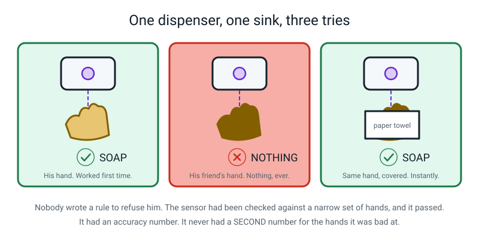
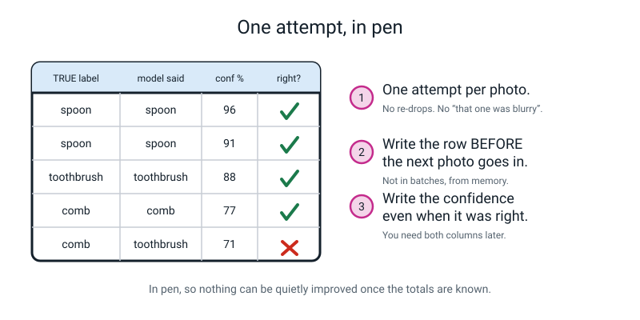
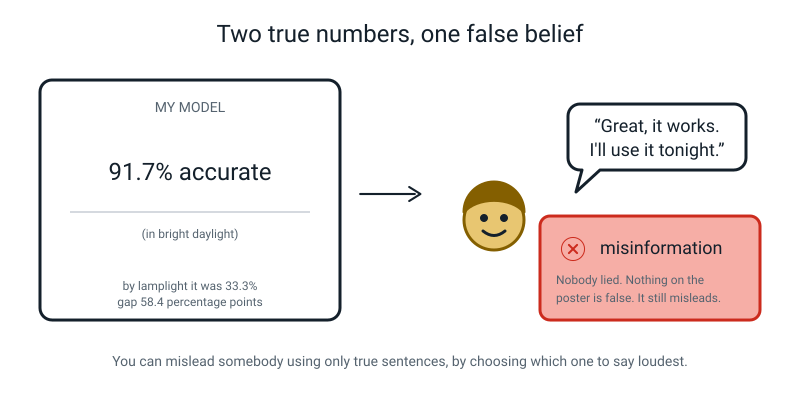
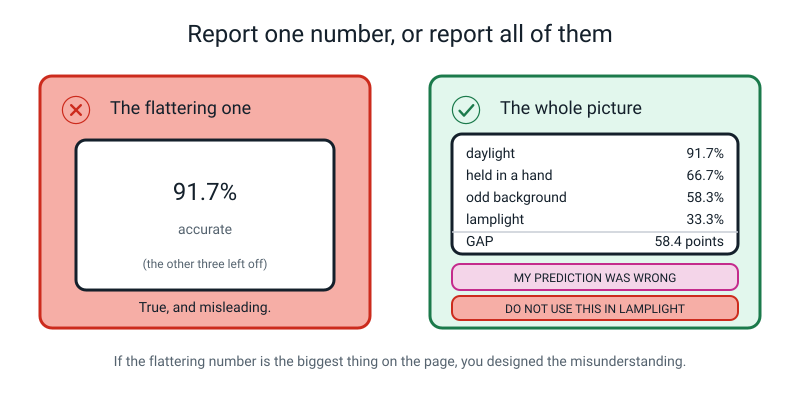
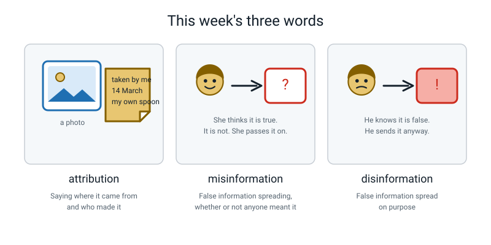

# Week 33 — Audit Your Own Model

[⬅ Week 32](week-32.md) · [Course Home](../README.md) · [Week 34 ➡](week-34.md) · [Workbook](../workbook/week-33.md)

---

> ### This week in one sentence
> **The most trustworthy thing you can do with your own model is show, with numbers, the group it fails on.**
>
> **By the end of this chapter you will be able to:**
> - Count your own training photos into four condition buckets, *before* testing anything
> - Run a four-condition fairness audit on your own model and score every photo on paper
> - Report the **accuracy gap** in percentage points, and compare it against your sealed prediction — **either way**
> - Trace your worst group back to a specific count in your own training data
> - **Price the fix in actual photographs**, with the algebra shown, and name the retest that would prove it worked
>
> **Reading time:** about 20 minutes. **Homework:** 45–60 minutes (the poster).

---

## 🪝 Start Here

A few years ago two colleagues were washing their hands at the same sink in the same hotel bathroom.

One of them put his hand under the automatic soap dispenser. Soap. Perfect.

His friend put his hand under the same dispenser, in the same place, at the same angle. Nothing.

He tried again. Nothing. He tried slowly. Nothing. He tried moving his hand around. Nothing.

Then he laid a **white paper towel** over his hand and put it under the sensor. Soap came out immediately.


*Figure 33.1 — Nobody wrote a rule to refuse him. The sensor was checked against a narrow set of hands, and it passed.*

The sensor worked by bouncing a little beam of light off your hand and measuring how much bounced back. It was most likely tuned and tested on hands that bounced back plenty of light. **Nobody in that factory hated anybody.** There was no line of code that said "refuse this person". There was no bug to find.

Now here is the sentence that matters.

**That dispenser had almost certainly been tested.** Somebody signed it off, and whatever it was tested on, it passed. What it very likely did not have was a **second number** — the number for the hands it was bad at. Nobody ever measured that, so nobody ever knew, and it shipped, and it went into hotels.

```
        WORKS            DOESN'T WORK
        ______           _____________

        my model:  ?              ?
```

Today you do the thing that factory did not do. You take your own model — the one you built in Week 17, the one you were pleased with — and you go looking, **on purpose**, for the group it fails. And whatever you find, you publish.

> **One rule for today, and it is the only one that matters:**
>
> **You are not being marked on your model's accuracy. You are being marked on whether the number you report is true.**

---

## 🧠 The Big Idea

### 1. An audit is five steps, and the order is not negotiable


*Figure 33.2 — Steps 2 and 4 are the ones that make it science rather than a story.*

```
   1 COUNT  →  2 PREDICT  →  3 TEST  →  4 TRACE  →  5 PRICE
   training     the worst    12 photos   worst group   the fix, in
   photos, by   group, and   in each of  back to a     actual photos,
   condition    seal it      4 conditions  count       with algebra
                    └────── compare ───────┘
```

1. **COUNT.** Count your own training photos, by condition. With tally marks. For real.
2. **PREDICT.** Already done — it is inside the sealed envelope from Week 31.
3. **TEST.** Twelve photos in each of four conditions, scored on paper, as you go.
4. **TRACE.** Take the worst group and find the count in the training data that explains it.
5. **PRICE.** Say how many photographs the fix costs. A number, with the arithmetic shown.

**Step 3 must come after step 2. Step 4 must come after step 3.** If you look at the results and *then* decide which groups mattered, you have not measured anything — you have selected a story. You already know why from Week 31; today you just hold the line.

**The analogy: a race.** You do not get to decide where the finish line is after everybody has crossed it. If you did, you could hand the medal to whoever you liked and call it a race. **The sealed envelope is the finish line, painted on the ground before anyone starts running.**

---

### 2. Count first — because you cannot audit from memory

This is the step almost everybody skips, and it is the step where the answer usually already is.

Get your training photos up on screen. Every single one goes into exactly **one** of four buckets:

```
   bright daylight    ____ / 120  =  ____%
   lamplight          ____ / 120  =  ____%
   held in a hand     ____ / 120  =  ____%
   odd background     ____ / 120  =  ____%
```

Tally marks. Work in blocks of ten. If a photo could go in two buckets, put it in the one that describes it best, **write a note saying you did that**, and move on. You need counts, not philosophy.

> **⚠️ Watch out:** Do not do this from memory. Here is why it matters so much. In Week 31 you predicted your worst group from your *memory* of how you took the photos. Today you count. **Memory and counting frequently disagree**, and when they do, that disagreement is the most interesting thing that will happen all lesson.
>
> One student last year was completely certain he had never once held an object up to photograph it. He had done it **22 times out of 120**. He was equally certain lamplight would be fine. He had taken **zero** photos after dark.

**The analogy: your own bedroom floor.** Ask yourself how many odd socks are under your bed. Now go and count them. The gap between your answer and the real number is exactly the gap this step exists to close.

Find your smallest bucket, and circle it. **You found that before you tested anything** — which means when the results come in, nobody can accuse you of choosing it afterwards.

---

### 3. Test honestly: four batches, one attempt, in pen

The photos for today were shot *before* the lesson, because you cannot photograph a daylight batch and a lamplight batch in the same seventy minutes — the sun refuses to cooperate.


*Figure 33.3 — Four strips of twelve. The only thing that changes between strips is the condition.*

| Batch | Condition | What it is for |
|---|---|---|
| **A** | Bright daylight, plain surface | The **control** — as close as possible to how you took the training photos |
| **B** | Lamplight, after dark, one lamp | A condition you suspect is rare |
| **C** | Held in a hand, fingers visible | A condition you suspect is missing |
| **D** | Odd, patterned background | A condition you suspect is missing |

**Change ONE thing per batch.** Same three objects every time, four of each object in every batch. If the objects change too, the audit cannot tell you which change caused the drop — and an audit that cannot say *why* is just a pile of numbers.

Now the rules for scoring, and they are not decoration.


*Figure 33.4 — In pen, so nothing can be quietly improved once the totals are known.*

1. **One attempt per photo.** Drop it in, read the top bar, write it down, move on. No re-drops. No *"that one doesn't count, it was a bit blurry."*
2. **Write the row before the next photo goes in.** Not in batches, from memory, afterwards.
3. **Write down the confidence even when the answer is right.** You need both columns later, and you will be glad of them.

**Why one attempt?** Because if you keep re-dropping a photo until you like the answer, the number you end up with is **a number about your patience, not about your model**. And why in pen? Because a scoring sheet filled in pen cannot be quietly tidied up once the totals are known. That is a real professional habit, not a school rule.

> **💡 Try this:** Star the interesting wrong answers as you go instead of stopping to discuss them. Every mistake is genuinely fascinating and talking about each one will eat your whole lesson. The starred rows make excellent poster material at the end.

---

### 4. The gap, the trace, and the price

Once 48 rows are filled, the arithmetic is short. One division per batch, then one subtraction.

Here is a complete finished audit, from a student called Rohan last year. **His numbers are not yours** — use this as "what finished looks like".

His training data, counted into buckets:

| Condition | Training photos | Share |
|---|---:|---:|
| Bright daylight, plain table | 84 | 70.0% |
| Held in a hand | 22 | 18.3% |
| Odd, patterned background | 14 | 11.7% |
| Lamplight / after dark | **0** | **0.0%** |
| **Total** | **120** | 100% |

His results, on 48 photos the model had never seen:

```
   Batch A  (daylight)     11 ÷ 12 = 0.916666...  →  91.7%
   Batch B  (lamplight)     4 ÷ 12 = 0.333333...  →  33.3%
   Batch C  (in a hand)     8 ÷ 12 = 0.666666...  →  66.7%
   Batch D  (odd b/g)       7 ÷ 12 = 0.583333...  →  58.3%

   overall:  11 + 4 + 8 + 7 = 30      12 × 4 = 48
             30 ÷ 48 = 0.625  →  62.5%

   best  = daylight   at 91.7%
   worst = lamplight  at 33.3%

   ACCURACY GAP = 91.7 − 33.3 = 58.4 percentage points
```


*Figure 33.5 — Read the row of training counts along the bottom: 84, 22, 14, 0. Now look at the bars above them.*

**The bars go down in the same order as the counts.** 84 → 91.7%. 22 → 66.7%. 14 → 58.3%. 0 → 33.3%. Your grid will have different numbers and it will almost certainly have the same *shape*.

**Which of those five numbers would a company put on its website?** The 91.7%, or maybe the 62.5%. Both are completely true sentences.

**Which number does the person using it after dark actually experience?** 33.3%. Two answers in every three wrong, all evening. **That contrast is the whole audit in one exchange.**

> **⚠️ Watch out:** The overall number is the weak one, and here is the test. Ask yourself: *how many photos of each condition did I choose to take?* You chose. So a number you can move just by choosing how many of each kind to test is **a property of your test, not of your model.** Report the per-group table, or report nothing.

**Then the trace.** One sentence, four parts, in this exact shape:

> *"Lamplight scored 33.3% **because** only **0** of my **120** training photos were taken in lamplight."*

**Then the price.** This is the only algebra in the whole of Level 1, and it is five lines.

```
   Worst condition: lamplight.     Photos of it now: 0 of 120.
   Target: 1 photo in 5, which is 20%.

   Let x = the number of lamplight photos to add.

        x / (120 + x) = 0.20
                    x = 0.20 × (120 + x)
                    x = 24 + 0.20x
                0.80x = 24
                    x = 24 ÷ 0.80
                    x = 30 photos

   Check: 30 out of (120 + 30) = 30/150 = 0.20 = 20%.  ✓

   Spread across the three classes: 10 spoon, 10 toothbrush, 10 comb.
```


*Figure 33.6 — The dashed bar on the right is a hope, not a result. It stays dashed until you retest.*

**"More data" is not a fix. Thirty photographs is a fix.** Naming the number is what turns a complaint into a plan — and it has a second effect people underrate. Once the fix has a price, you can compare it to the cost of *not* fixing it. Thirty photos is about twenty minutes of an evening. If the alternative is a tool that fails one person in three after dark, twenty minutes is very cheap indeed. And now it is an argument you can actually make to somebody.

**And the sentence everybody forgets:**

> *"I will know the fix worked when I re-run the **identical** four batches — the same 48 photos — and publish both columns, before and after. I want lamplight above 66.7% and the gap below 25 percentage points, **and** the daylight number no worse than 91.7%."*

**A fix you did not measure is a hope, not a fix.** And note that last clause: it is genuinely possible that adding 30 lamplight photos makes lamplight much better *and* makes daylight slightly worse. That happens. It is called a trade-off, it is fascinating, and **you can only ever see it if you kept the same test.**

---

### 5. Attribution, and why the warning sign is compulsory

Three new words this week. The first one is about your photos.

> **Attribution** — saying where something came from and who made it.

Every dataset is made of somebody's work, somebody's face, or somebody's life. Your 120 photos have an origin. Three cases, and the third is the hard one:

| Case | Example | What you owe |
|---|---|---|
| **You made it** | Your own 40 photos of your own comb | Nothing to anybody else. **Write the line anyway.** |
| **Somebody gave permission** | 12 photos where your brother held the object | Name him, use it only for what you agreed, delete it if he asks |
| **You just took it** | 300 images pulled off a search engine | The hard case. *"It was on the internet"* is not an answer. |

Why the third is genuinely hard: a human artist who studies 500 paintings and develops a style owes nobody anything — that is how art has always worked. A system trained on 500 paintings can produce work "in the style of" that artist thousands of times an hour, competing with them, without ever naming them. **Is that the same activity at a bigger scale, or a different activity?** Reasonable people disagree, real court cases are running right now, and nobody expects you to settle it at eleven.

You *are* expected to notice that somebody is there. **The trap is not getting the answer wrong. The trap is not seeing anyone.**

And why write an attribution line if you took every photo yourself? Two reasons, neither about rules. First: in six months you will not remember whether Batch C had your brother's hand in it — and **the count is the thing that explains your gap**, so an unattributed dataset is an un-auditable dataset. Second: the habit. *"120 photos, all mine, my own objects, 14 March"* costs ten seconds now. The day you use somebody else's 300 photos, that line will already be a reflex instead of a decision.

Now the other two words, which you met last week attached to deepfakes. Today they come home.

> **Misinformation** — false information spreading, whether or not anyone meant to deceive.
>
> **Disinformation** — false information spread deliberately.


*Figure 33.7 — You can mislead somebody using only true sentences, by choosing which one to say loudest.*

Suppose your daylight number is 91.7%, and you go and tell everybody **"my model is 91.7% accurate"**.

Every word of that is true. And every person who hears it now believes something false — that it works.

**You will have created misinformation about your own model without telling a single lie.**

And if you say it *knowing* the lamplight number is 33.3%? That is **disinformation** — made by a perfectly nice person, in a school project, out of entirely true sentences. That is how easy it is.

Which is exactly why the warning sign at the bottom of the poster is not optional.


*Figure 33.8 — Anyone can publish a good number. Publishing the boundary is the skill.*

**Three lines. Each line names a specific use and carries a measured number.** Vague warnings are worse than none, because they let a reader feel warned without telling them anything:

| ❌ Too vague | ✅ Specific and measured |
|---|---|
| "Don't use it in bad light" | "…naming anything in lamplight. Right 4 times out of 12, which is 33.3%." |
| "It's not perfect" | "…anything where a wrong answer costs something. Right 30 times out of 48, which is 62.5%." |
| "Don't use it for important things" | "…telling a comb from a toothbrush. 8 out of 16, which is 50.0%. A coin does that." |

---

## 🔍 Worked Examples

Three complete audits, all five steps, every number shown. Try each one before reading the working.

### Example 1 — Is this fruit ripe? 🍕

A model with three classes: **unripe · ripe · overripe**. Trained on **150 photos**, taken over one weekend.

**Step 1 — COUNT the training data.**

| Condition | Training photos | Share |
|---|---:|---:|
| Kitchen daylight, plain worktop | 105 | 70.0% |
| Held in a hand | 30 | 20.0% |
| On a patterned tablecloth | 15 | 10.0% |
| Inside the fridge | **0** | **0.0%** |
| **Total** | **150** | 100% |

```
   105 ÷ 150 = 0.70    →  70.0%
    30 ÷ 150 = 0.20    →  20.0%
    15 ÷ 150 = 0.10    →  10.0%
     0 ÷ 150 = 0       →   0.0%   ← circle this
```

**Step 2 — PREDICT.** Sealed two weeks ago: *"worst will be held in a hand, because fingers cover the fruit."*

**Step 3 — TEST.** 40 photos the model had never seen, 10 in each condition.

```
   A  kitchen daylight   9 ÷ 10 = 0.90  →  90.0%
   B  held in a hand     7 ÷ 10 = 0.70  →  70.0%
   C  patterned cloth    6 ÷ 10 = 0.60  →  60.0%
   D  inside the fridge  3 ÷ 10 = 0.30  →  30.0%

   overall:  9 + 7 + 6 + 3 = 25        10 × 4 = 40
             25 ÷ 40 = 0.625  →  62.5%

   best  = A, kitchen daylight  = 90.0%
   worst = D, inside the fridge = 30.0%

   ACCURACY GAP = 90.0 − 30.0 = 60.0 percentage points
```

**Now open the envelope.** Predicted worst: *held in a hand* at 70.0%. Actual worst: *inside the fridge* at 30.0%.

**PREDICTION: WRONG.** Write it down. Then the interesting question — *why* was it wrong? Because there were **30** held-in-a-hand training photos and **0** fridge photos, and the person genuinely did not remember taking any hand photos at all. **Their memory of their own data was wrong.** That is the finding, and it is worth more than being right.

**Step 4 — TRACE.**

> *"Inside the fridge scored 30.0% because 0 of my 150 training photos were taken inside the fridge."*

**Step 5 — PRICE the fix.** Target: fridge photos are 1 in 5 of the training set, which is 20%.

```
   Let x = fridge photos to add.

        x / (150 + x) = 0.20
                    x = 0.20 × (150 + x)
                    x = 30 + 0.20x
                0.80x = 30
                    x = 30 ÷ 0.80
                    x = 37.5   →   round UP to 38
```

**Always round up.** 37 photos would leave you just under the target, and the point of the number is to reach it.

```
   Check: 38 out of (150 + 38) = 38/188 = 0.2021 → 20.2%  ✓ just over 20%

   Spread across the three classes: 13 unripe, 13 ripe, 12 overripe.
```

**How I would know it worked:** re-run the identical 40 photos and publish both columns; fridge above 60.0%, gap below 30 points, daylight no worse than 90.0%.

---

### Example 2 — Which cricket shot is it? 🏏

A model with three classes: **drive · pull · sweep**. Trained on **200 photos**.

**Step 1 — COUNT.**

| Condition | Training photos | Share |
|---|---:|---:|
| Daytime, at the nets, right-handed batter | 150 | 75.0% |
| In a real match, right-handed batter | 30 | 15.0% |
| Wide angle, from the boundary | 20 | 10.0% |
| **Left-handed** batter | **0** | **0.0%** |
| **Total** | **200** | 100% |

**Step 2 — PREDICT.** Sealed: *"worst will be wide angle, because the batter is tiny in the frame."*

**Step 3 — TEST.** 32 photos, 8 in each condition.

```
   A  nets, right-handed     8 ÷ 8 = 1.000    →  100.0%
   B  match, right-handed    6 ÷ 8 = 0.750    →   75.0%
   C  wide angle             5 ÷ 8 = 0.625    →   62.5%
   D  left-handed batter     2 ÷ 8 = 0.250    →   25.0%

   overall:  8 + 6 + 5 + 2 = 21        8 × 4 = 32
             21 ÷ 32 = 0.65625  →  65.6%

   best  = A, nets            = 100.0%
   worst = D, left-handed     =  25.0%

   ACCURACY GAP = 100.0 − 25.0 = 75.0 percentage points
```

> **⚠️ Watch out — 8 out of 8 is not "perfect".** It means *you did not find the mistake yet*, with eight photos. Eight is a small number. The honest way to write it on a poster is **"8 out of 8 in the nets — but that is only 8 photos."** Never let a 100% stand naked next to a count that small.

**Open the envelope.** Predicted worst: wide angle, which came third at 62.5%. Actual worst: left-handed batter at 25.0%. **PREDICTION: WRONG**, and the reason is beautiful — the person who built it is right-handed, and every single training photo was of a right-handed batter, and it had genuinely never crossed their mind.

**Step 4 — TRACE.**

> *"Left-handed batters scored 25.0% because 0 of my 200 training photos showed a left-handed batter."*

**Step 5 — PRICE.** This time the target is stricter: left-handed photos should be **1 in 4**, which is 25%.

```
   Let x = left-handed photos to add.

        x / (200 + x) = 0.25
                    x = 0.25 × (200 + x)
                    x = 50 + 0.25x
                0.75x = 50
                    x = 50 ÷ 0.75
                    x = 66.67  →  round UP to 67

   Check: 67 out of (200 + 67) = 67/267 = 0.251 → 25.1%  ✓
```

**Sixty-seven photographs, to close one hole in a 200-photo set.** And now the question that stings: how much extra would it have cost to shoot the original 200 across both kinds of batter in the first place? **Nothing at all.** Sixty-seven photographs is the price of a shortcut that saved zero time.

---

### Example 3 — The classroom recycling sorter 🏫

A model with three classes: **paper · plastic · food waste**, for the bins at the back of a classroom. Trained on **120 photos**.

**Step 1 — COUNT.**

| Condition | Training photos | Share |
|---|---:|---:|
| Clean, dry, flat on a table | 96 | 80.0% |
| Crushed or squashed | 18 | 15.0% |
| Wet or greasy | 6 | 5.0% |
| Inside a bag, half hidden | **0** | **0.0%** |
| **Total** | **120** | 100% |

**Step 2 — PREDICT.** Sealed: *"worst will be inside a bag, because you can only see part of the thing."*

**Step 3 — TEST.** 48 photos, 12 in each condition.

```
   A  clean and dry     10 ÷ 12 = 0.833333...  →  83.3%
   B  crushed            8 ÷ 12 = 0.666666...  →  66.7%
   C  wet or greasy      4 ÷ 12 = 0.333333...  →  33.3%
   D  inside a bag       2 ÷ 12 = 0.166666...  →  16.7%

   overall:  10 + 8 + 4 + 2 = 24       12 × 4 = 48
             24 ÷ 48 = 0.50  →  50.0%

   best  = A, clean and dry  = 83.3%
   worst = D, inside a bag   = 16.7%

   ACCURACY GAP = 83.3 − 16.7 = 66.6 percentage points
```

*(Subtract the rounded values — 83.3 and 16.7 — so a reader can redo your subtraction from the numbers you printed.)*

**Open the envelope. PREDICTION: RIGHT.** Inside-a-bag was indeed the worst, and the reason given two weeks ago holds up: you can only see part of the object. Write "MY PREDICTION WAS RIGHT" and then, because you are being careful, write the honest caveat too: **it was also the only bucket with zero training photos, so this was not a hard call.**

**Step 4 — TRACE.**

> *"Inside a bag scored 16.7% because 0 of my 120 training photos showed something inside a bag."*

**And a second finding from the confidence column.** The highest confidence on a *wrong* answer was **96%** — a wet food container that the model called `paper`, with 96% confidence.

```
   WRONG answers with confidence above 90%:      3
   CORRECT answers with confidence above 90%:    5
   CORRECT answers a 90% cut-off would silence:  19   (24 correct − 5 above 90%)
```

So suppose you built an app that only spoke when it was more than 90% sure, to keep it safe. It would have stayed silent on **19 of its 24 correct answers** — and it would **still have said three wrong answers out loud, confidently.** That is the whole argument in two numbers: **a confidence threshold is not a safety net.** It is a gag with a hole in it.

**Step 5 — PRICE.** Target for this one is 1 in 4, which is 25%, because a wrong answer here is expensive — one food container in the paper bin can spoil a whole sack of recycling.

```
   Let x = in-a-bag photos to add.

        x / (120 + x) = 0.25
                    x = 0.25 × (120 + x)
                    x = 30 + 0.25x
                0.75x = 30
                    x = 30 ÷ 0.75
                    x = 40 photos

   Check: 40 out of (120 + 40) = 40/160 = 0.25 = 25%  ✓
```

**The warning sign, written for a real person about to use it:**

> **DO NOT USE THIS FOR…**
> 1. …anything inside a bag. Right 2 times out of 12, which is 16.7%.
> 2. …anything wet or greasy. Right 4 times out of 12, which is 33.3%.
> 3. …deciding on your own. Overall it was right 24 times out of 48, which is 50.0%. Check it yourself before you tip the sack.
>
> *Measured on 48 photos the model had never seen. Tested 4 September 2026.*

---

## 🎲 What We Did In Class

### The Audit

**On the table:** the sealed Week 31 envelope (still sealed, in plain sight the whole time), the four folders of twelve photos shot earlier in the week, a printed 48-row scoring sheet, a **pen**, a calculator, a ruler, and the poster paper.

**Part 1 — count your own training data (7 min).** Tally marks, four buckets, 120 photos. Then turn each tally into a share of 120. Circle the smallest bucket. *This happened before any testing at all.*

**Part 2 — set up the scoring and do Batch A together (14 min).**

Teachable Machine → **☰ menu** → **Open project from file** → `baseline-v1.tm`. Wait for the three classes to reappear. If it asks, click **Train Model** and wait about two minutes. Then, in the **Preview** panel, change **Input** from **Webcam** to **File**.

Now drag one photo in. Three bars appear. **Read the top bar: the name and the number.** That is the scoring mechanism for the entire lesson.

Twelve rows for Batch A, filled in as you go:

```
   #  | batch | TRUE label  | model said  | conf % | right?
   ---+-------+-------------+-------------+--------+-------
    1 |   A   | spoon       | spoon       |   96   |   ✓
    2 |   A   | spoon       | spoon       |   91   |   ✓
    3 |   A   | toothbrush  | toothbrush  |   88   |   ✓
   ...
   12 |   A   | comb        | toothbrush  |   71   |   ✗
```

Count the ticks, then write it three ways: `11 / 12 = 0.9167 = 91.7%`.

**Part 3 — score B, C and D alone (10 min), then the arithmetic (4 min).**

Your own results grid:

| Batch | Condition | Correct | Total | Fraction | Decimal | Percentage |
|---|---|---:|---:|---|---|---:|
| A | Bright daylight | ____ | 12 | ____ | ____ | ____% |
| B | Lamplight | ____ | 12 | ____ | ____ | ____% |
| C | Held in a hand | ____ | 12 | ____ | ____ | ____% |
| D | Odd background | ____ | 12 | ____ | ____ | ____% |

```
   overall  =  (____ + ____ + ____ + ____) ÷ 48  =  ______  =  ______%

   best group  = ____________  at ______%
   worst group = ____________  at ______%

   ACCURACY GAP  =  ______  −  ______  =  ______ percentage points
```

**Part 4 — open the envelope (3 min).**

You tore it open yourself, read your Week 31 prediction out loud, and filled in:

```
   I PREDICTED the worst group would be: _______________________
   Because: ____________________________________________________

   THE WORST GROUP ACTUALLY WAS: _______________________ at ______%

   My prediction was:   RIGHT  /  WRONG      (circle one, in pen)

   What I got wrong about my own data: _________________________
```

**If you were right:** you called it two weeks ago, before a single result existed. That is not luck — you reasoned from how you took the photos. Put it on the poster.

**If you were wrong:** write it down in the same size letters as everything else, and then answer the good question — *why*? Almost always the answer is that your memory of your own data was wrong. **You cannot audit from memory. You have to count.**

And no, you may not change the prediction after reading it. If you could, it was never a prediction. It was a summary of the results with a hat on.

**Part 5 — trace, then price (3 min).** An arrow drawn on the page from your worst percentage back to the count that explains it, one *"because"* sentence, then the five lines of algebra with the check at the bottom, then the named retest.

**Part 6 — the warning sign (5 min).** Three lines on a strip of card. Three specific uses. Three measured numbers. Nothing vague survives.

**And then the poster gets started.**


*Figure 33.9 — Six blocks and a red strip. The strip is not optional.*

---

## 💬 Talk About It

**1. "My model is right 9 times in 10 in daylight and 3 times in 10 after dark. Should I let people use it?"**

> *Hint:* there are three possible answers, not two — publish it, don't publish it, or publish it with the limit **built into the app itself** so it refuses to answer after dark. Ask which of the three protects the person who never reads warnings. And notice who that person usually is: somebody in a hurry.

**2. "Is it better to be right about your prediction, or to have written it down?"**

> *Hint:* imagine somebody who has made ten predictions and only ever tells you about the correct ones. How would you know? Then ask what their record is actually worth.

**3. "Whose fault is it if a model you built gets somebody's thing wrong?"**

> *Hint:* try answering "mine" and see whether that feels like a punishment or like good news. If it is nobody's fault, there is nothing to be done. If it is yours, **you are the person who can fix it** — and you already know the price in photographs.

---

## ⚠️ Don't Get Tricked

### 1. "A bad number means I did a bad job"

| ❌ Wrong | ✅ Right |
|---|---|
| "My model is only 33.3% by lamplight. I've failed." | "My model is 33.3% by lamplight and I know exactly why, and the fix costs 30 photos." |

Every model on earth has a worst group. Yours has one too. **The difference between you and most of the software being sold to real people is that you know what yours is and you can say the number.** A model that works brilliantly in one situation and badly in another is not a bad tool; it is a tool with a **boundary**. The failure is not having a boundary. The failure is not knowing where it is — or knowing, and not saying.

### 2. "I'll just quote the best number"

| ❌ Wrong | ✅ Right |
|---|---|
| "My model is 91.7% accurate." *(true, and leaves out three other numbers)* | "91.7% in daylight, 33.3% in lamplight, gap 58.4 percentage points, on 48 unseen photos." |


*Figure 33.10 — If the flattering number is the biggest thing on the page, you designed the misunderstanding.*

Somebody reads only the biggest number on your poster and walks away thinking your model works. **Whose fault is that?** Yours — you chose the layout. If the true thing is in small print and the flattering thing is in bold, you built the misunderstanding on purpose, out of nothing but true sentences.

### 3. "My prediction was nearly right"

| ❌ Wrong | ✅ Right |
|---|---|
| "I said held-in-a-hand and it was actually second worst, so I was basically right." | "I said held-in-a-hand. The worst was lamplight. **WRONG.** Here is what I got wrong about my own data." |

**"Nearly right" is not a category.** Circle one. And the honest follow-up sentence — *"I thought I had no hand photos and I actually had 22"* — is the single most impressive thing you can put on that poster, because it is a thing you found out about yourself by counting.

### 4. "It just needs more data"

| ❌ Wrong | ✅ Right |
|---|---|
| "I'd fix it by adding more photos." | "38 photos, spread 13/13/12 across the three classes, then re-run the identical 40-photo test." |

"More data" is free to say. Thirty-eight photographs is not. **A fix without a number is a complaint; a fix with a number is a plan** — and a plan can be compared against the cost of doing nothing.

---

## 🌍 Where You've Seen This

1. **A photo app that finds your face instantly indoors and gives up in a dim room.** That is a two-condition audit you run with your thumb every night.
2. **A voice assistant in a noisy kitchen versus a quiet bedroom.** Same model, two conditions, two very different accuracies — and nobody prints the second one on the box.
3. **The nutrition label on a packet.** Somebody was made to publish the numbers they would rather not have published, in a fixed format, so you can compare. **That is a warning sign with legal force.**
4. **"Contains nuts" on a wrapper.** Three words that name a specific limit for a specific person. Compare that to "may be unsuitable for some people", which warns nobody about anything.
5. **Car tyre labels.** In the EU a tyre label grades wet grip separately from fuel efficiency and noise, because a tyre that is excellent in the dry and poor in the wet would otherwise look fine on true numbers alone.
6. **A trainer's "waterproof" claim.** Waterproof in what? Rain, a puddle, a river? A claim without a measured boundary is not a claim, it is a mood.
7. **Your own test results at school.** A single overall percentage hides which topic you are actually shaky at. Splitting it up by topic is exactly what you did today — and it is exactly as uncomfortable, and exactly as useful.

---

## 🧭 Where This Fits

Still the same shaded box — and this week you close it. **WHO IT FAILS** has been about other people's
machines for two weeks. Today the gap belongs to a model **you** made, written in percentage points,
next to the count that caused it.


*Figure 33.0 — The map in Week 33. WHO IT FAILS is shaded for the last time; from next week it goes
plain with its full range, weeks 31 to 33. One dashed box is left: YOUR OWN AI. The lit threads are
**evaluation** and **impact** — the number, and the person the number is about.*

| | |
|---|---|
| **The mental model you now own** | The most trustworthy thing you can do with your own model is **show, with numbers, the group it fails on**. Not admit it, not apologise for it — measure it: a gap in **percentage points**, traced back to a count of training photos, with the fix priced in photographs. |
| **The one question it answers** | *"Which group does my model let down, and what would fixing it cost?"* — and the honest answer has a number in both halves. |
| **What it plugs into** | Week 31's four links, which you now run on your own data instead of somebody else's story. Week 22's four numbers, which is where you learned that one figure describes nobody. And Week 18's written-down-first prediction, which is why the envelope is sealed before you count. |
| **What carries forward** | This poster is a capstone deliverable — it goes on the wall at the fair. Week 34 seals a fresh envelope for a brand-new model, and Week 35 turns this gap into the bias report you hand a stranger. |
| **Spiral thread** | ⚖️ **Evaluation** — because a gap is a measurement, with the subtraction visible — and 🌍 **Impact** — because the last link in the chain is somebody's bad afternoon, not a percentage. |

> **💡 Try this:** look at the map and notice that WHO IT FAILS sits in the same row and the same
> branch as THE TABLE and HONEST TESTING. That is not decoration. Fairness got measured today with the
> same arithmetic you have been doing since October.

---

## 🔑 Remember This

- **You are not marked on your model's accuracy. You are marked on whether the number you report is true.**
- **Count first.** You cannot audit from memory — your memory of your own data will be wrong, and finding out *how* wrong is one of the best things in this week.
- **One attempt per photo, in pen.** Re-dropping photos until you like the answer measures your patience, not your model.
- **Report the gap in percentage points**, with the subtraction visible, and put the per-group table above the overall number. The overall number is a property of your *test*.
- **Open the envelope and report the comparison either way.** A person who publishes only their correct predictions has a record worth nothing.
- **Every gap traces to a count.** *"[Group] scored [x]% because only [n] of my [total] training photos were [that]."*
- **The fix is a number of photographs, with algebra and a named retest.** A fix you did not measure is a hope.
- **You can create misinformation out of nothing but true sentences**, by choosing which true sentence to say loudest. That is why the warning sign is the boldest thing on the poster.

---

## 📓 New Words


*Figure 33.11 — This week's three words, drawn.*

| Word | What it means | Example |
|---|---|---|
| **attribution** | Saying where something came from and who made it | "4 photos with my brother's hand, with his permission, 2 September" |
| **misinformation** | False information spreading, whether or not anyone meant to deceive | Telling people "my model is 91.7% accurate" and leaving out the 33.3% |
| **disinformation** | False information spread deliberately | Saying the same thing *knowing* the lamplight number, because the poster looks better |

---

## 📤 Your Homework

Go to **[the Week 33 workbook](../workbook/week-33.md)**. **45–60 minutes**, and most of it is the poster.

| Page | What to do | Time |
|---|---|---|
| **33.5** | Finish the fix, if you did not get to it in class: the five lines of algebra, the check, and the named retest | 5 min |
| **33.6** | **The poster, part 1.** A **data map** of a real AI product you use — what data goes in, what it predicts, who is affected (including who was never asked), and what happens when it is wrong. Mark every guess `?`. Plus your **attribution** line: where every one of your photos came from, who took them, and whether anybody in them said yes | 20 min |
| **33.6** | **The poster, part 2.** Copy across, neatly: the training counts, the results grid with the gap in percentage points, the prediction reported right *or* wrong, and the fix with its arithmetic | 20 min |
| **33.7** | **The warning sign, final version.** Written for a real person — imagine your cousin is about to use this in her kitchen tonight. Three limits. A number on each one. Plain words | 10 min |
| **33.8** | Vocabulary: three words, one sentence each, plus one line on why "true sentences" can still mislead | 5 min |

> **💡 Try this:** If the poster is taking you more than an hour, you are making it too beautiful. **A poster is evidence, not art.** Get every number on the page, get the red strip bold, and stop.
>
> And keep it flat and safe. It goes on your booth table in Week 36, and being able to point at your own measured gap while a visitor is standing there is the whole course arriving at once.

---

[⬅ Week 32](week-32.md) · [Course Home](../README.md) · [Week 34 ➡](week-34.md) · [📓 Workbook — Week 33](../workbook/week-33.md) · [Glossary](../../glossary.md)
