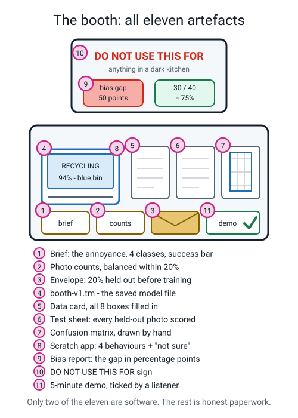
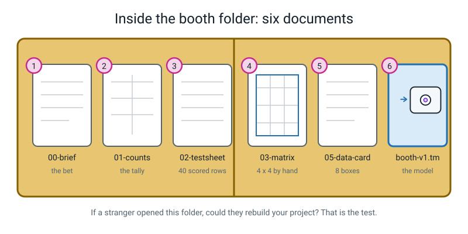
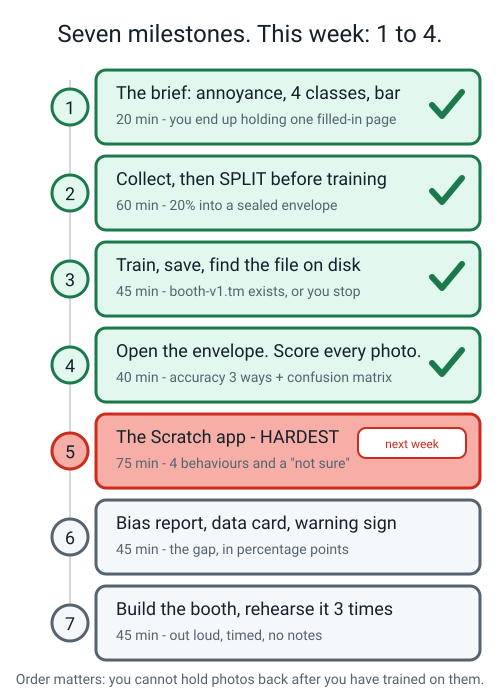
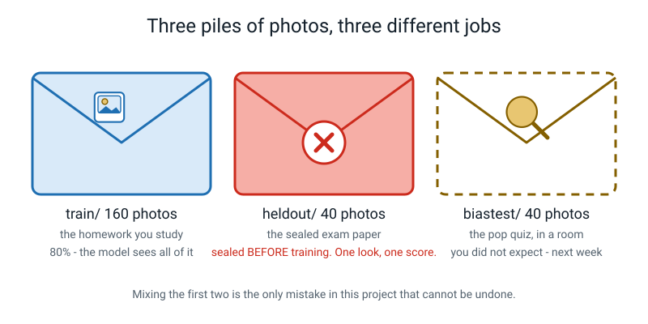
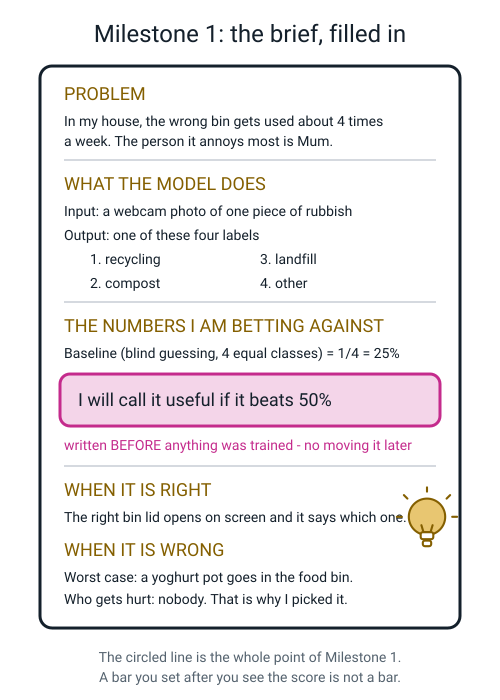
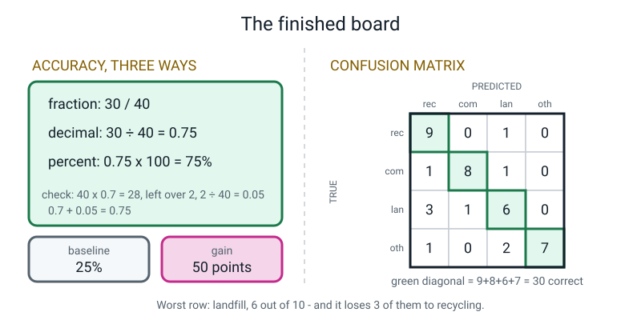
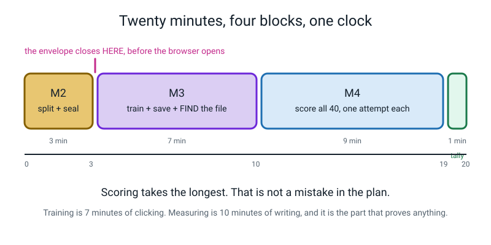
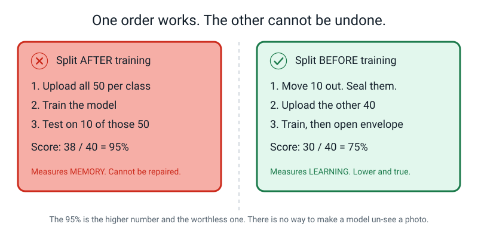
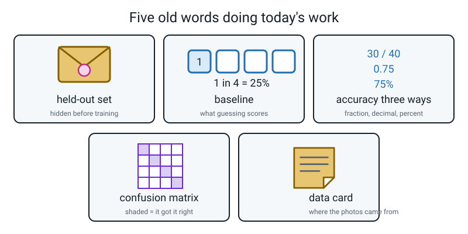

# Week 34 — The AI Fair Booth, Part 1: Build It and Test It Honestly

[⬅ Week 33](week-33.md) · [Course Home](../README.md) · [Week 35 ➡](week-35.md) · [Workbook](../workbook/week-34.md)

---

> ### This week in one sentence
> **A real AI project is not the model — it is the model plus the honest paperwork saying what it can and cannot do.**
>
> **By the end of this chapter you will be able to:**
> - Write a **capstone brief** that names a real annoyance, four classes, the baseline, and a success bar you chose *before* training
> - Split your photos **before** you train, and say in one sentence why doing it afterwards is worthless
> - Train and save a model with a real filename, then find the actual file on the actual disk
> - Score every held-out photo on paper and report accuracy as a **fraction, a decimal and a percentage** next to the baseline
> - Build a **confusion matrix** by hand and read one true sentence off it that the overall accuracy hid
>
> **Reading time:** about 25 minutes. **Homework:** about 50 minutes.
>
> **New words this week:** none. Every idea today came from Weeks 4, 15, 19, 20 and 22. This is the week you use all of it at once.

---

## 🪝 Start Here

Picture the school hall in two weeks. Twenty stalls, paper tablecloths, the smell of the canteen next door. I'm going to describe two of the stalls. Tell me which one you'd rather be standing at.

**Stall number one.** A kid has trained a model to tell apples from bananas. They hold up an apple. The screen says `APPLE 99%`. Everyone claps, and honestly, it's a good moment. Then a dad reaches into his pocket, holds up his car keys, and the screen says `BANANA 91%`.

The kid says, "ah, it's not trained for that."

The dad nods politely and wanders off. Four minutes later nobody in the hall remembers that stall existed.

**Stall number two.** A kid says: *"My mum puts the yoghurt pot in the wrong bin about four times a week. So I built this."*

They show it working on three things. Then they say: *"It gets thirty out of forty right on photos it has never seen. Guessing would be twenty-five percent. Here's the sheet — every one of those forty is written down, in pencil, by me."*

Then they say: *"It's terrible at landfill. Six out of ten. Watch this."* And they **deliberately make their own project fail**, in front of you.

Then they hold out a pen and say: *"Go on. Try to break it. I'll write down what you did."*

Which one do you believe?

You said the second one. Everyone says the second one. And here is the part that surprises people:

> **Stall two is not better at AI.** Both models are about the same. Stall two just did the paperwork.


*Figure 34.1 — Everything a finished booth needs. Count the ones that are software.*

Two. Out of eleven. The model file and the app. The other nine are paper, cardboard and pencil.

That ratio is not a joke about school projects. **That is the actual job.** In a real company, the model is roughly a fifth of the work. The rest is: writing down what problem you're solving, writing down where your data came from and who said yes, hiding some data before you train so you can measure honestly, measuring honestly, finding out who your system fails, and being able to explain all of that to a person who wasn't there.

This week you build the first half of that. Next week, the second half.

---

## 🧠 The Big Idea

### 1. "It worked when I tried it" is a story, not a number

**The plain explanation.** You train a model. You hold up a can. It says `RECYCLING 96%`. It feels like proof. It is not proof. There are three separate holes in it, and you can close all three with paper.

**The analogy.** Imagine I say I'm brilliant at basketball. You ask how I know. I say: "I took a shot once and it went in." That is one shot. It is a *story*. Now imagine I say: "I took forty shots and twenty-eight went in — here's the tally sheet." That is a *number*, and you can argue with it, check it, and compare it with someone else's.

**The concrete version.** Here are the three holes, side by side with the paper that closes each one.

| The story you tell yourself | The hole in it | The paper that closes it |
|---|---|---|
| "It said recycling and it *was* recycling" | That is **one** photo. One photo tells you almost nothing. | The **scoring sheet** — 40 rows, so anybody can see the size of the test |
| "It's 96% confident, so it's probably right" | Confidence is guess **strength**, not a hit rate. It can be 96% confident and wrong. (Week 16.) | The **held-out score**, which is the only thing that measures correctness |
| "I tested it and it works" | Tested on *what*? If those photos were in the training pile, you measured memory. (Week 19.) | The **sealed envelope**, which proves the model had never seen them |

Without those three pieces of paper, a model is a rumour.


*Figure 34.2 — The six documents that turn a rumour into a project. Not one of them needs a computer.*

> **💡 Try this:** ask any adult who has said "AI is amazing" this question — *"amazing at what, out of how many tries?"* Watch what happens. You are about to be able to answer that question about your own machine, which puts you ahead of most of the room.

---

### 2. Seven milestones, and the order is not tidiness

**The plain explanation.** The capstone has seven milestones. Four this week, three next week. They have to happen in this order, and the order is not about being tidy — it is about which mistakes can be repaired.

**The analogy.** Baking a cake, you can add sprinkles after it comes out of the oven. You cannot add eggs after it comes out of the oven. Some steps are sprinkles and some steps are eggs. Milestone 2 is eggs.

**The concrete version.** Here is the whole plan.

| # | Milestone | When | Can you fix it later? |
|---|---|---|---|
| 1 | The **brief** — the problem, the four classes, the baseline, the success bar | This week | Yes, but the success bar loses its point |
| 2 | **Collect and split** — 200 photos, 20% sealed away | This week | **No. Never. Not at all.** |
| 3 | **Train and save** as `booth-v1.tm` | This week | Yes — retraining takes 3 minutes |
| 4 | **Score the envelope** — accuracy three ways, the matrix | This week | Yes, if the envelope was sealed properly |
| 5 | The **Scratch app** — four behaviours plus "not sure" | Next week | Yes |
| 6 | The **bias report**, the data card, the DO NOT USE sign | Next week | Yes |
| 7 | The **booth** and the five-minute demo | Next week | Yes |

Milestone 5 is the hardest — it takes the longest and it fights you. Milestone 2 is the *most dangerous*, which is a completely different thing. Hard means slow. Dangerous means unrepairable.


*Figure 34.3 — Four this week. Milestone 5 is the hardest one; Milestone 2 is the one you cannot undo.*

---

### 3. The envelope: split before you train

**The plain explanation.** Before you upload anything, you take 20% of your photos out — ten out of every fifty — and put them in an envelope. You seal it. You write the date on it. You do not open it until the model is finished. Those photos are your **held-out set**.

> **Held-out set** — photos you hide **before** training, which the model never sees, kept so you can measure it honestly afterwards.

**The analogy.** This one is exact, so learn it in these words.

- The **training photos** are the practice questions you study from.
- The **held-out photos** are the sealed exam paper.
- If you study the exam paper, your marks go up and they stop meaning anything.

Think it through properly. Your teacher gives you twenty practice questions. You study them all week. On exam day, the exam *is* those twenty questions. You get 100%.

Did the exam measure anything? No. It measured whether you'd seen the paper.

**The concrete version.** Say you have 50 photos per class, four classes.

```
   BEFORE you open the browser:

   recycling  50  →  10 into the envelope  →  40 left to train on
   compost    50  →  10 into the envelope  →  40 left to train on
   landfill   50  →  10 into the envelope  →  40 left to train on
   other      50  →  10 into the envelope  →  40 left to train on
   ────────  ───     ──                       ───
   TOTAL     200     40 sealed               160 uploaded
```

And here is the sentence that matters more than anything else this week:

> **There is no way to make a model un-see a photo.**

Once a photo has been in the training pile, any score you get from it is contaminated forever. You cannot repair it by promising to be fair, or by not looking, or by feeling honest. The held-out set is about what the **model** saw, not about what *you* remember. The only fix is going and taking new photos, which is an hour of a Saturday.

So: **envelope first, laptop second.** Always in that order.


*Figure 34.4 — Three piles, three jobs. Mixing the first two is the one unfixable mistake in the whole project.*

> **⚠️ Watch out:** the tempting version of this mistake is *"I'll upload all fifty and then just test on the last ten."* It feels careful. It is the exact thing that cannot be undone. If those ten were in the upload, they trained the model. Full stop.

---

### 4. The success bar goes on paper first

**The plain explanation.** Milestone 1 asks you to write one number: *"I will call this useful if it beats ____ percent."* You write it **before** you train. Then you draw a circle round it and nobody is allowed to change it — including the adult.

**The analogy.** Imagine playing darts and drawing the target on the wall *after* you've thrown. Wherever the dart landed, that's a bullseye. You would win every single game, and every single win would be worthless.

**The concrete version.** Here's why this isn't fussiness. Suppose you train the model and get **62%**. What do you say?

> *"62%! That's way better than guessing!"*

Now suppose you get **41%**. What do you say?

> *"Well, 41% is still better than 25%, so it works."*

Look at what just happened. **Every possible result was going to be declared a success.** A test that cannot fail is not a test.

Write "50%" on paper first, and now 41% means you *missed*. And then you get to say the most impressive sentence available at a school fair:

> *"It did not clear my bar. Here is the number, and here is exactly what I would change."*

Grown-up scientists do this on purpose, because grown-ups move goalposts too.


*Figure 34.5 — A finished brief. The circled line is the whole point of the page.*

Four things the brief must contain, and one rule:

1. **A real annoyance, with a frequency and a person.** Not "sorting rubbish is a problem." Try: *"The wrong bin gets used about four times a week. It annoys Mum most."*
2. **Four class names, in real words.** `recycling`, not `Class A`. And the fourth one is always `other`.
3. **The baseline, as a fraction and a percentage.** Four roughly equal classes → 1/4 = 25%.
4. **The success bar**, written before training.

> **🧑‍🏫 If a student asks:** *why is `other` compulsory?* Because the four confidences always add up to 100%, so **something always wins**. Without an `other` class, the model literally *cannot* say "none of these" — and a stranger's car keys get confidently labelled `compost`.

**The rule:** never build classes about people. Not mood, not age, not "who looks friendly". That was Week 31 and it is not negotiable.

---

### 5. Three numbers, one baseline, and a grid that tells the story

**The plain explanation.** When you report your accuracy you say it three ways — as a fraction, as a decimal, as a percentage — and you always print the baseline next to it. Then you draw a **confusion matrix**, which is a grid that shows *which* things it got wrong.

**The analogy.** "I got 90%" from a school test tells you almost nothing until you know it was 9 out of 10 (small test) or 90 out of 100 (real test), and whether everyone else got 95%. The three forms and the baseline are how you stop a number from being a boast.

**The concrete version.** Here is what each form is actually for:

```
   FRACTION      30 / 40      tells you the SIZE of the test.
                              "95%" out of 20 photos is 19/20.
                              Out of 4 photos it is cheating.
                              The fraction is the honesty.

   DECIMAL       0.75         forces you to actually do the division,
                              and it is the form that catches you
                              dividing upside down.

   PERCENTAGE    75%          the form a stranger at a fair
                              understands instantly.
```

Then the baseline:

> **Baseline** — the score you'd get by guessing without looking. With four roughly equal classes that's 1 in 4 = **25%**.

75% against a baseline of 25% means the model earned **50 percentage points** of real skill. If the baseline had been 70%, the same 75% would be worth almost nothing.

> **⚠️ Watch out — this is the most common slip in the whole course.** 75% − 25% = 50 **percentage points**, not "50%". When you subtract two percentages you get *points*. Say "points" out loud every time.

**Now the matrix.** A **confusion matrix** is a grid. Down the side: what the photo **actually was**. Across the top: what the model **said**. Every photo puts one tick mark in exactly one box.


*Figure 34.6 — Accuracy three ways on the left, the matrix on the right. Two readings, and only two.*

You only need to read two things off it:

1. **The diagonal is the correct ones.** Top-left to bottom-right — the boxes where "what it was" and "what it said" agree. Add them up, divide by the total: that's your accuracy.
2. **The off-diagonal boxes tell the story.** In Figure 34.6 the landfill row reads `3, 1, 6, 0`. So the model got 6 of 10 landfill photos right — and it called **three of them recycling**.

That second reading is what makes a booth good. Anyone can say "75%". Almost nobody says:

> *"And the 25% it gets wrong is nearly all landfill being called recycling — shiny landfill things look like cans to it."*

That sentence tells a visitor what to hold up to break it, what photos would fix it, and that you actually looked.

---

## 🔍 Worked Examples

### Worked Example 1 — The spice jar booth (food)

Priya's mum keeps grabbing the wrong jar. Three yellow-ish powders in identical jars: turmeric, chilli powder, coriander. Priya builds a booth.

**Milestone 1 — the brief.**

```
   The annoyance:   the wrong spice goes in about 3 times a week. Annoys Dad, who cooks.
   The classes:     turmeric · chilli · coriander · other
   The input:       one webcam photo of one open jar
   The baseline:    4 roughly equal classes → 1/4 = 25%
   THE SUCCESS BAR: I will call it useful if it beats 60%.        ← circled, before training
   If it's right:   the right jar gets used.
   If it's wrong:   dinner tastes odd. Nobody is hurt.
```

**Milestone 2 — the split.** 50 photos per class, 200 total. Ten out of each class into the envelope.

```
   turmeric    50  →  10 sealed  →  40 train
   chilli      50  →  10 sealed  →  40 train
   coriander   50  →  10 sealed  →  40 train
   other       50  →  10 sealed  →  40 train
   TOTAL      200      40 sealed    160 train
```

Balance check: `(biggest − smallest) ÷ biggest = (50 − 50) ÷ 50 = 0%`. Target is under 20%. ✓

**Milestone 3.** Trains, saves as `booth-v1.tm`, finds it in `Downloads/`, reads the name out loud. Sixty seconds. Skipping it loses everything, because Teachable Machine has no autosave.

**Milestone 4 — score all 40.** She gets **28 ticks**. Here is every step of the arithmetic:

```
   FRACTION     28 / 40

   DECIMAL      28 ÷ 40
                40 × 0.7 = 28  → exactly, no remainder
                so 28 ÷ 40 = 0.7
                CHECK: 28/40, divide top and bottom by 4 → 7/10 = 0.7   ✓

   PERCENTAGE   0.7 × 100 = 70%

   BASELINE     25%
   GAIN         70 − 25 = 45 PERCENTAGE POINTS
```

She beat her bar of 60%. Good — and notice that she'd have known if she hadn't.

**The matrix.** Ten photos per class, so every row adds to 10.

|  | said turmeric | said chilli | said coriander | said other | row total |
|---|---|---|---|---|---|
| **was turmeric** | **9** | 0 | 1 | 0 | 10 |
| **was chilli** | 1 | **8** | 1 | 0 | 10 |
| **was coriander** | 4 | 1 | **5** | 0 | 10 |
| **was other** | 1 | 0 | 3 | **6** | 10 |
| column total | 15 | 9 | 10 | 6 | **40** |

Three checks Priya does herself:

- Every row adds to 10 ✓
- All sixteen boxes add to 40 ✓
- Diagonal = 9 + 8 + 5 + 6 = **28**, which matches her tick count ✓

Per-class accuracy: turmeric 9/10 = 90% · chilli 8/10 = 80% · coriander 5/10 = 50% · other 6/10 = 60%.
Average = (90 + 80 + 50 + 60) ÷ 4 = 280 ÷ 4 = **70%** — matches the overall, because every class has exactly 10 photos.

**The one-sentence finding.** The biggest off-diagonal number is the **4** in the coriander row, turmeric column.

> *"My model is worst at coriander — 5 out of 10 — and when it gets coriander wrong it usually says turmeric (4 of its 5 mistakes)."*

---

### Worked Example 2 — The cricket kit booth (sport), and the mistake you can't undo

Ravi sorts cricket gear: `ball`, `glove`, `pad`, `other`. 50 photos each, 200 total.

He is in a hurry, so he drags **all 200** into Teachable Machine, trains, and then tests on 40 photos picked at random from those same 200.

**His first result:**

```
   38 correct out of 40
   38 ÷ 40 :  40 × 0.9 = 36 → remainder 2 ; 2 ÷ 40 = 0.05 ; 0.9 + 0.05 = 0.95
   CHECK: 38/40 = 19/20 = 0.95   ✓
   0.95 × 100 = 95%
   baseline 25%  →  "gain of 70 percentage points!"
```

Ninety-five percent. He is thrilled. And that number is **worth nothing**, because every one of those 40 photos trained the model. A machine that had done nothing but memorise all 200 images would also score about 95% on that test. The score cannot tell "learned what a cricket ball looks like" apart from "recognised photo number 118."

> **A measurement that can't tell success from failure is not a measurement.**

Can he fix it by taking 40 of the 200 and calling them held out now? No. They're already inside the model. So on Saturday he shoots **40 brand new photos**, ten per class, on the patio instead of the kitchen table.

**His honest result:**

```
   26 correct out of 40
   26 ÷ 40 :  40 × 0.6 = 24 → remainder 2 ; 2 ÷ 40 = 0.05 ; 0.6 + 0.05 = 0.65
   CHECK: 26/40 = 13/20 = 0.65   ✓
   0.65 × 100 = 65%
   baseline 25%  →  GAIN 65 − 25 = 40 PERCENTAGE POINTS
```

Now compare the two numbers:

```
   fake score      95%
   real score      65%
   difference      30 PERCENTAGE POINTS of pure illusion
```

Thirty points he never had. If he'd taken that 95% to the fair, an adult would have asked "were those photos in the training pile?", and the whole booth would have collapsed in one sentence.

**What Ravi says at the fair now**, and it's better than 95% ever was:

> *"I made a mistake first time — I tested on photos it had already trained on and got 95%. That number was meaningless. So I took forty new photos on a different day and it got 26 of them, which is 65% against a 25% baseline. The second number is the real one."*

---

### Worked Example 3 — The lost-property booth (school), where the baseline isn't 25%

Ella's school office has a lost-property crate. She builds a booth: `bottle`, `jumper`, `lunchbox`, `other`.

But she couldn't find 50 random `other` objects, so her counts are uneven:

```
   bottle     60      jumper     60      lunchbox   60      other      20      TOTAL 200
```

Balance check: `(60 − 20) ÷ 60 = 40 ÷ 60 = 0.667 = 67%`. Target is under 20%. **She fails the check** and writes that down — it's a real finding, not a secret.

**The split**, 20% of each class:

```
   bottle     60  →  12 sealed  →  48 train
   jumper     60  →  12 sealed  →  48 train
   lunchbox   60  →  12 sealed  →  48 train
   other      20  →   4 sealed  →  16 train
   TOTAL     200      40 sealed    160 train
```

**Now the baseline, and this is the interesting part.** Blind random guessing over four classes gives 25%. But there's a smarter no-brain strategy: **always guess the most common class.** Her held-out set has 12 bottles, 12 jumpers, 12 lunchboxes, 4 others. Always guessing "bottle" gets:

```
   12 correct out of 40  =  12 ÷ 40  =  0.3  =  30%
```

So her real baseline is **30%**, not 25%. That matters:

```
   Her score:  26 / 40 = 0.65 = 65%
   Wrong gain:  65 − 25 = 40 points     ← overclaiming by 5 points
   Right gain:  65 − 30 = 35 PERCENTAGE POINTS
```

**Her matrix.** Note the rows are *not* all the same size.

|  | said bottle | said jumper | said lunchbox | said other | row total |
|---|---|---|---|---|---|
| **was bottle** | **10** | 1 | 1 | 0 | 12 |
| **was jumper** | 1 | **9** | 2 | 0 | 12 |
| **was lunchbox** | 2 | 3 | **6** | 1 | 12 |
| **was other** | 1 | 0 | 2 | **1** | 4 |
| column total | 14 | 13 | 11 | 2 | **40** |

Diagonal = 10 + 9 + 6 + 1 = **26** ✓ · all boxes add to 40 ✓

Per-class:

| class | correct | fraction | decimal | percentage |
|---|---|---|---|---|
| bottle | 10 of 12 | 10/12 | 0.833 | **83.3%** |
| jumper | 9 of 12 | 9/12 = 3/4 | 0.75 | **75%** |
| lunchbox | 6 of 12 | 6/12 = 1/2 | 0.5 | **50%** |
| other | 1 of 4 | 1/4 | 0.25 | **25%** |

Now try the check that worked in Example 1: `(83.3 + 75 + 50 + 25) ÷ 4 = 233.3 ÷ 4 = 58.3%`. That is **not** her 65%.

**Why not?** Because the classes are different sizes. The average of per-class accuracies only equals the overall accuracy when every class has the same number of photos. When they don't, trust the overall — and report both.

**Two findings, not one:**

> *"It's worst at `other` — 1 out of 4. But `other` was only tested on 4 photos, so one photo changes that number by 25 points. That figure isn't trustworthy, and the honest fix is 40 more `other` photos."*

> *"Of the classes I actually measured properly, lunchbox is worst — 6 out of 12 — and it usually calls a lunchbox a jumper."*

---

## 🎲 What We Did In Class

### The Build Sprint — Milestones 2, 3 and 4 against a clock

Twenty minutes. Three milestones. One visible clock. The adult is the clock, not the help desk.


*Figure 34.7 — Scoring takes the longest. That is not a mistake in the plan.*

**Setup before the timer starts:**

- All four photo folders open on screen, and an empty `heldout` folder created
- The printed 40-row scoring sheet and a pencil, to the **right** of the laptop
- One large envelope on the table with a marker pen resting on top of it
- A clock you can see

**The four rules:**

1. **The envelope closes before the browser opens.** No "I'll just check something."
2. **One photo, one attempt.** No retakes because "the lighting was off." If lighting matters, *that is the finding*, and it goes in the notes column.
3. **Write it down as it happens**, not from memory afterwards. Memory is where honesty leaks out.
4. **The clock is the boss.** If a milestone overruns, the next one gets shorter.

**Minute by minute:**

| Minutes | Milestone | What you do |
|---|---|---|
| 0–3 | **M2 — split** | Move 10 photos out of each class folder into `heldout`. Take them from all over the folder, **not just the last ten**. Count out loud: 10, 10, 10, 10. Note the filenames, put the note in the envelope, seal it, sign the flap with the date. |
| 3–9 | **M3 — train + save** | Teachable Machine → *Image Project* → *Standard image model*. Rename all four classes properly. Drag in **only** the four training folders — never `heldout`. Check each class shows 40 samples. **Train Model.** Then ☰ → *Download project as file* → save as `booth-v1.tm`. |
| 9–10 | **M3 check** | Open the file browser. Find `booth-v1.tm`. Read the name out loud. Sixty seconds that saves the whole project. |
| 10–19 | **M4 — score** | Open the envelope. Feed each held-out photo to the Preview panel, one at a time. For each row write: the **true** label, the **prediction**, the **top confidence**, and a ✓ or ✗. |
| 19–20 | **M4 tally** | Count the ticks. Circle the total at the bottom of the sheet. |

**What "finished" looks like:**

```
   □ the envelope is open and empty, and every photo in it has a row
   □ the sheet has 40 filled rows and a circled total
   □ booth-v1.tm exists on disk and you can point at it
   □ nothing was retaken
   □ no row was filled in from memory
```

### If you missed the class, or want to redo it at home

You can do all of it alone. You need: your photos in four folders, one envelope, a printed 40-row sheet, a pencil, and a browser. The only part you genuinely need another person for is **being watched while you seal the envelope** — because the temptation to peek is real, and having a witness is the cheapest fix ever invented.

> **💡 Try this at minute 19, before any arithmetic:** write down on the back of the sheet how you *feel* about the tick count. Then compute the percentage two minutes later. Comparing the feeling with the number is a small sharp lesson in why we measure at all.

**Harder version, if you have ten more minutes:**

1. **Per-class accuracy too** — four extra divisions, then check whether the average matches the overall. (It does when the classes are equal-sized. Try it and see.)
2. **Predict before you score.** Before opening the envelope, write down which class will be worst *and why*, with a photo count as the reason.
3. **The margin column.** Add "top confidence minus second confidence". The smallest margin in your 40 is the photo your booth should say "not sure" about next week.

---

## 💬 Talk About It

**1. Ask a parent: "have you ever believed a number and then found out how it was measured?"**
> *Hint:* try steering to adverts. "Clinically proven", "9 out of 10 dentists", "up to 70% off". Ask what the missing information is in each. It's usually *out of how many* and *compared with what* — the exact two questions from this chapter.

**2. Ask a friend to guess: how many of the eleven things on a finished AI booth are software?**
> *Hint:* almost everyone guesses six or more. Then count with them, pointing at Figure 34.1. Nine pieces of paper, two pieces of software. Then ask which one they think takes the longest. (The app, next week — and the scoring sheet, which is the one people skip.)

**3. Argue with someone about this: "if your model scores 41% and your bar was 50%, should you change the bar?"**
> *Hint:* let them argue for changing it — they'll say "but I learned things, and 41% is above 25%". Both true. Then ask: *if you're allowed to move the bar afterwards, what could the bar ever tell you?* Nothing. That's the answer, and it's more interesting than agreeing straight away.

---

## ⚠️ Don't Get Tricked

### Trick 1 — "I can hold photos back after training, I just won't look at them"


*Figure 34.8 — The 95% is the higher number and the worthless one.*

| ❌ Wrong | ✅ Right |
|---|---|
| "I uploaded all 50, but I'll only test on 10 of them and I promise not to peek." | "I moved 10 out **before** uploading. The model has never seen them." |
| This confuses *you* not looking with **the model** not looking. | The held-out set is about what the model saw during training, not what you remember. |

You are not the problem. The model is. If those photos were in the upload, they trained it, and there is no undo button.

---

### Trick 2 — "A higher confidence number means it's more likely to be right"

| ❌ Wrong | ✅ Right |
|---|---|
| "It said 97%, so it's almost certainly correct." | "It said 97%, and it was wrong. That's completely normal." |
| Treats confidence as a measured hit rate. | Confidence is how strongly the model prefers one class over the other three. |

Here is the reason, and it's worth memorising: **confidence is produced by the same machinery that produced the answer.** So it cannot check the answer. The only thing that ever measured correctness in your whole project was you, with a pencil, on the scoring sheet.

Write down the highest confidence your model reached *while being completely wrong*. That number goes on your poster, large.

---

### Trick 3 — "75% is a good score"

| ❌ Wrong | ✅ Right |
|---|---|
| "75%! That's good." | "75%, against a baseline of 25%, out of 40 photos — so 50 percentage points of real skill." |
| A bare percentage hides the size of the test and what guessing would have got. | Three forms plus a baseline is a measurement. |

The same 75% is excellent against a 25% baseline and almost worthless against a 70% baseline. And "75%" out of four photos is 3 out of 4, which is not a test, it's an anecdote with a decimal point.

---

### Trick 4 — "The confusion matrix is just a fancy way of writing the accuracy"

| ❌ Wrong | ✅ Right |
|---|---|
| "The matrix says 75%, which I already knew." | "The matrix says three landfill photos got called recycling." |
| Only reads the diagonal. | Reads the biggest off-diagonal box, and says it **in the right direction**. |

"It got three wrong" is nearly useless. "**Landfill** got called **recycling** three times" tells you which photos to take next. The direction is the whole information — swap the two class names and you have said something completely different and untrue.

---

## 🌍 Where You've Seen This

1. **Any advert with a percentage in it.** "Kills 99.9% of germs." Out of how many germs, tested how, and what did doing nothing kill? The fraction and the baseline are almost always missing, and now you notice.
2. **Your own school reports.** "Attendance 96%" is a fraction wearing a percentage costume — 96% of 190 days is a real measurement. "Effort: good" is not measured at all, and that's fine, as long as nobody claims it is.
3. **App store ratings.** 4.8 stars sounds great until you see it's out of 6 reviews. Same trick, same fix: *out of how many?*
4. **A friend saying "I always win at this game."** Always, out of how many games? Written down when? This is genuinely the same question as the scoring sheet.
5. **Exam past papers.** Doing a past paper you've already seen the answers to feels like revision and measures nothing. That's the held-out rule, in your own school bag.
6. **Football statistics on TV.** "Teams that score first win 78% of matches" — useful, has a size behind it. "Our striker never misses from there" — a story, and usually a short one.

---

## 🔑 Remember This

- **A model is a rumour until three pieces of paper exist:** the scoring sheet, the sealed envelope, and the confusion matrix.
- **Split before you train.** It is the only mistake this week that cannot be repaired, because there is no way to make a model un-see a photo.
- **Write the success bar before you look at the result**, or every possible result becomes a win and the test becomes meaningless.
- **Report accuracy three ways plus the baseline.** The fraction shows the size, the decimal proves you divided, the percentage is for strangers, the baseline is what makes it mean anything.
- **Subtracting two percentages gives percentage POINTS.** 75% − 25% = 50 points. Say "points" out loud.
- **Read the biggest off-diagonal box of your matrix and say it in the right direction.** That one sentence beats your accuracy at a fair.
- **The baseline isn't always 25%.** If one class is much bigger than the others, "always guess the biggest class" is the real baseline, and it can be a lot higher.

---

## 📓 New Words

**There are no new words this week.** That is on purpose — this is the week you use everything at once. Here are the five you'll lean on hardest, with the version you'd actually say at a fair.


*Figure 34.9 — Five old words doing today's work.*

| Word | What it means | Example from your own booth |
|---|---|---|
| **held-out set** | Photos hidden **before** training, which the model never sees, kept to measure it honestly | The 40 photos in the sealed envelope — 10 from each of your four classes |
| **baseline** | The score you'd get by guessing without looking | Four roughly equal classes → 1/4 = **25%**. Uneven classes → always guess the biggest one |
| **accuracy three ways** | The same score written as a fraction, a decimal and a percentage | `30/40` · `0.75` · `75%` — and always the baseline beside it |
| **confusion matrix** | A grid: down the side what it **was**, across the top what the model **said** | Landfill row `3, 1, 6, 0` → six right, and three called recycling |
| **data card** | The page saying where your photos came from, who said yes, and **what isn't in them** | "No photos after dark. No glass at all. One kitchen, one tablecloth, one photographer." |

> **⚠️ Watch out on the data card:** box six, *what's NOT in it*, is the box adults read first. "No photos after dark, nothing squashed, no glass at all" is uncomfortable and specific, which is exactly why it earns trust. "Some limitations may apply" earns nothing.

---

## 📤 Your Homework

Go to **[the Week 34 workbook](../workbook/week-34.md)**. About **50 minutes** in total.

This week's homework is **assembly, not new thinking.** Everything you made in class goes into the booth folder, laid out so a stranger who has never met you could pick it up and understand the project.

| Page | What to do | Time |
|---|---|---|
| **W34-1** | The **brief**, written out neatly if it got scribbled in class. Success bar circled. | 5 min |
| **W34-2** | The **counts table** plus the balance check: `(biggest − smallest) ÷ biggest`, target under 20% | 5 min |
| **W34-3** | The **model file record card**: filename, folder, date, and the line "NOT trained on: the 40 sealed photos" | 3 min |
| **W34-4** | The **40-row scoring sheet**, copied up neatly if needed, with the total circled | 5 min |
| **W34-5** | **Accuracy three ways** + baseline + gain, with the division actually written out | 7 min |
| **W34-6** | The **4×4 confusion matrix**, drawn by hand, plus your one-sentence finding | 10 min |
| **W34-7** | The **data card draft** — all 8 boxes, especially attribution, permission, and *what's NOT in it* | 12 min |
| **W34-8** | Two reflection questions | 3 min |

> **💡 Try this before you start W34-6:** write down which class you *think* will be worst, and why, with a photo count as your reason. Then build the matrix and find out. Being wrong is the most interesting outcome available — it's proof that counting beats guessing.

> **⚠️ Watch out:** if the folder ends up as a loose pile of paper on your bedroom floor, next week's lesson loses its first fifteen minutes to a search party. Decide tonight, out loud, where the folder lives.

---

[⬅ Week 33](week-33.md) · [Course Home](../README.md) · [Week 35 ➡](week-35.md) · [📓 Workbook — Week 34](../workbook/week-34.md) · [Glossary](../../glossary.md)
