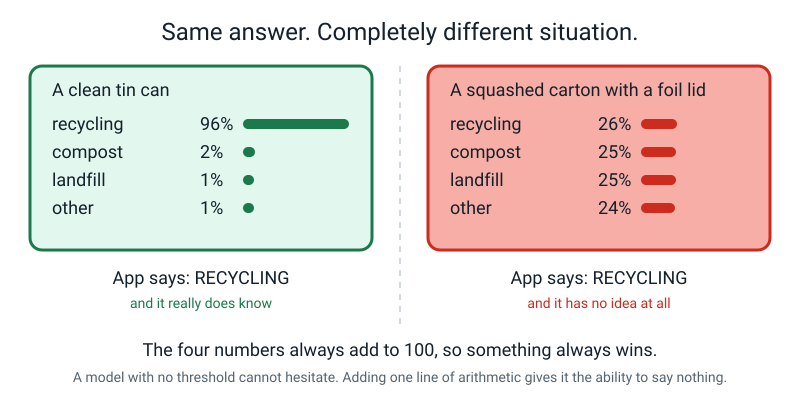
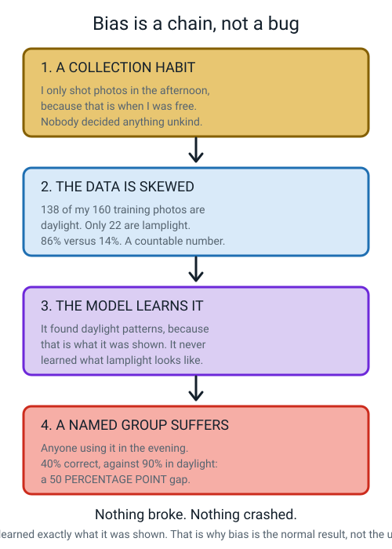
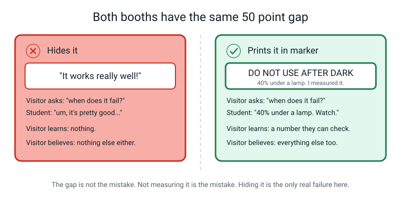
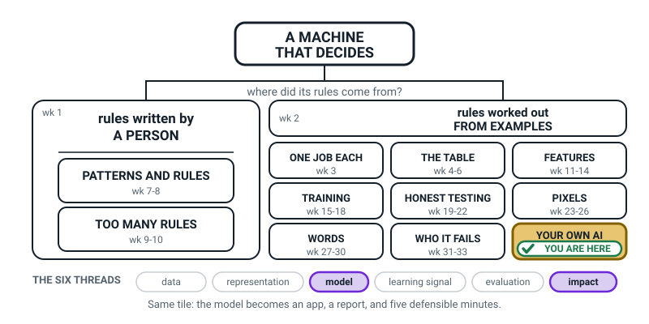
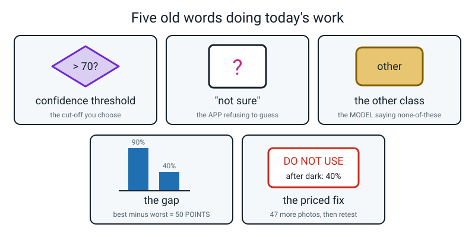

# Week 35 — The AI Fair Booth, Part 2: The App, the Report, the Demo

[⬅ Week 34](week-34.md) · [Course Home](../README.md) · [Week 36 ➡](week-36.md) · [Workbook](../workbook/week-35.md)

---

> ### This week in one sentence
> **If you can show your model failing and explain why, you understand it — anyone can show it working.**
>
> **By the end of this chapter you will be able to:**
> - Build a Scratch app with **four distinct behaviours**, one per class, that runs without being nursed
> - Add a **confidence threshold** so the app says *"not sure"* instead of guessing — and demonstrate that on purpose
> - Explain the difference between the `other` class and *"not sure"*, which almost no adult can do
> - Produce a **bias report**: a gap in percentage points, a named failing group, and a **priced fix** with the arithmetic
> - Deliver a **five-minute demo** covering the annoyance, it working, how it learned, how good it is, and where it fails
>
> **Reading time:** about 25 minutes. **Homework:** about 60 minutes of writing, plus three rehearsals out loud.
>
> **New words this week:** none. Everything today came from Weeks 16, 20, 30, 31 and 32.

---

## 🪝 Start Here

Go and find something genuinely awkward from the kitchen. A yoghurt pot with the foil lid still half on. A squashed carton. A paper cup with a plastic rim.

Hold it up. **What bin does it go in?**

You hesitated. Good — that's the correct response. Most adults hesitate too.

Now the question I actually care about. If you hold that thing up to your model, **what will it say?**

It will say *something*. It has to.

Remember what those four numbers do: they add up to a hundred, every single time, so **something always comes first**. And here is the problem, drawn:


*Figure 35.1 — Same answer, completely different situation. Your app cannot currently tell them apart.*

On the left, the numbers are `96, 2, 1, 1`. The model genuinely knows. On the right they're `26, 25, 25, 24`. The model has no idea at all.

And your app says **RECYCLING** both times, in exactly the same voice, with exactly the same certainty in its tone.

> **A model with no threshold is incapable of hesitating.**

Today you build the thing that fixes that. It is one line of arithmetic. And it turns your booth into the only one in the hall that can say *"I'm not sure."*

When a stranger holds up their car keys and your machine admits it doesn't know — **that is the moment they believe everything else you told them.**

Here's a question worth sitting with before you read on: would you rather have a friend who has an answer for every single question, or a friend who sometimes says *"honestly, I don't know"*? Whose answers do you actually believe?

---

## 🧠 The Big Idea

### 1. Your model and Scratch are strangers

**The plain explanation.** Your trained model lives in a browser tab on Teachable Machine's website. Scratch is a **different** tab, made by different people. They do not talk to each other. There is no button labelled "send my model to Scratch." So you need a **bridge**, and there are exactly two.

**The analogy.** Two friends who don't speak the same language. Either you hire an interpreter who stands between them and does it automatically (and now a stranger is in the room), or you pass notes back and forth yourself (slower, nobody else involved, and you have to admit you're doing it).

**The concrete version.**


*Figure 35.2 — Two honest ways to wire the app. Default to Route B.*

| | **Route A — upload the model** | **Route B — nothing is uploaded** |
|---|---|---|
| How it works | *Export Model → Tensorflow.js → Upload my model*. Google puts your finished model on a public web address. Then **Stretch3** (`stretch3.github.io`), a modified Scratch, reads it automatically. | Teachable Machine stays open on your laptop with the webcam running. Plain `scratch.mit.edu` runs beside it. You read the prediction off the screen and **type it in**. |
| Build time | About 20 minutes, and it can fight you | About 5 minutes |
| Needs internet? | Yes, always | Only to load the pages once |
| What leaves the laptop | The **model** — on a link anyone with the address could open | **Nothing at all** |
| The honest cost | A stranger could open your model | **There is a human in the loop: you** |

> **⚠️ Watch out:** Route A puts your **model** on a public link. That is a real privacy decision, and it is an adult's decision to make, not yours. **If an adult has not actively said yes, it is Route B.**

Route B has one cost, and it must be said out loud, on a printed sign, in ordinary-sized text:

```
   ┌────────────────────────────────────────────────────────────┐
   │  HOW THIS BOOTH WORKS: the model runs on this laptop and   │
   │  makes the prediction. I type the prediction into Scratch  │
   │  because I chose not to upload my model to the internet.   │
   │  The guess is the machine's. The typing is mine.           │
   └────────────────────────────────────────────────────────────┘
```

A knowledgeable adult respects that sign far more than a slicker demo. **Neither route is more honest than the other.** Dishonesty is hiding whichever one you did.

---

### 2. Five states, not four

**The plain explanation.** You have four classes, so you'd expect four things the app can do. Actually there are **five**, because "not sure" is a fifth state that no class produces.

**The analogy.** A traffic light has three lights, but a *crossing* has four states: walk, don't walk, flashing-don't-walk, and out-of-order-with-a-bag-over-it. The last one isn't a colour. It's the system telling you it can't help right now.

**The concrete version.** Every state must change something **visible** — the backdrop, the sentence, or the counter — so a visitor can see which one fired without asking.

| State | Backdrop | What the sprite says | Counter |
|---|---|---|---|
| `recycling` | blue | "RECYCLING — blue bin, please." | **+1** |
| `compost` | green | "COMPOST — green bin." | **+1** |
| `landfill` | grey | "LANDFILL — black bin. Could you reuse it?" | **+1** |
| `other` | white | "I don't recognise that. I only know 3 kinds of rubbish." | no change |
| **not sure** | white + big `?` | "Not sure — only 61% confident." | no change |


*Figure 35.3 — Five states, five visibly different things on screen.*

> **🧑‍🏫 If a student asks:** *why doesn't the counter move for `other` and "not sure"?* Because nothing got sorted. The counter counts **items put in a bin**. If it counts anything else, then the number on your poster means nothing at all, and "twelve" stops being information.

---

### 3. The threshold is one `if`, and it's the grown-up bit

**The plain explanation.** Pick a number. Seventy is a good default. Then before the app says anything, it asks one question: *is the winning confidence above 70?*

```
   if the winning confidence is ABOVE 70   →   act on the label (four behaviours)
   if it is 70 or BELOW                    →   say "not sure", name no bin, count nothing
```

That is the entire idea. No new AI. Just an `if`.

> **Confidence threshold** — a cut-off *you* choose. Below it, the app refuses to pass on the guess.

**The analogy.** A referee who only awards a penalty when they actually saw it, and otherwise waves play on and says "I didn't see it." That referee is *better*, not worse — because when they do give a penalty, you believe them.

**The concrete version.** Here it is as a flowchart. Notice the "no" branch has **one** box and the "yes" branch has **four**.


*Figure 35.4 — One diamond. That diamond is the difference between a machine that always answers and a machine you can trust.*

**Why 70?** No reason. You picked it. And that's an honest answer. If you move it to **85**, the app says "not sure" more often, and it's wrong less often when it *does* answer. If you move it to **50**, it answers almost everything and more of those answers are rubbish.

That's a trade, and it's yours to make. What matters is that you **write down that you made it.**

> **⚠️ Watch out — the number one bug of this whole lesson.** Some versions of the Scratch extension report confidence as `0.61`; others report `61`. If your threshold is `70` and the extension hands over `0.61`, then `0.61 > 70` is *never* true and your app says "not sure" forever. If your threshold is `0.7` and it hands over `61`, the threshold *never* fires and your app always answers.
>
> **The fix:** print the raw value once with a `say` block. Look at it. Set your threshold to match. Do this **before** you debug anything else.

---

### 4. `other` and "not sure" are not the same thing

**The plain explanation.** This one trips up adults, so read the table twice. `other` is a **class**. "Not sure" is an **app decision**.

**The analogy.** You ask a shopkeeper for a specific screw. `other` is them saying, confidently, *"we don't sell that here, try the hardware shop"* — they know exactly what they've got and yours isn't it. "Not sure" is them squinting at your screw and saying *"I genuinely can't tell what that is."* Both mean you leave without a screw. They are completely different conversations.

**The concrete version.**

| | **`other`** | **"not sure"** |
|---|---|---|
| What is it? | A **class**, like the other three. The **model** predicts it. | An **app decision**. The model didn't say it — the app refused to pass the guess on. |
| Where does it live? | In your training data: 50 photos of hands, the bare table, car keys, a shoe. | In one `if` block in Scratch. |
| What makes it happen? | The model scores `other` highest. | The winning score, *whatever the class*, is too low. |
| What does the booth say? | "I don't recognise that. I only know three kinds of rubbish." | "Not sure — only 61% confident." |
| The one-line version | The machine is **confident it's none of your bins**. | The machine has **no real opinion about anything**. |

So: a **car key** triggers `other` — the model has seen keys in its `other` photos and is sure. A **squashed carton with a foil lid** triggers "not sure" — it looks part-way between recycling and landfill, the four numbers come out close together, and nothing wins by enough.

> **💡 Try this at your booth:** have both objects on the table, deliberately, side by side. Showing a visitor those two states back to back is the single smartest ninety seconds you can spend, and nobody else in the hall will be able to do it.

---

### 5. A bias report is four things, not four numbers

**The plain explanation.** You shot four batches of ten photos and scored them: `control` (same as training), `new-lighting` (a lamp, after dark), `new-hands` (someone else holding the items), `new-background` (a different room). Four accuracies come out.

**Those four numbers are not a bias report.** A report is four different things.

**The analogy.** A doctor doesn't hand you a printout of your blood numbers and call that a diagnosis. The diagnosis is: what's wrong, who it affects, why it happened, and what it costs to fix.

**The concrete version.** Here are the four parts.

**1. The gap, in percentage points.** Best condition minus worst condition. 90% down to 40% is a **50 percentage point** gap. Not "50%".

**2. A named group.** Not "it's worse sometimes." A stranger must be able to reproduce your failure from your sentence alone:

> *"It fails on rubbish photographed under a lamp after dark."*

**3. The chain back to a countable number.** Four links, and it always ends in something you can count.


*Figure 35.5 — Bias is a chain, not a bug. Nothing broke.*

**4. A priced fix.** "Collect more data" is not a plan. "I need 47 more lamplight photos, and here's the arithmetic" is a plan. You'll do that arithmetic in Worked Example 2.

> **⚠️ Watch out:** the gap is a **finding**, not a confession. It is the most valuable object on your booth. Twenty other stalls will have a demo that works. Nobody else will be able to say *"here is exactly who I fail, here is the number, and here is what it would cost to fix."*

---

### 6. Five minutes, six segments, six banned words

**The plain explanation.** The demo is five minutes. It has six segments in a fixed order, and two of them are worth more than the other four put together.


*Figure 35.6 — The two starred segments are the ones nobody else at the fair has.*

```
   the annoyance      30s
   it works           60s
   HOW IT LEARNED     90s   ★  most questions come from here
   how good it is     60s
   WHERE IT FAILS     45s   ★  nobody else will do this
   the invitation     15s
   ───────────────────────
   TOTAL             300s  =  exactly 5 minutes
```

**The concrete version — the six banned phrases.** Every one of them is a way of not explaining.


*Figure 35.7 — Print this and put it where you can see it while you present.*

| ❌ Banned | ✅ Say this instead |
|---|---|
| "magic" | "it found a pattern in 160 labelled photos" |
| "it just knows" | "it matches a new photo against that pattern" |
| "it's smart" | "it gets 30 out of 40 right on photos it has never seen" |
| "it thinks" | "it produces four numbers that add to 100 and the biggest wins" |
| "it understands" | "it has never seen a bin. It has seen numbers that came from photos." |
| "obviously" | *(just delete it — if it were obvious you wouldn't be explaining it)* |

The replacements are longer and they are **true**, and true is what wins a fair.

---

## 🔍 Worked Examples

### Worked Example 1 — What the threshold costs (food)

Sam's booth sorts what's in the fridge: `leftovers`, `fresh`, `packet`, `other`. His Week 34 sheet says **30 out of 40 = 75%**.

He wants to know what a threshold of 70 would actually do. He already has the answer, because he wrote the confidence in every one of his 40 rows. He goes down the column and counts.

**Step 1 — how many were at or below 70?** Nine of the forty.

**Step 2 — of those nine, how many had he got wrong?** Six wrong, three right.

**Step 3 — do the arithmetic both ways.**

```
   NO THRESHOLD
      answers given          40
      correct                30
      accuracy of answers    30 ÷ 40 = 0.75 = 75%
      wrong answers said out loud    10

   THRESHOLD = 70
      refused (said "not sure")       9
      answers given          40 − 9  = 31
      correct                30 − 3  = 27
      accuracy of answers    27 ÷ 31 = ?
                             31 × 0.8 = 24.8  →  remainder 2.2
                             2.2 ÷ 31 = 0.071
                             0.8 + 0.071 = 0.871
      so                     0.871 × 100 = 87.1%
      wrong answers said out loud    10 − 6 = 4
```

**Step 4 — read it as a table.**

| | no threshold | threshold 70 | change |
|---|---|---|---|
| times it answered | 40 | 31 | **9 fewer** |
| times it was right | 30 | 27 | 3 fewer |
| accuracy **of the answers it gave** | 75% | **87.1%** | **up 12.1 points** |
| wrong answers said out loud | 10 | **4** | **6 fewer** |
| times it said "not sure" | 0 | 9 | — |

**What Sam says at the fair, which is the whole point:**

> *"My model didn't get any better. It's still 30 out of 40. But now, of the times it actually answers, it's right 27 out of 31 — that's 87 percent — and it only says something wrong four times instead of ten. It cost me three correct answers I now refuse to give. I think that's a good trade, and it was my decision."*

That is a genuine engineering trade-off, measured on his own data, explained by an eleven-year-old. Adults will not be expecting it.

---

### Worked Example 2 — The bias report, priced (sport)

Aisha's booth sorts cricket kit: `ball`, `glove`, `pad`, `other`. She trained on 160 photos and shot four bias batches of ten, after training, on purpose.

**Step 1 — turn each batch into a percentage.** Write the fraction, then actually do the division, then multiply by 100. Three columns, every time, even when the arithmetic is easy — the habit is the point.

| Condition | Correct | Fraction | Decimal | Percentage |
|---|---|---|---|---|
| `control` | 9 | 9/10 | 9 ÷ 10 = 0.9 | **90%** ← best |
| `new-hands` | 8 | 8/10 | 8 ÷ 10 = 0.8 | 80% |
| `new-background` | 7 | 7/10 | 7 ÷ 10 = 0.7 | 70% |
| **`new-lighting`** | **4** | **4/10** | **4 ÷ 10 = 0.4** | **40%** ← worst |

Tenths are deliberately easy so that nothing hides in the arithmetic. The interesting number isn't in this table at all — it's the distance between the top row and the bottom row.

**Step 2 — the gap.**

```
   best 90%  −  worst 40%  =  50 PERCENTAGE POINTS
```

Not "50%". When you subtract two percentages you get points.

**Step 3 — the named group**, written so a stranger could reproduce it:

> *"It fails on cricket kit photographed under a lamp after dark."*

**Step 4 — the chain, ending in a count.**

```
   I only shot photos on the patio in the afternoon, because that's when I was free
       ↓
   132 of my 160 training photos are daylight. Only 28 are lamplight. (82.5% vs 17.5%)
       ↓
   the model learned daylight patterns and never learned lamplight ones
       ↓
   anyone using this in the garage or in the evening gets bad answers
```

And the sentence that earns the most credit: **nothing broke.** No bug, no crash. The model learned exactly what it was shown.

**Step 5 — the priced fix, with the algebra shown.** Aisha decides she wants lamplight to be **at least a quarter** of her training photos, and she's keeping all 132 daylight ones.

```
   Let L = the total number of lamplight photos I end up with.

        L  ≥  1/4 × (132 + L)
       4L  ≥  132 + L              (multiply both sides by 4)
       3L  ≥  132                   (subtract L from both sides)
        L  ≥  44                    (divide both sides by 3)

   CHECK:  44 ÷ (132 + 44) = 44 ÷ 176 = 0.25 = 25%   ✓  exactly a quarter

   I already have 28, so photos still to take = 44 − 28 = 16.
   Then retrain, and rerun the IDENTICAL lamplight batch.
```

**Two things she must add, and both are marks:**

- **Why the identical batch?** Because otherwise she can't tell whether the fix worked or whether the new photos were just easier. Same test, before and after, or the comparison means nothing.
- **What might happen to her 90%?** It might go **down** slightly. That's a real trade-off, and reporting it instead of hiding it is what makes the whole table trustworthy.

**Step 6 — the highest confidence while wrong.** On one lamplight photo her model said `glove` at **88%** confidence. It was a shin pad.

That number goes on her poster, **large**. It is her own measured proof that confidence is guess strength, not correctness.

---

### Worked Example 3 — Fixing a bad demo (school)

Here is Dev's first attempt at his lost-property booth demo, word for word. His dad held up a finger for every banned word.

> *"So basically this is my AI. It's really **smart** — it **just knows** what things are. **Obviously** it uses machine learning. Watch, I'll show you it working. Yeah so it's like 95% accurate. Any questions?"*

**Three fingers up.** And that's not the worst of it. Score it against the six segments:

| Segment | Did it happen? |
|---|---|
| the annoyance (30s) | ✗ — never said what problem this solves |
| it works (60s) | ✓ sort of — he showed one item |
| how it learned (90s) | ✗ — "machine learning" is a label, not an explanation |
| how good it is (60s) | ✗ — "like 95%" with no fraction, no baseline, and it's not even his number |
| where it fails (45s) | ✗ — not mentioned |
| the invitation (15s) | ✗ |

**Total time: 41 seconds.** One segment out of six.

Here is the fixed version, minute by minute. Read it out loud with a stopwatch — that's the only way to find out whether the timings are real.

**The annoyance — 30 seconds.**
> *"Our school office has a lost-property crate with about two hundred things in it. Every Friday somebody has to sort it, and it takes half a lunchtime. I built a machine that names what you're holding up, so the sorting goes faster."*

**It works — 60 seconds.**
> *"Watch. Water bottle."* [holds one up] *"Jumper. Lunchbox."* [each time, the backdrop changes and the counter goes up] *"Now watch this — my house key."* [screen goes white] *"It says: I don't recognise that. That's a real class called `other`, and it's got forty training photos in it, which is why it can say no."*

**How it learned — 90 seconds. This is the segment the questions come from.**
> *"I took two hundred photos of things from the crate and typed the right answer next to each one. Nobody wrote a rule. I actually tried writing rules first, and 'plastic and see-through' catches the water bottle **and** the lunchbox lid, so that fell apart in about four rules.*
>
> *Instead, the program looked at 160 of those photos and found its own pattern — which arrangements of light and dark went with which answer. That part is called **training**, and the thing that comes out is called the **model**. Here's my data card. It says exactly what's in those 200 photos, who gave permission, and — this is the box people actually read — what **isn't** in them."*

**How good it is — 60 seconds.**
> *"It gets 26 out of 40 right on photos it had never seen. Those 40 were in a sealed envelope before I trained it — here's the envelope, and here's the sheet with all 40 rows on it. 26 out of 40 is 65 percent. Now, guessing isn't 25 percent for me, because my classes are different sizes: always guessing 'water bottle' would score 12 out of 40, which is 30 percent. So my real gain is 35 percentage points."*

**Where it fails — 45 seconds. Nobody else will do this.**
> *"It's worst on lunchboxes — 6 out of 12 — and it usually calls a lunchbox a jumper. And here's the honest one: my `other` class only had 4 held-out photos, so its 25 percent isn't a number I trust at all. One photo moves it 25 points. Watch —"* [holds up a lunchbox with a jumper behind it, lets it get it wrong] *"— 71 percent confident, and wrong."*

**The invitation — 15 seconds.**
> *"Right. Please try to break it. Hold up anything you like. There's a log and a pen — whatever you manage, I'll write down what you did and why I think it worked."*

```
   30 + 60 + 90 + 60 + 45 + 15  =  300 seconds  =  5:00 exactly
```

**Zero fingers.** Six segments out of six. And the last two segments are the ones Dev's first attempt didn't have at all.

---

## 🎲 What We Did In Class

### The Booth Sprint — Milestones 5, 6 and 7

Twenty minutes, three stations, visible clock.

| Minutes | Station | What you do |
|---|---|---|
| 0–10 | **M5 — the app** | Build the five states, then the threshold wrapper. Test all four classes plus one unknown object. Save as `booth-app.sb3`. |
| 10–15 | **M6 — report + signs** | Write the four bias percentages, the gap, the named group, the chain and the priced fix. Then the DO NOT USE sign, in marker, on poster paper. |
| 15–20 | **M7 — rehearsal one** | Lay the booth out. Deliver the demo once, timed, to an adult who holds up a finger for every banned word. |

### Station 1 — the app, Route B (every block is plain Scratch)

Build it in **this order**. The threshold goes in **first**, before the four behaviours, so it can never become an afterthought.

```
when green flag clicked

    set [threshold v] to (70)          · my cut-off, in percent
    set [count v] to (0)               · items actually sorted
    say [Show me an item.] for (2) seconds

    forever

        ask [Prediction? 1=recycling 2=compost 3=landfill 4=other] and wait
        set [choice v] to (answer)

        ask [Confidence %?] and wait
        set [conf v] to (answer)

        ┌── THE THRESHOLD — this block is the whole point ──┐
        if <(conf) < (threshold)> then

            switch backdrop to [white v]
            say (join [Not sure - only ] (join (conf) [%.])) for (3) seconds

        else

            if <(choice) = [1]> then
                switch backdrop to [blue v]
                say [RECYCLING - blue bin, please.] for (3) seconds
                play sound [Bell v]
                change [count v] by (1)
            end

            if <(choice) = [2]> then
                switch backdrop to [green v]
                say [COMPOST - green bin.] for (3) seconds
                play sound [Bird v]
                change [count v] by (1)
            end

            if <(choice) = [3]> then
                switch backdrop to [grey v]
                say [LANDFILL - black bin. Could you reuse it?] for (3) seconds
                play sound [Low Boop v]
                change [count v] by (1)
            end

            if <(choice) = [4]> then
                switch backdrop to [white v]
                say [I do not recognise that. I only know 3 kinds of rubbish.]
                    for (3) seconds
            end

        end
    end
```

**Route A**, if an adult has approved the upload, is the same shape with three differences: the model URL goes in at the top, the label comes from a reporter block instead of `ask`, and you **must** add two things or the sprite spams itself:

```
    wait (0.5) seconds                       · don't hammer the CPU
    if <not <(image label) = (last)>> then    · only act on a CHANGE
        set [last v] to (image label)
        ...
```

> **⚠️ Watch out (Route A only):** without that change-guard the sprite repeats itself endlessly and the counter races to 40 off one tin can. It's the exact bug you debugged on paper in Week 30.

**"Finished" means all five of these, demonstrated to a real person:**

```
   □ recycling item  → blue backdrop,  right sentence, counter +1
   □ compost item    → green backdrop, right sentence, counter +1
   □ landfill item   → grey backdrop,  right sentence, counter +1
   □ unknown object  → white backdrop, "I only know 3 kinds", counter unchanged
   □ LOW CONFIDENCE  → "Not sure - only __%", no bin named, counter unchanged
```

**That last box is the one that gets skipped.** Do not let it be skipped. On Route B, type `61` on purpose. On Route A, hold up the squashed carton.

### Station 2 — the sign

Marker. Poster paper. **The biggest text on the booth.**

```
   ┌──────────────────────────────────────────────────────────┐
   │        DO  NOT  USE  THIS  FOR                           │
   │                                                          │
   │   ·  a real recycling bin                                │
   │   ·  anything photographed after dark                    │
   │      (40% correct under a lamp — I measured it)          │
   │   ·  glass — I have no glass photos at all               │
   └──────────────────────────────────────────────────────────┘
```

Three requirements: at least one **measured** limit with its number attached, at least one **absent** category (glass — zero photos), and it has to be physically the boldest thing on the table. "Do not use for important things" tells a visitor nothing they could check.

### Station 3 — rehearsal one

Lay everything out. Deliver the demo once, standing, timed. The listener does exactly two jobs and nothing else: **do not interrupt**, and **hold up one finger per banned word**. At the end they report three numbers — total time, finger count, and whether the failure was actually *demonstrated* or only described.

### If you missed the class, or want to redo it at home

All three stations work alone except the rehearsal, and the rehearsal is the one you can't fake. Rehearsing in your head does not count and you will be able to tell. If there's genuinely nobody, record yourself on a phone and watch it back with the banned-words sign in your hand. It's uncomfortable and it works.


*Figure 35.8 — Cut these out. Someone reads the front; you answer before you turn it over.*

**Harder versions, if you have more time:**

1. **Replace `ask` with key presses** in Route B — `when [1 v] key pressed` broadcasts to the sprite — so the booth never blocks waiting for typing and a visitor can drive it themselves.
2. **Log every prediction to a list** and show the list on the stage. Now your booth keeps its own record, and you can count "not sure" events at the end of the fair.
3. **Two thresholds.** Above 85, say it plainly. Between 70 and 85, say "probably". Below 70, "not sure". Then defend both numbers out loud. That is a genuinely professional design decision.

---

## 💬 Talk About It

**1. Ask an adult: "would you rather use an app that always gives an answer, or one that sometimes says 'I'm not sure'?"**
> *Hint:* most say the first one instinctively, then change their mind when you make it concrete. Try: *"a weather app that always says a number, or one that says 'genuinely can't tell today'?"* Then: *"a doctor?"* The answer flips somewhere in the middle, and finding out where is the interesting bit.

**2. Ask a parent about Route A versus Route B, and let them decide.**
> *Hint:* this is a real decision and it is theirs, so put it to them properly: *"Route A puts my finished model — not my photos — on a public web link. Route B keeps everything here but means I type the prediction in myself. Which do you want?"* Whichever they choose, ask them to say why, and write it in your data card.

**3. Argue this one out: "shouldn't you fix the bias before the fair, instead of putting it on a sign?"**
> *Hint:* let them make the case — it's a good case. Then price it: 16 more photos, a retrain, and a rerun of the identical batch. Ask whether the sign should come down once it's fixed. (It shouldn't — it should get a *new* number on it.)

---

## ⚠️ Don't Get Tricked

### Trick 1 — "Saying 'not sure' means my model is worse"


*Figure 35.9 — Both booths have the same gap. Only one of them measured it.*

| ❌ Wrong | ✅ Right |
|---|---|
| "If it admits it doesn't know, people will think it's rubbish." | "My model didn't get any worse. It gained the ability to tell you when to stop trusting it." |
| Treats hesitation as weakness. | Hesitation is information, and information is what a booth is for. |

Sam's model was 30/40 before the threshold and 30/40 after it. Nothing about the model changed. What changed is that it now says four wrong things instead of ten.

---

### Trick 2 — "`other` and 'not sure' are basically the same"

| ❌ Wrong | ✅ Right |
|---|---|
| One state, one sentence: "I don't know." | Two states, two different sentences, two different causes. |
| Merging them makes your code shorter. | `other` = the **model** confidently says none-of-these. "Not sure" = the **app** refuses a weak winner. |

Test yourself: a **car key** → which one? A **squashed carton with a foil lid** → which one? If you can answer that in four seconds you're ahead of most adults, and a visitor will ask you exactly this.

---

### Trick 3 — "The gap is a 50% gap"

| ❌ Wrong | ✅ Right |
|---|---|
| "90% down to 40% — a gap of 50%." | "90% down to 40% — a gap of **50 percentage points**." |
| Sounds fine. It's how the news talks. | Subtracting two percentages gives points, not percent. |

Why it actually matters: "50%" of *what*? Of 90? Of 40? Of 100? The sentence has no meaning without an answer, and "points" is the answer. One word, and it's a mark on the rubric.

---

### Trick 4 — "The bias gap is a mistake I should hide until I've fixed it"

| ❌ Wrong | ✅ Right |
|---|---|
| "I'll leave the lamplight number off the poster for now." | "40% under a lamp — I measured it — and here's what fixing it costs." |
| Assumes the gap makes you look bad. | The gap makes you look like the only person in the hall who checked. |

Think about which booth you'd believe. And remember the chain: **nothing broke**. Your model learned exactly what it was shown. Bias is the *normal* result of learning from examples, not bad luck and not anybody being unkind.

---

## 🌍 Where You've Seen This

1. **Your phone's voice assistant saying "sorry, I didn't catch that."** That's a threshold. Somebody at that company picked a number, and below it the assistant refuses to act rather than doing something random to your alarm clock.
2. **Spam folders.** A borderline email doesn't get deleted — it gets moved to a folder where you can check. That's the same design: when unsure, don't commit.
3. **Autocorrect suggesting instead of replacing.** Some corrections happen silently; some show you a little popup. Confidence is deciding which.
4. **A weather forecast saying "40% chance".** Notice they *report the uncertainty* rather than hiding it. Then notice how many people still say "the forecast was wrong."
5. **Face unlock refusing in the dark.** That is a measured bias gap, in a product, in your pocket. Somebody at that company shot the equivalent of your `new-lighting` batch.
6. **Any product with a "not recommended for..." line on the box.** That's a DO NOT USE sign written by lawyers instead of marker pen. Yours is more useful, because yours has a number in it.

---

## 🧭 Where This Fits

Same box as last week. **YOUR OWN AI** stays shaded because the booth is not finished — you have a
model and some paperwork, and this week it becomes something a stranger can walk up to and use.



*Figure 35.0 — The map in Week 35. Still the last box, still shaded, because the tile covers weeks 34
to 36 and this is the middle of it. No dashed boxes anywhere. The lit threads are **model** and
**impact** — the model gets a front door, and the front door faces a real person.*

| | |
|---|---|
| **The mental model you now own** | A **threshold** is one `if` and one number **you** chose — arithmetic, not AI — and you have to be able to defend it as a trade rather than a fact. **"Not sure" is your app refusing**, not the model guessing. And showing your model fail **on purpose** is the thing that makes everything else you say believable. |
| **The one question it answers** | *"What does my app do when the model is not sure?"* If the answer is "it guesses anyway", you have not finished building it. |
| **What it plugs into** | Week 16's margin and threshold, which is where the number came from. Week 30's Scratch blocks, which is how the model and the app finally speak to each other. And Week 33's measured gap, which is what your bias report is actually made of. |
| **What carries forward** | Every single thing you rehearse today gets delivered live in Week 36 — including the failure you demonstrate on purpose. You are not preparing a presentation; you are packing a booth. |
| **Spiral thread** | 🧠 **Model** — wrapped in an app that knows the difference between an answer and a guess — and 🌍 **Impact** — because a refusal, a warning sign and a priced fix are all decisions about somebody else. |

> **💡 Try this:** set your threshold deliberately too high for one minute, so the app refuses almost
> everything, then deliberately too low, so it commits to nonsense. Both extremes are wrong, and
> feeling *why* they are wrong is how you defend the number you actually picked.

---

## 🔑 Remember This

- **The four confidences always add to 100, so something always wins** — even when the model has no opinion at all. That's why a threshold exists.
- **A threshold is one `if` and one number you chose.** Not AI. Arithmetic. And you must be able to defend the number as a trade, not a fact.
- **Check the units before you debug anything else.** `61` or `0.61` — look at the raw number once with a `say` block.
- **`other` is a class the model predicts. "Not sure" is your app refusing.** Five states, not four, and every one changes something visible.
- **A bias report is a gap in points, a named group, a chain to a countable number, and a priced fix.** Four numbers is not a report.
- **Nothing broke.** The model learned exactly what it was shown. That's why bias is the default outcome, not the unlucky one.
- **Show your model failing on purpose.** Anyone can show it working. The failure is what makes people believe the rest.
- **The two segments people cut when they run over — *how it learned* and *where it fails* — are the two worth the most.** Cut the others.

---

## 📓 New Words

**No new words this week either.** Here are the five doing the heavy lifting today.


*Figure 35.10 — Five old words doing today's work.*

| Word | What it means | Example from your own booth |
|---|---|---|
| **confidence threshold** | A cut-off **you** choose. Below it, the app refuses to pass on the guess. | `set threshold to 70`. Below 70 → "Not sure — only 61% confident." |
| **"not sure"** | Not a class. The **app** declining a weak winner. | The squashed carton: numbers come out `26, 25, 25, 24`, nothing wins by enough |
| **the `other` class** | A real class with real training photos, so the **model** can confidently say none-of-these | 50 photos of hands, the bare table, a shoe, a TV remote → a car key is recognised as `other` |
| **the gap** | Best condition minus worst condition, in **percentage points** | 90% control − 40% lamplight = **50 percentage points** |
| **priced fix** | A plan with a countable number in it, plus how you'll check it worked | "44 lamplight total, I have 28, so 16 more. Retrain. Rerun the *identical* batch." |

> **💡 Try this:** say each of the five out loud to somebody, using **your** numbers, not the ones in this table. If you can do all five without looking, you are ready for next week's questions.

---

## 📤 Your Homework

Go to **[the Week 35 workbook](../workbook/week-35.md)**. About **60 minutes** of writing, **plus three rehearsals out loud**.

The rehearsals are the part that matters. At least two of them to a real live human who is allowed to interrupt you and ask anything. Standing up. Timed. **Reading it silently in your head does not count, and you will be able to tell.**

| Page | What to do | Time |
|---|---|---|
| **W35-1** | The **five-state table**, completed, matching the app you actually built | 5 min |
| **W35-2** | The **threshold** written out as blocks, plus the units check: "my confidence reads as ___, so my threshold is ___" | 6 min |
| **W35-3** | The **four bias sheets** tidied, each condition as fraction → decimal → percentage | 8 min |
| **W35-4** | The **bias report**: gap in points · named group · four-link chain · priced fix with arithmetic · highest confidence while wrong | 12 min |
| **W35-5** | The **final data card**, all 8 boxes, with 7 and 8 now carrying real numbers | 8 min |
| **W35-6** | The **DO NOT USE THIS FOR** sign, drafted before it goes on poster paper | 4 min |
| **W35-7** | The **demo script** minute by minute, plus the rehearsal log: three rows of time · banned words · was the failure shown | 10 min |
| **W35-8** | The **six question-bank answers**, in your own words, with your own numbers in them | 8 min |

> **⚠️ Watch out:** if time runs out, **W35-4 and W35-7 are the two you cannot drop.** The report is a must-have, and the rehearsals are what next week is made of.

> **💡 Try this on W35-8:** every single answer must contain a number *you measured*. If an answer has no number in it, it isn't finished — go and find the number, it's on one of your own sheets.

---

[⬅ Week 34](week-34.md) · [Course Home](../README.md) · [Week 36 ➡](week-36.md) · [📓 Workbook — Week 35](../workbook/week-35.md) · [Glossary](../../glossary.md)
