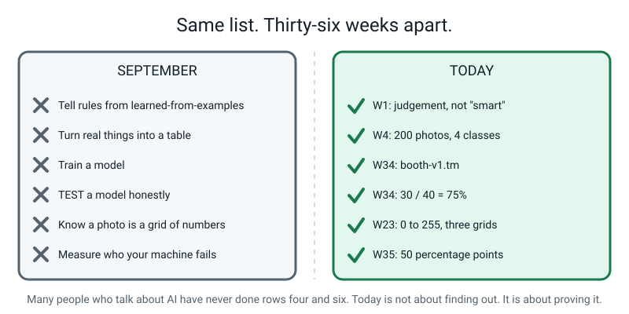
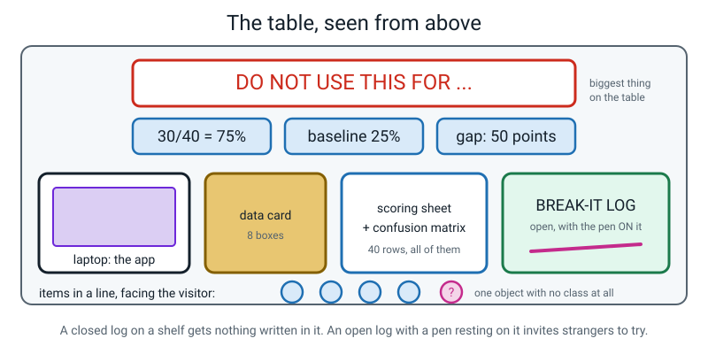
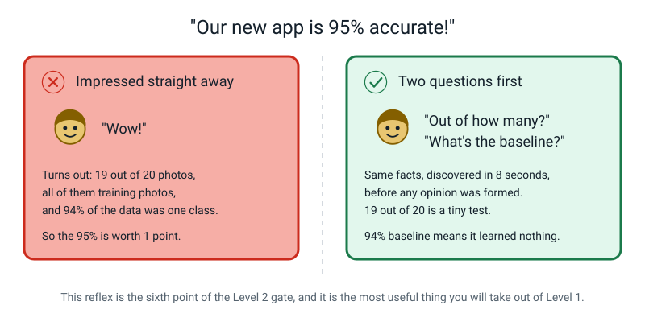
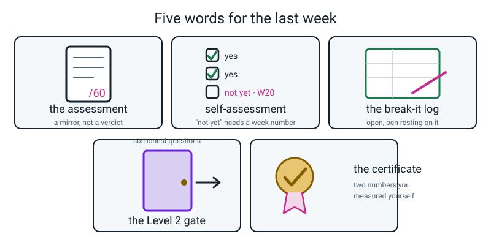

# Week 36 — Showcase Day: Prove It, Present It, Celebrate It

[⬅ Week 35](week-35.md) · [Course Home](../README.md) · [Workbook](../workbook/week-36.md)

---

> ### This week in one sentence
> **You can build a guessing machine, measure it honestly, find out who it fails, and explain every bit of it without once saying "magic".**
>
> **By the end of this chapter you will have:**
> - Completed the **Level 1 assessment** — 20 multiple choice, 8 short answer, 4 applied debug problems
> - Delivered your **five-minute booth demo to a real audience** and answered questions nobody rehearsed with you
> - Invited visitors to **break your model** and recorded at least one genuine finding in the break-it log
> - **Self-assessed** against all six Level 1 outcomes and the six-point Level 2 gate, honestly, with "not yet" allowed
>
> **Reading time:** about 25 minutes. **Homework:** about 50 minutes, and none of it is new content.
>
> **New words this week:** none. Nothing new is introduced today. Today is proof.

---

## 🪝 Start Here

Before anything happens today, read this list slowly. Pause after each line.

At the start of this course you could not:

- Look at a machine and say whether a **person wrote its rules** or a **machine learned them from examples**
- Turn a pile of real things in your kitchen into a **table with rows and columns**
- Train a model
- **Test** a model — and that's the rare one
- Explain that a photo is a **grid of numbers**, or that a chatbot is a next-word guesser that can be beautifully fluent and completely wrong
- Measure the group your own machine treats badly, and then write the number on a sign in the biggest letters on the table


*Figure 36.1 — Same list, thirty-six weeks apart.*

**Most adults who talk about AI for a living cannot do the fourth one or the sixth one.** That's not flattery. It's just rare, because both of them are slow and neither of them is fun to post about.

So today is not about finding out whether you learned anything. That question is already settled — the booth is sitting right there on the table.

**Today is about *proving* it, three ways.**

---

## 🧠 The Big Idea

### 1. Three parts, in this order, and the order matters

**The plain explanation.** Today has three parts: the paper, the showcase, the reckoning. They happen in that order and the order is not an accident.

**The analogy.** You don't weigh yourself *after* someone tells you how great you look. You weigh yourself first, then you go out. The scale doesn't care about compliments, which is exactly what makes it useful.

**The concrete version.**


*Figure 36.2 — The three parts, in order, with both timing options.*

**Part one — the paper.** Thirty-two questions, closed book, pencil and paper, calculator allowed but the division must be written down. About 90 minutes done properly, so it usually gets its own sitting.

This is **not** a test somebody is grading you on. It's a **mirror**. Its entire job is to show which weeks didn't stick, so you can fix them before Level 2 instead of discovering the hole halfway through a Python lesson.

**Part two — the showcase.** At least two adults who have never seen this. Five minutes, **no notes**. Then they ask you whatever they want. Then you *invite them to break it.*

**Part three — the reckoning.** You mark the paper together, out loud. You go through the six Level 1 outcomes one at a time. And you answer six questions about whether you're ready for Level 2 — where **"not yet" is a legal answer that gets respected completely.**

> **⚠️ Watch out:** the paper comes before the applause. A person who has just been clapped at by two adults will not mark themselves honestly. That's not a character flaw, it's just how people work — so we design around it.

---

### 2. Sixty marks, and two thirds of them are for explaining

**The plain explanation.** The paper is 60 marks in three parts, and the marks are not spread evenly across the *kinds* of question.

**The analogy.** In a cooking competition, naming the ingredients gets you a few marks. Cooking the thing and explaining what you'd change gets you the rest. Naming is the cheap third.

**The concrete version.**

```
   Part A   20 multiple choice   × 1 mark   =  20
   Part B    8 short answer      × 3 marks  =  24
   Part C    4 applied / debug   × 4 marks  =  16
                                              ───
                                               60
```

Part A is a third of the paper and it's the easy third. **Parts B and C are 40 of the 60** — two thirds — and they are all *explaining* and *fixing*. In B and C you get marks for the arithmetic being **visible**.


*Figure 36.3 — Where the marks are, and what each band tells you to do next.*

**The four bands.** Notice that every one of them ends in an *instruction*, not a verdict.

| Score | What it means | What to do |
|---|---|---|
| **0–29** | The core ideas haven't landed yet | Go back to Weeks 1–12 and redo the **projects**, not the reading |
| **30–41** | Vocabulary yes, reasoning not yet | Redo the weeks the marks were lost in, then retake Part B only |
| **42–52** | Solid. The gate is open | Finish the booth, then Level 2 |
| **53–60** | You could teach this | Take a stretch direction, then Level 2 |

> **The score is a mirror, not a verdict. What you do next is the actual result.**

A **38** that turns into *"I'm going back to Week 20 and redoing the accuracy project"* is a better outcome than a **47** that turns into nothing at all.

**Three rules of the paper, and the reason for each:**

| Rule | Why |
|---|---|
| **Closed book.** No modules, no glossary, no workbook. | The point is to find the holes. A hole you can look up is still a hole. |
| **Calculator allowed, but write the division down.** | "0.75" with nothing above it isn't evidence of anything. Half the marks in Part B are for the arithmetic being visible. |
| **Write "not sure" beside any guess.** | Those items matter **even when the guess is right.** A lucky right answer that goes unmarked is a hole that walks into Level 2 with you. |

---

### 3. Every "not yet" needs a week number

**The plain explanation.** The score is one number. Underneath it there's something far more useful: six outcomes, with a list of specific "I can..." sentences under each one. Every sentence is either true about you or it isn't.

**The analogy.** "You're a 6 out of 10 swimmer" is nearly useless. "You can float, you can do front crawl, you cannot yet breathe on both sides, and you cannot yet dive" is a training plan.

**The concrete version.**


*Figure 36.4 — Six outcomes. "Not yet" is a legal answer and the only one that helps.*

The six outcomes are:

1. **Rules vs learned from examples** — including hard cases, narrow AI, and products that are a *stack* of both
2. **Build a real dataset by hand** — rows and columns, messy values, features and label, useful/useless/leaky, the data card
3. **Train and honestly measure a classifier** — split before training, accuracy three ways, the baseline, the confusion matrix
4. **Memorizing vs generalizing** — why testing on training data is cheating, and what a train/test gap tells you
5. **How machines see and read** — pixels as numbers, RGB, filters and `ABS`, tokens, bigram tables
6. **Fair, private, honest** — a bias test on your **own** model, the four-link chain, personal data, when not to trust an answer

**Two of the sentences on that list cannot be faked**, and they're the two that actually matter:

> - *"I have personally made a model that scored well on its own photos and failed on new ones."*
> - *"I have said out loud, to a real person, something my own model is bad at."*

You either did those or you didn't. Week 18 and today. There is no revising for them.

**And the rule that makes the whole checklist work:** every box has three legal answers — yes, no, and **not yet**.

> **"Not yet"** doesn't mean "no, softly". It means: *I know exactly what this is asking, I know I can't do it, and I know where to go and get it.*

So every "not yet" gets a **week number** written next to it. That's the deal.

- A checklist with four "not yets" and four week numbers is a **finished** checklist.
- A checklist with every box ticked and no examples is worth **nothing at all** — and you will be asked to show where you did each one.

Here's the map from wobbly topic to week:

| The idea | Go back to |
|---|---|
| Rules vs learned; narrow AI; *judgement* | **W1, W2, W3** |
| Rows and columns; messy values; provenance and data cards | **W4, W5, W6** |
| Patterns; edge cases; rule explosion | **W7, W8, W10** |
| Features and labels; useful/useless/leaky; classification vs regression; baselines | **W11, W12, W13, W14** |
| Training; class balance; confidence is not correctness; the margin | **W15, W16, W17** |
| Hold out before training; accuracy three ways; overfitting; confusion matrices | **W19, W20, W21, W22** |
| Pixels as numbers; RGB; 3×3 filters and `ABS` | **W23, W24, W25, W26** |
| Tokens; bigram counts; sampling; hallucination | **W28, W29, W30** |
| Bias chains; gaps in points; personal data; over-trust | **W31, W32, W33** |

---

### 4. The showcase: five minutes, no notes, and an open log

**The plain explanation.** Two adults minimum, neither of whom has heard your demo. You stand up. Notes go in a pocket or face down and out of reach. Five minutes, six segments, in order. Then questions. Then you hand over the pen.

**The analogy.** A driving test isn't the driving instructor watching you again. It's a stranger, who doesn't like you or dislike you, seeing what actually happens.

**The concrete version.**


*Figure 36.5 — Three things make it a showcase: five minutes with no notes, real adults, and an open log with a pen beside it.*

| Minutes | What happens | What the adult does |
|---|---|---|
| 0–2 | Visitors arrive. You're standing. Notes away. | Briefs them: real questions, try to break it |
| 2–7 | The **five-minute demo**, no notes, six segments in order | Times it silently, counts banned words out of your sight |
| 7–13 | **The questions.** Anything they like. | Says nothing. Lets silences run. Does not translate. |
| 13–18 | **"Try to break it."** Log open, pen out. | Makes sure every attempt gets written down, fooled or not |
| 18–20 | Your closing line: what you'd build next, and what you'd fix first | Thanks the visitors in front of you, then goes quiet again |

**Six rules for you:**

1. **Notes away.** In a pocket, or face down and out of reach. Not held.
2. **Standing**, facing the visitors, not the screen.
3. **Five minutes, six segments, in order.** Overrunning is normal. Skipping *how it learned* or *where it fails* is not.
4. **The failure gets demonstrated, not described.** Turn the lamp on. Hold up the squashed pot.
5. **Every break attempt gets logged** — what they showed it, what it said, the confidence, whether they fooled it, and one line of "my guess why".
6. **"I don't know" is allowed**, with a follow-up: *"my guess is ___, and the way I'd find out is ___."*

**The six questions visitors will ask.** These are on the printed cards from last week. Every good answer contains a number you measured.

| They ask | What a good answer contains |
|---|---|
| "But how does it actually know?" | It doesn't *know*. 160 labelled photos, a pattern the program found, matching new photos against it. Must contain **training** and **model**. |
| "Couldn't you just write an if-then rule?" | Tried it. "Shiny" catches the can *and* the crisp packet. Then 258 more rules. **Rule explosion.** |
| "What happens when it's wrong?" | A pot in the wrong bin. Annoying, nobody hurt — which is *why* you chose this problem. Then point at the sign. |
| "Is my photo going to Google?" | Route B: nothing left the laptop, including the model. Route A: the photos stayed, but the finished model is on a link, and an adult approved that. Precision beats reassurance. |
| "How much better than guessing?" | 25% baseline, 75% measured, 50 percentage points, 30 out of 40 — "so you can see it was 40 photos, not 4,000." |
| "Should a council use this?" | No, with the number: 40% under a lamp; 47 more lamplight photos; retrain; rerun the identical batch. |

> **💡 Try this:** the invitation to break it has to come from **you**, holding out the pen — *"please try to break it, I'll write down what you did."* If an adult offers first it feels like criticism. If you offer, it's an experiment, and adults love being part of one.

---

### 5. The door: same ideas, new spelling

**The plain explanation.** Level 2 hands you a keyboard. Almost nothing in it is a new idea. It's mostly the same ideas with different spelling.

**The analogy.** Learning to write out a recipe you already cook from memory. The cooking doesn't change. You just learn how it's written down so other people can read it.

**The concrete version.**


*Figure 36.6 — Same ideas, new spelling. Not one new idea in the right-hand column.*

| You already own this | Level 2 gives it a keyboard |
|---|---|
| A table of examples | `pandas.DataFrame` |
| Features and a label | `X` and `y` |
| "Hide 20% before training" | `train_test_split(X, y, test_size=0.2)` |
| correct ÷ total | `accuracy_score(y_test, y_pred)` |
| Your paper confusion matrix | `confusion_matrix(y_test, y_pred)` |
| Confidence scores | `model.predict_proba(X_new)` |
| "Which class is it worst at?" | `classification_report(...)` |

Look at that `test_size=0.2`. That's your envelope. Somebody wrote `0.2` in a library that millions of people use, for exactly the reason you sealed ten photos out of every fifty.

**And then the certificate.**


*Figure 36.7 — If either number box is blank, the certificate isn't finished — and nor is the project.*

This isn't a sticker. Anybody can print a certificate. Yours has **two numbers on it that you personally measured with a pencil**: your held-out accuracy, and your bias gap in percentage points. If somebody challenges either one, you can hand them the sheet.

Try that with most certificates.

---

## 🔍 Worked Examples

These are the three specimen items you marked together in class, before your own paper was touched. Do them again from scratch — the point is to know the mark scheme before it's applied to you.

### Worked Example 1 — A Part A item (sport)

> **A14.** A model that sorts cricket kit gets **27 correct out of 36** held-out photos. Express this as a decimal and a percentage.
> (a) 0.75 and 75% · (b) 0.72 and 72% · (c) 0.27 and 27% · (d) 1.33 and 133%

**The full working — two roads, and you take both.**

```
   FRACTION     27 / 36

   ROAD 1 — do the division
                36 × 0.7 = 25.2
                27 − 25.2 = 1.8          (the remainder)
                1.8 ÷ 36 = 0.05
                0.7 + 0.05 = 0.75

   ROAD 2 — simplify first (the check)
                27 and 36 both divide by 9
                27 ÷ 9 = 3 ,  36 ÷ 9 = 4
                so 27/36 = 3/4 = 0.75    ✓  both roads agree

   PERCENTAGE   0.75 × 100 = 75%

   ANSWER (a)
```

**Now the interesting part — where do the three wrong answers come from?**

| Wrong answer | Where it comes from | How to catch it |
|---|---|---|
| **1.33 and 133%** | `36 ÷ 27` — the division done **upside down** | Accuracy can never exceed 1.00 or 100%. **You cannot get more right than you attempted.** If your decimal is above 1, you flipped it. |
| **0.27 and 27%** | Reading the "27" and sticking a decimal point in front of it | It never divided by anything, so it can't be an accuracy |
| **0.72 and 72%** | A calculator slip, or 26/36 | Road 2 catches it: 3/4 is not 0.72 |

That 1.33 check is worth more than the mark. It means you can catch an upside-down division **without a calculator, forever.**

---

### Worked Example 2 — A Part B item, 3 marks (the kitchen)

> **B8.** A bin-sorting model was trained on **183 daylight** photos and **17 lamplight** photos. It scores **91% in daylight** and **42% under a lamp**.
> **(a)** State the gap in the correct unit.
> **(b)** Trace the four links from a collection habit to the group who gets bad predictions.
> **(c)** You want lamplight to be at least **one third** of the training data, keeping all 183 daylight photos. How many lamplight photos in total, and how many more must you take?

**(a) The gap — 1 mark, and the unit is the mark.**

```
   91%  −  42%  =  49 PERCENTAGE POINTS
```

Writing "49%" **loses the mark.** Subtracting two percentages gives points. This is the same one-word fix as your own bias report.

**(b) The four links — 1 mark, and all four have to be there.**

```
   1. WHO/WHAT GOT COLLECTED
      Nearly all photos were taken in the afternoon, because that
      is when there was time.

   2. THE DATA IS SKEWED  ← and this link must end in a NUMBER
      183 daylight vs 17 lamplight.  183 + 17 = 200.
      183 ÷ 200 = 0.915 = 91.5% daylight ;  17 ÷ 200 = 8.5% lamplight

   3. THE MODEL LEARNS THE SKEW
      It got good at daylight patterns and never learned what warm
      indoor light does to the same object.

   4. WHO GETS BAD PREDICTIONS
      Anyone using it in the evening, or in winter — which for a
      kitchen bin sensor is most of the time it actually matters.
```

And the sentence that earns the credit at the end: **nothing broke.** No bug, no crash. **Bias is the default outcome of learning from examples.**

**(c) The priced fix — 1 mark, and the algebra must be shown.**

```
   Let L = the total number of lamplight photos I end up with.

        L  ≥  1/3 × (183 + L)
       3L  ≥  183 + L              (multiply both sides by 3)
       2L  ≥  183                   (subtract L from both sides)
        L  ≥  91.5                  (divide both sides by 2)

   Photos come in whole numbers, so ROUND UP:  L = 92
```

**Why round *up*, not to the nearest whole number?** Because the requirement says **at least** one third. Check both:

```
   91 photos:  91 ÷ (183 + 91) = 91 ÷ 274 = 0.3321 = 33.2%   ✗ just UNDER a third
   92 photos:  92 ÷ (183 + 92) = 92 ÷ 275 = 0.3345 = 33.5%   ✓ just OVER a third
```

```
   already have 17  →  92 − 17 = 75 MORE PHOTOS TO TAKE
   then retrain, and rerun the IDENTICAL lamplight batch
```

**Two extra sentences that lift this to the top band:**

- *"Same batch before and after, or I can't tell whether the fix worked or the new photos were easier."*
- *"My 91% daylight number might drop a little. That's a real trade-off, and I'd report it rather than hide it."*

Notice this is your own booth's arithmetic with different numbers. Yours was 138 and 22, and you needed 47 more. **Same three lines of algebra.**

---

### Worked Example 3 — A Part C item, 4 marks (a vet's office)

> **C3.** A report says: *"We trained on all 611 photos (300 cat, 300 dog, 11 hamster), then tested on 20 photos picked at random from those same 611, and got 19 right. **ACCURACY: 95%.** Could be used by a vet's office."* The 20 test photos were 10 cats, 9 dogs and 1 hamster.
> **(a)** Name four problems. **(b)** Why can the 95% not be trusted? **(c)** Rewrite the process. **(d)** Write the DO NOT USE line.

**(a) Four problems, each with a number where a number exists.**

**Problem 1 — tested on training data.** The 20 came from the same 611. There is **no held-out set at all**. This is the one that cannot be repaired.

**Problem 2 — severe class imbalance.**

```
   (biggest − smallest) ÷ biggest  =  (300 − 11) ÷ 300
                                   =  289 ÷ 300
                                   =  0.9633  =  96%
   target is UNDER 20%.  This is 96%.
```

**Problem 3 — no baseline, and a test set that hides the problem.**

```
   The 20 test photos:  10 cat, 9 dog, 1 hamster
   Always guess "cat"   →  10 correct out of 20
                        →  10 ÷ 20 = 0.5 = 50%

   So the BASELINE is 50%, not 0%.
   The claimed 95% is 45 percentage points above a do-nothing strategy
   — on a test that was never a test.
```

And the hamster class — the class with 11 photos, the one everything will fail on — is measured by **one single photo**. That makes hamster accuracy either 0% or 100%, and either way the headline number barely moves.

**Problem 4 — a deployment claim with nothing behind it.** "A vet's office" is a real place with real consequences. There is no per-class accuracy, no confusion matrix, no `other` class for the animals a vet actually sees (rabbits, budgies, snakes), and no stated limits.

*(A fifth, also correct: there's no data card — and 11 hamster photos are almost certainly 11 shots of the same hamster.)*

**(b) Why the 95% can't be trusted — two moves.**

```
   MOVE 1 — the test photos were training photos.
            A model that had done nothing but MEMORISE those 611
            images would ALSO score about 95% here. So the number
            cannot tell "learned what a cat looks like" apart from
            "recognised photo number 418".
            A measurement that can't tell success from failure
            is not a measurement.

   MOVE 2 — look at WHICH 20.
            19 of the 20 came from the two easy 300-photo classes.
            The one hard class got a single photo.
```

**(c) The rewritten process.**

```
   □ Name four classes, INCLUDING `other`, and report the counts
     and the balance check
   □ Split 20% of EACH class BEFORE any training — and say how
     many photos that is
   □ Train on the training folder only. Save the project file.
   □ Score every held-out photo ONCE, on paper, no retakes
   □ Report accuracy as fraction → decimal → percentage, plus the
     baseline (25% for four balanced classes)
   □ Report PER-CLASS accuracy and a confusion matrix
   □ Name the worst class AND what it is confused with
   □ Run a bias test across lighting, background and holder;
     report the gap in percentage POINTS
   □ Make no deployment claim the per-class numbers don't support
```

**(d) The DO NOT USE line.**

> ***DO NOT USE THIS FOR:** identifying any animal in a real vet's office, or any animal that is not a cat, a dog or a hamster. It has seen **11 hamster photos** and has never been tested on a photo it did not train on.*

Two things make that line good and both are marks: it names an **absent category** (every other animal), and it names a **measured number** (11) that a stranger could go and check.

**And if you're only allowed to change one thing?** Hold photos out **before** training. Every other flaw here can be repaired afterwards. That one cannot — there is no way to make a model un-see a photo.

---

## 🎲 What We Did In Class

### Setting the booth up

Do this the night before. Ten minutes now removes the worst twenty minutes of tomorrow.


*Figure 36.8 — The DO NOT USE sign is the biggest thing. The log is open, with the pen resting on it.*

**Eleven things, and only two of them are software:**

```
   1  the brief                     7  the confusion matrix
   2  the photo counts              8  the bias report
   3  the sealed envelope           9  the DO NOT USE sign
   4  the data card                10  booth-v1.tm          ← software
   5  the scoring sheet (40 rows)  11  the Scratch app       ← software
   6  the model file record card        (+ the break-it log, open, with a pen)
```

### The showcase, in full

**Materials:** the complete booth · the break-it log, open, with a good pen resting on it · a timer the adult can see and you can't · at least two adults who have not heard the demo · six or seven objects for breaking attempts, **including something with no class at all**.

**The visitors get briefed out loud, in front of you.** This isn't a secret:

> *"Two things I'd love from you. Ask real questions, including hard ones — 'but how does it actually know?' is very welcome. And please try to break it: hold up something odd and see what happens. Whatever you manage gets written in that log, and that's a good outcome, not a rude one. What won't help is telling them it's amazing."*

**"Finished" looks like this:**

```
   □ Delivered in 5 minutes (± 60 seconds), with no notes in hand
   □ All six segments happened, in order
   □ The words "30 out of 40", "75%" and "25% baseline" were all said out loud
   □ The bias gap was stated in percentage POINTS and the group was NAMED
   □ The model was made to fail, deliberately, in front of the visitors
   □ Zero banned words (one is a pass; three means rehearse again)
   □ At least three break attempts logged, at least one with "my guess why" filled in
   □ At least one question was answered that nobody had rehearsed
```

### A real break-it log

This is what a **good** log looks like. Notice it has three successful fools in it. That's better than a log with none, because it means real attempts were made.

```
   #  what they showed it     model said   conf  fooled?  my guess why
   ─  ─────────────────────   ──────────   ────  ───────  ──────────────────────────
   1  a car key               other         71    no      the other class did its job
   2  a squashed can          landfill      58    YES     all my cans were round
   3  a glass jar             recycling     83    YES     I have NO glass photos
   4  a banana peel in a bag  recycling     64    YES     two classes in one photo

   END OF FAIR: 4 attempts, 3 successful fools.
   Most useful thing a visitor found: the glass jar — it is confident and wrong on a
   whole category that isn't in my data at all. That goes on the sign in version 2.
```

Logging the fool is *recording*. The "my guess why" column, explained from your own data card, is the **skill**.

### If you missed the class, or want to redo it at home

The two parts that need other people are the audience and the break-it attempts, and both can be shrunk without being faked:

- **One adult is enough** for the gate. Add a second listener on speaker phone, positioned so you present to a face rather than to a wall.
- **Nobody available at all?** Record the demo on a phone, then have an adult watch the recording *with you sitting beside them* and ask questions afterwards. That satisfies what the gate is actually for.
- **The paper works entirely alone** — closed book, timed, and mark it yourself with the answer key afterwards, writing the week number beside every wrong item.

> **💡 Try this if you want the hard version:** ask one visitor, privately, to say *"I don't believe your 75%."* Then respond by handing over the scoring sheet and walking them through three rows. That is the top band of the rubric, and it is genuinely satisfying.

---

## 💬 Talk About It

**1. Ask an adult: "what's a certificate you have that actually proves something?"**
> *Hint:* push past the framed ones. A driving licence proves a stranger watched you drive. A swimming badge proves you swam a distance. Then compare: yours has two numbers on it that you measured, and the evidence is in a folder you can hand over. Ask which of theirs has that.

**2. Ask a friend who hasn't done this course: "an app is 95% accurate at spotting fake reviews. Impressed?"**
> *Hint:* almost everyone says yes. Then ask **your** two questions — *out of how many?* and *what's the baseline?* — and watch what happens to the conversation. That reflex took you 36 weeks. It takes about eight seconds to use.

**3. Argue this properly with a parent: "if I ticked four 'not yets', did I fail Level 1?"**
> *Hint:* the interesting version of this argument is about what a checklist is *for*. If every box is ticked, what did the checklist tell you? Nothing. Its whole value is in the boxes that aren't ticked — and each of those with a week number beside it is a plan, not a wound.

---

## ⚠️ Don't Get Tricked

### Trick 1 — "95% accurate" means it's good


*Figure 36.9 — Same facts, discovered in eight seconds, before any opinion was formed.*

| ❌ Wrong | ✅ Right |
|---|---|
| "95%? Wow." | "Out of how many? And what's the baseline?" |
| Forms the opinion first, then maybe checks. | Asks the two questions **before** deciding whether to be impressed. |

This is the sixth point of the Level 2 gate, and it's the single most transferable thing in Level 1. It works on adverts, news headlines, app stores and your own booth. Especially your own booth.

---

### Trick 2 — "The score is the result"

| ❌ Wrong | ✅ Right |
|---|---|
| "I got 38. That's my result." | "I got 38. My result is that I'm redoing Week 20's project this weekend." |
| The number is the ending. | The number is a **mirror**, and what you do next is the ending. |

A 38 that becomes a plan beats a 47 that becomes nothing. And here's the honest version of the gate: *42 or more, **or** you fixed what you missed and can now explain it without notes.* **Fixing counts. Pretending doesn't.**

---

### Trick 3 — "Ticking 'not yet' means I failed"

| ❌ Wrong | ✅ Right |
|---|---|
| Tick every box so the page looks finished. | Tick what's true, and write a week number next to every "not yet". |
| Every box ticked, no examples. | Four "not yets" with four week numbers — a **completed** checklist. |

Being able to assess your own understanding is genuinely rarer than a good score. Most adults can't do it, which is why they say "I'm quite good at computers" and then can't say at what, out of how many tries.

---

### Trick 4 — "I shouldn't say 'I don't know' in front of an audience"

| ❌ Wrong | ✅ Right |
|---|---|
| Invent something confident-sounding. | "I don't know. My guess is ___, and the way I'd find out is ___." |
| Assumes adults are impressed by certainty. | Adults are impressed by people who know the edge of what they know. |

That answer is in the **top band** of the rubric on purpose. A confident wrong answer is worse than an honest gap, and every adult in the room already knows it — they've all met someone who bluffed.

---

## 🌍 Where You've Seen This

1. **Any exam you've ever sat.** You now know the difference between a test that finds holes and a test you've already seen the answers to. That's the held-out rule, and it's been in your school bag all along.
2. **A driving test, or a swimming badge.** A stranger watches you do the thing. That's what makes it mean something — the same reason your audience today has to be people who haven't heard the demo.
3. **Product recall notices and "not suitable for" labels.** That's a DO NOT USE sign written by lawyers. Yours is better, because yours has a measured number in it.
4. **Restaurant hygiene ratings in the window.** A number, from a stranger, displayed where customers see it, whether it's flattering or not. That's a booth with an honest sign.
5. **Any news story with a percentage in the headline.** Now you can't read one without wanting the fraction and the baseline. That itch never goes away, and it's the most useful thing you're taking with you.
6. **Somebody at school saying "I'm rubbish at maths."** Compare it with "I can't yet do long division with remainders — I'm going back to that this week." Same information, completely different future.

---

## 🔑 Remember This

- **The paper is a mirror, not a verdict.** Its job is to find the holes so they don't walk into Level 2 with you. What you do next is the actual result.
- **Two thirds of the marks are for explaining and fixing**, and in Parts B and C the arithmetic has to be **visible**. A calculator is fine; "0.75" with nothing above it is not.
- **Write "not sure" beside every guess** — those items matter *even when the guess is right*, because a lucky right answer is a hole that survives.
- **"Not yet" is a legal answer, and it needs a week number.** With a week number it's a plan. Without one it's just a mood.
- **The failure gets demonstrated, not described.** Turn the lamp on. Anyone can show it working.
- **"I don't know, and here's how I'd find out"** is a top-band answer, at any age, in any room.
- **Out of how many? What's the baseline?** Ask those two before you decide whether to be impressed. Forever.
- **Not one new *idea* is waiting on the other side of the door** — only new spelling. That's the reward for doing Level 1 slowly.

---

## 📓 New Words

**No new words. Not one.** Today is proof, not teaching. Here are the five things you'll be handling for the last time this level.


*Figure 36.10 — Five words for the last week.*

| Word | What it means | Example |
|---|---|---|
| **the assessment** | 32 items, 60 marks, closed book. A **mirror**, not a verdict. | Part A 20 · Part B 24 · Part C 16 → 60. Two thirds are for explaining. |
| **band** | A score range that comes with an **instruction**, not a judgement | "42–52: solid, the gate is open." Copy the instruction out, don't just circle the band. |
| **"not yet"** | *I know what this asks, I know I can't do it, and I know where to get it.* | "Not yet — W20 and W22. Redoing the accuracy project this weekend." |
| **the break-it log** | The page where every attempt to fool your model gets written down, fooled or not | "A glass jar → recycling, 83%, YES fooled. I have no glass photos at all." |
| **the Level 2 gate** | Six honest questions. All six need a yes, or a "not yet" with a week number. | Point 6: "95% accurate" → *out of how many?* and *what's the baseline?*, automatically. |

---

## 📤 Your Homework

Go to **[the Week 36 workbook](../workbook/week-36.md)**. About **50 minutes**, not counting the paper. **There is no new content.**

| Page | What to do | Time |
|---|---|---|
| **W36-1 / 2 / 3** | Part A, Part B, Part C of the paper | *in the paper sitting* |
| **W36-4** | **Score tally** — A + B + C, total out of 60, the band, and the band's instruction **copied out in your own hand** | 5 min |
| **W36-5** | **Showcase record** — demo time, banned-word count, which questions were asked, and at least one **unrehearsed** one written down word for word | 5 min |
| **W36-6** | The **break-it log**, completed, plus the single most useful thing a visitor found | 5 min |
| **W36-7** | The **six-outcome checklist**, ticked honestly, with a week number beside every "not yet" | 12 min |
| **W36-8** | The **six-point Level 2 gate** — yes or not-yet, plus a week number for every not-yet | 8 min |
| **W36-9** | The **letter to yourself**, sealed and dated | 15 min |

**W36-8 and W36-9 are the two that matter.** The rest is recording.

**About the letter.** One page, by hand. What you want to **build** next, and one thing you want to be able to **do** that you can't do yet. Then put it in an envelope, seal it, write today's date on the front, and **don't open it until you finish Level 2.** Then you get to find out whether the person who wrote it was right about you.

> **💡 Try this if you get stuck on the letter:** answer one question instead. *What would you build if nobody was going to mark it?* That unlocks it every time.

---

## 🎉 One Last Thing

Thirty-six weeks. One model. Two hundred photos you took yourself. Forty held-out scores written in pencil, one at a time, when it was boring. A confusion matrix drawn by hand. A bias gap you went looking for on purpose, and then printed in marker in the biggest letters on your own table. And a five-minute demo delivered to strangers without once saying **magic**.

**That is a real piece of work.** Keep the folder — all eleven artefacts, in one wallet, on a shelf.

Because the very first thing you'll do in Level 2 is reproduce that hand-computed accuracy in about three lines of Python. And the moment the computer prints `0.75` and it matches the number you worked out with a pencil in Week 34 is honestly the best moment in the whole of Level 2.

It only works if the folder still exists.

---

[⬅ Week 35](week-35.md) · [Course Home](../README.md) · [Level 2 ➡](../../../level-2-builder/README.md) · [📓 Workbook — Week 36](../workbook/week-36.md) · [Glossary](../../glossary.md)
