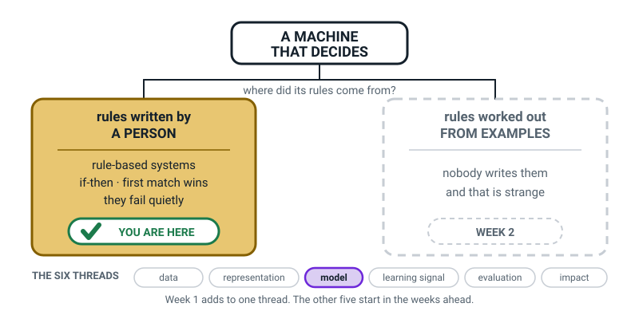

# Week 1 — Is It Smart, or Is It Just Following Orders?

[⬅ Start of course](../README.md) · [Course Home](../README.md) · [Week 2 ➡](week-02.md) · [Student Guide](../student-guide/week-01.md) · [Workbook](../workbook/week-01.md)

---

## 📋 At a Glance

Use this table to see the whole lesson on one screen before you read further.

| | |
|---|---|
| **Duration** | 73 minutes (60-minute and 75-minute versions given in §The Lesson) |
| **Type** | Teach — first lesson of the year, first lesson of Term 1 |
| **Big idea** | AI is a machine doing a job that used to need a person's judgement — not a brain, not magic. |
| **New vocabulary** | artificial intelligence · judgement · rule-based system · if-then rule |
| **Materials** | Printed card sheet (12 cards, cut out) · printed three-bin mat · printed vending-machine rulebook × 2 · pencil · student notebook · scissors · a real thermostat, or a photo of one |
| **Tech needed** | **None.** This entire lesson runs on paper. No laptop, no internet, nothing to install. |
| **Prep time** | 15 minutes the night before (printing and cutting) + 20 minutes reading this file |
| **Source module** | [`module-01-what-ai-is-and-isnt.md`](../../module-01-what-ai-is-and-isnt.md) §1, §2 |

> **🧑‍🏫 Teacher, read this first:** you do not need to know anything about AI to teach this lesson.
> Everything you need is in the section below called *What YOU Need to Know First*. It takes about
> twelve minutes to read and it is genuinely enough. If you have not yet read
> [`00-orientation.md`](00-orientation.md), do that once at some point this month — but you can teach
> today's class without it.

---

## 🎯 Lesson Objectives

By the end of this lesson the student can:

1. **Define artificial intelligence in one sentence** without using the words *robot*, *brain* or *magic*.
2. **Decide whether a task needs judgement** by applying one test: *could two reasonable people
   disagree about the answer?*
3. **Trace an if-then rule through a rule-based system by hand** — take a written rulebook, run one
   case through it in order, and correctly predict what the machine will output.
4. **Sort ten everyday systems** into *a human wrote the steps* and *not sure yet*, and say out loud
   what would settle each uncertain case.
5. **Settle the opening question with evidence** — say which of AlphaGo and the thermostat is doing
   the interesting thing, and justify it with *both* halves: whose job needs judgement, and who wrote
   the rules.

You will know they hit objective 3 if they can point at the exact numbered rule that produced the
answer. That is the observable behaviour to look for.

You will know they hit objective 5 if the justification contains *nobody could write the rules* in
some form. "It's cleverer" does not count — send it back once.

---

## 🧑‍🏫 What YOU Need to Know First

*Read this once, slowly. About twelve minutes. It is written for an adult who has never thought
about AI before, and it is complete — you will not need anything else.*

### The definition this whole course is built on

Here it is, and it is a good one:

> **Artificial intelligence** is getting a machine to do a job that used to need a person's
> **judgement**.

Read it again and notice what is *not* in it. It does not say *smart*. It does not say *brain*. It
does not say *thinks*, *understands*, *wants* or *feels*. It does not say the machine has to do the
job the same way a person would.

That last point is the one that saves you. A submarine does not swim like a fish. It moves through
water by a completely different method and it still gets from one port to another. AI systems do
jobs that used to need judgement, using methods that are nothing like human thinking. You never have
to answer "but does it *really* think?" — the definition never asked.


*Figure 1.1 — The picture on the left is what most people imagine. The picture on the right is what
is actually happening in almost every case.*

### The word that carries all the weight: judgement

**Judgement** means a choice where two reasonable people could look at the same case and answer
differently, and where the right answer depends on the specifics.

That definition is doing real work. It draws a line that nothing else draws cleanly:

| Job | Judgement? | Why |
|---|---|---|
| Add 47 + 88 | ❌ No | One exact answer, one exact method. Nobody argues. |
| Ring a bell at 3:30 pm | ❌ No | A clock does it. There is no case-by-case decision. |
| Sort 200 numbers smallest to largest | ❌ No | One right answer, and everyone gets the same one. |
| Decide if a photo is a good one to keep | ✅ Yes | Depends on who is looking. People genuinely disagree. |
| Decide which video to show you next | ✅ Yes | Depends on you, right now. There is no correct answer. |
| Decide if this text message is spam | ✅ Yes | Two people would sort a marketing text differently. |

Say the test out loud a few times so it becomes automatic: **"Could two sensible people disagree?"**
If yes, judgement. If no, not judgement, and so (as a rule of thumb) probably not a candidate for AI no
matter how modern the box looks.

It is a heuristic, not an exact boundary: reading a number plate has
one right answer yet is a real AI job. Say so if a student raises it.


*Figure 1.2 — Judgement is a slider, not a switch. The right-hand end is where most AI jobs live.*

There is a lovely, very concrete version of this that you can use with an 11-year-old: **the
pizza-cutter test.** A pizza cutter does a job (slicing) that a person used to do with a knife. Is a
pizza cutter AI? No — slicing is not judgement. It is a physical action with no decision inside it.
But *"look at this pizza and decide whether it is burnt enough to throw away"* — that is judgement.
A machine doing that would be AI.

### The first way to get a machine to decide: a human writes the steps

The oldest and by far the most common way to make a machine produce a decision is for a human to sit
down, think hard, and write every step down in advance in the form **if this, then that**.

> **Rule-based system** — a system where a human wrote the decision steps by hand, as if-then
> instructions, before the machine ever ran.
>
> **If-then rule** — one instruction of the form *"if this is true, do that"*.

Your student's home is full of these:

- A **thermostat**: `IF room_temperature < 20°C THEN turn_on_heater`
- An **old spell-checker**: it holds a list of 100,000 correct words. `IF the word is not in the list THEN underline it in red`
- A **traffic light** on a timer: `IF 30 seconds have passed THEN switch to amber`
- A **vending machine**: `IF coins_inserted >= price THEN release item AND return change`


*Figure 1.3 — Everything a thermostat will ever do, on one page. A person wrote every box.*

Two properties of rule-based systems matter, and they matter all year:

**They are predictable and explainable.** You can always point at the exact line that produced the
answer. If a thermostat misbehaves, an engineer reads the rules and finds the bug.

That is a genuine advantage and this course never sneers at it. Most of the software in the world is rule-based and
that is correct.

**They only know what a human put in them.** Here is the crack. Suppose a spell-checker's dictionary
contains `cat, cot, cut, dog, dot`. You type `dat` — no match, so it underlines it. Good.

Now you type **"I have a pet dot."** You meant *dog*. The system finds `dot` in the list and stays silent.
It cannot catch your mistake, because nobody wrote a rule about pets and dots.

A rule-based system does not fail loudly; it fails *quietly*, giving a technically-correct answer to a case its author
never imagined.

### The two misconceptions you will meet today

**Misconception 1: "AI means robots."**

This is the big one and it will come up in the first five minutes. Robots are about *bodies*. AI is
about *a kind of decision*. They are separate questions and they cross in all four combinations:

| | Has a body | No body |
|---|---|---|
| **Doing AI** | Robot vacuum working out a room's shape | Spam filter, face unlock, YouTube feed |
| **Not doing AI** | Factory welding arm repeating one weld | Calculator app, microwave timer |

Almost all the AI in the world has no body at all. Say that sentence today; it does more work than
any other single sentence in this lesson.

**Misconception 2: "It's AI because it's on a computer / because it's modern."**

Everything digital feels like AI, so the word gets stuck to anything with a screen. The fix is to run
the judgement test *first*, before anything else. A calculator app is on a computer, is modern, and
is not AI, because adding two numbers is not judgement.

The reverse mistake also happens: a student decides something is *not* AI because it is old or boring.
A 1990s bank fraud detector that learned from millions of transactions is AI. It is beige and it lives
in a basement.

### How deep to go — and where to stop

**Go this deep today:**

- The definition, with *judgement* circled.
- The two-reasonable-people test, used out loud at least six times.
- Rule-based systems, if-then rules, and running one by hand.
- The idea that some things go in a "not sure" bin, and that this is fine.

**Stop before all of these — they belong to later weeks:**

- **Machine learning** — that is Week 2, next week, and it is the punchline. If the student says
  "but how does the spam filter know?", write it on the Questions We Owe page and say *"that is
  exactly next week"*. Do not answer it today. The suspense is doing work.
- **Generative AI, chatbots, narrow vs general** — Week 3.
- **Neural networks, training, accuracy** — much later. One honest sentence and move on.

> **⚠️ Watch out:** the single easiest way to spoil this lesson is to answer next week's question
> today. When the student asks "so who wrote the rules for the spam filter, then?" — and they will —
> the correct teacher response is: *"Nobody did. And that is so strange that it gets a whole lesson
> to itself. Write the question down; we open with it next week."* Then actually do that.

### Two questions you may get about "there are two ways"

The student guide now says plainly that "two ways" is a simplification, so a sharp learner may push.
Both of these have short honest answers, and you do **not** need to go further than these sentences.

| They ask | Say |
|---|---|
| *"What's the third way then?"* | *"Some machines try thousands of options very fast and pick the best one — that's how chess computers work. It's a bit of both: in the classic version a person wrote the rule for what 'best' means (newer engines learn that part), and the machine does the searching. We'll meet it properly later."* |
| *"So which is a chess computer?"* | *"Honestly, a blend — and that's a great answer, not a cop-out. Put it in the not-sure bin and say why. That's exactly the skill we're practising."* |

> **💡 Try this:** if you don't know, say *"I don't know — let's write it on the Questions We Owe page
> and I'll look it up."* Doing that once in week one gives you permission for the whole year, and it
> models the behaviour you want from them. Pretending is the only wrong move available to you here.

### 🧭 The Growing Map — how to use it, this week and every week

The student guide carries a figure called **Where This Fits**. It is the same picture every week, with
one more piece filled in, and it is the only thing in this course that shows the learner the *shape* of
what they are building rather than this week's content.



*Figure 1.0 — Week 1's version. One branch solid, one dashed, and the six-thread strip along the
bottom with only **model** lit.*

**What to do with it, in about two minutes at the end of the lesson:**

1. **Show it, don't explain it.** Put it in front of them and ask *"which bit did we do today?"* Let
   them point. They will point at the solid box, and pointing is the whole exercise.
2. **Then ask the better question:** *"why is the other box dashed?"* The answer you want is *"because
   we haven't done it yet"* — which quietly tells them the year has a shape and they are inside it.
3. **Have them copy it into the inside cover of their notebook, in pencil, leaving lots of room.**
   Every week they add to their own copy. The version they draw is worth roughly ten times the version
   I drew, and by March their notebook cover is the best revision aid they own.

> **🧑‍🏫 Why this is worth two minutes.** A learner who can see the map can tell the difference between
> *"I don't understand this week"* and *"I don't know where this week goes"* — and those need completely
> different help from you. Without the map, both come out of their mouth as "I don't get it."

**The six threads** along the bottom are the spine of all four levels: **data · representation · model
· learning signal · evaluation · human impact.** You do not need to teach them or name them today.
They exist so that by week 36 the learner has seen every week land on one of six shelves, rather than
36 unrelated topics. Only **model** is lit this week.

> **⚠️ Watch out:** do not turn this into a quiz. The map is orientation, not assessment. If they
> cannot remember which thread this week belonged to, that is fine and it costs nothing.

---

### Close the loop you opened — do not skip this

This part tells you how to answer the opening question, so the loop closes.

The chapter opens with AlphaGo versus the thermostat, asks the learner to **write down one of the two
words**, and promises an answer. **Section 5 of the student guide delivers it, and you must deliver it
in the Wrap.** An opened loop that never closes teaches the learner that the questions in this course
are decoration.

The answer, in the order to give it: the thermostat's job needs **no judgement** (is 19 lower than
20 — nobody ever disagreed), and a person wrote all four of its boxes. AlphaGo's job needs judgement
(strong players can disagree about the best move), and **nobody could write those rules** — which
is why it had to learn them, from human games and from playing itself. (The rules of Go and the search
procedure were written by people; what was learned was how to judge moves and positions.)

Then give the honest correction to the headline: *narrow, not thinking.* One machine, extraordinarily good at one job, blank one step outside it.

> **🧑‍🏫 If a student wrote THERMOSTAT:** say so warmly and specifically — *"that is the single most
> reasonable wrong answer in this whole subject, because 'it decides with nobody there' is a genuinely
> good observation."* Then give them the distinction they have just earned: **nobody is there now** is
> not the same as **nobody ever wrote it down**. A learner who gets that sentence from their own wrong
> answer remembers it far longer than one who was simply told.

### The one thing to be relaxed about

Some of the twelve cards in today's activity have no clean answer, on purpose. Autocorrect is
genuinely two systems bolted together — a word list (rules) and a next-word predictor (learned). The
self-checkout scale is a weight threshold (rules) sitting next to a camera that may or may not be
doing something learned. A video doorbell has a motion sensor (rules) and a "that's a person, not a
cat" detector (learned).

**Celebrate the "not sure" bin.** In this course, "I am not sure, and here is the one fact I would
need to look up" is a better answer than a confident wrong one, and the student needs to learn that
in week one rather than week twenty. If they put three cards in "not sure" and can say what would
settle each, that is a very good lesson.

---

## 🧰 Prep Checklist

This list gets the room ready. Do the first part the night before and the second part just before class.

### 15 minutes the night before

- [ ] **Print** the card sheet — Figure 1.4 below (the workbook has no cut-out sheet). **Cut out the 12
      cards.** Card stock is nicer but ordinary paper is fine.
- [ ] **Print** the three-bin mat (Figure 1.4, top half) at A4 or larger. A hand-drawn version on the
      back of an envelope works just as well — three big boxes labelled *A HUMAN WROTE THE STEPS*,
      *IT WORKED IT OUT ITSELF*, *NOT SURE YET*.
- [ ] **Print two copies** of the vending-machine rulebook and price list (Figure 1.5). One for you,
      one for the student.
- [ ] **Read** the section *What YOU Need to Know First*, above. Twice if you can.
- [ ] **Say the definition out loud** in your own words, once, to an empty room. If it comes out
      wobbly, read it again. *"AI is a machine doing a job that used to need a person's judgement."*
- [ ] **Do the vending trace yourself**, on paper, for request 5. If you cannot do it cold, the
      student certainly cannot.

### 5 minutes before class

- [ ] 12 cards, mat, two rulebooks, pencil, notebook on the table.
- [ ] A thermostat within reach, or a photo of one on a phone. If your home has no visible
      thermostat, a microwave with a timer works exactly as well.
- [ ] Open a page in the front of the notebook and head it **"Questions We Owe Answers To"**. You will
      use it today and every week.
- [ ] Phone on silent, face down. Yours too.

### If something fails

| Problem | Fallback |
|---|---|
| No printer | Write the 12 card names on 12 torn scraps of paper. Draw three boxes on a sheet. Total cost: four minutes. This activity was designed to survive this. |
| No internet | Irrelevant. This lesson needs no internet at all. |
| No scissors | Tear along folded lines, or just write the names on scraps. |
| Only 45 minutes available | Run Hook (8) + Concept (12, cut the spectrum figure) + Activity Part A card sort (15) + Wrap (10). Move the vending rulebook to homework and open Week 2 with it. |

---

## ⏱️ The Lesson, Minute by Minute

This section is the script. Each segment says what to do, what to say, what to ask, and what to expect.

| Time | Minutes | Segment | What happens |
|---|---|---|---|
| 0:00–0:08 | 8 | 🪝 **Hook** | The AlphaGo story and its twist. The thermostat on the table. |
| 0:08–0:26 | 18 | 🧠 **Concept** | The definition · the judgement test · rule-based systems · the thermostat flowchart on the board |
| 0:26–0:40 | 14 | 🔍 **Worked Example Together** | The vending-machine rulebook. You trace one request out loud; the student traces two. |
| 0:40–1:00 | 20 | 🎲 **Activity** | The Thermostat Trial: 12-card sort, then the student runs the remaining six requests plus the one that breaks it. |
| 1:00–1:13 | 13 | 🔑 **Wrap & Assign** | One-sentence definition in their words · vocabulary into the notebook · **unfold the AlphaGo/thermostat word and settle it** · homework, step one only |
| | **73** | | |

> **⏱️ This runs 73 minutes, not 70** — the extra three are the closing moment where the learner
> unfolds their own guess and finds out. That moment is the lesson, so it is the last thing to cut.
>
> **If you are genuinely short of time:** drop the third vending request in Segment 3 (saves ~3 min)
> or run the card sort with 8 cards instead of 12 (saves ~4 min). **Do not** shorten the Wrap. A
> lesson that opens a question and runs out of time before answering it teaches the learner that the
> questions here are decoration.

**For 60 minutes:** cut the worked example to 8 minutes (you trace request 5, student traces one not
two) and cut the card sort to 12 minutes by using only 8 of the 12 cards — drop calculator, alarm
clock, traffic light, Google Translate.

**For 75 minutes:** after the sort, add the *Rule Six* extension in §Differentiation.

---

### 🪝 Segment 1 — Hook (0:00–0:08)

**Do this:** Put the thermostat (or the photo, or the microwave) on the table where the student can
see it. Do not explain it. Sit down. Then tell the story.

**Say this:**

> "In 2016 a computer program called AlphaGo beat one of the best human players in the world at a board game
> called Go. Go is so complicated that there are more possible games of Go than there are atoms in
> the universe. Not more than atoms on Earth. More than atoms in *the universe*.
>
> Newspapers everywhere printed the same headline: **machines are thinking now.**
>
> Here is the bit they did not print. That same program could not play checkers. Not badly — *at
> all*. It could not tell you what a Go board is made of. If you had asked it 'are you tired?' it
> would have answered with a Go move, because a Go move is the only thing it can produce. It had one
> skill, and outside that one skill it was completely blank.
>
> So which is it? A thinking machine, or a very fancy calculator?"

Pause. Let that sit for a beat. Then pick up the thermostat.

> "Now look at this. This thing decides, all by itself, whether to heat your house. Nobody tells it.
> It just decides. Is *this* smart?
>
> Here is my honest position: I think one of those two things is doing something interesting and one
> of them is just following orders, and by the end of today you are going to be able to tell me
> which — and prove it. We are going to build a test. It takes about thirty seconds to run and it
> works on anything."

**Ask this:**

> **"Which one do you think is doing something interesting — the Go program or the thermostat?"**

**Do this first — before anyone answers out loud.** Hand out a scrap of paper or point at the top of
their notebook page and say:

> "Don't tell me yet. **Write one word: ALPHAGO or THERMOSTAT.** No hedging, no 'both'. Then fold it
> over. We come back to it at the end of the lesson."

This takes fifteen seconds and it is worth much more than it costs. A learner who has *committed in
writing* is measurably more likely to remember the correction — and a spoken guess is easy to quietly
revise once they hear which way the room is going. Written, folded, theirs. The student guide asks
them to do the same thing, so the habit is reinforced at home.

Then take answers out loud:

- **Hoping for:** anything with a reason attached. Most students say the Go program. Good.
- **If they say "the thermostat, because it works without a person there":** excellent — that is a
  genuinely thoughtful answer and it is the misconception this whole lesson dismantles. Say *"Hold
  that. I want to come back to it in twenty minutes"*, and actually come back to it during the
  activity.
- **If they shrug or say "I don't know":** *"Fair. Guess anyway — you can change your mind later and
  nobody's marking it."* Then move on. Do not squeeze.
- **If they ask "what's checkers?":** answer in five seconds and move on.

---

### 🧠 Segment 2 — Concept (0:08–0:26)

This is the block where you introduce all four vocabulary words. Concrete first, name second, every
single time.

#### Part A — the definition (0:08–0:13)

**Say this:**

> "Picture your school's front desk. A visitor walks in. Somebody has to decide: *is this person
> allowed inside?* That is a real decision. You have to look at them, weigh it up, and choose. For a
> hundred years only a human could do that job.
>
> Now picture a camera at a car park gate that reads number plates and lifts the barrier for cars on
> the approved list. A job that used to need a person's decision is now being done by a machine.
>
> That is the whole of it. **Artificial intelligence** is getting a machine to do a job that used to
> need a person's judgement.
>
> Notice what I did not say. I did not say smart. I did not say brain. I did not say it thinks or
> understands or wants anything. And here's the strangest bit — I did not say it has to do the job
> the same way a person would.
>
> A submarine doesn't swim like a fish. It moves through water in a totally different way, and it
> still gets from one port to another. AI is like that. It does the job. It does not do it your way."

**Do this:** Write this on the board, big, and leave it up for the whole lesson:

```text
ARTIFICIAL INTELLIGENCE
= a machine doing a job that used to need
  a person's JUDGEMENT
```

Circle the word JUDGEMENT twice.

#### Part B — the judgement test (0:13–0:19)

**Say this:**

> "So everything now depends on that one word. What is judgement?
>
> Here's the test, and it's the only test you need: **could two sensible people look at the same
> thing and give different answers?** If yes, that's judgement. If no, it isn't.
>
> Adding 47 and 88 — could two sensible people disagree? No. There's one answer, 135, and anyone who
> says otherwise is just wrong. Not judgement.
>
> Deciding whether a photo is blurry enough to delete — could two sensible people disagree? Absolutely.
> I'd keep it, you'd bin it, and neither of us is wrong. That's judgement.
>
> Here's a pizza one. A pizza cutter slices pizza. A person used to do that with a knife. Is a pizza
> cutter AI? No — slicing isn't a decision, it's just an action. But 'look at this pizza and decide
> if it's burnt enough to throw out' — *that's* judgement. A machine doing that would be AI."

**Do this:** Show or sketch Figure 1.2. Draw a long line on the board, write "no judgement" at the
left end and "all judgement" at the right end.


*Figure 1.2 — Put things on the line, don't put them in boxes.*

**Ask this — four rapid-fire, ten seconds each:**

> **"Judgement or not: is the traffic light red?"**
- Hoping for: not judgement. Everyone agrees what red looks like.
- If they say judgement: *"Could two people standing next to each other disagree about whether the
  light is red?"* That usually settles it. If they argue "what if you're colour-blind" — that is a
  genuinely smart objection, tell them so, and answer: *"then it's a hard case for that person, but
  it's still one fixed right answer. Judgement means there's no single right answer."*

> **"Judgement or not: is this text message from a friend or from a scammer?"**
- Hoping for: judgement.
- If they say not: ask them to imagine a message from an unknown number saying "hi, it's me". Two
  people would sort that differently.

> **"Judgement or not: how many people are in this room?"**
- Hoping for: not judgement.
- If they say judgement: *"Is there one right answer?"*

> **"Judgement or not: is this joke funny?"**
- Hoping for: judgement, and usually laughter.
- Follow up with: *"Right — and that's why nobody has built a machine that reliably tells you if
  something's funny."*

#### Part C — rule-based systems (0:19–0:26)

**Say this:**

> "Okay. Now: how do you actually get a machine to make a decision? For everything we'll meet this
> year there are two ways, and today we're only doing the first one. Next week we do the second one,
> and the second one is genuinely weird, so I'm saving it.
>
> And I'll be straight with you — two is a simplification. Real engineers have a few more tricks than
> that, and some systems mix them. But nearly everything you'll meet is one of these two or a blend,
> so two is the right number of boxes for now. **I'll always tell you when I'm simplifying.**
>
> Way one: a person sits down, thinks hard, and writes every single step down in advance. **If this,
> then that.** The machine just follows the list. Forever. Exactly.
>
> Think of a note your mum sticks on the fridge: 'if the milk smells bad, throw it out. If the bread
> has green spots, throw it out. Otherwise, breakfast is fine.' That note is a decision system for
> food safety, written in advance by a human. It doesn't learn anything. If a new food goes bad in a
> new way, the note just sits there, silent, until somebody edits it.
>
> We call that a **rule-based system** — a system where a human wrote the decision steps by hand
> before the machine ever ran. And each line is an **if-then rule**."

**Do this:** Pick up the thermostat again. Draw this on the board as you talk — this is the finished
board you are aiming for:


*Figure 1.3 — Draw this on the board box by box, talking as you go. Draw the loop arrow last.*

> "Here's everything this thermostat will ever do, in its entire life. Step one: read the
> temperature. Step two: is it below twenty degrees? If yes, heater on. If no, heater off. Step four:
> wait a minute. Then go back to step one and do it all again.
>
> That's it. There is nothing else in there. A person wrote all four boxes, probably in about ten
> minutes, and the thermostat will do exactly that until it's thrown away.
>
> Now — the good news about this kind of system. It's completely predictable. If it does something
> wrong, an engineer can read the rules and point at the exact line that caused it. That's genuinely
> useful. Most of the software in the world works this way and that's the right choice.
>
> And now the crack." *(Lower your voice a bit here.)*
> "A rule-based system only knows what a human put in it. Imagine a spell-checker with a list of
> proper words: cat, cot, cut, dog, dot. You type 'dat' — not on the list — red underline. Good. Now
> you type *'I have a pet dot.'* You meant dog. What does it do?"

**Ask this:**

> **"What does the spell-checker do with 'I have a pet dot'?"**
- **Hoping for:** nothing — `dot` is a real word, so it stays silent.
- **If they say "it underlines it":** *"Is 'dot' on the list? … It is. So?"* Wait. They'll get it.
- **If they get it instantly:** push once — *"So is it broken?"* The answer you want, and it is
  subtle: **no, it did exactly what it was told.** Nobody wrote a rule about pets and dots. The rule
  book worked perfectly and gave a useless answer. That is the failure mode of every rule-based
  system, and it is the reason Week 10 exists.

---

### 🔍 Segment 3 — Worked Example Together (0:26–0:40)

**Do this:** Hand the student a copy of the vending-machine rulebook. Keep one yourself. Announce the
change of role clearly — this matters more than it sounds.

**Say this:**

> "Right. New job. For the next fifteen minutes, **you are the computer.**
>
> Not a clever computer. A completely obedient one. You may not be sensible. You may not be helpful.
> You may not think 'well, obviously they meant…'. You follow the rules in order, you stop at the
> first rule that fires, and you do exactly what it says. If the answer is stupid, the answer is
> stupid, and we write down the stupid answer. That's the game.
>
> Here's your rulebook and here's the price list. Read the rules out loud to me."

Have them read all five rules aloud. This takes 40 seconds and it is worth it.


*Figure 1.5 — The rulebook, the price list, and one request traced all the way down.*

**Do this:** Now trace **Request 5** yourself, out loud, slowly, pointing at each rule with your
finger. Do not skip a rule even though you know the answer.

**Say this:**

> "Request 5. Someone presses **B2** and puts in **60p**. Watch me do this properly.
>
> Rule 1: is B2 on the list? … Yes, B2 is Juice. So rule 1 does *not* fire. Cross.
>
> Rule 2: is the stock zero? … Stock of B2 is 2. Not zero. Rule 2 does not fire. Cross.
>
> Rule 3: are the coins less than the price? Coins are 60, price is 50. Is 60 less than 50? … No.
> Rule 3 does not fire. Cross.
>
> Rule 4: are the coins equal to the price? Is 60 equal to 50? … No. Does not fire. Cross.
>
> Rule 5: are the coins more than the price? Is 60 more than 50? … Yes. **Rule 5 fires.** Tick.
>
> So the machine drops the juice and returns 60 minus 50, which is 10p change. And notice what I can
> do now — I can point at the exact line that caused that. Line five. That's the whole answer."

**Do this:** Now hand it over. Sit on your hands. Literally, if it helps.

**Say this:**

> "Your turn. Request 1: someone presses **A1** and puts in **30p**. Go through every rule, out loud,
> the way I did. Tell me which rule fires and what the machine does."

- **Hoping for:** R1 no (A1 is on the list), R2 no (stock 4), R3 no (30 is not less than 30), **R4
  fires** (30 equals 30) → drop the crisps, no change.
- **If they jump straight to "it gives them crisps":** *"Right answer. Which rule?"* Make them go back
  and walk down. The point of this exercise is the walk, not the answer.
- **If they get stuck on R3 vs R4** (a very common slip — "30 is less than or equal to 30"): stop and
  be precise. *"Rule 3 says less than. Is thirty less than thirty?"* Wait. Count to fifteen in your
  head. They will get there, and getting there themselves is worth four minutes.

**Say this:**

> "One more, and this one has a trap in it. Request 7: someone presses **A2** and puts in **20p**."

- **Hoping for:** R1 no (A2 is on the list). **R2 fires** — chocolate is sold out, stock 0 → say SOLD
  OUT and return the 20p.
- **The trap:** most students answer "ADD MORE" (rule 3), because 20p is obviously not enough for a
  45p chocolate. That answer is *sensible* and *wrong*, because rule 2 comes first and fires first.
- **If they fall in the trap** — and many do — do not correct them. Ask:
  **"Which rule did you use?"** … *"Rule 3."* … **"Which rules come before rule 3?"** Let them find it.
  Then say the line that matters:

> "You gave the *sensible* answer. The machine gives the *rule 2* answer. This is the biggest thing to
> understand today: **the order of the rules changes the answer.** A person wrote that order. If they
> put rule 2 in the wrong place, the machine is wrong forever and it never notices."

---

### 🎲 Segment 4 — Activity: The Thermostat Trial (0:40–1:00)

Full instructions are in the next section. In the minute-by-minute, it splits into two parts:

**Part A — the 12-card sort (0:40–0:51, 11 minutes)**

**Do this:** Lay out the mat. Shuffle the 12 cards and put them face up in a pile.

**Say this:**

> "Twelve cards. Twelve machines. Three bins. For each one, ask yourself one question: **did a human
> sit down and write the steps, or did the machine work it out by itself?**
>
> And there's a third bin — *not sure yet*. I want to be clear about this bin. It is not the losing
> bin. It is not where you put things when you give up. If you put a card in *not sure* and you can
> tell me the one thing you'd need to look up to be certain — that's a better answer than a confident
> guess. In this course, 'I don't know, and here's how I'd find out' scores full marks.
>
> Talk out loud while you sort. I want to hear the reasoning, not the answer."

**Ask this, as they go:**

> **"What made you put that one there?"** (Ask on at least four cards, including two they got right.)
- If the reason is "because it's modern" or "because it's on a phone", push: *"Is a calculator app on
  a phone? Is that AI?"*
- If the reason is a real mechanism — *"because someone must have written the coin rules"* — say so
  out loud: *"That's the reasoning I wanted."*

**Part B — the rest of the rulebook, and the request that breaks it (0:51–1:00, 9 minutes)**

**Do this:** Back to the rulebook. Student runs requests 2, 3, 4, 6 and 8 on their own, writing each
answer down. Give them about five minutes. Then slip in Request 9.

**Say this** (deadpan, as if it is just the next one on the list):

> "Request 9. A woman comes back to the machine. She says: 'I put 30p in, I pressed A1, I got my
> crisps — but the bag was already burst and they're stale. Can I have another packet?'
>
> You're the computer. Which rule fires?"

Then say nothing. Let them look for it. The silence is the lesson.

- **Hoping for:** confusion, then *"there isn't one"*.
- **If they invent a rule** ("rule 2, sold out?"): *"Read rule 2 to me. Does it mention burst bags?"*
- **If they say "the machine would just do nothing":** exactly right, and say so.

**Say this:**

> "There is no rule. Not because whoever wrote the rulebook was lazy — because you cannot list every
> possible thing a human might say to a vending machine. And look at what deciding this actually
> needs: you'd have to *look at the bag* and decide whether it counts as burst. Would two sensible
> people agree about that?
>
> No. That is judgement. And a rulebook cannot do judgement. Write that down."

---

### 🔑 Segment 5 — Wrap & Assign (1:00–1:13)

**Do this:** Put the pencil down. Everything away except the notebook.

**Ask this — this is your real assessment, so do not rush it:**

> **"Give me the definition of AI. One sentence, your own words. You may not use the words robot,
> brain or magic."**

- **Hoping for:** something like *"AI is when a machine does a job that a person used to have to
  decide."* The word *decide* or *choose* or *judge* must appear in some form.
- **If they recite the board word for word:** *"That's mine. Give me yours."* Wait.
- **If they use a banned word:** *"Try again without 'brain'."* Do not explain why. Let them work
  round it; the work is the point.
- **If it is genuinely wrong** (e.g. *"AI is a computer that's really clever"*): don't correct. Ask
  **"Is a calculator really clever? Is a calculator AI?"** Then let them try again.

**Do this:** Vocabulary into the notebook. Four terms, and **their** definition next to each, not
yours. Give them three minutes and do not hover.

| Term | The one-line meaning |
|---|---|
| **artificial intelligence** | a machine doing a job that used to need a person's judgement |
| **judgement** | a choice where two sensible people could disagree |
| **rule-based system** | a system where a human wrote the if-then steps by hand, in advance |
| **if-then rule** | one instruction shaped like "if this is true, do that" |

**Do this — unfold the paper. This is the moment the lesson has been building to, so give it two
minutes, not twenty seconds.**

> "Right. Unfold the word you wrote at the start. Nobody has to say what it was.
>
> Let's settle it with the test we built. The thermostat's job is *is 19 lower than 20* — could two
> sensible people ever disagree about that? No. Not once, in ten years. So it isn't even the *kind* of
> job AI is for. And a person wrote all four of its boxes; you've seen the whole flowchart.
>
> Now try to write the if-then rules for *the best move on a Go board*. Go on — start. You can't.
> Nobody can. **And that's the answer.** The thermostat is following orders. AlphaGo is doing the
> interesting thing, because nobody wrote its move-judging rules — it learned them from human games and from playing itself. That's next
> week."

- **If they wrote THERMOSTAT:** say — *"that's the most reasonable wrong answer in this whole
  subject."* Then hand them the distinction they earned: **nobody is there now** is not the same as
  **nobody ever wrote it down**. Do not rush past this; it is the most valuable sentence in the lesson
  and it only works on someone who guessed wrong.
- **If they wrote ALPHAGO:** *"Good instinct. Now tell me why — and 'it's cleverer' doesn't count."*
  Push until the reason is *nobody could write the rules*.

**Say this — the honest version of the headline:**

> "One more thing, and then we're done. The newspapers said *machines are thinking now*. What actually
> happened was narrower and stranger: one machine got extraordinarily good at exactly one job, and
> stayed completely blank one step outside it. **Narrow, not thinking.** Remember that phrase. It's the
> honest version of nearly every AI headline you'll ever read."

**Do this:** Read the homework aloud together. Check they know **step one only** — which is: get out
their phone or look around the room and write down the very first system they touched today.

**Say this:**

> "Last thing. Next week I'm going to show you the second way to make a machine decide — the one
> where **nobody writes the rules at all**. Not 'somebody wrote them and hid them'. Nobody. The rule
> gets found by the machine, out of examples, and even the people who built it can't always read it
> back.
>
> If that sounds impossible, good. Bring that feeling next week."

---

## 🎲 The Activity, In Full

This section gives the full set-up for The Thermostat Trial, with variations for different learners.

### The Thermostat Trial

**What it is:** two halves. First a sorting game that surfaces what the student already believes.
Then a role-play in which the student physically becomes a rule-based system and discovers its
limit from the inside.

**Time:** 20 minutes in class (11 + 9). Comfortably stretches to 30 if you have the time.

**Materials:**

- The three-bin mat (one sheet, printed or hand-drawn)
- 12 cards, cut out
- Two copies of the vending-machine rulebook + price list
- Pencil and the student's notebook


*Figure 1.4 — The mat and the twelve cards. Cut along the card outlines before class.*

### Setup

1. Mat flat on the table, bins facing the student.
2. Cards shuffled, face up, in one pile to the student's right.
3. You sit beside them, not opposite. This is a "we're both looking at it" activity, not a test.

### Part A — the sort (11 minutes)

**The rule of the game:** for each card, the student says out loud which bin and *why*, then places
it. No silent sorting. If they go quiet, prompt with *"say the reason first"*.

**Your job during Part A:** ask *"what made you put that one there?"* four or five times, spread
across right answers as well as wrong ones. Never confirm or deny an answer during the sort. If they
ask *"is that right?"*, say **"tell me your reason again and then tell me how sure you are out of
five."** Confidence-with-a-number is a Week 16 skill and it costs nothing to plant it now.

**What "finished" looks like:** all 12 cards placed, at least one card in the *not sure* bin, and the
student able to give a reason for any card you point at.

> **💡 Try this:** at the end of Part A, ask them to pick the card they are *least* sure about and
> move it into *not sure* even if it's already placed elsewhere. Then ask: **"What one fact would
> settle it?"** Write that fact on the Questions We Owe page. This is the most professionally
> valuable ninety seconds in the lesson.

### Part B — be the computer (9 minutes)

1. Both of you hold a rulebook.
2. You have already traced Request 5 and they have traced Requests 1 and 7 in the worked example.
3. Now they do Requests 2, 3, 4, 6 and 8 alone, writing each answer as **"Rule _ fires → machine
   does _"**. Five minutes.
4. Then you deliver **Request 9 — the burst crisp packet** deadpan, as if it is routine.
5. Give them at least 30 seconds of silence to hunt for a rule that isn't there.

**What "finished" looks like:** eight requests answered with a rule number attached to each, and the
student able to say in their own words *"there is no rule for number 9, and you'd need judgement to
answer it."*

### The full rulebook (print this)

This is the rulebook, price list and request list for the student's copy and yours.

```text
VENDING MACHINE RULEBOOK — check in order, STOP at the first rule that fires

  RULE 1:  IF the code is not on the list   THEN say "UNKNOWN CODE" and return all coins
  RULE 2:  IF the stock is 0                THEN say "SOLD OUT" and return all coins
  RULE 3:  IF coins inserted < price        THEN say "ADD MORE" and wait
  RULE 4:  IF coins inserted = price        THEN drop the item
  RULE 5:  IF coins inserted > price        THEN drop the item AND return (coins − price)

PRICE LIST
  ┌──────┬────────────┬───────┬───────┐
  │ CODE │ ITEM       │ PRICE │ STOCK │
  ├──────┼────────────┼───────┼───────┤
  │  A1  │ Crisps     │  30p  │   4   │
  │  A2  │ Chocolate  │  45p  │   0   │
  │  B1  │ Water      │  25p  │   6   │
  │  B2  │ Juice      │  50p  │   2   │
  └──────┴────────────┴───────┴───────┘

THE EIGHT REQUESTS
  1.  Code A1, 30p inserted
  2.  Code A2, 45p inserted
  3.  Code C7, 30p inserted
  4.  Code B1, 20p inserted
  5.  Code B2, 60p inserted
  6.  Code B1, 25p inserted
  7.  Code A2, 20p inserted
  8.  Code A1, 100p inserted
```

### Variation — easier

- Use **8 cards** instead of 12: thermostat, spam filter, YouTube recommendations, vending machine,
  face unlock, autocorrect, alarm clock, video doorbell. That keeps the three genuinely hard ones and
  drops the repetitive ones.
- Run the vending rulebook with only **three rules** (drop rules 1 and 2, renumber) and only four
  requests. The order trap disappears (the three comparison rules never overlap, so their order
  cannot matter) but the "no rule fires" moment on Request 9 survives.
- Let them use two bins instead of three at first, then introduce *not sure* halfway and let them
  move cards.

### Variation — harder

- **Rule Six.** After Request 9, ask them to *write a sixth rule* that handles the burst crisp packet.
  They will write something like `IF the customer says the item is broken THEN give another one`.
  Then you attack it: *"I'm a customer. I say every packet is broken. What does your machine do?"*
  They add a condition. You attack again. Three rounds of this teaches more about the limits of rules
  than any explanation, and it sets up Week 10 beautifully. Stop after three rounds; do not grind.
- **The order challenge.** Give them the same five rules on separate slips and ask them to find an
  ordering that makes the machine "drop" an item that is sold out. (Answer: put rule 4 or 5 above rule 2, and a
  sold-out chocolate is "dropped" anyway; no ordering gives anything away for free, because every
  drop rule needs coins at least equal to the price. Also: put rule 3 above rule 1, and an unknown code with too few
  coins says ADD MORE forever instead of returning the money.)
- **The twelfth-card interrogation.** Take the three *not sure* cards and ask, for each: *"Who could
  you ask, and what exactly would you ask them?"* Written, in full sentences.

### If you have 2–6 learners

Run the sort as a group with one mat, but require **unanimous agreement** before a card is placed.
Any disagreement sends the card to *not sure* automatically. Then give each learner their own
rulebook and have them race Requests 1–8 independently before comparing answers. Disagreements about
Request 7 are the best discussion in the lesson — protect five minutes for it.

---

## ❓ Questions Students Ask This Week

These are the questions you are most likely to hear, with an honest answer for each.

**1. "So is a robot AI?"**

Sometimes, sometimes not, and they are actually two separate questions. *Robot* is about having a
body. *AI* is about a kind of decision. A welding arm in a car factory has a big impressive body and
does the same weld a thousand times a day following rules a person wrote — no judgement, so no AI. A
spam filter has no body at all and is doing AI. Most of the AI in the world is invisible.

**2. "Is a calculator AI?"**

No, and it is a really good question because a calculator does something you can't do as fast. But
speed isn't judgement. Ask yourself: could two sensible people disagree about what 47 plus 88 is?
No. One answer, no argument. Not judgement, so not an AI job — no matter how fast it is.

**3. "Who wrote the rules for the spam filter, then?"**

*(Do not answer this today. This is the best question of the lesson and it is next week's whole
lesson.)* Say: **"Nobody did. That's the honest answer and it's so strange that it gets an entire
lesson to itself. I'm writing it on the Questions We Owe page and it's the first thing we do next
week."** Then write it down where they can see you writing it, and actually open Week 2 with it.

**4. "If we can just write more rules, why do we need anything else?"**

Try it and you'll see. Write a rule for "is this photo a dog". *Four legs* — so are cats, horses and
tables. *Floppy ears* — so are rabbits, and it misses German Shepherds. Every rule you add breaks two
others. And the deeper problem is that the machine doesn't even receive "ears" — it receives a couple
of million numbers describing coloured dots. There is no `ears` to test. We spend all of Week 10
feeling exactly this wall, on purpose.

**5. "Is the thermostat AI or not? You never actually said."**

Correct, I dodged it, and here is the honest answer: **most experts would say no.** It's rule-based,
which means a human wrote the steps — but the deciding question is whether the job needs judgement,
and "is the number below 20?" doesn't. Nobody disagrees about that. So: rule-based, yes. AI, probably
not. And notice that "rule-based" and "AI" are not the same thing — some rule-based systems do jobs
that need judgement, and those *are* AI. This is a genuinely blurry border and you're allowed to
argue about it as long as you give a reason.

**6. "Does AI know it's doing a job?"**

**Nobody knows for sure — and here is why that's an honest answer rather than a cop-out.** There is
no evidence that today's systems have an inside, and nobody has a settled test for it. Nothing we can see points to a view from in there, anything
happening between your questions, or any wanting. But *how would you check?* You can't look
inside a person either — you believe I'm having an experience because I'm similar to you. With a
machine that similarity argument doesn't work, and philosophers have argued about this for seventy
years without settling it. What I can tell you is that everything we'll build this year is very
obviously just following patterns, and nobody serious thinks those are having a time.

**7. "Was AI invented recently?"**

No — the words "artificial intelligence" were first used in 1956, before most grandparents were your
age. Banks have been using machine learning to catch fraud since the 1990s. What changed in the last
few years is scale and how loud it got, not whether it existed.

**8. "Can I break the vending machine rules to get free stuff?"**

That is exactly the right instinct and it's a real job — people are paid to do it. Try it: look at
the five rules and see if any ordering or any weird input gets you something for nothing. (Try
putting in a washer instead of a coin. Rule 3 says coins inserted, zero, is less than the price, so
it says ADD MORE and waits… forever, holding your washer.) Finding the case the rules didn't imagine
is the whole of Week 8.

---

## ⚠️ Where This Lesson Goes Wrong

This table lists the usual problems, why they happen, and what to do straight away.

| What happens | Why | What to do right now |
|---|---|---|
| Student sorts every card into "it worked it out itself" | Everything modern feels like AI; "a human wrote the steps" sounds old-fashioned and boring | Pick up the vending machine card. *"You've put this in 'worked it out itself'. Show me what it worked out. What did it study?"* One card done properly resets all twelve. |
| Student gives the *sensible* answer instead of the *rulebook* answer (Request 7) | Being helpful is a human reflex and it is very hard to switch off | Do not correct. Ask **"Which rule did you use?"** then **"Which rules come before that one?"** Let them find it. This mistake is the most valuable thing that happens all lesson — do not short-circuit it. |
| The lesson turns into a conversation about killer robots / the Terminator | Films are the only prior exposure most 11-year-olds have | Give it exactly 60 seconds, honestly: *"Nothing we build wants anything, including to stay switched on. The real problems are duller and closer — we do those in Week 31."* Then physically pick up the cards and restart the sort. |
| Student refuses to use "not sure" — insists every card has an answer | School has taught them that not-knowing is failing | Model it yourself. Take a card, look at it, and say **"Honestly? I don't know about this one. Here's what I'd need to look up."** Then put it in *not sure* in front of them. Do this before you ask them to. |
| You run out of time and skip the vending rulebook | The card sort generates good conversation and eats the clock | Protect the rulebook — objective 3 lives there. If you're at 0:48 and still sorting, stop the sort with cards left over and move. Unsorted cards are fine; an untraced rulebook is not. |
| Student says "so AI is just a really long list of if-thens" | It is a completely reasonable inference from today's evidence, and it is wrong | Don't flatten it. Say *"That's a great guess and it's what everyone believed until about 1990. Next week I'm going to show you why it stopped working. Write it down as a prediction and we'll check it."* Then check it in Week 2. |
| The one-sentence definition at the end comes out as the board's sentence, word for word | They're being cooperative, not lazy | *"That's mine. I want yours — say it like you're explaining it to a seven-year-old."* Wait. Fifteen seconds of silence. Do not rescue. |

---

## 🧭 Differentiation

Use this section to make the lesson easier, harder, or lighter, depending on the learner.

### If they are struggling

**Cut:** the judgement spectrum (Figure 1.2) and the four rapid-fire questions. Keep only the binary
test — *could two people disagree, yes or no* — and use three examples instead of six.

**Cut:** four cards from the sort (calculator, traffic light, alarm clock, Google Translate). Eight
cards is plenty.

**Reteach like this:** if the definition isn't landing, drop AI entirely for four minutes and do
*only* judgement, with things from the room. "Is this cup blue?" — not judgement. "Is this room
tidy?" — judgement. "How many chairs?" — not judgement. "Is it too cold in here?" — judgement. Ten of
those, fast, until the test is automatic. Then come back to AI. **The judgement test is the load-bearing
idea; the AI definition sits on top of it and will not stand without it.**

**Simplify the rulebook:** cross out rules 1 and 2 in pen, renumber 3-4-5 as 1-2-3, and use only
requests 1, 4, 5 and 9. The order trap is lost but the "no rule fires" moment survives, and that is
the one that matters.

### If they are flying

- **"Find me a system that's in two bins at once."** (Good answers: autocorrect, video doorbell,
  self-checkout, a modern car's cruise control. Ask them to split it into two named parts and put each
  part in a different bin. That's genuinely sophisticated work.)
- **The Rule Six challenge**, three rounds, as described in §The Activity.
- **"Write a rulebook for something in this house that doesn't have one."** Five if-then rules for
  when the dog gets fed, or when a sibling is allowed the TV. Then find the case that breaks it.
- **A hard one:** *"A traffic light on a timer is rule-based. A traffic light that watches the queue
  with a camera and holds the green longer — which bin?"* (Both. The timer part is rules. The
  "how long is the queue" part is usually learned, because it is very hard to write if-then rules over camera
  pixels (older systems did use hand-made counting tricks). This is exactly the adaptive-cruise-control case from Module 1 and it is a genuinely
  professional distinction for a Grade 6 student to draw.)

### If they won't engage today

First lesson of a course, on a Tuesday, when they didn't choose to be here — this happens and it is
not about you.

- **Go straight to the cards.** Skip the hook, skip the concept. Put the twelve cards on the table
  and say *"sort these into 'a person wrote the rules' and 'no idea'. You've got four minutes."*
  Hands first, words later. Teach the concept out of the pile afterwards.
- **Let them be the vending machine and you be the awkward customer.** Role-play with you playing the
  most annoying customer possible. Make them say "SOLD OUT" in a robot voice. It is silly, it takes
  four minutes, and it delivers objective 3 completely.
- **Shrink the target.** If the whole lesson is not happening, land one thing: *could two sensible
  people disagree?* If they leave able to run that test, the lesson worked and you can pick up the
  rest as a Week 2 warm-up.
- **Never** push through the full plan against resistance in week one. The cost of a bad first lesson
  is thirty-five more bad lessons.

---

## ✅ Assessing Understanding

Three checks, five minutes, in the last block. Say the words as written.

### Check 1 — the definition (objective 1)

> **"Define AI in one sentence. You can't use robot, brain or magic."**

| Quality | Looks like |
|---|---|
| **Good** | "It's when a machine does a job that a person used to have to decide." Contains *machine* + *job* + a decision word. |
| **Partial** | "It's a computer that does jobs for people." Missing the decision/judgement half — prompt with *"which jobs?"* |
| **Not yet** | "It's a really clever computer program." Reteach with the calculator counter-example. |

### Check 2 — the judgement test (objective 2)

> **"I'll give you two jobs. Tell me which needs judgement and why: (a) counting how many chairs are
> in this room, (b) deciding whether this room is tidy."**

Good answer names (b) and gives the reason in the form *"because two people could look at it and say
different things."* The reason matters more than the choice. A student who picks (b) and says
"because tidy is hard" has not got it yet — hard is not the same as disagreeable.

### Check 3 — tracing a rule (objective 3)

> **"Last one. Someone presses B1 and puts in 25p. Which rule fires, and what does the machine do?"**

Good answer: **Rule 4** — 25 equals 25 — drop the water, no change. **The rule number is the thing you
are marking.** An answer of "it gives them water" without a rule number is a ✓, not a ✓✓ — ask
*"which rule?"* and wait.

### Mastery scale for this week

| | Level | What it looks like |
|:--:|---|---|
| **1** | Not yet | Thinks AI means robots. Cannot say what judgement means. |
| **2** | Emerging | Can repeat the definition but cannot apply it. Sorts cards by "does it feel modern". |
| **3** | Developing | Applies the two-people test correctly to clear cases. Traces the rulebook with prompting. Uses *not sure* when pushed. |
| **4** | **Secure — this is the target** | Applies the two-people test unprompted. Traces the rulebook alone and names the rule number. Uses *not sure* voluntarily and can say what would settle it. Gives their own definition, not the board's. |
| **5** | Extending | Splits a single product into two parts and puts them in different bins with reasons. Spots the ordering trap in Request 7 without falling in, or falls in and diagnoses it themselves. Argues about the thermostat's borderline status with evidence. |

Aim for 4. A 3 in week one is completely fine and Week 2 reinforces all of it.

---

## 📤 Homework to Assign

This section says what to set, how to split it, and how to mark it.

**Workbook: Week 1, in this order** — *Warm-Up*, *Practice Set A*, *Practice Set B*, *Puzzle of the
Week*, *Think Deeper*, *Build It* (Pages 1.4, 1.5 and 1.6), *Draw It*, *Self-Check*.

The workbook's own **Answers** section at the back is folded away. The student should not open it until they have
finished a section.

**Suggested split:**

- The **Warm-Up** is done **before** the learner reads the chapter, in pen, and is never changed. That is its whole point, so tell them so (it is five minutes).
- The three **Build It** pages are the part you actually mark, about 45 minutes spread over the week.
- The script below sets Pages 1.4 and 1.5. Page 1.6 (*Be the computer*) repeats the vending rulebook from class, so it is quick.
- **Practice Sets A and B, the Puzzle, Think Deeper, Draw It** and **Self-Check** are the rest of the workbook. Assign them if you have the time, or use them as Week 2's warm-up. Nothing in Week 2 depends on them.

**Say this:**

> "Two things this week, and the first one you can't do at a desk — you have to actually go and look.
>
> **The AI Spotter's Log, part one.** Over the next day, write down **eight** systems you actually
> touched. Not eight you can think of — eight you *touched*. There's a difference, and the difference
> is the whole exercise. Doing it from memory at the end gives you the famous ones only.
>
> For each one, write one sentence saying whether you think a human wrote the steps or the machine
> worked it out, **and why**. The 'and why' is the part I'm marking.
>
> Second thing, and it's short. There's a sentence in the workbook: *'my phone magically knows my
> face.'* Rewrite it honestly. No magic. That's it — one sentence.
>
> Step one, right now, before you leave the table: what's the very first system you touched today?"

Get them to write row 1 in front of you. Then stop.

**Marking notes:** be strict about exactly one thing — **the word "magic" and its relatives are
banned all year.** Circle *magic*, *it just knows*, *it's smart*, *it figured it out* every single
time and ask for the sentence again. Be relaxed about everything else, including whether their
classification is right. A wrong classification with a real reason is worth more than a right one
with none.

---

## 🔑 Answer Key

This section holds every answer, with the usual wrong answers and what to mark for. Keep it away from the student.

### The twelve cards — full answers with reasoning

| # | Card | Bin | Why | Notes for you |
|:--:|---|---|---|---|
| 1 | Thermostat | **Human wrote the steps** | `IF temp < 20 THEN heat`. Four boxes, all written by a person. | Also: probably not AI at all, since "is 19 less than 20" needs no judgement. Only raise this if they raise it. |
| 2 | Calculator | **Human wrote the steps** | Somebody wrote the addition procedure. One right answer every time. | Definitely not AI. Good card for the "modern ≠ AI" point. |
| 3 | Spam filter | **It worked it out itself** | Learned from billions of emails that people marked as spam. Nobody typed "FREE plus three exclamation marks is suspicious". | If they ask how — that's Week 2. Write it down. |
| 4 | YouTube recommendations | **It worked it out itself** | Learned which videos go together from what billions of people watched. No human made those pairings. | |
| 5 | Traffic light (on a timer) | **Human wrote the steps** | `IF 30 seconds passed THEN amber`. | Extension: a *smart* light with a camera counting cars is partly learned. |
| 6 | Vending machine | **Human wrote the steps** | They have literally just run its rulebook by hand. | Best card to point at if they over-sort into "learned". |
| 7 | Face unlock | **It worked it out itself** | Nobody can write if-then rules over a couple of million coloured dots. Trained on face images. | |
| 8 | Autocorrect | **NOT SURE — correct answer is "both"** | The red-underline part is a word list: pure rules. The suggestion bar that predicts your next word is learned. Same feature, two systems. | ⭐ Celebrate this one loudly. |
| 9 | Alarm clock | **Human wrote the steps** | `IF time = 07:00 THEN ring`. | |
| 10 | Self-checkout scale | **NOT SURE** | "Unexpected item in bagging area" is a weight threshold — a rule. But many shops now add a camera doing theft detection, and that part is learned. | The fact that would settle it: *does the overhead camera feed into the alert, or is it just recording?* Ask a staff member. |
| 11 | Google Translate | **It worked it out itself** | Learned from millions of documents that already existed in two languages. Nobody wrote grammar rules for each of its 100+ languages. | Before 2016 it used an older statistical method (still learned from translated documents, just less well); only much older translators (before about 2007) were mostly hand-written rules. Same product, different era. |
| 12 | Video doorbell | **NOT SURE** | Motion detection is a rule (`IF pixels change THEN record`). "That's a person, not a cat" and "that's a parcel" are learned. | Settling fact: *does the app distinguish people from animals?* If yes, learned part confirmed. |

**Expected distribution:** 5 in *human wrote the steps*, 4 in *worked it out itself*, 3 in *not sure*.
Any student who lands 3 cards in *not sure* with reasons has done excellent work.

### The vending machine — all nine requests

| # | Request | Rule that fires | Machine does | Common wrong answer |
|:--:|---|:--:|---|---|
| 1 | A1, 30p | **R4** (30 = 30) | Drops the crisps. No change. | R3 — students read "less than" as "less than or equal to". |
| 2 | A2, 45p | **R2** (stock 0) | SOLD OUT. Returns 45p. | R4 — they compare the money and forget stock comes first. |
| 3 | C7, 30p | **R1** (not on the list) | UNKNOWN CODE. Returns 30p. | Guessing crisps, because C7 "looks like" A1. |
| 4 | B1, 20p | **R3** (20 < 25) | ADD MORE. Waits, keeps the 20p. | Saying it returns the coins — it doesn't; R3 says *wait*. |
| 5 | B2, 60p | **R5** (60 > 50) | Drops the juice, returns 10p. | *(This is the one you demonstrate.)* |
| 6 | B1, 25p | **R4** (25 = 25) | Drops the water. No change. | R5 — miscounting equal as more. |
| 7 | A2, 20p | **R2** (stock 0) | SOLD OUT. Returns 20p. | **R3 — "ADD MORE". Many students say this. It is the trap and it is the best moment in the lesson.** |
| 8 | A1, 100p | **R5** (100 > 30) | Drops the crisps, returns 70p. | Arithmetic slip: 100 − 30 = 70. |
| 9 | "The bag was burst, can I have another?" | **None** | Nothing. The machine has no rule for this and never will. | Inventing a rule. Ask them to read rule 2 aloud. |

**The point of request 7, written out** — read this to them if it helps: *"Twenty pence is obviously
not enough for a forty-five pence chocolate. Any human would say 'put more money in'. The machine
says 'sold out' instead, because rule 2 comes before rule 3 and rule 2 fires first. The machine isn't
broken. Whoever ordered the rules made that choice, and the machine will make it forever."*

**The point of request 9:** no rule fires, and deciding it would need someone to look at the bag and
judge whether it counts as burst. Two sensible people would disagree. That is judgement, and a
rulebook cannot do judgement.

### In-lesson questions

**Hook — "Which is doing something interesting, AlphaGo or the thermostat?"**
No single right answer; you are collecting a prediction to revisit. The best answer is *"AlphaGo,
because nobody could write down every Go move, but you could write down everything the thermostat
does on one page."* If they say the thermostat because "it works without a person there" — a
thoughtful answer — the counter to raise later is that a person is very much there, they just came
earlier and left the rules behind.

**Concept — the four rapid-fire judgement questions**

| Question | Answer | The reason that matters |
|---|---|---|
| Is the traffic light red? | Not judgement | One fixed right answer; sensible people don't disagree. |
| Is this message from a friend or a scammer? | Judgement | Depends on the specific message; people genuinely sort these differently. |
| How many people are in this room? | Not judgement | Count it. One answer. |
| Is this joke funny? | Judgement | No right answer exists at all. |

**Concept — "What does the spell-checker do with 'I have a pet dot'?"**
Nothing. `dot` is on the word list, so no rule fires and no underline appears. And the follow-up
answer: **it is not broken** — it did exactly what it was told. Nobody wrote a rule about pets and
dots, so the rulebook gave a technically-correct, useless answer. Quiet failure is the signature of a
rule-based system.

**Wrap — "Define AI in one sentence."**

Model answers, all acceptable:

- *"AI is when a machine does a job that a person used to have to decide."* (16 words — the cleanest.)
- *"AI is a machine making choices humans used to make, like sorting messages or spotting faces."*
- *"Artificial intelligence means a machine handles a decision that used to be a person's job."*

Answers that do **not** pass, and exactly why:

| Attempt | Problem |
|---|---|
| "AI is a computer that thinks like a person." | Uses *thinks*, and it's false — machines don't do it the human way. |
| "AI is a very advanced computer program." | No mention of decisions. A weather simulation is advanced and isn't AI. |
| "AI is when a robot does what a human does." | Robots are bodies. Most AI has no body. |
| "AI is technology that learns." | Excludes rule-based AI, and is too vague to test anything with. |

### Workbook answers

These follow the workbook's own sections, in order, and use its item labels (W1, A3, B2, P1, T1 and
so on). The values are the ones in the workbook's **Answers** section at the back; this key adds what
only you need — the wrong-answer maps and the marking notes.

#### Warm-Up (five predictions — nobody marks these)

| Item | What to look for |
|:--:|---|
| **W1** — what does AI mean? | Most first answers contain *robots*, *thinking* or *ChatGPT*. Not embarrassing; nearly every adult says the same, and the learner proves it in Week 3. The course answer is *a machine doing a job that used to need a person's judgement.* |
| **W2** — a smart machine in the room | Whatever they picked, ask now: *does its job need judgement?* Most of what a phone does — timers, alarms, arithmetic — needs none. |
| **W3** — is a calculator AI? | **NO.** Fast is not judgement; nobody sensible disagrees about 47 + 88. A circled YES is the commonest mistake in the subject and the learner now holds the test that fixes it. |
| **W4** — Go program or thermostat | No right answer; it is a bet to revisit in the Wrap. Strongest: *the Go program, because nobody could write down every Go move.* If they pick the thermostat for *"it works with nobody there"*, that is thoughtful, and the reply is that a person *is* there — they came earlier and left four if-then boxes behind. |
| **W5** — did a person write the spam rules? | **NO** — and that is so strange it is next week's lesson. If they circled YES, good: Week 2 is going to upset that. |

#### Practice Set A — Understand It

**A1. Fill in the blanks.** Reading in order: **job** · **judgement** · **sensible** · **disagree** ·
**human** (or *person*) · **before** · **IF** · **THEN**.

**A2. Circle (b), (d) and (f)** — spam folder, face unlock, choosing the next video.

| Not circled | Why it fails the judgement test |
|:--:|---|
| (a) calculator | One right answer, one exact method. |
| (c) microwave timer | Counting down to zero is not a decision. |
| (e) factory arm | Impressive body, but a body is a *robot* question, not an *AI* question; one fixed motion repeated needs no judgement. |

Accept any one of the three reasons. Wrong-answer map: circling (e) is the usual slip, because it
*looks* clever.

**A3. (a) FALSE.** A rulebook that meets a case nobody imagined does not break; it gives a confident,
technically-correct, useless answer. The vending machine saying SOLD OUT to someone who had not put in
enough money was Rule 2 working perfectly. **Rulebooks fail quietly.**
**(b) FALSE.** Hard and judgement are different. Finding one tiny bird in a forest photo is hard, and
there is still one right answer everyone agrees on. Judgement means there is no single right answer —
*is this room tidy?* is not hard at all. A learner who writes "because it's hard" has not got it yet.

**A4.** 1 → **C** · 2 → **D** · 3 → **E** · 4 → **B** · 5 → **A**.

**A5. Label the diagram.** Box 1: **read the temperature.** Box 2: **is it below 20 degrees?** Box 3:
**heater on, or heater off.** Box 4: **wait one minute**, then the loop arrow returns to box 1 for
ever.
**(a)** Box **2** (the only box with a condition in it). Full credit also for "boxes 2 and 3 together",
since the IF and the THEN are split across them.
**(b)** **A person** — probably in about ten minutes, years before the thermostat was fitted. Every
box.

**A6. Judgement, or not?**

| The job | Answer | The reason that matters |
|---|---|---|
| How many chairs? | Doesn't need judgement | Count them. One answer. |
| Is this room tidy? | **Needs judgement** | Two people genuinely sort this differently. |
| Add 47 + 88 | Doesn't need judgement | 135; anyone who says otherwise is wrong. |
| Is this message from a scammer? | **Needs judgement** | Depends on the specific message; people sort these differently. |
| Is the traffic light red? | Doesn't need judgement | One fixed right answer. |
| Is this joke funny? | **Needs judgement** | No right answer exists at all. |

A passing sentence: *"…because two people could look at exactly the same thing and give different
answers, and neither would be wrong."* "Because it's hard" does not pass.

#### Practice Set B — Use It

**B1. Write Rule 6.** Answers vary. Typical: `IF the customer says the item is broken THEN give them
another one.`
**(a)** It hands out free crisps for ever; the rule only reads what the customer *says*.
**(b)** Typical fix: `…AND they have not already claimed one today`, or `…AND they show the burst bag
to staff`.
**(c)** *"Not already claimed today"* punishes someone who honestly gets two burst bags in one
afternoon; *"show staff"* punishes anyone at 9pm when there is no staff. **Every condition added to
protect the machine also catches somebody honest.** That is what rules *are*; Weeks 8 and 10 build on
this feeling. Mark for (c) naming a *real* honest person who is caught.

**B2. Cinema machine.**
**(a)**

| Customer | Rule | Price |
|---|:--:|---|
| Aged 2 | **R1** (under 3) | **free** |
| Aged 14 | **R2** (under 16) | **£5** |
| Aged 67 | **R3** (60 or over) | **£5** |

**(b)** With Rules 1 and 2 swapped, the **2-year-old pays £5**, because "under 16" fires first and the
machine never reaches the free rule. Same child, same wording, different order. Nobody edited a rule.
**(c)** **No rule fires for the group as a group**: pupils are priced one at a time (R2) and the
teachers by their ages (R3 or R4). Nothing in the rulebook knows about groups. Deciding it properly
needs somebody to judge whether this counts as a school group and whether the promise applies — two
sensible people could disagree about even three cousins. **That is judgement.**

**B3. The cat flap.**
**(a)** Input: something warm pressing on the flap. **(b)** Output: `open` or `stay shut`.
**(c) NO.**
**(d) NO, not AI**; the evidence is the neighbour's cat — it opens for anything warm that pushes. A
system making case-by-case decisions would sometimes decline; this one never does, so there is no
decision inside, just `IF pushed THEN open`. Full marks for *rule-based, probably not AI*.

**B4. Own rulebook.** Answers vary. A typical set:

```text
RULE 1: IF the lesson has started        THEN phones stay in bags
RULE 2: IF the teacher says "phones out" THEN phones may come out
RULE 3: IF a phone rings                 THEN it is taken to the office
```

Good breaking cases, with the rule that causes each:

- A parent is in hospital and might ring: **Rule 1** keeps the phone in the bag. A teacher would grant
  an exception in a second; the rulebook has no idea what an emergency is.
- A phone is a diabetes monitor that beeps: **Rule 3** sends the medical alert to the office.
- The teacher says "phones out" *after* the lesson starts: Rules 1 and 2 now contradict each other.

**Mark for:** a real situation **and** the specific rule named. "It might not work sometimes" does not
pass.

**B5. Sort five more.**

| System | Answer | Reason |
|---|:--:|---|
| Washing machine "cotton 40°" | **R** | A fixed sequence of times and temperatures an engineer wrote. |
| Bus board "3 mins" | **?** | A fixed timetable is rules; live bus position brings in something learned. Settling fact: *does the number change while you stand there?* |
| Photo search for "dog" | **W** | Nobody could write if-then rules over coloured dots; trained on millions of tagged photos. |
| Smart speaker waking on its name | **?** | Both: recognising the sound is learned; what happens afterwards may be either. |
| Plagiarism checker | **?** | Matching against a database can be rules; judging whether reworded text counts as copying cannot. |

Three **?** with reasons beats five confident letters.

#### Puzzle of the Week — The Ice-Cream Machine

**P1.**

| Customer | Rule | What the machine says |
|---|:--:|---|
| **A** · mango · 60p · age 9 | **R4** | Serves the cone; 60p is enough. |
| **B** · lemon · 80p · age 9 | **R3** | "SOLD OUT"; the money is never checked. |
| **C** · mint · 40p · age 4 | **R2** | "SMALL SIZE ONLY"; it stops there and never mentions 40p is short of 70p. |
| **D** · banana · 100p · age 12 | **R1** | "WE DON'T HAVE THAT". |
| **E** · lemon · 50p · age 3 | **R2** | "SMALL SIZE ONLY", for a flavour that is completely sold out. |

**P2. Customer E.** Rule 2 fires before Rule 3 is looked at, so the machine offers a three-year-old a
small lemon ice cream that does not exist. No single rule is wrong; the **order** is. *(Answering C is
second best and earns most of the marks — C's reply also ignores her real problem — but C's offer is at
least possible; E's is impossible.)*
**P3.** Move **R3** (tub empty) to sit **above R2** (under 5): the order becomes R1, R3, R2, R4, R5.
**P4.** Customer E now hits **R3** → **"SOLD OUT"**.
**P5.** The machine can say only **one** thing. C needs two facts ("small size only" **and** "that's
70p, you have 40p"), and a rulebook that stops at the first rule that fires cannot say both. That is a
limit of the shape, not something reordering fixes.

#### Think Deeper

**T1.** Mark on three things: (1) did they say the list of things a person might say to a machine has
no end, so adding Rules 6, 7 and 8 does not help? (2) did they say deciding needs somebody to *look
at the bag* and decide whether it counts as burst? (3) did they connect that to two sensible people
disagreeing, which is what *judgement* means? Model: *"The problem is not a missing rule; there is no
comparison that settles 'is this bag burst enough', so the machine sits in silence, not because it is
broken but because nobody could ever write the line it needs."* Four sentences or more.

**T2.** Mark on three things: a real **right** (never tired, treats the hundredth visitor like the
first), a real **wrong** (a new haircut, a hood, a cousin collecting a little brother is refused for a
reason nobody in the building can explain), and — the one most skip — **who a visitor can argue
with**. A good answer keeps a person at the desk and gives the machine the boring half, such as
checking the list of expected visitors. Opinions may differ; the three parts are what you mark.

#### Build It

**Page 1.4 — AI Spotter's Log, part 1 (8 systems).** Answers will differ; the *shape* is what you
mark. A model log at the standard you are aiming for:

| # | System (specific) | R/W/? | Why |
|:--:|---|:--:|---|
| 1 | The alarm on my phone, 06:45 | R | Somebody typed `IF time = 06:45 THEN ring`. It does the same thing every day and has never surprised anyone. |
| 2 | My phone's face unlock | W | Nobody could write down rules for what my face looks like from every angle in every light. |
| 3 | The keyboard's suggested-word bar | W | Nobody listed every three words I might type next; it must have studied real writing. |
| 4 | The microwave's 30-second button | R | `IF pressed THEN add 30 seconds`. Not close to a judgement. |
| 5 | YouTube's home page | W | It changes every time and matches what I watched; no person is choosing for me personally. |
| 6 | The school bell | R | A clock with a speaker. |
| 7 | My email's spam folder | W | Some of the spam it catches uses wording nobody could have listed in advance. |
| 8 | The automatic doors at the shop | R | `IF something moves THEN open`. It opens for a cat, which is how I know it isn't judging anything. |

**Mark for:** eight rows, each naming a *specific* system (not "my phone"), each with a reason that
mentions *a person wrote it down* or *it must have learned it*. A wrong letter with a real reason
beats a right letter with none. Row 8 — using the system's *failure* as evidence — is the best kind of
answer in the exercise; say so if you see anything like it. The count line (R / W / ?) must add up to
8. For the **?** question, any real fact plus a real person to ask is full marks.

**Page 1.5 — Kill the magic word.** Original: **"My phone magically knows my face."**

Model answer:

> **"My phone compares the camera picture to a stored pattern of my face and decides whether it's
> close enough to unlock."**

Other good versions:

- *"My phone was shown my face lots of times, and now it can guess whether a new picture is me."*
- *"My phone measures the face in front of the camera and checks how well it matches the one it saved."*

What to reject, and why:

| Attempt | Problem |
|---|---|
| "My phone is smart enough to know my face." | *Smart* is doing the same job *magic* was. Ask again. |
| "My phone recognises my face." | True but empty; it hasn't said what happens. Ask *"how?"* |
| "My phone scans my face and it unlocks." | Better, but there is no decision in it. Ask *"what if it's your cousin?"* |

The tell is the word **decides**, **compares**, **matches**, **measures** or **guesses**. The learner
also ticks three self-checks in the workbook (what actually happens, none of the banned words, not
true of a wizard); check the ticks are honest, and that a second go is written if fewer than three
are ticked.

**Page 1.6 — Be the computer.** All nine requests (request 9 included):

| # | Request | Rule that fires | Machine does | Common wrong answer |
|:--:|---|:--:|---|---|
| 1 | A1, 30p | **R4** (30 = 30) | Drops the crisps. No change. | R3 — students read "less than" as "less than or equal to". |
| 2 | A2, 45p | **R2** (stock 0) | SOLD OUT. Returns 45p. | R4 — they compare the money and forget stock comes first. |
| 3 | C7, 30p | **R1** (not on the list) | UNKNOWN CODE. Returns 30p. | Guessing crisps, because C7 "looks like" A1. |
| 4 | B1, 20p | **R3** (20 < 25) | ADD MORE. Waits, keeps the 20p. | Saying it returns the coins — it doesn't; R3 says *wait*. |
| 5 | B2, 60p | **R5** (60 > 50) | Drops the juice, returns 10p. | *(This is the one you demonstrate.)* |
| 6 | B1, 25p | **R4** (25 = 25) | Drops the water. No change. | R5 — miscounting equal as more. |
| 7 | A2, 20p | **R2** (stock 0) | SOLD OUT. Returns 20p. | **R3 — "ADD MORE". Many students say this. It is the trap and it is the best moment in the lesson.** |
| 8 | A1, 100p | **R5** (100 > 30) | Drops the crisps, returns 70p. | Arithmetic slip: 100 − 30 = 70. |
| 9 | "The bag was burst, can I have another?" | **None** | Nothing. The machine has no rule for this. | Inventing a rule. Ask them to read rule 2 aloud. |

Request 7 and request 9 are explained in full under *The vending machine — all nine requests*, above.
The one-sentence answer on request 9: *"No rule fires, and answering it would need somebody to look
at the bag and judge whether it counts as burst — which two sensible people would disagree about."*

#### Draw It

There is no single right drawing. Mark for **all four**: (1) **boxes**, not just a picture of the
object; (2) **arrows** showing what happens next; (3) a **loop arrow** back to the top, because these
machines never stop checking; (4) a **star** on the box with a condition in it. The commonest slip by
far is a beautiful microwave and no decision; if there are no arrows, the learner drew the object, not
the thinking. Model: a kettle — heat the water → ⭐ is it 100°C? → (no) keep heating, back to the top /
(yes) click off.

#### Self-Check

Not marked. Read the 😕 ticks and the "one thing I'd like explained again" line — that is your Week 2
opening. A learner who ticks 😀 on *"which of AlphaGo and the thermostat… and why"* should be able to
say *nobody could write the rules for Go*; ask them to say it.

---

## 🔮 Next Week Preview

This section tells you what next week needs from you, so you can prepare early.

Next week is the other half of today, and it is the strange half. Today the student learned that a
person can write down every step in advance — and then watched that idea fall over on a burst crisp
packet. Week 2 shows them the second way: nobody writes the rule at all.

The student studies eight
mango cards with the answers on the back, the cards are taken away, and they discover they can still
sort a mango they have never seen. They *were* the model; the cards were the training examples.

Then
they compare it directly with this week's vending rulebook and answer the one question that separates
the two halves of the whole course: **who wrote the rule?**

**Prep early:**

- Print and cut the eight mango cards **with the label written on the back**, not the front. This
  matters — if the label is visible while they study, the activity does not work.
- Print the three test cards separately and keep them out of sight until the moment.
- Bring today's vending rulebook to next week's class. You will put it on the table beside the mango
  cards for the final comparison.
- Check the Questions We Owe page. If *"who wrote the rules for the spam filter?"* is on it — and it
  should be — that is your Week 2 hook. Open with it.

---

[⬅ Orientation](00-orientation.md) · [Course Home](../README.md) · [Week 2 ➡](week-02.md) · [Student Guide](../student-guide/week-01.md) · [Workbook](../workbook/week-01.md) · [Orientation](00-orientation.md) · [Glossary](../../glossary.md)
