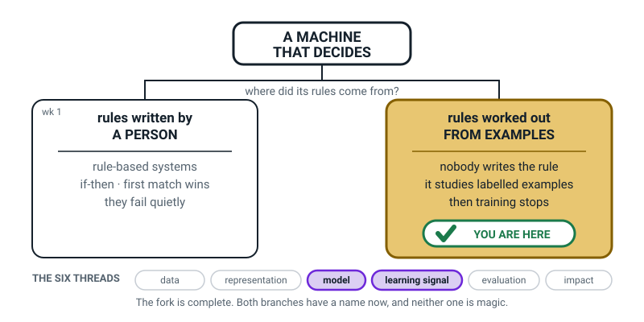

# Week 2 — The Machine That Learns the Rule By Itself

[⬅ Week 1](week-01.md) · [Course Home](../README.md) · [Week 3 ➡](week-03.md) · [Student Guide](../student-guide/week-02.md) · [Workbook](../workbook/week-02.md)

---

## 📋 At a Glance

| | |
|---|---|
| **Duration** | 70 minutes (60- and 75-minute versions in §The Lesson) |
| **Type** | Teach — Term 1, week 2. The punchline to Week 1. |
| **Big idea** | In machine learning nobody writes the rule — the machine finds it by studying labelled examples. |
| **New vocabulary** | machine learning · example · label · model |
| **Materials** | 8 mango cards (labels written **on the back**) · 3 test cards, kept hidden · last week's vending rulebook · the printed spam table · pencil · notebook · a plain index card or slip of paper for "MY RULE" |
| **Tech needed** | **None.** Paper only. |
| **Prep time** | 15 minutes the night before (writing the cards) + 20 minutes reading this file |
| **Source module** | [`module-01-what-ai-is-and-isnt.md`](../../module-01-what-ai-is-and-isnt.md) §3 |

> **🧑‍🏫 This is the most important lesson in Term 1.** Everything from Week 4 to Week 36 assumes the
> student understands what happened in the mango game. If you have to choose one lesson this term to
> over-prepare for, choose this one.

---

## 🎯 Lesson Objectives

By the end of this lesson the student can:

1. **Draw the two pipelines side by side** — *human writes rule → computer → answer* and
   *labelled examples → training → model → answer* — and point at where the human is standing in each.
2. **Explain what a labelled example is**, and say why the label has to be attached **before**
   training rather than after.
3. **Describe what a model is** — the rule that survives after training — and say what is left over
   when training finishes (a rule) and what is not (the examples).
4. **Name one job that is easy to write rules for and one that is not**, and defend both choices with
   a reason, not a feeling.

Objective 3 is the one adults get wrong. Watch for the student saying the model "has the examples
inside it". It does not. Correcting that today saves you an argument in Week 15.

---

## 🧑‍🏫 What YOU Need to Know First

*About fourteen minutes. Written for an adult who has never met any of this. It is complete.*

### Start with what happened last week

Last week the student learned the first way a machine can make a decision: **a person writes every
step in advance as if-then rules.** They ran a vending machine rulebook by hand and then hit its
wall — a customer said something the rulebook had no rule for, and the machine had nothing to say.

That is where almost everyone's understanding of computers stops. Today you break it.

### The second way: nobody writes the rule

Here is the move, and it is genuinely strange the first time:

> **Machine learning** — the machine finds the decision rule itself, by studying many examples where
> someone already wrote down the correct answer.

Nobody types the rule. Nobody knows the rule in advance. A human's job shifts entirely: instead of
*thinking hard and writing rules*, the human *collects examples and attaches the right answer to
each one*. Then a program chews through them and produces a rule.


*Figure 2.1 — Same shape, one difference. In the second row nobody ever writes the rule down.*

Look hard at that figure, because the circled bit is the entire lesson. In row 1 the human stands
next to the rule. In row 2 the human stands next to the *examples*, and there is nobody at all
standing next to the rule.

### Why anyone would bother

Rules are wonderful when the thing you're describing is tidy. They fall apart when it's messy.

Try writing if-then rules for "is this photo a cat":
- *Pointy ears* — so are foxes, and so is a paper aeroplane.
- *Whiskers* — you can't see them at that size.
- *Fur* — so is a rug.
- Every rule you add breaks two others.

And there's a deeper problem the student will not see for another twenty weeks but you should know
now: the machine doesn't receive "ears". It receives about two million numbers describing coloured
dots. There is no `ears` field to test. A human writing rules would have to write a rule that finds
ears inside a grid of two million numbers, for every angle, every light, every cat.

Nobody can do that. So instead: show a program a hundred thousand pictures with `cat` or `not cat`
written next to each, and let it find whatever pattern of numbers reliably goes with the word.

### The three words, in the right order

The order matters. Do not introduce *model* before *example*, and do not introduce *example* without
*label*.

> **Example** — one thing you show the machine, with the correct answer attached.
>
> **Label** — that attached correct answer. A person writes it, before training.
>
> **Model** — the guessing machine that comes out of training. New input in, a guess out.


*Figure 2.2 — Both halves required. A message with no answer attached is not an example; it's just a
message.*

The reason the label has to go on **first** is the thing students trip over. If you show a machine a
thousand emails and no answers, there is nothing for it to be right or wrong about. It has no way to
score itself, so it has no way to improve. The label is what makes learning possible at all — it is
the answer sheet, and somebody human has to write it.

That has a consequence you will come back to in about thirty weeks: **everything the model knows, and
every mistake it makes, was inherited from the person who wrote the labels.**

### What a model actually is (and the thing adults get wrong)

After training, what exists?

A **model** — a rule the program found. That's it. And here are three properties, all of which
11-year-olds accept easily and adults resist:

1. **The examples are not inside it.** After training, the photos are gone. The model is not a
   filing cabinet you can search. It is a rule that happens to work.
2. **It usually cannot explain itself.** You can't point at line 47 and say "that's why". Last week
   you *could* — that was a real advantage of rules that we have now given up.
3. **It only knows what was in the examples.** All its skill and all its blind spots come from the
   examples it was shown. Every single time.


*Figure 2.3 — The point of today's activity, in one picture. The cards go away. The rule stays.*

That figure is the whole activity in advance. Eight cards go in. The cards are taken away. One rule
comes out, and the rule is the only thing left. **The student will physically experience this**, which
is why the activity works and an explanation would not.

### The trade you just made

Put it as an honest trade, because it is one:

| | Rule-based (Week 1) | Machine learning (Week 2) |
|---|---|---|
| Who writes the rule | A person, in advance | Nobody — it is found |
| Can you read the rule? | Yes, line by line | Usually not |
| Can you fix a mistake? | Edit one line | Change the examples and retrain |
| Handles messy jobs? | Badly | That's the whole point of it |
| Where do its mistakes come from? | The person who wrote it | The examples it was given |
| Surprises its creators? | Never | Regularly |

Neither column is better. This course spends thirty-four more weeks on the right-hand column because
that column is where all the interesting problems live, not because the left column is wrong.

### The two misconceptions you will meet today

**Misconception 1: "The model has all the examples stored inside it."**

Very common, very natural, and it will show up as the student saying *"it looks up the closest mango
it's seen before"*. The activity is designed to kill this: you physically remove the eight cards
before the test cards appear. When they sort a test card correctly with the cards gone, ask
**"where did you get that answer from? The cards are in my pocket."** Let them notice that what
survived was a *rule*, not a memory of eight cards.

**Misconception 2: "Learning means it keeps getting better while you use it."**

Also very natural. Most deployed models do **not** learn while you use them. Training happens once,
it stops, and then the finished model is copied out and runs unchanged, possibly for years. Your
phone's face unlock is not learning about faces in general every time you look at it. Sometimes a
company retrains and ships an update — that is a new model, not the old one growing.

The one-line version to say out loud: **"Training is a thing that happens, finishes, and stops. What
comes out is frozen."**

### How deep to go — and where to stop

**Go this deep today:** the two pipelines, the three words, and the felt experience of finding a rule
from examples and then applying it with the examples gone.

**Stop before all of these:**
- **How training actually adjusts anything.** No maths, no weights, no epochs. If asked: *"It tries a
  rule, sees how many it got wrong, changes it a bit, tries again — millions of times. We do that
  properly in Week 15."*
- **Generative AI and chatbots** — that is next week, Week 3.
- **Features vs labels as separate columns** — Week 11 and 12. Today the mango card just has "three
  things written on it".
- **Accuracy, testing, train/test splits** — Weeks 19–22. Today you never say a percentage.
- **Neural networks.** If asked: *"It's a very big pile of adjustable numbers. It was named after
  brain cells in the 1940s and it isn't one. That's Level 3."*

> **⚠️ Watch out:** there is one thing today's activity does *not* prove, and you should know it so
> you don't over-claim. The student finds a rule from eight cards, which is a small number. Real
> systems need thousands or millions. Do not say "and that's exactly how a spam filter works with
> six emails" — say **"real ones use millions of examples instead of eight, but the shape of what's
> happening is the same."** The shape genuinely is the same. The scale is not, and the student will
> measure that gap themselves in Week 15.

---

### 🧭 The Growing Map — Week 2's frame

The student guide carries the same picture every week with one more piece filled in. This week it
completes the fork you opened last week: the box that was dashed and labelled WEEK 2 is now the
tinted, badged one.



*Figure 2.0 — Week 2's version. Left room white with "wk 1" on it, right room tinted with the tick,
and **model** plus **learning signal** lit along the bottom.*

**What to do with it, in about two minutes at the end of the lesson:**

1. **Show it, don't explain it.** Ask *"which bit did we do today?"* They will point at the
   right-hand room — the mango cards, the rule falling out of the counting. Pointing is the whole
   exercise; do not add commentary.
2. **Then ask the question that actually lands:** *"last week this box was dashed. Why isn't it
   now?"* The answer you want is *"because we've done it"* — that is a learner noticing the map moved
   because of work they did.
3. **Have them fill in the right-hand room on their own copy**, in pencil, on the inside cover. Ten
   seconds of colouring. Worth ten times the version printed here.

> **🧑‍🏫 Why this is worth two minutes.** This is the one week where nothing on the map is dashed, and
> that is worth saying out loud: *"the fork is finished — everything from now on goes inside the
> right-hand room."* A learner who hears that has a container for the next thirty-four weeks instead
> of a queue of unrelated topics.

**The six threads** along the bottom: **data · representation · model · learning signal · evaluation
· impact.** Two are lit this week — **model** (what the trained thing *is*) and **learning signal**
(the labels it studied). You do not need to name them for the learner. Do not quiz them on it.

---

## 🧰 Prep Checklist

### 15 minutes the night before

- [ ] **Make the eight mango cards.** Index cards, or paper cut into eight rectangles. On the **front**
      write the three clues. On the **back** write RIPE or UNRIPE. Copy exactly from the table in
      §The Activity — the numbers are chosen so the game works, and changing them breaks it.
- [ ] **Check the labels are genuinely hidden.** Hold a card up to the light. If RIPE shows through
      thin paper, use card or write the label small in the corner and fold.
- [ ] **Make the three test cards** on differently-coloured paper if you have it. Keep them in your
      pocket, out of sight, until the moment.
- [ ] **Find last week's vending rulebook.** You need it on the table at the end for the comparison.
- [ ] **Print the six-message spam table** (in §Worked Example below) or copy it onto a sheet.
- [ ] **Do the mango game yourself.** Look at the eight fronts, cover the backs, and write down the
      rule you'd find. Then check it against §Answer Key. Twelve minutes. Do not skip this — you need
      to know how it *feels* to nearly-find a rule.
- [ ] **Check the Questions We Owe page** from Week 1. *"Who wrote the rules for the spam filter?"*
      should be on it. That is your hook.

### 5 minutes before class

- [ ] Eight cards face-up (fronts showing), backs down, in a row.
- [ ] Three test cards in your pocket.
- [ ] A blank index card labelled **MY RULE** on the table.
- [ ] Vending rulebook face-down beside it, ready for the last five minutes.
- [ ] Homework from Week 1 in front of you, read. Pick one Spotter's Log row to praise by name.

### If something fails

| Problem | Fallback |
|---|---|
| No index cards | Fold eight strips of paper in half. Clues on the outside, answer on the inside. Works identically. |
| Student peeks at a back | Don't make it a discipline issue. Say *"fair enough, you've seen one — now the game is: can you find the rule from the other seven?"* Seven cards still works. |
| Student can't stand mangoes / doesn't know them | Swap the fruit for something they know: bananas, avocados, or "is this bread stale". Keep the three clues and the eight rows exactly the same and just change the noun. |
| No printer for the spam table | Write the six messages on the board. It takes two minutes and honestly reads better. |
| Only 45 minutes | Hook (5) + Concept parts A and B only (12) + Activity (20) + Wrap (8). Move the spam worked example to homework. |

---

## ⏱️ The Lesson, Minute by Minute

| Time | Minutes | Segment | What happens |
|---|---|---|---|
| 0:00–0:08 | 8 | 🪝 **Hook** | Pay the debt: "who wrote the spam filter's rules?" — nobody. Then the ripe-mango question. |
| 0:08–0:26 | 18 | 🧠 **Concept** | The two pipelines · example · label · model · what survives training |
| 0:26–0:40 | 14 | 🔍 **Worked Example Together** | Six text messages. You count one word out loud, the student counts two, and a rule falls out of the counting. |
| 0:40–1:00 | 20 | 🎲 **Activity** | The Mango Game: study 8, cards removed, write the rule, three test cards, then the vending-rulebook comparison. |
| 1:00–1:10 | 10 | 🔑 **Wrap & Assign** | *Who wrote the rule?* board · vocabulary · homework, step one |
| | **70** | | |

**For 60 minutes:** cut the worked example to 8 minutes — you count FREE, they count `!!!`, skip the
question-mark round. And cut the vending comparison to a single spoken question rather than laying
both artefacts out.

**For 75 minutes:** run the *Add a Ninth Card* extension in §Differentiation.

---

### 🪝 Segment 1 — Hook (0:00–0:08)

**Do this:** Open the notebook to the **Questions We Owe Answers To** page and put your finger on last
week's question. Read it aloud. Paying a debt in front of them is worth more than any hook you could
invent.

**Say this:**

> "Last week you asked me a question and I refused to answer it. Here it is, in your handwriting:
> *who wrote the rules for the spam filter?*
>
> Here is the answer. **Nobody did.**
>
> Not 'somebody wrote them and it's secret'. Not 'a huge team wrote a million rules'. Nobody wrote
> them. There is no list. If you went to the company that makes it and asked to see the rules, they
> could not show you, because they don't have them either.
>
> That should sound impossible. Hold onto that feeling for eight minutes."

**Do this:** Now go somewhere completely different. This is the mango move.

**Say this:**

> "Different question. Have you ever picked a ripe mango? Or a ripe banana, or worked out that bread
> has gone stale?
>
> Okay. So: has anyone ever sat you down and given you a list of rules for it? Did somebody once say
> to you, *'right, listen carefully: if the colour value is between orange forty-two and orange
> fifty-eight, and the softness index is exactly three, then the mango is ripe'*?
>
> No. Obviously not. Nobody ever did that. And yet you can walk into a shop right now and pick a ripe
> mango you have never seen before in your life.
>
> **So where did the rule come from?**"

**Ask this:**

> **"Nobody gave you a rule for ripe mangoes. So how do you know?"**

- **Hoping for:** *"I've just seen loads of them"* or *"someone showed me"* or *"I learned it."*
  Anything in that direction is a win.
- **If they say "I just know":** that is the magic word wearing a different coat. Push once, gently:
  *"You weren't born knowing. Something happened between then and now. What?"*
- **If they say "my mum told me":** perfect — follow up with *"told you a rule, or showed you
  mangoes?"* Almost always the honest answer is *showed*.
- **If they can't get there:** give it to them. *"You saw hundreds of mangoes over years, and every
  so often someone said 'that one's ripe' or 'not yet'. You never got a rule. You got examples with
  the answers attached."*

**Say this to close the hook:**

> "That's it. That's the whole lesson. Machine learning is that — done by a machine, in a few minutes
> instead of a few years. And in about half an hour I'm going to make you do it, out loud, with
> cards, and you're going to feel it happen."

---

### 🧠 Segment 2 — Concept (0:08–0:26)

#### Part A — the two pipelines (0:08–0:15)

**Do this:** Draw this on the board as you talk. Two rows. Draw row 1 completely, then row 2
completely. Do the circles last, in a different colour if you have one.


*Figure 2.1 — This is the finished board. Build it left to right, one box at a time.*

**Say this:**

> "Row one is last week. A person thinks hard. The person writes the IF-THEN rule. The computer
> follows the rule. Out comes an answer. Four boxes. You've done this — you *were* the computer.
>
> Now row two, and watch where the person goes.
>
> A person collects examples — lots of things, each with the correct answer written on it. Those
> examples go into something called **training**. Training chews through them and produces a thing
> called a **model**. And when a new question turns up, the model gives an answer.
>
> Count the boxes. Four again. Looks almost the same. But look where the person is standing."

**Do this:** Circle the person in row 1. Then circle the person in row 2.

**Ask this:**

> **"In row two, who wrote the rule?"**

- **Hoping for:** *"Nobody."* Or a long pause followed by *"…nobody?"* — that pause is the sound of it
  landing.
- **If they say "the training":** close enough, and worth sharpening: *"Training isn't a person. It's a
  program running. Nobody typed the rule, and nobody read it afterwards either."*
- **If they say "the person, at the start":** the important distinction. *"The person wrote the
  *answers on the examples*. Did the person write the rule?"* Wait.

#### Part B — example, label, model (0:15–0:22)

**Say this:**

> "Three new words. They're small and they're the three most useful words in this whole course.
>
> First: an **example**. An example is one thing you show the machine — with the correct answer
> attached. Both halves. One text message plus the note 'this one's spam'. One photo plus the word
> 'dog'. One mango plus 'ripe'.
>
> Second: the answer half has a name. It's the **label**. And here's the bit that matters — a person
> writes the label, and they write it **before** training. Not after. Before.
>
> Why before? Think about it. If I show a machine a thousand emails and never tell it which are
> spam, what could it possibly learn? It has nothing to be right or wrong about. It can't score
> itself, so it can't improve. The label is the answer sheet, and a human has to write the answer
> sheet."

**Do this:** Show or sketch Figure 2.2.


*Figure 2.2 — Both halves, joined. Without the label it isn't an example.*

**Say this:**

> "Third word. When training finishes, something comes out. It's called a **model** — and a model is
> just a guessing machine. Put a new thing in, get a guess out.
>
> Now here's a question people get wrong all the time, including grown-ups. When training's finished,
> **are the examples inside the model?**"

**Ask this:**

> **"After training, where did the thousand emails go?"**

- **Hoping for:** hesitation, then *"…are they still in there?"* Most students say yes, and that's the
  right thing to say — it's the natural guess.
- **The answer to give:** *"They're gone. The model isn't a box of emails. It's a rule that came out of
  looking at them. Like the mango — you don't carry a photo album of every mango you've ever seen.
  You carry one rule. And you'll feel this yourself in twenty minutes, because I'm going to take
  your cards away."*
- **If they insist the examples must be inside:** don't argue. Say *"Good — remember you said that. We
  test it in twenty minutes."* Then absolutely come back to it during the activity.

#### Part C — the honest trade (0:22–0:26)

**Do this:** Draw a two-column table on the board, headed *Week 1* and *Week 2*. Fill four rows as
you speak.

**Say this:**

> "One last thing before we do the counting. I don't want you thinking machine learning is the good
> one and rules are the bad one. It's a trade, and you give something up.
>
> Last week, when the vending machine did something odd, you could point at the exact line. Rule
> seven, that's why. That's brilliant. You've just given that up. When a machine-learning model does
> something odd, usually nobody can point at anything.
>
> Last week, if a rule was wrong, you edited one line and you were done. Now, if the model is wrong,
> you have to change the *examples* and do the whole training again.
>
> What you get in return is the only thing that matters: **it can do jobs nobody could write rules
> for.** Nobody can write rules for 'is this photo a cat'. But you can collect a hundred thousand cat
> photos. That's the trade."

**Ask this:**

> **"Give me one job you could easily write rules for, and one you couldn't."**

- **Hoping for:** easy = anything with a number and a threshold (a bell at 3:30, a low-battery
  warning, a fine for a late library book). Hard = anything about looking, listening, or meaning
  (spotting a friend's face, deciding if a song is sad, whether a joke is rude).
- **If both their answers are "easy" ones:** ask *"could you write rules for whether a photo is of your
  own dog, versus a dog that looks like your dog?"* Then wait.
- **If they can't produce a hard one:** offer *"is this text message sarcastic?"* and ask them to try a
  rule. Their first rule will be `if it says "yeah right" then sarcastic`. Then say *"Turn left at
  the lights, yeah right at the roundabout."* They'll see it.
- **Write both answers in the notebook.** They are the workbook's Build It, Page 2.6 (and echo Practice Set B3), and they'll want them.

---

### 🔍 Segment 3 — Worked Example Together (0:26–0:40)

The point of this segment is to show that *finding a rule from examples is just counting*. No magic,
no maths beyond tallying. The student must do some of the counting themselves.

**Do this:** Put the six-message table in front of them, or write it on the board.

| # | Message | Label (a person wrote this) |
|:--:|---|---|
| 1 | "WIN a FREE phone now!!!" | **spam** |
| 2 | "Are you coming to practice?" | **not spam** |
| 3 | "FREE money click here!!!" | **spam** |
| 4 | "Mum said dinner at 7" | **not spam** |
| 5 | "Claim your FREE prize!!!" | **spam** |
| 6 | "Did you finish the maths?" | **not spam** |

**Say this:**

> "Six text messages. Somebody — a person — has already written the right answer next to each one.
> Three spam, three not spam. These six are our **examples**, and those six words on the right are
> the **labels**.
>
> Now. Nobody is going to tell the machine what to look for. Nobody says 'check for the word FREE'.
> All the machine does is **count**. That's it. It counts things and sees which counts line up with
> the labels. Watch."

**Do this:** Count `FREE` out loud, pointing at each message. Make a tally on the board. Slowly.

**Say this:**

> "Word: FREE. Message 1 — yes. Message 3 — yes. Message 5 — yes. That's three out of three spam
> messages.
> Now the not-spam ones. Message 2 — no. Message 4 — no. Message 6 — no. Zero out of three.
>
> Three out of three, and zero out of three. Look at that split. Every single spam has it, and not
> one of the others does. That is a **very** good clue."

Write on the board:

```
   FREE      spam: 3 / 3      not spam: 0 / 3      ← perfect split
```

**Do this:** Hand over the counting. Sit on your hands.

**Say this:**

> "Your turn. Count three exclamation marks in a row — `!!!`. Spam column first."

- **Hoping for:** 3 of 3 spam, 0 of 3 not-spam. Another perfect split.
- **If they miscount:** don't say the number. Say *"read me message 4 again"* and let them recount.

**Say this:**

> "One more, and this one's different. Count the word **you** — and count *your* as well, since it's
> got 'you' inside it."

- **Hoping for:** spam 1 of 3 (message 5, "your"), not spam 2 of 3 (messages 2 and 6).
- **If they get it:** now ask the question that makes the segment worth doing:

**Ask this:**

> **"Is 'you' a useful clue?"**

- **Hoping for:** *"No — it's in both."* Or *"a bit, but it's the wrong way round."*
- **The point to land:** *"Right. One in spam, two in not-spam. It's nearly the same on both sides,
  so it tells you almost nothing. FREE splits them perfectly. 'You' doesn't split them at all. The
  machine keeps FREE and throws 'you' away — and it worked that out from **counting**, not from
  anyone's opinion."*
- **If they say "it means it's not spam":** genuinely arguable and worth praising, then sharpen:
  *"Two out of three isn't nothing. But it's wrong one time in three. FREE is right three times in
  three. Which clue would you rather bet on?"*

**Say this to close:**

> "So without anybody writing a single rule, we've got one: *messages with FREE and lots of
> exclamation marks are probably spam.* That rule came out of counting six examples. That's the
> model. That's the whole engine.
>
> Real spam filters do exactly this on about a billion messages instead of six, and they count
> thousands of things instead of three. But it's counting. It has always been counting."

> **🧑‍🏫 If a student asks "what if a real message says FREE?":** brilliant, tell them so. *"Then the
> model gets it wrong, and that's normal — every model is wrong sometimes. The interesting question
> isn't 'is it wrong', it's 'how often, and on what'. We measure that properly in Week 20."*

---

### 🎲 Segment 4 — Activity: The Mango Game (0:40–1:00)

Full instructions in the next section. The minute-by-minute:

**0:40–0:45 — study.** Eight cards, fronts up. The student may look for as long as they like within
five minutes. They may not write anything down yet. They may turn cards over to check the answers.

**Say this:**

> "Eight mango cards. On the front, three things about the mango: its colour, how it feels, how it
> smells. On the back — the answer. Ripe or unripe, written by me before you got here.
>
> You have five minutes. Look at as many as you like, turn over as many as you like. But **do not
> write anything down.** You're studying. Just study."

**0:45–0:48 — cards removed, rule written.**

**Do this:** Physically collect all eight cards and put them in your pocket. Make a performance of it.
Then put down the blank index card marked **MY RULE**.

**Say this:**

> "Cards are gone. They're in my pocket and you're not getting them back.
>
> Write down the rule you found. One or two sentences. It doesn't have to be right — I don't know
> what you found and I'm not marking it. Just write down what you think separates ripe from unripe."

Three minutes. Do not hover, do not hint, do not look at what they're writing.

**0:48–0:56 — the three test cards.**

**Do this:** Take the test cards out of your pocket one at a time. Hold up card A. Do not comment on
their answer until all three are done.

**Say this:**

> "New mango. You've never seen this one. Green, gives a little when you press it, smells sweet.
> Ripe or unripe?"

- **Test A answer: RIPE.** The colour rule dies here — a green one that's ripe.
- If they say unripe because it's green: *"Which cards did you see that were green?"* (Card 1, unripe.
  Card 6, ripe.) Let them find the contradiction themselves.

> "Second one. Yellow, hard, no smell at all."

- **Test B answer: UNRIPE.** The colour rule dies again — a yellow one that isn't ripe.

> "Last one. Yellow. **Soft.** Smells sour."

- **Test C answer: the examples don't tell you.** This is the good one. Soft says ripe. Sour smell
  says something's wrong. No card in the eight was soft-and-not-sweet, so nothing they learned covers
  it.
- **If they answer confidently either way:** ask **"which card taught you that?"** Wait. They'll go
  hunting for a card that doesn't exist.
- **The line to say:** *"You couldn't answer it, and neither could a real model. It would answer
  anyway, confidently, and it would be guessing. Write that down — we come back to it in Week 16."*

**0:56–1:00 — the comparison. This is the payload of the entire lesson.**

**Do this:** Put last week's vending rulebook on the table, on the left. Put their MY RULE card on
the right. Two pieces of paper, side by side.

**Say this:**

> "Two rules. One on each side. Look at them.
>
> Left: five rules for a vending machine, written by a person, before the machine ever ran.
>
> Right: one rule for ripe mangoes, in your handwriting, that nobody gave you.
>
> Same kind of object. Both are rules. Both tell a machine what to do. Now the only question that
> matters."

**Ask this:**

> **"Who wrote each of these rules?"**

- **Hoping for:** *"Someone wrote the vending one. I wrote the mango one — but nobody told me it."*
- **The sharpening question if needed:** *"Did anybody tell you the mango rule? Where did it come
  from?"* → *"the cards."*
- **Then the last question of the lesson:** **"So in the mango game, what were you?"**
  Answer: **the model.** The eight cards were the training examples. The rule on the card is what
  training produced. Say it out loud together.


*Figure 2.4 — The board you're aiming for at 1:00. Fill it in with them, out loud, one row at a time.*

---

### 🔑 Segment 5 — Wrap & Assign (1:00–1:10)

**Do this:** Complete the board in Figure 2.4 together, out loud. Four rows plus the bottom line. Let
them dictate; you write.

**Ask this:**

> **"Give me today's big idea in one sentence, in your own words."**

- **Hoping for:** something like *"In machine learning nobody writes the rule — the machine finds it
  from examples."*
- **If they say "the machine teaches itself":** close, and worth one push. *"Teaches itself out of
  what?"* You want **examples** in the sentence.
- **If they say "the machine is smart":** banned word. *"Try again without 'smart'."*

**Do this:** Vocabulary into the notebook. Their words, not yours.

| Term | The one-line meaning |
|---|---|
| **machine learning** | the machine finds the rule itself by studying examples that already have the right answers on them |
| **example** | one thing you show the machine, with the correct answer attached |
| **label** | the correct answer attached to an example — a person writes it, before training |
| **model** | the guessing machine that comes out of training; new input in, a guess out |

**Do this:** Read the homework together. Check step one only — that they can say the Build It Page 2.4 worked example
back to you.

**Say this:**

> "Next week we go hunting. You're going to prove — with evidence, not opinion — that every AI you
> have ever met is brilliant at exactly one job and completely blank one small step sideways from it.
> And you're going to catch a chatbot making something up, live, on purpose. Bring the Spotter's Log
> you started."

---

## 🎲 The Activity, In Full

### The Mango Game

**What it is:** the student becomes the model. They study eight labelled examples, the examples are
physically removed, they write down the rule they found, and then three unseen cases test it. It
takes 20 minutes and it is the most important twenty minutes in Term 1.

**Materials:** eight cards with clues on the front and the label on the back · three test cards kept
hidden · one blank index card marked MY RULE · last week's vending rulebook · pencil.

### The eight training cards — copy these exactly

| Card | FRONT: colour | FRONT: feel | FRONT: smell | BACK |
|:--:|---|---|---|---|
| 1 | green | hard | none | **UNRIPE** |
| 2 | yellow-green | gives a little | sweet | **RIPE** |
| 3 | red-yellow | hard | none | **UNRIPE** |
| 4 | green-yellow | gives a little | sweet | **RIPE** |
| 5 | yellow | hard | none | **UNRIPE** |
| 6 | green | soft | sweet | **RIPE** |
| 7 | red | hard | faint | **UNRIPE** |
| 8 | yellow-red | soft | sweet | **RIPE** |


*Figure 2.5 — All eight cards, both sides. Do not show this figure to the student before the game.*

**Why these eight and not others.** The numbers are chosen, not random, and three things are true of
them:

1. **Feel splits them perfectly.** Every *hard* card is unripe. Every *gives a little* or *soft* card
   is ripe. 8 out of 8.
2. **Smell splits them perfectly too.** Every *sweet* card is ripe. Every *none* or *faint* card is
   unripe. 8 out of 8.
3. **Colour splits them not at all.** Green appears once as unripe (card 1) and once as ripe (card 6).
   Yellow appears in both. Red appears in both. Colour is a decoy, and it is the most eye-catching
   thing on the card.

So there are **two** correct rules available and one very tempting wrong one. Most students find the
feel rule first because touch is more vivid than smell. Either is right.

### The three test cards

| Test | colour | feel | smell | Correct answer |
|:--:|---|---|---|---|
| **A** | green | gives a little | sweet | **RIPE** — kills the colour rule |
| **B** | yellow | hard | none | **UNRIPE** — kills the colour rule again |
| **C** | yellow | **soft** | **sour** | **The examples do not tell you.** No card was ever soft-and-not-sweet. |

Card C is the best card in the deck. Handle it exactly as scripted in the minute-by-minute above:
ask **"which card taught you that?"** and let them go hunting for a card that isn't there.

### Setup

1. Eight cards in a row, fronts up, backs hidden.
2. Test cards in your pocket. Genuinely out of sight — if they're on the table the game is spoiled.
3. MY RULE card face down beside the row.
4. Sit beside them, not opposite.

### Rules of the game

- **Studying phase:** they may look at anything, turn over anything, take as long as they want inside
  five minutes. They may **not** write.
- **Writing phase:** cards gone, no peeking, one or two sentences on the MY RULE card. You do not
  look, comment, or hint. Three minutes.
- **Testing phase:** one test card at a time, spoken aloud. **You do not say whether they're right
  until all three are done.** This is important — feedback after card A changes their answer to card
  B, and then you've taught them nothing.

### What "finished" looks like

- A written rule on the MY RULE card that mentions **feel** or **smell** (or both), and does not
  depend only on colour.
- Correct answers on tests A and B.
- On test C: either "I don't know" or an answer plus the honest admission that no card covered it.
- Out loud, in their own words: *"I was the model. The eight cards were the examples. Nobody told me
  the rule."*

### Variation — easier

- **Use six cards instead of eight** — drop cards 3 and 7. The split still works perfectly.
- **Remove the colour column entirely.** Two clues instead of three. This removes the decoy and makes
  the rule almost jump off the table. Worth doing if the student is anxious rather than stuck.
- **Let them keep the cards while they write the rule.** You lose the "examples are gone" moment,
  but you keep everything else. You can still take the cards away before the test cards appear, which
  recovers most of it.
- **Do test A only.** Cards B and C can be homework.

### Variation — harder

- **Add a ninth card and break the rule.** After they've written their rule, produce a ninth card:
  *red · gives a little · none* → **UNRIPE**. If their rule was "feel", it's now wrong. If their rule
  was "smell", it still works. Ask: **"Which rule survived? Why?"** This is a genuinely deep moment —
  more examples changed which rule was correct — and it previews Week 15 exactly.
- **Two rules, one deck.** Ask them to find a *second* rule that also gets 8 out of 8, different from
  their first. (Feel and smell both work.) Then ask: **"Which one would you trust more on a mango you
  can only see in a photo?"** Answer: neither — you can't feel a photo or smell one, and the only clue
  a photo shows is colour, which scored 4 out of 8. That is a Week 12 idea (which features are actually
  available) arriving five months early, entirely on their own reasoning.
- **Write the rule as if-then.** Convert their sentence into the Week 1 format:
  `IF feel is not hard AND smell is sweet THEN ripe`. Then ask the killer: **"You just wrote it as a
  rule. So could a person have written this rule without the cards?"** (For mangoes — yes, probably.
  For faces in photos — no, never. That distinction is why machine learning exists.)

### If you have 2–6 learners

Give each learner their own MY RULE card and forbid talking during the writing phase. Then read the
rules aloud anonymously and vote on which will survive the test cards **before** running them.
Learners who found different rules (feel vs smell) is the best possible outcome — it shows the class
that examples can support more than one rule, which is a genuinely advanced idea arriving free.

---

## ❓ Questions Students Ask This Week

**1. "So the machine really taught itself? Nobody helped?"**

People helped a lot — just not in the place you'd expect. Someone chose which examples to collect.
Someone wrote the right answer on every single one, by hand. Someone decided what counted as "right".
Someone chose to stop training when it looked good enough. All of that is human. The one thing no
human did was **write the rule**. So it's not "nobody helped" — it's "the humans stood somewhere
different."

**2. "Is the model just remembering all the examples?"**

No, and today's activity is the proof. When you answered the test cards, the eight cards were in my
pocket. You weren't looking anything up — you had a rule. A real model is the same: after training,
the photos are gone. It's not a filing cabinet, it's a rule that came out of a filing cabinet that
has since been thrown away.

**3. "Does it keep learning while I use it?"**

Usually not, and this surprises everybody. Training happens once, finishes, and stops. What comes out
is frozen and gets copied onto phones and servers, where it runs unchanged, sometimes for years. When
a company wants it better they collect new examples and train a *new* model, then ship it as an
update. Your face unlock is not learning about faces every time you look at it.

**4. "What if the person writing the labels gets one wrong?"**

Then the model learns the mistake, cheerfully and permanently. This is one of the most important
sentences in the whole course, so here it is again: **everything the model knows, and every mistake
it makes, came from the examples it was given.** If half the labels are wrong, you get a model that's
confidently wrong in exactly that pattern. It is Week 31's entire lesson.

**5. "How many examples do you need?"**

Genuinely depends, and "it depends" is the honest answer rather than a dodge. Eight was enough for
mangoes because there were only three clues and they lined up perfectly. A photo classifier usually
needs a few hundred at minimum. A chatbot was trained on something like a trillion words. You'll
measure this yourself in Week 15 — you'll train the same model on 10 photos and 40 photos and see
the difference with your own eyes.

**6. "Which is better, rules or learning?"**

Neither. It's a trade and it depends on the job. If you can write the rules — a bell at 3:30, a
low-battery warning, tax arithmetic — then **write the rules**. Rules are predictable, cheap,
explainable, and fixable. Only reach for machine learning when the job is too messy for rules, like
recognising a face or catching new spam. Reaching for machine learning when a rule would do is a
mistake real companies make constantly.

**7. "Could a machine learn to do anything, if you gave it enough examples?"**

**Nobody knows for sure, and this is a real open argument rather than a gap in my knowledge.** Some
very serious people think yes — scale it far enough and you get everything. Other equally serious
people think there are whole kinds of thinking that no amount of examples will ever produce, because
the thing you'd need isn't in the examples at all. Right now we can point at things machines
genuinely cannot do, and we cannot prove whether that's permanent or just "not yet". You are allowed
to have an opinion about this. You are not allowed to pretend it's settled.

**8. "Why don't we just show it the answer instead of making it guess?"**

That's exactly what training *is* — but you have to stop showing it the answers eventually, because
the whole point is the cases you haven't seen. Your eight mango cards had answers. Test card A did
not, and test card A is the reason anyone builds these things. If you only ever needed answers to
questions you already had answers to, you wouldn't need a model — you'd need a list.

---

## ⚠️ Where This Lesson Goes Wrong

| What happens | Why | What to do right now |
|---|---|---|
| The student writes a colour rule and it fails on test A | Colour is the loudest thing on the card and touch/smell are abstract on paper | **This is a success, not a failure.** Say so immediately: *"Your rule was reasonable and the evidence killed it. That's how this actually works."* Then get the cards out and find the two green cards together. |
| They peek at a card back during the writing phase | Natural, and they may not even register it as cheating | Don't make it a moral issue. *"You've seen one. Fine — can you find the rule from the other seven?"* Then continue. Losing one card costs nothing. |
| They can't find any rule at all and freeze | Eight cards × three clues is a lot to hold at once | Narrow it. Put the cards back out and say **"Look at only the 'feel' column. Cover the other two with your hand."** The rule becomes obvious in about ten seconds. Then reveal the other columns and ask if smell works too. |
| They insist the model must have the examples stored inside | It's the natural model of how memory works and nobody has ever contradicted it | Do not argue it verbally — you will lose. **Use the pocket.** *"The cards are in my pocket. You just answered test card A. Where did the answer come from?"* Physical evidence beats explanation. |
| The class becomes "so is the machine alive / does it understand" | Machine learning sounds like a mind in a way rule-following doesn't | Sixty seconds, honest: *"No. There's nothing in there having a time. It found a rule by counting. Counting isn't understanding — you counted the word FREE half an hour ago and you weren't understanding anything either."* Then back to the cards. |
| You answer test card C for them | The silence is uncomfortable and "I don't know" feels like a bad note to end on | Sit through it. Card C is the most valuable thirty seconds of the lesson and it only works if the not-knowing belongs to them. Your line is **"which card taught you that?"** and then nothing. |
| The student finds the smell rule and you were expecting feel | You prepped one answer and got another | Both are correct — 8 out of 8 each. Say *"That's a different rule from the one I found and it's just as good. Two rules, same eight cards."* Then run the *Two rules, one deck* extension; it's better than the lesson you planned. |

---

## 🧭 Differentiation

### If they are struggling

**Cut:** Part C of the concept block (the honest trade). It's valuable but it's the least essential
five minutes and you can fold it into the Week 3 hook.

**Cut:** the third counting round in the worked example (the word "you"). Two perfect splits make the
point; the useless-clue idea can wait for Week 12, where it has a whole lesson.

**Reteach like this:** if the two-pipelines diagram isn't landing, don't redraw it — act it out. You
sit at the table and say *"I'm the computer. Tell me a rule for when the dog gets fed."* They give
you one. You follow it stupidly. That's row 1. Then: *"Now don't tell me a rule. Just show me eight
days and tell me which ones the dog got fed."* Then you guess day nine. That's row 2. Four minutes,
no diagram, and it works better for most students than the drawing does.

**Simplify the mango cards:** drop the colour column. Two clues, six cards (1, 2, 5, 6, plus 4 and
8). The rule is findable in about forty seconds and the *examples-are-gone* moment survives
completely intact, which is the bit that matters.

### If they are flying

- **The ninth card** (red · gives a little · none → UNRIPE), as described in §The Activity. Ask which
  rule survived and why.
- **"Find a second rule that also gets 8 out of 8."** Then: which would you trust on a photo?
- **"Design a set of eight cards where colour is the only rule that works."** They have to build a
  training set to order. This is genuinely hard, genuinely fun, and it is a real professional skill —
  it is what Week 22 is about.
- **The hardest question you can ask this week:** *"You found a rule from eight mangoes. Would you bet
  money on it for a mango grown in a different country?"* (Answer: no, and the reason is that your
  eight examples might all be one variety. That is Week 31 — who's missing from the examples —
  arriving under its own steam, and it is worth writing on the wall if they get there.)

### If they won't engage today

- **Do the mango game first.** Skip the hook, skip the concept, go straight to eight cards on the
  table with no explanation at all: *"Front's the clues, back's the answer. Five minutes, find the
  pattern."* An unexplained puzzle is more inviting than an explained one. Teach the concept
  afterwards, out of what they just did.
- **Make it a bet.** *"I bet you can't get all three test cards right. Loser makes the tea."* Works
  disproportionately well with 11-year-olds.
- **Shrink the target to one sentence.** If the whole lesson isn't happening, land only this:
  *nobody wrote the rule; it came from examples.* Everything else can be picked up in the Week 3
  warm-up.
- **Swap the fruit.** If mangoes mean nothing to them, the same eight rows work for "is this bread
  stale", "is this avocado ready", "is this game console overheating". Keep the structure; change the
  noun to something they care about.

---

## ✅ Assessing Understanding

### Check 1 — the two pipelines (objective 1)

> **"Draw me the two ways a machine can get an answer. Then put an X where the person is standing in
> each one."**

Good answer: two rows, four boxes each, X on *writes the rule* in row 1 and X on *collects the
examples* in row 2. **The X placement is what you're marking**, not the neatness. A student who draws
both rows but puts the X on the model in row 2 has missed the whole lesson — reteach with the pocket.

### Check 2 — label timing (objective 2)

> **"When does the label get written — before training or after? And who writes it?"**

Good answer: **before**, and **a person**. If they say "after", ask *"if the answers aren't there yet,
what is the machine learning from?"* and wait.

### Check 3 — what survives (objective 3)

> **"Training has finished. The model is done. Where did the eight mango cards go?"**

Good answer: gone. What's left is the rule. Excellent answer adds: *"and that's why it can't explain
itself — there's nothing to point at."*

### Mastery scale for this week

| | Level | What it looks like |
|:--:|---|---|
| **1** | Not yet | Still thinks a person wrote the rule and hid it. Cannot distinguish example from label. |
| **2** | Emerging | Repeats "it learns from examples" but says the examples are stored inside the model. Found no rule from the cards. |
| **3** | Developing | Found a working rule from the eight cards. Gets test A and B right. Uses *example*, *label* and *model* with some prompting. |
| **4** | **Secure — this is the target** | Draws both pipelines and places the human correctly. Found a rule, applied it to unseen cards, and can say "I was the model, the cards were the examples." Says the label goes on before training, by a person. |
| **5** | Extending | Handles test card C honestly ("nothing I saw covers this"). Finds a second valid rule, or notices colour is a decoy and says why. Can name a job rules suit better than learning, with a reason. |

---

## 📤 Homework to Assign

**Workbook: Week 2** ([`../workbook/week-02.md`](../workbook/week-02.md)). Eight sections, in this order:
**Warm-Up** (W1–W5) · **Practice Set A** (A1–A6) · **Practice Set B** (B1–B5) · **Puzzle of the Week**
(P1–P6) · **Think Deeper** (T1–T2) · **Build It** (Page 2.4, 2.5, 2.6) · **Draw It** · **Self-Check**.
The workbook has its own Answers section at the end, and the Answer Key below follows it section by
section. There is no code in it.

**Suggested split** (the workbook is more than one evening's work, so split it; my estimate is about
75–90 minutes in total):

| Sitting | Sections | Roughly |
|---|---|---|
| **Tonight** | Warm-Up (5 min) · Practice Set A · Practice Set B · Build It, Page 2.4 and the **first** attempt at Page 2.5 | 40–45 min |
| **An hour or more later, same evening or next day** | Build It, Page 2.5 second attempt · then Page 2.6 · Puzzle of the Week · Think Deeper · Draw It · Self-Check | 40–45 min |

The Puzzle and Think Deeper are the stretch sections. If time is short, set the Puzzle and drop Think
Deeper to the Week 3 warm-up.

**Say this:**

> "The workbook has a few parts and I'll split it in two. The first part starts with five quick
> questions about last week, then the practice sets, and there's one weird instruction in it.
>
> **One.** Warm-Up and the two practice sets. Do them without looking anything up. Some of them are
> about the spam messages and the mango cards, so you have already done the hard thinking.
>
> **Two.** In Build It there are five sentences about AI that use magic words. Rewrite each one
> honestly. The first one is already done for you as a worked example — read that one first, then do
> the other five in the same shape. The test for a good rewrite is simple: does your version say
> **what actually happens**? If your sentence would still be true about a wizard, it's not done.
>
> **Three, and this is the weird one.** Still in Build It, write the one-sentence definition of AI
> **from memory**. Don't look it up, don't check your notebook. Then close the book. Go and do
> something else — anything, an hour of it. Then come back and write the definition again on the
> second line, still without looking. Two lines, an hour apart.
>
> I'm not marking whether they match. I want to see what your brain kept.
>
> **Four.** Later on: the cricket puzzle, the two thinking questions, drawing the two pipelines from
> memory, and the self-check at the end. Be honest on the self-check, because it tells me what to
> teach again."

**Step one, before they leave the table:** read them the Page 2.4 worked-example rewrite (it is
reproduced in the answer key below) and have them say back, in their own words, why the honest version
is better. Then stop.

**Marking notes:** mark the workbook section by section against the Answer Key below. Be strict about
the banned words in Build It — *magic, it just knows, it's smart, it thinks, it understands,
obviously*. Circle every one and ask for the sentence again. Be relaxed about everything else. On the
two definitions an hour apart: if the second one is *shorter and rougher but still contains the
decision idea*, that's a very good sign — it means the idea stuck rather than the wording. In the
Warm-Up, W3 and W4 are the ones that show whether Week 1 stuck. In Practice Set B, mark the **reason**,
never just the choice.

---

## 🔑 Answer Key

### The mango game — every card

**The eight training cards, and what they prove**

| Card | colour | feel | smell | label | What this card is for |
|:--:|---|---|---|---|---|
| 1 | green | hard | none | UNRIPE | The obvious case. Sets up the colour decoy. |
| 2 | yellow-green | gives a little | sweet | RIPE | The obvious ripe case. |
| 3 | red-yellow | hard | none | UNRIPE | A *red* unripe one — first crack in the colour rule. |
| 4 | green-yellow | gives a little | sweet | RIPE | Reinforces feel + smell. |
| 5 | yellow | hard | none | UNRIPE | A *yellow* unripe one — second crack in the colour rule. |
| 6 | green | soft | sweet | RIPE | A *green* ripe one — the colour rule is now dead if you look. |
| 7 | red | hard | faint | UNRIPE | "Faint" is not "sweet". Tests whether they read carefully. |
| 8 | yellow-red | soft | sweet | RIPE | Confirms soft counts the same as gives-a-little. |

**The three rules available in this deck**

| Rule | Score on the 8 cards | Verdict |
|---|---|---|
| **Feel:** if it is *not hard*, it's ripe | 8 / 8 | ✅ Correct |
| **Smell:** if it smells *sweet*, it's ripe | 8 / 8 | ✅ Correct |
| **Colour:** if it is yellow or red, it's ripe | 4 / 8 | ❌ No better than a coin flip |

Colour scores 4 out of 8 — cards 2, 4 and 8 correct by luck, card 6 wrong, cards 3, 5 and 7 wrong,
card 1 correct by luck. Exactly chance. It is the most visible clue on the card and it carries no
information at all. If the student notices that themselves, stop the lesson and tell them it is a
Week 12 idea and they got there four months early.

**The three test cards**

| Test | Card | Answer | Why | If they get it wrong |
|:--:|---|---|---|---|
| **A** | green · gives a little · sweet | **RIPE** | Not hard, and smells sweet. Both correct rules agree. | Almost always a colour answer. Ask *"was any card green and ripe?"* → card 6. |
| **B** | yellow · hard · none | **UNRIPE** | Hard, no smell. Both correct rules agree. | Ask *"was any card yellow and unripe?"* → card 5. |
| **C** | yellow · **soft** · **sour** | **The eight examples do not tell you.** | The feel rule says ripe. The smell rule says not ripe. No card was ever soft-and-not-sweet, so nothing in the training set covers this combination. | Any confident answer is the wrong shape. Ask *"which card taught you that?"* Real answer, for their own life: soft plus sour usually means over-ripe, and you'd throw it out — but that's knowledge from outside the eight cards, which is precisely the point. |

**"So what were you?"** — the model. **"And the cards?"** — the training examples. **"And the writing
on your MY RULE card?"** — what training produced.

### The six-message spam count — full working

| Clue | In spam | In not-spam | Useful? |
|---|:--:|:--:|---|
| the word **FREE** | 3 / 3 | 0 / 3 | ✅ Perfect split. Best clue in the set. |
| **!!!** (three in a row) | 3 / 3 | 0 / 3 | ✅ Perfect split. Just as good. |
| the word **you** (counting *your*) | 1 / 3 | 2 / 3 | ❌ Nearly the same on both sides. Tells you almost nothing. |
| a **question mark** | 0 / 3 | 2 / 3 | ⚠️ Leans towards *not spam*, but only 2 of 3 — a weaker clue than FREE. |

Message-by-message for FREE: 1 ✅, 3 ✅, 5 ✅ (all spam) · 2 ❌, 4 ❌, 6 ❌ (all not-spam).
Message-by-message for *you/your*: 5 ✅ (spam, "your") · 2 ✅ and 6 ✅ (not-spam) · 1, 3, 4 ❌.

**The rule the counting produces:** *messages containing FREE and multiple exclamation marks are
probably spam.* Nobody wrote that. It came out of a tally.

**"Is 'you' a useful clue?"** — No. One in spam, two in not-spam. It appears on both sides at almost
the same rate, so knowing it doesn't move your guess. FREE moves it all the way.

**"What if a real message says FREE?"** — Then the model gets it wrong. Every model is wrong
sometimes. The question is never *is it wrong* but *how often, and on what* — Week 20.

### In-lesson questions

**Hook — "Nobody gave you a rule for ripe mangoes. So how do you know?"**
Because you saw hundreds of mangoes over years, and someone occasionally said *"that one's ripe"* or
*"not yet"*. You were given examples with the answers attached, not a rule. Machine learning is that,
done by a machine, in minutes instead of years.

**Concept — "In row two, who wrote the rule?"**
Nobody. A person collected the examples and wrote the labels; a program found the rule; no human ever
typed it, and often no human can read it back afterwards.

**Concept — "After training, where did the thousand emails go?"**
Gone. The model is a rule, not a store of examples. (Verified in the activity by the cards being in
your pocket.)

**Concept — "One job you could easily write rules for, and one you couldn't."**

| Easy for rules | Why | Hard for rules | Why |
|---|---|---|---|
| Ring a bell at 3:30 | One number, one comparison | Recognise your friend's face | Nobody can write if-then rules over two million coloured dots |
| Warn when the battery is under 20% | One number, one threshold | Decide if a message is sarcastic | The same words are sarcastic from one person and sincere from another |
| Charge a 50p late fee per day | Arithmetic | Decide if a song is sad | No two people agree, and the answer isn't in the notes |
| Open the door if something moves | One sensor, one trigger | Spot a new kind of spam nobody has seen | You can't write a rule for wording that doesn't exist yet |

Mark for a *reason*, not for the choice. "Because it's easy" is not a reason. "Because there's one
number and one comparison" is.

**Activity — "Who wrote each of these rules?"**
The vending rules: a person, in advance, before the machine ran. The mango rule: nobody told it to
you — you found it from eight examples, and then you wrote it down after the fact.

**Wrap — "Today's big idea in one sentence."**
Model answers: *"In machine learning nobody writes the rule; the machine finds it from examples that
already have the answers on them."* · *"Instead of telling the machine the rule, you show it lots of
answered examples and it works the rule out."*

### Workbook answers

These follow the workbook's own **Answers** section, section by section and item by item. Teacher-only
notes (wrong-answer maps, marking tips) are added in *italic* or under **Watch for**.

#### Warm-Up (W1–W5)

- **W1.** …a **job** that used to need a person's **judgement**.
- **W2.** **"Could two sensible people disagree about the answer?"** If yes, it needs judgement. If no,
  it doesn't.
- **W3.** **Rule 2** — SOLD OUT. Rules are checked **in order** and you stop at the first one that
  fires. Rule 2 sits above Rule 3, so the machine never looks at the money. The *sensible* answer is
  ADD MORE; the *rulebook* answer is SOLD OUT; and the rulebook wins for ever.
- **W4.** **FALSE.** It does not crash and it does not warn you. Either no rule fires and it does
  nothing, or the wrong rule fires first and it gives a confident, useless answer. **Rulebooks fail
  quietly.**
- **W5.** Any of: a light switch, a kettle, a bicycle bell, a stapler, a microwave timer. What makes
  them sure: the job has no judgement in it — one input, one fixed response, nobody could disagree
  about the right answer.

**Watch for:** *W3 answered "Rule 3, because the money is the sensible thing to check first".* That is
the sensible answer, not the rulebook's. Ask *"which rule does the machine meet first?"* *W4 answered
TRUE* means the Week 1 point about quiet failure has not landed; spend two minutes on it in Week 3.

#### Practice Set A (A1–A6)

- **A1.** Blanks in order: **rule** · **examples** · **correct answer** (accept *label*) · **person**
  (or *human*) · **before** · **finishes** (accept *stops*) · **guess**.
- **A2.** Circle **(b), (d) and (f)**. What is missing from the others: **(a)** a photo with no answer
  attached is just a photo; **(c)** 1,000 unlabelled emails are a pile, not 1,000 examples; **(e)** that
  is a **rule**, the *output* of learning, not an input to it.
- **A3.** **(a) FALSE.** The examples are gone; what is left is a rule. The eight mango cards were in
  your pocket when the student answered the test cards, so the answer cannot have come from the cards.
  **(b) FALSE.** A **person** writes every label, by hand, **before** training. With no answers attached
  the machine cannot score itself, so it cannot improve.
- **A4.** 1 → **C** · 2 → **D** · 3 → **A** · 4 → **E** · 5 → **B**.
- **A5.** **Row 1:** `a person` → `writes the IF-THEN rule` → `computer follows it` → `answer`.
  **Row 2:** `a person collects labelled examples` → `training` → `model` → `answer`.
  **(a)** Row 1: X on box 2 (*writes the IF-THEN rule*). Row 2: X on box 1 (*a person collects labelled
  examples*). **(b)** **Nobody.** A person collected the examples and wrote the labels; a program found
  the rule; no human typed it, and often no human can read it back.
- **A6.**

| Clue | In the 2 spam | In the 2 not-spam | Useful? |
|---|:--:|:--:|---|
| **prize** | 2 of 2 (msgs 1, 3) | 0 of 2 | ✅ perfect split |
| **tomorrow** | 0 of 2 | 2 of 2 (msgs 2, 4) | ✅ perfect split, pointing the other way |
| **you / your** | 2 of 2 (msgs 1, 3) | 1 of 2 (msg 2) | ❌ appears on both sides |

  **(a)** **tomorrow.** A clue in none of the spam and all of the not-spam separates the piles just as
  cleanly as the opposite. What matters is the **split**, not the direction. **(b)** **you / your** is
  weakest: in every spam *and* half the not-spam, so it barely moves the guess.

**Watch for:** *A2 circling (e) as well.* They have mistaken a rule for an example; ask *"is that the
thing you show the machine, or the thing it finds?"* *A5 with the row 2 X on `model`* — the commonest
error. Reteach with the pocket: no human stands at the model. *A6 counting "your" wrongly* — the
workbook says to count *your* with *you*; message 4 contains neither.

#### Practice Set B (B1–B5)

- **B1.** **(a)** You cannot feel a photo, so the *feel* rule cannot be used at all. **(b)** Neither,
  honestly — you cannot smell a photo either. They need a third rule based on something visible, and
  colour scored only 4 out of 8, so eight cards with these three clues cannot build a photo app; they
  need different examples. *(Half marks for "the smell rule, because it is more reliable": good
  reasoning, wrong conclusion.)* **(c)** …**available** (accept *measurable*, *possible to collect*).
- **B2.** **(a) No** — training counts labels, it does not check them. **(b)** It learns the mistake
  and treats it as truth. **(c)** **She is wrong**; the model reproduced her mistake faithfully.
  **(d)** *"Everything the model knows, and every mistake it makes, came from the examples it was
  given."*
- **B3.**

| Job | Answer | The reason that matters |
|---|---|---|
| Ring a bell at 15:30 | **rules** | One number, one comparison. |
| Decide if a photo shows your own dog | **learning** | Nobody can write if-then rules over two million coloured dots. |
| 50p a day for a late library book | **rules** | Arithmetic; one exactly correct answer already decided by a person. |
| Spot a scam text nobody has seen before | **learning** | You cannot write a rule for wording that does not exist yet. |

  "Because it's easy" is not a reason. "Because there's one number and one comparison" is.
- **B4.** **(a) No** — card 9 *gives a little* but is UNRIPE, so the feel rule gets **8 out of 9**.
  **(b) Yes** — card 9 has no smell, so the smell rule is still **9 out of 9**. **(c)** The **smell**
  rule survived. The eight cards could not tell the two rules apart (both 8 out of 8); one extra
  example separated them. More examples sometimes change which rule was right all along.
- **B5.** Model answer: make yourself harder to recognise (hood, glasses, low light), count successes
  out of ten, then use the phone normally for two weeks and repeat the identical test. *Look for* the
  score changing with no software update installed. *Proves me wrong:* a clear improvement. Full marks
  for any test with a **before number**, an **after number**, and awareness that an update would spoil
  the experiment (an update is a replacement model, not the old one growing).

**Watch for:** *B1 answered "the colour rule" with no comment on its 4 out of 8 score.* *B2(c)
answered "the model is wrong".* Ask *"what did the model do with the labels it was given?"* *B3 reasons
of the "it's easy / it's hard" kind* — send back for a number and a comparison.

#### Puzzle of the Week (P1–P6)

- **P1.**

| The rule | Gets right | Gets wrong | Score |
|---|---|---|:--:|
| **Sky:** sunny → ON | 1, 2, 6, 7 | 3, 4, 5, 8 | **4 / 8** |
| **Ground:** dry → ON | 1, 2, 3, 4, 5, 6, 7, 8 | none | **8 / 8** |
| **Kit:** kit brought → ON | 1, 4, 6, 8 | 2, 3, 5, 7 | **4 / 8** |

  4 out of 8 is exactly a coin flip, so two of the three clues carry no information.
- **P2.** **The ground.** Dry → ON, wet → OFF, all eight times.
- **P3.** *"Rainy means off"* is killed by **card 4**; *"sunny means on"* is killed by **card 5**.
- **P4.** **X** (rainy, dry, no) → **ON**. **Y** (sunny, wet, yes) → **OFF**. **Z** (cloudy, frozen
  solid, yes) → **the eight cards do not tell you.**
- **P5.** **Test Z.** Missing: an **example** — no card was ever frozen. By the rule "dry" it would say
  ON, but frozen ground is arguably worse than wet. A real model would answer Z confidently anyway.
- **P6.** The sky is the loudest, most visible clue, and there is a true story attached (rain makes
  grounds wet), yet the ground decides, and it can be dry in the rain (card 4) or wet in the sun
  (card 5). The most visible clue is very often not the deciding one.

**Watch for:** *P1 scored by counting only the cards where the clue is present* (sky "4 of 8" arrived
at by luck). Insist on going card by card, with the rule predicting OFF when its clue is absent. *P4 Z
answered ON or OFF with confidence* is the same mistake as test card C in the mango game.

#### Think Deeper (T1–T2)

Both are paragraph answers (4+ sentences); mark against the workbook's checklists.

- **T1.** The model would be good at that farm and much worse elsewhere (varieties ripen differently);
  it would **not** warn you, because a model cannot notice that a mango is unlike anything it studied;
  fix it by changing the **examples** (several varieties, countries, weeks, including awkward cases like
  green-when-ripe), not the machine. *Mark on:* (1) naming what it would be bad at, (2) saying it would
  not warn you, (3) changing the examples, not the machine.
- **T2.** Four human jobs happened first: someone **chose which examples to collect**, someone **wrote
  every label**, someone **decided what counted as the right answer**, someone **decided training was
  good enough to stop**. Any reasoned answer on responsibility is fine (the workbook's model answer
  holds the school responsible, as the one a parent can argue with, and wants to see the labels).
  *Mark on:* at least **three** of the four jobs named, and who a person could complain to.

#### Build It (Page 2.4, 2.5, 2.6)

**Page 2.4 — rewrite five magic sentences.** The worked example the student is given:

> **Magic version:** "YouTube magically knows what I want to watch."
>
> **Honest version:** "YouTube was shown billions of examples of what people watched next, and it
> guesses which video I am most likely to click and watch for more than thirty seconds."
>
> **Why it's better:** it says *where the ability came from* (examples), *what the machine actually
> produces* (a guess), and *what it's guessing about* (a click, which is a thing you can measure).

The five to rewrite (items 2–6), with model answers:

| # | Magic version | Model honest version |
|:--:|---|---|
| 2 | "The spam folder just knows which emails are junk." | "The spam folder was trained on millions of emails that people marked as spam, and it guesses whether a new email looks more like the spam ones or the ordinary ones." |
| 3 | "Google Translate understands Spanish." | "Google Translate was shown millions of documents that already existed in both languages, and it produces the English words most likely to go with the Spanish ones. It doesn't understand either language." |
| 4 | "My camera is smart enough to find faces." | "My camera compares patches of the picture against a pattern it learned from lots of labelled face photos, and it marks the patches that score highly." |
| 5 | "The music app reads my mind and plays the right song." | "The music app was shown what millions of people played after each song, and it guesses which song I am least likely to skip in the first twenty seconds." |
| 6 | "Alexa figured out what I said." | "Alexa was trained on huge numbers of recordings with the matching written words attached, and it produces its best guess at which words the sound matches." |

**The three tests for a passing rewrite** (the workbook's checkboxes) — apply all three:

1. **Does it say where the ability came from?** (examples / training / being shown things)
2. **Does it say the output is a guess**, not a fact?
3. **Would it still be true of a wizard?** If yes, it hasn't done its job.

Answers to reject: anything containing *magic, smart, clever, knows, understands, thinks, figures out,
obviously, it just does*. Also reject *"it uses AI"*, which explains nothing — ask *"which bit?"*

**Page 2.5 — the definition twice, an hour apart.** There is no single right answer; you are marking
whether the load-bearing idea survived. The target is *"AI is a machine doing a job that used to need a
person's judgement."* The student circles one of four outcomes in the workbook; check it against this:

| What you see | What it means |
|---|---|
| Both attempts contain a decision word (*decide, choose, judge, work out*) | ✅ It stuck. This is the win. |
| Attempt 2 is shorter and rougher but still has the decision word | ✅ **Best outcome.** The idea stuck, not the wording. Say so out loud. |
| Attempt 2 has drifted to "a computer that learns" | ⚠️ They've merged Week 1 and Week 2. Worth three minutes at the start of Week 3: learning is *one way* to do AI, not the definition of it. |
| Attempt 2 contains a banned word that attempt 1 didn't | ⚠️ The scaffolding faded first. Normal. Re-run the wrap question in Week 3. |
| Both attempts identical, word-perfect | Probably copied. Ask them to say it aloud with the book shut. |

**Page 2.6 — one job for rules, one job for learning.** Answers vary. Use the B3 table above and the
table under *"One job you could easily write rules for"* for the standard. Mark the **reason**, not the
example. A passing reason for the easy job names a number and a comparison. A passing reason for the
hard job says either *"the same input can have two different right answers"* or *"the machine only
receives numbers and the thing that matters isn't one of them."*

#### Draw It

A good page has **all four**: (1) **two rows** of four boxes; (2) both rows end at `answer`;
(3) **one X per row**, on box 2 in row 1 and box 1 in row 2; (4) somewhere, in the student's own words,
*nobody wrote the rule in row 2* (the workbook suggests *"same number of boxes — the person moved"*).
The commonest error is the row 2 X on `model`. Test: *which box did a human physically do work in?*
Reteach with the pocket.

#### Self-Check

Not marked. Read the five 😀/🙂/😕 ticks and the "One thing I'd like explained again" line before
Week 3. Each tick maps to a Week 2 objective: pipelines (Draw It, A5), labelled example (A1, A2),
model and the gone examples (A3), finding a rule by counting (A6, Puzzle), rules vs learning (B3,
Page 2.6). Any 😕 goes into the Week 3 warm-up.

---

## 🔮 Next Week Preview

Week 3 is the first lab, and it is the one where the student stops taking anyone's word for it. They
play Quick, Draw! and log what it guesses — then run the *narrowness proof*: ask it to do something
one small step sideways from its one job, and watch it fail. Then, with you at the keyboard, they ask
a chatbot a factual question with a checkable answer and catch it inventing a detail. Finally they
build the full fifteen-note Spotter's Log board, sorted into rules / learned / generating, with the
three hardest calls moved into a "defend these" column. Three new ideas arrive: **generative AI**,
**narrow AI**, and **confidence score**.

**Prep early:**
- Test `quickdraw.withgoogle.com` on your actual laptop, with sound on, **before** the lesson. Draw
  one thing. It takes two minutes and it prevents the most common lab failure.
- Decide **now** which chatbot you'll use and make sure you can open it. **You drive the keyboard**
  — that is a non-negotiable safety rule in this course (see
  [`00-orientation.md`](00-orientation.md) §8).
- Fifteen sticky notes, or fifteen torn scraps of paper.
- Ask the student to bring the eight rows of their Week 1 Spotter's Log. They'll extend it to fifteen.
- **Know this in advance:** Quick, Draw! sends drawings to Google and adds them to a public dataset.
  Tell the student that, out loud, before they draw. It is a Week 32 lesson arriving free, and it
  costs you fifteen seconds.

---

[⬅ Week 1](week-01.md) · [Course Home](../README.md) · [Week 3 ➡](week-03.md) · [Student Guide](../student-guide/week-02.md) · [Workbook](../workbook/week-02.md) · [Orientation](00-orientation.md) · [Glossary](../../glossary.md)
