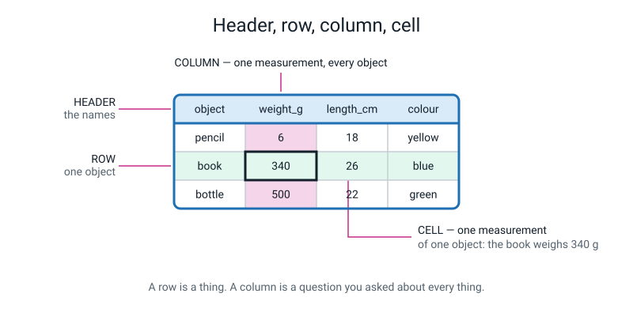
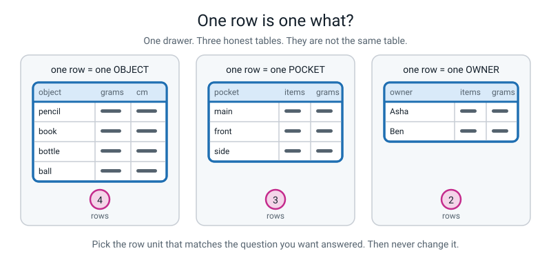
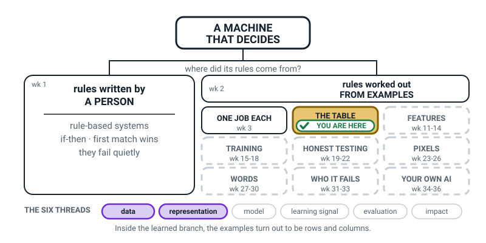
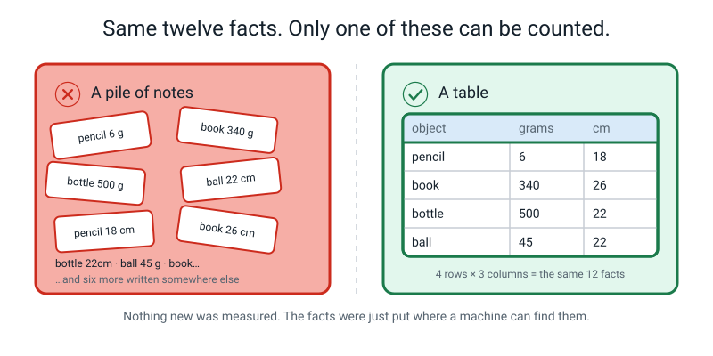
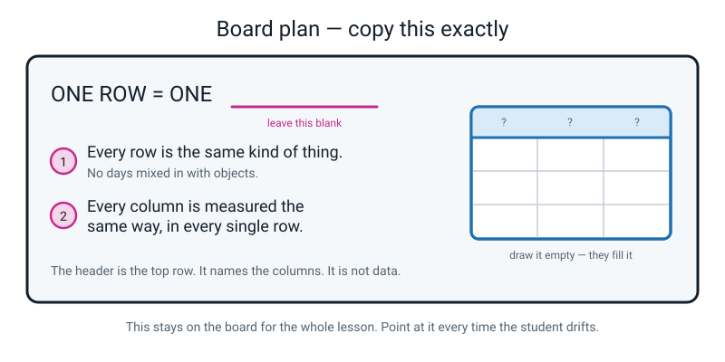
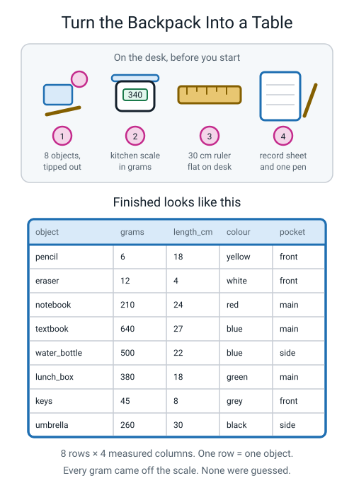

# Week 4 — Everything a Machine Knows Arrived as a Table

[⬅ Week 3](week-03.md) · [Course Home](../README.md) · [Week 5 ➡](week-05.md) · [Student Guide](../student-guide/week-04.md) · [Workbook](../workbook/week-04.md)

---

## 📋 At a Glance

| | |
|---|---|
| **Duration** | 70 minutes (works in 60, stretches to 75) |
| **Type** | Teach |
| **Big idea** | Whatever an AI knows, it arrived as rows and columns — one row is one thing, one column is one measurement. |
| **New vocabulary** | data · table · row · column · header |
| **Materials** | A school backpack or kitchen drawer with at least 8 objects in it · a kitchen scale that reads in grams · a 30 cm ruler · 12 sticky notes (or 12 scraps of paper) · a hand-ruled record sheet (the workbook has no record sheet; see Prep Checklist) · a pen each · a board, big sheet of paper, or whiteboard |
| **Tech needed** | **None.** This whole lesson is paper and objects. No computer, no internet, no accounts. |
| **Prep time** | 15 minutes the night before, 5 minutes on the day |

---

## 🎯 Lesson Objectives

By the end of this lesson the student can:

1. **Name the row unit** for a dataset — say out loud "one row = one ______" — and explain why a different choice would give a completely different table.
2. **Label the header, a row and a column** on any table put in front of them, and point at a single cell and say what it means in a full sentence.
3. **Turn a physical pile of objects into a table** of at least 8 rows and 4 columns, with every value actually measured rather than guessed.
4. **Explain why "one row is one example" is the rule that makes the rest of AI work** — in their own words, without using the word "data" more than once.

You will be able to see all four of these happen. Objective 3 is the one that leaves physical evidence on the desk.

---

## 🧑‍🏫 What YOU Need to Know First

**Read this section once, slowly. It takes about 12 minutes and it is everything you need. You do not need to know anything about AI beyond what is written here.**

### The one-sentence version

An AI system cannot see the world. It can only read a table. So before anybody can build anything, somebody has to turn a piece of the world into rows and columns — and *that person makes choices that decide what the AI can ever learn*.

That is the whole lesson. Everything below is detail supporting that sentence.

### What "data" actually means

Look out of the window. Suppose it is raining. You know it is raining. That knowledge is in your head, and it is completely useless to a machine.

Now write in a notebook: `2 September 2026, rain, 18°C`. You have just made **data**.

> **Data** — observations of the world that have been written down in a form a machine can read.

The load-bearing word is *recorded*. Nothing is data until it leaves somebody's head and lands somewhere countable. A child who "knows" they slept badly has no data. A child who writes `6.5` in a box has data.

This matters more than it sounds. Students — and adults — talk about AI as though the machine goes out and looks at the world. It does not. Somebody wrote things down, and the machine read what they wrote. If they wrote the wrong things down, or wrote nothing down about half the world, the machine simply never learns about that half. We will come back to this idea in Week 31 when we ask who is missing from the photos. For now, plant the seed: **a machine's whole world is what somebody typed.**

### Why a table, and not something else?

Here is the surprising part: nobody invented the table. It is just what you get, every time, when you write down facts about a group of things.

Every school on Earth keeps a register. One line per student. One column per thing the school needs to know: name, roll number, class, present today. Nobody sat in a committee and decided this. It is the shape that falls out of the job.

A spreadsheet is a table. A shopping receipt is a table. A cricket scorecard is a table. A train timetable is a table. When engineers at a huge AI company prepare data to train a system, they are working with a table — a mind-bendingly large one, but the same shape as the class register.

### The four parts, and the exact words

*Figure 4.1 — Header, row, column, cell. This is the picture to hold in your head all lesson.*

> **Table** — data arranged in rows and columns.
>
> **Row** — one example. One single thing you observed.
>
> **Column** — one attribute. One thing you measured about every example.
>
> **Header** — the top row. It names the columns. It is *not* data.
>
> **Cell** — where one row meets one column. One measurement of one thing.

Two of these get muddled constantly, by students and by adults.

**Rows versus columns.** There is no clever way to remember it; you just have to say it a lot. Rows go across. Columns stand up, like the columns of a building. If the student mixes them up, do not correct them with a rule — point at the figure and ask them to trace it with a finger. Physical tracing fixes this in about three repetitions.

**The header is not data.** In `Figure 4.1` the top row says `object`, `weight_g`, `length_cm`, `colour`. That row is not an object. It does not weigh anything. It is a set of labels. Students who count "5 rows" in that table have counted the header, and the fix is to ask: "is `weight_g` a thing you could put on a scale?"

### The one decision that matters most: what is one row?

This is the heart of the lesson and it is the bit that gets skipped everywhere.

Before you write a single number, you must decide: **one row = one what?** And there is usually more than one legal answer.

*Figure 4.2 — Same drawer. Three different row units. Three different tables, all correct, answering three different questions.*

Take a drawer with a pencil, a book, a bottle and a ball in it, split across three pockets, belonging to two people.

- One row = **one object** → 4 rows. Lets you ask "what is the heaviest thing?"
- One row = **one pocket** → 3 rows. Lets you ask "which pocket is fullest?"
- One row = **one owner** → 2 rows. Lets you ask "who carries more?"

All three are correct tables. None is more true than the others. But they answer different questions, and **you cannot get from one to the others afterwards without going back to the drawer.** If you built the "one row = one pocket" table and then somebody asks "what's the heaviest single object?", your table cannot answer. The information was thrown away at the moment you chose the row unit.

The rule for choosing: **the row is whatever the question is about.** Want to know about objects? One row = one object. Want to know about days? One row = one day.

### The two golden rules

Once the row unit is fixed, two rules keep the table usable:

1. **Every row is the same kind of thing.** All objects, or all days, or all photos. Never a mix. The classic violation is adding a "TOTAL" row at the bottom — a total is not an object, and the moment a machine reads that table it will treat the total as though it were one more object.
2. **Every column is measured the same way, in every single row.** If column three is "length in centimetres" it must be centimetres in every row — never inches for the ruler and centimetres for the pencil, never "long-ish" for the one you did not measure.

Break either rule and the table becomes quietly worthless. Not loudly — quietly. It still looks like a table. That is what makes it dangerous.

### Why this matters for AI specifically

Here is the connection to make, and it is the payoff of the lesson.

A machine learning system is a thing that reads a table and finds a pattern in it. That is genuinely, literally what it does — Week 15 will have the student train one. Photo recognition? A table where one row is one photo. Spam filtering? A table where one row is one email. A model that predicts house prices? A table where one row is one house sale.

So:

- The **rows** decide what the machine has ever seen. Ten rows, and it has seen ten examples of the world.
- The **columns** decide what the machine is allowed to notice. If you never measured colour, the machine cannot use colour. It is not being careless; the information does not exist as far as it is concerned.
- The **row unit** decides what kind of question it can ever answer.

Every limitation the student will meet for the rest of this course starts here.

### The two misconceptions you will meet today

**Misconception 1: "The computer understands the column names."**
A student sees a header that says `weight_g` and assumes the machine knows what weight is, or knows that grams are a unit of mass. It does not. To the machine, `weight_g` is a meaningless label attached to a column of numbers. It would work identically if the column were called `banana`. The *human* uses the header to remember what the numbers mean. This is worth saying out loud, because it dissolves a lot of magical thinking. If a student asks "so how does it know?", the honest answer is: it does not, and that is exactly why the person writing the header has so much power.

**Misconception 2: "There is one right table for a pile of stuff."**
Students want the answer key. Here there is not one — there is a *choice*, and then a consequence. Resist the urge to tell them the right row unit. Make them commit to one out loud, and then show them what their choice cost them. That discomfort is the lesson.

A third, smaller one: **"a row is a line of writing."** Some students think any line on a page is a row. Point at a paragraph and ask whether it is a row. It is not, because it is not one example of one kind of thing measured in fixed columns.

### How deep to go — and where to stop

**Go this deep:** row, column, header, cell, the row unit, the two golden rules, and the idea that a machine only ever sees the table.

**Stop before all of these — they are later weeks, and reaching for them today will cost you the lesson:**

| Do not raise today | Because |
|---|---|
| Data types (number vs category vs text) | That is next week's whole lesson (Week 5) |
| Missing values, typos, duplicates | Also Week 5 |
| Samples, populations, where data comes from | Week 6 |
| Features and labels | Weeks 11–12. Today all columns are just columns |
| Training a model | Week 15 |
| Spreadsheets and formulas | Week 6 is the first time we open Google Sheets |

If the student runs ahead — "but what if a box is empty?" — the correct answer is: "Brilliant question. Write it on the parking-lot corner of the page, because that is literally next week's whole lesson." Then move on. Do not teach it today.

### If you have ten spare minutes before class

Do the backpack activity yourself, quickly, with your own bag. Weigh four things. You will discover the single hardest part in about ninety seconds: *deciding exactly what "length" means for a water bottle*. Height with the lid on? Without? That discovery is why the activity has a step where you write the measuring instruction down before measuring, and having felt it yourself makes you far more convincing when the student hits it.

---

### 🧭 The Growing Map — Week 4's frame

No structural change this week: the same band, the same nine tiles. What moves is the badge, from
ONE JOB EACH to THE TABLE, and ONE JOB EACH goes white with "wk 3" printed on it.

*Figure 4.0 — Week 4's version. One tile done, one tile tinted and badged, seven still dashed, and
**data** plus **representation** lit along the bottom.*

**What to do with it, in about two minutes at the end of the lesson:**

1. **Show it, then ask** *"which bit did we do today?"* They will point at THE TABLE — the backpack, the
   row unit argument, the eight rows they filled. Good. Pointing is the exercise.
2. **Then point at ONE JOB EACH and ask** *"why has that one gone white?"* You want *"because we
   finished it."* Follow with *"and why is FEATURES still dashed?"* — *"we haven't got there yet."*
   Those two questions together teach the whole colour scheme in fifteen seconds.
3. **Have them update their own map** — colour THE TABLE, un-colour nothing, write "wk 3" on the
   first tile. Thirty seconds. Then tell them it stays on this tile for three weeks, so there is no
   redraw next week.

> **🧑‍🏫 Why this is worth two minutes.** Week 4 is where a few learners quietly decide this course has
> stopped being about AI and started being about spreadsheets. The map is the cheapest available
> answer: the tile they are standing in is *inside* the learned branch, three boxes down from "a
> machine that decides". Show it rather than argue it.

**The six threads** along the bottom: **data · representation · model · learning signal · evaluation
· impact.** Two lit — **data** (what got written down) and **representation** (the shape it got
written down *in*). Do not name them for the learner today.

---

## 🧰 Prep Checklist

### 15 minutes the night before

- [ ] **Write the 12 sticky notes for the hook.** One fact per note. Write them in messy handwriting, in no order. Use exactly these twelve:

  `pencil 6 g` · `book 340 g` · `bottle 500 g` · `ball 45 g` · `pencil 18 cm` · `book 26 cm` · `bottle 22 cm` · `ball 22 cm` · `pencil yellow` · `book blue` · `bottle blue` · `ball pink`

- [ ] **Draw the same twelve facts as a table** on a separate sheet of paper, and turn it face down. (4 rows: pencil, book, bottle, ball. 3 columns: grams, cm, colour.) You will reveal it at minute 5.
- [ ] **Check the objects.** Find a backpack, a kitchen drawer, or a pencil case with **at least 8 separate objects** in it. Eight is the minimum; ten is more comfortable. Nothing valuable, nothing sharp, nothing wet.
- [ ] **Test the kitchen scale.** Switch it on. Check it reads grams (not just kilograms — a 6 g pencil must not read `0.0`). If your scale only shows whole grams, fine. If it only shows kilograms to one decimal place, swap the "grams" column for "how many of these fit in one hand" or use a different scale.
- [ ] **Print** the Week 4 workbook (all of it: Warm-Up, Practice Sets A and B, Puzzle, Think Deeper, Build It, Draw It, Self-Check). It goes home. **The workbook has no blank record sheet**, so also **rule one by hand** on plain paper for class: columns `object`, `grams`, `length_cm`, `pocket`, eight rows, with a line at the top for `ONE ROW = ONE ______`. Leave the back blank for the pocket table.
- [ ] **Read the Answer Key** at the bottom of this file. Ten minutes. It will change how you ask the questions.

### 5 minutes on the day

- [ ] Clear the whole table. This activity needs surface.
- [ ] Sticky notes scattered face-up on the table, deliberately jumbled.
- [ ] Face-down table sheet under a book.
- [ ] Scale, ruler, pens, printed sheets in a pile to one side — **not** on the table yet. Bringing them out at minute 34 is part of the theatre.
- [ ] Board wiped, marker working.

### If something fails

| If this fails | Do this instead |
|---|---|
| **No kitchen scale** | Replace the `grams` column with `handfuls` — how many hands it takes to hold. Define it before you start: "one hand = 1, needs two hands = 2, cannot hold it = 3". The lesson is identical; the measuring instruction just matters even more. |
| **No ruler** | Measure in "pencil-lengths", using one pencil as the standard unit. Genuinely fine, and it makes the point about consistent measuring beautifully. |
| **No backpack / drawer** | A fruit bowl. A cutlery drawer. The contents of your coat pockets. Anything with eight countable objects. |
| **No printer** | The student rules the table by hand on plain paper. Costs 3 minutes. Take them from the wrap segment, not the activity. |
| **No sticky notes** | Tear a sheet of paper into twelve scraps. |
| **Internet is down** | Does not matter. This lesson uses no internet at all. |

---

## ⏱️ The Lesson, Minute by Minute

| Minutes | Segment | What happens |
|---|---|---|
| 0–8 | 🪝 **Hook** — The Pile Race | Student answers a question from 12 loose notes, then from a table. Times both. |
| 8–26 | 🧠 **Concept** — Rows, columns, and the one big decision | Board work. The four parts. The row unit. The two golden rules. |
| 26–40 | 🔍 **Worked Example Together** — Five videos into a table | Build a table together on paper, then deliberately break it by changing the row unit. |
| 40–60 | 🎲 **Activity** — Turn the Backpack Into a Table | The main event. Eight rows, four columns, real measurements. |
| 60–70 | 🔑 **Wrap & Assign** | Takeaways, vocabulary, homework brief. |

**Running 60 minutes?** Cut the Worked Example to 8 minutes (do the video table, skip the row-unit swap) and the Wrap to 6.
**Running 75?** Do the harder variation of the activity (see below), or run the second half of the Worked Example twice with two different row units.

---

### 🪝 Hook — The Pile Race (0–8)

**Do this first:** the twelve sticky notes are already scattered on the table, jumbled. Nothing else is out. Have a timer ready (a phone stopwatch is fine).

**Say this:**

> "Before we start, I need you to answer a question for me. Everything you need is on this table. I am going to time you, and I want you to say the answer out loud the second you know it.
>
> Ready? The question is: **which of these four things is the heaviest, and how much longer is it than the shortest thing?**
>
> Go."

Start the timer. Let them scramble. Do not help. Most students take 40 to 90 seconds and get at least one part wrong or have to re-check. Note the time.

**Say this:**

> "Right. Stop. That took you fifty-two seconds, and you had to check twice. Not because you are slow — because the information was in a pile.
>
> Now watch this."

**Do this:** turn over the prepared table sheet and slide it in front of them. Take away nothing.

**Say this:**

> "Same twelve facts. I have not added anything, I have not measured anything new. Same question: heaviest thing, and how much longer than the shortest?
>
> Go."

Time it again. It will take four to eight seconds.

**Say this:**

> "Four seconds. From fifty-two down to four, and I did not give you a single new fact. All I did was put the facts where you could find them.
>
> Here is the thing I want you to sit with for a second. You are a human being. You are clever, you can read handwriting, you can guess what a scribble means. You still needed fifty-two seconds.
>
> A computer cannot do the pile at all. Not slowly — *at all*. It cannot look at a heap of notes and work out which fact goes with which object. The only shape a computer can read is the second one. So every single AI system in the world — the one that recommends your videos, the one that spots spam, the one in a hospital — starts with somebody turning a pile into that shape.
>
> That shape is called a **table**, and today you are going to make one out of the contents of a bag."

*Figure 4.3 — Exactly what just happened on your desk. Nothing new was measured.*

**Ask this:**

| Ask | Hoping for | If they say something else |
|---|---|---|
| "Why was the table faster? Be specific." | "Because I knew where to look" / "everything was lined up" / "all the weights were in one place" | If they say "because it was neater", push once: "neater how? What could you do that you couldn't before?" Steer to: *you could compare, because like things were next to like things.* |
| "What did I add between the pile and the table?" | "Nothing." | If they say "you added the columns" — accept it warmly, that is a sharp answer: "Yes! I added *structure*, not *facts*. That is exactly the difference." |

---

### 🧠 Concept — Rows, columns, and the one big decision (8–26)

**Do this:** go to the board. You are going to build the board shown in Figure 4.4 over the next eighteen minutes, in this order: the table sketch first, then the labels, then the big sentence, then the two rules.

*Figure 4.4 — The finished board. Leave the blank in ONE ROW = ONE ____ genuinely empty; the student fills it during the activity.*

**Say this:**

> "Let's name the parts, because we're going to use these words for the next thirty-two weeks and I want them exact.
>
> Look at the table you just used. The very top line says `grams`, `cm`, `colour`. That line is called the **header**. Its whole job is to name the columns. Here is the thing people get wrong all the time: **the header is not data**. `grams` is not an object. It does not weigh anything. It is a label.
>
> Underneath, each line across is a **row**. And every row is one thing. One pencil. One book. One bottle. One ball. That is it — a row is a thing.
>
> Each line standing up is a **column**. A column is one question you asked about *every single thing*. `grams` is the question 'how heavy are you?', asked of all four objects. Not some of them. All of them.
>
> And where a row crosses a column, you get one box, called a **cell**. A cell is one measurement of one thing. Point at any box and you should be able to say a whole sentence: 'the book weighs three hundred and forty grams.' If you can't say a sentence, something has gone wrong."

**Do this:** point at three random cells and make them say the sentence out loud each time. This takes ninety seconds and it is worth every second. If the sentence comes out garbled, they have the rows and columns crossed.

**Say this:**

> "Now the big one. Before you write anything at all, you have to make one decision, and it is the most important decision in the whole of data. Ready?
>
> **One row equals one — what?**
>
> Watch what happens when you change the answer."

**Do this:** draw the three-table sketch from Figure 4.2 quickly on the board, or hold the figure up. You do not need it to be beautiful — three little grids of boxes, 4 rows, 3 rows, 2 rows.

**Say this:**

> "Same drawer. Same four objects. Three completely different tables.
>
> If one row is one **object**, I get four rows, and I can ask: what is the heaviest thing in there?
>
> If one row is one **pocket**, I get three rows, and I can ask: which pocket is fullest?
>
> If one row is one **owner**, I get two rows, and I can ask: who is carrying more?
>
> All three are correct. Not one of them is the real one. But — and this is the bit that hurts — **you can't get from one to the others afterwards.** If you built the pocket table and then somebody asks 'what's the single heaviest object?', your table has no answer. That information got thrown away the moment you chose."

*Figure 4.5 — Three legal tables from one drawer. Choosing is not optional; you are choosing even when you don't notice.*

**Ask this:**

| Ask | Hoping for | If they say something else |
|---|---|---|
| "I want to know which pocket is the heaviest. What is one row?" | "One pocket." | If they say "one object" — do not say wrong. Ask: "Show me. Point at the row that tells me a pocket's total." They will see the gap themselves. |
| "I want to know if heavy things are usually long things. What is one row?" | "One object." | If they hesitate, rephrase: "The question is about *things*, so a row has to be…?" |
| "Suppose I want to know both. What do I do?" | "Two tables" / "make the object one, then add up" | This is genuinely good thinking. The honest answer: *build the finest-grained one — one row per object, with a `pocket` column — and you can build the pocket table from it later. You can always squash rows together; you can never split them apart.* Say that; it is a real professional principle. |

**Say this:**

> "Last piece, and then we're building. Two rules. Write these down, because I will keep pointing at them.
>
> **Rule one: every row is the same kind of thing.** All objects, or all pockets, or all days. Never a mix. The classic way people break this is by sticking a TOTAL line at the bottom of the table. A total is not an object. It doesn't have a colour. The moment you put it in as a row, the machine thinks there's a fifth thing in the bag called Total that weighs 891 grams.
>
> **Rule two: every column is measured the same way, in every single row.** If the column is centimetres, it's centimetres all the way down. Not inches for one, not 'quite long' for the one you couldn't be bothered to measure.
>
> Here is why I care so much. Break either rule and the table doesn't shout at you. It doesn't go red. It looks completely fine. It just quietly stops being true. That is why we do the boring thing of writing the rules down before we measure anything."

**Do this:** finish the board. Write `ONE ROW = ONE __________` large, with the blank genuinely blank. Write the two rules underneath. Draw an empty three-column grid to one side. Leave all of it up for the rest of the lesson.

---

### 🔍 Worked Example Together — Five videos into a table (26–40)

**Do this:** put a blank sheet of paper between you, landscape. You hold the pen for the first half; they hold it for the second. Do **not** use the workbook page for this — it is scratch work.

**Say this:**

> "Let's build one together before you do it on your own, and let's use something that isn't objects, so you can see the shape is the same for anything.
>
> Think about the last five videos you watched. Any five, doesn't matter what. We're going to turn them into a table.
>
> First question, always the same first question: **one row equals one what?**"

**Ask this:**

| Ask | Hoping for | If they say something else |
|---|---|---|
| "One row = one what?" | "One video." | If they say "one channel" — take it seriously, write it down, and say: "OK, that's legal. But then how do I write down that one video was 12 minutes long and another was 3? I've only got one row for the whole channel." Let them feel the squeeze, then switch. |

**Say this:**

> "One row is one video. Good. Write it at the top of the page: ONE ROW = ONE VIDEO. Everything we do now has to obey that.
>
> Now the columns. And here's the rule for inventing a column, which is stricter than people expect: **can I measure this the same way every single time?** If the answer is no, the column doesn't get in. Let's try some."

**Do this:** build this list on the paper together. Propose the bad ones yourself — do not wait for the student to propose them.

| Proposed column | Ask the student | The answer you're steering to |
|---|---|---|
| `video_id` | "Can I do this the same way every time?" | Yes — just count 1, 2, 3, 4, 5. **In.** |
| `minutes_long` | "Same way every time?" | Yes — it's printed on the video. **In.** |
| `channel` | "Same way every time?" | Yes — copy the name exactly. **In.** |
| `did_i_finish_it` | "Same way every time?" | Yes, if we define it — "yes if I watched to the end, no if I stopped early". **In, but only once we've written the definition down.** |
| `how_good_was_it` | "Same way every time?" | **No.** A 4 today is not a 4 next week. My scale drifts. **Out.** |
| `is_it_educational` | "Same way every time?" | **No.** I'd be guessing, and guessing differently each time. **Out.** |

**Say this:**

> "Look at what we just did. We threw away two columns. That feels like failure and it absolutely is not — it is a skill. A column you can't measure consistently is *worse* than no column at all, because it looks like information. It sits there in the table looking exactly as trustworthy as `minutes_long`, and it isn't.
>
> Four columns. Now let's fill five rows."

**Do this:** hand them the pen. They fill five rows from memory. Accept approximate minute counts — say "about 12" is fine, but make them write `12`, not `about 12`, and note on the page that the minutes are approximate. That is a real data-recording habit.

**Say this** (once the five rows are done):

> "Right. Now I'm going to ruin it, on purpose, and I want you to argue with me.
>
> I've decided that actually one row should be one **channel**, not one video. Let's rebuild it."

**Do this:** on the same sheet, quickly draw the channel version. If two of their five videos came from one channel, that table now has four rows instead of five.

**Ask this:**

| Ask | Hoping for | If they say something else |
|---|---|---|
| "What have we lost?" | "You can't see how long each video was any more" / "the two videos got squashed together" | If they can't see it, ask a specific question the new table cannot answer: "How long was the third video?" They'll look, and it isn't there. |
| "Have we gained anything?" | "You can see which channel I watch most" | If they say nothing — prompt: "Count the rows for each channel. What does that tell you?" |
| "So which table is right?" | "Both" / "depends what you're asking" | **This is the objective.** If they pick one, ask them what question they had in mind. Then show the other table answers a different question. Land it explicitly: *neither is right; the row unit is a choice, and the choice decides what you can ask.* |

**Say this:**

> "Neither one is right. They answer different questions. And that is exactly why the very first thing anyone does — a data scientist at a big company, or you, today — is stop and say out loud: one row equals one *what*."

---

### 🎲 Activity — Turn the Backpack Into a Table (40–60)

Full instructions in the next section. In brief: empty the bag, argue about the row unit, agree four columns *and the exact measuring instruction for each*, fill eight rows by real measurement, then rewrite with a different row unit and watch the table change shape.

**Do this at minute 40:** bring out the scale, the ruler, the record sheet and the bag. Tip the bag out onto the table in one go. Make a bit of a mess of it. The mess is the point — it should look like the sticky notes did.

**Say this:**

> "Eight things. Four columns. Twenty minutes. Everything gets measured — nothing gets guessed. If you guess a number, you've written down a lie that looks exactly like the truth, and next week we're going to be hunting for exactly that kind of lie.
>
> But before you touch the scale: one row equals one what?"

Then run the activity as written below.

---

### 🔑 Wrap & Assign (60–70)

**Do this:** put the completed record sheet where you can both see it. Point at the board.

**Say this:**

> "Look at what's on the table. Twenty minutes ago that was a heap. Now it's eight rows and four columns, and I could hand it to a stranger and they could answer questions about your bag without ever seeing it. That is the whole trick.
>
> Three things to take away.
>
> One. **A machine's entire world is a table.** It cannot see your bag. It can only read what you wrote. If you never measured colour, then as far as the machine is concerned, colour does not exist.
>
> Two. **One row is one example.** Fix that first, out loud, before you write anything. It decides every question you'll ever be able to ask.
>
> Three. **Every column has to be measured the same way every time.** We spent five minutes deciding what 'length' meant for a bottle. That was not wasted time. That was the actual job."

**Do this:** write the five vocabulary words together on the back of the record sheet (they will match them again in Workbook A4 at home) — one line each, in the student's own words. Do not let them copy from a definition; make them say it, then write what they said.

| Word | The definition you're steering to |
|---|---|
| **data** | Things you noticed, written down so a machine can read them |
| **table** | Data set out in rows and columns |
| **row** | One example — one single thing |
| **column** | One measurement, taken for every row |
| **header** | The top line that names the columns; it is not data |

**Ask this** (the exit question — see Assessing Understanding below for the full set):

> "One row equals one what — in the table on this desk? And what would have changed if we'd said pockets instead?"

Then assign the homework as written in the 📤 section.

---

## 🎲 The Activity, In Full

### Turn the Backpack Into a Table

**Time:** 20 minutes
**Group size:** works with 1 student; with 2–4, one bag per pair
**Mess level:** moderate, and deliberately so

*Figure 4.6 — What is on the desk before you start, and what "finished" looks like.*

### Materials

- One backpack, kitchen drawer, pencil case or coat with **at least 8 objects** inside
- Kitchen scale reading grams
- 30 cm ruler
- A hand-ruled record sheet (columns `object`, `grams`, `length_cm`, `pocket`; the workbook does not contain one)
- One pen

### Setup (1 minute)

Clear the whole table. Tip the bag out in one movement — do not lay things out neatly. Push the scale and ruler to the side, not into the pile.

### Step 1 — Argue about the row unit (4 minutes)

**This is the most valuable four minutes of the week. Do not rush it, and do not let the student rush it.**

Ask: "One row equals one what?"

Then, whatever they say, **propose a bad answer with total confidence:**

> "I think one row should be one zip pocket. There are three pockets, so that's three rows. Much less writing. Let's do that."

Now make them argue you out of it. Hold your ground for at least two exchanges. Useful pressure to apply:

- "Three rows is quicker. What's your problem with quick?"
- "But I *can* weigh a whole pocket. Put the whole pocket on the scale. Easy."
- "You said you wanted to know about the bag. The pockets *are* the bag."

They win the argument when they produce a question the pocket table cannot answer. Push them until they do. The winning sentence is something like: *"But then I can't tell you what the heaviest single thing is, and I can't tell you how long the pencil is, because a pocket doesn't have a length."*

When they get there, say so plainly:

> "Yes. That is exactly the right reason, and it's the reason a professional would give. One row is one object. Write it at the top of the sheet."

They write `ONE ROW = ONE OBJECT` on the record sheet, and on the board in the blank you left.

> **🧑‍🏫 If the student agrees with your bad idea straight away:** do not rescue them. Start filling in the pocket table for real. Weigh a whole pocket, write it down. Then ask, innocently, "so how long is the front pocket?" and wait. The collapse is the teaching moment and it lands harder than any explanation.

### Step 2 — Agree the four columns and the exact measuring instruction (5 minutes)

Four columns. For each one, they must write **the instruction**, not just the name. The instruction is what makes column measurement repeatable.

Use this as the target, adapting to what you actually have:

| Column | The instruction — write this down before measuring anything |
|---|---|
| `object` | The everyday name, lowercase, underscores instead of spaces: `water_bottle`, not `Water Bottle` |
| `grams` | Whole grams from the scale, object alone on the scale, scale zeroed first |
| `length_cm` | The **longest** straight side, in whole centimetres, measured with everything closed and lids on |
| `pocket` | Which pocket it came out of. Allowed answers, written down now: `main`, `front`, `side` |

The `length_cm` instruction is where the real learning is. Hand them the water bottle and ask "how long is this?" — then say "with the lid on or off?" and wait. Whatever they choose is fine. **Writing the choice down is what matters.** Say this out loud:

> "There is no right answer to 'lid on or lid off'. There is only a *written down* answer and a *not written down* answer. If it's not written down, in three weeks the answer will be 'sometimes'."

### Step 3 — Fill eight rows (8 minutes)

Eight objects, one row each. Rules:

- **Measure, do not guess.** If the scale says 6, write 6.
- **Zero the scale between objects.**
- If something genuinely cannot be measured (a loose crumb, a bus ticket that weighs nothing), **swap it for another object** rather than inventing a number. Choosing measurable examples is itself a real data decision — say so.
- Fill the table going *across*, one whole object at a time. Not down one column, then down the next. (Going down a column means handling every object twice and it invites transcription errors.)

**What you should be doing during these 8 minutes:** almost nothing. Watch. Note whether they are writing across or down. Note whether they zero the scale. Say nothing unless a rule is broken.

### Step 4 — Rewrite with a different row unit (2 minutes)

Now the payoff. Turn the sheet over.

> "Same objects. New table. One row = one **pocket**. You've got two minutes. Three rows. Columns: `pocket`, `how_many_objects`, `total_grams`."

They will have to add up the grams from their own table — which quietly proves the point that the fine-grained table can produce the coarse one.

**Ask this when they finish:**

| Ask | Hoping for | If they say something else |
|---|---|---|
| "Could you have made the object table starting from the pocket table?" | "No." | If they say yes, ask them to do it: "Fine — from this three-row table, tell me the weight of the pencil." They can't. |
| "So which one should you always build first, if you're not sure?" | "The one with more rows" / "the object one" | Name the principle: **always record the smallest thing you care about. You can always add rows up. You can never split them apart.** |

### What "finished" looks like

- A record sheet with `ONE ROW = ONE OBJECT` written at the top
- 8 filled rows, 4 filled columns, no blanks
- A written measuring instruction for each column
- On the back, a 3-row pocket table built from the first one
- The student able to say, unprompted, that both tables are correct

### Variation — easier

- **Drop to 5 rows and 3 columns** (`object`, `grams`, `colour`). Cut `length_cm` — it is the fiddliest.
- **You do the measuring, they do the writing.** Removes the scale-handling load entirely and keeps the thinking.
- **Pre-write the column headers** on the sheet so the only decision is the row unit.
- Skip Step 4 and just *ask* what would change if a row were a pocket.

### Variation — harder

- **Add a fifth column the student must invent themselves**, with the rule that they have to be able to defend the measuring instruction against you attacking it. Good candidates: `is_it_school_stuff` (needs a written rule for what counts), `how_many_parts` (is a pen with a lid one part or two?).
- **Two row units at once:** build both the object table *and* the pocket table, then find one question each table can answer that the other cannot. Write both questions down.
- **The stranger test:** hand the finished measuring instructions (not the table) to a family member and ask them to measure three of the objects. Compare their numbers with the student's. Any disagreement means the instruction was not precise enough — and that is a genuinely brilliant, slightly humbling result.

---

## ❓ Questions Students Ask This Week

**"Why can't the computer just look at the bag?"**
Because it has no eyes, and even the ones that seem to have eyes don't work the way you think. A phone camera turns a picture into — you guessed it — a giant table of numbers, one row per photo and thousands of columns. We do that in Week 23 and it is genuinely one of the best weeks of the year. So the honest answer is: *it never looks at the bag. It always reads a table. Sometimes the table was made from a photo.*

**"Does the computer know what 'grams' means?"**
No. Truly, no. To the machine, the header `grams` is a meaningless label, and the column is just numbers. It would behave identically if you named the column `banana`. The header exists so *you* remember what the numbers are. This is why the person who chooses the columns has so much power — and so much responsibility.

**"How many rows does an AI need?"**
**Nobody knows for sure, and here is why.** There is no formula. It depends on how complicated the pattern is, how varied your examples are, and how much error you can live with. A team building a real system finds out by trying: train on some, test, add more, test again, and watch where the improvement flattens out. Researchers have been trying to predict this in advance for decades and are still not very good at it. What we can say: for the models you'll build in Week 17, about 30 examples per category is where it starts working, and it keeps improving well past 100. Rough guidance from experience — not a law.

**"What if two rows are exactly the same?"**
Excellent, and that is literally next week's lesson. Short version for today: sometimes it's a mistake and sometimes it's a real coincidence — two different pencils that both weigh 6 grams are not a mistake — and telling them apart is why professionals give every row a unique ID number. Park it; we hunt those next Wednesday.

**"Can a table have a million rows?"**
Yes, and much more. The tables used to train the AI systems you've heard of have billions of rows. But — and this is the part that matters — every single one of those rows was made the same way yours was: somebody, or some program somebody wrote, decided what one row would be and what the columns would measure. It is the same shape all the way up. There is no point where it turns into magic.

**"What if I measure something wrong?"**
Then your table has a wrong number in it, and here is the uncomfortable truth: nothing will tell you. It won't glow red. That is why we wrote the measuring instruction down first, and it's why next week we learn four specific checks you can run to catch some of these. Not all of them. Some wrong numbers are simply undetectable, which is why careful measuring is not fussiness — it is the actual work.

**"Why do we write `water_bottle` instead of `Water Bottle`?"**
Because a computer thinks `Water Bottle`, `water bottle` and `water_bottle` are three completely unrelated things, in the same way that `cat` and `dog` are unrelated. Lowercase-with-underscores is a habit that stops that happening. You'll see exactly how much damage the alternative causes next week — one of the faults you'll be hunting is four different spellings of the word Monday.

**"Is my table right?"**
If every row is the same kind of thing, and every column was measured the same way in every row, and you wrote down how you measured — then yes, it is right. Notice that "right" here does not mean "the only possible table". Yours and mine could both be right and look completely different, because we chose different row units. That is not a flaw in the subject; it's the most important thing about it.

---

## ⚠️ Where This Lesson Goes Wrong

| What happens | Why | What to do right now |
|---|---|---|
| The student starts measuring before the row unit is agreed | Measuring feels like the real work; deciding feels like admin | Physically take the scale away and put it on the floor. Say: "The scale comes back when the top line of the sheet is filled in." It sounds strict; it works, and they only need it once. |
| They write the table going *down* one column at a time | It feels efficient | Let them do one column that way, then ask them to read you row 4. They will have to hunt across the page. Switch to row-by-row and it never comes back. |
| They guess a weight because the object is awkward | Guessing is faster and the number looks identical | Cross the number out together, immediately, and swap the object for a measurable one. Say the line: "A guessed number that looks like a measured number is the most dangerous thing on this page." |
| They add a TOTAL row at the bottom | It looks tidy and school-ish | Ask: "What colour is the total? What pocket did the total come out of?" The absurdity does the teaching. Move the total to the side of the table, off the grid. |
| They count the header as a row and report 9 rows | The header is a line on the page | Point at the header and ask "can I put `grams` on the scale?" Then recount together. Expect to do this twice. |
| Nine minutes in, the argument about the row unit is still going | You made your bad idea too convincing | Concede on your terms: "You've won, and here's the sentence that won it: a pocket doesn't have a length. Write it down." Then move. Cap the argument at 5 minutes. |
| They lose interest during the eight measurements | It's repetitive by design | Race it: "Four more objects, ninety seconds, go." Or hand them the scale and take the pen — the swap re-engages almost everyone. |
| Two objects come out at the same weight and they think they've made a mistake | They expect all data to be distinct | Great moment. "Nope, that's real. Two different things can weigh the same. Next week you'll learn how to tell that apart from an actual duplicate, and it's harder than it sounds." |

---

## 🧭 Differentiation

### If they are struggling

**Cut:** Step 4 of the activity (the row-unit rewrite) and the second half of the Worked Example. Keep the hook, the vocabulary, and 8 rows of measuring.

**Reteach like this:** drop the abstraction completely and use the class register or a family. "One row = one person. What columns would a school need?" Every child has seen a register. Build a 4-row, 3-column table about their own household on paper. Only when that is solid do you go back to the bag.

**Reduce the load:** you hold the scale and read numbers aloud; they only write. Writing plus measuring plus deciding is three jobs, and dropping to one job often unlocks the thinking that was there all along.

**The minimum acceptable outcome for today:** they can point at a header, a row and a column on any table, and they can say "one row = one object" about their own sheet. That is a genuinely successful Week 4. Everything else can be rebuilt in Week 5 and 6.

### If they are flying

Extension questions, in increasing difficulty:

1. "Design the table for a school. One row = one what? Give me four columns. Now do it again with a different row unit that a school would also genuinely need." *(Answer in the key: one row = one student, and one row = one lesson attendance event. Both are real; schools keep both.)*
2. "Here's a hard one. One row = one *cricket match*, or one row = one *player in one match*? Which one lets you work out a batting average?" *(Player-in-match. And note: 'one row = one player' fails, because a player plays many matches.)*
3. "Can a column ever be a whole table on its own?" *(Yes — a photo column. Each cell holds a picture, and a picture is itself a grid of thousands of numbers. Week 23.)*
4. "Give me a pile of stuff where you genuinely can't decide what one row should be, and explain why it's hard." *(Anything with parts: a Lego set — one row per brick, per bag, or per model? A meal — per dish or per ingredient? Real difficulty, real answer: it depends on the question, and if you don't have a question yet, record the smallest unit.)*
5. **The stranger test** from the activity variations. Genuinely humbling and genuinely professional.

### If they won't engage today

**Switch to their thing, entirely.** The subject of the table does not matter even slightly. Football squad, Pokémon, songs, shoes, YouTubers, the cat's meals. Say: "Fine — you pick. Anything. Eight of them." A table of eight footballers with columns `goals`, `club`, `position`, `shirt_number` teaches every objective in this lesson.

**Make it a competition against you.** You build a table of six objects, they build one of six objects, and then you each try to ask a question the other's table cannot answer. Ninety seconds each. This is the row-unit lesson wearing a disguise and it is enormously more fun.

**Or go very small.** Three rows, two columns, ninety seconds, on the back of an envelope. Then stop and do the vocabulary. A three-row table with the words *row*, *column* and *header* secured is a real lesson. Losing the whole hour to a battle over eight measurements is not.

**Do not skip:** the hook and the vocabulary box. Those two are the load-bearing five minutes.

---

## ✅ Assessing Understanding

Do these in the last five minutes. Ask them exactly as written.

### Check 1 — Point and name (30 seconds)

Put any table in front of them — their own sheet is fine — and say:

> "Point at the header. Now point at a row. Now point at a column. Now point at one cell and tell me what it means in a full sentence."

**A good answer looks like:** four confident points, and a sentence with a thing, a measurement and a unit in it: *"The lunch box weighs three hundred and eighty grams."*
**A weak answer looks like:** hesitating between rows and columns, or a cell sentence of just "380". Re-point at Figure 4.1 and try again with a different cell.

### Check 2 — The row unit swap (90 seconds)

> "I want to know which of your school subjects gives you the most homework. What is one row? Name three columns."

**A good answer looks like:** "One row = one homework task", with columns like `subject`, `minutes_taken`, `date_set`. Also excellent: "one row = one subject" with `total_minutes_this_week` — but then push once with "how would you fill in that total?" and see if they realise it has to come from a finer table.
**A weak answer looks like:** naming columns without naming a row unit, or "one row = homework". Re-ask: "One row = one *what*, exactly? Something I could point at."

### Check 3 — The bad table (2 minutes)

Write this on paper and slide it over:

| thing | info |
|---|---|
| Pizza A | margherita, 12 inch, ₹250 |
| Pizza B | 14 inch |
| Tuesday | we sold 40 pizzas |

> "Three things are wrong with this table. Find as many as you can."

**A good answer finds at least two of:** (a) row 3 is a day, not a pizza — rows are not all the same kind of thing; (b) the `info` column crams three different measurements into one box; (c) the `info` column holds different measurements in different rows, so it isn't one column at all; (d) Pizza B is missing its topping and price.
**A weak answer looks like:** "it's messy". Push: "Show me one row that isn't a pizza."

### Mastery scale for this week

| Level | What it looks like |
|---|---|
| **1 — Not yet** | Mixes up rows and columns. Counts the header as a row. Cannot say what one row is in their own table. |
| **2 — Emerging** | Names the parts when prompted with the figure. Fills the table correctly but only because you scaffolded the row unit. |
| **3 — Secure** | Names header, row, column, cell unprompted. States the row unit before starting. Built 8 clean rows. **This is the target for Week 4.** |
| **4 — Strong** | Spots that another row unit was possible, and can say what each one would let you ask. Catches a rule-one violation (like a TOTAL row) on their own. |
| **5 — Exceptional** | Argues that the finest-grained row unit should be recorded because coarser tables can be built from it but not the reverse — and gives an example. Writes measuring instructions precise enough to survive the stranger test. |

Record the level in your own notes. You will want it in Week 9 at the Term 1 Checkpoint.

---

## 📤 Homework to Assign

**The Week 4 workbook, in order — and the project in it, "Your Life In 30 Rows", part 1 (Build It).**
**Time: 45–60 minutes total, spread across the week (about 8 minutes a day).** Build It is about 20 of those minutes.

This is the first instalment of a three-week project. They finish it in Week 6, and they will use the same table again in Week 7 to hunt for patterns. Say that — knowing it is going somewhere changes how carefully they do it.

The workbook's sections, and what each one is for:

| Workbook section | Items | What it checks | Minutes |
|---|---|---|---|
| ✅ Warm-Up | W1–W5 | Week 3 recall (picking vs generating, confidence, narrow/general AI, sideways step, three families) | 5 |
| ✍️ Practice Set A — Understand It | A1–A6 | Vocabulary, counting rows and cells, labelling the diagram, naming the row unit for five projects | 10 |
| ✍️ Practice Set B — Use It | B1–B5 | Designing a table (bakery, bus), spotting a TOTAL row, mixed units, the wrong row unit | 10 |
| 🧩 Puzzle of the Week — The Squashed Table | 4 ticks + the real puzzle | Which questions a one-row-per-pocket table can answer | 5 |
| 🤔 Think Deeper | T1–T2 | Add-up-not-split rule; a missing column that affects a person | 5 |
| 🛠️ Build It | Steps 1–7, row unit, four columns, seven rows, blanks log, sentence | The project (below) | 20 |
| 🎨 Draw It | one drawn table | Labelling header, row, column, cell on their own table | 5 |
| 📊 Self-Check | five faces + one question | Honest self-rating; not marked | 2 |

The workbook's own answers are at its end; ask the student **not to look until the whole section is done**. Today's class activity used a hand-ruled record sheet, which is not part of the workbook (see the key below for how to mark it).

**Say this:**

> "Homework is the start of something we'll build over the next three weeks. It's called *Your Life In 30 Rows*, and by Week 6 you'll have a real dataset that belongs to you. It's the Build It page of your workbook; the other pages are practice for it.
>
> Four jobs this week.
>
> **One.** Choose your row unit and write it at the top of the sheet: ONE ROW = ONE something. Pick something that happens **three or four times a day**, not once a day — otherwise you'll need a whole month to get thirty rows. Meals works. Times you picked up your phone works. Journeys work. One row per day does not work.
>
> **Two.** Write your four column headers in the boxes on the sheet. And next to each one, write the measuring instruction — exactly like we did today with the bottle and the lid. If a stranger couldn't follow your instruction, it isn't finished.
>
> **Three.** Collect the first seven rows. Real ones. Written down **at the time**, not on Sunday night from memory. Memory invents data, and invented data is exactly what we spend next week hunting.
>
> **Four.** Write one sentence at the bottom explaining why you chose that row unit and not another one. Name the other one you considered.
>
> If you miss a row, leave it blank and write why. A blank with a reason is worth more than a made-up number, and I mean that literally — next week you'll see the damage a made-up number does to an average."

**What to check when it comes in:** the row unit is written down, the four instructions are specific enough to repeat, there are 7 rows, and the sentence names a rejected alternative. Do not mark on neatness. For the other sections, mark against the key below; Self-Check is not marked, and a 😕 is a useful answer.

---

## 🔑 Answer Key

Complete answers to everything asked in this lesson and in the Week 4 workbook. The workbook sections are in the workbook's own order, with the workbook's own item labels.

### Lesson questions

**Hook — "Which is the heaviest, and how much longer is it than the shortest?"**
From the twelve sticky notes: the **bottle** is heaviest at 500 g. The shortest thing is the **pencil**… no — check carefully: pencil 18 cm, book 26 cm, bottle 22 cm, ball 22 cm. Shortest is the pencil at 18 cm. The bottle is 22 cm. So the bottle is **4 cm longer than the shortest thing**. Full answer: *the bottle, at 500 g, and it is 4 cm longer than the pencil.*

**Hook — "What did I add between the pile and the table?"**
Nothing. No new facts. Only structure: the facts about one object were put on one line, and the same kind of fact was put in the same column every time. That structure is what makes comparison possible — for a human in four seconds, and for a machine at all.

**Concept — "I want to know which pocket is the heaviest. What is one row?"**
One row = one pocket. Three rows. Columns: `pocket`, `total_grams`, `how_many_objects`.

**Concept — "I want to know if heavy things are usually long things. What is one row?"**
One row = one object. The question compares two measurements *of the same thing*, so the thing has to be the row.

**Concept — "Suppose I want to know both?"**
Build the object table with a `pocket` column. From it you can compute the pocket table by adding rows together. You cannot go the other way. **Principle: record the finest grain you care about; coarser views can always be built from it, never the reverse.**

**Worked example — the five-video table.** A correct completed example:

| video_id | minutes_long | channel | did_i_finish_it |
|---|---|---|---|
| 1 | 12 | CricketDaily | yes |
| 2 | 3 | CricketDaily | yes |
| 3 | 24 | ScienceMax | no |
| 4 | 8 | LegoBuilds | yes |
| 5 | 15 | ScienceMax | yes |

Rejected columns and the reasons: `how_good_was_it` (my rating drifts week to week, so a 4 today isn't a 4 next week — not measurable the same way twice); `is_it_educational` (I'd be guessing, and guessing differently each time).

**Worked example — the channel version.** Same five videos, one row per channel:

| channel | how_many_videos | total_minutes |
|---|---|---|
| CricketDaily | 2 | 15 |
| ScienceMax | 2 | 39 |
| LegoBuilds | 1 | 8 |

**What was lost:** the length of any individual video, and whether any individual video was finished. **What was gained:** an immediate view of which channel dominates. **Which is right:** both. They answer different questions.

**Activity Step 4 — "Could you have built the object table from the pocket table?"**
No. The pocket table contains only totals; individual weights and lengths are gone. The reverse works fine: group the object rows by `pocket` and add up `grams`.

**Assessment Check 3 — the pizza table.** Four faults:

1. **Row 3 is not a pizza.** "Tuesday" is a day. Golden rule 1 broken — rows must all be the same kind of thing.
2. **The `info` column holds three measurements in one box** for Pizza A (topping, size, price). Each measurement needs its own column.
3. **The `info` column is inconsistent** — Pizza A's box holds three things, Pizza B's holds one, Tuesday's holds a sentence. Golden rule 2 broken: a column must measure the same attribute in every row.
4. **Pizza B is missing** its topping and price.

The corrected table:

| pizza_id | topping | size_inches | price_rupees |
|---|---|---|---|
| A | margherita | 12 | 250 |
| B | *(unknown)* | 14 | *(unknown)* |

…and "Tuesday: 40 pizzas sold" belongs in a *different* table where one row = one day.

### Workbook Week 4 — ✅ Warm-Up (W1–W5)

*Week 3 recall. Mark on the idea, not the wording.*

**W1. The test.** **Count the possible outputs.** If the system can only reply with something from a **short fixed list**, it is *picking a label*. If it could reply with anything at all, it is *generating*. Why this test and not "does it seem clever": the number of possible answers can be counted, and cleverness cannot.

**W2. FALSE.** A confidence score is how strongly the system **prefers** one answer over the others, not a promise about how often it is right. It can be 94% confident and wrong. *Confidence is not correctness.*

**W3.**
- **Narrow AI** — a system that does **one** job, and fails the moment you step sideways out of it.
- **General AI (AGI)** — a system that could turn its hand to any job a person can. **Nobody has built one.**

**W4. Sideways step.** Any task one small step from "draw the thing, roughly centred, in one continuous style": draw it *upside down*, *half* of it, *very small in a corner*, two of them, or with deliberately wobbly lines. Marking point: it must still be obviously the right object **to a human**. "Draw something random" is a different task, not a sideways step.

**W5. Three families.** Any correct classification.

| Family | Model examples |
|---|---|
| Rules | A microwave timer; a vending machine; a lift |
| Learned | Spam filter; video recommendations; face unlock |
| Generating | A chatbot; an image maker; predictive text |

### Workbook Week 4 — ✍️ Practice Set A (A1–A6)

**A1. Blanks.** Rows go **across**. Columns **stand up**. The top line is the **header**, and it is **not data**. A single box is a **cell**.

**A2. (b) 4.** Four animals, so four rows. Not 5: that counts the header. Test: could you put `legs` on a weighing scale? **Boxes holding data: 16** (4 rows × 4 columns). Wrong-answer map: (c) 5 = counted the header; (d) 16 = answered the second question in the first; (a) 3 = skipped one.

**A3. FALSE.** To the machine `weight_kg` is a **meaningless label**. It would behave **identically** if the column were renamed `banana`. The header is there so *people* remember what the numbers mean, which is why whoever picks the columns has so much power.

**A4.** 1 → **C** · 2 → **E** · 3 → **D** · 4 → **A** · 5 → **B**

**A5. Label the diagram.**
1. **header**
2. **row**
3. **column**
4. **cell**

**Rows: 4. Boxes holding data: 16.** Common slip: "5 rows" because the header is a line on the page. Point at `can_fly` and ask whether it can fly. (Cell meaning, if you want the full sentence: the pigeon weighs 0.3 kilograms; insist on a sentence, not "0.3".)

**A6. Name the row unit.** Any three sensible columns are fine.

**(a) Rain tomorrow.** One row = **one day at one place**. Columns: `date`, `city`, `temperature_at_noon_c`, `humidity_percent`, `rained_next_day`.
⚠️ "One row = one day" alone is not quite enough: Mumbai and Delhi on the same date would be two rows for one day. The row is the *pair* (date, city). Accept "one day" at this age if they offer a place column; praise it if they spot the pair.

**(b) Spam or not.** One row = **one message**. Columns: `sender_saved_in_contacts`, `number_of_links`, `word_count`, `is_spam`.

**(c) House price.** One row = **one sale**. Columns: `area_sq_ft`, `bedrooms`, `age_years`, `sale_price`.
⚠️ Not "one house": a house sold three times over ten years is three examples at three prices.

**(d) Handwritten digits.** One row = **one image of one digit**. Columns at Level 1: `image_file`, `true_digit`. (Only two are needed here; a third such as `who_wrote_it` is fine. In Week 23 `image_file` turns out to be hundreds of number columns.)

**(e) Film recommendation.** One row = **one rating**, one person rating one film. Columns: `person_id`, `film_id`, `rating_1to5`, `date_rated`.
⚠️ Neither "one film" nor "one person" works, because the prediction **joins** a person to a film.

**The pattern across all five:** find what you are trying to predict, and the row is whatever that prediction is *about*.

### Workbook Week 4 — ✍️ Practice Set B (B1–B5)

**B1. The bakery.** One row = **one sale** (or just as good, **one cake sold on one day**).

| Column | Measuring instruction |
|---|---|
| `cake_type` | ONE of exactly: `chocolate`, `vanilla`, `fruit`, `cheese` |
| `date` | The calendar date off the till, written `2026-09-03` |
| `day_of_week` | ONE of: `Mon` `Tue` `Wed` `Thu` `Fri` `Sat` `Sun` |
| `price_rupees` | Whole rupees actually charged, after any discount, off the receipt |

⚠️ Why not "one row = one cake type"? Four rows for the whole year and nowhere for the day. Why not "one row = one day"? You could not tell which cake sold. The question names both cake and day, so the row has to be the pair, or one sale (finer, and the pair can be built from it). Marking point: each instruction must be repeatable by a stranger; "how many sold" with no counting rule fails.

**B2. The TOTAL row.** The machine will believe there is a **fifth object in the bag called "Total" that weighs 891 grams**. **Golden rule 1 was broken:** every row must be the same kind of thing, and a total is not a thing. Silly questions: "What colour is the total?" · "Can I hold the total?" **Fix:** move the total beside the table, off the grid.

**B3. Mixed units.** **Golden rule 2 was broken:** every column must be measured the same way in every row. The worst part: the table **looks completely fine**, so it looks trustworthy. **Can you fix it by looking at the table? No.** `10` could be 10 cm or 10 inches and both are plausible for a book; the information was never written down. The only fix is to measure again, writing the instruction first.

**B4. The school bus.** One row = **one journey** (one bus on one day). Four columns to keep, e.g. `date`, `scheduled_time`, `actual_arrival_time`, `minutes_late` (also correct: `date`, `stop_name`, `minutes_late`, `weather`). Rejected column with a reason, e.g. `was_it_crowded` (means something different every morning) or `was_the_driver_nice` (an opinion, not a measurement).
⚠️ `minutes_late` can be **negative** if the bus is early; that is a real value, and next week's lesson.

**B5. The friend who chose wrong.** **NO.** One row per channel squashed every video from a channel into one line; video 3's length is gone. They should have chosen **one row = one video**: it answers both questions, because the channel table can be built from the video table by adding rows up, never the other way. Sentence to remember: **record the smallest thing you care about.**

### Workbook Week 4 — 🧩 Puzzle of the Week: The Squashed Table

| | Question | Answer | Why |
|---|---|---|---|
| 1 | Which pocket is heaviest? | **✓ YES** | `main`, at 1230 g, straight off the column |
| 2 | Heaviest single object? | **✗ NO** | Individual weights were added away; 1230 g across 3 objects could be 410 each or 1200 + 20 + 10 |
| 3 | How many objects altogether? | **✓ YES** | 3 + 3 + 2 = **8**. Adding rows up is always allowed |
| 4 | How long is the pencil? | **✗ NO** | Length was never a column, and a pocket has no length |

**Row unit needed for questions 2 and 4:** one row = **one object** (with a `pocket` column and a `length_cm` column).

**The real puzzle.** **Object table → pocket table: YES.** Group by `pocket`, count, add the grams (for `main`: 380 + 640 + 210 = 1230). **Pocket table → object table: NO.** Only the totals survive. Principle: you can always squash rows together and never pull them apart, so record the finest grain you care about.

### Workbook Week 4 — 🤔 Think Deeper (T1–T2)

**T1. Add up but not split.** Full credit has this idea: **adding is a calculation, splitting is a guess.** When rows are added, everything needed is written down; when one row is split, how it was divided was never recorded. `1230` over three objects has endless possible splits. The example must be the student's own, not the backpack or the videos. Model:
> *"My mum's receipt shows one line: `vegetables ₹240`. I can add it to the fruit line for a food total, but I can't work out the onions, because the till never wrote them down. One line per item would give me both."*

Other good examples: a school report with one grade per subject; a monthly electricity bill (cannot recover Tuesday); a team's total score (cannot recover one player's runs).

**T2. A missing column that matters.** Full credit names (a) a specific missing column, (b) a specific decision, and (c) **who** is affected. Model answers:
> *"A school's attendance table has `present` and `absent` but no `reason`. A child who missed twelve days caring for a sick parent looks identical to one who bunked off twelve times, and the first child gets in trouble for something that was not their fault."*
> *"A hospital records temperature, blood pressure and age, but not whether the patient can afford the medicine. The poorest patients get advice they can never use."*

Not full credit: "if you leave out a column the machine won't work properly." It is true and names nobody.

### Workbook Week 4 — 🛠️ Build It: Your Life In 30 Rows, Part 1

There is no single right answer. Check against the seven steps in the workbook.

**Row unit (step 1, and "Yesterday this happened ___ times", step 2).** Correct if it produces 3–5 rows a day:

| Row unit | Rows per day | 7 days gives |
|---|---|---|
| one meal or snack | 3–5 | 21–35 ✅ |
| one time I picked up my phone (over 5 minutes) | 4–8 | 28–56 ✅ |
| one journey from A to B | 4–6 | 28–42 ✅ |
| one homework sitting | 2–4 | 14–28 ⚠️ tight, allow it with a note |
| one day | 1 | 7 ❌ reject, or switch to a 30-day project |

**Four columns and measuring instructions (steps 3–4).** Model answer for "one meal":

| Column | Instruction |
|---|---|
| `meal_type` | One of exactly: `breakfast`, `lunch`, `dinner`, `snack` |
| `minutes_eating` | Clock time from first bite to last, rounded to whole minutes |
| `main_food` | The biggest single item, lowercase with underscores, from my written list |
| `sleepy_after_1to5` | Rated exactly one hour later. 1 = wide awake, 5 = could fall asleep now |

Marking point: "how sleepy I was" **fails**. "Rated exactly one hour later, 1 = wide awake, 5 = could fall asleep now" **passes**, because a stranger could repeat it. Also check names are lowercase with underscores, and that they tested one instruction on a person.

**Seven rows (step 5).** Model answer:

| row_id | date | meal_type | minutes_eating | main_food | sleepy_after_1to5 |
|---|---|---|---|---|---|
| 1 | 2026-09-03 | breakfast | 8 | idli | 2 |
| 2 | 2026-09-03 | lunch | 25 | rice_dal | 5 |
| 3 | 2026-09-03 | dinner | 15 | roti_sabzi | 2 |
| 4 | 2026-09-04 | breakfast | 10 | dosa | 2 |
| 5 | 2026-09-04 | lunch | 22 | rice_dal | 4 |
| 6 | 2026-09-04 | snack | 4 | biscuits | 1 |
| 7 | 2026-09-04 | dinner | 18 | rice_curry | 3 |

**Blanks log (step 6).** Any blank must have a row, a column and a reason. A blank with a reason is full credit; an unexplained blank, or a suspiciously perfect table with no blanks and numbers that look made up, is worth a gentle question.

**Row-unit sentence (step 7).** Full credit names the alternative it beat:
> *"One row = one meal, because I want to find out which meals make me sleepy, and if one row were one day I couldn't tell which meal did it — the whole day would be squashed into a single line."*

Half credit states the choice but not the rejected alternative: *"One row = one meal because I eat several meals a day."* Push for the comparison when you mark it.

### Workbook Week 4 — 🎨 Draw It

Marked on five things, not artistic skill:
- [ ] `ONE ROW = ONE ______` written **before** the grid
- [ ] At least 4 rows and 4 columns, filled in
- [ ] Four leader lines labelling the **header**, one **row**, one **column**, one **cell**
- [ ] The header explicitly marked as *not data* (e.g. "not a fish")
- [ ] One question it can answer, one it cannot, and a rejected row unit **with a reason**

The most common mistake: labelling the header as "the first row". Have them write "not one of the things being measured" beside it.

### Workbook Week 4 — 📊 Self-Check

Not marked. Read the ticks and the "one thing I still want to ask about" line. Several 😕 on "Name the row unit" means reteach with the register example from Differentiation before Week 5.

### In-class record sheet (hand-ruled, not in the workbook)

There is no fixed answer; the marking criteria are:

- [ ] `ONE ROW = ONE OBJECT` written at the top **before** any measuring
- [ ] 8 rows filled, no blanks
- [ ] 4 columns, each with a written measuring instruction
- [ ] `object` values are lowercase with underscores
- [ ] `pocket` values come only from the agreed list (`main`, `front`, `side`)
- [ ] Weights are whole numbers off the scale, not round guesses like `100`, `200`, `500` for everything
- [ ] The pocket table on the reverse has 3 rows and its totals actually add up

A worked example of a fully correct sheet is Figure 4.6.

**Reverse side — the pocket table** built from the Figure 4.6 data:

| pocket | how_many_objects | total_grams |
|---|---|---|
| main | 3 | 1230 |
| front | 3 | 63 |
| side | 2 | 760 |

*(main: 210 + 640 + 380 = 1230. front: 6 + 12 + 45 = 63. side: 500 + 260 = 760. All eight objects accounted for: 3 + 3 + 2 = 8. Grand total 2053 g, which matches the object table.)*

---

## 🔮 Next Week Preview

Next week the table fights back. The student gets handed a printed twelve-row table with nine deliberate faults planted in it — two blank cells, a row recorded twice, a bag that weighs minus three kilograms, a night of eighty-eight hours' sleep, and the word "Monday" spelled four different ways — plus one value that looks like a fault and absolutely is not. They will hunt all of it with four coloured pens, and the argument about that last value is the best five minutes of the term. Then they run the same four checks on their own homework table.

**Prep early:** you need **four coloured pens or highlighters** in different colours for Week 5, one per fault type — that is the only unusual material. Also make sure this week's homework table actually comes back, because Week 5's homework runs the fault checks on it. If it hasn't been started by the weekend, send a nudge; two weeks of missing rows is very hard to recover from by Week 6.

---

[⬅ Week 3](week-03.md) · [Course Home](../README.md) · [Week 5 ➡](week-05.md) · [Student Guide](../student-guide/week-04.md) · [Workbook](../workbook/week-04.md) · [Orientation](00-orientation.md) · [Glossary](../../glossary.md)
