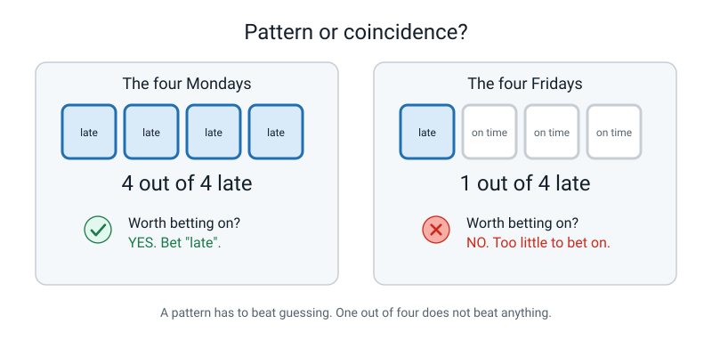
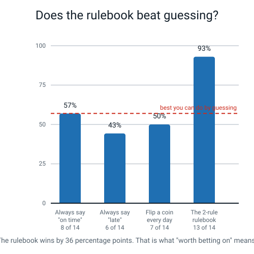
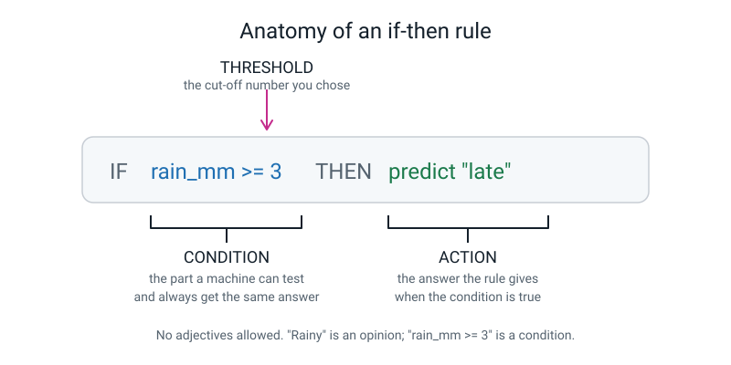
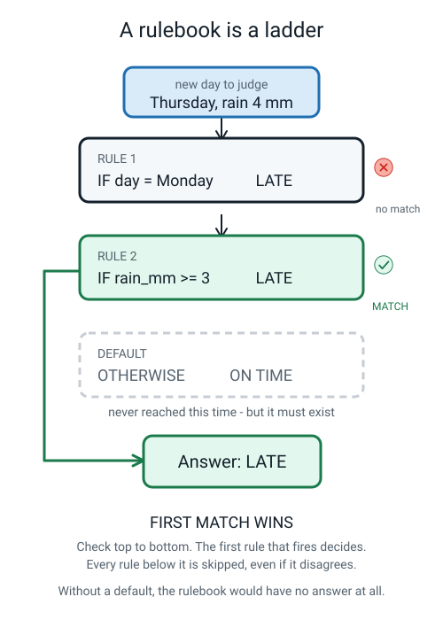
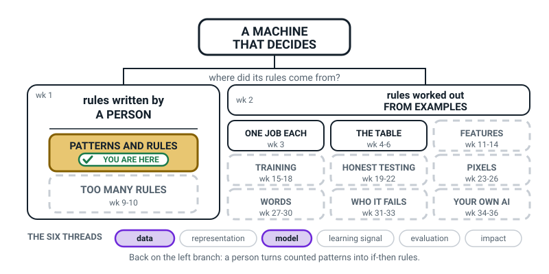
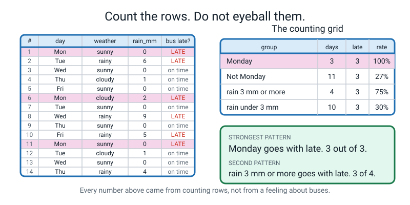
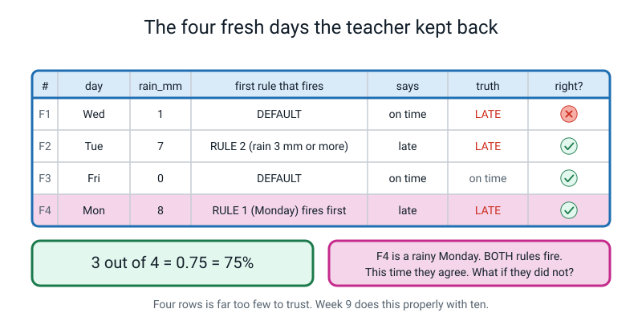

# Week 7 — Patterns: Things That Repeat Enough to Bet On

[⬅ Week 6](week-06.md) · [Course Home](../README.md) · [Week 8 ➡](week-08.md) · [Student Guide](../student-guide/week-07.md) · [Workbook](../workbook/week-07.md)

---

## 📋 At a Glance

| | |
|---|---|
| **Duration** | 70 minutes (works in 60, stretches to 75) |
| **Type** | Teach |
| **Big idea** | A pattern is something that repeats often enough that betting on it beats guessing — and a rule is a pattern written down so tightly that a computer can follow it. |
| **New vocabulary** | pattern · condition · threshold · rulebook · default |
| **Materials** | A one-page handout you make from the fourteen-row bus table in this guide (table, empty counting grid, rulebook frame) · **the Fresh Four card, cut off and kept in your pocket** · a board or big sheet of paper · two pens of different colours · a calculator (optional) |
| **Tech needed** | **None.** Paper and pencil only. |
| **Prep time** | 15 minutes the night before, 5 minutes on the day |

---

## 🎯 Lesson Objectives

By the end of this lesson the student can:

1. **Find a pattern in a two-column table by counting** — filling in a counting grid with *days* and *late* and a *rate* for each group, instead of saying "it feels like Mondays".
2. **Turn that pattern into an if-then rule** and point at its three parts by name: the condition, the threshold inside the condition, and the action.
3. **Explain what a default is** and why a rulebook without one has no answer for most inputs.
4. **Run a two-rule rulebook by hand on four rows it has never seen**, recording which rule fired first and what it answered — including when it answers wrongly.

Objective 1 is the one that carries the week. A student who names the right pattern *without counting* has not met it.

---

## 🧑‍🏫 What YOU Need to Know First

**Read this once, slowly. About 14 minutes. It is complete — you need nothing else, and no outside reading.**

### The one-sentence version

Machines cannot act on hunches, so the whole job this week is converting a vague human feeling ("the bus is always late on Mondays") into two things a machine can use: a **counted** pattern, and a **rule** with a number in it.

### Part 1 — What a pattern actually is

Everyone thinks they know this word, which is exactly why it needs pinning down.

> **Pattern** — something that repeats often enough that betting on it beats guessing.

The important words are the last four: **beats guessing**. That is a test, not a feeling, and it has a number attached.

Suppose you watch the 9:05 bus for four weeks. All four Mondays it was late. One Friday out of four it was late.


*Figure 7.1 — The same word "pattern" is doing two completely different jobs on these two sides. Only one is worth betting on.*

Four out of four is worth a bet. One out of four is not — betting "late" every Friday would make you wrong three times out of four. It isn't a pattern; it's just something that happened once.

**Here is the part that adults skip, and it is the mathematical heart of the lesson.** "Beats guessing" only means something if you first work out how well guessing does. That number has a name in the later weeks of this course (Week 20 calls it the *baseline*), and this week we just do it by hand and call it "the best you could do by guessing".

Take the fourteen bus days in today's activity. Six were late, eight were on time. So:

| Strategy | Right how often | Score |
|---|---|---|
| Say "on time" every single day | 8 of 14 | **57%** |
| Say "late" every single day | 6 of 14 | 43% |
| Flip a coin every day | about 7 of 14 | 50% |
| Use the two-rule rulebook the student will write | 13 of 14 | **93%** |

The best you can do without any pattern at all is 57%, and you get that by saying the same lazy word every day. The rulebook gets 93%. **That 36-point gap is the entire evidence that a real pattern exists.** Without computing the 57%, the 93% is just a number that sounds good.


*Figure 7.2 — Always saying "on time" is the bar to beat. Anything below the dashed line is worse than being lazy.*

### Part 2 — Counting beats eyeballing, and it is not close

The student's instinct will be to scan the table and announce a pattern in four seconds. Sometimes they will even be right. **Ban it anyway**, for a reason you should say out loud to them: eyeballing finds the pattern you already suspected, and misses the one you didn't.

The tool is a **counting grid**. It has four columns and you fill it one group at a time:

| group | days | late | rate |
|---|---|---|---|
| Monday | 3 | 3 | 100% |
| Not Monday | 11 | 3 | 27% |
| rain 3 mm or more | 4 | 3 | 75% |
| rain under 3 mm | 10 | 3 | 30% |

Three things to notice, because each one is a mistake waiting to happen:

1. **You must always count both halves.** "Three Mondays were late" is worthless on its own. Three out of three is everything.
2. **The rate is a division:** late ÷ days. 3 ÷ 3 = 1 = 100%. 3 ÷ 11 = 0.27 = 27%. Do it on paper; the arithmetic is the point, not an obstacle.
3. **A big count is not a strong pattern.** "Not Monday" also has 3 late days — the same count as Monday. But 3 out of 11 is 27% and 3 out of 3 is 100%. **Counts mislead; rates don't.** If your student compares counts instead of rates, stop and fix it immediately.

The pattern with the biggest gap between its two rates is the strongest. Monday: 100% versus 27%, a gap of 73 points. Rain: 75% versus 30%, a gap of 45 points. So Monday is the strongest pattern here and rain is the second.

### Part 3 — A rule is a pattern with the vagueness removed

> **If-then rule** — an instruction of the form: IF this condition is true, THEN give that answer.

A rule has exactly three parts, and the student must be able to name all three by the end of the lesson.


*Figure 7.3 — Three parts. The threshold is the part a human invented.*

> **Condition** — the part after IF. It must be something a machine can test and always get the same answer for.
>
> **Threshold** — the cut-off number inside a condition.
>
> **Action** — the answer the rule gives when the condition is true.

**The rule that matters here: no adjectives allowed.** "If it's rainy" is not a condition — "rainy" is an opinion, and two people will disagree about drizzle. `rain_mm >= 3` is a condition, because a rain gauge gives one answer and it is the same answer for everybody.

Watch the same rule get sharper:

| Version | Rule | Machine-runnable? |
|---|---|---|
| v1 | IF it's a rainy day THEN late | ❌ "Rainy" is a judgement |
| v2 | IF there's a lot of rain THEN late | ❌ "A lot" is not a number |
| v3 | IF `rain_mm >= 3` THEN late | ✅ Yes |

**And here is the honest thing to say about that 3.** Nobody discovered it. In today's table the rainy days measured 4, 5, 6 and 9 mm and the non-rainy days measured 0, 1 and 2 mm. There is a *gap* between 2 and 4, so any threshold from 3 to 4 fits the data exactly as well. We wrote 3 because it is tidy. **Every threshold in every hand-written rule is a number a human made up in a gap.** Say that sentence to the student; it is one of the most durable ideas in the whole course, and Week 15 pays it off when a machine starts choosing thresholds instead of a person.

### Part 4 — A rulebook, and why the default is not optional

> **Rulebook** — an ordered list of rules, plus a default at the bottom.
>
> **Default** — the answer the rulebook gives when no rule fires at all.

Draw it as a ladder. An input falls in at the top, tries each rung, and stops at the first rung that matches.


*Figure 7.4 — Thursday with 4 mm of rain. Rule 1 misses, rule 2 catches it, and the default is never reached — but it must still be there.*

The rulebook the student will write today:

```
CONVENTION: check top to bottom, and the first rule that matches decides.

RULE 1:  IF day = "Monday"     THEN predict "late"
RULE 2:  IF rain_mm >= 3        THEN predict "late"
DEFAULT: OTHERWISE              THEN predict "on time"
```

**Why the default matters more than it looks.** Count how many of the fourteen days match neither rule: **seven** of them — rows 3, 4, 5, 7, 9, 12 and 13. Rule 1 handles 3 rows, rule 2 handles 4 rows, the default handles 7. Without the default, the rulebook is *silent* on half the table. A machine with no answer does not shrug politely; it stops, or it returns nothing and the next piece of software receives nothing and misbehaves in a way nobody can trace.

So: **the default is the most-used rule in almost every rulebook ever written.** It is not the leftovers.

> **💡 Try this:** pick the default by asking "what should I say when I know nothing?" Here that is "on time", because on time is what happens most often. That is a genuinely good reason and it is worth naming: **the default should be the commonest answer.**

### Part 5 — The caveat you must not skip

Three Mondays. That's it. Three.

If the roadworks that block the Monday market route finish next week, the pattern evaporates and the rulebook is worse than useless — it will confidently say "late" every Monday forever. **A pattern is a bet about the future built out of the past, and the past can stop being a good guide on any given morning.**

Say this explicitly at the end of the activity. It costs thirty seconds and it inoculates the student against the single most common error adults make with data.

### The two misconceptions you will meet today

**Misconception 1: "A pattern means always."** The student finds one Monday where the bus was on time and declares the pattern dead. This is very common and it comes from school maths, where patterns are exact (2, 4, 6, 8…). Real-world patterns are *bets*, not laws.

The fix, said in their language: *"Is your grandmother's biscuit tin always the blue one? No. Would you check the blue tin first anyway? Yes. That's a pattern."*

**Misconception 2: comparing counts instead of rates.** "Mondays are late 3 times, but non-Mondays are late 3 times too, so Monday doesn't matter." This sounds like careful reasoning and it is a genuine, deep error. The fix is one question: *"Out of how many?"* Three out of three is not three out of eleven.

A third, smaller one: **"I found the pattern, so the rule is right."** No — a pattern in the data becomes a rule only once you have chosen a threshold, and the threshold was your invention. Keep those two steps separate out loud.

### How deep to go — and where to stop

**Go this deep:** pattern as a bet that beats guessing; counting grids with rates; the three parts of a rule; no adjectives; rulebook plus default; first-match-wins as a *convention we announce*; and the honest smallness of the sample.

**Stop before:**

| Do not raise today | Because |
|---|---|
| False alarms versus misses, and who they hurt | That is **Week 8**, the entire lesson |
| Edge cases, and rules deliberately broken | Week 8 |
| Formal accuracy, training versus fresh scoring | Week 9. Today we say "13 out of 14", not "92.86%" |
| Rule explosion, "why nobody writes 258 rules" | Week 10 |
| Probability, percentages beyond simple division | Not in Level 1 |
| Correlation versus causation, in those words | Touch it in plain English if it comes up — "the rain might be *why*, or it might just be *along with*" — but do not name it or teach it |

**The one question you must not answer today, on purpose:** *"What happens on a rainy Monday, when both rules fire?"* The activity ends with that question. Write it on the board and leave it there for a week. It is Week 8's front door.

### If you have five spare minutes before class

Count something in your own life. How many of the last ten times you went to the shop did you forget one item? How many of the last ten mornings did you hit snooze? Do the division. You will be mildly surprised by at least one of them, and being surprised by your own data makes you far more convincing at minute 30 than any amount of preparation.

---

### 🧭 The Growing Map

The student guide carries the same structural figure every week, with one more piece filled in. This
week it does something it has not done since Week 1: the left-hand room **subdivides**. Until today
*rules written by a person* was one big box; from now on it holds two tiles, and the top one —
PATTERNS AND RULES — is this week's.



*Figure 7.0 — Week 7's version. The person's room is white and finished (wk 1); inside it, PATTERNS
AND RULES is tinted and badged, and TOO MANY RULES is dashed until Week 9. **Data** and **model** are
lit along the bottom.*

**What to do with it, in about two minutes at the end of the lesson:**

1. **Show it and ask this week's version of the question:** *"which bit of today is on this map?"* The
   answer you want is *"the counting grid **and** the bus rule"* — both, because counting produced the
   pattern and the pattern became the rule. If they name only one, ask for the other.
2. **Then the better question:** *"why is TOO MANY RULES dashed, and why is it sitting directly
   underneath us?"* Do **not** answer it. Say: *"because we haven't hit it yet — write the question
   down, it's Weeks 9 and 10."* Their own rulebook is going to walk them into that wall, which is
   worth far more than your explanation of it.
3. **Have them add it to their own copy** on the inside cover, in pencil, and shade the new top tile.
   The fact that their Week 1 box has just grown a wall inside it is the best thing about this week's
   map — let them notice it themselves.

> **🧑‍🏫 Why this is worth two minutes.** Today looks like arithmetic: tallies, fractions, a threshold.
> The map says what the arithmetic was *for* — it is how a person gets a rule out of data. A learner
> who can see that does not ask you why an AI course is doing tally charts.

**The six threads** along the bottom are the spine of all four levels. This week **data** and
**model** are lit, because you counted real data and then turned the count into the thing that
decides. Do not teach or test the threads — they are shelves, and the only thing that matters is that
by Week 36 every week has landed on one.

---

## 🧰 Prep Checklist

### 15 minutes the night before

- [ ] **Make the in-class handout.** The workbook does not contain the lesson materials, so copy them from this guide ("The table they get" and the Fresh Four rows in the Activity section):
  - Sheet 1: the fourteen-row bus table plus the empty counting grid.
  - Sheet 2: the rulebook frame plus the Fresh Four scorecard.
  - Print **Workbook Week 7** separately; it is the homework (Warm-Up, Practice Sets A and B, Puzzle, Think Deeper, Build It, Draw It, Self-Check) and goes home at the end.
- [ ] **Cut off the Fresh Four card** at the bottom of sheet 2 — the four extra days — **and put it in your pocket.** If the student sees those four rows before writing the rulebook, the last five minutes of the lesson are dead. This is the single most important prep step this week.
- [ ] **Fill in the counting grid yourself.** Five minutes with a pencil. You need to have felt the "3 out of 3 versus 3 out of 11" moment before the student hits it.
- [ ] **Do the division for the four guessing strategies** (8 ÷ 14, 6 ÷ 14) so those numbers are in your head, not on a page you have to find.
- [ ] **Read the Answer Key** below, especially the Wi-Fi worked example and the workbook's Practice Set B and Build It answers. Ten minutes.
- [ ] **Check the student's Week 6 homework exists** — they need their own table with at least fifteen rows for tonight's homework. If it doesn't exist, decide now which fallback you'll use (see the table below).

### 5 minutes on the day

- [ ] Board wiped, with room for a three-column grid and a three-line rulebook.
- [ ] Two different coloured pens.
- [ ] Handout sheets 1 and 2 on the desk (workbook kept for the end). **Fresh Four card in your pocket.**
- [ ] The student's own Week 6 table beside them.

### If something fails

| If this fails | Do this instead |
|---|---|
| **No printer** | Read the fourteen rows aloud twice, slowly, while the student writes them on ruled paper. Costs 7 minutes — take 4 from the worked example and 3 from the wrap. Bonus: writing the table by hand means they have already read every row once, and the counting goes faster. |
| **The Week 6 table doesn't exist** | The homework still works on *any* fifteen-row table. Use the fifteen-row sleep-and-tiredness table printed in the Answer Key below as their data instead, and tell them plainly it's borrowed. Then spend the first five minutes of Week 8's lesson restarting their own collection. |
| **The student has fewer than 15 rows of their own** | Ten rows is enough for a counting grid, and say so. Lower the homework target to "one pattern, one rule, run it on the last three rows." Do not let a short table become a reason to skip the homework. |
| **The student refuses to count and insists on guessing** | Let them guess first, out loud, and write their guess on the board. Then count. When counting confirms them, praise it and point out they now have *evidence* instead of a feeling. When counting contradicts them — which happens more often — that is the best possible version of this lesson. |
| **No calculator and the division feels heavy** | Every rate today is one of: 3 ÷ 3, 3 ÷ 11, 3 ÷ 4, 3 ÷ 10, 8 ÷ 14, 6 ÷ 14. Round hard and say so: "about a quarter", "about three-quarters", "a bit over a half". The comparison is what matters, not the second decimal place. |

---

## ⏱️ The Lesson, Minute by Minute

| Minutes | Segment | What happens |
|---|---|---|
| 0–8 | 🪝 **Hook** — "I have a feeling about the bus" | The teacher makes a confident claim with no evidence, and gets challenged. |
| 8–26 | 🧠 **Concept** — Pattern, rule, rulebook | Beats-guessing test · the three parts of a rule · the ladder and the default. |
| 26–40 | 🔍 **Worked Example Together** — The Wi-Fi drops out | An eight-row table, counted together on the board, ending in a perfect split. |
| 40–60 | 🎲 **Activity** — The Bus Is Always Late | Fourteen rows, a counting grid, a two-rule rulebook, then the Fresh Four. |
| 60–70 | 🔑 **Wrap & Assign** | Takeaways, vocabulary, homework, and the rainy-Monday cliffhanger. |

**Running 60 minutes?** Cut the worked example to 8 minutes (do the counting grid, skip the scoring) and the wrap to 6. **Do not cut the Fresh Four** — running the rulebook on rows it has never seen is the part the whole term is built on.
**Running 75?** Add extension question 2 or 3 from Differentiation, or have the student invent a fifteenth bus day designed to make the rulebook wrong.

---

### 🪝 Hook — "I have a feeling about the bus" (0–8)

**Do this:** sit down, look mildly annoyed, and say it like a complaint, not a lesson.

**Say this:**

> "I want to tell you something I'm completely sure about. **The bus near my house is always late on Mondays.** Always. I've been catching it for months and Monday is a disaster every single time.
>
> Now. You've been doing data for six weeks. So tell me honestly — should you believe me?"

Let them answer. Most students will say no, or "how do you know?", which is exactly where you want to be. Some will politely agree; if so, push: *"Would you bet your pocket money on it? On my word?"*

**Say this:**

> "You shouldn't believe me, and here's the embarrassing bit — I shouldn't believe me either. I've never counted. Not once. I have a *feeling*, and I've been calling it a fact for months.
>
> Here's what I actually know. I remember three horrible Mondays. Do you know what I don't remember? Every ordinary Monday where the bus turned up and nothing happened, and I got on it and forgot about it forever. **My brain kept the bad Mondays and threw away the boring ones**, and then told me it had done a survey."

**Do this:** write these two lines on the board, one under the other.

```
A FEELING:  "The bus is always late on Mondays."
A PATTERN:  ?
```

**Say this:**

> "Today we turn the top line into the bottom line. And then we do something harder — we turn the bottom line into an instruction so exact that a computer could follow it without ever having met a bus.
>
> But there's a rule for the next hour, and it's an unusual one. **You are banned from guessing.** Not discouraged. Banned. You may not look at a table and tell me what you reckon. Every single thing you claim today, you have to count first."

**Ask this:**

| Ask | Hoping for | If they say something else |
|---|---|---|
| "What would actually convince you about my Mondays?" | "Count the Mondays" / "how many were late out of how many" | If they say "watch it for longer" — accept it warmly and sharpen it: "Longer *and then what*? What do you do with the days once you've watched them?" Steer to counting. |
| "Suppose I tell you three Mondays were late. Is that enough?" | "Out of how many?" — this is the answer you want and you should react strongly to it | If they say yes: "Three out of three, or three out of thirty?" Let the difference land on its own. This exchange is the whole lesson in eight seconds. |
| "Why do you think my brain remembered the late buses?" | "Because they were annoying" / "you notice bad things" | If stuck, offer it: bad mornings come with a story and a consequence; ordinary mornings don't. Then land it: **a memory is not a sample.** |

---

### 🧠 Concept — Pattern, rule, rulebook (8–26)

#### Part A — What "pattern" means, and the bar it has to clear (7 minutes)

**Do this:** hold up Figure 7.1, or draw two quick tally columns on the board — four ticks under MONDAY all marked *late*, and under FRIDAY one *late* and three *on time*.


*Figure 7.5 — Four out of four, against one out of four. Only one of these is worth acting on.*

**Say this:**

> "Here's a real definition, and it's got a test built into it. **A pattern is something that repeats often enough that betting on it beats guessing.**
>
> Look at the left column. Four Mondays, four late. If I bet 'late' every Monday I'd be right four times out of four. That's worth doing.
>
> Now the right column. Four Fridays, one late. If I bet 'late' every Friday I'd be right once and wrong three times. **That's not a pattern. That's just a thing that happened.**
>
> So there's a bar every pattern has to clear, and it's this: does betting on it do better than *not bothering*? And to know that, you have to work out how well not-bothering does — which people almost never do, and it's the reason so many confident claims are rubbish."

**Do this:** work the numbers for the fourteen bus days on the board. Do not skip the division; do it out loud.

```
14 days:  6 late, 8 on time

Say "on time" every day     ->  right 8 of 14   ->  8 ÷ 14 = 0.57  = 57%
Say "late" every day        ->  right 6 of 14   ->  6 ÷ 14 = 0.43  = 43%
Flip a coin                 ->  right about 7   ->  7 ÷ 14 = 0.50  = 50%
```

**Say this:**

> "So the laziest possible strategy — say 'on time' every single morning and never think again — gets 57%. That's the bar. Any pattern that scores below 57% is worse than being lazy, and you should throw it away.
>
> By the end of the lesson you'll have a rulebook that scores 93% on these same fourteen days. Keep that 57% in your head, because 93% only means something next to it."

**Ask this:**

| Ask | Hoping for | If they say something else |
|---|---|---|
| "Is 'it rains sometimes in June' a pattern?" | "No — sometimes isn't often enough" | If they say yes: "Would you carry an umbrella every day in June because of it? What would you actually *do* differently?" A pattern you can't act on isn't earning its keep. |
| "Is 'the sun comes up in the morning' a pattern?" | "Yes, obviously" | Then push: "How much better than guessing is it?" Answer: enormously — 100% versus 50%. Then the sting: **a pattern that good is usually called a law, and there are about four of those. Everything else is a bet.** |
| "My friend won at cards three times in a row. Pattern?" | "No, three times isn't enough" / "out of how many games?" | If they say yes, ask how many games were played. If it was three out of three that *is* suspicious — and the honest answer is "it's not enough rows to tell, and this is exactly what Week 9 is about". |

#### Part B — The three parts of a rule (6 minutes)

**Do this:** write this on the board in two colours. Use colour 1 for the condition, colour 2 for the action, and box the threshold.

```
IF   rain_mm >= 3      THEN   predict "late"
     └─── condition ───┘      └─── action ───┘
              ▲
          threshold
```


*Figure 7.6 — The finished board. Every rule you meet for the rest of this course has these three parts.*

**Say this:**

> "A rule has exactly three parts and they all have names.
>
> The **condition** is the bit after IF. It's the test. And it has to be a test a machine can actually run — which means one thing above all others: **no adjectives.**
>
> Watch. 'If it's a rainy day, the bus is late.' Is that a rule a computer could follow? No — because what's rainy? Drizzle? Two spots on the window? You and I would disagree, and a machine can't disagree, it just needs an answer.
>
> So we replace the adjective with a measurement. `rain_mm` is greater than or equal to 3. Now there's nothing to argue about. A rain gauge says 4, the rule fires. Says 2, it doesn't. Same answer every time, for everybody, forever.
>
> The number 3 has its own name: the **threshold**. It's the cut-off. And I want to tell you something uncomfortable about it — **I made it up.** Nothing in the data said 3. Our rainy days measured 4, 5, 6 and 9 millimetres. Our dry days measured 0, 1 and 2. There's a hole between 2 and 4, and *any* number in that hole fits the data exactly as well as 3 does. I picked 3 because it's tidy.
>
> Remember that. Every threshold in every hand-written rule is a number some human made up in a gap. Later in the year we'll get a machine to choose them from the data instead, and that's a genuinely big deal."

**Ask this:**

| Ask | Hoping for | If they say something else |
|---|---|---|
| "Sharpen this: IF the message is long THEN spam." | "More than 100 characters" — any specific number | If they say "if it's really long", laugh and repeat the question. Any number is a right answer here; refusing to pick one is the wrong answer. |
| "Sharpen this: IF the student is often absent THEN phone home." | "3 or more absences in a month" — a count and a window | If they only give a count ("3 times"), ask "three times ever, or three times this week?" Thresholds usually need a *time window* too, and noticing that is strong work. |
| "Why not just write 'if it looks like it'll rain'?" | "Because a computer can't look" | If they can't answer: "Two people stand at the same window. One says it looks like rain, one says it doesn't. Who's right?" Nobody. That's the whole problem with adjectives. |

#### Part C — The rulebook and the default (5 minutes)

**Do this:** draw the ladder. Three rungs, arrows falling down the left, and the word DEFAULT at the bottom.


*Figure 7.7 — Draw this. An input falls in at the top and stops at the first rung that matches.*

**Say this:**

> "One rule is rarely enough, so we stack them. A stack of rules with a default at the bottom is called a **rulebook**.
>
> And a rulebook needs one thing announced before you use it: **which rule wins when two of them fire?** Our convention — and it's the standard one — is **first match wins.** You check top to bottom and the first rule that matches decides. Everything below it is skipped, even if it disagrees with the answer.
>
> Watch this input fall down the ladder. Thursday, four millimetres of rain. Rule 1: is the day Monday? No. Fall through. Rule 2: is rain three or more? Four is more than three — **match.** Stop. The answer is 'late'. We never even look at the default.
>
> Now here's the bit almost everybody forgets. The **default** at the bottom is the answer when *nothing* matches. Not a special case — the ordinary case. In our table, seven of the fourteen days match neither rule. That's half. Without a default, the rulebook has literally nothing to say about half the days, and a machine with nothing to say doesn't shrug politely. It stops, or it hands the next program an empty answer and something breaks three steps later where nobody can find it.
>
> **So how do you choose the default? Ask yourself: what should I say when I know nothing?** Around here the bus is usually on time. So the default is 'on time'. **The default should be the commonest answer** — that way, being clueless is still your best guess."

**Ask this:**

| Ask | Hoping for | If they say something else |
|---|---|---|
| "What answer does this rulebook give for Wednesday, no rain?" | "On time — the default" | If they hunt for a matching rule, walk it down the ladder with them out loud. Rule 1: not Monday. Rule 2: 0 is not ≥ 3. Nothing left. |
| "What if I delete the default line?" | "Then it doesn't know" / "no answer" | If they say "then it says on time anyway", be firm: no. A rulebook with no default has *no* answer. The blank is not secretly a "no". |
| "Rules 1 and 2 both fire on a rainy Monday. What happens?" | "Rule 1 wins, because it's first" | **This is the cliffhanger — take the answer, confirm it, and then refuse to discuss it.** Say: "Right. Rule 1 wins. Now hold on to a bigger question: is that *correct*, or just what we said would happen? Park it. That's next week." |

---

### 🔍 Worked Example Together — The Wi-Fi drops out (26–40)

**Do this:** write this table on the board or on a sheet between you. Say it's from your own house: every day you noted the time of the video call, how many people were on it, and whether the Wi-Fi dropped.

| # | time | people_on_call | wifi_dropped? |
|---|---|---|---|
| 1 | morning | 2 | no |
| 2 | evening | 6 | **yes** |
| 3 | morning | 3 | no |
| 4 | evening | 5 | **yes** |
| 5 | morning | 5 | **yes** |
| 6 | evening | 2 | no |
| 7 | morning | 4 | no |
| 8 | evening | 7 | **yes** |

**Say this:**

> "Eight days. Something in here makes the Wi-Fi fall over and I want to know what. **Do not tell me what you reckon.** We count."

**Do this:** draw the empty counting grid and fill it together, one row at a time, asking for each number before you write it.

| group | days | dropped | rate |
|---|---|---|---|
| time = evening | 4 | 3 | 3 ÷ 4 = **75%** |
| time = morning | 4 | 1 | 1 ÷ 4 = **25%** |
| people ≥ 5 | 4 | 4 | 4 ÷ 4 = **100%** |
| people < 5 | 4 | 0 | 0 ÷ 4 = **0%** |

**Say this:**

> "Look at the bottom pair. Every single call with five or more people dropped. Every single call with fewer than five people survived. **Four out of four and nought out of four.** That is as clean as data ever gets, and it's much stronger than the evening pattern above it — evening is 75% against 25%, which is good, but people-count is 100% against 0%.
>
> So the rule is:
>
> `IF people_on_call >= 5 THEN predict "drops"` — and the default is `no drop`."

**Ask this:**

| Ask | Hoping for | If they say something else |
|---|---|---|
| "Where did the 5 come from? Why not 4 or 6?" | "It's between 4 and 5" — the gap argument | If they say "because 5 is in the table", push: our no-drop calls had 2, 3, 4 people; our drop calls had 5, 5, 6, 7. Any cut-off above 4 and up to 5 fits perfectly. **The data gives you a gap, not a number.** |
| "Score the rulebook on all eight days. What do you get?" | 8 out of 8 | Walk it row by row if needed. Rows 1, 3, 6, 7 have fewer than 5 → predict no drop, all correct. Rows 2, 4, 5, 8 have 5+ → predict drop, all correct. |
| "How well would guessing do?" | "4 out of 8, 50%" | If stuck: 4 dropped, 4 didn't, so saying the same word every day gets exactly half. Then land it: the rule beats guessing by **50 percentage points**, which is enormous. |
| "Row 5 is the interesting one. Why?" | "It's a morning that dropped" / "the two clues disagree" | **This is the best question in the segment.** Row 5 is a *morning* call — so the evening pattern says it should be fine — with *five people*, so the people pattern says it should drop. It dropped. That single row tells you the people count is doing the real work and the time of day was just going along for the ride. Rows where two clues agree teach you nothing about which clue matters. |

**Say this** (the close of the segment):

> "And why would evening look like a pattern at all? Because evening calls happen to have more people on them. The time of day wasn't *causing* anything — it was just sitting next to the thing that was. That happens constantly with data, and row 5 is how you catch it: **find the row where your two ideas disagree, and see which one wins.**"

> **⚠️ Watch out:** do not use the words *correlation* and *causation* today. The idea lands perfectly well in plain English and the vocabulary budget for this week is already full at five words.

---

### 🎲 Activity — The Bus Is Always Late (40–60)

Full instructions in the next section. In brief: fourteen rows of bus data, a counting grid filled by counting, a two-rule rulebook with a default, and then four fresh days out of your pocket.

**Do this at minute 40:** hand over handout sheet 1 (the bus table and empty grid). Keep the Fresh Four card in your pocket and say nothing about it.

**Say this:**

> "Fourteen mornings at my bus stop. Day, weather, how many millimetres of rain, and whether the bus was late. Here's your job, in four steps, and step one is the only one you can do right now.
>
> **Count.** Fill that grid. How many Mondays, how many of those late. How many days with three millimetres of rain or more, how many of those late. Then do the divisions. Seven minutes, and no telling me what you reckon."

---

### 🔑 Wrap & Assign (60–70)

**Do this:** put the completed counting grid and the rulebook side by side where you can both see them.

**Say this:**

> "Four things, and then homework.
>
> **One. A pattern is something that repeats often enough that betting on it beats guessing.** You had to work out what guessing scores — 57% — before 93% meant anything at all.
>
> **Two. You find patterns by counting, not by looking.** And you compare *rates*, not counts. Mondays were late three times. Non-Mondays were late three times too. Same count, completely different story: three out of three against three out of eleven.
>
> **Three. A rule has three parts: a condition, a threshold inside it, and an action.** No adjectives allowed. And the threshold is a number you made up in a gap — remember that, because it means somebody could reasonably have chosen a different one.
>
> **Four. A rulebook is rules in order plus a default**, and the default is the busiest line in it. Seven of your fourteen days — half of them — were answered by the line at the bottom."

**Do this:** point at the board where the cliffhanger is written, and read it out loud.

```
WHAT HAPPENS ON A RAINY MONDAY?
Rule 1 says late.  Rule 2 says late.  They agree... this time.
What if they didn't?
```

**Say this:**

> "Today they agreed, so we got away with it. Next week I'm going to write rules that disagree with each other on purpose, and then I'm going to try to break your rulebook deliberately — and you're going to find out that there are two totally different ways of being wrong, and they hurt completely different people. Leave that on the board."

**Do this:** fill in the vocabulary box together — five words, in the student's own words. Steer to these:

| Word | The definition you're steering to |
|---|---|
| **pattern** | Something that repeats often enough that betting on it beats guessing |
| **condition** | The testable part of a rule — the bit after IF |
| **threshold** | The cut-off number inside a condition |
| **rulebook** | An ordered list of rules, plus a default |
| **default** | The answer when no rule fires at all |

Then assign the homework as written below.

---

## 🎲 The Activity, In Full

### The Bus Is Always Late

**Time:** 20 minutes — 7 counting, 4 writing the rulebook, 4 scoring the fourteen, 5 on the Fresh Four
**Group size:** 1 student. With two, give each their own grid and compare rates before comparing rulebooks.
**The point:** counting, not guessing — and then running your own rulebook mechanically on rows you have never seen.


*Figure 7.8 — The finished article. The student's page has the same fourteen rows and an empty grid.*

### Materials

- Handout sheet 1, made from this guide: the fourteen-row table and the empty counting grid
- Handout sheet 2, made from this guide: the rulebook frame and the Fresh Four scorecard
- **The Fresh Four card, cut off sheet 2 and in your pocket**
- (The Week 7 workbook is not used in class; it is the homework.)
- A pencil. A calculator is allowed and not needed.

### The table they get

| # | day | weather | rain_mm | bus late? |
|---|---|---|---|---|
| 1 | Mon | sunny | 0 | **LATE** |
| 2 | Tue | rainy | 6 | **LATE** |
| 3 | Wed | sunny | 0 | on time |
| 4 | Thu | cloudy | 1 | on time |
| 5 | Fri | sunny | 0 | on time |
| 6 | Mon | cloudy | 2 | **LATE** |
| 7 | Tue | sunny | 0 | on time |
| 8 | Wed | rainy | 9 | **LATE** |
| 9 | Thu | sunny | 0 | on time |
| 10 | Fri | rainy | 5 | **LATE** |
| 11 | Mon | sunny | 0 | **LATE** |
| 12 | Tue | cloudy | 1 | on time |
| 13 | Wed | sunny | 0 | on time |
| 14 | Thu | rainy | 4 | on time |

### Step 1 — Fill the counting grid (7 minutes)

The grid on their page has four groups already named and everything else blank:

| group | days | late | rate |
|---|---|---|---|
| Monday | | | |
| Not Monday | | | |
| rain 3 mm or more | | | |
| rain under 3 mm | | | |

**Rules for this step:**

1. **No guessing.** Not a word about what they reckon until the grid is full.
2. **Count with a finger on the page**, row by row, and put a small tally mark in the margin. Counting from memory is how you get 3 when the answer is 4.
3. **Do both halves of every pair.** A group with no comparison group is meaningless.
4. **Write the rate as a division, then as a percentage:** `3 ÷ 3 = 100%`.

If they stall, the only hint you give is procedural: *"Do it in two passes. First pass, count how many days are in the group. Second pass, count how many of those were late."*

### Step 2 — Name the strongest pattern (2 minutes)

**Ask:** *"Which group has the biggest gap between its rate and its partner's rate?"*

Monday 100% against Not-Monday 27% is a 73-point gap. Rain-3-or-more 75% against rain-under-3 30% is a 45-point gap. **Monday is the strongest pattern; rain is the second.**

> **🧑‍🏫 If a student says the rain pattern is stronger:** ask them to say both rates out loud. Usually they have compared 3-of-4 with 3-of-3 and decided 4 sounds better than 3. Bigger counts, smaller rate. It's the misconception from the Concept section arriving right on schedule.

### Step 3 — Write the rulebook (4 minutes)

They write two rules and a default, in this frame:

```
CONVENTION: first match wins, checked top to bottom.

RULE 1:  IF ________________________  THEN ______________
RULE 2:  IF ________________________  THEN ______________
DEFAULT: OTHERWISE                    THEN ______________
```

Requirements, said out loud before they start:

- The strongest pattern goes in Rule 1.
- Rule 2 must contain a **number** — a threshold — and they must be able to say why they chose that number.
- The default must be filled in. A blank default is not finished work.

The expected result:

```
RULE 1:  IF day = "Monday"    THEN predict "late"
RULE 2:  IF rain_mm >= 3      THEN predict "late"
DEFAULT: OTHERWISE            THEN predict "on time"
```

### Step 4 — Score it on the fourteen (4 minutes)

They run the rulebook down all fourteen rows and tick or cross each one. Full trace is in the Answer Key. **Score: 13 out of 14.**

Then compare with the guessing numbers from the Concept segment: 13 of 14 is 93%, against the best guess of 57%. **The pattern earned 36 percentage points.**

> **💡 Try this:** ask them to find the one row it got wrong *before* you tell them. It's row 14 — Thursday, 4 mm of rain, and the bus turned up on time anyway. That one row is the seed of next week.

### Step 5 — The Fresh Four (5 minutes)

**Now take the card out of your pocket.** Make a small performance of it.

**Say this:**

> "I kept four days back. You've never seen these. Your rulebook has never seen these. Nothing you wrote was allowed to peek at them, which is the whole point.
>
> Run your rulebook on all four. Write down **which rule fires first**, what it says, and then I'll tell you the truth."

| # | day | rain_mm |
|---|---|---|
| F1 | Wed | 1 |
| F2 | Tue | 7 |
| F3 | Fri | 0 |
| F4 | Mon | 8 |

Reveal the truths one at a time, only after they have committed to an answer: **F1 was LATE. F2 was LATE. F3 was on time. F4 was LATE.**


*Figure 7.9 — Three out of four. And look at what F4 is.*

**Score: 3 out of 4 = 0.75 = 75%.**

Then the two closing questions, in this order:

1. *"You got 93% on the days you built the rules from and 75% on the days you'd never seen. Which of those two numbers is the honest one?"* — Take whatever they say, agree that it's a good question, and say: **"That is literally the whole of Week 9. Don't answer it yet."**
2. *"Look at F4. Monday, eight millimetres of rain. Which rules fire?"* — **Both.** Rule 1 fires first and wins, so the answer is "late", which happens to be right. **"But what if rule 2 had said something different? Who decided rule 1 goes first? Me. On a whim."**

### What "finished" looks like

- A counting grid with four filled rows, each showing days, late, and a rate written as a division
- The strongest pattern named, with both rates quoted as the reason
- Two rules and a default, written down, with a number in rule 2
- Fourteen rows scored, 13 of 14, and the wrong row identified as row 14
- The Fresh Four scored 3 of 4, with the first-firing rule named for each
- The rainy-Monday question written on their page, unanswered

### Variation — easier

- **Pre-fill the "days" column of the counting grid** (3, 11, 4, 10) so they only count the late days. Halves the work, keeps the idea.
- **Cut to seven rows** (1–7). Then Monday is 2 of 2, Not Monday 1 of 5, rain ≥ 3 is 1 of 1, rain under 3 is 2 of 6. The pattern still shows and the counting is quick.
- **Give them Rule 1** and have them write only Rule 2 and the default.
- **Skip step 4** (scoring the fourteen) entirely and go straight to the Fresh Four. That is the step with the most learning per minute.

### Variation — harder

- **Add a third rule.** Ask: is there a group that predicts *on time*? Fridays are 1 late out of 2 — useless. Sunny days are 2 late of 7 (rows 1, 11 late; 3, 5, 7, 9, 13 on time) = 29%, so `IF weather = "sunny" THEN on time` is a real rule. Then have them place it in the ladder and notice that putting it *above* Rule 1 breaks the Mondays, because rows 1 and 11 are sunny Mondays. **Order changes answers.** This is a direct rehearsal for Week 8.
- **The threshold hunt.** "Try `rain_mm >= 1`, `>= 2`, `>= 4` and `>= 5` instead of 3. Score each. Which is best?" Answers in the key — `>= 1` drops to 11/14; `>= 2`, `>= 3` and `>= 4` all tie at 13/14; and `>= 5` scores a suspicious 14/14. The lesson: several thresholds tie, and the one that wins outright wins by dodging a single awkward row.
- **Design the fifteenth day.** "Invent one new day that makes my rulebook wrong. Then invent one that makes it right for the *wrong reason*." A sunny Monday that's on time does the first. A rainy Thursday that's late for a completely unrelated reason — a broken traffic light — does the second.
- **The honesty question.** "Three Mondays. Would you bet a week's pocket money on Monday number four?" Push until they can articulate that three rows is very few, and that a bet is not a certainty.

---

## ❓ Questions Students Ask This Week

**"Isn't three Mondays too few to be sure?"**
Yes. Completely correct, and it's the sharpest question anyone asks this week — say so. Three rows is nowhere near enough to be *sure* of anything. But notice what we're claiming: not that the bus will definitely be late next Monday, only that "late" is the better bet than "on time". Three out of three does support that, weakly. The professional move is to keep collecting and check whether the pattern survives — which is exactly what your homework asks you to start doing with your own table.

**"What if the bus is late on Mondays because of something else, like the market, and not because it's Monday?"**
Then you have understood something most adults haven't. Monday isn't *causing* anything — Monday is a **stand-in** for whatever really happens on Mondays. The market traffic, the bin lorry, the school run. Your rule still works, because the stand-in shows up at the same time as the real cause. But it will break the day the market moves to Tuesday, and you won't know why. That's the risk you take with every rule you'll ever write.

**"Why is the threshold 3 and not 3.5?"**
Because I chose it, and I could have chosen 3.5. Look at the rain values: 0, 1, 2 on the dry days and 4, 5, 6, 9 on the wet ones. Nothing measured between 2 and 4 at all. So 3, 3.5 and 4 all split the data identically — the data has a hole, and any number in the hole is equally justified. **The data gives you a gap; a human turns the gap into a number.** If we collected a day with 3.2 mm of rain, suddenly the choice would matter. That's why the most valuable new data always sits right next to your threshold.

**"Could I make a rule with two conditions in it, like Monday AND rain?"**
Yes, and that's real. `IF day = "Monday" AND rain_mm >= 3 THEN late` is a perfectly good rule. It's *narrower*: it fires on fewer days, so it's wrong less often but also right less often. Try it on the fourteen — it only fires on zero rows, because no Monday in the table had 3 mm or more. A rule that never fires is dead weight, and spotting dead rules is a real skill.

**"Which is better, my rulebook or just always saying 'on time'?"**
Yours, by a mile — 93% against 57%. And I want you to notice how you know that: you *counted both*. Anyone can say "my system is good". Only counting the lazy alternative tells you whether "good" means anything.

**"Does a computer find patterns the same way I just did?"**
Roughly, yes — and this is one of the most surprising things in the whole course. A machine learning program looking at this table would do essentially what you did: split the rows by a column, count how the answers land on each side, work out the rates, and keep the split with the biggest gap. It just does it for thousands of columns and thousands of possible thresholds in under a second, and it never gets bored on row 400. Your hand-drawn counting grid is not a toy version of the real thing. It's the real thing, done slowly.

**"Will the Monday pattern still be true next month?"**
**Nobody knows for sure, and here's why that isn't a dodge.** A pattern is a statement about the past. Using it on the future is a bet, and the world is under no obligation to keep behaving the way it did while you were watching. If the roadworks finish, the pattern vanishes overnight and your rulebook will keep confidently saying "late" every Monday, wrong every time, with total confidence, until somebody notices. There is no cleverness that fixes this — the only defence is to keep collecting data and keep checking. Every real AI system in the world has this problem, and companies pay people full-time salaries to watch for it.

**"What if two rules disagree instead of agreeing?"**
Park that one. Genuinely — I want you to write it on your page and bring it back next week, because it's the first thing we do. The short version: whichever rule is higher up wins, and *somebody chose the order*. That somebody was me, and I didn't think about it very hard.

---

## ⚠️ Where This Lesson Goes Wrong

| What happens | Why | What to do right now |
|---|---|---|
| The student announces the Monday pattern in four seconds and refuses to count | They're right, and counting feels like a pointless chore | Don't argue. Say: "Great — now prove it, and while you're proving it you'll find the second pattern you missed." Then ask them the rain question, which almost nobody spots by eye. Being right by luck once is what makes counting feel unnecessary. |
| They compare counts instead of rates: "3 Mondays late, 3 non-Mondays late, so Monday doesn't matter" | It is genuinely careful reasoning applied to the wrong quantity | Two words: **"Out of how many?"** Write `3/3` and `3/11` on the board, one above the other. Do not explain further — the fraction does the work. |
| They write "IF it's rainy THEN late" and think they're done | That's how humans think, and it feels precise enough | Play dumb, hard. "It's drizzling. Is that rainy? Say yes. Now my friend says no. Which of us does the computer believe?" Then point at the `rain_mm` column: "You have a *number* right there. Use it." |
| The default is left blank | Nothing in the table looks like a "leftover" case | Count it with them: run down the fourteen rows and tally how many match neither rule. It's seven — half the table. "Half your days are answered by the line you left empty." |
| They score the rulebook on the fourteen rows and get 14 out of 14 | They "fixed" row 14 while scoring, or skipped it | Make them read row 14 aloud: Thursday, 4 mm, on time. "What does your rule 2 say?" Late. "What actually happened?" On time. "So?" Write the cross. **The score is what the rules give, not what you'd like.** This is the single most important habit of the term. |
| They peek at the Fresh Four early | It's on the same handout sheet unless you cut it off | This is a prep failure, not a student failure. If it happens, use four different fresh days: `Mon 0 mm → LATE`, `Fri 6 mm → LATE`, `Wed 2 mm → on time`, `Thu 5 mm → on time`. Score is 3 of 4 again, and F4 is now a *wrong* answer, which works just as well. |
| The percentages become the whole lesson and the arithmetic swallows twelve minutes | Division with a remainder is genuinely hard at 11 | Round brutally and say you're doing it: 3/11 is "about a quarter", 8/14 is "a bit over half". Nothing this week depends on a second decimal place. Precision returns in Week 9 where it matters. |
| They conclude "so the bus is always late on Mondays" — back to the original claim | The pattern confirmed the hunch, so the hunch feels vindicated | Reclaim it: "Not *always*. Three out of three, which is the best kind of bet we've got with only three Mondays. If I'd watched thirty Mondays, would you expect thirty out of thirty?" Get them to say no. |

---

## 🧭 Differentiation

### If they are struggling

**Cut:** the beats-guessing arithmetic down to one comparison (57% versus 93%, stated by you, not derived). Cut the worked example to just the people-count half of the grid. Keep the whole activity.

**Reteach like this:** do the counting grid in two separate passes with two separate questions, and never both at once. Pass 1, one question only: *"How many Mondays are there?"* Finger on the page, tally in the margin. Pass 2: *"Of those three, how many were late?"* Two small questions in sequence beats one compound question every single time — and it's what professionals do too.

**Reduce the load:** pre-fill the `days` column of the grid. Give them Rule 1 already written. Let them use a calculator for every division without comment.

**The minimum acceptable outcome for today:** they can fill one row of the counting grid correctly, they can say the Monday pattern *with both numbers* ("three out of three"), and they can name what a default is for. Those three are this week in miniature.

### If they are flying

1. **"Try every threshold."** Score the rulebook with `rain_mm >= 1`, `>= 2`, `>= 3`, `>= 4`, `>= 5`. Answers in the key: 11, 13, 13, 13, 14. Then the real question — *"Three thresholds tie at 13, and the winner scores 14 by excluding exactly one row. Which one do you ship?"* There is no data-based answer. Any reasoning that admits it's a judgement call is a strong answer.
2. **"Find a rule that predicts 'on time'."** `IF weather = "sunny" THEN on time` fires on 7 rows and is right on 5 of them. Then: where in the ladder do you put it? Above Rule 1 it wrecks the sunny Mondays (rows 1 and 11). Below both rules it barely changes anything. **Position is part of the rule.**
3. **"Which single row is the most valuable in the table?"** Best answer: row 14 (Thursday, 4 mm, on time) — the only row where a rule fires and is wrong, so it's the only row carrying information about where the rule's edge is. Row 6 (Monday, 2 mm, late) is also defensible: it's the only Monday that *isn't* rainy, which proves Monday is doing work on its own rather than just being wet.
4. **"Invent a fifteenth row that turns the strongest pattern into the weakest."** A sunny Monday that's on time takes Monday from 3/3 to 3/4 (75%), level-pegging with rain. One row, and the whole conclusion moves. That fragility is the honest state of a three-row group.
5. **The two-condition rule.** `IF day = "Monday" AND rain_mm >= 3` fires on zero rows in this table. Ask what a rule that never fires is worth, and how you'd find such a rule in a rulebook of fifty.

### If they won't engage today

**Make it about their own life, immediately.** Drop the bus. Ask: "How many of the last ten school mornings did you leave something behind?" Count it on fingers. That's a counting grid with one row and it is a complete version of today's lesson.

**Make it a bet with actual stakes.** Small ones — who does the washing up, five minutes of screen time. "I bet you can't tell me which column predicts the bus without counting. Go on. Guess." When they guess wrong, they will want to count. When they guess right, ask for the second pattern.

**Or shrink to one number.** Give them just the Monday rows and the Friday rows. "Mondays: three, all late. Fridays: two, one late. Which day would you bet on?" That's ninety seconds and it's the honest core of the lesson. If that's all you get, take it and go.

**Do not skip:** the Fresh Four. If you get five engaged minutes all lesson, spend them there.

---

## ✅ Assessing Understanding

Do these in the last five minutes. Exact wording below.

### Check 1 — Counting, not eyeballing (60 seconds)

> "I say Tuesdays are terrible for the bus. What exactly do you need to count before you agree with me?"

**A good answer looks like:** "How many Tuesdays there were, and how many of those were late — and then compare it with the non-Tuesdays."
**A weak answer looks like:** "How many Tuesdays were late." Push once: *"Three Tuesdays late — is that a lot?"* You want them to reach for the denominator on their own.

### Check 2 — The three parts of a rule (60 seconds)

> "Here's a rule: IF `screen_min >= 120` THEN predict 'tired'. Point at the condition, the threshold and the action."

**A good answer:** condition = `screen_min >= 120`; threshold = `120`; action = predict "tired".
**A weak answer:** naming the parts in the wrong places, or calling the whole line the condition. Reteach by writing it out and covering one part at a time.

**Bonus follow-up if they nail it:** *"Where did 120 come from?"* The best answer is "somebody made it up".

### Check 3 — The default (45 seconds)

> "My rulebook has two rules. Neither of them matches today. What answer does my rulebook give?"

**A good answer:** "Whatever the default says — and if you didn't write a default, it gives no answer at all."
**A weak answer:** "It says no" or "nothing happens". Push: *"'Nothing' isn't an answer a computer can hand to the next program. What does it actually need?"*

### Mastery scale for this week

| Level | What it looks like |
|---|---|
| **1 — Not yet** | Announces patterns from feel. Compares counts, not rates. Cannot say what a threshold is. Leaves the default blank. |
| **2 — Emerging** | Fills the counting grid with help, and gets the rates right with a calculator. Names the strongest pattern when both rates are in front of them. Writes a rule with an adjective in it and needs prompting to sharpen it. |
| **3 — Secure** | Fills the grid unaided, compares rates not counts, writes two rules with a numeric threshold plus a default, and runs the rulebook on the Fresh Four mechanically. **Target for Week 7.** |
| **4 — Strong** | Also explains that the threshold sits in a gap and could have been a different number. Spots row 14 as the failure before being told. Chooses the default by asking what the commonest answer is. |
| **5 — Exceptional** | Notices that "Monday" is a stand-in for something else (traffic, market, bin day). Argues about which threshold to ship when two tie. Says out loud, unprompted, that three Mondays is not many. |

---

## 📤 Homework to Assign

**The whole of Workbook Week 7**, in this order: Warm-Up, Practice Set A, Practice Set B, Puzzle of the Week, Think Deeper, Build It (its pages are headed 7.4 and 7.5), Draw It, Self-Check.
**Time: 45–60 minutes across the week.** A sensible split: Warm-Up and Practice Set A (about 12 min), Practice Set B (about 15 min), Puzzle and Think Deeper (about 10 min), Build It (about 20 min), with Draw It and Self-Check as a few minutes of finishing off. Nothing in the workbook is done in class; the in-class bus table, rulebook and Fresh Four are on your own handout, not the workbook.

**Say this:**

> "Two jobs, and the second one is the real one.
>
> **The first job is practice.** Warm-Up, then Set A, then Set B. In Set B there are three little tables. For each one, fill the counting grid, work out both rates, and say whether there's a pattern worth betting on — or whether it's noise. One of those three tables has no pattern at all in it, and saying so is the right answer. Don't invent a pattern to be polite. There's a puzzle after that and two big questions, and there's no wrong answer to the big ones as long as you tell me what you really think.
>
> **The second job is Build It, and it's your own data.** Get out the table you've been building since Week 4. Pick one column that could be an answer — tired or not tired, late or on time, finished or not finished — and one column that might predict it. Then **count**. Not a feeling. A grid, with days and hits and a rate, exactly like today.
>
> Then write it as an if-then rule with a real threshold in it, and write one sentence saying where that threshold came from. 'I made it up because it looked like the gap' is a completely acceptable and honest sentence.
>
> Then run your rule on the **last five rows** of your table and record how many it got right, out of five.
>
> And here's the thing I want you to notice while you're doing it, because we'll come back to it in two weeks: **those last five rows were part of the data you found the pattern in.** You've already seen them. So is five-out-of-five actually good news, or is it just you marking your own homework? That's the question on the last Build It page. There's no wrong answer this week — I want to know what you think. Last of all, draw one real pattern from your own week, and tick the Self-Check."

**What to check when it comes in:** Warm-Up and Set A first (quick, against the key); Set B's counting grids have both halves with rates as divisions, and (c) is answered "no pattern"; the Puzzle's P3 list is exactly 25 to 28; in Build It the counting grid has both halves of every pair, rates are divisions, the rule contains a number rather than an adjective, the last-five score is out of five and honestly recorded, and the 7.5 sentence shows some suspicion about scoring yourself on rows you already looked at. The answers are below, one section per workbook section.

---

## 🔑 Answer Key

### Lesson questions

**Hook — "Suppose I tell you three Mondays were late. Is that enough?"**
Not without the denominator. Three out of three is a strong bet; three out of thirty is nothing. The follow-up truth: three rows of anything is very little evidence, and admitting that is part of the answer.

**Concept A — "Is 'it rains sometimes in June' a pattern?"**
No. "Sometimes" doesn't clear the bar, and you cannot act on it — there's no bet it improves.

**Concept A — the guessing numbers for the fourteen bus days.**

```
6 late, 8 on time, 14 days total

Always "on time":  8 ÷ 14 = 0.571… = 57%   <- the bar to beat
Always "late":     6 ÷ 14 = 0.428… = 43%
Coin flip:         about 7 ÷ 14 = 50%
The rulebook:     13 ÷ 14 = 0.928… = 93%
```

**Concept B — sharpen "IF the message is long THEN spam".**
Any specific count is correct: `IF character_count > 100 THEN spam`. The marking point is that a number appears at all.

**Concept B — sharpen "IF the student is often absent THEN phone home".**
`IF absences_this_month >= 3 THEN phone home`. Full credit requires both a count *and* a time window; "3 times" alone is incomplete because three times ever is different from three times this week.

**Concept C — "What does the rulebook say for Wednesday, no rain?"**
Rule 1: day is not Monday, no match. Rule 2: 0 is not ≥ 3, no match. **Default: on time.**

**Concept C — "What if I delete the default?"**
The rulebook has no answer at all for that input. Not "no" — *nothing*. Eight of the fourteen days are in that position.

### Worked Example — the Wi-Fi table

**The counting grid:**

| group | days | dropped | rate |
|---|---|---|---|
| time = evening | 4 (rows 2, 4, 6, 8) | 3 (2, 4, 8) | 3 ÷ 4 = **75%** |
| time = morning | 4 (rows 1, 3, 5, 7) | 1 (row 5) | 1 ÷ 4 = **25%** |
| people ≥ 5 | 4 (rows 2, 4, 5, 8) | 4 (all of them) | 4 ÷ 4 = **100%** |
| people < 5 | 4 (rows 1, 3, 6, 7) | 0 | 0 ÷ 4 = **0%** |

**Strongest pattern:** `people_on_call >= 5` goes with dropping. 100% against 0% — a perfect split.

**The rule:** `IF people_on_call >= 5 THEN predict "drops"`, default `no drop`.

**Score on all eight:** rows 1, 3, 6, 7 have fewer than 5 people → predict no drop → all four correct. Rows 2, 4, 5, 8 have 5 or more → predict drop → all four correct. **8 out of 8 = 100%.**

**Guessing:** 4 dropped, 4 didn't, so always saying the same thing scores 4 ÷ 8 = **50%**. The rule beats guessing by **50 percentage points**.

**Where does the 5 come from?** No-drop calls had 2, 3, 4 people. Drop calls had 5, 5, 6, 7. The gap is between 4 and 5, so any cut-off above 4 and up to 5 fits the data identically. We wrote 5 because people come in whole numbers.

**Why row 5 matters.** Row 5 is a *morning* call (so the evening pattern predicts "fine") with *five people* (so the people pattern predicts "drops"). It dropped. It is the only row where the two candidate patterns disagree, and it settles the argument: people count is doing the work, and evening was only along for the ride because evening calls happen to be bigger. **Rows where your clues agree cannot tell you which clue matters.**

### Activity — the counting grid

| group | days | late | rate |
|---|---|---|---|
| **Monday** | 3 (rows 1, 6, 11) | 3 (all of them) | 3 ÷ 3 = **100%** |
| **Not Monday** | 11 | 3 (rows 2, 8, 10) | 3 ÷ 11 = 0.27 = **27%** |
| **rain 3 mm or more** | 4 (rows 2, 8, 10, 14) | 3 (rows 2, 8, 10) | 3 ÷ 4 = **75%** |
| **rain under 3 mm** | 10 | 3 (rows 1, 6, 11) | 3 ÷ 10 = **30%** |

**Strongest pattern:** Monday goes with late, 3 out of 3, a 73-point gap over Not Monday.
**Second pattern:** rain of 3 mm or more goes with late, 3 of 4, a 45-point gap.

**Watch the trap:** Monday and Not-Monday have the *same count* of late days — three each. The rates are 100% and 27%. Counts mislead.

### Activity — the rulebook, scored on all fourteen rows

```
RULE 1:  IF day = "Monday"   THEN "late"
RULE 2:  IF rain_mm >= 3     THEN "late"
DEFAULT: OTHERWISE           THEN "on time"
```

| # | day | rain_mm | First rule to fire | Says | Truth | ✓/✗ |
|---|---|---|---|---|---|---|
| 1 | Mon | 0 | RULE 1 | late | LATE | ✅ |
| 2 | Tue | 6 | RULE 2 | late | LATE | ✅ |
| 3 | Wed | 0 | DEFAULT | on time | on time | ✅ |
| 4 | Thu | 1 | DEFAULT | on time | on time | ✅ |
| 5 | Fri | 0 | DEFAULT | on time | on time | ✅ |
| 6 | Mon | 2 | RULE 1 | late | LATE | ✅ |
| 7 | Tue | 0 | DEFAULT | on time | on time | ✅ |
| 8 | Wed | 9 | RULE 2 | late | LATE | ✅ |
| 9 | Thu | 0 | DEFAULT | on time | on time | ✅ |
| 10 | Fri | 5 | RULE 2 | late | LATE | ✅ |
| 11 | Mon | 0 | RULE 1 | late | LATE | ✅ |
| 12 | Tue | 1 | DEFAULT | on time | on time | ✅ |
| 13 | Wed | 0 | DEFAULT | on time | on time | ✅ |
| 14 | Thu | 4 | RULE 2 | late | **on time** | ❌ |

**Score: 13 ÷ 14 = 0.928… = 93%.** Against the best guess of 57%, the rulebook earns **36 percentage points**.

**Default usage:** rules and default share the fourteen rows like this — Rule 1 fires on 3 rows (1, 6, 11), Rule 2 fires on 4 rows (2, 8, 10, 14), and the **default handles the remaining 7** (3, 4, 5, 7, 9, 12, 13). Check: 3 + 4 + 7 = 14. ✅ **The default is the single busiest line in the rulebook** — it answers half the days on its own.

### Activity — the Fresh Four

| # | day | rain_mm | First rule to fire | Says | Truth | ✓/✗ |
|---|---|---|---|---|---|---|
| F1 | Wed | 1 | DEFAULT | on time | **LATE** | ❌ |
| F2 | Tue | 7 | RULE 2 | late | LATE | ✅ |
| F3 | Fri | 0 | DEFAULT | on time | on time | ✅ |
| F4 | Mon | 8 | **RULE 1** (fires before rule 2) | late | LATE | ✅ |

**Score: 3 ÷ 4 = 0.75 = 75%.**

**F1** is the interesting failure: a Wednesday with 1 mm of rain that was late anyway, for some reason that isn't in the table at all. No rule we could write from these columns would catch it.

**F4** is the cliffhanger: Monday *and* 8 mm of rain. **Both rules fire.** First-match-wins means Rule 1 decides, and Rule 1 says "late", which is correct — so nothing goes wrong and we get away with it. The question to leave hanging: *what if Rule 2 had disagreed?* Answer next week.

**Four rows is far too few to draw conclusions from.** Say so. Week 9 does this properly with ten.

### Activity — harder variation: every threshold

Scoring the same rulebook with different thresholds in Rule 2 (Rule 1 and the default unchanged). Rule 1 always takes rows 1, 6, 11 and is always right, so only the other eleven rows move.

| Rule 2 threshold | Non-Monday rows it fires on | Wrongly flagged | Score |
|---|---|---|---|
| `rain_mm >= 1` | 2, 4, 8, 10, 12, 14 | 4 (1 mm), 12 (1 mm), 14 (4 mm) | **11 / 14** |
| `rain_mm >= 2` | 2, 8, 10, 14 | 14 | **13 / 14** |
| `rain_mm >= 3` | 2, 8, 10, 14 | 14 | **13 / 14** |
| `rain_mm >= 4` | 2, 8, 10, 14 | 14 | **13 / 14** |
| `rain_mm >= 5` | 2, 8, 10 | none | **14 / 14** |

Three thresholds — 2, 3 and 4 — score identically, because no day in the table measured 3 mm exactly. And `>= 5` genuinely scores 14 out of 14, which is a *lovely* trap: it wins by stepping over the single awkward row (Thursday, 4 mm, on time). Ask the killer question — *"Did we find a better rule, or did we just move the line to dodge one row?"* Moving a threshold to swallow one inconvenient row is the first cousin of the mistake Week 21 calls memorising.

### Workbook Week 7 — Warm-Up (W1–W5)

**W1.** Any three of: **who** collected it · **from whom** (or from what) · **when** · **how** exactly (the method or instrument) · **with whose permission**.

**W2.** The **population** is everything you want your answer to be true about (all 800 students). The **sample** is the smaller set you actually measured (the 30 you asked). They are almost never the same, and the gap is what makes an answer wobbly.

**W3.** **FALSE.** More data does not fix a badly chosen sample; it makes a wrong answer look more scientific. Asking three hundred football-club members instead of thirty tells you more about the club and still nothing about the school. **Stirring beats spoon size.**

**W4.** **Line 7** of the data card.

**W5.** **Yes, easily.** Clean is not trustworthy. The four Week 5 checks ask whether the numbers are tidy, never where they came from. Thirty tidy answers from your own friends still say nothing about the school.

*Marking tip:* this is Week 6 revision, so accept the idea in the student's own words. W3 and W5 are the two that matter; if they miss one, say "good, that is Week 6 coming back at us" and move on.

### Workbook Week 7 — Practice Set A (A1–A6)

**A1.** guessing · **condition** · **threshold** · **rulebook** · **default**.

**A2.** **(b) 60%.** 12 ÷ 20 = 0.6 = 60%. Saying "late" every day is right 12 times. (a) A coin gets about 50%. (c) "On time" every day is 8 ÷ 20 = 40%. (d) You can always answer by repeating one word, and **that lazy word is the bar a pattern has to clear.**

**A3.** **FALSE.** Equal counts mean nothing without the size of each group. The extra number is **how many Mondays and how many Tuesdays there were altogether.** If 3 Mondays and 15 Tuesdays: 3 ÷ 3 = 100% against 3 ÷ 15 = 20%.

**A4.** pattern = **C** · condition = **D** · threshold = **E** · rulebook = **B** · default = **A**.

**A5.** (1) The part after IF is the **condition**. (2) The answer it gives is the **action**. (3) The number inside the condition is the **threshold**. (4) The bottom line is the **default**.

**Bonus:** **Rule 1**, `IF day = "Monday"`, has no threshold: Monday is a category, so the condition is an exact match, not a cut-off. **Every condition has a test; only some have a number.** A student who writes "no threshold" has understood the word.

**A6.**

| The condition | Verdict | Why |
|---|---|---|
| `rain_mm >= 3` | **can test** | A gauge gives one number |
| if it looks like rain | **not yet** | Two people at the same window disagree |
| `day = "Monday"` | **can test** | An exact match on a category |
| if the queue is really long | **not yet** | "Really long" is not a number |
| `queue_length >= 21` | **can test** | Count the people |
| if the message is a bit dodgy | **not yet** | Pure opinion |
| `character_count > 100` | **can test** | Count the characters |
| if the child is quite tall | **not yet** | Tall compared with whom? |

**Fix (model):** `if the queue is really long` becomes `queue_length >= 21`, where `queue_length` is the number of people between the door and the serving hatch at 12:30. Any condition with a count, a measurement or an exact match is fine. The point to say out loud: **you did not capture "really long", you swapped it for something measurable that goes along with it, and it is worth naming what you gave up.**

*Marking tip:* the usual slip is a "fix" that is still an adjective ("`queue_is_very_long`", "`quite_tall = yes`"). Ask: could two people get different answers?

### Workbook Week 7 — Practice Set B (B1–B5)

#### B1 (a) — Homework handed in on time?

| group | pieces | late | rate late |
|---|---|---|---|
| english | 4 (rows 2, 4, 6, 8) | 3 (rows 2, 4, 8) | 3 ÷ 4 = **75%** |
| maths | 4 (rows 1, 3, 5, 7) | 0 | 0 ÷ 4 = **0%** |

**Pattern: YES**, a 75-point gap. **Rule:** `IF subject = "english" THEN predict "late"`, default `on time`.

**Score:** rows 2, 4, 8 predicted late and were late ✅✅✅. Row 6 predicted late and was on time ❌. Rows 1, 3, 5, 7 predicted on time and were ✅✅✅✅. **7 out of 8 = 87.5%.**

**Guessing:** 5 on time, 3 late, so "always on time" scores 5 ÷ 8 = **62.5%**. The rule beats it by 25 points. Worth betting on.

#### B1 (b) — Is the phone battery dead by 6pm?

```text
 40   65   90  120  │  160  180  210  250
 no   no   no   no  │  yes  yes  yes  yes
                    ▲
      the gap sits between 120 and 160
```

Any threshold from **121 to 160** scores 8 out of 8. A tidy choice: `IF screen_min >= 150 THEN predict "dead"`, default `not dead`. **Score: 8 out of 8 = 100%.** **Guessing:** 4 and 4, so 4 ÷ 8 = **50%**; the rule beats it by 50 points.

**Where the threshold came from:** the gap between 120 and 160. Nothing was measured in that range, so every number fits the eight rows identically. **Full credit requires saying it was chosen inside a hole, not discovered.**

#### B1 (c) — Lucky socks

| group | tests | over 70 | rate |
|---|---|---|---|
| socks yes | 4 | 2 | 2 ÷ 4 = **50%** |
| socks no | 4 | 2 | 2 ÷ 4 = **50%** |

**Pattern: NO.** The rates are identical, so the gap is zero. A socks rule scores 4 out of 8 = 50%, the same as a coin and the same as "always say no". **It does not beat guessing, so it is not a pattern.**

**The marking point:** "there is no pattern here" is the correct and complete answer. A student who invents one to fill the space has missed the lesson. Say so, warmly.

#### B2 — The rulebook with no default

(a) **Nothing.** Rule 1 doesn't fire (18 is not ≥ 30), Rule 2 doesn't fire (18 is not ≤ 5), and there is no third line. The rulebook is silent: it does not say "cold", it does not say "no", it has no answer. A machine handed no answer stops, or passes nothing on and something breaks somewhere untraceable.

(b) **Everything from 6 to 29 degrees.**

(c) `DEFAULT: OTHERWISE THEN "mild"` (any sensible word for the middle).

(d) The **ordinary** case, by a huge margin. **The default is not the leftovers; it is usually the busiest line in the rulebook.**

#### B3 — Priya's rulebook

(a) **RULE 1.** Row 1 is sunny, so Rule 1 matches and first match wins.

(b) It answers **"on time"**; the truth is **LATE**, so it is **wrong**, on row 1 and on row 11.

(c) Rule 2 **never gets a turn** on those rows. It is not outvoted, it is never read. Both of Priya's late Mondays happen to be sunny, so her best rule sits underneath a weaker one that answers first.

(d) **Swap the order**: move Rule 2 above Rule 1. Neither rule changes, only their positions, and rows 1 and 11 flip from wrong to right. **The order of the rules is part of the rulebook.** (This is the rainy-Monday cliffhanger again; a student who gets it has got next week early.)

#### B4 — Sam's tick

(a) His score now measures **Sam**, not the rulebook: it records what he thinks the answer should have been.

(b) The cross was the only **information** in the exercise. A rulebook whose mistakes are quietly ticked looks exactly like one that genuinely scored full marks, and nothing on the page records the difference. He has destroyed his ability to measure the rulebook.

(c) **Write it in the margin.** The nap may be a whole new column worth collecting. **The score is what the rules give, not what you would like.**

#### B5 — Marking somebody else's rulebook

| Fault | Why it's a fault | The fix |
|---|---|---|
| `IF the queue is huge` | "Huge" is an adjective; a machine needs the same answer every time | `IF queue_at_1230 >= 21` |
| The **default line is empty** | No answer for every row where neither rule fires, which here is most of them | `DEFAULT: OTHERWISE THEN "doesn't run out"` |
| Rule 2 (`dish = "chips"`) is the weaker pattern and gives false alarms | From the student guide's canteen example, chips is 75% against 17% while queue is 100% against 0%. Rule 2 wrongly flags row 9 (Thu, chips, queue 19, didn't run out) | Delete Rule 2, or keep the false alarm on purpose and write down that you chose it |

**The fault that stops a machine completely: the empty default.** A vague condition gives *bad* answers, which are survivable and detectable. A missing default gives *no* answer, which the next piece of software cannot use.

*Marking tip:* any three genuine faults earn the marks; the three above are the ones the item was built around. Do not accept "the rules are in the wrong order" as a fault unless the student can point at a row where it changes an answer.

### Workbook Week 7 — Puzzle of the Week: The Mystery Threshold (P1–P6)

**P1.**

| group | days | sold out | rate |
|---|---|---|---|
| temp 28 or more | 4 (days 5, 6, 7, 8) | 4 | 4 ÷ 4 = **100%** |
| temp under 28 | 4 (days 1, 2, 3, 4) | 0 | 0 ÷ 4 = **0%** |

A perfect split, a 100-point gap.

**P2.** **8 out of 8.**

**P3.** The highest "no" is 24 and the lowest "yes" is 28, so the thresholds that score 8 out of 8 are **25, 26, 27, 28: four whole numbers.** The ends are where people slip: **24** wrongly flags day 4 (7 out of 8) and **29** misses day 5 (7 out of 8).

**P4.** There is **no data-based answer**, and saying so earns most of the credit. Any answer that gives a **reason** wins: "28, the only one a real day demonstrated"; "26 or 27, the middle of the hole"; "25, cautious, because running out costs a customer". A bare number earns nothing.

**P5.** A ninth day at 26 degrees that sold out means the threshold must be 26 or lower. **25** ✅ and **26** ✅ still score 9 out of 9; **27** ❌ and **28** ❌ now score 8 out of 9. **Two are left: 25 and 26.**

**P6.** **A new day inside the hole (25 to 28 degrees)**, because only those days can tell the candidate thresholds apart. Days at 18 or 34 add nothing; every candidate already agrees about them. *This is the same idea as the Wi-Fi gap in class: the most valuable new data sits right next to your threshold.*

### Workbook Week 7 — Think Deeper (T1–T2)

Full credit is about the ideas, not the length. Do not mark spelling or neatness.

**T1.** Full credit needs: the difference between **"the better bet"** and **"will happen"** · that three rows is very little · a named thing that would change their mind (for example ten more Mondays all late, or two Mondays on time taking 3 out of 3 to 3 out of 5 = 60%) · and the point that the rulebook **cannot notice its own pattern dying**. If the roadworks finish, it keeps announcing "late" every Monday, wrong every time, with no signal, until a person happens to count again.

**T2.** Full credit needs: the word **hole** or **gap** · that a **person** chose the 3 (the rainy days measured 4, 5, 6 and 9 mm and the dry days 0, 1 and 2, so 3, 3.5 and 4 split the fourteen rows identically) · that several numbers are equally justified, so somebody sensible could have chosen 4 · and **a new measurement inside the gap**, for example a day with about 3 mm of rain, as the thing that would finally make the choice matter. The summary line: **the data gives you a gap; a human turns the gap into a number.**

### Workbook Week 7 — Build It (Pages 7.4 and 7.5): your own table

There is no single correct answer, because it is the student's own data. Here is a **fully worked model** on a fifteen-row table, which is also the fallback dataset if the student's own table doesn't exist. (The workbook's own Answers section prints the same model.)

| # | day | sleep_h | screen_min | tired at school? |
|---|---|---|---|---|
| 1 | Mon | 6.5 | 150 | **yes** |
| 2 | Tue | 7.5 | 90 | no |
| 3 | Wed | 8.0 | 60 | no |
| 4 | Thu | 6.0 | 200 | **yes** |
| 5 | Fri | 7.0 | 120 | no |
| 6 | Mon | 6.5 | 180 | **yes** |
| 7 | Tue | 8.5 | 45 | no |
| 8 | Wed | 7.5 | 100 | no |
| 9 | Thu | 5.5 | 240 | **yes** |
| 10 | Fri | 7.0 | 130 | **yes** |
| 11 | Mon | 8.0 | 70 | no |
| 12 | Tue | 6.5 | 160 | **yes** |
| 13 | Wed | 7.5 | 85 | no |
| 14 | Thu | 9.0 | 30 | no |
| 15 | Fri | 6.5 | 200 | no |

**Step 1 — the counting grid.**

| group | days | tired | rate |
|---|---|---|---|
| `sleep_h` under 7 | 6 (rows 1, 4, 6, 9, 12, 15) | 5 (rows 1, 4, 6, 9, 12) | 5 ÷ 6 = **83%** |
| `sleep_h` 7 or more | 9 | 1 (row 10) | 1 ÷ 9 = **11%** |

**The gap between the two rates: 72 percentage points.**

**Step 2 — the bar to beat.** 6 tired, 9 not tired, 15 rows. Always saying "not tired" scores 9 ÷ 15 = **60%**.

**Step 3 — the rule.** `IF sleep_h < 7 THEN predict "tired"`, default `not tired`.

**Where the 7 came from:** the values under 7 are 5.5, 6.0, 6.5, 6.5, 6.5, 6.5 and the ones at or above are 7.0, 7.0, 7.5, 7.5, 7.5, 8.0, 8.0, 8.5, 9.0. There is a gap between 6.5 and 7.0, so any threshold in it works identically. 7 was chosen because it's a whole number of hours. **Invented, in a gap.**

**Score on all fifteen:** thirteen correct (rows 1 to 9, 11, 12, 13, 14) and wrong on row 10 (slept 7.0, predicted not tired, was tired) and row 15 (slept 6.5, predicted tired, wasn't). **13 out of 15 = 87%.** Against the bar of 60% the rule earns **27 points** ✅.

**Step 4 — run it on the last five rows (11–15).**

| row # | sleep_h | Rule fires? | Says | Truth | ✓/✗ |
|---|---|---|---|---|---|
| 11 | 8.0 | no → DEFAULT | not tired | no | ✅ |
| 12 | 6.5 | RULE 1 | tired | yes | ✅ |
| 13 | 7.5 | no → DEFAULT | not tired | no | ✅ |
| 14 | 9.0 | no → DEFAULT | not tired | no | ✅ |
| 15 | 6.5 | RULE 1 | tired | **no** | ❌ |

**Score: 4 out of 5 = 4 ÷ 5 = 0.8 = 80%.**

> **Does it beat my bar?** On rows 11–15 only row 12 is tired, so 4 not tired and 1 tired, and "always not tired" scores 4 ÷ 5 = **80%**, a **tie** with the rule, not a win. Mark the student's own table against its own rows. It is a nice, true thing to show them that the "good" 80% only ties the lazy guess on five rows, and it feeds straight into the honesty question below and Week 9.

**Marking criteria for Build It, Step 1 to 4** (all six):

- [ ] Both halves of the counting grid filled, with counts *and* rates
- [ ] Rates written as divisions, not just as words
- [ ] The guessing bar worked out, so the score has something to be compared to
- [ ] A rule containing a number or an exact category match, no adjectives
- [ ] One sentence saying where the threshold came from
- [ ] The last-five score recorded honestly, out of five, including any crosses

**Page 7.5 — the honesty sentence. What full credit looks like:**

> "Four out of five looks good, but those five rows were part of the data I counted, so I already knew the answers when I chose my threshold. It isn't a real test. To test it properly I'd need five days I hadn't looked at yet."

Any sentence containing that suspicion earns full credit, even hedged. A student who writes "80%, so my rule is good" has done the arithmetic and missed the point, and you should not correct it harshly, because **it is exactly the mistake Week 9 is built to fix.** Write "hold this thought — Week 9" beside it and move on.

### Workbook Week 7 — Draw It

There is no single right drawing. A strong answer has:

- **two groups**, not one (a pattern with no comparison group is not a pattern)
- **both counts**, each with its bottom number visible
- **both rates**, written as divisions
- **a gap** between the rates, in percentage points
- **a rule** with a real condition and a real action, and a default

The workbook's own model is PE days against not-PE days: `4 ÷ 5 = 80%` and `2 ÷ 9 = 22%`, a 58-point gap. A drawing with one tally column and a confident sentence is not finished; ask it the two words: **out of how many?**

### Workbook Week 7 — Self-Check

Not marked. Read the "one thing I'd like explained again" line first, and any 😕 row becomes the first five minutes of Week 8. Two rows to watch: "Compare **rates**, not counts" and "admit when a human made it up", which are this week's two core habits.

---

## 🔮 Next Week Preview

Next week we break things on purpose. The student writes a three-rule spam rulebook from ten labelled messages, and then the roles flip: **you** write five new messages engineered to defeat it — a real message full of capitals, a scam with perfect grammar, and one message sitting a single character either side of their threshold. Every result goes into a two-by-two grid, and the two ways of being wrong get counted separately, because a friend's message in the junk bin and a bank scam in the inbox are not the same kind of mistake and they do not hurt the same person. The lesson ends with the question that matters: which of those two mistakes would you rather your email app made, and who pays for your choice?

**Prep early:** three things. **One** — the rainy-Monday question stays on the board all week; do not rub it off. **Two** — read the five breaker messages in next week's prep list before the lesson, because you have to deliver them one at a time with a straight face, and one of them is only one character over the threshold. **Three** — at the *end* of next week's lesson you will write ten fresh messages on a sheet, fold it into an envelope, sign across the flap and not open it until Week 9. The ten messages are printed in next week's file, ready to copy. Do not skip the signing; the theatre is doing real work.

---

[⬅ Week 6](week-06.md) · [Course Home](../README.md) · [Week 8 ➡](week-08.md) · [Student Guide](../student-guide/week-07.md) · [Workbook](../workbook/week-07.md) · [Orientation](00-orientation.md) · [Glossary](../../glossary.md)
