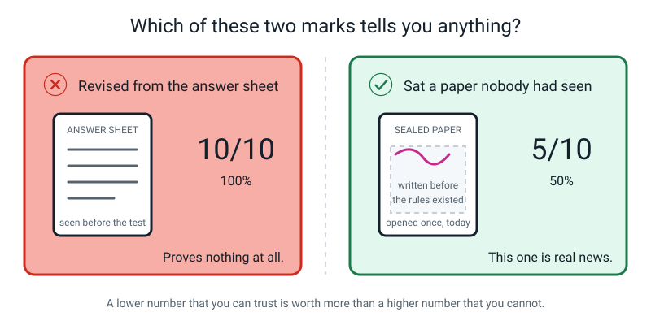
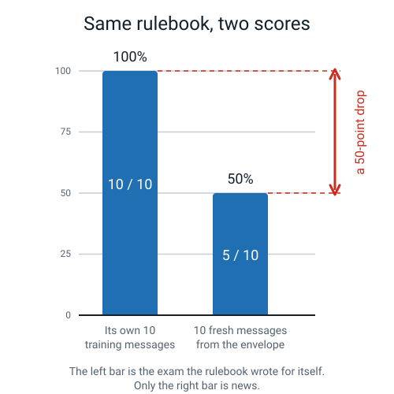
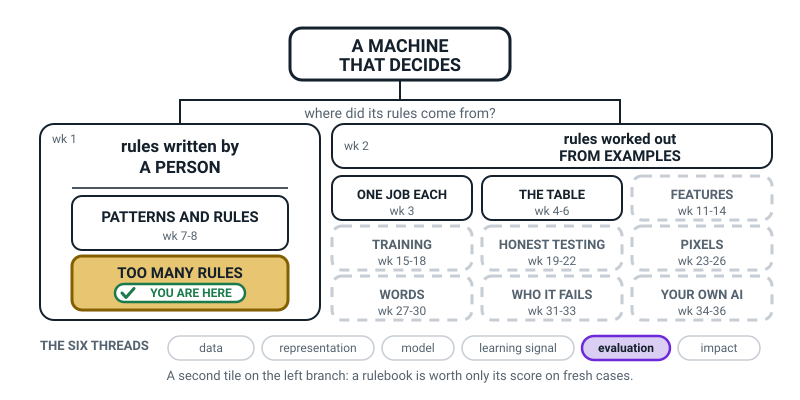

# Week 9 — Term 1 Checkpoint: Rules on Trial

[⬅ Week 8](week-08.md) · [Course Home](../README.md) · [Week 10 ➡](week-10.md) · [Student Guide](../student-guide/week-09.md) · [Workbook](../workbook/week-09.md)

---

## 📋 At a Glance

| | |
|---|---|
| **Duration** | 70 minutes (works in 60, stretches to 75) |
| **Type** | Review — checkpoint |
| **Big idea** | A rulebook scored on the very messages you wrote it from tells you nothing; the honest score is the one you get on messages it has never seen. |
| **New vocabulary** | training examples · fresh examples · accuracy |
| **Materials** | **The sealed, signed envelope from Week 8** · the student's Week 8 rulebook · printed Workbook Week 9 **Build It** pages 9.1–9.5 (plus the optional sections, see Homework) · a board or big sheet · two coloured pens · scissors or a letter opener for the ceremony |
| **Tech needed** | **None.** A calculator is allowed but the long division is the point, so keep it in a drawer. |
| **Prep time** | 15 minutes the night before, 5 minutes on the day |

---

## 🎯 Lesson Objectives

By the end of this lesson the student can:

1. **Explain why scoring a rulebook on its own training examples is cheating**, using the answer-sheet comparison, without being prompted with it.
2. **Compute accuracy three ways** — as a fraction, as a decimal with the division written out, and as a percentage — and say what the bottom number of the fraction tells you.
3. **Compare a training score with a fresh score** and describe the gap in words, without explaining it away.
4. **Recall and use the Term 1 vocabulary** — AI, rules versus learning, data, tables, patterns, rulebooks — closed-book.

Objective 3 is the one that carries the week, and it is mostly about tone. A student who says "50%, and that's the real number" has met it. A student who says "50%, but the messages were unfair" has not, yet.

---

## 🧑‍🏫 What YOU Need to Know First

**Read this once, slowly. About 13 minutes. It is complete — you need nothing else.**

### The one-sentence version

Every number you have computed so far this term has been measured on the same examples the rules were built from, which makes all of them worthless as evidence — and today you replace them with one honest number, which will be much lower and much more useful.

### Part 1 — The two piles

> **Training examples** — the labelled examples you looked at while building your rules. You were allowed to study these.
>
> **Fresh examples** — labelled examples the rulebook has never seen, set aside before any rule was written, used to score it exactly once.

Last week the student wrote a rulebook from ten labelled messages. Those ten are the **training examples**. The ten in the envelope are the **fresh examples** — and crucially, you wrote them before the student's rules existed, so there is no possible way the rules were shaped to fit them.

That sealing ceremony was not theatre for its own sake. It is the physical version of a rule that professional researchers follow, break, and ruin real studies by breaking: **you set the test aside first, and you look at it once.**

### Part 2 — Why a training score is always high, and always meaningless

The student's rulebook scored **10 out of 10** on the training messages. Perfect. And it means nothing whatsoever, for a reason that is easy to say and hard to feel:

**They built those rules by looking at those exact ten messages.** Of course the rules fit. Fitting was the job.


*Figure 9.1 — Sealed in Week 8, opened once, scored once. The sheet beside it is the only place the answers get written.*

Now the comparison that makes the whole idea land:


*Figure 9.2 — Two students, two marks. Only one of those marks is news.*

Imagine two students sit the same test.

- Student A is given the answer sheet the night before, revises from it, and scores 10 out of 10.
- Student B is handed a sealed paper that nobody has seen, and scores 5 out of 10.

**Which mark tells you more about what the student can do?** Student B's, obviously — and it is the lower one. Student A's 100% measures exactly one thing: that A can copy from an answer sheet. It says nothing at all about the next question.

**That is precisely what a training score is.** The rulebook had the answers in front of it while it was being written. 100% measures the student's ability to fit ten rows. It does not measure anything about text messages, or spam, or the world.

Here is the sharpest way to say it to an 11-year-old, and it is worth memorising:

> **"You can always get 100% on a test you wrote after seeing the answers. That number isn't a lie — it's just not about the future."**

### Part 3 — Accuracy, written three ways

> **Accuracy** — the number of correct answers divided by the number of answers you gave. Correct ÷ total.

The same score gets written three ways, and the student needs all three because each one hides something different.


*Figure 9.3 — One score, three costumes. The fraction is the honest one.*

**1. The fraction.** `5/10`. Correct on top, how many you tried on the bottom.

**2. The decimal.** Do the division, on paper, properly:

```
      0.5
    ______
10 )  5.0
      5 0
      ───
        0
```

Ten doesn't go into 5, so write 0 and a decimal point. Ten goes into 50 exactly 5 times. Answer: **0.5**.

**3. The percentage.** Multiply the decimal by 100. `0.5 × 100 = 50`, so **50%**. Read it as: "out of every hundred messages, it would get about fifty right."

**Why insist on all three?** Because the percentage is the one that lies by omission.

- `5/10 = 50%`
- `50/100 = 50%`
- `500/1000 = 50%`

All three are 50%, and they are wildly different amounts of evidence. **The fraction tells you there were only ten tries. The percentage hides it.** This is why good scientific papers report the denominator, and why a headline that says "50% of people prefer…" without saying how many people were asked is doing something dishonest.

Insist on this and it will pay off all year: **never write 50% on its own. Write "5 out of 10 = 50%".**

**And one more thing to know for today: on a two-way choice, 50% is the score of a coin.** Spam or ham is a two-way choice. So a rulebook at 50% is no better than a coin — you could throw it away, flip a coin, and do about as well. Add one line: a coin is the right baseline only when the two answers are about equally common. In the sealed ten, 6 are ham and 4 are spam, so always saying "ham" would score 6 out of 10 = 60%, and the rulebook's 50% is a little worse than that. That is not a rhetorical flourish; it is arithmetic, and the student should hear it plainly.

### Part 4 — Reading the gap, and refusing to explain it away


*Figure 9.4 — 100% on its own ten. 50% on ten it had never seen. The drop is the news.*

```
Training accuracy   10 out of 10  =  1.0   =  100%
Fresh accuracy       5 out of 10  =  0.5   =   50%
The gap                                       50 percentage points
```

**The gap is not a failure. The gap is the measurement.** It is the first genuinely honest piece of information the student has generated about a system they built, and the correct response to it is interest, not comfort.

Which means: **do not soften it.** Your instinct in the room will be to protect the student, and there are four ready-made excuses, all of which will come up. Refuse all four, gently and specifically:

| The excuse | Why it's wrong |
|---|---|
| "Those messages were unfair / trick questions." | Every single one is a message a real phone actually receives. If your rulebook can't handle real messages, that *is* the finding. |
| "I could easily fix it now that I've seen them." | Yes — and then you'd be back to writing rules from messages you've seen, which is where the 100% came from. Fixing using the test is exactly the thing we sealed the envelope to prevent. |
| "Ten messages isn't many." | Completely correct, and the best objection anyone makes. Ten is few, so the 50% has real wobble in it — it could easily really be 30% or 70%, and plausibly anywhere from about 25% to 75%. But notice: it cannot wobble all the way up to 100%. **The gap survives the objection.** |
| "It's only spam, it doesn't matter." | Swap in the medical machine from Week 2's hook and ask again. The mechanism is identical; only the stakes change. |

**The one thing to say when the score comes out low**, and say it early so it doesn't sound like consolation:

> "This number is worth more than the hundred percent was. Fifty percent that you can trust beats a hundred percent that means nothing. You've just done the most professional thing anyone has done in this course so far."

### Part 5 — How to run a checkpoint quiz that produces a list of weeks

The quiz is twelve questions, closed-book, and marked together out loud immediately afterwards. Three design decisions, all of which matter:

**It is closed-book** because the point is to find out what is actually retained, not what can be looked up. Say so honestly: "This isn't to catch you out. It's to find out which weeks need a second visit."

**It is marked out loud, together, immediately.** Not taken away and returned. The student says their answer, you say the model answer, and they mark it themselves. Immediate feedback on a recall test is worth several times a mark scribbled on it three days later.

**Beside every wrong answer, you write the week number, not a cross.** That is the entire trick of this lesson. The output of the quiz is not a score — it is a sentence like *"go back and reread Weeks 5 and 7."* A grade tells the student who they are. A list of weeks tells them what to do.


*Figure 9.5 — The whole term in seven boxes. Use it during marking: point at the box, not at the mistake.*

**Do not compute a total percentage for the quiz.** If the student asks, tell them the number of correct answers out of twelve — they have a right to it — but do not convert it to a percentage or a grade, and say why: *"We're using it as a map, not a mark."*

### The three misconceptions you will meet today

**Misconception 1: "The low score means I'm bad at this."** Almost guaranteed, and the whole lesson can be lost to it in about ninety seconds. Get in first, before the scoring starts, with the framing from Part 4. And say this, which is true: **almost every professional machine learning engineer has watched this exact drop happen, on project after project.** It is not a student thing.

**Misconception 2: "If I fix the rules now, using these ten, then my new score will be honest."** This is the deep one and it is worth spending real time on. Once you have used a set of examples to *decide* something, that set can no longer test you. It has been contaminated. This is why the homework demands five *further* fresh messages — and why the score on those five will be different again, and lower than the fixed rulebook's score on the ten. Expect that, and expect it to be confusing. It is genuinely subtle, and Week 19 gives it a proper machinery.

**Misconception 3: "50% is fine — that's half right."** On a two-way choice it is worthless. Demonstrate rather than argue: flip a coin ten times against their rulebook on the same ten messages and compare. The coin will get roughly five.

### How deep to go — and where to stop

**Go this deep:** training versus fresh examples; the answer-sheet comparison; accuracy as fraction, decimal and percentage with the division shown; the gap read as information; the contamination idea in plain words ("once you've used them to fix things, they're used up").

**Stop before:**

| Do not raise today | Because |
|---|---|
| The words *training set*, *test set*, *validation set*, *hold-out* | **Week 19** is called "The Test You Can't Study For" and does exactly this, properly. Today the plain words "training examples" and "fresh examples" carry the whole idea |
| The word *overfitting* | Week 21. The phenomenon is in front of you today; the label comes later, and lands much harder once they've felt it twice |
| Precision, recall, confusion matrices as named concepts | Level 2. You did the two-by-two grid last week and that is plenty |
| Rule explosion, "why nobody writes 258 rules" | Next week, and next week needs today's 50% as its starting point |
| Splitting data 80/20, cross-validation | Week 19 and beyond |
| Any suggestion that machine learning would fix this | Do not go there today. Week 10 makes the argument properly and it is much stronger if today ends with an unsolved problem |

**End the lesson with the problem open.** Today's job is to establish that the honest number is low. Week 10 asks what to do about it. Resist the urge to comfort with "but machines can do better" — you will spend Week 10's punchline a week early.

### If you have five spare minutes before class

Score the ten sealed messages yourself against the student's rulebook, so you know the answer before the lesson. The trace is in the Answer Key. Doing it by hand takes four minutes and it means you can hold the truths confidently while the student works, instead of reading from a page.

---

### 🧭 The Growing Map

This week the tinted tile moves **down** rather than across: the person's room holds two tiles and the
learner now occupies the second, TOO MANY RULES. The tile above it has turned white and carries its
finished range, wk 7-8. A tile going from tinted to white is the only reward this figure ever hands
out, and it is the first time all year it happens — children do notice.



*Figure 9.0 — Week 9's version. PATTERNS AND RULES has gone white and done (wk 7-8); TOO MANY RULES is
tinted and badged; only **evaluation** is lit, because a checkpoint week has one job.*

**What to do with it, in about two minutes at the end of the lesson:**

1. **Show it and ask:** *"which bit of today is on this map?"* You want the trial, not the quiz — the
   sealed envelope and the five fresh messages. If a learner says "the quiz", accept it warmly and then
   redirect: *"the quiz told me what to reteach; the envelope told you what your rulebook is worth."*
2. **Then the better question:** *"why has the box above us turned white?"* Because Weeks 7 and 8 are
   finished, and finished boxes never get coloured in again. Give them a few seconds to look at it;
   that is the entire payoff of using the same picture thirty-six times.
3. **Have them add it to their own copy** and write their two scores in the margin beside the tile —
   the training score and the fresh score. The gap between those two numbers is what they will still
   remember in March.

> **🧑‍🏫 Why this is worth two minutes.** Checkpoint weeks feel like a pause to a learner, and a pause
> feels like nothing happened. The map flatly contradicts that: a new tile went tinted today. Pointing
> at it beats anything you could say about the value of assessment.

**The six threads** along the bottom are the spine of all four levels, and this week **only
evaluation** is lit. If a learner notices that one lonely pill and asks why, that is the best outcome
available: *"because today was about nothing except scoring things honestly."*

---

## 🧰 Prep Checklist

### 15 minutes the night before

- [ ] **Find the envelope.** Sealed, signed across the flap, unopened, from Week 8. Put it somewhere you cannot forget it. This lesson does not work without it.
- [ ] **Find the student's Week 8 rulebook** (the one they finished in Week 8) and their Week 8 score of 10 out of 10. You need both numbers in front of you.
- [ ] **Print Workbook Week 9.** The workbook opens with Warm-Up, Practice Set A, Practice Set B, Puzzle of the Week and Think Deeper; the **🛠️ Build It** section holds the five pages used in class and for homework; Draw It and Self-Check close it. **The workbook file ends with an Answers section (in a fold-down box) — print the student copy without it.**
  - Page 9.1 — The Sealed Envelope Trial: the ten-row scoring sheet (messages 11–20).
  - Page 9.2 — Accuracy three ways, and the gap: fraction, division, percentage, the two-bar chart to fill in, and the sentence.
  - Page 9.3 — The Term 1 checkpoint quiz (twelve questions). **Keep this face down until minute 40.**
  - Page 9.4 — Term 1 reflection sheet (six prompts).
  - Page 9.5 — Fix your rulebook, then test it honestly: v2 rulebook, v2 re-scored on the original ten, the five further fresh messages (21–25), the two sentences.
- [ ] **Score the ten sealed messages yourself** against the student's rulebook, using the trace in the Answer Key. Four minutes. Then you can run the trial without reading from a script.
- [ ] **Read the twelve quiz answers**, including the "weak answer" notes. You will be marking out loud at speed and you need the model answers in your head, not on a page you're hunting through.
- [ ] **Decide your tone about the 50% now, before the lesson.** Write the sentence you're going to say on a sticky note if it helps. The single biggest risk today is a well-meant "never mind, it's fine" that kills the whole point.

### 5 minutes on the day

- [ ] Envelope on the table, in plain sight, still sealed.
- [ ] Week 8 rulebook and the 10 out of 10 beside it.
- [ ] Workbook Pages 9.1, 9.2, 9.4 out. **Page 9.3 face down. Page 9.5 out of sight.** The Warm-Up through Think Deeper sections are not used in class.
- [ ] Board wiped, with room for two bars and a long division.
- [ ] Calculator put away in a drawer, deliberately.

### If something fails

| If this fails | Do this instead |
|---|---|
| **The envelope is lost** | Rewrite the ten messages from the list in Week 8's Answer Key, on a fresh sheet — and **tell the student you rewrote them, plainly.** The exercise runs entirely on trust and a quiet substitution poisons it. Then say the honest thing: "You'll have to take my word that I didn't change them after seeing your rules. Next time we'll keep the envelope better." |
| **The student's rulebook is lost** | Use the model rulebook from Week 8's key — the `!!` / `free` / 30-characters book. Say it's a stand-in. Everything downstream works identically. |
| **The student peeked at the envelope** | Do not make it a moral event. Say the true thing: "Then this test can't measure anything, because your rules might have been shaped by it. That's called contaminating your test — real scientists wreck real studies this way." Then use the five homework messages as today's fresh set instead, and set different homework. |
| **They finish the quiz in four minutes with one-word answers** | Accept it and mark it as written. Then, during marking, ask the follow-up question printed with each answer. The follow-ups are where the real assessment lives. |
| **The quiz collapses into distress** | Stop the quiz. Genuinely — stop it. Switch to the concept map (Figure 9.5) and go through the seven boxes together, out loud, as a conversation. You will get most of the same information about what's retained, and the retained information is the actual goal. |
| **You are out of time at minute 60** | Cut the quiz to six questions: 1, 5, 7, 9, 11, 12. That set covers all seven boxes of the concept map. Never cut the envelope trial. |

---

## ⏱️ The Lesson, Minute by Minute

| Minutes | Segment | What happens |
|---|---|---|
| 0–8 | 🪝 **Hook** — the envelope, unopened | The student predicts their score, in writing, before anything is opened. |
| 8–26 | 🧠 **Concept** — Two piles, and one honest number | Training versus fresh examples · the answer sheet · accuracy three ways. |
| 26–40 | 🔍 **Worked Example Together** — The Sealed Envelope Trial | Open it. Score ten rows mechanically. Compute the three forms. Draw the gap. |
| 40–60 | 🎲 **Activity** — The Term 1 checkpoint quiz | Twelve questions closed-book, then marked out loud with week numbers. |
| 60–70 | 🔑 **Wrap & Assign** | The concept map, the list of weeks, the reflection sheet, the homework. |

**Running 60 minutes?** Cut the quiz to six questions (1, 5, 7, 9, 11, 12) and the wrap to 6 minutes. **Never cut the envelope trial** — everything else this term was preparation for those fourteen minutes.
**Running 75?** Add the coin-flip demonstration from Differentiation, and have the student write their own thirteenth quiz question with a model answer, which is a genuinely hard and revealing task.

---

### 🪝 Hook — the envelope, unopened (0–8)

**Do this:** put the sealed envelope on the table between you. Both signatures visible. Do not touch it again for four minutes.

**Say this:**

> "There it is. Ten messages. I wrote them the night before last week's lesson, which means I wrote them **before your rules existed** — so there is no way on earth your rulebook was built to fit these. That's the whole reason we sealed it.
>
> Your rulebook got ten out of ten last week. Perfect score. I want you to look at that ten out of ten, and then look at this envelope, and answer me one question — in writing, on the top of your page, before we open anything."

**Do this:** have them write a number on Workbook Page 9.1, in the box marked *my prediction*, and read it out.

**Ask this:**

| Ask | Hoping for | If they say something else |
|---|---|---|
| "Out of ten, what do you think you'll get?" | Anything from 5 to 9. Most predict 8 or 9 | If they say 10, don't argue — write it down and let the lesson do the work. If they say 2, ask why so low; sometimes a student has already spotted the problem, and that deserves loud praise. |
| "Why not ten, if you got ten last week?" | "Because these are different messages" — this is the seed of the whole lesson | If they can't say why, that's fine. Say: "Hold the question. In fifteen minutes you'll have a name for it." |
| "Would you like to change your rules before we open it?" | "…Can I?" | **This is a trap question and you should say so.** The answer is no, and the reason is the lesson: "If I let you change your rules now — before scoring, but after knowing you're about to be tested — you'd be tuning them for a test. That's the thing the envelope exists to prevent." |

**Say this:**

> "One more thing, and I want to say it before we open anything rather than afterwards, so it doesn't sound like a consolation prize.
>
> **The number we get in a minute is going to be lower than ten, and that is good news.** It's the first honest number you've produced all term. Every score you've written down since Week 4 has been measured on the same examples you built the thing from, which makes them all worthless as evidence — mine included. In about twenty minutes you'll have one number you can actually trust, and it will be a low one, and it'll be worth more than all the high ones put together."

---

### 🧠 Concept — Two piles, and one honest number (8–26)

#### Part A — The two piles (6 minutes)

**Do this:** draw two boxes on the board, well apart. Label the left one TRAINING EXAMPLES and the right one FRESH EXAMPLES. Write "10 messages, you studied them" under the left, and "10 messages, sealed" under the right.

**Say this:**

> "Two piles, and they have jobs that must never be swapped.
>
> The pile on the left is your **training examples** — the ten labelled messages you were allowed to stare at while writing your rules. Studying them was the *point*. That's where the counting and the tallying happened.
>
> The pile on the right is your **fresh examples** — messages the rulebook has never seen, set aside before a single rule existed, to be scored exactly once.
>
> And here's the rule that makes the whole thing work: **you look at the right-hand pile once, at the end, and you never use it to make decisions.** The moment you use it to fix something, it stops being able to test anything, because now your rules have been shaped by it too."

**Ask this:**

| Ask | Hoping for | If they say something else |
|---|---|---|
| "Why did I have to write those ten *before* you wrote your rules?" | "So you couldn't make them attack my rules on purpose" — an excellent and slightly suspicious answer | If they don't get there, offer the reverse: "If I'd written them *after* reading your rules, what would I have written?" Five messages that break each rule. **Which is exactly what I did last week with the breakers — and those weren't a fair test, they were an attack.** Distinguishing the two is real understanding. |
| "Why can I only score them once?" | "Because after that I know what's in them" | If stuck: "Suppose you score them, change a rule, and score again. And again. What are you actually doing?" Slowly turning the fresh pile into a training pile. |

#### Part B — Why 100% meant nothing (6 minutes)

**Do this:** draw the two-student comparison on the board as two columns. Student A with an answer sheet. Student B with a sealed paper.


*Figure 9.6 — The finished board. The lower mark is the useful one.*

**Say this:**

> "Two students, same test.
>
> Student A gets given the answer sheet the night before. Revises from it. Scores ten out of ten.
>
> Student B gets handed a sealed paper nobody's seen. Scores five out of ten.
>
> **Which one would you rather have doing your maths homework?**"

Let them answer. They will say B, immediately and confidently. Then:

**Say this:**

> "Right. And now the uncomfortable bit. **Last week you were student A.**
>
> You had the ten messages in front of you *with the answers written next to them* while you wrote your rules. So the rules fitted. They fitted because fitting was the job. The ten out of ten measures one single thing: that you can write three rules that fit ten rows you're looking at. It doesn't say anything about text messages, or about spam, or about tomorrow.
>
> **You can always get 100% on a test you write after seeing the answers.** That number isn't a lie. It's just not about the future."

**Ask this:**

| Ask | Hoping for | If they say something else |
|---|---|---|
| "So was your ten out of ten a lie?" | "No, just not useful" | If they say yes, correct it precisely: it's a true fact about a useless question. Precision matters here — we're not accusing anybody of cheating, we're saying the measurement was pointed at the wrong thing. |
| "Where else do people do this by accident?" | Anything real — testing a revision method on the questions you revised, tasting soup you already seasoned | Good answers are worth a lot here. If stuck, offer: a friend who says their lucky socks work, and only ever checks on days they wore them. |

#### Part C — Accuracy, three ways (6 minutes)

**Do this:** define it, then do the division on the board with the working showing. Calculator stays in the drawer.

**Say this:**

> "One word first. **Accuracy** is the number you got right, divided by the number you tried. Correct over total. That's all it is.
>
> And we're going to write it three ways every single time, because each way hides something different."

**Do this:** write all three, in order, on the board.

```
1. THE FRACTION          5
                        ──      correct on top, how many you tried underneath
                        10

2. THE DIVISION            0.5
                         ______
                     10 )  5.0
                           5 0
                           ───
                             0

3. THE PERCENTAGE        0.5 x 100 = 50%
```


*Figure 9.7 — Write all three, in this order, every time.*

**Say this:**

> "Now here's why I'm making you write all three, and it's not to be annoying.
>
> Five out of ten is fifty percent. Fifty out of a hundred is fifty percent. Five hundred out of a thousand is fifty percent. **Same percentage. Wildly different amounts of evidence.**
>
> The fraction tells you there were only ten tries. The percentage hides it completely. That's why careful scientists write the bottom number down, and why a headline saying 'fifty percent of people prefer this' without saying how many people were asked is doing something a bit dishonest.
>
> So the rule, for the rest of this course: **never write fifty percent on its own. Write five out of ten equals fifty percent.**
>
> And one more thing you need before we open that envelope. Spam or ham is a **two-way** choice. So what does a coin get?"

**Ask this:**

| Ask | Hoping for | If they say something else |
|---|---|---|
| "What does a coin score on a two-way choice?" | "Half. 50%." | If unsure, do it: flip ten times, guess spam/ham, count. It lands near five. |
| "So what's a rulebook worth if it scores 50% on spam?" | "Nothing" | This will land hard in about four minutes. Don't dwell — just plant it: "Remember that number: fifty is the coin." |
| "Which is better — 5 out of 10, or 45 out of 100?" | 45/100 is 45%, which is *lower*, but it's much more evidence | **A brilliant argument to have if they engage with it.** The honest answer: the 45% is a more trustworthy measurement of something slightly worse. Most students say 5/10 because 50 > 45. Anyone who hesitates has understood the denominator. |

---

### 🔍 Worked Example Together — The Sealed Envelope Trial (26–40)

This is the heart of the lesson. Fourteen minutes, ten rows, no shortcuts.

**Do this:** slide the envelope over. Let *them* open it. Check the signatures together first — genuinely check them, out loud. Then unfold the sheet and lay it face down beside the scoring sheet.

**Say this:**

> "Rules for the next ten minutes, and they're strict.
>
> **One row at a time, in order, no skipping.** You don't get to look ahead and pick the easy ones.
>
> **For each message: which rule fires first, and what does the rulebook say?** You write that down *before* I tell you the truth.
>
> **You are the computer, not the judge** — same as last week. If your rules say something daft, you write the daft thing down.
>
> And the last one, which is the hardest. **No changing the rules.** Not one word, not for ten minutes. If you spot a fix halfway through, write it in the margin and keep going. We'll use it for homework."


*Figure 9.8 — The scoring sheet. Ten rows, filled one at a time.*

**Do this:** work through all ten. You hold the truths. They write the prediction, then you reveal, then they mark. Roughly 45 seconds a row.

The full trace, for you to hold:

| # | message | First rule | Says | Truth | ✓/✗ |
|---|---|---|---|---|---|
| 11 | `Reminder: dentist at 4pm` | DEFAULT | ham | ham | ✅ |
| 12 | `WINTER SALE! 70% off everything` | RULE 3 (31 chars) | spam | spam | ✅ |
| 13 | `I won the match!! So happy` | RULE 1 (`!!`) | spam | **ham** | ❌ |
| 14 | `Are you free after school?` | RULE 2 (`free`) | spam | **ham** | ❌ |
| 15 | `Verify your account now` | DEFAULT | ham | **spam** | ❌ |
| 16 | `Click the link I sent for the project` | RULE 3 (37 chars) | spam | **ham** | ❌ |
| 17 | `U have won 5000!! Reply CLAIM` | RULE 1 (`!!`) | spam | spam | ✅ |
| 18 | `whats the answer to q7` | DEFAULT | ham | ham | ✅ |
| 19 | `Congratulations on your exam results!` | RULE 3 (37 chars) | spam | **ham** | ❌ |
| 20 | `Your parcel could not be delivered, click here` | RULE 3 (46 chars) | spam | spam | ✅ |

**Score: 5 out of 10.**

**Do this — the three forms, on the board, in the student's handwriting:**

```
Fresh accuracy  =  5 out of 10  =  5/10  =  0.5  =  50%
Training accuracy = 10 out of 10 = 10/10 =  1.0  = 100%
The gap                                            50 percentage points
```

**Do this — draw the two bars.** Two bars, side by side, one at 100 and one at 50, with an arrow between them labelled *a 50-point drop*.


*Figure 9.9 — Draw this. Then say the sentence under it out loud.*

**Say this — and this is the most important thing you will say this term:**

> "Look at those two bars. **Same rulebook. Same week. Same three rules, unchanged.** One number is a hundred, one is fifty.
>
> The left bar is the exam your rulebook wrote for itself after reading the answers. The right bar is the only news in the room.
>
> And remember what fifty means on a two-way choice. It means a coin. **Your rulebook, right now, is worth about as much as flipping a coin ten times** — which is the most useful thing you've found out all term, and you could not possibly have found it out any other way."

**Do this:** count the two error types separately, using last week's grid.

- **False alarms (real messages marked spam): 4** — #13, #14, #16, #19
- **Misses (spam marked ham): 1** — #15
- **Scams correctly caught: 2** — #17, #20

**Ask this:**

| Ask | Hoping for | If they say something else |
|---|---|---|
| "Which error did you make more of?" | "False alarms — four of them" | If they've merged them, go back to the grid from last week and fill it in for these ten. |
| "So what actually happened to your friends' messages?" | "Four of them got binned" | Read the four out loud, by name: the match, the free period, the project link, the exam congratulations. **Four real messages from real people, gone.** Specifics land; counts don't. |
| "Message 12 was right. Was it right for a good reason?" | "It was just long" | **This is the best question in the segment.** `WINTER SALE! 70% off everything` is 31 characters, so Rule 3 fired. Nothing about the *message* was detected. One word shorter and it's a miss. **A right answer built on a coincidence will betray you the moment the coincidence stops.** |
| "You predicted 8 or 9. You got 5. What does the difference tell you?" | Anything honest | The useful framing: your prediction was a measure of how much you trusted a number that couldn't be trusted. Everybody does this. Professionals do this. |

> **🧑‍🏫 If the student gets upset:** stop scoring and say this. "Almost everyone who builds these systems for a living has watched this exact drop, on project after project. There's a whole job title for the people who measure it. You are not bad at this — you have just done the honest version, which most people avoid because it feels like this."

---

### 🎲 Activity — The Term 1 checkpoint quiz (40–60)

Full instructions in the next section. Twelve questions, closed-book, twelve minutes, then eight minutes marking out loud with week numbers in the margin.

**Do this at minute 40:** turn Page 9.3 face up. Put everything else — workbook, notes, the concept map — out of reach and out of sight.

**Say this:**

> "Twelve questions. Closed book — nothing on the desk but this and a pen.
>
> And I want to be straight with you about what this is for, because it isn't a grade and I'm not going to turn it into one. **The output of this quiz is a list of weeks.** Every question has a week number attached. Where you're solid, we move on. Where you're not, I write a number in the margin and that's a week we go back to.
>
> If you don't know one, write 'don't know' and move on. That's genuinely more useful to me than a guess, because a guess tells me you don't know *and* hides which bit is missing."

---

### 🔑 Wrap & Assign (60–70)

**Do this:** put the concept map (Figure 9.10) between you, and the marked quiz beside it.


*Figure 9.10 — Seven boxes. Read them out in order, and let the student finish each sentence.*

**Say this:**

> "Nine weeks, seven ideas, one page. Let me read them and you finish them.
>
> **Week 1.** AI is a machine doing a job that used to need a person's… judgement.
>
> **Week 2.** Two ways to get an answer: a person writes the rule, or the machine finds the rule from… examples.
>
> **Week 4.** Everything a machine knows arrived as a… table. One row is one thing, one column is one measurement.
>
> **Weeks 5 and 6.** Tables are messy, and they came from somewhere. You count the mess and you write the… data card.
>
> **Week 7.** A pattern is something that repeats often enough that betting on it beats… guessing. And you find it by… counting.
>
> **Weeks 7 and 8.** A rulebook is rules in order plus a default — and every rule has… edge cases.
>
> **Week 9. Today.** The only honest score comes from examples the rulebook has never… seen."

**Do this:** write the list of weeks on the reflection sheet — the actual output of the quiz. It should look like a to-do list, not a report card:

```
GO BACK TO:  Week 5 (data types),  Week 7 (rates not counts)
SOLID:       Weeks 1, 2, 4, 6, 8
```

**Say this:**

> "That's what today produced. Not a mark — two weeks to reread, and I'll ask you about both of them again in a fortnight.
>
> And one last thing, about the fifty percent. **Next week we do something about it.** You're going to try to fix the rulebook — properly, with patches — and you're going to count how many rules it takes and how much the score actually improves. I'll tell you now that the answer surprises people. Don't fix it tonight beyond what the homework asks."

**Do this:** fill in the vocabulary box together.

| Word | The definition you're steering to |
|---|---|
| **training examples** | The labelled examples you looked at while building your rules |
| **fresh examples** | Labelled examples the rulebook has never seen, used to score it once |
| **accuracy** | Correct answers divided by total answers |

Then assign the homework as written below.

---

## 🎲 The Activity, In Full

This week's activity has two parts. Part 1 happened in the Worked Example slot, because it needs your hand on it the whole time; Part 2 is the quiz.

### Part 1 — The Sealed Envelope Trial

**Time:** 14 minutes (in the 26–40 slot)
**The point:** to produce one number that can be trusted, by a procedure the student can see is fair.

**Materials:** the sealed envelope · the student's Week 8 rulebook · Workbook Week 9 Page 9.1 (the ten-row scoring sheet) · Page 9.2 (accuracy three ways and the bar chart)

**Setup (1 minute).** Check the signatures. Let the student open it. Lay the message sheet face down; you read from it, they never see ahead.

**The four rules, said out loud before starting:**

1. One row at a time, in order, no skipping.
2. Write the prediction *before* the truth is revealed.
3. You are the computer, not the judge.
4. **No changing the rules for ten minutes.** Fixes go in the margin.

**What "finished" looks like:**

- Ten rows filled, each naming the first rule that fired
- A score written as a fraction, a decimal *with the division shown*, and a percentage
- The training score written beside it and the gap computed
- Two bars drawn, with the drop arrowed
- False alarms and misses counted separately (4 and 1)
- At least one fix written in the margin, unapplied

**Variation — easier:** cut to messages 11, 13, 15, 17, 19 — five rows. The score is 2 out of 5 = 40%, and the shape of the finding is identical. Do the long division as 2 ÷ 5 = 0.4.

**Variation — harder:** before revealing each truth, have them predict *both* what the rulebook will say **and** what the truth is. Two predictions per row. At the end they have two scores: the rulebook's 5 out of 10, and their own — which will be 9 or 10 out of 10. **The student is far better at this task than their own rulebook, and quantifying that gap is a genuinely sophisticated exercise.** It also sets up Week 10 beautifully: you can do this instantly and you cannot write down how.

### Part 2 — The twelve-question checkpoint quiz

**Time:** 20 minutes — 12 writing, 8 marking out loud
**Group size:** 1 student, alone, silent, closed book

**Setup (1 minute).** Everything off the desk except Page 9.3 and a pen. Concept map turned over. Workbook out of reach. Say the framing: *this produces a list of weeks, not a grade.*

**The twelve questions** (full answers in the Answer Key):

1. What makes something count as AI, rather than just a machine following orders? **[W1]**
2. Is a pocket calculator AI? Answer yes or no and give your reason. **[W1]**
3. There are two ways to get a computer to answer a question. In one, a person writes the rule. In the other, what does the machine get instead? **[W2]**
4. What is a labelled example? Give one. **[W2, W8]**
5. In a table of data, what does one row represent? **[W4]**
6. `bus_route_number` is a column full of numbers. Should you ever average it? Why? **[W5]**
7. A sleep column has an empty box. Why must you not write 0 in it? **[W5]**
8. Name two of the questions you should ask about where a dataset came from. **[W6]**
9. Finish the definition: a pattern is something that repeats often enough that… **[W7]**
10. Mondays: 3 days, 3 late. Not-Mondays: 11 days, 3 late. Which is the stronger pattern, and how do you know? **[W7]**
11. What is the difference between a false alarm and a miss? Give a person who is harmed by each. **[W8]**
12. Your rulebook scores 100% on the ten messages you wrote it from. Why does that number prove nothing? **[W9]**

**Marking, out loud, together (8 minutes).** For each question: they read their answer, you read the model answer, **they** mark it. For every one that isn't right, **you write the week number in the margin — not a cross.**

At the end, gather the week numbers into a list. That list is the output.

**Do not compute a percentage.** If they ask for their score, give the count out of twelve and say why you're not turning it into a grade.

**Variation — easier:** ask all twelve orally, as a conversation, and write the answers yourself. You lose the recall-under-pressure element and you keep everything else that matters.

**Variation — harder:** after marking, have them write a thirteenth question with a model answer, for a week of their choosing. Writing a good question is much harder than answering one, and what they choose to ask tells you what they actually understood.

---

## ❓ Questions Students Ask This Week

**"So all the scores I've written down this term were fake?"**
Not fake — just not evidence about the future. They were honest measurements of the wrong thing. A training score genuinely tells you one useful thing: that your rules are consistent with the examples you had. If a rulebook can't even fit its own training examples, something is badly wrong. It just cannot tell you how the rulebook will do on tomorrow's messages, and tomorrow's messages are the whole reason you built it.

**"Ten messages isn't very many. Isn't my 50% unreliable too?"**
Yes, and it is the best objection anyone raises today, so I want to answer it properly. Ten is few. If we'd sealed a different ten you might easily have got 3 or 7 instead of 5. So the true value is somewhere in a fuzzy band — roughly 25% to 75%. **But notice what the objection can't do: it can't get you back to 100%.** The gap between the two bars is much bigger than the wobble in either bar. That's why the finding survives. And the fix is exactly what you'd guess: more fresh examples. A hundred would give a much tighter answer, and it would take you an hour to write them.

**"Can't I just fix the rules now that I know what went wrong?"**
You can, and you should — that's your homework. But here's the sting, and it's the subtle bit: **once you've used those ten to decide what to fix, they can't test you any more.** Your new score on them will be higher, and it'll be dishonest in exactly the way the 100% was dishonest. That's why the homework makes you score the fixed rulebook on five *further* messages you haven't used for anything. And it's why professional teams keep a set of examples locked away that nobody is allowed to look at for months.

**"Why is 50% bad? That's half."**
Because there were only two possible answers. Spam or ham. A coin gets half. So your rulebook is doing about as well as a coin (and slightly worse than always saying "ham", which would score 6 out of 10 here), which means all the counting and rule-writing bought you nothing measurable — on these ten. If there were ten possible answers instead of two, 50% would be quite impressive, because a coin-equivalent would get 10%. **What "good" means depends entirely on how many choices there were**, and that's an idea we come back to properly in Week 20.

**"Would a real spam filter do better?"**
Enormously. Real ones catch well over 99% of spam. And the reason isn't cleverer rules — it's that they learned from millions of labelled messages instead of your ten, and they look at every word in the message at once instead of three clues. That's the trade we look at next week: stop writing rules, start collecting examples. Today's 50% is the reason that trade is worth making, so hold on to it.

**"What score should I have got, honestly? What's a good score?"**
**Nobody can tell you, and here's why that isn't me dodging.** "Good" only means something compared to something else. Compared to a coin, 50% is worthless. Compared to a rulebook you wrote in twenty minutes with three clues on ten examples, 50% is roughly what should have happened. Compared to a real filter, it's dreadful. There is no absolute scale of good scores anywhere in this subject — every score is a comparison, and if somebody quotes you an accuracy without saying what they're comparing it to, you should ask. Week 20 is entirely about people quoting numbers that sound good and mean nothing.

**"Do professional researchers actually get this wrong?"**
Yes, regularly, and it ruins real work. It has a name — contaminating your test set — and it usually happens by accident: somebody peeks at the locked-away examples "just to check something", or tunes their system twenty times against the same test until it fits that test specifically. Some published results have been doubted for it. Medical AI systems have been announced with brilliant scores and then done much worse in hospitals, partly for reasons like this and partly because real patients, scanners and hospitals differ from the test set (the more common cause). **The envelope on our table today is a small version of the most important procedural rule in the whole field**, and you've now done it properly once, which is more than some published studies manage.

---

## ⚠️ Where This Lesson Goes Wrong

| What happens | Why | What to do right now |
|---|---|---|
| The 50% lands as a personal failure and the student shuts down | It looks exactly like a bad test result, because it looks exactly like a bad test result | Get in first — say the "this number is worth more than the hundred was" line *before* opening the envelope, not after. If it happens anyway, stop and say the true thing: almost every professional has watched this drop on project after project. Then hand them the count of false alarms to do, which is a task, and tasks re-engage. |
| They start fixing the rules mid-trial | The fixes are obvious and it feels stupid not to | "Margin. Write it in the margin." Enforce it every single time, warmly. Then make a point of using their margin notes in the homework brief, so the impulse gets rewarded in the right place. |
| They argue the messages were unfair | Some of them do feel like traps | Take each one and ask: "Could that arrive on a real phone?" All ten can. Then the honest concession: yes, I chose ten *interesting* messages rather than ten boring ones. Ten boring ones would have scored higher and taught nothing. |
| The percentage becomes the whole lesson and the fraction is dropped | Percentages feel more grown-up | Refuse to accept a bare percentage all lesson. Every time they say "fifty percent", say "out of?" until they add it automatically. It takes about four repetitions. |
| The quiz turns into a grade despite everything | Nine weeks of school conditioning | Physically do not write a total anywhere on the page. Write only week numbers. If they compute the total themselves, let them, and then ask the better question: "Which two weeks are on your list?" |
| They can't recall Week 5 or 6 material at all | It's four weeks ago and it was the driest fortnight of the term | This is exactly what the quiz is for, and it is not a disaster. Write the week numbers, put them on the list, and move on cheerfully. Do not reteach during marking — you will lose the wrap and the homework. |
| You run over and skip the concept map | The trial always takes longer than fourteen minutes | The concept map is the cheapest way to spend three minutes in this whole term. Cut two quiz questions instead. |
| They score 8 or 9 out of 10 on the fresh messages | Possible if they wrote a very different rulebook — some genuinely score higher | Don't fake a drop. Say the honest thing: "Your rulebook held up better than mine would have. Now tell me which rule earned that, and whether it was luck." Then use the ten-messages-isn't-many argument in the other direction: a high score on ten is also weak evidence. **The lesson is about the size of the gap and the trustworthiness of the measurement, not about being wrong.** |

---

## 🧭 Differentiation

### If they are struggling

**Cut:** the quiz to six questions (1, 5, 7, 9, 11, 12 — one per concept-map box). Cut the accuracy section to the fraction and the percentage, skipping the long division if it's a barrier. Keep the trial at full length.

**Reteach like this:** teach the whole idea with no numbers at all, using only the two-students story, until they can tell it back to you. Then and only then attach it to their rulebook. The arithmetic is not the difficulty here — the *idea that a high score can be worthless* is genuinely counterintuitive and needs the story to hang on.

**Reduce the load:** you fill in the scoring sheet while they call out the rule numbers. Five rows instead of ten. Give them the false-alarm and miss counts and have them only explain what each means.

**The minimum acceptable outcome for today:** they can say that scoring on the examples you wrote the rules from doesn't count, they can write one accuracy as a fraction and a percentage, and they can say that 5 out of 10 is what a coin gets. That's the week.

### If they are flying

1. **The coin-flip experiment.** Flip a coin ten times, calling spam for heads. Score it against the ten sealed messages. It will land near 5. Then: *"Your rulebook and a coin scored the same. Does that mean your rulebook does nothing?"* The honest answer is subtle and worth chasing: it got the same *total* but a completely different *pattern* of errors — 4 false alarms and 1 miss, where a coin would spread them evenly. **Same accuracy, different behaviour.** That is a Week 20 idea arriving eleven weeks early.
2. **"How many fresh messages would you need to trust the number?"** There's no exact answer at this level, and the reasoning is the prize. Push for the shape of it: with 10 you could be 20 points out; with 100 you'd be much tighter; with 1000, tighter still. Then the practical sting: who writes and labels a thousand messages, and how long does that take?
3. **The prediction gap.** They predicted 8 or 9 and got 5. Ask them to write two sentences on *why* they predicted high. The real answer — "because the only number I had was 100%" — is a genuine insight about how misleading a bad measurement is even to the person who made it.
4. **"Message 12 was right for the wrong reason. Find any others."** Message 17 (`U have won 5000!! Reply CLAIM`) fires on `!!`, which is a reasonable spam signal, so that one's honest. Message 20 fires on length — 46 characters — which is again just length. **So two of the three correct spam catches were length coincidences.** Genuinely: only one of the five correct answers was right for a good reason. That's a devastating and completely fair finding.
5. **Write the thirteenth quiz question**, with a model answer and a week number. Then ask why they chose that week.

### If they won't engage today

**Make the envelope the whole lesson.** Skip the quiz entirely — write on your notes that it moves to next week's first ten minutes. The trial is the part that cannot be skipped and it has natural drama built in.

**Turn it into a bet.** "I'll bet you a point that you score below eight. Write your prediction. If you beat it, you win." Betting on your own score is genuinely engaging and it makes the prediction-versus-reality gap personal rather than academic.

**Or run it as a courtroom.** The rulebook is on trial; the ten messages are the witnesses; the student is the defence and you're the prosecution. Read each message as a piece of evidence. Silly, effective, and it fits the week's title exactly.

**Do not skip:** opening the envelope and computing the two numbers side by side. Everything else this week is optional.

---

## ✅ Assessing Understanding

Do these in the last five minutes. Exact wording below.

### Check 1 — Why the training score doesn't count (60 seconds)

> "In one sentence: why doesn't your ten out of ten from last week count?"

**A good answer looks like:** "Because I wrote the rules while looking at those exact messages and their answers, so of course they fit."
**A weak answer looks like:** "Because it was easy" or "because those messages were simple." Push: *"What did you have in front of you while you were writing the rules?"* You want them to name the answers.

### Check 2 — Accuracy three ways (60 seconds)

> "You got 7 right out of 8. Write it as a fraction, a decimal and a percentage."

**A good answer looks like:** `7/8`, then the division `7 ÷ 8 = 0.875`, then `87.5%`.
**A weak answer looks like:** jumping straight to a percentage, or writing `0.875` without showing where it came from. Accept rounding to 88% if they say they're rounding.

**Bonus follow-up if they nail it:** *"Which of those three tells me you only tried eight times?"* Answer: only the fraction.

### Check 3 — Reading the gap (45 seconds)

> "A rulebook scores 100% on its training examples and 50% on fresh ones. What does the gap tell you, and which number would you put on a poster?"

**A good answer looks like:** "The gap says it only works on the examples it was built from. I'd put the 50% on the poster, because that's the honest one."
**A weak answer looks like:** "It got worse" or picking the 100%. Reteach with the two-students story, which usually fixes it in thirty seconds.

### Mastery scale for this week

| Level | What it looks like |
|---|---|
| **1 — Not yet** | Thinks the 100% was the real score. Cannot say why the fresh test is different. Writes bare percentages with no fraction. |
| **2 — Emerging** | Can repeat that training scores don't count, but explains it as "the messages were harder" rather than "I saw the answers". Computes accuracy with help. |
| **3 — Secure** | Explains the answer-sheet problem in their own words. Writes accuracy three ways with the division shown. Scores the ten mechanically without changing rules. States the gap in words. **Target for Week 9.** |
| **4 — Strong** | Also counts false alarms and misses separately and says which mattered. Says unprompted that 50% is a coin on a two-way choice. Notices that a correct answer came from a length coincidence. |
| **5 — Exceptional** | Argues that fixing the rulebook using the sealed ten would contaminate them. Raises the "ten isn't many" objection *and* explains why the gap survives it. Asks how many fresh examples would be enough. |

---

## 📤 Homework to Assign

**Workbook Week 9, Page 9.4 (reflection sheet) and Page 9.5 (fix your rulebook).** Pages 9.1–9.3 are done in class (the trial, the arithmetic, the quiz); nothing about that split has changed.
**Time: 45–60 minutes across the week.**

**The rest of the workbook is optional.** Warm-Up, Practice Set A, Practice Set B, Puzzle of the Week, Think Deeper, Draw It and Self-Check are not part of the lesson plan and are not needed for the 45–60 minutes above. If the student wants more, the sensible order is Warm-Up and Practice Set A first (vocabulary and the arithmetic, about 15 minutes), then Draw It; keep Practice Set B, the Puzzle and Think Deeper for a student who is flying, or for next week's first ten minutes. Self-Check takes two minutes and is worth doing last. Their answers are in the Answer Key below.

**Say this:**

> "Two jobs, and one of them needs you to be honest when nobody's watching.
>
> **Page 9.4 is the Term 1 reflection sheet.** Six short questions about the last nine weeks — what stuck, what didn't, which week you'd redo, and what you want to build at the AI fair in Week 34. It's not a test and there are no wrong answers. The two weeks on your list from today go at the top.
>
> **Page 9.5 is the real job. Fix your rulebook.**
>
> Use the notes you wrote in the margin during the trial. Change your rules — tighten them, add a condition, move the threshold, add a rule that says ham. Write the new rulebook out in full and **write the date next to it in pen.**
>
> Then, and only then, turn over to the five messages at the bottom of Page 9.5. **Five more fresh messages you've never seen and never used for anything.** Score your fixed rulebook on those five. Fraction, decimal, percentage — all three, with the division shown.
>
> Then two sentences, and these are the ones I'll read first:
>
> **Which fix helped?** And **which fix broke something that used to work?** Because at least one of them will have. Go back and check your fixed rulebook against the original ten training messages too — if it now gets one of those wrong, that's the answer to the second question, and it's the most interesting thing on the page.
>
> And now the honesty bit. **The five messages are printed right there and I'm not going to be in the room.** If you read them before you write your fix, you'll get a lovely score and learn absolutely nothing, and I won't be able to tell. That's called contaminating your test set. Real researchers do it by accident and it wrecks real studies. So: fix first, date it, *then* turn over. I'm trusting you, and the whole thing only works if the trust is deserved."

**What to check when it comes in:** the fixed rulebook is written out in full and dated; the five-message score is written all three ways with the division shown; the "which fix broke something" answer names a specific message that used to be right and now isn't; and the fix is genuinely dated before the scoring. If the score on the five is high and the "what broke" answer is blank, ask them to walk you through the original ten — that conversation resolves it in two minutes without any accusation.

---

## 🔑 Answer Key

### Where each workbook section is answered

| Workbook section | Items | Answered under |
|---|---|---|
| ✅ Warm-Up | W1–W5 | Warm-Up, Practice Sets, Puzzle, Think Deeper, Draw It, Self-Check (at the end of this key) |
| ✍️ Practice Set A | A1–A6 | same |
| ✍️ Practice Set B | B1–B5 | same |
| 🧩 Puzzle of the Week | P1–P6 | same |
| 🤔 Think Deeper | T1–T2 | same |
| 🛠️ Build It, Pages 9.1, 9.2 | prediction, scoring sheet, totals, three-ways arithmetic, gap, bar chart, sentence | The Sealed Envelope Trial, and Workbook Page 9.1 and 9.2 |
| 🛠️ Build It, Page 9.3 | twelve quiz questions | The twelve quiz questions |
| 🛠️ Build It, Page 9.4 | six reflection prompts | Workbook Page 9.4 |
| 🛠️ Build It, Page 9.5 | v2 rulebook, v2 on the original ten, five fresh messages, two sentences | Workbook Page 9.5 |
| 🎨 Draw It, 📊 Self-Check | drawing and three boxes; self-rating | end of this key |

There is no "fix the broken program" section this week, and no code, which is correct for Level 1.

### The Sealed Envelope Trial — full trace

The rulebook under test (from Week 8):

```
RULE 1:  IF contains "!!"                   THEN spam
RULE 2:  IF contains "free" (any capitals)  THEN spam
RULE 3:  IF 30 or more characters           THEN spam
DEFAULT: OTHERWISE                          THEN ham
```

| # | message | chars | First rule | Says | Truth | ✓/✗ | Error type |
|---|---|---|---|---|---|---|---|
| 11 | `Reminder: dentist at 4pm` | 24 | DEFAULT | ham | ham | ✅ | — |
| 12 | `WINTER SALE! 70% off everything` | 31 | RULE 3 | spam | spam | ✅ | — (right for a length coincidence) |
| 13 | `I won the match!! So happy` | 26 | RULE 1 | spam | ham | ❌ | **false alarm** |
| 14 | `Are you free after school?` | 26 | RULE 2 | spam | ham | ❌ | **false alarm** |
| 15 | `Verify your account now` | 23 | DEFAULT | ham | spam | ❌ | **miss** |
| 16 | `Click the link I sent for the project` | 37 | RULE 3 | spam | ham | ❌ | **false alarm** |
| 17 | `U have won 5000!! Reply CLAIM` | 29 | RULE 1 | spam | spam | ✅ | — |
| 18 | `whats the answer to q7` | 22 | DEFAULT | ham | ham | ✅ | — |
| 19 | `Congratulations on your exam results!` | 37 | RULE 3 | spam | ham | ❌ | **false alarm** |
| 20 | `Your parcel could not be delivered, click here` | 46 | RULE 3 | spam | spam | ✅ | — (length again) |

**Score: 5 out of 10.**

```
Fresh accuracy    =  5 / 10  =  0.5  =  50%
Training accuracy = 10 / 10  =  1.0  = 100%
The gap                                50 percentage points
```

**Error breakdown:** 4 false alarms (#13, #14, #16, #19) · 1 miss (#15) · 2 scams correctly caught (#17, #20).

**Notes worth having ready:**

- **#19 is the cruellest row.** `Congratulations on your exam results!` — a real message, from a real person, about something that mattered, binned by a rule that only counted characters. One exclamation mark, not two, so Rule 1 didn't touch it; it died on length alone.
- **#15 is the dangerous row.** `Verify your account now` is 23 characters, no capitals, no punctuation, no trigger words. It is what a real scam looks like *because* rulebooks like ours exist. There is no word in it that isn't also in ordinary messages.
- **#12 and #20 were right for the wrong reason.** Both fired on length. Nothing about their content was detected at all. Of the five correct answers, only #17 caught spam for a defensible reason — and #11 and #18 were correct by doing nothing.
- **The rule that did the most damage is Rule 3**, the character count. It caused two of the five errors (#16 and #19, both false alarms) and got two right by coincidence (#12, #20). **The rule with the most action was the rule with the least understanding.**

### The twelve quiz questions — model answers

**1. What makes something count as AI rather than just a machine following orders? [W1]**
It does a job that used to need a person's **judgement** — a job where the right answer isn't written down anywhere in advance. Following a fixed instruction, however complicated, isn't AI.
*Weak answer:* "It's a robot" or "it's clever". Follow-up: *"Does a washing machine make judgements?"*

**2. Is a pocket calculator AI? [W1]**
**No.** It follows exact instructions and there is no judgement anywhere — 7 × 8 has one correct answer and it is known in advance. It is very fast arithmetic, not decision-making.
*Weak answer:* "No, it's too simple." Simplicity isn't the test; judgement is.

**3. In the second way of getting an answer, what does the machine get instead of a rule? [W2]**
**Labelled examples** — data with the correct answers attached. The person supplies examples, and the machine finds the rule itself.
*Weak answer:* "Data." Push for the label: data without answers isn't enough.

**4. What is a labelled example? Give one. [W2, W8]**
A piece of data with the correct answer written next to it. Example: `"WIN a FREE phone!!" → spam`. Any data-plus-answer pair is correct.

**5. In a table of data, what does one row represent? [W4]**
**One thing** — one of whatever you're measuring. One day, one dog, one message, one student. Every row is the same kind of thing as every other row.
*Weak answer:* "Some data." Follow-up: *"One row of a dog table is one what?"*

**6. Should you ever average `bus_route_number`? [W5]**
**No.** It is a **category** written with digits. Route 7 plus route 12 isn't route 19 — it's a different bus, or no bus at all. The average of a set of route numbers is not a route.
*Weak answer:* "No, because buses aren't numbers." The test is whether adding two of them means anything.

**7. Why must you not put 0 in an empty sleep box? [W5]**
Because a blank means "I don't know" and a 0 means "I know, and it was zero." Those are opposite statements, and once you've written the 0 nothing on the page records that you made it up — it will wreck the average and look exactly as real as the measured numbers.

**8. Name two questions to ask about where a dataset came from. [W6]**
Any two of: who collected it · who or what it was collected from · when · how (what method or instrument) · with whose permission. Full credit for two, and "unknown" is an acceptable answer to any of them when the source won't say.

**9. Finish: a pattern is something that repeats often enough that… [W7]**
**…betting on it beats guessing.**
*Weak answer:* "…it happens a lot." Push for the comparison — the bar is *beats guessing*, and you have to work out what guessing scores.

**10. Mondays 3 of 3 late; not-Mondays 3 of 11 late. Which is the stronger pattern? [W7]**
**Monday**, clearly. The counts are the same — three each — but the **rates** are 3 ÷ 3 = 100% against 3 ÷ 11 = 27%. **You compare rates, not counts.** The right answer must include the division.
*Weak answer:* "They're the same, three each." This is the misconception from Week 7 arriving on schedule. Write `3/3` above `3/11` and it usually resolves itself.

**11. Difference between a false alarm and a miss, with a victim for each? [W8]**
A **false alarm** is the rule raising the flag when it shouldn't: it says yes, the truth was no. Victim: your friend, whose message about making the team goes to the junk folder and is never read. A **miss** is the rule staying quiet when it shouldn't: it says no, the truth was yes. Victim: your grandmother, who reads a scam that looked like a real bank message.
*Weak answer:* correct definitions with no people. Push for a named person; the whole idea lives in who pays.

**12. Why does 100% on your own ten prove nothing? [W9]**
Because the rules were written while looking at those exact ten messages *with the answers next to them*. They fit because fitting was the job. It's a test you set after seeing the answer sheet: the mark is real and it tells you nothing about the next message.

**How to use the marking:** beside each wrong answer write the bracketed week number. Gather them into a list at the end. Do not total them, and do not convert to a percentage.

### Workbook Page 9.1 and 9.2 — the trial and the arithmetic

See the full trace above. The arithmetic, written out as the page demands:

```
THE FRACTION      5 / 10        correct on top, tries underneath

THE DIVISION           0.5
                     ______
                 10 )  5.0        ten doesn't go into 5, so write 0 and a point
                       5 0        ten goes into 50 exactly five times
                       ───
                         0

THE PERCENTAGE    0.5 x 100 = 50%
```

**The bar chart:** left bar at 100 labelled `10/10, its own training messages`; right bar at 50 labelled `5/10, ten fresh messages`; arrow between them labelled `a 50-point drop`.

**The sentence under the chart, which the page asks for.** Full credit for anything with this shape:

> "The rulebook scored 100% on the messages it was written from and 50% on messages it had never seen. The 50% is the honest number, because those ten couldn't have shaped the rules. On a two-way choice 50% is what a coin gets, so the rulebook isn't worth anything yet."

**Not full credit:** "It did worse on the new ones because they were harder." That explains the drop away instead of reading it. Ask which of the ten was unfair, and work through their answer with them.

### Workbook Page 9.4 — the Term 1 reflection sheet

No right answers; these are the six prompts and what a useful response looks like.

1. **The two weeks on my list from the quiz:** copied from the marking. Should be specific week numbers.
2. **The idea from Term 1 I'm most sure about:** any idea, but it should be stated as a sentence, not a topic. "Patterns" is weak. "You find patterns by counting, not by looking" is strong.
3. **The idea I'd most like to go back to:** anything. If they name a week that wasn't on the quiz list, that's more valuable than the quiz result, and worth acting on.
4. **The moment something clicked:** the useful answers are usually the activities — the 480 outlier, the Fresh Four, the charger pair one character apart.
5. **Something I now don't trust that I used to:** the best answers here are things like "percentages without the fraction", "a high score", "my own memory of what usually happens".
6. **What I want to build at the AI fair in Week 34:** anything at all. Write it down and keep the page; you will come back to it in Week 34 and it is genuinely moving to compare.

### Workbook Page 9.5 — fix the rulebook

**A model fixed rulebook (v2).** The student's will differ; this one is worked all the way through so you can mark any version against the same standard.

```
RULE 1:  IF contains "!!" AND has an ALL-CAPS word of 3+ letters  THEN spam
RULE 2:  IF contains "free" AND the message has no "?"            THEN spam
RULE 3:  IF 40 or more characters                                 THEN spam
DEFAULT: OTHERWISE                                                THEN ham
```

Three fixes: tighten Rule 1 with a capitals requirement, add a "not a question" condition to Rule 2, and raise the length threshold from 30 to 40.

**v2 re-scored on the sealed ten** (which the student may do, but must understand is no longer a fair test):

| # | v2 first rule | Says | Truth | ✓/✗ | Change from v1 |
|---|---|---|---|---|---|
| 11 | DEFAULT | ham | ham | ✅ | same |
| 12 | DEFAULT (31 < 40) | ham | spam | ❌ | **broke** — was correct |
| 13 | DEFAULT (no caps word) | ham | ham | ✅ | **fixed** |
| 14 | DEFAULT (has "?") | ham | ham | ✅ | **fixed** |
| 15 | DEFAULT | ham | spam | ❌ | still a miss |
| 16 | DEFAULT (37 < 40) | ham | ham | ✅ | **fixed** |
| 17 | RULE 1 (`!!` + `CLAIM`) | spam | spam | ✅ | same |
| 18 | DEFAULT | ham | ham | ✅ | same |
| 19 | DEFAULT (37 < 40) | ham | ham | ✅ | **fixed** |
| 20 | RULE 3 (46 ≥ 40) | spam | spam | ✅ | same |

**8 out of 10 = 80%** — up from 50%. **And this number cannot be trusted**, because the fixes were chosen by looking at these ten. Make sure the student writes that down.

**v2 re-scored on the original ten training messages** — this is where "what broke" shows up:

Messages 1, 2 still fire Rule 1 (both have ALL-CAPS words). Message 3 (`Free entry to win cash`) still fires Rule 2 — no question mark. Message 4 is 51 characters, still fires Rule 3. **Message 5 (`URGENT: verify your bank account today`) is 38 characters — under the new threshold of 40 — has no `!!` and no `free`, so it now falls to the default and is called ham. It used to be correct.** All five hams are still correct.

**9 out of 10 on training, down from 10 out of 10. That is the fix that broke something.**

**v2 on the five further fresh messages (Page 9.5, bottom):**

| # | message | chars | First rule | Says | Truth | ✓/✗ | Error |
|---|---|---|---|---|---|---|---|
| 21 | `Want a free phone?` | 18 | DEFAULT (has "?") | ham | spam | ❌ | **miss** |
| 22 | `see you at the gate at 8` | 24 | DEFAULT | ham | ham | ✅ | — |
| 23 | `YOU HAVE WON A CAR!! Reply YES` | 30 | RULE 1 | spam | spam | ✅ | — |
| 24 | `Can you send me the geography homework please` | 45 | RULE 3 (45 ≥ 40) | spam | ham | ❌ | **false alarm** |
| 25 | `Your account will be closed, verify now` | 39 | DEFAULT (39 < 40) | ham | spam | ❌ | **miss** |

**Score: 2 out of 5 = 0.4 = 40%.** Two misses, one false alarm.

**This is the punchline of the homework and it is worth being ready for, because it will feel unfair.** The fixed rulebook scored 80% on the ten it was fixed against and **40%** on five it had never seen. The 80% was contaminated in exactly the same way the original 100% was. Same trap, one week later, with the student's own hands on it.

**The two sentences — what full credit looks like:**

> **Which fix helped:** "Adding the capitals condition to Rule 1 fixed message 13 — my friend's football news — without losing message 17, which still gets caught because CLAIM is in capitals. That fix cost me nothing."
>
> **Which fix broke something:** "Raising the length threshold from 30 to 40 fixed messages 16 and 19, but it broke message 5 in my original ten — `URGENT: verify your bank account today` is 38 characters, so it slips under 40 now and gets called ham. It also broke message 12. I fixed two things and broke two things."

**Also full credit** for spotting that the "no question mark" fix on Rule 2 created message 21: `Want a free phone?` is obvious spam and now sails through, purely because it ends in a question mark. **Every patch opened a hole somewhere else.** A student who says that in their own words has understood the whole term.

**Marking criteria for Page 9.5:**

- [ ] The fixed rulebook written out in full, and dated
- [ ] Re-scored on the original ten training messages, so "what broke" could actually be found
- [ ] Scored on five genuinely fresh messages, all three forms, division shown
- [ ] "Which fix helped" names a specific message that changed from wrong to right
- [ ] "Which fix broke something" names a specific message that changed from right to wrong
- [ ] Some recognition that a score on the ten they fixed against is no longer honest

### Warm-Up — W1 to W5

1. **W1.** A **false alarm** raises the flag when it shouldn't: says yes, truth was no (a friend's message in the junk bin). A **miss** stays quiet when it should have flagged: says no, truth was yes (a scam sitting in the inbox). Full credit if they name a person harmed by each.
2. **W2.** Any pair either side of the 4: a bruise of **3.9 cm²** is sold, **4.1 cm²** is binned, and nobody could tell them apart by eye.
3. **W3.** The rules are read top to bottom and **the first one that matches decides**; everything below is skipped, not outvoted, never read.
4. **W4.** **FALSE.** Tightening a rule cuts misses by causing false alarms, and loosening does the reverse; the total barely moves, only the mix. You choose which kind of mistake, not how many.
5. **W5.** The two error words are defined relative to the flag. Change the flag from "spam" to "ham" and false alarms and misses swap places, inverting every count and grid afterwards.

### Practice Set A — A1 to A6

- **A1.** **training** · **fresh** · **Accuracy** · **test** (in the order the blanks appear).
- **A2.**

| Score | Fraction | Division | Percentage |
|---|---|---|---|
| 5 out of 10 | 5/10 | 10 into 50 goes 5, so **0.5** | **50%** |
| 7 out of 8 | 7/8 | 8 into 70 goes 8 (r 6); into 60 goes 7 (r 4); into 40 goes 5, so **0.875** | **87.5%** |
| 3 out of 5 | 3/5 | 5 into 30 goes 6, so **0.6** | **60%** |
| 4 out of 6 | 4/6 | 6 into 40 goes 6 (r 4), forever, so **0.666…** | **67%** (rounded, and they must say so) |
| 13 out of 14 | 13/14 | 14 into 130 goes 9 (r 4); into 40 goes 2 (r 12); into 120 goes 8, so **0.928…** | **93%** (rounded) |

  Only the fraction tells you how many tries there were; the decimal and percentage both throw that away, which is why neither is ever written alone.
- **A3.** **FALSE.** Student A gets the answer sheet the night before and scores 10 out of 10; Student B gets a sealed paper and scores 5 out of 10. B's mark tells you more and is the lower one; A's 100% only shows A can copy from an answer sheet. The rulebook was Student A: you can always get 100% on a test written after seeing the answers.
- **A4.** training examples = **C** · fresh examples = **E** · accuracy = **B** · 50% = **A** · contaminating your test = **D**.
- **A5.** Left pile: **training examples**, 10 out of 10 = 100%, honest? **No**, rules were written looking at these with the answers showing. Right pile: **fresh examples**, 5 out of 10 = 50%, honest? **Yes**, sealed before any rule existed. *Bonus:* if the arrow pointed both ways, the fresh pile would be used to fix the rules and become a second training pile, and nothing on the page would record it. That is why the arrow is one-way.
- **A6.**

| The score | Verdict | Why |
|---|---|---|
| 10/10 on the ten it was written from | not honest | Saw the answers |
| 5/10 on the sealed ten | honest | Sealed before any rule existed |
| 8/10 after fixing using those same ten | not honest | Used to decide, so used up |
| 2/5 on five nobody had looked at | honest | Genuinely fresh |
| 19/20 on a paper you have done twice | not honest | Already know the answers |
| 14/20 on a paper opened for the first time | honest | Never seen |

  The one-line test: *"Could these examples have shaped the thing I'm scoring?"* If yes, the score is not evidence.

### Practice Set B — B1 to B5

**B1 — the smoothie stall.** (a, b)

| # | temp_c | Rule says | Truth | ✓/✗ | Error |
|---|---|---|---|---|---|
| F1 | 27 | doesn't sell out | SOLD OUT | ❌ | miss |
| F2 | 30 | sells out | SOLD OUT | ✅ | — |
| F3 | 26 | doesn't sell out | didn't | ✅ | — |
| F4 | 29 | sells out | didn't | ❌ | false alarm |
| F5 | 35 | sells out | SOLD OUT | ✅ | — |
| F6 | 23 | doesn't sell out | didn't | ✅ | — |

- (a/b) Fresh score **4 out of 6 = 4 ÷ 6 = 0.666… = 67%**, rounded and said to be.
- (c) Training score 100%; the gap is **33 percentage points**.
- (d) Three sold out, three didn't, so always saying the same thing scores 3 ÷ 6 = **50%**. The rule's 67% beats that by **17 percentage points**: not nothing (though on six days it could be luck), not impressive.
- (e) Both mistakes sit one or two degrees from the threshold (F1 at 27, F4 at 29, line at 28). Days far from the line (23, 35) are easy. This is Week 8's edge-case idea inside a Week 9 calculation; to improve they need a different measurement (rain? school day?), not a better number.

**B2 — Kavya's poster.**

- (a) **No**, the arithmetic is fine: 9 ÷ 10 is 0.9 is 90%.
- (b) The 90% was measured on the same ten messages she used to decide what to fix, the original problem one layer down: a true number answering a useless question. The poster tells readers something untrue, that the filter will get 9 in 10 on unseen messages.
- (c) **Contaminating her test set**; the sealed ten are used up.
- (d) She needs more messages she has never touched (five, ten, ideally a hundred), collected without reference to her rules and scored once.
- (e) **Very likely below 90%**: the fixes were chosen to suit those exact ten, so part of the gain from 50% to 90% is fitting those rows. Worked Example 3 in the chapter shows a "fixed" 75% on the contaminated batch becoming **60%** on fresh data.

**B3 — the disease machine.**

- (a) Any three of: 97% of how many photos (the fraction)? · Were the photos sealed away before the machine was built and adjusted? · Where did the photos come from (one hospital, one camera, one group)? · What does a lazy answer score (if 97% of the test set were healthy, "healthy" every time also scores 97%)? · How many false alarms and how many misses, counted separately?
- (b) A true number can be a true answer to the wrong question. "97% on the photos we built and tuned on" is honest and worthless; nobody lied, they left out the words that would let anyone notice.
- (c) A specific patient: told they were fine and wasn't, or told they might be ill and wasn't and spent three weeks frightened waiting for a second test.
- (d) "Never write a percentage on its own; write the fraction." The second rule: the only honest score comes from examples the machine has never seen.

**B4 — which number would you rather have?**

| Pair | Trust more | Why |
|---|---|---|
| 5/10 or 45/100 | **45 out of 100** | Lower score, far more trustworthy. 5/10 could swing 10 or 20 points with a different ten; 45/100 barely moves. |
| 3/3 or 80/100 | **80 out of 100** | 3 out of 3 is a perfect score and almost no evidence; three in a row happens by luck constantly. |
| 100% on training or 55% on fresh | **55% on fresh** | The 100% was measured on its own answers. The 55% is the only measurement in the room. |

*The harder version* (which would you rather *use*): you cannot be sure, and noticing that is the best answer. The 50% one might be better than the 45% one and 10 tries cannot tell them apart. Trusting a measurement and preferring a system are different questions.

**B5 — marking the results page.**

| Fault | Why it is a fault | The fix |
|---|---|---|
| Bare percentages with no fractions | 100%, 50% and 80% hide how many tries there were (one was measured on eight rows, one on ten) | Write every score as `5 out of 10 = 0.5 = 50%` |
| "(but they were trick questions)" | Explains the drop away. Every one of the ten is a message a real phone receives; failing on them is the finding | Delete the excuse; write "the 50% is the honest number" |
| The 80% presented as the conclusion, but measured on the sealed ten after fixing against them | Same contamination as the original 100% | Score v2 on five further messages never used, and put that number in the conclusion |

A fourth fault, if spotted, is excellent: "better than a coin" is asserted, not shown. Spam-or-ham is a two-way choice, so a coin scores 50%, and the only honest number on the page **is** 50%, exactly a coin. That 50% is the only number worth anything, and the lowest, which is why it got an excuse written next to it.

### Puzzle of the Week — Four Score Cards, P1 to P6

- **P1.** Team **A**: no (measured on the very 8 examples the rules came from). Team **B**: yes (sealed before any rule existed, but only 5 tries, so it wobbles). Team **C**: no (fresh once, then used to choose fixes, then re-used). Team **D**: yes (sealed, and 200 tries, so it barely wobbles).
- **P2.** **1st D · 2nd B · 3rd C · 4th A.** D and B are the only ones that measured anything, and D has forty times the evidence. C is marginally ahead of A because C did produce one honest number (its first score on the fresh ten) and then threw it away by fixing against it; A never had one. Either order for 3rd and 4th is acceptable **if argued**; A first because 100% is biggest is not.
- **P3.** **Team D**: 52% against a coin's 50%, two percentage points on 200 tries, very close to nothing.
- **P4.** The trap is that the answer is not simply "D". D's 52% is honest and almost exactly a coin, so D's filter is nearly worthless and we know it. B's 60% might beat a coin or might be luck on five messages. A's and C's filters could be brilliant or dreadful and their teams cannot say. Honest answer: **B, tentatively**, the highest honest score, though on five tries that is not even evidence of beating a coin (a coin gets 3 or more right out of 5 half the time). A and C cannot be chosen at all, not because they are bad but because they have told us nothing. **Not the same as P2:** P2 ranks measurements, P4 asks about filters; a trustworthy measurement of something poor (D) and an untrustworthy claim about something unknown (A) are different problems, and the second is worse.
- **P5.** Team B: 2 out of 5 = **40%**, 3 out of 5 = **60%**, 4 out of 5 = **80%**, so one message either way puts it anywhere in a band of roughly 40% to 80%, and one message moves it 20 points. Team D: 103 out of 200 = **51.5%**, 105 out of 200 = **52.5%**, so one message moves it half a point. The denominator decides how much a score is allowed to wobble; 60% from five tries and 52% from two hundred are not comparable claims, which is why a percentage never travels without its fraction.
- **P6.** Team C chose their fixes by looking at those ten, so the ten stopped being able to test anything the moment they were used to decide something; the 90% is a true answer to the same useless question as A's 100%, one layer further down.

### Think Deeper — T1 and T2

**T1.** Full credit needs: the scores were **not lies but honest measurements of the wrong question** (fit to the rows in front of me, not to new ones); the one genuine use of a training score (it shows the rules are at least consistent with the examples, and a rulebook that cannot fit its own training set is broken); and the point that **a bad measurement misleads its maker as much as anyone**, which is why they predicted 8 or 9: the only number they had was 100%.

**T2.** Full credit needs: an actual **band with numbers** (for example 25% to 75%, since a different sealed ten could easily give 3 or 7); the sentence that the objection **cannot reach 100%**, so a 50-point gap survives a wobble of about 25 and the finding that the training score was wildly optimistic stands; uncertainty about *how* bad is not uncertainty about *whether* the drop is real; more fresh examples (a hundred, two hundred) would tighten it; and a practical reason people skip it: writing and labelling a hundred messages by hand is about an hour of tedious work, it makes the number worse, and reusing the ten is tempting.

### Draw It

No single right drawing. A strong one records **what each student was allowed to look at beforehand**. The model shows Student A at a desk with an open answer sheet, 10/10 above their head and a "I've seen all of these before" bubble; Student B with a folded sealed paper, two signatures across the flap, 5/10 above, "I've never seen any of these"; an arrow at B's mark labelled **THIS ONE IS THE NEWS**. The three boxes: what each was given (A the answer sheet the night before, B a sealed paper nobody had opened) · what each scored (A 10/10 = 100%, B 5/10 = 50%) · which is news (B's, because it is the only mark measured on something B hadn't already seen the answers to, and it is the lower one).

Check three things: it is obvious which student had the answer sheet; the arrow points at the **lower** mark; the third box says **why**, not just which. "B's, because it's lower" is right for the wrong reason. **Weak:** two stick figures, 10/10 and 5/10, caption "A did better" — backwards, with the answer sheet (the only thing that matters) undrawn. If the two students could be swapped without the drawing making less sense, the marks are doing all the work.

### Self-Check

There are no right answers; it is a self-rating of seven "I can…" statements. Read it for 😕 ratings and for the "one thing I'd like explained again" line, and treat the two weeks on the quiz list as the default follow-up. Statements rated 😕 on *compute accuracy three ways* or *50% on a two-way choice* point back to Practice Set A (A2) and Page 9.2; on *why fixing with the sealed ten uses them up* point to A5 and Page 9.5.

---

## 🔮 Next Week Preview

Next week we take the obvious next step and follow it until it falls over. The student's rulebook is at 50% and the natural instinct is *add more rules* — so next week we do exactly that, and count. How many rules does each new fix need? How much does the fresh score actually move? The numbers are printed and they are uncomfortable: five rules gets you 50%, eighteen rules gets you 65%, and two hundred and fifty-eight rules gets you 70% and a rulebook nobody on earth can read. Then we count situations instead of rules — three yes/no questions make eight combinations, thirty make over a billion — and work out how many years of solid eight-hour days that would take. By the end the student proposes the machine learning trade themselves, which is far better than being told it.

**Prep early:** you need a **spreadsheet** for the first time in three weeks — Google Sheets, Excel or LibreOffice, all identical for our purposes. Test that you can type `=2^A2` into a cell and drag it down twenty rows before the lesson; that is the entire technical requirement. If no computer is available, the doubling table works perfectly on paper and there's a folded-paper version in next week's activity that some students find more convincing anyway. Also keep this week's 50% written somewhere visible — next week opens by pointing at it.

---

[⬅ Week 8](week-08.md) · [Course Home](../README.md) · [Week 10 ➡](week-10.md) · [Student Guide](../student-guide/week-09.md) · [Workbook](../workbook/week-09.md) · [Orientation](00-orientation.md) · [Glossary](../../glossary.md)
