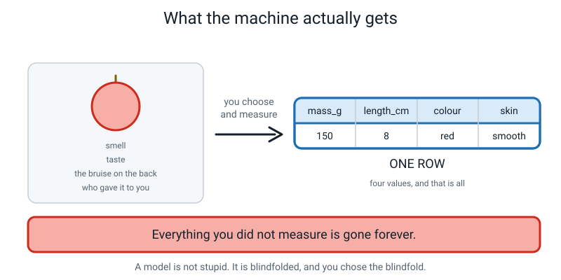
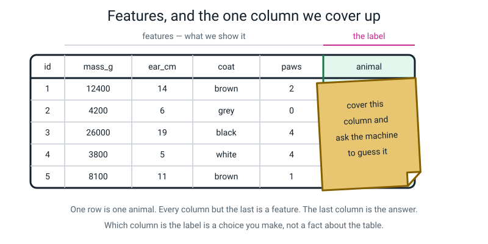
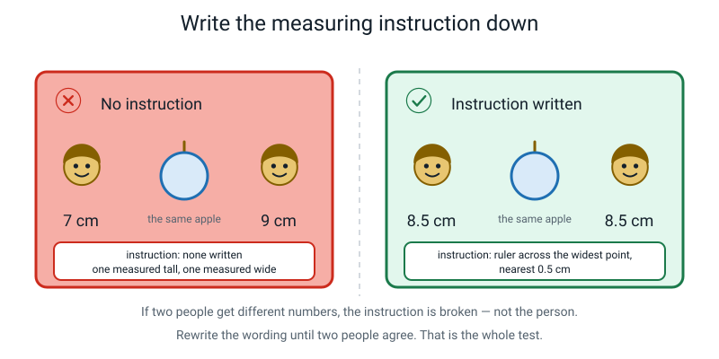
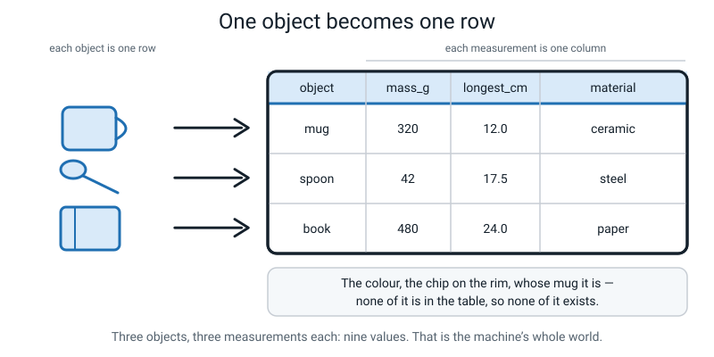
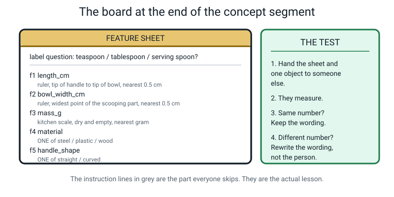
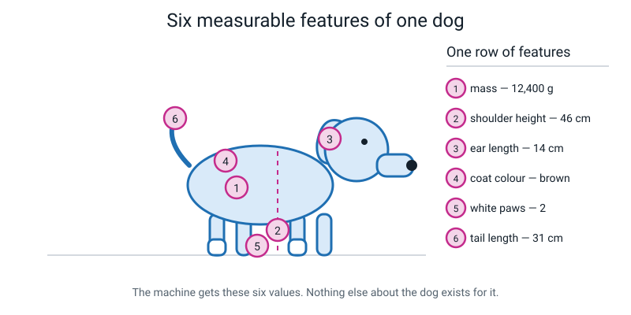

# Week 11 — How a Machine Describes Your Dog

[⬅ Week 10](week-10.md) · [Course Home](../README.md) · [Week 12 ➡](week-12.md) · [Student Guide](../student-guide/week-11.md) · [Workbook](../workbook/week-11.md)

---

## 📋 At a Glance

| | |
|---|---|
| **Duration** | 70 minutes |
| **Type** | 🟦 Teach — a new idea, then hands on objects |
| **Big idea** | A feature is one measured description of one example, and the label is the answer you want the machine to give back. |
| **New vocabulary** | feature · feature table · measuring instruction · class |
| **Materials** | A ruler (30 cm) · a kitchen scale, or a phone scale app · a book or box to hide an object behind · **three household objects that are easy to confuse** (three spoons of different sizes is ideal) · one apple or similar piece of fruit · pencil · workbook |
| **Tech needed** | **None.** A phone scale app is optional. |
| **Prep time** | 12 minutes the night before, 5 minutes on the day |

> **💡 Try this:** the single best object set for this lesson is **three spoons** — a teaspoon, a dessert spoon and a serving spoon. Three things that are obviously different but annoyingly hard to describe apart is exactly the difficulty you want. Three objects that are wildly different (a spoon, a book, a shoe) make the lesson too easy and it teaches nothing.

---

## 🎯 Lesson Objectives

By the end of the lesson the student can:

1. **Turn a physical object into a row of measured features** — take a real thing off the table and write it as numbers and words in a table.
2. **Write a measuring instruction precise enough that a different person gets the same number.** Tested, not claimed: you re-measure and the numbers match.
3. **Point at any table and identify which columns are features and which is the label.**
4. **Explain why a machine cannot use a description that has not been measured.**

Observable evidence: three completed rows with four measurements each, four written measuring instructions, and at least three of your four re-measurements matching theirs.

---

## 🧑‍🏫 What YOU Need to Know First

This is the week where the course stops being about ideas and starts being about tables. Everything from here to Week 36 sits on top of what is in this section. Read all of it.

### 1. The whole idea in one picture

A machine never meets your dog. It never meets the apple, the spoon or the text message either. It meets a **row**.


*Figure 11.1 — Everything you did not measure is gone forever.*

You look at an apple and take in millions of things per second — the smell, the exact shade, the bruise on the back, who gave it to you, the fact that it is slightly warm. Then you choose four things to measure. Those four things become the machine's entire universe for that apple. Everything else is not "less important" to the machine. It does not exist.

> **Feature** — one measured description of one example. One column in your table.

Say the word **measured** with weight, because it is doing all the work. "Weight in grams" is a feature. "Nice-looking" is not a feature at all — not a weak one, not a vague one, *not one*. It becomes a feature only when you turn it into something countable: "number of bruises", or "a 1-to-5 score that three people agreed on".

### 2. The missing-person poster — the analogy that makes it stick

A police poster cannot show the person. It shows *chosen* features: height 165 cm, hair black, blue jacket, aged about 30. Everyone in the city now knows exactly four things.

If the poster leaves off "walks with a limp", then **nobody in the whole city can use the limp**, no matter how obvious it would be in real life. The limp is not hidden. It is not there.

The machine's feature list is the poster. Whatever you leave off does not exist. This analogy is worth using out loud because it also carries the *responsibility*: someone chose what went on the poster.

### 3. The label, and why it is a choice

> **Label** — the answer you want the machine to output. In your table it is one special column, the one you cover up.

The label is not a different *kind* of thing from a feature. It is a column, exactly like the others. What makes it the label is **your decision** that this is the one you will hide and ask the machine to reconstruct.

Here is the proof that it is a decision. Take one table of school days:

| sleep_hours | screen_minutes | homework_minutes | mood_1to5 | felt_tired |
|---|---|---|---|---|
| 8.5 | 40 | 45 | 4 | no |
| 5.0 | 180 | 20 | 2 | yes |
| 7.0 | 90 | 60 | 4 | no |
| 5.5 | 150 | 30 | 2 | yes |

Ask "will I feel tired tomorrow?" and `felt_tired` is the label; the other four are features. Ask "what will my mood be?" and `mood_1to5` becomes the label — and `felt_tired` demotes itself to being just another feature.

**Same table. Different question. Different label.** This trips up a lot of adults, so expect to say it twice.


*Figure 11.2 — One row is one animal. The last column is the answer, and which column that is, is a choice you make.*

The flashcard analogy is the one 11-year-olds take instantly: a flashcard has a front (a picture of a plant) and a back (`fern`). You study by looking at the front and trying to produce the back. That is exactly what a machine learning system does, a few million times, without getting bored.

### 4. Class — the fourth word, and the smallest one

> **Class** — one of the possible answers the label is allowed to be.

If the label is `animal` and the only allowed answers are `dog` and `cat`, then there are two classes: dog and cat. If the label is `fruit` and the allowed answers are apple, orange and banana, there are three classes.

That is all "class" means this week. It matters for one reason, and you should say this reason out loud because it is genuinely startling:

> **A machine can only ever answer with a class you gave it.** Show a three-class fruit model a lime and it will say "orange", confidently, forever. There is no lime box. It is not being stupid; you did not give it the word.

Do not go further than that. The full consequences arrive in Weeks 13 and 16.

### 5. Measuring instructions — the part everybody skips, and the actual lesson

This is the heart of the week, and it is the bit that feels like admin and is not.

> **Measuring instruction** — the exact written wording that says how a feature is measured, so that two different people get the same number.

Here is why it matters. Two people measure the same apple. One says 7 cm, one says 9 cm. Neither of them is bad at measuring. One measured top to bottom, one measured across the widest point.


*Figure 11.3 — If two people get different numbers, the instruction is broken — not the person.*

Fix the sentence, not the person. `length_cm` becomes `ruler across the widest point, nearest 0.5 cm`, and now both people get 8.5 cm.

The rule to enforce all lesson: **if `length_cm` means "longest side" in row 3 and "widest side" in row 7, the column is nonsense even though it looks perfectly fine.** A table full of tidy numbers measured inconsistently is worse than no table, because it looks trustworthy.

This is also the only genuinely testable objective in the week. The test is not "does the instruction sound good". The test is: hand the sheet and one object to a different person, and see if their number matches. If it doesn't, rewrite the wording and test again. That loop *is* the activity.

### 6. The feature table

> **Feature table** — a table where every row is one example, most columns are features, and exactly one column is the label.


*Figure 11.4 — Three objects, three measurements each: nine values. That is the machine's whole world.*

Three rules that make a feature table honest. Say all three; the student will break all three.

1. **One row = one example.** If the same apple appears twice, you have secretly told the machine that apple matters twice as much.
2. **Every row is filled in the same way.** This is the measuring-instruction rule again, and it is the one that gets broken silently.
3. **The label column goes last, and you say which one it is out loud.** Write it down. Two weeks later, "score" could mean anything.

### 7. The two misconceptions you will meet

**Misconception 1 — "The machine sees the photo of my dog."**

It doesn't. It sees the row you built. This one is very sticky because *you* see the dog, so it feels like the input. The fix is physical: make them write the row out and **count the values in it**. Six values. That count is the machine's entire world for that dog.

If they push back with "but real AI does look at photos" — they are right, and the answer is honest and good: a photo also becomes a table, it just has thousands of columns, one per dot of colour. That is Week 23. Say "we get to that in twelve weeks" and move on.

**Misconception 2 — "A description is a feature."**

"It's quite big", "it's a nice colour", "it looks old". These are descriptions and they are not features, because two people produce different answers and one person produces different answers on different days.

The fix is a rule you can apply mechanically, and you should teach the student to apply it to themselves: **if you cannot write the measuring instruction, it is not a feature yet.** Not "it's a bad feature". Not yet a feature at all. Every adjective must become either a number with a unit, or one word chosen from a short fixed list.

### 8. How deep to go, and where to stop

**Go this far:** feature, label, class, measuring instruction, feature table. Objects into rows. The re-measure test.

**Stop before:**
- **Which features are good.** That is next week, and it is a whole lesson with counting in it. If the student says "the colour one is useless", say: "Hold that thought — that's exactly next week's lesson, and we're going to settle it with numbers instead of opinions." Write their guess in the margin so they can check it in seven days.
- **Classification vs regression.** Week 13. Do not use those words. If the label happens to be a number in one of their examples, that is fine — say nothing about it.
- **Training a model.** Week 15. Nothing today involves a machine learning anything. Today is entirely about building the thing you will later hand to a machine.

If you understood *"the machine only ever gets the row, and the row is only as good as the sentence that says how to measure it"*, you are ready.

---

## 🧰 Prep Checklist

**12 minutes the night before**

- [ ] **Choose your three objects.** Three spoons of different sizes is the recommendation. Alternatives that work well: three drinking bottles, three shoes, three books, three coins of different values. **Do not** pick three wildly different things.
- [ ] **Choose your hidden object** for Describe It Down the Phone. It must be small, ordinary, and not obvious from its weight alone. Good: a stapler, a mug, a TV remote, an orange, a pair of scissors, a roll of tape. Bad: anything the student has seen you carrying in.
- [ ] **Test your scale.** Weigh one object. If you are using a phone app, open it now and check it actually works — many of them do not.
- [ ] **Measure one object yourself, twice, two different ways** (longest side and widest side) so you have felt the disagreement in Figure 11.3 personally.
- [ ] Print workbook pages 11.1–11.6.
- [ ] Write the fixed colour list on a card: **red · orange · yellow · green · blue · black · white · grey · brown · silver**. You will need it in three places today.

**5 minutes on the day**

- [ ] Objects on the table, **covered with a cloth or a box** until the Hook is done.
- [ ] Hidden object already behind the book, before the student sits down.
- [ ] Ruler, scale and the colour-list card within reach.
- [ ] One apple on the table where it can be seen.

**Fallback if something fails**

| If this fails | Do this instead |
|---|---|
| No kitchen scale, no phone app | Replace `mass_g` with a three-level category: `lighter than a full water bottle / about the same / heavier`. State the water bottle as the measuring instruction: "a 500 ml bottle, filled to the top". Everything else in the lesson works identically. |
| No ruler | Use a sheet of A4 as the ruler: it is 29.7 cm × 21.0 cm. Fold it in half repeatedly to get 14.85, 7.4, 3.7 cm marks. Genuinely fine, and the improvisation is on-theme. |
| Only two suitable objects | Two rows is enough for the class activity. Add the third at home. Do **not** substitute a wildly different third object just to have three. |
| The student refuses to guess in the phone game | Swap roles immediately — you guess first, out loud, doing it badly on purpose so the format is clear and low-stakes. |
| No second adult available for the re-measure | **You** are the second person. That is the design. The homework re-measure is the one that needs an extra adult, and if there genuinely isn't one, they can re-measure their own objects 24 hours later without looking at their first numbers. Not as good, still useful. |

---

## ⏱️ The Lesson, Minute by Minute

| Segment | Minutes | Running total | What happens |
|---|---|---|---|
| 🪝 Hook — The Missing Backpack Poster | 8 | 8 | Vague description fails; measured description works |
| 🧠 Concept — Feature, Label, Class, Instruction | 18 | 26 | The four words, with the dog and the flap |
| 🔍 Worked Example Together — Build the Dog Row | 14 | 40 | One animal into six features, then a two-row table |
| 🎲 Activity — Phone Game, then Three Real Rows | 20 | 60 | Describe It Down the Phone, then measure for real |
| 🔑 Wrap & Assign | 10 | 70 | Three checks, the takeaway, homework |

---

### 🪝 Hook — The Missing Backpack Poster (8 minutes)

**Do this:** Objects stay covered. Have a pen and a blank sheet ready. Sit down opposite the student.

**Say this:**

> "Your school bag has gone missing. I'm going to make a poster and stick it up around the school, but here's the problem — I can't put a picture on it, because I don't have one. All I can put is words. So tell me what to write. Go."

Write down *exactly* what they say. Word for word, including the vague bits. Do not correct anything yet. You will get something like:

> "It's blue. It's quite big. It's got a bottle on the side. It looks a bit old."

**Say this:**

> "Right. I've written exactly what you told me. Now I'm going to be a stranger reading this poster in the lost property room, and there are forty bags in front of me. Let's see how I get on.
>
> 'Blue.' — Okay, there are eleven blue bags. 'Quite big.' — Bigger than what? Compared with the tiny ones, most of them are big. 'A bottle on the side.' — Now, that one I can actually use. That's a real one. 'Looks a bit old.' — I have no idea what to do with that. Every bag in here looks a bit old to somebody."

Now the pivot. Cross out the useless lines on the poster in front of them, and be a bit dramatic about it.

> "Look at what survived. Out of four things you told me, exactly one was usable. And here's the thing — you weren't being vague on purpose. That's genuinely how people describe things. It works perfectly between two humans, because I can ask you 'big how?' and you'd show me with your hands.
>
> A machine can't ask. It gets the poster and that's it. So today we're going to learn how to write the version of that poster that actually works — and the technical name for one line on that poster is a **feature**."

Write it on the board:

> **Feature** — one measured description of one example.

> "Notice the word *measured*. 'Blue' can be a feature, if we agree on a fixed list of colours you're allowed to pick from. 'Quite big' cannot be a feature at all — not a bad one, not a weak one. Not one. It becomes a feature the second you turn it into 'height in centimetres, floor to the top of the strap'."

**Ask this:**

| Ask | Answer you want | If they say something else |
|---|---|---|
| "Which of your four survived?" | The bottle on the side. | If they defend "blue" — good, accept it *conditionally*: "Blue works if I give you a list of ten colours to choose from. Would you and I both say 'blue' or would one of us say 'navy'?" That question is the whole lesson in miniature. |
| "How do we fix 'quite big'?" | Give it a number and a unit. | If they say "say 'very big' instead" — the natural answer. Reply: "How big is very?" Let the silence do the work. |
| "Why can't a machine just ask me what I meant?" | It only gets the poster; there's nobody to ask. | If they say "it could ask" — fine, and honest: "Some can now. But it can only ask about what you wrote down. It can't ask about the bit you left off, because it doesn't know it's missing." |

---

### 🧠 Concept — Feature, Label, Class, Instruction (18 minutes)

**Do this:** Put Figure 11.5 (the board layout) on the board — the feature sheet on the left, THE TEST panel on the right. Leave the instruction lines blank for now; you fill them in as you go.


*Figure 11.5 — What the board looks like by minute 26. The grey instruction lines are the part everyone skips, and they are the actual lesson.*

**Say this — part 1, the feature:**

> "Here's an apple." *(Hold it up.)* "Right now you can see about a million things about it. The exact shade. Whether it's cold. That little mark near the stem. Whether it smells nice. Whether you want to eat it.
>
> Now I'm going to measure four things: its mass in grams, its longest side in centimetres, one colour word from a fixed list, and whether the skin is smooth or bumpy. Those four things go in a row.
>
> And that row is now the entire apple, as far as a machine is concerned. Not 'mostly the apple'. Not 'the important parts of the apple'. **The apple.** The smell isn't less important to the machine. It doesn't exist. Nobody wrote it down, so it's gone."

Point at Figure 11.1 on the wall or in the book.

**Say this — part 2, the label:**

> "Now — one of the columns is special, and it's special only because we say so.
>
> Suppose I've got a table of animals: mass, ear length, coat colour, number of white paws — and then one more column that just says `dog` or `cat`. That last column is the **label**. It's the answer I want the machine to give back to me.
>
> And here's the way to picture it." *(Take a scrap of paper and physically lay it over the last column of a table you've drawn.)* "I cover the answer up, I show the machine the rest of the row, and I say: go on then. Guess. That's a flashcard. Front of the card is the features, back of the card is the label, and that is genuinely all machine learning is doing — a few million times, without getting bored."

Write it up:

> **Label** — the answer you want the machine to output. It is the one column you cover up.

> "Now the bit that catches adults out. The label isn't a special *kind* of column. It's just whichever one I decided to cover. If I take the same animal table and instead cover up `mass`, and ask the machine to guess how heavy a brown four-pawed dog with 14 cm ears probably is — now `mass` is the label and `dog` is just a feature. Same table. Different question. Different label. **The label is a choice, not a fact about the table.**"

**Say this — part 3, class:**

> "One small word and then the big one. If the label can only be `dog` or `cat`, those are the two **classes** — the boxes the answer is allowed to go in.
>
> And this matters more than it sounds. A machine can only ever answer with a class you gave it. If I build something with two boxes, dog and cat, and I show it a rabbit — it will say 'cat'. Confidently. Every single time. It's not being thick. There is no rabbit box, and I'm the one who didn't make one."

**Say this — part 4, the measuring instruction:**

> "Last one, and it's the one that actually decides whether any of this works.
>
> Imagine you and I both measure this apple and write down `length_cm`. You say 7. I say 9. Now — which of us measured it wrong?"

Let them answer. The answer you want is "neither".

> "Neither. You measured top to bottom. I measured across the widest bit. We both did it perfectly. The problem isn't us — **the problem is that nobody wrote down what `length_cm` means.**
>
> So the fix isn't to be more careful. The fix is to write the sentence: *ruler across the widest point, nearest half a centimetre*. Now we both get 8.5 and the column means something. That sentence has a name: a **measuring instruction**."

Write it up:

> **Measuring instruction** — the exact wording that says how a feature is measured, so that two different people get the same number.

> "And here's the test, and I want you to hold me to it for the rest of the year: **an instruction is only good if a different person, following it, gets your number.** Not if it sounds good. Not if you think it's clear. If they get a different number, you don't argue with them — you go and rewrite the sentence."

**Ask this:**

| Ask | Answer you want | If they say something else |
|---|---|---|
| "Is 'it's heavy' a feature?" | No — until it becomes grams, or a fixed comparison. | If they say yes, hold up two objects: "This one's heavy. So's this one. Which is heavier?" Then: "Now in grams." |
| "Same animal table — I cover up `mass` instead. What's the label now?" | `mass`. And `dog`/`cat` is now just a feature. | If they insist the label is always the last column, redraw the table with `mass` moved to the end. "Did the table change, or did my question change?" |
| "I built a dog-or-cat machine and showed it a rabbit. What does it say?" | Dog or cat. It has no rabbit box. | If they say "it says it doesn't know" — lovely instinct, and wrong for now: "It would have to have a box called 'I don't know', and I never made one." |
| "Two people measured the same apple and got 7 and 9. Who was wrong?" | Neither. The instruction was missing. | If they blame one of the people, push: "What if they both re-measured really carefully and got 7 and 9 again?" |

---

### 🔍 Worked Example Together — Build the Dog Row (14 minutes)

**Do this:** Open the workbook to page 11.2 and put Figure 11.6 where you can both see it.


*Figure 11.6 — The machine gets these six values. Nothing else about the dog exists for it.*

**Say this:**

> "Here's a dog. Somebody's actual dog. And here are six things somebody measured about it: mass 12,400 grams, shoulder height 46 centimetres, ear length 14 centimetres, coat colour brown, white paws 2, tail length 31 centimetres.
>
> Six numbers and one word. That's the row. Now I want you to notice three things about it."

Work through these three with them, out loud. This is the substance of the segment.

**Thing 1 — every single one has a hidden instruction.** Take them one at a time:

- *mass 12,400 g* — measured how? Standing on a scale, or held by a person standing on a scale and subtracting? Wet or dry? Before or after dinner?
- *shoulder height 46 cm* — from the floor to *where* exactly? The top of the shoulder blade is the standard, but if you measure to the top of the head you get a completely different number for the same dog.
- *ear length 14 cm* — from where the ear joins the head, or from the top of the head? Ear flat, or ear standing up?
- *coat colour brown* — brown out of which list? If the list is {black, brown, white} this dog is brown. If the list is {black, chocolate, tan, cream, white} it might be tan.
- *white paws 2* — does a paw that is half white count?
- *tail length 31 cm* — with or without the fur on the end?

> "Every single one. Six features, six sentences you'd have to write down before anyone else could reproduce your numbers. And this is why the boring grey lines on our board are the actual lesson."

**Thing 2 — what's missing, and who decided.** Ask them to name three things about a dog that are *not* on this list. They will say: breed, name, age, whether it's friendly, its bark, its smell, whether it likes you.

> "Right. None of those exist. And notice — I didn't lose them by accident, and they weren't unimportant. **Somebody chose six things and everything else fell off the poster.**"

**Thing 3 — build a second row and the table appears.**

Have the student invent a cat and fill in the same six columns. Anything plausible is fine; here is a model:

| id | mass_g | shoulder_cm | ear_cm | coat | white_paws | tail_cm | **animal** |
|---|---|---|---|---|---|---|---|
| 1 | 12,400 | 46 | 14 | brown | 2 | 31 | **dog** |
| 2 | 4,200 | 24 | 6 | grey | 0 | 26 | **cat** |

> "Now we've got a **feature table**. Two rows, because two animals. Six feature columns, because six measurements. And one more column on the end — `animal` — which is the label, because that's the one I'm going to cover up and ask about.
>
> Cover it with your hand. Look at row 1 without the answer: 12,400 grams, 46 centimetres tall, brown, two white paws. Could you guess dog? Yes, easily. Could a machine? That's what the rest of this course is about."

**Do this:** Now break it on purpose. This is the most valuable 90 seconds of the lesson.

> "Add a third row for me. A Chihuahua. Mass about 2,000 grams, shoulder 20 centimetres, ears 8 centimetres, coat tan, no white paws, tail 15 centimetres — and the label is `dog`.
>
> Now look at rows 2 and 3. The cat is *bigger and heavier than the dog*. Do you see what just happened? Nothing in this table is wrong. Every number was measured properly. And the table just got much harder."

Do not solve this. Let it sit. It is the honest state of the world and it comes back in Weeks 12, 16 and 21.

**Ask this:**

| Ask | Answer you want | If they say something else |
|---|---|---|
| "Name three things about a dog that aren't in the row." | Breed, age, name, temperament, bark, smell… | Any answer works. Follow with the important one: "Are those unimportant? Or did somebody just not write them down?" |
| "Write the measuring instruction for `ear_cm`." | Something like: "ruler, from where the ear joins the head to the tip, ear held flat, nearest 0.5 cm." | If they write "measure the ear", ask "from where to where?" and wait. Do not supply it. |
| "The cat outweighs the Chihuahua. Is the table broken?" | No. The world is just like that. | If they want to delete the Chihuahua, say: "You can. But real chihuahuas will still exist when your machine meets one." |
| "Which column is the label, and how do you know?" | `animal`, because it's the one we chose to cover up. | If they say "because it's last", test them: move it to the front and ask again. |

---

### 🎲 Activity — Phone Game, then Three Real Rows (20 minutes)

Full instructions in the next section. In the lesson flow:

- **Minutes 0–8:** Describe It Down the Phone, two rounds, roles swapped.
- **Minutes 8–20:** Three objects, four features, four written instructions, and the re-measure test.

---

## 🎲 The Activity, In Full

### Part A — Describe It Down the Phone (8 minutes)

**Setup**

Hide one small ordinary object behind a book or in a box. The student cannot see it.

**The rules — read them out**

> "I've got an object behind this book. You have to work out what it is. You can ask me questions, but **only about things I could measure.** Specifically, you're allowed four kinds of question:
>
> - What is its **mass in grams**?
> - What is its **longest dimension in centimetres**?
> - How many **separate parts** does it have?
> - What **colour** is it, from this list?" *(hand them the colour card)*
>
> "If you ask me anything else — is it nice, is it useful, what's it for, is it heavy — I will say **'not measurable'** and it costs you a question. You get five questions and then one guess."

Play it. Answer only in numbers and colour words. Be strict about refusing the unmeasurable ones; the refusals are the teaching.

**Then swap.** They hide something, you guess. Ask two deliberately unmeasurable questions early ("is it interesting?") so they get to enforce the rule on you. Students remember rules they got to enforce.

**Debrief — 90 seconds, do not skip:**

> "Which question was the most useful, and why?" *(Usually `parts_count` or `longest_cm` — they split the possibilities most.)*
>
> "Which question did you want to ask and weren't allowed?" *(Write their answer down. Then:)* "Could we turn that into a measurable one?"

Record the whole thing on workbook page 11.1.

### Part B — Three Objects Into Three Rows (12 minutes)

**Materials:** the three confusable objects, ruler, scale, colour card, workbook page 11.3.

**Step 1 — write the label question first (1 min).** At the top of the page, before touching anything:

```
label question: teaspoon / dessert spoon / serving spoon?
```

Insist on this order. Deciding what you are asking before you decide what to measure is a habit worth building now.

**Step 2 — write the four measuring instructions (4 min).** Not the measurements. The *instructions*. This is the part they will want to rush.

```
FEATURE SHEET
label question: teaspoon / dessert spoon / serving spoon?

f1  mass_g        kitchen scale, dry and empty, nearest gram
f2  longest_cm    ruler, tip of handle to tip of bowl, nearest 0.5 cm
f3  parts_count   count the pieces that come apart without breaking it
f4  colour        ONE of: red / orange / yellow / green / blue / black /
                  white / grey / brown / silver
```

Make them write all four in their own words. Then read each one back and ask the killer question: *"If I followed this exactly, would I get your number?"*

**Step 3 — measure (5 min).** Fill the table. Twelve values, no blanks.

| id | mass_g | longest_cm | parts_count | colour | **label** |
|---|---|---|---|---|---|
| 1 | | | | | |
| 2 | | | | | |
| 3 | | | | | |

**Step 4 — the re-measure test (2 min).** This is the assessed part.

Take **one** object and **their feature sheet**. Turn their table face down so you cannot see their numbers. Measure all four features yourself, following their written instructions to the letter — and be a *literalist*. If the instruction says "measure the length", measure the shortest thing you can defend calling a length. Do not be helpful.

Compare. For every disagreement:

> "Your instruction let me do it a different way. Which sentence do we need to change?"

Rewrite the wording — **not the number** — and re-test that one feature.

**What "finished" looks like**

- Label question written before any measuring happened.
- Four measuring instructions, in the student's own handwriting, each with a unit and a precision ("nearest 0.5 cm") or a fixed list.
- Twelve measurements, no blanks.
- At least **three of your four** re-measurements match theirs.
- Any instruction that failed has been rewritten and re-tested.

### Variation — easier

- Drop to **two objects and three features** (mass, longest, colour). Six values.
- **You write the first instruction** as a model, out loud, thinking through where the ambiguity is. They write the other two.
- Do the re-measure test on one feature only, and pick the one most likely to disagree (`longest_cm` almost always does).

### Variation — harder

Three extensions, in order of difficulty:

1. **The hostile re-measure.** Tell them in advance: "I am going to try as hard as I can to follow your instructions correctly and still get a different number. Write them so I can't." Then genuinely try. This is enormous fun and produces the best instructions of the year.
2. **The fifth feature they have to invent.** "Add one more feature that separates these three objects, that I haven't suggested, and that you can write an instruction for." Good answers: `bowl_depth_mm`, `handle_width_cm`, `does_it_stand_upright` (yes/no), `number_of_holes`.
3. **The impossible feature.** "Name one thing about these objects that genuinely matters and that you cannot write a measuring instruction for." Good answers: which one is nicest to eat with, which one is oldest, which one belongs to whom, how comfortable the handle is. Then ask the follow-up: *is it impossible because nobody has invented the instrument, because it is private, or because it is a feeling nobody can score?* That distinction is real and useful, and it comes back in Week 31.

---

## ❓ Questions Students Ask This Week

**"Why can't I just show the machine a photo?"**

You can — and a photo is a table too. It just has thousands of columns instead of four, one for each tiny dot of colour in the picture. Somebody still had to decide that a photo becomes a grid of numbers, and how big the grid is. We spend Weeks 23 to 26 taking a photo apart into exactly that table. So the answer is: showing it a photo doesn't escape the table, it just gives you a very wide one.

**"How many features should I use?"**

There is no formula, and this genuinely bites professionals. More features are not automatically better — extra useless columns actively hide the good ones, and you'll see that with numbers next week. The working answer for now: start with four or five that you can write honest instructions for, and add more only when you can say what job the new one is doing.

**"What if two objects have exactly the same features?"**

Then your machine cannot tell them apart, and that is not a bug you can fix with cleverness — it is a fact about the table you built. Your options are: add a feature that does separate them, or accept that these two will always be confused. Real systems hit this constantly. It is one of the honest limits of the whole approach.

**"Who decides which features go in?"**

A person. Always. That is worth sitting with, because it means every feature table contains somebody's opinion about what matters, wearing the costume of a number. When a hiring system measures "which university you went to", that column also quietly measures family money and where you grew up, and nobody can see that in the column name. Week 31 is entirely about this.

**"Can a machine measure something like kindness, or how happy someone is?"** *(Answer this one with a real "nobody knows".)*

**Nobody knows for sure, and this is genuinely argued about by serious people.** Here is what is true: you can build a column that *correlates* with happiness — how often someone smiles, what words they use, how they rate themselves out of ten. Those columns are real and measurable. What nobody can settle is whether that column is measuring happiness or just measuring smiling. Some researchers think all human feelings will eventually be measurable, given good enough instruments. Others think the question is confused — that "happy" isn't a hidden quantity waiting to be found, the way mass is. This isn't a gap in the course; it's a live disagreement, and you should know that when someone shows you a "happiness score", a human chose what it counts.

**"Does the machine know what a dog is?"**

No. It knows that certain combinations of numbers usually come with the word `dog` attached. It has never seen a dog, never touched one, doesn't know they are alive. If you retrained it with the word `dog` swapped for `zebra` everywhere, it would work exactly as well and be exactly as confident.

**"Why does the label have to be the last column?"**

It doesn't. A computer doesn't care where it is. It's a habit, and it exists because a table gets read weeks after it was made and future-you will not remember which column was the answer. Same reason you write the date on your homework.

---

## ⚠️ Where This Lesson Goes Wrong

| What happens | Why | What to do right now |
|---|---|---|
| Measurements get written before the instructions | Measuring is fun and writing sentences is not | Physically cover the table part of the page with a sheet of paper until all four instructions are written. It sounds heavy-handed and it works. |
| Instructions are written *after* measuring, to match the numbers already there | It feels efficient and it destroys the point | If you catch this, re-measure one object together with the instruction as written. The mismatch does the arguing for you. |
| Every instruction is a paraphrase — "measure the mass" | They genuinely think that is the instruction | Ask three questions in a row: "With what?" "In what units?" "Rounded to what?" All three have to be in the sentence. |
| The re-measure matches perfectly on all four | You unconsciously measured the way you knew they had | Deliberately be a literalist. Read only what is written. If it says "the length", pick the shortest defensible length. You are simulating a stranger, not being fair. |
| "Colour" starts producing "bluey-green" and "sort of tan" | Colour feels obviously easy, so nobody constrains it | This is why the fixed card exists. Ten colours, pick one, no compound words. If they hate the answer, that is useful — say "that's what a fixed list costs you." |
| The student picks three objects that are nothing alike | Easier, and it feels like progress | Push back once: "If I told you it weighs 2 grams, you'd know instantly. Where's the difficulty?" Swap to three of the same kind of thing. |
| They confuse label and feature whenever the label is a word and the features are numbers | Words look like answers, numbers look like data | Show it directly: build a table where a feature is a word (`colour`) and the label is a number (`mass_g`). Ask which is which. |
| "This isn't AI, it's just measuring stuff" | It really doesn't feel like AI | Agree completely, then: "Correct. And in Week 17 you'll train a real model, and the thing that decides whether it works isn't the model. It's this table. Every professional will tell you the same thing." |

---

## 🧭 Differentiation

### If the student is struggling

**Cut:** the phone game to one round (you hide, they guess). Cut to two objects and three features. Cut the third measuring instruction — you write it.

**Reteach:** the sticking point is almost always *feature vs description*, and it is fixed by sorting, not explaining. Write eight phrases on scraps of paper and have them sort into two piles, **A MACHINE CAN USE THIS** and **NOT YET**:

`weighs 340 g` · `quite big` · `18.5 cm long` · `nice colour` · `3 separate parts` · `looks expensive` · `colour: blue` · `feels nice to hold`

Then take one from the wrong pile and fix it together. Sorting is much easier than generating, and once the two piles feel obvious, generating gets easier.

**Reduce:** accept an instruction that names the tool and the unit, even if it doesn't specify rounding. `ruler, in cm, longest side` is a pass at this level.

### If the student is flying

1. **The hostile re-measure** (see Variation — harder). Best single extension available.
2. **"Write the measuring instruction for `age_years` of a dog you've just met."** This is genuinely hard and there is no clean answer. Vets estimate from teeth wear. It is an *estimate*, which means the column contains a guess dressed as a number. Great conversation.
3. **Two labels, one table.** Take their spoon table and ask: "Give me a second question this same table could answer, with a different column as the label." Then: "Which of the two questions is harder for a machine, and why?"
4. **The poster problem.** "You get exactly three features to tell all three objects apart. Which three, and prove it." They must show that no two rows are identical using only those three columns. This is a real proof, at an 11-year-old's scale.

### If the student won't engage today

Do the phone game only, and play it competitively.

Set it up as a proper contest: you each hide three objects, best guesser wins, five questions each. That is 12 minutes, it is genuinely fun, and it delivers objective 4 (why an unmeasured description is useless) completely, because they will *feel* the frustration of not being allowed to ask "what's it for?"

Then get one thing on paper before you stop — a single sentence: *"A machine can only use a description if…"*. One sentence is a successful lesson on a bad day. Move the three rows to tomorrow; the homework already covers five objects and can absorb it.

---

## ✅ Assessing Understanding

Three checks, five minutes, exact wording below.

**Check 1 — feature vs description (spoken, fast)**

> "I'm going to say five things about this apple. Say FEATURE or NOT YET after each one. Weighs 150 grams. Tastes nice. Colour: red. Quite round. 8 centimetres across."

*Good answer:* FEATURE, NOT YET, FEATURE, NOT YET, FEATURE — at speed, without hedging. Getting "quite round" wrong is forgivable; getting "tastes nice" wrong is not.

**Check 2 — the label is a choice (spoken)**

> "Here's a table: mass, ear length, coat colour, animal. Which column is the label?" *(They say `animal`.)* "Right. Now I want to build something that guesses how heavy an animal is from what it looks like. Which column is the label now?"

*Good answer:* `mass`. Full marks if they also notice that `animal` has become a feature. If they say "you can't do that, the label is `animal`" — that is the misconception, and the fix is to ask "what question am I asking now?"

**Check 3 — the instruction test (spoken)**

> "You wrote: *ruler, tip of handle to tip of bowl, nearest 0.5 cm.* How would we know if that instruction is any good?"

*Good answer:* "Give it to someone else with the object and see if they get my number." Anything about *testing it on a person* is full marks. If they say "it looks clear" or "it sounds right", prompt once: "How would you *check*?"

### Mastery scale for this week

| Level | What it looks like |
|---|---|
| **1 — Not yet** | Still offers adjectives as features. Cannot say what a label is without looking it up. Instructions are paraphrases ("measure the length"). |
| **2 — Emerging** | Sorts features from descriptions correctly when prompted. Writes instructions with a unit but no tool or precision. Thinks the label is always the last column. |
| **3 — Secure** | Turns an object into a row unprompted. Writes instructions naming tool, unit and precision. Identifies features and label in any table, and knows the label is a choice. **This is the target.** |
| **4 — Strong** | Their instructions survive a genuinely literal re-measure. Spots ambiguity in someone else's instruction before testing it. Can restate the same table under a different label. |
| **5 — Exceptional** | Names something important about an object that cannot be measured, and correctly says *why* — no instrument exists, it's private, it's in the future, or it's a feeling nobody can score. Sees that choosing the features is itself a decision somebody made. |

---

## 📤 Homework to Assign

**Say this:**

> "One job, in two halves, about fifty minutes.
>
> **First half — the kitchen table.** Workbook page 11.4. Go into the kitchen and pick five objects. They have to be **similar enough to be confusable** — five spoons, or five bottles, or five mugs. Not a spoon, a fridge and a banana. Then build a table with five feature columns plus the label column, and — this is the part that gets marked — **write the measuring instruction for every single column before you measure anything.** Five instructions, five objects, twenty-five measurements, no blanks.
>
> **Second half — the test.** Workbook page 11.5. Take your feature sheet and **one** of your objects to an adult. Don't tell them your numbers. Ask them to measure all five features using only what you wrote. Then write down their five numbers next to yours, and for every one that doesn't match, write the new wording you'd use to fix it. You are not trying to score five out of five. You're trying to find out which of your sentences was sloppy, and a mismatch is a *result*, not a failure.
>
> And page 11.6 if you've got ten minutes left — six vague descriptions to turn into real measuring instructions."

**Workbook pages:** 11.1, 11.2 and 11.3 done in class; **11.4, 11.5, 11.6** at home.

**Expected time:** 25 min for the table · 15 min for the adult test · 10 min for page 11.6. About 50 minutes.

---

## 🔑 Answer Key

### Page 11.1 — Describe It Down the Phone (in class)

There is no fixed answer; mark the *record*. A complete page shows:

- Five questions written down, all four allowed types used at least once.
- The answers received.
- At least one question that was refused as "not measurable", with the refused wording recorded.
- A final guess, right or wrong.
- One sentence: which question was most useful and why.

**Model debrief answers:**
- *Most useful question:* usually `parts_count` or `longest_cm`, because they cut the possibilities furthest. Mass tends to be least useful early, because most household objects are somewhere between 50 g and 500 g.
- *A refused question, converted:* "Is it useful?" → cannot be converted, it is an opinion. "Is it sharp?" → **can** be converted: `does it have an edge that cuts paper, yes or no`. "Is it old?" → not directly, but `has visible rust or wear, yes/no` captures some of it.

### Page 11.2 — Name the features and the label

For each system, list at least four plausible features and exactly one label, and say what the classes are (the answers the label is allowed to be).

**(a) An app that decides whether a photo contains a face.**
Features: `image_width_px`, `image_height_px`, `brightness_average`, `number_of_skin_toned_regions`, `has_two_dark_blobs_above_a_horizontal_line`.
**Label:** `contains_face`. **Classes:** yes, no.

**(b) A music app predicting whether you'll skip a song in the first 10 seconds.**
Features: `seconds_of_intro_before_vocals`, `times_you_played_this_artist_last_month`, `genre`, `time_of_day`, `is_it_already_in_your_playlist`, `tempo_bpm`.
**Label:** `skipped_in_first_10s`. **Classes:** yes, no.

**(c) A school kitchen deciding how many lunches to cook tomorrow.**
Features: `students_on_roll`, `day_of_week`, `menu_item`, `lunches_sold_same_weekday_last_week`, `school_trip_tomorrow`, `weather_forecast`.
**Label:** `lunches_to_cook`. **Classes:** here the answer is a number, so there is no short list of classes — accept "any whole number" and move on. *(Do not teach the word "regression"; that is Week 13.)*

**(d) A weather app predicting whether it will rain tomorrow.**
Features: `today_humidity_percent`, `today_pressure_hpa`, `pressure_change_over_6h`, `month`, `wind_direction`, `rained_today`.
**Label:** `rain_tomorrow`. **Classes:** yes, no.

**(e) A website suggesting a price for a used bicycle.**
Features: `age_years`, `wheel_size_inches`, `number_of_gears`, `brand`, `condition_1to5`, `has_rust`, `frame_material`.
**Label:** `price`. **Classes:** a number, not a short list.

**Marking note:** any four sensible features is full marks. What must be right is that **exactly one** column is named the label, and that every listed feature is genuinely measurable. Cross out anything like `is_it_a_good_song` or `how_nice_the_bike_looks`.

### Page 11.3 — Three objects into three rows (in class)

Model answer, using three spoons:

```
FEATURE SHEET
label question: teaspoon / dessert spoon / serving spoon?

f1  mass_g        kitchen scale, dry and empty, nearest gram
f2  longest_cm    ruler, tip of handle to tip of bowl, nearest 0.5 cm
f3  parts_count   count pieces that come apart without breaking it
f4  colour        ONE of: red / orange / yellow / green / blue / black /
                  white / grey / brown / silver
```

| id | mass_g | longest_cm | parts_count | colour | **label** |
|---|---|---|---|---|---|
| 1 | 24 | 13.0 | 1 | silver | **teaspoon** |
| 2 | 41 | 18.0 | 1 | silver | **dessert spoon** |
| 3 | 96 | 27.5 | 1 | silver | **serving spoon** |

**11.3(a) Which feature separates the three best, and what's your evidence?**
`mass_g` — 24, 41, 96. Three values with big gaps between them; the closest pair is 24 and 41, still 17 g apart. `longest_cm` also separates all three (13.0, 18.0, 27.5) and is nearly as good.

**11.3(b) Which feature was useless here, and why?**
`parts_count` — every row says 1. `colour` — every row says silver. A column where every row is the same tells you nothing at all, because it can never split the rows apart. *(Do not extend this into scoring; that is next week.)*

**11.3(c) Record of the re-measure test.**
A good page shows your four numbers next to theirs, and a rewritten sentence for every mismatch. Typical genuine mismatch, and the fix:

| feature | theirs | mine | why | rewritten instruction |
|---|---|---|---|---|
| longest_cm | 18.0 | 17.0 | I measured to where the bowl starts curving, they measured to the very tip | "ruler, tip of handle to the furthest point of the bowl, nearest 0.5 cm" |

### Page 11.4 — The kitchen feature table (homework)

The student's objects are their own. Mark against this structure. Model answer, using five drinking bottles:

```
FEATURE SHEET
label question: water bottle / flask / juice bottle / baby bottle / sports bottle?

f1 height_cm        ruler, base to top of the closed lid, nearest 0.5 cm
f2 widest_cm        ruler, widest point of the body, nearest 0.5 cm
f3 empty_mass_g     kitchen scale, empty and dry, lid ON, nearest gram
f4 material         ONE of {plastic, steel, glass}
f5 lid_type         ONE of {screw, flip, push, straw}
```

| id | height_cm | widest_cm | empty_mass_g | material | lid_type | **label** |
|---|---|---|---|---|---|---|
| 1 | 24.0 | 7.0 | 92 | plastic | screw | **water bottle** |
| 2 | 27.5 | 8.0 | 410 | steel | screw | **flask** |
| 3 | 19.0 | 6.5 | 265 | glass | push | **juice bottle** |
| 4 | 16.0 | 6.0 | 78 | plastic | screw | **baby bottle** |
| 5 | 23.5 | 7.5 | 118 | plastic | straw | **sports bottle** |

**Full marks requires:**
- Five measuring instructions, each naming **a tool or a fixed list**, **a unit**, and **a precision**.
- Twenty-five values, no blanks.
- The label column named and marked.
- Five objects that are genuinely confusable.

**Common faults and the marking response:**

| Fault | Response |
|---|---|
| `mass — weigh it` | Missing unit and precision. "In what? Rounded to what?" |
| `size — how big it is` | Not an instruction at all. Send it back. |
| `colour — blue-green` | Not from a fixed list. Compound colours are exactly what the list prevents. |
| Instruction says "lid on" but one row was clearly measured lid off | The point of the whole page. Re-measure that row; do not adjust the number. |
| Five objects that are wildly different | The table will be trivially separable and teaches nothing. Ask for five of one kind. |

### Page 11.5 — The adult re-measure

Model answer:

| feature | my number | adult's number | match? | what I'd change |
|---|---|---|---|---|
| height_cm | 24.0 | 24.0 | ✓ | — |
| widest_cm | 7.0 | 7.5 | ✗ | "widest point of the body **not counting the grip ridges**, nearest 0.5 cm" |
| empty_mass_g | 92 | 74 | ✗ | "empty and dry, **lid ON**, nearest gram" — they took the lid off |
| material | plastic | plastic | ✓ | — |
| lid_type | screw | screw | ✓ | — |

**Model closing sentence:** "Three out of five matched. Both the ones that didn't were my fault, not theirs — I knew what I meant and didn't write it down. The mass one is the worse mistake, because an 18-gram error is bigger than the difference between two of my bottles, so that column would have told the machine something false."

**Marking guidance:** a student who reports **5 out of 5 matched** should be gently interrogated. Ask: "Did they measure it, or did you show them your number first?" A perfect score on the first attempt is possible but uncommon, and it usually means the adult was being helpful rather than literal.

### Page 11.6 — Sharpen the vague descriptions

Turn each into a measuring instruction. Model answers:

| Vague | Measuring instruction |
|---|---|
| "It's quite heavy" | `mass_g` — kitchen scale, nearest gram |
| "It's a nice blue" | `colour` — ONE of {red, orange, yellow, green, blue, black, white, grey, brown, silver} |
| "It's really long" | `longest_cm` — ruler along the longest straight line between any two points, nearest 0.5 cm |
| "It's got loads of bits" | `parts_count` — count the pieces that come apart without breaking it |
| "It's old" | `visible_wear_1to3` — 1 = looks new, 2 = scratched or faded, 3 = chipped or cracked. Judged by two people, and if they disagree, take the lower. |
| "It smells nice" | **Cannot be converted honestly.** You could build `contains_perfume` (yes/no from the packaging), but that is a different thing being measured. |

**11.6(a) Which one could not be converted, and why?**
"Smells nice." The others are all facts about the object; "nice" is a fact about the person smelling it. Two people genuinely disagree and neither is wrong, so no instruction can make them agree. That is the difference between a hard measurement and an impossible one.

**11.6(b) Why does `visible_wear_1to3` need the two-person rule?**
Because it is a judgement, not a reading off an instrument. Writing "1, 2 or 3" makes it look like a measurement; the two-person rule is what makes it behave like one. Whenever you see a 1-to-5 score in a real dataset, ask who scored it and whether anyone checked.

### Lesson questions posed in the Say-this scripts

- *"Which of your four poster lines survived?"* → the one that was countable (the bottle on the side).
- *"Is 'it's heavy' a feature?"* → No. Not until it is grams, or a fixed comparison.
- *"Cover `mass` instead of `animal` — what is the label now?"* → `mass`. And `animal` is now a feature.
- *"Dog-or-cat machine, shown a rabbit?"* → It says dog or cat. There is no rabbit class.
- *"Two people measured the same apple: 7 and 9. Who was wrong?"* → Neither. The instruction was missing.
- *"Name three things about a dog not in the row."* → breed, age, name, temperament, bark, smell — and none of them are unimportant; somebody just didn't write them down.
- *"The cat outweighs the Chihuahua — is the table broken?"* → No. The world is genuinely like that, and the table is honest about it.

---

## 🔮 Next Week Preview

Next week we settle, with numbers, the argument the student has probably already started: **which of these features is actually any good?** They will meet a twelve-row fruit table with five candidate features, one of which is quietly useless and one of which is quietly disastrous — a sticker on the fruit that reads APPLE. The lesson turns on a fact that feels upside-down: a feature that scores **100%** is bad news, not good news. Before anything else they will compute the **baseline** — how well you'd do by just guessing the most common answer — because a feature that cannot beat guessing is worth nothing at all.

**Prep early:** you need either a real bowl of fruit (4 apples, 4 oranges, 4 bananas is ideal) or the printed twelve-row table from workbook page 12.2 — the printed version works completely, so do not buy fruit specially. If you do use real fruit, stick a small paper label reading APPLE, ORANGE or BANANA on each piece before the lesson; the moment the student notices those stickers is the best moment of the week. Also keep this week's kitchen table safe — Week 12's homework scores its five features against a baseline, so it needs to still exist.

---

[⬅ Week 10](week-10.md) · [Course Home](../README.md) · [Week 12 ➡](week-12.md) · [Student Guide](../student-guide/week-11.md) · [Workbook](../workbook/week-11.md) · [Orientation](00-orientation.md) · [Glossary](../../glossary.md)
